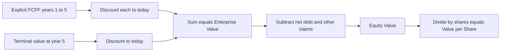
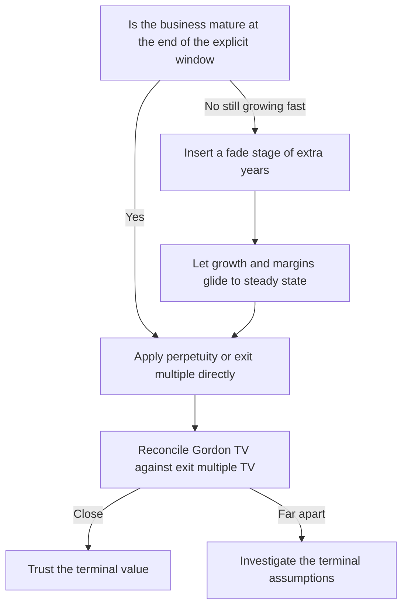
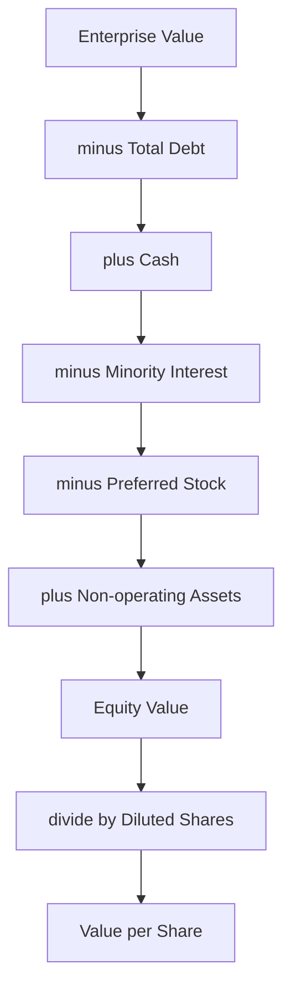
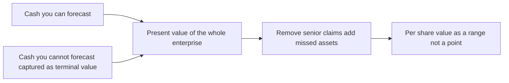

<!-- v2-deep -->

# Chapter 24 — DCF — Terminal Value and the Full Model

## 1. The Problem

By the end of the previous chapter you could forecast an unlevered free cash flow (FCFF) for each explicit year, and you had a WACC to discount it with. That is genuinely useful — but it is also, on its own, badly incomplete. Discount five years of FCFF at a plausible WACC and you will typically capture only 30–50% of a healthy company's value. The other half is still sitting on the table, uncounted.

To see this concretely before we build anything: take the dataset used all through this chapter — FCFF of ₹100, 115, 130, 142, 150 crore over five years, discounted at 10%. The present value of just those five explicit flows is ₹473.75 crore (we derive this in Section 5). But the full enterprise value, once the post-forecast cash is added, is ₹1,844 crore. So the five years you painstakingly modelled account for only `473.75 / 1,844 = 26%` of the answer. Three-quarters of the value lives *after* your forecast ends. If you stopped at the explicit period you would not be slightly wrong — you would be wrong by a factor of nearly four.

The reason is brutal and simple: **companies do not stop at year 5.** A steel plant, a software business, a toll road — they generate cash for decades beyond your forecast window. You cannot forecast year 37 line by line; nobody can. Your revenue driver, your margin assumption, your capex ratio — all of them dissolve into noise long before then. So you are trapped between two truths. The cash beyond the forecast horizon is real and large, and you have no credible way to model it year by year.

There is a second problem hiding behind the first. Even once you have every cash flow — explicit and beyond — a raw pile of rupees arriving in different years is not an answer. ₹100 crore in year 1 and ₹100 crore in year 8 are not the same thing to an investor who could otherwise earn a return in between. You need to collapse a whole *stream* of dated cash flows into a single number expressed in today's money, and you need to do it with the timing convention that matches how cash actually arrives.

And a third: the number you get out of discounting FCFF is **enterprise value** — the value of the operating business to *all* capital providers, debt and equity together. But your client, your boss, or the market cares about the **share price** — what one equity share is worth. Getting from one to the other is a bridge of additions and subtractions that beginners routinely botch, turning a correct model into a wrong recommendation.

There is even a fourth, subtler problem that only bites once you understand the first three: the terminal value cannot simply be "year-5 cash flow grown forever," because the *level* of that final cash flow may itself be abnormal. If year 5 happens to carry an unusually heavy capex program, a one-off working-capital release, or a margin that has not yet settled to its mature level, then anchoring an infinite perpetuity on that single distorted figure multiplies the distortion by roughly fourteen times (that is what a `1/(r−g)` multiplier does). The terminal year must be *normalised* to a steady state before it earns the right to represent eternity.

This chapter closes all four gaps. It builds the terminal value that captures the post-forecast cash, discounts the full stream correctly, normalises the terminal year, and walks the bridge from enterprise value all the way down to a per-share price you could defend in an investment committee. Then it stress-tests the answer, because a DCF that produces one confident number and no range is a liability, not an analysis.

## 2. The Core Idea

A DCF is a sum of two blocks, and it helps enormously to hold them apart in your head.

- **The explicit period** — usually 5 to 10 years — is where you forecast FCFF year by year from real drivers. This is the part you can defend line by line.
- **The terminal value (TV)** — a single number that stands in for *every cash flow from the end of the forecast to infinity*, collapsed into one figure as of the final forecast year.

You discount both blocks back to today, add them, and you have **enterprise value**. Then you adjust for the capital structure to reach **equity value**, and divide by shares to reach **value per share**.

There are exactly two accepted ways to compute the terminal value, and a serious analyst knows both and usually shows both:

1. **Gordon growth (perpetuity) method.** Assume that after the forecast, FCFF grows forever at a small, constant rate *g*. The present-value-of-a-growing-perpetuity formula collapses that infinite stream into one number. This is the *intrinsic* view: value driven by fundamentals (growth and discount rate).
2. **Exit-multiple method.** Assume that at the end of the forecast the business is sold at a multiple of some final-year metric — most commonly EV/EBITDA. This is the *market* view: value driven by what comparable businesses trade for.

A third structural choice sits above the terminal-value method: **how long the explicit period should be, and whether to insert an intermediate "fade" stage.** If a business is still growing fast at year 5 — say 15–20% — it is a mistake to snap straight to a 3% perpetuity, because the perpetuity assumes the company is *already* mature. The professional fix is a **two-stage** (sometimes three-stage) model: forecast the high-growth years explicitly, then a *fade* stage where growth and margins glide down to steady state, and only then apply the perpetuity. We build a worked two-stage example in Section 5. The single rule that governs the choice: the terminal year must genuinely be a *mature, steady-state* year, or the perpetuity is a lie.

A note on the FCFF-versus-FCFE fork. This chapter discounts **FCFF** (cash to all capital providers) at **WACC**, producing enterprise value, and *then* bridges to equity. An alternative route discounts **FCFE** (free cash flow to equity, i.e. after interest and after debt movements) at the **cost of equity**, landing directly on equity value with no bridge. Both are valid; the FCFF/WACC route dominates in practice because it separates operating value from financing cleanly and is far less sensitive to changing leverage. Everything below is the FCFF/WACC route. The one iron rule of the fork: never discount FCFF at the cost of equity, and never discount FCFE at WACC — mixing the numerator's ownership with the wrong denominator double-counts or omits the debt claim.

The whole discipline of the DCF is: forecast honestly for as long as you credibly can, capture the rest with a terminal value you can defend two independent ways, discount everything to today with correct timing, then bridge cleanly from the enterprise to the shareholder.


*The two-block architecture of every DCF — explicit cash plus terminal value, both pulled to the present, then bridged from enterprise to equity to share.*


*Choosing the terminal structure — never apply a mature perpetuity to a still-fast-growing business, and always reconcile the two terminal methods against each other.*

## 3. Why It Works

**Why a terminal value is legitimate and not a cop-out.** The perpetuity formula is not hand-waving; it is exact arithmetic. An infinite stream of cash flows growing at a constant rate *g*, discounted at a constant rate *r > g*, converges to a *finite* sum. Here is the actual derivation, because knowing it is what lets you defend the formula in a room full of skeptics. The value at the end of year 5 of a stream that pays `C` in year 6, `C(1+g)` in year 7, `C(1+g)²` in year 8, and so on, is:

```
TV = C/(1+r) + C(1+g)/(1+r)^2 + C(1+g)^2/(1+r)^3 + ...
```

This is a geometric series with first term `a = C/(1+r)` and common ratio `k = (1+g)/(1+r)`. Because `r > g`, the ratio `k` is strictly less than 1, so the series converges to `a / (1 − k)`. Substituting and simplifying:

```
TV = [C/(1+r)] / [1 − (1+g)/(1+r)]
   = [C/(1+r)] / [(1+r − 1 − g)/(1+r)]
   = C / (r − g)
```

where `C` is the *year-6* cash flow. That is exactly `TV = FCFF₅ × (1+g) / (r − g)`. The infinite tail converges because each future rupee is discounted more heavily than it grows — the discount factor beats the growth factor, so the terms shrink geometrically and the series has a closed-form total. That is why `TV = CF / (r − g)` is a real equation and not an approximation. The only judgement is in the inputs, not the mechanics. And notice what breaks it: if `g ≥ r`, then `k ≥ 1`, the series diverges, and there is no finite value — which is the mathematical face of the economic absurdity of growing faster than the discount rate forever.

**Why the terminal value is often the majority of the answer — and why that is fine but dangerous.** Because the explicit window is short relative to a company's life, the TV commonly represents 60–80% of total enterprise value. This is not a flaw; it is a faithful reflection that most of a going concern's value lies in its long future. But it means your final answer is *hypersensitive* to two numbers — the terminal growth rate and the WACC — that you cannot observe and must assume. This is precisely why sensitivity analysis (Section 4.8) is not optional decoration but the core of a defensible DCF.

There is a deeper reason the TV deserves suspicion, not just respect. The `1/(r − g)` multiplier is *convex* in both inputs — it does not respond linearly. At r = 10%, moving g from 3% to 4% changes the denominator from 0.07 to 0.06, and the multiplier from 14.3× to 16.7×, a 17% jump. Moving g from 4% to 5% takes the denominator to 0.05 and the multiplier to 20×, a 20% jump on top. Each equal step in g does *more* damage than the last. This convexity is why the honest sensitivity grid (Section 5, Example 4) is asymmetric — the upside cells stretch far above the base case while the downside cells compress below it.

**Why we discount at all, and why timing matters to the rupee.** A rupee today can be invested to become more than a rupee next year; equivalently, a rupee promised next year is worth less than one in hand. Discounting converts every future rupee into its today-equivalent so they can be summed on a common footing. The *timing* convention — whether you assume cash lands on the last day of the year or, more realistically, spread evenly through it — shifts every discount factor and therefore the whole valuation by a few percent. On a large deal, "a few percent" is real money, so the mid-year convention exists to stop you systematically under-valuing the business by pretending all cash arrives twelve months later than it does.

**Why the mid-year uplift is close to half the WACC.** The mid-year convention multiplies every present value by roughly `(1 + WACC)^0.5`, because you are pulling each flow half a period closer. For small rates, `(1 + r)^0.5 − 1 ≈ r/2` (a first-order Taylor expansion: the square root of `1 + r` is approximately `1 + r/2`). At r = 10%, `(1.10)^0.5 − 1 = 4.88%`, satisfyingly close to the `r/2 = 5%` rule of thumb. This is why analysts quote "mid-year adds about half the discount rate" as a mental check — if your model shows mid-year adding 15% at a 10% WACC, you have a bug.

**Why enterprise value must be bridged, not used directly.** FCFF is the cash available to *everyone* who funded the business — lenders and shareholders alike — because you computed it *before* subtracting interest. Discounting it therefore yields the value of the whole enterprise. Shareholders own only the residual after lenders are paid, so you must subtract what is owed to debt (net of cash the firm already holds) and any other non-equity claims before you can speak about share price. Skip the bridge and you will value a debt-laden company as if shareholders owned the lenders' money too.

## 4. Full Technical Content

We will build the back half of a DCF end to end: terminal value (both methods, plus the value-driver form and the two-stage fade), discounting with and without mid-year convention, the equity bridge, per-share value with option dilution, and a two-way sensitivity grid. Assume the explicit FCFF forecast already exists — say in row 10, columns C:G for years 1–5 — and WACC sits in a labelled input cell.

### 4.1 The base data we will use

Throughout the technical build and the worked examples we use one consistent dataset so every number reconciles:

| Item | Value |
|---|---|
| FCFF year 1 | ₹100 crore |
| FCFF year 2 | ₹115 crore |
| FCFF year 3 | ₹130 crore |
| FCFF year 4 | ₹142 crore |
| FCFF year 5 | ₹150 crore |
| WACC (r) | 10.0% |
| Terminal growth (g) | 3.0% |
| Year-5 EBITDA | ₹250 crore |
| Exit EV/EBITDA multiple | 8.0x |
| Total debt | ₹400 crore |
| Cash and equivalents | ₹60 crore |
| Minority interest | ₹20 crore |
| Shares outstanding (basic) | 50 crore |

A recommended cell map so the formulas below have concrete addresses:

| Cell | Holds |
|---|---|
| `$B$3` | WACC = 10% |
| `$B$4` | Terminal growth g = 3% |
| `$B$5` | Exit EV/EBITDA multiple = 8.0 |
| `$B$6` | Total debt = 400 |
| `$B$7` | Cash = 60 |
| `$B$8` | Minority interest = 20 |
| `$B$9` | Basic shares = 50 |
| `C10:G10` | FCFF years 1–5 |
| `C20:G20` | Period numbers 1–5 |
| `G16` | Year-5 EBITDA = 250 |

### 4.2 Terminal value — Gordon growth method

The formula. The terminal value *as of the final explicit year* (here year 5) is the present value, at that point, of a perpetuity that starts one year later and grows at *g*:

```
TV(year 5) = FCFF(year 5) × (1 + g) / (WACC − g)
```

The `(1 + g)` in the numerator is the single most-forgotten detail in all of DCF. The perpetuity formula values a stream whose *first* cash flow is *one period after* the valuation date. Your last explicit FCFF is year 5; the first year of the perpetuity is year 6; so the numerator must be the *year-6* cash flow, which is `FCFF(year 5) × (1 + g)`. Use bare `FCFF(year 5)` and you understate the TV by a factor of `(1 + g)`.

Excel build. With year-5 FCFF in `G10`, WACC in `$B$3`, and *g* in `$B$4`:

```
TV cell (G14):  =G10*(1+$B$4)/($B$3-$B$4)
```

Guardrails you must respect:

- **`g` must be strictly less than WACC.** If `g ≥ r`, the denominator is zero or negative and the formula returns garbage (a negative or explosive TV). Economically, no company can grow faster than the discount rate forever — it would eventually become larger than the whole economy. A defensive Excel pattern: `=IF($B$4>=$B$3,"g must be below WACC",G10*(1+$B$4)/($B$3-$B$4))` so a reviewer sees a message instead of a nonsense number.
- **`g` should not exceed long-run nominal GDP growth** of the economy the firm operates in — typically 3–5% in nominal rupee terms for a mature market. A terminal growth of 8% is a claim that the firm outgrows its entire economy in perpetuity. It is almost always an error. In real terms `g` should usually be *at or below inflation plus real GDP growth*; a firm cannot outrun its economy forever.

### 4.3 The value-driver (reinvestment) form — the sanity check on `g`

A subtle and professional refinement: growth is not free. To grow FCFF at `g` forever, the firm must keep reinvesting a slice of its operating profit. The **value-driver** version of the terminal value makes that explicit:

```
TV(year 5) = NOPAT(year 6) × (1 − g / ROIC) / (WACC − g)
```

where `NOPAT` is net operating profit after tax and `ROIC` is the steady-state return on invested capital. The term `(1 − g / ROIC)` is `1 − reinvestment rate`; the reinvestment rate needed to sustain growth `g` at return `ROIC` is exactly `g / ROIC`.

Why it matters: it forces you to ask whether your terminal FCFF is internally consistent. If you assume `g = 3%` and a steady-state `ROIC = 12%`, then the required reinvestment rate is `3% / 12% = 25%`, so terminal FCFF should equal `NOPAT × (1 − 0.25) = 0.75 × NOPAT`. In our dataset, a terminal FCFF of ₹150 crore is consistent with a terminal NOPAT of `150 / 0.75 = ₹200 crore`. If your model's terminal FCFF implies a reinvestment rate near zero *while* you assume 3% perpetual growth, the model is claiming growth with no investment — a free lunch that does not exist. Back out the implied reinvestment rate and check it is credible:

```
Implied reinvestment rate = 1 − FCFF(terminal) / NOPAT(terminal)
Implied ROIC              = g / implied reinvestment rate
```

If the implied ROIC is 40% in perpetuity, you are assuming a franchise no mature company sustains against competition — pull it back toward the firm's cost of capital plus a defensible spread.

### 4.4 Terminal value — exit-multiple method

The formula. Instead of a perpetuity, assume the business is *sold* at the end of year 5 for a multiple of its final-year EBITDA:

```
TV(year 5) = Year-5 EBITDA × Exit EV/EBITDA multiple
```

Note this already gives an *enterprise* value at year 5, because EV/EBITDA is an enterprise-level multiple — do not subtract debt here; the bridge happens once, at the end.

Excel build. With year-5 EBITDA in `G16` and the multiple in `$B$5`:

```
TV cell (G17):  =G16*$B$5
```

Choosing the multiple. Pull it from where the company would realistically trade at maturity — the current trading multiples of comparable mature firms, or the firm's own long-run average. Do **not** use today's multiple for a high-growth firm; a company growing 30% today will not command a growth multiple once it is mature, so the exit multiple should reflect a *seasoned*, slower business.

The cross-check discipline. Compute an *implied* value both ways and reconcile them. If your Gordon-growth TV implies an EV/EBITDA that is wildly different from your exit multiple, one of your assumptions is off. You can back out the implied multiple:

```
Implied exit multiple = TV(Gordon) / Year-5 EBITDA
```

And run the reconciliation in the other direction too — back out the growth rate that the exit multiple implies:

```
Implied g from exit multiple:  solve  Exit EV/EBITDA × EBITDA = FCFF₅ × (1+g)/(r−g)  for g
```

Rearranged, `g = (r × TV − FCFF₅) / (TV + FCFF₅)`. For our numbers, the 8.0x exit multiple gives TV = 2,000, so `g = (0.10 × 2000 − 150) / (2000 + 150) = 50 / 2150 = 2.33%`. So the 8.0x market multiple embeds a 2.33% perpetual growth assumption, slightly *below* the 3% we chose for the Gordon method — which is why (as we will see) the Gordon EV comes out modestly higher. Showing both implied numbers, the implied multiple *and* the implied growth, is what turns a cross-check into a genuine triangulation.

When the two methods disagree badly, that disagreement *is* the finding — investigate before trusting either.

### 4.5 The two-stage (fade) structure

When the business is still growing fast at the end of the explicit window, insert a **fade stage** before the perpetuity. Mechanically:

1. Forecast the explicit high-growth years (say 1–5) as usual.
2. Add a fade stage (say years 6–10) where you grow FCFF at a rate that *declines* toward the terminal `g` — either a fixed intermediate rate or a linear glide from the last explicit growth rate down to `g`.
3. Compute the Gordon TV as of the *end of the fade stage* (year 10), using the terminal `g`.
4. Discount every year — explicit, fade, and the year-10 TV — back to today at WACC.

The key discipline: the TV now sits at year 10, so it takes the **year-10** discount factor, and the perpetuity numerator is the year-11 cash flow (`FCFF₁₀ × (1+g)`). A worked two-stage model is Example 6.

Excel build (fade years in `H10:L10`, periods 6–10 in `H20:L20`):

```
Fade FCFF (H10):     =G10*(1+$fade_growth)   ← fill right, or use a declining growth vector
TV at year 10 (L14): =L10*(1+$B$4)/($B$3-$B$4)
PV of fade FCFF (H22): =H10/(1+$B$3)^H20      ← fill right
PV of year-10 TV (L23): =L14/(1+$B$3)^L20
```

### 4.6 Discounting the stream — the standard (year-end) convention

Each cash flow is multiplied by a **discount factor**:

```
Discount factor for year t = 1 / (1 + WACC)^t
PV of a cash flow = cash flow × discount factor
```

Build it explicitly in the model — never hard-code discount factors, and never use a black-box `NPV()` on the whole row without understanding it (Excel's `NPV` assumes the first cash flow is one full period away, which is a classic trap). Lay out a period row and a factor row:

| | Y1 | Y2 | Y3 | Y4 | Y5 |
|---|---|---|---|---|---|
| Period t | 1 | 2 | 3 | 4 | 5 |
| Discount factor | =1/(1+r)^1 | ^2 | ^3 | ^4 | ^5 |

```
Discount factor (C21):  =1/(1+$B$3)^C20      ← C20 holds the period number, fill right
PV of FCFF (C22):       =C10*C21              ← fill right across the explicit years
PV of TV (G23):         =G14*G21              ← TV lives in year 5, so uses the year-5 factor
```

**The terminal value is discounted with the *final year's* factor**, because the Gordon formula already expressed it as a lump sum *at* year 5. A frequent, costly mistake is discounting the TV by an extra period or forgetting to discount it at all.

Enterprise value is then:

```
EV = SUM(PV of explicit FCFF) + PV of TV
EV cell (B25):  =SUM(C22:G22)+G23
```

### 4.7 The mid-year convention

The year-end convention pretends every rupee of a year's cash flow arrives on 31 December — the very last day. In reality cash trickles in all year long. On average, then, a year's cash arrives around the *middle* of the year, roughly six months earlier than the year-end assumption pretends. Discounting it as if it were six months earlier makes it worth slightly more.

The fix is to shave half a period off every exponent:

```
Mid-year discount factor for year t = 1 / (1 + WACC)^(t − 0.5)
```

Excel:

```
Mid-year factor (C21):  =1/(1+$B$3)^(C20-0.5)
```

Two subtleties that separate a clean model from a sloppy one:

- **Apply it to the explicit FCFF** — those genuinely arrive through the year, so `t − 0.5` is right.
- **The terminal value is more nuanced.** If TV is a Gordon-growth perpetuity of *mid-year* cash flows, discount it at `t − 0.5` for consistency (year 5 → exponent 4.5). If TV is an *exit multiple* — a sale price crystallising *at a point in time* on the last day of year 5 — many practitioners discount it at the full `t` (exponent 5.0), because a sale is a single dated event, not a flow. Pick a convention, state it, and apply it consistently. The difference is small but real, and reviewers will check. Example 5 quantifies exactly this fork.

Mid-year raises the valuation by roughly `(1 + WACC)^0.5 − 1` ≈ half the WACC (about 5% at a 10% WACC). It is standard practice for most going-concern DCFs.

A note on partial first periods. If your valuation date is not exactly the start of year 1 — say you are valuing on 30 June and the first fiscal year ends 31 December — the first period is a *stub*. The clean fix is to use fractional exponents measured in actual years from the valuation date (e.g. 0.5, 1.5, 2.5, …), which the mid-year machinery already handles; but confirm the stub explicitly rather than assuming a full first year.

### 4.8 The bridge — enterprise value to equity value to per share

This is pure arithmetic but it is where recommendations die. The bridge:

```
Enterprise value
  −  Total debt
  +  Cash and cash equivalents
  −  Minority (non-controlling) interest
  −  Preferred stock
  −  Other non-operating claims (unfunded pension, capitalised leases if not in FCFF, etc.)
  +  Non-operating assets (investments, surplus land at fair value, associate stakes)
  =  Equity value

Equity value ÷ Diluted shares outstanding = Value per share
```

The logic of each line:

- **Subtract debt, add cash** (together: subtract *net debt*). FCFF was struck before interest, so it belongs to lenders and owners jointly; lenders' claim (net of the firm's own cash, which could repay debt) must come out before equity. If cash exceeds debt (net cash), net debt is negative and the subtraction *adds* value — perfectly valid for a cash-rich firm. Watch one trap: only *excess* cash belongs here; cash the business needs for daily operations is arguably an operating asset already reflected in FCFF, though most models treat all balance-sheet cash as non-operating for simplicity.
- **Subtract minority interest.** If the firm consolidates a subsidiary it does not fully own, EV includes 100% of that subsidiary's operations but shareholders only own their slice — remove the minority's share, ideally at fair value rather than book.
- **Subtract preferred stock** — a senior claim ranking ahead of common equity.
- **Add non-operating assets** the DCF did *not* capture. Your FCFF modelled the *operating* business; surplus land, a stake in another company accounted for by the equity method, or excess investments produce value that the operating cash flows never included, so add them at fair value.

Excel build:

```
Equity value (B30):
  =B25 - $B$6 + $B$7 - $B$8 - B_pref + B_nonop
Per share (B31):
  =B30 / B_diluted_shares
```

Always use **diluted** shares (include in-the-money options and convertibles via the treasury-stock method), because those instruments will become shares and dilute the per-share value.

The treasury-stock method (TSM) in detail. Options with strike `K` that are in the money at price `P` will be exercised; the holders pay `K` per share into the company, and the company is assumed to use that cash to buy back shares at `P`. The *net* new shares created are:

```
Net new shares = options × (1 − K / P)
Diluted shares = basic shares + net new shares
```

There is a circularity — `P` is what you are solving for, but the diluted count depends on `P`. In practice you either (a) iterate: guess `P`, compute diluted shares, recompute `P`, repeat until it settles (Excel with iterative calculation enabled converges in a few passes), or (b) use the option's estimated fair value. Example 8 works this end to end.


*The equity bridge — every claim ahead of common shareholders is removed and every value the operating FCFF missed is added back.*

### 4.9 Sensitivity — the WACC and growth grid

Because TV dominates EV and TV depends on WACC and *g*, you must show how the per-share value moves as those two swing. The tool is Excel's **two-variable data table** (`Data ▸ What-If Analysis ▸ Data Table`).

Build steps:

1. Put the live per-share output formula in the **top-left corner** of the grid (e.g. `=B31`).
2. List **WACC values across the top row** (say 9.0%, 9.5%, 10.0%, 10.5%, 11.0%).
3. List **growth values down the left column** (say 2.0%, 2.5%, 3.0%, 3.5%, 4.0%).
4. Select the whole block including the corner formula and both axes.
5. In the Data Table dialog, set **Row input cell = the WACC input cell** (`$B$3`) and **Column input cell = the growth input cell** (`$B$4`).

Excel substitutes each pair into the *actual* input cells, recalculates the whole model, and fills the grid with per-share values. Format the corner cell to hide the formula (custom format `;;;`), and consider conditional-formatting a colour scale so the reader sees the gradient at a glance. This single table is usually the most-scrutinised object in the entire valuation.

Two operational cautions with data tables: (1) they recalculate the *entire workbook* for every cell in the grid, so a huge model with a big grid can crawl — set calculation to "Automatic except for data tables" (`Formulas ▸ Calculation Options`) while building. (2) The row/column input assignment is the number-one place people invert the axes; always confirm the corner base-case cell reproduces your live model output (here ₹29.7) before trusting the rest.

A second grid worth building is **exit multiple versus WACC** (rows = exit multiple 7.0x–9.0x, columns = WACC), which stress-tests the market view the same way the first grid stresses the intrinsic view. Best practice is to present both grids side by side.

## 5. Worked Examples

All examples use the dataset in Section 4.1. Reproduce them in Excel; every figure reconciles.

### Example 1 — Full DCF, Gordon growth, year-end convention

**Step 1 — Terminal value (year 5).**

```
TV = 150 × (1 + 0.03) / (0.10 − 0.03)
   = 150 × 1.03 / 0.07
   = 154.5 / 0.07
   = ₹2,207.14 crore
```

**Step 2 — Discount factors (year-end):**

| Year | t | Factor = 1/(1.10)^t |
|---|---|---|
| 1 | 1 | 0.9091 |
| 2 | 2 | 0.8264 |
| 3 | 3 | 0.7513 |
| 4 | 4 | 0.6830 |
| 5 | 5 | 0.6209 |

**Step 3 — Present value of explicit FCFF:**

| Year | FCFF | Factor | PV |
|---|---|---|---|
| 1 | 100 | 0.9091 | 90.91 |
| 2 | 115 | 0.8264 | 95.04 |
| 3 | 130 | 0.7513 | 97.67 |
| 4 | 142 | 0.6830 | 96.99 |
| 5 | 150 | 0.6209 | 93.14 |
| | | **Sum** | **473.75** |

**Step 4 — Present value of TV:**

```
PV of TV = 2,207.14 × 0.6209 = ₹1,370.42 crore
```

**Step 5 — Enterprise value:**

```
EV = 473.75 + 1,370.42 = ₹1,844.17 crore
```

Note the TV is `1,370.42 / 1,844.17 = 74%` of EV — a textbook reminder of where the value (and the risk) really sits.

**Step 6 — Equity bridge:**

```
Equity value = 1,844.17 − 400 (debt) + 60 (cash) − 20 (minority)
             = ₹1,484.17 crore
```

**Step 7 — Per share:**

```
Value per share = 1,484.17 / 50 = ₹29.68
```

### Example 2 — Same model with the mid-year convention

Shave half a period off each exponent. New factors `1/(1.10)^(t−0.5)`:

| Year | t − 0.5 | Factor |
|---|---|---|
| 1 | 0.5 | 0.9535 |
| 2 | 1.5 | 0.8668 |
| 3 | 2.5 | 0.7880 |
| 4 | 3.5 | 0.7164 |
| 5 | 4.5 | 0.6512 |

**PV of explicit FCFF:**

| Year | FCFF | Factor | PV |
|---|---|---|---|
| 1 | 100 | 0.9535 | 95.35 |
| 2 | 115 | 0.8668 | 99.68 |
| 3 | 130 | 0.7880 | 102.44 |
| 4 | 142 | 0.7164 | 101.73 |
| 5 | 150 | 0.6512 | 97.68 |
| | | **Sum** | **496.88** |

**PV of TV** (treating the Gordon perpetuity as a mid-year flow, exponent 4.5):

```
PV of TV = 2,207.14 × 0.6512 = ₹1,437.29 crore
```

**Enterprise value:**

```
EV = 496.88 + 1,437.29 = ₹1,934.17 crore
```

**Equity and per share:**

```
Equity value = 1,934.17 − 400 + 60 − 20 = ₹1,574.17 crore
Per share    = 1,574.17 / 50 = ₹31.48
```

The mid-year convention lifted the value from ₹29.68 to ₹31.48 — a **6.1% increase**, close to the `(1.10)^0.5 − 1 = 4.9%` rule of thumb (slightly higher here because the TV, which carries the biggest weight, gained a full half-period of discounting relief). This is exactly the "few percent" that the convention exists to correct, and on a ₹1,900 crore enterprise it is roughly ₹90 crore of value — never dismiss it as rounding.

### Example 3 — Exit-multiple terminal value (year-end convention) and the cross-check

**Step 1 — TV by exit multiple:**

```
TV = Year-5 EBITDA × multiple = 250 × 8.0 = ₹2,000 crore
```

**Step 2 — PV of TV** (year-end factor 0.6209):

```
PV of TV = 2,000 × 0.6209 = ₹1,241.80 crore
```

**Step 3 — Enterprise value** (explicit PV from Example 1 = 473.75):

```
EV = 473.75 + 1,241.80 = ₹1,715.55 crore
```

**Step 4 — Equity and per share:**

```
Equity value = 1,715.55 − 400 + 60 − 20 = ₹1,355.55 crore
Per share    = 1,355.55 / 50 = ₹27.11
```

**The cross-check.** The Gordon method (Example 1) gave EV ₹1,844 crore; the exit-multiple method gives ₹1,716 crore — about 7% apart. Back out the *implied* exit multiple of the Gordon TV:

```
Implied multiple = TV(Gordon) / Year-5 EBITDA = 2,207.14 / 250 = 8.83x
```

So the Gordon assumptions (g = 3%, r = 10%) are equivalent to selling at 8.83x, versus the 8.0x we assumed for comparables. And running the reconciliation the other way (Section 4.4), the 8.0x multiple implies a perpetual growth of only 2.33%, versus our chosen 3%. Both cross-checks tell the same story: the intrinsic view is *modestly* more optimistic than the market view, and by a coherent, small margin. If instead the implied multiple had been 15x against an 8x comp, that would scream that the terminal growth is too rich. Reconciling the two methods is how you *pressure-test* the terminal value rather than trust it blindly.

### Example 4 — Sensitivity grid (per share, year-end, Gordon)

Recomputing per-share value across WACC (columns) and *g* (rows) produces the grid below. Every cell is the full model re-run: `EV = (explicit PV at that WACC) + (TV at that g and WACC, discounted at that WACC)`, then bridged (`− 400 + 60 − 20`) and divided by 50.

| g \ WACC | 9.0% | 9.5% | 10.0% | 10.5% | 11.0% |
|---|---|---|---|---|---|
| **2.0%** | 31.0 | 28.3 | 26.0 | 24.0 | 22.2 |
| **2.5%** | 33.3 | 30.3 | 27.7 | 25.5 | 23.5 |
| **3.0%** | 36.0 | 32.6 | 29.7 | 27.2 | 24.9 |
| **3.5%** | 39.2 | 35.3 | 31.9 | 29.1 | 26.6 |
| **4.0%** | 43.1 | 38.4 | 34.6 | 31.3 | 28.5 |

The base case (g = 3%, WACC = 10%) sits at ₹29.7, matching Example 1 exactly — always verify this corner before trusting the table. Now read the structure, not just the numbers:

- **Sensitivity is large.** A half-point of WACC or a half-point of *g* moves the answer by roughly ₹2–3 per share near the base. Half a point is well within the error bar of either input.
- **The grid is asymmetric — this is the convexity from Section 3 made visible.** From the base ₹29.7, the top-left corner (low WACC, high g) reaches ₹43.1, a `+45%` move, while the bottom-right (high WACC, low g) falls to ₹22.2, only a `−25%` move. Equal steps in the *inputs* produce unequal steps in the *output*, and the upside stretches further than the downside. An analyst who reports "±25%" symmetrically has not looked at their own grid.
- **The full span is ₹22.2 to ₹43.1** — nearly a factor of two across a plausible input range. *That range is the honest output of the DCF.* Anyone who quotes ₹29.68 to the paisa without this table is selling false precision.

### Example 5 — Exit-multiple terminal value, mid-year, and the sale-timing fork

Take the exit-multiple TV of ₹2,000 crore, but now on the mid-year convention for the explicit FCFF (sum = ₹496.88 crore from Example 2). The question is how to discount the *sale proceeds*, and the answer changes the number:

**Treating the sale as a mid-year flow (exponent 4.5, factor 0.6512):**

```
PV of TV = 2,000 × 0.6512 = ₹1,302.46 crore
EV       = 496.88 + 1,302.46 = ₹1,799.34 crore
Equity   = 1,799.34 − 400 + 60 − 20 = ₹1,439.34 crore
Per share = 1,439.34 / 50 = ₹28.79
```

**Treating the sale as a point-in-time event on the last day of year 5 (exponent 5.0, factor 0.6209):**

```
PV of TV = 2,000 × 0.6209 = ₹1,241.84 crore
EV       = 496.88 + 1,241.84 = ₹1,738.72 crore
Equity   = 1,738.72 − 400 + 60 − 20 = ₹1,378.72 crore
Per share = 1,378.72 / 50 = ₹27.57
```

The fork is worth **₹1.22 per share** — about 4.4% of the answer — purely from *which day you assume the buyer pays*. Neither is "wrong"; the point is that you must choose, state the choice, and apply it consistently. The defensible default: a sale is a single dated transaction, so the point-in-time (full-period) treatment is more logically consistent with an exit multiple, even while the operating FCFF stays on mid-year. That is why many models run FCFF at `t − 0.5` but the exit-multiple TV at full `t`.

### Example 6 — Two-stage model with an explicit fade stage

Now suppose the business is still growing ~6% at year 5, too fast to snap straight to a 3% perpetuity. Insert a five-year fade stage (years 6–10) at 6% growth, then apply the 3% Gordon perpetuity from year 11. Year-end convention, WACC 10%.

**Step 1 — Fade-stage FCFF (grow ₹150 crore at 6%):**

| Year | FCFF |
|---|---|
| 6 | 150 × 1.06 = 159.00 |
| 7 | 159.00 × 1.06 = 168.54 |
| 8 | 168.54 × 1.06 = 178.65 |
| 9 | 178.65 × 1.06 = 189.37 |
| 10 | 189.37 × 1.06 = 200.73 |

**Step 2 — Terminal value at year 10** (perpetuity from year 11 at g = 3%):

```
TV(year 10) = 200.73 × 1.03 / (0.10 − 0.03) = 206.76 / 0.07 = ₹2,953.66 crore
```

**Step 3 — Discount the fade FCFF and the year-10 TV (factors 1/1.10^t):**

| Year | FCFF | Factor | PV |
|---|---|---|---|
| 6 | 159.00 | 0.5645 | 89.75 |
| 7 | 168.54 | 0.5132 | 86.49 |
| 8 | 178.65 | 0.4665 | 83.35 |
| 9 | 189.37 | 0.4241 | 80.32 |
| 10 | 200.73 | 0.3855 | 77.39 |
| | | **Fade sum** | **417.30** |

```
PV of year-10 TV = 2,953.66 × 0.3855 = ₹1,138.79 crore
```

**Step 4 — Enterprise value** (explicit years 1–5 PV = 473.75 from Example 1):

```
EV = 473.75 + 417.30 + 1,138.79 = ₹2,029.84 crore
```

**Step 5 — Equity and per share:**

```
Equity value = 2,029.84 − 400 + 60 − 20 = ₹1,669.84 crore
Per share    = 1,669.84 / 50 = ₹33.40
```

Compare the single-stage Gordon answer of ₹29.68 (Example 1). The five extra years of 6% growth before the fade to perpetuity added **₹3.72 per share (+12.5%)**. This is exactly the value you *lose* if you wrongly snap a still-growing company straight to a mature perpetuity — a common and expensive error. Note also that the TV now sits at year 10 and takes the year-10 factor (0.3855), and its numerator is the year-11 cash flow — get either detail wrong and the biggest block in the model mis-discounts.

### Example 7 — Normalising the terminal year via the value-driver check

Return to the base single-stage model. Is a terminal FCFF of ₹150 crore internally consistent with 3% perpetual growth? Use the value-driver form (Section 4.3). Suppose the mature-state return on invested capital is `ROIC = 12%`.

```
Required reinvestment rate = g / ROIC = 3% / 12% = 25%
Implied terminal NOPAT     = FCFF / (1 − reinvestment) = 150 / 0.75 = ₹200 crore
```

Cross-check by rebuilding the TV from the value-driver formula:

```
TV = NOPAT(year 6) × (1 − g/ROIC) / (r − g)
   = (200 × 1.03) × 0.75 / 0.07
   = 206 × 0.75 / 0.07
   = 154.5 / 0.07
   = ₹2,207.14 crore
```

Identical to the Gordon TV in Example 1 — as it must be, because ₹150 = ₹200 × 0.75. The lesson is in the diagnostic: if the operating model had thrown off a terminal FCFF of ₹190 crore while still assuming 3% growth and 12% ROIC, the implied reinvestment would be only `1 − 190/206 = 7.8%`, implying an ROIC of `3% / 7.8% = 38%` in perpetuity — a franchise return no mature firm sustains. That mismatch would tell you the terminal FCFF is overstated (probably because year-5 capex is abnormally low) and must be *normalised* down before it anchors the perpetuity. Normalising the terminal year is how you stop a single distorted final-year number from being multiplied fourteen-fold into the answer.

### Example 8 — Diluted per share via the treasury-stock method

Return to Example 1's equity value of ₹1,484.17 crore. Suppose that in addition to the 50 crore basic shares, the company has granted **4 crore employee options at a strike of ₹15**, and our first-pass value per share is ₹29.68 (from the basic count). The options are deep in the money, so they will dilute.

**Treasury-stock method:**

```
Net new shares = options × (1 − strike / price)
              = 4 × (1 − 15 / 29.68)
              = 4 × (1 − 0.5054)
              = 4 × 0.4946
              = 1.98 crore

Diluted shares = 50 + 1.98 = 51.98 crore
Diluted per share = 1,484.17 / 51.98 = ₹28.55
```

Dilution pulled the value from ₹29.68 down to **₹28.55**, a ₹1.13 (3.8%) haircut — material to a buy/sell recommendation. Two refinements: (1) There is a *circularity* — the ₹29.68 price used to compute buyback shares came from the *undiluted* count, so a purist iterates (recompute price at 51.98 shares → ₹28.55 → recompute net new shares at that price → converge). Enabling iterative calculation in Excel, the value settles near ₹28.6 after a couple of passes; the shift from the one-pass answer is tiny here because the options are a small fraction of the base. (2) An equivalent "add-proceeds" formulation gives `(equity value + option proceeds) / fully diluted shares = (1,484.17 + 4 × 15) / 54 = 1,544.17 / 54 = ₹28.60` — reassuringly the same to a paisa. Using the *basic* 50 crore count would have overstated the price by ₹1.13; on a large position that is the whole edge of the trade.

## 6. Connections

- **Chapter 22–23 (WACC and FCFF).** This chapter consumes both. The FCFF stream is the input to discounting; the WACC is the discount rate *and* the perpetuity denominator. A weak WACC or a mis-defined FCFF poisons everything downstream here — garbage in, confidently-discounted garbage out. Note especially that WACC appears *twice* in the Gordon TV (once in `r − g`, once in the discount factor), which is why the sensitivity grid loads so heavily on it.
- **Chapter 16 (cash flow statement and linking).** FCFF is built from the operating model's cash flows; the integrity of the three-statement linkage is what makes your year-5 FCFF trustworthy enough to anchor a perpetuity worth 74% of the value. The terminal-year normalisation in Example 7 is a direct test of whether that final-year capex and working-capital line are at steady state.
- **Chapter 18 (scenario and sensitivity analysis).** The two-variable data table here is the same machinery. A full DCF pairs the WACC-vs-g grid with scenario cases (Bull/Base/Bear) on the operating drivers, so both the *discounting* assumptions and the *forecast* assumptions get stress-tested.
- **Chapter 5 (ratio analysis) and comparable-company valuation.** The exit multiple is borrowed straight from trading comps; the implied-multiple and implied-growth cross-checks are where intrinsic DCF and relative valuation shake hands. The value-driver form (`1 − g/ROIC`) ties the terminal value directly to the ROIC and reinvestment ratios you learned to compute from the financial statements. A per-share DCF value is only credible when it lands in a sensible band relative to comps and precedent transactions.
- **Football-field summary.** Downstream, your DCF per-share range (₹22.2–₹43.1 from the corrected grid) becomes one bar on a football-field chart alongside comps and precedent-transaction ranges — the standard one-page output of a valuation.

## 7. Traps and Common Errors

- **Forgetting the `(1 + g)` in the Gordon numerator.** The perpetuity's first cash flow is year 6, not year 5. Omitting `(1 + g)` understates TV — and therefore the whole valuation — by the growth rate.
- **Setting `g ≥ WACC`.** Produces a negative or nonsensical TV (the geometric series diverges). Always keep `g` well below WACC and below long-run GDP growth. Add an `IF` guard so the model shows a message, not a garbage number.
- **Terminal growth that is secretly too high.** A 6–8% perpetual growth rate implies the firm eventually exceeds the entire economy. Sanity-cap `g` at nominal GDP, and remember the convexity: each extra half-point of `g` does more damage than the last.
- **Terminal FCFF that is not normalised.** Anchoring the perpetuity on a year-5 figure distorted by abnormal capex, a one-off working-capital swing, or an unsettled margin. Run the value-driver check (Example 7): back out the implied reinvestment rate and ROIC and confirm they are credible for a mature firm.
- **Discounting the TV by the wrong number of periods.** The Gordon TV is a lump sum *at* the final year, so it takes *that year's* factor — not one more, not one fewer, not undiscounted. In a two-stage model the TV sits at the end of the fade stage (year 10 in Example 6), a spot where off-by-one errors are especially easy.
- **Snapping a fast-growing firm straight to a mature perpetuity.** If the business is still compounding at 15% at year 5, a 3% perpetuity understates it badly (Example 6 shows a 12.5% swing from inserting a fade). Add a fade stage.
- **Double-counting or mis-mixing the mid-year convention.** Applying mid-year to the FCFF but forgetting the TV (or vice-versa), or applying it inconsistently across methods. Decide once, document it, apply it everywhere. For an exit-multiple TV, decide explicitly whether the sale is a mid-year flow or a point-in-time event (Example 5 — worth ₹1.22/share).
- **Using `NPV()` naively.** Excel's `NPV` assumes the first cash flow is one full year out and cannot handle mid-year or a separately-timed TV. Build explicit discount-factor rows instead; you will see and control every assumption. If you must use `NPV`, it discounts *from* today, so a separately computed, already-at-year-5 TV should be added via `PV` at the right exponent, not stuffed into the same `NPV` range.
- **Skipping or fumbling the equity bridge.** Reporting EV as if it were equity value, forgetting minority interest or preferred, or using *net* debt inconsistently (subtracting debt but forgetting to add cash). Each error moves the share price. For a net-cash company, remember the sign flips and *adds* value.
- **Using basic instead of diluted shares.** In-the-money options and convertibles dilute; ignoring them overstates per-share value (Example 8: ₹1.13/share here). Apply the treasury-stock method and mind the circularity.
- **Inverting the data-table axes.** Setting Row input = growth cell and Column input = WACC cell (or vice-versa) transposes the whole grid silently. Always confirm the base-case corner reproduces the live model output before trusting a single cell.
- **A high-growth exit multiple.** Applying today's rich multiple to a business that will be mature at exit. The exit multiple should reflect a *seasoned* company.
- **Presenting a single point.** A DCF without a WACC-vs-g grid is not a valuation; it is a guess with decimals. Always show the range, and describe it honestly — including its asymmetry.

**Interview-style angles you should be able to answer cold:**

- *"Your TV is 74% of EV — doesn't that make the DCF useless?"* No. It reflects that most of a going concern's value is in its long future; that is economically correct. The response is not to shrink the TV but to (a) lengthen the explicit forecast if the business is not yet mature, (b) normalise the terminal year, and (c) present the sensitivity range rather than a point.
- *"If I raise WACC, does the value always fall?"* Yes for the explicit PVs and the discount factor, and the Gordon denominator `r − g` widens too, so the effect compounds — WACC hits the value twice. That double exposure is why the grid is steeper along the WACC axis than a naive linear intuition suggests.
- *"Why not just discount FCFE at cost of equity and skip the bridge?"* You can, and it lands directly on equity value. The FCFF/WACC route is preferred because it isolates operating value from financing and is robust to changing leverage over the forecast. Never cross the wires (FCFF at cost of equity, or FCFE at WACC).
- *"Two analysts get 8.83x implied and 8.0x assumed — who's right?"* Neither is "right"; the 0.83x gap is the finding. It says the intrinsic assumptions are modestly more optimistic than the market comp. You reconcile by adjusting `g`, the exit multiple, or both until the two views are defensibly close, or you flag the gap explicitly.
- *"What single input would you fight hardest over?"* Terminal growth `g`, because of the convex `1/(r−g)` multiplier — a half-point there swings the answer more than a half-point almost anywhere else in the model.

## 8. First-Principles Recap

Strip the chapter to its logical spine and it is short:

1. A company lives longer than any forecast. So value = the cash you *can* forecast (explicit FCFF) + a stand-in for all the cash you *cannot* (terminal value).
2. The terminal value is legitimate arithmetic: a growing perpetuity discounted at a rate above its growth is a convergent geometric series that sums to `CF₆ / (r − g)`. Or, equivalently, price the exit at a market multiple. Two roads, one number — reconcile them via the implied multiple and the implied growth.
3. Growth is not free. The value-driver form `NOPAT × (1 − g/ROIC) / (r − g)` forces the terminal year to be a *normalised, self-financing* steady state, not a distorted final-year snapshot multiplied fourteen-fold.
4. Cash arriving on different dates is not comparable. Discounting each flow by `1/(1+r)^t` restores comparability by expressing everything in today's rupees; the mid-year tweak (`t − 0.5`) corrects the fiction that cash lands only on December 31, and lifts value by roughly half the WACC.
5. Summed present values give the value of the *whole enterprise*, because FCFF was struck before interest and belongs to all capital providers.
6. Shareholders own the residual. Strip out the senior claims (net debt, minority, preferred), add back what operations missed (non-operating assets), divide by *diluted* shares (treasury-stock method) — and you have a price per share.
7. That price is not a point but a distribution — and an *asymmetric* one, because the `1/(r−g)` multiplier is convex. The honest deliverable is a range keyed to the two assumptions the value is most sensitive to: WACC and terminal growth.

Everything else — cell references, formatting, which factor multiplies which cash flow — is bookkeeping in service of those seven ideas.


*The entire chapter in one line of reasoning — forecastable plus non-forecastable cash, valued today, then handed to shareholders as a defended range.*

## 9. Quick-Reference

**Core formulas**

| Quantity | Formula |
|---|---|
| Terminal value (Gordon) | `FCFF₅ × (1 + g) / (WACC − g)` |
| Terminal value (value-driver) | `NOPAT₆ × (1 − g / ROIC) / (WACC − g)` |
| Terminal value (exit multiple) | `Year-5 metric × exit multiple` |
| Discount factor (year-end) | `1 / (1 + WACC)^t` |
| Discount factor (mid-year) | `1 / (1 + WACC)^(t − 0.5)` |
| Mid-year uplift (approx) | `(1 + WACC)^0.5 − 1 ≈ WACC / 2` |
| Enterprise value | `Σ PV(FCFFₜ) + PV(TV)` |
| Equity value | `EV − debt + cash − minority − preferred + non-op assets` |
| Value per share | `Equity value / diluted shares` |
| Implied exit multiple | `TV(Gordon) / Year-5 EBITDA` |
| Implied g from exit multiple | `(r × TV − FCFF₅) / (TV + FCFF₅)` |
| Treasury-stock net new shares | `options × (1 − strike / price)` |
| Implied reinvestment rate | `1 − FCFF(terminal) / NOPAT(terminal)` |

**Key Excel patterns**

| Task | Formula pattern |
|---|---|
| Discount factor | `=1/(1+$WACC)^C$period` |
| Mid-year factor | `=1/(1+$WACC)^(C$period-0.5)` |
| PV of a flow | `=FCFF_cell * factor_cell` |
| Gordon TV with guard | `=IF($g>=$WACC,"g>=WACC error",FCFF5*(1+$g)/($WACC-$g))` |
| EV | `=SUM(PV_explicit_range)+PV_of_TV` |
| Two-way table | `Data ▸ What-If ▸ Data Table`, Row = WACC cell, Col = g cell |
| Hide corner formula | custom number format `;;;` |
| Speed up big grids | `Formulas ▸ Calculation ▸ Automatic except data tables` |

**Sanity checks before you ship**

- Is `g < WACC` and `g ≤` nominal GDP growth?
- Is the `(1 + g)` present in the Gordon numerator?
- Is the terminal year *normalised* — does the implied reinvestment rate and ROIC look like a mature firm?
- Is the TV discounted by the *final-year* factor (year 5 single-stage, year 10 two-stage), not one more or one fewer?
- Is the mid-year convention applied consistently to FCFF *and* TV — and did you decide how to treat an exit-multiple sale (flow vs point-in-time)?
- Does the equity bridge include net debt, minority, and preferred; are shares diluted via the treasury-stock method?
- What fraction of EV is the TV? (60–80% is normal; >90% means the explicit forecast is doing almost nothing — reconsider the horizon or add a fade stage.)
- Do Gordon and exit-multiple TVs land within a sensible band; does the implied multiple match comps and the implied growth match nominal GDP?
- Have you shown the WACC-vs-g range, not a single number — and described its asymmetry honestly?

## 10. Build-It-Yourself Exercise

Open a blank workbook and build the following from scratch. Do not copy the worked numbers until you are checking your result.

**Given assumptions.** FCFF (₹ crore) years 1–5: 80, 92, 105, 116, 124. WACC 11%. Terminal growth 3.5%. Year-5 EBITDA ₹210 crore. Exit EV/EBITDA 7.5x. Total debt ₹300 crore, cash ₹45 crore, minority interest ₹15 crore, preferred stock ₹25 crore, non-operating investments ₹40 crore. Diluted shares 40 crore.

**Tasks.**

1. Lay out an inputs block, a period row, and two discount-factor rows (year-end and mid-year). Never hard-code a factor.
2. Compute the Gordon-growth terminal value at year 5. Verify `g < WACC` first, ideally with an `IF` guard.
3. Compute enterprise value, equity value, and per-share value using the **year-end** convention.
4. Repeat with the **mid-year** convention (apply the half-period shift to both FCFF and the TV). By what percentage did per-share value change? Does it match the `(1 + WACC)^0.5 − 1` rule of thumb?
5. Compute the terminal value the **exit-multiple** way, run it through the bridge, and report that per-share value. Then back out the *implied* exit multiple *and* the implied growth of your Gordon TV and comment on whether the two methods agree.
6. Build a two-variable data table of per-share value with WACC across {10%, 10.5%, 11%, 11.5%, 12%} and *g* down {2.5%, 3%, 3.5%, 4%, 4.5%}. Colour-scale it. State the full range and the base-case cell, and comment on whether the grid is symmetric.
7. Compute the TV as a percentage of EV. Write one sentence on what that percentage tells you about where your model's risk lives.
8. **Stretch — value-driver check.** Assume a steady-state ROIC of 14%. Back out the reinvestment rate implied by `g = 3.5%`, compute the terminal NOPAT that is consistent with your ₹124 crore FCFF, and confirm the value-driver TV matches your Gordon TV.
9. **Stretch — dilution.** Add 3 crore options struck at ₹12. Recompute per-share value with the treasury-stock method and report the haircut versus the undiluted figure.

**Self-check targets (year-end, Gordon).** TV(year 5) ≈ ₹1,711 crore; PV of explicit FCFF ≈ ₹373 crore; PV of TV ≈ ₹1,016 crore; EV ≈ ₹1,389 crore; equity value ≈ ₹1,134 crore; per share ≈ **₹28.3**. If your figures land within a rupee, your mechanics are sound. If not, check the `(1 + g)` term and the year-5 discount factor first — that is where nine out of ten errors hide.

**Self-check targets (stretch, task 8).** Reinvestment rate = `3.5% / 14% = 25%`; implied terminal NOPAT = `124 / 0.75 = ₹165.3 crore`; value-driver TV = `165.3 × 1.035 × 0.75 / (0.11 − 0.035) = 128.3 / 0.075 = ₹1,711 crore` — identical to the Gordon TV, confirming internal consistency.

Build every step live in Excel. Reading the arithmetic is not the same as making the cells reconcile — and reconciling is the skill this chapter exists to teach.
