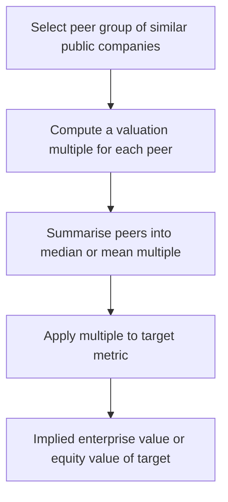
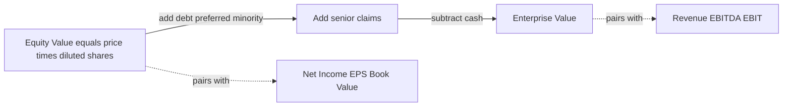
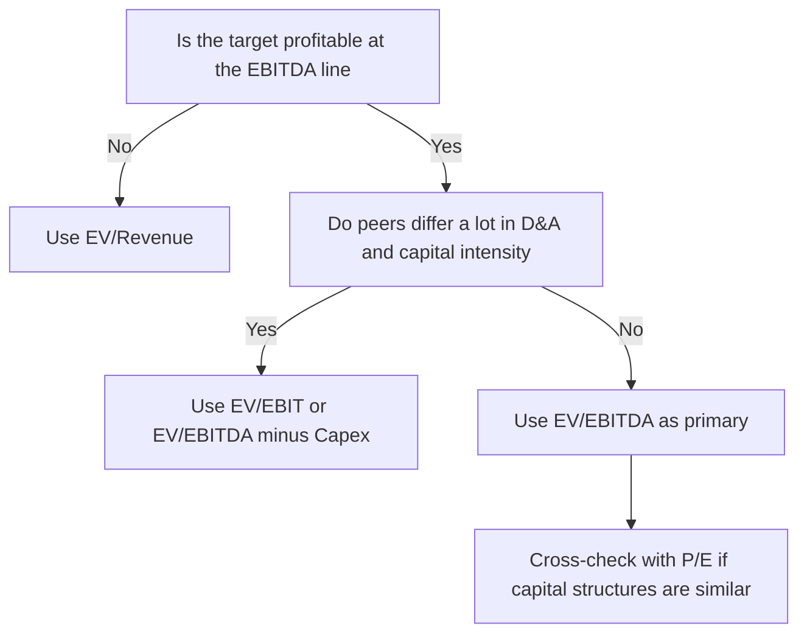
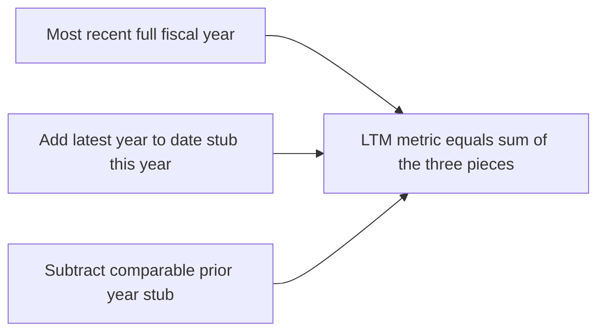
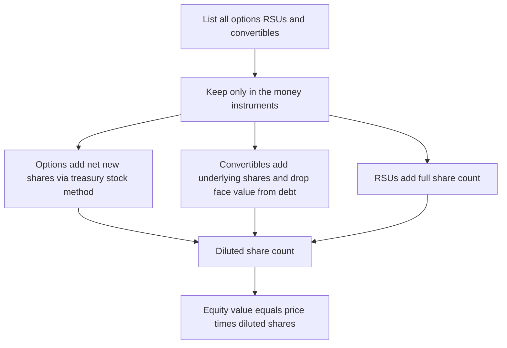

<!-- v2-deep -->

# Chapter 25 — Comparable Company Analysis (Trading Comps)

## 1. The Problem

You have just finished a discounted cash flow (DCF) model for a target company — say a mid-cap software business — and it spits out an intrinsic value of $4.2 billion. A colleague looks over your shoulder and asks a single, deadly question: *"How do you know it's not $2 billion or $6 billion?"*

The honest answer is uncomfortable. Your DCF value swings by hundreds of millions of dollars every time you nudge the terminal growth rate by 0.5% or the WACC by 0.3%. The entire valuation rests on assumptions about cash flows five, ten, fifteen years out — a future no one can actually see. A DCF is rigorous and internally consistent, but it is also a closed box: it never once looks out the window to check what real buyers are actually paying for real companies *today*.

Meanwhile, the market is screaming price signals every second. Dozens of software companies just like your target trade on public exchanges. Investors — thousands of them, with real money at stake — have collectively decided that a company earning $500 million of EBITDA is worth, say, $8 billion. That is not a theory. That is a transaction-clearing price.

The problem comparable company analysis solves is this: **How do we value a company by anchoring it to what the market is paying for similar companies right now, rather than to a forecast of its distant future?** We need a method that is fast, market-grounded, defensible in a boardroom, and that acts as a sanity check on — or an alternative to — the DCF. When a client asks "what's it worth?" and needs an answer this afternoon, you cannot always build a three-statement model. But you can almost always build comps.

There is a second, subtler reason the method matters. A DCF answers "what is this worth in principle?" Comps answer "what would it *clear at* if you tried to sell it into today's market?" Those are different questions, and in a live deal the second one often wins. A board deciding whether to accept a takeover offer, a banker pricing an IPO, a fund manager deciding whether a stock is cheap — all of them care first about *market-clearing* value, and only second about theoretical intrinsic value. Comps are the language of that conversation. If you cannot build them fluently and defend every number in them, you cannot sit at the table.

## 2. The Core Idea

Comparable company analysis — "trading comps," "public comps," or just "comps" — values a target by applying **valuation multiples derived from a set of similar publicly traded companies**.

The logic runs in four moves:

1. **Find a peer group** of public companies genuinely similar to the target (same industry, size, growth, margins).
2. **Observe how the market prices each peer** — not in absolute dollars, but as a *ratio* of value to some financial metric. For example, Enterprise Value divided by EBITDA. If a peer has a $10 billion enterprise value and $1 billion of EBITDA, the market is paying **10.0x EBITDA**.
3. **Summarise the peer set** into a representative multiple — typically the **median** (and sometimes mean) of the group. Say the peers cluster around **11.0x EV/EBITDA**.
4. **Apply that multiple to the target's own metric.** If the target earns $500 million of EBITDA, then implied Enterprise Value = 11.0x × $500m = **$5.5 billion**.

The multiple is the bridge. It says: *"For every dollar of EBITDA a company in this industry produces, the market currently pays about eleven dollars of enterprise value. Our target produces $500 million of EBITDA, so it should be worth about $5.5 billion."*

This is **relative valuation**. It does not ask "what is this company worth in some absolute, cosmic sense?" It asks the far more tractable question: *"Given how the market prices this company's twins, what should this one be worth?"*

*Figure 25.1 — The four-step logic of trading comps, from peer selection to implied value.*



One framing that helps: a multiple is a **compressed DCF**. Every trading multiple you observe is the market's DCF of that company, boiled down to a single number. When you borrow a peer's 11x EV/EBITDA, you are silently importing the market's collective view of that peer's growth, risk, reinvestment needs, and cost of capital — without doing the forecast yourself. That is the great convenience of comps, and also their great danger: you inherit those embedded assumptions whether or not they fit your target.

## 3. Why It Works

Comps rest on a single economic premise: **the law of one price**. Two assets that generate similar cash flows, carry similar risk, and offer similar growth should trade at similar prices. If Company A and Company B are near-identical software businesses but A trades at 8x EBITDA and B at 15x, one of them is probably mispriced — and arbitrageurs will push them back toward each other over time. So *on average*, across a well-chosen peer set, the multiples reflect a fair market consensus about how to price a dollar of earnings in that industry.

Why express value as a *ratio* rather than an absolute number? Because ratios strip out **scale**. A company with $2 billion of revenue is obviously worth more in absolute dollars than one with $200 million — that tells us nothing. But if the small company trades at 3x sales and the large one at 3x sales, we have learned something real and comparable: the market values each dollar of their revenue identically. Multiples **normalise for size**, letting a $500 million company and a $50 billion company inform each other's valuation.

Why does it work *in practice*, beyond theory? Three reasons:

- **Market efficiency (roughly).** Public equity markets aggregate the views of many informed participants. The prices are noisy but not random; on average they embed sensible expectations about growth and risk.
- **Self-consistency within an industry.** Companies in the same sector share the same macro drivers, customer base, regulatory regime, and capital intensity. Their multiples move together, so a peer median genuinely captures "what this business model is worth today."
- **It embeds the future without forecasting it.** A high-growth peer trades at a high multiple precisely *because* the market has already priced in its growth. When you apply that multiple to your target, you inherit the market's growth and risk assumptions for free — no 10-year forecast required.

The catch — which motivates everything technical that follows — is that "similar" and "on average" do all the heavy lifting. Choose bad peers, or fail to adjust for real differences, and the method quietly produces garbage. The rigor of comps is not in the arithmetic (which is trivial); it is in the **judgement** about comparability and the **discipline** in cleaning the data.

**A useful algebraic bridge.** You can show *why* a multiple is what it is with a one-line growing-perpetuity identity. If free cash flow to the firm grows at *g* forever and is discounted at WACC, then EV = FCFF / (WACC − g). Divide both sides by EBITDA and you get:

> EV/EBITDA = (FCFF / EBITDA) / (WACC − g)

This tiny formula explains almost every pattern you will ever see in a comp set. A peer with **higher growth (g)** has a larger multiple. A peer with **higher risk (higher WACC)** has a smaller multiple. A peer that **converts more of its EBITDA into free cash flow** (light capex, low taxes, efficient working capital) earns a higher multiple. So when two "similar" peers trade at 8x and 14x, this identity tells you exactly where to look: their growth, their risk, or their cash conversion must differ. Comps and DCF are not rivals; they are the same equation viewed from two ends.

## 4. Full Technical Content

### 4.1 Enterprise Value vs Equity Value — the foundation

Every multiple pairs a **numerator** (a measure of value) with a **denominator** (a financial metric). The single most important rule in comps is that the two must be **consistent about who they belong to**: the providers of capital.

- **Equity Value** (market capitalisation) = value belonging to *shareholders only*.
  - Equity Value = Share Price × **Diluted** Shares Outstanding.
- **Enterprise Value (EV)** = value of the *entire operating business*, belonging to all capital providers (debt + equity).
  - **EV = Equity Value + Total Debt + Preferred Stock + Minority Interest − Cash & Equivalents.**

The bridge from equity to enterprise value adds claims that rank ahead of or alongside common equity (debt, preferred, minority interest) and subtracts cash (because cash is a non-operating asset — a buyer effectively gets it back, reducing the net price of the business).

**The consistency rule:**

| Numerator | Denominator must be a *pre-financing* (before interest) metric |
|-----------|----------------------------------------------------------------|
| **Enterprise Value** | Revenue, EBITDA, EBIT, Unlevered FCF — metrics *before* interest expense |
| **Equity Value** | Net Income, EPS, Levered FCF, Book Value of Equity — metrics *after* interest |

Why? EBITDA is earned *before* paying interest to lenders, so it belongs to *all* capital providers — pair it with EV. Net income is what's left *after* lenders are paid, so it belongs only to shareholders — pair it with Equity Value. **Mixing them (e.g., EV/Net Income or Price/EBITDA) is the cardinal sin of comps** — it compares a whole-business value to a shareholders-only metric and produces meaningless ratios.

*Figure 25.2 — The bridge from Equity Value to Enterprise Value and which metrics pair with each.*



**The full bridge, item by item.** In real filings the EV bridge has more than four lines. Master the complete list, because interviewers probe exactly the items juniors forget:

| Bridge item | Add or subtract to reach EV | Why |
|-------------|------------------------------|-----|
| Equity value (diluted market cap) | Start here | Value to common shareholders |
| Total debt (short + long term) | Add | A buyer must repay or assume it |
| Preferred stock | Add | Ranks ahead of common; a claim on the business |
| Non-controlling (minority) interest | Add | The consolidated financials include 100% of a subsidiary the parent owns only part of, so EV must reflect the whole |
| Capital / finance leases (and operating leases under IFRS 16) | Add | Debt-like obligations; add if EBITDA is pre-lease (EBITDAR style) |
| Unfunded pension liabilities | Add | Debt-like claim on the firm |
| Cash and equivalents | Subtract | Non-operating asset; buyer effectively receives it |
| Short-term & long-term investments, marketable securities | Subtract | Non-operating; not part of the core business |
| Equity investments / stakes in associates | Subtract | Value sits outside consolidated operating EBITDA |

The guiding principle: **anything in the numerator (EV) that is not captured in the denominator's operating metric must be added or subtracted so the two sides describe the same business.** Non-controlling interest is the classic trap — because the income statement consolidates 100% of a partly-owned subsidiary's EBITDA, you *must* add the minority stake to EV, or your EV/EBITDA denominator is "too big" for the numerator.

### 4.2 The core multiples and when to use each

| Multiple | Formula | Best used when | Watch out for |
|----------|---------|----------------|---------------|
| **EV / EBITDA** | EV ÷ EBITDA | The workhorse. Capital-intensive or leveraged businesses; comparing firms with different capital structures and tax rates | Ignores capex and D&A differences; flatters asset-heavy firms |
| **EV / EBIT** | EV ÷ EBIT | When D&A differs materially across peers (EBIT captures the cost of capital assets via depreciation) | Sensitive to depreciation accounting policy |
| **EV / Revenue (Sales)** | EV ÷ Revenue | Early-stage, high-growth, or unprofitable firms with negative EBITDA; also for pre-margin businesses | Says nothing about profitability — 3x sales means very different things at 40% vs 5% margins |
| **P / E** | Price ÷ EPS (or Equity Value ÷ Net Income) | Mature, profitable firms with stable, comparable capital structures; retail/consumer investor familiarity | Distorted by leverage, one-offs, and tax differences; useless if earnings are negative |
| **EV / EBITDA − Capex** | EV ÷ (EBITDA − Capex) | Capital-intensive industries where maintenance capex is a real economic cost (telecom, cable) | Capex is lumpy year to year |
| **P / B (Price/Book)** | Equity Value ÷ Book Equity | Financial institutions (banks, insurers) where book value is economically meaningful | Meaningless for asset-light firms |
| **PEG** | (P/E) ÷ EPS growth rate | Comparing firms with very different growth rates; normalises P/E for growth | Crude; assumes P/E scales linearly with growth |
| **Sector-specific** | EV/Subscriber, EV/EBITDAR, EV/Reserves, P/AUM, EV/DAU, EV/ARR | Industry norms dominate (telecom, retail with leases, energy, asset managers, internet, SaaS) | Only comparable within the exact sub-sector |

**Decision rule for picking the primary multiple:**

*Figure 25.3 — A decision tree for choosing the primary valuation multiple.*



In practice you present **several multiples side by side** — EV/EBITDA and EV/Revenue and P/E — because each illuminates a different facet, and the spread between them is itself informative.

**Why EV/EBITDA is the workhorse — stated precisely.** It neutralises three things that make raw net income non-comparable across companies: **capital structure** (it is pre-interest, so leverage does not distort it), **tax regime** (it is pre-tax), and **depreciation policy** (it is pre-D&A, so a company that depreciates fast does not look artificially cheap). What remains is a clean, cross-comparable measure of core operating profitability. Its blind spot is the mirror image: because it *ignores* capex and D&A, it flatters asset-heavy businesses that must constantly reinvest just to stand still. A cable operator at 8x EBITDA and a software firm at 8x EBITDA are not equally cheap — the cable firm spends most of that EBITDA on network capex, the software firm keeps it. That is exactly why capital-intensive sectors are cross-checked on EV/EBIT or EV/(EBITDA − Capex).

### 4.3 Selecting the peer set

This is where comps are won or lost. A peer must be genuinely comparable along these axes:

- **Industry / business model** — same sector, same way of making money. A SaaS company and an on-premise software licensor are *not* peers despite both being "software."
- **Size** — revenue, EBITDA, market cap within the same order of magnitude. A $50bn giant and a $300m minnow face different risk and liquidity.
- **Growth profile** — a 40%-growth company will *never* trade at the multiple of a 3%-growth company, and it shouldn't. Growth is the single biggest driver of multiple dispersion.
- **Profitability / margins** — similar EBITDA and net margins.
- **Geography / end markets** — a domestic utility vs a global exporter face different risk.
- **Capital structure** — matters less for EV multiples (which are capital-structure-neutral) but a lot for P/E.

**Practical workflow:** Start with the target's own **10-K "competitors" section** and equity research reports (analysts publish their own comp sets). Use **SIC/NAICS/GICS industry codes** to screen. Then apply judgement — trim the list to 6–12 truly comparable names. A comp set of 5 tight peers beats 25 loose ones. Document *why* each name is in or out; you will be challenged on it.

**A concrete screening recipe you can run:**

1. Pull the target's GICS sub-industry code and all constituents in it.
2. Filter to companies within roughly one-third to three times the target's revenue (an order-of-magnitude band).
3. Filter to a comparable growth band — say the target's forward revenue growth ±10 percentage points.
4. Exclude anything with a broken business model in the period (in bankruptcy, mid-restructuring, or subject to an announced takeover — its price reflects deal mechanics, not fundamentals).
5. Read each survivor's business description and manually cut mismatches (different end market, different monetisation, different regulatory exposure).
6. Cross-check the survivors against two independent equity research comp sets. Names that appear on both analysts' lists and yours are your **tier-1** peers; names on only one list are **tier-2** (show them, but weight them less, and consider reporting the median of tier-1 alone).

The discipline of tiering peers is what lets you answer the inevitable challenge — *"why is Company X in your set?"* — with a reason rather than a shrug.

### 4.4 LTM vs Forward, and calendarisation

Multiples can be computed on different time periods for the denominator:

- **LTM (Last Twelve Months)**, a.k.a. TTM (Trailing Twelve Months) — actual reported results for the most recent 12 months. Backward-looking, fully realised, no forecast risk.
- **Forward (NTM / FY+1 / FY+2)** — analyst-consensus estimates for the next 12 months or next fiscal year. Forward-looking; often *more* relevant because markets price the future. High-growth firms are almost always valued on forward multiples.

**Computing LTM from filings** (companies report quarterly and annually, but rarely give you exactly the trailing 12 months):

> **LTM metric = Most recent Fiscal Year + Latest Interim Stub − Comparable Prior-Year Stub**

For example, to get LTM EBITDA as of Q3:
LTM EBITDA = FY EBITDA + (9-month YTD EBITDA this year) − (9-month YTD EBITDA last year).

This "adds the new stub, removes the old stub" to roll the annual figure forward to today.

*Figure 25.4 — The last twelve months roll-forward, adding the new stub and removing the stale one.*



**Worked LTM roll-forward.** A company's most recent 10-K reports FY2025 (calendar year) EBITDA of **$1,000m**. Its latest 10-Q reports nine-month (Q1–Q3 2026) EBITDA of **$840m**, and the prior-year nine-month figure (Q1–Q3 2025) was **$760m**. Then:

> LTM EBITDA (as of Q3 2026) = 1,000 + 840 − 760 = **$1,080m**

Intuition: you started with all of calendar 2025 (1,000), bolted on the first nine months of 2026 (840), and stripped out the first nine months of 2025 (760) that the 2026 stub replaces. What is left is exactly Q4 2025 + Q1–Q3 2026 — the trailing twelve months. If EV is $11,880m, LTM EV/EBITDA = 11,880 / 1,080 = **11.0x**.

**Calendarisation** solves a subtler problem: peers have **different fiscal year-ends**. Company A's FY ends in December; Company B's ends in June. Comparing A's "FY2026 estimate" to B's "FY2026 estimate" compares apples (Jan–Dec 2026) to oranges (Jul 2025–Jun 2026). To make them comparable, convert every peer's estimates to a **common calendar year** (e.g., calendar 2026) by weighting the two overlapping fiscal years:

> **Calendar-2026 metric = w × FYa + (1 − w) × FYb**, where *w* is the fraction of calendar 2026 falling in the peer's fiscal year that ends in 2026.

*Worked calendarisation:* A peer with a **June** fiscal year-end. Its FY2026 covers Jul 2025–Jun 2026; its FY2027 covers Jul 2026–Jun 2027. Calendar year 2026 (Jan–Dec 2026) is made up of **6 months from FY2026** (Jan–Jun 2026) and **6 months from FY2027** (Jul–Dec 2026). So:

Calendar-2026 EBITDA = 0.5 × FY2026 EBITDA + 0.5 × FY2027 EBITDA.

If the fiscal year ended in September, calendar 2026 would be 9/12 from the FY ending Sep-2026 and 3/12 from the following FY: w = 0.75.

**Getting *w* right — the rule that prevents sign errors.** The weight *w* on the fiscal year that *ends inside* calendar 2026 equals the number of that fiscal year's months that fall inside calendar 2026, divided by 12. For a fiscal year ending 30 June 2026, the months of that FY inside calendar 2026 are Jan–Jun 2026 = 6 months, so w = 6/12 = 0.5. For a fiscal year ending 30 September 2026, the months inside calendar 2026 are Jan–Sep 2026 = 9 months, so w = 9/12 = 0.75. For a fiscal year ending 31 March 2026, only Jan–Mar 2026 = 3 months sit inside calendar 2026, so w = 3/12 = 0.25 (and the remaining 0.75 comes from the FY ending March 2027). A December year-end trivially gives w = 1 — no calendarisation needed. **Numerator note:** always calendarise the denominator (the metric); the numerator EV is a spot value today and is *not* time-weighted.

### 4.5 Scrubbing for non-recurring items

Reported EBITDA and net income are polluted by one-time noise that will not recur and therefore should not be valued. **You value a normalised, recurring stream.** Adjust each peer's (and the target's) metrics to strip out:

- **Restructuring / severance charges** — add back to EBITDA.
- **Litigation settlements, legal reserves** — add back (or remove one-time gains).
- **Asset impairments and write-downs** — add back (non-cash, non-recurring).
- **Gains/losses on asset sales** — remove.
- **Stock-based compensation (SBC)** — treatment varies; be consistent across all peers. Many analysts do *not* add back SBC (it's a real economic cost), but you must apply the *same* rule to every company.
- **Non-controlling / minority interest earnings**, **one-time tax items**, **acquisition/integration costs**.

The goal is a clean, comparable, **"run-rate" or "normalised" EBITDA/EPS** for every company in the set. This is tedious footnote-reading work — and it is exactly what separates a professional comp from a Bloomberg screen dump. If you scrub the peers but not the target (or vice versa), your multiple is inconsistent and the valuation is wrong.

**The direction-of-adjustment discipline.** Every scrub either *raises* or *lowers* the metric, and getting the sign right is non-negotiable. A one-time **expense** (restructuring, impairment, legal charge, write-down) is **added back** because it depressed reported profit but will not recur — normalised profit is *higher*. A one-time **gain** (asset sale profit, insurance recovery, litigation win, bargain-purchase gain) is **subtracted** because it inflated reported profit — normalised profit is *lower*. Ask of every adjustment: "will this line item show up again next year in the ordinary course?" If no, and it is in the metric, take it out. A tidy way to keep this straight in Excel is a signed adjustments schedule where add-backs are positive and gains are negative, and normalised EBITDA = reported EBITDA + SUM(adjustments).

### 4.6 Applying the multiple to the target

Once you have a clean multiple for each peer, summarise the set and apply it:

1. **Compute descriptive statistics** across the peer set for each multiple: **min, 25th percentile, median, mean, 75th percentile, max.**
2. **Prefer the median over the mean.** The median is robust to outliers; a single peer at 40x can drag the mean into fantasy. If the mean and median diverge sharply, an outlier is distorting things — investigate.
3. **Apply the chosen multiple to the target's corresponding (scrubbed) metric.**
   - An **EV multiple** (EV/EBITDA, EV/Sales) gives you **Enterprise Value**. To get to equity value per share, you must **reverse the bridge**: Equity Value = EV − Net Debt − Preferred − Minority Interest; then ÷ diluted shares = implied price per share.
   - An **equity multiple** (P/E) gives you **Equity Value** directly: Implied Equity Value = P/E × Net Income; ÷ diluted shares = implied price.
4. **Present a range, not a point.** Apply the 25th-percentile and 75th-percentile multiples to bracket a valuation range. Comps produce a *range* of defensible values, which you overlay against the DCF in a "football field" chart.

**A note on the "right" average — the harmonic mean.** Multiples are ratios, and the arithmetic mean of ratios is statistically biased upward. The theoretically correct way to average a set of P/E or EV/EBITDA multiples is the **harmonic mean**, which is equivalent to aggregating the numerators and denominators and then dividing — i.e., (ΣEV) / (Σ EBITDA). Example: two peers at 10x and 30x. Arithmetic mean = 20x. But if both have $100 of EBITDA, total EV = 1,000 + 3,000 = 4,000 against total EBITDA of 200, giving 20x — here they match because EBITDA is equal. Make peer A's EBITDA $400 and peer B's $100: total EV = 4,000 + 3,000 = 7,000 over 500 EBITDA = **14x**, well below the naive 20x. In Excel the harmonic mean is `=HARMEAN(range)`. Most bankers still lead with the **median** (simplest and outlier-robust), but knowing the harmonic mean exists — and why the arithmetic mean overstates — is a classic interview differentiator.

### 4.7 Excel build mechanics

**Layout.** Build the comp set as one company per row, metrics in columns. A clean structure:

```
Row of headers: Company | Ticker | Price | Diluted Shares | Equity Value | Debt | Cash |
                Net Debt | Enterprise Value | LTM Rev | LTM EBITDA | NTM EBITDA |
                EV/LTM Rev | EV/LTM EBITDA | EV/NTM EBITDA | P/E
```

**Key formulas (assume company data starts in row 5):**

- Equity Value: `=Price * DilutedShares` → `=C5*D5`
- Net Debt: `=Debt - Cash` → `=G5-H5`
- Enterprise Value: `=EquityValue + NetDebt + Preferred + Minority` → `=E5+I5` (if EV col references equity + net debt + other claims)
- EV/EBITDA: `=EnterpriseValue / LTM_EBITDA` → `=J5/L5`
- P/E: `=Price / EPS` or `=EquityValue / NetIncome`

**Summary statistics block** below the peer rows (say peers span rows 5:14):

- Median: `=MEDIAN(N5:N14)`
- Mean: `=AVERAGE(N5:N14)`
- 25th percentile: `=PERCENTILE.INC(N5:N14, 0.25)` (or `QUARTILE.INC(range,1)`)
- 75th percentile: `=PERCENTILE.INC(N5:N14, 0.75)`
- Min / Max: `=MIN(N5:N14)` / `=MAX(N5:N14)`
- Harmonic mean (aggregate): `=HARMEAN(N5:N14)`
- **Exclude outliers cleanly:** flag them in a helper column and use `=MEDIAN(IF(flag<>"x", range))` as an array, or simply delete obviously non-comparable rows.

**Guarding against bad denominators.** Negative or near-zero EBITDA produces meaningless or explosive multiples that silently poison your median. Wrap multiple cells so garbage never enters the stats: `=IF(L5<=0, "nm", J5/L5)` displays "nm" (not meaningful) for a non-positive denominator, and because `MEDIAN`/`AVERAGE` ignore text, the "nm" rows are automatically excluded from your summary block. This one habit prevents the most common comps blow-up — a single loss-making peer dragging an EV/EBITDA median to nonsense.

**Implied valuation block:**

- Implied EV: `=MedianMultiple * Target_EBITDA`
- Implied Equity Value: `=ImpliedEV - Target_NetDebt`
- Implied share price: `=ImpliedEquityValue / Target_DilutedShares`

**Treasury stock method for diluted shares (in a helper block):**

- In-the-money check: `=IF(SharePrice>Strike, TRUE, FALSE)`
- Net new shares from options: `=IF(SharePrice>Strike, Options*(1 - Strike/SharePrice), 0)` — this is the algebraically simplified treasury stock method (options minus buyback shares).
- Diluted shares: `=BasicShares + SUM(net new shares from all option tranches) + InTheMoneyConvertibleShares`

**Formatting conventions (professional standard):**

- **Blue font** for hard-coded inputs (prices, share counts, raw financials pulled from filings); **black font** for formulas/calculations. This lets any reviewer instantly see what is data vs derived.
- Multiples formatted as `0.0"x"` (custom number format) so 11.3 displays as **11.3x**.
- Dollar figures in `#,##0` with a `$mm` or `$bn` unit note in the header; keep units consistent down every column.
- Shade the **median row** or the summary block to draw the eye.
- Use **diluted** share counts via the treasury stock method (options and convertibles that are in-the-money add to share count) — never basic shares.

### 4.8 The treasury stock method in full

Diluted shares are not simply basic shares plus every option ever granted. The **treasury stock method (TSM)** models what actually happens on exercise: option holders pay the company cash (the strike), and the company is assumed to use that cash to buy back shares at the current market price, partly offsetting the dilution.

For a single tranche of in-the-money options:

> Gross new shares = number of options
> Buyback shares = (options × strike) ÷ current share price
> **Net new shares = options × (1 − strike ÷ share price)**

Only **in-the-money** options count (strike below current price); out-of-the-money options are ignored because no rational holder exercises them. Convertible securities are handled with an **if-converted** test: if the share price exceeds the conversion price, the convertible is assumed to convert — you add its underlying shares to the count *and* remove its face value from debt in the EV bridge (it is now equity, not a liability). If it is out of the money, you leave it in debt and add no shares. Restricted stock units (RSUs) and performance shares generally add their full share count (there is no strike to pay).

*Figure 25.5 — Building the diluted share count from options and convertibles.*



Getting this right matters because dilution flows straight into equity value and therefore into every equity multiple and every implied price. Using **basic** shares systematically understates the share count, overstates value per share, and — if you are on the sell-side — quietly inflates the price you are recommending. It is one of the fastest ways for a reviewer to spot an amateur model.

## 5. Worked Examples

### Example 1 — Full EV/EBITDA comp, from peers to implied share price

**Target:** "NovaData Inc.," an analytics software firm. LTM EBITDA = **$500m**; Net Debt = **$300m** (debt $500m − cash $200m); diluted shares = **80m**. We want an implied share price.

**Peer set (five comparable public software firms), LTM figures ($mm):**

| Peer | Equity Value | Net Debt | Enterprise Value | LTM EBITDA | EV/EBITDA |
|------|-------------:|---------:|-----------------:|-----------:|----------:|
| Alpha | 7,200 | 800 | 8,000 | 800 | 10.0x |
| Beta | 4,000 | 500 | 4,500 | 450 | 10.0x |
| Gamma | 9,500 | 1,000 | 10,500 | 875 | 12.0x |
| Delta | 2,700 | 300 | 3,000 | 250 | 12.0x |
| Epsilon | 5,400 | 600 | 6,000 | 545 | 11.0x |

*Check one row so the mechanics are transparent:* Gamma's EV = Equity Value 9,500 + Net Debt 1,000 = **10,500**; EV/EBITDA = 10,500 ÷ 875 = **12.0x**. ✓

**Summary statistics of EV/EBITDA:** values are {10.0, 10.0, 11.0, 12.0, 12.0}.

- Mean = (10.0+10.0+11.0+12.0+12.0)/5 = 55.0/5 = **11.0x**
- Median = middle value of the sorted set = **11.0x**
- Min = 10.0x, Max = 12.0x

Mean and median agree at **11.0x** — a clean, tight set with no outliers. Good.

**Apply to the target:**

- Implied Enterprise Value = 11.0x × $500m EBITDA = **$5,500m**
- Implied Equity Value = EV − Net Debt = 5,500 − 300 = **$5,200m**
- Implied share price = 5,200 ÷ 80m shares = **$65.00**

**Valuation range** (using min/max to bracket):

- At 10.0x: EV = 5,000; Equity = 4,700; price = 4,700/80 = **$58.75**
- At 12.0x: EV = 6,000; Equity = 5,700; price = 5,700/80 = **$71.25**

**Result:** Comps imply NovaData is worth roughly **$59–$71 per share, midpoint ~$65.** If the stock trades at $50, it may be undervalued relative to peers; at $85, overvalued. This is your market-grounded anchor.

**What-if variation — the sensitivity of price to the multiple.** Notice how a *one-turn* move in the multiple (from 11.0x to 12.0x) moves EV by $500m but moves the *share price* by $6.25 (from $65.00 to $71.25). Because net debt and share count are fixed, implied price is linear in the multiple: each additional turn of EV/EBITDA adds (EBITDA ÷ shares) = 500/80 = **$6.25 per share** here. This is worth internalising — it tells you instantly how much precision your peer-multiple estimate actually needs. If half a turn of dispute changes your price by $3, and the whole deal hinges on $1, you have a problem that comps alone cannot settle.

### Example 2 — EV/Revenue for an unprofitable target, plus the pitfall

**Target:** "CloudSprint," a fast-growing SaaS firm that is **EBITDA-negative** (−$20m) — so EV/EBITDA is meaningless (a negative multiple). Revenue = **$400m**, growing 45%/yr. Net Debt = **−$150m** (net cash of $150m); diluted shares = 50m.

**Peers (high-growth SaaS), EV/Revenue:**

| Peer | Enterprise Value | LTM Revenue | Rev Growth | EV/Revenue |
|------|-----------------:|------------:|-----------:|-----------:|
| Skyline | 6,000 | 500 | 40% | 12.0x |
| Vertex | 3,600 | 400 | 30% | 9.0x |
| Nimbus | 9,000 | 600 | 50% | 15.0x |
| Orbit | 2,800 | 350 | 25% | 8.0x |
| Pulse | 5,000 | 500 | 42% | 10.0x |

- Median EV/Revenue = sorted {8.0, 9.0, 10.0, 12.0, 15.0} → **10.0x**
- Mean = 54.0/5 = **10.8x**

Median (10.0x) < Mean (10.8x): Nimbus at 15.0x is pulling the mean up. **Use the median**, but note the target grows at 45% — faster than the median peer — so it arguably deserves a multiple toward the *high* end. This is the judgement layer: don't blindly apply the median when the target is not the median company on the key driver (growth).

**Apply the median (conservative) and a growth-adjusted 12.0x (aggressive):**

- At 10.0x: Implied EV = 10.0 × 400 = **$4,000m**; Equity = 4,000 − (−150) = 4,000 + 150 = **$4,150m**; price = 4,150/50 = **$83.00**
- At 12.0x: Implied EV = 12.0 × 400 = **$4,800m**; Equity = 4,800 + 150 = **$4,950m**; price = 4,950/50 = **$99.00**

*Note the net-cash reversal:* because CloudSprint has net cash, equity value is *higher* than enterprise value — we **add back** the $150m. Getting the sign right here is a common error.

**Result:** ~**$83–$99 per share.** The wide range reflects the weakness of EV/Revenue — it ignores that the peers have very different paths to profitability. This is why you'd triangulate with EV/forward-EBITDA once the company turns profitable.

**Regression cross-check — is the growth premium fair?** When peers differ mostly on growth, quants regress the multiple on growth to price the target *on the line* rather than at a hand-picked percentile. Fit EV/Revenue = a + b × growth across the five peers. A rough fit here gives roughly a ≈ 3.2x and b ≈ 0.22x per percentage point of growth (in Excel, `=SLOPE(multiples, growths)` and `=INTERCEPT(multiples, growths)`). Plugging in the target's 45% growth: predicted multiple ≈ 3.2 + 0.22 × 45 ≈ **13.1x** — above even the aggressive 12.0x. The regression says the target's growth *justifies* a top-of-range multiple, converting a subjective "toward the high end" into a defensible number. Present it as a cross-check, not gospel — five points is a thin regression — but it is exactly the kind of rigor that separates a thoughtful comp from a screen dump.

### Example 3 — Calendarisation and LTM scrubbing

**Peer "Meridian Corp"** has a **June 30 fiscal year-end**. You want a calendar-2026 EV/EBITDA to compare against December-FY peers. Analyst consensus:

- FY2026 EBITDA (Jul 2025–Jun 2026) = **$600m**
- FY2027 EBITDA (Jul 2026–Jun 2027) = **$720m**

Calendar 2026 = 6 months of FY2026 + 6 months of FY2027, so w = 0.5:

> Calendar-2026 EBITDA = 0.5 × 600 + 0.5 × 720 = 300 + 360 = **$660m**

If Meridian's EV = $7,260m, then calendarised EV/EBITDA = 7,260 ÷ 660 = **11.0x** — now directly comparable to your December-year peers.

**LTM scrubbing on the same peer.** Reported LTM EBITDA = $650m, but the footnotes reveal a **$40m restructuring charge** and a **$15m gain on a building sale** hit the period.

> Normalised LTM EBITDA = 650 + 40 (add back restructuring) − 15 (remove one-time gain) = **$675m**

Using reported EBITDA of $650m would have understated EBITDA and *overstated* the multiple (7,260/650 = 11.2x vs the true 7,260/675 = 10.8x) — making the peer look more expensive than it is and biasing your target valuation upward. Scrubbing matters.

### Example 4 — Diluted shares via the treasury stock method

**Company "Bridgewater Systems."** Current share price = **$50**. Reported **basic** shares = **100m**. The 10-K footnotes disclose:

- Tranche A: **6m options** struck at **$20** (in the money, since $50 > $20)
- Tranche B: **3m options** struck at **$70** (out of the money, since $50 < $70)
- **2m RSUs** (no strike)
- A **convertible bond**, $300m face, conversion price **$40** (in the money, since $50 > $40)
- Other debt = **$500m**; cash = **$200m**

**Step 1 — options via TSM (in-the-money tranche A only):**
- Buyback shares = (6m × $20) ÷ $50 = 120 ÷ 50 = **2.4m**
- Net new shares = 6.0 − 2.4 = **3.6m** (equivalently 6 × (1 − 20/50) = 6 × 0.6 = 3.6m)
- Tranche B is out of the money → **0** new shares.

**Step 2 — RSUs:** add full **2.0m**.

**Step 3 — convertible (in the money → if-converted):** add underlying shares = $300m ÷ $40 = **7.5m**, and **remove** the $300m face from debt (it becomes equity).

**Step 4 — diluted share count:**
> 100.0 (basic) + 3.6 (options) + 2.0 (RSUs) + 7.5 (convert) = **113.1m**

**Step 5 — equity value and EV:**
- Equity value = 113.1m × $50 = **$5,655m**
- Debt after removing the converted bond = 500 − 0 = **$500m** (the $300m convert is now equity, so remaining debt is just the $500m of other debt)
- Net debt = 500 − 200 = **$300m**
- Enterprise value = 5,655 + 300 = **$5,955m**

**Contrast with the naive basic-share approach:** equity value = 100m × $50 = $5,000m, then treating the convert as $300m of debt gives net debt = 500 + 300 − 200 = $600m and EV = 5,000 + 600 = **$5,600m**. The diluted, if-converted EV ($5,955m) is **$355m higher** — a 6% swing that flows into every multiple you compute. Which is "right"? The **in-the-money convertible must be counted as equity** (a holder will convert to capture the $10 spread), so $5,955m is the correct enterprise value. Using basic shares here would understate value and mislead the whole analysis.

### Example 5 — Why P/E and EV/EBITDA disagree — the leverage effect

Two companies have **identical operations** but different capital structures. This example shows precisely why EV/EBITDA is capital-structure-neutral and P/E is not.

| | Lo-Lev Inc. | Hi-Lev Inc. |
|---|---:|---:|
| EBITDA | 200 | 200 |
| D&A | 50 | 50 |
| EBIT | 150 | 150 |
| Debt | 0 | 1,000 |
| Interest at 6% | 0 | 60 |
| Pre-tax income (EBT) | 150 | 90 |
| Tax at 25% | 37.5 | 22.5 |
| **Net income** | **112.5** | **67.5** |

Assume the market prices *both* businesses at the same **EV/EBITDA = 10.0x** — correct, because their operations are identical:

- Both have EV = 10.0 × 200 = **$2,000m**.
- Lo-Lev equity = EV − net debt = 2,000 − 0 = **$2,000m** → **P/E = 2,000 / 112.5 = 17.8x**
- Hi-Lev equity = EV − net debt = 2,000 − 1,000 = **$1,000m** → **P/E = 1,000 / 67.5 = 14.8x**

Same operating value, **different P/E** (17.8x vs 14.8x), purely because of leverage. If you had built a P/E comp set mixing lightly- and heavily-levered peers and applied the median P/E to your target, you would systematically misvalue it — a lowly-levered target would look "cheap" against a levered peer set and vice versa. **EV/EBITDA removes this distortion**; that is why it is the default for cross-capital-structure comparison, and why P/E is only trustworthy when the peers' leverage is genuinely similar. In an interview, this is the crisp answer to *"why do bankers prefer EV/EBITDA to P/E?"*

### Example 6 — Building the valuation range and reading a football field

Return to a six-peer EV/EBITDA set with the values **{7.5x, 8.0x, 9.0x, 9.5x, 11.0x, 14.0x}** and a target with normalised EBITDA of **$300m**, net debt of **$400m**, and **50m** diluted shares.

**Summary statistics** (Excel: `PERCENTILE.INC(range, k)`):
- 25th percentile: interpolate between the 2nd and 3rd values → 8.0 + 0.25 × (9.0 − 8.0) = **8.25x**
- Median: average of the 3rd and 4th values (even count) = (9.0 + 9.5)/2 = **9.25x**
- 75th percentile: interpolate between the 4th and 5th values → 9.5 + 0.75 × (11.0 − 9.5) = **10.625x**
- Mean = (7.5+8.0+9.0+9.5+11.0+14.0)/6 = 59.0/6 = **9.83x** (above the median — the 14.0x outlier is lifting it)

**Implied values at each statistic** (EV = multiple × 300; Equity = EV − 400; Price = Equity ÷ 50):

| Statistic | Multiple | Implied EV | Implied Equity | Implied Price |
|-----------|---------:|-----------:|---------------:|--------------:|
| 25th pct | 8.25x | 2,475 | 2,075 | **$41.50** |
| Median | 9.25x | 2,775 | 2,375 | **$47.50** |
| 75th pct | 10.625x | 3,187.5 | 2,787.5 | **$55.75** |

**The football-field bar** for "Trading Comps — EV/EBITDA" runs from **$41.50 to $55.75**, with the median mark at **$47.50**. On the same chart you would stack the EV/Revenue comp range, the precedent-transactions range, the DCF range, and (if relevant) the 52-week trading range and any analyst price targets. Where those bars overlap is your defensible zone. Notice the deliberate choice to bracket with the **25th and 75th percentiles rather than min and max**: the interquartile range trims the influence of the 7.5x and 14.0x extremes and yields a tighter, more credible spread. Using min/max here would have stretched the range to roughly $37–$79, wide enough to be almost useless — a reminder that *how* you build the range is itself an analytical decision.

## 6. Connections

- **DCF (Chapters on intrinsic valuation):** Comps and DCF are the two pillars of valuation. DCF is *intrinsic* (bottom-up, forecast-driven, absolute); comps are *relative* (market-driven, present-anchored). You run both and reconcile them. When they disagree materially, that gap is a research question, not an error to hide. The EV/EBITDA = (FCFF/EBITDA)/(WACC − g) identity in Section 3 is the literal bridge between them.
- **Precedent Transaction Analysis (next chapter):** The sister method. Precedents use multiples from *actual M&A deals* rather than *current trading prices*. Deal multiples include a **control premium** (typically 20–40%), so precedents generally sit *above* trading comps. Trading comps value a *minority stake at market*; precedents value *control*.
- **The Football Field:** Comps, precedents, DCF, and LBO analysis each produce a *range*, plotted as horizontal bars on one chart (see Example 6). Where the ranges overlap is your defensible valuation zone. Comps typically anchor the middle.
- **Accretion/Dilution & M&A models:** The multiple you derive here becomes the *purchase price* input in a merger model. A comp-implied EV feeds directly into the sources-and-uses of an LBO or the offer price in an accretion/dilution analysis.
- **WACC and the cost of capital:** A DCF's discount rate and a comp's multiple are two views of the same thing. A high EV/EBITDA multiple implicitly means the market applies a low discount rate and/or high growth — you can back out the implied assumptions and check they're sane.
- **The treasury stock method** reappears whenever you compute diluted EPS, offer prices per share, and exchange ratios in mergers — master it once here and it pays off across the whole modeling curriculum.

## 7. Traps and Common Errors

1. **Mismatched numerator/denominator.** Pairing EV with net income, or equity value with EBITDA. The cardinal sin. *Always* pair EV with pre-interest metrics and equity value with post-interest metrics.
2. **Forgetting the equity↔EV bridge when solving for share price.** An EV multiple gives you EV; you must subtract net debt (and add net cash) to reach equity value before dividing by shares. Getting the *sign* of net debt wrong — especially with net-cash companies — silently corrupts the price.
3. **Using basic instead of diluted shares.** In-the-money options and convertibles dilute; ignoring them understates share count and overstates price per share. Use the treasury stock method (Example 4).
4. **Not scrubbing for non-recurring items** — or scrubbing the peers but not the target (or vice versa). Inconsistent normalisation makes the multiple meaningless.
5. **Comparing across different fiscal-year conventions** without calendarising. December-year and June-year estimates are not comparable as-is.
6. **Using the mean when an outlier is present.** One 40x peer wrecks the average. Default to the **median**; investigate any mean/median divergence. Remember the arithmetic mean of ratios is upward-biased anyway — the harmonic mean is the statistically correct average.
7. **A sloppy peer set.** "Same industry" is not enough. A 45%-growth firm and a 3%-growth firm are not peers even in the same sector — growth drives the multiple. Loose peers produce a wide, useless range.
8. **Applying the median multiple to a non-median target.** If your target grows or earns margins far above the peer median, mechanically applying the median under- or over-values it. Adjust toward the appropriate percentile with a documented rationale (or regress the multiple on the driver, as in Example 2).
9. **Stale prices/estimates.** Comps are a snapshot. Prices move daily; consensus estimates change after earnings. A comp built three months ago is stale — refresh before you rely on it.
10. **Circularity with the target's own multiple.** If the target is itself public, don't let its current multiple contaminate the peer statistics — you'd just be valuing it at its own price. Exclude the target from its own comp set.
11. **Double-counting minority interest / off-balance-sheet items.** Forgetting to add minority interest and preferred to EV, or ignoring operating leases (under IFRS 16 / ASC 842) understates EV and distorts EV/EBITDAR-type comparisons.
12. **Negative or near-zero denominators poisoning the stats.** A loss-making peer produces a negative EV/EBITDA that a naive `MEDIAN` will happily include. Flag non-positive denominators as "nm" so they drop out of the summary block automatically.
13. **Inconsistent convertible treatment.** Counting an in-the-money convertible's shares in the numerator *and* leaving its face value in debt double-counts it. If it converts, add shares and remove the debt; if it doesn't, leave the debt and add no shares. Pick one and apply it consistently.
14. **Mixing time bases within one column.** Some peers' EBITDA on LTM, others on NTM, in the same "EV/EBITDA" column, gives a meaningless median. Keep every column on one basis (all LTM or all NTM) and label it.
15. **Ignoring accounting-policy differences.** Two "comparable" peers on IFRS vs US GAAP, or with different capitalisation-vs-expense choices (e.g., R&D, software development costs), are not cleanly comparable. Note the policy differences and lean on the multiple least affected by them.

## 8. First-Principles Recap

Strip everything away and comps reduce to one sentence: **similar businesses should sell for similar prices per unit of what they earn.**

- We can't see a company's true absolute value, but we *can* see what the market pays for its twins — so we borrow the market's verdict (**relative valuation**).
- To compare companies of different sizes, we express value as a **ratio** (a multiple), which normalises away scale and isolates "price per dollar of earnings."
- Every multiple is a **compressed DCF**: EV/EBITDA ≈ (FCFF/EBITDA)/(WACC − g). Growth lifts multiples, risk lowers them, and cash conversion raises them.
- The ratio must be **internally consistent** about whose money it represents: whole-business value (EV) with pre-financing metrics; shareholder value (equity) with post-financing metrics.
- The multiple only means something if the peers are **genuinely comparable** and the metrics are **cleaned of one-time noise** and put on the **same time basis**. Judgement and scrubbing, not arithmetic, are where the rigor lives.
- We summarise the peers **robustly** (median), apply the multiple to the target's clean metric, **reverse the bridge** to reach equity per share, and present a **range**.

Comps answer "what would the market pay for this today?" — the perfect complement to the DCF's "what is this fundamentally worth over its life?"

## 9. Quick-Reference

**Core identities**

| Item | Formula |
|------|---------|
| Equity Value | Price × Diluted Shares |
| Enterprise Value | Equity Value + Debt + Preferred + Minority Interest − Cash |
| Net Debt | Total Debt − Cash & Equivalents |
| EV/EBITDA | Enterprise Value ÷ EBITDA |
| EV/Revenue | Enterprise Value ÷ Revenue |
| P/E | Price ÷ EPS = Equity Value ÷ Net Income |
| Multiple as compressed DCF | EV/EBITDA = (FCFF/EBITDA) ÷ (WACC − g) |
| LTM metric | FY + Latest Stub − Prior-Year Comparable Stub |
| Calendarised metric | w × FY(ending in cal. yr) + (1−w) × next FY |
| Calendar weight w | (months of that FY inside the calendar year) ÷ 12 |
| TSM net new shares | Options × (1 − Strike ÷ Share Price), if in the money |
| Normalised EBITDA | Reported EBITDA + one-time expenses − one-time gains |
| Implied EV | Chosen Multiple × Target Metric |
| Implied Equity | Implied EV − Net Debt (− Preferred − Minority) |
| Implied Price | Implied Equity ÷ Diluted Shares |
| Per-turn price sensitivity | Δ Price per turn = Target EBITDA ÷ Diluted Shares |

**Pairing rule:** EV ↔ Revenue, EBITDA, EBIT (pre-interest). Equity ↔ Net Income, EPS, Book (post-interest). Never cross them.

**Multiple selection cheat sheet:** Unprofitable/early → EV/Revenue. Different D&A → EV/EBIT. General workhorse → EV/EBITDA. Mature + similar leverage → P/E. Banks → P/B. Capital-intensive → EV/(EBITDA−Capex). Very different growth → PEG or regression.

**Key Excel functions:** `MEDIAN`, `AVERAGE`, `HARMEAN`, `PERCENTILE.INC(range,0.25/0.75)`, `QUARTILE.INC`, `MIN`, `MAX`, `SLOPE`/`INTERCEPT` (regression cross-check); `IF(denom<=0,"nm",…)` to guard bad denominators; custom format `0.0"x"` for multiples; blue font = inputs, black = formulas; diluted shares via treasury stock method.

**Interview one-liners:**
- *Why EV/EBITDA over P/E?* Capital-structure, tax, and depreciation neutral (see Example 5).
- *Why is precedent-transaction value usually higher than trading comps?* Control premium.
- *Why subtract cash in the EV bridge?* Cash is a non-operating asset the buyer effectively receives back.
- *Correct way to average multiples?* Harmonic mean; most bankers lead with the median for robustness.
- *Two identical companies, one levered — which has the higher P/E?* The unlevered one (its equity carries the full operating value with no debt claim ahead of it).

**Prefer:** median over mean; forward multiples for high-growth; a range over a point; 6–12 tight peers over 25 loose ones; 25th/75th percentiles over min/max to bracket.

## 10. Build-It-Yourself Exercise

Build a complete trading-comps tab in Excel from scratch.

**Setup — the target ("Helios Materials"):**
- LTM Revenue = $1,200m; LTM EBITDA = $240m; LTM EBIT = $180m; Net Income = $110m
- Total Debt = $400m; Cash = $100m; Diluted shares = 60m
- Reported EBITDA includes a **$30m impairment** (add back) and a **$10m insurance gain** (remove)

**Peer data (LTM, $mm):**

| Peer | Price | Dil. Shares | Debt | Cash | LTM EBITDA | Net Income |
|------|------:|------------:|-----:|-----:|-----------:|-----------:|
| P1 | 40 | 100 | 600 | 150 | 520 | 250 |
| P2 | 25 | 80 | 300 | 100 | 300 | 150 |
| P3 | 60 | 50 | 500 | 200 | 360 | 160 |
| P4 | 18 | 120 | 250 | 80 | 210 | 95 |
| P5 | 33 | 90 | 450 | 120 | 400 | 180 |

**Your tasks:**
1. For each peer compute Equity Value, Net Debt, Enterprise Value, **EV/EBITDA**, and **P/E**. (Blue font for the raw inputs above; black for every calculation.)
2. Build a summary block: min, 25th percentile, median, mean, 75th percentile, max for both multiples. Format multiples as `0.0"x"`.
3. **Scrub the target's EBITDA:** Normalised EBITDA = 240 + 30 − 10 = **$260m**. (Do it yourself and confirm.)
4. Apply the **median EV/EBITDA** to the *normalised* target EBITDA to get implied EV → implied equity value (remember: Net Debt = 400 − 100 = $300m) → implied share price on 60m shares.
5. Apply the **median P/E** to target Net Income of $110m to get an implied equity value and price. Do the EV/EBITDA and P/E prices agree? If not, why might they differ (hint: leverage, one-offs in net income)?
6. Build a valuation **range** using the 25th and 75th percentile EV/EBITDA multiples.
7. **Stretch:** Add a forward column — assume each peer's NTM EBITDA is 12% higher than LTM and the target's is 15% higher. Recompute EV/NTM EBITDA and apply the forward median. Does the forward multiple compress (as it should, since the denominator grew)? Explain in one sentence why forward multiples are lower than trailing multiples for growing companies.

**Fully worked answer key** (build it yourself first, then check):

*Step 1 — peer computations:*

| Peer | Equity Value | Net Debt | EV | EV/EBITDA | P/E |
|------|-------------:|---------:|---:|----------:|----:|
| P1 | 40×100 = 4,000 | 600−150 = 450 | 4,450 | 4,450/520 = **8.6x** | 4,000/250 = **16.0x** |
| P2 | 25×80 = 2,000 | 300−100 = 200 | 2,200 | 2,200/300 = **7.3x** | 2,000/150 = **13.3x** |
| P3 | 60×50 = 3,000 | 500−200 = 300 | 3,300 | 3,300/360 = **9.2x** | 3,000/160 = **18.8x** |
| P4 | 18×120 = 2,160 | 250−80 = 170 | 2,330 | 2,330/210 = **11.1x** | 2,160/95 = **22.7x** |
| P5 | 33×90 = 2,970 | 450−120 = 330 | 3,300 | 3,300/400 = **8.3x** | 2,970/180 = **16.5x** |

*Step 2 — summary statistics:*
- EV/EBITDA sorted: {7.3, 8.3, 8.6, 9.2, 11.1} → min **7.3x**, 25th pct **8.3x**, **median 8.6x**, mean = 44.4/5 = **8.9x**, 75th pct **9.2x**, max **11.1x**. (Mean > median because P4 at 11.1x is a mild outlier.)
- P/E sorted: {13.3, 16.0, 16.5, 18.8, 22.7} → min **13.3x**, median **16.5x**, mean = 87.3/5 = **17.5x**, max **22.7x**.

*Step 3 — scrub:* Normalised EBITDA = 240 + 30 − 10 = **$260m**. ✓

*Step 4 — EV/EBITDA valuation:*
- Implied EV = 8.6x × 260 = **$2,225m** (using the unrounded median 8.558x: 2,225m)
- Implied Equity = 2,225 − 300 = **$1,925m**
- Implied price = 1,925 / 60 = **$32.08**

*Step 5 — P/E valuation:*
- Implied Equity = 16.5x × 110 = **$1,815m**
- Implied price = 1,815 / 60 = **$30.25**
- The two prices ($32.08 vs $30.25) are close but not identical. They differ because P/E runs through net income, which is *after* interest and after any one-time items in the tax/interest lines, whereas EV/EBITDA runs through operating profit before financing. Helios carries $300m of net debt, so leverage and the specifics of its net income (not just its EBITDA) pull the P/E-implied price slightly lower. A modest gap like this is healthy triangulation; a large gap would send you hunting for a leverage or one-off mismatch.

*Step 6 — range* (25th/75th percentile EV/EBITDA on normalised $260m EBITDA):
- At 8.3x (25th): EV = 2,145; Equity = 1,845; price = **$30.75**
- At 9.2x (75th): EV = 2,383; Equity = 2,083; price = **$34.72**
- Comps range ≈ **$31–$35 per share**, midpoint ~$32.

*Step 7 — forward (stretch):* Multiply every peer's EBITDA by 1.12 and the target's normalised $260m by 1.15 (→ $299m). Each peer's EV is unchanged (price and net debt are unchanged), so each EV/NTM EBITDA = LTM multiple ÷ 1.12. The forward median = 8.558 ÷ 1.12 = **7.6x**. Applied to target NTM EBITDA of $299m: EV = 7.6 × 299 = **$2,282m**; Equity = 1,982m; price = **$33.04** — in the same neighbourhood as the LTM answer, as it should be. The forward multiple **compresses** (8.6x → 7.6x) because the denominator grew while price stayed fixed; forward multiples are lower than trailing multiples for growing companies precisely because you are dividing today's value by a *larger, future* earnings figure.

**Self-check anchor:** With the peer data above, the median EV/EBITDA should land near **8.5–9x** (not double digits), applied to normalised EBITDA of $260m that implies an EV around **$2.2bn**, an equity value near **$1.9bn**, and a share price roughly **$31–$33** on the median (with a $31–$35 interquartile range). The median P/E of ~16.5x on $110m net income implies a price near **$30**, corroborating the EV/EBITDA answer. If your numbers are wildly off, check (a) your net-debt sign, (b) whether you scrubbed the target's EBITDA to $260m, and (c) that you used diluted shares. Build it, break it, and reconcile — that is how the method becomes yours.
