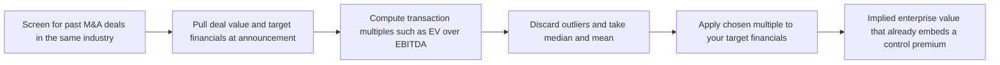
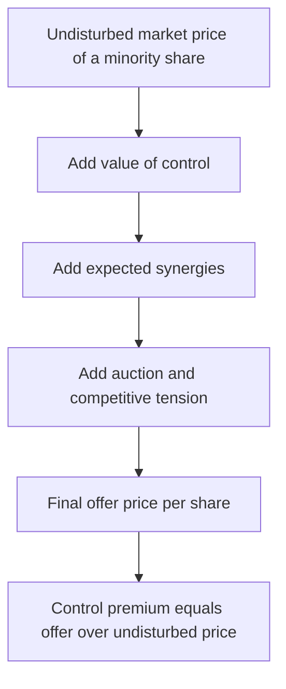
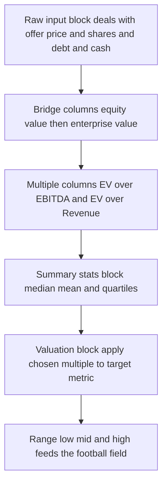
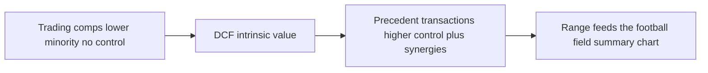
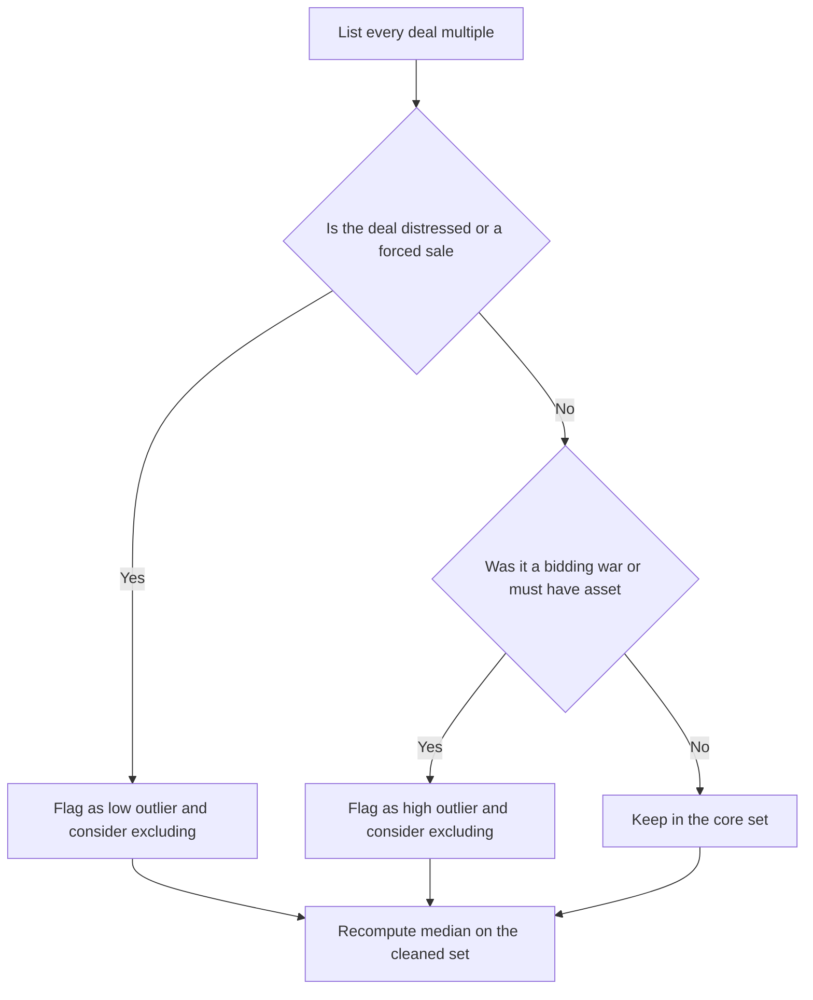

<!-- v2-deep -->

# Chapter 26 — Precedent Transaction Analysis

## 1. The Problem

You have been asked the most consequential valuation question in corporate finance: *"If we bought this company outright, what would we have to pay?"*

Notice how different that is from the question comparable-company (trading comps) analysis answers. Trading comps tell you what a **single share** trades for in the open market on a normal Tuesday, when the marginal buyer is an index fund or a retail investor buying 100 shares. But an acquirer is not buying 100 shares. An acquirer is buying **100% of the company** — every share, plus a seat in the driver's seat: the right to fire the CEO, redirect strategy, fold the target into its own operations, strip out duplicate costs, and keep 100% of the cash flows forever.

That bundle — total ownership plus control — is worth more than the sum of individual shares trading in the market. Sellers know it. Boards have a fiduciary duty to extract it. So real acquisitions almost never close at the undisturbed market price. They close at a **premium**.

Trading comps, by construction, cannot see this premium. They read prices off the public market, which is a market for minority, non-controlling stakes. If you value a takeover target using only trading comps, you will systematically **understate** what it takes to actually win the deal. You will lose auctions, or worse, advise a client to bid a number that gets laughed out of the boardroom.

You need a valuation method whose raw material is not daily share prices but **actual acquisition prices** — the real, negotiated, control-inclusive amounts that real buyers have historically paid for real companies similar to yours. That method is **Precedent Transaction Analysis** (also called "transaction comps," "deal comps," or "M&A comps").

A one-sentence numerical teaser to fix the stakes: if a peer group trades at 10.5x EBITDA but similar companies have been *bought* at a median of 14.0x, then a $120m-EBITDA target is worth roughly $1,260m to the public market and roughly $1,680m to an acquirer — a $420m, or 33%, gap that trading comps alone can never show you. That gap is what this chapter is about.

## 2. The Core Idea

Precedent Transaction Analysis values a company by looking at the **multiples paid in past M&A transactions** for comparable businesses, then applying those multiples to your target's financials.

The logic is identical in *shape* to trading comps — you build a set of benchmarks, distill them into ratios, and apply the ratios to your company — but the *inputs* are fundamentally different:

| Dimension | Trading Comps (Ch. 25) | Precedent Transactions (this chapter) |
|---|---|---|
| Raw data | Live public share prices | Historical deal prices |
| Ownership implied | Minority stake | 100% control |
| Price includes control premium | No | **Yes** |
| Point in time | Today | Whenever each deal closed |
| Typical result | Lower value | **Higher value** |
| Answers | "What's a share worth?" | "What would a buyer pay?" |

The single most important sentence in this chapter: **transaction multiples are usually higher than trading multiples for the same company, and the gap is the control premium.** Everything else is detail. If you internalize why that gap exists and how to work with it, you understand precedent transactions.

Because the *shape* of the analysis matches trading comps, the two tabs even look alike on screen: a list of benchmarks down the rows, raw inputs in the middle columns, computed multiples on the right, and a summary-statistics block at the bottom. The differences are entirely in what fills the cells — deal prices instead of market caps, LTM metrics frozen at each deal's announcement instead of everyone's latest quarter, and a "date announced" column that has no analogue in trading comps. Keep this mental map: **same skeleton, different blood.**

*Figure 26.1 — Precedent transactions read multiples off completed deals, not off the live tape.*



## 3. Why It Works

Three forces make deal prices exceed market prices, and understanding all three tells you when the method is reliable and when it lies.

**Force 1 — Control has value.** A controlling owner can do things a minority shareholder cannot: change management, alter capital structure, sell divisions, set dividend policy, and capture 100% of future cash flows. Financial theory calls this the value of control. Buyers pay for it because it is real optionality over the firm's future.

**Force 2 — Synergies.** A strategic (corporate) acquirer expects to combine the target with itself and generate value neither could alone: cost synergies (eliminate duplicate headquarters, procurement scale, shared systems) and revenue synergies (cross-selling, wider distribution). Because multiple bidders each see their *own* synergies, a competitive auction can push the price up toward the synergy value — the buyer effectively shares some of the synergy gains with the seller to win.

**Force 3 — The auction / negotiation dynamic.** Selling a whole company is a negotiated, often competitive process. A board running an auction plays bidders against each other. The winning bid is, by definition, the *highest* price someone was willing to pay — an extreme of the distribution, not the average. This is why deal prices carry a "winner's" flavor and why the method tends to produce the **high end** of a valuation range.

Add these up and you get the classic empirical fact: **control premiums** — the excess of the offer price over the target's undisturbed share price roughly one month before announcement — typically run **20%–40%** for public targets, and sometimes far higher in hot auctions or bidding wars.

*Figure 26.2 — Why a deal price sits above the undisturbed market price.*



Because the multiple you extract from a completed deal is computed on the *deal price*, it silently bakes in all three forces. When you later apply that multiple to your target, your output automatically includes a control premium — you do not add one separately. That is the method's power and its trap, both at once.

### 3.1 A numerical decomposition of one premium

Abstractions like "control" and "synergies" become concrete once you put dollars on them. Suppose a target trades undisturbed at **$40.00** per share and the winning offer is **$52.00**. The headline premium is $52.00 / $40.00 − 1 = **30%**. Where did the 30% come from? A plausible decomposition:

- **Standalone control value** — the right to run the company better even with no combination — worth about **$4.00** per share, lifting the intrinsic value to $44.00 (a 10-point contribution).
- **Shared synergy value** — the acquirer's cost and revenue synergies, of which competitive tension forced it to hand roughly half to the seller — worth about **$8.00** per share, lifting the price to $52.00 (a 20-point contribution).

$$\$40.00 \xrightarrow{+\$4.00 \text{ control}} \$44.00 \xrightarrow{+\$8.00 \text{ synergy share}} \$52.00 \quad\Rightarrow\quad 30\% \text{ premium} = 10\% + 20\%$$

You will rarely observe this split directly, but the mental model matters: a transaction multiple you pull from this deal (say EV/EBITDA on the $52 price) has *all* of it baked in. If your target has *fewer* synergy opportunities than the deals in your set — a smaller acquirer, a less consolidatable industry — the median transaction multiple will overstate what your buyer can rationally pay.

### 3.2 Translating an equity premium into a multiple uplift

Here is a subtlety that trips up beginners: a control premium is quoted on the **equity** price, but the multiple you extract is usually an **EV** multiple, and the two do not move one-for-one because net debt sits in between.

Take a company trading at **10.0x EV/EBITDA** with EBITDA of **$100m**, net debt of **$200m**, and **25m shares**. Trading EV = 10.0 × 100 = $1,000m; equity = 1,000 − 200 = $800m; price = 800 / 25 = **$32.00**. Now apply a **30% equity control premium**:

$$\text{Offer} = 32.00 \times 1.30 = \$41.60 \Rightarrow \text{Equity} = 41.60 \times 25 = \$1{,}040\text{m} \Rightarrow \text{EV} = 1{,}040 + 200 = \$1{,}240\text{m}$$

$$\text{Implied EV/EBITDA} = \frac{1{,}240}{100} = 12.4\text{x}$$

So a **30%** equity premium becomes only a **24%** EV-multiple uplift (10.0x → 12.4x, or 2.4 turns), because net debt is unchanged and dilutes the percentage on the larger EV base. The more levered the target, the wider this wedge. This is exactly why you cannot eyeball "add 30%" to a trading multiple and call it a transaction multiple — the leverage matters, and doing the arithmetic through the equity-to-EV bridge is the only safe route.

## 4. Full Technical Content

### 4.1 The master formula

Every transaction multiple has the same structure:

$$\text{Transaction Multiple} = \frac{\text{Deal Value at announcement}}{\text{Target's operating metric at announcement}}$$

The numerator is a *deal* value (control-inclusive). The denominator is the target's financial metric measured **at the time of the deal** — typically the last twelve months (LTM) figure available when the deal was announced. Keeping numerator and denominator contemporaneous is critical; more on that in Traps.

### 4.2 Getting the numerator right — Equity Value vs Enterprise Value

Deals are usually announced as a **price per share** or an **equity purchase price** (what shareholders receive). But most operating multiples need **Enterprise Value** (EV) in the numerator, because EBIT, EBITDA, and Revenue are pre-financing, capital-structure-neutral metrics available to *all* capital providers. So you must bridge:

$$\text{Equity Purchase Price} = \text{Offer price per share} \times \text{Fully diluted shares}$$

$$\text{Enterprise Value (Deal)} = \text{Equity Purchase Price} + \text{Total Debt} + \text{Preferred} + \text{Minority Interest} - \text{Cash}$$

Use the **target's** debt and cash at the time of the deal, and use **fully diluted** shares (treasury stock method for in-the-money options — see Ch. 24/25). The metric you pair each numerator with:

| Multiple | Numerator | Denominator | Why this pairing |
|---|---|---|---|
| EV / Revenue | Enterprise Value | LTM Revenue | For unprofitable or early-stage targets |
| EV / EBITDA | Enterprise Value | LTM EBITDA | The workhorse — capital-structure and D&A neutral |
| EV / EBIT | Enterprise Value | LTM EBIT | When D&A intensity differs across firms |
| P / E (Equity/Net Income) | Equity Purchase Price | LTM Net Income | Financials, or when equity value is the natural unit |
| Equity / Book Value | Equity Purchase Price | Book Equity | Banks and insurers |
| Industry-specific | EV | Subscribers, MW, EBITDAR, sq ft, boe | Sector norms (telecom, power, retail, energy) |

**Iron rule of consistency:** an EV-based numerator must sit over a pre-interest, pre-financing metric (Revenue, EBITDA, EBIT). An equity-based numerator (offer price, equity purchase price) must sit over a post-interest metric (Net Income, EPS, Book Equity). Mix these — e.g., EV / Net Income — and the multiple is nonsense.

### 4.3 Cash deals vs stock deals — pinning down the offer value

The offer *per share* is not always a fixed number. Three structures recur:

- **All-cash.** Simplest: the announced cash price *is* the offer per share, and it does not move with markets. A $50.00 cash offer is $50.00 whether the acquirer's stock rises or falls.
- **All-stock (fixed exchange ratio).** The acquirer offers a fixed number of its own shares per target share. The dollar value = exchange ratio × acquirer's share price, so the *implied* offer moves every day until close. Convention is to strike the multiple on the acquirer's undisturbed price at (or just before) announcement.
- **Mixed / cash-and-stock, plus contingent value rights (CVRs) and earnouts.** Add the cash portion, the market value of the stock portion, and — carefully — the estimated value of any contingent consideration. Deep-in-the-money CVRs get counted near face; speculative earnouts are often footnoted rather than added, to avoid inflating the multiple.

Whatever the structure, resolve it to a single **offer value per share** before bridging to EV. For stock deals this means you must also decide *whose* share price and *which date* — a choice you should disclose in a footnote so the multiple is reproducible.

### 4.4 Step-by-step BUILD logic in Excel

Build the analysis as a dedicated tab. Here is the cell-by-cell workflow, followed by a concrete column map you can copy.

**Step 1 — Screen and list the deals.** In column A, list transactions as "Acquirer / Target." Adjacent columns: announcement date, deal status (completed / pending), and a short business description. Aim for 6–15 deals. Fewer than ~5 and medians become unstable.

**Step 2 — Lay out the input block.** For each deal, create columns for the raw inputs you will need:

- Offer price per share (or announced equity value)
- Fully diluted shares outstanding of the target at announcement
- Target total debt, preferred, minority interest, cash (at announcement)
- Target LTM Revenue, EBITDA, EBIT, Net Income (at announcement)

Color raw hard-coded inputs **blue** (font `RGB 0,0,255`) so anyone auditing the model knows they came from a source, not a formula. This is standard modeling hygiene.

**A concrete column map.** So the formulas below are unambiguous, assume this layout with deal rows in **5 through 14** (ten deals) and headers in row 4:

| Col | Contents | Col | Contents |
|---|---|---|---|
| A | Acquirer / Target | H | Preferred |
| B | Date announced | I | Minority interest |
| C | Offer price per share | J | Cash |
| D | Fully diluted shares | K | Equity purchase price (calc) |
| E | LTM Revenue | L | Enterprise value (calc) |
| F | LTM EBITDA | M | EV / Revenue (calc) |
| G | Total debt | N | EV / EBITDA (calc) |

**Step 3 — Build the equity-to-EV bridge.** In a calculation column:

```
Equity Purchase Price  =  Offer_per_share * Diluted_shares
Enterprise Value       =  Equity_Purchase_Price + Debt + Preferred + Minority - Cash
```

With the map above, in `K5` type `=C5*D5` (equity purchase price), then in `L5` type `=K5+G5+H5+I5-J5` (enterprise value). Select `K5:L5` and double-click the fill handle to copy down to row 14.

**Step 4 — Compute the multiples.** In the output columns, divide. Guard against blank or negative denominators so the sheet does not throw errors or print meaningless ratios. With Revenue in `E` and EBITDA in `F`:

```
EV/Revenue   in M5:  =IF(E5<=0,"nm",$L5/E5)
EV/EBITDA    in N5:  =IF(F5<=0,"nm",$L5/F5)
```

`"nm"` means "not meaningful" — the professional flag for a negative or absurd ratio (e.g., a company with negative EBITDA). Note the **mixed reference** `$L5`: the dollar locks the EV *column* so you can drag the formula sideways into an EV/EBIT or EV/Revenue column without the numerator drifting, while the row number floats as you fill down. Format the multiple cells as number with one decimal and a trailing `x` using a custom format: `0.0"x"`.

**Step 5 — Summary statistics.** Below the deal rows (say rows 16–21), compute Min, 25th percentile, Median, Mean, 75th percentile, and Max for each multiple column. Because you flagged bad values as text `"nm"`, use functions that ignore text automatically — `MEDIAN`, `AVERAGE`, `QUARTILE.INC`, `MIN`, `MAX` all skip text cells:

```
Median   =MEDIAN(N5:N14)
Mean     =AVERAGE(N5:N14)
25th pct =QUARTILE.INC(N5:N14,1)     (equivalently PERCENTILE.INC(N5:N14,0.25))
75th pct =QUARTILE.INC(N5:N14,3)
Min      =MIN(N5:N14)
Max      =MAX(N5:N14)
```

**Prefer the median over the mean.** Deal samples are small and skewed by the occasional strategic buyer who massively overpaid; the median resists that pull. If you want a defensible "core" central tendency, some analysts also report a **trimmed mean** — e.g., `=TRIMMEAN(N5:N14,0.2)` drops the top and bottom 10% before averaging — which formalizes the "discard outliers" instinct.

**Step 6 — Apply to your target.** In a clearly separated valuation block, pull your target's own LTM metric and multiply by the chosen benchmark multiple:

```
Implied EV        =  Chosen_Multiple  *  Target_LTM_EBITDA
Implied Equity    =  Implied_EV  -  Target_Net_Debt   (Net Debt = Debt - Cash)
Implied per share =  Implied_Equity  /  Target_diluted_shares
```

Do this for a **low** case (25th percentile), **mid** (median), and **high** (75th percentile) so you produce a *range*, never a single false-precision number. A clean way to lay this out is a tiny 3-row grid whose first column holds the three multiples (referenced from the stats block, e.g. `=N16`, `=N18`, `=N20`) and whose remaining columns fan out `Implied EV`, `less Net Debt`, `Implied Equity`, and `Per share` — every cell a formula, nothing retyped.

**Step 7 — Format for output.** Right-align numbers, comma-separate thousands (`#,##0`), one decimal on multiples, and put the implied-value range into a small summary box that will feed the **football field** chart (Ch. 30). Freeze the top header row and label every unit ($ millions, x, %). A reviewer should understand the tab in thirty seconds.

*Figure 26.3 — The equity-to-EV bridge you build for every deal in the set.*


*Figure 26.4 — How the tab is physically laid out, left to right and top to bottom.*



### 4.5 Calendarization and LTM construction

The denominator must be the target's **last twelve months** metric *as of the deal's announcement*. Companies do not report LTM figures directly, so you build them from the most recent annual report plus the latest interim (stub) period:

$$\text{LTM} = \text{Full fiscal year} + \text{Latest interim stub} - \text{Prior-year comparable stub}$$

You add the newest partial year and subtract the same partial year from twelve months earlier so you never double-count. This "stub roll-forward" is one of the most common places a junior analyst quietly injects an error — see Example F for the full arithmetic and what happens if you skip it.

A related adjustment is **calendarization**: if your comp set mixes December and June fiscal-year-ends, put every company on the same clock (e.g., all on a calendar-year LTM) before comparing multiples. Otherwise a fast-growing target measured on a stale fiscal year looks artificially expensive.

### 4.6 The control-premium route as an alternative and a check

Precedent transactions are one of two ways to reach a control-inclusive value. The other is to take a *trading* multiple (minority value) and **add an explicit control premium** drawn from a control-premium study. The two should roughly agree:

$$\text{Trading (minority) value} \times (1 + \text{control premium}) \approx \text{Precedent-transaction value}$$

If your precedent-transaction output implies a 55% premium over the peer trading level but published control-premium studies for the sector cluster around 25–30%, something in your comp set is off — probably a bidding-war outlier or a synergy-rich strategic deal that your buyer cannot replicate. Running both routes and reconciling them is a professional habit that catches errors the football field would otherwise hide.

### 4.7 Where deal data comes from

An analyst is only as good as the sources feeding the tab. Standard places to find transaction data:

- **Merger proxies (DEFM14A / proxy statements)** and **tender offer documents** filed with the SEC — the gold standard, containing offer price, share counts, and the banker's own "Selected Transactions Analysis" with named comps you can reuse.
- **Company press releases and investor presentations** announcing the deal — headline price, structure, and often the multiple paid.
- **Fairness opinions** inside the proxy — bankers list the precedent transactions *they* used; a ready-made comp set.
- **Commercial databases** — Bloomberg (`MA` function), Capital IQ, FactSet, Refinitiv/Eikon, PitchBook, Mergermarket, Dealogic. These let you screen by industry, size, date, and geography.
- **Equity research** on the acquirer or sector, which frequently tabulates recent deal multiples.

Always trace a multiple back to a primary filing when the stakes are high; database figures can differ in how they define "deal value" (e.g., whether they net cash, include assumed debt, or use announcement vs. completion prices).

## 5. Worked Examples

### Example A — Building one transaction multiple end to end

BuyerCo announces it will acquire TargetCo for **$50.00 per share** in cash. TargetCo has **20 million** fully diluted shares, **$150 million** of debt, **$30 million** of cash, and no preferred or minority interest. Its LTM EBITDA is **$80 million** and LTM Revenue is **$400 million**.

**Equity purchase price:**
$$50.00 \times 20\text{m} = \$1{,}000\text{m}$$

**Enterprise value of the deal:**
$$1{,}000 + 150 - 30 = \$1{,}120\text{m}$$

**Transaction multiples:**
$$\text{EV/EBITDA} = \frac{1{,}120}{80} = 14.0\text{x} \qquad \text{EV/Revenue} = \frac{1{,}120}{400} = 2.8\text{x}$$

*Self-check:* the denominators are pre-financing (EBITDA, Revenue) and the numerator is EV — consistent. Good. These are the ratios that go into the comp table's TargetCo row.

### Example B — A full comp set and applying it to your target

You are valuing **NewTarget**, a mid-market industrial parts maker with **LTM EBITDA of $120m**, **debt of $200m**, **cash of $40m**, and **25m diluted shares**. You assemble five recent deals:

| Deal (Acquirer / Target) | Deal EV ($m) | LTM EBITDA ($m) | EV/EBITDA |
|---|---:|---:|---:|
| Alpha / Bravo | 1,120 | 80 | 14.0x |
| Cobalt / Delta | 900 | 75 | 12.0x |
| Echo / Foxtrot | 1,650 | 110 | 15.0x |
| Golf / Hotel | 640 | 58 | 11.0x |
| India / Juliet | 2,300 | 140 | 16.4x |

**Summary statistics (EV/EBITDA column):**

- Min = 11.0x, Max = 16.4x
- Sorted: 11.0, 12.0, 14.0, 15.0, 16.4 → **Median = 14.0x**
- Mean = (11.0 + 12.0 + 14.0 + 15.0 + 16.4) / 5 = 68.4 / 5 = **13.68x ≈ 13.7x**
- 25th percentile (QUARTILE.INC, position 1) = 12.0x; 75th percentile = 15.0x

**Apply the range to NewTarget** (LTM EBITDA = $120m):

| Case | Multiple | Implied EV ($m) | Less Net Debt (200 − 40 = 160) | Implied Equity ($m) | ÷ 25m shares = Per share |
|---|---:|---:|---:|---:|---:|
| Low (25th) | 12.0x | 1,440 | 160 | 1,280 | $51.20 |
| Mid (Median) | 14.0x | 1,680 | 160 | 1,520 | $60.80 |
| High (75th) | 15.0x | 1,800 | 160 | 1,640 | $65.60 |

*Self-check on the mid case:* 14.0x × $120m = $1,680m EV. Subtract net debt $160m → $1,520m equity. Divide by 25m shares → **$60.80** per share. Consistent with the arithmetic above.

So precedent transactions suggest a takeover value of roughly **$51–$66 per share**, centered near **$61**. If NewTarget currently trades at, say, $48, the implied control premium at the midpoint is $60.80 / $48.00 − 1 ≈ **27%** — squarely in the normal 20%–40% band, which is a reassuring sanity check that your comp set is sensible.

### Example C — Seeing the control premium versus trading comps

Suppose trading comps (Ch. 25) for the *same* industrial-parts peer group gave a median **EV/EBITDA of 10.5x**. Applied to NewTarget's $120m EBITDA:

$$\text{Trading-comp EV} = 10.5 \times 120 = \$1{,}260\text{m} \Rightarrow \text{Equity} = 1{,}260 - 160 = \$1{,}100\text{m} \Rightarrow \$44.00/\text{share}$$

Compare to the precedent-transaction midpoint of **$60.80**. The implied premium of the deal-based value over the trading-based value is:

$$\frac{60.80}{44.00} - 1 \approx 38\%$$

That ~38% gap **is** the control premium plus synergies embedded in the transaction multiples. This is the empirical spine of the whole chapter: same company, same EBITDA, but transaction comps land materially above trading comps because they price control and synergies. Present both, and the difference tells the story to your client.

### Example D — A stock-for-stock deal with dilutive options (treasury stock method)

Not every deal hands the target a clean cash number. **BidderCo** offers **0.80 of its own shares** for each **TargetCo** share, and BidderCo trades at **$75.00**. TargetCo has **40m basic shares** plus **3m employee options** struck at **$25.00**. Debt is **$400m**, cash **$100m**, LTM EBITDA **$210m**.

**Step 1 — Implied offer per share.** Fixed exchange ratio × acquirer price:
$$0.80 \times 75.00 = \$60.00 \text{ per share}$$

**Step 2 — Fully diluted shares via the treasury stock method.** The options are in the money ($60 > $25 strike), so they exercise. Option proceeds = 3m × $25 = **$75m**, which the company uses to buy back stock at the $60 offer price: 75 / 60 = **1.25m shares** repurchased. Net new shares = 3.00 − 1.25 = **1.75m**. Fully diluted count = 40 + 1.75 = **41.75m**.

**Step 3 — Equity purchase price and EV:**
$$\text{Equity} = 60.00 \times 41.75 = \$2{,}505\text{m}$$
$$\text{EV} = 2{,}505 + 400 - 100 = \$2{,}805\text{m}$$

**Step 4 — Multiple:**
$$\text{EV/EBITDA} = \frac{2{,}805}{210} = 13.4\text{x}$$

*Self-check and the trap:* had you lazily used the 40m **basic** count, equity would be 60 × 40 = $2,400m, EV = $2,700m, and EV/EBITDA = 12.9x — understated by half a turn. In-the-money options are real claims on the deal proceeds; the treasury stock method is not optional. Also note the offer value *floats*: if BidderCo's stock fell to $70 before close, the implied offer would drop to 0.80 × 70 = $56.00 and every downstream number would move — which is why you footnote the price and date you used.

### Example E — A distressed outlier and why the median saves you

You pull five deals and their EV/EBITDA multiples come in at **15.0x, 14.5x, 13.8x, 15.2x**, and one distressed forced sale at **6.5x** (the target was in bankruptcy and sold for scrap).

**With the outlier kept:**
- Sorted: 6.5, 13.8, 14.5, 15.0, 15.2 → **Median = 14.5x**
- Mean = (6.5 + 13.8 + 14.5 + 15.0 + 15.2) / 5 = 65.0 / 5 = **13.0x**

The single distressed deal drags the **mean** down to 13.0x — a full 1.5 turns below the median — while the **median** barely notices (14.5x). That is the entire case for leading with the median in a small, skew-prone sample.

**With the outlier excluded** (a defensible move once you read the deal's story):
- Remaining: 13.8, 14.5, 15.0, 15.2 → **Median = (14.5 + 15.0) / 2 = 14.75x**, **Mean = 58.5 / 4 = 14.625x**

Now mean and median nearly agree (14.6x vs 14.75x) and the range tightens — a sign you have removed genuine noise rather than cherry-picked. The discipline: never delete a data point silently. Flag it, footnote *why* ("distressed / Chapter 11 asset sale"), show the statistic both ways, and let the reader see the sensitivity.

### Example F — Building LTM correctly (and the cost of getting it wrong)

A deal is announced in September 2024. The target last reported full-year **FY2023 EBITDA of $100m**, and it has since filed **H1 2024 (six months) EBITDA of $58m**; the comparable **H1 2023 EBITDA was $50m**. The deal EV is **$1,512m**.

**Correct LTM:**
$$\text{LTM EBITDA} = 100 + 58 - 50 = \$108\text{m} \Rightarrow \text{EV/EBITDA} = \frac{1{,}512}{108} = 14.0\text{x}$$

**Wrong LTM (using stale FY2023 only):**
$$\frac{1{,}512}{100} = 15.1\text{x}$$

The error overstates the multiple by **1.1 turns** — and worse, it is *directional*: because the company is growing, the stale denominator is always too small, so every deal in your set skews high in the same direction, and the bias does not wash out across the sample. When you later apply that inflated median to your target, you overpay. The roll-forward — *add the new stub, subtract the year-ago stub* — is the only thing standing between you and a systematic mispricing.

### Example G — An equity multiple for a bank

Enterprise-value multiples are meaningless for banks and insurers, where debt (deposits, funding) is raw material rather than financing. You use **equity** multiples instead. A bank deal is announced at **$45.00 per share**; the target has **60m shares**, **LTM net income of $180m**, and **book equity of $1,800m**.

$$\text{Equity purchase price} = 45.00 \times 60 = \$2{,}700\text{m}$$
$$\text{P/E} = \frac{2{,}700}{180} = 15.0\text{x} \qquad \text{P/Book} = \frac{2{,}700}{1{,}800} = 1.5\text{x}$$

**Apply to your target bank** (net income $220m, book equity $1,600m, 55m shares) using the median P/E of 15.0x:
$$\text{Implied equity} = 15.0 \times 220 = \$3{,}300\text{m} \Rightarrow \text{Per share} = \frac{3{,}300}{55} = \$60.00$$

*Self-check on consistency:* the numerator (equity purchase price) sits over a post-interest metric (net income) and a book-equity metric — both equity-side, so the iron rule holds. Note there is **no** net-debt bridge here: because the multiple is already an equity multiple, the output *is* equity value, and you divide straight into shares. Applying a net-debt subtraction here would be a double error.

### Interview-style angles

These come up constantly in banking and PE interviews. Rehearse the crisp answers.

- **"Are precedent transactions higher or lower than trading comps, and why?"** Higher. Deal prices embed a control premium and shared synergies that public minority prices do not. The gap is typically 20–40%.
- **"Would you rather use trading comps or precedent transactions to value a company?"** Neither alone — they answer different questions. Trading comps give the minority/standalone value; precedents give the control value. Use both and let the football field show the spread. If forced to pick for a *takeover*, precedents are more relevant.
- **"Why might precedent transactions be *less* reliable than trading comps?"** Data is older (deals cross market cycles), samples are small and idiosyncratic, deal terms are often opaque, and each price reflects a specific buyer's synergies you may not be able to replicate.
- **"You have a strategic buyer's multiple but your client is a PE fund. Problem?"** Yes. The strategic multiple reflects revenue and cost synergies a financial sponsor cannot capture, so it overstates what your client can rationally pay. Lean on sponsor-led (LBO) precedents instead.
- **"If a target trades at 12x and precedents are at 12x, what does that tell you?"** Either the market already prices in a takeover (a rumored or in-play stock), or your precedent set is stale or non-comparable. A near-zero implied premium is a red flag to investigate, not a result to report.
- **"Do you add a control premium on top of a precedent-transaction multiple?"** Never. The premium is already inside the multiple. Adding one double-counts.

## 6. Connections

- **Trading comps (Ch. 25):** the natural companion. Trading comps set the *floor* (minority, no-control value); precedent transactions set a *higher control-inclusive* reference. Always run both.
- **DCF (Ch. 20–23):** an intrinsic cross-check. A DCF's terminal value often uses an EV/EBITDA exit multiple — and precedent transactions are one place analysts calibrate that exit multiple.
- **The football field (Ch. 30):** each method contributes a horizontal bar. Precedent transactions typically plot to the **right** (higher) of trading comps, visually confirming the premium.
- **M&A / accretion-dilution (Ch. 27–28):** the multiple you *pay* in a live deal is compared against these precedents to argue you are paying a "market" price. Deal structure and synergies feed directly from here.
- **LBO analysis (Ch. 32+):** financial-sponsor deals appear in your comp set; their entry multiples inform what a PE buyer could pay, which sets a different (often lower) reference than strategic buyers.
- **Control premium studies:** dedicated data (e.g., control premium databases) let you *add* an explicit premium to trading comps as an alternative route to the same control-inclusive answer (see Section 4.6).
- **Fairness opinions (Ch. 29 territory):** the banker's "Selected Precedent Transactions" table inside a proxy is both a source *for* your analysis and the format your *own* analysis must eventually take when defending a deal price to a board.

## 7. Traps and Common Errors

1. **Double-counting the control premium.** Transaction multiples *already* include a premium. Do not apply a precedent-transaction multiple and *then* tack on an extra 30% "control premium." You would premium the premium.
2. **Stale data / cycle mismatch.** Deals close in specific market environments. Multiples paid at the top of a boom (cheap debt, frothy strategics) overstate what a buyer would pay in a downturn. Weight recent, same-cycle deals more heavily and note the vintage of each deal.
3. **Numerator–denominator time mismatch.** Use the target's LTM metric **as of the deal announcement**, not today's figure. Pairing a 2019 deal price with 2024 EBITDA is a classic silent error.
4. **Announcement vs. completion price confusion.** Multiples are conventionally struck on the **announcement-date** deal terms. Databases sometimes store completion values; know which you are using and be consistent across the set.
5. **Mixing EV and equity metrics.** EV over Net Income, or equity value over EBITDA, is meaningless. Keep the numerator and denominator on the same side of the capital structure.
6. **Ignoring deal-specific noise.** Every deal has idiosyncrasies — a distressed forced sale (too low), a bidding war or must-have strategic asset (too high), unusual structure (earnouts, stock-for-stock, contingent value rights). One weird deal can drag your median. Read the story behind each multiple; discard true outliers and flag them.
7. **Too few or non-comparable deals.** Three deals across three different sub-industries is not a comp set. Match business model, size, geography, and growth/margin profile as closely as you can.
8. **Reporting a single number.** The method is inherently imprecise. Always give a **range** (25th–75th percentile) and lead with the median.
9. **Forgetting the equity-to-EV bridge on the target.** After computing implied EV, you must subtract the *target's* net debt to reach equity value and per-share price. Skipping this overstates equity value by the net-debt amount.
10. **Synergy blindness.** A strategic buyer's multiple reflects *its* synergies, which a financial buyer cannot replicate. If your client is a PE fund, lean on sponsor-led precedents, not strategic mega-deals.
11. **Basic instead of diluted shares.** Using basic shares on the target ignores in-the-money options, RSUs, and convertibles. Apply the treasury stock method (Example D) or you understate the equity purchase price and the multiple.
12. **Mishandling stock-deal value.** In a fixed-exchange-ratio deal the offer value drifts with the acquirer's stock. Freeze it to the announcement-date acquirer price and footnote the choice; do not accidentally use the (higher or lower) price at close.
13. **Currency and unit mismatches.** A cross-border comp set can mix USD, EUR, and GBP deal values against local-currency EBITDA. Convert everything to one currency at the deal-date FX rate before computing multiples.
14. **Counting minority-stake deals as control deals.** A purchase of 30% of a company is *not* a control transaction and carries no full control premium. Screen for deals that actually transferred control (typically majority stakes).
15. **Assumed vs. refinanced debt.** Whether the acquirer assumes the target's debt or refinances it changes how "deal value" is defined in some databases. Be consistent — ideally always use total enterprise value including assumed debt.
16. **Synergy-adjusted ("run-rate") EBITDA in the denominator.** Some announcements quote the multiple on *post-synergy* EBITDA to make the price look cheaper. For a clean comp you want the target's *reported* standalone LTM EBITDA; using run-rate EBITDA understates the true multiple paid.

## 8. First-Principles Recap

Strip everything away and the chapter reduces to a chain of simple truths. The public market prices **minority** shares. An acquirer buys the **whole** company plus **control**, and in a competitive process shares some **synergy** value with the seller — so real deals close **above** market. If you want to know what a *buyer* would pay (not what a share trades for), your evidence must be *actual deals*, not the live tape. Extract the price-to-metric ratio from each past deal, and because the price already embeds control and synergies, the ratio does too. Apply the median ratio to your target and you get a value that automatically includes a control premium. It sits above trading comps by roughly that premium — and the gap is the whole point.

Two operational corollaries fall straight out of that chain. First, **consistency is non-negotiable**: numerator and denominator must be on the same side of the capital structure and measured at the same instant in time, or the ratio is noise. Second, **the median is your friend**: deal samples are tiny, skewed, and full of idiosyncratic winners and distressed losers, so a central tendency that ignores extremes beats an average that chases them. Master those two habits and the mechanics take care of themselves.

## 9. Quick-Reference

**Core multiple:** Transaction Multiple = Deal Value ÷ Target LTM metric (both at announcement).

**Bridges:**
- Equity Purchase Price = Offer/share × Fully diluted shares
- Deal EV = Equity Purchase Price + Debt + Preferred + Minority − Cash
- Implied Equity = Implied EV − Target Net Debt
- Per share = Implied Equity ÷ Diluted shares
- LTM metric = Full fiscal year + Latest interim stub − Prior-year comparable stub

**Stock-deal offer value:** Offer/share = Exchange ratio × Acquirer price (frozen at announcement); apply treasury stock method for in-the-money options.

**Consistency:** EV ↔ Revenue / EBITDA / EBIT. Equity ↔ Net Income / EPS / Book Value. (No net-debt bridge when you already used an equity multiple.)

**Central tendency:** prefer **Median** over Mean; report 25th–75th percentile range; consider `TRIMMEAN` for a defensible trimmed average.

**Control premium:** typically **20%–40%** over undisturbed price; it is the reason transaction comps > trading comps. Cross-check via Trading value × (1 + premium) ≈ Precedent value.

**Key Excel functions:** `MEDIAN`, `AVERAGE`, `QUARTILE.INC`, `PERCENTILE.INC`, `TRIMMEAN`, `MIN`, `MAX`, `IF(...,"nm",...)` to suppress bad ratios; mixed reference `$L5` to drag numerator sideways; custom format `0.0"x"` for multiples, `#,##0` for values.

**Data sources:** merger proxies / DEFM14A, tender documents, fairness opinions, press releases, Bloomberg (MA), Capital IQ, FactSet, Refinitiv, PitchBook, Mergermarket.

**Use it when:** valuing an acquisition target, running a sell-side auction, building a fairness opinion, or setting the high end of a valuation range. **Distrust it when:** the sector has few recent deals, the market cycle has turned, or deals in your set are distressed/idiosyncratic.

*Figure 26.5 — Where precedent transactions sit relative to other methods on a football field.*



*Figure 26.6 — Triaging a comp set before you trust its median.*



## 10. Build-It-Yourself Exercise

Open Excel and build a complete precedent-transaction tab from scratch. Do not copy the numbers above — re-derive everything so the mechanics stick.

**Scenario.** You are valuing **HydraTools**, a specialty tools manufacturer: **LTM EBITDA $95m**, **LTM Revenue $520m**, **debt $180m**, **cash $25m**, **30m diluted shares**, currently trading at **$40/share**.

**Your comp set (announcement-date data):**

| Acquirer / Target | Offer/share | Diluted shares (m) | Debt ($m) | Cash ($m) | LTM EBITDA ($m) | LTM Revenue ($m) |
|---|---:|---:|---:|---:|---:|---:|
| Titan / Orion | 62.00 | 18 | 120 | 20 | 70 | 380 |
| Vega / Lyra | 45.00 | 22 | 90 | 15 | 66 | 410 |
| Nova / Sirius | 88.00 | 14 | 200 | 30 | 105 | 560 |
| Atlas / Rigel | 33.00 | 25 | 150 | 40 | 60 | 350 |
| Comet / Vela | 71.00 | 20 | 175 | 35 | 118 | 640 |

**Tasks.**
1. Build the equity-to-EV bridge for each deal (`Offer × shares`, then `+ Debt − Cash`). Color raw inputs blue.
2. Compute EV/EBITDA and EV/Revenue for each deal; format as `0.0"x"`; wrap each in an `IF` that prints `"nm"` for any non-positive denominator.
3. Compute Min, 25th percentile, Median, Mean, 75th percentile, Max for both multiple columns using `QUARTILE.INC`, `MEDIAN`, `AVERAGE`.
4. Apply the **25th / Median / 75th** EV/EBITDA multiples to HydraTools' $95m EBITDA. For each, subtract net debt (180 − 25 = 155) and divide by 30m shares to get implied price per share.
5. State the implied per-share **range** and the **midpoint**.
6. Compute the implied **control premium** at the midpoint versus the current $40 price. Where does it land relative to the normal 20%–40% band? If it looks low, which deal has the highest multiple, and what happens to the range if you re-center on the median rather than the mean?
7. **Stretch:** pull one real merger proxy (DEFM14A) from the SEC EDGAR site, find the banker's "Selected Precedent Transactions" table, and add one genuine deal to your set. Note how the banker defined "transaction value" and check it matches your bridge.

**Checkpoints to self-verify your build (do the arithmetic before peeking at your own sheet):**

- Titan / Orion: equity = 62 × 18 = **$1,116m**; EV = 1,116 + 120 − 20 = **$1,216m**; EV/EBITDA = 1,216 / 70 = **17.4x**.
- The five EV/EBITDA multiples should come out near **17.4x, 16.1x, 13.4x, 15.6x, 13.2x**. Sorted, the **median is ≈ 15.6x** and the **mean is ≈ 15.1x** — a case where the two nearly agree, so no single deal is a wild outlier.
- Applying the median 15.6x: EV = 15.6 × 95 ≈ **$1,482m**; less net debt 155 → equity ≈ **$1,327m**; ÷ 30m ≈ **$44.2/share**.
- The midpoint sits above the current $40 price, so HydraTools looks modestly undervalued relative to where peers get *bought*. Notice the implied premium here is on the smaller side of the 20%–40% band — a useful reminder that the band is a *typical range*, not a law, and that HydraTools already trades at a rich ≈14.3x (equity 1,200 + net debt 155 = EV 1,355; ÷ 95), leaving less room above.

**Self-verification target.** Your Median EV/EBITDA should land in the mid-teens (≈ 15–16x), and your implied HydraTools value should sit modestly above the current $40. If instead your median is in the low teens or below, hunt for the error: a broken bridge (forgot to add debt or subtract cash), an EV-over-equity-metric mix-up, basic instead of diluted shares, or a transposed input. When your Titan / Orion row reconciles to 17.4x and your median lands near 15.6x, the rest of the tab is trustworthy — and you understand exactly why its answer sits above your trading comps.
