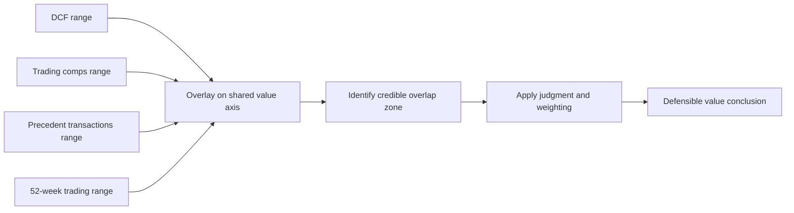
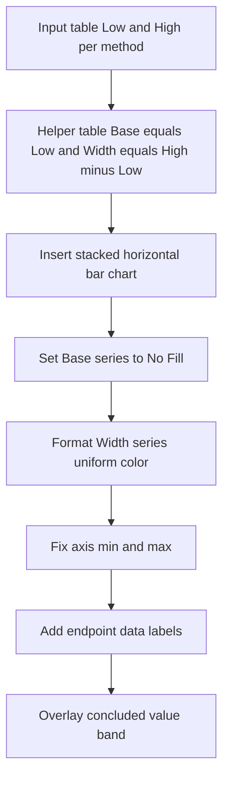
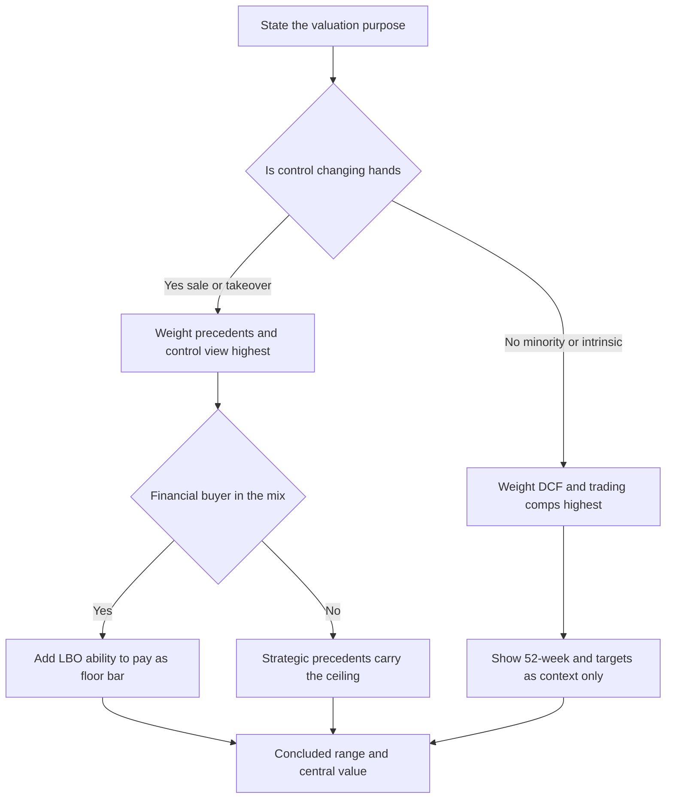

<!-- v2-deep -->

# Chapter 27 — Valuation Synthesis and the Football Field

## 1. The Problem

By the time you reach this chapter you have built four independent estimates of what a company is worth. You ran a discounted cash flow (DCF) and got an intrinsic value. You pulled a set of trading comparables and applied their multiples. You gathered precedent transactions and applied *those* multiples. And you looked at where the stock has actually traded over the last year — its 52-week range. Each method gave you not a single number but a *span* of numbers, because every method has a low case and a high case depending on the assumptions you flex.

Now the client, the investment committee, or your managing director asks the only question that matters: **"So what's it worth?"**

Here is the uncomfortable truth: your four methods will *not* agree. Your DCF might say the equity is worth $48–$62 per share. Trading comps might say $52–$68. Precedent transactions — which embed a control premium — might say $65–$85. The 52-week range might be $44–$71. If you just averaged everything you would get a mushy, indefensible number that hides more than it reveals. If you cherry-picked the method you liked you would be fooling yourself and, worse, the decision-maker.

The problem this chapter solves is **synthesis**: how to take four disagreeing ranges and turn them into one honest, defensible view of value — and how to *present* that view so a busy senior person absorbs it in four seconds. The tool for the presentation is the **football field chart**. The tool for the thinking is disciplined **triangulation**. You need both. A beautiful football field built on lazy triangulation is a liability; rigorous triangulation trapped in a spreadsheet nobody reads never influences the decision.

Notice the deeper structure of the problem. You are not trying to find *the* number — there is no such thing, because value is not a physical constant like the speed of light. You are trying to characterize a *distribution* of plausible values and then take a defensible position within it. The synthesis is therefore two jobs bolted together: an **estimation** job (where is the mass of the distribution?) and a **communication** job (how do I make a decision-maker see and trust that estimate in seconds?). Chapters before this one taught you the four instruments. This chapter teaches you to read all four dials at once and say something true.

## 2. The Core Idea

**Every valuation method is a flawed instrument measuring the same underlying thing. Overlay their ranges, understand *why* each says what it says, and let the region where credible methods overlap define your value conclusion.**

Three ideas sit inside that sentence.

First, **ranges, not points**. A single "target price" pretends to a precision that does not exist. Value is a distribution. You communicate honesty by showing a bar, and you communicate judgment by showing where *within* the overlap you land.

Second, **methods measure different things and that is a feature**. A DCF measures intrinsic, standalone value. Trading comps measure what the *public market* pays for a minority stake in similar businesses today. Precedent transactions measure what *acquirers* paid for whole companies, control premium included. The 52-week range measures actual investor behavior. When these disagree, the *gap itself is information* — a precedent-transaction range sitting far above the trading-comps range is quantifying the control premium, not contradicting it.

Third, **the football field is a communication device, not an analytical one**. The analysis happens before the chart. The chart's job is to make the analysis legible: one horizontal bar per method, all on a shared value axis, so overlap and dispersion jump off the page.

A useful mental model: think of the four methods as four witnesses to the same event who cannot collude. If three of them independently place the value near $58 and one places it at $80, you do not average to $63.50 — you interview the outlier witness and find out what they saw that the others didn't (a control premium, a synergy, a stale market price, or a modeling error). **Averaging discards the single most valuable output of the whole exercise: the reason for disagreement.**


*Figure 27.1 — Four independent ranges feed one synthesized conclusion.*

## 3. Why It Works

Triangulation works for the same reason surveyors, GPS satellites, and sniper spotters use it: **independent measurements with uncorrelated errors converge on truth faster than any single measurement.**

A DCF's biggest error sources are the discount rate and the terminal-growth / exit-multiple assumption — small changes there swing value enormously. Comps' biggest error source is comparability: no "comparable" company is truly identical, and the peer set's own mispricing flows straight into your answer. Precedent transactions' errors come from stale deal dates, different market cycles, and deal-specific synergies you can't see. The 52-week range's error is that markets can be wrong for long stretches.

Crucially, **these error sources are largely independent.** A too-high discount rate in your DCF has nothing to do with whether your peer set is trading rich. So when the DCF and the comps *both* point to roughly $55, that agreement is meaningful — two instruments with different failure modes landed in the same place. When they diverge wildly, that divergence is a red flag telling you to go find out *why* before you conclude anything.

There is a statistical intuition worth naming. If two estimators are unbiased and their errors are uncorrelated, the variance of a sensible blend is lower than the variance of either one alone — this is the same math that makes a diversified portfolio less volatile than its holdings. **Diversifying your *valuation methods* reduces the variance of your value estimate for exactly the same reason diversifying *assets* reduces portfolio variance.** The catch, and it is a big one, is the "unbiased" assumption: if a method is *systematically* off in a known direction (precedents embed a control premium; a bubbly peer set is uniformly rich), blending it in naively imports that bias. That is precisely why you weight and adjust rather than simple-average — you are correcting each estimator's known bias before you pool them.

The football field works as a *visual* because human perception reads spatial position and length far faster than it reads numbers in a table. A stack of horizontal bars on a common axis lets the eye instantly perform the overlap analysis your brain would otherwise do arithmetically. You are outsourcing the triangulation to the reader's visual cortex — which is exactly what a good chart should do. A well-built field lets a director who has never opened your model form a defensible view of value — and of your bid's fairness — before the analyst finishes saying "as you can see on page three."

## 4. Full Technical Content

### 4.1 Assembling the input ranges

Before any chart, you need a clean table of Low / High endpoints for each method, all expressed in the **same unit** — either enterprise value (EV), equity value, or per-share. Per-share is the most common football-field unit for public equities because that is how the audience thinks. Mixing units is the single most common football-field error, so fix the unit first.

If your methods natively produce **enterprise value** (comps and precedent transactions applied to EBITDA do this), you must bridge each EV endpoint to equity and then to per-share:

```
Equity Value = Enterprise Value − Net Debt − Preferred − Minority Interest
Per Share    = Equity Value / Diluted Shares Outstanding
```

Do this consistently for the Low and High of every method. A common mistake is bridging the DCF to per-share but leaving comps in EV space — the bars then live on incompatible axes and the whole chart lies.

Two subtleties inside the bridge that trip people up:

- **Net debt** = total debt − cash and cash equivalents. If a company is net-cash (cash exceeds debt), net debt is *negative*, which *adds* to equity value — do not force it positive.
- **Diluted shares** must include the dilutive effect of in-the-money options, RSUs, and convertibles under the treasury-stock method. Using basic shares understates the count and *overstates* per-share value. In a football field the per-share overstatement is invisible and uniform across bars, which makes it dangerous — every bar is wrong by the same silent factor.

Here is the canonical input structure. Build it on a tab called `Synthesis`:

| Method | Low $/sh | High $/sh | Basis for Low | Basis for High |
|---|---|---|---|---|
| 52-Week Range | 44.00 | 71.00 | 52-wk low | 52-wk high |
| Trading Comps | 52.00 | 68.00 | 25th pct EV/EBITDA | 75th pct EV/EBITDA |
| Precedent Txns | 65.00 | 85.00 | Low deal EV/EBITDA | High deal EV/EBITDA |
| DCF | 48.00 | 62.00 | WACC high / g low | WACC low / g high |

Each Low and each High should trace to a *specific, documented assumption* — never eyeball a bar. The "Basis" columns are not decoration; they are the audit trail that lets you defend every endpoint when challenged. A partner will point at the highest bar and ask "why does this top out at $85?" and your answer must be a sentence, not a shrug: "the 22× precedent is the 2023 Kraft-Heinz-style strategic deal; strip it and the band tops at $80."

### 4.2 How each range is derived (recap of endpoints)

**DCF range.** Flex the two assumptions the value is most sensitive to — typically WACC and terminal growth (perpetuity method) or WACC and exit multiple (exit-multiple method). Take a sensitivity table (Chapter on DCF sensitivity) and read the corner cases. The *low* endpoint = high WACC + low terminal value; the *high* endpoint = low WACC + high terminal value. Do **not** use the absolute extreme corners if they are implausible — use a defensible interior band (e.g., WACC ±0.5%, g ±0.5%).

**Trading comps range.** Take your peer multiple statistics — usually the 25th percentile and 75th percentile (or median ±1 turn) of EV/EBITDA and/or P/E. Apply the *low* multiple and the *high* multiple to your subject company's metric:

```
EV_low  = Low peer EV/EBITDA  × Subject EBITDA
EV_high = High peer EV/EBITDA × Subject EBITDA
```

Then bridge to per-share. Using the min and max of the peer set instead of the interquartile range makes the bar absurdly wide and outlier-driven — prefer 25th/75th percentile.

**Precedent transactions range.** Same mechanics as comps, but the multiple set comes from historical M&A deals, and these multiples embed a **control premium** (typically 20–40% over the unaffected trading price). That is why this bar usually sits *highest* on the field. Apply low and high deal multiples to the subject metric, bridge to per-share.

**52-week range.** The literal high and low closing prices of the stock over the trailing 52 weeks. For a private company this method does not exist; you would substitute a broker-target range or omit it. This bar is a *reality anchor* — where investors actually transacted — not a valuation output, so weight it lightly in the conclusion.

**Optional fifth and sixth bars.** Two more bars show up in real decks: (1) an **LBO / financial-sponsor ability-to-pay** bar, showing the maximum a private-equity buyer can pay and still hit a target IRR — it usually sits *below* the strategic-buyer precedent bar and acts as an auction *floor*; and (2) an **analyst / broker price-target** range, the high and low of published sell-side targets, another reality anchor akin to the 52-week bar. Add them when the audience cares (an auction, a take-private) and label their basis just as rigorously.

### 4.3 Building the football field chart in Excel — the stacked-bar trick

Excel has no native "range bar" chart. The universal technique is a **stacked horizontal bar chart** where you plot two series:

1. A **base/offset series** = the Low value of each method. You make this series **invisible** (no fill).
2. A **visible series** = the *width* of each bar = High − Low.

The invisible base pushes the start of each visible bar to the Low value; the visible series then extends only as far as the range width. The result: a floating bar spanning Low to High.

**A concrete cell layout** (so you can reproduce it exactly). Put this on `Synthesis`:

```
        A                 B          C          D              E
1   Method            Low        High       Base           Width
2   52-Week Range     44.00      71.00      =B2            =C2-B2
3   Trading Comps     52.00      68.00      =B3            =C3-B3
4   Precedent Txns    65.00      83.00      =B4            =C4-B4
5   DCF               48.00      62.00      =B5            =C5-B5
```

`D2:D5` is the invisible base (identical to Low); `E2:E5` is the visible width. Chart columns **A, D, E** (Method, Base, Width) — *not* Low/High directly.

**Step-by-step build:**

1. Lay out the helper columns exactly as above. The `Width` formula is `=HighCell − LowCell`. Never hardcode it, and never type the Base as a literal — link it to Low so a single input change ripples everywhere.

2. **Order the rows deliberately.** In a bar chart Excel plots the first row at the *bottom*. Analysts typically order methods top-to-bottom as: market-based first (52-week, trading comps), then transaction-based (precedent), then intrinsic (DCF) — or group "market" methods together and "fundamental" methods together. Pick an order and justify it; a common convention puts the 52-week range at the top as context and the DCF at the bottom as the anchor conclusion. To force the visual top-to-bottom order you want, remember Excel reverses it, so either reverse your table or tick **Format Axis → Categories in reverse order** on the vertical axis.

3. Select `A1:A5` together with `D1:E5` (hold Ctrl to select the two non-adjacent blocks) → **Insert → Bar Chart → Stacked Bar (2-D)**.

4. Click the **Base** series → **Format Data Series → Fill: No Fill**, **Border: No Line**. It vanishes, leaving the visible `Width` bars floating at their correct start points.

5. Format the visible `Width` series: a single restrained fill color (e.g., a muted blue), thin border. Resist the urge to color each method differently — uniform bars read as one coherent analysis. Set **Gap Width** to roughly 80–120% so bars are chunky and readable.

6. **Set the horizontal axis** (Format Axis) with a sensible fixed Minimum (e.g., 40) and Maximum (e.g., 90) so the bars fill the frame and small differences are visible. Add a currency number format (`$#,##0.00`).

7. **Add data labels for the endpoints.** The clean way: add the `Base` (Low) and the `High` as data labels. In Excel 2013+ use **Value From Cells** and point at the Low column for the left label and a High column for the right label. If your Excel version lacks that, add a third tiny helper series or manually place text boxes. At minimum, label each bar's Low and High.

8. **Add the conclusion band.** Overlay a shaded vertical rectangle spanning your concluded value range (say $58–$64) across the whole plot area. The most *robust, fully-linked* way (survives resizing) is an **XY-scatter overlay**, described in 4.3a below. The quick way is to insert a semi-transparent rectangle shape over the plot. This band is the payoff — it shows *your answer* against the *evidence*.

9. Title it plainly: **"Implied Equity Value per Share — Valuation Summary"**, with a subtitle noting the valuation date and unit.


*Figure 27.2 — The stacked-bar recipe that turns two columns into a football field.*

### 4.3a Adding a vertical line (bid price or concluded midpoint) the robust way

A shape rectangle drifts when the chart is resized. A **combo chart with an XY-scatter series** stays welded to the value axis. Here is the exact recipe to drop a vertical line at, say, a $63 bid or a $60.55 concluded value:

1. Build a two-row helper block for the line:

```
        G          H
1   x (value)   y
2   63          0
3   63          <top>     <- top = number of categories, e.g. 4
```

Both points share the same x (the value you want the line at) and span y from 0 to the category count, so the line runs vertically across all bars.

2. Right-click the chart → **Change Chart Type → Combo**. Leave the Base and Width as **Stacked Bar**; add a new series from `G2:H3` as **Scatter with Straight Lines** on the **secondary axis**.

3. The scatter uses its own axes. Set the **secondary horizontal axis** min/max identical to the primary value axis (e.g., 40 to 90) so x=63 lands in the right place, and set the **secondary vertical axis** min to 0 and max to the category count. Then **hide** both secondary axes (Format Axis → Labels: None; Line: No Line) so only the line shows.

4. Format the line: dashed, dark red, thin; add a data label "Bid $63.00". Now when inputs change, edit one cell (`G2:G3`) and the line moves.

This same technique adds *two* vertical lines for a concluded range, or a shaded band (use an **area** series between two x-values on the secondary axis). It is the difference between a chart that survives a partner's edits and one that breaks the moment someone widens the slide.

### 4.4 Weighting the methods

Averaging the four midpoints treats a shaky method as equal to a strong one. Instead, assign **explicit weights** reflecting how much you trust each method *for this specific company and purpose*:

```
Concluded Value = Σ (Weight_i × Midpoint_i),  where Σ Weight_i = 100%
```

Or weight the endpoints separately to get a concluded *range*:

```
Concluded Low  = Σ (Weight_i × Low_i)
Concluded High = Σ (Weight_i × High_i)
```

Weights are a judgment call, but the judgment follows principles:

- **DCF** deserves higher weight when cash flows are predictable and you trust the forecast; lower weight for early-stage, cyclical, or hard-to-forecast businesses (terminal value dominates and is fragile).
- **Trading comps** deserve higher weight when there is a deep set of truly comparable public peers; lower weight when "comparables" are a stretch.
- **Precedent transactions** deserve higher weight when the valuation *purpose is a sale or takeover* (control is being transferred, so a control premium is appropriate); lower weight for valuing a minority stake or a going-concern with no deal in sight.
- **52-week range** almost always gets *low* or zero weight in the formal conclusion — it is context, not a valuation. It can be excluded from the weighted math entirely and shown only as a reference bar.

Implement weights in a transparent column so anyone can see and challenge them. Do a `SUMPRODUCT` for the conclusion:

```
=SUMPRODUCT(WeightRange, MidpointRange)
```

with a check cell `=SUM(WeightRange)` that must equal 100%. Wrap that check in `=IF(ABS(SUM(WeightRange)-1)<0.001,"OK","FIX WEIGHTS")` so the model shouts at you if the weights ever drift off 100%.

**A candid caveat about weighting.** Weighted-average valuation is common in fairness opinions and required in some litigation and tax contexts, but many practitioners are wary of it: a false-precision weighted point can paper over a genuine disagreement between methods. The defensible practice is to (1) show the *range* prominently, (2) let the *overlap zone* — not the arithmetic — carry most of the argument, and (3) treat the weighted point as a *centroid of the overlap*, not a mechanical average of all four midpoints. If your weighted point lands *outside* every credible overlap, that is a signal your weights are being driven by an outlier method, and you should revisit them.

### 4.5 Purpose drives the answer

The *reason* for the valuation shifts the weighting and even which methods belong on the field:

- **Fairness opinion / sell-side M&A:** precedent transactions and the control-premium view carry weight; you are asking "what would an acquirer pay?"
- **Buy-side / intrinsic investing:** DCF and trading comps dominate; you want standalone worth versus market price.
- **IPO pricing:** trading comps of recently listed peers dominate; precedents matter less because you are pricing a *minority* float.
- **Litigation / tax / financial reporting:** methodology is often prescribed by standard or statute; document rigorously.
- **LBO / take-private auction:** the sponsor ability-to-pay bar sets the floor; strategic-buyer precedents set the ceiling; the seller's board wants to see the gap.

State the purpose on the page. The same company is legitimately worth different amounts depending on *what question* the valuation answers, and a good synthesis makes that explicit rather than hiding it.


*Figure 27.3 — Purpose routes the weighting before any number is computed.*

## 5. Worked Examples

### Example A — Full triangulation, EV to per-share, weighted conclusion

**Subject:** "Meridian Foods." LTM EBITDA = **$400m**. Net debt = **$600m**. Preferred = **$0**. Minority interest = **$0**. Diluted shares = **50m**. Current price = **$58.00**; 52-week range **$44.00–$71.00**.

**Peer trading multiples (EV/EBITDA):** 25th pct = **8.0×**, 75th pct = **10.0×**.
**Precedent deal multiples (EV/EBITDA):** low = **9.625×**, high = **11.875×**.
**DCF (per share, from sensitivity corners):** low = **$48.00**, high = **$62.00**.

**Step 1 — Trading comps to per-share.** (Realistic food-sector peer multiples of 8.0×–10.0×.)

| | Low | High |
|---|---|---|
| EV/EBITDA | 8.0× | 10.0× |
| EV = mult × 400 | 3,200 | 4,000 |
| − Net debt 600 | 2,600 | 3,400 |
| ÷ 50 shares | **$52.00** | **$68.00** |

Trading comps → **$52.00–$68.00**. ✓ (matches our Section 4 table)

**Step 2 — Precedent transactions to per-share.** Deal multiples **9.625×** (low) and **11.875×** (high) are chosen to land on round bridge outputs:

| | Low | High |
|---|---|---|
| EV/EBITDA | 9.625× | 11.875× |
| EV | 3,850 | 4,750 |
| − Net debt 600 | 3,250 | 4,150 |
| ÷ 50 | **$65.00** | **$83.00** |

Precedent → **$65.00–$83.00**. The control premium shows up as this bar sitting a full ~$13/share above the trading-comps midpoint — exactly what theory predicts. (Sanity check on the premium: comps midpoint $60.00 vs precedent midpoint $74.00 is +23%, squarely inside the 20–40% control-premium band.)

**Step 3 — Assemble the field.**

| Method | Low | High | Midpoint |
|---|---|---|---|
| 52-Week Range | 44.00 | 71.00 | 57.50 |
| Trading Comps | 52.00 | 68.00 | 60.00 |
| Precedent Txns | 65.00 | 83.00 | 74.00 |
| DCF | 48.00 | 62.00 | 55.00 |

**Step 4 — Weight (purpose = intrinsic/going-concern valuation, no deal imminent).**

| Method | Midpoint | Weight | Contribution |
|---|---|---|---|
| DCF | 55.00 | 45% | 24.750 |
| Trading Comps | 60.00 | 35% | 21.000 |
| Precedent Txns | 74.00 | 20% | 14.800 |
| 52-Week Range | 57.50 | 0% | 0.000 |
| **Total** | | **100%** | **60.55** |

`=SUMPRODUCT({55;60;74;57.5},{0.45;0.35;0.20;0})` = **$60.55**.

Weighted range using the same weights on endpoints:
Low = 0.45(48)+0.35(52)+0.20(65) = 21.60+18.20+13.00 = **$52.80**.
High = 0.45(62)+0.35(68)+0.20(83) = 27.90+23.80+16.60 = **$68.30**.

**Conclusion:** intrinsic value ≈ **$60.55**, defensible range **~$53–$68**, midpoint centered where DCF and trading comps overlap. The stock at $58 sits slightly below our central estimate — modestly undervalued on a standalone basis, though an *acquirer* could justify materially more (precedent bar to $83) because of control and synergies. That single sentence is the entire synthesis.

**Reconciliation check:** does the conclusion sit inside every credible bar's overlap? DCF (48–62) and trading comps (52–68) overlap in **52–62**; our $60.55 sits inside it. ✓ The precedent bar is pulling the *high* end up, appropriately, without dominating. The logic holds.

### Example B — Same firm, but the purpose is a sale (control changes hands)

Now Meridian's board has hired us for a **fairness opinion** on an unsolicited takeover bid. The question is no longer "standalone worth" but "what would an acquirer pay?" We re-weight toward transaction evidence and the control view:

| Method | Midpoint | Weight | Contribution |
|---|---|---|---|
| Precedent Txns | 74.00 | 45% | 33.300 |
| Trading Comps | 60.00 | 25% | 15.000 |
| DCF | 55.00 | 30% | 16.500 |
| 52-Week Range | 57.50 | 0% | 0.000 |
| **Total** | | **100%** | **64.80** |

Concluded value now ≈ **$64.80**, and the defensible range shifts up to roughly **$58–$74**. Same company, same underlying numbers, *different question* — and the answer legitimately moved up ~$4/share because control is now on the table.

**Teaching point:** a bid at, say, $63 would look *generous* under Example A's lens but merely *adequate-to-light* under Example B's. The football field for the fairness opinion would shade the **bid price as a vertical line** across the field (use the XY-scatter method in 4.3a), so directors can see instantly that $63 falls in the lower-middle of the transaction-weighted range. That visual is what earns its place in the board deck.

### Example C — Reading a divergent field (diagnosis, not just synthesis)

Suppose a fifth scenario where the DCF bar is **$85–$110** while every market method sits at **$50–$70**. Do **not** split the difference. A DCF towering above all market evidence means one of two things: (a) you genuinely see value the market doesn't — in which case *articulate the specific assumption* (higher growth, margin expansion) driving it and stress-test it — or (b) your model is wrong (WACC too low, terminal growth too aggressive). The football field's job here is **diagnostic**: the visible gap forces the question. A synthesis that reports "$78, the average" would be malpractice. The right output is: "DCF-implied value substantially exceeds market-based methods; the delta is driven by our above-consensus 4% terminal growth assumption. At consensus 2.5%, DCF falls to $62, aligning with comps. We weight the comps-consistent case." That is triangulation doing real work.

**Quantifying the diagnosis.** Terminal value under Gordon growth scales roughly with `1/(WACC − g)`. If your DCF uses WACC 8.0% and g 4.0%, the denominator is 4.0%; at consensus g 2.5% it becomes 5.5% — a factor of `4.0/5.5 = 0.73`, i.e. the terminal value (and most of the DCF) collapses by ~27%. Dropping a $95 midpoint by ~27% lands near **$69** — much closer to the $50–$70 market cluster. The football field pointed at the culprit; a one-line sensitivity confirmed it. **The chart raises the question; the model answers it.**

### Example D — Adding the LBO ability-to-pay bar (auction floor)

Return to Meridian. A private-equity sponsor is also circling, so the board wants the **financial-buyer floor** on the field. We run a quick ability-to-pay: how much can a sponsor pay today and still clear a target IRR?

**Assumptions:** 5-year hold. Entry EBITDA $400m grows to **$500m** at exit. Entry leverage ≈ 5.0× → **$2,000m** of debt, paid down to **$1,000m** by exit. Exit EV/EBITDA and target IRR flex the corners. The subject's own existing net debt of $600m is the bridge from entry EV to the per-share offer.

The mechanics: `Exit Equity = Exit EBITDA × Exit Mult − Exit Debt`; `Entry Equity = Exit Equity / (1+IRR)^5`; `Entry EV = Entry Equity + Entry Debt`; `Per Share = (Entry EV − 600) / 50`.

| Corner | Exit mult | Target IRR | Exit equity | ÷ MOIC | Entry equity | + entry debt | Entry EV | Per share |
|---|---|---|---|---|---|---|---|---|
| Low (aggressive IRR) | 8.0× | 25% | 4,000 − 1,000 = 3,000 | ÷ 3.052 | 983 | + 2,000 | 2,983 | **$47.66** |
| High (patient IRR) | 9.0× | 20% | 4,500 − 1,000 = 3,500 | ÷ 2.488 | 1,407 | + 2,000 | 3,407 | **$56.13** |

LBO ability-to-pay → **~$48–$56**. This bar sits *below* the strategic-precedent bar ($65–$83), which is the whole point: a financial buyer without synergies and needing a 20–25% IRR generally **cannot outbid a strategic** who has synergies and a lower cost of capital. On the field, the LBO bar is the *floor*, the precedent bar is the *ceiling*, and the gap between them is the negotiating room the board sells into. If the LBO bar ever tops the precedent bar, either your leverage/IRR assumptions are heroic or the strategic multiples are stale.

### Example E — Private company with no 52-week range

Value "Harbor Components," a private manufacturer, for a potential sale. **There is no traded price**, so the 52-week bar disappears and you need substitutes. EBITDA = **$120m**, net debt = **$180m**, no preferred/minority, and (being private) shares are irrelevant — you conclude in **equity value**, not per-share.

| Method | Low mult | High mult | EV low | EV high | Equity low | Equity high |
|---|---|---|---|---|---|---|
| Trading Comps | 7.0× | 9.0× | 840 | 1,080 | 660 | 900 |
| Precedent Txns | 8.5× | 10.5× | 1,020 | 1,260 | 840 | 1,080 |
| DCF (given, EV) | — | — | 900 | 1,150 | 720 | 970 |

Equity = EV − 180 throughout. So: **Trading comps $660–$900m**, **Precedent $840–$1,080m**, **DCF $720–$970m**.

Two private-company adjustments change the synthesis:

1. **Illiquidity / marketability discount.** A private stake cannot be sold on an exchange. Practitioners apply a discount for lack of marketability (DLOM), often ~10–30%, to the *trading-comps* and *DCF* bars (which reflect liquid, minority-market or standalone value). Precedent M&A multiples already reflect whole-company private transactions, so they typically are *not* re-discounted. Applying a 20% DLOM to the comps bar: $660–$900m → **$528–$720m**.
2. **No public price anchor.** With the reality-check bar gone, you lean harder on getting the peer set and deal set right, and you weight precedents heavily because the *purpose is a sale*.

**Weighted conclusion (sale purpose):** precedents 50%, discounted comps 20%, DCF 30%. Using midpoints — precedent $960m, discounted comps $624m, DCF $845m:
`0.50(960) + 0.20(624) + 0.30(845)` = 480 + 124.8 + 253.5 = **$858.3m** equity value. Range roughly **$740m–$1,000m**. The lesson: **the framework is identical; you just swap the reality-anchor bar for a marketability adjustment and conclude in equity value because there are no shares.**

### Example F — How much do the weights actually matter?

A common anxiety: "aren't the weights arbitrary — can't I get any answer I want?" Test it on Example A's midpoints (DCF 55, comps 60, precedent 74, 52-wk excluded). Compute the concluded value under three defensible weightings:

| Weighting scheme | DCF | Comps | Prec | Concluded |
|---|---|---|---|---|
| DCF-heavy (intrinsic) | 45% | 35% | 20% | 0.45·55+0.35·60+0.20·74 = **$60.55** |
| Balanced | 33.3% | 33.3% | 33.3% | (55+60+74)/3 = **$63.00** |
| Precedent-heavy (sale) | 30% | 25% | 45% | 0.30·55+0.25·60+0.45·74 = **$64.80** |

Across the entire *reasonable* span of weights, the answer moves only from **$60.55 to $64.80** — a ~7% band. The bars themselves already agree enough that the weighting is a *fine-tuning* knob, not a steering wheel. **When the methods roughly agree, the weights barely matter and the overlap zone carries the argument; when the methods badly disagree (Example C), no weighting can rescue you and you must diagnose instead.** That is the honest answer to the "aren't weights arbitrary?" objection: their leverage is bounded by how much the methods disagree, and if disagreement is large the correct move is investigation, not clever weighting.

## 6. Connections

- **Backward to the DCF chapter:** the DCF range endpoints come straight from your two-variable sensitivity (data table) on WACC and terminal value. The football field is where that sensitivity table finally earns its keep. Example C's `1/(WACC−g)` diagnosis is the same Gordon-growth mechanics from that chapter.
- **Backward to trading comps & precedent transactions:** the low/high multiples (percentiles) you computed there become the low/high bars here. The EV-to-equity bridge you learned there is reused verbatim in Section 4.1.
- **Backward to the LBO chapter:** the ability-to-pay bar in Example D is a compressed LBO — entry leverage, hold-period deleveraging, exit multiple, and a target-IRR solve, collapsed into a single low/high band.
- **Backward to the accretion/dilution model:** in an M&A context, the concluded value feeds the offer price, which feeds the accretion/dilution and the exchange ratio.
- **Forward to the pitch book / CIM:** the football field is almost always page 2 or 3 of the valuation section — right after the executive summary. It sets up every detailed method page that follows.
- **Sideways to LBO analysis:** a sponsor's "ability-to-pay" is frequently added as a *fifth bar* on the field, showing the floor a financial buyer sets in an auction — see Example D.
- **Sideways to sensitivity/scenario analysis:** the width of each bar *is* a compressed sensitivity analysis; the field is sensitivity analysis made comparative across methods.
- **Sideways to private-company / SME valuation:** Example E's DLOM and equity-value conclusion connect to the marketability-discount and minority-vs-control frameworks used outside listed markets.

## 7. Traps and Common Errors

1. **Mixing units.** Plotting some bars in EV and others in equity or per-share. Everything must be in one unit — bridge first, chart second. This is the number-one football-field error.
2. **Bars too wide.** Using min/max of the peer set instead of the interquartile range produces outlier-driven, meaningless bars. Prefer 25th–75th percentile or median ±1 turn.
3. **Extreme DCF corners.** Reading the absolute worst/best corners of the sensitivity table (e.g., WACC ±2%, g ±2%) yields a comically wide DCF bar. Use a defensible interior band and state it.
4. **Averaging everything, including the 52-week range.** The 52-week range is context, not a valuation output; folding it into the weighted math imports market noise into your conclusion.
5. **Equal-weighting by default.** Silently averaging the four midpoints treats a stretch-comp set as equal to a robust DCF. Assign and *defend* weights.
6. **Forgetting the control premium logic.** Being surprised that precedents sit above trading comps, or "correcting" it. That gap is the control premium — it belongs there.
7. **Charting before thinking.** A gorgeous field built on a sloppy bridge is worse than a table, because it looks authoritative. Reconcile the numbers first.
8. **No conclusion band.** Showing four bars and no recommended range leaves the reader to do your job. Always overlay your concluded value and, in a deal context, the offer/bid price.
9. **Hardcoding the width.** Typing the range width as a number instead of `=High−Low`. When an input changes, the bar silently lies. Everything links.
10. **Stale precedents.** Deals from a very different market cycle (e.g., pre-downturn peak multiples) inflate the precedent bar. Note the date range and consider trimming.
11. **Axis starting at zero.** Letting Excel default the axis to 0 compresses all bars into a thin band on the right, hiding the differences that matter. Fix a tight, sensible min/max.
12. **Ignoring diluted shares / treasury method.** Bridging equity value to per-share on basic shares instead of fully-diluted (options, RSUs, convertibles) overstates per-share value.
13. **Base series not linked to Low.** Typing the base as a literal instead of `=Low`. The invisible offset then drifts from the labels and the bar starts in the wrong place while the number reads right — the worst kind of silent error.
14. **Reversed category order surprise.** Forgetting Excel plots row 1 at the bottom, so your carefully ordered table renders upside down. Set "Categories in reverse order" or reorder the source.
15. **Conclusion band that isn't linked.** Drawing the concluded-range rectangle as a static shape so it no longer matches the numbers after an input change. Use the linked XY-scatter overlay (4.3a).
16. **Applying a control premium twice.** Weighting precedents heavily *and* adding a separate control premium on top of a comps-based value double-counts control. Pick one route.
17. **Forgetting marketability discounts for private targets.** A private stake is illiquid; comps/DCF bars often need a DLOM before they are comparable to precedent M&A bars (Example E).
18. **LBO bar above the strategic bar unnoticed.** If your financial-buyer floor tops the strategic ceiling, your leverage or IRR assumptions are almost certainly unrealistic — investigate before you present it.

### Interview-style angles

Football-field questions are a staple because they test whether you understand *why* methods differ, not just how to build a chart. Common prompts and crisp answers:

- **"Why is the precedent-transactions range usually the highest?"** Because deal multiples embed a control premium (typically 20–40%) — acquirers pay for control and expected synergies, which minority-market trading comps do not include.
- **"You have a DCF of $60, comps of $58, and a precedent range of $75–$90. What's the stock worth?"** On a *standalone* basis, ~$58–$60 where DCF and comps agree; the precedents tell me an *acquirer* would likely pay a control premium up into the $75+ range. The answer depends on the question — standalone versus takeout.
- **"Would you ever weight the 52-week range in your conclusion?"** Rarely, and near zero — it is a reality anchor showing where investors actually traded, not an independent valuation. I'd show it as context and keep it out of the weighted math.
- **"Two methods disagree by 40%. What do you do?"** I do not average. I diagnose: identify the single assumption driving the gap (usually terminal growth/WACC in the DCF or a rich peer set), stress-test it, and weight toward the case that reconciles with independent evidence.
- **"Why show a range instead of one number?"** Because value is a distribution, not a constant; a point target claims false precision. The range communicates honesty and the concluded band communicates judgment.
- **"Where does the LBO / sponsor bar sit and why?"** Usually below the strategic-precedent bar — a financial buyer lacks synergies and needs a high IRR, so it can't pay as much as a strategic. It marks the auction floor.
- **"How would this change for a private company?"** No 52-week bar; conclude in equity value not per-share; and apply a marketability discount to the liquid-market methods before comparing them to whole-company precedents.

## 8. First-Principles Recap

Strip everything away and here is what remains:

- Value is a **range**, not a point, because every method is an imperfect instrument.
- Four methods with **independent error modes** triangulate truth: agreement is confirming, disagreement is *diagnostic information* to be explained, never averaged away. The variance-reduction logic is the same as portfolio diversification — but only after you correct each method's known bias.
- Different methods measure **different things** — intrinsic (DCF), minority-market (trading comps), control-market (precedents), realized-behavior (52-week), financial-buyer-floor (LBO). The gaps between them are meaningful, especially the control premium.
- The **purpose** of the valuation (standalone, sale, IPO, litigation) drives which methods you trust and how you weight them. The same firm is honestly worth different amounts to different questions.
- The **football field** is a stacked-bar chart with an invisible base — a communication device that outsources triangulation to the reader's eye. It presents the analysis; it is not the analysis.
- The conclusion is a **weighted, defensible range with a stated central value**, and every endpoint traces to a documented assumption. When methods agree, the overlap carries the argument and weights barely matter; when they disagree, you diagnose rather than weight your way out.

## 9. Quick-Reference

**EV → per-share bridge:**
```
Equity Value = EV − Net Debt − Preferred − Minority Interest
Per Share    = Equity Value / Diluted Shares
```
(Net debt can be negative if net-cash; use diluted shares under treasury-stock method.)

**Football-field helper columns:**
```
Base  = Low          (LINK to Low, never a literal)
Width = High − Low
```
Chart = Stacked Horizontal Bar; set Base series to *No Fill*.

**Vertical line / band overlay (robust):** add an XY-scatter series on a hidden secondary axis with two points sharing the same x and spanning y from 0 to the category count (Section 4.3a).

**Weighted conclusion:**
```
Concluded Value = SUMPRODUCT(Weights, Midpoints)   [Σ Weights = 100%]
Concluded Low   = SUMPRODUCT(Weights, Lows)
Concluded High  = SUMPRODUCT(Weights, Highs)
Weight check    = IF(ABS(SUM(Weights)-1)<0.001,"OK","FIX")
```

**LBO ability-to-pay (one-line):**
```
Per Share = (Exit Equity / (1+IRR)^n + Entry Debt − Subject Net Debt) / Diluted Shares
Exit Equity = Exit EBITDA × Exit Multiple − Exit Debt
```

**Typical bar ordering (top → bottom):** 52-Week Range · Analyst Targets · Trading Comps · Precedent Transactions · LBO Ability-to-Pay · DCF.

**Typical range width source per method:**

| Method | Low endpoint | High endpoint |
|---|---|---|
| DCF | high WACC / low TV | low WACC / high TV |
| Trading comps | 25th pct multiple | 75th pct multiple |
| Precedent txns | low deal multiple | high deal multiple |
| 52-week | 52-wk low price | 52-wk high price |
| LBO ability-to-pay | aggressive IRR / low exit | patient IRR / high exit |

**Weighting heuristics:** DCF ↑ when cash flows predictable; comps ↑ when deep peer set; precedents ↑ when purpose is a sale/control transfer; 52-week ≈ 0% in formal math; LBO bar as auction floor.

**Order of magnitude checks:** control premium (precedent midpoint ÷ comps midpoint − 1) should sit ~20–40%; if the concluded point lands outside every credible overlap, an outlier method is dominating your weights.

**Excel functions used:** `SUMPRODUCT`, `SUM`/`IF`/`ABS` (weight check), `MEDIAN`/`PERCENTILE.INC` (peer stats), stacked bar chart, combo chart + XY scatter (overlays), Format Data Series → No Fill, Format Axis min/max, data labels Value From Cells.

## 10. Build-It-Yourself Exercise

Build the entire synthesis for a fictional company **"Aster Logistics"** and produce a working football field in Excel.

**Given:**
- LTM EBITDA = $250m; Net debt = $400m; Preferred = $50m; Minority interest = $0; Diluted shares = 40m.
- Current price = $46; 52-week range = $32–$58.
- Peer EV/EBITDA: 25th pct = 6.5×, median = 7.5×, 75th pct = 8.5×.
- Precedent deal EV/EBITDA: low = 8.0×, high = 9.5×.
- DCF sensitivity per-share corners: low = $38, high = $57.

**Tasks:**
1. On a `Synthesis` tab, build the input table (Method, Low, High, Basis columns). Bridge trading comps and precedents from EV to per-share using the formula in Section 4.1 — remember to subtract *both* net debt and preferred (total $450m). Verify: trading comps low = (6.5×250 − 400 − 50)/40 = **$29.38**; high = (8.5×250 − 400 − 50)/40 = **$41.88**. Precedent low = (8.0×250 − 450)/40 = **$38.75**; high = (9.5×250 − 450)/40 = **$48.13**.
2. Build the `Base`/`Width` helper columns with `Base = Low` (linked, not a literal) and `Width = High − Low` (never hardcode).
3. Insert a stacked horizontal bar chart; set the base series to No Fill; format the width series uniform; fix the axis to a sensible min/max (try 25–60). Check "Categories in reverse order" if the table renders upside down.
4. Add endpoint data labels (Value From Cells → Low column and High column) and a linked shaded band for your concluded range.
5. Add a weighting block. Choose weights for a **standalone/intrinsic** purpose, justify each in a comment, ensure they sum to 100% (add the `=IF(ABS(SUM()-1)<0.001,...)` check), and compute the concluded value with `SUMPRODUCT`.
6. Write a **two-sentence** conclusion in the style of Example A: state your central value, your range, and whether the $46 stock looks cheap or rich on a standalone basis.
7. **Stretch 1:** re-weight for a **sale/fairness-opinion** purpose, recompute, and add a vertical line at a hypothetical $50 bid using the XY-scatter method (4.3a). In one sentence, state whether $50 is adequate under each lens.
8. **Stretch 2:** add an **LBO ability-to-pay** bar. Assume EBITDA grows from $250m to $310m over 5 years, entry debt $1,250m paid to $700m, exit multiple 7.0×–8.0×, target IRR 20%–25%. Compute the low/high per-share floor and place it below the precedent bar. Where does it fall relative to the current $46 price?

**Self-check:** your concluded standalone value should land inside the overlap of the DCF ($38–$57) and trading-comps ($29.38–$41.88) bars — i.e., roughly **$38–$42** if you weight DCF and comps heavily. If your number falls outside every credible overlap, your weights or your bridge are wrong. Go back and reconcile before you trust the chart. Notice too that the precedent bar ($38.75–$48.13) barely clears the comps top — a *thin* control premium here (median precedent $43.44 vs median comps $35.63 is +22%, just inside the normal band), which itself is worth a sentence in your write-up. Build it in Excel — reading this is not the same as making the invisible base series disappear with your own hands.
