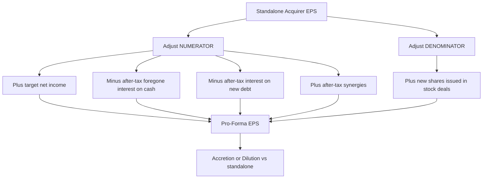
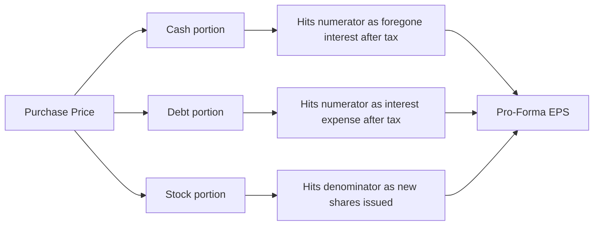
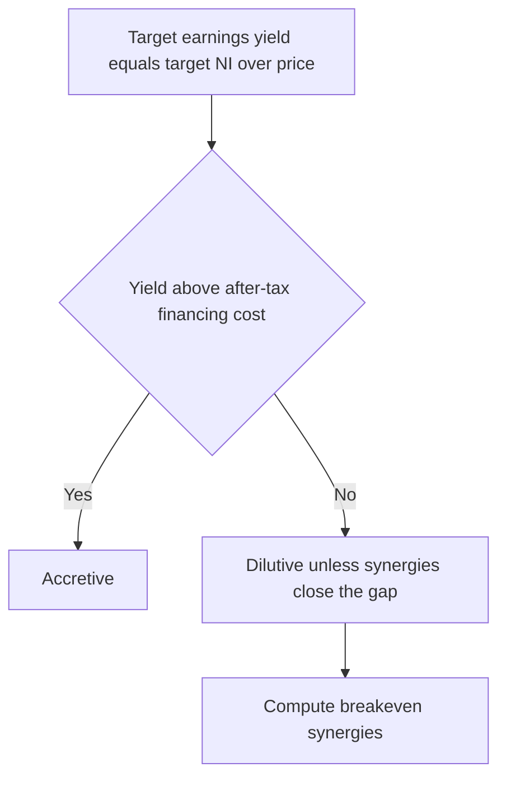
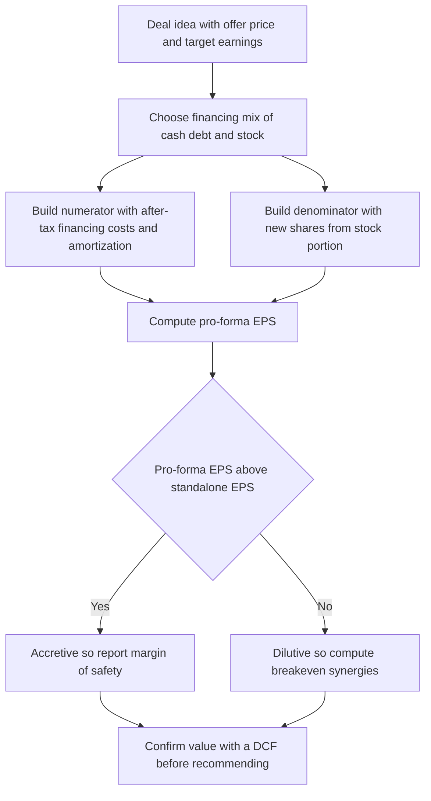

<!-- v2-deep -->

# Chapter 28 — M&A Modeling: Accretion / Dilution

## 1. The Problem

A CEO stands in front of her board and says, "I want to acquire Target Corp for $2 billion." The first question every director asks is not "Is this strategically brilliant?" It is blunt and financial: **"What does this do to our earnings per share?"**

Here is why that question dominates. A public company's stock price is, to a first approximation, its earnings per share (EPS) multiplied by a price-to-earnings (P/E) multiple. If an acquisition *raises* pro-forma EPS, the market — holding the multiple roughly constant — rewards the acquirer with a higher share price. If the deal *lowers* EPS, the acquirer's own shareholders are worse off on day one, before a single synergy is captured. Management teams are compensated on stock price and judged on EPS growth. So the accretion/dilution question is not academic. It is the political and financial gatekeeper of nearly every corporate acquisition.

The trap is that a deal can look wonderful on a strategic slide and still be **dilutive**. You pay cash that was earning interest, or you issue new shares that split the combined profit pie into more slices, or you take on debt whose after-tax interest cost eats the target's earnings. Any of these can drag EPS *down* even when the target is a fine business. Conversely, a mediocre target financed cleverly can be **accretive** and juice reported EPS — which is exactly why accretion alone is a dangerous justification for a deal (more on that trap later).

As a modeler, your job is to answer the EPS question *quickly and correctly*, and then to pressure-test it: How much does the answer depend on the financing mix? How many dollars of synergies would it take to make a dilutive deal breakeven? What happens if we swap 20% of the stock for debt? This chapter builds the machine that answers all of those in one tab of Excel.

One more framing before the mechanics. Accretion/dilution is the *fastest* of all deal screens — a competent analyst builds a first-pass answer in fifteen minutes, before any three-statement model, DCF, or synergy study exists. That speed is precisely its institutional role: it is the "back-of-the-envelope with rigor" that tells a deal team whether an idea is even worth the weeks of work a full model requires. A deal that is wildly dilutive with heroic synergy assumptions rarely survives to the modeling stage. So mastering this one tab is disproportionately valuable: it is the screen that decides which deals get modeled at all.

## 2. The Core Idea

Accretion/dilution analysis is, at its heart, one fraction compared before and after a deal:

$$\text{EPS} = \frac{\text{Net Income}}{\text{Shares Outstanding}}$$

A merger changes **both** the numerator and the denominator, and the whole art is tracking every change to each.

- **The numerator (pro-forma net income)** starts as acquirer net income + target net income, then gets *adjusted* for the after-tax cost of financing: interest lost on cash spent, interest paid on new debt, and (optionally) new intangible amortization from the purchase. Synergies, if modeled, are added here after tax.
- **The denominator (pro-forma shares)** is the acquirer's existing share count *plus any new shares issued* to pay for the target in a stock deal. A pure cash deal issues zero new shares; a pure stock deal issues a lot.

Then:

$$\text{Pro-Forma EPS} = \frac{\text{PF Net Income}}{\text{PF Shares}}, \qquad \text{Accretion/(Dilution)} = \frac{\text{PF EPS}}{\text{Standalone Acquirer EPS}} - 1$$

If pro-forma EPS is higher than the acquirer's standalone EPS, the deal is **accretive**; if lower, **dilutive**. That percentage is the number the board remembers.

The financing mix — how many dollars come from **cash on hand**, **new debt**, and **new stock** — is the single biggest lever. Cash and debt keep the share count low (good for EPS) but carry an earnings cost (foregone interest, interest expense). Stock avoids cash outflow but dilutes the denominator. The modeler's craft is showing how the accretion number moves as you slide between these three sources.

A useful mental model: think of the numerator and denominator as two ledgers. Every financing decision posts an entry to exactly one of them. Cash and debt post *earnings costs* to the numerator ledger and leave the denominator alone. Stock posts *new slices* to the denominator ledger and leaves the numerator alone. Synergies and amortization post to the numerator ledger. If you can say, for any dollar in the deal, which ledger it touches and with what sign, you already understand accretion/dilution.

*Figure 28.1 — The two levers of every M&A EPS analysis.*

## 3. Why It Works

Why does this simple fraction carry so much weight? Three reasons rooted in how equity markets and corporate finance actually behave.

**First, EPS is the denominator-normalized claim of one share on profit.** A shareholder owns a *slice* of the company. What matters to that shareholder is not total profit but profit *per slice*. A merger can grow total net income yet shrink profit-per-slice if it creates more slices (new shares) than the added income justifies. The fraction captures exactly this tension.

**Second, valuation is anchored on EPS through the P/E multiple.** Share price ≈ EPS × P/E. If a deal is accretive and the market keeps the P/E constant, the price mechanically rises. This is the "multiple arbitrage" logic: a company trading at 20x buying one at 12x is buying cheaper earnings than its own are valued at, which — all else equal — is accretive. The reason is arithmetic: you fund each dollar of the target's earnings using acquirer paper (stock) that the market prices richly, so you give up less than you get.

**Third, financing cost is a real economic drain that the fraction honors.** Money is never free. Cash spent on a deal was earning interest; that foregone interest reduces net income. New debt carries interest expense; that reduces net income too. New shares don't cost cash but permanently enlarge the denominator. By forcing every financing dollar to "pay rent" in the numerator or denominator, the analysis prevents the illusion that acquisitions are costless. This is why a cheap-looking all-cash deal can still dilute: if the target's earnings yield (target net income ÷ purchase price) is below the after-tax interest rate on the cash or debt used, the financing cost exceeds the earnings added, and EPS falls.

That last sentence is the entire theory in one line. **A deal is accretive when the after-tax yield of what you buy exceeds the after-tax cost of how you pay for it.** Everything else in this chapter is the Excel mechanics of computing those two yields precisely.

**A formal restatement worth memorizing.** Define the target's *earnings yield* as $y = \text{Target NI} \div \text{Purchase Price}$ (the reciprocal of the deal P/E). Define the blended after-tax *financing cost rate* as $c$. For the cash portion, $c_{\text{cash}} = \text{cash rate} \times (1-t)$; for debt, $c_{\text{debt}} = \text{debt rate} \times (1-t)$; for stock, the "cost" is not a rate but the acquirer's earnings yield $c_{\text{stock}} = \text{Acquirer EPS} \div \text{Acquirer Price} = 1 \div (\text{Acquirer P/E})$, because each dollar of stock issued dilutes at the acquirer's own earnings yield. The deal is accretive when $y$ exceeds the mix-weighted blend of these three costs. This is why the *same* purchase price can be accretive under one financing mix and dilutive under another: you are comparing a fixed $y$ against a $c$ that you control by choosing the mix. The modeler's job is to find the region of the mix where $y > c$.

## 4. Full Technical Content — Formulas and Build Logic

We now build the model tab piece by piece. Assume a clean single worksheet with a blue-font **Assumptions** block at top and black-font **Calculations** below. All hardcoded inputs are blue; all formulas are black. This convention (blue = input, black = formula) is non-negotiable in professional models — it lets any reviewer instantly see what is driving what.

### 4.1 The assumptions block

Lay out these inputs, each in its own cell so sensitivities can flex them:

| Input | Example cell | Notes |
|---|---|---|
| Acquirer net income | `C5` | Latest annual or forward estimate |
| Acquirer shares outstanding (diluted) | `C6` | Use *diluted* — treasury method |
| Target net income | `C7` | Standalone, pre-synergy |
| Offer price per target share | `C8` | Or total equity purchase price |
| Target shares outstanding | `C9` | To compute total deal equity value |
| % financed with cash | `C11` | Slider input, e.g. 30% |
| % financed with debt | `C12` | e.g. 40% |
| % financed with stock | `C13` | e.g. 30% — the three must sum to 100% |
| Interest rate on cash (foregone) | `C15` | Pre-tax yield the cash was earning |
| Interest rate on new debt | `C16` | Pre-tax coupon on acquisition debt |
| Acquirer share price | `C17` | To convert stock consideration into new shares |
| Combined tax rate | `C18` | Applied to interest and synergies |
| Pre-tax annual synergies | `C19` | Optional; default 0 for base analysis |

Add a **control-total check** next to the financing percentages: `=C11+C12+C13` and conditionally format the cell red if it is not exactly 1. Nothing burns an analyst faster than a financing mix that silently sums to 97%.

**Full worksheet cell-map (build target).** So you can reproduce the model with zero ambiguity, here is the complete row layout used throughout this chapter. Inputs are blue; everything from `C22` down is a black formula.

| Cell | Label | Formula / value |
|---|---|---|
| `C5` | Acquirer net income | input |
| `C6` | Acquirer diluted shares | input |
| `C7` | Target net income | input |
| `C8` | Offer price per target share | input |
| `C9` | Target shares | input |
| `C11` | % cash | input |
| `C12` | % debt | input |
| `C13` | % stock | input |
| `C14` | Mix check | `=C11+C12+C13` |
| `C15` | Cash rate (pre-tax) | input |
| `C16` | Debt rate (pre-tax) | input |
| `C17` | Acquirer share price | input |
| `C18` | Tax rate | input |
| `C19` | Pre-tax synergies | input |
| `C22` | Equity purchase price | `=C8*C9` |
| `C24` | Cash used | `=C22*C11` |
| `C25` | New debt raised | `=C22*C12` |
| `C26` | Stock consideration ($) | `=C22*C13` |
| `C27` | Sources check | `=C24+C25+C26-C22` |
| `C28` | New shares issued | `=C26/C17` |
| `C29` | PF shares | `=C6+C28` |
| `C31` | Foregone interest (a-t) | `=C24*C15*(1-C18)` |
| `C32` | New debt interest (a-t) | `=C25*C16*(1-C18)` |
| `C33` | After-tax synergies | `=C19*(1-C18)` |
| `C35` | PF net income | `=C5+C7-C31-C32+C33` |
| `C36` | PF EPS | `=C35/C29` |
| `C38` | Standalone EPS | `=C5/C6` |
| `C39` | Accretion/(dilution) % | `=C36/C38-1` |
| `C40` | Accretion/(dilution) $ | `=C36-C38` |
| `C41` | Verdict flag | `=IF(C39>=0,"ACCRETIVE","DILUTIVE")` |
| `C43` | Breakeven pre-tax synergies | `=((C38*C29)-(C5+C7-C31-C32))/(1-C18)` |

Keep this map beside you; every worked example below plugs numbers into exactly these cells.

### 4.2 Purchase price (equity consideration)

$$\text{Equity Purchase Price} = \text{Offer Price per Share} \times \text{Target Shares}$$

In Excel: `=C8*C9`. Store this in, say, `C22`. This is the total dollars the acquirer must deliver to target shareholders. (In a full merger model you would build to *enterprise value* and refinance target debt; for a clean accretion/dilution teaching model we work off equity purchase price, which is what the financing mix must fund.)

A subtlety worth flagging early: the **offer price** already embeds a control premium over the target's unaffected trading price — typically 20% to 40% for public deals. That premium is pure cost to the acquirer and is the single biggest driver of whether a deal dilutes. The higher the premium, the higher the purchase price, the more shares or debt you must raise, and the harder accretion becomes. When you later build a sensitivity table on offer price, you are implicitly sensitizing the premium.

### 4.3 Splitting the purchase price into cash, debt, and stock

Each source funds its percentage of the equity purchase price:

- Cash used: `=C22*C11` → `C24`
- New debt raised: `=C22*C12` → `C25`
- Stock issued (in $): `=C22*C13` → `C26`

Sanity link: `C24+C25+C26` must equal `C22`. Build that check cell too (`C27` = `=C24+C25+C26-C22`, which should read exactly 0).

### 4.4 New shares issued (the denominator change)

Only the **stock** portion creates new shares. Convert the dollar value of stock consideration into a share count using the acquirer's own share price:

$$\text{New Shares} = \frac{\text{Stock Consideration in Dollars}}{\text{Acquirer Share Price}}$$

Excel: `=C26/C17` → `C28`.

Then pro-forma share count:

$$\text{PF Shares} = \text{Acquirer Shares} + \text{New Shares}$$

Excel: `=C6+C28` → `C29`. This is the new denominator. Note that in a real deal the exchange ratio (target price ÷ acquirer price) drives share issuance; our stock-dollars ÷ acquirer-price formulation is the algebraic equivalent. Concretely, the **exchange ratio** is $\text{ER} = \text{Offer Price per Target Share} \div \text{Acquirer Price}$, and new shares also equal $\text{ER} \times \text{Target Shares} \times \%\text{stock}$. Both routes land on the same number — pick one and be consistent, but know that bankers quote the exchange ratio, so you must be fluent in it.

**Fixed-value vs fixed-ratio consideration.** A refinement real deals hinge on: is the stock consideration a *fixed dollar value* (target holders get $X of stock regardless of the acquirer's price at closing, so the share count floats) or a *fixed exchange ratio* (target holders get a fixed number of acquirer shares, so the *value* floats with the acquirer's price)? Our base model uses fixed dollar value (stock $ ÷ price). If instead the ratio is fixed, then a drop in the acquirer's price between signing and close *reduces* the value delivered but leaves the share count — and hence the EPS dilution — unchanged. This matters because most large stock deals use a fixed ratio, meaning the dilution is locked in at announcement, not at close.

### 4.5 The financing cost adjustments (the numerator changes)

Three earnings adjustments flow through the numerator, each taken **after tax** because interest is tax-deductible and foregone interest income would have been taxed:

**(a) Foregone interest on cash spent.** The cash used was earning interest; spending it forfeits that income:

$$\text{After-tax foregone interest} = \text{Cash Used} \times \text{Cash Rate} \times (1 - \text{Tax})$$

Excel: `=C24*C15*(1-C18)` → `C31`. This is a *reduction* to net income.

**(b) Interest on new debt.** New borrowing carries interest expense:

$$\text{After-tax new interest} = \text{New Debt} \times \text{Debt Rate} \times (1 - \text{Tax})$$

Excel: `=C25*C16*(1-C18)` → `C32`. Also a reduction.

**(c) After-tax synergies (optional).** Cost or revenue synergies add to combined earnings:

$$\text{After-tax synergies} = \text{Pre-tax Synergies} \times (1 - \text{Tax})$$

Excel: `=C19*(1-C18)` → `C33`. An *addition*.

Note: the **stock** portion has *no* numerator cost — that is the whole point. Stock avoids cash outflow and interest, paying instead by diluting the denominator. This is the fundamental trade the model is built to expose.

*Figure 28.2 — Where each financing dollar "pays rent."*

### 4.6 Pro-forma net income and pro-forma EPS

$$\text{PF Net Income} = \text{Acq NI} + \text{Tgt NI} - \text{Foregone Int} - \text{New Int} + \text{Synergies}$$

Excel: `=C5+C7-C31-C32+C33` → `C35`.

$$\text{PF EPS} = \frac{\text{PF Net Income}}{\text{PF Shares}}$$

Excel: `=C35/C29` → `C36`.

### 4.7 Standalone EPS and the accretion/dilution result

Standalone acquirer EPS: `=C5/C6` → `C38`.

Accretion/(dilution) in percent:

$$\text{Accretion/(Dilution)} \% = \frac{\text{PF EPS}}{\text{Standalone EPS}} - 1$$

Excel: `=C36/C38-1` → `C39`. Format as a percentage. Positive = accretive; negative = dilutive. Also show it in EPS dollars: `=C36-C38` → `C40`.

Add a text flag with `=IF(C39>=0,"ACCRETIVE","DILUTIVE")` in `C41`, and conditionally format green/red. This is the cell the whole model exists to produce.

### 4.8 Breakeven synergies

Boards often ask, "This deal is dilutive — how much in synergies would make it wash?" Breakeven synergies are the pre-tax synergy amount that makes pro-forma EPS *exactly equal* standalone EPS. Solve algebraically. At breakeven, PF EPS = Standalone EPS, so:

$$\text{PF Net Income}_{\text{breakeven}} = \text{Standalone EPS} \times \text{PF Shares}$$

The required *additional* after-tax income is that target net-income figure minus the current pro-forma net income (before any synergy). Then gross up for tax:

$$\text{Breakeven Pre-tax Synergies} = \frac{(\text{Standalone EPS} \times \text{PF Shares}) - \text{PF NI (ex-synergy)}}{1 - \text{Tax}}$$

In Excel, if `C35` already excludes synergies (set `C19=0` when reading this), build a dedicated cell:

`=((C38*C29)-(C5+C7-C31-C32))/(1-C18)` → `C43`.

This tells the board the exact dollar synergy hurdle. You can also express it as a % of the target's cost base for intuition. (Alternatively, Excel's **Goal Seek** — set `C39` to 0 by changing `C19` — reaches the same number interactively; the closed-form formula is preferred because it updates live.) A negative breakeven number is meaningful, not an error: it says the deal is *already* accretive and could absorb that much negative synergy (integration cost or dis-synergy) before turning dilutive — a useful "margin of safety" read.

### 4.9 Formatting discipline

- Blue font for inputs, black for formulas, green for sheet links.
- Percentages to one decimal; EPS to two decimals; share counts in millions.
- Put the headline accretion % in a bordered box at the top-right so it is the first thing a reviewer sees.
- Build the three check cells (financing sums, source sums, control total) and leave them visible — hidden checks are checks nobody trusts.

### 4.10 Intangible amortization and goodwill (the purchase-accounting adjustment)

Real acquisitions trigger **purchase price allocation (PPA)**. The premium you pay over the target's book equity is split between (i) *identifiable intangibles* with finite lives — customer relationships, developed technology, order backlog — which are **amortized** over their useful lives, and (ii) *goodwill*, the residual plug, which is **not amortized** but tested for impairment. Only the finite-lived intangibles create a recurring earnings charge that hits accretion/dilution.

Add two inputs and one calc line:

- Intangibles created (from PPA): `C45` (input, e.g. $200m)
- Amortization period in years: `C46` (input, e.g. 10)
- Annual pre-tax intangible amortization: `=C45/C46` → `C47`

Whether this charge is taken **after tax** or **pre-tax with no shield** depends on deal structure — and this is a classic interview trap:

- **Stock deal / tax-free reorganization:** the amortization is generally **not tax-deductible**, so the *full* pre-tax charge reduces net income. After-tax cost = `=C47` (no `(1-tax)` factor).
- **Asset deal or a Section 338(h)(10) election (taxable):** the amortization **is** tax-deductible, so it shields tax. After-tax cost = `=C47*(1-C18)`.

Fold the chosen figure into PF net income as an additional subtraction. The point for accretion: intangible amortization is a *non-cash* charge, so many deal teams present EPS **both** GAAP (with amortization) and "cash EPS" (adding back after-tax amortization). Cash EPS is almost always more accretive — which is exactly why acquirers love to quote it. Know both, and know that a skeptic will ask you to strip the add-back.

### 4.11 Transaction fees and financing fees

Two more real-world costs that pedantic models capture:

- **Advisory / transaction fees** (banker, legal, accounting): typically expensed, a one-time hit. Because accretion/dilution is a *run-rate* annual metric, one-time fees are usually excluded from the recurring EPS figure but shown as a note; if you do include them, do so only in the Year 1 column.
- **Financing fees** on new acquisition debt: capitalized and amortized over the debt's life, adding a small recurring pre-tax charge. Model as `financing fee ÷ debt tenor`, taken after tax, added to the numerator drag. On most deals this is a rounding item, but flagging it signals rigor.

The discipline: separate **recurring** costs (interest, intangible amortization, financing-fee amortization) which belong in the steady-state accretion number, from **one-time** costs (advisory fees, restructuring, change-of-control payments) which belong only in a Year 1 / cash-flow view. Blending them is a common and costly error.

### 4.12 The circularity caveat

The acquirer's own share price (`C17`) drives new shares issued, which drives PF EPS, which — in the real market — drives the share price. In a single-period accretion model we treat `C17` as a fixed input and avoid circularity entirely. But be aware: if you later link the model so that the acquirer's price reacts to the announced accretion, you introduce a circular reference and must enable iterative calculation. For the teaching model and for virtually all first-pass deal screens, hold price fixed at the pre-announcement level and note the assumption. This is the correct, defensible convention.

## 5. Worked Examples

### Example 1 — All-stock deal (classic multiple arbitrage)

**Acquirer:** Net income $500m, 200m diluted shares, share price $50 (so acquirer P/E = price ÷ EPS = 50 ÷ 2.50 = 20.0x). **Target:** Net income $100m, offered $1,200m of equity (target P/E on the offer = 1,200 ÷ 100 = 12.0x). Financing: **100% stock.** Tax 25%, no synergies.

Step through the machine:

| Line | Formula | Value |
|---|---|---|
| Standalone acquirer EPS | 500 / 200 | **$2.50** |
| Stock consideration ($) | 1,200 × 100% | $1,200m |
| New shares issued | 1,200 / 50 | 24.0m |
| PF shares | 200 + 24 | 224.0m |
| Foregone interest (no cash) | 0 | $0 |
| New debt interest (no debt) | 0 | $0 |
| PF net income | 500 + 100 − 0 − 0 | $600m |
| PF EPS | 600 / 224 | **$2.6786** |
| Accretion/(dilution) | 2.6786 / 2.50 − 1 | **+7.1%** |

**Accretive by 7.1%.** Why? The acquirer trades at 20x and bought earnings at 12x. It funds each $1 of target earnings with richly priced stock, so it gives up fewer slices than the added income warrants. This is the textbook result: *when the acquirer's P/E exceeds the target's, an all-stock deal is accretive.* Reconciliation check: with zero financing cost, PF NI is simply $600m; dividing by the enlarged 224m share count still beats standalone because 600/224 = $2.679 > $2.50. The arithmetic ties out.

### Example 2 — Same deal, all cash

Now finance the *same* $1,200m purchase entirely with **cash** earning 4% pre-tax. Nothing else changes.

| Line | Formula | Value |
|---|---|---|
| Cash used | 1,200 × 100% | $1,200m |
| New shares | 0 | 0 |
| PF shares | 200 + 0 | 200.0m |
| Foregone interest after tax | 1,200 × 4% × (1 − 0.25) | $36m |
| PF net income | 500 + 100 − 36 | $564m |
| PF EPS | 564 / 200 | **$2.82** |
| Accretion/(dilution) | 2.82 / 2.50 − 1 | **+12.8%** |

**Even more accretive: +12.8%.** The denominator never grew (no new shares), and the only cost was $36m of after-tax foregone interest against $100m of added earnings. Cash is "cheap" here because the target's earnings yield (100/1,200 = 8.3%) crushes the after-tax cost of cash (4% × 0.75 = 3.0%). When you buy something yielding more than your financing costs, cash and debt beat stock. This is why cash-rich acquirers love all-cash deals in low-rate environments.

### Example 3 — A dilutive mix (financing cost exceeds earnings yield)

Change the story. **Target:** Net income only $40m, but the acquirer must pay a full $1,200m (a pricey 30x deal). Financing: **50% debt at 8% pre-tax, 50% stock.** Acquirer unchanged (EPS $2.50, price $50). Tax 25%.

| Line | Formula | Value |
|---|---|---|
| Debt raised | 1,200 × 50% | $600m |
| Stock consideration | 1,200 × 50% | $600m |
| New shares | 600 / 50 | 12.0m |
| PF shares | 200 + 12 | 212.0m |
| After-tax debt interest | 600 × 8% × (1 − 0.25) | $36m |
| PF net income | 500 + 40 − 36 | $504m |
| PF EPS | 504 / 212 | **$2.3774** |
| Accretion/(dilution) | 2.3774 / 2.50 − 1 | **−4.9%** |

**Dilutive by 4.9%.** The target's earnings yield (40/1,200 = 3.3%) is *below* both the after-tax debt cost (8% × 0.75 = 6.0%) and the implicit cost of the newly issued stock. You paid too much for too little earnings, and both the numerator (interest) and denominator (new shares) worked against you.

**Breakeven synergies for Example 3.** How much pre-tax synergy makes this wash? Using the closed-form:

$$\text{Breakeven} = \frac{(2.50 \times 212) - (500 + 40 - 36)}{1 - 0.25} = \frac{530 - 504}{0.75} = \frac{26}{0.75} = \$34.67m$$

So **$34.7m of pre-tax annual synergies** turns this dilutive deal into a breakeven one. Verify: after-tax synergies = 34.67 × 0.75 = $26m; PF NI = 504 + 26 = $530m; PF EPS = 530 / 212 = $2.50 = standalone EPS exactly. The reconciliation is clean. Any synergies above $34.7m make the deal accretive; below, it stays dilutive. That single number reframes the board debate from "yes/no" to "can management credibly deliver $35m of synergies?"

*Figure 28.3 — How the same purchase price flips from accretive to dilutive as the target's earnings yield falls below financing cost.*

### Example 4 — A realistic three-way mix (cash + debt + stock reconciling end-to-end)

Real deals rarely use one source. Take the Example 1 acquirer (NI $500m, 200m shares, price $50, EPS $2.50) buying a target with NI $100m for $1,200m, but now fund it **30% cash, 40% debt, 30% stock**. Cash rate 4%, debt rate 8%, tax 25%, no synergies. This example exercises every line of the model at once.

| Line | Formula | Value |
|---|---|---|
| Equity purchase price | 30 × 40 (or given) | $1,200m |
| Cash used | 1,200 × 30% | $360m |
| New debt raised | 1,200 × 40% | $480m |
| Stock consideration | 1,200 × 30% | $360m |
| Sources check | 360 + 480 + 360 − 1,200 | 0 ✓ |
| New shares issued | 360 / 50 | 7.20m |
| PF shares | 200 + 7.20 | 207.20m |
| Foregone interest (a-t) | 360 × 4% × 0.75 | $10.80m |
| New debt interest (a-t) | 480 × 8% × 0.75 | $28.80m |
| PF net income | 500 + 100 − 10.80 − 28.80 | $560.40m |
| PF EPS | 560.40 / 207.20 | **$2.7046** |
| Accretion/(dilution) | 2.7046 / 2.50 − 1 | **+8.2%** |

**Accretive by 8.2%.** Notice this sits *between* the all-stock result (+7.1%) and would move toward the all-cash result (+12.8%) as you shift weight from stock to cash. The target here yields 8.3% (100/1,200), which beats after-tax cash cost (3.0%) and after-tax debt cost (6.0%), so cash and debt are both accretive sources — the more you use them instead of stock, the higher the accretion. The three check cells all tie: sources sum to $1,200m, mix sums to 100%, and PF NI reconciles line by line.

**What-if — swap 20 points of stock for debt.** Answering the Section 1 question directly: shift the mix to **30% cash, 60% debt, 10% stock**. Recompute: debt = $720m → after-tax interest = 720 × 8% × 0.75 = $43.2m; cash unchanged at $10.8m; stock = $120m → new shares = 120/50 = 2.4m → PF shares = 202.4m. PF NI = 500 + 100 − 10.8 − 43.2 = $546.0m. PF EPS = 546.0 / 202.4 = **$2.6976** → **+7.9%**. Slightly *less* accretive than the 40% debt case, because at an 8% coupon the after-tax debt cost (6.0%) is below the target yield (8.3%) but the marginal benefit is thinner than avoiding dilution — the model quantifies a trade that intuition can only guess at.

### Example 5 — The intangible-amortization drag (and cash EPS)

Return to Example 1's clean all-stock deal (+7.1% accretive, PF NI $600m, PF shares 224m). Now apply purchase accounting: of the $1,200m paid, suppose PPA allocates **$200m to a customer-relationship intangible amortized over 10 years** → $20m/year pre-tax amortization. Because this is a stock deal (tax-free reorg), the amortization is **not deductible**, so the full $20m hits net income.

| Scenario | PF net income | PF EPS | Accretion |
|---|---|---|---|
| No amortization (Ex. 1) | $600.0m | 600 / 224 = $2.6786 | +7.1% |
| GAAP EPS with non-deductible amort | 600 − 20 = $580.0m | 580 / 224 = $2.5893 | **+3.6%** |
| If deductible (asset deal), a-t amort 20 × 0.75 = $15m | 600 − 15 = $585.0m | 585 / 224 = $2.6116 | +4.5% |
| Cash EPS (add back after-tax amort) | $600.0m | $2.6786 | +7.1% |

**The amortization roughly halves the reported accretion**, from +7.1% to +3.6%, purely from a non-cash charge — and note the *tax treatment* alone swings the answer by nearly a full point (+3.6% non-deductible vs +4.5% deductible). This is why deal teams headline **cash EPS** (adding the after-tax amortization back), which returns to +7.1%. Both numbers are legitimate; the discipline is to label which one you are quoting. An interviewer who asks "is this deal accretive?" is often testing whether you volunteer "on a GAAP basis or a cash basis?" — the mark of someone who has actually built these models.

### Example 6 — The breakeven price in an all-stock deal (the P/E rule, proven)

A frequent interview question: *"In an all-stock deal, what is the most you can pay before it turns dilutive?"* Use the Example 1 acquirer (NI $500m, 200m shares, price $50, P/E 20x) buying a target with NI $100m, all stock, no synergies. Let the purchase price be $P$. New shares = $P/50$; PF shares = $200 + P/50$; PF NI = $600$ (no financing cost). Set PF EPS equal to standalone $2.50:

$$\frac{600}{200 + P/50} = 2.50 \;\Rightarrow\; 200 + \frac{P}{50} = 240 \;\Rightarrow\; \frac{P}{50} = 40 \;\Rightarrow\; P = \$2{,}000m$$

The breakeven purchase price is **$2,000m = 20 × $100m target earnings = exactly the acquirer's own P/E.** Pay less than 20× the target's earnings → accretive; pay more → dilutive. This proves the rule of thumb algebraically: **in a pure all-stock deal, breakeven happens when the deal P/E equals the acquirer's P/E.** The acquirer is effectively swapping its 20x-priced paper for the target's earnings, so any price below 20x earnings buys those earnings at a discount to its own valuation. Memorize this — it lets you eyeball accretion for any all-stock deal in seconds without a model: compare the two P/Es.

### Example 7 — Year 1 vs Year 2 with synergy phase-in (the crossover)

Deals are frequently "dilutive in Year 1, accretive by Year 2" because synergies phase in while costs hit immediately. Take Example 3's dilutive setup (target NI $40m, $1,200m at 50% debt / 50% stock, PF shares 212m, standalone EPS $2.50) and assume run-rate pre-tax synergies of **$60m**, phased **50% in Year 1, 100% in Year 2**. Tax 25%.

| Year | Pre-tax synergies | After-tax synergies | PF net income | PF EPS | Accretion |
|---|---|---|---|---|---|
| Year 1 | 60 × 50% = $30m | 30 × 0.75 = $22.5m | 504 + 22.5 = $526.5m | 526.5 / 212 = $2.4835 | **−0.7%** |
| Year 2 | 60 × 100% = $60m | 60 × 0.75 = $45.0m | 504 + 45.0 = $549.0m | 549.0 / 212 = $2.5896 | **+3.6%** |

**The deal crosses from −0.7% dilutive to +3.6% accretive between Year 1 and Year 2.** Because breakeven synergies were $34.7m (from Example 3), the crossover happens the moment phased-in synergies exceed $34.7m — i.e., at 34.7 / 60 = 58% of run-rate. So the deal turns accretive partway through Year 1 in reality; the annual snapshot just shows Year 1 slightly dilutive and Year 2 comfortably accretive. This "J-curve" framing — short-term pain, medium-term gain — is exactly how CFOs defend near-term dilution to their boards, and building the phase-in explicitly is what separates a real model from a single-period toy.

## 6. Connections

Accretion/dilution does not live alone; it is a hub connecting several parts of the modeling curriculum.

- **To the three-statement model:** The financing adjustments here (new debt interest, foregone interest on cash) are exactly the linkages you'd build in a full pro-forma income statement. In a complete merger model, the debt schedule feeds interest expense, which feeds net income — the same numbers, sourced dynamically rather than hardcoded. The intangible amortization from Section 4.10 flows from a purchase-price-allocation schedule that also books goodwill to the pro-forma balance sheet.
- **To valuation and multiples (Ch. on comps):** The multiple-arbitrage insight — acquirer P/E vs target P/E — is a direct application of relative valuation. Accretion in an all-stock deal is essentially betting your multiple is higher than what you pay. Example 6 turns that bet into a precise breakeven price.
- **To LBO modeling:** LBOs are the extreme case — nearly all debt, no stock issued to sellers, and the "accretion" question becomes an equity-IRR question. The after-tax-cost-vs-yield logic is identical; only the financing mix and the return metric differ.
- **To WACC and capital structure:** Choosing the cash/debt/stock mix is a capital-structure decision. The model shows the short-run EPS consequence; WACC analysis shows the long-run value consequence. Good analysts check both, because a mix that maximizes near-term accretion can worsen the balance sheet.
- **To DCF:** Accretion/dilution is a *near-term earnings* screen, not a value screen. A deal can be accretive yet value-destructive (see traps). The DCF is the value arbiter; accretion/dilution is the market-optics and feasibility screen. Serious deals pass both.
- **To purchase accounting (PPA):** The split of premium into intangibles vs goodwill, and the deductibility of the resulting amortization, is governed by deal structure (stock vs asset vs 338(h)(10)). That structural choice — normally driven by tax — feeds straight back into the accretion number via Section 4.10.

## 7. Traps and Common Errors

**Trap 1 — Confusing accretion with value creation.** This is the cardinal sin. A deal financed with cheap debt can be accretive even if it destroys value (overpaying, terrible strategic fit). Accretion is an *arithmetic* consequence of financing, not proof of a good deal. Always pair it with a DCF or value analysis. "Accretive" is necessary for optics, not sufficient for wisdom.

**Trap 2 — Forgetting the tax shield on interest.** Foregone interest and new debt interest must be taken **after tax** because interest is tax-deductible and foregone interest income would have been taxed. Modeling them pre-tax overstates the earnings drag and wrongly makes cash/debt deals look worse than they are. Every financing-cost line carries a `(1 − tax)` factor.

**Trap 3 — Using basic instead of diluted shares.** The denominator should be *diluted* shares (treasury-method options, convertibles). Using basic shares understates the share count and overstates EPS both before and after — sometimes flipping the sign of the result.

**Trap 4 — Wrong price for share issuance.** New shares issued = stock consideration ÷ **acquirer's** share price, not the target's. Mixing these up mis-sizes the denominator. Equivalently, use the exchange ratio (target offer price ÷ acquirer price) — but be consistent.

**Trap 5 — Financing mix that doesn't sum to 100%.** Always build the control-total check. A mix summing to 95% silently under-funds the deal and produces a nonsense EPS. Conditional-format the check cell red.

**Trap 6 — Ignoring foregone interest on cash.** Analysts often model debt interest but forget that spending cash *also* has a cost — the interest that cash was earning. Omitting it makes all-cash deals look artificially accretive.

**Trap 7 — Double-counting or mis-signing synergies.** Synergies are added *after tax* to the numerator, once. Don't also bake them into target net income, and watch the sign — cost synergies add, integration costs subtract.

**Trap 8 — Treating the result as static.** The headline accretion number is only as good as the assumed share price and rates, which move daily. Present it as a *sensitivity table* across financing mix and offer price, not a single point estimate.

**Trap 9 — Wrong tax treatment of intangible amortization.** In a stock deal (tax-free reorg) the amortization is usually *non-deductible* — the full pre-tax charge hits earnings with no shield. In an asset deal or 338(h)(10) election it *is* deductible. Applying `(1 − tax)` in a stock deal understates the drag; omitting it in an asset deal overstates it. Example 5 shows the swing is nearly a full point of accretion.

**Trap 10 — Blending one-time and recurring costs.** Advisory fees, restructuring charges, and change-of-control payments are one-time and belong only in a Year 1 / cash view. Interest, intangible amortization, and financing-fee amortization are recurring and belong in the steady-state number. Mixing them corrupts both.

**Trap 11 — Quoting cash EPS without saying so.** Cash EPS (adding back after-tax amortization) is almost always more accretive than GAAP EPS. Both are valid, but presenting cash EPS as *the* answer without the label is how deal teams flatter dilutive deals. Always state the basis.

**Trap 12 — Forgetting the control premium is pure cost.** The offer price embeds a 20–40% premium over the unaffected price. Sensitizing "offer price" is really sensitizing the premium; a deal that only works at a 5% premium is not a real deal.

### Interview angles

These are the ways this topic actually gets tested:

- **"An all-stock deal — is it accretive or dilutive?"** Compare the two P/Es. Acquirer P/E > target (deal) P/E → accretive; equal → breakeven; lower → dilutive. Prove it with Example 6 if pushed.
- **"Why can an all-cash deal still be dilutive?"** When the target's earnings yield (target NI ÷ price) is below the after-tax cost of the cash or debt used. The financing costs more than the earnings it buys.
- **"Company A (P/E 25x) buys Company B (P/E 15x), all stock. Accretive?"** Yes — higher-multiple acquirer, lower-multiple target, all stock is the textbook accretive combination. Then they'll ask what makes it dilutive: switch to expensive debt, or add non-deductible intangible amortization, or the target's growth justifies a premium that pushes the deal P/E above 25x.
- **"Walk me through the effect of financing 100% with debt at rate r."** New shares zero (denominator flat); numerator drops by debt × r × (1 − tax). Accretive iff target earnings yield > r × (1 − tax).
- **"What is breakeven synergies and why do boards ask for it?"** The pre-tax synergy that equates PF EPS to standalone EPS; it converts a yes/no dilution verdict into a management-feasibility question.
- **"Cash vs stock — which is more accretive and when?"** Cash/debt when target yield beats after-tax financing cost (common); stock when the acquirer's P/E richly exceeds the deal P/E and rates are high. The model resolves it precisely for any mix.
- **"GAAP or cash EPS?"** Always clarify the basis. Volunteering the distinction signals real modeling experience.

## 8. First-Principles Recap

Strip everything away and one sentence remains: **a deal is accretive when the after-tax yield of what you buy exceeds the after-tax cost of how you pay.**

- EPS is profit *per slice*. A merger changes total profit (numerator) and the number of slices (denominator). Track both.
- **Cash** and **debt** keep slices constant but cost after-tax interest (foregone or paid). **Stock** costs no interest but adds slices. That is the eternal trade.
- Accretion in an all-stock deal ≈ acquirer P/E higher than the P/E paid (breakeven price = acquirer P/E × target earnings, proven in Example 6). Accretion in a cash/debt deal ≈ target earnings yield higher than after-tax financing cost.
- Purchase accounting adds a non-cash intangible-amortization drag whose *tax treatment depends on deal structure* — this is where GAAP EPS and cash EPS diverge.
- Breakeven synergies convert a yes/no dilution verdict into a management-feasibility question: "Can we deliver $X of synergies?"
- Accretive ≠ good. It is a market-optics and feasibility screen that every deal must pass, but it never replaces a value (DCF) analysis.

Once these six points are second nature, the Excel build is mechanical — you are just giving each financing dollar its correct home in the numerator or denominator.

*Figure 28.4 — The analyst's decision flow from a deal idea to a defensible accretion verdict.*

## 9. Quick-Reference

| Quantity | Formula | Excel pattern |
|---|---|---|
| Equity purchase price | Offer price × target shares | `=C8*C9` |
| Cash / debt / stock $ | Purchase price × mix % | `=C22*C11` etc. |
| New shares issued | Stock $ ÷ acquirer price | `=C26/C17` |
| Exchange ratio | Offer price per target share ÷ acquirer price | `=C8/C17` |
| PF shares | Acq shares + new shares | `=C6+C28` |
| Foregone interest (a-t) | Cash × cash rate × (1−tax) | `=C24*C15*(1-C18)` |
| New debt interest (a-t) | Debt × debt rate × (1−tax) | `=C25*C16*(1-C18)` |
| Intangible amort (pre-tax) | Intangibles ÷ life | `=C45/C46` |
| Amort drag, stock deal (non-deductible) | full pre-tax charge | `=C47` |
| Amort drag, asset deal (deductible) | pre-tax × (1−tax) | `=C47*(1-C18)` |
| After-tax synergies | Pre-tax synergies × (1−tax) | `=C19*(1-C18)` |
| PF net income | AcqNI+TgtNI−forgone−newint+syn | `=C5+C7-C31-C32+C33` |
| PF EPS (GAAP) | PF NI ÷ PF shares | `=C35/C29` |
| Cash EPS | (PF NI + a-t amort) ÷ PF shares | `=(C35+C47*(1-C18))/C29` |
| Standalone EPS | Acq NI ÷ acq shares | `=C5/C6` |
| Accretion/(dilution) % | PF EPS ÷ standalone − 1 | `=C36/C38-1` |
| Breakeven synergies | (StdEPS×PFshares − PF NI ex-syn) ÷ (1−tax) | `=((C38*C29)-(C5+C7-C31-C32))/(1-C18)` |
| Breakeven all-stock price | Acquirer P/E × target NI | `=(C17/C38)*C7` |

**Rules of thumb:** All-stock deal is accretive if acquirer P/E > deal P/E (breakeven price = acquirer P/E × target earnings). Cash/debt deal is accretive if target earnings yield > after-tax financing rate. Always take interest and synergies after tax. Watch amortization tax treatment (deductible only in asset/338 deals). Distinguish GAAP EPS from cash EPS. Always use diluted shares. Always check the financing mix sums to 100%. Accretive is not the same as value-creating.

## 10. Build-It-Yourself Exercise

Open a blank Excel sheet and reproduce the model, then push it further. **Build in Excel — don't just read.**

**Part A — Core build.** Enter this data as blue-font inputs: Acquirer NI $800m, 400m diluted shares, share price $60. Target NI $120m, target shares 50m, offer price $30/share. Tax 25%. Cash rate 3%, debt rate 7%. No synergies. Build every calculation line from Section 4 using the cell-map in 4.1. Then compute accretion/dilution for three mixes:

1. 100% stock
2. 100% cash
3. 50% debt / 50% stock

*(Check figures: equity purchase price = $1,500m. Acquirer standalone EPS = $2.00, P/E = 30x. All-stock issues 25m shares → PF shares 425m, PF NI $920m, PF EPS $2.165 → +8.2% accretive. All-cash: after-tax foregone interest = 1,500 × 3% × 0.75 = $33.75m → PF NI $886.25m ÷ 400m = $2.216 → +10.8% accretive. 50/50 debt/stock: debt $750m → after-tax interest = 750 × 7% × 0.75 = $39.375m → PF NI $880.625m; new shares 750/60 = 12.5m → PF shares 412.5m → PF EPS $2.135 → +6.7% accretive. Explain why cash is the most accretive: the target yields 120/1,500 = 8.0%, far above the after-tax cash cost of 3% × 0.75 = 2.25%, and cash adds zero shares.)*

**Part B — Breakeven.** Make the 50/50 debt/stock mix genuinely dilutive by raising the offer price to **$70/share** (purchase price $3,500m; debt now $1,750m at 7%, stock $1,750m). Compute the accretion/dilution, then use the closed-form breakeven-synergies formula to find the pre-tax synergy that makes it wash. Confirm with Goal Seek (set the accretion cell to 0 by changing the synergy input). The two answers must match.

*(Check figures: new shares 1,750/60 = 29.167m → PF shares 429.167m. After-tax debt interest = 1,750 × 7% × 0.75 = $91.875m → PF NI ex-syn = 800 + 120 − 91.875 = $828.125m. PF EPS = 828.125 / 429.167 = $1.9296 → −3.5% dilutive. Breakeven pre-tax synergies = (2.00 × 429.167 − 828.125) ÷ 0.75 = (858.333 − 828.125) ÷ 0.75 = 30.208 ÷ 0.75 = $40.28m. Verify: after-tax synergy 40.28 × 0.75 = $30.21m → PF NI $858.33m ÷ 429.167 = $2.00 = standalone EPS exactly.)*

**Part C — Sensitivity table.** Build a two-variable data table with **offer price per share** down the rows ($26 to $34 in $2 steps) and **% stock financing** across the columns (0%, 25%, 50%, 75%, 100%), outputting the accretion/dilution %. Conditionally format green for accretive, red for dilutive. Study the boundary line where the deal flips sign — this single grid is what an M&A analyst actually presents to a deal team.

**Part D — Purchase accounting.** Extend Part A's all-cash case: allocate $300m of the $1,500m purchase price to an intangible amortized over 10 years ($30m/year pre-tax). Because this is a taxable cash/asset deal, the amortization is **deductible** — so the after-tax drag is 30 × 0.75 = $22.5m. Recompute GAAP EPS (PF NI 886.25 − 22.5 = $863.75m ÷ 400m = $2.159 → +8.0% accretive, down from +10.8%) and cash EPS (add the $22.5m back → $2.216 → +10.8%). Confirm the amortization erodes roughly 2.8 points of GAAP accretion, and explain to yourself why cash EPS is unchanged.

**Part E — Phase-in crossover.** Take Part B's dilutive $70 deal and add run-rate pre-tax synergies of $80m phased 50% in Year 1 and 100% in Year 2. Show Year 1 and Year 2 accretion, and compute the exact fraction of run-rate at which the deal crosses to accretive (it is breakeven synergies ÷ run-rate = 40.28 / 80 = 50.3%). State in one sentence when the deal turns accretive.

**Stretch:** Wire a data-validation dropdown that toggles deal structure between "stock (non-deductible amort)" and "asset (deductible amort)" and have the amortization line switch its `(1 − tax)` factor with an `IF`. Watch the headline accretion move as you flip structure — this is the tax-vs-EPS tension that drives real deal negotiations.
