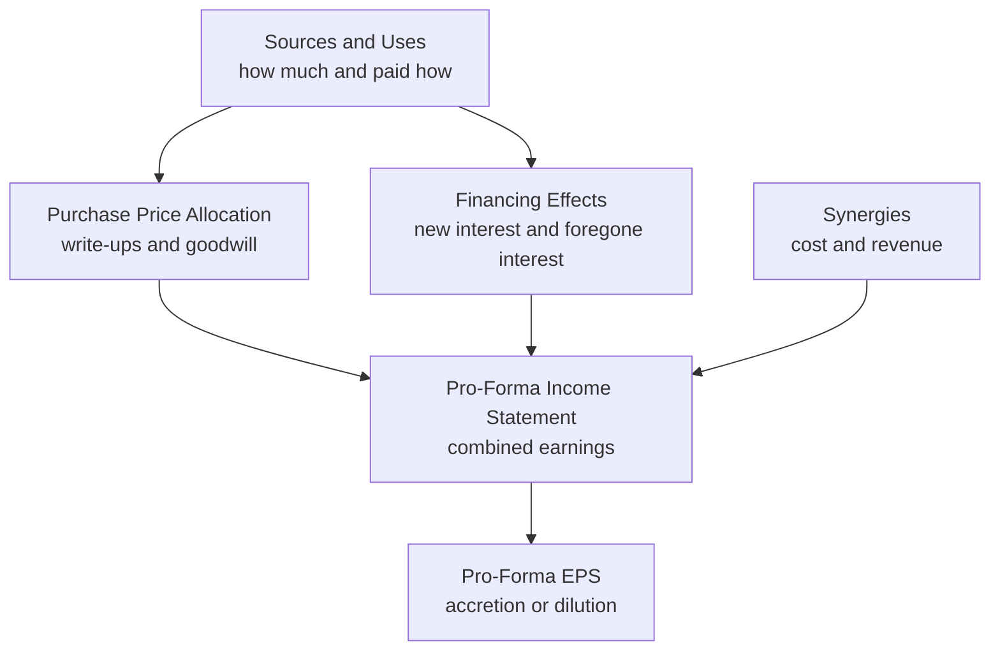
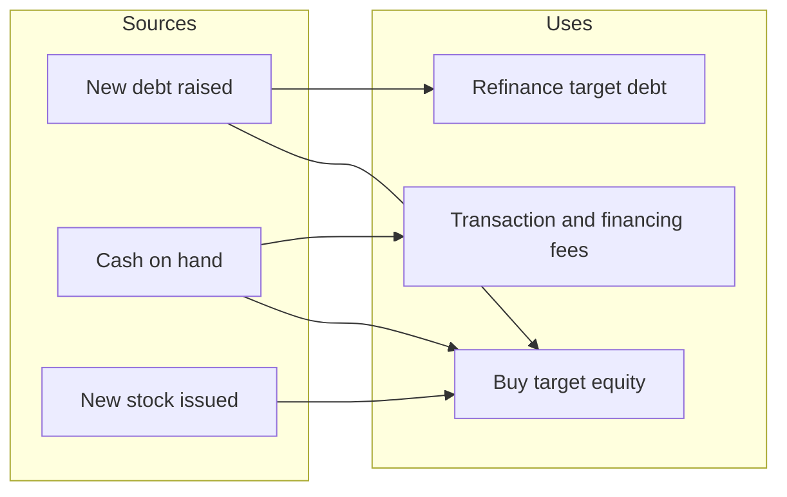
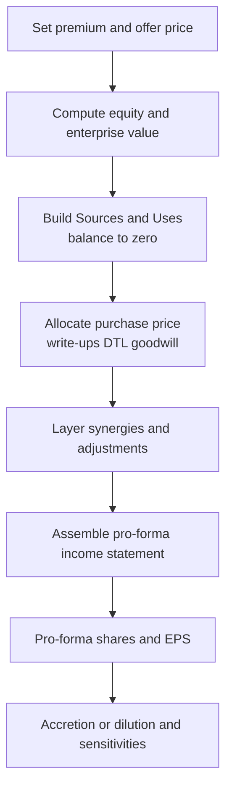
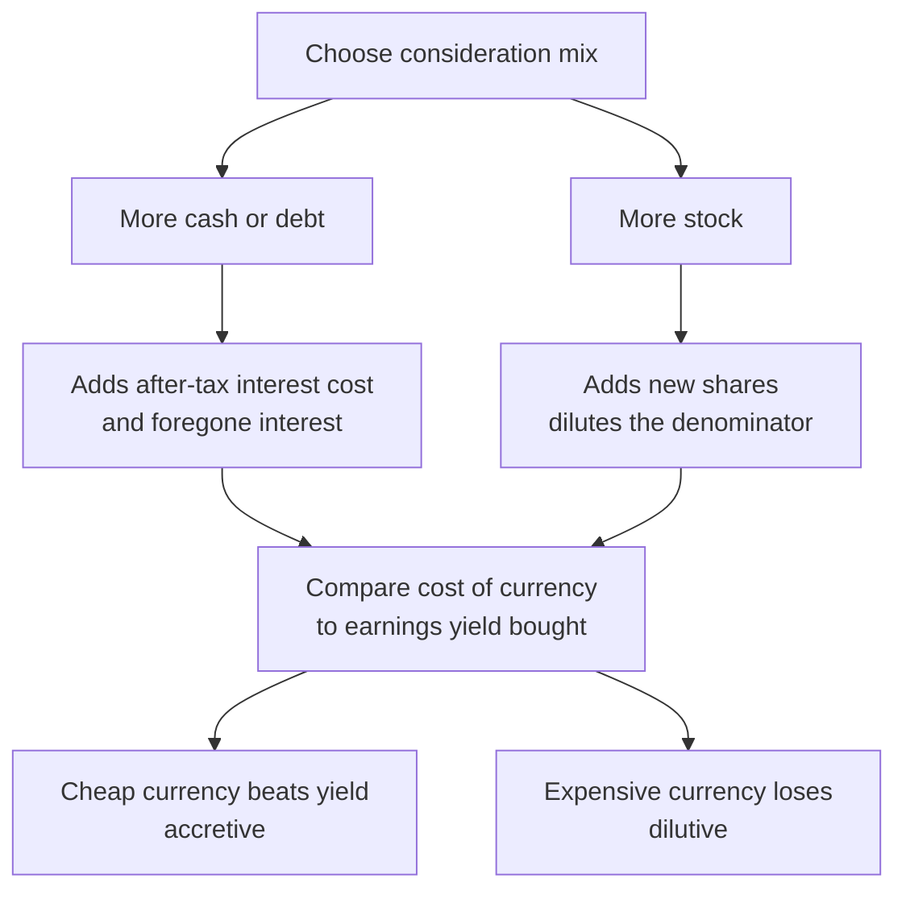

<!-- v2-deep -->

# Chapter 29 — M&A Synergies and the Full Merger Model

## 1. The Problem

You are an analyst at an acquirer. The CEO walks in and says: "We want to buy TargetCo for roughly $1.2 billion. Should we pay in cash, stock, or debt? And — the board's first question — will this deal make our earnings per share go *up* or *down*?"

That single question hides an entire machine. To answer it you must combine two companies' income statements, decide how much you pay and where the money comes from, revalue the target's balance sheet, create goodwill, layer in the extra interest expense from any new debt, subtract the extra amortization and lost interest income, add back the *synergies* you promise to deliver, count the new shares you issue, and only *then* divide the combined net income by the combined share count to get pro-forma EPS.

Get any single link wrong and the answer flips. A deal that looks 8% accretive can become 3% dilutive once you correctly account for foregone interest on the cash you spent, or the amortization of an intangible the accountants insist on recognizing. The **merger model** is the tool that keeps all of these moving parts honest and connected. It is the single most tested, most build-in-an-interview, most-used-on-the-desk model in all of M&A. This chapter builds it end to end.

Notice what the CEO is *really* asking. There are three nested questions stacked inside "will EPS go up." First, **how much** — the offer price, driven by the premium over the unaffected trading price. Second, **how paid** — the mix of cash, debt, and stock, which is the single biggest driver of accretion or dilution. Third, **what do we get** — the target's standalone earnings *plus* synergies, minus the accounting frictions the deal creates (amortization, foregone interest, fees). The merger model is nothing more than a disciplined way to hold all three answers in one place so that changing any assumption instantly re-prices EPS. Master it and you can answer the CEO in the room, on a laptop, in fifteen minutes — which is exactly why interviewers ask you to build one on a napkin.

## 2. The Core Idea

A merger model answers one deceptively simple question:

> **Are the combined company's earnings per share, after the deal, higher or lower than the acquirer's earnings per share would have been on its own?**

If higher, the deal is **accretive**. If lower, it is **dilutive**. EPS is the yardstick because public-market investors reward EPS, and boards are judged on it. But EPS accretion is only a *screening* metric — a fast proxy. Underneath it sits real economics: you are buying a stream of cash flows (the target's net income *plus synergies*) and paying for it with some mix of your own cash (which was earning interest), new debt (which costs interest), and new stock (which dilutes ownership). Accretion happens when the *earnings you buy* exceed the *cost of what you gave up*.

Everything in the model flows from three engines that must reconcile with each other:



*The three engines — Sources and Uses, Purchase Price Allocation, and Financing — all feed the pro-forma income statement, which produces EPS.*

Two clarifications that trip up beginners. First, "EPS accretion" is measured against what the acquirer *would have earned on its own* — the standalone acquirer EPS — **not** against the target's EPS and not against some blended average. The target's shareholders exit the picture entirely; only the acquirer's continuing shareholders are asked "are you better off." Second, the metric is deliberately a **first-year** (or first full pro-forma year) number in most screens, because that is the number the market prices on announcement day. A deal can be Year-1 dilutive but Year-3 accretive as synergies phase in and integration costs roll off — sophisticated boards look at the *path*, not just Year 1, but the headline is almost always the first full year.

## 3. Why It Works

The logic is arithmetic, not magic. Start from the acquirer's standalone net income. When you bolt on the target you add the target's net income, but you must **adjust** for everything the deal changed:

- **Add** the target's after-tax net income (the earnings you bought).
- **Add** after-tax synergies (extra profit from combining).
- **Subtract** after-tax interest on any *new debt* used to fund the deal.
- **Subtract** after-tax *foregone interest income* on any *cash* you spent.
- **Subtract** incremental after-tax intangible **amortization** created by the purchase-price allocation.
- **Divide** the result by the *new* share count (old acquirer shares + any new shares issued to pay for the deal).

If the new earnings-per-share exceeds the old, you are accretive. The reason a stock deal often dilutes and a cheap-debt deal often accretes comes straight from this equation: issuing shares increases the denominator without adding proportionate earnings, while borrowing at, say, 6% pre-tax to buy earnings yielding an effective 9% adds more to the numerator than it costs.

A useful shortcut that captures the intuition: **compare the after-tax yield of what you buy to the after-tax cost of how you pay.** If you fund a deal entirely with debt costing 6% pre-tax (≈4.5% after a 25% tax rate) and the target's earnings yield (net income ÷ purchase equity value, i.e., the inverse of the P/E you pay) is above 4.5%, the deal is accretive on that slice of financing. Do the same for the cash slice (foregone interest yield) and the stock slice (compare the two P/E ratios). The full model just does this precisely, line by line, in accrual accounting.

**Why yields and P/Es are two names for the same thing.** Earnings yield is literally the reciprocal of the P/E multiple: a target bought at a 16.25× P/E has an earnings yield of 1 ÷ 16.25 = 6.15%. So "acquirer P/E > P/E paid" and "target earnings yield > acquirer earnings yield" are the identical statement flipped upside down. This is why the all-stock rule and the all-debt rule feel like the same idea: in both you are comparing the *cost of your currency* to the *return on what you buy*. In an all-stock deal your currency is your own equity, whose cost is your own earnings yield (1 ÷ acquirer P/E). In an all-debt deal your currency is borrowed money, whose cost is the after-tax interest rate. Whichever currency is *cheaper than the yield you buy* makes the deal accretive. The whole model is a formalization of "buy something that yields more than the thing you gave up to get it."

**A worked intuition check.** Suppose you pay an all-stock 20× P/E for a target and your own stock trades at 25× P/E. You are handing over shares worth 25× your earnings and receiving assets worth 20× their earnings — you are getting a bargain in earnings-per-dollar-of-currency terms, so before any accounting frictions the deal accretes by roughly (25 ÷ 20 − 1) = 25% on the *target's* earnings contribution. Because the target is only a fraction of the combined earnings, the blended accretion is smaller, but the *direction* is locked in by the P/E comparison. Reverse it — a 25× target bought with 20× stock — and you dilute. This is why high-multiple acquirers (think richly valued tech) can roll up lower-multiple targets almost for free on an EPS basis, a dynamic that powered decades of serial acquirers.

## 4. Full Technical Content — Formulas and Step-by-Step Build

Build the model as clearly separated blocks on one tab (or a few linked tabs): **Assumptions**, **Sources & Uses**, **Purchase Price Allocation**, **Synergies**, **Pro-Forma Income Statement**, and **Accretion/Dilution Output**. Use the standard convention: blue font for hard-coded inputs, black for formulas.

### 4.1 Assumptions and the offer price

Everything starts with what you offer the target's shareholders.

| Input | Formula / source | Example |
|---|---|---|
| Target share price (unaffected) | market, pre-rumor | $40.00 |
| Offer price per share | price × (1 + premium) | $52.00 |
| Control premium | analyst input | 30% |
| Target diluted shares | from target filings (TSM) | 25.0m |
| Offer equity value (purchase equity value) | offer price × diluted shares | $1,300m |
| Plus: target net debt assumed | target debt − target cash | $200m |
| Enterprise value (purchase) | equity value + net debt | $1,500m |

In Excel, the offer price cell is `=Unaffected_Price*(1+Premium)`. Equity value is `=Offer_Price*Target_Diluted_Shares`. Note the two "prices" you will juggle: **equity value** (what common holders receive) drives share issuance and P/E; **enterprise value** drives the acquisition multiple (EV/EBITDA).

**Cell-by-cell layout for the assumptions block.** A clean convention places labels in column A, values in column C, and units/notes in column D. Suppose you name a range or just use direct references:

| Cell | Label (col A) | Value / formula (col C) |
|---|---|---|
| Row 4 | Unaffected price | `40.00` (blue) |
| Row 5 | Control premium | `0.30` (blue) |
| Row 6 | Offer price per share | `=C4*(1+C5)` → 52.00 |
| Row 7 | Target diluted shares (m) | `25.0` (blue) |
| Row 8 | Offer equity value ($m) | `=C6*C7` → 1,300 |
| Row 9 | Target gross debt | `250` (blue) |
| Row 10 | Target cash | `50` (blue) |
| Row 11 | Target net debt | `=C9-C10` → 200 |
| Row 12 | Enterprise value ($m) | `=C8+C11` → 1,500 |
| Row 13 | Implied EV/EBITDA (target EBITDA 150) | `=C12/150` → 10.0× |
| Row 14 | Implied P/E (target NI 80) | `=C8/80` → 16.25× |

Always print the **implied multiples** (rows 13–14) next to the offer, because that is how bankers sanity-check the price against comps and precedent transactions: "we're paying 10× EBITDA and 16× earnings — is that in range?" The premium and the multiple are two views of the same offer; the premium speaks to the target's *board*, the multiple speaks to your *own* investment committee.

### 4.2 Sources and Uses of funds

This block enforces the iron rule of any transaction: **every dollar spent (Uses) must be raised from somewhere (Sources), and the two must be equal.**

**Uses** — where the money goes:
- Purchase of target equity = offer equity value
- Repay/refinance target debt (if assumed and repaid)
- Transaction fees (advisory, legal, financing) — often 1–3% of deal value
- Financing fees (capitalized, amortized over the debt life)

**Sources** — where the money comes from:
- New debt raised (term loan, bonds)
- Acquirer cash on hand used
- New equity (stock) issued to target holders
- Assumption of existing target debt (if rolled, not repaid)



*Sources on the left must total exactly the Uses on the right — the balancing identity of every deal.*

**Build tip:** set total Uses first, then plug the financing mix. A common structure: fix new debt at a leverage target (e.g., debt = 3.0× combined EBITDA), fund the stock portion by a chosen % of consideration, and let **cash on hand** be the balancing plug: `Cash used = Total Uses − New Debt − New Stock`. Add a check cell: `=Total_Sources - Total_Uses` and conditionally format it to flash red if not zero.

**Fully worked Sources & Uses table.** Take the $1,300m equity deal, assume target debt of $250m is *refinanced* (repaid) rather than rolled, transaction fees of 2% of equity value, and financing fees of 1.5% of new debt. The board wants 50% of the equity consideration in stock, new debt sized at $500m, and cash as the plug.

| Uses | $m | Formula |
|---|---|---|
| Purchase target equity | 1,300.0 | `=Offer_Equity_Value` |
| Refinance target debt | 250.0 | `=Target_Gross_Debt` |
| Transaction fees (2%) | 26.0 | `=0.02*1300` |
| Financing fees (1.5% of new debt) | 7.5 | `=0.015*500` |
| **Total Uses** | **1,583.5** | `=SUM(above)` |

| Sources | $m | Formula |
|---|---|---|
| New stock issued (50% of equity) | 650.0 | `=0.50*1300` |
| New debt raised | 500.0 | input |
| Cash on hand (plug) | 433.5 | `=Total_Uses-Stock-Debt` |
| **Total Sources** | **1,583.5** | `=SUM(above)` |
| **Check (Sources − Uses)** | **0.0** | `=Total_Sources-Total_Uses` |

The cash plug is `=1583.5 − 650 − 500 = 433.5`. Notice the fees are a *Use* that must be funded — a rookie error is to forget that fees consume cash and therefore must be raised, which throws Sources ≠ Uses. Also notice: because target debt is **refinanced** here, we do *not* carry the target's old interest expense into the pro-forma P&L, but we *do* carry the new interest on the $500m we raised. Decide the refinance-vs-assume question here, in Sources & Uses, and let it flow consistently downstream.

### 4.3 Purchase Price Allocation (PPA) and goodwill

You paid equity value for the target, but accounting requires you to record what you *bought* at **fair value**. The excess of price over the fair value of net identifiable assets becomes **goodwill**. The mechanics:

1. Start with **equity purchase price** (offer equity value).
2. Subtract the target's existing **book value of equity** — you are replacing it.
3. The difference is the **allocable premium** to spread over write-ups and goodwill.
4. **Write up** identifiable assets to fair value: tangible assets (PP&E) and, especially, newly recognized **intangibles** (customer relationships, technology, trade names).
5. Record a **deferred tax liability (DTL)** on the write-ups: `DTL = write-up × tax rate` (because tax basis usually doesn't step up, creating a future tax difference).
6. **Goodwill** is the plug that makes the balance sheet balance.

The formula chain:

```
Goodwill = Equity Purchase Price
         − Target Book Equity
         − Asset Write-Ups (PP&E + Intangibles)
         + New Deferred Tax Liability
         + Write-off of Target's existing Goodwill
```

Equivalently, allocate top-down:

| Line | Amount ($m) |
|---|---|
| Equity purchase price | 1,300 |
| Less: target book equity | (400) |
| Excess purchase premium | 900 |
| Less: PP&E write-up | (100) |
| Less: intangibles created | (300) |
| Plus: DTL on write-ups (25% × 400) | 100 |
| = **Goodwill** | **600** |

Why the two write-up and amortization consequences matter: the newly created **intangibles amortize** through the income statement (reducing pro-forma earnings), and the **DTL unwinds** over time. Goodwill itself is *not* amortized for book purposes (it is tested for impairment), so it does not hit EPS unless impaired.

**Why the DTL exists — the intuition most people memorize but never understand.** When you write PP&E up from 100 to 200 for *book* purposes, you will book extra depreciation of that write-up on the income statement, lowering book pre-tax income. But the *tax* books usually keep the old basis (100) and the old depreciation — the taxman doesn't recognize your write-up. So book taxes (calculated on lower book income) will *appear* lower than the cash taxes you actually pay. That mismatch — you will pay more cash tax than the book statement suggests — is a *liability*: a deferred tax liability. It equals the write-up times the tax rate because that is the future extra tax you owe relative to book. As the written-up asset depreciates/amortizes, the DTL unwinds (shrinks) and the "extra" book tax expense reverses. For accretion/dilution you rarely model the unwind in a quick case, but you must (a) *create* the DTL in the PPA so goodwill and the balance sheet are right, and (b) know that the intangible amortization on the *book* P&L is what drags EPS.

**The two ways to compute goodwill agree.** The top-down table and the formula chain give the same 600. Verify: `1300 − 400 − (100+300) + 100 + 0 = 600`. (There is no old target goodwill in this base case; if the target carried $50m of its own goodwill, you write it off and *add it back* in the formula, pushing goodwill to 650 — see the balance-sheet bridge in Example F.) The reason old goodwill is written off is that goodwill is not a *purchasable identifiable asset* — you cannot "buy" the target's historical goodwill; you generate fresh goodwill from *your* purchase. Carrying both would double-count.

**Sizing intangibles vs. PP&E write-ups.** In a quick model you are handed the write-up amounts. In reality a valuation firm allocates the premium: customer relationships and developed technology (finite-lived, amortized over 5–15 years) get the bulk; trade names may be indefinite-lived (not amortized); PP&E steps up modestly. The *split matters for EPS*: the more premium you push into finite-lived intangibles, the more amortization drag, the more dilution. A subtle interview point — pushing premium into goodwill instead of intangibles *reduces* amortization and improves book EPS, which is one reason acquirers privately prefer high-goodwill allocations even though it makes the balance sheet look more "air."

### 4.4 Synergies — cost and revenue

Synergies are the *reason* deals create value. Two flavors:

- **Cost synergies:** eliminating duplicate overhead — combined HQ, shared back office, procurement scale, closing redundant plants. These are the *credible*, model-able ones. Typically phased in: e.g., 50% in Year 1, 100% by Year 2, with one-time **integration costs** to achieve them.
- **Revenue synergies:** cross-selling, wider distribution, pricing power. Real but *soft* — analysts haircut them heavily or exclude them from the base case, because customers and salesforces rarely behave as promised.

In the model, add **pre-tax synergies** as a line, then tax-affect: `After-tax synergy = Pre-tax synergy × (1 − tax rate)`. Deduct one-time integration/restructuring costs (often excluded from "adjusted" EPS but shown in GAAP EPS). Best practice: keep a synergy schedule with a phase-in ramp and a toggle to turn synergies on/off so you can show the deal *with and without* them.

**A synergy schedule you can build.** Put a phase-in vector across years and a master toggle in one cell:

| Item | Y1 | Y2 | Y3 | Formula |
|---|---|---|---|---|
| Run-rate cost synergies (pre-tax) | 60 | 60 | 60 | input |
| Phase-in % | 50% | 100% | 100% | input |
| Realized synergies (pre-tax) | 30 | 60 | 60 | `=RunRate*Phase*Toggle` |
| Cost to achieve (one-time) | (40) | (10) | 0 | input |
| Net pre-tax synergy impact | (10) | 50 | 60 | `=Realized+CostToAchieve` |
| After-tax net impact (25%) | (7.5) | 37.5 | 45 | `=NetPreTax*(1-Tax)` |

The `Toggle` cell holds 1 or 0; multiply every realized-synergy formula by it so a single keystroke shows the deal "with synergies" and "without." Note the ugly truth this table reveals: in **Year 1**, cost-to-achieve of $40m *exceeds* the $30m of realized synergies, so synergies are net *negative* in Year 1 — a deal can look worse before it looks better. This is why "synergy-adjusted" or "adjusted EPS" presentations strip out cost-to-achieve, and why GAAP first-year EPS is often uglier than the banker's deck.

**Revenue synergies, done honestly.** If you must include them, model them as incremental *revenue* that flows down at an incremental *margin*, not as a lump of profit. Example: $100m of cross-sell revenue at a 30% incremental EBITDA margin adds only $30m pre-tax — and then you haircut it 50% for realization risk to $15m, and phase it over three years. Bankers who plug revenue synergies straight into net income at 100% probability are selling, not modeling.

### 4.5 The pro-forma combined income statement

Now assemble the combined P&L. Build it as columns: **Acquirer standalone | Target standalone | Adjustments | Pro-Forma Combined.**

| Line | Formula |
|---|---|
| Revenue | Acquirer + Target + revenue synergies |
| COGS / OpEx | Acquirer + Target − cost synergies |
| EBITDA | subtotal |
| D&A | Acquirer + Target + **new intangible amortization** |
| EBIT | EBITDA − D&A |
| Interest expense | Acquirer + Target + **new debt interest** − interest on **refinanced** target debt |
| Interest income | Acquirer + Target − **foregone interest** on cash used |
| Pre-tax income | EBIT − net interest |
| Taxes | Pre-tax income × pro-forma tax rate |
| **Net income** | Pre-tax − taxes |

The three deal adjustments that always appear:
- **New intangible amortization** = intangibles created ÷ useful life (e.g., 300 ÷ 10 = 30/yr).
- **Incremental interest expense** = new debt × interest rate.
- **Foregone interest income** = cash used × cash yield.

Each is tax-affected inside the net-income calculation because they sit above the tax line.

**The four-column layout in cells.** A robust build uses one column per source so every adjustment is auditable. Say acquirer figures live in column C, target in D, adjustments in E, and combined in F = C+D+E:

| Row | Line | C (Acq) | D (Tgt) | E (Adj) | F (Combined) |
|---|---|---|---|---|---|
| 30 | Revenue | 2,000 | 600 | 0 | `=C30+D30+E30` |
| 31 | Operating expenses | (1,600) | (480) | `=+CostSyn` | `=C31+D31+E31` |
| 32 | EBITDA | `=C30+C31` | `=D30+D31` | `=E31` | `=C32+D32+E32` |
| 33 | D&A | (150) | (40) | `=-NewAmort` | `=C33+D33+E33` |
| 34 | EBIT | `=C32+C33` | ... | ... | `=SUM` |
| 35 | Net interest | (30) | (10) | `=-NewInt+Refi-Foregone` | `=SUM` |
| 36 | Pre-tax income | `=C34+C35` | ... | ... | `=SUM` |
| 37 | Taxes | `=-C36*Tax` | ... | `=-E36*Tax` | `=-F36*Tax` |
| 38 | Net income | `=C36+C37` | ... | ... | `=F36+F37` |

Two disciplines make this bullet-proof. First, put **every deal effect in column E only** — never bury it inside C or D — so you can trace exactly what the transaction changed. Second, compute **taxes on the combined pre-tax line** (`=-F36*Tax`) rather than summing the three separate tax figures; if the acquirer and target have different statutory rates you must pick a blended pro-forma rate deliberately, and computing tax once on the combined base forces that decision into the open.

### 4.6 Pro-forma share count and EPS

**New shares issued** (if any stock consideration): `= Stock consideration $ ÷ Acquirer share price`. If the acquirer offers 0.5 of its shares per target share (a fixed **exchange ratio**), then new shares = exchange ratio × target shares.

```
Pro-Forma Diluted Shares = Acquirer Diluted Shares + New Shares Issued
Pro-Forma EPS            = Pro-Forma Net Income ÷ Pro-Forma Diluted Shares
Accretion / (Dilution) % = (Pro-Forma EPS ÷ Standalone Acquirer EPS) − 1
```

Report both the **$ per share** change and the **%**. A positive % is accretive.

**Fixed exchange ratio vs. fixed value — a distinction interviewers love.** There are two ways to structure a stock deal. In a **fixed-value** deal (also called a "fixed dollar" deal) the target's holders are promised a set dollar value, and the number of acquirer shares issued *floats* with the acquirer's stock price: `shares = value ÷ price`. If the acquirer's stock falls between signing and closing, it issues *more* shares — the acquirer's own holders bear the risk. In a **fixed-exchange-ratio** deal the number of shares is locked (e.g., 0.5 acquirer shares per target share) and the *dollar value floats* — if the acquirer's stock falls, the target's holders receive less value and bear the risk. Most large public stock mergers use a fixed exchange ratio, often with a **collar** (a band of acquirer prices within which the ratio adjusts to keep value roughly constant, and outside which one party can walk). For EPS math the two only diverge once the stock price moves off the assumption; at the modeled price they give the identical share count.

### 4.7 Formatting and structure discipline

- Group inputs at top; never bury a hard-code inside a formula.
- One **Sources = Uses** check and one **Balance Sheet balances** check, both driven to zero.
- Build a small **sensitivity table** (Data Table) of accretion/dilution % against premium and % stock consideration — the two variables the board actually debates.
- Label the **breakeven premium** or **breakeven synergies** — the level at which accretion turns to dilution.

**Solving for breakeven with Goal Seek.** Rather than guessing, use `Data → What-If Analysis → Goal Seek`: set the accretion/dilution % cell **To value 0** by changing the synergy cell (or the premium cell, or the % stock cell). This is exactly how you answer the board's "how much in synergies do we *need* to justify this?" question in one click. For a two-variable picture, build a **Data Table**: put the accretion % formula in the top-left corner cell, premiums down the left column, % stock across the top row, then select the block and run `Data Table` with the row input = the %-stock cell and column input = the premium cell. The result is a grid where you can literally see the diagonal line where accretion flips to dilution.

## 5. Worked Examples

### Example A — All-cash deal funded by debt

**Setup.** Acquirer: net income $300m, 100m diluted shares → standalone EPS = $3.00. Target: net income $80m, offer equity value $1,300m. Financing: $1,300m of new debt at 6% pre-tax. Tax rate 25%. Intangibles created $300m, amortized over 10 years = $30m/yr. No synergies yet. Assume no target debt repaid and no cash used.

**Adjustments (pre-tax):**
- New interest expense = 1,300 × 6% = **$78m**
- New intangible amortization = 300 ÷ 10 = **$30m**

**Pro-forma net income:**

| Line | $m |
|---|---|
| Acquirer NI | 300.0 |
| + Target NI | 80.0 |
| − After-tax new interest (78 × 0.75) | (58.5) |
| − After-tax amortization (30 × 0.75) | (22.5) |
| **Pro-forma NI** | **299.0** |

Shares unchanged (all cash) = 100m. **Pro-forma EPS = 299.0 ÷ 100 = $2.99.**

Accretion/(dilution) = 2.99 / 3.00 − 1 = **−0.33% (slightly dilutive).**

**Self-check via yield logic:** target earnings yield = 80 / 1,300 = 6.15%; after-tax debt cost = 6% × 0.75 = 4.5%. That gap (+1.65% on $1,300m ≈ +$21m) *would* be accretive — but the extra $30m pre-tax amortization ($22.5m after tax) is the drag that tips it just negative. Removing the non-cash amortization, "cash EPS" would be (299.0 + 22.5)/100 = $3.215, clearly accretive — which is why acquirers love to quote **cash EPS** (excluding amortization of acquired intangibles).

### Example B — Same deal, now with synergies

Add **$40m pre-tax cost synergies**, fully phased in.

- After-tax synergies = 40 × 0.75 = **$30m**.
- Pro-forma NI = 299.0 + 30.0 = **$329.0m**.
- EPS = 329.0 ÷ 100 = **$3.29.**
- Accretion = 3.29 / 3.00 − 1 = **+9.7% (accretive).**

**Breakeven synergies:** to reach EPS $3.00 we need NI = $300m, i.e., $1m more after-tax than the $299m no-synergy case → $1.33m pre-tax synergies. Any credible cost program clears that easily, which is exactly why the deal team leans on synergies to justify the premium.

### Example C — All-stock deal (exchange ratio)

**Setup.** Same companies. Now the acquirer pays entirely in stock. Acquirer share price $60 → acquirer standalone P/E = 60 / 3.00 = 20.0×. Offer equity value $1,300m in stock.

- New shares issued = 1,300 ÷ 60 = **21.67m**.
- Pro-forma shares = 100 + 21.67 = **121.67m**.
- No new debt, no cash used → no interest adjustment. Still $30m pre-tax amortization from PPA.

**Pro-forma NI:**

| Line | $m |
|---|---|
| Acquirer NI | 300.0 |
| + Target NI | 80.0 |
| − After-tax amortization (30 × 0.75) | (22.5) |
| **Pro-forma NI** | **357.5** |

**EPS = 357.5 ÷ 121.67 = $2.938.** Accretion = 2.938 / 3.00 − 1 = **−2.1% (dilutive).**

**Self-check via P/E rule.** In an all-stock deal, ignoring adjustments, the deal is accretive if the **acquirer's P/E > the P/E it pays for the target**. Acquirer P/E = 20.0×. P/E paid for target = 1,300 / 80 = **16.25×**. Since 20.0 > 16.25, the *pure* stock swap should be accretive — and indeed, excluding the amortization drag, NI would be $380m / 121.67m = $3.123 (+4.1%). The $22.5m after-tax amortization is what pushes reported GAAP EPS to dilution. Lesson: the quick P/E rule is directionally right but ignores PPA amortization and fees — the full model is the arbiter.

**Comparing the three:** the cash/debt deal (Ex. A) was roughly neutral, synergies (Ex. B) made it strongly accretive, and the all-stock deal (Ex. C) was dilutive because issuing 20%+ more shares to buy only ~27% more earnings — while a low-P/E target — still could not overcome the new-share dilution plus amortization. This is the classic result: **cheap debt tends to accrete, issuing stock tends to dilute**, and synergies are the swing factor.

### Example D — Mixed consideration (cash, debt, and stock)

Real deals blend all three. **Setup.** Same companies (acquirer NI $300m, 100m shares, price $60, standalone EPS $3.00; target NI $80m, offer equity value $1,300m; intangibles $300m over 10 yrs = $30m amortization; tax 25%). Consideration mix: **40% stock, 30% cash, 30% new debt.** Cash yield 3%, new debt rate 6%.

**Sizing the three slices:**
- Stock = 40% × 1,300 = **$520m** → new shares = 520 ÷ 60 = **8.667m**
- Cash = 30% × 1,300 = **$390m** → foregone interest = 390 × 3% = **$11.70m**
- Debt = 30% × 1,300 = **$390m** → new interest = 390 × 6% = **$23.40m**

**Pro-forma NI:**

| Line | $m |
|---|---|
| Acquirer NI | 300.000 |
| + Target NI | 80.000 |
| − After-tax new interest (23.40 × 0.75) | (17.550) |
| − After-tax foregone interest (11.70 × 0.75) | (8.775) |
| − After-tax amortization (30 × 0.75) | (22.500) |
| **Pro-forma NI** | **331.175** |

- Pro-forma shares = 100 + 8.667 = **108.667m**.
- **EPS = 331.175 ÷ 108.667 = $3.048.**
- Accretion = 3.048 / 3.00 − 1 = **+1.6% (mildly accretive).**

**What this teaches.** The same $1,300m target flips from dilutive (all-stock, Ex. C) to accretive (this mix) purely by *shifting consideration from stock to debt and cash*. Debt at 6% and cash at 3% are both "cheaper currencies" than issuing 20× P/E stock (a 5% earnings yield) to buy a 16.25% ... wait — buy a 6.15%-yielding target. Every dollar you fund with 4.5%-after-tax debt instead of 5%-after-tax-cost stock improves accretion. The art of structuring is dialing the mix to the *most* accretion the balance sheet (leverage, rating) and the seller (who may demand stock for tax deferral) will tolerate.

### Example E — What-if: the breakeven exchange ratio in an all-stock deal

Return to Example C (all-stock, dilutive at −2.1%). The board asks: "at what offer price does this stop being dilutive?" Hold everything except the offer equity value. Let `P` = offer equity value.

- New shares = P ÷ 60. Pro-forma shares = 100 + P/60.
- Pro-forma NI = 300 + 80 − 22.5 = 357.5 (amortization fixed here for simplicity; in a full model amortization would scale with the premium too).
- Breakeven: 357.5 ÷ (100 + P/60) = 3.00 → 100 + P/60 = 119.167 → P/60 = 19.167 → **P = $1,150m.**

So at an offer equity value of **$1,150m** (vs. the $1,300m proposed) the all-stock deal is EPS-neutral; anything below accretes, anything above dilutes. Converted to a P/E, breakeven is 1,150 ÷ 80 = **14.375×** — below that P/E-paid the stock deal accretes, above it dilutes, consistent with the "acquirer P/E 20× must exceed P/E paid" rule *once you load in the amortization drag* (which is why the crossover is 14.4× here, not the frictionless 20×). This is the single most useful "what-if" in a stock deal: it tells the deal team how much premium the currency can bear before it destroys reported EPS.

### Example F — Pro-forma combined balance sheet bridge

Accretion/dilution lives on the income statement, but the deal reshapes the **balance sheet**, and interviewers love to ask you to walk it. Take Example A (all-debt, $1,300m new debt, target debt *rolled/assumed*, no fees for simplicity) and add balance sheets.

**Standalone balance sheets ($m):**

| | Acquirer | Target |
|---|---|---|
| Cash | 500 | 100 |
| PP&E | 1,200 | 400 |
| Other assets | 800 | 150 |
| Goodwill | 0 | 50 |
| **Total assets** | **2,500** | **700** |
| Debt | 800 | 200 |
| Other liabilities | 200 | 100 |
| Equity | 1,500 | 400 |
| **Total L&E** | **2,500** | **700** |

**PPA adjustments:** PP&E write-up +100, intangibles created +300, DTL = 25% × (100 + 300) = +100, write off target's old goodwill −50, and create fresh goodwill. Goodwill = 1,300 − 400 − 400 + 100 + 50 = **650**.

**Combined balance sheet:**

| Line | Build | $m |
|---|---|---|
| Cash | 500 + 100 (no acquirer cash used; debt funds the purchase) | 600 |
| PP&E | 1,200 + 400 + 100 write-up | 1,700 |
| Other assets | 800 + 150 | 950 |
| Intangibles (new) | 0 + 0 + 300 created | 300 |
| Goodwill | 0 + 0 + 650 fresh (old 50 written off) | 650 |
| **Total assets** | | **4,200** |
| Debt | 800 + 200 rolled + 1,300 new | 2,300 |
| Other liabilities | 200 + 100 | 300 |
| Deferred tax liability | new | 100 |
| Equity | 1,500 acquirer (target equity eliminated, no stock issued) | 1,500 |
| **Total L&E** | | **4,200** |

**It balances: 4,200 = 4,200.** The three moves that make it balance are the ones beginners forget: (1) the **target's book equity is wiped out** — you bought it, you don't carry it; (2) **goodwill is the plug** that absorbs the premium over written-up net assets; (3) the **DTL is a new liability** created by the write-ups. If your combined balance sheet is off, it is almost always because you forgot to eliminate target equity, mis-sized goodwill, or dropped the DTL. In an all-stock or mixed deal, the acquirer's equity would *rise* by the value of stock issued — replace the "no stock issued" note with `+ new stock $`.

## 6. Connections

- **Chapter on comparable companies / precedent transactions:** the *premium* and the *multiple paid* (EV/EBITDA, P/E) come straight from those valuation methods. The merger model consumes valuation outputs as inputs.
- **DCF and intrinsic value:** synergies should ultimately be valued as their own discounted cash-flow stream; accretion/dilution is the near-term screen, DCF-of-synergies is the value test. A clean way to frame it: the maximum premium you can pay and still create value is roughly the *present value of synergies* — pay more than that and you have transferred all the deal's value to the seller.
- **LBO models:** Sources & Uses, new-debt interest, and PPA are shared machinery. An LBO is a merger model where the "acquirer" is a PE fund and returns are measured by IRR/MOIC rather than EPS.
- **Three-statement modeling:** the pro-forma combined **balance sheet** (goodwill, DTL, new debt, reduced cash, new equity) and the **cash flow** (amortization add-back, debt paydown) are the natural next build after the income statement shown here. Example F is the bridge between them.
- **WACC and capital structure:** the financing mix that drives accretion also changes the combined company's leverage, credit rating, and cost of capital. A deal that accretes EPS by piling on cheap debt may *raise* WACC and risk if it pushes leverage past the point where the credit rating drops and the cost of debt jumps.

## 7. Traps and Common Errors

1. **Forgetting foregone interest on cash.** Cash spent was earning interest income; spending it lowers combined earnings. Omit it and every cash deal looks falsely accretive.
2. **Ignoring PPA amortization.** New intangible amortization is a real GAAP expense that reduces EPS. It is the most common reason a "P/E-rule accretive" deal reports as dilutive.
3. **Not tax-affecting adjustments.** Interest, amortization, and synergies all sit above the tax line — always multiply by (1 − tax rate) when comparing to after-tax earnings.
4. **Double-counting target debt.** Decide clearly: is target debt *refinanced* (repaid — appears in Uses and kills its old interest) or *assumed* (rolled — keep its interest). Don't do both.
5. **Amortizing goodwill.** Goodwill is *not* amortized for book EPS; only identifiable intangibles are. Amortizing goodwill understates earnings.
6. **Using basic instead of diluted shares.** Always use diluted share counts (treasury-stock method) for both companies.
7. **Stock price / exchange-ratio confusion.** New shares = consideration ÷ acquirer price, or exchange ratio × target shares — pick one basis and be consistent; a fixed exchange ratio means the dollar value moves with the acquirer's stock.
8. **Sources ≠ Uses left unchecked.** If the balancing check isn't zeroed, the whole balance sheet is wrong downstream. Build the check *first*.
9. **Believing revenue synergies.** Base cases should lean on cost synergies; revenue synergies belong in an upside case with a heavy haircut.
10. **Confusing equity value and enterprise value.** Share issuance and P/E use equity value; the acquisition multiple uses enterprise value. Mixing them corrupts both the premium and the leverage.
11. **Forgetting to fund the fees.** Transaction and financing fees are a *Use* of cash that must be raised in Sources. Leaving them out understates the debt or cash needed and breaks the balance.
12. **Mismatched tax rates.** Acquirer and target may have different statutory or effective rates. Pick a deliberate pro-forma blended rate and apply it to combined pre-tax income; do not naively sum two separately-taxed net incomes and then bolt on pre-tax adjustments.
13. **Netting cash against the purchase without adjusting interest.** If you use the target's own balance-sheet cash to fund part of the deal (a "cash-free debt-free" adjustment), remember that cash was earning income too — remove its interest income, or you double-benefit.
14. **Financing fees expensed vs. capitalized.** Transaction/advisory fees are typically expensed (hit equity/earnings), while financing fees are capitalized and amortized over the debt life. Treating them identically misstates both the balance sheet and the P&L.
15. **Ignoring the synergy phase-in and cost-to-achieve.** Booking full run-rate synergies in Year 1 with no cost-to-achieve overstates first-year accretion — often the exact number the market is watching.

## 8. First-Principles Recap

Strip everything away and a merger model is one equation:

> **Pro-Forma EPS = (Acquirer NI + Target NI + after-tax synergies − after-tax new interest − after-tax foregone interest − after-tax new amortization) ÷ (Acquirer shares + new shares issued).**

Compare that to standalone EPS. Accretion means **the earnings you bought (plus synergies) beat the cost of how you paid (interest given up or incurred, plus dilution and amortization).** Every block in the model — Sources & Uses, PPA/goodwill, financing, synergies — exists only to fill in one term of that equation correctly. The heuristics (debt accretes when target yield > after-tax debt cost; stock accretes when acquirer P/E > P/E paid) are just this equation viewed one financing slice at a time. The full model is trusted over the heuristics because it captures the two things the heuristics miss: **PPA amortization** and **foregone interest / fees**.

And there is a deeper first principle beneath even that: **EPS accretion is a financing-and-accounting artifact, not proof of value creation.** You can manufacture accretion by loading on cheap debt or by allocating premium to goodwill instead of amortizable intangibles — neither of which makes the combined business worth more. True value creation requires that the *price paid* be below the *standalone value of the target plus the present value of synergies*. The merger model gives you both readings: accretion/dilution as the market-facing screen, and (via a DCF of the target-plus-synergies) the value test. A disciplined acquirer refuses to let a pretty accretion number excuse an overpayment.

## 9. Quick-Reference

| Item | Formula |
|---|---|
| Offer price | Unaffected price × (1 + premium) |
| Offer equity value | Offer price × target diluted shares |
| Enterprise value | Equity value + target net debt |
| Implied P/E paid | Offer equity value ÷ target net income |
| Implied EV/EBITDA | Enterprise value ÷ target EBITDA |
| Sources = Uses | New debt + cash + stock = purchase + refi + fees |
| Goodwill | Equity price − book equity − write-ups + DTL + old goodwill |
| DTL on write-ups | Write-up amount × tax rate |
| New intangible amortization | Intangibles created ÷ useful life |
| New interest expense | New debt × interest rate |
| Foregone interest income | Cash used × cash yield |
| After-tax synergy | Pre-tax synergy × (1 − tax rate) |
| New shares issued | Stock consideration ÷ acquirer price (or exchange ratio × target shares) |
| Pro-forma NI | Acq NI + Tgt NI + syn − new int − foregone int − amort (all after tax) |
| Pro-forma EPS | Pro-forma NI ÷ (acq shares + new shares) |
| Accretion/(dilution) % | Pro-forma EPS ÷ standalone EPS − 1 |
| Breakeven synergies | Pre-tax synergy that sets accretion % to 0 (Goal Seek) |
| All-stock quick rule | Accretive if acquirer P/E > P/E paid |
| All-debt quick rule | Accretive if target earnings yield > after-tax debt cost |
| Earnings yield | Net income ÷ equity value = 1 ÷ P/E |



*The end-to-end build order — follow it top to bottom and each step feeds the next.*



*How the financing choice drives accretion — cheap currency relative to the yield you buy accretes, expensive currency dilutes.*

## 10. Build-It-Yourself Exercise

Open Excel and build the following from scratch. Use blue for inputs, black for formulas, and two check cells.

**Given:**
- Acquirer: net income $500m, 200m diluted shares, share price $50, tax rate 25%.
- Target: net income $120m, diluted shares 30m, unaffected price $35, book equity $500m.
- Offer: 40% control premium.
- Financing: 60% cash (yield 3%), 40% new debt (rate 7%). No stock.
- PPA: create $400m of intangibles, 8-year life; PP&E write-up $150m; write off target's $50m existing goodwill.
- Synergies: $60m pre-tax cost synergies, phased 50% Year 1 / 100% Year 2.

**Tasks:**
1. Compute offer price per share, offer equity value, and enterprise value.
2. Build Sources & Uses and confirm they balance.
3. Run the PPA: compute the DTL and solve for goodwill.
4. Build the pro-forma income statement for **Year 1** and **Year 2** (mind the synergy phase-in).
5. Compute pro-forma EPS and accretion/(dilution) % for each year.
6. Solve for the **breakeven pre-tax synergies** that make Year 1 exactly neutral.
7. Build a Data Table of accretion % vs. premium (20%–60%) and % debt (0%–100%).

**Checkpoints (self-verify):** offer price = 35 × 1.40 = **$49.00**; equity value = 49 × 30 = **$1,470m**; cash used = 60% × 1,470 = $882m, new debt = $588m. Foregone interest = 882 × 3% = $26.46m; new interest = 588 × 7% = $41.16m; new amortization = 400 ÷ 8 = $50m/yr. Year 2 after-tax synergies = 60 × 0.75 = $45m. Confirm your Year 2 pro-forma NI ≈ 500 + 120 + 45 − (41.16 × .75) − (26.46 × .75) − (50 × .75) = **$576.8m**, EPS = 576.8 ÷ 200 = **$2.884** vs standalone $2.50 → **+15.4% accretive**. If your numbers match, your model is wired correctly — now stress it with the sensitivity table and watch where accretion flips to dilution.

**Extended checkpoints (do these too):**

*Task 3 — goodwill.* DTL = 25% × (400 intangibles + 150 PP&E write-up) = 25% × 550 = **$137.5m**. Goodwill = equity price 1,470 − book equity 500 − write-ups 550 + DTL 137.5 + old goodwill 50 = **$607.5m**. Verify the sign of each term against the formula chain in §4.3.

*Task 4 — Year 1.* Synergies phase in at 50%, so realized pre-tax synergy = 30, after-tax = **$22.5m**. Year 1 pro-forma NI = 500 + 120 + 22.5 − (41.16 × .75) − (26.46 × .75) − (50 × .75) = 642.5 − 30.87 − 19.845 − 37.5 = **$554.285m**. EPS = 554.285 ÷ 200 = **$2.771**. Accretion vs $2.50 = **+10.9%.** So the deal is accretive in *both* years, more so in Year 2 as synergies ramp — the ideal pattern.

*Task 6 — breakeven Year 1 synergies.* Standalone EPS is $2.50, so breakeven NI = 2.50 × 200 = $500m. Year-1 NI *without any synergies* = 642.5 − 22.5(remove synergy) − 30.87 − 19.845 − 37.5 = **$531.785m** — already above $500m, so the deal is accretive *even with zero synergies* in Year 1. Breakeven synergies are therefore **negative**: you could *lose* about (531.785 − 500) = $31.785m of after-tax earnings, i.e., roughly $42.4m pre-tax of *dis-synergies*, before Year 1 turns dilutive. That large cushion comes from funding 60% with 3% cash and 40% with 7% debt to buy a target earning 120 ÷ 1,470 = 8.2% — a very cheap-currency-vs-high-yield structure. This is the mirror image of Example C, and it drives home the core lesson: **structure, not just price, decides accretion.**
