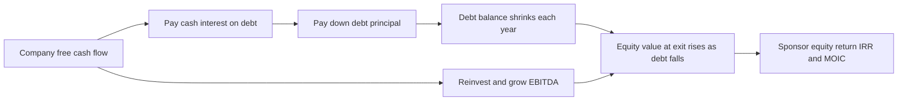
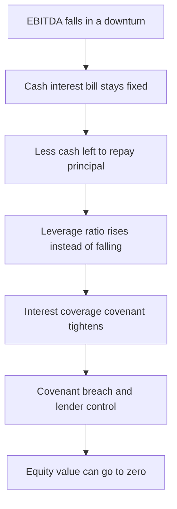
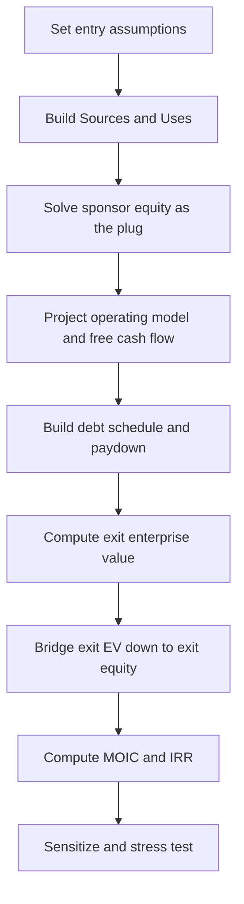
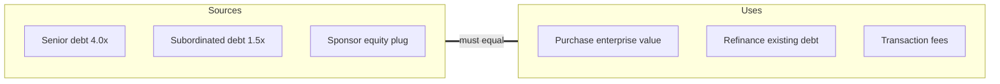
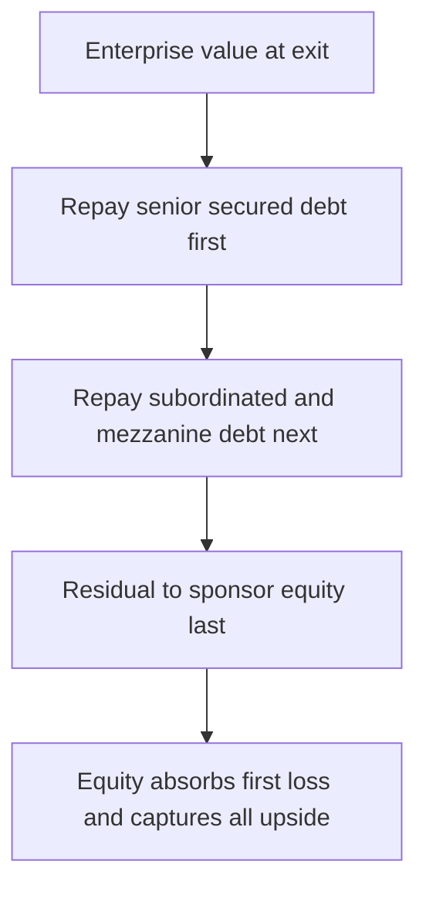

<!-- v2-deep -->

# Chapter 30 — LBO Modeling — Structure and Mechanics

## 1. The Problem

Imagine you run a private equity (PE) fund. Your investors — pension funds, endowments, wealthy families — have handed you \$5 billion and one instruction: turn it into a lot more, ideally doubling or tripling it over about five years, net of your fees. Buying a good company at a fair price and holding it forever will not do that. A stable business growing earnings at 6% per year, bought at a fair multiple, returns roughly 6% per year to its owner. That is a fine outcome for a public-market index investor. It is a career-ending outcome for a PE fund that has promised its investors a 20%+ annual return and charges 2% management fees plus 20% of the profits for the privilege.

So the PE sponsor faces a sharp problem: **how do you convert a mundane 6–8% business return into a 20–25% return on the equity you personally put at risk?** You cannot magically make the underlying company grow three times faster. You cannot reliably sell it for a much higher multiple than you paid — that is a bet, not a plan. What you *can* control, structurally, on day one, is **how much of the purchase price you fund with your own equity versus how much you fund with borrowed money.**

That single lever — leverage — is the heart of the leveraged buyout. And the whole discipline of LBO modeling exists to answer one question with numbers: *given a purchase price, a debt package, and a set of operating assumptions, what annual return will the equity earn, and is that return good enough to do the deal?*

There is a second, quieter use of the same model that matters just as much. Because the model translates a purchase price into a return, you can run it *backward*: hold the target return fixed and solve for the highest price the sponsor can pay. That answer — the maximum entry multiple that still clears, say, a 20% IRR — is the sponsor's **walk-away price**. It is also, indirectly, a valuation floor for the whole market: a strategic acquirer who wants the asset generally has to beat what a financial sponsor is willing to pay, and the LBO tells you what that number is. So the model is at once a *pricing engine* (what return does this price give?) and a *bidding engine* (what price does this return require?).

If you cannot build this model, you cannot value a company the way a financial sponsor values it, you cannot size a debt package, and you cannot tell a good deal from a bad one. This chapter builds the skeleton: the transaction structure, the sources and uses of cash, the debt tranches, and the mechanical logic of how returns are actually generated. Later chapters layer on the full debt schedule, cash sweep, and returns waterfall — but you must understand the frame first.

## 2. The Core Idea

An LBO is the purchase of a company using a **large amount of borrowed money (debt) and a relatively small amount of the buyer's own money (equity)**, where the acquired company's *own cash flows and assets* service and repay that debt.

The mental model that unlocks everything: **an LBO is like buying a rental property with a mortgage.** You buy a \$1,000,000 house with \$300,000 of your own cash and a \$700,000 mortgage. The tenant's rent pays the mortgage. Five years later the house is worth \$1,200,000, and you have paid the mortgage down to \$600,000. Your equity has gone from \$300,000 to \$600,000 (\$1,200,000 value minus \$600,000 debt) — you *doubled your money* even though the house only appreciated 20%. Leverage magnified a modest asset gain into a large equity gain.

Push the analogy one step further, because it exposes both blades of the sword. Suppose instead the house had *fallen* 20%, to \$800,000, while you still owed \$600,000. Your equity would be \$200,000 — you would have lost a third of your money on a 20% price drop. And all the while, the mortgage payment never shrank; if the tenant left, you would still owe the bank every month. That is leverage in one picture: the fixed claim does not flex with fortune, so the residual claim (your equity) swings violently in both directions.

Replace "house" with "company," "rent" with "free cash flow," and "mortgage" with "acquisition debt," and you have an LBO. The equity return is driven by three engines working together:

1. **Debt paydown (de-leveraging):** the company's free cash flow repays debt each year, so a shrinking slice of the enterprise value is owed to lenders and a growing slice belongs to the equity — even if the enterprise value never changes.
2. **EBITDA growth:** if the business grows earnings, the enterprise is worth more at exit at the *same* multiple.
3. **Multiple expansion:** if you sell at a higher EV/EBITDA multiple than you bought at, you capture that spread. This is the least reliable engine — sponsors underwrite deals assuming *no* multiple expansion (or even contraction) and treat any expansion as upside.

The core insight: **debt is not just cheap financing; it is a return amplifier.** Because debt has a fixed cost, every dollar of value created *above* that fixed cost flows entirely to the equity holders. A fourth, subtler engine hides inside engine one: because interest is tax-deductible, part of the "cost" of the debt is paid by the government, so the after-tax cash the business throws off — the fuel for debt paydown — is larger than it would be for an all-equity buyer. We treat that as part of *why it works* in the next section.

## 3. Why It Works

Why does layering on debt boost equity returns? Two reasons, and both matter.

**Reason one — financial leverage amplifies a fixed asset.** The enterprise value is what it is. Lenders get a *fixed, capped* claim (their principal plus interest). Equity holders get *everything that is left over* — the residual. When you make the fixed claim large (lots of debt) relative to the residual claim (little equity), any change in enterprise value lands almost entirely on the small equity base. A 20% rise in enterprise value can easily be a 100% rise in equity value. The math is the same as the rental-property example: a small numerator change on a small denominator is a large percentage.

Put it algebraically so the amplification is unmistakable. Equity value `E = EV − D`, where `D` is net debt. If enterprise value rises by `ΔEV` while debt is unchanged, then `ΔE = ΔEV`, so the *percentage* change in equity is `ΔEV / E = ΔEV / (EV − D)`. The larger `D` is relative to `EV`, the smaller the denominator `EV − D`, and the larger the percentage gain on the same dollar `ΔEV`. At 60% leverage (`D = 0.6 × EV`), a 10% rise in EV is a `0.10 / 0.40 = 25%` rise in equity — a 2.5× amplification, before any debt paydown at all.

**Reason two — the tax shield.** Interest on debt is tax-deductible; dividends to equity are not. Every dollar of interest expense reduces taxable income, so the government effectively subsidizes part of the borrowing cost. At a 25% tax rate, \$100 of interest costs the company only \$75 after tax. This is the same "tax shield" logic behind WACC (Chapter 21) — debt is cheaper than equity partly because Uncle Sam pays a share of it. In an LBO, with debt at 4–6x EBITDA, that shield is substantial and directly lifts the free cash flow available to repay principal. Concretely: \$46m of cash interest at a 25% rate shelters `46 × 0.25 = \$11.5m` of taxes every year — cash that stays inside the business and helps retire the loan faster.

There is no free lunch, though, and the model must respect it. Leverage cuts both ways. If EBITDA *falls*, the fixed interest bill does not shrink with it — it can swallow the entire cash flow and push the company toward default. Leverage amplifies losses exactly as it amplifies gains. This is why sponsors obsess over **cash flow stability**: the ideal LBO target has predictable, recurring cash flows (think a distribution business or a software company with subscription revenue), low capital-expenditure needs, and a defensible market position. A cyclical, capital-hungry business is a poor LBO candidate because it cannot safely carry high leverage.

The downside is not merely "lower returns" — it is a step-change in *control*. Leveraged debt carries **covenants** (maximum leverage ratios, minimum interest coverage). Breach one and the lenders can seize the steering wheel: force asset sales, block distributions, or trigger default. So the same fixed claim that amplifies your upside can, in a bad year, hand the company to your creditors. A good LBO model therefore does not just report a base-case IRR; it stress-tests EBITDA downward to check that the structure survives a recession.


*Figure 30.1 — The LBO value engine: operating cash flow both services debt and grows the business, and both effects accrue to equity at exit.*


*Figure 30.2 — The other blade: because interest is fixed, a fall in EBITDA hits the equity residual first and can wipe it out. This is the risk leverage buys.*

## 4. Full Technical Content

An LBO model has a definite build order. You cannot compute returns until you know the equity check; you cannot know the equity check until you build Sources and Uses; you cannot build Sources and Uses until you set the entry assumptions. Build in this sequence.


*Figure 30.3 — The canonical LBO build order. Each step consumes the output of the one before it; skip a step and the numbers downstream are meaningless.*

### 4.1 Entry assumptions (the input block)

Set up a clearly labeled, blue-font input section at the top of a `Transaction` tab. The essential inputs:

| Input | Typical form | Notes |
|---|---|---|
| LTM EBITDA | e.g. \$100.0m | Last-twelve-months EBITDA — the pricing anchor |
| Entry multiple | e.g. 10.0x EV/EBITDA | The purchase multiple; drives Enterprise Value |
| Entry Enterprise Value | `=EBITDA * Entry multiple` | \$1,000.0m |
| Net debt (existing) | e.g. \$150.0m | Existing debt minus cash on the target's balance sheet |
| Transaction / financing fees | e.g. 2–3% of deal | Advisory, financing, legal — a *use* of cash |
| Debt tranches & leverage | e.g. 4.0x senior, 1.5x sub | Sized as a multiple of EBITDA |
| Interest rates per tranche | e.g. SOFR+spread | Drives the interest expense |
| Cash tax rate | e.g. 25% | For the tax shield |
| Exit multiple | e.g. 10.0x (=entry) | Conservative baseline: no expansion |
| Holding period | e.g. 5 years | The horizon over which IRR is measured |

**Excel discipline:** hard-code assumptions in blue, formulas in black, and links to other sheets in green. Never bury a number inside a formula — an assumption you cannot find is an assumption you cannot flex.

**A concrete cell layout.** Put the input block in column C so you can reference exact addresses. This is the layout the worked examples below assume:

| Cell | Label | Value / formula |
|---|---|---|
| C4 | LTM EBITDA | `100` (blue) |
| C5 | Entry multiple | `10.0` (blue) |
| C6 | Entry EV | `=C4*C5` → 1,000 |
| C7 | Existing net debt | `0` (blue; base case is debt-free) |
| C8 | Fee % of EV | `2.5%` (blue) |
| C9 | Fees (\$) | `=C6*C8` → 25 |
| C10 | Senior leverage (x) | `4.0` (blue) |
| C11 | Subordinated leverage (x) | `2.0` (blue) |
| C12 | Senior debt (\$) | `=C10*C4` → 400 |
| C13 | Subordinated debt (\$) | `=C11*C4` → 200 |
| C14 | Total new debt | `=C12+C13` → 600 |
| C15 | Cash tax rate | `25%` (blue) |
| C16 | Exit multiple | `=C5` (linked so base = flat) |
| C17 | Hold years | `5` (blue) |

Linking C16 to C5 with `=C5` is a deliberate modeling choice: it *forces* the base case to a flat multiple, and to test expansion you overwrite C16 rather than editing a buried number. This is the difference between a model you can flex and a model you have to reverse-engineer.

### 4.2 Enterprise Value vs. Equity Purchase Price

A recurring trap: the *purchase price* the sponsor pays for equity is not the Enterprise Value. Walk the bridge (Chapter 19):

```
Enterprise Value (EV)          = LTM EBITDA × Entry multiple
Less: existing net debt        = (existing debt − existing cash)
Equals: Equity Purchase Price  = EV − Net debt
```

The sponsor typically buys the company on a **cash-free, debt-free** basis: the seller takes the cash, and existing debt is repaid at close. So the transaction *retires* the old debt and puts *new* LBO debt in its place. Model EV first, then bridge to equity value.

Worked micro-example so the bridge is not abstract. Suppose LTM EBITDA is \$100m, the entry multiple is 10.0x, and the target already carries \$150m of gross debt and \$30m of cash (net debt \$120m). Then:

- Entry EV = `100 × 10.0` = **\$1,000m**
- Equity purchase price = `1,000 − 120` = **\$880m** — this is the cheque written to the *selling shareholders*.
- But the sponsor must *also* refinance the \$150m of old gross debt and pay fees, so the *total cash to be raised* is much larger than \$880m. That total is what Sources and Uses assembles.

The number that flows into returns is the *sponsor equity check*, not the equity purchase price to the seller — those differ by fees and by how the existing debt is handled. Keep the two ideas in separate cells and never let them collide.

### 4.3 Sources and Uses (S&U)

This is the balance sheet of the transaction itself — where the money to do the deal comes from (Sources) and what it pays for (Uses). **Total Sources must equal Total Uses**; the equity contribution is the plug that forces them to balance.

**Uses (what we must pay for):**
- Purchase of equity (the Equity Purchase Price above), or equivalently purchase of EV less refinanced debt
- Repayment/refinancing of the target's existing debt
- Transaction and financing fees

**Sources (where the money comes from):**
- New debt tranches (senior term loan, subordinated, mezzanine, etc.), each sized as a multiple of EBITDA
- Sponsor equity (**the plug**): `Sponsor Equity = Total Uses − Total New Debt`
- Sometimes: management rollover equity, cash from the target's balance sheet used to fund the deal

**Build logic:** compute Total Uses. Sum the new debt from the leverage assumptions. The equity check is whatever is left: `Equity = Total Uses − Total Debt Sources`. In Excel:

```
Total Uses          = EV + Fees            (on a debt-free basis, EV captures the enterprise cost)
Total Debt          = SUM(tranche sizes)   = Leverage_x × LTM_EBITDA per tranche
Sponsor Equity      = Total Uses − Total Debt
Check               = Total Sources − Total Uses   → must equal 0
```

**Two ways to frame Uses — and why they give the same answer.** On a debt-free basis you can write Uses as either (a) *Enterprise Value + fees*, or (b) *equity purchase price + refinance existing debt + fees*. These are identical because `equity purchase price + existing net debt = EV`; adding back the refinanced debt just reconstructs EV. The trap is to *mix* them — e.g., pay the full EV to the seller *and* separately refinance the old debt, double-counting it. Pick one framing and stay in it.

**Cell-by-cell S&U (base case, debt-free, fees included).** Build Uses in one block and Sources in another and reference the input cells from §4.1:

| Cell | Uses | Formula | \$m |
|---|---|---|---|
| F4 | Purchase enterprise value | `=C6` | 1,000 |
| F5 | Refinance existing debt | `=C7` | 0 |
| F6 | Transaction & financing fees | `=C9` | 25 |
| F7 | **Total Uses** | `=SUM(F4:F6)` | **1,025** |

| Cell | Sources | Formula | \$m |
|---|---|---|---|
| H4 | Senior debt | `=C12` | 400 |
| H5 | Subordinated debt | `=C13` | 200 |
| H6 | Sponsor equity (plug) | `=F7-H4-H5` | 425 |
| H7 | **Total Sources** | `=SUM(H4:H6)` | **1,025** |
| H8 | **Check** | `=H7-F7` | **0** |

Note the plug in H6: it is a *formula* (`=F7-H4-H5`), never a typed number. Conditionally format H8 red when `<>0`. If you ever find yourself typing a hard number into the equity cell to make the check zero, you have hidden the very error the check exists to catch.


*Figure 30.4 — Sources and Uses must balance; sponsor equity is the plug that makes them equal.*

### 4.4 The debt tranches (capital structure)

LBO debt is layered by **seniority** — who gets repaid first in a bankruptcy. Higher seniority means lower risk to the lender, so a lower interest rate; lower seniority means higher risk and a higher rate. From safest to riskiest:

| Tranche | Typical size | Security | Rate | Amortization | Key traits |
|---|---|---|---|---|---|
| Revolver (RCF) | Undrawn line | Senior secured | SOFR + ~2–3% | Drawn as needed | Working-capital cushion; usually undrawn at close |
| Senior Term Loan (TLA/TLB) | 3–5x EBITDA | 1st lien on assets | SOFR + ~3–4% | TLB often 1%/yr + cash sweep | Cheapest funded debt; floating rate; repaid first |
| Subordinated / High-yield notes | 1–2x EBITDA | Unsecured, junior | Fixed ~7–9% | Bullet (no amort) | Repaid after senior; higher coupon |
| Mezzanine | 0.5–1.5x EBITDA | Deeply junior | ~10–14% + PIK | Bullet | Often includes equity warrants; PIK interest accrues |
| Sponsor Equity | The residual | Last in line | — | — | Absorbs first losses; captures all upside |

Two features to model correctly:

- **Cash interest vs. PIK.** Most tranches pay cash interest. Mezzanine may "pay-in-kind" (PIK): instead of paying cash, the interest is added to the principal balance, which then compounds. PIK preserves cash for senior debt paydown but grows the junior balance.
- **Amortization vs. bullet vs. cash sweep.** A term loan B typically requires mandatory amortization of ~1% of face per year, then an optional **cash sweep** — excess free cash flow after mandatory payments is used to prepay debt. Subordinated notes are usually **bullets**: no principal until maturity. The full mechanics of the debt schedule and sweep are the subject of Chapter 31; here, understand that senior debt gets paid down first and fastest.

The ordering is not arbitrary — it is the **capital structure waterfall.** In liquidation, senior lenders are made whole before subordinated lenders see a dollar, and equity gets only what remains after *all* debt is satisfied. This is exactly why equity is riskiest and demands the highest return.

**Why the sponsor doesn't just max out the cheapest tranche.** If senior debt is cheapest, why not fund the whole deal with it? Three limits bind. First, **lenders cap leverage**: a senior lender will not go above, say, 4–4.5x EBITDA on first-lien terms because beyond that the loan is no longer "senior" in substance. Second, **coverage**: more debt means more cash interest, and the business must cover it — pile on too much senior and interest coverage falls through the covenant floor in year one. Third, **the blended cost curve**: adding a junior tranche lets you raise *total* leverage (shrinking the equity check and amplifying returns) even though that specific tranche is expensive, because the marginal equity dollar it displaces is even more expensive. The capital structure is an optimization: maximize leverage subject to what lenders will fund and what cash flow can service.

**Blended cost of debt, worked.** With \$400m senior at 6.0% and \$200m sub at 9.0%, weighted average cost = `(400×6% + 200×9%) / 600 = (24 + 18) / 600 = 42 / 600 = 7.0%`. That \$42m of year-one cash interest is the number that competes with EBITDA for cash. Note the senior amortizes and the sub does not, so the blended *rate* drifts up over the hold as the cheap tranche shrinks and the expensive bullet stays put — a subtlety the full schedule in Chapter 31 captures.


*Figure 30.5 — The capital structure waterfall: seniority determines repayment order and therefore risk and required return.*

### 4.5 The return metrics — what "good" means

An LBO model exists to output two numbers:

- **MOIC (Multiple of Invested Capital)**, also called cash-on-cash: `MOIC = Exit Equity Value ÷ Initial Equity Invested`. A MOIC of 2.5x means you got \$2.50 back for every \$1.00 in.
- **IRR (Internal Rate of Return)**: the annualized compound return that sets the net present value of the equity cash flows to zero. For a single entry outflow and a single exit inflow: `IRR = (MOIC)^(1/years) − 1`. In Excel use `=IRR(range)` on the equity cash-flow line, or `=XIRR(values, dates)` for irregular timing.

The relationship is exact for a simple two-date deal. A 2.0x MOIC over 5 years is `2^(1/5) − 1 = 14.9%` IRR. A 3.0x over 5 years is `3^(0.2) − 1 = 24.6%`. Sponsors typically target roughly **2.5–3.0x MOIC and 20–25% IRR** over a five-year hold. Note how MOIC and IRR can diverge: a 2.0x in 3 years (26% IRR) beats a 2.5x in 7 years (14% IRR) — *time matters*, and IRR captures it while MOIC does not.

**A reference grid** (memorize the corners — interviewers ask for these cold). IRR = `MOIC^(1/years) − 1`:

| MOIC \ Years | 3 yr | 5 yr | 7 yr |
|---|---|---|---|
| 2.0x | 26.0% | 14.9% | 10.4% |
| 2.5x | 35.7% | 20.1% | 13.9% |
| 3.0x | 44.2% | 24.6% | 17.0% |

Two facts fall out of the grid. First, **2.0x in 5 years ≈ 15% and 3.0x in 5 years ≈ 25%** are the anchors every associate knows by heart. Second, doubling the hold roughly *halves* the IRR for a given MOIC — which is why a fast, cheaper exit can beat a slower, richer one. The sponsor's job is to find the point on this surface that maximizes IRR net of risk, and a big lever there is *time to exit*, not just the dollar outcome.

**A wrinkle: interim cash flows.** The two-date formula assumes all cash comes back at exit. In reality a deal may pay a **dividend recap** partway through (borrow more, pay the sponsor a dividend) or receive management-fee dividends. Those interim inflows pull cash forward and *raise* IRR for the same total MOIC — which is exactly why sponsors like recaps. When cash flows are irregular you cannot use `MOIC^(1/n)−1`; you must lay the cash flows on a timeline and use `=XIRR(values, dates)`. The single-formula shortcut is a special case, not the general rule.

### 4.6 The exit and the returns bridge

At exit, you re-run the entry logic in reverse:

```
Exit Enterprise Value      = Exit-year EBITDA × Exit multiple
Less: Net debt at exit     = remaining debt − accumulated cash
Equals: Exit Equity Value  = the number that goes to shareholders
MOIC                       = Exit Equity Value ÷ Entry Equity
IRR                        = (MOIC)^(1/hold years) − 1
```

The elegance is the symmetry: enter by building EV and bridging down to equity; exit by rebuilding EV and bridging down to equity again. Everything in between — the operating model and the debt schedule — explains how EBITDA grew and how net debt shrank.

**Excel for the exit block**, continuing the cell map (§4.1). Say exit-year EBITDA lands in cell C20 and net debt at exit in C21:

| Cell | Label | Formula |
|---|---|---|
| C22 | Exit EV | `=C20*C16` |
| C23 | Exit equity value | `=C22-C21` |
| C24 | MOIC | `=C23/H6` |
| C25 | IRR (closed form) | `=C24^(1/C17)-1` |
| C26 | IRR (check via IRR) | `=IRR(cashflow_row)` |

For C26, lay a cash-flow row across years 0–5: `{-H6, 0, 0, 0, 0, +C23}` and wrap `=IRR(...)`. C25 and C26 must agree to the basis point; if they don't, you have a timing or sign error in the cash-flow row. Two independent computations of the same number is cheap insurance.

## 5. Worked Examples

### Example A — The clean base case

**Entry assumptions:**
- LTM EBITDA = \$100m; Entry multiple = 10.0x → **Entry EV = \$1,000m**
- Financing structure: Senior debt 4.0x EBITDA = \$400m; Subordinated 2.0x = \$200m → **Total debt = \$600m**
- Assume target is bought debt-free; fees = \$0 for simplicity (added in Example C)
- **Sponsor equity = Uses − Debt = \$1,000m − \$600m = \$400m**

**Sources and Uses:**

| Uses | \$m | Sources | \$m |
|---|---|---|---|
| Purchase enterprise value | 1,000 | Senior debt (4.0x) | 400 |
| | | Subordinated (2.0x) | 200 |
| | | Sponsor equity (plug) | 400 |
| **Total Uses** | **1,000** | **Total Sources** | **1,000** |

Check: 1,000 − 1,000 = 0. ✓ Entry leverage = 600 / 100 = **6.0x**.

**Hold period (5 years).** Assume EBITDA grows from \$100m to \$130m (about 5.4%/yr), and over five years cumulative free cash flow repays \$300m of debt, so net debt falls from \$600m to \$300m. Exit at the **same 10.0x** multiple (no expansion — the conservative base case).

**Exit:**
- Exit EV = \$130m × 10.0x = **\$1,300m**
- Net debt at exit = \$300m
- Exit equity value = 1,300 − 300 = **\$1,000m**

**Returns:**
- MOIC = 1,000 / 400 = **2.5x**
- IRR = 2.5^(1/5) − 1 = **20.1%**

Reconciles: the sponsor turned \$400m into \$1,000m in five years — a 2.5x, ~20% IRR outcome — *with no multiple expansion whatsoever.* All of the gain came from EBITDA growth (EV up \$300m) and debt paydown (net debt down \$300m). This is the deal working exactly as designed.

### Example B — Isolating the three return engines

Let's decompose *where* the \$600m of equity value creation (\$400m → \$1,000m) came from, holding the base case above.

| Value-creation source | Calculation | Equity value contribution |
|---|---|---|
| EBITDA growth | ΔEBITDA × entry multiple = (130 − 100) × 10.0x | +\$300m |
| Multiple expansion | ΔMultiple × exit EBITDA = (10.0 − 10.0) × 130 | +\$0m |
| Debt paydown | Reduction in net debt = 600 − 300 | +\$300m |
| **Total equity gain** | | **+\$600m** |

Starting equity \$400m + \$600m gain = \$1,000m exit equity. ✓ It reconciles to the penny with Example A.

The lesson jumps off the page: **half the value came from paying down debt, half from growing earnings, and none from multiple expansion.** Now flex one lever. Suppose the sponsor *also* achieves modest multiple expansion to 11.0x at exit:

- Multiple expansion contribution = (11.0 − 10.0) × 130 = **+\$130m**
- Exit equity = 1,000 + 130 = **\$1,130m**
- MOIC = 1,130 / 400 = **2.83x**; IRR = 2.825^(1/5) − 1 = **23.1%**

One turn of multiple lifted the IRR by 3 percentage points. This is why multiple expansion is powerful — and why sponsors never *rely* on it: it is a market-driven bet outside their control, so they underwrite to the flat-multiple base case and treat expansion as upside.

**One decomposition caveat.** The three-engine bridge above uses the *entry* multiple for the growth term and the *exit* EBITDA for the multiple term, which cleanly reconciles as long as you keep the convention consistent. There is a small "cross term" — growth *and* multiple expansion interacting — that different banks assign differently (some fold it into the multiple line, some into growth). It is `ΔEBITDA × ΔMultiple = 30 × 1.0 = \$30m` here, already embedded because we used exit EBITDA (130) in the multiple line. Do not double-count it: pick a convention (growth at entry multiple, multiple at exit EBITDA), state it, and check the pieces sum to the total gain.

### Example C — Why leverage matters (leverage vs. all-equity)

Take the *same* company and outcome (EBITDA \$100m → \$130m, exit at 10.0x → EV \$1,300m), but compare two financing structures. Add realistic fees of 2.5% of EV = \$25m in both.

**Structure 1 — Highly levered (6.0x):**
- Total Uses = EV \$1,000m + fees \$25m = \$1,025m
- Debt = \$600m; **Equity = \$425m**
- Assume \$300m debt paid down → exit net debt \$300m
- Exit equity = 1,300 − 300 = \$1,000m
- MOIC = 1,000 / 425 = **2.35x**; IRR = 2.353^(0.2) − 1 = **18.7%**

**Structure 2 — All-equity (no debt):**
- Total Uses = \$1,025m; Debt = \$0; **Equity = \$1,025m**
- With no debt there is no interest, so free cash flow accumulates as cash: assume the same operations generate ~\$375m of cumulative cash (higher than the levered case because no interest was paid), so exit net debt = −\$375m (i.e., net cash)
- Exit equity = EV \$1,300m + cash \$375m = \$1,675m
- MOIC = 1,675 / 1,025 = **1.63x**; IRR = 1.634^(0.2) − 1 = **10.3%**

**The punchline:** the *same operating performance* produced an **18.7% IRR with leverage** versus **10.3% unlevered.** Leverage nearly doubled the equity return. The levered structure required only \$425m of equity instead of \$1,025m, so the same absolute value creation landed on a far smaller equity base. (In reality the levered case pays interest and thus accumulates less cash than the unlevered case — captured here by the smaller \$300m paydown vs. \$375m cash build — yet leverage still wins decisively.) This single comparison *is* the reason leveraged buyouts exist.

### Example D — Where the paydown actually comes from (and why the round number flatters)

Examples A–C *assumed* \$300m of debt paydown. Let's replace that assumption with a real, year-by-year free-cash-flow build and see whether it holds up. This is a preview of the Chapter 31 debt schedule, simplified by computing interest on the *beginning* balance (which sidesteps the circularity for now).

**Assumptions.** Senior \$400m at 6.0% (takes all the sweep); Subordinated \$200m at 9.0% as a bullet (interest \$18m/yr, no principal). Capex \$15m/yr, increase in net working capital \$3m/yr, D&A \$20m/yr, cash tax 25%. EBITDA ramps 106 → 130.

`FCF for paydown = EBITDA − cash interest − capex − ΔNWC − cash taxes`, where `cash taxes = (EBITDA − D&A − cash interest) × 25%`.

| Year | EBITDA | Senior beg | Sr int 6% | Sub int | Cash int | Capex | ΔNWC | Cash tax | FCF sweep | Senior end |
|---|---|---|---|---|---|---|---|---|---|---|
| 1 | 106 | 400.0 | 24.0 | 18 | 42.0 | 15 | 3 | 11.0 | 35.0 | 365.0 |
| 2 | 112 | 365.0 | 21.9 | 18 | 39.9 | 15 | 3 | 13.0 | 41.1 | 323.9 |
| 3 | 118 | 323.9 | 19.4 | 18 | 37.4 | 15 | 3 | 15.1 | 47.4 | 276.5 |
| 4 | 124 | 276.5 | 16.6 | 18 | 34.6 | 15 | 3 | 17.4 | 54.1 | 222.4 |
| 5 | 130 | 222.4 | 13.3 | 18 | 31.3 | 15 | 3 | 19.6 | 61.0 | 161.5 |

Check one row so the mechanics are unambiguous — Year 1: cash taxes = `(106 − 20 − 42) × 25% = 44 × 25% = 11.0`; FCF = `106 − 42 − 15 − 3 − 11 = 35.0`; senior end = `400 − 35 = 365`. ✓

**Total senior paydown = 400 − 161.5 = \$238.5m.** The sub bullet is untouched at \$200m. So **exit net debt = 161.5 + 200 = \$361.5m**, not the \$300m the base case assumed.

Re-run the exit at 10.0x flat:
- Exit EV = \$1,300m; exit net debt = \$361.5m → **exit equity = \$938.5m**
- MOIC = 938.5 / 400 = **2.35x**; IRR = 2.346^(0.2) − 1 = **18.6%**

**The lesson:** the convenient \$300m round number in Example A *overstated* paydown by \$61.5m and thereby inflated the IRR by roughly 1.5 points (20.1% → 18.6%). A real deal converts EBITDA to debt paydown at a rate governed by interest, taxes, capex, and working capital — and that rate is almost always less generous than a round assumption suggests. This is precisely why Chapter 31 insists on building the full schedule rather than plugging a paydown number: **the paydown is an output, not an input.**

### Example E — Solving backward for the maximum entry price (the valuation floor)

Now run the model in reverse. Hold the exit fixed (exit-year EBITDA \$130m, exit multiple 10.0x → EV \$1,300m; exit net debt \$300m → exit equity \$1,000m). Keep debt sized at 6.0x LTM EBITDA = \$600m, and ignore fees. The only thing we vary is the **entry multiple**, which changes the entry EV and therefore the equity check `Entry equity = Entry EV − 600 = 100 × M − 600`.

| Entry multiple | Entry EV | Entry equity | MOIC = 1,000 / equity | IRR (5 yr) |
|---|---|---|---|---|
| 9.0x | 900 | 300 | 3.33x | 27.2% |
| 10.0x | 1,000 | 400 | 2.50x | 20.1% |
| 11.0x | 1,100 | 500 | 2.00x | 14.9% |

Read it as a bidding schedule. If the sponsor's hurdle is a **20% IRR**, the maximum it can pay is about **10.0x** — bid 11.0x and the return collapses to 15%. That 10.0x is the sponsor's *walk-away price*. A strategic buyer who values synergies can rationally pay more (say 11–12x) because its exit equity is worth more than \$1,000m to it; but a *financial* buyer paying purely on cash flow cannot cross ~10x without breaking its return. This is the sense in which LBO math sets a **valuation floor**: whatever the sponsor can pay is the minimum a competing bidder must beat. Notice the symmetry with Example A — at exactly 10.0x this reproduces the 2.5x / 20% base case, confirming the two directions of the model are the same machine.

### Example F — The paper LBO (mental-math version interviewers demand)

The "paper LBO" is a rite of passage: build entry, hold, and exit in your head, no spreadsheet. Keep the numbers round.

**Given (state them out loud):** EBITDA \$100m, entry 5.0x → **EV \$500m**. Fund 60% debt = \$300m, so **equity = \$200m**. Hold 5 years. To keep it mental, assume EBITDA is *flat* at \$100m and the business throws off **\$50m of free cash flow per year**, all sweeping the debt.

**Walk it:**
- Cumulative paydown = 50 × 5 = \$250m → debt falls \$300m → \$50m.
- Exit at the same 5.0x → EV = \$100m × 5.0 = \$500m.
- Exit equity = 500 − 50 = **\$450m**.
- MOIC = 450 / 200 = **2.25x**. IRR ≈ **17.6%** (between the 2.0x→14.9% and 2.5x→20.1% anchors, closer to the middle).

You can do every step above without a calculator except the final IRR, which you *estimate* by bracketing with the memorized grid — "2.25x over five years, so a bit under 18%." That bracketing move is the whole point of memorizing the MOIC/IRR corners in §4.5: interviewers want to see you triangulate, not compute logarithms.

## 6. Connections

- **DCF and WACC (Chapters 20–21):** an LBO is a specialized, private-owner's lens on the same cash flows a DCF values. The tax shield of debt that lowers WACC is the very same shield that boosts LBO free cash flow. Where a DCF discounts unlevered cash flow at WACC, an LBO tracks the *levered equity* cash flow explicitly and solves for its IRR.
- **Enterprise vs. equity value bridge (Chapter 19):** the entry (EV → equity) and exit (EV → equity) bridges in an LBO are literally the EV-to-equity walk you learned there, applied at two points in time.
- **Trading & transaction comps (Chapters 17–18):** the entry and exit multiples come straight from comparable-company and precedent-transaction analysis. LBO analysis also works *backward* — solving for the maximum entry multiple that still clears a target IRR (Example E) — which sets a **valuation floor**: a strategic buyer must generally outbid what a sponsor can pay.
- **Debt schedule and cash sweep (Chapter 31):** this chapter assumed a lump of debt paydown; Example D showed why that assumption flatters returns and previewed the real build. The next chapter constructs the year-by-year schedule — mandatory amortization, the cash sweep, PIK accrual, and the interest that feeds back into the cash flow (the classic circularity).
- **Returns attribution and the equity waterfall (Chapter 32):** Example B's three-engine decomposition becomes a formal value-creation bridge, and the split of proceeds between the sponsor and management (the promote/carry) is layered on top.
- **Three-statement modeling (Chapters 12–15):** the operating engine that grows EBITDA and throws off free cash flow *is* a three-statement model; the LBO wraps a financing structure and a returns calculation around it. The FCF line in Example D is a compressed version of that engine.

## 7. Traps and Common Errors

1. **Confusing Enterprise Value with the equity check.** The sponsor equity is *not* the purchase price. It is Total Uses minus new debt. Forgetting to bridge EV to equity — or double-counting existing debt — is the most common structural error. Always: EV → less net debt → equity.
2. **Sources and Uses that don't balance.** If your check cell isn't exactly zero, *stop.* Every downstream number is wrong. Make the equity contribution the explicit plug (`=Total Uses − Total Debt`) and never hard-code it.
3. **Sizing debt off the wrong EBITDA.** Leverage is a multiple of *LTM* (or a defined pro-forma) EBITDA, not projected or exit EBITDA. Using a forward number inflates the debt and understates the equity check.
4. **Ignoring financing fees.** Fees are a real *use* of cash that increases the equity check and drags returns (see Example C, where fees alone cut the IRR from 20.1% to 18.7% before any operating change). Omitting them flatters the IRR.
5. **Treating multiple expansion as a plan.** Underwriting a deal that only works if the exit multiple is higher than entry is speculation. Base case = flat multiple. If you *need* expansion to hit target returns, the deal is too expensive.
6. **Forgetting the interest circularity.** Interest depends on the debt balance; the debt balance depends on cash flow after interest; cash flow after interest depends on interest. This loop (resolved with iterative calculation or a circularity switch) is central to the debt schedule — don't hard-code interest to dodge it.
7. **Over-levering a cyclical or capex-heavy business.** High leverage on unstable cash flows is a default waiting to happen. The model may show a great IRR in the base case while hiding the fact that a single bad year breaches a covenant or misses an interest payment. Always stress the downside (Figure 30.2).
8. **Mixing cash and PIK interest.** PIK interest does *not* leave the company as cash — it accretes onto the debt balance. Modeling it as a cash outflow understates free cash flow and debt; modeling cash interest as PIK does the reverse.
9. **Using MOIC without regard to time.** A 3.0x over 8 years (~14.7% IRR) is a *worse* deal than a 2.0x over 3 years (~26% IRR). Always report IRR alongside MOIC.
10. **Plugging a round paydown number.** As Example D showed, assuming "\$300m gets repaid" instead of deriving it from FCF overstated the IRR by ~1.5 points. Paydown is an *output* of the debt schedule, not an input you get to choose.
11. **Sign or timing errors in the IRR cash-flow row.** `=IRR({−equity, …, +exit})` requires the entry as a *negative* at time 0 and the exit as a *positive* at the correct year. A flipped sign returns a nonsense (often negative or `#NUM!`) IRR; a misplaced exit year silently miscounts the hold. Cross-check against the closed-form `MOIC^(1/n)−1`.
12. **Using the two-date IRR formula when there are interim cash flows.** Dividend recaps and interim distributions break `MOIC^(1/n)−1`. The moment cash comes back mid-hold, switch to `=XIRR(values, dates)` on a proper timeline, or you will understate the IRR that the early cash actually earned.
13. **Double-counting in the value-creation bridge.** The growth term and the multiple term share a cross-product (`ΔEBITDA × ΔMultiple`). Fix a convention (growth at entry multiple, multiple at exit EBITDA), state it, and confirm the three legs sum to the total equity gain — as Example B does exactly.

## 8. First-Principles Recap

Strip everything away and the LBO reduces to one sentence: **buy a company mostly with borrowed money, use the company's own cash flow to pay down that borrowing, and sell it later — so that a shrinking debt balance and a growing business both hand their gains to a small, highly leveraged equity slice.**

Three primitives generate the return: **debt paydown** (the reliable engine — cash flow mechanically converts lender's claims into owner's equity), **EBITDA growth** (the operational engine — a bigger business is worth more at the same multiple), and **multiple expansion** (the market engine — real but unreliable, so never underwritten). Leverage is the amplifier: because debt takes a fixed, capped claim, every dollar of value above that fixed cost flows to equity, and a small equity base turns a modest asset gain into a large equity return. The tax-deductibility of interest sweetens it further. And the same fixed claim that amplifies gains amplifies losses — which is why the whole discipline is really the disciplined management of *how much* fixed claim a given cash-flow stream can safely bear.

The mechanics that implement this are just accounting hygiene: **entry assumptions** define the price and the debt package; **Sources and Uses** force the money in to equal the money out, with equity as the plug; the **capital-structure waterfall** ranks who gets repaid first; the operating model and debt schedule explain how EBITDA grew and net debt shrank (and, as Example D warned, the paydown is *earned*, not assumed); and the **exit bridge** re-prices the enterprise and walks back down to equity to compute **MOIC and IRR.** Run the machine forward and it prices a deal; run it backward and it tells you the most you can bid. If you can build those pieces so they reconcile — and cross-check the returns two independent ways — you can model any leveraged buyout.

## 9. Quick-Reference

**Core formulas**

| Quantity | Formula |
|---|---|
| Entry Enterprise Value | `LTM EBITDA × Entry multiple` |
| Equity Purchase Price | `EV − existing net debt` |
| Total Debt | `Σ (leverage multiple × LTM EBITDA)` per tranche |
| Sponsor Equity (plug) | `Total Uses − Total Debt Sources` |
| Total Uses (debt-free) | `Entry EV + fees` |
| S&U check | `Total Sources − Total Uses = 0` |
| Blended cost of debt | `Σ (tranche × rate) ÷ Σ tranche` |
| FCF for paydown | `EBITDA − cash interest − capex − ΔNWC − cash taxes` |
| Cash taxes | `(EBITDA − D&A − cash interest) × tax rate` |
| Exit Enterprise Value | `Exit EBITDA × Exit multiple` |
| Exit Equity Value | `Exit EV − Net debt at exit` |
| MOIC | `Exit Equity Value ÷ Initial Equity` |
| IRR (simple 2-date) | `MOIC^(1 / years) − 1` |
| Max entry equity for target IRR | `Exit equity ÷ (1 + IRR)^years` |
| Value from growth | `ΔEBITDA × entry multiple` |
| Value from multiple | `ΔMultiple × exit EBITDA` |
| Value from paydown | `Reduction in net debt` |

**MOIC → IRR reference corners:** 2.0x/5yr = 14.9%; 2.5x/5yr = 20.1%; 3.0x/5yr = 24.6%; 2.0x/3yr = 26.0%; 3.0x/3yr = 44.2%. Doubling the hold roughly halves the IRR for a given MOIC.

**Excel functions:** `IRR(range)` and `XIRR(values, dates)` for returns (use `XIRR` the moment there are interim cash flows); `SUM` for tranche sizing; `SUMPRODUCT` for blended debt cost; conditional formatting for the S&U check cell; blue = inputs, black = formulas, green = cross-sheet links. Enable iterative calculation (File → Options → Formulas) for the interest circularity in the full debt schedule. Always compute IRR two ways — closed form and `=IRR()` — and confirm they match.

**Rules of thumb:** entry leverage ~5–6x EBITDA; sponsor targets ~2.5–3.0x MOIC and 20–25% IRR over ~5 years; base case assumes flat exit multiple; senior debt is cheapest (SOFR + 3–4%) and repaid first, mezzanine is most expensive (~10–14%, often PIK) and repaid last; equity is the residual and the plug; paydown is an output of the FCF build, never an input.

## 10. Build-It-Yourself Exercise

Build a one-page entry-and-exit LBO in Excel. No full debt schedule yet (that is Chapter 31) — use a lump-sum paydown assumption, then pressure-test it.

**Given:**
- LTM EBITDA = \$80m; Entry multiple = 9.5x; bought debt-free
- Financing fees = 2.5% of Entry EV
- Debt: Senior 4.0x EBITDA at 6.0%; Subordinated 1.5x EBITDA at 9.0%
- Hold = 5 years; EBITDA grows to \$105m; cumulative debt paydown = \$180m
- Exit multiple: (a) 9.5x flat, and (b) 10.5x

**Tasks:**
1. Build an input block (blue font) and compute Entry EV, total debt, fees, the **blended cost of debt**, and the **sponsor equity plug.**
2. Build a Sources & Uses table with a check cell that must equal zero (conditional-format it red if not).
3. Compute exit EV, exit net debt, and exit equity value for both exit-multiple cases.
4. Compute **MOIC and IRR** for each, using `MOIC^(1/5) − 1` and verify with `=IRR()` on a `{−equity, 0,0,0,0, +exit equity}` cash-flow row. The two must match.
5. Build a **three-engine attribution** table (growth / multiple / paydown) for case (b) and confirm it reconciles to the total equity gain.
6. **Reverse it (Example E style):** holding case (a)'s exit fixed, solve for the maximum *entry multiple* that still delivers a 20% IRR. (Hint: max entry equity = exit equity ÷ 1.20^5; then entry EV = equity + debt + fees; then multiple = EV ÷ 80. Iterate once or use Goal Seek, since fees depend on EV.)

**Self-check targets (case a, flat 9.5x):** Entry EV = \$760m; fees = \$19m; total debt = 5.5x × 80 = \$440m; blended cost = (320×6% + 120×9%)/440 = **6.82%**; **equity = 760 + 19 − 440 = \$339m.** Exit EV = 105 × 9.5 = \$997.5m; exit net debt = 440 − 180 = \$260m; exit equity = **\$737.5m.** MOIC = 737.5 / 339 = **2.18x**; IRR = 2.176^(0.2) − 1 = **16.8%.** For case (b) at 10.5x, exit EV = \$1,102.5m, exit equity = \$842.5m, MOIC = **2.49x**, IRR = **20.0%.** Your attribution for case (b) should read: growth = (105−80)×9.5 = \$237.5m, multiple = (10.5−9.5)×105 = \$105m, paydown = \$180m, total gain = \$522.5m; starting equity \$339m + \$522.5m − (already-embedded items) reconciles to \$842.5m exit equity (check: 339 + 522.5 = 861.5; the \$19m fee sits inside the entry equity, so exit equity 842.5 = 339 + 522.5 − 19 → confirm the fee reconciliation explicitly). If your numbers match — and both IRR methods agree — you have built a working LBO skeleton, and you are ready for the full debt schedule in Chapter 31, where the \$180m paydown assumption gets replaced by a real, circular FCF sweep.
