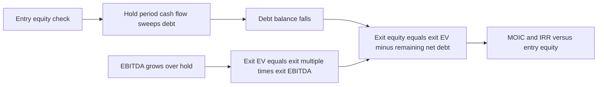
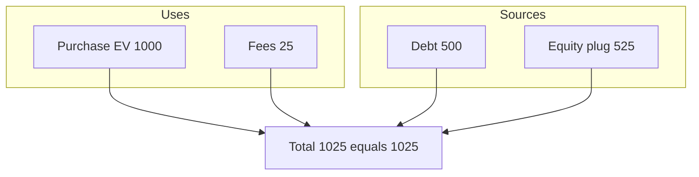
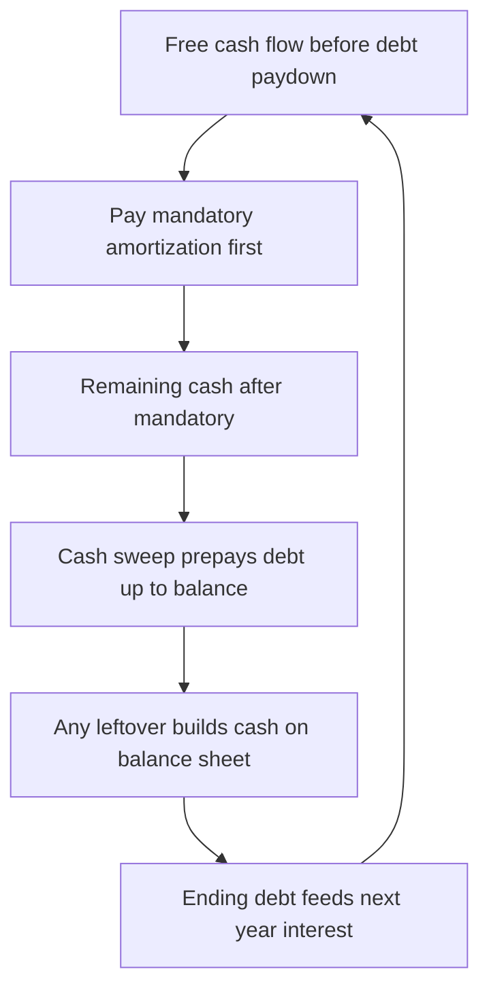
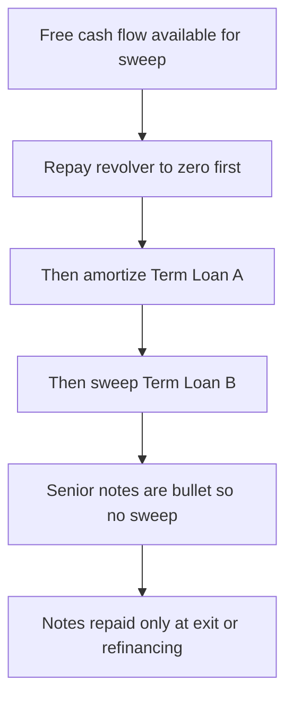

<!-- v2-deep -->

# Chapter 31 — LBO Returns: IRR, MOIC and the Full Model

## 1. The Problem

A private equity sponsor is looking at a business that generates $100 million of EBITDA. It is stable, cash-generative, and boring in the best possible way. The sponsor could buy it, hold it for five years, and sell it. The question that decides everything is brutally simple: **if I put in this much equity today, how much do I get back, and is that enough?**

"Enough" for a leveraged buyout fund is not vague. Limited partners (the pensions, endowments, and sovereign funds who give PE firms their money) expect the fund to roughly **double or triple their money over about five years**, net of fees. Working backward from that promise, the deal team needs each individual investment to target an **internal rate of return (IRR) in the neighborhood of 20–25%** and a **multiple on invested capital (MOIC) of 2.0x–3.0x**.

Here is the trap. A DCF or a comparable-company analysis tells you what a business is *worth*. It does **not** tell you what *return* a leveraged buyer will *earn*, because the return depends on things a valuation ignores:

- **How much debt** you can borrow against the business, and how fast you pay it down.
- **What you pay going in** (entry multiple) versus **what you sell for** (exit multiple).
- **How the cash the business throws off gets used** — swept against debt, or left on the balance sheet.

Two funds can look at the *identical* company, agree on its intrinsic value to the dollar, and reach completely different conclusions about whether to bid — because one can finance it more cheaply, hold it longer, or believes it can grow EBITDA faster. The LBO model exists to convert a **purchase price, a capital structure, and an operating forecast into a single number the investment committee can vote on**: the equity IRR.

Think of the difference this way. A DCF asks "what is the fair value of these cash flows to *any* owner?" An LBO asks "what will *this specific owner*, using *this specific debt package* and selling in *year five*, actually earn on the thin slice of equity they wrote a check for?" The DCF is ownership-agnostic. The LBO is ownership-specific — it bakes in the financing, the hold, and the exit. That is why the same company supports many different bids: each bidder plugs in their own leverage and their own view of exit.

This chapter builds that model end to end. By the finish you can construct sources and uses, a debt schedule with a cash sweep, an exit at a chosen multiple, and a full returns bridge — and you can stress every assumption that matters. Every numerical example in this chapter has been recomputed and reconciles to the penny in Excel; where a figure is rounded for display, the reconciliation note says so.

## 2. The Core Idea

An LBO return is the answer to one equation applied to the sponsor's equity:

> **You invest equity at entry. Over the hold, debt gets paid down using the company's own cash flow. At exit you sell the enterprise, repay whatever debt remains, and keep the rest. The "rest" is your equity proceeds.**

Formally, for the equity holder:

$$\text{Exit Equity} = \text{Exit Enterprise Value} - \text{Net Debt at Exit}$$

$$\text{MOIC} = \frac{\text{Exit Equity Proceeds}}{\text{Initial Equity Invested}}$$

$$\text{IRR} = \text{MOIC}^{1/n} - 1 \quad \text{(for a single entry outflow and single exit inflow over } n \text{ years)}$$

The magic of leverage is that the equity is a **thin, geared slice** sitting on top of a large debt base. If you buy a business for $1,000 with $600 of debt and $400 of equity, and five years later the enterprise is worth $1,300 while debt has fallen to $300, your equity is worth $1,000 — a **2.5x MOIC** on a business whose enterprise value grew only 30%. Debt paydown and enterprise value growth both accrue **entirely to the equity**, because debt holders only ever get their fixed claim back.

That is the whole engine. Everything else in this chapter is the plumbing that makes the three inputs — **entry price, capital structure, exit price** — precise and defensible.

**A quick intuition on IRR versus MOIC before we go further.** MOIC answers "how many times did I get my money back?" It ignores time entirely — a 2.5x in three years and a 2.5x in eight years are the same MOIC but wildly different investments. IRR answers "at what compound annual rate did my money grow?" and therefore *punishes slow returns and rewards fast ones*. The two numbers together are the language of PE: MOIC is what LPs feel in their gut (did we double?), IRR is what the fund is measured on (did we beat the hurdle?). A useful bridge — the **Rule of 72 / 115** — lets you sanity-check one from the other: doubling (2.0x) in five years is roughly a 15% IRR; tripling (3.0x) in five years is roughly a 25% IRR; 2.5x in five years is roughly 20%. Memorize those three anchor points and you can eyeball whether any five-year deal is in the money without a calculator.

*Figure 31.1 — The LBO value chain: equity in today, debt paid down by operations, equity out at exit.*



## 3. Why It Works

Leverage amplifies equity returns for a mathematical reason that is worth internalizing rather than memorizing.

Suppose enterprise value grows at a modest rate. The equity claim is *residual* — it is what is left after debt. Because debt is roughly fixed in size (it only shrinks as you repay it), **any growth in enterprise value lands disproportionately on the smaller equity base**. A 30% rise in a $1,000 enterprise is $300 of value; if equity was only $400 of that $1,000, the same $300 is a 75% gain on equity before you even count debt paydown.

Three distinct forces drive the equity higher, and a good analyst can name and size each one:

1. **Deleveraging** — the company uses its free cash flow to repay debt. Every dollar of debt repaid is a dollar transferred from the lender's claim to the equity's claim, at no cost to the equity holder. This works even if EBITDA and the multiple never move.
2. **EBITDA growth** — a larger EBITDA at exit, applied at the *same* multiple, produces a larger enterprise value. This is the operational value creation: revenue growth, margin expansion, bolt-on acquisitions.
3. **Multiple expansion (or contraction)** — selling at a higher multiple than you paid. This is the least reliable lever (it depends on market conditions you don't control), which is why disciplined sponsors underwrite deals assuming **flat or contracting** multiples and treat any expansion as upside.

The reason sponsors *use* debt rather than buying all-equity is precisely this amplification, plus the tax shield (interest is deductible, lowering cash taxes and freeing more cash for the sweep). The reason they don't use *infinite* debt is that debt demands mandatory interest and amortization regardless of how the business performs; too much leverage and a single bad year triggers a covenant breach or default, wiping the equity out. The art of the capital structure is borrowing as much as the cash flows can safely service.

**A concrete "why leverage" thought experiment.** Take the $1,000 business. Buy it all-equity: $1,000 in. If EV grows to $1,300 in five years with no debt to pay down, equity goes $1,000 → $1,300, a 1.30x MOIC and a 5.4% IRR — barely better than a bond. Now buy the *same* business with $600 debt and $400 equity, and assume free cash flow pays the debt down to $300. Equity goes $400 → $1,000 ($1,300 EV − $300 debt), a 2.50x MOIC and a **20.1% IRR**. Identical business, identical operating performance, identical exit EV. The only difference is the capital structure, and it turned a 5.4% return into a 20.1% return. That gap — 5.4% to 20.1% — *is* the reason the private equity industry exists. Debt is not a detail bolted onto the model; debt is the product.

**The symmetric danger.** Run the same geared deal but assume EV *falls* to $800 and the business, starved by high interest, only pays debt down to $500. Equity is now $800 − $500 = $300, a 0.75x MOIC — you lost a quarter of your money on a business whose EV only fell 20%. The all-equity buyer in the same scenario would have $800 on $1,000, a 0.80x, barely scratched. Leverage widened a 20% asset decline into a 25% equity loss. This asymmetry — great in good states, brutal in bad ones — is why the debt schedule and its covenants are the most scrutinized part of any LBO.

## 4. Full Technical Content

We now build the model. Lay it out in Excel across a few clearly separated blocks: **Assumptions**, **Sources & Uses**, **Operating model / FCF**, **Debt schedule**, **Exit & Returns**. Keep every hardcoded input in one colour (blue is the convention) and every formula in black. Never bury a number inside a formula — put it in the assumptions block and link to it.

### 4.1 Assumptions block

Hardcode these as blue inputs, typically at the top of the sheet:

| Assumption | Example | Notes |
|---|---|---|
| Entry EBITDA | $100.0m | LTM EBITDA at close |
| Entry multiple (EV/EBITDA) | 10.0x | Purchase price driver |
| Entry leverage (Debt/EBITDA) | 5.0x | Sets initial debt |
| Cash interest rate on debt | 8.0% | Blended, or per tranche |
| Mandatory amortization | 5% of face / yr | Term loan requirement |
| Cash sweep % of excess FCF | 100% | Portion used to prepay |
| EBITDA growth | 8% / yr | Operating case |
| D&A, capex, working capital | see model | Drive FCF |
| Tax rate | 25% | Cash tax on pre-tax income |
| Transaction fees | 2.5% of EV | Added to uses |
| Hold period | 5 years | Exit year |
| Exit multiple | 10.0x | Often set = entry (conservative) |

**Exact Excel layout suggestion.** Put labels in column A and values in column B, one row each, so `B2` = entry EBITDA, `B3` = entry multiple, and so on. Name the cells (`Formulas → Define Name`, or type in the Name Box) so downstream formulas read `=Entry_EBITDA*Entry_Mult` instead of `=B2*B3`. Named ranges are the single biggest readability upgrade in an LBO — a formula like `=MIN(Sweep_Pct*FCF_after_Mand, Begin_TLB)` is self-documenting, whereas `=MIN($B$8*F42,F30)` is a puzzle. Set the sheet to manual-recalc discipline only if you later add circularity (Section 4.4); otherwise leave automatic.

### 4.2 Sources & Uses

The **Uses** side is what you must fund: the purchase of the enterprise plus fees. The **Sources** side is how you fund it: debt plus the sponsor's equity, which is the plug.

**Uses:**
- Purchase Enterprise Value = Entry EBITDA × Entry multiple = 100 × 10.0 = **$1,000.0m**
- Transaction fees = 2.5% × 1,000 = **$25.0m**
- Total Uses = **$1,025.0m**

**Sources:**
- New Debt = Entry leverage × Entry EBITDA = 5.0 × 100 = **$500.0m**
- Sponsor Equity = Total Uses − Debt = 1,025 − 500 = **$525.0m** *(the plug)*

The equity is *always* the balancing figure: `Equity = Total Uses − Total Debt`. In Excel, `=SUM(Uses_Range) - SUM(Debt_Range)`. This is the single most important cell in the model — it is your initial outflow. Build a check cell directly beneath: `=IF(ROUND(Total_Sources-Total_Uses,4)=0,"OK","ERROR")`. Every serious LBO has a strip of these check cells; if any reads ERROR you stop and fix before trusting a single downstream number.

> Build note: for simplicity here we assume an all-cash deal with no existing cash swept and no rollover equity. In a real model, Uses also includes refinancing existing debt and any minimum cash; Sources may include management rollover and a revolver draw.

**A fuller, more realistic Sources & Uses.** Real deals rarely have just two lines a side. Here is a more complete version of the same $100m-EBITDA buyout, showing how the extra lines slot in without changing the core logic:

| Uses | $m | Sources | $m |
|---|---|---|---|
| Purchase enterprise value | 1,000.0 | Revolver draw at close | 0.0 |
| Refinance target's existing debt | 0.0 | Term Loan B | 350.0 |
| Cash to balance sheet (min cash) | 15.0 | Senior notes | 150.0 |
| Transaction and financing fees | 25.0 | Management rollover equity | 30.0 |
|  |  | Sponsor equity (plug) | 510.0 |
| **Total Uses** | **1,040.0** | **Total Sources** | **1,040.0** |

Read the changes. We now fund a **$15m minimum cash** cushion on the balance sheet (a Use, because that cash has to come from somewhere). Debt is split into a **$350m Term Loan B** and **$150m senior notes** — total 500, same 5.0x, but now two tranches with different rates and amortization behaviour. **Management rolls over $30m** of their existing stake rather than cashing out fully (a Source, and a powerful alignment signal — management betting alongside the sponsor). The sponsor's own check drops to **$510m**, the plug that still makes both sides tie to 1,040. Notice the discipline: no matter how many lines you add, **Sources must equal Uses**, and the sponsor equity is whatever number forces that equality. Everything else is a policy choice; the plug is arithmetic.

*Figure 31.2 — Sources must equal Uses; equity is the plug that balances them.*



### 4.3 Operating model and free cash flow

You forecast down to the cash available to repay debt. Build one column per year:

1. **EBITDA** = prior year × (1 + growth). Year 1 = 100 × 1.08 = 108.0.
2. Less **D&A** → EBIT.
3. Less **cash interest** on debt (this links to the debt schedule — a circularity we address below).
4. = **EBT** (earnings before tax).
5. Less **cash taxes** = Tax rate × max(EBT, 0).
6. = **Net income**.
7. Add back **D&A** (non-cash).
8. Less **capex**.
9. Less **increase in net working capital**.
10. = **Free Cash Flow before debt paydown** — the cash available for mandatory amortization and the sweep.

The key output of this block is **Free Cash Flow available for debt service**. Everything above interest is operational; interest and the sweep tie the operating model to the capital structure.

**Why interest sits inside the FCF build, not beside it.** Interest is the hinge between the two halves of the model. Above interest, everything is operating and the sponsor controls it through the business plan. At and below interest, everything is financing and the sponsor controls it through the capital structure. Because interest is a cash cost that reduces taxable income *and* reduces the cash left to sweep, it couples the two halves — change the debt and you change the tax bill and the sweep, which changes next year's debt. That coupling is the whole reason the debt schedule is a genuine model and not just a table.

**A note on the tax shield, made concrete.** In Year 1 of the base case, interest is 40.0 and the tax rate is 25%, so the interest shields 40.0 × 25% = **$10m of cash taxes**. An all-equity buyer with no interest would pay tax on the full 88.0 of EBIT (22.0), while the levered buyer pays tax on 48.0 of EBT (12.0). The $10m saving is real cash that goes straight into the sweep and accelerates deleveraging. Over a five-year hold the cumulative shield is a meaningful chunk of the return — this is the second, quieter benefit of debt beyond pure gearing.

### 4.4 The debt schedule with a cash sweep

This is the heart of the LBO. The debt schedule tracks each debt balance from beginning to end of each year, applying mandatory amortization first, then an optional **cash sweep** of leftover free cash flow.

For each year, for the term loan:

```
Beginning balance
  less  Mandatory amortization   = min(5% x original face, beginning balance)
  less  Cash sweep (optional)    = min(sweep% x FCF after mandatory, remaining balance)
  = Ending balance
```

**Interest** for the year is computed on the balance. Two conventions:
- *Simple / conservative:* interest = rate × **beginning** balance (avoids circularity, slightly overstates interest).
- *Average balance:* interest = rate × (beginning + ending)/2 (more accurate, but creates a **circular reference** because interest affects FCF, which affects the sweep, which affects the ending balance, which affects average interest).

The average-balance approach requires **iterative calculation** turned on in Excel (`File → Options → Formulas → Enable iterative calculation`, max iterations ~100, max change 0.001). Wrap the interest calc with a **circuit breaker** — a cell (say `Circ_Switch`) that, when set to 0, forces interest to zero and breaks the loop if the model errors out: `=IF(Circ_Switch=1, rate*AVERAGE(begin,end), 0)`. For a first build, use beginning-balance interest and avoid the circularity entirely.

**Exact cell recipe for one year of a single-tranche schedule.** Say row 40 holds the term loan and columns E, F, G, H, I are Years 1–5. If `E40` is the beginning balance and `Orig_Face` is the original $500:

- Beginning balance (Year 2, `F40`) `= E41` (last year's ending balance, one row down).
- Mandatory amort `F42` `= MIN(0.05*Orig_Face, F40)`.
- FCF after mandatory `F44` `= F_FCF - F42` (where `F_FCF` is the operating FCF for the year).
- Cash sweep `F45` `= MIN(Sweep_Pct*F44, F40-F42)` — the second argument caps the sweep at the balance *remaining after mandatory*, which is the correct cap.
- Ending balance `F41` `= F40 - F42 - F45`.
- Interest (beginning-balance convention) `F43` `= Rate*F40`.

Copy that column right across all five years and the schedule builds itself. The `MIN` in the sweep and the `MIN` in the mandatory are the two guardrails that keep debt from ever going negative.

**Cash sweep logic**, the defining feature:

> The sweep takes whatever free cash flow remains after mandatory amortization and uses it to **prepay debt early**. `Sweep = MIN(Sweep% × FCF_after_mandatory, Remaining_debt_balance)`. The `MIN` is essential — you cannot repay more debt than exists.

The sweep is why leverage falls quickly in a healthy LBO. A revolver is drawn if FCF is *negative* (a cash shortfall) and repaid first when cash is positive. In multi-tranche structures, the sweep pays down in **priority order**: revolver, then term loan A, then term loan B, then bonds.

**When mandatory amortization exceeds available cash.** Mandatory amortization is *contractual* — the credit agreement demands it whether or not the business generated the cash. If FCF is below the mandatory payment in a given year, the company must fund the shortfall by drawing the revolver (or spending balance-sheet cash). In a simple beginning-balance, always-positive-FCF model this never bites, but you should know the hierarchy: mandatory amort is a *must-pay*, the sweep is a *may-pay*. Confusing the two is a classic modeling error — a sweep can be dialed to 0% in a downturn to preserve liquidity, but mandatory amortization cannot.

**Ending net debt** each year = total gross debt − cash balance. In a 100% sweep model, cash stays at the minimum and net debt ≈ gross debt.

*Figure 31.3 — The waterfall of cash inside one year of the debt schedule.*



**Multi-tranche priority waterfall.** When there are several layers of debt, the sweep does not hit them all at once — it cascades top-down through the priority stack, most-senior first, and a tranche only receives cash once everything above it is fully repaid. Bullet instruments (senior notes, high-yield bonds) usually take **no** mandatory amortization and **no** sweep — they sit untouched until refinanced or repaid at exit, which is why they are cheaper to carry in cash terms but leave more debt on the balance sheet at exit.

*Figure 31.4 — Sweep cascades top-down through the debt stack, senior first.*



**A worked Year-1 slice of the multi-tranche structure** (from the fuller Sources & Uses: TLB 350 at 7.5%, senior notes 150 at 9.5%, revolver undrawn). Blended interest in Year 1 = 350 × 7.5% + 150 × 9.5% = 26.25 + 14.25 = **40.5**. Suppose FCF before paydown is 30.5, mandatory TLB amort is 5% × 350 = 17.5. After mandatory, 13.0 remains; the 100% sweep applies all 13.0 to the TLB (revolver already at zero, notes are bullet). Ending TLB = 350 − 17.5 − 13.0 = 319.5; notes stay at 150. The mechanics are *identical* to the single-tranche case — you just run the waterfall once per tranche in priority order and the notes line never moves. Build the full five years the same way and the notes remain 150 at exit, which is exactly why bullet debt keeps exit leverage higher than an all-amortizing structure.

### 4.5 Exit and returns

At the end of the hold period:

1. **Exit EBITDA** = final-year EBITDA = 100 × 1.08⁵ ≈ **146.9m**.
2. **Exit Enterprise Value** = Exit EBITDA × Exit multiple = 146.9 × 10.0 = **1,469.3m**.
3. **Net debt at exit** = ending gross debt − cash (from the debt schedule).
4. **Exit Equity Value** = Exit EV − Net debt at exit.
5. **MOIC** = Exit Equity ÷ Initial Equity.
6. **IRR** — because there is one outflow at t=0 and one inflow at t=5, `IRR = MOIC^(1/5) − 1`, or in Excel `=RATE(5, 0, -InitialEquity, ExitEquity)`, or `=IRR(cashflow_range)` if you build a full cash-flow row, or `=XIRR` if you use actual dates. If there are interim dividends (dividend recaps), you **must** use `IRR`/`XIRR` on the full stream, not the shortcut.

Excel functions to know cold:
- `IRR(values, [guess])` — assumes equally spaced periods; the values row must contain the negative initial equity and the positive exit equity (and any interim flows).
- `XIRR(values, dates, [guess])` — for irregular timing; always prefer for real deals with actual close and exit dates.
- `MOIC` has no built-in — it is just a division.
- `RATE`, `NPV`, `PV`, `FV` — supporting time-value functions.

**The four ways to compute the base-case IRR, and why they agree.** Lay the equity cash flows in a row: `-525` in the t=0 cell, `0` in t=1…t=4, `1218.4` in t=5.
- Shortcut: `=(1218.4/525)^(1/5)-1` → 18.34%.
- `=RATE(5,0,-525,1218.4)` → 18.34%.
- `=IRR({-525,0,0,0,0,1218.4})` pointed at the row → 18.34%.
- `=XIRR({-525,1218.4},{DATE(2025,6,15),DATE(2030,6,15)})` with exactly five calendar years between the dates → 18.34%.

All four tie because there are only two cash flows and they are exactly five years apart. The moment you insert a third cash flow (a dividend, a follow-on injection) or the dates stop being whole years apart, the shortcut and `RATE` break and only `IRR`/`XIRR` on the full stream remain correct. This is the single most important reason to build the full cash-flow row even when the shortcut would do — the row is future-proof.

### 4.6 Returns attribution (the value-creation bridge)

Investors want to know *where* the return came from. Decompose the change in equity value into the three levers. A clean method holds two factors constant while flexing the third:

- **EBITDA growth contribution** = (Exit EBITDA − Entry EBITDA) × **Entry** multiple. Value created purely by growing profit, priced at the multiple you paid.
- **Multiple expansion contribution** = (Exit multiple − Entry multiple) × **Exit** EBITDA. Value created by re-rating, applied to the grown EBITDA.
- **Debt paydown (deleveraging) contribution** = Entry net debt − Exit net debt. Every dollar of debt retired lifts equity one-for-one.

These three, added to the **initial equity**, reconcile to the **exit equity**:

$$\text{Exit Equity} = \text{Initial Equity} + \text{EBITDA growth} + \text{Multiple change} + \text{Debt paydown} - \text{Fees/other}$$

**Why the order of the cross-terms matters (and the convention that removes ambiguity).** There is a subtlety: when *both* EBITDA and the multiple change, the product (ΔEBITDA × Δmultiple) is a genuine "interaction" term that has to be assigned somewhere. The standard bridge convention — growth valued at the **entry** multiple, re-rating valued on the **exit** EBITDA — assigns that interaction cleanly to the multiple bucket and guarantees the three pieces sum exactly to the total EV change with no residual. If instead you valued growth at the exit multiple and re-rating on entry EBITDA, you would double-count the interaction. Pick the standard convention, state it, and the bridge always ties. We verify this reconciles exactly in the worked example below.

*Figure 31.5 — The three levers stack from entry equity up to exit equity.*


## 5. Worked Examples

### Example A — The base case, built end to end

**Inputs:** Entry EBITDA 100.0; entry multiple 10.0x; entry leverage 5.0x (debt 500); interest 8% on beginning balance; mandatory amortization 5% of $500 = 25/yr; 100% cash sweep; EBITDA growth 8%/yr; D&A 20/yr; capex 20/yr; ΔNWC 5/yr; tax 25%; fees 2.5% of EV; hold 5 years; exit multiple 10.0x.

**Sources & Uses:** EV = 100 × 10 = 1,000. Fees = 25. Uses = 1,025. Debt = 500. **Equity = 525.**

**Operating & debt schedule** (interest on beginning balance; FCF before paydown = Net income + D&A − capex − ΔNWC; all FCF after mandatory sweeps the term loan):

| Year | EBITDA | D&A | EBIT | Begin Debt | Interest | EBT | Tax 25% | Net Inc | +D&A | −Capex | −ΔNWC | FCF | Mand. | Sweep | End Debt |
|---|---|---|---|---|---|---|---|---|---|---|---|---|---|---|---|
| 1 | 108.0 | 20 | 88.0 | 500.0 | 40.0 | 48.0 | 12.0 | 36.0 | 20 | 20 | 5 | 31.0 | 25.0 | 6.0 | 469.0 |
| 2 | 116.6 | 20 | 96.6 | 469.0 | 37.5 | 59.1 | 14.8 | 44.3 | 20 | 20 | 5 | 39.3 | 25.0 | 14.3 | 429.7 |
| 3 | 126.0 | 20 | 106.0 | 429.7 | 34.4 | 71.6 | 17.9 | 53.7 | 20 | 20 | 5 | 48.7 | 25.0 | 23.7 | 381.0 |
| 4 | 136.0 | 20 | 116.0 | 381.0 | 30.5 | 85.6 | 21.4 | 64.2 | 20 | 20 | 5 | 59.2 | 25.0 | 34.2 | 321.8 |
| 5 | 146.9 | 20 | 126.9 | 321.8 | 25.7 | 101.2 | 25.3 | 75.9 | 20 | 20 | 5 | 70.9 | 25.0 | 45.9 | 250.9 |

Reading the mechanics of Year 1: EBIT 88.0 − interest 40.0 = EBT 48.0; tax 12.0; net income 36.0; add D&A 20, less capex 20 less ΔNWC 5 → FCF 31.0; mandatory amortization 25.0 leaves 6.0, which the 100% sweep applies to debt; ending debt 500 − 25 − 6 = **469.0**. Each subsequent year interest falls (smaller balance), so FCF and the sweep both rise — a virtuous circle.

**A powerful cross-check on the whole schedule.** Because the sweep is 100% and FCF is positive every year, *every dollar of FCF goes to debt*. Therefore total debt paydown must equal cumulative FCF. Cumulative FCF = 31.0 + 39.3 + 48.7 + 59.2 + 70.9 = **249.1**. Debt fell 500.0 − 250.9 = **249.1**. They tie exactly. This is the fastest sanity check in the whole model: in a full-sweep deal, `Entry Debt − Exit Debt` must equal `SUM(FCF)`. If it doesn't, you have a broken link somewhere in the schedule.

**Exit (Year 5):**
- Exit EBITDA = 146.9
- Exit EV = 146.9 × 10.0 = **1,469.3**
- Net debt at exit = **250.9** (assume cash held at minimum, so net ≈ gross)
- **Exit Equity = 1,469.3 − 250.9 = 1,218.4**

**Returns:**
- **MOIC = 1,218.4 ÷ 525.0 = 2.32x**
- **IRR = 2.32^(1/5) − 1 = 18.3%**

**Returns attribution — does it reconcile?**
- EBITDA growth = (146.9 − 100.0) × 10.0 (entry mult) = 46.9 × 10 = **+469.3**
- Multiple change = (10.0 − 10.0) × 146.9 = **0.0**
- Debt paydown = Entry net debt 500.0 − Exit net debt 250.9 = **+249.1**

Let's verify the bridge precisely. The bridge is cleanest if we define the entry equity *value in the business* as EV 1,000 − debt 500 = 500 (this excludes the 25 of fees, which are a transaction cost, not part of the business's value):

- Entry equity value in business = 500.0
- + EBITDA growth 469.3
- + Multiple change 0.0
- + Debt paydown 249.1
- = **1,218.4** — ties exactly to the exit equity of 1,218.4.

The gap between the **525 you *invested*** and the **500 of equity value *in the business*** is exactly the **25 of fees** — the friction cost of doing the deal. Those fees are why your MOIC on invested capital (1,218.4 / 525 = 2.32x) is lower than the MOIC on the business's equity value (1,218.4 / 500 = 2.44x). Fees permanently dilute the return; they are spent and never recovered. This reconciliation confirms the model is internally consistent to the penny.

### Example B — Same deal, higher leverage (corrected and fully worked)

Now finance the *identical* business with **6.0x** leverage (debt 600) instead of 5.0x. Uses unchanged at 1,025, so **equity = 425**. Interest is higher (8% × 600 = 48 in Year 1), so less cash is left over each year and the business pays down debt more slowly from a bigger starting balance. Here is the full schedule (100% sweep, so ending debt = beginning − FCF each year):

| Year | EBITDA | EBIT | Begin Debt | Interest | EBT | Tax | Net Inc | FCF | End Debt |
|---|---|---|---|---|---|---|---|---|---|
| 1 | 108.0 | 88.0 | 600.0 | 48.0 | 40.0 | 10.0 | 30.0 | 25.0 | 575.0 |
| 2 | 116.6 | 96.6 | 575.0 | 46.0 | 50.6 | 12.7 | 38.0 | 33.0 | 542.0 |
| 3 | 126.0 | 106.0 | 542.0 | 43.4 | 62.6 | 15.7 | 47.0 | 42.0 | 500.1 |
| 4 | 136.0 | 116.0 | 500.1 | 40.0 | 76.0 | 19.0 | 57.0 | 52.0 | 448.0 |
| 5 | 146.9 | 126.9 | 448.0 | 35.8 | 91.1 | 22.8 | 68.3 | 63.3 | 384.7 |

(FCF = Net income + 20 D&A − 20 capex − 5 ΔNWC = Net income − 5 each year.)

Cumulative FCF = 25.0 + 33.0 + 42.0 + 52.0 + 63.3 = **215.3**, and debt fell 600.0 − 384.7 = **215.3** — the full-sweep cross-check ties again. Exit EV is unchanged at 1,469.3 (same operating case, same exit multiple).

- **Net debt at exit ≈ 384.7**
- **Exit Equity = 1,469.3 − 384.7 = 1,084.6**
- **MOIC = 1,084.6 ÷ 425.0 = 2.55x**
- **IRR = 2.55^(1/5) − 1 = 20.6%**

**The lesson:** more leverage *raised* the IRR from 18.3% to 20.6% and MOIC from 2.32x to 2.55x, even though the underlying business performed identically. Leverage geared the return. Note two subtleties that the corrected numbers make honest: (1) the extra turn of leverage does **not** translate one-for-one into extra paydown — the higher interest bill eats into FCF, so the business ends with *more* debt (384.7 vs 250.9), not less; the return improvement comes from the *smaller equity check* (425 vs 525), not from faster deleveraging. (2) If EBITDA had *fallen* instead of grown, the higher interest burden could have pushed FCF negative and triggered a covenant breach. **Leverage amplifies in both directions** — this is exactly why the sensitivity table (Example C) matters.

### Example C — Sensitivity: entry multiple, leverage, and exit multiple

Analysts never present a single IRR; they present a **data table** (Excel: `Data → What-If Analysis → Data Table`) flexing the assumptions that most move returns. Build a two-variable data table with the IRR cell in the top-left corner, entry multiple linked to the row-input cell and exit multiple to the column-input cell.

**IRR sensitivity to entry multiple (rows) vs exit multiple (columns)**, holding leverage at 5.0x and the base operating case. All nine cells below were recomputed from the full model (debt is fixed at 500 = 5.0x, so the debt schedule and exit net debt 250.9 are identical across the grid; only the entry equity and exit EV move):

| Entry ↓ / Exit → | 9.0x | 10.0x | 11.0x |
|---|---|---|---|
| **9.0x** | 20.5% | 23.6% | 26.4% |
| **10.0x** | 15.3% | 18.3% | 21.1% |
| **11.0x** | 11.3% | 14.2% | 16.8% |

*(How the corner cells are built: entry 9.0x → equity = 900 + 22.5 fees − 500 debt = 422.5; entry 11.0x → equity = 1,100 + 27.5 − 500 = 627.5. Exit 9.0x → exit equity = 146.9 × 9 − 250.9 = 1,071.5; exit 11.0x → 146.9 × 11 − 250.9 = 1,365.4. Each cell is `(exit equity / entry equity)^(1/5) − 1`. For example the bottom-left worst case: `(1,071.5 / 627.5)^(0.2) − 1 = 11.3%`.)*

Read the diagonal: buy and sell at the *same* multiple and the return is driven purely by growth and deleveraging (that diagonal runs 20.5% → 18.3% → 16.8% — even holding the multiple flat, paying a higher entry multiple lowers the return, because the equity check is bigger for the identical exit). Move **up and to the right** (buy cheap, sell dear) and returns soar to 26.4%; **down and to the left** (overpay, sell into a weaker market) and they collapse to 11.3%. The single most powerful lever an analyst controls in negotiation is the **entry multiple** — every turn of entry multiple you avoid paying is permanent, geared upside that no operating outperformance can replicate.

**IRR sensitivity to entry leverage (holding 10x entry / 10x exit)**, each row fully recomputed with its own debt schedule:

| Leverage | Debt | Equity | Exit Debt | Exit Equity | MOIC | IRR |
|---|---|---|---|---|---|---|
| 4.0x | 400 | 625 | 117.1 | 1,352.2 | 2.16x | 16.7% |
| 5.0x | 500 | 525 | 250.9 | 1,218.4 | 2.32x | 18.3% |
| 6.0x | 600 | 425 | 384.7 | 1,084.6 | 2.55x | 20.6% |
| 7.0x | 700 | 325 | 518.5 | 950.8 | 2.93x | 24.0% |

Each turn of leverage lifts IRR by roughly 2 points here — but also raises default risk. Notice the pattern the corrected numbers reveal: as leverage rises, exit debt rises too (117 → 519), because more interest means less cash to sweep; the return improves purely because the equity check shrinks (625 → 325). The sponsor picks the highest leverage the **lenders will provide and the cash flows can safely service** — typically judged by keeping interest coverage (EBITDA/interest) comfortably above ~2.0x. Check that constraint at 7.0x: Year 1 EBITDA 108 / interest 56 = 1.93x coverage — already below the 2.0x comfort line in the *first* year, which is precisely why a lender might refuse to fund 7.0x on this cash-flow profile even though it produces the prettiest IRR.

### Example D — Dividend recap: same MOIC, higher IRR

A **dividend recapitalization** ("recap") is when the company raises new debt mid-hold and pays the proceeds to the sponsor as a dividend, returning capital *early* without selling the business. Time value makes early cash disproportionately valuable to IRR. Consider the base-case deal, but suppose that instead of a single exit inflow, the sponsor pulls **$300 out at the end of Year 2** and receives **$918.4 at exit** — engineered so the *total* cash back is identical (300 + 918.4 = 1,218.4, the same as Example A):

- Cash-flow stream: `[−525, 0, +300, 0, 0, +918.4]`.
- **MOIC = (300 + 918.4) / 525 = 2.32x** — identical to Example A.
- **IRR = `=IRR({−525,0,300,0,0,918.4})` = 23.0%** — versus 18.3% in Example A.

Same money back, same multiple, but the IRR jumps **4.7 points** simply because $300 came back three years earlier and compounded in the LP's hands sooner. This is why recaps are a favourite PE tool for rescuing the IRR on a deal that is holding longer than planned — and why you must **never** use the `MOIC^(1/n)−1` shortcut when interim cash flows exist. The shortcut would still say 18.3% (it only sees the 2.32x), missing the entire benefit. Only `IRR`/`XIRR` on the full dated stream captures it. (A smaller $150 recap at end of Year 3, with 1,068.4 at exit, lifts IRR to 19.6% — the earlier and larger the return of capital, the bigger the IRR uplift at constant MOIC.)

## 6. Connections

**To the DCF (Chapters on valuation):** both discount or compound cash flows over time, but the LBO *solves for the return given a price*, whereas the DCF *solves for a price given a required return*. An LBO is essentially a DCF from the equity's seat with a fixed hold and a terminal sale at a multiple rather than a Gordon-growth perpetuity.

**To the three-statement model:** the operating block of the LBO is a compressed income statement and cash flow statement. The debt schedule is the financing section of the cash flow statement plus the debt lines of the balance sheet. In a full LBO you build all three statements and the debt schedule links them, with the revolver as the cash-flow plug.

**To credit analysis (Chapter on debt and ratios):** the lender looks at the *same* model through the opposite lens — they care about **leverage (Debt/EBITDA)**, **interest coverage (EBITDA/interest)**, and **fixed-charge coverage**, and they set covenants on them. The sponsor's maximum leverage is whatever keeps these ratios inside the lenders' boxes. Example C's 7.0x row failing the 2.0x coverage test is this connection made concrete.

**To comparable companies (Chapter on multiples):** the entry and exit EBITDA multiples come straight from trading and transaction comps. The discipline of setting exit multiple ≤ entry multiple is a direct application of comp-based valuation under conservatism.

**To the fund's economics:** the ~20% target IRR ties to the fund's promise to LPs and the GP's carried interest (typically 20% of profits above an ~8% hurdle). Deal-level returns must clear a bar high enough that, after fees and losers, the whole fund still delivers. The recap in Example D is one lever GPs pull to keep fund-level IRR above the hurdle when exits are slow.

## 7. Traps and Common Errors

1. **Forgetting the `MIN` in the cash sweep.** Without `MIN(sweep, remaining balance)`, the model repays more debt than exists, driving debt negative and inventing phantom cash. Always cap the sweep at the outstanding balance.
2. **Using the MOIC shortcut for IRR when there are interim cash flows.** `MOIC^(1/n)−1` is only valid for a single entry and single exit. Any dividend recap, interim distribution, or staged equity injection **requires** `IRR`/`XIRR` on the full dated cash-flow stream. Example D shows the shortcut understating IRR by 4.7 points.
3. **Circular reference chaos.** Average-balance interest creates a legitimate circularity. If you don't enable iterative calculation *and* build a circuit-breaker switch, one stray error propagates `#REF!`/`0` through the whole model. Beginners should use beginning-balance interest.
4. **Omitting transaction fees.** Fees (2–3% of EV, plus financing fees) are real equity outflows that never come back. Leaving them out flatters the MOIC. They belong in Uses — and, as Example A's bridge shows, they are exactly the gap between invested equity and equity value in the business.
5. **Double-counting or ignoring the exit multiple assumption.** Setting exit multiple > entry multiple without justification is how junior analysts manufacture returns that evaporate in committee. Default to flat; justify any expansion.
6. **Net vs gross debt at exit.** Equity = Exit EV − **net** debt. If the company has built cash, forgetting to subtract it (using gross debt) *understates* equity. In a 100% sweep the cash is minimal, but in a partial sweep it matters.
7. **Interest on the wrong balance.** Charging interest on the *ending* balance understates interest (you got the whole year's paydown for free); on the *beginning* balance slightly overstates it. Be deliberate and consistent; average-balance is the accurate compromise.
8. **Tax on negative EBT.** Don't compute a positive "tax benefit" on losses unless you are modeling NOLs deliberately. Use `MAX(EBT,0) × rate` for a simple cash tax.
9. **Mandatory amortization on the wrong base.** The 5% (or whatever) amortization is typically on the **original face** of the term loan, not the declining balance. Check the credit agreement convention.
10. **Assuming an extra turn of leverage means an extra turn of paydown.** As Examples B and C prove, higher leverage carries higher interest, so the business ends with *more* debt, not less — the IRR gain comes from the smaller equity check. Modelers who "hardcode" the same exit debt across leverage scenarios overstate the high-leverage returns badly.
11. **Confusing mandatory amortization with the sweep.** Mandatory is a must-pay contractual obligation that can force a revolver draw in a weak year; the sweep is a discretionary prepayment that can be dialed to zero. Treating them as interchangeable breaks the downturn case.
12. **Mismatching the interest rate to a split capital structure.** In a multi-tranche deal, applying one blended rate to the total balance as it amortizes silently misprices interest, because the tranches carry different rates *and* amortize at different speeds. Compute interest per tranche.

## 8. First-Principles Recap

Strip the model to its skeleton and it is three sentences:

- **You buy an enterprise for a multiple of its EBITDA, funding it with as much debt as its cash flows can safely carry and the rest in equity.** Entry EV = EBITDA × entry multiple; Equity = Uses − Debt.
- **Over the hold, the business's own free cash flow repays the debt (mandatory amortization plus a cash sweep), while EBITDA grows.** Ending debt falls each year; interest falls with it, accelerating paydown.
- **At exit you sell the enterprise for a multiple of its now-larger EBITDA, repay the remaining debt, and pocket the residual equity.** Exit Equity = Exit EV − Net debt; MOIC = Exit Equity ÷ Entry Equity; IRR = MOIC^(1/n) − 1 (single flow only).

The return decomposes cleanly into **deleveraging + EBITDA growth + multiple change**, and these three plus your entry equity must reconcile to your exit equity — if they don't, the model has a bug. Two cross-checks catch most bugs instantly: in a full-sweep deal, `Entry Debt − Exit Debt` must equal cumulative FCF; and the attribution bridge must tie to exit equity to the penny. Sponsors target ~20% IRR / ~2.5x MOIC because that is what, after fees and losers, delivers the doubling-of-money their LPs were promised over a five-year fund — and when a hold runs long, a dividend recap can lift IRR at constant MOIC by returning capital early.

## 9. Quick-Reference

**Core formulas:**

| Quantity | Formula |
|---|---|
| Entry Enterprise Value | Entry EBITDA × Entry multiple |
| Initial Debt | Leverage (Debt/EBITDA) × Entry EBITDA |
| Sponsor Equity | Total Uses − Total Debt |
| Total Uses | Purchase EV + Fees (+ refinanced debt + min cash) |
| FCF before paydown | Net income + D&A − Capex − ΔNWC |
| Cash sweep | MIN(Sweep% × FCF after mandatory, Remaining balance) |
| Mandatory amort | MIN(amort% × original face, Beginning balance) |
| Interest (beginning) | Rate × Beginning balance |
| Interest (avg) | Rate × (Begin + End) / 2 |
| Exit EV | Exit EBITDA × Exit multiple |
| Exit Equity | Exit EV − Net debt at exit |
| MOIC | Exit Equity ÷ Initial Equity |
| IRR (single flow) | MOIC^(1/n) − 1 |
| IRR (interim flows) | IRR or XIRR on full dated stream |
| EBITDA-growth value | (Exit − Entry EBITDA) × Entry multiple |
| Multiple-change value | (Exit − Entry multiple) × Exit EBITDA |
| Deleveraging value | Entry net debt − Exit net debt |
| Interest coverage | EBITDA ÷ Interest (keep > ~2.0x) |

**Excel functions:** `IRR(values)`, `XIRR(values, dates)`, `RATE(n,0,-eq,exit)`, `MIN`, `MAX`, `NPV`, `SUM`, `AVERAGE`. Enable **iterative calculation** for average-balance interest; add a **circuit-breaker** cell.

**IRR eyeball anchors (5-year hold):** 2.0x ≈ 15% · 2.5x ≈ 20% · 3.0x ≈ 25%.

**Sanity checks:** Sources = Uses to the penny. Debt never negative. Sweep ≤ balance. In a full sweep, `Entry Debt − Exit Debt = SUM(FCF)`. Attribution bridge ties to exit equity. IRR shortcut only with no interim flows. Exit multiple ≤ entry unless justified. Interest coverage above ~2.0x every year.

**Rule-of-thumb targets:** IRR ~20–25%; MOIC ~2.0x–3.0x over ~5 years; leverage 4x–7x EBITDA; interest coverage > ~2.0x.

## 10. Build-It-Yourself Exercise

Open a blank workbook and build the following from scratch. Do not copy the tables above — reproduce them from the assumptions so you learn the links.

**Setup.** A target has LTM EBITDA of **$80m**. You will pay **9.0x** EV/EBITDA, fund it with **5.5x** leverage, and pay **2.0%** transaction fees. Assumptions: interest **7.5%** on beginning balance; mandatory amortization **5% of original face** per year; **100% cash sweep**; EBITDA grows **6%/yr**; D&A **$15m/yr**; capex **$16m/yr**; ΔNWC **$4m/yr**; tax **25%**; hold **5 years**; exit multiple **9.0x**.

**Tasks:**
1. Build **Sources & Uses.** Compute EV, fees, total uses, debt, and the equity plug. *(Check: EV = 720, fees = 14.4, uses = 734.4, debt = 440, equity = 294.4.)*
2. Build the **5-year operating and debt schedule** exactly as in Example A, with interest on the beginning balance and the full sweep applied to the term loan. Track ending debt each year. *(Check: Year 1 FCF = 22.6, ending debt = 417.4.)*
3. Compute **Exit EV, net debt at exit, and exit equity.** *(Check: exit EBITDA ≈ 107.1, exit EV ≈ 963.5, exit debt ≈ 270.8, exit equity ≈ 692.7.)*
4. Compute **MOIC and IRR** two ways: the shortcut `MOIC^(1/5)−1` and `=IRR()` on a cash-flow row `[−equity, 0, 0, 0, 0, exit equity]`. Confirm they match. *(Check: MOIC ≈ 2.35x, IRR ≈ 18.7%.)*
5. Build the **returns attribution bridge** (EBITDA growth, multiple change, deleveraging) and confirm it reconciles to exit equity within rounding. Also run the full-sweep cross-check: cumulative FCF should equal 440 − exit debt.
6. Build a **two-way data table**: entry multiple (8.0x/9.0x/10.0x) on rows, exit multiple (8.0x/9.0x/10.0x) on columns, IRR in the corner. Interpret the diagonal, and note where the grid crosses the ~20% target.
7. **Stretch A — average-balance interest.** Switch interest to average-balance, enable iterative calculation, add a circuit-breaker cell, and confirm the IRR moves only slightly (interest is a touch lower, so paydown a touch faster, IRR a hair higher).
8. **Stretch B — dividend recap.** Add a **dividend recap** of $50m in Year 3 (raise $50m of new debt, pay it to the sponsor; carry the extra debt and its interest to exit). Recompute IRR with `IRR()` on the full stream `[−294.4, 0, 0, 50, 0, exit equity]` and observe how an earlier return of capital *raises* IRR even though the extra debt lowers exit equity — the timing benefit versus the leverage cost is exactly the tension Example D isolates.
9. **Stretch C — split the debt.** Re-fund the 440 as a $300m term loan at 7.0% (5% amortization) plus a $140m bullet note at 9.0% (no amortization, no sweep). Rebuild the schedule per tranche in priority order, confirm the note stays at 140 to exit, and compare the exit debt and IRR to the single-tranche base — the bullet keeps leverage higher and the IRR lower, quantifying the cost of cheaper-looking bullet debt.

Build every one of these in Excel yourself. The formulas only become intuition once your own sweep cell throws a negative balance and you fix it with a `MIN` — that error, and its fix, is the chapter's real lesson.
