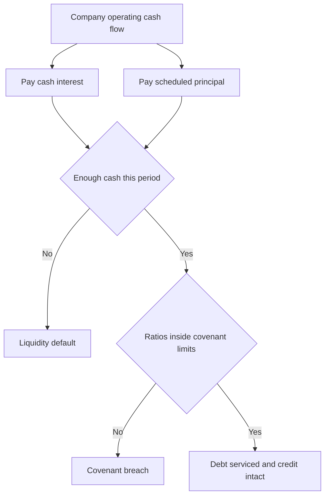
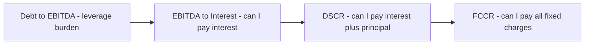
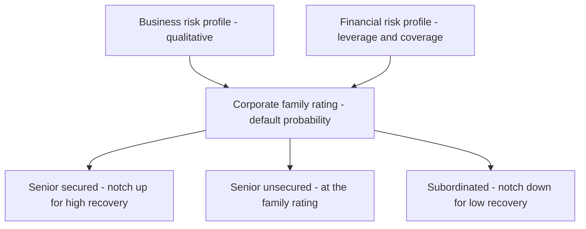
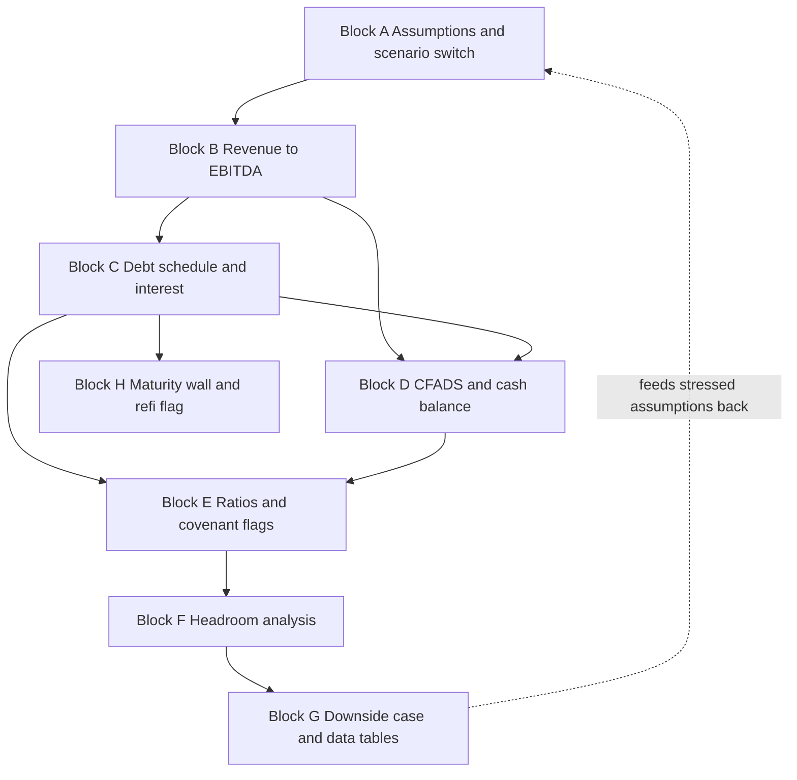

<!-- v2-deep -->

# Chapter 32 — Credit Analysis and Modeling

## 1. The Problem

Every model you have built so far in this program has asked one question: *what is this business worth to an owner?* DCF, comps, LBO returns — all of them look at the world through the eyes of an **equity holder**, someone entitled to the residual cash flows after everyone else is paid.

But the largest pool of capital in the world does not care about upside. A bank writing a USD 400 million term loan, a bond fund buying senior notes, a rating agency assigning a BB flag — none of them share in the equity upside. If the company triples in value, the lender still gets back par plus a coupon. Their entire job is to answer a *different* question:

> **Will I get my money back, on time, in full — even if things go badly?**

This is the asymmetry that defines credit. Equity has unlimited upside and limited downside (you can only lose your stake). Debt has capped upside (par plus interest) and severe downside (default, restructuring, pennies on the dollar). A lender who is right 95% of the time can still lose money if the 5% of defaults are large enough, because the winners never pay extra to compensate.

Make that asymmetry concrete with a number. Suppose you make 100 loans of USD 10m each at a 6% coupon, and 4 of them default with a 40% recovery. The 96 good loans each return 0.6m of interest, so USD 57.6m of coupon income. The 4 defaults each lose 60% of principal, so 4 × 6m = USD 24m of principal loss. Net you are still ahead by USD 33.6m — but notice how thin the margin is: raise the default count from 4 to 10, or drop recovery from 40% to 20%, and the book turns loss-making. The entire economics of lending live in the tail. That is why a credit analyst obsesses over the 5% and barely glances at the 95%.

That asymmetry forces a completely different modeling posture. An equity analyst builds a **base case** and dreams about the **upside**. A credit analyst builds a base case and then *stress-tests the downside* — because the downside is the only scenario that can hurt them. If you take one idea from this chapter, take this: **credit modeling is the discipline of asking "what breaks this company, and how much room do I have before it does?"**

The problem, concretely, is that raw financial statements do not tell you whether a company can service its debt. A company with USD 5 billion of debt might be rock-solid; a company with USD 50 million of debt might be one bad quarter from insolvency. You cannot read safety off the absolute number. A USD 5bn debt load against USD 2bn of EBITDA is a comfortable 2.5x; a USD 50m debt load against USD 8m of EBITDA is a frightening 6.25x. The absolute figure tells you nothing; the *ratio to earning power* tells you everything. You need a framework that translates the capital structure into standardized measures of *burden* and *cushion*, projects them forward, and tests how much adversity they can absorb.

## 2. The Core Idea

Credit analysis rests on a single mental model: **a company services debt out of cash flow, and defaults when it can no longer meet a required payment.** Everything else is elaboration.

There are two distinct ways a company can fail its lenders, and good credit work separates them:

1. **Liquidity default** — the company cannot make a scheduled interest or principal payment when it comes due. It has run out of cash, even if the business is fundamentally sound. This is a *flow* problem.
2. **Solvency default / covenant breach** — the company's leverage or coverage deteriorates past a contractually agreed threshold, triggering a covenant breach that lets lenders demand repayment or renegotiate. This is a *ratio* problem, and it can bite long before the company literally runs out of cash.

There is a subtle third failure that sits between them and catches out first-time analysts: **maturity / refinancing default**. A company can have comfortable coverage and cushion every single year — and then hit the maturity date of a large bullet bond it cannot repay from cash and cannot refinance because credit markets have frozen. This is not a flow problem in any given year and not a covenant problem; it is a *timing* problem. A complete credit view therefore also asks: *when does the debt come due, and is there a realistic path to repay or refinance it?* We surface this with a **maturity wall** view later in the chapter.

The core idea is to reduce all these failure modes to a small set of **ratios** that a lender can compute, benchmark, and project:

- **Leverage ratios** measure how much debt the company carries relative to its earning power. The flagship is **Debt / EBITDA** — "how many years of cash earnings would it take to repay all the debt?"
- **Coverage ratios** measure whether current cash flow comfortably exceeds current obligations. The flagship is **EBITDA / Interest** — "how many times over can I pay my interest bill?"

Then you wrap these ratios in three analytical moves that turn a snapshot into a decision:

- **Debt capacity** — given a target leverage the market will tolerate, how much debt *can* this business support?
- **Covenants** — what contractual lines in the sand protect the lender, and how close is the company to crossing them?
- **Downside case and headroom** — if EBITDA falls 20%, or rates rise 300 bps, do the ratios still clear the covenants and does cash stay positive?

That is the whole chapter in one paragraph. The rest is the exact formulas, the Excel build, and the judgment about where the traps lie.

*Figure 32.1 — The two failure modes a credit model must guard against.*



## 3. Why It Works

Why should a handful of ratios capture something as complex as default risk? Because they proxy the two things that actually cause default: **too much burden** and **too little cushion**, measured against the resource that pays debt — cash flow.

**Why EBITDA is the anchor.** EBITDA (earnings before interest, taxes, depreciation, and amortization) is an imperfect but useful proxy for the pre-financing, pre-tax cash the operations throw off. Lenders like it because it sits *above* interest in the income statement — it is the pool of money *available* to pay lenders, before the effect of how the company chose to finance itself. Debt / EBITDA and EBITDA / Interest both ask: is the pool big enough relative to the debt drawn against it? EBITDA is not cash flow — it ignores capex, working capital, and taxes — which is exactly why sophisticated analysts supplement it with cash-based coverage (DSCR, FCCR) that we build below.

A second, deeper reason EBITDA anchors credit: it is **capital-structure-neutral**, so it lets a lender compare two companies with identical operations but different financing on the same footing. If you compared them on net income, the more levered one would look worse purely because of its interest bill — but interest is exactly the thing the lender controls by deciding how much to lend. Stripping it out lets the lender ask "what can the *business* support?" before layering on "how much did we *choose* to load onto it?"

**Why leverage and coverage are complementary, not redundant.** Leverage is a **stock** measure (balance-sheet debt vs. a year of earnings); coverage is a **flow** measure (this year's cash vs. this year's obligations). A company can look fine on one and dangerous on the other. Consider a firm that refinanced into cheap fixed-rate debt: its *coverage* is comfortable because interest is low, but its *leverage* might be 6x — dangerous if EBITDA falls or it must refinance at higher rates. Conversely, a lightly levered firm with floating-rate debt in a rate-spike could have low leverage but suddenly thin coverage. You need both lenses because they fail in different weather.

Here is a numeric illustration of the divergence. Company X carries USD 600m of debt at a locked 4% fixed rate against USD 100m EBITDA: leverage 6.0x (scary) but coverage 100 / 24 = 4.2x (comfortable). Company Y carries USD 250m of floating debt at SOFR+300, currently 8%, against the same USD 100m EBITDA: leverage 2.5x (comfortable) but coverage 100 / 20 = 5.0x today — which collapses to 100 / 27.5 = 3.6x if SOFR rises 300 bps. Read either company on a single ratio and you misjudge it. X's risk is a *refinancing* event three years out; Y's risk is a *rate* move next quarter. Same EBITDA, opposite risk profiles, and only the two-lens view exposes it.

**Why the downside case is the real analysis.** A base case tells you what management hopes will happen. But the lender is only exposed to what happens when hope fails. The mathematics of the credit asymmetry — capped upside, catastrophic downside — means the *expected* return on a loan is dominated by the tail. So the model's center of gravity is not the base case; it is the **stressed case** and the **headroom** between the stressed ratios and the covenant thresholds. Headroom is the number that answers "how wrong can I be and still be safe?" — the single most decision-relevant output a credit model produces.

**Why rating agencies formalize this.** Rating agencies (S&P, Moody's, Fitch) exist because most lenders cannot build a full model for every borrower. Agencies distill the same ratios — leverage, coverage, cash flow to debt — plus qualitative business-risk judgment into a single ordinal grade (AAA down to D). The grade *works* as a summary because these ratios are empirically correlated with historical default rates: investment-grade names default far less often than single-B names, decade after decade. As a rough order of magnitude, historical one-year default rates run near zero for AAA/AA, a fraction of a percent for BBB, low single digits for BB, mid-to-high single digits for B, and well into the double digits for CCC. The rating is a compression of the exact analysis this chapter teaches.

## 4. Full Technical Content

This is the build core. We define every ratio with its exact formula, explain what each input is and where it comes from, then lay out the cell-by-cell logic for a working credit model in Excel.

### 4.1 The leverage ratios

**Total Debt / EBITDA** (often just "leverage" or "the turns")

$$\text{Leverage} = \frac{\text{Total Debt}}{\text{EBITDA}}$$

- **Total Debt** = all interest-bearing obligations: revolver drawings + term loans + senior notes + subordinated debt + finance leases. Use *gross* debt for the headline; some analysts also compute **Net Debt / EBITDA** = (Total Debt − Cash & equivalents) / EBITDA, which credits the company for cash it could use to repay. Report both; covenants usually reference one specifically.
- **EBITDA** = the trailing-twelve-month or projected annual figure. Build it as **Operating income (EBIT) + Depreciation + Amortization**, or top-down as **Revenue − COGS − Operating expenses (excluding D&A)**.
- **Interpretation:** the number is quoted in "turns." 3.0x means three years of current EBITDA would repay all debt. Rough market anchors: below 2x is conservative/investment-grade territory; 3–4x is typical for a healthy leveraged company; 5–6x is aggressive; above 6x is deep leverage that only works with strong, stable cash flows.

**Senior Debt / EBITDA** and **Net Debt / EBITDA** are the same formula with a narrower or cash-adjusted numerator. In a model, build the debt schedule once and let each ratio reference the appropriate subtotal.

**A word on "adjusted" EBITDA.** Credit agreements almost never use raw reported EBITDA. They use a contractually **defined** EBITDA that permits *add-backs*: one-time restructuring costs, non-cash stock compensation, and — most controversially — projected "run-rate synergies" and "cost savings" the company expects but has not yet realized. Aggressive add-backs can inflate defined EBITDA by 15–30%, which mechanically *lowers* reported leverage and *raises* coverage without any change in the actual business. When a deal is marketed at "5.5x" you must always ask: 5.5x of *what* EBITDA? The same company can be 5.5x on adjusted EBITDA and 7.0x on unadjusted. Build both, and never let the flattering definition go unchallenged.

### 4.2 The coverage ratios

**EBITDA / Interest** (interest coverage, the "times covered")

$$\text{Interest Coverage} = \frac{\text{EBITDA}}{\text{Cash Interest Expense}}$$

- **Cash Interest Expense** = interest actually paid in cash. Exclude non-cash PIK (payment-in-kind) interest and amortization of financing fees for the *cash* coverage view. Pull it from the debt schedule's interest line.
- **Interpretation:** 5x means EBITDA is five times the interest bill — very safe. Below 2x is a warning; below 1.5x is distress territory. A tighter variant, **(EBITDA − Capex) / Interest**, recognizes that maintenance capex is not truly optional.

**EBIT / Interest** is the same idea using EBIT (after D&A). It is more conservative because it charges the business for the cost of maintaining its asset base. Rating agencies lean on EBIT coverage for asset-heavy sectors.

**Debt Service Coverage Ratio (DSCR)** — the cash-flow coverage that includes principal

$$\text{DSCR} = \frac{\text{Cash Flow Available for Debt Service (CFADS)}}{\text{Scheduled Principal} + \text{Cash Interest}}$$

- **CFADS** ≈ EBITDA − Cash taxes − Maintenance capex − Increase in working capital. It is the cash genuinely available *after* keeping the business running, *before* paying lenders.
- **Denominator** = total debt service = the mandatory principal amortization plus cash interest for the period.
- **Interpretation:** DSCR is the workhorse ratio in project finance, real estate, and any amortizing-loan context because it directly tests the liquidity-default failure mode. A DSCR of 1.0x means cash exactly covers debt service with zero margin. Lenders typically require a covenant of 1.10x–1.30x so there is a cushion. Below 1.0x, the company must dip into cash reserves or draw the revolver to make its payments.

**Fixed Charge Coverage Ratio (FCCR)** — the broadest coverage test

$$\text{FCCR} = \frac{\text{EBITDA} - \text{Capex} - \text{Cash taxes}}{\text{Cash Interest} + \text{Scheduled Principal} + \text{Lease payments} + \text{Preferred dividends}}$$

- FCCR recognizes that a company has *fixed charges* beyond bank debt — operating lease payments, preferred dividends, mandatory pension contributions. It asks whether cash flow covers *all* contractually fixed outflows. Exact definitions vary by credit agreement, so **always read the specific FCCR definition in the loan document** — the covenant math is whatever the contract says, not the textbook.

**Two more measures rating agencies weight heavily.** Cash-flow-to-debt ratios test repayment capacity directly rather than through a coverage multiple:

$$\text{FFO / Debt} = \frac{\text{Funds From Operations}}{\text{Total Debt}}, \qquad \text{FCF / Debt} = \frac{\text{Free Cash Flow}}{\text{Total Debt}}$$

FFO (funds from operations) is roughly EBITDA − cash interest − cash taxes: the recurring internal cash generation before working-capital swings and capex. FFO / Debt is essentially the inverse of a leverage ratio expressed as a percentage — 30% FFO/Debt means the company internally generates cash equal to 30% of its debt each year, implying a rough repayment horizon of ~3.3 years. Agencies favor it because it is harder to flatter with EBITDA add-backs (it already nets out real cash interest and taxes). As anchors: FFO/Debt above ~45% is investment-grade-ish, ~20–35% maps to BB, ~12–20% to B, and below ~10% to CCC.

*Figure 32.2 — How the ratios stack from broadest cushion to tightest test.*



### 4.3 Debt capacity

Debt capacity turns the leverage ratio around. Instead of "how levered is this company?" you ask "**how much debt could this company raise?**" There are two lenses:

**Leverage-based capacity** (what the market will lend):

$$\text{Max Debt} = \text{Target Leverage Multiple} \times \text{EBITDA}$$

If a lender is willing to go to 4.5x and EBITDA is USD 120 million, capacity is USD 540 million. This is the quick screen used in LBO sizing and refinancing.

**Coverage-based / cash-flow capacity** (what the cash flow can service):

$$\text{Sustainable Debt} = \frac{\text{CFADS available for interest}}{\text{Interest rate}} \quad(\text{roughly, for perpetual-style debt})$$

If the company can dedicate USD 45 million a year to interest and the rate is 9%, it can support roughly USD 500 million of debt from a pure interest-coverage standpoint (before principal amortization). The **binding** capacity is the *lower* of the leverage-based and coverage-based numbers — a company can be constrained either by the multiple lenders tolerate or by the cash it generates, whichever bites first.

**A sharper coverage-based capacity** respects the actual coverage covenant rather than a perpetual approximation. If the covenant demands minimum interest coverage of `k` times, then the maximum interest bill is `EBITDA / k`, and the maximum debt is that interest bill divided by the rate:

$$\text{Max Debt (coverage)} = \frac{\text{EBITDA} / k}{\text{interest rate}} = \frac{\text{EBITDA}}{k \times r}$$

With EBITDA 120m, a minimum coverage covenant of 3.0x, and a rate of 9%: max interest = 120 / 3 = 40m, so max debt = 40 / 0.09 ≈ **USD 444m**. Compare that with the leverage-based 4.5x × 120 = **USD 540m**. Here *coverage* is the binding constraint at 444m, not leverage — the high 9% rate eats capacity faster than the multiple does. Flip the rate to 6% and coverage-based capacity jumps to 40 / 0.06 = 667m, so leverage (540m) becomes binding instead. The lesson: **which constraint binds depends on the interest rate**, and cheap debt lets leverage bind while expensive debt lets coverage bind.

### 4.4 Covenants — maintenance vs. incurrence

Covenants are the contractual promises that protect lenders between the day the loan is made and the day it is repaid. There are two families, and the distinction is one of the most tested concepts in credit:

| Feature | **Maintenance covenant** | **Incurrence covenant** |
|---|---|---|
| Tested | Every period (usually quarterly), automatically | Only when the company takes a specific action |
| Trigger | The ratio itself drifting out of bounds | An event: issuing new debt, paying a dividend, making an acquisition |
| Question asked | "Is the company *still* healthy right now?" | "Is the company *allowed* to do this new thing?" |
| Typical home | Bank loans / leveraged loans | High-yield bonds ("covenant-lite" structures) |
| Example | "Net Leverage must remain **below 4.5x**, tested quarterly" | "May not incur new debt **unless** pro-forma leverage stays **below 5.0x**" |
| Breach consequence | Technical default; lenders can accelerate or force renegotiation | The company simply cannot do the action; existing debt unaffected |

The practical difference is enormous. A **maintenance** covenant is a tripwire the company can hit passively just by having a bad quarter — it forces borrowers back to the table when they are weak, which is exactly when lenders want leverage. An **incurrence** covenant only bites when the company chooses to act, so a company can deteriorate substantially without ever tripping it. The market shift toward "cov-lite" loans (no maintenance covenants) over the last cycle is precisely a transfer of protection *from* lenders *to* borrowers.

There is one more category worth knowing: the **springing covenant**, common in cov-lite structures. A springing financial covenant is a maintenance test that only *activates* ("springs") when a condition is met — typically when revolver utilization exceeds a threshold like 35%. In quiet times the company has no maintenance test at all; the moment it leans on its revolver (a sign of stress), the leverage tripwire springs into existence. It is a lender's compromise: no ongoing test while things are fine, but protection precisely when the company starts drawing liquidity. In a model, encode a springing covenant as `=IF(Revolver_Utilization > 0.35, IF(Leverage > Limit, "BREACH", "OK"), "N/A — not sprung")`.

A credit model must therefore:
1. Encode each covenant's exact formula and threshold as inputs.
2. Compute the tested ratio every period.
3. Flag any period where the ratio breaches — in the **base case** and, critically, in the **downside case**.
4. For springing covenants, gate the flag on the activation condition.

### 4.5 The credit rating logic

Rating agencies blend **business risk** (qualitative: industry cyclicality, competitive position, scale, diversification, management) with **financial risk** (the ratios above). Conceptually:

$$\text{Rating} = f(\text{Business Risk Profile},\ \text{Financial Risk Profile})$$

The financial risk profile is dominated by leverage and coverage, with cash-flow-to-debt measures like **FFO / Debt** (funds from operations to debt) and **Free Cash Flow / Debt** carrying heavy weight. Indicative anchors (they vary by agency and sector):

| Rating band | Debt / EBITDA | EBITDA / Interest | Character |
|---|---|---|---|
| AAA–A (high grade) | < 1.5x – 2.0x | > 8x | Fortress balance sheet |
| BBB (lowest investment grade) | ~2.0x – 3.0x | ~4x – 6x | Solid, some cushion |
| BB (upper high-yield) | ~3.0x – 4.5x | ~3x – 4x | Leveraged but serviceable |
| B (mid high-yield) | ~4.5x – 6.0x | ~2x – 3x | Aggressive, vulnerable to shocks |
| CCC and below | > 6.0x | < 1.5x – 2x | Distressed, refinancing-dependent |

The mapping is not mechanical — a strong business (stable utility) earns a better rating at the same leverage than a weak one (cyclical commodity producer) — but the ratios set the gravitational center. In a model, you can build a simple **rating grid**: compute the ratios, look them up against these anchors with nested `IF`s or an `INDEX`/`MATCH` lookup table, and produce an implied rating that updates live with your assumptions.

**The notching concept.** Beyond an issuer's overall corporate rating, individual *instruments* are "notched" up or down based on where they sit in the capital structure and how much collateral backs them. A senior secured term loan might be notched *up* from the corporate rating (first claim on assets, high expected recovery), while subordinated notes are notched *down* (last in line, low recovery). The corporate rating answers "how likely is default?"; notching answers "given default, how much does *this specific tranche* recover?" This is why the same company can have a BB term loan and a B− bond outstanding simultaneously — same default probability, different loss-given-default. We return to recovery arithmetic in Example 5.

*Figure 32.4 — How default probability and recovery combine into instrument ratings.*



### 4.6 Building the credit model in Excel — step by step

Build these blocks in order. Use consistent conventions: **blue font for hardcoded inputs, black for formulas**, one column per year, positive numbers for inflows.

**Block A — Assumptions (input area).**
- Revenue and revenue growth %, EBITDA margin %, so that `EBITDA = Revenue * Margin`.
- Cash tax rate %, capex as % of revenue, working-capital change as % of revenue change.
- Opening debt tranches with rates: e.g. `Term Loan` USD 500m at SOFR + 350 bps, `Notes` USD 250m at 8% fixed.
- Mandatory amortization schedule (e.g. Term Loan amortizes 5% per year).
- **Covenant thresholds** as explicit input cells: Max Net Leverage `4.5x`, Min Interest Coverage `2.5x`, Min DSCR `1.20x`.
- A **scenario switch** cell (e.g. `1 = Base, 2 = Downside`) that a `CHOOSE` or `IF` uses to select which assumption set feeds the model — this is what lets you flip to the stress case with one keystroke.

A robust way to wire the scenario switch: lay each driver out as three side-by-side input cells (Base in column L, Downside in M, plus a hidden "live" column), and have the live cell read `=CHOOSE($B$1, L10, M10)`. Then *every* downstream formula references only the live column. Flipping `$B$1` from 1 to 2 re-drives the entire model. For a floating-rate driver, model rate as `=Base_index + spread` where `Base_index` itself is a scenario-switched input, so the downside case can both compress margin *and* raise SOFR at once.

**Block B — Income statement to EBITDA.**
- Row: Revenue = prior × (1 + growth). Use `=B_rev*(1+growth)`.
- Row: EBITDA = Revenue × EBITDA margin.
- Row: D&A (as % of revenue or a schedule) → EBIT = EBITDA − D&A.

**Block C — Debt schedule (the engine).** This is the heart of the model. For each tranche and each year:
- **Opening balance** = prior year closing balance (first year = input).
- **Mandatory repayment** = the scheduled amortization (a negative to the balance).
- **Cash sweep (optional)** = excess cash used to prepay debt — model as `=MIN(excess cash available, remaining balance)`. This is where a **circularity** appears: interest depends on the balance, the balance depends on the sweep, the sweep depends on cash, cash depends on interest. Handle it by enabling **iterative calculation** (File → Options → Formulas → Enable iterative calculation, ~100 iterations) or by using a **circularity switch** (an input cell that zeroes the sweep to break the loop when debugging).
- **Closing balance** = Opening − Mandatory − Sweep.
- **Interest expense** = average-balance method: `=Rate * (Opening + Closing)/2`. Average balance is more accurate than opening-balance when debt amortizes during the year; opening-balance is simpler and avoids one layer of circularity — pick one and be consistent.

The exact cell layout for a single tranche (Term Loan) across years in columns `D:H`, with the opening input in `D`, might read:

```
Opening      D:  =C_input        E: =D_close   F: =E_close  ...
Mandatory    D:  =-$B$Amort*$D$Open        (copy across)
Sweep        D:  =-MIN($D$CashAvail, $D$Open+$D$Mandatory)
Closing      D:  =D_Open + D_Mandatory + D_Sweep
Interest     D:  =$B$Rate*(D_Open + D_Close)/2
```

Note the sign discipline: Mandatory and Sweep are stored as *negatives* so Closing is a clean sum. The `MIN` in the sweep caps the prepayment at the remaining post-amortization balance so you can never sweep a tranche below zero. When you add a revolver, its logic is the mirror image — a *draw* is a positive addition triggered by a cash shortfall: `Revolver draw = MAX(0, -Cash_before_revolver)`, capped at undrawn capacity with a second `MIN`.

**Block D — Cash flow and cash balance.**
- CFADS = EBITDA − Cash taxes − Capex − Increase in working capital.
- Cash available for debt service, then subtract mandatory principal and cash interest to get cash flow after debt service.
- Roll the **cash balance**: Opening cash + cash flow after debt service = Closing cash. If closing cash would go negative, the model should either **draw the revolver** (add a revolver tranche in Block C that plugs the shortfall) or **flag a liquidity default**.

**Block E — Ratios and covenant tests.** For each year compute:
- `Net Leverage = (Total Debt − Cash) / EBITDA`
- `Interest Coverage = EBITDA / Cash Interest`
- `DSCR = CFADS / (Mandatory Principal + Cash Interest)`
- **Covenant flags:** `=IF(Net_Leverage > Max_Leverage, "BREACH", "OK")`, and similarly for the minimums (note the sign flips: leverage is a *maximum*, coverage and DSCR are *minimums*). Conditional-format BREACH cells red.

**Block F — Headroom.** For each covenant, compute the cushion:
- Leverage headroom = `Max_Leverage − Actual_Leverage` (positive = safe, in turns).
- Coverage headroom = `Actual_Coverage − Min_Coverage`.
- Also express **EBITDA headroom**: how far can EBITDA fall before the tightest covenant breaks? For the leverage covenant, solve `(Debt − Cash)/EBITDA* = Max_Leverage` for `EBITDA* = (Debt − Cash)/Max_Leverage`; the percentage decline `(EBITDA − EBITDA*)/EBITDA` is the cushion in plain business terms — "EBITDA can fall 22% before we breach."

**Block G — Downside case and sensitivity.** Flip the scenario switch to feed stressed assumptions (lower growth, compressed margin, higher rates). Re-read every ratio, flag, and headroom cell. Build a **data table** (Data → What-If Analysis → Data Table) that sweeps EBITDA decline % against the resulting minimum DSCR or peak leverage, so you can see at a glance the size of shock the credit survives.

**Block H — Maturity profile (the wall).** Add a small schedule that lays out how much debt matures in each future year — the "maturity wall." Sum the bullet maturities and any balloon payments by year, and compare each year's maturity against that year's projected cash plus revolver availability. A `=IF(Maturity > Cash + Undrawn_Revolver, "REFI RISK", "OK")` flag catches the timing-default failure mode that the ratio tests alone miss. A company can show green covenant flags in every year and still carry a red "REFI RISK" flag in the year its senior notes come due.

*Figure 32.3 — Calculation flow of the credit model, block by block.*



## 5. Worked Examples

We will build a single company across the examples so the numbers reconcile. Meet **Meridian Packaging**, a stable industrial with the following Year 0 base case.

**Given (Year 0 base):**
- Revenue USD 1,000m; EBITDA margin 20% → **EBITDA = USD 200m**
- D&A = USD 50m → **EBIT = USD 150m**
- Debt: Term Loan USD 450m at 7.0%, Senior Notes USD 300m at 8.0% → **Total Debt USD 750m**
- Cash on balance sheet USD 50m
- Cash interest = 450 × 7.0% + 300 × 8.0% = 31.5 + 24.0 = **USD 55.5m**
- Mandatory principal (Term Loan amortizes 5% = USD 22.5m/yr) → **Principal USD 22.5m**
- Cash taxes USD 25m; Capex USD 40m; working-capital increase USD 5m
- Covenants: **Max Net Leverage 4.0x**, **Min Interest Coverage 3.0x**, **Min DSCR 1.20x**

### Example 1 — Base-case ratios and rating

**Leverage (gross):** 750 / 200 = **3.75x**
**Net leverage:** (750 − 50) / 200 = 700 / 200 = **3.50x**
**Interest coverage:** 200 / 55.5 = **3.60x**
**EBIT coverage:** 150 / 55.5 = **2.70x**

**CFADS:** EBITDA − Cash taxes − Capex − ΔWC = 200 − 25 − 40 − 5 = **USD 130m**
**Debt service:** Principal + Interest = 22.5 + 55.5 = **USD 78.0m**
**DSCR:** 130 / 78 = **1.67x**

**Covenant check (base case):**

| Covenant | Threshold | Actual | Result |
|---|---|---|---|
| Net Leverage | ≤ 4.0x | 3.50x | OK (0.50x headroom) |
| Interest Coverage | ≥ 3.0x | 3.60x | OK (0.60x headroom) |
| DSCR | ≥ 1.20x | 1.67x | OK (0.47x headroom) |

**Implied rating:** Net leverage 3.5x and coverage 3.6x place Meridian squarely in **BB** territory (upper high-yield) per the grid in §4.5 — leveraged but comfortably serviceable. All three covenants clear with meaningful cushion. *Self-check:* gross leverage 3.75x × EBITDA 200 = 750 debt ✓; interest 55.5 ÷ 200 EBITDA = 27.75% of EBITDA consumed by interest, so coverage = 1/0.2775 = 3.60x ✓.

**Cross-check with a cash-flow-to-debt lens.** FFO = EBITDA − cash interest − cash taxes = 200 − 55.5 − 25 = 119.5m. FFO / Debt = 119.5 / 750 = **15.9%**. On the §4.2 anchors that sits at the weak end of BB, closer to the BB/B boundary — a useful *tension* with the ratio-based BB read. It says: on a pure repayment-horizon basis Meridian is more stretched than the leverage multiple alone suggests, because its 7.4% blended cash cost is chewing through a chunk of EBITDA. A careful analyst notes the disagreement between the two lenses rather than reporting only the flattering one.

### Example 2 — Debt capacity and headroom

**How much debt could Meridian carry** if lenders tolerate 4.0x net leverage?
Max net debt = 4.0 × 200 = USD 800m. Adding back cash of 50m, gross debt capacity ≈ **USD 850m**. Meridian currently has 750m gross, so it has roughly **USD 100m of additional leverage-based capacity** before hitting the covenant.

**Coverage-based capacity check:** at a blended rate of ~7.4% (55.5/750), an extra USD 100m of debt adds ~USD 7.4m of interest, pushing interest to ~USD 62.9m. New coverage = 200 / 62.9 = **3.18x**, still above the 3.0x minimum — so coverage is *not* the binding constraint here; leverage is. Capacity is genuinely ~USD 100m.

**EBITDA headroom (the decision number).** How far can EBITDA fall before each covenant breaks, holding debt and cash constant?
- **Leverage binds at:** (750 − 50) / EBITDA* = 4.0 → EBITDA* = 700 / 4.0 = **USD 175m**. That is a decline of (200 − 175)/200 = **12.5%**.
- **Interest coverage binds at:** EBITDA* / 55.5 = 3.0 → EBITDA* = **USD 166.5m**, a decline of **16.75%**.
- **DSCR binds at:** CFADS* / 78 = 1.20 → CFADS* = 93.6m. Since CFADS = EBITDA − 70 (taxes+capex+ΔWC held), EBITDA* = 163.6m, a decline of **18.2%**.

**Binding covenant = leverage, at a 12.5% EBITDA decline.** This is the headline: *Meridian can absorb a 12.5% EBITDA drop before tripping its tightest covenant.* Every other covenant survives a larger shock. A credit committee now knows exactly how much room the base case has. *Self-check:* at EBITDA 175, net leverage = 700/175 = 4.00x exactly ✓.

### Example 3 — The downside case

Now stress it. Recession scenario: **EBITDA falls 20%** to USD 160m (margin compresses to 16% on flat revenue), floating Term Loan **rate rises to 9.0%** (Notes fixed at 8.0%), and capex is held at 40m (maintenance capex is not discretionary), taxes fall to 15m on lower profit.

**Stressed EBITDA = USD 160m.**
**Stressed interest** = 450 × 9.0% + 300 × 8.0% = 40.5 + 24.0 = **USD 64.5m**.
**Stressed net leverage:** (750 − 50) / 160 = 700 / 160 = **4.375x → BREACH** (limit 4.0x).
**Stressed interest coverage:** 160 / 64.5 = **2.48x → BREACH** (limit 3.0x).
**Stressed CFADS:** 160 − 15 − 40 − 5 = **USD 100m**.
**Stressed debt service:** 22.5 + 64.5 = **USD 87.0m**.
**Stressed DSCR:** 100 / 87 = **1.15x → BREACH** (limit 1.20x, and dangerously close to the 1.0x liquidity line).

**Downside covenant table:**

| Covenant | Threshold | Base | Downside | Result |
|---|---|---|---|---|
| Net Leverage | ≤ 4.0x | 3.50x | 4.375x | **BREACH** |
| Interest Coverage | ≥ 3.0x | 3.60x | 2.48x | **BREACH** |
| DSCR | ≥ 1.20x | 1.67x | 1.15x | **BREACH** |

**Liquidity check:** DSCR of 1.15x is still above 1.0x, so Meridian can *just* make its payments out of the year's cash flow (100m CFADS vs. 87m debt service leaves 13m). It does **not** suffer an immediate liquidity default — but all three *maintenance* covenants breach, giving lenders the right to accelerate or renegotiate. This is the classic **covenant default before liquidity default** pattern: the tripwires fire while the company is weakened but still paying, which is exactly when lenders want to be at the table.

**The credit conclusion.** A 20% EBITDA shock — well within the range of an industrial recession — pushes Meridian through all three covenants simultaneously. The 12.5% headroom from Example 2 told us this was coming: the shock (20%) exceeds the cushion (12.5%). A lender reading this would either demand a lower opening leverage (say fund only 650m, not 750m), price in the risk with a wider spread, or negotiate covenant thresholds with more room. *Self-check:* the leverage headroom of 12.5% predicted a breach for any decline above 12.5%; the 20% stress duly breaches, and the breach magnitude (4.375 vs 4.0 = 0.375x over) reconciles with 700/160 ✓.

### Example 4 — Isolating the rate shock from the EBITDA shock

Example 3 moved two levers at once. A disciplined analyst *decomposes* the stress to see which lever does the damage — this is how you argue with a credit committee about what to worry about. Hold EBITDA at the base 200m but raise only the Term Loan rate from 7.0% to 9.0%.

**Rate-only interest** = 450 × 9.0% + 300 × 8.0% = 40.5 + 24.0 = **USD 64.5m** (same interest as Example 3, but EBITDA is now the full 200m).
**Rate-only interest coverage:** 200 / 64.5 = **3.10x → OK** (just clears the 3.0x limit, 0.10x headroom).
**Rate-only net leverage:** unchanged at 700 / 200 = **3.50x → OK** (leverage does not depend on the rate).
**Rate-only CFADS:** EBITDA − taxes − capex − ΔWC = 200 − 25 − 40 − 5 = 130m (unchanged; the rate does not touch CFADS, which is pre-financing).
**Rate-only debt service:** 22.5 + 64.5 = 87.0m. **DSCR:** 130 / 87 = **1.49x → OK**.

So a 200 bps rate shock *alone* leaves every covenant intact (coverage barely). Now compare with an **EBITDA-only** shock of −20% holding rates at base 7.0%:

**EBITDA-only interest:** unchanged at 55.5m. **Coverage:** 160 / 55.5 = **2.88x → BREACH**.
**EBITDA-only net leverage:** 700 / 160 = **4.375x → BREACH**.
**EBITDA-only CFADS:** 160 − 15 − 40 − 5 = 100m. **Debt service:** 22.5 + 55.5 = 78m. **DSCR:** 100 / 78 = **1.28x → OK**.

**The decomposition verdict.** The EBITDA shock is the dangerous one — it alone breaches leverage and coverage. The rate shock alone breaches nothing. Notice the interaction, too: in Example 3 the *combined* shock pushed DSCR to 1.15x (breach), whereas neither single shock breached DSCR on its own (1.49x and 1.28x). That is the compounding a naive one-variable sensitivity misses. *Self-check:* combined DSCR 1.15x < EBITDA-only 1.28x < rate-only 1.49x < base 1.67x, a clean monotone ordering as stress accumulates ✓. The credit committee lesson: Meridian's fragility is overwhelmingly an *earnings* story, not a *rates* story — hedge the earnings volatility (or fund with less debt) before worrying about the coupon.

### Example 5 — Recovery, LGD, and notching

Coverage and leverage measure *probability* of default. When default actually happens, the lender's loss depends on *recovery* — and recovery differs sharply by tranche. Suppose Meridian defaults and a restructuring values the enterprise at **USD 500m** (a distressed 2.5x on stressed EBITDA of 200m, well below the ~5x a healthy sale would fetch). The capital structure is repaid in strict priority (the "waterfall"): USD 450m Term Loan (senior secured) first, then USD 300m Senior Notes (unsecured).

**Waterfall:**
- Term Loan claim 450m → recovers **450m in full** (500m of value covers it). **Recovery = 100%, LGD = 0%.**
- Remaining value after Term Loan = 500 − 450 = **50m** available to the Notes.
- Senior Notes claim 300m → recovers only **50m**. **Recovery = 50 / 300 = 16.7%, LGD = 83.3%.**

**Expected loss for each tranche** combines default probability with LGD. Take an illustrative one-year default probability of 5% (consistent with a single-B family rating):
- Term Loan expected loss ≈ 5% × 0% = **0.0%** of exposure.
- Senior Notes expected loss ≈ 5% × 83.3% = **4.2%** of exposure.

**Why this notches the ratings.** Both instruments share the *same* 5% default probability — they are the same company — yet the Term Loan loses nothing in default while the Notes lose most of their money. That gap is exactly what "notching" prices: the secured Term Loan is notched *up* (toward BB) and the unsecured Notes *down* (toward CCC), even though the corporate family rating is B. *Self-check:* total value distributed = 450 + 50 = 500m = enterprise value, nothing leaks ✓; blended recovery on total 750m of debt = 500 / 750 = 66.7%, a plausible senior-heavy structure ✓.

**"What-if" on the value break.** If the distressed enterprise value were only 400m (a 2.0x multiple), the Term Loan recovers 400/450 = 88.9% and the Notes recover **zero** — the value breaks *inside* the Term Loan, and unsecured lenders are wiped out. This is the "fulcrum security" idea: the tranche where value runs out is where the restructuring negotiation concentrates, because it converts from debt to equity. Distressed investors hunt for the fulcrum precisely because it captures the reorganized company's upside.

## 6. Connections

**To the LBO model (Chapters on leveraged buyouts).** Credit analysis *is* the debt side of an LBO. The sponsor asks "what return can I make on equity?"; the lender asks "how much debt can I safely provide and at what price?" The debt schedule, cash sweep, and coverage tests you built here are the same engine that sits inside every LBO model — the LBO just adds an equity waterfall on top. Debt capacity (§4.3) directly sizes the maximum leverage an LBO can use.

**To the three-statement model (Chapters on integrated modeling).** The credit model is a focused extract of the full three-statement model: EBITDA comes from the income statement, the debt schedule feeds the balance sheet and the interest line, and CFADS is a rearrangement of the cash flow statement. If you have built the integrated model, the credit ratios are lookups on top of it.

**To DCF and cost of capital (valuation chapters).** A company's rating drives its **cost of debt**, which drives the **WACC** used in DCF. Higher leverage lowers WACC (cheap debt, tax shield) until rising default risk pushes the cost of debt — and eventually equity — up faster than the tax benefit. Credit analysis is what tells you where that turning point is. The optimal capital structure is the leverage that minimizes WACC without pushing the rating into distress.

**To bond pricing and credit spreads.** The rating maps to a **credit spread** over the risk-free rate, and the spread is where default probability and expected recovery get priced. Roughly, spread ≈ default probability × loss-given-default plus a risk premium — the same PD and LGD you computed in Example 5. When you value a bond, its yield is the risk-free curve plus this spread; a rating downgrade widens the spread and reprices the bond down. Credit analysis and fixed-income valuation are two ends of the same object.

**To covenants in real deals.** The maintenance-vs-incurrence distinction connects to how you *read a credit agreement*. When you value a distressed bond or model a refinancing, the covenant package determines who holds the negotiating power — a lesson that recurs in restructuring and special-situations work.

**To scenario and sensitivity analysis.** The downside case and data tables here are a direct application of general scenario-modeling technique, pointed at the one question credit cares about: survival under stress.

## 7. Traps and Common Errors

1. **Confusing gross and net leverage.** A covenant may reference net debt (cash-adjusted) or gross debt — they can differ by a full turn. Using the wrong one flips a "breach" to "OK." Always match the covenant's exact definition; do not default to whichever is more flattering.

2. **Treating EBITDA as cash flow.** EBITDA ignores capex, working capital, taxes, and cash interest timing. A company with high maintenance capex can have healthy EBITDA coverage and still be cash-negative. Always cross-check with DSCR/FCCR, which include the real cash drains.

3. **Forgetting the covenant sign convention.** Leverage covenants are *maximums* (`Actual < Limit` is good); coverage and DSCR are *minimums* (`Actual > Limit` is good). Mixing up the direction in an `IF` flag produces false green cells — a dangerous, silent error. Test each flag by deliberately entering a breaching value and confirming it turns red.

4. **Ignoring the circularity, or leaving it broken.** Interest → balance → cash sweep → cash → interest is a genuine loop. If iterative calculation is off, Excel throws a circular-reference error and zeros the cells; if it is on but poorly controlled, the model can oscillate. Use a **circ switch** and test convergence. Never ship a model with a hidden `#REF` or a hardcoded interest number pasted over the broken circularity.

5. **Building only a base case.** A base-case-only credit model is not credit analysis — it is optimism with a spreadsheet. The entire value of the exercise is the downside case and the headroom. If your model cannot flip to a stress scenario in one cell, it is incomplete.

6. **Using PIK interest in cash coverage.** Payment-in-kind interest accrues to principal instead of being paid in cash. It belongs in *leverage* (it grows debt) but must be **excluded from cash interest** in DSCR and interest-coverage numerators/denominators. Including it understates cash coverage; excluding it from the debt balance understates leverage. Track cash and PIK interest separately.

7. **Static debt in the downside.** Analysts often stress EBITDA but forget that in a downside, the revolver gets *drawn* (debt rises) and floating rates may *rise* (interest rises). Both make the ratios worse than a naive "just cut EBITDA" stress. Let the model's revolver and rate assumptions respond to the scenario.

8. **Over-trusting the rating grid.** The leverage/coverage-to-rating table is indicative. A stable regulated utility at 5x can be investment grade; a cyclical miner at 3x can be high-yield. Business risk moves the mapping. Never quote an "implied rating" from ratios alone without the qualitative overlay.

9. **Swallowing aggressive EBITDA add-backs.** A deal marketed at "5.5x" may be 5.5x on a heavily adjusted EBITDA padded with unrealized synergies and cost savings. On unadjusted EBITDA the same company might be 7x. Always ask "leverage on *what* EBITDA?" and rebuild the ratios on numbers you can defend.

10. **Confusing default probability with loss severity.** Two tranches of the *same* issuer share one default probability but can have wildly different recoveries (Example 5). A ratio-only view that stops at "how likely is default?" misses "and how much do *I* lose if it happens?" — which depends entirely on where you sit in the waterfall. Notching exists precisely because these are two different questions.

11. **Ignoring the maturity wall.** A company can clear every covenant in every projected year and still default at a bullet maturity it cannot refinance. Ratio tests measure ongoing health; they do not measure the timing of principal coming due. Always lay out the maturity profile and flag years where maturities exceed available liquidity.

12. **Annual models hiding intra-year liquidity gaps.** A model with annual columns can show positive year-end cash while the company actually ran dry in month 8 (seasonal working-capital swing) and only recovered by December. If the business is seasonal or lumpy, an annual DSCR of 1.3x can mask a mid-year liquidity default. Build quarterly or monthly for working-capital-heavy or seasonal borrowers.

## 8. First-Principles Recap

Strip everything away and credit rests on four irreducible truths:

1. **Lenders bear asymmetric risk** — capped upside, severe downside — so their entire discipline is about the downside, not the base case.
2. **Debt is serviced out of cash flow**, and a company fails its lenders in exactly two ways: it runs out of *cash* to make a payment (liquidity), or its *ratios* cross a contractual line (covenant) — with refinancing risk at a bullet maturity as the timing-based third cousin. A complete model guards against all of them.
3. **Two lenses, always both.** Leverage (a stock: debt vs. earning power) and coverage (a flow: cash vs. obligations) fail in different weather; you need both because a company can be safe on one and dangerous on the other.
4. **Headroom is the answer.** The decision-relevant output is not "what will happen" but "how much can go wrong before this breaks?" — the distance between the stressed ratios and the covenant lines. Everything in the build — the debt schedule, the covenant flags, the downside switch — exists to produce that one number.

And when default does occur, a fifth truth governs the loss: **recovery depends on where you sit in the waterfall**, so probability of default and loss-given-default are separate questions that together determine expected loss.

If you can compute Debt/EBITDA, EBITDA/Interest, and DSCR; flip a scenario; read the headroom; and trace a recovery waterfall, you have the core of credit analysis. Everything else is refinement and industry nuance.

## 9. Quick-Reference

**Core formulas**

| Ratio | Formula | Good direction |
|---|---|---|
| Gross Leverage | Total Debt / EBITDA | Lower |
| Net Leverage | (Total Debt − Cash) / EBITDA | Lower |
| Interest Coverage | EBITDA / Cash Interest | Higher |
| EBIT Coverage | EBIT / Cash Interest | Higher |
| DSCR | CFADS / (Principal + Cash Interest) | Higher |
| FCCR | (EBITDA − Capex − Taxes) / (Interest + Principal + Leases + Pref div) | Higher |
| FFO / Debt | (EBITDA − Cash interest − Cash taxes) / Total Debt | Higher |
| CFADS | EBITDA − Cash taxes − Maintenance capex − ΔWC | Higher |
| Leverage-based capacity | Target multiple × EBITDA | — |
| Coverage-based capacity | EBITDA / (min coverage × interest rate) | — |
| EBITDA breach point (leverage) | (Debt − Cash) / Max leverage | — |
| Recovery (a tranche) | Value reaching the tranche / tranche claim | Higher |
| Loss-given-default (LGD) | 1 − Recovery | Lower |
| Expected loss | Default probability × LGD | Lower |

**Rough rating anchors:** IG ≈ Debt/EBITDA < 3x and coverage > 4x; BB ≈ 3–4.5x, coverage 3–4x; B ≈ 4.5–6x, coverage 2–3x; CCC > 6x, coverage < 2x. FFO/Debt: >45% IG-ish, 20–35% BB, 12–20% B, <10% CCC.

**Covenant types:** Maintenance = tested every period, tripwire (bank loans). Incurrence = tested only on an action, permission gate (high-yield bonds). Springing = a maintenance test that activates only when a trigger (e.g. revolver utilization > 35%) is met.

**Excel functions to know:** `IF` (covenant flags), `MIN` (cash sweep cap), `MAX` (revolver draw), `INDEX`/`MATCH` (rating lookup), `CHOOSE` (scenario switch), average-balance interest `Rate*(Open+Close)/2`, iterative calculation for circularity, Data Table for sensitivity.

**Sign discipline:** leverage covenants are maximums; coverage and DSCR covenants are minimums. Store mandatory repayments and sweeps as negatives; store revolver draws as positives.

**Interview one-liners:**
- *"What's the difference between leverage and coverage?"* Stock vs. flow — debt-to-earnings vs. cash-to-obligations; they fail in different weather.
- *"Company at 3x with declining margins vs. 5x with stable ones — which is the better credit?"* Often the 5x: stability of cash flow beats the point-in-time multiple, because credit is about the downside distribution, not the snapshot.
- *"Why do lenders use EBITDA if it isn't cash flow?"* It is the capital-structure-neutral pool available to pay them *before* financing choices; but you always cross-check with DSCR/FCCR because EBITDA ignores capex, WC, and taxes.
- *"Cov-lite loan — good or bad for the lender?"* Bad: no maintenance tripwire means the borrower can deteriorate materially before the lender gets a seat at the table.
- *"Same company, two bonds, two different ratings — how?"* Same default probability, different recovery — notching for seniority and collateral.

## 10. Build-It-Yourself Exercise

Open a blank workbook and build a five-year credit model for a fictional company, **Corvus Logistics**, from these Year 0 inputs. Do it entirely with live formulas — no pasted values.

**Starting assumptions:**
- Revenue USD 600m, growing 4%/yr (base) or −3%/yr (downside); EBITDA margin 22% (base) / 17% (downside).
- D&A = 6% of revenue; capex = 7% of revenue; cash tax rate 25% of EBIT; ΔWC = 10% of the revenue change.
- Debt: Term Loan USD 300m at 8% (amortizes 10%/yr), Senior Notes USD 150m at 9% fixed. Opening cash USD 30m.
- Add a **revolver** (USD 50m capacity, 7.5%) that draws automatically if cash would go negative.
- Covenants: Max Net Leverage 3.75x, Min Interest Coverage 3.0x, Min DSCR 1.25x.
- The Senior Notes are a **bullet** maturing at the end of Year 5 (add a maturity-wall row).

**Your tasks:**
1. Build Blocks A–E from §4.6. Compute all three ratios for each of the five years in the **base case**.
2. Add covenant flags with correct sign conventions and conditional formatting (red = BREACH).
3. Compute **Year 1 headroom**: how far can EBITDA fall before the binding covenant breaks? State which covenant binds.
4. Flip the scenario switch to **downside** and identify the first year (if any) that any covenant breaches. Does the revolver get drawn? Does DSCR ever fall below 1.0x (true liquidity default)?
5. Build a **Data Table** sweeping EBITDA-margin decline (0% to −8%) against Year 3 net leverage. Read off the margin decline that first triggers a leverage breach.
6. Compute Corvus's **debt capacity** at the 3.75x covenant and state whether leverage or coverage is the binding constraint. Then recompute coverage-based capacity using `EBITDA / (3.0 × rate)` and confirm which binds.
7. **Maturity wall:** In Year 5 the USD 150m bullet comes due. Compare it to projected Year 5 cash plus undrawn revolver. Does Corvus face refinancing risk, and does the answer change in the downside case?
8. **Decomposition (Example 4 style):** Run an EBITDA-only downside and a rate-only downside (Term Loan to 10%) separately. Which lever breaches first, and do any covenants that survive each single shock fail under the combined shock?

**Self-check targets to confirm your build:** Year 0 base EBITDA should be USD 132m; gross leverage 450/132 = 3.41x; net leverage (450−30)/132 = 3.18x; interest coverage 132/(24+13.5) = 132/37.5 = 3.52x. For task 3, CFADS Year 0 base = EBITDA − taxes − capex − ΔWC; with EBIT = 132 − 36 = 96, taxes = 24, capex = 42, and ΔWC on the Year 1 revenue rise, confirm your DSCR lands near 1.9x. If your model reproduces the four leverage/coverage numbers, your engine is wired correctly — then push it into the downside and watch the headroom disappear. Remember: **build it in Excel**. Reading this chapter teaches you the logic; only building the model teaches you credit.
