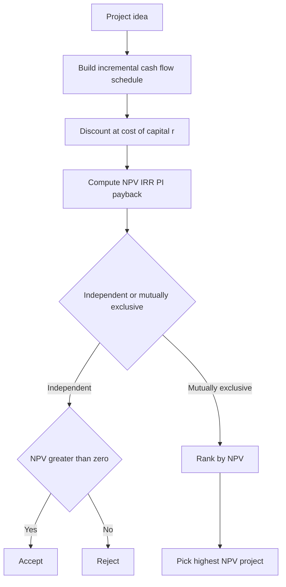
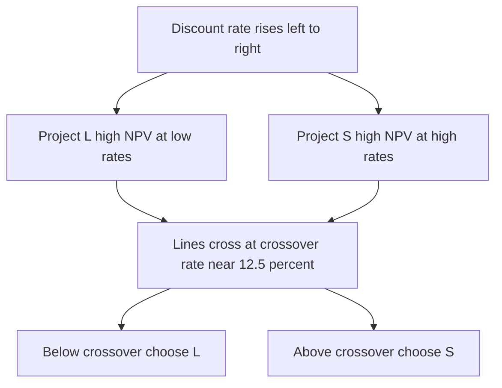
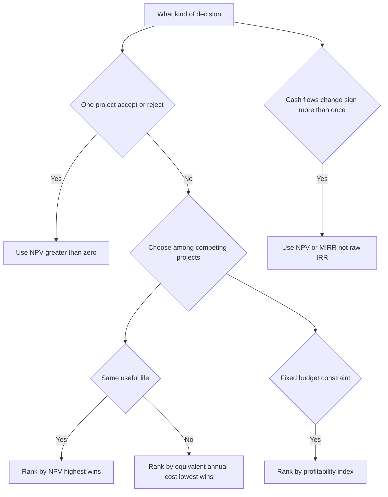
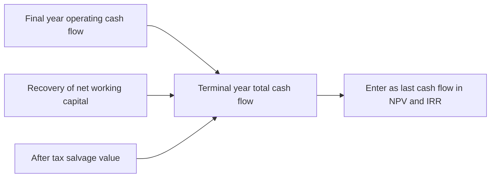

<!-- v2-deep -->

# Chapter 33 — Capital Budgeting

## 1. The Problem

A company sits on limited cash and faces a menu of long-lived projects: build a new plant, launch a product line, replace an aging machine, expand into a new region. Each one demands money **today** and promises cash **over many future years**. The years are uncertain, the outflows are large and often irreversible, and once the concrete is poured you cannot easily un-pour it.

The naive way to decide is to ask, "Does it make money?" But that question is almost useless, because *almost every* project makes some money if you wait long enough. A machine that costs $1,000,000 and throws off $50,000 a year "makes money" — but it would take 20 years just to get your cash back, and by then inflation and the opportunity cost of capital have quietly destroyed the value. Meanwhile a competing project might return your cash in three years and compound from there.

So the real problem is not *whether* a project earns cash, but whether it earns **enough cash, soon enough, to justify tying up capital that has alternative uses**. Capital budgeting is the discipline of answering that question with numbers instead of gut feel. It sits at the exact intersection of the accountant's cash flows, the finance theorist's time value of money (Chapter 3), and the corporate manager's scarce budget.

Two things make it hard. First, **defining the cash flows correctly** — which dollars actually belong to the project and which are accounting noise or already-spent history. Second, **ranking projects against each other** when they differ in size, timing, and risk, and when you cannot afford them all. Get the first wrong and even a perfect discounting formula gives you garbage. Get the second wrong and you fund the flashy project while starving the one that would have compounded shareholder wealth. This chapter builds the toolkit — NPV, IRR, MIRR, payback, discounted payback, the profitability index, and the equivalent annual cost — and, just as importantly, teaches you when each one lies to you.

A useful way to frame the whole discipline: capital budgeting is *forecasting plus discounting plus judgment*. The forecasting produces the cash-flow line, the discounting collapses it to a single dollar figure, and the judgment decides which metric to trust when they disagree. Most real-world errors are not discounting-arithmetic mistakes — Excel does that flawlessly — they are cash-flow-definition mistakes and metric-selection mistakes. Keep that split in mind and you already know where 90% of the danger lives.

## 2. The Core Idea

Every capital budgeting decision reduces to one comparison:

> **The value created by the project's future cash flows, brought back to today's dollars, versus the cash you must spend today to get them.**

If the discounted future inflows exceed the cost, the project creates wealth; take it. If not, it destroys wealth; reject it. That single sentence is the whole of **Net Present Value (NPV)**, and NPV is the anchor around which every other metric orbits.

The two supporting pillars are:

1. **Incremental cash flows.** A project is worth exactly the *change* in the firm's total cash flows caused by accepting it — no more, no less. This means you count only dollars that appear *because* of the decision (opportunity costs, working-capital swings, tax effects) and you ignore dollars that will flow regardless (sunk costs, allocated overhead that does not actually change). The mental test for any line item is the **"with vs without" test**: compute the firm's cash flows *with* the project and *without* it; the difference, year by year, is the only thing that belongs in the model.

2. **The discount rate as an opportunity cost.** Money has alternative uses. The rate at which you discount future cash is the return you *forgo* by putting money in this project instead of the next-best investment of equal risk. That rate — the cost of capital, usually the WACC from Chapter 32 — is the hurdle the project must clear.

Everything else (IRR, MIRR, payback, PI, EAC) is either a re-expression of this idea or a shortcut that captures part of it. Keep NPV as your north star and you will never be badly wrong.

A subtle but load-bearing point: NPV is measured in *today's currency units*, and those units are additive and comparable across projects of any size. This is why NPV alone can rank a $10,000 project against a $10,000,000 one and get the answer right. A rate (IRR) cannot do this — 40% on $100 beats 20% on $10,000,000 as a percentage, yet the second creates 200,000 times more wealth. That single asymmetry between *dollars* and *rates* is the seed of nearly every ranking pitfall in the chapter.

## 3. Why It Works

NPV works because it is nothing more than the **shareholder-wealth equation applied one project at a time**. A firm's value is the present value of all its future cash flows. Adding a project adds its incremental cash flows. Discount those increments at the opportunity cost of capital and you get, in today's dollars, exactly how much the firm's value rises or falls. A positive NPV of $2 million *literally means* the market value of the firm should rise by about $2 million if the project performs as forecast. No other metric makes that clean, additive, dollar-denominated claim.

The **additivity** property is the quiet superpower: NPV(A + B) = NPV(A) + NPV(B). You can evaluate projects independently and sum them, because dollars of present value add like ordinary dollars. IRR, being a rate, does *not* add — you cannot average two IRRs and get the portfolio IRR — which is the root of half the mistakes analysts make.

The **incremental principle** works because the firm is a going concern. Its existing cash flows will happen whether or not you approve the new plant. The only economically relevant question is the *delta*. A cost you already paid (the sunk market study) cannot be recovered by rejecting the project, so it must not tilt the decision. A factory you already own but would otherwise rent out *does* have a cost — the forgone rent — even though no new cash leaves the building. Economics cares about opportunity, not accounting entries.

Finally, the **time-value discounting** works because a dollar next year is genuinely worth less than a dollar today: you could invest today's dollar and have more than a dollar next year. Discounting is just running that compounding in reverse. Skip it and you commit the payback method's cardinal sin — treating a dollar in year 5 as equal to a dollar in year 1.

There is also a **reinvestment logic** hiding inside NPV that explains why it beats IRR for ranking. When you discount at the cost of capital *r*, you are implicitly assuming interim cash flows can be reinvested at *r* — the true opportunity rate available to the firm. IRR instead assumes reinvestment at the IRR itself. For a project with a 40% IRR, that is the claim that every dollar it spins off can be re-deployed at 40% forever, which is almost never true. NPV's assumption is conservative and defensible; IRR's is optimistic and often fictional. Understanding *why* the assumptions differ is what separates someone who memorized "use NPV" from someone who can defend it in an interview.

## 4. Full Technical Content

### 4.1 The metrics at a glance

| Metric | What it answers | Decision rule (independent project) | Units |
|---|---|---|---|
| Payback Period | How fast do I get my cash back? | Accept if payback < target | Years |
| Discounted Payback | How fast in *present-value* terms? | Accept if disc. payback < target | Years |
| NPV | How much wealth is created? | Accept if NPV > 0 | Currency |
| IRR | What return does the project earn? | Accept if IRR > cost of capital | % |
| MIRR | Return with realistic reinvestment | Accept if MIRR > cost of capital | % |
| Profitability Index | Value created per dollar invested | Accept if PI > 1.0 | Ratio |
| Equivalent Annual Cost | Cost per year of ownership | Choose lowest EAC (unequal lives) | Currency/yr |

### 4.2 Building the incremental cash flow schedule

Before any formula, you must construct the cash flows. This is where models live or die. Work in three blocks down a timeline (t = 0, 1, 2, …, n).

**Initial outlay (t = 0), typically negative:**

```
  Capital expenditure (equipment, installation, shipping)
+ Increase in Net Working Capital (NWC)
− After-tax proceeds from any asset the project displaces
= Initial Investment (Year 0 cash flow)
```

**Operating cash flows (t = 1 to n):**

```
  Incremental Revenue
− Incremental Cash Operating Costs
− Incremental Depreciation
= Incremental EBIT
× (1 − tax rate)
= Incremental NOPAT
+ Incremental Depreciation   (add back — it is non-cash)
= Incremental Operating Cash Flow
```

The compact formula, worth memorizing:

**OCF = (Revenue − Costs) × (1 − t) + Depreciation × t**

The second term, **Depreciation × tax rate**, is the *depreciation tax shield* — depreciation is not cash, but it reduces taxable income, and the tax you *save* is real cash. Never omit it.

There are three algebraically identical ways to write OCF; know all three because different textbooks and interviewers use different ones, and being able to move between them proves you understand the mechanics rather than a memorized string:

- **Tax-shield form:** OCF = (Rev − Cost)(1 − t) + Dep × t
- **Bottom-up form:** OCF = NOPAT + Dep = EBIT(1 − t) + Dep
- **Top-down form:** OCF = (Rev − Cost) − Taxes, where Taxes = (Rev − Cost − Dep) × t

All three return the identical number. Quick proof for the tax-shield form: start from bottom-up, OCF = (Rev − Cost − Dep)(1 − t) + Dep. Expand: (Rev − Cost)(1 − t) − Dep(1 − t) + Dep = (Rev − Cost)(1 − t) − Dep + Dep·t + Dep = (Rev − Cost)(1 − t) + Dep·t. ∎

**Terminal cash flow (t = n):**

```
  Final year OCF
+ Recovery of Net Working Capital
+ After-tax salvage value of equipment
= Terminal Year cash flow
```

After-tax salvage = Salvage − t × (Salvage − Book Value). If you sell an asset for more than its remaining book value, you pay tax on the gain; if for less, you get a tax saving. Three cases worth internalizing:

- **Salvage > Book:** taxable gain → after-tax proceeds are *less* than the sale price.
- **Salvage = Book:** no tax effect → after-tax proceeds equal the sale price.
- **Salvage < Book:** a loss → the tax *saving* means after-tax proceeds *exceed* the sale price.

Example: salvage $25,000, book $10,000, tax 25%. Gain = $15,000, tax = $3,750, after-tax = $21,250. Now flip it: salvage $5,000, book $10,000. Loss = $5,000, tax saving = $1,250, after-tax = $6,250 — *more* than the $5,000 sale price, because the loss shelters other income.

### 4.3 Rules for identifying incremental cash flows

- **Include opportunity costs.** If the project uses land you could otherwise sell or lease, charge it the forgone amount.
- **Include working-capital changes.** Growth ties up cash in inventory and receivables (outflow); it is recovered at the project's end (inflow). Net the change each year: ΔNWC. Note that in a *growing* project NWC keeps rising every year — each year's incremental investment is ΔNWC = NWC(t) − NWC(t−1), an outflow — and the *entire cumulative balance* is recovered in the final year.
- **Include side effects.** *Erosion / cannibalization* (new product steals sales from an existing one) is a real incremental cost. *Synergy* (it lifts sales of a complementary product) is a real incremental benefit.
- **Ignore sunk costs.** Money already spent — feasibility studies, past R&D — is gone regardless of the decision.
- **Ignore allocated overhead** that does not actually change. If head-office rent is unaffected by the project, the accounting allocation is irrelevant. Only *incremental* overhead counts.
- **Ignore financing cash flows** (interest, principal, dividends). The cost of financing is already captured in the discount rate. Putting interest in the cash flows *and* discounting would double-count it. Capital budgeting uses **unlevered** free cash flows.

### 4.4 Net Present Value

$$\text{NPV} = \sum_{t=0}^{n} \frac{CF_t}{(1+r)^t} = CF_0 + \frac{CF_1}{(1+r)^1} + \frac{CF_2}{(1+r)^2} + \dots + \frac{CF_n}{(1+r)^n}$$

where $CF_0$ is the (usually negative) initial outlay and $r$ is the cost of capital.

**Excel build.** Excel's `NPV` function discounts values starting at the *end of period 1*, so it does **not** include the Year 0 outlay. The correct construction is:

```
=NPV(rate, CF1:CFn) + CF0
```

with `CF0` a negative number added *outside* the function. A very common error is `=NPV(rate, CF0:CFn)`, which wrongly discounts the Year 0 outlay by one period.

For irregular dates, use `=XNPV(rate, values, dates)`, which discounts by actual calendar days and *does* include the first cash flow.

Decision rule: **NPV > 0 accept, NPV < 0 reject, NPV = 0 indifferent** (project earns exactly the cost of capital).

**The NPV profile.** Plot NPV (y-axis) against discount rate (x-axis) and you get the *NPV profile* — a downward-sloping curve for a conventional project. Two features matter: the **y-intercept** (at r = 0) is the simple undiscounted sum of all cash flows, and the **x-intercept** (where the curve crosses zero) *is* the IRR. Everything about the NPV–IRR relationship is visible in this one picture: the project has positive NPV for every rate to the *left* of its IRR and negative NPV to the *right*. Sketching this profile on scratch paper is the fastest way to reason about ranking conflicts in an interview.

### 4.5 Internal Rate of Return

IRR is the discount rate that makes NPV exactly zero:

$$0 = \sum_{t=0}^{n} \frac{CF_t}{(1+\text{IRR})^t}$$

It is the project's own compound annual return. There is no closed-form solution beyond two periods; Excel solves it iteratively.

**Excel build.** `=IRR(CF0:CFn, [guess])`. The range **includes** Year 0. Supply a guess (e.g. 0.1) if the default fails to converge. For irregular dates use `=XIRR(values, dates)`.

Decision rule for an independent project: **accept if IRR > cost of capital**.

**Manual IRR by interpolation.** When you have no computer, bracket the IRR with two NPVs of opposite sign and linearly interpolate:

$$\text{IRR} \approx r_L + (r_H - r_L)\times\frac{\text{NPV}_L}{\text{NPV}_L - \text{NPV}_H}$$

where NPV$_L$ is positive (at the low rate $r_L$) and NPV$_H$ is negative (at the high rate $r_H$). The narrower the bracket, the better the estimate, because the true profile is convex, not linear.

**MIRR** (Modified IRR) fixes IRR's unrealistic reinvestment assumption by reinvesting interim cash flows at the finance/reinvestment rate rather than at IRR itself: `=MIRR(values, finance_rate, reinvest_rate)`. Mechanically, MIRR (1) compounds every positive cash flow forward to year *n* at the reinvestment rate to build a single **terminal value**, (2) discounts every negative cash flow back to year 0 at the finance rate to build a single **present value of costs**, then (3) solves for the single rate that grows the PV of costs into the terminal value over *n* years:

$$\text{MIRR} = \left(\frac{\text{FV of positive flows}}{\text{PV of negative flows}}\right)^{1/n} - 1$$

Because the reinvestment rate is usually far below the IRR, **MIRR sits between the cost of capital and the IRR**, and is a more honest headline number for a high-IRR project. It also has a single unique value even when raw IRR does not — one reason practitioners prefer it for non-conventional flows.

### 4.6 Payback Period

The time for cumulative cash inflows to recover the initial outlay.

- **Even cash flows:** Payback = Initial Investment ÷ Annual Cash Flow.
- **Uneven cash flows:** accumulate year by year; interpolate within the recovery year:

$$\text{Payback} = \text{Full years before recovery} + \frac{\text{Unrecovered cost at start of year}}{\text{Cash flow during year}}$$

**Excel build.** Create a running cumulative cash flow row. Then locate the crossover. A robust one-cell approach:

```
=MATCH(TRUE, cumulative_range >= 0, 0) - 1        (entered as an array, gives full years)
```

then add the fractional year. In practice most analysts build an explicit cumulative row and read it off, which is clearer and auditable. A fully self-contained fractional-payback formula, given a cumulative row `C1:Cn` and the annual cash flow row `CF1:CFn`:

```
=(MATCH(TRUE, C1:Cn>=0, 0) - 1)                                   [full years]
 + INDEX(-C1:Cn,MATCH(TRUE,C1:Cn>=0,0)-1)/INDEX(CF1:CFn,MATCH(TRUE,C1:Cn>=0,0))
```

Payback ignores the time value of money and everything after the cutoff, so it is a *liquidity/risk screen*, never a value measure. Despite that, it survives in practice for three reasons: it is trivially intuitive to non-finance managers, it proxies for *risk* (a fast payback means less time exposed to uncertainty), and it proxies for *liquidity* (how soon capital is freed for other uses). Treat it as a fast screen and a communication tool, never as the deciding vote.

### 4.7 Discounted Payback Period

Same idea, but accumulate the **discounted** cash flows. This fixes payback's ignoring of time value but still ignores everything after the cutoff. Discounted payback is always *longer* than plain payback. Build a "PV of CF" row (`=CF_t/(1+r)^t`), then a cumulative-PV row, then interpolate exactly as in 4.6. A neat corollary: if a project *never* reaches a positive cumulative discounted cash flow, its NPV is negative — the discounted payback "never happens" and the accept/reject verdict is already decided.

### 4.8 Profitability Index

$$\text{PI} = \frac{\text{PV of future cash flows}}{|\text{Initial Investment}|} = 1 + \frac{\text{NPV}}{|CF_0|}$$

PI measures "bang per buck" of PV per dollar invested. Rule: **accept if PI > 1.0** (equivalent to NPV > 0). PI shines under **capital rationing** — when the budget is fixed, rank projects by PI to squeeze the most NPV out of each scarce dollar.

**Excel build:** `=NPV(rate, CF1:CFn) / -CF0` gives PI directly (note the sign flip to make the denominator positive).

A caution that mirrors IRR's: PI, like any ratio, is blind to *scale*. Between a PI-1.5 project needing $40,000 and a PI-1.2 project needing $1,000,000, the second creates far more absolute NPV. PI ranks correctly *only when the budget constraint is the binding scarcity*; when capital is unconstrained, revert to raw NPV.

### 4.9 Equivalent Annual Cost / Annuity (unequal lives)

When mutually exclusive projects have **different lifespans**, a straight NPV comparison is unfair — a 5-year project has more years to accumulate value than a 3-year one, and you would also have to *repeat* the shorter project to fill the gap. Two standard fixes:

1. **Equivalent Annual Cost/Annuity (EAC):** convert each project's NPV (or PV of costs) into a level annual amount by dividing by the annuity factor for its life. Compare the annual figures directly.

$$\text{EAC} = \frac{\text{PV of project}}{\text{Annuity factor}(n, r)}, \quad \text{Annuity factor}=\frac{1-(1+r)^{-n}}{r}$$

Excel: `=PMT(rate, n, -PV)`. Choose the **lowest** EAC when comparing pure-cost projects (e.g. which machine to buy), or the **highest** equivalent annual *benefit* when comparing profit projects.

2. **Replacement chain / least common multiple:** repeat each project until both reach a common horizon (e.g. a 3-year and a 5-year project both extended to 15 years) and compare total NPVs. EAC is just the elegant shortcut for the same idea, and it assumes the project can be replicated indefinitely at the same terms.

### 4.10 Formatting and model hygiene

- Put the discount rate, tax rate, and growth assumptions in a clearly labelled **assumptions block**, colour-coded blue (inputs), and reference them — never hard-code a rate inside a formula.
- Lay the timeline **left to right** with period headers 0, 1, 2, …, n.
- Keep one row per cash-flow component so the OCF build is transparent and auditable.
- Show NPV, IRR, MIRR, PI, payback, and discounted payback together in a small **output summary** box.
- Use consistent sign convention: outflows negative, inflows positive. Never mix.
- Always sanity-check IRR against NPV: at r = IRR, your NPV cell must read ~0.
- Build a **one-row toggle** for the discount rate so you can eyeball the NPV profile by typing in a few rates, and confirm the sign flips exactly at the IRR.

## 5. Worked Examples

### Example 1 — A single project, full incremental build

A firm considers a machine. Assumptions:

- Equipment cost: $200,000 at t = 0; installation $20,000. Depreciated straight-line to zero over 4 years.
- Additional NWC needed at t = 0: $30,000, fully recovered at t = 4.
- Incremental revenue $180,000/yr; incremental cash costs $70,000/yr.
- Tax rate 25%; cost of capital 10%.
- Salvage value of equipment at t = 4: $25,000.

**Step 1 — Initial outlay (t = 0):** $220,000 (equipment + install) + $30,000 NWC = **−$250,000**.

**Step 2 — Annual depreciation:** $220,000 ÷ 4 = $55,000/yr. Book value at t = 4 = $0.

**Step 3 — Operating cash flow (years 1–4):**

OCF = (Revenue − Costs) × (1 − t) + Dep × t
= (180,000 − 70,000) × 0.75 + 55,000 × 0.25
= 110,000 × 0.75 + 13,750
= 82,500 + 13,750 = **$96,250/yr**

*Cross-check with the top-down form:* Taxes = (180,000 − 70,000 − 55,000) × 0.25 = 55,000 × 0.25 = 13,750; OCF = (180,000 − 70,000) − 13,750 = 110,000 − 13,750 = $96,250. ✓ Same number, different route.

**Step 4 — Terminal extras (t = 4):**
- NWC recovery: +$30,000
- After-tax salvage: Salvage − t × (Salvage − Book) = 25,000 − 0.25 × (25,000 − 0) = 25,000 − 6,250 = **+$18,750**

So t = 4 total = 96,250 + 30,000 + 18,750 = **$145,000**.

**Cash flow timeline:**

| Year | 0 | 1 | 2 | 3 | 4 |
|---|---|---|---|---|---|
| Cash flow | −250,000 | 96,250 | 96,250 | 96,250 | 145,000 |

**Step 5 — Discount at 10%:**

| Year | CF | Factor 1/(1.1)^t | PV |
|---|---|---|---|
| 0 | −250,000 | 1.0000 | −250,000 |
| 1 | 96,250 | 0.9091 | 87,500 |
| 2 | 96,250 | 0.8264 | 79,545 |
| 3 | 96,250 | 0.7513 | 72,314 |
| 4 | 145,000 | 0.6830 | 99,038 |
| | | **NPV** | **88,397** |

**NPV ≈ +$88,400 → accept.**

**IRR check.** Solve for r where NPV = 0. Testing r = 24%: PVs sum to roughly +$4k; at 25% roughly −$1k. Interpolating with the formula from 4.5: IRR ≈ 24% + 1% × 4/(4−(−1)) ≈ 24.8%, comfortably above the 10% hurdle — consistent with the positive NPV. (In Excel, `=IRR(B2:F2)` returns ≈ 24.8%.)

**MIRR check.** Reinvest the inflows at 10% and finance the outlay at 10%. FV of positives at t = 4 = 96,250×1.1³ + 96,250×1.1² + 96,250×1.1 + 145,000 = 128,109 + 116,463 + 105,875 + 145,000 = 495,447. PV of negatives = 250,000. MIRR = (495,447/250,000)^(1/4) − 1 = 1.9818^0.25 − 1 ≈ **18.7%**. Note it sits *between* the 10% cost of capital and the 24.8% IRR — exactly as theory predicts, and a more realistic "true return" because it does not pretend interim cash earns 24.8%.

**Profitability Index.** PV of inflows = 250,000 + 88,397 = 338,397. PI = 338,397 ÷ 250,000 = **1.35**. Since PI > 1, accept — the same verdict, cross-checked. Also PI = 1 + NPV/|CF0| = 1 + 88,397/250,000 = 1.354. ✓ reconciles.

**Payback.** Cumulative: after Yr1 −153,750; Yr2 −57,500; Yr3 +38,750. Recovery happens during Year 3. Payback = 2 + 57,500/96,250 = **2.60 years**.

**Discounted payback.** Cumulative PV: after Yr1 −162,500; Yr2 −82,955; Yr3 −10,641; Yr4 +88,397. Recovery in Year 4. Disc. payback = 3 + 10,641/99,038 = **3.11 years** — longer than plain payback, as it must be.

Every metric agrees: **accept**. And they reconcile — PI derived two ways matches, IRR (24.8%) sets NPV to zero, and MIRR (18.7%) lands between hurdle and IRR.

**What-if variations (build these as toggles):**
- *Raise the hurdle to 20%.* NPV falls but stays positive (IRR is 24.8%, still above 20%). Only when r crosses 24.8% does the project flip to reject.
- *Halve the salvage to $12,500.* After-tax salvage = 12,500 − 0.25×12,500 = 9,375; t = 4 CF drops by 9,375 to 135,625; NPV falls by 9,375×0.6830 ≈ 6,403 to ≈ 81,994 — still a comfortable accept.
- *Zero tax rate.* OCF = Rev − Cost = 110,000/yr (the depreciation shield vanishes), after-tax salvage = full 25,000. This *raises* OCF but removes the shield; net effect here is higher NPV because the lost shield (13,750/yr) is smaller than the tax previously paid on operating profit (27,500/yr). Good reminder that taxes cut both ways.

### Example 2 — Replacement analysis (old asset vs new asset)

Replacement decisions are the most error-prone type because *two* assets are in play and everything is incremental — you must net the new machine against the machine it displaces. Assumptions:

- **Old machine:** current book value $40,000, being depreciated straight-line at $10,000/yr for 4 more years to zero. If sold today it fetches $30,000; in 4 years it would be worthless.
- **New machine:** cost $120,000, straight-line over 4 years to zero ($30,000/yr), salvage $20,000 at t = 4.
- The new machine cuts cash operating costs by $40,000/yr (revenue unchanged).
- Tax rate 25%, cost of capital 10%.

**Step 1 — Initial outlay (t = 0).** Buy new: −120,000. Sell old: proceeds $30,000, but book value is $40,000, so selling at $30,000 books a **loss of $10,000** → tax saving 0.25 × 10,000 = $2,500. After-tax proceeds = 30,000 + 2,500 = $32,500.
Net initial = −120,000 + 32,500 = **−$87,500**.

**Step 2 — Incremental depreciation.** New $30,000/yr − old $10,000/yr = **+$20,000/yr** of extra depreciation → extra shield of 20,000 × 0.25 = $5,000/yr.

**Step 3 — Incremental OCF (years 1–4).** The pre-tax benefit is the $40,000 cost saving.
OCF = 40,000 × (1 − 0.25) + 20,000 × 0.25 = 30,000 + 5,000 = **$35,000/yr**.

**Step 4 — Terminal (t = 4).** Incremental salvage = new $20,000 (book 0 → after-tax = 20,000 − 0.25×20,000 = $15,000) minus old $0 = **+$15,000**. No NWC change.
So t = 4 CF = 35,000 + 15,000 = **$50,000**.

**Timeline and NPV at 10%:**

| Year | CF | PV factor | PV |
|---|---|---|---|
| 0 | −87,500 | 1.0000 | −87,500 |
| 1 | 35,000 | 0.9091 | 31,818 |
| 2 | 35,000 | 0.8264 | 28,926 |
| 3 | 35,000 | 0.7513 | 26,296 |
| 4 | 50,000 | 0.6830 | 34,151 |
| | | **NPV** | **+33,691** |

**NPV ≈ +$33,700 → replace the old machine.** IRR of this incremental stream ≈ **25.8%** (Excel `=IRR`), far above the 10% hurdle — consistent. The key discipline: every figure is a *difference* between "keep old" and "buy new," including the often-forgotten tax saving on the loss at disposal and the incremental (not total) depreciation shield.

### Example 3 — Mutually exclusive projects and the NPV vs IRR conflict

A firm must choose **one** of two projects (mutually exclusive). Cost of capital = 10%.

| Year | Project S (small) | Project L (large) |
|---|---|---|
| 0 | −10,000 | −10,000 |
| 1 | 7,000 | 2,000 |
| 2 | 5,000 | 4,000 |
| 3 | 2,000 | 12,000 |

Note both cost the same today, but **S front-loads** cash while **L back-loads** it.

**NPV at 10%:**

Project S: 7,000/1.1 + 5,000/1.21 + 2,000/1.331 − 10,000
= 6,364 + 4,132 + 1,503 − 10,000 = **+1,999**

Project L: 2,000/1.1 + 4,000/1.21 + 12,000/1.331 − 10,000
= 1,818 + 3,306 + 9,015 − 10,000 = **+4,139**

**IRR** (solve NPV = 0 for each):
- Project S: IRR ≈ **21.4%**
- Project L: IRR ≈ **17.2%**

**The conflict:** NPV prefers **L** (+4,139 > +1,999), but IRR prefers **S** (21.4% > 17.2%). They point in *opposite* directions.

**Which is right? NPV.** IRR is a *rate* and implicitly assumes interim cash is reinvested at the IRR itself — an unrealistically high 21.4% for S. NPV assumes reinvestment at the cost of capital (10%), which is the true opportunity rate. Because the firm's goal is to maximize *dollars* of wealth, and dollars add while rates do not, choose the higher-NPV project: **L**.

**Resolving it with the crossover rate.** Compute the incremental project (L − S):

| Year | L − S |
|---|---|
| 0 | 0 |
| 1 | −5,000 |
| 2 | −1,000 |
| 3 | +10,000 |

The IRR of this incremental stream is the **crossover rate** — the discount rate at which the two projects have equal NPV. Solving: crossover ≈ **12.5%**.

Interpretation:
- **Below 12.5%** (our case, r = 10%): the back-loaded project L has the higher NPV — take L.
- **Above 12.5%**: the front-loaded project S wins, because heavy discounting punishes L's distant Year-3 cash.

Since our cost of capital (10%) is *below* the 12.5% crossover, **L is correct** — confirming the direct NPV ranking. The IRR ranking misled us precisely because these projects differ in the *timing* of their cash flows, one of the two classic triggers of the NPV–IRR conflict (the other being differences in *scale*).

**Reconciliation.** At r = 12.5%, recompute both NPVs — they should be equal (both ≈ +900), confirming the crossover. Below it, L leads; the incremental IRR method and the direct NPV comparison give the identical answer. This is the disciplined way to resolve any mutually exclusive tie.

### Example 4 — Capital rationing with the Profitability Index

A firm has only **$100,000** to invest and four independent, whole-take projects. Cost of capital 10%.

| Project | Investment | PV of inflows | NPV | PI |
|---|---|---|---|---|
| A | 40,000 | 60,000 | 20,000 | 1.50 |
| B | 50,000 | 70,000 | 20,000 | 1.40 |
| C | 30,000 | 39,000 | 9,000 | 1.30 |
| D | 60,000 | 66,000 | 6,000 | 1.10 |

Ranking by raw NPV would tie A and B at $20,000 and might tempt you toward D (large, positive). But with a $100,000 ceiling you must maximize **total NPV per dollar**.

Rank by **PI** (highest first): A (1.50), B (1.40), C (1.30), D (1.10).

- Take **A** ($40,000, NPV 20,000). Remaining budget $60,000.
- Take **B** ($50,000, NPV 20,000). Remaining $10,000 — cannot afford C ($30,000) or D.
- **Total NPV = $40,000** using $90,000.

Compare alternatives explicitly to prove PI is not merely a heuristic here:

| Combination | Total cost | Total NPV | Fits $100k? |
|---|---|---|---|
| A + B | 90,000 | 40,000 | Yes |
| A + C | 70,000 | 29,000 | Yes (30k idle) |
| B + C | 80,000 | 29,000 | Yes (20k idle) |
| A + D | 100,000 | 26,000 | Yes (exact) |
| C + D | 90,000 | 15,000 | Yes |

A + B wins at $40,000 total NPV. Notice A + D uses the budget *exactly* yet delivers only $26,000 — a reminder that "spend the whole budget" is not the objective; **maximizing total NPV** is. This is exactly when PI earns its keep: not as a substitute for NPV, but as a *rationing tool* on top of it.

**Caveat — the lumpiness problem.** PI ranking is optimal only when leftover cash cannot be redeployed and projects are perfectly divisible in *ranking*. When indivisible projects leave awkward remainders (here $10,000 idle), the PI order can occasionally be beaten by an integer-programming search over feasible bundles. For exam and interview purposes, PI ranking is the expected answer; in a real model with many projects you would run Excel Solver as a binary knapsack to be certain.

### Example 5 — Unequal lives and the Equivalent Annual Cost

A plant must choose between two machines that do the same job. Ignore taxes; cost of capital 10%.

- **Machine A:** cost $50,000, life 3 years, operating cost $8,000/yr.
- **Machine B:** cost $70,000, life 5 years, operating cost $6,000/yr.

A raw PV-of-cost comparison is unfair (A runs 3 years, B runs 5). Use EAC.

**PV of costs (all outflows):**
- A: 50,000 + 8,000 × annuity(3, 10%) = 50,000 + 8,000 × 2.48685 = 50,000 + 19,895 = **$69,895**
- B: 70,000 + 6,000 × annuity(5, 10%) = 70,000 + 6,000 × 3.79079 = 70,000 + 22,745 = **$92,745**

Naively B "costs more" — but it lasts longer. Convert to annual terms:

- EAC$_A$ = 69,895 ÷ 2.48685 = **$28,106/yr**
- EAC$_B$ = 92,745 ÷ 3.79079 = **$24,466/yr**

**Choose Machine B** — its equivalent annual cost is ~$3,640/yr lower. The longer life spreads its higher purchase price over more years and its lower running cost compounds. Excel shortcut: `=PMT(10%, 3, -69895)` returns 28,106; `=PMT(10%, 5, -92745)` returns 24,466. Had you compared raw PV-of-cost you would have wrongly picked A.

## 6. Connections

- **Time value of money (Ch. 3)** is the engine. NPV, IRR, MIRR, and discounted payback are all just present-value machinery aimed at project cash flows.
- **WACC / cost of capital (Ch. 32)** supplies the discount rate *r*. A wrong WACC poisons every NPV. Riskier projects should be discounted at a higher, risk-adjusted rate — not the firm-wide WACC blindly.
- **DCF valuation (Ch. 31, 34)** is capital budgeting scaled up to a whole company: value the firm as one giant project of unlevered free cash flows discounted at WACC, plus a terminal value. The mechanics you learn here *are* enterprise DCF.
- **Free cash flow modeling (Ch. 20–24)** feeds the operating-cash-flow build. The OCF formula here is the project-level cousin of unlevered FCF.
- **Sensitivity and scenario analysis (Ch. 36)** stress-tests the assumptions — because a single-point NPV hides the range of outcomes. Build a two-way data table of NPV against WACC and revenue growth to see where the project flips negative.
- **Real options (advanced)** extend capital budgeting: the option to expand, defer, or abandon a project has value that a static NPV understates. A negative-NPV pilot can be worth funding for the *option* it creates.
- **LBO analysis (Ch. 40+)** uses the same IRR/MOIC discipline, and inherits the same reinvestment-assumption caveats that make IRR treacherous for ranking.

## 7. Traps and Common Errors

1. **Including sunk costs.** The $50,000 feasibility study is spent; it must never enter the decision. Rejecting the project will not un-spend it.
2. **Ignoring opportunity costs.** Using "free" company-owned land is not free — charge the forgone sale or lease value.
3. **Forgetting working capital.** Growth consumes cash in inventory and receivables at the start and releases it at the end. Omit ΔNWC and you overstate early cash flows. In a growing project, forgetting the *annual* increases (not just the initial one) overstates NPV.
4. **The Excel NPV off-by-one.** `=NPV(rate, CF0:CFn)` discounts the Year-0 outlay by a year. Correct: `=NPV(rate, CF1:CFn) + CF0`.
5. **Double-counting financing.** Interest is already in the discount rate. Putting it in the cash flows *and* discounting double-counts the cost of debt. Use unlevered cash flows.
6. **Ranking mutually exclusive projects by IRR.** IRR ignores scale and assumes reinvestment at IRR. When projects differ in size or timing, IRR can pick the wealth-destroying option. Rank by **NPV**.
7. **Trusting IRR when cash flows flip sign more than once.** Non-conventional flows (outflow, inflow, then a big outflow for cleanup) can produce **multiple IRRs** or none. NPV always gives one clean answer; use it (or MIRR). *Illustration:* CF = (−16,000, +100,000, −100,000). Setting NPV = 0 and letting x = 1/(1+r) gives 25x² − 25x + 4 = 0, so x = 0.8 or 0.2 → **IRR = 25% and 400%**. Both are mathematically valid; neither alone tells you to accept. NPV settles it: the project has positive NPV only when the cost of capital lies *between* 25% and 400%.
8. **Comparing payback across projects as if it measured value.** Payback ignores time value and all cash beyond the cutoff. A project with a fast payback can have a *negative* NPV. Use payback only as a liquidity screen.
9. **Forgetting the depreciation tax shield.** Depreciation is non-cash but saves real tax (Dep × t). Leaving it out understates OCF.
10. **Using total instead of incremental figures in a replacement.** In Example 2 the shield is on *incremental* depreciation ($20,000), not the new machine's full $30,000; the disposal tax effect on the old asset is easy to miss entirely.
11. **Comparing unequal-lived projects on raw NPV.** A 5-year project naturally shows a bigger NPV than a 3-year one doing the same job. Use EAC or a replacement chain.
12. **Mismatched nominal/real.** Discount nominal cash flows at a nominal rate, real at a real rate. Mixing them silently corrupts NPV.
13. **Applying one WACC to every project regardless of risk.** A speculative venture discounted at the firm's low WACC looks artificially attractive.
14. **Treating the salvage tax backwards.** A sale *below* book value produces a tax *saving*, so after-tax proceeds *exceed* the sale price — the opposite of the taxable-gain case.

## 8. First-Principles Recap

Strip everything away and three ideas remain. **One:** a project is worth the *change* it causes in the firm's cash flows — count only incremental dollars, honour opportunity costs and working capital, and ignore the past. **Two:** future dollars are worth less than present dollars, so discount them at the opportunity cost of capital; the surplus of discounted inflows over the outlay is NPV, and NPV *is* the wealth created, in today's money. **Three:** because wealth is measured in dollars and dollars add, NPV is the one metric you can trust to rank any set of projects — independent or mutually exclusive, large or small, early or late.

Everything else is commentary. IRR restates the return as a rate but breaks down on scale, timing, and sign-flips; MIRR patches its reinvestment lie but is still a rate. Payback and discounted payback measure how fast, not how much. The profitability index rescales NPV per dollar and shines only when the budget binds. EAC levels out unequal lives. Anchor on NPV, build the cash flows honestly, and use the others as cross-checks and context — never as the tie-breaker that overrules NPV.

## 9. Quick-Reference

**Core formulas**

- NPV = Σ CFₜ / (1+r)ᵗ, t = 0…n
- OCF = (Rev − Cost)(1 − t) + Dep × t = NOPAT + Dep = (Rev − Cost) − (Rev − Cost − Dep)·t
- After-tax salvage = Salvage − t × (Salvage − Book value)
- IRR: the r that makes NPV = 0; interpolate: IRR ≈ r_L + (r_H−r_L)·NPV_L/(NPV_L−NPV_H)
- MIRR = (FV of positive flows ÷ PV of negative flows)^(1/n) − 1
- Payback = Full years + (Unrecovered cost ÷ next year's CF)
- PI = PV of inflows ÷ |Initial outlay| = 1 + NPV/|CF₀|
- EAC = PV of project ÷ Annuity factor(n, r); Annuity factor = (1 − (1+r)⁻ⁿ)/r
- Crossover rate = IRR of the incremental (A − B) cash flows

**Decision rules**

| Situation | Rule |
|---|---|
| Independent project | NPV > 0; IRR > r; PI > 1 (all equivalent) |
| Mutually exclusive, equal lives | Choose highest **NPV** |
| Mutually exclusive, unequal lives | Choose lowest **EAC** (or replacement chain) |
| IRR vs NPV conflict | Trust NPV; confirm with crossover rate |
| Capital rationing | Rank by **PI** to maximize total NPV |
| Non-conventional cash flows | Use NPV or MIRR, not raw IRR |

**Key Excel functions**

| Function | Use | Watch out |
|---|---|---|
| `=NPV(rate, CF1:CFn)+CF0` | Net present value | Exclude CF0 from NPV(); add it outside |
| `=XNPV(rate, values, dates)` | Irregular-dated NPV | Includes first cash flow |
| `=IRR(CF0:CFn, guess)` | Internal rate of return | Include CF0; give a guess if needed |
| `=XIRR(values, dates)` | Irregular-dated IRR | |
| `=MIRR(values, fin, reinv)` | Modified IRR | Fixes reinvestment assumption; unique value |
| `=PMT(rate, n, -PV)` | Equivalent annual cost | Sign of PV; used for unequal lives |

**Incremental cash flow checklist:** ✔ include opportunity cost, ΔNWC (initial and annual), erosion/synergy, tax shield, after-tax salvage, disposal tax on displaced asset. ✘ exclude sunk costs, unchanged allocated overhead, interest/financing.

**Interview-angle cheat sheet**

- "Why NPV over IRR?" → dollars add and are scale-aware; IRR is a rate that assumes reinvestment at itself and can multiply or vanish on non-conventional flows.
- "When can IRR and NPV disagree?" → mutually exclusive projects differing in *scale* or *timing*; resolve with the crossover rate.
- "What is the crossover rate?" → the IRR of the incremental cash-flow stream; the rate at which two projects have equal NPV.
- "Why add back depreciation?" → it is non-cash; but keep its *tax shield* because the tax saved is real cash.
- "Multiple IRRs — cause and fix?" → more than one sign change in the cash flows; fix with NPV or MIRR.
- "Two machines, different lives — how compare?" → EAC or replacement chain, never raw NPV.

*Diagram — the decision funnel from a project idea to accept or reject.*



*Diagram — how the incremental operating cash flow is assembled each year.*


*Diagram — the NPV profiles of two projects crossing at the crossover rate.*



*Diagram — choosing the right metric for the situation.*



*Diagram — how the three terminal cash flow pieces combine in the final year.*



## 10. Build-It-Yourself Exercise

Open Excel and build a fully working capital-budgeting model from scratch. Do **not** hard-code any rate inside a formula — drive everything from an assumptions block.

**Scenario.** A company evaluates a new production line.

- Equipment: $500,000 at t = 0, plus $50,000 installation. Straight-line depreciation to zero over 5 years.
- Additional net working capital: $80,000 at t = 0, fully recovered at t = 5.
- Incremental revenue: $400,000 in Year 1, growing 5% per year.
- Incremental cash operating costs: 55% of that year's revenue.
- Tax rate: 25%. Cost of capital: 12%. Salvage value at t = 5: $60,000.

**Your tasks:**

1. Build a blue **assumptions block** (capex, install, NWC, tax, WACC, growth, salvage).
2. Lay a timeline t = 0…5. Compute annual revenue (`=prior_rev*(1+growth)`), costs (`=rev*0.55`), depreciation (`=(capex+install)/5` = $110,000/yr), EBIT, NOPAT, and OCF using `OCF = (Rev − Cost)(1−t) + Dep×t`.
3. Add the Year-0 outlay (capex + install + NWC = −$630,000) and the Year-5 terminal items (NWC recovery $80,000 + after-tax salvage). After-tax salvage = 60,000 − 0.25×(60,000 − 0) = $45,000.
4. Compute **NPV** with `=NPV(rate, CF1:CF5)+CF0`, **IRR** with `=IRR(CF0:CF5)`, **MIRR** with `=MIRR(CF0:CF5, wacc, wacc)`, **PI** with `=NPV(...)/-CF0`, plain **payback**, and **discounted payback** (build cumulative and cumulative-PV rows).
5. Verify: set the discount rate cell equal to your IRR — the NPV cell must read approximately 0. Confirm PI = 1 + NPV/|CF0|, and that MIRR lies between the WACC and the IRR.
6. **Stretch A — mutually exclusive rival.** Add a second, front-loaded project (high Year-1 cash, low later). Compute both NPVs and IRRs, build the incremental (A − B) stream, find the **crossover rate** with `=IRR` on that stream, and write one sentence stating which project to accept at 12% and *why*.
7. **Stretch B — unequal lives.** Make the rival a 3-year project. Compute each project's EAC with `=PMT(12%, n, -NPV_or_PVcost)` and state which wins on an annualized basis.
8. **Stretch C — sensitivity.** Build a two-way data table of NPV against WACC (rows: 8%–16%) and revenue growth (columns: 0%–8%). Highlight the cells where NPV turns negative — that boundary is your project's risk map.

**Self-check targets** (approximate, if you build it correctly):

| Item | Target |
|---|---|
| Year-1 OCF | ≈ **$162,500** ( = 180,000×0.75 + 110,000×0.25 ) |
| Year-0 cash flow | −$630,000 |
| Year-5 cash flow | Year-5 OCF + 80,000 + 45,000 |
| NPV at 12% | ≈ **+$72,000** (comfortably positive) |
| IRR | ≈ **16.1%** (well above 12%) |
| MIRR | between 12% and 16.1% |
| Discounted payback | longer than plain payback |

The full base-case cash-flow line, for reference: **−630,000 · 162,500 · 169,250 · 176,338 · 183,779 · 316,593** (Year-5 includes the $125,000 of terminal items). If your NPV and IRR disagree on accept/reject for this single independent project, you have a sign or off-by-one error — hunt it down before moving on.
