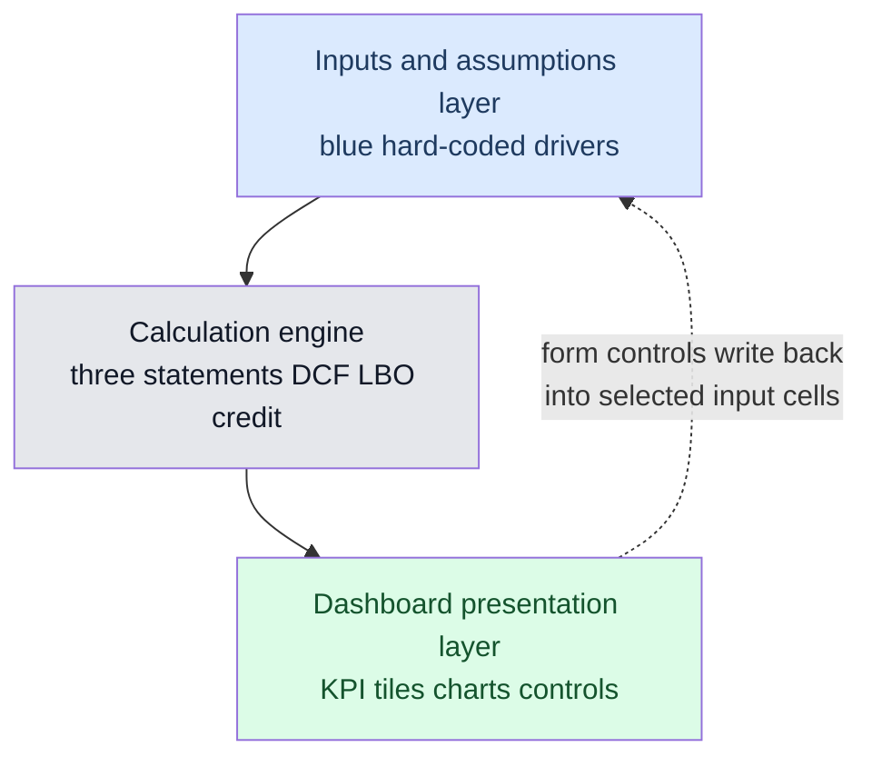
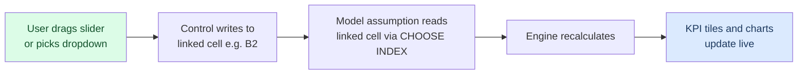
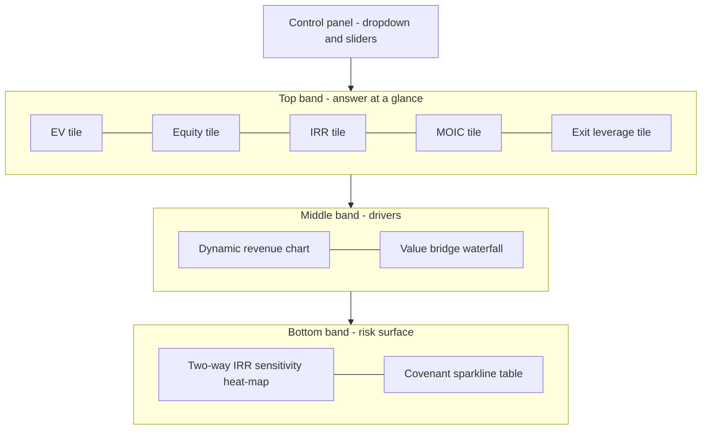

<!-- v2-deep -->

# Chapter 34 — Excel Dashboards and Data Visualisation

## 1. The Problem

You have just finished a three-statement model with a discounted cash flow, a sensitivity table, and a returns analysis. The workbook is forty tabs deep, ten thousand cells wide, and internally flawless. You send it to the managing director before the investment committee meeting.

Thirty seconds later she replies: *"Just tell me the number and the two things that move it."*

This is the gap every modeller eventually confronts. A model is a **calculation engine**; a decision-maker needs a **communication instrument**. The engine produces enterprise value of 4.2 billion, a base-case IRR of 22 percent, and net debt to EBITDA of 3.1 times at close falling to 1.4 times by exit. Those numbers exist somewhere in row 847 of the `DCF` tab and cell `Returns!H60`. But nobody who signs the cheque is going to hunt for them, cross-check them against the credit case, and hold five moving parts in their head while doing it.

The specific failures a raw model imposes on its reader are concrete:

- **No hierarchy.** Every cell looks equally important, so the reader cannot tell the headline output from an intermediate subtotal.
- **No context.** A 22 percent IRR means nothing without the hurdle rate beside it, the range around it, and the drivers behind it.
- **No single surface.** The answer is scattered across tabs. To understand the deal you must navigate, which means you must already know the model — a circular requirement.
- **No safe interactivity.** When someone asks "what if revenue growth is 4 percent not 6?", the modeller edits a hard input somewhere deep in the model, hopes they remembered to change it back, and reads a new answer off a distant cell.

A **dashboard** is the fix. It is a single, deliberately designed tab that pulls the model's genuine outputs to one surface, ranks them by importance, surrounds them with the context that makes them meaningful, and lets a non-modeller flex the key assumptions without ever touching — or breaking — the engine underneath. This chapter teaches you to build one that a real analyst would be proud to put in front of a committee.

One more framing worth internalising before the mechanics: a dashboard is not a *report* and it is not a *slide*. A report is exhaustive and read once; a slide is static and controlled by the presenter. A dashboard is **live and driven by the reader** — its whole reason to exist is that the person looking at it can ask "what if" and get an honest answer without you in the room. That is why the entire chapter obsesses over two things: the numbers must always equal the model (so the answer is trustworthy), and the reader must be able to interact without breaking anything (so the exploration is safe). Everything else is craft in service of those two guarantees.

## 2. The Core Idea

A dashboard is a **read-only presentation layer that sits on top of a live model**. It contains almost no original calculation. Its cells are overwhelmingly links back into the model (`=Returns!H60`), lightly reformatted charts of ranges that already exist, and a small number of user-facing controls that write into the model's assumption cells.

The mental model is a **three-layer stack**:



*The dashboard reads from the engine and, through controls, writes back to a small, sanctioned set of input cells — never anywhere else.*

Two disciplines make this layer trustworthy. First, **the dashboard never calculates anything the model should own.** If you find yourself computing IRR on the dashboard, stop — compute it in the model and link to it, so there is one source of truth. Second, **the dashboard is the only place a casual user is allowed to touch.** Controls change assumptions through a controlled interface (a dropdown, a slider), so the user gets interactivity without the ability to overwrite a formula by accident.

There is a useful way to test whether a candidate cell belongs on the dashboard at all. Ask: *"If I deleted the entire dashboard tab, would the model still produce this number?"* If yes, the cell is a legitimate link — the model owns it and the dashboard merely displays it. If no — if the number only exists because the dashboard computed it — you have smuggled calculation into the presentation layer and created a second source of truth. Delete it and push the logic back into the engine. This one question resolves 90 percent of "should this live on the dashboard?" arguments.

Everything else in this chapter — chart selection, form controls, sparklines, conditional formatting, KPI tiles, layout — is craft in service of those two ideas.

## 3. Why It Works

Why does a good dashboard land when a correct model does not? Because it is engineered around how humans actually process information, not around how the arithmetic flows.

**Pre-attentive processing.** The human visual system reads certain properties — position, length, colour, size — in under 200 milliseconds, before conscious attention engages. A bar longer than its neighbours, a number in red, a tile larger than the rest: these register instantly. A dashboard front-loads the most important facts into exactly these channels so the headline is absorbed before the reader "reads" anything. Text in a spreadsheet grid, by contrast, must be scanned serially, cell by cell.

There is a rough hierarchy of how *accurately* the eye decodes each visual channel, established by Cleveland and McGill's perception experiments. From most to least accurate: **position on a common scale** (dots on the same axis) → **length** (bars from a common baseline) → **angle and slope** (pie slices, line steepness) → **area** (bubble size) → **colour hue and saturation** (heat-map shading). This ranking is the reason bars beat pies, the reason a scatter beats a bubble chart when precision matters, and the reason colour is reserved for *categorical* meaning or coarse magnitude rather than precise quantities. When you choose a chart you are really choosing where on this accuracy ladder you want the reader to stand.

**Working-memory relief.** A person can hold roughly four independent chunks in working memory at once. A raw model asks the reader to hold the IRR, the leverage, the growth assumption, the exit multiple, and the downside case simultaneously while flipping between tabs — it overflows immediately. A dashboard externalises all of that onto one surface so the reader compares by looking, not by remembering.

**The single-screen constraint.** When everything the reader needs fits on one screen with no scrolling, the eye can move between related facts freely and the mind builds a coherent picture. The moment the reader must scroll or switch tabs, that picture fragments. This is why "fits on one screen at 100 percent zoom" is a genuine design constraint, not a nicety.

**Trust through provenance.** A dashboard built as a pure link layer inherits the model's credibility automatically — because every tile *is* the model, just relocated. When a reviewer asks "where does the 22 percent come from?", you click the tile, hit trace-precedents, and land in the returns calculation. A dashboard that re-derives numbers destroys this and invites the deadliest question in finance: *"why doesn't your summary match your model?"*

**The data-ink principle.** Edward Tufte's rule — maximise the share of ink that carries data, erase the rest — is why professional dashboards strip gridlines, chart borders, redundant axis labels, and background fills. Every pixel that is not a number, a bar, or a label the reader genuinely needs is *noise competing with signal*. A dashboard is not decorated; it is de-cluttered until only the meaning remains. When in doubt, remove it and see if the message survives. It almost always does.

## 4. Full Technical Content

This is the heart of the chapter — the exact mechanics of building each dashboard element in Excel.

### 4.1 The architecture: link, don't recompute

Set up the dashboard tab (`Dashboard` or `Summary`) as the leftmost tab in the workbook so it is the first thing anyone sees. Every output cell on it should be a **direct cell reference** into the model:

```
=Returns!H60          ' base-case IRR
=DCF!G88              ' enterprise value
='Credit'!F42         ' net debt / EBITDA at close
```

Rules that keep the layer clean:

- **No hard-coded numbers** on the dashboard except labels and axis constants. If you type `0.22` you have broken the live link and it will silently go stale.
- **No multi-step calculation.** `=DCF!G88 - DCF!G95` (EV minus net debt) is borderline — prefer computing equity value in the model and linking to it. One source of truth.
- **Use named ranges** for the handful of cells you reference repeatedly: name `Returns!H60` as `IRR_Base` so the dashboard reads `=IRR_Base`. Names survive row insertions in the model and make the dashboard self-documenting.

**Why named ranges, concretely.** Suppose the base-case IRR lives in `Returns!H60` and your dashboard tile reads `=Returns!H60`. A colleague inserts three rows at the top of the `Returns` tab to add a new section. Excel is smart enough to update `=Returns!H60` to `=Returns!H63` automatically *if the reference points at the cell that moved*. But the danger is subtler: if someone inserts a row *inside* the calculation such that the IRR now lives in a different cell but your reference did not track it, or if someone copies the dashboard formula as text, or rebuilds the Returns tab from scratch, the link silently points at the wrong cell — now blank or holding a label — and your tile shows `0` or `#REF!` or, worst of all, a plausible-but-wrong number. A named range `IRR_Base` is bound to the *cell's identity*, not its address, and moves with it robustly. The dashboard formula `=IRR_Base` is also self-documenting: a reviewer reading it knows immediately what it is without navigating to `H60` to find out.

**The colour convention that makes the layer auditable.** Adopt the standard model-build colours and hold them everywhere: **blue** font for hard-coded inputs (the only cells a user should ever type into), **black** for formulas that calculate within a sheet, and **green** for links that pull from another sheet. On a well-built dashboard *almost every cell is green* — that is the visual proof that it is a pure link layer. If you open a dashboard and see black formula cells, each one is a calculation the model should probably own; if you see blue cells that are not inside the sanctioned control panel, each one is a hard-code waiting to go stale. The colour convention turns "is this dashboard clean?" into a five-second visual scan.

### 4.2 Choosing the right chart

Chart choice is not decoration; the wrong chart actively misleads. Match the chart to the **question** the data answers:

| Question the reader has | Correct chart | Why |
|---|---|---|
| How does one measure change over time? | Line | Slope encodes rate of change; continuous |
| How do a few categories compare in size? | Horizontal bar | Length is the most accurate visual channel |
| How does a value compare across time in discrete periods? | Column | Vertical bars for time buckets |
| What are the parts of a whole (2-4 parts)? | Stacked bar (not pie) | Length beats angle for comparison |
| How do two variables relate? | Scatter (XY) | Position on two axes |
| How does the model bridge from A to B? | Waterfall | Shows additive build-up and bridges |
| How sensitive is the output to two drivers? | Heat-map table (conditional format) | Colour gradient reveals the gradient |
| Where does our valuation sit across methods? | Floating bar (football field) | Horizontal ranges compared on one scale |
| How is a total distributed across many items? | Sorted (Pareto) bar | Ranking plus cumulative context |

Hard rules for finance dashboards:

- **Avoid pie charts** beyond two or three slices. The eye compares angles poorly; a bar chart of the same data is always more readable.
- **Never use 3-D charts.** The perspective distorts lengths and areas — actively deceptive. This is non-negotiable in professional work.
- **Never use a secondary axis to imply a relationship** that isn't there; dual axes let you make any two series look correlated by rescaling.
- **Start bar and column axes at zero.** Truncating the axis exaggerates differences and is considered dishonest. (Line charts of a tightly ranged series — e.g. a share price between 98 and 104 — are the one defensible exception, because a line encodes *change* not *magnitude*; but label the axis honestly and never do it with bars.)
- **Sort categorical bars by value, not alphabetically,** unless there is a natural order (time, rating scale). A sorted bar chart lets the reader read rank straight off the geometry.

**A concrete "wrong chart misleads" case.** Suppose segment revenues are A = 340, B = 330, C = 320, D = 310 (£m), totalling 1,300. In a pie chart these four slices are 26.2%, 25.4%, 24.6%, 23.8% of the circle — four nearly identical wedges that the eye cannot rank at all; the reader would swear they are equal. Put the same four numbers in a horizontal bar chart with a zero baseline and A's bar is visibly, measurably longer than D's (340 vs 310, a 9.7% difference in length the eye reads instantly). Same data, opposite outcome: the pie hides the ranking the bar reveals. This is not aesthetic preference — it is the perception hierarchy from Section 3 doing exactly what it predicts.

### 4.3 Building a dynamic chart

A dynamic chart changes what it shows in response to a user control — for example, a dropdown that switches the revenue-bridge chart between the base, upside, and downside scenarios. Two robust techniques:

**Technique A — helper row driven by a control.** Build a hidden "chart feed" row that pulls the correct data based on a control's output cell, then point the chart at that fixed row. The chart geometry never changes; only the numbers behind it do. Example feed formula, where `$B$2` holds the scenario index from a dropdown (1, 2, 3):

```
=CHOOSE($B$2, Base!C10, Upside!C10, Downside!C10)
```

or, cleaner with a lookup:

```
=INDEX(Scenarios!C10:E10, , $B$2)
```

Drag across the periods, point the chart series at this feed row, and the chart redraws when the dropdown changes.

**Technique B — dynamic named range with `OFFSET` or `INDEX`.** Define a name whose reference expands or shifts with a control. To show the last *N* years where *N* comes from a slider in `$B$3`:

```
ChartData =OFFSET(Model!$C$10, 0, COUNT(Model!$C$10:$Z$10)-$B$3, 1, $B$3)
```

Prefer `INDEX`-based dynamic ranges over `OFFSET` where possible — `OFFSET` is *volatile* (it recalculates on every keystroke anywhere in the workbook), which slows large models. An `INDEX` version:

```
ChartData =Model!$C$10:INDEX(Model!$10:$10, 1, COUNT(Model!$C$10:$Z$10))
```

Then set the chart series values to `=WorkbookName.xlsx!ChartData`.

**Reading the `OFFSET` arguments, because they trip everyone up.** `OFFSET(reference, rows, cols, height, width)` returns a range that starts `rows` down and `cols` right of `reference`, and is `height` tall by `width` wide. In the last-*N*-years formula above: the anchor is the first data cell `$C$10`; we move down 0 rows; we move right by `COUNT(...) − N` columns so the window's left edge lands on the (N-from-the-end) column; the window is 1 row tall and `N` (= `$B$3`) columns wide. Worked: if there are 5 periods of data in `C10:G10` and the slider `$B$3` = 3, then `COUNT` = 5, `cols` = 5 − 3 = 2, so the window starts at `E10` (two columns right of `C10`) and is 3 wide → `E10:G10`, the last three years. Move the slider to 2 and it becomes `F10:G10`. This is exactly the kind of formula an interviewer will ask you to talk through argument by argument.

**A third technique worth knowing — dynamic series titles.** A dynamic chart looks broken if its title still says "Base case" while showing the downside. Type a formula into a spare cell, e.g. `=INDEX({"Base";"Upside";"Downside"}, $B$2)&" revenue build"`, then select the chart title, type `=` in the formula bar, and click that cell. The chart title now tracks the dropdown. The same trick links axis titles and data labels to live cells so every word on the chart stays honest when the scenario changes.

### 4.4 Form controls: giving the user safe interactivity

Form controls (Developer tab → Insert) are the sanctioned way to let a non-modeller flex assumptions. Each control writes a simple value to a **linked cell**, which your model formulas then read.



*A form control turns a mouse gesture into an integer in a cell, which the model reads as an assumption switch.*

The controls you will actually use:

- **Combo box / drop-down** — pick a scenario. Set *Input range* to the list of scenario names, *Cell link* to (say) `$B$2`. The control writes 1, 2, or 3. Feed that into `CHOOSE` or `INDEX` to select the assumption set.
- **Scroll bar / slider** — flex a continuous driver like discount rate or growth. Set *Min*, *Max*, *Increment*, and *Cell link*. The control writes an integer, so scale it: if you want WACC from 7.0% to 12.0% in 0.1% steps, set Min 70, Max 120, and let the assumption cell read `=linked_cell/1000`.
- **Option buttons (radio)** — mutually exclusive choices, e.g. exit method: multiple vs perpetuity. Group them and give the group one cell link.
- **Check box** — a boolean toggle, e.g. "include synergies". Writes TRUE/FALSE to its linked cell; the model reads `=IF(linked_cell, synergy_value, 0)`.
- **Spin button** — like a scroll bar but for small integer nudges (e.g. holding period 3–7 years); same Min/Max/linked-cell mechanics, tiny footprint.

**Scaling a slider correctly, with the arithmetic spelled out.** Form-control sliders can only write **non-negative integers**, and their Min/Max/Increment must also be integers. So to expose WACC over 7.0%–12.0% in 0.1% steps you cannot let the linked cell hold a percentage directly. Instead: set Min = 70, Max = 120, Increment = 1, Cell link = `$B$3`. The slider now writes an integer from 70 to 120. Your assumption cell reads `=$B$3/1000`, converting 70 → 0.070 and 120 → 0.120. Check the endpoints: at the far left `$B$3` = 70 → WACC 7.0%; at the far right `$B$3` = 120 → WACC 12.0%; one notch = 1/1000 = 0.1%. There are (120 − 70) = 50 notches spanning 51 distinct values. If instead you wanted 0.25% steps over the same range, you cannot — 0.25% is not reachable with integer increments of 1 unless you rescale to /10000 (Min 700, Max 1200, Increment 25, cell reads `=$B$3/10000`). Getting this scaling wrong is the number-one reason a "broken" slider jumps in the wrong units.

**Reading a check box that returns TRUE/FALSE next to numeric maths.** A check box's linked cell holds the Boolean `TRUE`/`FALSE`. Excel coerces `TRUE`→1 and `FALSE`→0 in arithmetic, so `=synergy_value * linked_cell` also works, but prefer the explicit `=IF(linked_cell, synergy_value, 0)` because it reads unambiguously and does not silently break if someone types the word "yes" into the cell.

Critical discipline: **the linked cell is the only cell the control touches.** Never point a control at a formula cell — it will overwrite the formula with a constant. Keep linked cells together in a small "control panel" area, formatted distinctly (I use a light-grey block labelled *Controls*), and route them into the model through named ranges.

**Form controls vs ActiveX — pick Form controls.** Excel offers two families in the Developer → Insert menu: **Form Controls** (top group) and **ActiveX Controls** (bottom group). They look almost identical but Form Controls are simpler, cross-platform (work on Mac and in most Excel versions), do not require macros, and write cleanly to a linked cell. ActiveX controls are backed by COM, are notorious for corrupting, resizing themselves, throwing "cannot insert object" errors, and failing to open on Mac. For dashboards, always use **Form Controls**. If you inherit a workbook whose sliders behave erratically, check whether someone used ActiveX and rebuild them as Form Controls.

### 4.5 KPI tiles

A KPI tile is a small, self-contained block that presents **one** headline metric, large, with a label and often a status colour. A row of four to six tiles across the top of the dashboard is the standard "answer at a glance" band.

Build one from merged cells:

1. Merge a 3-wide by 2-tall block of cells.
2. In the block, put a formula that links to the metric and formats it big: reference `=IRR_Base`, set font to 28–36pt, bold, number format `0.0%`.
3. Below or above it, a small label cell: "Base-case IRR", 10pt, grey.
4. Apply a subtle fill and a thin border to define the tile as an object.
5. Optionally add a **status colour** driven by conditional formatting: green fill if IRR ≥ hurdle, amber if within 2 points, red if below.

To combine the number and a label in one cell cleanly, use `TEXT` inside concatenation for any sub-caption:

```
="vs hurdle "&TEXT(IRR_Base-Hurdle,"+0.0%;-0.0%")
```

That produces "vs hurdle +4.0%" or "vs hurdle -1.5%" with an explicit sign, which reads far better than a raw decimal.

**A three-band traffic-light tile, done properly.** A single conditional-format rule gives you a two-state (good/bad) tile. For a three-band tile — green above hurdle, amber within 2 points below it, red more than 2 points below — you stack **three formula rules** on the same tile, ordered because Excel applies the first rule that fires and (if you tick *Stop If True*) stops. With hurdle in `Hurdle` and the tile value in `IRR_Base`:

```
Rule 1 (green): =IRR_Base>=Hurdle
Rule 2 (amber): =IRR_Base>=Hurdle-0.02
Rule 3 (red):   =TRUE
```

Trace it for IRR = 22%, hurdle = 20%: Rule 1 is TRUE (0.22 ≥ 0.20) → green, stop. For IRR = 19%: Rule 1 FALSE, Rule 2 TRUE (0.19 ≥ 0.18) → amber. For IRR = 14%: Rule 1 FALSE, Rule 2 FALSE (0.14 < 0.18), Rule 3 always TRUE → red. The order matters: if you put the amber rule first it would also fire for 22% (22% ≥ 18%) and you would never see green. Always order status rules **from strictest/best to loosest/worst** with a catch-all `=TRUE` last.

**The `TEXT` format-code mini-reference** you will reach for constantly on tiles:

| You want | Format code | 0.2235 renders as |
|---|---|---|
| Percent, one decimal | `0.0%` | `22.4%` |
| Signed percent | `+0.0%;-0.0%` | `+22.4%` |
| Multiple (turns) | `0.0"x"` | on 2.6 → `2.6x` |
| Millions, comma, no decimals | `#,##0` | on 4200 → `4,200` |
| Millions with unit | `#,##0" m"` | on 4200 → `4,200 m` |
| Accounting negatives in red/parens | `#,##0;[Red](#,##0)` | on −310 → `(310)` in red |
| Blank when zero | `0.0%;;""` | on 0 → *(empty)* |

The third semicolon section controls the *zero* case and the fourth (`;;;`) hides everything — handy for suppressing noisy zeros on a tile without deleting the link.

### 4.6 Sparklines

Sparklines are word-sized charts that live inside a single cell — ideal for showing the *trajectory* of a metric beside its current value in a tile or table. Insert via **Insert → Sparklines → Line / Column / Win-Loss**, select the data range and the target cell.

Use them for:

- Revenue or EBITDA trend beside its latest figure in a tile.
- Column sparklines for period-by-period cash generation.
- Win-loss sparklines for "did we beat covenant this period" (yes/no across periods).

Formatting that matters: turn on **markers for high and low points**, set a consistent axis (Sparkline → Axis → same min/max across a group) so trends are comparable, and colour the last point to draw the eye to "where we are now". Group related sparklines so they share axis settings.

**The shared-axis trap, with numbers.** Suppose Revenue runs 1,000 → 1,262 and FCF runs 40 → 210 over five years. By default Excel scales *each* sparkline to its own min/max, so both fill their cell top-to-bottom and appear to have the same dramatic slope — even though FCF grew 5.25× and revenue only 1.26×. If the reader is meant to compare their *shapes* that is fine, but if they are meant to compare *magnitudes* it is a lie by omission. When magnitude matters across a group, select all the sparklines and set **Sparkline → Axis → Vertical Axis Min/Max → Same for All Sparklines** (or fix explicit values). Now the FCF sparkline sits low and flat while revenue rises across the top, honestly encoding that revenue dwarfs FCF. Choose per-sparkline scaling only when the reader cares about *shape*, shared scaling when they care about *level*.

Also beware **hidden/blank cells**: a gap in the source (a blank period) breaks a line sparkline unless you set *Hidden and Empty Cells → Connect data points with line*; and sparklines silently ignore data in hidden columns unless you tick "Show data in hidden rows and columns".

### 4.7 Conditional formatting: heat-maps, data bars, and status flags

Conditional formatting turns numbers into pre-attentive signals without a separate chart.

- **Colour scales (heat-maps)** — the standard finish for a two-way **sensitivity table**. Select the data body of the data table, Home → Conditional Formatting → Color Scales → red-white-green (or a single-hue scale). Instantly the reader sees which corner of the grid is dangerous. Use a 2-colour scale for one-directional metrics (leverage: white → red) and 3-colour for metrics with a good middle.
- **Data bars** — in-cell horizontal bars proportional to value; good for a ranked list (e.g. contribution by segment) where you want magnitude without a chart.
- **Icon sets** — traffic lights for covenant headroom; but use sparingly, they clutter fast.
- **Formula-driven rules** — the most powerful. "Highlight the tile red when IRR below hurdle": select the tile, New Rule → Use a formula → `=IRR_Base<Hurdle` → set red fill. This is how KPI tiles get their status colour.

**Colour-scale mechanics you must control.** A 3-colour scale needs three anchor points: minimum, midpoint, maximum. By default Excel sets these to the lowest value, the 50th percentile, and the highest value *of the selected range* — which means the colouring is **relative to the data present**, and re-anchors every time the numbers change. That is usually fine for a self-contained sensitivity grid, but it has a sharp edge: if all 16 IRRs happen to be healthy (say 18%–32%), the worst one still glows red even though 18% may clear your hurdle — the scale only knows "lowest here", not "bad in absolute terms". When absolute thresholds matter, set the anchor **Type** to *Number* and pin them: e.g. min = 0.10 (red), mid = 0.20 (white, = hurdle), max = 0.30 (green). Now red always means "below 10%" and white always means "at the 20% hurdle", regardless of which cells are on screen. Fixed number anchors make colour comparable across different tables and across model versions.

**Data-bar honesty.** Data bars default to scaling the longest bar to the widest value *in the selection* and the shortest to the smallest — which, like a truncated axis, can exaggerate small differences. If four segments are 340/330/320/310, the default data bars make 310 look dramatically shorter than 340 because the bar length spans only the 310–340 range, not 0–340. Fix the bar's Minimum to *Number* = 0 so the bars are proportional to the actual values, not to their spread. This is the truncated-axis problem wearing a different hat.

Guard rail: colour must **encode meaning consistently**. Pick one convention (green = good, red = bad, or a single-hue intensity for magnitude) and hold it across the entire dashboard. Mixed conventions destroy the pre-attentive advantage you were buying. And remember roughly 8% of men have red-green colour vision deficiency: pair colour with a second cue (a sign, an arrow, position) so status never depends on hue alone, and prefer blue-orange over red-green when the audience is unknown.

### 4.8 Layout, grid, and formatting mechanics

- **Design on a grid.** Set uniform narrow column widths (say all columns width 2–3) and build tiles and charts by spanning many thin columns. This gives you pixel-level control over alignment that default fat columns never allow. This is the "graph paper" method professional dashboard builders use.
- **Remove gridlines** (View → uncheck Gridlines) and set a white or very light background — instantly looks like a designed page, not a spreadsheet.
- **Anchor charts to the grid** — hold Alt while resizing so chart edges snap to cell borders and align with tiles.
- **Freeze nothing, fit everything.** The dashboard should fit on one screen at 100% zoom. Check View → Page Layout and print-fit to one page — a dashboard that prints cleanly on one page is a dashboard that fits one screen.
- **Number formats carry meaning.** Show revenue in `#,##0` (whole thousands/millions with a units note), ratios in `0.0x`, percentages in `0.0%`, and use the units label once in a corner ("£m unless stated"). Never make the reader count zeros.
- **Colour palette discipline.** Two or three colours plus greys. One accent for the primary series, grey for context/prior, and the semantic red/amber/green reserved *only* for status. A dashboard with eight colours reads as noise.
- **Reading order follows an F- or Z-pattern.** Western eyes enter top-left and sweep right then down. Put the single most important number top-left, the KPI band across the top, supporting charts in the middle, and detail/sensitivity at the bottom. Do not bury the headline IRR in the bottom-right corner where the eye arrives last.
- **Chart junk to delete on sight:** legends when a single series is directly labelled, gridlines behind bars, axis lines that duplicate the baseline, decimal places the reader cannot act on, drop shadows, and any fill that is not carrying data. Each deletion raises the data-ink ratio.

**A layout blueprint (the columns are the thin graph-paper columns, not fat default ones):**



*Controls sit in a fixed corner; the eye then travels top band to middle to bottom, headline first, risk last.*

## 5. Worked Examples

### Example 1 — A scenario-switching KPI band

Suppose the model carries three scenarios with these pre-computed outputs (each already calculated in the engine):

| Metric | Base (1) | Upside (2) | Downside (3) |
|---|---|---|---|
| Enterprise value (£m) | 4,200 | 4,900 | 3,400 |
| IRR | 22.0% | 28.0% | 14.0% |
| MOIC | 2.6x | 3.1x | 1.9x |
| Net debt / EBITDA at close | 3.1x | 3.1x | 3.1x |
| Net debt / EBITDA at exit | 1.4x | 1.0x | 2.3x |

Put a combo box on the dashboard with input range {Base, Upside, Downside} and cell link `$B$2`. The four KPI tiles each read the selected scenario via `INDEX`:

```
EV tile:      =INDEX($C$5:$E$5, , $B$2)      ' £m
IRR tile:     =INDEX($C$6:$E$6, , $B$2)      ' 0.0%
MOIC tile:    =INDEX($C$7:$E$7, , $B$2)      ' 0.0"x"
Exit lev tile:=INDEX($C$9:$E$9, , $B$2)      ' 0.0"x"
```

**Verify.** With the dropdown on "Upside", `$B$2` = 2. `INDEX($C$6:$E$6, , 2)` returns the second value, 28.0% — correct. Switch to "Downside", `$B$2` = 3, IRR tile shows 14.0%, exit leverage shows 2.3x. Now add a status rule to the IRR tile with hurdle 20%: `=INDEX($C$6:$E$6,,$B$2)<0.20`. On Base (22%) and Upside (28%) the tile stays green; on Downside (14%) it turns red. The band now answers, in one glance and one click, "how good is each case and is any of them below hurdle?"

**Cross-check MOIC against IRR for internal sanity.** MOIC and IRR must tell a consistent story given the holding period. For a 5-year hold, the implied annual return from MOIC is `MOIC^(1/5) − 1`. Base: `2.6^(0.2) − 1` = `1.2106 − 1` = 21.1%, close to the stated 22.0% (the small gap reflects interim cash flows the IRR captures but a simple money-multiple does not). Upside: `3.1^(0.2) − 1` = 25.4% vs stated 28.0%. Downside: `1.9^(0.2) − 1` = 13.7% vs stated 14.0%. All three land within a couple of points of the stated IRR in the right order — Upside highest, Downside lowest — which is exactly the consistency check a sharp reviewer runs in their head. If a tile showed MOIC 3.1x with IRR 14%, the two would contradict each other and you would know a link was crossed.

### Example 1b — Adding a continuous slider on top of the scenario switch

Extend Example 1: the committee wants to flex the **exit multiple** continuously on top of the discrete scenario. Model IRR responds roughly linearly to exit multiple near the base point — say each +1.0x of exit multiple adds about +4 IRR points (consistent with Example 2's grid, where moving one column right adds ~4–5 points). Add a scroll bar: Min = 80, Max = 120, Increment = 5, Cell link = `$B$4`; the model's exit-multiple assumption reads `=$B$4/10` (so 80 → 8.0x, 120 → 12.0x, one notch = 0.5x). Suppose the base scenario's grid IRR at 10.0x exit is 19% (from the entry = 10.0x row of Example 2).

**Verify the interaction.** Leave the scenario on Base and drag the slider from 100 (10.0x → 19%) up to 110 (11.0x). Reading Example 2's entry = 10.0x row: 10.0x exit → 19%, 11.0x exit → 23%, so the IRR tile should move 19% → 23%, a +4-point step for +1.0x — matching the "≈4 points per turn" rule. Drag down to 90 (9.0x): the same row gives 15%, so the tile reads 15%. The scenario dropdown shifts the *whole surface* (Base vs Upside vs Downside assumption sets) while the slider walks *along the exit-multiple axis within* the selected scenario. Two controls, two orthogonal degrees of freedom, and the reader can reach any combination without opening the model.

### Example 2 — A sensitivity heat-map (two-way data table)

We stress IRR against **entry multiple** (rows) and **exit multiple** (columns). The model's IRR output lives in a cell the data table references. Excel's Data Table (Data → What-If Analysis → Data Table) produces this grid; we then colour it.

| Entry \ Exit | 8.0x | 9.0x | 10.0x | 11.0x |
|---|---|---|---|---|
| **8.0x** | 19% | 24% | 28% | 32% |
| **9.0x** | 14% | 19% | 23% | 27% |
| **10.0x** | 10% | 15% | 19% | 23% |
| **11.0x** | 6% | 11% | 15% | 19% |

**Read the reconciliation.** The diagonal where entry = exit (8/8, 9/9, 10/10, 11/11) should all return roughly the same IRR because you buy and sell at the same multiple — and indeed those cells read 19%, 19%, 19%, 19%. That internal consistency is your proof the data table is wired to the right output cell. Now apply a 3-colour scale (red-yellow-green) across the 16-cell body: the top-right corner (buy cheap at 8x, sell rich at 11x → 32%) glows green, the bottom-left (buy rich, sell cheap → 6%) glows red. A committee member sees the entire risk surface without reading a single number, then reads the numbers to confirm.

**The exact mechanics of a two-way data table**, because it is the single most error-prone thing in this chapter:

1. Somewhere in the model, IRR is computed in one cell — call it `Returns!IRR` (a named cell).
2. Build the grid on a calc tab. In the **top-left corner cell** of the grid, put `=Returns!IRR` — the data table requires the output formula to sit in that corner (you can hide it with a custom number format `;;;` so the reader never sees the raw link).
3. Put the **column input values** (exit multiples 8.0/9.0/10.0/11.0x) across the top row to the right of the corner, and the **row input values** (entry multiples) down the left column below the corner.
4. Select the whole rectangle — corner, the header row, the header column, and the empty body.
5. Data → What-If Analysis → **Data Table**. In *Row input cell* enter the model's **exit-multiple** assumption cell (because exit varies across the *columns/row header*); in *Column input cell* enter the model's **entry-multiple** assumption cell.
6. Excel fills the 16 cells by substituting each row/column pair into those two input cells and re-reading the corner formula.

The classic mistake is swapping Row and Column input cells — do that and the grid transposes: your diagonal check would still pass (it is symmetric on the diagonal) but the off-diagonal cells would be wrong. So add a **second** check that is *not* symmetric: pick entry = 8.0x, exit = 11.0x → the grid says 32% (cheap in, rich out, the best corner). If after wiring you find 32% sitting in the bottom-left (rich in, cheap out) instead of top-right, you transposed the inputs. Two asymmetric checks pin the wiring completely.

**What-if variation — flip the metric.** Re-point the corner formula from `Returns!IRR` to `Credit!ExitLeverage` and the same grid now shows net-debt/EBITDA at exit across the same entry/exit multiples, finished with a *white → red* two-colour scale (higher leverage = worse). One grid template, any output.

### Example 3 — A dynamic revenue-bridge chart

The user wants a chart that shows the revenue build for whichever scenario is selected. Build a hidden feed row that mirrors the KPI band's `$B$2`:

Periods Y1–Y5 revenue by scenario:

| | Y1 | Y2 | Y3 | Y4 | Y5 |
|---|---|---|---|---|---|
| Base | 1,000 | 1,060 | 1,124 | 1,191 | 1,262 |
| Upside | 1,000 | 1,100 | 1,210 | 1,331 | 1,464 |
| Downside | 1,000 | 1,030 | 1,061 | 1,093 | 1,126 |

Feed row (row the chart actually plots):

```
Feed Y1: =INDEX(C_col, $B$2)   … through … Feed Y5: =INDEX(G_col, $B$2)
```

**Verify.** With `$B$2` = 2 (Upside), the feed row returns 1,000 / 1,100 / 1,210 / 1,331 / 1,464 — the compounding-at-10% path — and the column chart redraws to the steeper curve. Switch to Downside (`$B$2` = 3) and the same chart flattens to the 3%-growth path ending at 1,126. One chart object, three faces, zero risk of the user editing the model — because the only thing they touched was the dropdown that sets `$B$2`.

**Reconcile the compounding.** Each row should be a clean geometric series. Base at 6%: 1,000 × 1.06 = 1,060; ×1.06 = 1,123.6 ≈ 1,124; ×1.06 = 1,191.0; ×1.06 = 1,262.5 ≈ 1,262 — ties out. Upside at 10%: 1,000 → 1,100 → 1,210 → 1,331 → 1,464.1 ≈ 1,464 — ties out. Downside at 3%: 1,000 → 1,030 → 1,060.9 ≈ 1,061 → 1,092.7 ≈ 1,093 → 1,125.5 ≈ 1,126 — ties out. Because the three series share Y1 = 1,000 and fan out only from Y2, the chart's *fan shape* is itself a visual sanity check: if any scenario's line crossed another, a growth-rate link would be wrong.

### Example 4 — A football-field valuation range (floating bar)

The committee wants to see where the DCF, comparable-companies, and precedent-transactions methods each place the enterprise value, plus the current offer. A football field is a **stacked horizontal bar** where the first (base) series is made invisible so the second series appears to "float" from low to high.

| Method | Low (£m) | High (£m) | Width = High − Low |
|---|---|---|---|
| DCF | 3,900 | 4,600 | 700 |
| Comparable companies | 3,600 | 4,300 | 700 |
| Precedent transactions | 4,100 | 5,000 | 900 |

**Build.** Make a bar chart with two stacked series: series 1 = *Low* (3,900 / 3,600 / 4,100), series 2 = *Width* (700 / 700 / 900). Format series 1 with **no fill and no border** so only the *Width* bars show, each starting at its Low. Set the axis minimum to a sensible floor (say 3,000, honestly labelled) so the ranges spread across the plot. Add a vertical line at the £4,200 offer (a scatter series or an error-bar trick) so the reader sees instantly which methods the offer sits inside.

**Verify.** The offer of 4,200 lies inside DCF (3,900–4,600 ✓), inside comps (3,600–4,300 ✓), and *below* the precedent-transactions floor of 4,100? No — 4,200 > 4,100, so it sits just inside precedents too (4,100–5,000 ✓). All three ranges contain the offer, with precedents implying the most upside (its bar extends furthest right to 5,000). The floating-bar geometry lets a reader rank the methods' generosity by *bar position* in under a second — precisely the position-on-a-common-scale channel that tops the perception hierarchy.

## 6. Connections

The dashboard is where the whole modelling course converges, so its links run everywhere:

- **Three-statement model (Ch. on integrated statements).** The dashboard's revenue, EBITDA, and cash tiles link straight into the income statement and cash flow. If those statements don't balance, the dashboard will faithfully display the error — a feature, not a bug.
- **DCF and valuation.** The enterprise-value and per-share tiles read the DCF output; the football-field valuation-range chart (a floating bar chart, built in Example 4) is a dashboard native.
- **LBO returns.** IRR and MOIC tiles link to the returns waterfall; the sensitivity heat-map stresses exactly the entry/exit/leverage levers the LBO chapter taught, and the MOIC-vs-IRR consistency check (Example 1) is the same one used to sanity-test a returns build.
- **Credit analysis.** Leverage and coverage tiles link to the credit ratios; conditional formatting flags covenant breaches — the dashboard becomes a live covenant monitor, and win-loss sparklines show breach/no-breach across periods.
- **Sensitivity and scenario analysis.** Form controls are the user-facing front end of the scenario manager; the two-way data table is the sensitivity chapter rendered visually.
- **Model design and formatting standards.** The blue-input / black-formula / green-link colour convention from the model-build chapters is what lets the dashboard's link layer stay disciplined and auditable — an almost-all-green dashboard is a well-built one.
- **Cost of capital / WACC.** A WACC slider (Section 4.4) feeds the discount rate straight into the DCF, so the dashboard becomes the live front end for the valuation's single most contested assumption.

## 7. Traps and Common Errors

1. **Recomputing on the dashboard.** The single most damaging mistake. If the dashboard calculates IRR itself, it *will* eventually disagree with the model, and your credibility dies. Link, never re-derive.
2. **Hard-coding a "temporary" number.** Someone types last quarter's EBITDA into a tile to "check something" and forgets. The tile is now a lie that looks live. Nothing on the dashboard is a constant except labels.
3. **Volatile `OFFSET`/`INDIRECT` everywhere.** These recalculate on every edit and can make a large model crawl. Prefer `INDEX`-based dynamic ranges. Reserve volatiles for where nothing else works.
4. **Pointing a form control at a formula cell.** The control overwrites the formula with a constant the first time it's used, silently breaking the model. Controls write only to dedicated linked cells.
5. **Chart chosen for looks, not for the question.** Pies for five-way splits, 3-D columns, dual axes implying false correlation — all mislead. Choose by the question (Section 4.2).
6. **Truncated axes.** Starting a bar chart at 90 instead of 0 to "show the difference" exaggerates it dishonestly. Bars start at zero. (The same trap hides in data bars and colour-scale anchors — pin them to absolute numbers, Section 4.7.)
7. **Colour without a convention.** Green meaning "good" in one tile and "highlighted" in another destroys pre-attentive reading. One colour, one meaning, everywhere. Add a non-colour cue for colour-blind readers.
8. **Doesn't fit one screen.** If the reader must scroll or switch tabs, the picture fragments and the dashboard has failed its core job. Ruthlessly cut until it fits.
9. **Stale links after model surgery.** Insert a row in the model and un-named references shift. Use named ranges for every dashboard link so structural edits don't silently corrupt the summary.
10. **Too much.** Twenty tiles and twelve charts is a wall, not a dashboard. If everything is emphasised, nothing is. Four to six KPIs, two to four charts, one sensitivity view.
11. **Swapped Row/Column input cells in a data table.** The grid transposes and the off-diagonal cells lie. Run one asymmetric check (Section, Example 2) in addition to the diagonal check.
12. **Slider scaling errors.** Forgetting that form-control sliders write integers, so the assumption cell must divide by 10/100/1000 to reach the right units. Test both endpoints after wiring (Section 4.4).
13. **Sparklines auto-scaled per cell when magnitude comparison is intended.** Two metrics of wildly different size both look to have the same slope. Set a shared vertical axis when level matters (Section 4.6).
14. **ActiveX controls instead of Form controls.** They corrupt, drift, resize, and break on Mac. Rebuild any inherited ActiveX slider as a Form control (Section 4.4).
15. **Merged cells that break references or selection.** Over-merging tiles makes `INDEX`/`OFFSET` targets ambiguous and can silently return only the top-left value of a merged block. Merge only for display, keep the *linked* value in a single unmerged cell where possible.

## 8. First-Principles Recap

Strip everything away and the dashboard rests on four irreducible truths:

- **A model calculates; a dashboard communicates.** These are different jobs needing different surfaces. Keep them physically separate — a dedicated tab that reads from the engine.
- **Humans read position, length, and colour instantly, and text serially.** So encode the headline facts in position, length, and colour, and reserve text for detail. That is the entire theory of visual design compressed to one sentence — and the perception hierarchy (position → length → angle → area → colour) tells you *which* channel to reach for.
- **One source of truth or none.** The instant a number exists in two places that can disagree, trust collapses. The dashboard is a pure link layer precisely to guarantee it can never disagree with the model. The test: "if I deleted the dashboard, would the model still produce this number?"
- **Interactivity must be safe.** Let the user explore assumptions through controls that write only to sanctioned cells, so curiosity never becomes corruption.

Every technique in this chapter — tiles, sparklines, dynamic charts, controls, conditional formatting — is one of these four principles made mechanical.

## 9. Quick-Reference

**Architecture**
- Dashboard = leftmost tab, read-only, pure links (`=Model!Cell`), named ranges for stability.
- No hard-codes, no recomputation, no multi-step calc. Almost every cell green under the colour convention.
- Sanity test: deleting the dashboard must not change any model output.

**Chart choice**
- Time series → line. Category compare → sorted horizontal bar. Parts of whole → stacked bar (not pie). Two variables → scatter. Bridge → waterfall. Two-way sensitivity → colour-scale table. Valuation ranges → floating-bar football field.
- Never: 3-D, truncated axes, pies beyond 3 slices, false dual-axis.
- Perception hierarchy: position > length > angle > area > colour.

**Dynamic charts**
- Helper feed row: `=INDEX(range, , $B$2)` or `=CHOOSE($B$2, …)`.
- Dynamic name (prefer non-volatile): `=Model!$C$10:INDEX(Model!$10:$10,1,COUNT(...))`.
- Link the chart title to a formula cell so it tracks the scenario.

**Form controls (Developer → Insert, use Form not ActiveX)**
- Combo box → scenario switch, writes index to linked cell.
- Scroll bar → continuous driver; writes integer, scale linked cell (`=cell/1000`); test both endpoints.
- Option buttons → exclusive choice. Check box → boolean toggle. Spin button → small integer nudge.
- Controls write ONLY to dedicated linked cells, never formulas.

**KPI tiles** — merged block, 28–36pt metric, small grey label, status colour via formula rule (`=IRR_Base<Hurdle` → red). Three-band traffic light = three rules ordered best→worst with `=TRUE` catch-all last.

**Sparklines** — Insert → Sparklines; markers on high/low/last; shared vertical axis across a group when magnitude matters.

**Conditional formatting** — colour scales for heat-maps (pin anchors to absolute numbers), data bars (min = 0) for ranked lists, formula rules for status flags. One colour convention throughout; add a non-colour cue.

**Two-way data table** — corner = `=output`; column inputs across top, row inputs down side; Row input cell = the assumption that varies across columns; check diagonal AND one asymmetric corner.

**Layout** — thin uniform columns (graph-paper grid), gridlines off, Alt-snap charts, fits one screen at 100%, units labelled once, 2–3 colours plus greys, headline top-left following the F/Z reading path.

## 10. Interview Angles

Dashboards and data-viz show up in modelling-test debriefs and technical rounds. Common questions and crisp answers:

- **"Why link instead of typing the number in?"** One source of truth; the tile can never silently disagree with the model, and provenance is one trace-precedents click away. Typing a value creates a second truth that will eventually diverge.
- **"Walk me through this `OFFSET` formula."** Name the five arguments (reference, rows, cols, height, width), then plug in the numbers as in Section 4.3. Flag that `OFFSET` is volatile and you'd prefer an `INDEX` version in a large model.
- **"How do you let a user change WACC without breaking the model?"** A Form-control scroll bar writing an integer to a dedicated linked cell in a control panel; the WACC assumption reads `=cell/1000`; the model recalculates; nothing else is touchable. Test both endpoints for correct units.
- **"When is a pie chart acceptable?"** Two, maybe three slices where you only need "roughly half vs the rest". Beyond that, a sorted bar is strictly more readable — angles are near the bottom of the perception hierarchy.
- **"How would you show valuation across methods?"** A football-field floating-bar chart (Example 4): invisible base series + visible width series, offer line overlaid, ranked by position on one common scale.
- **"Your summary IRR is 22% but the returns tab says 21%. What happened?"** Almost certainly the dashboard re-derived it instead of linking, or a stale un-named reference shifted after model surgery. Re-point to the model cell via a named range; never re-compute on the dashboard.
- **"How do you verify a two-way sensitivity table is wired correctly?"** The equal-entry-equal-exit diagonal should be constant, and one asymmetric corner (cheap-in/rich-out = best) should sit top-right; if it sits bottom-left you swapped the row/column input cells.
- **"What makes a dashboard trustworthy to a committee?"** Provenance (pure links), consistency (colour and units conventions held throughout), and restraint (few tiles, honest axes) — so the reader spends attention on the decision, not on decoding the page.

## 11. Build-It-Yourself Exercise

Take any completed three-statement + valuation model you have (or the LBO from the returns chapter) and build a one-screen `Dashboard` tab. Requirements:

1. **Setup.** Insert a `Dashboard` tab as the leftmost sheet. Turn off gridlines, set all columns to width 2, white background.
2. **Control panel.** In a labelled grey block, add a combo box for scenario (Base / Upside / Downside) linked to a cell, and one scroll bar for a continuous driver (e.g. exit multiple 8.0x–12.0x in 0.5x steps — Min 80, Max 120, Increment 5, cell reads `=link/10`). Route both into your model's assumption cells via named ranges — verify the model recalculates when you move them, and test both slider endpoints for correct units.
3. **KPI band.** Build five tiles across the top: EV, Equity value, IRR, MOIC, Exit leverage. Each links to the scenario-selected model output via `INDEX(...,$B$2)`. Add a formula-driven conditional format so the IRR tile turns red below a 20% hurdle and the leverage tile turns red above 4.0x; make at least one tile a three-band traffic light (green/amber/red) using three ordered rules.
4. **Two charts.** (a) A dynamic column chart of revenue Y1–Y5 driven by a hidden feed row that follows the scenario dropdown, with a chart title linked to a formula cell so it names the live scenario. (b) A football-field or waterfall of the value bridge.
5. **Sensitivity heat-map.** A two-way data table of IRR vs entry and exit multiple, finished with a 3-colour scale using pinned number anchors. Confirm the equal-entry-equal-exit diagonal returns a consistent IRR AND that the cheap-in/rich-out corner sits top-right, as your wiring checks.
6. **Sparklines.** Add a small table of Revenue / EBITDA / FCF with a line sparkline beside each showing its five-year trajectory, high and low markers on; set a shared vertical axis so the magnitude comparison is honest.
7. **Self-verify.** Switch the dropdown through all three scenarios and confirm every tile, chart, sparkline, and status colour updates coherently and that no number on the dashboard disagrees with the model it links to. Cross-check MOIC against IRR (`MOIC^(1/years) − 1`) for internal consistency. Print-fit to one page.

When you are done, hand it to someone who has never seen your model and ask them to tell you the headline IRR, the biggest risk, and the two drivers that move the deal — in thirty seconds, without touching a formula. If they can, your dashboard works. If they can't, cut and re-rank until they can. **Build this in Excel now — the reasoning only sticks once the cells are live under your own hands.**
