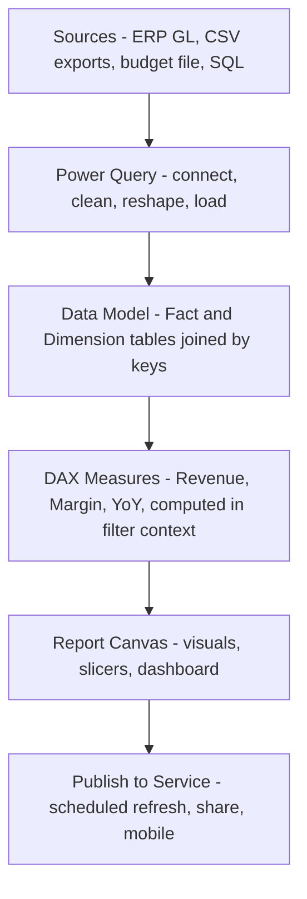
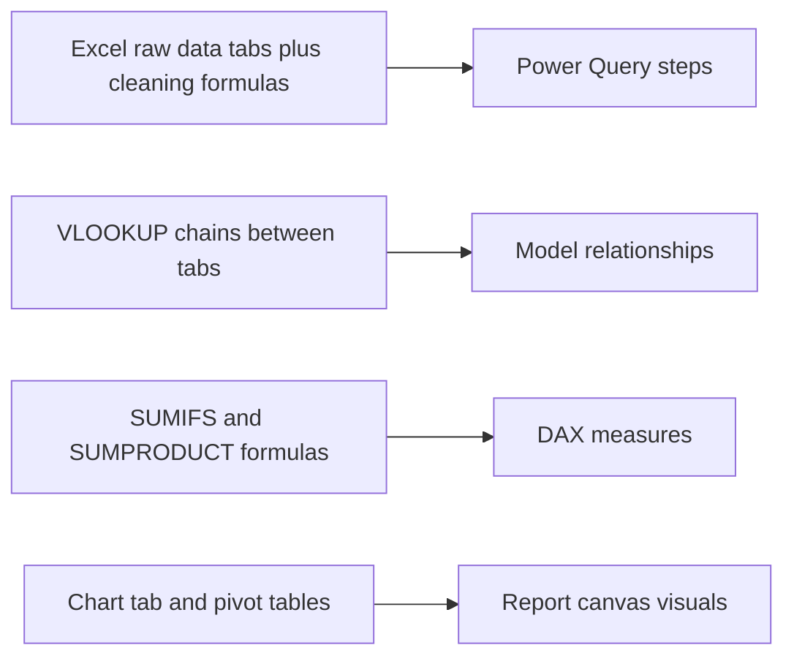
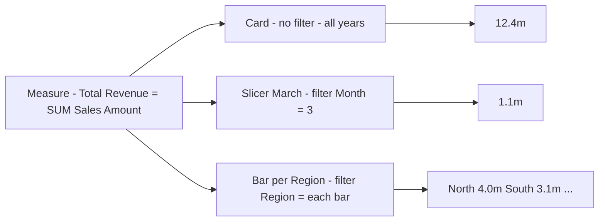
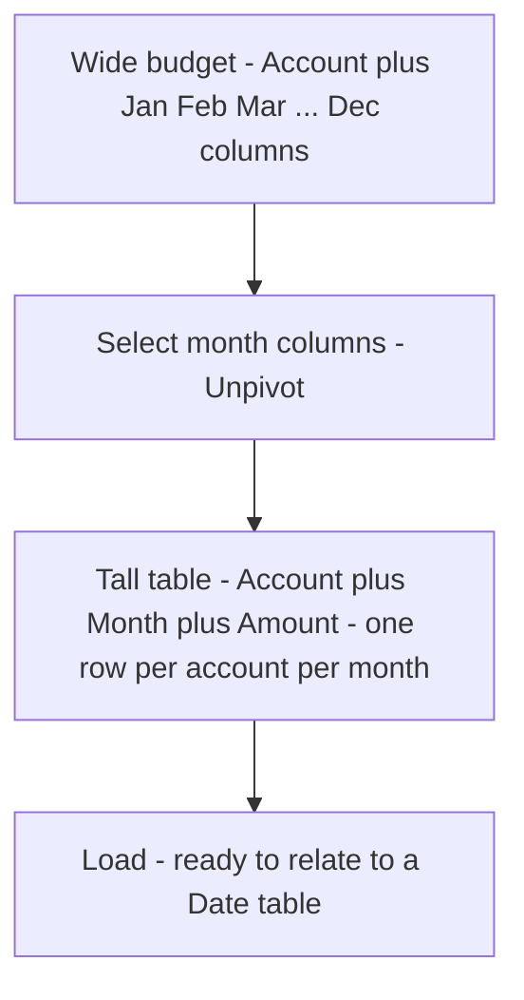
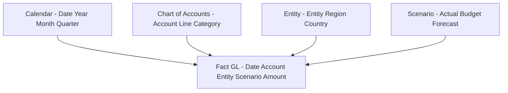

<!-- v2-deep -->

# Chapter 35 — Power BI for Finance

## 1. The Problem

You have built a beautiful financial model in Excel. Every month, the process repeats: someone exports the trial balance from the ERP, you paste it into a "raw data" tab, you re-map the account codes to your reporting hierarchy with a nest of `VLOOKUP`s, you refresh the pivot tables, you copy the charts into a management deck, and you email a PDF. Next month, the export has an extra column, a `SUMIF` silently breaks, and the actuals-versus-budget bridge no longer ties. You spend three days rebuilding plumbing you built last month.

This is the recurring, structural pain of finance reporting in Excel:

- **The data is bigger than a grid.** Three years of daily transactions across ten cost centres is easily two million rows. Excel's worksheet caps at 1,048,576 rows, and long before you hit that cap the file is a 200 MB brick that takes ninety seconds to open.
- **The logic and the data are tangled together.** In Excel a formula lives *inside a cell*, so the calculation and the number occupy the same space. When the shape of the data changes, every formula that pointed at a fixed range is at risk.
- **Refresh is manual and fragile.** A model that "works" only when the analyst who built it babysits the paste-and-refresh ritual is not a reporting system; it is a liability with a bus factor of one.
- **You cannot answer follow-up questions live.** In a board meeting someone asks "what does that gross-margin drop look like if we exclude the Brazil entity?" In Excel you go build another pivot. The moment is gone.

Put a number on the pain. Suppose the monthly pack is 14 tabs, each pulling from a 90-column raw export, wired together by roughly 400 `VLOOKUP` / `SUMIFS` formulas. Every one of those formulas hard-codes a column position or a range boundary. If the ERP export adds a single column at position 12, every reference to columns 12 and beyond shifts, and Excel does *not* warn you — it happily returns a wrong-but-plausible number. The probability that at least one of 400 fragile references breaks on any given month, even at a low 0.5% per-formula failure rate, is `1 − 0.995^400 ≈ 1 − 0.135 = 86.5%`. In other words, a "stable" Excel pack of this size will silently misreport roughly six months out of seven. That arithmetic — not a preference for shiny tools — is why finance teams move recurring reporting off the grid.

Excel is a magnificent *modelling* tool — a scratchpad where you invent a calculation. It is a poor *reporting* tool for recurring, high-volume, multi-source data. Power BI was built for exactly the gap Excel leaves: take messy source data, shape it once, model it into related tables, define the metrics once, and publish an interactive dashboard that refreshes on a schedule. This chapter teaches you to think in the Power BI way — which is genuinely different from thinking in cells — and to build a finance dashboard end to end.

## 2. The Core Idea

Power BI splits a job that Excel crams into one grid into **three separate layers**, each with its own tool and its own discipline:

1. **Power Query (the "get and transform" layer)** — a repeatable recipe that connects to a source, cleans and reshapes the data, and loads tidy tables. You define the *steps* once; they replay on every refresh.
2. **The Data Model (the "relationships" layer)** — several tables linked by keys, so you never again copy a value from one table into another. Instead of `VLOOKUP`-ing the region onto every transaction, you *relate* the transactions table to a region table and let the engine do the join at query time.
3. **DAX (the "measures" layer)** — a formula language that computes metrics *on the fly, in the context of whatever the user has clicked*. A single `Total Revenue` measure returns the right number whether the user is looking at all of 2025, one month, one region, or one product — because DAX evaluates in the *filter context* the visual gives it.

On top of those three layers sits the **report canvas**, where you drag fields onto visuals. The revolution is this: **you define each metric once, and it stays correct under every slice.** That is the opposite of Excel, where the same "revenue" number is re-typed into forty formulas across twelve tabs, each an opportunity to diverge.

A useful mental mapping for someone coming from Excel: Power Query is your "raw data" tabs plus every cleaning formula, but recorded as reusable *steps* instead of frozen cells. The Data Model is the set of `VLOOKUP` relationships you *wish* you had drawn as arrows instead of retyping into each row. DAX measures are your `SUMIFS` and `SUMPRODUCT` formulas, except written once and evaluated against whatever the reader has clicked. The report canvas is your chart tab and your pivot tables. Nothing here is conceptually alien — it is the same four jobs Excel does, pulled apart so each can be done once and done well.

*Figure 35.1 — The four layers of a Power BI solution and how data flows through them.*



*Figure 35.2 — The same four jobs, mapped from Excel habits to Power BI layers.*



## 3. Why It Works

Three engineering ideas make Power BI beat Excel for reporting, and understanding them makes every design choice obvious.

**The columnar in-memory engine (VertiPaq).** Excel stores data row by row in a grid. Power BI's engine stores each *column* separately and compresses it hard — a "Region" column with six distinct values in two million rows compresses to almost nothing because the engine stores each distinct value once and points to it. This is why Power BI swallows tens of millions of rows that would crush a worksheet, and why aggregations like `SUM` over a whole column are near-instant.

Make the compression concrete. Take a 2,000,000-row fact table with a "Region" column holding six distinct text values. Stored naively as text, at roughly 10 bytes per value that column is `2,000,000 × 10 = 20,000,000 bytes ≈ 19 MB`. VertiPaq instead builds a *dictionary* of the six distinct values and stores, per row, only a pointer index. Six values need `ceil(log2(6)) = 3` bits per row, so the column body is `2,000,000 × 3 bits = 6,000,000 bits = 750,000 bytes ≈ 0.72 MB`, plus a trivially small dictionary. That is a **~26×** shrink on that one column, and run-length encoding on a sorted low-cardinality column often does far better. The lesson for the modeller: **cardinality, not row count, drives model size.** A narrow high-cardinality column (a unique transaction ID, a full timestamp to the second) can cost more than a hundred low-cardinality columns. Split timestamps into a Date key plus a Time key; drop surrogate columns you never slice by.

**Separation of transform-time and query-time.** Power Query runs *once per refresh* and does the heavy lifting of cleaning. DAX runs *on every click* and does only the aggregation. Because cleaning is not repeated on every interaction, the report stays fast. In Excel, by contrast, every recalculation re-runs every formula, so a heavy workbook lags on every keystroke.

**Filter context — the idea that makes one formula serve every view.** A DAX measure does not know in advance which rows it will sum. When you place `Total Revenue` in a card and the user clicks "March" on a slicer, the engine *first* filters the data to March, *then* evaluates the sum. The same measure inside a bar chart split by region evaluates once per bar, each time with that region's filter applied. This is why you write the metric once and it is correct everywhere — the visual supplies the context, the measure supplies the arithmetic. Grasp this and you have grasped 80% of DAX.

The precise sequence matters, because it explains almost every "why is my number wrong?" question. For each cell of a visual the engine: (1) collects the filters that cell implies — the row's Region, the column's Month, the slicer's Year; (2) applies them to the data model, and lets those filters *propagate across relationships* from dimensions down to the fact table; (3) any `CALCULATE` in the measure now *modifies* that filter set — adding, removing, or overriding filters; (4) only then is the aggregation (`SUM`, `COUNTROWS`) evaluated over the surviving rows. Steps 1–2 are "initial filter context from the visual," step 3 is "filter context manipulation by your DAX," step 4 is "row context collapses to a scalar." Keep those four beats in your head and you can predict any measure's output before you type it.

*Figure 35.3 — Filter context: the same measure, evaluated under different filters supplied by the visual.*



## 4. Full Technical Content

### 4.1 The four building blocks and where each lives

| Layer | Tool inside Power BI Desktop | What you do there | Runs when |
|---|---|---|---|
| Extract & Transform | Power Query Editor (M language) | Connect, clean, reshape, merge | On each refresh |
| Model | Model view (diagram) | Create tables, relationships, hierarchies | Design time |
| Calculate | DAX (in the data view / formula bar) | Write measures and calculated columns | On each interaction |
| Present | Report view (canvas) | Build visuals, slicers, dashboard | On each interaction |

Install **Power BI Desktop** (free, Windows). The paid **Power BI Service** (Pro licence) is the cloud where you publish, schedule refresh, and share. You build in Desktop, you distribute via the Service.

A note on the two formula languages, because beginners conflate them. **M** (Power Query) is a *case-sensitive, functional* language for transforming tables step by step — think "recipe of table-to-table operations." **DAX** is a *case-insensitive, expression* language for aggregating a finished model in context — think "spreadsheet formula that respects filters." They never mix: you clean in M, you calculate in DAX. If you find yourself trying to do a running total in M or trying to trim whitespace in DAX, you are in the wrong layer.

### 4.2 Power Query — the ETL layer

Power Query is a **recipe recorder**. Every click you make (remove a column, change a type, filter rows) is appended to a list of steps written in the **M language**. On refresh, the steps replay top to bottom against fresh source data. You almost never write M by hand; you click, and read the generated steps in the "Applied Steps" pane on the right.

The essential transformations for finance data:

- **Connect:** *Home > Get Data* → Excel, CSV/Text, Folder (combine many monthly files at once), SQL Server, SharePoint, Web. The **Folder** connector is gold for finance: drop each month's export into a folder and Power BI appends them automatically.
- **Promote headers:** *Transform > Use First Row as Headers* when the export's real column names sit in row 1.
- **Set data types:** click each column's type icon and set Date, Decimal Number, Whole Number, or Text. **Do this deliberately** — wrong types are the number-one cause of broken measures and mis-sorted dates.
- **Remove / filter:** remove junk columns, filter out subtotal rows the ERP injects (filter the Account column to exclude blanks or "Total" text).
- **Unpivot** — the single most valuable finance move. Budget files arrive *wide*: one row per account, twelve month columns Jan…Dec. DAX wants data *tall*: one row per account-per-month. Select the month columns → *Transform > Unpivot Columns* → you get an "Attribute" column (the month) and a "Value" column (the number). This turns a spreadsheet into a database.
- **Merge (join):** *Home > Merge Queries* to look up values from another table at load time (like a `VLOOKUP` done once, permanently, in the recipe).
- **Append (stack):** *Home > Append Queries* to stack tables with the same columns (e.g., 2023 + 2024 + 2025 exports).

Two loading choices in *Close & Apply*: **Import** (data copied into the VertiPaq engine — fast, the default) versus **DirectQuery** (queries hit the source live — for data too big or too fresh to copy). Finance dashboards almost always use Import.

**Read the generated M, at least once.** When you unpivot, Power Query writes a step like this into the Advanced Editor:

```
let
    Source = Excel.Workbook(File.Contents("C:\Data\Budget_2025.xlsx"), null, true),
    Sheet = Source{[Item="Budget",Kind="Sheet"]}[Data],
    Headers = Table.PromoteHeaders(Sheet, [PromoteAllScalars=true]),
    Typed = Table.TransformColumnTypes(Headers, {{"Account", type text}}),
    Unpiv = Table.UnpivotOtherColumns(Typed, {"Account"}, "Month", "Amount"),
    AddScen = Table.AddColumn(Unpiv, "Scenario", each "Budget", type text)
in
    AddScen
```

You do not write this — you click *Use First Row as Headers*, select the Account column, right-click *Unpivot Other Columns*, then *Add Column > Custom*. But reading it teaches you the crucial property: **`Table.UnpivotOtherColumns` names the columns to KEEP, not the columns to unpivot.** That is the robust choice — if next year's budget adds a "Q1 total" column, `Unpivot Columns` (which lists the twelve months explicitly) would treat the new column as data, whereas *Unpivot Other Columns* (which keeps only "Account") absorbs it automatically or requires you to keep it explicitly. Prefer *Unpivot Other Columns* for anything where the source might grow columns.

**A worked reconciliation of the unpivot.** Suppose the wide budget has 3 accounts × 12 months. Wide, it is a `3 × 13` block (Account + 12 months) = 3 data rows. After unpivot it must be `3 × 12 = 36` rows, each with Account, Month, Amount. If your row count after unpivot is not exactly `accounts × months`, a step is wrong — usually a stray total column got unpivoted (giving 39 rows) or a blank account row survived. Always sanity-check `rows_after = accounts × periods`.

*Figure 35.4 — Power Query unpivot turns a wide budget file into a tall, model-ready table.*



### 4.3 The data model and relationships — the star schema

The professional pattern is the **star schema**: one (or a few) large **fact tables** in the centre, surrounded by small **dimension tables**.

- A **fact table** holds the *measurable events* — one row per transaction or per GL posting. Columns: keys (DateKey, AccountKey, EntityKey) plus numeric amounts. This table is long and thin.
- A **dimension table** holds the *descriptive attributes* you slice by — a Calendar table, a Chart-of-Accounts table, an Entity/Region table, a Scenario table (Actual / Budget / Forecast). These are short and wide.

You build relationships in **Model view** by dragging the key field from one table onto the matching key in another. Each relationship has:

- **Cardinality** — almost always **one-to-many** (one Calendar date → many transactions). The "one" side is the dimension; the "many" side is the fact.
- **Direction** — filters flow *from the one side to the many side* by default. Click a region in the dimension, and every related fact row is filtered. Keep it single-direction unless you have a specific reason; bidirectional filtering causes ambiguity.

**Why a star and not one flat table?** You *can* load one giant denormalised table with Region, Country, Account-Category and every attribute repeated on every row. It works for a while, then hurts three ways: (1) memory — you repeat "North America" text on two million rows instead of once in a six-row dimension; (2) maintenance — renaming a region means re-cleaning millions of rows instead of one; (3) analytics — a flat table has no clean list of "all regions," so a "% of all regions" measure or a region slicer that shows regions with zero sales becomes awkward. The star schema is normal-form discipline applied to analytics: descriptive text lives once in a dimension, the fact holds only keys and numbers.

**Always build a dedicated Date (Calendar) table** and mark it as the date table (*Table tools > Mark as date table*). Do not rely on the dates buried in your fact table. Time intelligence in DAX *requires* a continuous, gap-free date dimension. Create one with a DAX calculated table:

```
Calendar =
ADDCOLUMNS (
    CALENDAR ( DATE ( 2023, 1, 1 ), DATE ( 2025, 12, 31 ) ),
    "Year", YEAR ( [Date] ),
    "MonthNo", MONTH ( [Date] ),
    "Month", FORMAT ( [Date], "MMM" ),
    "Quarter", "Q" & FORMAT ( [Date], "Q" ),
    "YearMonth", FORMAT ( [Date], "YYYY-MM" )
)
```

Then relate `Calendar[Date]` (one side) to `Fact[Date]` (many side). Sort the "Month" text column by "MonthNo" (*Column tools > Sort by column*) so Jan…Dec order correctly instead of alphabetically.

**Why "gap-free" is not optional.** Time-intelligence functions like `DATEADD` and `SAMEPERIODLASTYEAR` work by *shifting* the set of dates currently in context. If your calendar skips a date — say it only contains dates where a transaction happened — then shifting "March 2025" back one year may land on dates that do not exist in the table, and the function silently returns blank for those. A fiscal calendar that runs, say, April to March needs the same treatment: build the full daily spine, then add a `FiscalYear` and `FiscalMonthNo` column so April sorts as fiscal month 1. To make an April-start fiscal year, add columns like:

```
"FiscalYear", YEAR ( [Date] ) + IF ( MONTH ( [Date] ) >= 4, 1, 0 ),
"FiscalMonthNo", MOD ( MONTH ( [Date] ) - 4, 12 ) + 1
```

Then time-intelligence over the fiscal year uses the *variant* functions that take a year-end, e.g. `TOTALYTD ( [Total Revenue], Calendar[Date], "3/31" )` closes the YTD at 31 March.

*Figure 35.5 — A finance star schema: one fact table, several dimensions, all filtering inward.*



### 4.4 DAX — measures versus calculated columns

DAX has two output shapes, and confusing them is the classic beginner error:

- A **calculated column** computes a value *for every row, at refresh time*, and stores it. Use it for row-level attributes you will slice by (e.g., a Region grouping, a gross/net flag). It costs memory.
- A **measure** computes a value *on demand, in the current filter context*. Use it for anything you aggregate — every number that changes as the user slices. Measures cost no storage; they are pure formulas. **Default to measures.** Only make a calculated column when you need to *filter or group by* the result.

The deep reason they differ: a calculated column is evaluated in **row context** (it sees one row at a time and can reference other columns of that row), while a measure is evaluated in **filter context** (it sees a *set* of rows defined by the visual and must aggregate them). This is why `[Amount] * [Rate]` is natural in a calculated column (both are on the same row) but nonsensical as a bare measure — a measure has no "current row," so DAX would demand you wrap it in an aggregator like `SUMX ( Fact, Fact[Amount] * Fact[Rate] )`, which walks the row context row-by-row and then sums.

Write measures explicitly and give them clean names. Never drag a raw numeric column into a visual and let Power BI auto-sum it — you lose control and reusability.

**The foundational aggregators:**

```
Total Revenue = SUM ( FactGL[Amount] )
Total COGS    = SUM ( FactGL[COGS] )
Txn Count     = COUNTROWS ( FactGL )
Avg Ticket    = DIVIDE ( [Total Revenue], [Txn Count] )
```

Note `DIVIDE` instead of `/` — it returns blank (or a chosen alternate) on divide-by-zero instead of an error. Use it for every ratio.

**Iterators (the X functions).** When the calculation must happen *row by row before aggregating*, use `SUMX`, `AVERAGEX`, `MAXX`. Classic finance case: revenue in local currency times an FX rate that varies by row.

```
Revenue in USD = SUMX ( FactGL, FactGL[Amount] * RELATED ( FX[RateToUSD] ) )
```

`SUMX` walks each fact row, multiplies amount by the related rate, and only then sums. Writing `SUM(FactGL[Amount]) * AVERAGE(FX[RateToUSD])` would be wrong — it multiplies a total by an average rate, blending currencies incorrectly.

**CALCULATE — the most important function in DAX.** `CALCULATE` *modifies the filter context* before evaluating an expression. Its signature is `CALCULATE ( <expression>, <filter1>, <filter2>, … )`. Each filter argument adds to or overrides the incoming context.

```
Revenue Actual =
CALCULATE ( [Total Revenue], Scenario[Scenario] = "Actual" )

Revenue Budget =
CALCULATE ( [Total Revenue], Scenario[Scenario] = "Budget" )

Budget Variance = [Revenue Actual] - [Revenue Budget]

Budget Variance Pct =
DIVIDE ( [Budget Variance], [Revenue Budget] )
```

A subtlety worth internalising: the simple filter `Scenario[Scenario] = "Actual"` is shorthand that `CALCULATE` expands into `FILTER ( ALL ( Scenario[Scenario] ), Scenario[Scenario] = "Actual" )`. It **overrides** any existing filter on that column — so even if the user's slicer is set to "Budget," `Revenue Actual` still returns the Actual number. That override behaviour is exactly what you want for a fixed comparison measure, and exactly what surprises people who expected the slicer to win.

To *ignore* an incoming filter, wrap a filter in `ALL` (remove all filters) or `REMOVEFILTERS`. This is how you compute a "% of total" that stays fixed while the visual splits by category:

```
Pct of Total Revenue =
DIVIDE ( [Total Revenue], CALCULATE ( [Total Revenue], ALL ( ChartOfAccounts ) ) )
```

**Time intelligence** — these functions *shift or expand* the date filter, and they only work with a proper marked Calendar table:

```
Revenue YTD =
TOTALYTD ( [Total Revenue], Calendar[Date] )

Revenue PY =
CALCULATE ( [Total Revenue], SAMEPERIODLASTYEAR ( Calendar[Date] ) )

Revenue YoY =
[Total Revenue] - [Revenue PY]

Revenue YoY Pct =
DIVIDE ( [Revenue YoY], [Revenue PY] )

Revenue MTD =
TOTALMTD ( [Total Revenue], Calendar[Date] )

Revenue Prior Month =
CALCULATE ( [Total Revenue], DATEADD ( Calendar[Date], -1, MONTH ) )
```

Financial statements need running and rolling views:

```
Rolling 12M Revenue =
CALCULATE (
    [Total Revenue],
    DATESINPERIOD ( Calendar[Date], MAX ( Calendar[Date] ), -12, MONTH )
)
```

**Margin measures** built by composition:

```
Gross Profit = [Total Revenue] - [Total COGS]
Gross Margin Pct = DIVIDE ( [Gross Profit], [Total Revenue] )
```

Notice measures reference other measures. Build a small foundation (`Total Revenue`, `Total COGS`) and layer everything on top. Change the base once and the whole model updates.

**Handling the totals row of a P&L that mixes signs.** GL amounts are often stored signed (revenue positive, expenses negative) so that a plain `SUM` of the whole fact gives net income. But a *margin %* measure must divide by revenue only, not by the net. This is why you keep account-type as a dimension attribute and filter inside the measure:

```
Total Revenue = CALCULATE ( SUM ( FactGL[Amount] ), ChartOfAccounts[Line] = "Revenue" )
Total COGS    = CALCULATE ( -SUM ( FactGL[Amount] ), ChartOfAccounts[Line] = "COGS" )
```

The unary minus on COGS flips the stored-negative expense back to a positive cost so `Gross Profit = Revenue − COGS` reads naturally. Decide your sign convention once, at the measure layer, and document it — sign confusion is a top cause of bridges that do not tie.

### 4.5 Building visuals and the dashboard

On the report canvas, drag a field or drop a visual, then drag fields into its wells (Axis, Legend, Values, Tooltips). The finance-relevant visuals:

- **Card / Multi-row card / KPI** — single hero numbers: Revenue, EBITDA, Gross Margin %, Budget Variance. The KPI visual shows value versus a target with a trend.
- **Line chart** — trends over the Calendar (revenue by month, rolling 12M).
- **Clustered / stacked column** — Actual vs Budget per month; revenue by region.
- **Matrix** — the workhorse for finance: a pivot-table-style grid with the P&L line items down the rows, months across the columns, measures in the values. Enable subtotals and drill-down.
- **Waterfall** — bridge visual: opening → drivers → closing (budget-to-actual bridge, EBITDA bridge). Set the "breakdown" to the driver dimension.
- **Slicers** — the interactive filters (Year, Region, Scenario) users click. Add a **Date slicer** in "between" mode for range selection.

Formatting discipline for finance: set each measure's format (*Measure tools > Format*) to currency or percentage with the right decimals — do it on the measure, not the visual, so it is consistent everywhere. Use a thousands/millions display unit on axes. Give visuals titles that state the metric and unit. Apply a consistent theme (*View > Themes*) so actuals, budget, and variance always use the same colours. Add conditional formatting to the matrix (red for negative variance). Enable **drill-through** pages so a user can right-click a region and jump to a detail page filtered to it.

**A cell-by-cell matrix build** — this is the single most-used finance visual, so build it deliberately:

1. Insert a **Matrix** visual.
2. Drag `ChartOfAccounts[Line]` into **Rows** (Revenue, COGS, Gross Profit rows appear).
3. Drag `Calendar[Month]` into **Columns** (Jan…Dec across the top — verify they sort by MonthNo, not alphabetically).
4. Drag the measures `[Total Revenue]`, `[Gross Margin Pct]`, `[Budget Variance]` into **Values**.
5. Turn on **Column subtotals** for a full-year total column; turn on **Row subtotals** for a P&L total.
6. Add **conditional formatting** on `[Budget Variance]`: *Format > Cell elements > Background color > rules* → if value `< 0` red, `>= 0` green.
7. Set the **display unit** to Millions and 1 decimal so `1,180,000` reads as `1.2`.

**Interactivity is free and automatic:** click any bar and every other visual on the page cross-filters to it. This is the board-meeting superpower Excel lacks — the "what about excluding Brazil?" question is answered by one click on a slicer.

### 4.6 Publishing and refresh

*Home > Publish* pushes the `.pbix` file to the Power BI Service (a workspace). There you: schedule refresh (up to 8×/day on Pro, requires a gateway for on-prem sources), build an **app** to distribute to viewers, pin visuals to a **dashboard**, and view on mobile. The model refreshes on schedule — no analyst babysitting the paste ritual. That is the whole point.

A few operational realities worth knowing before an interview or a first deployment: on-premises or local-file sources need an installed **data gateway** for scheduled refresh to reach them; a pure cloud source (SharePoint, a cloud SQL) may not. **Pro** allows 8 scheduled refreshes/day; **Premium/Fabric capacity** allows 48 and larger models. **Row-level security (RLS)** lets you define DAX filter rules (e.g., `Entity[Region] = USERPRINCIPALNAME()` mapped through a security table) so the Brazil controller sees only Brazil while everyone shares one dataset — a governance feature Excel cannot match. And "**dashboard**" vs "**report**" is a real distinction in the Service: a report is the multi-page interactive `.pbix`; a dashboard is a single-canvas pinboard of tiles pulled from one or more reports.

## 5. Worked Examples

Assume a fact table `FactGL` with monthly Actual and Budget rows for 2024–2025, related to a marked `Calendar` and a `Scenario` dimension.

### Example 1 — Budget variance for a single month

Data for March 2025:

| Scenario | Amount |
|---|---|
| Actual revenue | 1,180,000 |
| Budget revenue | 1,100,000 |

Measures:

```
Revenue Actual = CALCULATE ( [Total Revenue], Scenario[Scenario] = "Actual" )
Revenue Budget = CALCULATE ( [Total Revenue], Scenario[Scenario] = "Budget" )
Budget Variance = [Revenue Actual] - [Revenue Budget]
Budget Variance Pct = DIVIDE ( [Budget Variance], [Revenue Budget] )
```

With the Date slicer set to March 2025, the filter context is `Month = 3, Year = 2025`. Each measure evaluates inside it:

- Revenue Actual = 1,180,000
- Revenue Budget = 1,100,000
- Budget Variance = 1,180,000 − 1,100,000 = **+80,000**
- Budget Variance Pct = 80,000 / 1,100,000 = **+7.27%**

**Reconcile:** 1,100,000 × 1.0727 = 1,179,970 ≈ 1,180,000 ✓. Favourable variance of 7.3%. Now drag the same three measures into a matrix with Month on rows — *the identical formulas* produce the variance for all twelve months, no re-typing. That is the payoff of measures-in-filter-context.

**What-if variation A — the slicer override trap.** A colleague sets the Scenario slicer to "Budget" expecting `Revenue Actual` to blank out. It does not: it still shows 1,180,000. Why? Because `CALCULATE ( [Total Revenue], Scenario[Scenario] = "Actual" )` *overrides* the slicer's Scenario filter. The measure is doing exactly what it should — this is the intended behaviour for a fixed comparison. If you genuinely wanted the measure to respect the slicer, you would not hard-code the scenario at all.

**What-if variation B — quarter-level variance.** Roll March into Q1 2025 with Jan and Feb:

| Month | Actual | Budget | Variance |
|---|---|---|---|
| Jan | 1,020,000 | 1,050,000 | −30,000 |
| Feb | 1,090,000 | 1,050,000 | +40,000 |
| Mar | 1,180,000 | 1,100,000 | +80,000 |
| **Q1** | **3,290,000** | **3,200,000** | **+90,000** |

Q1 Variance Pct = `DIVIDE(90,000, 3,200,000) = 2.81%`. **Reconcile:** `3,200,000 × 1.0281 = 3,289,920 ≈ 3,290,000` ✓. Crucially, the quarter variance % (2.81%) is *not* the sum of monthly variance %s and *not* their average — it is the re-aggregated numerator over the re-aggregated denominator, which the measure computes automatically at the subtotal row. Averaging the three monthly percentages (−2.86% + 3.81% + 7.27%)/3 = 2.74% gives a subtly wrong answer.

### Example 2 — Year-over-year growth with time intelligence

Annual revenue:

| Year | Total Revenue |
|---|---|
| 2024 | 12,000,000 |
| 2025 | 13,800,000 |

Measures:

```
Total Revenue = SUM ( FactGL[Amount] )
Revenue PY = CALCULATE ( [Total Revenue], SAMEPERIODLASTYEAR ( Calendar[Date] ) )
Revenue YoY = [Total Revenue] - [Revenue PY]
Revenue YoY Pct = DIVIDE ( [Revenue YoY], [Revenue PY] )
```

With the slicer on 2025, `SAMEPERIODLASTYEAR` shifts the date filter back one year to 2024:

- Total Revenue (2025) = 13,800,000
- Revenue PY = 12,000,000
- Revenue YoY = 13,800,000 − 12,000,000 = **+1,800,000**
- Revenue YoY Pct = 1,800,000 / 12,000,000 = **+15.0%**

**Reconcile:** 12,000,000 × 1.15 = 13,800,000 ✓. Place `Revenue YoY Pct` in a KPI card and it shows +15% with an up arrow. Split by month in a line chart and each point shows that month versus the same month last year — the measure follows the visual's context automatically.

**What-if variation — the "no calendar" failure, quantified.** Suppose you forgot to build a Calendar table and instead pointed `SAMEPERIODLASTYEAR` at `FactGL[Date]`, which only contains dates where a posting existed. In 2024 the entity had no postings in July (a plant shutdown), so July 2024 is absent from the fact dates. When 2025 is in context, the PY shift lands partly on non-existent July-2024 dates, and `Revenue PY` returns blank for July — dragging the *full-year* PY down. Say the true July 2024 revenue should have been captured as 900,000; with it missing, `Revenue PY` reads 11,100,000 instead of 12,000,000, so YoY % misreports as `DIVIDE(2,700,000, 11,100,000) = 24.3%` — a 9-point overstatement of growth, entirely from a missing calendar. This is why "always a marked, gap-free Calendar" is a rule, not a suggestion.

### Example 3 — Gross margin trend and a P&L matrix

Q4 2025 monthly data:

| Month | Revenue | COGS |
|---|---|---|
| Oct | 1,200,000 | 720,000 |
| Nov | 1,300,000 | 754,000 |
| Dec | 1,500,000 | 840,000 |

Measures:

```
Total COGS = SUM ( FactGL[COGS] )
Gross Profit = [Total Revenue] - [Total COGS]
Gross Margin Pct = DIVIDE ( [Gross Profit], [Total Revenue] )
```

Per month:

| Month | Gross Profit | Gross Margin % |
|---|---|---|
| Oct | 480,000 | 40.0% |
| Nov | 546,000 | 42.0% |
| Dec | 660,000 | 44.0% |
| **Q4 total** | **1,686,000** | **42.15%** |

**Reconcile the total the right way:** the quarter margin is NOT the average of 40/42/44 = 42.0%. It is total gross profit ÷ total revenue = 1,686,000 / 4,000,000 = **42.15%**. This is precisely why you compute the ratio as a *measure* (evaluated on the totals in each context) rather than averaging a stored column — the measure re-aggregates numerator and denominator correctly at every subtotal level. A calculated column of monthly margins, averaged, would give the wrong 42.0%. This distinction is the single most important reason finance uses measures.

Check each cell:
- Oct GP `= 1,200,000 − 720,000 = 480,000`; margin `= 480,000 / 1,200,000 = 40.0%` ✓
- Nov GP `= 1,300,000 − 754,000 = 546,000`; margin `= 546,000 / 1,300,000 = 42.0%` ✓
- Dec GP `= 1,500,000 − 840,000 = 660,000`; margin `= 660,000 / 1,500,000 = 44.0%` ✓
- Total revenue `= 1,200,000 + 1,300,000 + 1,500,000 = 4,000,000`; total GP `= 480,000 + 546,000 + 660,000 = 1,686,000`; margin `= 1,686,000 / 4,000,000 = 42.15%` ✓

**What-if variation — a loss month.** Replace December with Revenue 1,500,000 and COGS 1,650,000 (a bad month). Dec GP `= −150,000`, Dec margin `= −150,000 / 1,500,000 = −10.0%`. Q4 GP `= 480,000 + 546,000 − 150,000 = 876,000`; Q4 revenue still 4,000,000; Q4 margin `= 876,000 / 4,000,000 = 21.9%`. The average-of-percentages method would give `(40 + 42 − 10)/3 = 24.0%` — now off by more than two full points, and in the wrong direction. The larger the dispersion in the underlying months (and a loss month is large dispersion), the worse the naive average-of-ratios error becomes. `DIVIDE` of summed numerator over summed denominator is always right; averaging ratios is a category error.

### Example 4 — Rolling 12-month revenue and a mix bridge

**Rolling 12M.** With the Calendar filtered to *end at* Dec 2025, `Rolling 12M Revenue` sums Jan–Dec 2025. If monthly revenue for 2025 is a flat 1,150,000 for the first eleven months and 1,500,000 in December, the rolling figure at end-December is `11 × 1,150,000 + 1,500,000 = 12,650,000 + 1,500,000 = 14,150,000`. Move the context to end-November and the window slides to Dec 2024–Nov 2025: it drops December 2024 (say 1,300,000) and includes Nov 2025 (1,150,000). If Dec 2024 was 1,300,000, the November rolling total = `14,150,000 − 1,500,000 (drop Dec 2025) ... ` — better to compute directly: the 12 months ending Nov 2025 = Dec 2024 (1,300,000) + Jan–Nov 2025 (11 × 1,150,000 = 12,650,000) = `13,950,000`. The rolling window is a moving 12-slot sum; each month-step drops the oldest and adds the newest. **Reconcile the step:** end-Dec (14,150,000) vs end-Nov (13,950,000) differ by `14,150,000 − 13,950,000 = 200,000`, which must equal `Dec-2025 (1,500,000) − Dec-2024 (1,300,000) = 200,000` ✓ — the newest-in minus oldest-out.

**Actual-vs-budget bridge (waterfall).** Full-year 2025: Budget revenue 13,200,000, Actual 13,800,000, total favourable variance +600,000. Decompose by region into a waterfall:

| Step | Amount |
|---|---|
| Budget (start) | 13,200,000 |
| North variance | +350,000 |
| South variance | +120,000 |
| Brazil variance | −70,000 |
| Rest variance | +200,000 |
| Actual (end) | 13,800,000 |

**Reconcile:** `13,200,000 + 350,000 + 120,000 − 70,000 + 200,000 = 13,800,000` ✓, and the driver steps sum to `+600,000`, matching the total variance. In the waterfall visual you set the category axis to Region, the "y" to `[Budget Variance]`, and add Budget and Actual as explicit start/end totals. The Brazil bar shows red (unfavourable), the rest green — instantly answering "where did the beat come from?" One click on a Region slicer would remove Brazil and re-cast the whole page, the live board-meeting move Excel cannot do.

## 6. Connections

- **To the three-statement model (Chapters 6–12):** Power BI does not *build* the projection — Excel still does the driver-based forecast. Power BI *reports* actuals against that model: load the ERP actuals and your Excel budget, and the variance dashboard writes itself. Excel is the model; Power BI is the monitor.
- **To ratio analysis (Chapter 15) and KPIs:** every ratio you learned — current ratio, DSO, gross margin, ROIC — becomes a reusable DAX measure evaluated across time and segment. `DIVIDE` handles the zero-denominator edge cases a raw Excel `/` would crash on.
- **To sensitivity and scenarios (Chapter 24):** the Scenario dimension (Actual / Budget / Forecast / Downside) lets a single set of measures flip between cases with one slicer click — the reporting analogue of a data table.
- **To dashboards in Excel (Chapter 34):** the skills transfer, but Power BI removes the row limit, the manual refresh, and the copy-paste-into-deck step. What you built as an Excel dashboard becomes a scheduled, shareable, drillable product.
- **To variance and bridge analysis:** the DAX waterfall visual is the native home of the budget-to-actual and EBITDA bridges you would hand-build in Excel.
- **To working-capital and cash reporting:** measures like DSO `= DIVIDE([Receivables], [Revenue]) × [Days]` and a rolling cash-runway metric become live tiles that refresh nightly, turning a monthly manual cash report into a standing dashboard.

## 7. Traps and Common Errors

- **Averaging a ratio column instead of using a measure.** Storing per-row margin and averaging it gives wrong subtotals (Example 3). Always compute ratios as measures: `DIVIDE(SUM(num), SUM(den))`.
- **No dedicated Calendar table, or forgetting to mark it.** Time-intelligence functions silently return blank or wrong numbers without a marked, gap-free date dimension related to the fact table (quantified in Example 2's what-if).
- **Relying on auto-detected relationships.** Power BI guesses relationships and often guesses wrong. Delete the auto ones and build them deliberately in Model view; verify cardinality is one-to-many, dimension on the one side.
- **Wide (unpivoted) budget data.** Twelve month-columns cannot be sliced by a Date table. Unpivot in Power Query first — this is the most common structural mistake.
- **Bidirectional filtering everywhere.** It feels convenient but creates ambiguous filter paths and silently wrong totals. Keep single-direction; add bidirectional only surgically.
- **Cleaning data in DAX instead of Power Query.** Trimming text, fixing types, splitting columns belongs in Power Query (runs once per refresh). Doing it in DAX bloats the model and slows every click.
- **Calculated columns where a measure belongs.** Columns cost memory and freeze at refresh; measures are free and respond to context. Default to measures.
- **Wrong data types.** A date stored as text breaks every time function and sorts alphabetically. Set types explicitly in Power Query, early.
- **Forgetting DIVIDE.** `Amount / Count` throws errors when Count is zero, blanking whole visuals; `DIVIDE` returns a clean blank.
- **Sorting month names alphabetically** (Apr, Aug, Dec…). Sort the Month text column by a MonthNo column.
- **High-cardinality columns bloating the model.** A unique transaction ID or a full timestamp can dominate model size (Section 3). Drop IDs you never slice by; split timestamps into Date + Time.
- **Multiplying a total by an average instead of iterating.** FX conversion, weighted prices, and blended rates need `SUMX(Fact, amount × rate)`, not `SUM(amount) × AVERAGE(rate)`.
- **Expecting a hard-coded CALCULATE filter to obey a slicer.** `CALCULATE([M], Dim[Col]="X")` overrides the slicer on that column (Example 1, variation A). If you want the slicer to win, do not hard-code the filter.
- **Sign-convention drift.** Mixing stored-negative expenses with stored-positive revenue without a documented convention makes bridges and margins fail to tie (Section 4.4).
- **Mismatched grain on append.** Appending a *daily* actuals file to a *monthly* budget file without first collapsing the budget to a real date (first-of-month) double-counts or misaligns; always normalise grain before appending.

## 8. First-Principles Recap

Strip Power BI to its logic and it is four ideas stacked:

1. **Separate the recipe from the result.** Power Query records reshaping *steps*, not values, so fresh data flows through the same clean pipe every refresh. (Excel tangles logic and data in one cell.)
2. **Relate, don't copy.** A star schema links a central fact table to descriptive dimensions by keys. You never `VLOOKUP` an attribute onto every row again; the engine joins at query time.
3. **Compute in context.** A DAX measure is a formula with no fixed rows — the visual supplies the filter, the measure supplies the arithmetic, so one definition is correct under every slice. Ratios re-aggregate correctly at every subtotal because numerator and denominator are summed *then* divided.
4. **Publish, don't email.** The finished model refreshes on a schedule and serves an interactive report, so reporting becomes a system, not a monthly manual ritual.

Under those four sits one physical fact: **columnar compression** makes low-cardinality dimensions almost free and high-cardinality columns expensive, which is why the star schema (few narrow dimensions, one long-thin fact of keys and numbers) is not just tidy — it is the shape the engine is built to swallow. Design to the engine and everything downstream is fast.

Excel invents the calculation; Power BI operationalizes the reporting. Use Excel to model, Power BI to monitor — and they refresh each other happily (Power BI can even import an Excel workbook's data model, and Excel can pivot live against a published Power BI dataset).

## 9. Quick-Reference

**When Power BI beats Excel:** millions of rows; recurring monthly refresh; multiple data sources to combine; interactive slice-and-drill for many viewers; a single source of truth for KPIs. **When Excel wins:** ad-hoc one-off analysis; inventing a new model; complex what-if with iterative circular logic; small data a grid handles fine.

| Need | DAX pattern |
|---|---|
| Sum a column | `SUM ( T[Col] )` |
| Row-by-row then sum | `SUMX ( T, T[a] * RELATED ( D[b] ) )` |
| Safe ratio | `DIVIDE ( [Num], [Den] )` |
| Filter/override context | `CALCULATE ( [M], Dim[Col] = "x" )` |
| Ignore filters (% of total) | `CALCULATE ( [M], ALL ( Dim ) )` |
| Year to date | `TOTALYTD ( [M], Calendar[Date] )` |
| Fiscal YTD (Mar year-end) | `TOTALYTD ( [M], Calendar[Date], "3/31" )` |
| Prior year | `CALCULATE ( [M], SAMEPERIODLASTYEAR ( Calendar[Date] ) )` |
| Prior month | `CALCULATE ( [M], DATEADD ( Calendar[Date], -1, MONTH ) )` |
| Rolling 12 months | `CALCULATE ( [M], DATESINPERIOD ( Calendar[Date], MAX(...), -12, MONTH ) )` |
| Row count | `COUNTROWS ( T )` |

**Build order:** Get Data → Power Query clean/unpivot → Close & Apply → build Calendar & mark it → create relationships (one-to-many, dimension on one side) → write base measures → layer derived measures → build visuals → format on measures → add slicers → publish → schedule refresh.

**Golden rules:** measures over calculated columns; star schema over one big flat table; Power Query for cleaning, DAX for aggregating; always a marked Calendar; always `DIVIDE`; design to low cardinality.

**Interview-ready one-liners:**
- *"What is filter context?"* — The set of filters a visual applies to the model before a measure aggregates; `CALCULATE` is the only function that changes it.
- *"Measure vs calculated column?"* — Column is stored, evaluated in row context at refresh, costs memory, sliceable; measure is computed on demand in filter context, free, not sliceable.
- *"Why a star schema?"* — Text lives once in narrow dimensions (cheap under columnar compression), the fact holds only keys and numbers; single-direction one-to-many filters propagate unambiguously.
- *"Why not average the monthly margins?"* — Ratios must re-aggregate as `SUM(num)/SUM(den)`; averaging percentages ignores the differing denominators and mis-states every subtotal.
- *"Import vs DirectQuery?"* — Import copies data into VertiPaq (fast, refresh-scheduled, the finance default); DirectQuery queries the source live (for huge or real-time data, slower per click).

## 10. Build-It-Yourself Exercise

You have two files: `GL_Actuals.csv` (columns: Date, Account, Entity, Amount) with three years of monthly rows, and `Budget_2025.xlsx` in *wide* format (columns: Account, Jan…Dec).

1. **Extract:** Get Data → load both. In Power Query, set Date as Date type and Amount as Decimal.
2. **Transform the budget:** select the twelve month columns → Unpivot (prefer *Unpivot Other Columns* keeping Account) → rename Attribute to "Month" and Value to "Amount". Add a Scenario column = "Budget" (add an "Actual" column to the GL query too). Convert the unpivoted month name into a real Date (first of month, 2025). **Check:** rows after unpivot must equal `accounts × 12`.
3. **Combine:** Append the two queries into one `FactGL` with a Scenario column. Close & Apply.
4. **Model:** create the Calendar calculated table (2023–2025), mark it as the date table, sort Month by MonthNo. Build a Chart-of-Accounts and a Scenario dimension. Relate Calendar[Date] → FactGL[Date] and the dimensions, all one-to-many, single-direction.
5. **Measure:** write `Total Revenue`, `Revenue Actual`, `Revenue Budget`, `Budget Variance`, `Budget Variance Pct`, `Revenue PY`, `Revenue YoY Pct`, `Rolling 12M Revenue`, `Gross Margin Pct`.
6. **Visualize:** a KPI card for Revenue vs Budget; a line chart of Revenue by month with a PY line; a matrix of P&L lines (rows) × months (columns) with variance conditional-formatted red/green; a waterfall budget-to-actual bridge broken down by Entity; slicers for Year, Entity, Scenario.
7. **Verify:** pick March 2025, confirm your Budget Variance equals Actual − Budget by hand. Confirm the quarter Gross Margin % in the matrix equals total GP ÷ total revenue, not the average of the monthly percentages. Confirm the waterfall's driver steps sum to the total variance.
8. **Stress-test:** set the Scenario slicer to Budget and confirm `Revenue Actual` still shows the Actual number (proving the CALCULATE override). Delete a month from your Calendar and watch `Revenue PY` break — then restore it, proving why gap-free matters.
9. **Publish:** push to the Service, set a daily scheduled refresh, and build an app. If any source is a local file, note that a data gateway is required for the scheduled refresh to reach it.

Build every step in Power BI Desktop as you read — reading the recipe is not the same as watching the steps replay on a refresh. When your March variance ties by hand, your quarterly margin re-aggregates correctly, your waterfall drivers sum to the total, and your rolling-12M step equals newest-in-minus-oldest-out, you have understood filter context, and the rest of DAX is composition.
