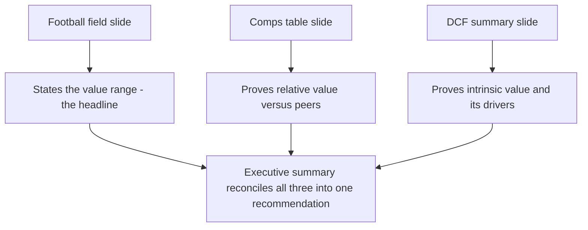
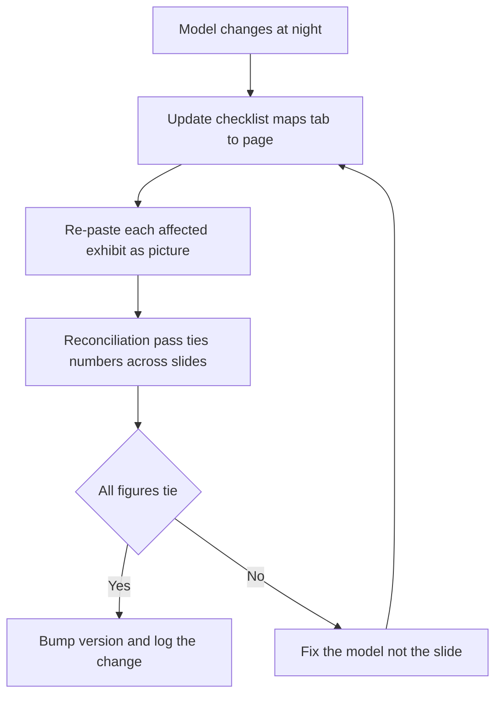

<!-- v2-deep -->

# Chapter 36 — PowerPoint, Pitchbooks and Presenting

## 1. The Problem

You have done the hard part. You built a fully integrated three-statement model, ran a discounted cash flow (DCF), pulled trading comparables, gathered precedent transactions, stress-tested an leveraged buyout (LBO), and synthesized everything into a football field. Weeks of work sit inside a workbook with forty tabs. And here is the brutal reality of professional finance: **almost nobody who makes the decision will ever open that workbook.**

The managing director has ninety seconds before her next call. The investment committee has read six other memos this morning. The board has a nine-item agenda and yours is item four. The CEO across the table from you in a sell-side pitch cares about one question — *should I hire this bank?* — and will decide largely on whether your team looks sharp and thinks clearly. None of these people will trace your interest schedule or admire your INDEX-MATCH. They will look at a document, listen to you talk for a few minutes, and decide.

So the problem is this: **the analysis that lives in the model has to travel from your screen into someone else's head, fast, accurately, and persuasively — through a medium (slides) that is hostile to nuance and unforgiving of clutter.** A model that is right but incomprehensible loses to a model that is simpler but well-presented. That is not a complaint about the world; it is the world. The chapter that gets a deal approved is not the modeling chapter — it is this one.

There is a second, sharper edge. In a live presentation, a smart skeptic *will* push back. "Why 8.5% WACC and not 10%?" "Your revenue growth is above consensus — defend it." "Precedent transactions are stale, why do you trust them?" If you cannot answer in one clean sentence, the whole model loses credibility regardless of how sound it actually is. Presenting is not decoration bolted onto the analysis. It is the last, load-bearing step of the analysis — and the one most modelers never practice.

There is a third edge that catches junior analysts specifically: **the cost of an error migrates upward.** A wrong number buried in a hidden tab is a private embarrassment you fix quietly. The same number on slide 3, projected onto a wall, cited by the MD as she talks, and then caught by the client's CFO, is a public credibility event that stains the whole team and, sometimes, the whole mandate. The discipline of this chapter — reconcile everything, source everything, paste as picture, rehearse the defense — exists precisely because the blast radius of a mistake is largest at the moment of presentation. Getting good at slides is, in large part, getting good at *not being wrong in public*.

## 2. The Core Idea

**A pitchbook is not a report of everything you did; it is an argument built from evidence. Structure the argument as a storyline, turn each model exhibit into one slide that proves one point, and rehearse the defense of every number before anyone asks.**

Four ideas sit inside that sentence.

First, **argument, not archive.** The temptation is to show all your work — to prove you were thorough by dumping every schedule onto a slide. This is exactly backwards. The audience does not reward volume; they reward clarity. Every slide must earn its place by advancing a single claim.

Second, **storyline before slides.** Before you open PowerPoint, you write the *spine* of the presentation as a sequence of one-sentence assertions. If those sentences, read in order, tell a convincing story on their own, you have a deck. If they don't, no amount of formatting will save you. The slides are illustrations of the storyline, not a substitute for having one.

Third, **one exhibit, one point, one slide.** Your football field, your comps table, your DCF summary — each is a *finished argument* that took a whole model to produce. On a slide, each becomes a single visual making a single point: "here is the value range," "here is why we trade cheap to peers," "here is what drives the intrinsic value." The slide's title states the conclusion; the exhibit is the proof.

Fourth, **the defense is part of the build.** Every assumption you flexed in the model is a question someone will ask. Professional presenters pre-load a one-line rationale for each — anchored to a source (consensus, management guidance, historical average, market data) — so the answer sounds like knowledge, not improvisation.

A useful mental model: think of the deck as a **courtroom**, not a **library**. A library archives everything, indexed for later retrieval by whoever cares. A courtroom presents a *case*: an opening argument (executive summary), a sequence of exhibits each admitted to prove a specific point, a narrative that connects them, and a cross-examination you must survive (Q&A). The appendix is your evidence locker — available if the judge wants it, but not read into the record. Everything in this chapter follows from taking the courtroom metaphor literally.


*Figure 36.1 — The path from model to persuasion runs through the storyline, not around it.*

## 3. Why It Works

This approach works because it is built around how decision-makers actually process information under time pressure, not how analysts wish they would.

**Cognitive load is the binding constraint.** A senior audience is intelligent but time-poor and attention-fragmented. Psychologists call the limit "working memory" — roughly a handful of items held at once. A slide crammed with three exhibits, twelve bullets, and a paragraph of footnotes exceeds that limit instantly, so the reader absorbs *nothing* and defaults to skimming your title. The "one point per slide" rule is not an aesthetic preference; it is a match to the hardware. When the title carries the conclusion and the exhibit carries one clean proof, the reader completes the thought in the four seconds they actually give you.

**Narrative is the most compressible format for reasoning.** A story — situation, complication, resolution — is how humans have transmitted causal reasoning for millennia, and it survives compression far better than a list. "The company trades at a discount to peers *because* the market over-weights a temporary margin dip *which* our forecast shows reversing, *therefore* the stock is undervalued" is a chain a listener can hold and repeat. The same facts as four disconnected bullets evaporate the moment the slide changes. Storyline structure works because it hands the audience a chain they can carry out of the room and repeat to *their* boss — and the person who repeats your argument for you is the person who gets it approved.

**Pre-loaded defenses work because credibility is fragile and asymmetric.** It takes twenty sound answers to build trust and one fumbled answer to break it. When a challenger asks "why 8.5%?" and you reply instantly with the build-up — risk-free rate, equity risk premium, beta, source-dated — the questioner concludes the *whole* model is this rigorous and stops digging. When you stammer, they conclude the opposite and start pulling threads. The defense being rehearsed converts an attack into a demonstration of depth. It works for the same reason a pilot's checklist works: the thinking was done in advance, when there was time to do it well, so the high-pressure moment only requires retrieval.

**The Pyramid Principle is why "conclusion first" beats "conclusion last."** Barbara Minto's insight, drilled into every McKinsey and Goldman analyst, is that senior readers want the *answer* first and the *support* underneath — the inverse of how you did the analysis. You worked bottom-up (data → analysis → conclusion); you must present top-down (conclusion → the two or three reasons → the data). Why? Because a reader who knows your conclusion can evaluate each supporting fact *as it arrives* ("does this actually support the claim?"), whereas a reader marched through data toward a mystery conclusion has to hold everything in suspension and re-interpret it all at the reveal. The first costs the reader nothing; the second exhausts them. Action titles, executive-summary-first ordering, and "the answer is $58–$70" as the opening line are all the Pyramid Principle applied.

**Redundant, reconciling exhibits build trust through triangulation.** Why show three valuation methods when one would give a number? Because a single number is a claim; three *independent* methods landing in the same zone is *evidence*. A skeptic can dismiss one method ("comps are apples-to-oranges"), but when the DCF — built from completely different inputs — corroborates the comps range, dismissing the conclusion requires dismissing two unrelated chains of reasoning at once. That is much harder, and the difficulty is the point. Convergence is persuasion; the reconciliation arithmetic is what makes convergence *checkable* rather than asserted.

## 4. Full Technical Content

### 4.1 The anatomy of a pitchbook

A pitchbook (or board deck, or investment memo in slide form) has a conventional structure. Conventions exist because busy readers navigate by them — deviate and you make the reader work. A typical sell-side or valuation pitchbook runs in this order:

| Section | Purpose | Typical slides |
|---|---|---|
| Cover | Title, client, date, "Strictly Private and Confidential" | 1 |
| Executive summary | The entire argument in one page | 1 |
| Situation and objectives | Why we are here, what the client wants | 1–2 |
| Market and industry context | The backdrop that frames the story | 2–4 |
| Company overview | The subject business, positioning, financials | 2–3 |
| Valuation summary | The football field — the headline answer | 1 |
| Valuation detail | DCF, trading comps, precedent transactions | 3–6 |
| Strategic alternatives / recommendation | What to do about it | 2–3 |
| Appendix | Full model outputs, supporting detail | many |

The **executive summary** is the single most important page. Assume it is the *only* page read. It must state the recommendation, the value conclusion, and the two or three reasons — nothing that requires turning the page to understand.

The **appendix** is where thoroughness lives. Every schedule, sensitivity table, and full comp set goes here. This resolves the archive-versus-argument tension: the front of the book is the argument, the back is the archive, and you *reference* the appendix ("full sensitivities on page 34") rather than cramming it into the flow.

**Book types differ, and the structure flexes.** A *sell-side pitch* (you want to win a mandate) front-loads credentials, a market read, and "why us," because the buyer is choosing an advisor, not approving a number. A *board deck* for a company considering a sale leads with the strategic rationale and the range of alternatives, because directors owe a fiduciary duty to weigh options. An *investment committee memo* at a fund or a lender leads hardest with risk, downside, and returns, because the reader is deploying capital and asks "how do I lose money here?" before "how do I make it?" The ten-part skeleton is stable; the *emphasis* shifts with who reads it and what they must decide. Always ask "what decision does this document exist to enable?" and weight the sections accordingly.

**Page budget discipline.** A senior banker will often set a hard page count ("keep it to fifteen pages, put the rest in the appendix"). This is a forcing function, not an inconvenience. If your argument does not survive a fifteen-page budget, your argument is not yet clear. The appendix is unlimited; the *body* is scarce, and scarcity is what makes you choose.

### 4.2 Writing the storyline first

Before opening PowerPoint, open a blank document and write the **action title** of every slide as a full sentence stating its conclusion. This is called the "horizontal logic" of the deck. Test: read only the titles, top to bottom. Do they form a coherent argument?

Weak (topic titles — describe the subject, assert nothing):
- "Revenue Trends"
- "Peer Comparison"
- "DCF Analysis"

Strong (action titles — each states a claim):
- "Revenue growth reaccelerated to 14% as the new product ramped"
- "The company trades at a 3x EBITDA discount to peers despite faster growth"
- "Our DCF supports an intrinsic value of $58–$66, above today's $49 price"

The strong version, read as three sentences, already tells a story: the business is accelerating, the market hasn't caught up, and intrinsic value confirms the upside. That is the deck. The exhibits merely prove each line.

**Horizontal versus vertical logic.** *Horizontal logic* is the flow *across* titles — do the takeaways, read alone, argue the case? *Vertical logic* is the flow *within* one slide — does the exhibit actually prove the title above it? Both must hold. A deck can pass horizontal logic (great story in the titles) yet fail vertical logic (slide 4's chart doesn't support slide 4's claim), and vice versa. Check them separately: read all titles as a paragraph (horizontal), then for each slide ask "if I cover the title, does the exhibit force this exact conclusion?" (vertical).

**A worked storyline transformation.** Suppose your first draft titles are the weak set above plus "Company Overview" and "Recommendation." Read alone they say: *overview, revenue trends, peer comparison, DCF analysis, recommendation.* That is a table of contents, not an argument — it asserts nothing and could describe a company that is a screaming buy or a short. Now rewrite each as a claim and impose a cause-effect order:

1. "MidcapCo is a $2.4bn specialty manufacturer growing revenue 14% — faster than every listed peer"
2. "Yet it trades at 7.8x EBITDA versus a 10.2x peer median — a 24% relative discount"
3. "The discount reflects a temporary 2023 margin dip the market is extrapolating; our forecast shows margins normalizing by 2025"
4. "Our DCF, built independently, confirms $52–$76 intrinsic value versus $49 today"
5. "We recommend the board explore a sale or buyback to capture the $9–$21 per-share gap"

Read alone, those five sentences *are* the pitch. The word "yet" in title 2 and "reflects" in title 3 are load-bearing — they are the connective tissue that turns a list into a story. That is the deliverable of Step 1, and it exists entirely before a single slide is formatted.

### 4.3 Turning model exhibits into slides

Each core valuation exhibit maps to a slide with a specific job. The mechanics of moving numbers from Excel to PowerPoint matter here.

**Linking versus pasting.** You have three options to get an Excel table or chart into PowerPoint:

1. **Paste as picture** (Paste Special → Picture, or the "Picture" paste icon). The exhibit becomes an image — pixel-locked, cannot be edited, will never accidentally change. Safest for a final book. The trap: if the model updates, the slide does *not*, so you must re-paste.
2. **Paste with source formatting / embed.** A live Excel object lives inside the slide. Double-clicking edits it. Heavier files, and a real risk that stale or hidden data travels with it.
3. **Paste-link** (Paste Special → Paste Link). The slide references the workbook; updating the model updates the slide on refresh. Powerful for a book you revise nightly, dangerous if the link breaks or points at the wrong file.

Standard banking practice for a **deliverable** book: paste as **picture** so nothing shifts after final review, and keep the source workbook as the system of record. During drafting, linking saves rework. Never hand a client a book with live links to your internal model — hidden tabs and comments can travel.

**A decision table for the paste choice:**

| Situation | Method | Why |
|---|---|---|
| Final deliverable leaving the building | Paste as picture (PNG) | Nothing shifts, no data leaks, prints cleanly |
| Internal draft revised nightly | Paste-link | Model change propagates on refresh |
| Small table you may tweak on the slide | Embed object | Editable in place without reopening Excel |
| Chart you want native PowerPoint styling on | Paste as chart, link data | PPT theme colors apply, data still updates |

**The picture-format nuance.** When you paste as picture, choose the format deliberately. *Enhanced Metafile (EMF)* is vector — it scales and prints razor-sharp and is the banking default for tables and charts. *PNG/bitmap* is raster — fine on screen but blurs when a printer or a projector scales it up. On Windows PowerPoint, Paste Special offers both; pick "Picture (Enhanced Metafile)" for anything with text or fine lines. This is the difference between a table that looks crisp on the client's boardroom screen and one that looks fuzzy — a small tell that experienced eyes catch.

**Formatting discipline for pasted exhibits.** Before pasting, clean the Excel range: remove gridlines, use one accent color plus greys, right-align numbers, show units in the header ("$ in millions" / "per share"), and set consistent decimals (values to zero or one decimal, multiples to one, percentages to one). The slide inherits whatever the range looks like, so the formatting work happens in Excel.

#### The football field slide

This is usually the headline valuation slide. One horizontal bar per method on a shared per-share axis, the current share price as a vertical reference line, and a shaded "concluded value" band. The action title states the answer: "Triangulation supports a value of $56–$64 per share." Label each bar's low and high endpoints directly on the bar — never make the reader read values off an axis. Keep the number of methods to four or five; more bars become noise.

**How to actually build the floating bar in Excel.** A football field is a *stacked horizontal bar chart* where the bottom series is invisible. Lay out a helper table:

| Method | Low | Width |
|---|---|---|
| Trading comps | 58 | 12 |
| DCF | 52 | 24 |
| Precedent txns | 66 | 18 |

Here `Low` is the left endpoint and `Width = High − Low` (e.g. DCF: `=76-52` = 24). Insert a *stacked bar* chart on both columns. Select the `Low` series, set fill to **No Fill** — it becomes an invisible spacer that pushes the visible `Width` bar to start at the right place. Format the `Width` series with your accent color. Add data labels: for the left endpoint, use the `Low` value; for the right, `Low + Width`. In modern Excel, "Value From Cells" lets you point the data labels at a column of pre-built "$58 – $70" text strings so each bar is directly labeled. Add the current price as a vertical line either via a scatter series at that x-value or a manually drawn line snapped to the axis. Reverse the category axis (Format Axis → "Categories in reverse order") so the first method sits at the top.

#### The comparable companies slide

A trading-comps table condensed to what matters: peer names, one size metric (market cap or EV), and the two or three multiples you actually used (EV/EBITDA, EV/Sales, P/E), plus mean, median, and — highlighted — the subject company. Cut every column that does not drive the conclusion. The action title states the *insight*, not "Comparable Companies": e.g., "Peers trade at 11x EBITDA; the subject at 8x implies re-rating upside."

#### The DCF summary slide

Not the full model — a *summary*. Typically: a small free-cash-flow bridge or the projected unlevered free cash flow (UFCF) line, the key assumptions boxed (WACC, terminal growth or exit multiple), the resulting enterprise-to-equity bridge, and a two-way sensitivity table (WACC × terminal growth) showing the value grid. The sensitivity table is the most persuasive single object in valuation because it pre-empts "but what if your assumption is wrong?" — the answer is *right there* in the grid.


*Figure 36.2 — Three exhibits, three distinct proofs, converging on one recommendation.*

### 4.4 Slide design mechanics

A small set of rules covers almost all of professional slide design:

- **One idea per slide.** If a slide needs the word "and" twice in its title, it is two slides.
- **Action titles, left-aligned, full sentence, one line.** The title is the takeaway. If someone reads only titles, they get the whole argument.
- **The 1-2-3 hierarchy.** Title (conclusion) → exhibit (evidence) → footnote (source and caveats, small and grey). The eye should travel top-down and land on the exhibit.
- **Consistency beats decoration.** One font family (a clean sans-serif), two or three sizes, one accent color plus a grey scale. Every slide uses the same margins, the same title position, the same footnote style. Inconsistency reads as carelessness and undermines the numbers.
- **Data-ink discipline.** Remove chart junk: no 3-D bars, no gradient fills, no drop shadows, minimal gridlines, no legend when direct labels work. Every pixel should carry information.
- **Number formatting.** Consistent decimals and units, thousands separators, negatives in parentheses or red per house style, and align the decimal points. Sloppy number formatting on a *finance* slide is a tell that the underlying work is sloppy too.
- **Footnote your sources.** Every external number gets a source and a date: "Source: Capital IQ, market data as of 30-Jun-2026." This is both good practice and pre-loaded defense — the source is already on the page when someone asks.

**The alignment grid.** Professional decks sit on an invisible grid. Titles start at the same left margin and the same vertical position on every slide; exhibits occupy the same content box; footnotes anchor to the same bottom line. Set this once in the Slide Master. The test: click rapidly through the deck in Slide Sorter — if titles "jump" vertically slide-to-slide, your master is not being used and the deck reads as amateur even if every individual slide looks fine. Stillness across transitions signals control.

**Color with meaning.** Use color to *encode*, not to decorate. One accent color marks "the thing you should look at" (the subject row, the concluded band, the recommended option). Everything else is greyscale. When color carries information, a reader's eye is pulled to exactly the cell you want; when everything is colored, nothing is emphasized and the reader is on their own. A common house convention: subject/recommendation in the accent color, peers/alternatives in grey, and negative or risk figures in a single muted red.

### 4.5 The mechanics of building efficiently

Use **slide masters** so title position, fonts, and colors are defined once and inherited everywhere; never format slides individually. Build a reusable **template** with your cover, divider, and standard exhibit layouts. Keep a **"source" workbook** as the single system of record and paste from it, so there is one place a number can be wrong. Use PowerPoint's **align and distribute** tools (never eyeball placement) and **guides** for consistent margins. For a book revised nightly, maintain an **update checklist** — which page pulls from which tab — so a model change propagates without a number being missed.

**The version-control reality.** Banking decks are revised through many "turns" (v1, v2, ... often into the twenties before a live pitch). Two disciplines prevent chaos. First, a **filename convention** with date and version — `ProjectX_Pitch_v14_2026-07-04.pptx` — never `final`, `final_v2`, `FINAL_real`. Second, a **change log** on an internal-only slide listing what changed each turn, so the MD reviewing v14 sees "updated WACC to 9.0% per new rate curve; refreshed comps to 3-Jul close" without re-reading the whole book. When the model changes at 11pm, the update checklist tells you exactly which pages to re-paste; without it, you *will* miss one.

**The reconciliation pass.** Before any book ships, do a dedicated pass whose only job is to check that numbers *tie* across the deck: the football field's concluded range equals the executive-summary headline; the DCF slide's base case equals the centre of its own sensitivity grid; the comps re-rating percentage in the title recomputes from the table on the slide; the share count and net debt are identical everywhere they appear. A single figure that differs by page — $500m net debt on the DCF slide, $520m on the accretion slide — is the kind of inconsistency a sharp CFO catches in seconds, and it detonates trust in everything else. Reconciliation is not optional polish; it is the last line of defense against the public-error risk from Section 1.


*Figure 36.3 — The nightly turn is a loop, and the reconciliation gate is what keeps errors out of the printed book.*

## 5. Worked Examples

### Example 1 — Turning a comps tab into one slide

Your trading-comps tab has fourteen columns and eleven peers. The raw data:

| Company | Mkt Cap ($m) | EV ($m) | EV/Sales | EV/EBITDA | P/E |
|---|---|---|---|---|---|
| Peer A | 4,200 | 4,800 | 2.4x | 10.5x | 18.0x |
| Peer B | 3,100 | 3,600 | 2.1x | 9.8x | 16.5x |
| Peer C | 5,600 | 6,400 | 2.9x | 12.2x | 21.0x |
| Peer D | 2,800 | 3,300 | 1.9x | 9.1x | 15.0x |
| **Median** | | | **2.25x** | **10.2x** | **17.3x** |
| **Subject** | 2,400 | 2,900 | 1.6x | 7.8x | 12.5x |

**The slide build.** Drop the columns that don't drive the argument — you decided EV/EBITDA is the primary lens, so lead with it, keep EV/Sales as support, and move P/E to the appendix. Highlight the subject row and the median row. Now compute the re-rating implication to put in the title.

Subject last-twelve-months EBITDA = EV / (EV/EBITDA) = 2,900 / 7.8 = **$372m**.

If the subject re-rated to the peer median of 10.2x:

Implied EV = 372 × 10.2 = **$3,794m**.

Bridge to equity: implied EV − net debt. Net debt = EV − Mkt Cap = 2,900 − 2,400 = **$500m**.

Implied equity = 3,794 − 500 = **$3,294m**, versus current $2,400m — a **37% uplift** to equity value.

**Self-check:** current equity 2,400 → implied 3,294; 3,294 / 2,400 − 1 = 0.372 ≈ 37%. Consistent.

The action title writes itself: **"The subject trades at 7.8x EBITDA versus a 10.2x peer median; re-rating to peers implies ~37% equity upside."** The slide is a five-row table plus that title. Everything else goes to the appendix. Rebuild this in Excel, format the two-row highlight, paste as a picture.

**Exact Excel formulas for the re-rating box.** Lay the subject data in cells and drive the title number off live formulas so it can never drift from the table:

```
B2  Subject EV            2900
B3  Subject EV/EBITDA     7.8
B4  Peer median multiple  10.2
B5  Subject Mkt Cap       2400
B6  Implied EBITDA        =B2/B3            -> 371.79
B7  Implied EV            =B6*B4            -> 3792.3
B8  Net debt              =B2-B5            -> 500
B9  Implied equity        =B7-B8            -> 3292.3
B10 Upside %              =B9/B5-1          -> 0.3718  (37%)
```

Note the small rounding gap: using the *unrounded* implied EBITDA of 371.79 gives implied EV 3,792 and upside 37.2%, versus 3,794 / 37.2% from the rounded 372. Both round to "~37%," so the title is safe — but this is exactly the kind of drift the reconciliation pass exists to catch, and why you round *display* figures while keeping *full precision* in the calculation chain.

**Edge case — what if net debt is negative?** Suppose the subject held net cash of $300m instead (Mkt Cap 2,700, EV 2,400). Then net debt `=B2-B5 = 2400-2700 = −300`, and implied equity `= implied EV − (−300) = implied EV + 300`. The bridge *adds* the cash. Analysts routinely fat-finger this by subtracting a positive "net debt" when the company is actually net cash, understating equity value. Always compute net debt as (debt − cash) with its natural sign and let the bridge subtract it; do not hard-type a sign.

**"What if" variation — which multiple to lead with.** If instead you led with EV/Sales, subject sales = EV / (EV/Sales) = 2,900 / 1.6 = $1,813m; re-rate to median 2.25x → implied EV = 1,813 × 2.25 = $4,078m → equity 3,578 → 49% upside. That is a *bigger* number, which is tempting, but EV/Sales ignores the margin story that is the whole thesis (a low-margin business *should* trade at a lower sales multiple). Leading with the flattering multiple you can't defend is a classic own-goal — the CFO asks "why sales and not EBITDA for a margin turnaround story?" and you have no answer. Lead with the multiple that fits the *argument*, not the one that prints the highest number.

### Example 2 — The DCF summary slide with its sensitivity defense

Your DCF produced an enterprise value of $3,600m at a base-case WACC of 9.0% and terminal growth of 2.5%. Net debt is $500m and diluted shares are 50m. Base-case per share:

Equity = 3,600 − 500 = **$3,100m**. Per share = 3,100 / 50 = **$62.00**.

Now the sensitivity table — the single most defensible object on the slide. You flex WACC and terminal growth and recompute enterprise value, then per-share. Suppose the model outputs these enterprise values ($m):

| WACC ↓ / g → | 2.0% | 2.5% | 3.0% |
|---|---|---|---|
| 8.5% | 3,850 | 4,050 | 4,290 |
| 9.0% | 3,430 | 3,600 | 3,800 |
| 9.5% | 3,080 | 3,220 | 3,380 |

Convert the corners to per share (subtract $500m net debt, divide by 50m):

- Low corner (9.5%, 2.0%): (3,080 − 500)/50 = 2,580/50 = **$51.60**
- Base (9.0%, 2.5%): (3,600 − 500)/50 = **$62.00**
- High corner (8.5%, 3.0%): (4,290 − 500)/50 = 3,790/50 = **$75.80**

**Self-check:** base recomputed from the grid centre = (3,600 − 500)/50 = $62.00, matching the standalone base-case calculation. The grid is internally consistent with the headline.

So the DCF slide carries: the base-case **$62**, a defensible **$52–$76** range straight off the sensitivity corners, the boxed assumptions (WACC 9.0%, g 2.5%), and the grid itself. When a challenger says "9% WACC is aggressive, use 9.5%," you don't argue — you point at the grid: "At 9.5% and 2.5% growth we get $54 per share, still above today's $49." The objection is pre-answered on the page. That is what turns a sensitivity table into a rhetorical weapon.

**Verify that "$54" claim.** At WACC 9.5%, g 2.5%, the grid EV is 3,220. Per share = (3,220 − 500)/50 = 2,720/50 = **$54.40** ≈ $54. Confirmed — the answer you'll give under fire ties to the grid you printed.

**Building the grid itself — the Excel Data Table.** The two-way grid is a native Excel *Data Table* (Data → What-If Analysis → Data Table), not hand-typed numbers. Set it up:

```
Layout:
  D5  = a live link to the model's EV output cell  (=EnterpriseValue)
  E5  F5  G5   -> the g values 2.0%  2.5%  3.0%   (column input across the top)
  D6            -> WACC 8.5%
  D7            -> WACC 9.0%
  D8            -> WACC 9.5%  (row inputs down the left)
Select D5:G8, then Data > What-If Analysis > Data Table:
  Row input cell    = the model's terminal-growth assumption cell
  Column input cell = the model's WACC assumption cell
```

Excel then recomputes the full model once per cell and fills the grid — so the numbers are *always* the model's actual output, never stale. Critical gotcha: the top-left anchor `D5` must reference the *output you want to tabulate* (enterprise value, or better, per-share value), and the row/column input cells must be the *assumption* cells the axes represent. Swap them and the table silently fills with garbage. Best practice: build the Data Table to output **per-share value directly** by anchoring D5 to a per-share cell `=(EnterpriseValue-NetDebt)/DilutedShares`, so no manual corner conversions are needed and there is nothing to mis-arithmetic on the slide.

**Edge case — g approaching WACC.** The Gordon terminal value is `TV = FCF_terminal × (1+g) / (WACC − g)`. As g climbs toward WACC the denominator shrinks and TV explodes. Watch the top-right corner (8.5% WACC, 3.0% g): the spread is only 5.5%, and the grid's 4,290 already reflects the convexity — note the jump from 4,050 to 4,290 (+240) between g=2.5% and g=3.0% is larger than the 3,850→4,050 step (+200), because the denominator is compressing. If you ever widen the grid to, say, 8.0% WACC and 4.0% g (spread 4.0%), the value balloons implausibly and a sharp reader will pounce. Keep the flex range sane — typically ±0.5% on WACC and ±0.5% on g around base — precisely so no corner becomes a mathematical artifact you cannot defend.

**"What if" — the exit-multiple method instead of Gordon growth.** If your terminal value uses an EV/EBITDA exit multiple rather than perpetuity growth, flex WACC × exit multiple instead. Say base is 8.0x terminal EBITDA. The grid axes become exit multiple {7.0x, 8.0x, 9.0x} against WACC {8.5%, 9.0%, 9.5%}. The rhetorical function is identical — pre-answer "your terminal assumption is aggressive" — but the axis label and the defense sentence change: "even at a 7.0x exit, one turn below today's trading multiple, we get $[x], still above the price." Match the sensitivity axis to whichever terminal method the model actually uses; showing a growth grid when the model runs on an exit multiple is an inconsistency a diligent reader will flag.

### Example 3 — Reconciling exhibits into the executive summary

The three exhibits now feed one summary. Suppose the football field synthesized:

| Method | Low | High |
|---|---|---|
| Trading comps (from Ex. 1 logic) | $58 | $70 |
| DCF (from Ex. 2) | $52 | $76 |
| Precedent transactions | $66 | $84 |
| Current price | $49 | $49 |

The executive summary must reconcile these into one line without hand-waving. The concluded range is the **credible overlap** — the zone where the standalone-value methods (comps and DCF) agree: roughly **$58–$70**. Precedent transactions sit higher because they embed a control premium (relevant only in a sale), so you *note* them as the "in a sale" ceiling rather than blending them into a standalone view.

**Reconciliation check:** the overlap of comps ($58–$70) and DCF ($52–$76) is $58–$70 — the comps low and comps high define the tighter band, fully inside the DCF range, so the two independent methods corroborate. The current $49 price sits *below* the entire overlap, quantifying the thesis: the market is undervaluing the business by at least $9/share (18%) on a standalone basis, more in a sale.

The executive-summary action title: **"We value the business at $58–$70 per share standalone (up to $84 in a sale), versus $49 today — a re-rating and strategic-alternatives opportunity."** Every downstream slide now exists to prove one clause of that sentence.

**Quantify the control premium implied by the precedents.** The precedent midpoint is (66 + 84)/2 = $75; the standalone (comps+DCF overlap) midpoint is (58 + 70)/2 = $64. Implied control premium = 75/64 − 1 = **17%** over standalone value, or 75/49 − 1 = **53%** over the *current price*. Both are plausible for a strategic acquisition (control premia commonly run 20–40% over an unaffected price), so the football field is internally coherent — the precedent bars sitting high is *explained*, not anomalous. Being able to say "the precedents imply a ~17% control premium to intrinsic value, in line with what strategics pay" is exactly the pre-loaded defense that pre-empts "why are the transaction comps so much higher?"

**Edge case — when the methods do NOT overlap.** Suppose the DCF had come in at $40–$50 while comps said $58–$70. There is *no* overlap, and the honest move is not to average them into a false "$50–$70" — it is to *explain the divergence*. Either the market (comps) is pricing in growth the DCF doesn't capture, or the DCF's assumptions are more conservative than the market's. You surface the tension explicitly: "our intrinsic DCF is below where peers trade, suggesting either peer optimism or DCF conservatism on terminal growth — we flag this as the key judgment for the committee." Blending non-overlapping ranges to manufacture agreement is the single most dishonest move in valuation presentation, and a good reader smells it immediately. Convergence is evidence; manufactured convergence is a lie.

### Example 4 — A one-slide LBO returns exhibit

An exhibit is not always a valuation range. An LBO returns summary follows the same one-point-one-slide discipline. Suppose a sponsor buys the business:

```
Entry:
  Entry EV               = 8.0x x $372m EBITDA        = $2,976m
  Less net debt raised   = 5.0x x $372m               = $1,860m
  Sponsor equity in      = 2,976 - 1,860              = $1,116m
Exit (year 5):
  EBITDA grows 6% p.a.   = 372 x 1.06^5 = 372 x 1.3382 = $498m
  Exit at same 8.0x      = 498 x 8.0                  = $3,983m
  Net debt at exit (paid down to $1,000m)             = $1,000m
  Exit equity            = 3,983 - 1,000              = $2,983m
Returns:
  MOIC                   = 2,983 / 1,116              = 2.67x
  IRR                    = 2.67^(1/5) - 1             = 21.7%
```

**Self-check the IRR:** 1.217^5 = 1.217 × 1.217 × ... Let's verify: 1.217^2 = 1.481; ^4 = 1.481^2 = 2.193; ^5 = 2.193 × 1.217 = **2.669** ≈ 2.67x. The IRR and MOIC tie.

The action title states the conclusion, not "LBO Analysis": **"At an 8.0x entry the deal returns 2.7x / 22% over five years, driven by EBITDA growth and deleveraging."** The exhibit is a returns bridge; the two drivers named in the title (growth, deleveraging) are the pre-loaded answer to "where do the returns come from?" — which is *the* question every investment committee asks. Note MOIC and IRR must be mutually consistent (a 5-year 2.67x *is* a ~21.7% IRR); printing "2.7x and 25%" when the math says 21.7% is the kind of internal contradiction the reconciliation pass exists to catch.

## 6. Connections

**To the football field (Chapter 27).** That chapter built the synthesis; this chapter presents it. The triangulation logic — why methods disagree, what the gaps mean — is *exactly* the content of your defense when someone challenges the range. The football field is the bridge object between analysis and communication.

**To DCF (Chapters 22–24).** The DCF summary slide and its sensitivity grid are the presentation face of that whole build. The WACC build-up (Chapter 23) is your single most-challenged assumption, so it is the defense you rehearse first.

**To comps and precedents (Chapters 25–26).** The relative-value slides come straight from those tabs. The control-premium distinction (why precedents sit high) is the reconciliation logic your executive summary must handle honestly.

**To scenario and sensitivity analysis (Chapter 18).** Sensitivity tables are built in the model and *presented* here. The connection is direct: the two-way data table you built in Chapter 18 becomes the DCF slide's pre-emptive defense.

**To M&A and LBO (Chapters 28–35).** Accretion/dilution outputs and LBO returns (IRR, MOIC) are exhibits too, presented with the same one-point-per-slide discipline. An LBO "returns bridge" or an accretion/dilution summary is just another exhibit that must state its conclusion in the title (Example 4 above).

**To model design and formatting (Chapter 3).** The blue-input / black-formula formatting discipline and the "one place a number can be wrong" principle carry straight into the deck: the source workbook is the single system of record, and the reconciliation pass is model-auditing applied to slides.

**Forward, to the career.** This is the skill that compounds. Modeling gets you in the door; presenting gets you promoted. The analyst who can stand up, tell the story, and defend the numbers is the one who ends up in the room with the client.

## 7. Traps and Common Errors

- **The archive dump.** Putting everything on the slide to prove thoroughness. It proves the opposite — that you cannot distinguish signal from noise. Move detail to the appendix and *reference* it.
- **Topic titles instead of action titles.** "DCF Analysis" tells the reader nothing. If your titles don't form an argument when read alone, you have a folder of slides, not a deck.
- **Two exhibits fighting on one slide.** The football field *and* the comps table on one page means the reader absorbs neither. One point, one slide.
- **Reading the slide aloud.** If you narrate the bullets verbatim, the audience wonders why you're in the room. The slide is the evidence; you provide the *reasoning between* the evidence. Slides support the talk; they are not the talk.
- **Unformatted paste.** Dropping a raw Excel range with gridlines, wrong decimals, and mixed units. It reads as careless and infects trust in the numbers. Format in Excel first, paste as picture.
- **Live links in a client book.** Handing over a deck with links to your internal model. Hidden tabs, comments, and other clients' data can travel with an embedded object. Paste as picture for anything that leaves the building.
- **Mixing units across the football field.** One bar in EV, another per share. The bars then live on incompatible axes and the chart lies. Fix the unit (usually per share) before building.
- **No source, no date.** An unsourced market number invites "where's that from?" and you have no answer. Footnote every external figure with source and as-of date.
- **Defending with volume instead of a source.** When challenged, piling on more words. The credible answer is short and anchored: "Consensus, management guidance, ten-year average, market data as of the 30th." Anchor, don't ramble.
- **Over-precision.** "$61.47 per share" implies a false accuracy the model cannot support. Round to the precision your inputs justify — a range in whole dollars, multiples to one decimal.
- **Not rehearsing the Q&A.** Building beautiful slides and then improvising the defense. The questions are predictable — every assumption you flexed is a question. Write the one-line answer to each *before* the meeting.
- **Numbers that don't tie across slides.** Net debt $500m on the DCF slide, $520m on the accretion slide; a football field range that doesn't match the executive-summary headline. A sharp reader catches the inconsistency in seconds and it detonates trust in every other number. Run the reconciliation pass.
- **Blending non-overlapping ranges.** Averaging a $40–$50 DCF with a $58–$70 comps range into a fake "$50–$70" to manufacture agreement. Surface the divergence honestly instead; forced convergence is the most transparent dishonesty in valuation.
- **Rounding drift into the title.** The title says "37% upside" but the table's figures recompute to 34% because you rounded an intermediate step. Keep full precision in the calculation chain and round only the display.
- **Leading with the flattering multiple you can't defend.** Choosing EV/Sales because it prints a bigger upside than EV/EBITDA, then having no answer when asked why sales fits a margin-turnaround story. Lead with the multiple that fits the argument.
- **A sensitivity grid with an unstable corner.** Flexing g so close to WACC that the terminal value explodes, producing a corner value you cannot defend. Keep the flex range tight (±0.5%) so every cell is credible.
- **Blurry pasted exhibits.** Pasting tables as bitmap so they fuzz on the boardroom projector. Use Enhanced Metafile (vector) for anything with text or fine lines.

## 8. First-Principles Recap

Start from the constraint: the decision-maker is intelligent, time-poor, and will give your work seconds, not hours. From that single fact everything follows.

Because attention is scarce, you cannot show everything — so you must *choose* what to show, which means having an **argument**, not an archive. Because working memory is small, each slide can carry only one idea, so the **one-point-one-slide** rule is forced, not stylistic. Because reasoning survives compression best as a story, you structure the deck as a **storyline** of one-line claims and let each exhibit prove one claim. Because a slide's title is the one thing everyone reads, the title must carry the **conclusion**, not the topic. And because credibility is fragile and a skeptic will probe, you **pre-load a sourced one-line defense** for every assumption, doing the thinking in advance when there is time to do it well.

Two further constraints, added from the technical content. Because the cost of an error is largest at the moment of presentation — public, projected, cited — you **reconcile every number across the deck** and paste finals as pictures, so nothing shifts and nothing contradicts. And because three independent methods landing in the same zone is far more persuasive than one asserted number, you **triangulate and show the reconciliation arithmetic**, letting convergence do the persuading while honesty about divergence protects your credibility.

The model is the truth. The pitchbook is how the truth travels into a decision. If the analysis never reaches the decision-maker's head clearly enough to act on, the analysis — however correct — did not matter. Presenting is the last mile of modeling, and the whole journey fails at the last mile or it doesn't fail at all.

## 9. Quick-Reference

**Pitchbook order:** Cover → Executive summary → Situation → Market context → Company overview → Valuation summary (football field) → Valuation detail → Recommendation → Appendix.

**Storyline test:** Read only the slide titles top to bottom. Do they form a coherent argument? If not, fix the logic before formatting. (Horizontal logic = titles argue the case; vertical logic = each exhibit proves its own title.)

**Action title formula:** State the *conclusion* as a full sentence, one line, left-aligned. "X because Y, therefore Z."

**Exhibit → slide job:**
- Football field → the headline value range
- Comps table → relative value versus peers
- DCF summary + sensitivity grid → intrinsic value and its drivers
- LBO returns bridge → returns and their drivers (growth, deleveraging)
- Executive summary → reconcile all three into one recommendation

**Paste rule:** Deliverable book → paste as **picture** (Enhanced Metafile for text/lines). Nightly draft → link, but never ship live links to a client.

**Formatting checklist:** one accent color + greys; one font, 2–3 sizes; consistent decimals and units; sources dated in footnotes; align/distribute, never eyeball; remove chart junk; titles on the master grid so they don't jump.

**Bridges to keep handy:**
```
Equity Value = Enterprise Value − Net Debt − Preferred − Minority Interest
Per Share    = Equity Value / Diluted Shares
Implied EV (re-rate) = Metric × Peer Multiple
Net Debt = Enterprise Value − Market Cap   (negative if net cash)
Metric implied from multiple = EV / (EV/Metric)
MOIC = Exit Equity / Entry Equity ;  IRR = MOIC^(1/years) − 1
Control premium implied = Precedent midpoint / Standalone midpoint − 1
```

**Football field build:** stacked horizontal bar; bottom "Low" series set to No Fill; visible "Width = High − Low"; direct-label endpoints via Value From Cells; vertical current-price line; reverse category axis.

**Sensitivity grid build:** Data → What-If → Data Table; anchor the top-left cell to a per-share output; row input = growth (or exit multiple) cell, column input = WACC cell; keep flex to ±0.5% so no corner is unstable.

**Defense format:** short + sourced + dated. "Consensus / management guidance / N-year average, as of [date]." Point at the sensitivity grid for assumption challenges.

**The four-second test:** if the reader looks at a slide for four seconds and reads only the title, do they get the point? If not, rebuild the slide.

**The reconciliation gate:** before shipping, confirm — football field range = exec-summary headline; DCF base case = centre of its own grid; comps title % = recompute from the table; net debt and share count identical on every slide.

## 10. Build-It-Yourself Exercise

Take a valuation you have already modeled (or the numbers from the worked examples above) and produce a **five-slide mini-pitchbook** plus a one-page defense sheet.

**Step 1 — Write the storyline first (no PowerPoint yet).** In a blank document, write five action titles that, read in sequence, tell the investment story: an executive-summary line, a market/company context line, a relative-value line, an intrinsic-value line, and a recommendation line. Test both logics: read the five sentences alone (horizontal — do they argue the case?), and for each, ask whether its planned exhibit actually proves it (vertical). Iterate until both hold.

**Step 2 — Build the football field slide in Excel, then paste.** Create a stacked horizontal bar chart: a "Low" series set to No Fill and a "Width = High − Low" series in your accent color. Direct-label the low/high endpoints using Value From Cells, add a vertical line for the current price, shade the concluded band, and reverse the category axis. Clean the formatting (no gridlines, one accent color). Paste as an Enhanced Metafile picture into slide 1's exhibit area under an action title stating the range.

**Step 3 — Condense a comps table to one slide.** From a full comps tab, cut to peer names, one size column, and your primary multiple plus median. Highlight the subject and median rows. Compute the re-rating implication with live formulas (`Implied EBITDA = EV/(EV/EBITDA)`; `Implied EV = ×peer median`; bridge to equity; `% upside`) and put *that* number in the action title. Confirm the title % recomputes from the table.

**Step 4 — Build the DCF summary slide.** Box the key assumptions (WACC, terminal growth or exit multiple), show the enterprise-to-equity bridge, and build a two-way sensitivity grid using a real Data Table (What-If Analysis), anchored to output **per-share value** so no manual corner conversion is needed. Confirm the grid centre reconciles to your standalone base case, and check that no corner is unstable (g not too close to WACC).

**Step 5 — Write the executive summary and reconcile.** On the final slide, state the concluded value range as the credible overlap of your standalone methods, note precedents separately as the "in a sale" ceiling, quantify the implied control premium, and confirm the overlap arithmetic ties out. If your methods do *not* overlap, surface the divergence honestly rather than blending.

**Step 6 — The defense sheet.** On one page, list every assumption you flexed (WACC, growth, exit multiple, peer set, terminal method) and write a single sourced sentence defending each. For at least the WACC challenge, script the exact answer using the sensitivity grid and *verify the number ties*: "At [higher WACC] we still get $[value from the grid], above today's $[price]."

**Step 7 — Rehearse.** Present the five slides out loud in under four minutes, reasoning *between* the exhibits rather than reading them. Then have someone (or yourself, adversarially) fire the three hardest questions — "why this WACC?", "why do precedents sit so high?", "your growth is above consensus, defend it" — and answer each in one anchored sentence.

**Interview angle — practice these aloud.** Beyond building, be ready to *explain the method* the way an interviewer probes: "Why show three valuation methods instead of one?" (independent corroboration; convergence is evidence, and I can defend each chain separately). "Why do precedent transactions usually sit above trading comps on a football field?" (they embed a control premium relevant only in a sale). "Your DCF is below where comps trade — which is right?" (surface the tension; it is either peer optimism or DCF conservatism on terminal assumptions, and I'd flag it as the committee's key judgment). "What's the single most defensible object on a valuation slide?" (the two-way sensitivity grid — it pre-answers 'what if your assumption is wrong'). Being able to answer these crisply is the same skill as defending the deck live.

**Reconciliation to verify before you finish:** the value range in your executive-summary title must equal the overlap you can point to on the football field, the DCF slide's base case must match the centre of its own sensitivity grid, the comps re-rating percentage in that title must recompute from the numbers in the table, and any figure that appears on more than one slide (net debt, share count, EBITDA) must be identical everywhere. If any of these fail to tie, the deck is telling more than one story — fix the model, not the slide. Build every piece of this in Excel and PowerPoint; reading it is not the same as being able to do it under a managing director's questioning.
