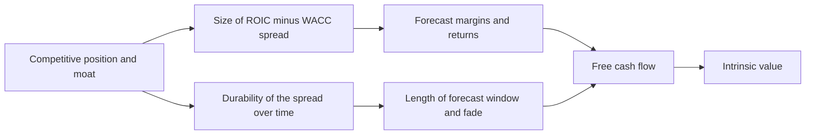
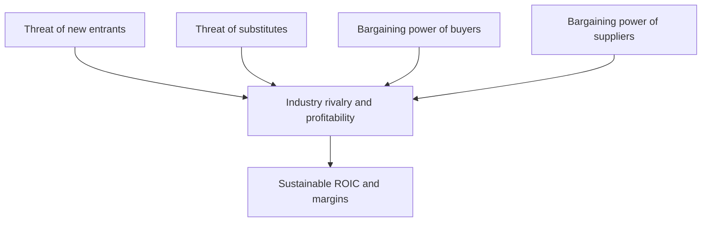
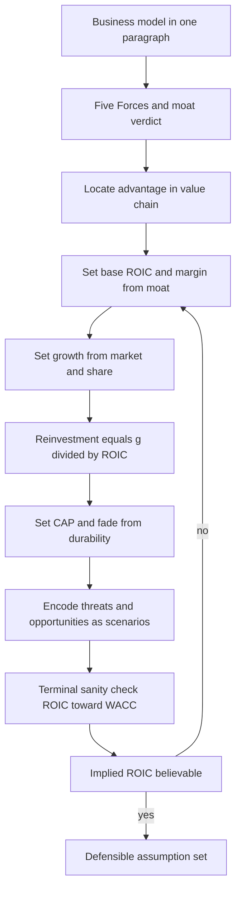
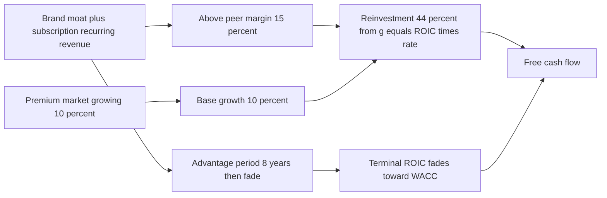

<!-- v2-deep -->

# Chapter 37 — Corporate and Business Strategy for Analysts

## 1. The Problem

Open any beginner's financial model and you will find a revenue line growing at 8% a year, gross margin holding at 42%, and capital expenditure pinned to 4% of sales — all the way out to the terminal year. Ask the modeler *why* 8% and not 5% or 12%, and the honest answer is usually "it looked reasonable" or "that's what last year did." The numbers are internally consistent, the formulas link cleanly, the balance sheet balances. And the model is worthless.

It is worthless because a model is nothing more than a **theory of the business expressed in arithmetic**. Every assumption is a claim about the future: this company will win *this* much share, charge *these* prices, spend *this* much to grow, and earn *these* returns. Those claims are true or false for *business* reasons — because customers are locked in or free to leave, because a rival is about to enter or cannot, because the company can raise prices or dare not. If you cannot articulate the business reason behind an assumption, you are not forecasting. You are decorating a guess with decimal places.

The problem this chapter solves is the single most common failure in valuation work: **a quantitatively sophisticated model built on a strategically empty story.** The reader can already build the mechanics (three statements, DCF, comps). What separates a junior analyst from a trusted one is the ability to look at a business, understand *why it makes money and whether it will keep making money*, and then translate that judgement into the specific cells of a model — the growth rate, the margin trajectory, the reinvestment rate, the fade to terminal value.

Strategy, for an analyst, is not an MBA seminar. It is the discipline of **making your assumptions defensible.** This chapter gives you the frameworks — competitive advantage and moats, Porter's Five Forces, the value chain, SWOT — but always bent toward one purpose: turning a qualitative story about competition into a quantitative story about cash flows.

To make the stakes concrete: consider two identical-looking DCFs. Both start from ₹100 Cr of NOPAT, both grow it at 8%, both discount at 10% WACC. Model A fades ROIC from 25% to 12% over ten years; Model B holds ROIC at 25% forever. That single strategic difference — a fading versus an eternal moat — can swing the equity value by 40-60%. The formulas are identical. The *strategy embedded in the formulas* is where the entire disagreement lives. An analyst who cannot see and defend that difference is not adding value; they are transcribing consensus.

## 2. The Core Idea

Here is the whole chapter in one sentence: **a company's competitive position determines the returns it can earn, and returns above the cost of capital are exactly what create value — so the strategic analysis and the valuation are the same analysis, viewed from two ends.**

Value is created only when a company earns a **return on invested capital (ROIC) above its weighted average cost of capital (WACC)**. A business earning its cost of capital and no more is running to stand still: it can grow, but growth adds no value because every rupee reinvested returns exactly what investors demanded. Value comes from the *spread* — ROIC minus WACC — and from how long that spread persists.

Now the strategic insight: **the size and durability of that spread are determined by competitive advantage.** In a perfectly competitive market, rivals compete returns down to the cost of capital; the spread is zero. A company earns and *keeps* excess returns only if something stops competitors from copying it — a moat. Strategy analysis is the process of identifying whether a moat exists, how wide it is, and how long it will last. That translates directly into three model parameters:

- **How high** the spread is → drives **margins and ROIC** in the forecast.
- **How long** it lasts → drives the **length of the high-growth window** and the **fade** to terminal value.
- **How fast the business can grow while earning that spread** → drives the **reinvestment rate** and therefore free cash flow.

So the qualitative question ("does this company have a durable competitive advantage?") and the quantitative question ("what growth, margin, and reinvestment should I forecast?") are one question. The frameworks in this chapter are the bridge.

A useful mental compression: **value = a spread, times a duration, scaled by growth that is only worth having if the spread is positive.** Three of those four words are strategy words (spread, duration, worth-having); only "growth scaled" is arithmetic. This is why a modeler who is fluent in Excel but illiterate in strategy will produce confident, precise, wrong answers — they are optimizing the one word that matters least.

*Figure 1 — Strategy and valuation are the same analysis seen from two ends.*

## 3. Why It Works

Why should competition, an abstraction, discipline something as concrete as a cash flow forecast? Because of an iron economic law: **excess profits attract competition, and competition erodes excess profits.** This is not ideology; it is the single most reliable pattern in business history. A company earning 40% ROIC in an unprotected market is broadcasting a signal — "come take some of this" — and capital, being mobile and greedy, comes. New entrants, imitators, and better-funded incumbents pile in until returns fall back toward the cost of capital. This process is called **competitive convergence** or **mean reversion of returns**, and empirical studies across decades confirm it: high ROIC businesses, on average, see returns fade toward the mean over 5-15 years.

The exceptions — the companies that *sustain* high returns for decades — are the ones with moats. A moat is a **structural barrier that raises the cost or lowers the payoff of competing**, so rivals rationally choose not to (or try and fail). The moat does not repeal the law of convergence; it slows it down. That is precisely why moat analysis maps onto the *fade period* in a model: a wide-moat business fades slowly (long competitive advantage period), a no-moat business fades fast.

This is also why the frameworks *work as forecasting tools rather than checklists.* Porter's Five Forces is, at bottom, a structured way of asking "how easily can excess profits in this industry be competed away, and by whom?" Each force is a channel through which returns leak: powerful buyers bargain your margins down, powerful suppliers bargain your costs up, new entrants and substitutes take your volume, and rivalry does all of the above. An industry where all five forces are benign is one where excess returns *persist*, which is why such industries support high, stable margins in a model. An industry where all five are hostile is one where you should forecast thin, volatile, mean-reverting margins — no matter how good last year looked.

The reason we bother being rigorous about *why* is that models are most dangerous when they are precise and wrong. A confident 8% growth rate that assumes a moat which does not exist will *overvalue* the business, and the error compounds every year of the forecast. Grounding each assumption in a competitive mechanism is the only defence.

**A quantitative illustration of why convergence dominates.** Imagine a business earning 30% ROIC that you (wrongly) hold flat forever, versus (correctly) fading to a 12% terminal ROIC. Take NOPAT of ₹100 Cr, growth 6%, WACC 10%. The value of growth depends on the spread: at 30% ROIC the reinvestment needed for 6% growth is only 6/30 = 20% of NOPAT, so FCFF = ₹80 Cr; at 12% ROIC it is 6/12 = 50%, so FCFF = ₹50 Cr. The *same* NOPAT and *same* growth throw off ₹80 Cr versus ₹50 Cr of cash purely because of ROIC. Capitalize the ₹80 Cr stream at (10% − 6%) and you get ₹2,000 Cr; capitalize the ₹50 Cr stream and you get ₹1,250 Cr. A 60% valuation gap, driven by one strategic number — the durability of ROIC. The arithmetic is trivial; the judgement about which ROIC survives competition is the entire job.

## 4. Full Technical Content

### 4.1 The value driver identity every assumption ties back to

Before the frameworks, fix the arithmetic they must feed. The value of a business reduces to four drivers:

1. **Growth** (how fast revenue and NOPAT expand)
2. **ROIC** (return on invested capital — how profitably growth is funded)
3. **Reinvestment rate** (what fraction of NOPAT is plowed back to fund growth)
4. **Competitive advantage period / fade** (how long ROIC stays above WACC)

These are linked by a fundamental relationship:

$$g = \text{ROIC} \times \text{Reinvestment Rate}$$

Growth is not free. To grow NOPAT by *g*, you must reinvest a fraction of NOPAT equal to *g / ROIC*. Free cash flow to the firm is then:

$$\text{FCFF} = \text{NOPAT} \times (1 - \text{Reinvestment Rate}) = \text{NOPAT} \times \left(1 - \frac{g}{\text{ROIC}}\right)$$

This single identity is where strategy becomes numbers. A high-ROIC business can grow *and* throw off cash (it needs little reinvestment per unit of growth). A low-ROIC business growing fast consumes cash — growth actively destroys value if ROIC < WACC. Every strategic judgement you make must land on one of *g*, ROIC, the reinvestment rate, or the fade. Keep this identity taped to your monitor.

**The value driver formula (closed form).** When ROIC and g are constant, the intrinsic value of a business collapses to a single expression that makes the strategy visible:

$$\text{Value} = \frac{\text{NOPAT} \times \left(1 - \dfrac{g}{\text{ROIC}}\right)}{\text{WACC} - g}$$

Read it as a diagnostic, not just a formula. The numerator is cash flow, shrunk by the reinvestment the growth demands. Notice three regimes:

- **ROIC > WACC:** growth *adds* value — the numerator shrinks less than the denominator, so more g means more value. Moats make growth worth paying for.
- **ROIC = WACC:** growth is *value-neutral* — algebra gives Value = NOPAT / WACC regardless of g. This is the terminal state competition drives everyone toward.
- **ROIC < WACC:** growth *destroys* value — every rupee reinvested comes back worth less than a rupee. Fast-growing, low-return businesses are value incinerators, and the formula says so out loud.

**Worked check of the ROIC = WACC neutrality.** Take NOPAT = ₹100, WACC = 10%, ROIC = 10%, and g = 5%. Reinvestment = 5/10 = 50%, so FCFF = ₹50. Value = 50 / (0.10 − 0.05) = ₹1,000. Now set g = 0%: reinvestment = 0, FCFF = ₹100, Value = 100 / 0.10 = ₹1,000. Identical. Growth changed the cash flow *and* the discounting in exactly offsetting ways — the strategic lesson (no spread, no value from growth) proven in two lines of arithmetic.

### 4.2 Competitive advantage and the sources of moats

A **competitive advantage** exists when a company can earn ROIC > WACC. A **moat** is what makes that advantage durable. There are, in practice, a small number of moat sources — memorize them, because they are your forecasting vocabulary:

| Moat source | Mechanism | Model signature |
|---|---|---|
| **Intangible assets** (brands, patents, licences, regulatory approvals) | Legal or perceptual barrier lets you charge more or exclude rivals | High, stable gross margin; pricing power above inflation |
| **Switching costs** | Customers face money/time/risk to leave | High retention, low churn, recurring revenue, pricing power |
| **Network effects** | Product gets more valuable as more users join | Increasing returns to scale, winner-take-most share, expanding margins with scale |
| **Cost advantage** (scale, process, location, unique asset) | You produce cheaper than rivals sustainably | Higher margin than peers at same price; ability to survive price wars |
| **Efficient scale** | Market only profitably supports one or few players | Stable oligopoly margins; rational pricing; low new entry |

The analyst's job is not to *label* the moat but to **grade it**: does it exist, is it widening or narrowing, and how many years of excess returns does it buy? A widening moat (network effects compounding) justifies a *longer* fade and possibly *expanding* margins. A narrowing moat (a patent cliff approaching, a brand losing relevance) demands a *shorter* fade and margin compression built explicitly into the forecast.

**Grading a moat into a fade number — a practical rubric.** Turn the qualitative grade into a *competitive advantage period* (CAP) you can actually type into a model:

| Moat grade | Evidence you should demand | CAP (years of ROIC > WACC) | Terminal ROIC target |
|---|---|---|---|
| **Wide, widening** | Network effects compounding, rising switching costs, share gains at stable-to-rising margin | 15-20+ | 3-5 pts above WACC |
| **Wide, stable** | Durable brand/scale, decade of stable high ROIC, rational oligopoly | 10-15 | 2-4 pts above WACC |
| **Narrow / moderate** | Some pricing power but contestable; single moat source | 5-10 | 1-2 pts above WACC |
| **None** | Commodity, fragmented, price-taker | 0-3 | = WACC |
| **Eroding** | Patent cliff, disruptive substitute, regulatory change pending | negative fade (compress from the start) | at or below WACC |

The rubric is not a law — it is a discipline. Its value is that it forces you to *name evidence* before you type a fade length, so the number is never an orphan.

### 4.3 Porter's Five Forces — applied, not academic

Use the Five Forces to answer one question: **how much of this industry's profit is protected, and for how long?** Score each force as favorable / neutral / unfavorable *from the perspective of the company you are valuing*, and note the direct model consequence.

*Figure 2 — The Five Forces as channels through which returns leak.*

- **Threat of new entrants.** Low threat (high barriers — capital, regulation, brand, scale) protects margins → supports stable or rising margin forecast and a long fade. High threat → forecast margin compression and a short competitive advantage period.
- **Bargaining power of buyers.** Concentrated or price-sensitive buyers cap your pricing → flat-to-declining gross margin; watch customer concentration (a single customer >10% of revenue is a modeled risk). Fragmented, captive buyers → pricing power.
- **Bargaining power of suppliers.** Powerful suppliers (single-source components, unionized labor, scarce inputs) push costs up and compress margin, especially in inflation → model input-cost sensitivity.
- **Threat of substitutes.** Cheap or improving substitutes cap the price ceiling → limits both growth *and* margin; often the most underrated force. A better substitute can collapse a terminal value.
- **Rivalry.** Many equal-sized rivals, high fixed costs, low differentiation, slow growth → price competition → thin, volatile margins. A rational oligopoly → stable margins.

The output of a Five Forces pass is not an essay — it is a **verdict on where sustainable margins sit and how fast they mean-revert.** Write it as a one-line conclusion per force plus a single margin/fade implication.

**Scoring the forces numerically.** To keep yourself honest, score each force −2 (very unfavorable) to +2 (very favorable) *for the company*, sum to a −10…+10 index, and pre-commit to what each band means for the model *before* you look at the answer:

| Force index total | Read | Base-case fade / margin posture |
|---|---|---|
| +6 to +10 | Strongly protected industry | Long CAP (12-20 yr), stable-to-rising margins |
| +1 to +5 | Moderately protected | Medium CAP (6-11 yr), flat margins |
| −5 to 0 | Contested | Short CAP (3-6 yr), gently declining margins |
| −10 to −6 | Brutal | No CAP, model mean reversion to WACC now |

Pre-committing the mapping prevents the classic cheat of scoring the forces *after* you already decided the answer you wanted. Fill the scores first, read the band, then argue only if you have a specific reason the company beats its industry.

### 4.4 The value chain — where the advantage actually lives

Porter's **value chain** breaks the firm into the activities that create value (inbound logistics, operations, outbound logistics, marketing and sales, service) supported by procurement, technology, HR, and infrastructure. For an analyst, its use is precise: **a competitive advantage must live in a specific activity, and that activity shows up in a specific line of the model.**

If a company claims a cost advantage, *which activity* is cheaper — procurement (scale buying → lower COGS), operations (superior process → higher gross margin), or distribution (owned logistics → lower SG&A)? If it claims a differentiation advantage, *which activity* delivers it — R&D (technology line), brand (marketing spend that sustains pricing), or service (higher prices, higher retention)? Mapping the advantage to an activity forces you to locate it in the P&L and check whether the numbers corroborate the story. A company that *says* it has a process cost advantage but shows peer-average gross margins does not have one; do not model one.

**The corroboration test, made mechanical.** For any claimed advantage, build a tiny peer-bridge that decomposes the margin gap by activity. Suppose the target has a 15% EBIT margin and the peer 12%, a 3-point gap. Line it up:

| P&L line (% of sales) | Target | Peer | Gap | Value-chain activity | Advantage corroborated? |
|---|---|---|---|---|---|
| Gross margin | 45% | 40% | +5.0 | Brand / pricing (marketing) | Yes — premium price shows here |
| SG&A | −22% | −20% | −2.0 | Marketing spend to sustain brand | Cost of the moat, expected |
| R&D | −8% | −8% | 0.0 | Technology | No edge here |
| EBIT | 15% | 12% | +3.0 | — | Net brand advantage = +3 pts |

Now the story is falsifiable. If the target claimed a *procurement* cost edge, the gap should appear in COGS, not in price-driven gross margin — and here it does not, so a procurement-advantage story would be a fabrication you must reject. The value chain stops being a diagram and becomes a lie detector for the P&L.

### 4.5 SWOT — the bridge document, not a decoration

SWOT (Strengths, Weaknesses, Opportunities, Threats) is often derided as a consultant's cliché, and used lazily it deserves the scorn. Used properly it is the **explicit hinge between qualitative judgement and quantitative assumption.** The discipline: every SWOT entry must carry a model consequence, or it does not belong on the page.

- **Strengths** (internal, present) → assumptions that *sustain* margins/returns (the moat sources).
- **Weaknesses** (internal, present) → assumptions that *cap* performance (high cost base, customer concentration, weak balance sheet → higher WACC or lower margin).
- **Opportunities** (external, future) → *upside* to growth or new margin pools (new markets, product lines) — usually modeled as scenario upside, not base case.
- **Threats** (external, future) → *downside* to growth, margin, or fade (new entrant, substitute, regulation) — the reason your fade is not infinite.

The rule that makes SWOT rigorous: **strengths and weaknesses are about the *level* of returns; opportunities and threats are about the *durability* of returns.** The first pair sets where margins start; the second pair sets how they evolve.

**A worked SWOT-to-cell mapping.** Do not leave SWOT as adjectives. Force each entry into a driver and a delta:

| SWOT entry | Type | Driver cell it touches | Quantified consequence |
|---|---|---|---|
| Trusted brand commands 70% price premium | Strength | Gross margin | +5 pts vs peer, held through CAP |
| 35% of revenue from one retail chain | Weakness | WACC / bear case | +0.5 pt to WACC for concentration risk |
| Subscription channel can double | Opportunity | Growth (bull) | Base growth 10% → 14% in bull |
| Private-label entrant funded by big retailer | Threat | Fade (bear) | CAP 8 yr → 4 yr, margin −4 pts in bear |

If any SWOT line cannot be pushed into the right-hand columns, it is not analysis — it is filler, and it should be struck.

### 4.6 The translation procedure — story to numbers

Here is the actual workflow to convert strategy into a model, step by step:

1. **Describe the business model in one paragraph.** How does it make money — who pays, for what, how often, at what margin? If you cannot write this, stop; you are not ready to model.
2. **Run Five Forces + moat assessment.** Produce a verdict: strong / moderate / no moat, and whether it is widening, stable, or narrowing.
3. **Locate the advantage in the value chain.** Name the activity and the P&L line it touches. Verify against actual historical margins vs peers.
4. **Set the base level of ROIC and margins** from the moat's strength, corroborated by history (compute historical ROIC — see §5).
5. **Set the growth rate** consistent with market size, share trajectory, and the moat (a moat lets you take share; a big market lets you grow).
6. **Set the reinvestment rate** from g = ROIC × Reinvestment. Do not set growth and reinvestment independently — they are chained.
7. **Set the competitive advantage period and fade** from moat durability: how many years does ROIC stay above WACC, and how does it converge? Wide moat → long fade to a terminal ROIC still slightly above WACC; no moat → fast fade to ROIC = WACC.
8. **Encode threats and opportunities as scenarios**, not point estimates. Base = moat holds as assessed; bear = moat erodes faster; bull = opportunity captured.
9. **Sanity-check terminal value against the law of convergence.** In the terminal year, ROIC should approach WACC unless you can defend a permanent moat — and almost nothing is permanent. A terminal ROIC far above WACC assumes the company defeats competition *forever*; justify it explicitly or kill it.

*Figure 4 — The translation procedure as a closed loop that must reconcile.*

### 4.7 Building the fade in Excel — cell by cell

Frameworks are useless until they are cells. Here is an exact, reproducible build of an explicit-fade DCF that encodes a moat. Assume these labels in column A and the first forecast year in column C (year 1), running to column L (year 10), with a terminal column M.

**Inputs block (rows 1-8, values in column B):**
- B1 Starting NOPAT: `112.5`
- B2 Starting ROIC: `22.5%`
- B3 Terminal ROIC: `12%`
- B4 Starting growth g0: `10%`
- B5 Terminal growth gT: `4%`
- B6 CAP high-growth years: `8`
- B7 Fade years: `2` (years 9-10 glide to terminal)
- B8 WACC: `10%`

**Growth row (row 10, C10 across to L10).** High growth for the CAP, then straight-line fade to terminal. In C10:
`=IF(COLUMN()-COLUMN($C$10)+1<=$B$6, $B$4, $B$4 - ($B$4-$B$5)*((COLUMN()-COLUMN($C$10)+1-$B$6)/$B$7))`
Copy across. This holds 10% for years 1-8, then steps to 8% (year 9) and 4% (year 10). Verify: year 9 = 10% − (10%−4%)×(1/2) = 7% — adjust B7 if you want the exact glide you intend; with B7 = 2 the year-9 value is 7%, year-10 is 4%.

**ROIC row (row 11).** Same fade shape from B2 to B3. In C11:
`=IF(COLUMN()-COLUMN($C$11)+1<=$B$6, $B$2, $B$2 - ($B$2-$B$3)*((COLUMN()-COLUMN($C$11)+1-$B$6)/$B$7))`
Copy across. ROIC holds 22.5% through year 8, then fades to 12% by year 10.

**NOPAT row (row 12).** C12 `=$B$1*(1+C10)`, then D12 `=C12*(1+D10)` copied across. NOPAT compounds at each year's growth.

**Reinvestment rate row (row 13).** The chain: reinvest = g / ROIC. C13 `=C10/C11`, copied across. In year 1 this is 10%/22.5% = 44.4%.

**FCFF row (row 14).** C14 `=C12*(1-C13)`, copied across. Year 1 FCFF = 112.5×(1+0.10)×(1−0.444) = 123.75×0.556 = **₹68.7 Cr**. (Note year-1 NOPAT already grew to 123.75; the ₹62.6 Cr figure in §5 uses starting NOPAT before growth — pick one convention and hold it. This build grows first, then takes FCFF.)

**Discount factor row (row 15).** C15 `=1/(1+$B$8)^(COLUMN()-COLUMN($C$15)+1)`, copied across. Year 1 = 1/1.10 = 0.909.

**PV of FCFF row (row 16).** C16 `=C14*C15`, copied across. Sum the explicit period: `=SUM(C16:L16)`.

**Terminal value (column M).** Terminal FCFF uses terminal ROIC and terminal g:
M14 `=L12*(1+$B$5)*(1-$B$5/$B$3)` — grow year-10 NOPAT one more year, apply terminal reinvestment = gT/terminal ROIC = 4%/12% = 33.3%.
Terminal value at end of year 10: M17 `=M14/($B$8-$B$5)` = TV / (WACC − gT).
Discount it back: M18 `=M17*L15` (using year-10 discount factor).

**Enterprise value:** `=SUM(C16:L16)+M18`. Every cell traces to a strategic input in B1:B8. Change B3 (terminal ROIC) from 12% to 10% and watch enterprise value drop — that single keystroke *is* the "does the moat survive forever?" debate, now visible as a number.

**Reconciliation habit:** always eyeball that FCFF rises then flattens, reinvestment rate rises as ROIC fades (fading returns need *more* reinvestment per unit of growth — a subtle, important effect), and terminal value is a sane fraction of total EV (typically 60-80% for a moderate-CAP business; if it is 95%, your explicit period is doing no work and the whole valuation rests on the terminal assumption).

### 4.8 Best practice

- **No orphan assumptions.** Every driver cell should trace to a strategic reason you can state aloud.
- **Anchor to history, then adjust for strategy.** The past is your reality check; the strategy tells you where and why the future departs from it.
- **Peer-relative, not absolute.** Margins and ROIC mean nothing in isolation — always benchmark against competitors to see the advantage (or its absence).
- **Fade is not optional.** A flat high ROIC to infinity is the single most common overvaluation error. If your terminal ROIC >> WACC, you are betting the moat is eternal.
- **Reconcile growth and reinvestment.** Fast growth with low reinvestment implies an ROIC so high it will attract competition — the model is telling you the story is inconsistent.
- **Watch the terminal-value share.** If TV is >85% of EV, the explicit forecast is decorative and the entire valuation is a bet on the perpetuity assumption. Either lengthen the explicit period or interrogate the terminal spread hard.
- **Let reinvestment rise as ROIC fades.** A frequently missed mechanic: as the moat erodes and ROIC falls, holding the same growth requires *more* reinvestment (reinvest = g/ROIC rises when ROIC falls). Models that hold reinvestment flat while fading ROIC silently overstate cash flow.

## 5. Worked Example

Let us value the strategy of a hypothetical company, **BrewCo**, a premium packaged-coffee brand, and walk the qualitative story into the numbers. (Figures are illustrative and self-checked below.)

**Step 1 — Business model.** BrewCo sells branded roasted coffee through retail and subscription. Customers pay a premium (₹600/kg vs ₹350 commodity) for a trusted brand and consistent taste. Roughly 40% of revenue is recurring subscription. So: repeat purchase, brand premium, partial recurring revenue.

**Step 2 — Five Forces + moat.**
- New entrants: *moderate-to-low threat* — anyone can roast coffee, but building a trusted brand at scale is slow and expensive. Barrier = brand (intangible asset). Score +1.
- Buyers: *favorable* — fragmented consumers, no bargaining power; but price-sensitive at the margin (substitutes exist). Score +1.
- Suppliers: *unfavorable-ish* — green coffee is a volatile commodity; supplier power is the market, not a firm, so input-cost risk is real. Score −1.
- Substitutes: *moderate threat* — commodity coffee and cafés cap the price ceiling. Score −1.
- Rivalry: *moderate* — several premium brands, but differentiated by taste and loyalty. Score 0.

Force index total = +1 +1 −1 −1 +0 = **0**, landing in the "contested-to-moderate" band. Verdict: **a moderate moat from brand + switching-by-habit (subscription)**, roughly *stable*, not widening. Margins should be above commodity players but not extraordinary, and vulnerable to bean-price spikes. The index and the narrative agree — a good sign.

**Step 3 — Locate in the value chain.** The advantage lives in **marketing/brand** (sustains the price premium → gross margin) and **subscription operations** (recurring revenue → retention). It does *not* live in procurement (BrewCo buys beans at market like everyone). So: expect above-peer gross margin, ordinary input costs, and defensible-but-not-fortress pricing. Corroboration bridge: BrewCo gross margin 45% vs peer 40% (+5 pts, the brand premium), SG&A −30% vs peer −28% (−2 pts, the cost of sustaining the brand), EBIT 15% vs peer 12% (+3 pts net). The advantage shows up exactly where the story says it should.

**Step 4 — Base ROIC and margins.** Suppose history shows:
- Revenue ₹1,000 Cr, EBIT ₹150 Cr → EBIT margin 15%.
- Tax 25% → NOPAT = 150 × 0.75 = **₹112.5 Cr**.
- Invested capital ₹500 Cr → ROIC = 112.5 / 500 = **22.5%**.

Check against WACC of, say, 10%. Spread = 22.5% − 10% = **12.5%**. Positive and healthy — consistent with a real (if moderate) moat. Peers at 12% EBIT margin corroborate that BrewCo's brand earns ~3 points of extra margin. The story and the numbers agree.

**Step 5 — Growth.** Premium coffee market growing ~10%; BrewCo taking modest share via subscription. Base-case revenue growth **10%** for the advantage period. The moat supports holding share; the growing market supplies the volume.

**Step 6 — Reinvestment rate.** Using g = ROIC × Reinvestment:

$$\text{Reinvestment Rate} = \frac{g}{\text{ROIC}} = \frac{0.10}{0.225} = 0.444$$

So BrewCo reinvests ~44% of NOPAT to grow 10%. FCFF = NOPAT × (1 − 0.444) = 112.5 × 0.556 = **₹62.6 Cr** in year 1 (using the current-year NOPAT of ₹112.5 Cr as the base; if you instead grow NOPAT first as in the §4.7 build, year-1 FCFF is ₹68.7 Cr — the difference is purely the timing convention, and either is fine if applied consistently). Notice: because ROIC is high, BrewCo grows 10% *and* still throws off 56% of profit as cash. That cash-generative growth is the moat showing up in the numbers.

**Step 7 — Competitive advantage period and fade.** A moderate, stable brand moat does not last forever — substitutes and rivals press in. Set the advantage period at **~8 years** of ROIC above WACC, then fade ROIC from 22.5% toward **~12%** (just above WACC) over years 9-15, with growth slowing to a terminal **4%** (roughly nominal GDP). This fade is the quantitative expression of "brand helps, but the law of convergence still applies."

**Step 7b — A compact numeric DCF to prove it reconciles.** Build a simplified 8-year explicit period at flat 22.5% ROIC and 10% growth (reinvestment 44.4%), then a terminal value at 12% ROIC and 4% growth. Discount at 10%.

| Year | NOPAT (₹Cr) | Reinvest 44.4% | FCFF (₹Cr) | Disc factor | PV (₹Cr) |
|---|---|---|---|---|---|
| 1 | 123.8 | 55.0 | 68.8 | 0.909 | 62.5 |
| 2 | 136.1 | 60.5 | 75.6 | 0.826 | 62.5 |
| 3 | 149.7 | 66.5 | 83.2 | 0.751 | 62.5 |
| 4 | 164.7 | 73.2 | 91.5 | 0.683 | 62.5 |
| 5 | 181.2 | 80.5 | 100.7 | 0.621 | 62.5 |
| 6 | 199.3 | 88.6 | 110.7 | 0.564 | 62.5 |
| 7 | 219.2 | 97.4 | 121.8 | 0.513 | 62.5 |
| 8 | 241.1 | 107.1 | 134.0 | 0.467 | 62.5 |

Each year's PV is ~₹62.5 Cr because growth (10%) nearly offsets the discount rate (10%) — a neat check that the arithmetic is behaving. Sum of explicit PVs ≈ **₹500 Cr**. Terminal: year-8 NOPAT ₹241.1 Cr grows to ₹250.7 Cr in year 9; terminal reinvestment = 4%/12% = 33.3%, so terminal FCFF = 250.7×(1−0.333) = ₹167.2 Cr; TV at end of year 8 = 167.2/(0.10−0.04) = ₹2,786 Cr; discounted at 0.467 = **₹1,301 Cr**. Enterprise value ≈ 500 + 1,301 = **₹1,801 Cr**. Terminal value is 72% of EV — healthy for a moderate-CAP business, and a signal that the terminal ROIC assumption deserves the scrutiny of Step 9.

**Step 8 — Scenarios (threats/opportunities).**
- *Bear:* bean-price shock + a well-funded entrant erodes the premium → EBIT margin falls to 11%, fade shortens to 5 years. Rework: NOPAT base = 1,000×11%×0.75 = ₹82.5 Cr, ROIC = 82.5/500 = 16.5%, reinvestment for 10% growth = 10/16.5 = 60.6%, FCFF = 82.5×0.394 = ₹32.5 Cr — nearly half the base FCFF, before the shorter fade compounds the damage. Value drops sharply — this is the supplier + entrant force made numerical.
- *Bull:* subscription penetration rises to 60%, deepening switching costs → margin expands to 17% and fade extends to 11 years. NOPAT = 1,000×17%×0.75 = ₹127.5 Cr, ROIC = 25.5%, reinvestment = 10/25.5 = 39.2%, FCFF = 127.5×0.608 = ₹77.5 Cr, and the longer CAP lifts the terminal contribution too.

**Step 9 — Terminal sanity check.** Terminal ROIC ~12% vs WACC 10%: a 2-point permanent spread. Defensible? Only if the brand is genuinely enduring. If uneasy, fade terminal ROIC all the way to 10% (WACC) — assume competition eventually wins completely. At terminal ROIC = 10%, terminal reinvestment = 4%/10% = 40%, terminal FCFF = 250.7×0.60 = ₹150.4 Cr, TV = 150.4/0.06 = ₹2,507 Cr, discounted ₹1,171 Cr, EV ≈ ₹1,671 Cr. Versus ₹1,801 Cr at 12% terminal ROIC — a **7-8% swing on EV** from a 2-point terminal-spread choice, and far larger if the CAP were longer or the spread wider. The gap between these two choices is exactly why the strategic judgement, not the spreadsheet mechanics, drives the answer.

*Figure 3 — BrewCo strategy assessment mapped to model drivers.*

**What the example teaches:** at no point did we invent a number. Each driver — 15% margin, 10% growth, 44% reinvestment, 8-year fade — came from a specific competitive judgement, corroborated against history and peers. That is a *defensible* model. Change the strategic view and the numbers move for a reason.

## 6. Connections

Strategy analysis does not sit in a silo — it is the connective tissue of the whole valuation.

- **To the three-statement model (earlier chapters):** the strategic drivers *are* the assumption tab. Growth feeds the revenue build; margin judgements feed the cost lines; reinvestment feeds capex and working capital.
- **To DCF and terminal value:** the competitive advantage period is the length of the explicit forecast and the shape of the fade; the terminal ROIC-vs-WACC spread *is* the terminal value assumption. Chapters on DCF give the mechanics; this chapter gives the inputs their legitimacy.
- **To WACC and cost of capital:** business risk — how cyclical, how contestable, how concentrated the customer base — feeds beta and the cost of capital. A fragile competitive position is a higher-risk business and should carry a higher discount rate, not just lower cash flows.
- **To comparable-company analysis:** multiples *are* compressed strategy. A high P/E or EV/EBITDA embeds the market's view of growth, returns, and durability. Strategy analysis tells you whether the market's implied moat is too generous or too harsh — which is where mispricing (and your edge) lives. Concretely, EV/EBIT ≈ (1 − g/ROIC)/(WACC − g) × (1 − tax): a stock trading at 20× EBIT with 10% WACC is implying a growth/ROIC/durability combination you can back out and test against your strategic view.
- **To scenario and sensitivity analysis:** the SWOT threats and opportunities are the scenarios. Strategy gives the scenarios their content instead of arbitrary ±10% flexes.
- **To the equity research note (capstone chapters):** the "investment thesis" section of any research note *is* the strategy analysis written in prose, and the model is its proof. The two must tell the same story.
- **To ESG and regulatory analysis:** a regulatory licence or an environmental constraint is a moat source or a moat threat — it belongs in the fade, not in a separate silo. A carbon-tax exposure shortens the CAP of a high-emission incumbent; a first-mover regulatory approval lengthens it for a peer.

## 7. Traps and Common Errors

1. **The orphan growth rate.** Picking a growth number with no market-size, share, or moat justification. Fix: every growth rate must answer "from whom, and why can't a rival take it?"
2. **Immortal moats.** Holding ROIC far above WACC into the terminal year. This assumes the company defeats competition forever and is the top cause of overvaluation. Fix: fade returns toward WACC unless you can defend permanence out loud.
3. **Decoupling growth and reinvestment.** Forecasting 15% growth with 5% reinvestment implies an implausible 300% ROIC — the model is silently claiming a moat wider than any real business. Fix: chain them with g = ROIC × Reinvestment and check the implied ROIC is believable.
4. **SWOT as decoration.** Listing strengths and threats that never touch a cell. Fix: delete any SWOT entry that has no model consequence.
5. **Framework theater.** Filling in Five Forces and value chain as a compliance exercise, then modeling on vibes anyway. Fix: end each framework with a one-line *numeric* implication (margin level, fade length).
6. **Confusing a good company with a good investment.** A wonderful moat already priced in is not an opportunity. Fix: compare *your* strategic assessment against the moat *implied* by the current price/multiple.
7. **Ignoring the base rate of convergence.** Assuming this company is the exception to mean reversion without evidence. Most high-ROIC businesses fade; the burden of proof is on permanence, not on decline.
8. **Advantage with no home in the P&L.** Claiming a cost or brand advantage that peer-relative margins do not corroborate. Fix: if the advantage is real, it shows up as an above-peer line; if it does not, do not model it.
9. **Single-point strategic bets.** Treating an uncertain competitive outcome as certain. Fix: express contested judgements as bear/base/bull scenarios so the uncertainty is visible.
10. **Flat reinvestment through a fade.** Fading ROIC while holding the reinvestment rate constant. As ROIC falls, the *same* growth costs *more* reinvestment (reinvest = g/ROIC), so a flat-reinvestment fade overstates FCFF exactly when the business is weakening. Fix: recompute reinvestment each year from that year's g and ROIC.
11. **Terminal value doing all the work.** A model where 90%+ of EV is terminal value is not a forecast; it is a perpetuity assumption with a decorative preamble. Fix: lengthen the explicit period or stress the terminal spread until you understand what you are really betting on.
12. **Confusing size with moat.** A large market share is not a moat unless something *keeps* it. Fix: ask what would happen to share if a well-funded rival attacked tomorrow — if the answer is "we'd lose it," there is no moat to model.
13. **Double-counting the moat.** Baking a wide moat into *both* a high terminal ROIC *and* a low WACC (low beta). A durable business may deserve one or the other, rarely the full benefit of both. Fix: decide whether the durability shows up in the cash flows or the discount rate, and do not award it twice.

## 8. First-Principles Recap

Strip everything away and this is what remains:

- A company creates value only by earning **ROIC above WACC**. No spread, no value from growth.
- Excess returns **attract competition**, which erodes them — the law of convergence. This is the default; sustained excess returns are the exception requiring explanation.
- The explanation is a **moat**: a structural barrier (intangibles, switching costs, network effects, cost advantage, efficient scale) that slows convergence.
- Strategy frameworks (**Five Forces, value chain, SWOT**) are structured tools for one purpose: judging *how big* the spread is and *how long* it lasts.
- Those two judgements map directly onto model drivers: **spread size → margins and ROIC; durability → the competitive advantage period and fade**; and growth is chained to reinvestment by **g = ROIC × Reinvestment Rate**.
- The closed-form **Value = NOPAT × (1 − g/ROIC) / (WACC − g)** makes the whole logic visible: growth helps only when ROIC > WACC, is neutral when ROIC = WACC, and destroys value when ROIC < WACC.
- Therefore the qualitative story and the quantitative model are **the same object**. A number without a strategic reason is a guess; a strategy without numbers is an opinion. The analyst's craft is welding them together.

## 9. Quick-Reference

**The identity:** g = ROIC × Reinvestment Rate ⇒ FCFF = NOPAT × (1 − g/ROIC)

**The value-driver formula:** Value = NOPAT × (1 − g/ROIC) / (WACC − g)

**Value comes from:** (ROIC − WACC) spread × its durability × growth (only if ROIC > WACC)

**Five moat sources:** intangibles · switching costs · network effects · cost advantage · efficient scale

**Growth regimes:** ROIC > WACC → growth adds value · ROIC = WACC → growth neutral · ROIC < WACC → growth destroys value

**Five Forces → model:**

| Force | If unfavorable | Model action |
|---|---|---|
| New entrants | Low barriers | Compress margin, shorten fade |
| Buyer power | Concentrated buyers | Cap pricing, flag customer concentration |
| Supplier power | Scarce inputs | Model input-cost sensitivity |
| Substitutes | Cheap alternatives | Cap price and growth ceiling |
| Rivalry | Fragmented, undifferentiated | Thin, volatile margins |

**Moat grade → fade:** wide-widening 15-20 yr · wide-stable 10-15 yr · narrow 5-10 yr · none 0-3 yr · eroding compress from start

**SWOT rule:** Strengths/Weaknesses set the *level* of returns; Opportunities/Threats set the *durability*. No entry without a model consequence.

**Translation checklist:** business model → moat verdict → locate in value chain → base ROIC/margin (vs history & peers) → growth (market × share × moat) → reinvestment (= g/ROIC) → advantage period & fade → scenarios → terminal sanity check (ROIC → WACC?).

**Reconciliation checks:** reinvestment rises as ROIC fades · terminal value 60-85% of EV · implied ROIC of any growth/reinvestment pair is believable · moat not double-counted in both cash flows and WACC.

**Cardinal sin:** terminal ROIC far above WACC with no defence of permanence.

## 10. Interview Angles

Strategy-to-model reasoning is a favourite of buy-side and equity-research interviews precisely because it cannot be memorized. Common questions and the crisp answers:

- **"A company grows earnings 20% a year. Is it a good investment?"** Not necessarily — it depends on ROIC versus WACC. If it grows 20% at an ROIC below WACC, that growth is *destroying* value. Growth is only good news conditional on a positive spread. This tests whether you reflexively equate growth with value (the amateur error).
- **"Two companies have identical 15% EBIT margins. Which is worth more?"** The one with the wider, more durable moat — because it will *sustain* the margin longer (longer CAP, slower fade) and likely needs less reinvestment per unit of growth (higher ROIC). Identical current margins can imply very different values once you fade them.
- **"Walk me through how a moat changes a DCF."** It lengthens the competitive advantage period and raises the terminal ROIC-versus-WACC spread; both increase the share of value in the terminal and out-years. Show them g = ROIC × Reinvestment and Value = NOPAT(1 − g/ROIC)/(WACC − g) to prove you can make it numerical.
- **"Why do returns mean-revert?"** Because excess profit is a signal that attracts capital; entrants and imitators compete it away. Moats slow this but rarely stop it. The default forecast is fade; permanence is the claim that needs defending.
- **"How would you sanity-check someone's terminal value?"** Back out the implied terminal ROIC and check it against WACC; check TV as a share of EV; and ask what competitive assumption justifies any permanent spread. If TV is 95% of EV on an eternal 25% ROIC, the model is a bet on immortality dressed up as a forecast.
- **"Give me a company with a widening moat and one with an eroding moat, and how you'd model each."** Widening (compounding network effects): long CAP, possibly expanding margins, terminal ROIC a few points above WACC. Eroding (patent cliff): compress margins from year one, short or zero CAP, terminal ROIC at or below WACC. The point is to show fade is a *variable*, not a constant.

## 11. First-Principles Recap of the Craft (Do-It-Yourself Exercise)

Pick one real, public company you can research in an afternoon (choose one with an obvious business model — a branded consumer product, a software subscription, or a low-cost retailer works best). Then **actually do this — open a spreadsheet and a blank page; reading is not doing.**

1. **One-paragraph business model.** Write how it makes money: who pays, for what, how often, at what margin. If you struggle, pick a simpler company.
2. **Five Forces verdict.** One line per force (favorable/neutral/unfavorable) *and* one numeric implication each (e.g., "supplier power high → model input-cost sensitivity"). Score each force −2 to +2, total the index, and read the fade band from §4.3. End with a moat verdict: strong / moderate / none, and widening / stable / narrowing.
3. **Value-chain location.** Name the single activity where the advantage lives and the P&L line it should show up in. Build the peer-bridge from §4.4: line up the target's and one competitor's gross margin, SG&A, and EBIT as % of sales, and confirm the gap sits in the line your story predicts. Write "corroborated yes/no" and one sentence.
4. **Compute historical ROIC.** NOPAT = EBIT × (1 − tax rate); Invested Capital = equity + net debt (or net working capital + net fixed assets). Compute ROIC and compare to a rough WACC (10-12% is a fine starting guess for many firms). Is there a spread?
5. **Set four drivers, each with a one-line reason:** base growth, EBIT margin, reinvestment rate (= g / ROIC — compute it, do not guess), and competitive advantage period in years. Every reason must reference a competitive fact.
6. **Build the fade in Excel** using the §4.7 cell-by-cell recipe. Confirm three things: FCFF rises then flattens, reinvestment rate rises as ROIC fades, and terminal value is 60-85% of EV.
7. **SWOT-to-scenario.** Write two threats and one opportunity, and turn each into a specific driver change (a bear and a bull case) using the mapping table in §4.5. Rerun the model for each and note the EV swing.
8. **Terminal sanity check.** State your terminal ROIC vs WACC. If the spread is more than ~2 points, write one sentence defending why competition never fully wins. If you cannot, fade it to WACC — and note how much EV that costs.

**Deliverable:** a one-page "strategy-to-assumptions" sheet — the frameworks on the left, the driver numbers on the right, an arrow of reasoning connecting each. If you can hand that page to a skeptic and defend every number by pointing at a competitive fact, you have done the job this chapter exists to teach. If any number is an orphan, you have found exactly where your thinking is still weak — go back and fix it before you ever trust the model's output.
