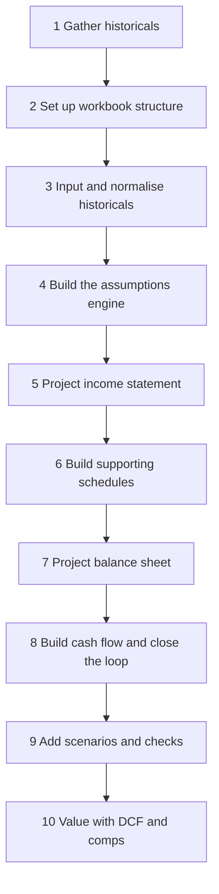
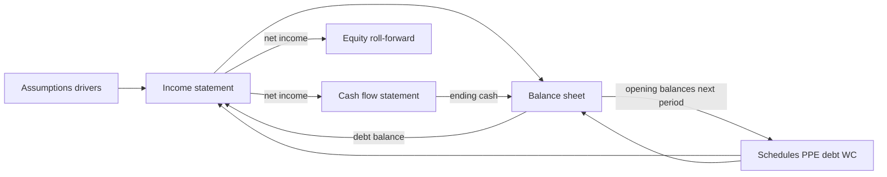
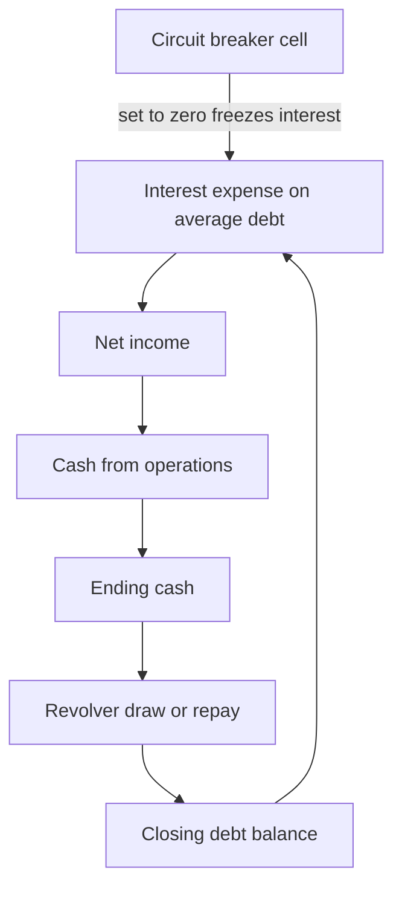
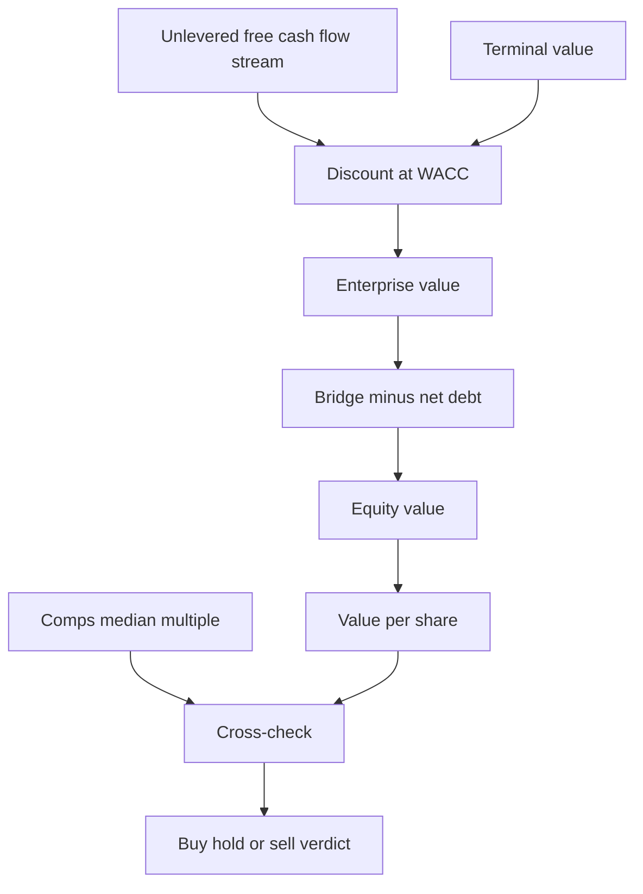
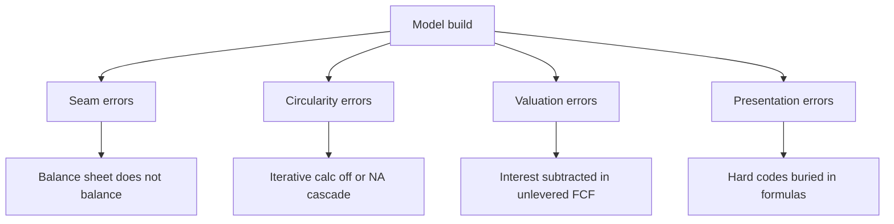

<!-- v2-deep -->

# Chapter 38 — Capstone: Build a Full Model End to End

## 1. The Problem

You have spent thirty-seven chapters learning parts. You can read a 10-K, build a revenue build, wire a debt schedule, plug the cash flow statement into the balance sheet, discount a stream of free cash flows, and screen a set of comparable companies. Each of those is a component. But an employer, an investment committee, or a portfolio reviewer does not hire a component-builder. They hire someone who can be handed a ticker on Monday and produce, by Friday, a defensible three-statement model with a DCF and a comps cross-check that concludes an actual number: *this stock is worth roughly X, versus a market price of Y, therefore I would buy / hold / sell.*

The problem is that assembling the parts into one living workbook is a genuinely different skill from building any single part. Parts fail at their seams. Your revenue build might be immaculate, but if the net income it feeds does not flow correctly into retained earnings, your balance sheet will not balance and every downstream number is garbage. Your DCF might use a flawless WACC, but if the free cash flow it discounts silently double-counts interest, the valuation is wrong by a mile. End-to-end modeling is the discipline of managing *dependencies* — making sure every number has exactly one source, every schedule feeds the right line, and the whole thing recalculates cleanly when you flip a single assumption.

Consider what "fails at the seam" means concretely. Suppose you forecast inventory on the balance sheet directly as a growth rate (inventory up 6% because revenue is up 6%), but on the cash flow statement you compute the change in inventory from a *separate* days-of-inventory calculation. Now the two inventory numbers disagree by, say, 3. That 3 does not vanish — it lands in the balance-sheet check as a non-zero residual, and you spend an hour hunting a "balancing error" that is really a *single-source-of-truth* error: inventory had two sources instead of one. The entire craft of Stage 6 through Stage 8 below is arranged to guarantee that each balance-sheet line and each cash-flow line trace to the *same* schedule cell, so a change can never disagree with a level.

This chapter is the capstone. It gives you a concrete, ordered build sequence you will follow to produce **one complete model for one real listed company** — your portfolio centrepiece. Pick the company now, before you read further. Choose a mature, profitable, single-segment-ish business with clean public filings: a consumer staples company, an industrial, a retailer. Avoid banks, insurers, and early-stage loss-makers for your first full build — their accounting breaks the standard template (banks capitalise deposits and have no "revenue minus COGS" line; insurers run on float and reserve accounting; loss-makers have no meaningful margins or taxes to extrapolate and often no positive terminal cash flow). Write the ticker at the top of a notepad. Everything below is aimed at that ticker.

## 2. The Core Idea

A full model is a **closed system of assumptions and consequences**. You supply a small set of *drivers* — revenue growth, margins, working-capital days, capex, tax rate, a discount rate, an exit multiple — and the model mechanically derives everything else: three linked statements, supporting schedules, a free cash flow stream, and a per-share value. The art is not in the arithmetic (Excel does that). The art is in choosing the build order so that when you sit down to enter an assumption, everything that assumption depends on already exists, and nothing you have not yet built is silently required.

The core idea of the *workflow* is therefore **sequence discipline**. You gather before you assume. You assume before you project. You project the income statement before the balance sheet, because most balance-sheet items are driven off income-statement lines. You build the cash flow statement last among the three because it is derived entirely from the other two. You add scenarios only once the base case is internally consistent, because a broken model with three scenarios is just three broken models. And you value only at the very end, because a DCF is meaningless until the free cash flow it consumes is trustworthy.

There is a second, quieter idea running underneath: **every number has exactly one home.** A driver lives in `Assumptions` and nowhere else. A balance-sheet level lives in its schedule and is *linked* onto `BS`, never re-typed. A cash-flow change is computed as the difference of two schedule cells, never re-derived from a growth rate. If you honour "one home per number," the model is auditable — you can click any forecast cell, press Trace Precedents (Formulas → Trace Precedents, or `Ctrl+[` to jump to the source), and walk a clean chain back to a blue driver. If you violate it, the model may still *look* right and still balance, yet break silently the moment you flip a scenario. Auditability, not appearance, is the mark of a professional model.

*Figure 1 — the ten stages of an end-to-end build, in strict order.*



## 3. Why It Works

This ordering works because it respects the **dependency graph** of a three-statement model. Think of every cell as a node and every formula as an arrow pointing from input to output. A model is buildable in one pass only if you can arrange the nodes so that every arrow points forward — a *topological sort*. The build order above is exactly that sort for the standard corporate model.

Consider why each precedence holds. The income statement can be projected from revenue drivers and margin assumptions alone; it needs almost nothing from the balance sheet except the interest expense that depends on debt balances — and we handle that circularity deliberately at the end. The balance sheet's operating items (receivables, inventory, payables) are driven off income-statement lines (sales, COGS) via ratio assumptions, so the income statement must exist first. Property, plant and equipment needs a capex and depreciation schedule; equity needs net income and dividends; debt needs a repayment schedule — all of which reference numbers computed earlier. The cash flow statement is *pure derivation*: every line is a difference of two balance-sheet dates or a reclassification of an income-statement item. It literally cannot be built until the other two are done, and once it is, the ending cash it produces must equal the cash line on the balance sheet — that identity is your master integrity check.

Why is that identity *guaranteed* to hold when the model is correct, rather than merely likely? Because of double-entry. Every transaction hits two places. When revenue is booked, receivables rise (an asset) and retained earnings rise (equity) by the same amount; the cash flow statement then reverses the non-cash part by subtracting the increase in receivables. So the cash line on the balance sheet, computed as opening cash plus the net change from the cash flow statement, is arithmetically forced to make assets equal liabilities plus equity — *provided every balance-sheet movement has a matching cash-flow line and vice versa.* When the check is non-zero, it is telling you precisely one thing: some balance-sheet account moved without a corresponding cash-flow entry (or one cash-flow entry moved without a balance-sheet home). The check is not decoration; it is a live proof that double-entry is intact.

Scenarios work only on top of a consistent base because a scenario is just a swap of the driver block. If the driver block is the *single* source of every assumption (no hard-coded numbers buried in projection formulas), then flipping one cell — a scenario selector — cleanly re-derives the entire model. If assumptions are scattered, scenarios lie. And valuation works last because a DCF is a function of the free cash flow stream, which is a function of the completed statements; comps are a sanity rail that only means something once you have a base-case value to sanity-check.

## 4. Full Technical Content

This is the heart of the chapter: the actual build, stage by stage, with the formulas and structure you type into Excel.

### Stage 1 — Gather historicals

Pull the last **three to five fiscal years** of the income statement, balance sheet, and cash flow statement from the company's 10-K (US) or annual report (elsewhere), plus the latest 10-Q for a current-quarter read. Get them from the primary filing, not a data aggregator, so you can trust and trace every number. Also collect: the current share price and share count (diluted), the latest debt schedule and interest rates from the notes, the tax footnote, the segment breakdown, and management's forward guidance from the latest earnings call. Save the filings in a folder next to your workbook.

A practical gathering checklist, because missing one of these forces a hard-code later:

- **Income statement**, three to five years, down to diluted EPS and diluted share count.
- **Balance sheet**, three to five years, including the *split* of debt into current and long-term, and the components of "other" lines you intend to hold flat.
- **Cash flow statement**, three to five years — you need the historical capex and D&A actuals to sanity-check your driver ratios.
- **Debt footnote**: each tranche, its coupon, its maturity, and any mandatory amortisation. This becomes the Stage 6 debt schedule.
- **Tax footnote**: the statutory rate, the effective rate, and the reconciliation between them. Forecast off a *normalised* effective rate, not a one-off distorted year.
- **Working-capital detail**: gross receivables, inventory, payables (you will convert these to DSO/DIO/DPO).
- **Share data**: diluted shares outstanding, options/RSUs outstanding, and any announced buyback authorisation.
- **Guidance**: management's stated next-year revenue growth, margin, and capex ranges. These bound your Base case so it is not a fantasy.

### Stage 2 — Set up the workbook structure

Discipline starts with layout. Use separate tabs and a strict colour convention.

| Tab | Purpose |
|---|---|
| `Cover` | Ticker, company, valuation date, your name, key output summary |
| `Assumptions` | Every driver, in one place — the only tab with hard-coded forecast inputs |
| `IS` | Income statement, historical + forecast |
| `BS` | Balance sheet, historical + forecast |
| `CF` | Cash flow statement, historical + forecast |
| `Schedules` | Debt, PP&E/depreciation, working capital, equity roll-forwards |
| `DCF` | Free cash flow, WACC, terminal value, present value |
| `Comps` | Comparable-company multiples table |
| `Output` | Football-field, summary, sensitivity tables |

**Colour convention** (non-negotiable, this is what makes you look professional):

- **Blue font** = hard-coded input (an assumption or a historical actual).
- **Black font** = a formula / calculation.
- **Green font** = a link pulling from another sheet.

Set a consistent time axis across every statement tab: columns for each historical year, then each forecast year, aligned so column H is always FY2026E on every sheet. Use a **five-year explicit forecast** as your default horizon.

**A concrete column map** you can adopt so every tab lines up (this alignment is what lets you copy a formula sideways without breaking links):

| Column | Contents |
|---|---|
| `A` | Blank / indent |
| `B` | Line-item label |
| `C` | Units / notes |
| `D` | FY2023 actual |
| `E` | FY2024 actual |
| `F` | FY2025 actual (last reported) |
| `G` | FY2026E |
| `H` | FY2027E |
| `I` | FY2028E |
| `J` | FY2029E |
| `K` | FY2030E |
| `L` | Terminal / notes |

Freeze panes at `D` (View → Freeze Panes) so labels stay visible as you scroll right. Put a single **valuation-date** cell and a single **first-forecast-year** cell on `Assumptions` and reference them in headers, so re-basing the model to a new year is a one-cell edit rather than a re-type of every column.

### Stage 3 — Input and normalise historicals

Type the historical statements into `IS`, `BS`, `CF` in blue. Then **normalise**: strip one-off items (restructuring charges, litigation settlements, gains on asset sales, impairments) out of your operating baseline so that the margins you extrapolate reflect the ongoing business, not noise. Keep a clearly labelled "reported vs adjusted" reconciliation. Compute the historical ratios you will forecast off: revenue growth %, gross margin, EBITDA margin, SG&A as % of sales, effective tax rate, days sales outstanding (DSO), days inventory outstanding (DIO), days payables outstanding (DPO), capex as % of sales, and depreciation as % of gross PP&E. These historical ratios are the evidence base for every assumption you are about to make.

**A worked normalisation.** Suppose reported FY2025 operating expenses were 250, of which 18 was a one-off restructuring charge and 6 was a litigation settlement. Reported EBIT was 130. Your *adjusted* operating baseline strips the 24 of one-offs:

- Reported EBIT = 130
- Add back restructuring 18 + litigation 6 = 24
- **Adjusted EBIT = 154**, adjusted EBIT margin on 1,000 revenue = 15.4% (versus a reported 13.0%).

Forecast off 15.4%, not 13.0% — otherwise every one of your five forecast years silently carries a restructuring charge the company will never repeat. But keep the reconciliation visible: a reader must be able to see that you *chose* to normalise and by how much. Note the symmetric trap: strip out one-off *losses* and you must also strip out one-off *gains* (a 40 gain on a factory sale), or you flatter the baseline.

**The ratio table you build here** (this is the evidence base, so show the historical trend, not a single year):

| Ratio | Formula | FY2023 | FY2024 | FY2025 | Forecast basis |
|---|---|---|---|---|---|
| Revenue growth | `(Rev_t / Rev_t-1) − 1` | — | 5.0% | 4.5% | Guidance says ~6% |
| Gross margin | `Gross profit / Rev` | 39.2% | 39.6% | 40.0% | Hold 40% |
| SG&A % sales | `SG&A / Rev` | 22.5% | 22.2% | 22.0% | Slight leverage to 21.8% |
| Effective tax | `Tax / Pretax` | 24.5% | 25.1% | 25.0% | Hold 25% |
| DSO | `AR / Rev × 365` | 46 | 45 | 45 | Hold 45 |
| DIO | `Inv / COGS × 365` | 61 | 60 | 60 | Hold 60 |
| DPO | `AP / COGS × 365` | 49 | 50 | 50 | Hold 50 |
| Capex % sales | `Capex / Rev` | 5.2% | 5.0% | 5.0% | Hold 5.0% |

If a ratio is *drifting* (SG&A margin improving each year), decide deliberately whether to extrapolate the trend or hold flat — and write the reason in column `C`. A flat assumption on a clearly improving ratio is a choice you should be able to defend, not an accident.

### Stage 4 — Build the assumptions engine

On `Assumptions`, lay out a driver block. Each driver gets a row with its historical values shown for reference and its forecast values in blue. Ground each forecast number in the history and in guidance — do not invent them.

Core drivers to include:

- Revenue: either a growth-rate driver per year, or a proper build (volume × price, or segment-by-segment). Prefer a build if the company gives segment data.
- Gross margin % (or COGS as % of sales).
- Operating expense lines as % of sales (SG&A, R&D).
- Depreciation & amortisation (from the PP&E schedule, not a naked % — but you may seed it as % of sales initially).
- Capex as % of sales.
- Working capital: DSO, DIO, DPO.
- Tax rate %.
- Interest rate on debt; mandatory debt repayment schedule.
- Dividend payout % or absolute dividend.
- Share count and any buyback assumption.

At the top of `Assumptions`, put a **scenario selector cell** (a data-validation dropdown: Base / Bull / Bear) — you will wire it in Stage 9. For now, build the Base case only.

**Exact layout for the driver block** (put the scenario columns here now so Stage 9 is a wiring job, not a rebuild). Say the Base drivers sit in column `G` onward across the forecast years, and you reserve three *named* columns for the scenario values of each driver:

```
Assumptions!B4  : "Scenario (1=Base 2=Bull 3=Bear)"
Assumptions!C4  : 1                      <- the selector, blue input
Assumptions!B6  : "Revenue growth"
Assumptions!D6:F6 : historical actuals   <- blue, reference only
Assumptions!G6  : =CHOOSE($C$4, G$Base, G$Bull, G$Bear)   <- live driver (wired in Stage 9)
```

Until Stage 9 you can simply type the Base values into `G6:K6`. When you add scenarios you will replace the typed value with the `CHOOSE` that reads from a hidden Base/Bull/Bear block. Name the selector cell (Formulas → Define Name → `ScenarioNum`) so downstream formulas read `CHOOSE(ScenarioNum, ...)` legibly rather than `$C$4`.

**Ground every number.** Beside each driver, in column `C`, write its justification: "Growth 6% = midpoint of guidance 5–7%"; "Gross margin 40% = flat, no announced pricing actions"; "Capex 5% = three-year average." An assumptions block without justifications is where reviewers stop trusting the model. The single most valuable habit here is refusing to type a forecast number until you can say, in one clause, *why that number and not another.*

### Stage 5 — Project the income statement

Working down `IS`, forecast each line from the drivers:

- **Revenue** = prior-year revenue × (1 + growth driver), or the build total.
- **COGS** = revenue × (1 − gross margin), so **Gross profit** = revenue × gross margin.
- **SG&A, R&D** = revenue × their % drivers.
- **EBITDA** = gross profit − operating expenses (before D&A).
- **D&A** = link from the PP&E schedule (Stage 6) — leave a placeholder link now.
- **EBIT** = EBITDA − D&A.
- **Interest expense** = link from the debt schedule (Stage 6). This is the source of the model's circularity; note it and move on.
- **Pre-tax income** = EBIT − net interest.
- **Taxes** = pre-tax income × tax rate.
- **Net income** = pre-tax income − taxes.

Everything here is black (formula) or green (link). No hard-codes.

**Exact cell formulas** (assuming labels in column `B`, first forecast year in `G`, and drivers on `Assumptions`). Revenue on `IS!G10`, gross profit on `G12`, and so on:

```
IS!G10  Revenue        =F10*(1+Assumptions!G6)
IS!G11  COGS           =-G10*(1-Assumptions!G8)          ' G8 = gross margin
IS!G12  Gross profit   =G10+G11                          ' COGS stored negative
IS!G14  SG&A           =-G10*Assumptions!G9
IS!G15  R&D            =-G10*Assumptions!G10
IS!G16  EBITDA         =G12+G14+G15
IS!G17  D&A            =-Schedules!G40                    ' link to PPE schedule, negative
IS!G18  EBIT           =G16+G17
IS!G19  Interest exp   =-Schedules!G60                    ' link to debt schedule, negative
IS!G20  Pre-tax        =G18+G19
IS!G21  Taxes          =-G20*Assumptions!G12             ' G12 = tax rate
IS!G22  Net income     =G20+G21
```

**A sign-convention decision you must make once and hold forever:** store costs as *negative* numbers and sum, or store costs as *positive* and subtract. Either works; mixing them is a classic bug. The formulas above store costs negative and always sum — this makes subtotal rows a simple `SUM` and makes a stray sign error jump out because a subtotal goes the wrong way. Pick one convention on `IS`, `CF`, and every schedule and never deviate.

**Watch the tax line on a pre-tax loss.** `=-G20*taxrate` on a negative pre-tax income produces a *positive* tax (a benefit), which is often not what actually happens (loss carryforwards, valuation allowances). For a mature profitable company this rarely bites, but if any scenario pushes pre-tax negative, wrap the tax in a `MAX(0, ...)` or model an NOL — otherwise a Bear scenario can show a company earning a tax refund it would never receive.

### Stage 6 — Build the supporting schedules

These schedules feed the statements. Build them on `Schedules`.

**PP&E / depreciation roll-forward:**

```
Opening PP&E (net)
  + Capex            (= revenue × capex% driver)
  − Depreciation     (= % of opening gross, or straight-line on a capex vintage)
  = Closing PP&E (net)
```

Link closing PP&E to the balance sheet and depreciation to the income statement.

**Debt schedule:**

```
Opening debt
  − Mandatory repayments   (from schedule)
  +/− Revolver draw/repay   (the cash-flow plug — see Stage 8)
  = Closing debt
Interest expense = average(opening, closing) × interest rate
```

Link closing debt to the balance sheet and interest to the income statement. Using the *average* balance for interest is what creates the deliberate circularity (interest → net income → cash → debt → interest).

**Working capital schedule:**

```
Accounts receivable = DSO / 365 × revenue
Inventory           = DIO / 365 × COGS
Accounts payable    = DPO / 365 × COGS
```

Link each to the balance sheet; their period-over-period changes will feed the cash flow statement.

**Equity roll-forward:**

```
Opening equity
  + Net income
  − Dividends
  − Buybacks
  = Closing equity
```

**Exact PP&E cell formulas** (opening on `Schedules!G36`, first forecast year in `G`):

```
Schedules!G36  Opening net PPE   =F39                    ' prior-year closing
Schedules!G37  Capex             =IS!G10*Assumptions!G14 ' revenue × capex%
Schedules!G38  Depreciation      =G36*Assumptions!G15    ' % of opening net (simple)
Schedules!G39  Closing net PPE   =G36+G37-G38
Schedules!G40  D&A to IS         =G38                    ' IS!G17 links here
```

**Exact debt-schedule cell formulas** (opening on `Schedules!G56`):

```
Schedules!G56  Opening debt      =F59
Schedules!G57  Mandatory amort   =-Assumptions!G18       ' from the amort schedule
Schedules!G58  Revolver movement =CF!G80                 ' the plug from Stage 8
Schedules!G59  Closing debt      =G56+G57+G58
Schedules!G60  Interest expense  =AVERAGE(G56,G59)*Assumptions!G16
```

The `AVERAGE(G56,G59)` is the deliberate circularity: `G59` depends on the revolver, the revolver depends on cash, cash depends on net income, net income depends on `G60` interest, and `G60` depends on `G59`. That loop is intentional and is resolved by iterative calculation in Stage 8. If you prefer to avoid the circularity entirely on a first build, compute interest on the *opening* balance (`=G56*rate`) — it is slightly less precise but removes the loop, and many buy-side shops actually mandate opening-balance interest for exactly this robustness reason.

**A subtle working-capital point:** receivables scale with *revenue*, but inventory and payables scale with *COGS*, not revenue. A common beginner error is to drive all three off revenue, which quietly mis-states inventory and payables by the gross-margin gap and corrupts the cash-flow change. Store COGS as a positive magnitude in a helper cell if your `IS` keeps it negative, so the DIO/DPO formulas read cleanly: `=Assumptions!DIO/365*ABS(IS!G11)`.

### Stage 7 — Project the balance sheet

Assemble `BS` from the schedules. Assets: cash (plug, filled in Stage 8), receivables, inventory, PP&E (from schedule), other assets held flat or as % of sales. Liabilities: payables, debt (from schedule), other liabilities flat. Equity from the equity roll-forward. Every operating line links to a schedule; nothing here is a fresh hard-code except genuinely static items you choose to hold flat.

**Exact balance-sheet links** (first forecast year `G`):

```
BS!G6   Cash              =CF!G90                 ' ending cash from CF, filled Stage 8
BS!G7   Receivables       =Schedules!G50          ' WC schedule AR
BS!G8   Inventory         =Schedules!G51
BS!G9   Other current     =F9*(1+Assumptions!G6)  ' scale with revenue, or hold flat =F9
BS!G10  Net PPE           =Schedules!G39
BS!G11  Other non-current =F11                     ' held flat
BS!G12  Total assets      =SUM(G6:G11)
BS!G16  Payables          =Schedules!G52
BS!G17  Debt              =Schedules!G59
BS!G18  Other liabilities =F18                     ' held flat
BS!G19  Total liabilities =SUM(G16:G18)
BS!G22  Equity            =Schedules!G70           ' equity roll-forward closing
BS!G24  Check             =G12-G19-G22             ' MUST be 0
```

Every green link here points at a schedule, not at a typed number. The only genuine inputs are the "held flat" other lines, and even those should ideally reference the prior period (`=F11`) rather than a re-typed constant, so re-basing the model does not orphan them. The `Check` row on `BS!G24` is the master integrity check and is the reason the whole build order exists.

### Stage 8 — Build the cash flow statement and close the loop

`CF` is pure derivation and it is where the model comes alive.

**Cash from operations** = Net income + D&A − increase in receivables − increase in inventory + increase in payables ± other non-cash items.

**Cash from investing** = −Capex (and any acquisitions/disposals).

**Cash from financing** = − mandatory debt repayments ± revolver movement − dividends − buybacks + equity issuance.

**Net change in cash** = the three sections summed. **Ending cash** = opening cash + net change. Link ending cash back to the cash line on `BS`.

**Exact cash-flow cell formulas** (first forecast year `G`, changes computed as this-period minus prior-period *schedule* cells so a level and its change can never disagree):

```
CF!G70  Net income        =IS!G22
CF!G71  Add D&A           =Schedules!G38
CF!G72  Change in AR      =-(Schedules!G50-Schedules!F50)   ' AR up = cash out
CF!G73  Change in Inv     =-(Schedules!G51-Schedules!F51)
CF!G74  Change in AP      =+(Schedules!G52-Schedules!F52)   ' AP up = cash in
CF!G75  Cash from ops     =SUM(G70:G74)
CF!G77  Capex             =-Schedules!G37
CF!G78  Cash from invest  =G77
CF!G79  Mandatory amort   =Schedules!G57                    ' already negative
CF!G80  Revolver movement =<plug, see below>
CF!G81  Dividends         =-Schedules!G68
CF!G82  Buybacks          =-Schedules!G69
CF!G83  Cash from finance =SUM(G79:G82)
CF!G88  Net change        =G75+G78+G83
CF!G89  Opening cash      =F90
CF!G90  Ending cash       =G89+G88
```

**Close the loop with the revolver (cash sweep).** After the above, compute the minimum cash the company wants to hold. If projected cash falls below it, the revolver *draws* to cover the gap; if there is excess cash above minimum, the revolver *repays*. That revolver movement feeds the debt schedule (Stage 6), which changes interest (Stage 5), which changes net income and cash — a circular reference. Enable **iterative calculation** (File → Options → Formulas → Enable iterative calculation, max 100 iterations, 0.001 change) and, ideally, add a **circuit-breaker switch**: a cell that, when set to 0, forces interest to a fixed number so you can break the loop if it errors.

**The revolver plug formula, spelled out.** Let `MinCash` be the minimum-cash driver and let *cash before revolver* be ending cash computed with zero revolver movement. The revolver draws when cash is short and repays (capped at the outstanding revolver balance) when there is surplus:

```
Cash before revolver = CF!G89 + G75 + G78 + (mandatory amort + dividends + buybacks, i.e. financing ex-revolver)
Revolver draw needed = MAX(0, MinCash − CashBeforeRevolver)
Revolver repay avail = MIN(OpeningRevolver, MAX(0, CashBeforeRevolver − MinCash))
CF!G80 Revolver movement = RevolverDraw − RevolverRepay
```

The `MIN(OpeningRevolver, ...)` cap is essential: without it, a cash-rich year "repays" more revolver than exists and drives the revolver balance negative (a nonsensical negative loan that then earns you phantom interest income). The circuit breaker is a single cell, say `Assumptions!C40 = 1`; wire `Schedules!G60` interest as `=IF(Assumptions!$C$40=1, AVERAGE(G56,G59)*rate, LastKnownInterest)` so that setting it to 0 freezes interest, kills the loop, and lets you locate a genuine error (a `#DIV/0!` or `#REF!`) that iterative calc would otherwise smear across the whole model.

**The master check:** the balance sheet must balance. Create a check row: `Total assets − Total liabilities − Total equity`. It must read 0 in every column, historical and forecast. Put a big red conditional-format flag on it. If it is non-zero, *stop and fix it before doing anything else* — a DCF built on an unbalanced model is worthless. The usual culprit is a cash flow line that does not have an equal-and-opposite balance-sheet counterpart.

**A systematic way to find a balance-sheet break.** When `BS!G24` is, say, +5, do not stare at the whole sheet. Instead: (1) confirm the *prior* column balances — if `F24` is 0 and `G24` is 5, the break was introduced in the first forecast year's *logic*, not the historicals. (2) Check that every asset change and every liability/equity change in the period appears exactly once on `CF`. (3) The fastest diagnostic: build a scratch column that lists, for each balance-sheet line, `(this period − prior period)` and separately the matching `CF` line; the one row where they disagree is your bug. Ninety per cent of the time it is a balance-sheet line you scaled directly (like "other current assets up 6%") whose change you *forgot* to add to the cash flow statement. Either add the CF line, or hold the BS line flat — but the level and the change must share one source.

*Figure 2 — how the three statements link, and why cash flow is derived last.*



*Figure 5 — the circular reference around interest, and how the circuit breaker cuts it.*



### Stage 9 — Add scenarios and integrity checks

Now that the Base case balances, layer scenarios. The clean method: keep three columns of driver values (Base, Bull, Bear) on `Assumptions`, and have the *live* driver row pull from the selected column using `CHOOSE` or `INDEX` on the scenario selector cell:

```
Live driver = CHOOSE($ScenarioNum, BaseValue, BullValue, BearValue)
```

Flip the selector from 1 to 2 to 3 and the entire model — statements, schedules, cash flow, and valuation — recomputes. This only works because every assumption lives in the driver block and nothing is hard-coded downstream. Bull might be higher growth and margin expansion; Bear might be a demand shock and margin compression. Keep them realistic, not theatrical.

**A concrete scenario table** for Meridian Foods (the worked-example company), showing that Bull and Bear are *coherent stories*, not random bumps:

| Driver | Base | Bull | Bear | Story |
|---|---|---|---|---|
| Revenue growth | 6% | 9% | 2% | Bull = share gains + pricing; Bear = demand shock |
| Gross margin | 40% | 41.5% | 37.5% | Margin moves with volume leverage |
| SG&A % sales | 22% | 21% | 23% | Fixed-cost leverage cuts both ways |
| Capex % sales | 5% | 6% | 4% | Bull invests into growth; Bear defends cash |
| Exit EV/EBITDA | 11x | 12.5x | 9x | Multiple expands with the story |

Note the internal consistency: in Bull, higher volume *drives* margin up and lets fixed SG&A leverage down, and you would fund it with higher capex — the drivers move together the way a real business does. A scenario where revenue jumps 9% but margins and multiples do not move is not a bull case, it is an arithmetic accident.

Add a **checks tab or check block**: balance-sheet balances to zero; cash never goes impossibly negative (the revolver should prevent it); retained earnings roll forward correctly; no `#REF!` or `#DIV/0!`; historical ratios and forecast ratios are in a sane range. A model with a visible, green "all checks pass" panel signals competence instantly.

**Build the checks as live formulas**, not eyeballing. On a `Checks` block:

```
Check 1 BS balances     =MAX(ABS(BS!G24:K24))<0.01          ' array/aggregate, TRUE if all balance
Check 2 Cash non-neg    =MIN(BS!G6:K6)>=0                    ' cash never below zero
Check 3 No errors       =NOT(OR(ISERROR(IS!G10:K22)))       ' entered as array
Check 4 RE ties         =ABS(Schedules!K70-(Schedules!G_open+SUM(NI)-SUM(Div)-SUM(BB)))<0.01
Master  All pass        =AND(Check1,Check2,Check3,Check4)
```

Conditional-format the `Master` cell green for `TRUE`, red for `FALSE`. Now flip the scenario selector to 2 and to 3 in turn and watch the master cell — if it stays green in all three scenarios, your scenarios are genuinely wired through the single driver block. If Bear turns it red because cash went negative, that is *information*: it says the Bear case would require the revolver to draw beyond a covenant limit, which is exactly the kind of insight a portfolio reviewer wants surfaced, not hidden.

### Stage 10 — Value with a DCF and comps

**DCF on the `DCF` tab.** Compute **unlevered free cash flow** for each forecast year:

```
UFCF = EBIT × (1 − tax rate)      (i.e. NOPAT)
       + D&A
       − Capex
       − Increase in net working capital
```

Note this is *unlevered* — it deliberately ignores interest and financing, because the discount rate (WACC) already accounts for the cost of debt. Do not subtract interest here; that is the single most common DCF error.

**Exact DCF cell formulas** (first forecast year `G`, discount period counting from the valuation date):

```
DCF!G4   EBIT              =IS!G18
DCF!G5   NOPAT             =G4*(1-Assumptions!G12)
DCF!G6   Add D&A           =Schedules!G38
DCF!G7   Less capex        =-Schedules!G37
DCF!G8   Less change NWC   =-((Schedules!G50+G51-G52)-(Schedules!F50+F51-F52))
DCF!G9   UFCF              =SUM(G5:G8)
DCF!G10  Period            =1                              ' 2,3,4,5 across; or 0.5,1.5 mid-year
DCF!G11  Discount factor   =1/(1+$WACC)^G10
DCF!G12  PV of UFCF        =G9*G11
DCF!L14  Sum PV of UFCF    =SUM(G12:K12)
```

**WACC:**

```
Cost of equity (CAPM) = Rf + β × ERP
WACC = E/V × CostEquity + D/V × CostDebt × (1 − tax)
```

Use a current risk-free rate (10-year government bond), an equity risk premium of ~4.5–5.5%, the company's levered beta, and market-value weights for equity and debt.

**A fully worked WACC.** Say Rf = 4.0%, β = 0.90, ERP = 5.0%, so cost of equity = 4.0% + 0.90 × 5.0% = **8.5%**. Pre-tax cost of debt = 5.0%, tax = 25%, so after-tax cost of debt = 5.0% × 0.75 = **3.75%**. Market-value weights: equity 2,600, debt 400, so E/V = 86.7%, D/V = 13.3%. Then WACC = 0.867 × 8.5% + 0.133 × 3.75% = 7.37% + 0.50% = **7.87%**, round to ~7.9%. Note the weights use *market* value of equity (price × shares), not book — a frequent slip that can move WACC by half a point.

**Terminal value** — compute it both ways and reconcile:

- *Gordon growth:* `TV = UFCF_final × (1 + g) / (WACC − g)`, with `g` a modest perpetual growth rate (roughly long-run GDP/inflation, ~2–3%, never above WACC).
- *Exit multiple:* `TV = final-year EBITDA × a comparable EV/EBITDA multiple.`

If the two are far apart, your assumptions are inconsistent — investigate. Discount each year's UFCF and the terminal value to present value at WACC (use mid-year convention if you want precision), sum to **enterprise value**. Then bridge to equity:

```
Equity value = Enterprise value − net debt − minority interest − preferred + investments
Value per share = Equity value / diluted shares outstanding
```

**A reconciling terminal-value check.** Suppose final-year (FY2030E) UFCF = 118 and FY2030E EBITDA = 245. With WACC 7.9% and g = 2.5%:

- Gordon TV = 118 × 1.025 / (0.079 − 0.025) = 120.95 / 0.054 = **2,240**.
- Implied exit multiple = Gordon TV / final EBITDA = 2,240 / 245 = **9.1x**.
- If comparable companies trade at ~9–10x EV/EBITDA, the Gordon-growth TV is *consistent* with market multiples — good. If Gordon implied 14x while peers trade at 9x, your perpetual growth rate is too high or your WACC too low, and you should reconcile before trusting the answer.

The two methods are two windows on the same quantity; forcing them to agree is one of the strongest self-checks in valuation. Discount that TV back five years: `PV of TV = 2,240 / 1.079^5 = 2,240 / 1.462 = 1,532`.

Compare that per-share value to the market price. Build a **sensitivity table** (a two-variable data table) of value per share across WACC and terminal growth — this shows the reader you know the answer is a range, not a point. Structure it with Data → What-If Analysis → Data Table: put the per-share output formula in the top-left corner cell, WACC values down the left column, growth values across the top row, and set the row input cell to your `g` driver and the column input cell to your WACC driver. A typical table for Meridian:

| Per share | g=2.0% | g=2.5% | g=3.0% |
|---|---|---|---|
| **WACC 7.4%** | 30.1 | 32.0 | 34.4 |
| **WACC 7.9%** | 27.6 | 29.2 | 31.1 |
| **WACC 8.4%** | 25.5 | 26.8 | 28.4 |

The spread from 25.5 to 34.4 is the honest answer: *the low-to-mid 30s, sensitive to discount and growth.* A single point estimate hides this and is less credible, not more.

**Comps on the `Comps` tab.** List 5–10 genuine peers. Pull each one's EV/EBITDA, EV/EBIT, and P/E (forward if possible). Take the median (more robust than the mean). Apply the peer median multiple to *your* company's metric to get an implied value. This is your cross-check: if your DCF says the stock is worth 40 and comps say 25, you owe the reader an explanation (higher growth, better margins, or an aggressive DCF assumption).

**A worked comps cross-check.** Peers trade at a median forward EV/EBITDA of 9.5x. Meridian's FY2026E EBITDA is 190.8 (from the worked example). Implied EV = 9.5 × 190.8 = **1,813**. Bridge to equity: minus net debt 300 = equity 1,513; per share = 1,513 / 100 = **15.1**. That sits *below* the DCF's low-30s range — a large gap that demands explanation. The likely reconciliation: the perpetuity-shortcut DCF earlier overstated value (as flagged), and a proper explicit-period DCF with the sensitivity table above lands in the high-20s to low-30s, still above comps. The remaining gap says either the market is applying a lower multiple than the DCF's implied ~9x terminal (so the market is more cautious on growth than you are), or your growth/margin assumptions are richer than peers'. Naming that tension *is* the analysis; a model that shows DCF and comps agreeing to the decimal is usually a model that was tuned to agree.

**Conclude.** On `Output`, build a **football field** — a horizontal bar chart showing the valuation range from the DCF (across the sensitivity band), the comps range, and any 52-week trading range, with the current price as a vertical line. Then write a one-paragraph verdict: what the business is worth, why, and your buy/hold/sell call with the key risks.

*Figure 3 — the valuation funnel from free cash flow to a per-share call.*



## 5. Worked Example (Walked Through)

Let's walk one year of a simplified build so the mechanics are concrete. Call the company **Meridian Foods**, a listed packaged-goods maker. Latest actual year (FY2025): revenue 1,000, gross margin 40%, SG&A 22% of sales, D&A 40, capex 50, tax rate 25%, debt 400 at 5%, DSO 45, DIO 60, DPO 50, diluted shares 100.

**Assumptions for FY2026E (Base):** revenue growth 6%, gross margin 40%, SG&A 22%, capex 5% of sales, tax 25%, debt interest 5%, working-capital days unchanged.

**Income statement FY2026E:**

- Revenue = 1,000 × 1.06 = **1,060**
- Gross profit = 1,060 × 40% = **424**
- SG&A = 1,060 × 22% = **233.2**
- EBITDA = 424 − 233.2 = **190.8**
- D&A: opening net PP&E say 500, capex = 1,060 × 5% = 53, depreciation ≈ 42 → EBIT = 190.8 − 42 = **148.8**
- Interest = 400 × 5% = **20** (using opening for the hand-calc; the model uses average)
- Pre-tax = 148.8 − 20 = **128.8**
- Tax = 128.8 × 25% = **32.2**
- **Net income = 96.6**

*Self-check:* net margin = 96.6 / 1,060 = 9.1%, plausible for staples. Good.

**Working capital FY2026E:**

- AR = 45/365 × 1,060 = **130.7**
- Inventory = 60/365 × COGS(636) = **104.5**
- AP = 50/365 × 636 = **87.1**

Prior-year (on 1,000 revenue, 600 COGS): AR = 123.3, Inv = 98.6, AP = 82.2. So change in net working capital = (130.7 − 123.3) + (104.5 − 98.6) − (87.1 − 82.2) = 7.4 + 5.9 − 4.9 = **8.4** cash *outflow* (growth ties up cash — makes sense).

**Unlevered FCF FY2026E:**

- NOPAT = EBIT × (1 − tax) = 148.8 × 0.75 = **111.6**
- + D&A 42
- − Capex 53
- − ΔNWC 8.4
- **UFCF = 92.2**

*Self-check:* 111.6 + 42 − 53 − 8.4 = 92.2. Correct.

**Now close the balance sheet for FY2026E** so you can see the master check pass, not just the income statement. Assume opening (FY2025) balances: cash 100, AR 123.3, inventory 98.6, net PP&E 500, other assets 80 (held flat); payables 82.2, debt 400, other liabilities 60 (held flat); equity 359.5 (the plug that makes FY2025 balance: assets 901.9 = liabilities 542.2 + equity 359.7 — carry 359.7). Meridian pays a dividend of 40% of net income and does no buyback.

**Cash flow FY2026E:**

- Net income 96.6 + D&A 42 = 138.6
- − ΔAR 7.4 − ΔInv 5.9 + ΔAP 4.9 = **cash from ops 130.2**
- − Capex 53 = **cash from investing −53**
- Dividends = 40% × 96.6 = 38.6 outflow; no mandatory amort, no revolver needed (cash is ample) → **cash from financing −38.6**
- Net change in cash = 130.2 − 53 − 38.6 = **38.6** → ending cash = 100 + 38.6 = **138.6**

**Balance sheet FY2026E:**

- Assets: cash 138.6 + AR 130.7 + inventory 104.5 + net PP&E 511 (500 + 53 − 42) + other 80 = **964.8**
- Liabilities: payables 87.1 + debt 400 + other 60 = **547.1**
- Equity: opening 359.7 + net income 96.6 − dividends 38.6 = **417.7**
- Check: 964.8 − 547.1 − 417.7 = **0.0** ✓

*The check passes to the rounding.* That single zero is the whole point of Stages 5–8: every number above traces to a driver, double-entry held, and the model is internally consistent. If your own build shows a non-zero here, the change-versus-level diagnostic from Stage 8 will find it — most often a "held flat" line you scaled on the balance sheet but forgot on the cash flow statement.

**A one-line DCF intuition:** if UFCF grows ~5% a year and WACC is 8%, and we simply capitalised this single year as a growing perpetuity, EV ≈ 92.2 × 1.05 / (0.08 − 0.05) = 96.8 / 0.03 = **3,227**. Bridge: minus net debt (400 − say cash 100 = 300) → equity ≈ 2,927 → per share ≈ 2,927 / 100 = **~29.3**. In the real model you would discount five explicit years plus a terminal value rather than capitalise year one, but this shows the machinery producing a per-share number you can compare to the market. (This perpetuity shortcut overstates value versus a proper explicit-period DCF because it front-loads terminal growth — treat it only as a sanity anchor.)

**A "what if" variation — the demand-shock Bear.** Flip growth to 2% and gross margin to 37.5%. Revenue = 1,020; gross profit = 382.5; SG&A at 23% = 234.6; EBITDA = 147.9; less D&A 42 → EBIT 105.9; interest 20; pre-tax 85.9; tax 21.5; net income 64.4 (down a third from Base's 96.6). NOPAT = 105.9 × 0.75 = 79.4; UFCF = 79.4 + 42 − (1,020 × 4%) 40.8 − ΔNWC (smaller, ~2) = **78.6**. The Bear UFCF is 78.6 versus Base 92.2 — a 15% cut in year-one free cash flow from a coherent downturn. Run that through the same terminal machinery with a 9x exit multiple and the Bear per-share lands materially below Base, which is exactly the downside band your football field should show.

The point of the walk-through is not these specific figures — it is that *every number traces to an assumption*, and you can hand-verify any cell. That traceability is what makes a model defensible in front of an investment committee.

## 6. Connections

This chapter is where every earlier chapter converges. The **revenue build** (drivers, segment logic) feeds Stage 5. **Margin and cost analysis** sets the assumptions in Stage 4. The **debt schedule, PP&E schedule, and working-capital chapters** are Stage 6. The **three-statement linking** chapter is Stages 5–8. **Circularity and iterative calculation** is Stage 8. **Scenario and sensitivity** technique is Stage 9. **DCF, WACC, terminal value** and **comparable companies** are Stage 10. The **charting/output** chapter produces the football field.

Looking forward: this completed model is the substrate for everything that comes after — an **LBO** re-caps the same company with debt; an **M&A/accretion-dilution** model bolts a second company onto this one; an **equity research note** wraps a narrative around exactly this DCF-and-comps output. And professionally, this workbook *is* your portfolio: a clean, balancing, scenario-driven, well-formatted three-statement-plus-DCF model for a real company is the single most persuasive artefact you can put in front of a hiring manager for an analyst role.

**Interview angles this model prepares you for.** Interviewers probe end-to-end fluency with a predictable set of questions, and this build gives you first-hand answers:

- *"Walk me through how the three statements connect."* Answer with the flow: net income from the IS feeds both the CF (top line) and retained earnings in equity; D&A and working-capital changes on the CF are add-backs and reversals of IS and BS movements; ending cash on the CF becomes the cash line on the BS; the BS closing balances become next period's opening balances for the schedules. That is Figure 2 recited from muscle memory.
- *"If I increase depreciation by 10, what happens to all three statements?"* EBIT falls 10, so with a 25% tax rate net income falls 7.5; on the CF, net income is down 7.5 but D&A is added back +10, so cash from ops rises +2.5 (the tax shield); on the BS, cash up 2.5, net PP&E down 10, retained earnings down 7.5 — and it still balances (2.5 − 10 = −7.5). Being able to run that live is the single most common technical screen.
- *"Why is your free cash flow unlevered?"* Because WACC already blends the after-tax cost of debt; subtracting interest in the numerator too would count the financing cost twice.
- *"Your DCF says 30 and comps say 15 — which is right?"* Neither alone; the gap is the analysis. Explain the drivers of the difference and where your conviction sits.
- *"What breaks if I flip your scenario selector?"* Nothing should break — that is the test of whether assumptions are truly centralised.

## 7. Traps and Common Errors

*Figure 4 — the four failure zones and where they bite.*



- **Balance sheet doesn't balance.** The number-one failure. Every cash-flow line must have an equal, opposite balance-sheet effect. If assets − liabilities − equity ≠ 0, fix it *before* anything else. Never plug the imbalance into a "miscellaneous" cell — that hides the bug. Use the Stage 8 change-versus-level diagnostic to isolate the single offending row.
- **Double-counting interest in the DCF.** Unlevered FCF must *not* subtract interest; WACC already reflects the cost of debt. Subtracting it too is the most common valuation error and inflates or deflates value badly.
- **Levering FCF but discounting at WACC (or the reverse).** The subtler cousin of the above: if you *do* subtract interest (levered FCF, i.e. free cash flow to equity), you must discount at the *cost of equity* and skip the net-debt bridge, because you are already valuing equity directly. Mixing a levered numerator with a WACC denominator, or an unlevered numerator with a cost-of-equity denominator, is a silent, large error. Pick one consistent framework.
- **Terminal value dominates but is ignored.** TV is often 60–80% of enterprise value. A careless perpetual growth rate (say 4% when GDP is 2%) swings the answer enormously, and `g ≥ WACC` produces a negative or infinite value. Sanity-check TV as a share of EV and reconcile Gordon-growth vs exit-multiple.
- **Circularity blow-ups.** Turning on the interest-on-average-debt loop without enabling iterative calculation throws a circular-reference warning; one stray `#DIV/0!` inside the loop cascades to `#REF!` everywhere. Build the circuit-breaker switch so you can zero the loop and locate the real error.
- **Revolver goes negative or "repays" phantom debt.** Without the `MIN(OpeningRevolver, surplus)` cap, a cash-rich year drives the revolver balance below zero, creating a negative loan that earns phantom interest income and quietly corrupts every downstream year. Cap the repayment.
- **Inventory and payables driven off revenue instead of COGS.** DIO and DPO are COGS-based; driving them off revenue mis-states both levels and their cash-flow changes by the gross-margin gap.
- **Hard-codes buried in projection formulas.** A number typed directly into a forecast cell (e.g. `=D10*1.06` where 1.06 should be a driver) breaks scenarios silently — flipping the scenario selector won't touch it. Keep the colour convention religiously; a blue cell outside `Assumptions` is a red flag.
- **Mismatched sign convention.** Storing some costs negative and others positive turns a subtotal into a coin-flip. Choose costs-negative-and-sum (or its opposite) once and enforce it on every tab.
- **Extrapolating un-normalised history.** Building margins off a year that included a one-off gain or an impairment bakes noise into every forecast year. Normalise first — and remember to strip one-off *gains*, not just losses.
- **Book weights in WACC.** Weight equity at *market* value (price × shares), not book equity. Using book equity for a company trading well above book can understate the equity weight and mis-price WACC by a full point.
- **Forgetting the equity bridge.** Enterprise value is not equity value. Subtract net debt, minorities, and preferred; add non-operating investments. Beginners quote EV per share and are off by the entire debt load.
- **Precision theatre.** Reporting a target price of 29.37 implies false confidence. The honest output is a *range* from the sensitivity table. Show the range.

## 8. First-Principles Recap

Strip everything away and a full model rests on four irreducible truths. **First**, a company is a system of stocks and flows: the income statement and cash flow statement are flows over a period; the balance sheet is a stock at a point; they are bound by identities (net income into retained earnings, cash flows into the cash balance) that *must* hold, which is why the balance check is sacred. **Second**, a forecast is nothing but assumptions plus arithmetic — so the entire value of the model lives in the assumptions, and the arithmetic must merely be trustworthy and traceable. **Third**, value is future cash discounted for time and risk; the DCF is just that sentence in a spreadsheet, and the free cash flow it discounts must be *unlevered* so the risk adjustment (WACC) is not counted twice. **Fourth**, no single valuation is trustworthy alone — a DCF is an opinion about the future, comps are a read of the present market, and their agreement (or explained disagreement) is what earns conviction. Build order is simply the topological sort that lets these truths be assembled in one clean pass.

There is a fifth truth that sits above the other four: **a model is a communication device, not a calculator.** Its job is to let another human trace your logic and either trust or challenge it. Every discipline in this chapter — the colour code, the single home per number, the visible check panel, the sensitivity range instead of a point — exists so that a stranger can pick up the workbook and reconstruct *why* you concluded what you concluded. A model that produces the right number but cannot be audited is worth less than a slightly rougher model that can be, because the auditable one can be trusted, defended, and reused.

## 9. Quick-Reference

**Build order:** Gather → Structure → Input/normalise → Assumptions → Income statement → Schedules → Balance sheet → Cash flow (close loop) → Scenarios/checks → DCF + comps.

**Colour code:** Blue = input, Black = formula, Green = link.

**Key formulas:**

| Item | Formula |
|---|---|
| Revenue | Prior × (1 + growth) or volume × price |
| AR / Inv / AP | DSO/365×Rev, DIO/365×COGS, DPO/365×COGS |
| Interest | Average(open, close) debt × rate |
| Depreciation (simple) | Opening net PP&E × depreciation % |
| Closing PP&E | Opening + Capex − Depreciation |
| Change in NWC | (AR+Inv−AP)_t − (AR+Inv−AP)_t-1 |
| Unlevered FCF | EBIT×(1−tax) + D&A − Capex − ΔNWC |
| Revolver plug | MAX(0, MinCash − CashPreRevolver) − MIN(OpenRevolver, surplus) |
| WACC | E/V×Ke + D/V×Kd×(1−tax) |
| Cost of equity | Rf + β×ERP |
| Discount factor | 1 / (1+WACC)^period |
| TV (Gordon) | FCF×(1+g) / (WACC − g) |
| TV (exit) | Final EBITDA × peer EV/EBITDA |
| Implied exit multiple | Gordon TV / final EBITDA (reconcile to peers) |
| Equity value | EV − net debt − minority − pref + investments |
| Per share | Equity value / diluted shares |

**Master checks:** Assets = Liabilities + Equity (every column); ending cash on CF = cash on BS; no error cells; scenario selector re-derives everything; revolver never negative; TV as % of EV is reasonable; Gordon-implied exit multiple close to peer multiple.

**Deliverables in the workbook:** Cover, Assumptions, IS, BS, CF, Schedules, DCF, Comps, Output (football field + sensitivity table + one-paragraph verdict).

## 10. Do-It-Yourself Exercise

This is the capstone assignment — the model that goes in your portfolio. Do not simulate it in your head; **actually build it in Excel or Sheets.**

1. **Pick your company** (the ticker you wrote down at the start). A mature, profitable, single-segment-ish listed business.
2. **Gather** three-plus years of financials from the primary filings, plus current price, diluted share count, debt notes, tax footnote, and latest guidance.
3. **Set up** the nine tabs and enforce the blue/black/green colour convention from cell one. Adopt the fixed column map (actuals in D–F, forecasts in G–K) so formulas copy sideways cleanly.
4. **Input and normalise** the historicals; compute the historical driver ratios in a visible ratio table with a stated forecast basis per row.
5. **Build the assumptions block** with a Base column, grounded in the history and guidance (a one-clause justification per driver), plus a scenario selector named `ScenarioNum`.
6. **Project the income statement**, then build the **PP&E, debt, working-capital, and equity schedules**, then the **balance sheet**, then the **cash flow statement**. Close the revolver loop, enable iterative calculation, and add the circuit breaker.
7. **Make the balance sheet balance to zero in every column.** Do not proceed until it does. If it does not, run the change-versus-level diagnostic to find the single offending row.
8. **Add Bull and Bear** scenario columns as *coherent stories* (growth, margin, capex, and multiple moving together) and confirm the selector cleanly re-derives the whole model and the check panel stays green in all three.
9. **Build the DCF** (unlevered FCF, WACC computed from CAPM and market-value weights, both terminal-value methods reconciled via the implied exit multiple, PV, EV, equity bridge, per share) and a **WACC × g sensitivity table**.
10. **Build the comps** table, take the peer median, and compute an implied value; write down the reconciliation between DCF and comps.
11. **Produce the output**: a football field, and a one-paragraph written verdict with your buy/hold/sell call and the two or three key risks.

Then do the thing that turns a spreadsheet into a skill: **write a half-page memo defending your target.** State your value, the market price, why they differ, and what would have to be true for you to be wrong. Anticipate the interview follow-ups from Section 6 — walk-me-through-the-links, the depreciation-plus-10 question, the levered-versus-unlevered question — and make sure your own model answers each of them when you click through it. If you can hand that workbook and memo to a stranger and they can trace any number back to a source and follow your logic to the call, you have built a job-ready model — and you have your portfolio centrepiece. Now go build it.
