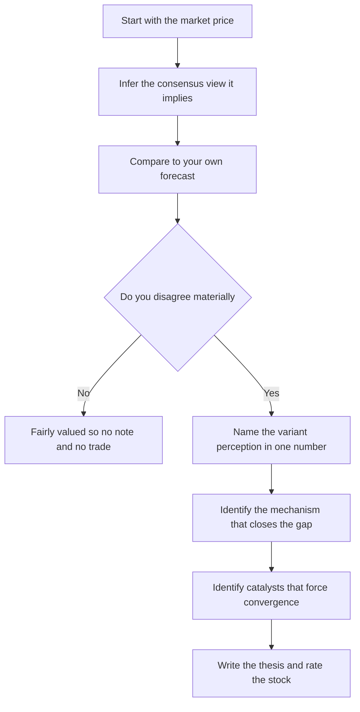
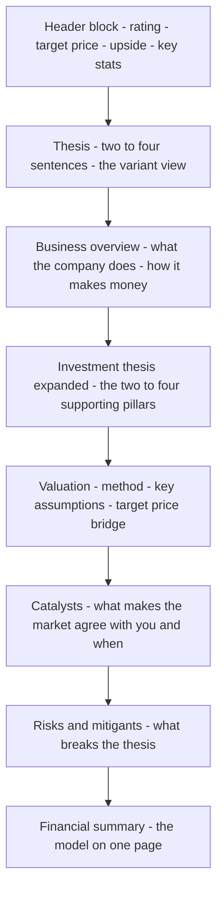
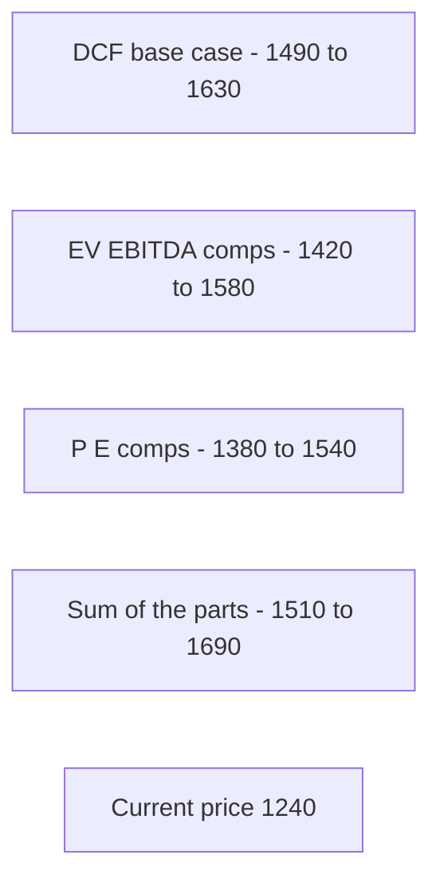
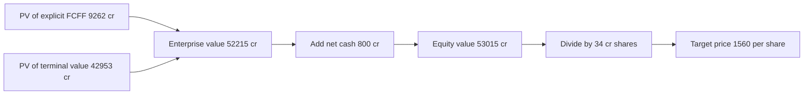
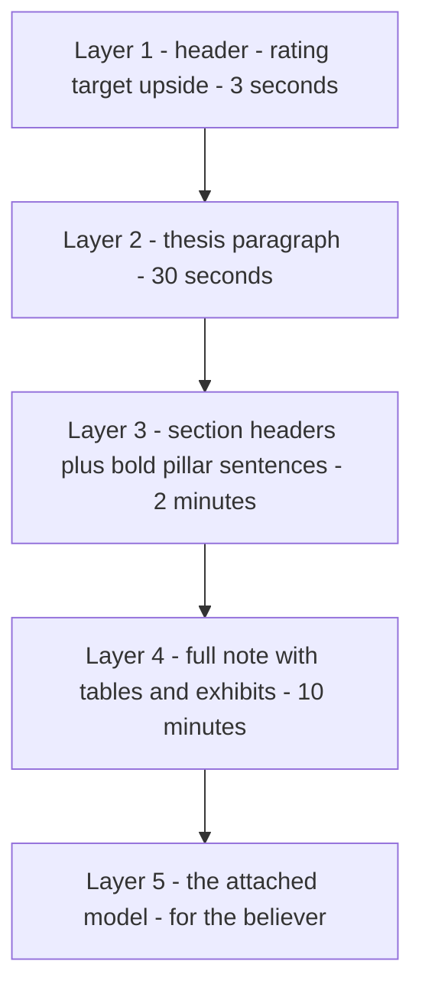

<!-- v2-deep -->

# Chapter 39 — Writing an Equity Research Note

## 1. The Problem

You have spent weeks building a model. You have a three-statement engine that ties out, a DCF that spits out an intrinsic value, a comparables table, and a football-field chart. You are proud of it. So you send the Excel file to a portfolio manager, or you attach it to a job application, and you say: "Here is my valuation of Company X."

Nothing happens.

The reason is brutal but simple: **nobody reads models.** A model is a machine for generating a conclusion. It is not the conclusion, and it is not an argument. A portfolio manager who runs a book of forty names does not have twenty minutes to reverse-engineer your assumptions from cell references. A recruiter screening a hundred candidates does not open a 15-tab workbook to figure out whether you can think. What they read is the **note** — the one-to-ten-page written document that says, in plain English: *I recommend you buy this stock, here is my price target, and here are the three reasons I am right when the market is wrong.*

The equity research note is the deliverable. The model is the appendix.

This trips up almost every self-taught modeler, because building the model *feels* like the hard part, and it is where the technical skill lives. But the market does not pay for spreadsheets. It pays for **differentiated, defensible judgment communicated clearly.** The note is where judgment lives. A mediocre model with a sharp, well-argued note beats a beautiful model with no thesis every single time — because the note proves you understand what the numbers *mean*, and the model only proves you can make numbers.

Put a number on the reader's economics and the discipline becomes obvious. A PM covering forty names, each with a sell-side note plus your unsolicited pitch, has maybe two working hours a day for *reading*. That is roughly three minutes per name if she reads everything, and she does not — she triages. Your note gets, on a good day, a thirty-second audition at the header and thesis. If those thirty seconds do not land a falsifiable, differentiated claim, the file is closed and never reopened. The model you spent three weeks on is never seen. The note is not a summary *of* the work; for most readers it *is* the work.

There is a second, quieter problem. Writing forces honesty. When you have to state your thesis in one sentence — "The market is pricing this as a declining hardware company, but the recurring-services segment is now 40% of gross profit and growing 20% a year, and that mix shift will re-rate the multiple" — you discover whether you actually *have* a thesis, or whether you just have a model that produced a number bigger than the current price. Most beginner valuations, when forced through the discipline of a note, collapse. That is a feature. Better to find out on paper than in an interview.

This chapter teaches you to write the note that turns your model into the thing that actually gets you hired: a portfolio-quality research report.

## 2. The Core Idea

An equity research note is **an argument, not a report.** Its job is to persuade a specific, skeptical, time-poor reader to take an action (buy, sell, or hold) by presenting a *falsifiable thesis* supported by evidence, with the risks honestly stated.

Three ideas do all the work:

**Idea 1 — The note answers "why is the market wrong?"** A stock price already reflects the consensus view. If your model agrees with consensus, you have nothing to say — the stock is fairly valued and there is no trade. A note only exists because you believe something the market does not yet believe, or you weigh known facts differently. Your entire note is the case for that *variant perception* (also called the *differentiated view* or *edge*). Everything that does not support or defend that view is filler.

You can make "variant perception" concrete with one subtraction. Infer what the market's price implies for the key driver, then compare it to your own forecast. Using the worked company in Section 5: the market, extrapolating a commodity mix, is implicitly underwriting roughly a flat-to-low-20s EBITDA margin — call it ~28% blended EBITDA of about **₹5,660 cr in FY3**. Your model, underwriting the specialty mix shift, forecasts a 30% margin and **₹6,060 cr of FY3 EBITDA**. The variant perception is that single ~₹400 cr gap in FY3 EBITDA (and the higher exit multiple it eventually justifies). If you cannot name a number the market has wrong, you do not have a variant perception — you have optimism.

**Idea 2 — Structure serves the skim.** Readers consume a note in layers. First they read the header (rating, price target, upside). If interested, they read the thesis paragraph. If still interested, they read the section headers and pull quotes. Only if they are truly engaged do they read every word. A good note is written so that a reader who stops at *any* layer walks away with the correct takeaway. This is the *inverted pyramid* — conclusion first, support second, detail last — and it is the opposite of how you learned to write essays in school.

**Idea 3 — Every claim ties to evidence, and evidence traces to the model.** "Revenue will grow" is worthless. "Revenue grows 14% in FY2 driven by the two new plants coming online in Q3, adding 30% to capacity, at utilization ramping from 60% to 85% — see the volume build on the revenue tab" is an analyst talking. The note and the model are one organism: the note makes claims, the model substantiates them, and a reader can follow any assertion down to a cell.

Hold those three ideas and the note almost writes itself.

The decision that produces a note is itself a small flowchart — you do not write until you can honestly answer "yes" at the fork.

*Figure 39.4 — You earn the right to write a note only when the price implies a view you can specifically and numerically contradict.*

## 3. Why It Works

**Because decisions are made on conclusions, and conclusions must be defended in words.** An investment committee does not vote on a spreadsheet; it votes on a recommendation. The written thesis is the unit of accountability — six months later, someone will pull up your note and check whether the thesis played out. Numbers alone cannot be held accountable because they carry no claim about *why*; a sentence can.

**Because clarity is a proxy for understanding.** This is the deep reason the note matters for your career. It is genuinely difficult to write a crisp, non-hand-wavy thesis about a business you do not understand. The muddle in the writing exposes the muddle in the thinking. Conversely, a reader who encounters a clean, specific, well-sequenced note infers — correctly — that the author has a clean, specific, well-sequenced mind. That inference is what gets you the interview and the job. The note is a *signal*, and its clarity is the payload.

**Because the market is a Bayesian crowd and you are making a bet against it.** The price is the crowd's prior. A note is your posterior plus the evidence that moved you there. Framing your work as "here is what everyone believes, here is why I disagree, here is what would prove me wrong" mirrors how capital is actually allocated under uncertainty. It also inoculates you against the beginner's disease of confusing a high DCF output with a good idea — the discipline of naming the variant perception forces you to check that you are being paid for a real disagreement and not just optimistic assumptions.

**Because honest risk disclosure builds credibility, which is the analyst's only currency.** Counterintuitively, the risks section makes your buy recommendation *stronger*, not weaker. A note with no risks reads as naive or dishonest; the reader mentally supplies the risks you omitted and trusts you less. A note that names the three things that could break the thesis — and explains why you are taking the bet anyway — reads as the work of someone who has genuinely stress-tested the idea. Credibility compounds: the analyst whose risk sections are honest gets believed on the next call.

**Because the note is the reusable asset.** A model is a one-time artifact tied to one moment's assumptions; the day after you build it, the price has moved and half the inputs are stale. The *argument* — the variant perception, the mechanism, the catalysts — is durable. You update the model quarterly, but you defend the same thesis until a catalyst confirms or breaks it. In interviews this is the whole game: you will not be asked to rebuild the model at the whiteboard, you will be asked "what is your best idea and why is the market wrong," which is your note recited in ninety seconds.

## 4. Full Technical Content

### 4.1 The anatomy of a note

A professional equity research note has a standard skeleton. You will vary emphasis by situation, but the reader expects these components in roughly this order.

*Figure 39.1 — The standard flow of an equity research note, top to bottom.*

Let me take each section and specify what goes in it, how long it should be, and how to write it well.

### 4.2 The header block

This is the top of page one. It is scannable data, not prose. Include:

- **Company name and ticker.**
- **Rating / recommendation** — Buy, Hold, or Sell (some shops use Overweight / Neutral / Underweight, or Outperform / Market-perform / Underperform). Pick one convention and stay consistent.
- **Current price** and the **date** (a note is a snapshot; always date it).
- **12-month price target.**
- **Implied upside / downside** — target price versus current price as a percentage. This is the single number the reader looks at first.
- **A compact key-stats strip:** market cap, enterprise value, shares outstanding, and 2–3 headline multiples (e.g., forward P/E, EV/EBITDA), plus maybe dividend yield.

Format this as a small table or a tight header band. It should be readable in three seconds.

| Field | Example |
|---|---|
| Rating | **BUY** |
| Current price | ₹1,240 |
| 12-month target | ₹1,560 |
| Implied upside | **+26%** |
| Market cap | ₹42,000 cr |
| EV / EBITDA (FY2) | 11.2x |
| Forward P/E (FY2) | 18.5x |

Every one of these fields is a formula, not a typed number, so that when you update the model the header self-updates. In practice:

- **Implied upside** `=TargetPrice/CurrentPrice-1`, formatted as a percentage. For ₹1,560 over ₹1,240 that is `=1560/1240-1` = 0.2581 → **+26%**.
- **Market cap** `=CurrentPrice*SharesOutstanding`.
- **Enterprise value** `=MarketCap+TotalDebt-CashAndEquivalents` (subtract net cash; add net debt). A net-cash company has EV *below* market cap.
- **EV/EBITDA** `=EV/ForecastEBITDA`; **Forward P/E** `=CurrentPrice/ForecastEPS`.

A trap lives here: never hard-code the current price. Stamp it once in a labelled input cell dated to the day you wrote the note, and reference that cell everywhere, so a reader six weeks later knows the upside was struck against ₹1,240, not against wherever the stock trades when they open the file.

### 4.3 The thesis (the most important 60 words in the note)

The thesis is a **two-to-four-sentence** statement of your variant view and why it will pay off. If a reader reads only this, they should understand what you believe, why the market disagrees, and what the trade is.

A strong thesis has a repeatable shape:

> **[What the market believes / the current mispricing]. [What you believe instead, with the key evidence]. [Why this closes — the mechanism and roughly the timeframe]. [Therefore the rating and the upside].**

Worked example of a good thesis:

> *"The market values Company X as a cyclical commodity chemicals producer at 6x EV/EBITDA, extrapolating the current down-cycle. We think this misses a structural shift: the specialty segment, now 45% of EBITDA versus 20% three years ago, carries 30%+ margins and contracted revenue, and should command a materially higher multiple as it crosses 60% of EBITDA by FY3. As two capacity expansions ramp and the specialty mix becomes undeniable in quarterly prints, we expect a re-rating toward 9x. We initiate at BUY with a ₹1,560 target, 26% upside."*

Notice what that thesis does: it names the consensus, states the disagreement with a *number*, gives a *mechanism* (mix shift crossing a threshold), gives a rough *catalyst path* (capacity ramp showing in prints), and lands on the rating and upside. It is falsifiable — if specialty stalls at 45%, you are wrong, and you have told the reader exactly what to watch.

It helps to see a **bad** thesis next to the good one, because the failure modes are stereotyped:

> *Bad: "Company X is a well-positioned leader in specialty chemicals with strong fundamentals and multiple growth levers. Our DCF suggests the stock is undervalued and we see meaningful upside. We rate it Buy."*

Every clause is unfalsifiable. "Well-positioned," "strong fundamentals," "multiple growth levers," "meaningful upside" — none names a number, a mechanism, or a way to be wrong. It could be pasted onto any company in the sector without changing a word. That interchangeability is the tell. Run the test: *could a reader, from this thesis alone, tell you what to watch next quarter to know if you are right?* For the good thesis, yes (specialty share of EBITDA in the print). For the bad one, nothing.

**How to write it:** write the thesis *last*, after everything else, then move it to the top. You cannot compress an argument you have not yet made. Draft it, then cut every word that is not load-bearing. Ban vague verbs ("should benefit," "is well-positioned," "has strong fundamentals") — they are the sound of an analyst with no thesis.

### 4.4 Business overview

Two or three tight paragraphs (or a paragraph plus a revenue-mix table). The goal is *not* to prove you read the annual report. It is to give the reader exactly the business context they need to evaluate your thesis — no more.

Cover:
- **What the company sells and to whom** (products, end markets, geography).
- **How it makes money** — the revenue model and the unit economics. Where do gross margins come from? What drives volume versus price?
- **The segment breakdown** — usually a small table of revenue and profit by segment, because your thesis almost always lives in one segment.
- **Position in the value chain / competitive structure** — enough to establish moat or the lack of one.

A pointed segment table earns its place because it front-loads the mechanism of the thesis:

| Segment | Revenue mix (current) | EBITDA margin | Role in thesis |
|---|---|---|---|
| Specialty | 45% | ~40% | The re-rating engine |
| Commodity | 55% | ~18% | Cyclical anchor being de-weighted |

Discipline test: every fact in the overview should be something the reader will *need* later to follow your valuation or thesis. If a fact does not get used downstream, cut it. Beginners bloat this section into a Wikipedia dump; professionals keep it lean and pointed. A useful rule: if you can delete a sentence and no number in your valuation changes meaning, delete it.

### 4.5 The expanded thesis — the pillars

This is the body. Take the one-paragraph thesis and expand it into **two to four numbered pillars**, each a sub-argument with evidence. Structure each pillar the same way:

1. **Claim** (a bolded topic sentence — the pillar in one line).
2. **Evidence** — the data, the model output, the industry fact that supports it.
3. **Why the market is missing it** — the reason this is not already priced in.
4. **Quantified impact** — what it does to revenue, margin, or the multiple, tied to the model.

For example, Pillar 1 might be "Mix shift to specialty drives 400bps of blended margin expansion by FY3," followed by the segment margin bridge, the observation that sell-side models still assume flat mix, and the EBITDA delta that flows from it.

Three pillars is the sweet spot. One pillar is fragile; five means you have not prioritized. Each pillar should be independently interesting — if two pillars are really the same idea, merge them.

### 4.6 Valuation

Here the model surfaces. But the reader does not want the model — they want the **logic and the key drivers.** Structure it as:

- **State the method and why.** DCF for a business whose value is long-dated cash flows; multiples for a business best understood relative to peers; sum-of-the-parts when segments deserve different multiples; usually a *primary* method cross-checked by a secondary one.
- **Show the key assumptions in a small table** — the 5-to-8 numbers that actually move the answer: revenue CAGR, terminal margin, WACC, terminal growth (for a DCF); or the target multiple and the metric it is applied to (for comps). Do not paste the whole model.
- **Bridge to the target price.** Walk from method to per-share value: e.g., enterprise value → less net debt → equity value → ÷ shares → target price. One clean sequence.
- **Show sensitivity.** A small 2-way data table (e.g., WACC vs terminal growth) or a football-field chart of the valuation range across methods. This signals you know the answer is a *range*, not a false-precision point.

| DCF driver | Assumption |
|---|---|
| Revenue CAGR FY0–FY5 | 13% |
| Terminal EBIT margin | 22% |
| WACC | 11.5% |
| Terminal growth | 5.0% |
| Implied EV/EBITDA (FY2) exit | 10.8x |
| Target equity value / share | ₹1,560 |

Then a football field is the ideal single visual:

*Figure 39.2 — A football field summarizing the valuation range from each method against the current price. In Excel this is built as a stacked-bar chart with the lower bound made invisible.*

**How to build the football field, cell by cell.** Lay out one row per method with two helper columns:

| Method | Low | High | Base = Low | Span = High − Low |
|---|---|---|---|---|
| DCF base | 1440 | 1670 | 1440 | 230 |
| EV/EBITDA 8–10x | 1423 | 1705 | 1423 | 282 |
| P/E comps | 1380 | 1540 | 1380 | 160 |
| Sum-of-the-parts | 1510 | 1690 | 1510 | 180 |

Then: select the **Base** and **Span** columns → Insert → 2-D Stacked Bar. Click the **Base** series → Format → Fill: No fill (this is the invisible pedestal). The **Span** series now floats between each method's low and high. Add a vertical line for the current price ₹1,240 either as an XY-scatter error-bar series or a shape. Label the axis in ₹. The `Span` column is `=High-Low`; the `Base` column is simply `=Low`. That is the whole trick — no add-in required.

**Reconcile the number to the thesis.** The single most important sentence in the valuation section: explain *why* your fair value is above the price in terms of the thesis, not the mechanics. "Our target is 26% above the market because we underwrite the specialty mix shift the sell-side has not yet built in — that mix is worth roughly ₹280 of the ₹320 gap." If you cannot decompose the gap into thesis-driven pieces, your valuation is just optimistic assumptions, and a good reader will smell it.

A clean way to *show* the reconciliation is a value bridge from the DCF plumbing to the per-share target — this is the exhibit a good PM checks first, because it exposes how much of your value is terminal (and therefore assumption-heavy):

*Figure 39.5 — The target-price bridge for the worked company in Section 5. Note that PV of terminal value is about 82% of enterprise value — a fact you should disclose, because it tells the reader most of your target rests on year-5-and-beyond assumptions.*

### 4.7 Catalysts

A cheap stock can stay cheap forever. **Catalysts** are the events that force the market to converge on your view, with rough timing. List 2–4, each with a *what* and a *when*:

- Quarterly results showing the specialty mix crossing 50% (next 2–3 prints).
- Commissioning of Plant 2 (expected Q3 FY2).
- A potential margin-guidance raise at the FY-end analyst day.
- Index inclusion or a debt-reduction milestone that de-risks the equity.

Without catalysts, even a correct thesis may not pay off within your holding period. Naming them shows you think about *time*, not just *value*. Be honest about timing uncertainty — "over the next 12–18 months" is fine; false precision is not. A catalyst without an approximate date is not a catalyst; it is a hope. The test: could you diarise it? "Q2 FY2 results, expected late-October" passes. "Eventually the market will notice" fails.

### 4.8 Risks and mitigants

For each of the 3–4 things that could break the thesis, state the **risk**, its **potential impact**, and your **mitigant or why you accept it.** Cover the real ones:

- **Thesis risk** — the specific way your variant view is wrong (specialty mix stalls).
- **Operational / execution risk** — the plant is delayed, cost overruns.
- **Market / macro risk** — commodity input cost spike, demand cyclicality, FX.
- **Valuation risk** — the multiple re-rates *down* instead of up.

The format that reads as senior:

> *"**Risk: specialty ramp slower than modeled.** If the mix plateaus at 45%, our margin bridge loses ~250bps and the target falls to ~₹1,340 (still +8%). Mitigant: contracted volumes for Plant 2 are already 60% booked, which underpins the near-term ramp."*

Notice it *quantifies* the downside (a bear-case price) and offers evidence for why you are still comfortable. That is the difference between a risks section and a disclaimer.

The quantified bear-case price is not rhetorical decoration — you compute it by re-running the model with the thesis switched off. In Section 5 we do exactly this: a mix that plateaus at the 28% level lands the shares near **₹1,320**, and a mix that never shifts at all (flat 26% margin) lands near **₹1,184**, roughly 5% below the current price. Reporting that downside honestly is what lets the reader trust the +26% upside. An analyst who can tell you their downside to the rupee has done the work; one who waves at "some downside risk" has not.

### 4.9 Financial summary — the model on one page

Close with a compact summary of the model: a small table with 3–5 historical years and 3–5 forecast years across the lines that matter — revenue, EBITDA, EBIT, net income, EPS, plus 2–3 key ratios and free cash flow. This is the model distilled to what a reader needs to sanity-check your story. Keep it to one page/one table. The full workbook is the attachment, not this.

Here is what that one table looks like for the Section 5 company (₹ cr except per-share and ratios):

| Line | FY1 | FY2 | FY3 | FY4 | FY5 |
|---|---|---|---|---|---|
| Revenue | 15,820 | 17,877 | 20,201 | 22,827 | 25,794 |
| EBITDA | 4,113 | 5,005 | 6,060 | 7,076 | 8,254 |
| EBITDA margin | 26.0% | 28.0% | 30.0% | 31.0% | 32.0% |
| EBIT | 3,164 | 3,933 | 4,848 | 5,707 | 6,706 |
| FCFF | 649 | 1,514 | 3,200 | 3,856 | 4,582 |
| Revenue growth | 13% | 13% | 13% | 13% | 13% |

A reader can eyeball this and immediately locate your thesis: EBITDA margin climbing 26% → 32% is the mix shift, and FCFF turning strongly positive from FY3 (as expansion capex rolls off) is the cash story. Every number here traces to a line in the full model.

### 4.10 The layering / skim structure

*Figure 39.3 — A note is written so a reader who stops at any layer still leaves with the correct takeaway.*

Design your note so each layer is self-sufficient. Bold the pillar topic sentences so the Layer-3 skimmer reads a coherent argument from headers alone. This is craft, and it is learnable.

### 4.11 Length, formatting, and mechanics

- **Length:** an initiation note runs 8–15 pages; an update note 1–3. For a portfolio deliverable, target a tight **4–8 pages** including exhibits. Longer is not better — density is.
- **Voice:** present tense, active voice, first-person plural ("we expect"). Confident but not promotional.
- **Numbers:** consistent units and rounding (do not mix ₹ cr and ₹ mn). Every table has a title, units, and a source line.
- **Exhibits:** every chart earns its place by making an argument. Label axes. A chart nobody can read in five seconds is a failed chart.
- **Disclosure:** a real note carries a disclosures/disclaimer footer (rating definitions, that it is not investment advice, any position). For a portfolio piece, include a short disclaimer — it signals you know the professional norm.

## 5. Worked Example — From Model Output to a Written Note

Let me walk the transformation for a fictional company, **Bharat Specialty Chemicals (BSCL)**, so you can see the model-to-note pipeline end to end. This time I will show the full, reconciling arithmetic, because the discipline of the note is inseparable from the discipline of the numbers behind it. Every figure below ties out and is reproducible in Excel.

### 5.1 The consistent assumption set

To make the example fully reproducible, here is the complete parameter set. Nothing else is needed to regenerate every number in this section.

| Input | Value |
|---|---|
| FY0 (last actual) revenue | ₹14,000 cr |
| Revenue CAGR FY0–FY5 | 13% |
| EBITDA margin path FY1→FY5 | 26% / 28% / 30% / 31% / 32% |
| D&A | 6% of revenue |
| Tax rate | 25% |
| Capex FY1→FY5 (₹ cr) | 2,400 / 2,200 / 1,300 / 1,400 / 1,550 |
| Change in net working capital | 15% of revenue increase |
| WACC | 11.5% |
| Terminal growth g | 5.0% |
| Net cash | ₹800 cr |
| Shares outstanding | 34 cr |
| Current price | ₹1,240 |

A note on the segment economics that drive the margin path, because it reconciles two figures beginners routinely confuse. The specialty segment runs a **~31% EBIT margin** and the commodity segment **~12%** (this is how the note describes segment *profitability*). Adding back D&A of roughly 9% and 6% of segment revenue respectively gives **specialty EBITDA margin ~40%** and **commodity EBITDA margin ~18%**. Those EBITDA margins are what the blended margin path is built from — blended EBITDA margin `= 18% + 22% × specialty_revenue_share`. So the "26% → 32%" blended path corresponds to specialty rising from ~36% of revenue in FY1 to ~64% by FY5.

This also resolves the "45%" that appears twice in the thesis with different meanings. Specialty is roughly **45% of EBITDA today** but only about **27% of revenue** — because at a 40% margin versus 18%, a segment punches roughly 2.2x above its revenue weight in the EBITDA line. Always state whether a mix figure is measured on revenue or on EBITDA; they are not the same number, and conflating them is a classic tell of a shallow model.

### 5.2 The DCF build, line by line

The free cash flow to firm (FCFF) build. All figures ₹ cr; FCFF = NOPAT + D&A − Capex − ΔNWC, where NOPAT = EBIT × (1 − 25%).

| Line | FY1 | FY2 | FY3 | FY4 | FY5 |
|---|---|---|---|---|---|
| Revenue | 15,820.0 | 17,876.6 | 20,200.6 | 22,826.6 | 25,794.1 |
| EBITDA | 4,113.2 | 5,005.4 | 6,060.2 | 7,076.3 | 8,254.1 |
| less D&A (6% rev) | 949.2 | 1,072.6 | 1,212.0 | 1,369.6 | 1,547.7 |
| EBIT | 3,164.0 | 3,932.8 | 4,848.2 | 5,706.7 | 6,706.4 |
| NOPAT (×0.75) | 2,373.0 | 2,949.6 | 3,636.2 | 4,280.0 | 5,029.8 |
| plus D&A | 949.2 | 1,072.6 | 1,212.0 | 1,369.6 | 1,547.7 |
| less Capex | 2,400.0 | 2,200.0 | 1,300.0 | 1,400.0 | 1,550.0 |
| less ΔNWC | 273.0 | 308.5 | 348.6 | 393.9 | 445.1 |
| **FCFF** | **649.2** | **1,513.7** | **3,199.5** | **3,855.7** | **4,582.4** |
| Discount factor @ 11.5% | 0.8969 | 0.8044 | 0.7214 | 0.6470 | 0.5803 |
| PV of FCFF | 582.3 | 1,217.6 | 2,308.2 | 2,494.6 | 2,659.0 |

**Exact Excel formulas.** With WACC in `$B$2` and the year index (1..5) in row `$C$4:$G$4`:

- Revenue FY1 `=14000*1.13`, then drag `=PrevRev*1.13`.
- EBITDA `=Revenue*MarginPct`.
- ΔNWC FY1 `=(RevFY1-14000)*0.15`, then `=(RevThis-RevPrev)*0.15`.
- FCFF `=NOPAT+DandA-Capex-dNWC`.
- Discount factor `=1/(1+$B$2)^C$4`.
- PV of FCFF `=FCFF*DiscountFactor`, or discount the whole strip at once with `=NPV($B$2,C_FCFF:G_FCFF)` = **₹9,262 cr**.

**Terminal value (Gordon growth).** `=FCFF_FY5*(1+g)/(WACC-g)` = `=4582.4*1.05/(0.115-0.05)` = **₹74,023 cr**, discounted back five years: `=74023*0.5803` = **₹42,953 cr**. As a sanity check, the *implied exit multiple* is `TV / FY5 EBITDA` = 74,023 / 8,254.1 = **8.97x ≈ 9.0x** — which is exactly the "re-rate toward 9x" the thesis claims, so the DCF and the multiple story are internally consistent rather than two unrelated guesses.

### 5.3 From enterprise value to target price

| Bridge step | ₹ cr | Formula |
|---|---|---|
| PV of explicit FCFF (FY1–FY5) | 9,262 | `=NPV(WACC, FCFF strip)` |
| PV of terminal value | 42,953 | `=TV/(1+WACC)^5` |
| **Enterprise value** | **52,215** | `=sum of the two` |
| plus net cash | 800 | input |
| **Equity value** | **53,015** | `=EV+NetCash` |
| ÷ shares (34 cr) | | |
| **Target price** | **₹1,559 ≈ ₹1,560** | `=Equity/Shares` |
| Implied upside vs ₹1,240 | **+26%** | `=1560/1240-1` |

The PV of terminal value is 42,953 / 52,215 = **82% of EV**. Disclose this. It is not a flaw — most going-concern DCFs are terminal-heavy — but a reader who sees 82% knows to interrogate your WACC and g harder than your FY3 capex, and hiding it reads as either naivety or evasion.

### 5.4 Sensitivity — because a target is a range

Never present ₹1,560 as a point. Build a two-way data table over the two inputs that move it most, WACC and terminal growth. In Excel: put the target-price formula in the top-left corner cell of a grid, list WACC values down the left column and g values across the top row, select the whole block, then **Data → What-If Analysis → Data Table**, with **Row input cell = the g cell** and **Column input cell = the WACC cell**. Result (₹/share):

| WACC ↓ / g → | 4.0% | 4.5% | 5.0% | 5.5% | 6.0% |
|---|---|---|---|---|---|
| 10.5% | 1,614 | 1,730 | 1,867 | 2,031 | 2,232 |
| 11.0% | 1,489 | 1,586 | 1,700 | 1,835 | 1,996 |
| 11.5% | 1,380 | 1,463 | **1,559** | 1,671 | 1,803 |
| 12.0% | 1,286 | 1,357 | 1,439 | 1,533 | 1,643 |
| 12.5% | 1,202 | 1,264 | 1,334 | 1,415 | 1,507 |

The base case (11.5%, 5.0%) sits at the highlighted ₹1,559. Read what this teaches: half a point of WACC is worth roughly ₹110–140/share, and half a point of g roughly ₹80–110. The stock is above the current ₹1,240 across almost the entire plausible grid — only the pessimistic corner (12.5% WACC, 4.0% g → ₹1,202) dips below it. That robustness is a stronger argument for the trade than the point estimate ever could be.

### 5.5 The re-rating is the whole thesis — an exit-multiple cross-check

A second, complementary sensitivity holds the cash flows fixed and flexes only the terminal *exit multiple* applied to FY5 EBITDA. This isolates exactly how much of the intrinsic value is the re-rating you are underwriting.

| Terminal EV/EBITDA | Target price | Upside vs ₹1,240 |
|---|---|---|
| 6x (pure commodity) | ₹1,141 | −8% |
| 7x | ₹1,282 | +3% |
| 8x | ₹1,423 | +15% |
| 9x (base, ≈ Gordon) | ₹1,564 | +26% |
| 10x | ₹1,705 | +38% |
| 11x (specialty peer) | ₹1,846 | +49% |

Each turn of the multiple is worth about **₹141/share (~11%)**. The reading is stark and honest: at a commodity 6x the shares are worth *less than today* (₹1,141, −8%); the entire bull case is the market moving from a commodity multiple toward the ~9x the cash flows deserve as the specialty mix becomes undeniable. That single table is more persuasive than paragraphs of adjectives, because it tells the reader precisely what they are betting on and what it is worth if they are wrong.

### 5.6 The pillars, tied to the numbers

Now assemble the note from the reconciled model.

**Step 1 — Find the variant perception.** The stock trades as a commodity name. My model implies the blended business earns specialty-like margins by FY3: FY3 EBITDA of **₹6,060 cr** at a 30% margin, versus a consensus that holds mix roughly flat and lands nearer **₹5,660 cr** (28%) or lower. That ~₹400 cr FY3 EBITDA gap — and the exit multiple it eventually justifies — is my note.

**Step 2 — The thesis (drafted last, placed first).**

> *"BSCL trades at a commodity EV/EBITDA, priced as a cyclical producer. We believe this ignores a structural mix shift: specialty, roughly 45% of EBITDA today at ~40% EBITDA margins, should drive blended margins from 26% to 32% as two contracted-volume expansions ramp — and warrant a re-rating toward 9x. We initiate at BUY, target ₹1,560, +26%."*

**Step 3 — The three pillars.**

1. **Mix shift drives ~400bps of blended margin expansion, FY1 to FY3.** *Evidence:* segment EBITDA margins of ~40% (specialty) versus ~18% (commodity); blended margin `= 18% + 22% × specialty_share`, so specialty rising from 36% of revenue (FY1) to 55% (FY3) lifts blended EBITDA margin from 26% to 30% — a clean +400bps from mix alone. *Market miss:* sell-side holds mix roughly flat. *Quantified impact:* +400bps on FY3 revenue of ₹20,201 cr ≈ **₹808 cr of incremental EBITDA** versus a flat-mix counterfactual.

   | Margin bridge FY1 → FY3 | Blended EBITDA margin |
   |---|---|
   | FY1 starting point (specialty 36% of rev) | 26.0% |
   | Effect of mix to specialty 55% of rev | +4.0% |
   | **FY3 blended margin** | **30.0%** |

2. **Contracted volumes de-risk the ramp.** *Evidence:* Plant 2 is ~60% pre-booked. *Market miss:* treats the expansion as speculative merchant capacity. *Quantified impact:* underpins the 13% revenue CAGR with low demand risk, which is why the FCFF turns strongly positive from FY3 as expansion capex rolls off (capex ₹2,200 cr → ₹1,300 cr).

3. **Re-rating as the mix becomes undeniable.** *Evidence:* the DCF's own implied exit multiple is 9.0x, and specialty peers trade at 10–12x, versus the commodity 6x embedded in the price. *Market miss:* multiple still anchored to commodity comps. *Quantified impact:* from the exit-multiple table, the move from 6x to 9x is worth about **₹420/share** — essentially the entire ₹320 upside plus the offset for the modest downside a pure-commodity read implies.

**Step 4 — Valuation.** Primary: DCF, ₹1,560 (82% terminal, disclosed). Cross-checks: 9x FY5 EBITDA exit ≈ ₹1,564; sensitivity range ₹1,200–₹2,230 across WACC and g, above spot across nearly the whole grid.

**Step 5 — Catalysts and risks.**

| Scenario | What drives it | Target | vs ₹1,240 |
|---|---|---|---|
| Bull / base (mix to 32%) | Full specialty ramp | ₹1,560 | +26% |
| Plateau (mix stalls at 28% margin) | Ramp slower than modeled | ₹1,320 | +6% |
| No shift (flat 26% margin) | Thesis wrong, commodity forever | ₹1,184 | −5% |

*Catalysts:* specialty mix crossing 50% in the next two prints; Plant 2 commissioning; analyst-day margin guidance. *Risks:* the plateau and no-shift scenarios above (quantified), an input-cost spike that compresses even specialty, and project delay — each with a mitigant (e.g., 60% pre-booked volumes underpin the near-term ramp).

Note how the risks section is now simply the same model re-run with the thesis dialled down: the bear case is not a vague worry, it is ₹1,184, computed by holding the EBITDA margin flat at 26%. That is scenario analysis in prose, and it is far more credible than "there is downside risk."

**Step 6 — Financial summary table** (Section 4.9), then attach the model.

Now compare the two ways of delivering the same work:

| Delivering the model alone | Delivering the note |
|---|---|
| "Here is my DCF, fair value ₹1,560." | "The market misprices the mix shift; here are three pillars, a reconciled valuation, catalysts, and quantified risks." |
| Reader must reconstruct the argument | Reader gets the argument in 30 seconds |
| Signals: can operate Excel | Signals: can think like an analyst |
| Ends in the trash | Ends in an interview |

Same model. Completely different outcome. The note is where the value is captured.

## 6. Connections

- **To the three-statement model and DCF (earlier chapters):** the note is the *presentation layer* over everything you built. The financial summary is the model compressed; the valuation section is the DCF explained; the thesis is your driver assumptions given a *reason*. The FCFF build in Section 5.2 is the DCF chapter's mechanics; the note is what makes them mean something.
- **To sensitivity and scenario analysis:** the risks section is scenario analysis in prose. Your bear case *is* a catalyst-off, mix-plateau scenario — you already have the number (₹1,184 flat-margin, ₹1,320 plateau); the note just names it. The two-way data table and the exit-multiple table are the same discipline made visible.
- **To comparable-company analysis:** the "why the multiple re-rates" pillar is your comps work made into an argument. The football field is your triangulation across methods, and the exit-multiple cross-check is comps injected into the DCF's terminal value.
- **To the mid-year convention and DCF conventions:** a valuation is more sensitive to *convention* than beginners expect. Re-run the Section 5 DCF discounting at year `n − 0.5` (cash arrives mid-period) and the target rises from ₹1,560 to about **₹1,645**, +5.5%, purely from multiplying every present value by √(1 + WACC). A good note states its convention; a reader who assumes end-of-year and you assumed mid-year will think you are ₹85 too optimistic.
- **To the interview and the job (the capstone purpose):** this note plus the model is your portfolio deliverable. A stock pitch *is* this note delivered out loud in 90 seconds — thesis, two or three pillars, valuation, one risk. Building the note builds the pitch.
- **To behavioral finance:** the variant perception framing is applied market-efficiency — you are explicitly locating where the crowd's prior is wrong and why it will update.

## 7. Traps and Common Errors

**Trap 1 — No thesis, just a number.** The commonest beginner failure: the note describes the company and then says "our DCF gives ₹1,560, which is above the price, so Buy." That is not an argument. If you cannot state *why the market is wrong* in one sentence, you do not have a note — you have a model with an opinion attached.

**Trap 2 — The overview eats the note.** Three pages of company history and product catalogs, then a rushed half-page of actual analysis. Ruthlessly cut context that your thesis does not use. The reader is not grading your reading comprehension.

**Trap 3 — Hedged, promotional, or vague language.** "Well-positioned," "strong fundamentals," "poised for growth," "compelling opportunity." These phrases are load-bearing *nowhere*. Every sentence should survive the test: *does this contain a specific, checkable claim?* If not, cut or sharpen it.

**Trap 4 — No risks, or fake risks.** Omitting risks reads as naive. Listing only trivial risks ("a global recession could hurt earnings") reads as evasive. Name the risk that would actually make *your specific thesis* wrong, quantify the downside, and defend the bet.

**Trap 5 — False precision.** A target price of ₹1,563.47 implies you can forecast to the rupee. You cannot. Round to sensible precision (₹1,560, or a ₹1,500–1,620 range) and show sensitivity. Precision you cannot justify destroys credibility faster than a wide range.

**Trap 6 — The valuation does not reconcile to the thesis.** If your fair value is 26% above the price but you cannot explain *which parts of the thesis* create that gap, your model is probably just carrying optimistic assumptions. Always decompose the upside into thesis-driven pieces — as the exit-multiple table does when it shows the whole call is the 6x→9x re-rating.

**Trap 7 — Writing for a reader who already agrees.** You are writing for a skeptic who owns the opposite view. Anticipate the strongest counterargument and address it inside the note. A note that only preaches to the converted convinces no one.

**Trap 8 — Burying the lede.** Essay-style build-up ("Founded in 1987, the company...") before the recommendation. Put the conclusion first. Always. The inverted pyramid is non-negotiable in research writing.

**Trap 9 — Confusing EBIT margin with EBITDA margin, or revenue mix with EBITDA mix.** In Section 5, specialty is 31% *EBIT* margin but ~40% *EBITDA* margin, and it is ~45% of *EBITDA* while only ~27% of *revenue*. Quote the wrong one and your blended-margin bridge silently breaks — a blended EBITDA margin above your highest segment's EBIT margin is arithmetically impossible, and an alert reader will catch it in five seconds. Always label the base explicitly.

**Trap 10 — Hiding a terminal-heavy DCF.** When 82% of enterprise value is terminal value, the honest move is to say so and stress WACC and g hard. Presenting the point target without that disclosure invites the reader to assume you did not notice — and a target that is 82% "trust me about year 6 onward" needs the sensitivity table to survive scrutiny.

**Trap 11 — Sensitivity theater.** A data table that varies inputs which barely move the answer (say, a 0.1% change in tax) while omitting the ones that dominate (WACC, terminal growth, terminal margin) looks rigorous and proves nothing. Sensitize the two or three variables that actually swing the target, and be honest when the honest range is wide.

**Trap 12 — Catalysts with no clock.** "The market will eventually recognize the value" is not a catalyst; it is a prayer. If you cannot attach an approximate date or event (next print, plant commissioning, analyst day), a cheap stock can stay cheap past your holding period and your correct thesis still loses money.

**Trap 13 — Football-field manipulation.** Widening one method's range until its midpoint conveniently sits at your target, or quietly dropping the method that disagrees. The field is meant to *triangulate*, not to launder a predetermined answer. Show the method that argues against you and address it.

## 8. First-Principles Recap

Strip everything away and here is what remains:

1. **A price already contains the consensus view.** To have anything worth saying, you must disagree with the crowd in a specific, defensible way. That disagreement is your thesis — and you should be able to state it as a single number the market has wrong (the ~₹400 cr FY3 EBITDA gap, in the worked example).
2. **Decisions are made on conclusions expressed in words**, not on spreadsheets. The note is the accountable unit; the model is its evidence.
3. **Clarity of writing is a faithful proxy for clarity of thought.** You cannot write a crisp thesis about a business you do not understand — which is exactly why the note is such a strong hiring signal.
4. **Structure serves the skim.** Conclusion first, then support, then detail, layered so a reader who stops anywhere still gets the point.
5. **Honesty about risk builds the credibility that is the analyst's entire capital.** Naming what would prove you wrong — and pricing it (₹1,184 in the bear case) — makes your recommendation more believable, not less.
6. **The numbers must reconcile to the story.** A DCF whose implied exit multiple (9x) matches the re-rating the thesis claims is one organism; a DCF whose plumbing contradicts its narrative is two lies pointing in the same direction.

If you internalize only one sentence: **the note is the product; the model is the proof.**

## 9. Quick-Reference

**Section checklist (in order):**

| Section | Length | The one job |
|---|---|---|
| Header block | Compact table | Rating, target, upside in 3 seconds |
| Thesis | 2–4 sentences | State the variant view and the trade |
| Business overview | 2–3 paragraphs | Only the context the thesis needs |
| Expanded thesis | 2–4 pillars | Claim → evidence → market miss → impact |
| Valuation | 1 page + exhibit | Method, key drivers, target bridge, reconcile to thesis |
| Catalysts | 2–4 bullets | What forces convergence, and when |
| Risks & mitigants | 3–4 items | What breaks the thesis, quantified, defended |
| Financial summary | 1 table | The model on one page |

**Thesis template:** *[Consensus/mispricing]. [Your view + key number]. [Mechanism + timeframe]. [Rating + upside].*

**Pillar template:** *Claim (bold) → Evidence → Why the market misses it → Quantified impact.*

**Risk template:** *Risk → Quantified downside (bear-case price) → Mitigant / why we accept it.*

**Valuation formula cheat-sheet (Excel):**

| Quantity | Formula |
|---|---|
| Discount factor, year n | `=1/(1+WACC)^n` |
| PV of explicit FCFF | `=NPV(WACC, FCFF_FY1:FCFF_FY5)` |
| Terminal value (Gordon) | `=FCFF_FY5*(1+g)/(WACC-g)` |
| PV of terminal value | `=TV/(1+WACC)^5` |
| Enterprise value | `=PV_FCFF + PV_TV` |
| Equity value | `=EV + NetCash` (or `- NetDebt`) |
| Target price | `=EquityValue/Shares` |
| Implied upside | `=Target/CurrentPrice-1` |
| Implied exit multiple (check) | `=TV/EBITDA_FY5` |
| Two-way sensitivity | Data → What-If Analysis → Data Table |
| Football field | Stacked bar, lower series = No Fill |

**Words and phrases to ban:** well-positioned, poised for, strong fundamentals, compelling, robust, exciting opportunity, should benefit, going forward (as filler).

**The five self-tests before you send:**
1. Can I state the thesis — and why the market is wrong — in one sentence?
2. Does every claim tie to evidence I can trace to the model?
3. Have I named the risk that would actually make me wrong, and quantified it?
4. Does the upside decompose into thesis-driven pieces?
5. If a reader stops at the header, the thesis, or the section titles, do they still get the right takeaway?

**Interview quick-prep (the note recited aloud):** *Name and rating → the one-sentence variant perception → two or three pillars with a number each → target and the single biggest driver (for BSCL, the 6x→9x re-rating worth ~₹141/turn) → the one risk and its bear-case price (₹1,184) → why you take the bet anyway.* If you can deliver that in 90 seconds without notes, your note is tight enough.

## 10. Do-It-Yourself Exercise

Do not just read this — **write a real note.** This is the deliverable that gets interviews, and it only counts when it exists on the page.

**The task:** take a company you have already modeled (or build a quick model of one you follow) and write a complete 4–6 page equity research note.

**Step by step:**

1. **State consensus.** Write down what the market currently believes, inferred from the price and the multiple it trades at. One paragraph. *Checkpoint:* express it as a number — the EBITDA, margin, or growth the price implies.
2. **Find your variant view.** Where does your model disagree with consensus, and why? Quantify the gap (as in "my FY3 EBITDA is ₹400 cr above consensus"). If you cannot find a genuine, numerical disagreement, the stock is fairly valued — pick a different name or dig until you find the edge. Do not fabricate one.
3. **Draft the three pillars** using the claim → evidence → market-miss → impact template. Pull the evidence from specific tabs of your model.
4. **Write the valuation section:** state your method, put the 5–8 key drivers in a table, bridge to the target price (EV → equity → per share, as in Section 5.3), and — critically — **decompose the upside** into thesis-driven pieces. Build a two-way data table (WACC × g) and a football-field chart (stacked bar with an invisible lower series). *Checkpoint:* confirm your DCF's implied exit multiple (`=TV/EBITDA_final`) is consistent with the re-rating your thesis claims; if it is not, one of them is wrong.
5. **List 2–4 catalysts** with rough timing, and **3–4 risks** each with a quantified bear-case impact and a mitigant. *Checkpoint:* compute the bear case by re-running the model with the thesis switched off (hold the improving driver flat), exactly as Section 5.5 produces ₹1,184.
6. **Build the one-page financial summary** table from your model.
7. **Now write the thesis paragraph** — last — and move it to the top under the header block.
8. **Cut.** Delete every banned phrase and every fact the thesis does not use. Aim to remove 20% of your word count.
9. **Run the five self-tests** in the Quick-Reference. Fix anything that fails.
10. **Read it aloud in 90 seconds** — thesis, pillars, valuation, one risk. That is your stock pitch. If it does not flow spoken, it is not tight enough written.

**Stretch goal:** write a second note on the *same company arguing the opposite side* (if your first was a Buy, now argue the Sell). Nothing sharpens a thesis like being forced to attack it. When you can argue both sides and still defend your original, you are ready to pitch it to a portfolio manager — or an interviewer.

Ship the note. The model proved you can build. The note proves you can think — and that is what gets hired.
