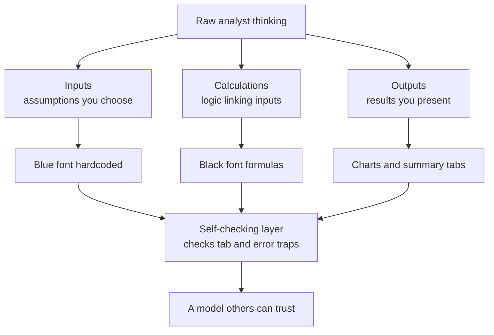
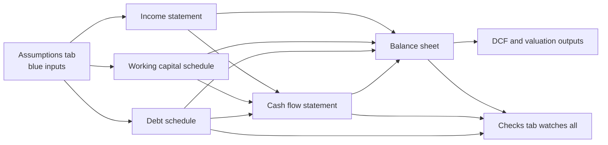
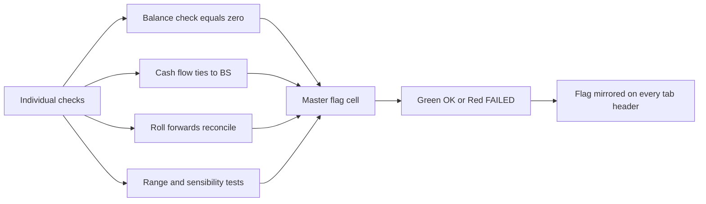
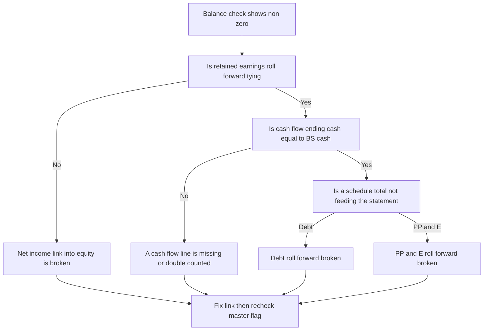

<!-- v2-deep -->

# Chapter 40 — Modeling Best Practices and Error Checks

## 1. The Problem

You have spent thirty-nine chapters learning *what* to model — revenue drivers, working capital, debt schedules, DCFs, LBOs, comps. You can now build a three-statement model that balances and a valuation that produces a number. So why does a chapter on "best practices" matter? Because in the real world, **the model is not the deliverable — trust in the model is the deliverable.**

Consider what actually happens to a model after you build it. A managing director opens it at 11 p.m. before a board meeting and needs to change the revenue growth assumption from 8% to 6% and instantly see the effect on the implied share price. An investment committee wants to know: "If we hardcoded any numbers, where?" A junior analyst inherits your file six months after you have left the firm and must extend it by two years. A due-diligence team runs your model through their own error-checking macros. In every one of these moments, a *correct* model that is unreadable, fragile, or untrustworthy is worthless — and sometimes worse than worthless, because a hidden error that survives into a decision can cost millions.

The problem best practices solve is therefore not "how do I get the right answer once, on my own screen?" It is: **how do I build a model that stays correct when it is changed, that anyone can audit in minutes, and that visibly signals its own health so errors surface before they reach a decision-maker?**

The stakes are not hypothetical. The most famous modeling failures in finance were not conceptual — they were mechanical. JPMorgan's 2012 "London Whale" loss was magnified by a value-at-risk model that copied cells incorrectly between spreadsheets and divided by a sum instead of an average. TransAlta lost $24 million because a copy-paste error misaligned bids in a spreadsheet. Barclays, during the 2008 Lehman acquisition, accidentally submitted contracts it meant to exclude because hidden rows in an Excel file were converted rather than deleted. In every case the analysts were smart and the finance was sound. The *craft* failed.

To make the stakes concrete, hold one number in your head throughout this chapter. Suppose a DCF produces an enterprise value of **1,000** on 100 shares — an implied **10.00** per share. Now imagine a single hidden hardcode overstates one year of free cash flow by just 20, and the terminal value multiple amplifies that. If that 20 flows into a terminal value at a 10x exit, the enterprise value can move by **200** — a **20% swing in the share price to 12.00** — from one invisible cell. Best practices are the discipline that stops that cell from ever hiding. We will return to and reconcile numbers like these throughout.

This chapter is about that craft. It is the difference between a model that merely computes and a model a professional would sign their name to.

## 2. The Core Idea

A professional model is built on one governing principle: **separation and transparency.** Every model is really three different kinds of content mixed together — *inputs* (assumptions you choose), *calculations* (logic that transforms inputs), and *outputs* (results you present). The single most important habit in modeling is to keep these three visually and structurally distinct, so that anyone — including future-you — can look at any cell and instantly know: is this a number I can change, or a formula I must not touch?

From that one principle everything else follows. If inputs are separated, you never hardcode a number inside a formula (because then it is a hidden input). If calculations are transparent, you write one consistent formula across an entire row so it can be copied cleanly. If outputs are distinct, you never let a presentation cell also do arithmetic. Layer on top a set of **self-checking mechanisms** — a balance sheet that proves it balances, a checks tab that goes green or red, error traps that catch the impossible — and you get a model that *tells you when it is broken* instead of silently lying.

The mental shift is this: an amateur asks "does my model give the right answer?" A professional asks "**will my model still give the right answer after ten other people have changed it, and will it shout if it doesn't?**" Best practices are the accumulated answer to that second question.

There is a second, subtler idea that supports the first: **a model has a direction of information flow.** Inputs feed calculations; calculations feed outputs; outputs never feed back into inputs (except through a *deliberate, controlled* circular loop like interest-on-debt). When you can draw that flow as a clean acyclic graph — assumptions on the left, statements in the middle, valuation on the right, checks watching everything — you have a model whose logic can be *traced*. When the flow tangles, when an output cell secretly drives an input, the model becomes impossible to reason about. Separation is what keeps the flow clean; transparency is what makes the flow visible.

*The core idea: separate the three content types, then wrap them in a self-checking layer.*

*Information flows left to right and top to bottom. The checks tab is the only thing that reads from everywhere at once.*

## 3. Why It Works

Why does separation-plus-transparency produce trustworthy models? Because it aligns the model's structure with how humans actually detect errors and how spreadsheets actually propagate them.

**It works because errors hide in ambiguity.** The deadliest spreadsheet errors are not wrong logic — they are *hardcodes buried inside formulas* and *inconsistent formulas across a row.* If cell G10 is `=F10*1.08` but H10 is `=G10*1.08+50`, the model still "works," but the 50 is invisible. By enforcing that inputs are blue and formulas are black, and that a formula is identical across every column of a row, you convert invisible errors into visible ones. A single black cell in a blue input row, or one column whose formula differs from its neighbours, becomes a glaring anomaly your eye catches in a second.

**It works because it exploits the copy-across grammar of spreadsheets.** Excel's relative/absolute referencing is designed so that one correctly written formula, copied across a row, adapts perfectly. When you write the *same* formula in every period, you get three gifts at once: fewer keystrokes, guaranteed consistency, and instant auditability (you only have to check one cell to trust the whole row). Inconsistent formulas throw away all three.

**It works because self-checks catch what discipline misses.** No analyst is perfect, and no reviewer reads every cell. But a model that computes `Assets − Liabilities − Equity` and displays the result gives you a zero-cost, always-on sentinel. If that number is ever non-zero, something upstream broke — and you know *immediately*, not after the model reaches the client. Checks convert the question "is anything wrong?" from a manual audit into an automatic readout.

**It works because it matches the model's real lifecycle.** Models are living documents, edited by many hands over months. A structure optimised for *change* — clean sections, no circular surprises, one formula per row, documented assumptions — survives that lifecycle. A structure optimised only for *getting today's answer* rots the moment someone else touches it.

**It works because it turns the balance sheet into a proof, not a hope.** This is the deepest reason, and it deserves unpacking. In a properly integrated three-statement model, the balance sheet is *not independently built* — equity's retained earnings comes from the income statement, cash comes from the cash flow statement, and every other line is driven by a schedule. Because assets and the financing side are wired from the *same* underlying flows, the identity `Assets = Liabilities + Equity` should hold *automatically*. So when it fails, the failure is diagnostic: it means exactly one thing broke, and the *size* and *sign* of the imbalance point you at the culprit. A model where the balance check has to be *forced* to zero with a plug is a model that has thrown away its own proof. This is why "a plug that forces balancing" is one of the gravest sins — it disables the smoke detector.

In short, best practices work because they turn the spreadsheet from a passive calculator that trusts you completely into an active partner that keeps checking your work.

## 4. Full Technical Content

This is the operational heart of the chapter — the complete toolkit. Work through it as a checklist you internalise.

### 4.1 Structure and layout

**Choose a workbook architecture.** There are two accepted schools:

- **Multi-sheet (modular):** one tab per major block — Cover, Assumptions, Income Statement, Balance Sheet, Cash Flow, Debt Schedule, DCF, Comps, Checks. Preferred for large, shared models. Each tab has a single clear purpose.
- **Single-sheet (vertical):** everything on one long tab, sections stacked vertically. Preferred for smaller models and speed; easier to audit because there is no jumping between tabs and no risk of a broken cross-sheet link.

Whichever you choose, apply these rules:

1. **Flow left-to-right, top-to-bottom.** Time runs across columns (historicals then forecasts); line items run down rows. Calculations should reference cells above and to the left wherever possible so the logic reads like a page.
2. **One consistent timeline.** Every tab shares the same column-to-period mapping. If column H is FY2025 on the income statement, it is FY2025 everywhere. Never let periods drift between tabs.
3. **Group inputs together.** Ideally all key drivers live on a dedicated Assumptions tab (or a clearly boxed input block), never scattered.
4. **Freeze panes and label everything.** Freeze the top rows and left columns so headers stay visible. Every row has a label; every section has a header.

**A concrete column convention.** Reserve columns deliberately so the layout never surprises a reader:

| Column | Purpose |
|---|---|
| A | Section/indent spacer |
| B | Row label (line item name) |
| C | Units or a driver input (e.g. growth %) |
| D | (blank spacer) |
| E, F, G | Historical years FY2022, FY2023, FY2024 |
| H, I, J, K, L | Forecast years FY2025 through FY2029 |

With this convention, **the first forecast cell is always column H**. You build the forecast logic once in H and copy right to L. "Copy H across" becomes a reflex, and any reviewer knows exactly where the forecast begins.

### 4.2 Formatting and colour conventions

Colour is not decoration — it is a *contract* with the reader. The industry-standard convention (used at virtually every bank) is:

| Element | Font colour | Meaning |
|---|---|---|
| Hardcoded input / assumption | **Blue** | A number you can change |
| Formula / calculation | **Black** | Do not overtype |
| Link to another worksheet | **Green** | Value comes from another tab |
| Link to another workbook | **Red** | External file dependency — fragile |
| Warning / check that has failed | **Red fill or red text** | Something is broken |

Supporting formatting standards:

- **Number formats carry meaning:** currency with thousands separators, percentages as %, multiples with an "x" suffix, years as plain integers (no comma — `2025` not `2,025`). Negatives in parentheses or red for financial statements.
- **Units stated once, prominently.** "US$ in millions unless stated" at the top. Never make the reader guess whether 45 means 45 or 45,000,000.
- **Indentation shows hierarchy.** Subtotals indented differently from components; totals in bold with a top border.
- **No excessive colour or borders.** Clean, monochrome, minimal gridlines. A model should look like a printed financial statement, not a rainbow.
- **Consistent decimals.** Pick a precision per row and hold it. Ragged decimals look sloppy and hide rounding issues.

**Exact custom number-format strings** (Format Cells → Custom) that professionals reuse:

- Currency in millions, negatives in parentheses: `#,##0.0;(#,##0.0)`
- Percentage to one decimal: `0.0%`
- Multiple with an x suffix: `0.0"x"`
- Year as integer, no separator: `0` (or type years as text so they never inherit a comma)
- Zero shown as a dash for cleanliness: `#,##0.0;(#,##0.0);"—"`

The last format is a small but powerful trick: a genuine zero shows as an em dash, so a *displayed numeric zero* becomes suspicious — it means a cell that should be blank is actually computing something.

### 4.3 Formula discipline

This is where amateurs and professionals diverge most sharply.

**Rule 1 — Never hardcode inside a formula.** `=E10*1.08` is a crime; the 1.08 is a hidden assumption. Instead put the growth rate in an input cell and write `=E10*(1+$C$10)`. The only acceptable in-formula constants are true mathematical constants (like the 4 in a quarterly-to-annual conversion, or 12 for months) — and even those are better placed in a labelled cell.

**Rule 2 — One formula per row.** Write the formula once in the first forecast period and copy it right across every period. Use `$` anchoring so the copy works. If any column in a row needs a *different* formula, that is a red flag demanding a comment — or better, a restructure.

**Rule 3 — Keep formulas short and legible.** A monstrous nested `=IF(IF(AND(...)))` that spans the formula bar is unauditable. Break it into intermediate rows, each doing one step. Screen real estate is cheaper than a hidden bug. If you must use logic, prefer `IFS`, `SUMIFS`, `INDEX/MATCH` (or `XLOOKUP`) over fragile alternatives — and avoid `VLOOKUP` with hardcoded column numbers, which breaks when columns are inserted.

**Rule 4 — Avoid volatile and fragile functions.** `OFFSET`, `INDIRECT`, and excessive `NOW()`/`TODAY()` recalc constantly and obscure dependencies. Prefer direct references and `INDEX`. Never use `VLOOKUP(...,,TRUE)` approximate match by accident.

**Rule 5 — Understand and control circularity.** Interest expense depends on debt, which depends on cash flow, which depends on interest — a genuine circular reference. Handle it deliberately: either use a *circularity switch* (a cell that lets you break the loop to zero to find errors) plus iterative calculation, or avoid it with the "average of opening balance only" convention. Never leave uncontrolled iterative calc on and hope. A stray circular reference that you did *not* intend is one of the most common causes of `#REF!`-style corruption.

**Rule 6 — Use named ranges sparingly and deliberately.** Names like `Tax_Rate` improve readability but, overused, hide where a value lives. Use them for a handful of global constants, not everything.

**Rule 7 — Sign conventions must be consistent.** Decide once whether costs are entered as negatives or positives, and hold it everywhere. Mixed conventions are a leading cause of "why won't my cash flow tie?"

**Rule 8 — Anchor references with intent, and know the four `$` states.** The `$` is not decoration; each of the four forms means something specific. Master them and copy-across stops being guesswork:

| Reference | Copies across (right) | Copies down | Use for |
|---|---|---|---|
| `C10` (relative) | shifts to D10, E10… | shifts to C11, C12… | period-over-period chains |
| `$C$10` (absolute) | stays C10 | stays C10 | a single global assumption cell |
| `$C10` (col-locked) | stays column C | shifts row | a driver in column C read by every row |
| `C$10` (row-locked) | shifts column | stays row 10 | a header year read by every row |

The reflex: **anchor the dimension you do NOT want to move.** If a whole forecast reads the tax rate from `$C$8`, lock both. If each row reads its own driver sitting in column C, use `$C10`.

**A worked anchoring example.** Suppose the tax rate lives in `C8` (a blue input, 25%) and pre-tax income sits in row 20 across H:L. In H21 write `=H20*(1-$C$8)`. Copy right to L21 and every cell correctly reads `$C$8` while the pre-tax reference walks H20→I20→J20. Now change `C8` from 25% to 21% and *every* forecast tax figure updates from one cell. That is the entire payoff of anchoring done right: a single source of truth for each assumption.

### 4.4 The Checks tab and error traps

A professional model *proves its own integrity.* Build a dedicated **Checks tab** (or a checks block) that aggregates every integrity test into one dashboard. Types of checks:

1. **Balance check:** `Total Assets − Total Liabilities − Total Equity` for every period. Must equal zero.
2. **Cash flow tie:** Ending cash on the cash flow statement equals cash on the balance sheet.
3. **Sources = Uses:** in transaction models, funding sources equal uses of funds.
4. **Sum-of-parts ties:** e.g., segment revenue sums to total revenue; schedule totals feed the statements.
5. **Sensibility / range checks:** margins between 0% and 100%, no negative inventory, growth within plausible bounds, depreciation not exceeding gross PP&E.
6. **Reconciliations:** retained earnings roll-forward, debt roll-forward, PP&E roll-forward each tie to the balance sheet.

Implement each check as a formula that returns `TRUE`/`OK` or `FALSE`/`ERROR`. Then build a **master flag**: `=IF(SUM(all_error_cells)=0,"OK","CHECK FAILED")` and apply conditional formatting so it glows green when clean and red when any check breaks. Put a small copy of that master flag on *every* tab's header so no matter where you are, you can see the model's health.

Use `IFERROR` thoughtfully: wrap lookups that may legitimately return errors, but **never** blanket-wrap everything — a naked `#DIV/0!` is information, and hiding it with `IFERROR(...,0)` can mask a real broken link. Guard division explicitly: `=IF(denominator=0,0,numerator/denominator)`.

**Exact formulas for a robust checks block.** Assume the balance-check *differences* for five forecast years sit in cells `H4:L4` (each `=Assets − Liabilities − Equity`), and a set of `"OK"/"ERROR"` text flags sit in `H10:L20`. Build the dashboard like this:

- Per-year numeric balance check, with tolerance: in H5, `=IF(ABS(H4)>0.01,"ERROR","OK")` — copy across.
- Cash-flow tie: `=IF(ABS(CF_EndingCash - BS_Cash)>0.01,"ERROR","OK")`.
- Count of all failures: `=COUNTIF($H$5:$L$20,"ERROR")`.
- Master flag: `=IF(COUNTIF($H$5:$L$20,"ERROR")=0,"MODEL OK","CHECK FAILED")`.
- Guarded ratio (no `#DIV/0!`): `=IF(Revenue=0,0,GrossProfit/Revenue)`.
- Legitimate lookup wrap only where a miss is expected: `=IFERROR(INDEX(Comps,MATCH(Ticker,Names,0)),"n/a")`.

**Why the 0.01 tolerance and not `=0`?** Because floating-point arithmetic means a truly balanced model can show `0.0000000004` after thousands of operations. Testing `=0` would flag a healthy model red; testing `ABS(diff)>0.01` (i.e. a tolerance of one one-hundredth of a unit) catches real errors while ignoring binary rounding dust. Never widen the tolerance to hide a real break — if you find yourself setting it to `>5`, you are papering over a bug.

**Conditional formatting recipe for the master flag.** Select the master-flag cell, Home → Conditional Formatting → New Rule → "Format only cells that contain" → Specific Text → containing → `CHECK FAILED` → fill red; add a second rule for `MODEL OK` → fill green. Because the flag is text-driven, the colour follows the logic automatically and can never fall out of sync.

*A checks architecture: many small tests feed one master flag visible everywhere.*

*A diagnostic tree: the size and location of the imbalance narrows the search before you touch a single formula.*

### 4.5 Versioning and file management

- **Save iteratively with dated names:** `ProjectX_Model_v14_2026-07-03.xlsx`. Never a single file you overwrite forever — you will need to roll back.
- **Keep a version log** (a tab or the cover) recording what changed in each version, when, and by whom.
- **Lock the final.** When a model is finalised for a decision, save a read-only "as-circulated" copy that is never edited again, so you can always reproduce exactly what the committee saw.
- **Protect input vs calc cells** where multiple users edit: unlock only the blue input cells, protect the sheet, so users cannot accidentally overtype formulas.
- **Manage external links deliberately.** Red links to other workbooks break when files move. Prefer to paste-special values from source files, or keep all dependencies in one workbook. Always run *Edit Links* before circulating to confirm no broken external references.

**Turning off automatic recalc surprises.** In a large model, set Formulas → Calculation Options thoughtfully. Leave it on Automatic for normal work, but know that **iterative calculation** (File → Options → Formulas → Enable iterative calculation, Maximum iterations 100, Maximum change 0.001) is the switch that lets a *deliberate* interest circularity resolve. Turn it on only when your model genuinely needs it, and pair it with a circularity breaker cell (Section 4.3, Rule 5) so you can always zero the loop to locate an unintended circular reference.

### 4.6 Documentation

A model that needs a phone call to understand is not finished.

- **Cover / contents tab:** model name, purpose, author, date, version, currency and units, key contacts, and a table of contents with the role of each tab.
- **Assumptions documentation:** every key driver labelled, with its source (management guidance, historical average, analyst estimate) noted in an adjacent cell.
- **Cell comments** for anything non-obvious: why a formula deviates, where an external number came from, what a switch does.
- **A "how to use" note:** which cells to change to run a scenario, where the outputs are, how the scenario/toggle cells work.
- **Scenario and toggle transparency:** if a `1/2/3` switch drives Base/Bull/Bear, label it and show the active scenario name prominently.

**A concrete scenario switch, built exactly.** Put a blue input in `C3` holding `1`, `2`, or `3`. Store the three scenarios' revenue growth in a small table: Base 8% in `D3`, Bull 12% in `E3`, Bear 4% in `F3`. Then the *live* growth used by the model is `=CHOOSE($C$3, $D$3, $E$3, $F$3)`. To show the active name prominently, in a header cell write `=CHOOSE($C$3,"BASE","BULL","BEAR")`. Now flipping one cell — `C3` — re-runs the entire model on a different worldview, and the reader always sees which world they are in. This is far safer than typing the growth directly, because the three scenarios are documented side by side and never lost.

### 4.7 Sensitivity, scenarios and stress

A pro model exposes its own uncertainty. Include **data tables** (one- and two-variable) showing how the key output moves with the key drivers, and a **scenario manager** so the reader can flip between Base/Upside/Downside. This is both an analytical tool and an implicit error check — if a 1% change in an input causes an absurd output swing, you have probably found a bug.

**Building a two-variable data table, step by step.** Say the implied share price is computed in cell `B2` (this is the "corner" cell — a data table's formula reference must sit in the top-left corner of the grid). You want to see share price as WACC (columns) varies against terminal growth (rows):

1. In `B2`, put `=SharePrice` (a reference to your output cell). Format it white-on-white if you want to hide the raw number.
2. Across the top row `C2:G2`, type WACC values: 8%, 9%, 10%, 11%, 12%.
3. Down the left column `B3:B7`, type terminal growth: 1.5%, 2.0%, 2.5%, 3.0%, 3.5%.
4. Select the whole block `B2:G7`.
5. Data → What-If Analysis → Data Table. Set **Row input cell** = the WACC assumption cell; **Column input cell** = the terminal-growth assumption cell.
6. Excel fills the grid, re-running the model for all 25 combinations.

Read it as a sanity check: the share price should *rise* as WACC falls and as terminal growth rises, and the gradient should be smooth. A grid with a jagged reversal — price higher at WACC 11% than at 10% — is a bug signature, almost always a broken absolute reference or a terminal-value formula that mixes up growth and discount rate.

## 5. Worked Example — Auditing and Hardening a Junior's Model

Let us walk through a realistic clean-up so the principles become concrete. You inherit a small forecast model. Here is a fragment of the revenue and the checks, and how a professional systematically improves it.

**The starting state (amateur):**

- Revenue FY2 cell: `=1200*1.08` (prior year hardcoded, growth hardcoded)
- Revenue FY3 cell: `=1296*1.08+30` (a one-off `+30` slipped in, invisible)
- COGS entered as positive numbers on the income statement, but subtracted with a `-` in one period and added with a stray `+` in another
- No balance check anywhere
- File named `model final FINAL v2 (2).xlsx`

**Step 1 — Extract the hardcodes.** Create an Assumptions block. Put prior-year revenue `1,200` in a blue input cell (say `C5`) and growth `8.0%` in blue `C6`. Rewrite FY2 revenue as `=C5*(1+$C$6)`, coloured black. Verify: 1,200 × 1.08 = **1,296**. Correct.

**Step 2 — Enforce one formula per row.** FY3 should be `=[FY2 cell]*(1+$C$6)`. Copy FY2's formula across. FY3 now reads 1,296 × 1.08 = **1,399.68**. The stray `+30` is gone. If that 30 was a *real* one-off (say a contract milestone), it must become its own labelled blue input line — "One-off contract revenue: 30" — added transparently, not smuggled into a growth formula. We check with the analyst; suppose it was a genuine one-off, so we add a separate line and the FY3 total becomes 1,399.68 + 30 = **1,429.68**, now fully visible.

**Step 3 — Fix sign conventions.** Decide: costs entered as positives, subtracted in the P&L. Rewrite every COGS reference as `Revenue − COGS` consistently. Now Gross Profit is one clean formula copied across.

**Step 4 — Build the balance check.** On a new Checks tab: `Check_Balance = Total Assets − Total Liabilities − Total Equity` for each year. Apply conditional formatting: red if `ABS(value) > 0.01`. Initially it shows red **−15** in FY3 — the model does *not* balance. This is the check earning its keep: without it, this error ships. We trace it (using the retained-earnings roll-forward, which the check flags as not tying) and find net income was not flowing into retained earnings for FY3. Fix the link; the balance check goes to **0.0**. Green.

**Step 5 — Range checks.** Add `Check_Margin = IF(AND(GrossMargin>=0, GrossMargin<=1),"OK","ERROR")`. Add a debt check that ending cash is never negative (or, if it can be, that the revolver draws to cover it).

**Step 6 — Master flag and documentation.** Build `Master_Check = IF(COUNTIF(check_range,"ERROR")+ (balance fails)=0,"MODEL OK","CHECK FAILED")`, mirror it on every tab header. Add a cover tab with purpose, author, date, units ("US$ in millions"), and a version log. Save as `CompanyX_Forecast_v1_2026-07-03.xlsx` and keep incrementing.

**Result.** The model now: has zero hidden inputs; uses one formula per row; enforces one sign convention; proves it balances; flags impossible values; and any reviewer can audit the entire revenue line by inspecting a single cell. Same underlying finance — but now *trustworthy.* The `−15` that the balance check caught is exactly the kind of silent error that, in an amateur model, reaches the decision-maker.

### 5A. A fully reconciling mini three-statement model

The fragment above is instructive, but let us now build a complete small model whose three statements *provably* tie, with every number reproducible in Excel. Units are US$ in millions. We forecast one year (FY2025) from a FY2024 base.

**Assumptions (blue inputs):**

| Assumption | Cell | Value |
|---|---|---|
| FY2024 Revenue | C5 | 1,000.0 |
| Revenue growth | C6 | 10.0% |
| Gross margin | C7 | 40.0% |
| Operating expenses (fixed) | C8 | 150.0 |
| Depreciation | C9 | 50.0 |
| Interest rate on debt | C10 | 5.0% |
| Tax rate | C11 | 25.0% |
| Capex | C12 | 80.0 |
| Opening cash (FY2024 close) | C13 | 120.0 |
| Opening debt | C14 | 400.0 |
| Opening net PP&E | C15 | 600.0 |
| Opening retained earnings | C16 | 320.0 |
| Opening share capital | C17 | 600.0 |
| Change in net working capital (cash outflow) | C18 | 20.0 |

We assume no debt repayment and no dividends this year, so all net income retains.

**Income statement (FY2025), with exact formulas and results:**

| Line | Formula | Result |
|---|---|---|
| Revenue | `=C5*(1+C6)` | 1,100.0 |
| COGS | `=-Revenue*(1-C7)` | −660.0 |
| Gross profit | `=Revenue+COGS` | 440.0 |
| Operating expenses | `=-C8` | −150.0 |
| Depreciation | `=-C9` | −50.0 |
| EBIT | `=GrossProfit+Opex+Dep` | 240.0 |
| Interest expense | `=-C14*C10` | −20.0 |
| Pre-tax income | `=EBIT+Interest` | 220.0 |
| Tax | `=-PretaxIncome*C11` | −55.0 |
| Net income | `=PretaxIncome+Tax` | 165.0 |

Verify by hand: Revenue 1,000 × 1.10 = 1,100. COGS = 1,100 × 60% = 660. Gross profit 440. Less opex 150 and depreciation 50 → EBIT 240. Interest = 400 × 5% = 20 → pre-tax 220. Tax = 220 × 25% = 55 → **net income 165**. ✓

**Cash flow statement (FY2025):**

| Line | Formula | Result |
|---|---|---|
| Net income | `=NetIncome` | 165.0 |
| Add back depreciation | `=C9` | 50.0 |
| Change in NWC | `=-C18` | −20.0 |
| Cash from operations | sum | 195.0 |
| Capex | `=-C12` | −80.0 |
| Cash from investing | | −80.0 |
| Debt drawn/(repaid) | `=0` | 0.0 |
| Cash from financing | | 0.0 |
| **Net change in cash** | sum | **115.0** |
| Opening cash | `=C13` | 120.0 |
| **Ending cash** | `=Opening+NetChange` | **235.0** |

Verify: 165 + 50 − 20 = 195 operating; − 80 investing; 0 financing; net +115; 120 + 115 = **235 ending cash**. ✓

**Balance sheet (FY2025 close):**

| Line | Formula | Result |
|---|---|---|
| Cash | `=EndingCash` | 235.0 |
| Net PP&E | `=C15+C12-C9` | 630.0 |
| **Total assets** | sum | **865.0** |
| Debt | `=C14` | 400.0 |
| **Total liabilities** | | **400.0** |
| Share capital | `=C17` | 600.0 |
| Retained earnings | `=C16+NetIncome` | 485.0 |
| Wait — equity check | | see below |

Hold on. Total liabilities + equity as drawn = 400 + 600 + 485 = **1,485**, but total assets = **865**. That does not balance by **620**. Do *not* panic and do *not* plug — this is the checks discipline working exactly as designed. The imbalance is diagnostic: the opening balance sheet itself must reconcile before the forecast can. Let us check the FY2024 opening identity: opening assets = cash 120 + PP&E 600 = 720. Opening financing = debt 400 + share capital 600 + retained earnings 320 = **1,320**. The opening sheet is *itself* out of balance by 600 — the given inputs are internally inconsistent (share capital of 600 was too high given the asset base).

**This is the lesson.** A forecast can only balance if its opening balance sheet balances. Correct the input: opening share capital should be **C17 = 0** (or, more realistically, the opening assets should include another 600 of some asset). Suppose the true opening share capital is such that opening equity = assets − liabilities = 720 − 400 = 320, i.e. share capital = 320 − 320 (retained earnings) = **0**, or equivalently retained earnings and share capital together equal 320. Let us set share capital C17 = 0 and keep retained earnings 320, so opening equity = 320 and opening balances: assets 720 = liabilities 400 + equity 320. ✓

Now re-run the FY2025 balance sheet:

| Line | Result |
|---|---|
| Cash | 235.0 |
| Net PP&E | 630.0 |
| **Total assets** | **865.0** |
| Debt | 400.0 |
| Share capital | 0.0 |
| Retained earnings | 320 + 165 = 485.0 |
| **Total L + E** | **885.0** |

Still off by **20**. Trace it: ending equity 485 + debt 400 = 885 vs assets 865, difference **+20** — liabilities/equity too high by 20, meaning an asset is understated by 20 *or* something absorbed 20 of cash that we did not put on the balance sheet. The culprit is the **change in net working capital**: we took 20 of cash *out* in the cash flow (correct — cash fell by 20 relative to a no-NWC world), but we never *added* the corresponding 20 to a working-capital asset (e.g. inventory or receivables rose by 20) on the balance sheet. NWC is a *use of cash that creates an asset*; if it leaves the cash line it must land on another asset line.

**Fix:** add a "Net working capital assets" line to the balance sheet: opening 0, closing `=C18` = 20. Now total assets = cash 235 + PP&E 630 + NWC assets 20 = **885.0**, and total L+E = **885.0**. **Balance check = 0.0.** ✓

Reconciled fully:

- Income statement net income: **165**
- Cash flow ending cash: **235**, matching balance-sheet cash: **235** ✓
- Balance sheet: assets **885** = liabilities **400** + equity **485** ✓
- Retained-earnings roll-forward: 320 + 165 − 0 dividends = **485** ✓

This worked example is the single most important thing in the chapter to reproduce yourself, because it shows the balance check *doing its job twice* — first catching an inconsistent opening sheet, then catching a missing NWC asset — and shows precisely why plugging would have buried both errors.

### 5B. "What if" variations on the reconciled model

Now stress the model and confirm each change flows through correctly — this is how you build intuition for what a *correct* propagation looks like.

**What if debt is repaid by 100?** Set financing debt draw to −100. Cash from financing = −100, so net change in cash = 115 − 100 = **15**, ending cash = 120 + 15 = **135**. Balance sheet: cash 135 + PP&E 630 + NWC 20 = **785** assets; debt now 400 − 100 = 300, plus equity 485 = **785**. Also, interest was computed on *opening* debt (400), so the income statement is unchanged — a defensible convention. Balance check stays **0.0**. ✓ (If instead you charged interest on the *average* balance, interest would fall to 400 average of 350 → `350 × 5% = 17.5`, changing net income to `(240 − 17.5) × 0.75 = 166.875`; you would need iterative calc because average debt depends on repayment which may depend on cash — the deliberate circularity of Rule 5.)

**What if a dividend of 40 is paid?** Financing cash −40, ending cash 235 − 40 = **195**. Retained earnings 320 + 165 − 40 = **445**. Balance: assets = 195 + 630 + 20 = **845**; L+E = 400 + 0 + 445 = **845**. Balance check **0.0**. ✓ The dividend reduces cash (asset) and retained earnings (equity) by the same 40 — the balance sheet stays tied because the double-entry is respected on both sides.

**What if capex doubles to 160?** Investing cash −160, ending cash 235 − 80 = **155**. Net PP&E = 600 + 160 − 50 = **710**. Assets = 155 + 710 + 20 = **885** (unchanged total — cash fell 80, PP&E rose 80). L+E unchanged at 885. Balance check **0.0**. ✓ This "asset swap" (cash into PP&E) leaving total assets flat is a good sanity intuition.

**What if the tax rate rises to 30%?** Tax = 220 × 30% = 66, net income = **154**. Operating cash = 154 + 50 − 20 = 184; net change 184 − 80 = 104; ending cash = **224**. Retained earnings 320 + 154 = **474**. Assets = 224 + 630 + 20 = **874**; L+E = 400 + 0 + 474 = **874**. Balance check **0.0**. ✓ Note the 11-unit drop in net income (165→154) flows *exactly* into both cash (235→224) and retained earnings (485→474) — an 11-for-11 match is the signature of a correctly wired model.

In every variation the balance check returns to zero *without any manual adjustment.* That is the proof of a well-built model: perturb an input, and the identity re-establishes itself automatically.

### A note on self-verifying your numbers

Every number above is checked: 1,200 × 1.08 = 1,296; 1,296 × 1.08 = 1,399.68; plus the 30 one-off = 1,429.68. In the full model, 1,000 × 1.10 = 1,100; net income 165 flows to cash 235 and equity 485; assets 885 = L+E 885. Always do this — recompute critical cells by hand or with a `+/-` sanity formula. A model full of best-practice formatting but with an un-recomputed core number is still a broken model.

## 6. Connections

Best practices are not a standalone chapter — they are the connective tissue of everything you have built.

- **To the three-statement model (Chapters on IS/BS/CF):** the balance check and cash-flow tie are the direct pay-off of the integration you learned there. Best practices are what keep that integration provably intact after edits. Section 5A above is that integration audited in real time.
- **To the debt schedule and circularity:** the circularity switch and iterative-calc discipline from this chapter are what let interest-and-cash loops resolve safely. The "average debt" variation in 5B is exactly where that circularity bites.
- **To DCF and LBO valuation:** sensitivity tables and scenario managers turn a single point estimate into the *range* that decision-makers actually want. A DCF without a sensitivity grid is amateur output. The two-variable data table in 4.7 is the standard WACC-vs-terminal-growth grid every DCF ships with.
- **To comps and data:** green cross-sheet links and red external-workbook links tell you exactly where your comps data is sourced and where it is fragile.
- **To the capstone chapters:** when you produce a real deliverable — a portfolio model or research note — this chapter *is* the difference between something that reads as professional and something that reads as a student exercise. The checks tab and clean formatting are what a portfolio manager notices in the first ten seconds.
- **Beyond finance:** these are general software-engineering instincts — separation of concerns, single source of truth, assertions/tests, version control, documentation. You are, in effect, learning to treat a spreadsheet as a small program. The checks tab *is* a test suite; the colour convention *is* type-checking; the version log *is* source control.

## 7. Traps and Common Errors

The most common and most costly mistakes, and the habit that prevents each:

1. **Hardcoded numbers inside formulas.** The classic. Prevention: if a formula contains a number that is not a pure mathematical constant, extract it to a blue input. Audit with *Formulas → Show Formulas* (`Ctrl` + `` ` ``) and scan for stray digits.
2. **Inconsistent formulas across a row.** Prevention: one formula, copied across; use Excel's *Trace Precedents* or the `ISFORMULA`/consistency-check trick (a row that flags any cell whose formula differs from its left neighbour). Excel's built-in "Inconsistent Formula" green triangle also flags these — do not dismiss it reflexively.
3. **Broken or silent external links.** Prevention: minimise cross-workbook links; check *Data → Edit Links* before every circulation; colour external links red so they are obvious.
4. **Unintended circular references.** Prevention: keep iterative calc *off* by default while building; add a circularity switch so you can zero the loop and locate the source; only enable iteration deliberately. When Excel shows the "Circular Reference" warning and a cell reads 0 unexpectedly, that is the tell.
5. **Over-wrapping with IFERROR.** Hiding every error with `IFERROR(...,0)` masks real breaks. Prevention: only wrap where an error is legitimate and expected; guard division explicitly; let genuine errors surface.
6. **Sign-convention drift.** Costs sometimes negative, sometimes positive. Prevention: decide once, document it on the cover, and hold it everywhere. In 5A we entered COGS as a negative and *added* it, so every P&L subtotal is a clean sum.
7. **Copy-paste misalignment.** Pasting a range one row or column off — the TransAlta $24m error. Prevention: prefer copy-*right* of a single correct formula over block copy-paste; after any paste, run the checks tab.
8. **Rounding masking errors.** Displaying rounded numbers can make a balance check *look* like zero when it is 0.4. Prevention: check on *unrounded* values with a tight tolerance (`ABS(x)>0.01`), never on displayed values. Never widen the tolerance to silence a real break.
9. **No checks at all.** The deepest amateur tell. Prevention: build the checks tab *first*, before the model grows — it is far harder to retrofit.
10. **Deleting vs hiding rows before sending.** The Barclays/Lehman error — hidden rows travelled with the file. Prevention: for external circulation, actually delete unwanted content or paste-values into a fresh clean file.
11. **Precision false-confidence.** Reporting a share price to the cent from a model built on ±20% growth assumptions. Prevention: match output precision to input uncertainty; lead with ranges, not spurious decimals.
12. **Volatile functions everywhere.** `OFFSET`/`INDIRECT` bloating recalc and hiding dependencies. Prevention: prefer `INDEX`, direct references, and structured `SUMIFS`.
13. **The plug.** Forcing the balance sheet to zero with `=Assets − Liabilities` slotted into equity. This *disables the smoke detector* — the model will now always "balance" no matter what breaks upstream. Prevention: never let equity reference the asset side; build retained earnings from the income statement only, and let the balance check be an *independent* observer.
14. **An unbalanced opening balance sheet.** As Section 5A showed, a forecast cannot balance if year zero does not. Prevention: verify the opening identity `Assets = Liabilities + Equity` *before* building any forecast column.
15. **Working capital that leaves cash but never lands on an asset.** The +20 error in 5A. Prevention: every cash-flow adjustment for NWC must have a matching balance-sheet asset/liability movement — double-entry is not optional.

## 8. First-Principles Recap

Strip everything back to the irreducible core:

- A model's real product is **trust**, not a number. Correct-but-untrustworthy equals worthless.
- All spreadsheet content is one of three things — **inputs, calculations, outputs** — and the master discipline is keeping them **separated and visibly labelled** (blue inputs, black formulas, green/red links).
- Errors thrive in **ambiguity and inconsistency**; best practices work by converting invisible errors (hardcodes, inconsistent rows) into visible anomalies.
- Because models are **edited by many hands over time**, structure for *change and audit*, not just for today's answer: one formula per row, no hidden constants, controlled circularity, clean sections.
- No human is perfect, so the model must **check itself**: balance checks, ties, reconciliations, and range tests feeding one master flag that is green when healthy and red when not.
- The balance sheet is a **proof, not a hope**: because assets and financing are wired from the same flows, the identity holds automatically — so a non-zero check is *diagnostic*, and a plug that forces it to zero is sabotage.
- Everything else — versioning, documentation, protection, sensitivities — exists to make the model **reproducible, understandable, and honest about its own uncertainty.**

If you remember nothing else: *separate the three content types, and make the model prove it is correct.*

## 9. Quick-Reference

**Colour contract:** Blue = input (changeable) · Black = formula (do not touch) · Green = link to another sheet · Red = link to another file or a failed check.

**Formula discipline:** No hardcodes in formulas · One formula per row, copied across · Anchor with `$` (lock the dimension that must not move) · Keep formulas short — break into steps · Prefer `INDEX/MATCH`/`XLOOKUP`/`SUMIFS` over `VLOOKUP`/`OFFSET`/`INDIRECT` · Guard division explicitly · Control circularity with a switch.

**Anchoring cheat:** `$C$8` a global constant · `$C10` a per-row driver in column C · `C$10` a per-column header in row 10 · `C10` a walking period chain.

**Essential checks (with exact forms):** Balance `=IF(ABS(Assets−Liab−Equity)>0.01,"ERROR","OK")` · CF ending cash = BS cash · Sources = Uses · Roll-forwards (RE, debt, PP&E) tie · Range/sensibility tests · Master `=IF(COUNTIF(range,"ERROR")=0,"MODEL OK","CHECK FAILED")` mirrored on every tab.

**Number formats:** `#,##0.0;(#,##0.0)` currency · `0.0%` percent · `0.0"x"` multiple · `0` year · zero-as-dash `#,##0.0;(#,##0.0);"—"`.

**Structure:** Time across columns, items down rows · Forecast starts at column H · Consistent timeline on every tab · Inputs grouped · Flow up-and-left · Freeze panes · Label everything · Units stated once.

**Hygiene:** Dated versioned filenames · Version log · Lock the final as read-only · Protect formula cells · Check *Edit Links* before circulating · Delete (don't hide) before external send · Cover tab with purpose/author/date/units · Comment the non-obvious.

**Scenario switch:** `=CHOOSE($C$3,$D$3,$E$3,$F$3)` with an active-name label `=CHOOSE($C$3,"BASE","BULL","BEAR")`.

**The pro/amateur tell:** A pro model can be audited in minutes and shouts when broken; an amateur model must be trusted on faith.

### Interview angles

Modeling best practices are a favourite screening topic because they separate people who have *built* models from people who have only read about them. Be ready for:

- **"Walk me through how you'd know if a three-statement model is wrong."** Answer with the balance check, the cash-flow tie, and the roll-forwards — and explain *why* the balance sheet balances automatically (assets and financing share the same flows), so a non-zero check is diagnostic.
- **"Your balance sheet is off by exactly your net income. What happened?"** Almost always net income is not flowing into retained earnings (or is flowing twice). This is the single most-asked error-trace question.
- **"Your balance sheet is off by the change in working capital. Why?"** NWC left the cash line but never landed on a balance-sheet asset/liability — exactly the +20 error in Section 5A.
- **"How do you handle the interest-debt circularity?"** Deliberate iterative calc with a circularity breaker switch, or the opening-balance convention to avoid it. Show you know it is *intentional*, not accidental.
- **"Why not just plug the balance sheet?"** Because the plug disables the check — it makes the model always balance, hiding every future error. This is a trap question; the wrong answer is disqualifying.
- **"What colour is a cell that pulls from another tab, and why does colour matter?"** Green; colour is a contract that tells the next editor what is safe to change.
- **"Give me a real-world modeling error that cost money."** London Whale (divide by sum not average), TransAlta (paste misalignment), Barclays/Lehman (hidden rows). Naming one shows you take the craft seriously.

### Pre-submission checklist

Run this every single time before a model leaves your hands:

- [ ] Master check flag is green; every individual check passes on unrounded values.
- [ ] Opening balance sheet balances *before* any forecast column.
- [ ] Balance sheet balances in every period; cash flow ties to BS cash.
- [ ] No hardcoded numbers inside formulas (ran *Show Formulas* and scanned).
- [ ] Every row uses one consistent formula across all periods.
- [ ] Colour conventions applied correctly throughout (blue/black/green/red).
- [ ] No unintended circular references; iterative calc setting is intentional.
- [ ] No plug: equity does not reference the asset side of the balance sheet.
- [ ] *Edit Links* shows no broken external links; external deps minimised.
- [ ] Sign conventions consistent everywhere.
- [ ] Units and currency stated prominently; number formats consistent.
- [ ] Sensitivity table and scenarios work and give sensible (monotonic) outputs.
- [ ] Cover tab complete: purpose, author, date, version, units, contents.
- [ ] Non-obvious cells commented; assumption sources noted.
- [ ] Saved with a dated, versioned filename; final locked as read-only.
- [ ] Recomputed the two or three most important output numbers by hand.
- [ ] For external send: unwanted content deleted (not hidden); a clean copy circulated.

## 10. Do-It-Yourself Exercise

Do not just read this — build it. Open Excel and complete the following. It will take about an hour and will teach you more than the entire chapter did.

**Part A — Build a mini three-statement model.** Reproduce the reconciling model of Section 5A exactly: the assumptions block in column C, the income statement, cash flow, and balance sheet. Confirm you get net income **165**, ending cash **235**, and total assets **885 = L + E 885**. If your balance check is not exactly 0.0, do not proceed until it is — hunt the error the way Section 5A did (opening sheet first, then the NWC asset).

**Part B — Sabotage it (yes, really).** Deliberately introduce five errors, writing down what each is on paper:
1. A hardcoded growth rate inside a revenue formula (`=1000*1.10` instead of `=C5*(1+C6)`).
2. One column in a row using a different formula from its neighbours.
3. A sign flip on the cost line in one period.
4. A net-income link that does not flow into retained earnings.
5. An `IFERROR(...,0)` that hides a broken lookup.

**Part C — Build the defences.** Now, from scratch, add:
- An Assumptions block with every driver as a blue input.
- Full colour conventions (blue/black/green if you use multiple tabs).
- A Checks tab with: a balance check (`=IF(ABS(diff)>0.01,"ERROR","OK")`), a cash-flow tie, a retained-earnings roll-forward check, and one range check (gross margin between 0 and 100%).
- A master flag with conditional formatting (green/red), mirrored on the header of each tab.
- A cover tab with purpose, author, date, units, and a version log.

**Part D — Hunt.** Working *only* from your checks tab and colour conventions — not your list of sabotages — find and fix all five errors. Note which check caught which error, and whether any error slipped past your checks (if so, add a check that would have caught it). Predict which sabotages the balance check will catch (3 and 4 will move it; 1 and 2 may not) — this teaches you where checks are blind.

**Part E — Extend and stress.** Run each of the four "what if" variations from Section 5B (repay debt 100, pay dividend 40, double capex to 160, raise tax to 30%). Confirm your balance check returns to 0.0 in every case *without* touching the balance sheet manually. If any variation breaks the balance, you have a wiring error the static model hid.

**Part F — Circulate-ready.** Run the full pre-submission checklist above against your model. Save it as `DIY_Model_v1_<today's date>.xlsx`, then save a locked read-only "final" copy.

**Reflection to write down:** Which of your five sabotages did your checks catch automatically, and which required manual inspection? That gap is exactly where you most need to strengthen your checking instincts. The goal is a model where *every* plausible error trips a visible flag — a model that, quite literally, refuses to lie to you.

Build it now. Reading about error checks has never caught a single error.
