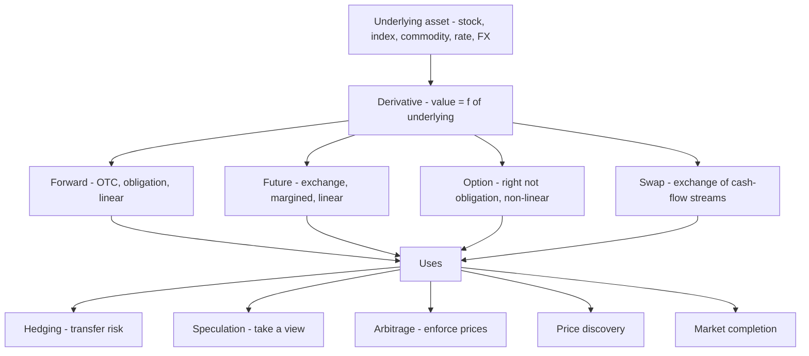
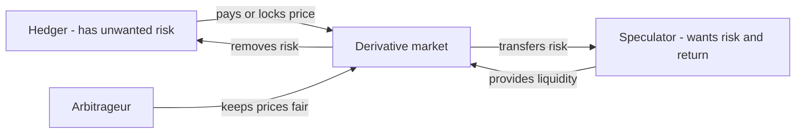

# Chapter 01 — Introduction to Derivatives and Their Uses

## 1. The Problem / The Need

Imagine you are a jet-fuel buyer for an airline in July. You know that in December you will need to buy 10 million litres of fuel to run your winter schedule. Today the price is ₹80 per litre. Your entire annual budget — ticket prices already printed, routes already sold — was built assuming roughly ₹80. If, by December, oil markets spike and fuel costs ₹110, your airline bleeds ₹300 million (30 × 10 million) it never planned for. If fuel falls to ₹60, you profit — but you are not in business to gamble on oil; you are in business to fly people.

The core problem is this: **economic decisions are made *today*, but the prices that determine their outcome are only settled in the *future*.** A farmer plants wheat in November and harvests in April, not knowing April's price. An Indian software exporter signs a contract to receive USD 1 million in ninety days, not knowing the rupee-dollar rate that day. A pension fund holds a ₹5,000 crore equity portfolio and fears a crash next quarter but does not want to sell (and trigger taxes, transaction costs, and market impact) just to sidestep a risk that may not materialise.

In each case the actor is exposed to a *price that has not yet happened*. They face two bad options in a world without the right tools:

1. **Bear the risk fully** — hope prices move favourably, and absorb the damage if they do not. This makes real businesses hostage to markets they cannot control.
2. **Transact early to lock in** — but you often *cannot* transact early. The airline cannot store December's fuel in July; the farmer's wheat does not exist yet; the exporter's dollars arrive only when the client pays.

What is missing is an instrument that lets you **fix, transfer, or reshape a future price today, without having to move the actual underlying asset today.** That instrument is a *derivative*. It also turns out that the very same instruments that let a hedger offload risk let someone else take a leveraged view, let a third party arbitrage mispricings, and — collectively — let the market *discover* what the future price should be. One tool, many uses.

## 2. The Core Idea

A **derivative** is a financial contract whose value is *derived* from the price of something else — the **underlying**. The derivative is not the asset; it is a legal claim whose payoff is a *function* of the asset's price.

> Value of derivative = f(price of underlying)

The underlying can be almost anything with an observable price: a commodity (crude oil, gold, wheat), a financial asset (a stock, a bond, a stock index like NIFTY 50), an exchange rate (USD/INR), an interest rate (the 3-month MIBOR), or even a statistic (volatility, weather, credit-default events).

The essential move is **separation**. A derivative *separates* exposure to a price from ownership of the thing. The airline can lock in a fuel price without owning a fuel tank. A speculator can bet on Reliance's share price without buying Reliance shares. A fund can hedge its whole portfolio's market risk without selling a single stock. By unbundling "price exposure" from "physical ownership," derivatives let risk be **priced, sliced, and traded on its own.**

Everything in this book is built from four elementary contracts — **forwards, futures, options, and swaps**. Every exotic structure, every structured product, every hedging strategy is a combination of these four building blocks. Master their payoffs and pricing logic and you can reason about anything.

## 3. Why / How It Works

Why should a piece of paper (or an entry in an exchange's electronic ledger) whose value merely *tracks* another asset be so powerful? Because it solves the future-price problem in five distinct ways, each corresponding to a real user of derivatives.

**(a) Hedging — transferring risk to someone who wants it.** The airline is *short* fuel (it must buy it later; rising prices hurt it). Somewhere there is an oil producer who is *long* fuel (it must sell later; falling prices hurt it). Their risks are mirror images. A derivative lets them lock in a price with each other today: the airline is protected from a spike, the producer from a crash. Risk did not vanish — it was *transferred* from those who dislike it to those who can bear it (or hold the opposite exposure). This is the economic heart of derivatives.

**(b) Speculation — taking a view efficiently.** A trader who believes oil will rise can buy a futures contract instead of buying and storing physical barrels. She commits little capital, pays no storage, and gets almost pure exposure to the price move. Derivatives make directional bets cheap and precise. Speculators are not villains: they are the *counterparties* who absorb the risk hedgers shed. Without them, hedgers would have no one to trade with. They provide **liquidity**.

**(c) Arbitrage — enforcing consistent prices.** Because a derivative's value is mechanically linked to its underlying, any gap between the derivative's market price and its theoretical "fair" price (given the underlying) is a *free lunch*. Arbitrageurs pounce, buying the cheap leg and selling the dear leg, until the gap closes. This is why derivative prices cannot wander far from their underlyings — arbitrage is the enforcement mechanism, and it is the foundation of every pricing formula in this book.

**(d) Price discovery.** A futures price is the market's *collective forecast* of the future spot price, distilled from thousands of hedgers and speculators putting real money behind their views. When you read that "NIFTY December futures are at 24,500," you are reading an aggregated, money-weighted prediction. Futures markets often move *before* the physical market, revealing information first.

**(e) Market completion.** Derivatives let you construct payoff profiles that simply do not exist in the underlying market — "pay me only if the index falls more than 10%," or "give me the upside of gold but cap my loss at ₹5." By adding these building blocks, markets become more *complete*: more states of the world can be insured and traded. This is the deepest reason derivatives exist — they expand the set of possible financial outcomes.

The *mechanism* underlying all five is the link `f(underlying)` plus the fact that the contract is settled in the future. Because settlement is deferred, you can take a position without paying full value upfront — which brings **leverage** (Section 4.6), the source of both derivatives' power and their danger.

## 4. Full Content — Mechanics, Formulas, Payoffs

### 4.1 The four building blocks at a glance

| Block | One-line definition | Obligation? | Upfront cost | Payoff shape |
|---|---|---|---|---|
| **Forward** | Custom private contract to trade an asset at a fixed price on a fixed future date | Both sides obliged | Zero (usually) | Linear, symmetric |
| **Future** | Exchange-traded, standardised forward, marked-to-market daily | Both sides obliged | Margin only | Linear, symmetric |
| **Option** | Right (not obligation) to buy/sell at a fixed price | Buyer has right; seller obliged | Premium paid by buyer | Non-linear, asymmetric |
| **Swap** | Agreement to exchange two streams of cash flows over time | Both sides obliged | Zero at inception | Linear, portfolio of forwards |

### 4.2 Forwards

A **forward contract** obligates one party to *buy* (the **long**) and the other to *sell* (the **short**) a specified quantity of an asset at a pre-agreed **forward price** `F` on a specified future **delivery date** `T`. It is bespoke, negotiated bilaterally (over-the-counter, OTC), and no money changes hands at inception.

**Payoff at maturity.** Let `S_T` be the spot price of the underlying at time `T`.

- Long forward payoff = `S_T − F`
- Short forward payoff = `F − S_T`

The long profits when the asset ends up *above* the locked price (they buy cheap at `F`, worth `S_T`); the short profits when it ends up *below*. The payoff is **linear** (a straight line through `F`) and **symmetric** (equal upside and downside). It is a zero-sum transfer: the long's gain is exactly the short's loss.

**Fair forward price (cost-of-carry).** With no arbitrage, the forward price is *not* a forecast — it is the spot price compounded at the cost of carrying the asset to `T`:

> `F₀ = S₀ · e^(r·T)` (continuous compounding, no income/storage)

or, with a known income yield `q` (e.g. dividends) and storage cost `u`:

> `F₀ = S₀ · e^((r − q + u)·T)`

*Why?* If `F₀` were higher, you would borrow `S₀`, buy the asset now, and sell it forward — locking a riskless profit (cash-and-carry arbitrage). If lower, you reverse the trade. Arbitrage forces `F₀` to exactly this value. We derive this rigorously in the forwards chapter; note it now.

### 4.3 Futures

A **futures contract** is an *exchange-traded, standardised forward*. The exchange dictates the contract size, delivery dates, and quality, and inserts a **clearing house** as counterparty to both sides, guaranteeing performance. This removes the two great weaknesses of forwards:

- **Counterparty (default) risk** — the clearing house guarantees every trade.
- **Illiquidity** — standardisation means you can offset (close) your position anytime by taking the opposite trade.

The price is enforced by **daily mark-to-market**: gains and losses are settled *every day* into a **margin account** rather than accumulating to maturity. If you are long one NIFTY future and the index rises 100 points today, roughly `100 × lot size` is credited to your account tonight; if it falls, it is debited, and if your balance drops below the **maintenance margin** you get a **margin call** to top it up. Economically the total payoff still equals `S_T − F` for the long, but it is realised in daily increments.

### 4.4 Options

An **option** breaks the symmetry. The **buyer** pays a **premium** upfront for a *right*, not an obligation:

- A **call option** gives the right to *buy* the underlying at the **strike price** `K`.
- A **put option** gives the right to *sell* at strike `K`.

The buyer exercises only when it pays; otherwise the option expires worthless and the loss is limited to the premium. The **seller (writer)** receives the premium and takes on the obligation to perform if exercised — limited gain (the premium), potentially large loss.

**Payoffs at expiry** (`S_T` = spot at expiry, `K` = strike, `c` / `p` = premium paid):

- Long call payoff = `max(S_T − K, 0)`; profit = `max(S_T − K, 0) − c`
- Long put payoff = `max(K − S_T, 0)`; profit = `max(K − S_T, 0) − p`
- Short call profit = `c − max(S_T − K, 0)`
- Short put profit = `p − max(K − S_T, 0)`

These payoffs are **non-linear** (kinked at `K`) and **asymmetric**. That kink is the whole point: an option is *insurance*. You pay a premium; you are protected against adverse moves beyond `K` but keep favourable moves.

**Put-Call Parity** ties options back to forwards. For European options on a non-dividend asset:

> `c − p = S₀ − K · e^(−r·T)`

Rearranged: `c + K·e^(−r·T) = p + S₀`. A call plus cash equal to the discounted strike gives the same payoff as a put plus the stock. This identity is an arbitrage relationship (not a forecast) and is a favourite interview question — memorise the intuition, not just the formula: *a long call and a short put at the same strike replicate a forward.*

### 4.5 Swaps

A **swap** is an agreement to *exchange two streams of cash flows* on scheduled dates over a period. The commonest is the **plain-vanilla interest-rate swap**: Party A pays a **fixed** rate on a **notional principal**; Party B pays a **floating** rate (e.g. MIBOR) on the same notional. Only the *net* difference changes hands each period; the notional itself is never exchanged (it merely scales the payments).

Economically a swap is a **portfolio of forwards** — each exchange date is one forward on the floating rate. It is priced so that its value is *zero at inception* (the fixed "swap rate" is set to make the present value of the two legs equal). It lets a firm transform a floating-rate loan into a fixed one (or vice versa) without renegotiating the underlying debt — again, *separating exposure from ownership*.

### 4.6 Exchange-traded vs OTC

| Dimension | Exchange-traded (futures, listed options) | OTC (forwards, swaps, exotics) |
|---|---|---|
| Terms | Standardised by exchange | Fully customisable |
| Counterparty | Clearing house guarantees | The other party — default risk |
| Liquidity | High; easy to offset | Low; hard to exit |
| Transparency | Public prices | Private, negotiated |
| Margin | Daily mark-to-market, margin calls | Often none (or negotiated collateral) |
| Regulation | Heavily regulated | Lighter (tightened post-2008) |
| Typical user | Anyone; retail to institutional | Corporates, banks, tailored needs |

Neither is "better." Exchanges give safety and liquidity at the cost of flexibility; OTC gives a perfect fit at the cost of default risk and illiquidity. The airline needing exactly 10 million litres delivered to Delhi on 15 December will use OTC; a fund hedging broad market risk will use index futures.

### 4.7 Notional vs value — the number that misleads

The **notional amount** is the face quantity a derivative controls — e.g. a NIFTY futures lot of 50 units at 24,000 has a notional of ₹12,00,000. The **market value** (or **cost / mark-to-market value**) is what the position is actually *worth or costs* right now — the margin you posted, or the premium you paid, typically a small fraction of notional.

This distinction is the single most misread figure in finance. Headlines scream "global derivatives market: $600 trillion!" — but that is *gross notional*. The **gross market value** (what it would cost to replace all contracts) is a small fraction, and the **net** exposure after offsetting is smaller still. A ₹5,000 crore notional swap book might carry a market value of a few tens of crores. **Notional measures the size of the bet's *reference*; value measures the money actually at stake.** Confusing them overstates systemic risk enormously — and, for an individual, confusing them is how leverage sneaks up on you.

### 4.8 Leverage and its dangers

Because you post only **margin** (futures) or a small **premium** (options) rather than the full notional, a small price move produces a large percentage move on your capital. That multiplier is **leverage**.

> Leverage ≈ Notional exposure ÷ Capital committed

If you control ₹12,00,000 of NIFTY with ₹1,20,000 of margin, your leverage is 10×. A 5% move in the index is a 50% move in your capital — *in either direction*. Leverage is symmetric: it magnifies gains and losses equally. The dangers:

- **Amplified losses** — a modest adverse move can wipe out your margin. With futures you can lose *more than you posted* (losses are unbounded on the downside for a short call, or a long/short future).
- **Margin calls & forced liquidation** — daily mark-to-market can demand fresh cash at the worst moment; failure to pay means the exchange closes your position at a loss, often near the bottom.
- **Illusion of cheapness** — the small upfront cost hides the true size of the exposure. A ₹1,20,000 outlay *is* a ₹12,00,000 bet.

History's cautionary tales — Barings Bank (1995), Long-Term Capital Management (1998), the 2008 AIG credit-default-swap blow-up — are all, at root, stories of leverage on derivatives taken beyond the capital that could absorb the losses. The instruments were not evil; the leverage was un-respected.

### 4.9 How the pieces fit — a map

*The four building blocks all derive from an underlying and serve the same five economic uses.*

## 5. Worked Examples

### Example 1 — Hedging with a forward (the airline)

**Setup.** In July the airline needs 10,000,000 litres of fuel in December. It enters a **long forward** to buy at `F = ₹80/litre`. No cash today.

**Scenario A — fuel spikes to `S_T = ₹110`.**
- Forward payoff (long) = `S_T − F = 110 − 80 = ₹30/litre` gain → `30 × 10,000,000 = ₹300,000,000` profit on the forward.
- It buys physical fuel in the market at ₹110 → cost `110 × 10,000,000 = ₹1,100,000,000`.
- **Net cost = 1,100,000,000 − 300,000,000 = ₹800,000,000**, i.e. an effective `₹80/litre`. ✔

**Scenario B — fuel falls to `S_T = ₹60`.**
- Forward payoff (long) = `60 − 80 = −₹20/litre` → a `₹200,000,000` *loss* on the forward.
- It buys physical fuel at ₹60 → cost `₹600,000,000`.
- **Net cost = 600,000,000 + 200,000,000 = ₹800,000,000**, again `₹80/litre`. ✔

**Reconciliation.** In *both* scenarios the airline's effective cost is exactly ₹80/litre — the locked forward price. The hedge did its job: it *removed uncertainty*. Note it also removed the *upside* in Scenario B — that is the trade-off of a forward (symmetric, obligated). The airline sacrificed the chance of cheap fuel to guarantee a known budget. This is hedging, not profit-seeking.

### Example 2 — Option payoff and the value of asymmetry

**Setup.** A trader is bullish on Reliance, spot `S₀ = ₹2,500`. Instead of buying shares, she buys **one call**, strike `K = ₹2,600`, premium `c = ₹50`, lot ignored (per share).

**Payoff / profit table at expiry:**

| Spot `S_T` | Intrinsic `max(S_T − K, 0)` | Profit `= intrinsic − c` |
|---|---|---|
| 2,400 | 0 | −50 |
| 2,600 | 0 | −50 |
| 2,650 | 50 | 0 (break-even) |
| 2,700 | 100 | +50 |
| 2,900 | 300 | +250 |

**Observations.**
- **Loss is capped at −₹50** (the premium) no matter how far Reliance falls — the asymmetry a forward does not give.
- **Break-even = K + c = 2,600 + 50 = ₹2,650.** Above this she profits.
- **Upside is unlimited** (rises with `S_T`).

**Compare to buying the share outright** at ₹2,500: at `S_T = 2,400` the shareholder loses ₹100 (vs the option's ₹50); at `S_T = 2,900` the shareholder gains ₹400 (vs the option's ₹250). The option *trades away* ₹150 of best-case profit (2,900 case: 400 − 250) in exchange for *cutting the downside* — she pays ₹50 for insurance and a strike ₹100 out of the money. That is the non-linear, asymmetric signature of options.

### Example 3 — Leverage, notional vs value, and put-call parity check

**Part A — Leverage (futures).** A trader posts **₹1,20,000 margin** to go long one NIFTY futures lot: 50 units at 24,000 → **notional = 50 × 24,000 = ₹12,00,000**. Leverage = `12,00,000 ÷ 1,20,000 = 10×`.

- NIFTY rises 3% to 24,720 → gain per unit `720`, total `720 × 50 = ₹36,000`. Return on capital = `36,000 ÷ 1,20,000 = +30%` — a 3% index move became a 30% capital move (10×).
- NIFTY falls 3% to 23,280 → loss `₹36,000` = **−30%**, and a further fall triggers a margin call. Symmetric, and dangerous. **Notional ₹12,00,000 was the real exposure; the ₹1,20,000 "cost" understated it tenfold.**

**Part B — Put-call parity self-check.** Take `S₀ = 2,500`, `K = 2,600`, `r = 8%`, `T = 0.5` yr. Suppose the market quotes `c = ₹90` and `p = ₹172`. Is this consistent?

- Discounted strike: `K·e^(−rT) = 2,600 · e^(−0.08×0.5) = 2,600 · e^(−0.04) = 2,600 · 0.96079 = ₹2,498.05`.
- Parity requires `c − p = S₀ − K·e^(−rT) = 2,500 − 2,498.05 = ₹1.95`.
- Quoted `c − p = 90 − 172 = −₹82`. That is *far* from ₹1.95 → the quotes are inconsistent; an arbitrage exists (the call is too cheap / put too dear relative to parity). A fair pair would need `c − p = 1.95`, e.g. `c = 174, p = 172.05`. ✔ (self-verified: `174 − 172.05 = 1.95`).

**Reconciliation.** Part A shows leverage is just notional ÷ capital and cuts both ways. Part B shows *why* derivative prices cannot be arbitrary: arbitrage (the third use) pins calls, puts, and the forward together through parity. The building blocks are not independent — they are woven by no-arbitrage.

## 6. Connections

- **To forwards & futures pricing (next chapters):** the cost-of-carry formula `F₀ = S₀e^(rT)` introduced here is derived in full from cash-and-carry arbitrage.
- **To options pricing (Black-Scholes, binomial):** the non-linear payoffs here become the *terminal conditions* those models price; put-call parity is the first, model-free constraint.
- **To risk management (Greeks, VaR):** hedging generalises into delta-hedging; leverage generalises into margin systems and value-at-risk limits.
- **To swaps & fixed income:** the "swap = strip of forwards" idea links directly to yield-curve construction and interest-rate risk.
- **To corporate finance:** hedging FX and commodity exposure is treasury's daily job; option thinking underlies *real options* in capital budgeting and executive stock options.
- **To 2008 & systemic risk:** notional-vs-value and leverage explain why CDS books looked huge and why AIG failed — a direct bridge to financial regulation.

## 7. Key Terms

- **Underlying** — the asset/rate/index whose price the derivative is based on.
- **Derivative** — a contract whose value is a function of the underlying.
- **Long / Short** — obligation (or right) to buy / to sell.
- **Forward** — OTC, obligated, custom contract to trade at price `F` on date `T`.
- **Future** — standardised, exchange-traded, daily marked-to-market forward.
- **Option (call / put)** — right to buy / sell at strike `K`; buyer pays premium.
- **Strike price (K)** — the fixed exercise price in an option.
- **Premium** — the upfront price of an option, paid by buyer to writer.
- **Swap** — periodic exchange of two cash-flow streams (e.g. fixed vs floating).
- **Notional** — the face amount of underlying a contract references.
- **Market value / MTM** — the current worth or replacement cost of a position.
- **Margin** — collateral posted for a futures/short position; topped up via margin calls.
- **Mark-to-market** — daily settlement of gains/losses to margin accounts.
- **Clearing house** — the exchange entity that guarantees both sides of a trade.
- **Cost of carry** — net cost (interest + storage − income) of holding the asset to `T`.
- **Leverage** — notional exposure ÷ capital committed; a gain/loss multiplier.
- **Put-call parity** — `c − p = S₀ − K·e^(−rT)`, the arbitrage link between calls, puts, and the forward.
- **Arbitrage** — riskless profit from a price inconsistency; the force that enforces fair prices.

## 8. Common Confusions

- **"A derivative *is* the asset."** No — it is a *claim whose value tracks* the asset. You can be long NIFTY futures without owning a single share.
- **"Futures price = forecast of future spot."** Only loosely. It is primarily `S₀·e^(rT)` — an arbitrage relation, not a prophecy. It embeds carry costs, not just expectations.
- **"Forwards and futures are the same."** Economically similar, mechanically different: futures are standardised, cleared, and marked-to-market daily (interim cash flows); forwards are custom, bilateral, settled once at `T`.
- **"Options obligate the buyer."** Only the *writer* is obligated. The *buyer* holds a right and walks away (losing only premium) when exercise is unprofitable.
- **"A ₹600 trillion derivatives market means ₹600 trillion at risk."** That is *notional*. Actual market value — and net exposure after offsetting — is a tiny fraction.
- **"Derivatives are inherently risky / gambling."** The *instrument* is neutral. Used to hedge, it *reduces* risk. Danger comes from *leverage* and *un-hedged speculation*, not the tool.
- **"Hedging makes money."** A perfect hedge produces *certainty*, not profit — often it forgoes upside (see Example 1B). Its value is a known budget, not a gain.
- **"Leverage only magnifies gains."** It is perfectly symmetric — losses scale identically, and with futures can exceed capital posted.

## 9. Recap

A derivative is a contract whose value is *derived* from an underlying, letting you **separate price exposure from ownership**. This separation solves the fundamental problem that decisions are made today but prices settle in the future. Derivatives exist to serve five uses: **hedging** (transferring risk), **speculation** (taking views cheaply and providing liquidity), **arbitrage** (enforcing consistent prices), **price discovery** (aggregating forecasts), and **market completion** (creating payoffs that don't otherwise exist).

Four building blocks compose everything: **forwards** (custom, obligated, linear), **futures** (standardised, cleared, margined, linear), **options** (a right, non-linear and asymmetric, bought for a premium), and **swaps** (exchanges of cash-flow streams, effectively strips of forwards). They trade **on exchanges** (safe, liquid, standardised) or **OTC** (customisable, but with default risk and illiquidity). Always distinguish **notional** (the reference size) from **value** (money actually at stake), because the gap between them *is* **leverage** — the multiplier that makes derivatives powerful and, un-respected, ruinous. The worked examples showed a forward locking cost at exactly ₹80, an option capping loss at its premium while keeping upside, and 10× leverage turning a 3% move into 30% — all stitched together by no-arbitrage relations like put-call parity.

## 10. Quick-Reference / Interview Points

**Formulas to have cold:**
- Long forward payoff: `S_T − F`; short: `F − S_T`.
- Forward price: `F₀ = S₀·e^((r − q + u)·T)`.
- Long call: `max(S_T − K, 0) − c`; long put: `max(K − S_T, 0) − p`.
- Call break-even: `K + c`; put break-even: `K − p`.
- Put-call parity (European, no dividends): `c − p = S₀ − K·e^(−rT)`.
- Leverage: `Notional ÷ Capital committed`.

**One-liners that impress:**
- "A derivative separates *exposure* from *ownership* — that's the whole game."
- "Options are insurance: convex, asymmetric, paid for with a premium. Forwards are a locked price: linear and symmetric."
- "A future is just a forward that the exchange standardises, guarantees, and settles daily."
- "A swap is a portfolio of forwards, priced to zero value at inception."
- "Notional is the size of the *reference*; market value is money at *stake*; their ratio is leverage."
- "Leverage is symmetric — anyone who only mentions the upside doesn't understand the risk."
- "Arbitrage is why derivative prices can't wander — put-call parity and cost-of-carry are enforced by free-lunch hunters."

**Interview traps:**
- If asked "are derivatives zero-sum?" — forwards/futures are (one's gain is the other's loss); *hedged* usage is positive-sum for the economy because it reallocates risk to willing bearers.
- If asked "who bears the risk when you hedge?" — the counterparty (a speculator or a party with mirror-image exposure), not thin air.
- If asked "why did AIG fail?" — sold vast CDS notional with thin capital; leverage + correlated losses, not the instrument itself.

**Mental model to close on:**

*Hedgers shed risk, speculators absorb it for return, arbitrageurs keep the prices honest — the three-way engine of every derivatives market.*
