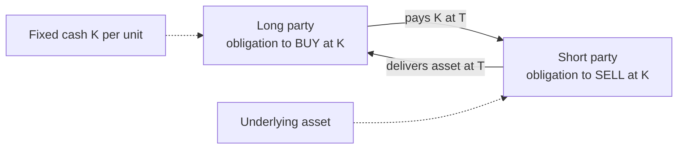
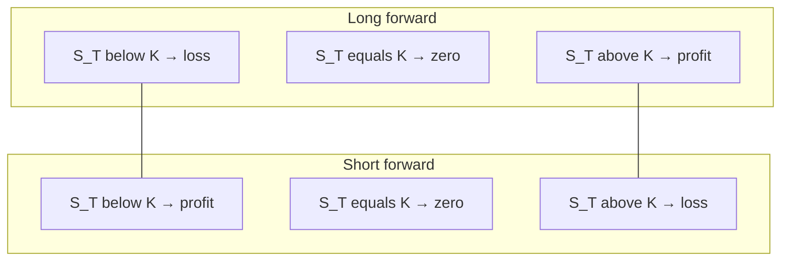
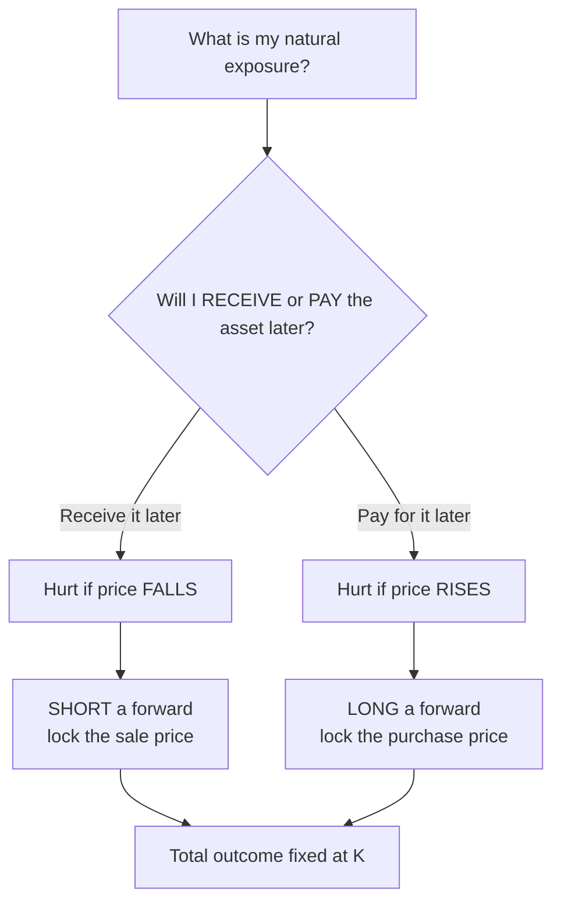
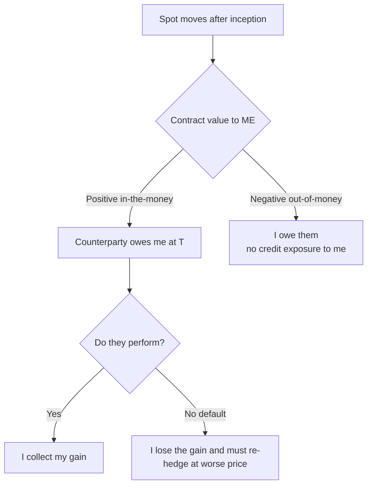

# Chapter 02 — Forward Contracts

## 1. The Problem / Need

Imagine you are the treasurer of an Indian jewellery exporter. Today is 3 July. You have just won a contract that will pay you **USD 1,000,000** on 3 October — three months from now. Today the spot exchange rate is INR 83.00 per USD, so on paper the deal is worth INR 8.30 crore. But you will not actually *receive* the dollars for 90 days, and you must convert them to rupees to pay your workers, your gold supplier and your electricity bill.

Here is the problem: **you do not know what the USD/INR rate will be on 3 October.** If the rupee strengthens to 80.00, your million dollars becomes only INR 8.00 crore — you have lost INR 30 lakh through no fault of your business. If it weakens to 86.00 you gain. You are not in the business of betting on currencies; you are in the business of making jewellery. This unwanted, involuntary exposure to a price you cannot control is called **price risk** (here, foreign-exchange risk).

The same problem appears everywhere:

- A **wheat farmer** in April does not know what wheat will sell for at harvest in September. A bad price could bankrupt him even after a good crop.
- A **bread factory** faces the mirror image: it does not know what it will *pay* for wheat in September, which makes its own bread pricing a guess.
- An **airline** buying jet fuel, a **power producer** buying coal, a **bank** with a loan repayment due in euros — all carry a future obligation at an unknown future price.

Each of these parties would happily give up the *upside* of a favourable price move in exchange for **certainty**. They want to lock the price *today* for a transaction that happens *later*. That is precisely what a forward contract does. The economic need is not speculation; it is the transfer of an unwanted risk from someone who has it (the hedger) to someone willing to bear it (a speculator or a counterparty with the opposite exposure).

The deepest point to carry forward: **a forward contract converts an uncertain future cash flow into a certain one.** It does not make the risk vanish from the world — it *reassigns* it.

---

## 2. The Core Idea

A **forward contract** is the simplest derivative there is. It is a **privately negotiated (over-the-counter, OTC) agreement between two parties to buy or sell a specified asset, in a specified quantity, on a specified future date, at a price fixed today.**

That fixed price is the **forward price** (also called the **delivery price**, denoted \(K\) or \(F\)). No money changes hands at the start. The whole transaction — the exchange of asset for cash — happens on the future **maturity / delivery date** \(T\).

Break the definition into its four locked-in terms:

| Term | Meaning | Example (exporter) |
|---|---|---|
| **Underlying asset** | What is being bought/sold | USD |
| **Quantity** | How much | USD 1,000,000 |
| **Delivery date \(T\)** | When | 3 October (90 days) |
| **Forward price \(K\)** | Agreed price per unit | INR 83.60 per USD |

The two sides have names:

- The party who agrees to **buy** the asset in the future is **long** the forward. She *locks in her purchase price*.
- The party who agrees to **sell** the asset in the future is **short** the forward. He *locks in his sale price*.

Our exporter *receives* dollars and wants to *sell* them for rupees, so she takes a **short USD forward** at K = 83.60. Whatever the market does, on 3 October she delivers USD 1m and receives INR 8.36 crore. Full stop. Certainty achieved.

The genius of the instrument is its symmetry: for every party who wants to lock a buy price there can be a party who wants to lock a sell price, and a forward binds them together. Both give up optionality. This distinguishes a forward from an **option** (a right, not an obligation) and its structure — being a custom OTC deal — distinguishes it from a **futures** contract (a standardised, exchange-traded cousin we meet in the next chapter).

*Figure 1 — the two obligations created by a single forward contract.*

---

## 3. Why / How It Works

Why can two parties agree *today* on a price for a trade that settles *later*, and why is that agreed price usually **not** equal to today's spot price?

The answer is the principle of **no-arbitrage** working through the idea of **cost of carry**.

Think about it from the short seller's point of view. Suppose you agree today to deliver 1 unit of gold in one year. One way to guarantee you can honour that promise is to **buy the gold now** and simply hold ("carry") it for a year until delivery. What does that cost you beyond the purchase price?

1. **Financing cost.** To buy the gold today at spot \(S_0\) you either spend cash you could have invested at the risk-free rate \(r\), or you borrow at \(r\). Either way, carrying the asset for time \(T\) costs you interest \(S_0 \cdot r \cdot T\).
2. **Storage / insurance cost** (for physical commodities): \(U\).
3. **Minus any income the asset throws off** while you hold it — dividends on a stock, coupon on a bond, or a convenience yield: \(I\) or yield \(q\).

The total of financing + storage − income is the **cost of carry**. The forward price must equal the spot price *grown by the cost of carry*, because if it did not, a risk-free money machine (arbitrage) would exist.

**The no-arbitrage argument (why it must hold):**

Suppose the fair carry-adjusted value is INR 100 but someone offers to buy gold forward at INR 110. An arbitrageur would:

- **Today:** borrow INR (the spot price) at rate \(r\), buy the gold at spot, and go short the forward at 110. Net cash today: zero (borrowed exactly what she spent).
- **At \(T\):** deliver the gold into the forward, collect 110, repay the loan-plus-interest of 100. Pocket a **risk-free INR 10** with no capital and no risk.

Everyone would pile into this trade — buying spot (pushing \(S_0\) up) and selling forward (pushing \(F\) down) — until the gap closes and \(F\) falls back to 100. The mirror trade (**reverse cash-and-carry**: short the asset, invest the proceeds, buy the forward) disciplines the price from below. The only price that admits *no* free lunch is:

\[
\boxed{F_0 = S_0 \,(1 + \text{net carry for period})}
\]

This is the intuition the prompt asks for: **forward price = spot × (1 + carry).** Everything else is a refinement of what goes into "carry."

The crucial insight: **the forward price is not a forecast of the future spot price.** It is not the market's opinion of where gold will be in a year. It is a purely mechanical, arbitrage-enforced relationship to *today's* spot and *today's* interest rate. Two traders can both agree gold will crash and still agree on exactly the same forward price, because the forward price is set by carry, not by prediction.

---

## 4. Full Content — Mechanics, Formulas and Payoffs

### 4.1 Forward pricing formulas (cost of carry)

**(a) Asset with no income or storage (simple interest, discrete):**
\[
F_0 = S_0\,(1 + rT)
\]

**(b) Continuous compounding (the standard academic form):**
\[
F_0 = S_0\, e^{rT}
\]

**(c) Asset paying a known cash income \(I\)** (present value of dividends/coupons, discrete):
\[
F_0 = (S_0 - I)\,(1 + rT) \qquad\text{or}\qquad F_0 = S_0 e^{rT} - I\,e^{rT}
\]
Income *reduces* the forward price because the holder of the actual asset receives that income while the forward buyer does not.

**(d) Asset paying a continuous dividend yield \(q\)** (stock index):
\[
F_0 = S_0\, e^{(r - q)T}
\]

**(e) Commodity with storage cost \(u\) (as a yield) and convenience yield \(y\):**
\[
F_0 = S_0\, e^{(r + u - y)T}
\]

**(f) Currency forward (covered interest rate parity)** — carry is the *interest-rate differential*. With domestic rate \(r_d\) and foreign rate \(r_f\):
\[
F_0 = S_0\,\frac{(1 + r_d T)}{(1 + r_f T)} \qquad\text{(discrete)}, \qquad F_0 = S_0\, e^{(r_d - r_f)T}\ \text{(continuous)}
\]
Here \(S_0\) is quoted as domestic currency per unit of foreign currency (e.g. INR per USD).

**Contango vs. backwardation.** When \(F_0 > S_0\) (positive net carry, the normal case) the market is in **contango**. When \(F_0 < S_0\) (e.g. a high convenience yield or high foreign interest rate) it is in **backwardation**.

### 4.2 Payoffs at maturity

Let \(S_T\) be the actual spot price of the asset on the delivery date. The contract forces a trade at the pre-agreed price \(K\).

**Long forward payoff** (you agreed to *buy* at \(K\); the thing is worth \(S_T\)):
\[
\text{Payoff}_{\text{long}} = S_T - K
\]

**Short forward payoff** (you agreed to *sell* at \(K\)):
\[
\text{Payoff}_{\text{short}} = K - S_T
\]

Because no premium is paid up front, **payoff equals profit** (ignoring the time value of money on any margin). The two payoffs are exact mirror images and sum to zero — a forward is a **zero-sum** contract between the two parties. One's gain is precisely the other's loss.

Note the **linear, unlimited** nature: the long profits without ceiling as \(S_T\) rises and loses all the way down to \(-K\) (if the asset became worthless), and vice-versa for the short. There is no optionality, no truncation — this is what makes forwards feel "dangerous" compared with options, and cheap compared with options (they cost nothing up front).

**Payoff table** for a long forward struck at \(K = 100\):

| \(S_T\) | Long payoff \(S_T - K\) | Short payoff \(K - S_T\) |
|---:|---:|---:|
| 70 | −30 | +30 |
| 85 | −15 | +15 |
| 100 | 0 | 0 |
| 115 | +15 | −15 |
| 130 | +30 | −30 |

Notice both cross zero exactly at \(S_T = K = 100\), the **break-even**.

*Figure 2 — long vs short forward payoff profiles crossing at the delivery price K.*

### 4.3 Value of a forward *during* its life

At inception the forward is designed to be **worth zero** to both sides (that is exactly why \(K\) is set equal to \(F_0\), the fair forward price). But as time passes and spot moves, the contract acquires value. The value of an existing **long** forward with delivery price \(K\), when the *current* fair forward price for the same maturity is \(F_t\), is the discounted difference:
\[
f_{\text{long}} = (F_t - K)\, e^{-r(T-t)} \qquad\text{equivalently}\qquad f_{\text{long}} = S_t - K e^{-r(T-t)}\ \text{(no-income asset)}
\]
This matters for **mark-to-market** and for the credit-risk discussion in §4.6.

### 4.4 Settlement

Two ways the contract can be closed out at \(T\):

- **Physical (deliverable) settlement.** The short actually delivers the asset and the long actually pays \(K\). Used for commodities a party genuinely wants (a refiner taking crude), and for deliverable FX forwards.
- **Cash settlement.** No asset changes hands. The loser simply pays the winner the payoff amount, \(|S_T - K|\). Used where delivery is impractical (a stock-index forward) or unwanted. An **NDF (Non-Deliverable Forward)** is a cash-settled currency forward used where a currency is not freely convertible (e.g. offshore INR, KRW, BRL NDFs settle in USD against a fixing rate).

Either way the *economics are identical* — cash settlement just nets the physical trade.

### 4.5 Hedging with forwards

A hedge works by taking a forward position whose payoff **moves opposite** to the exposure you already carry, so the two cancel.

- If you will **receive** an asset/currency in future (a "long" natural exposure — you are hurt if its price falls), you **short a forward** to lock the sale price. (Our exporter.)
- If you must **buy** an asset/currency in future (a "short" natural exposure — you are hurt if its price rises), you **go long a forward** to lock the purchase price. (The bread factory, the airline.)

The result is a **locked total outcome** regardless of \(S_T\): gains on the physical position are offset by losses on the forward and vice-versa. The hedger deliberately gives up favourable moves to eliminate unfavourable ones. We prove this numerically in Example 3.

*Figure 3 — decision logic for which side of a forward to take when hedging.*

### 4.6 Counterparty / default risk in OTC forwards

Because a forward is a **private, bilateral OTC contract**, there is no exchange or clearing house standing in the middle guaranteeing performance. This creates **counterparty credit risk (default risk)**: the risk that the party who *ends up owing money* fails to pay or deliver at \(T\).

The credit exposure is one-sided and time-varying, given by the contract's current value (§4.3):

- If the contract has moved **in your favour** (positive value to you), the *other* side owes you — you are exposed to their default. If they walk away, you lose that gain and must re-hedge at the now-worse market price.
- If the contract is **against you**, you owe them; you have no credit exposure (you are the risk *to* them).

Key features of this risk:

1. **No daily settlement.** Unlike futures, a forward is not marked-to-market daily with margin, so losses **accumulate** over the whole life of the contract and land in one lump at \(T\). A large, in-the-money position can build a big uncollateralised claim.
2. **Wrong-way risk.** Default is likeliest exactly when markets have moved violently — which is also when the contract value (and hence exposure) is largest. The two correlate badly.
3. **Illiquidity / no easy exit.** Being custom, a forward cannot simply be sold to a third party. To unwind you must either negotiate a novation/tear-up with the same counterparty or enter an *offsetting* forward with someone else (which leaves you with two contracts and *two* counterparties).
4. **Mitigants** used in practice: signing an **ISDA Master Agreement** with a **Credit Support Annex (CSA)** requiring **collateral/margin**, netting of offsetting trades, dealing only with high-rated counterparties, and setting credit limits. These features are exactly what the **futures** market institutionalises via the clearing house — the subject of the next chapter.

*Figure 4 — how in-the-money value turns into counterparty exposure on an OTC forward.*

---

## 5. Worked Examples

### Example 1 — Pricing a stock forward by cost of carry (with and without dividends)

**Setup.** A share trades at spot \(S_0 = \text{INR } 500\). The risk-free rate is \(r = 8\%\) per annum. A forward contract matures in **6 months** (\(T = 0.5\)).

**(a) No dividends.** Using discrete simple interest, \(F_0 = S_0(1 + rT)\):
\[
F_0 = 500 \times (1 + 0.08 \times 0.5) = 500 \times 1.04 = \text{INR } 520.00
\]

**Self-check via the arbitrage table.** Suppose instead a dealer quoted the forward at 530 (too high). Arbitrage:

| | Today (t=0) | At T (6 months) |
|---|---|---|
| Borrow INR 500 at 8% | +500 | −520 (repay principal+interest) |
| Buy 1 share at spot | −500 | hold, then deliver |
| Short forward at 530 | 0 | +530 (deliver share, receive K) |
| **Net** | **0** | **+10 risk-free** |

A guaranteed INR 10 from zero investment proves 530 is too high; competition drives \(F\) to 520 where the "Net at T" becomes exactly 0. **The formula reconciles with the no-arbitrage table.** ✔

**(b) With a dividend.** Now suppose the share pays an INR 12 dividend in 3 months (\(t=0.25\)). Present value of the dividend, discounted at 8%:
\[
I = \frac{12}{1 + 0.08 \times 0.25} = \frac{12}{1.02} = \text{INR } 11.76
\]
Then \(F_0 = (S_0 - I)(1 + rT) = (500 - 11.76)(1.04) = 488.24 \times 1.04 = \text{INR } 507.77\).

**Sense check:** the dividend *lowers* the forward from 520 to ≈ 507.77, because the person holding the actual share pockets INR 12 that the forward buyer does not — so the forward buyer should pay less. ✔ The drop (≈12.23) is roughly the dividend grown to maturity (12 × 1.02 ≈ 12.24), exactly as \(F_0 = S_0 e^{rT}-Ie^{rT}\)-style logic predicts. ✔

---

### Example 2 — Currency forward and the long/short payoff (the exporter)

**Setup.** Return to the jewellery exporter. Today \(S_0 = \text{INR } 83.00\) per USD. Indian (domestic) 3-month rate \(r_d = 7\%\) p.a.; US (foreign) 3-month rate \(r_f = 5\%\) p.a. Term \(T = 0.25\).

**Fair 3-month forward (covered interest parity, discrete):**
\[
F_0 = S_0\,\frac{1 + r_d T}{1 + r_f T} = 83.00 \times \frac{1 + 0.07(0.25)}{1 + 0.05(0.25)} = 83.00 \times \frac{1.0175}{1.0125}
\]
\[
= 83.00 \times 1.004938 = \text{INR } 83.41 \text{ per USD}
\]

The rupee trades at a **forward premium** (INR interest rate exceeds USD, so USD is "expensive" forward) — this is contango. The exporter takes a **short USD forward** at \(K = 83.41\) on USD 1,000,000, locking in INR 8.341 crore.

**Payoff table at maturity** (short forward, \(K = 83.41\)):

| Realised \(S_T\) (INR/USD) | Sell dollars in market → INR crore | Forward payoff \((K - S_T)\times\)1m → INR crore | **Total locked (market + forward)** |
|---:|---:|---:|---:|
| 80.00 | 8.000 | +0.341 | **8.341** |
| 82.00 | 8.200 | +0.141 | **8.341** |
| 83.41 | 8.341 | 0.000 | **8.341** |
| 85.00 | 8.500 | −0.159 | **8.341** |
| 88.00 | 8.800 | −0.459 | **8.341** |

**Reconciliation:** every row totals **INR 8.341 crore**. That is the whole point of the hedge — the exporter's total rupee proceeds are **fixed at K × quantity regardless of \(S_T\)**. When the rupee strengthens to 80 the market conversion is poor but the forward pays +0.341 crore to make up the difference; when the rupee weakens to 88 the market conversion is great but the forward costs 0.459 crore, clawing the windfall back. Certainty, at the cost of upside. ✔

The **counterparty (say, a bank)** holds the mirror **long USD forward** at 83.41. Its payoff column is exactly the negative of the exporter's forward column (+0.159 crore when \(S_T=85\), etc.) — a zero-sum outcome between the two.

---

### Example 3 — Hedging a commodity purchase, and the cost of default

**Setup.** A biscuit maker will buy **100 tonnes of wheat** in 3 months. Spot wheat = INR 25,000/tonne; \(r = 6\%\) p.a.; storage cost has PV of INR 200/tonne payable now; \(T = 0.25\). The firm fears rising prices, so it **goes long a wheat forward**.

**Forward price** (storage adds to carry; treat storage like a negative income, i.e. add its future value):
\[
F_0 = (S_0 + \text{PV storage})(1 + rT) = (25{,}000 + 200)(1 + 0.06 \times 0.25)
\]
\[
= 25{,}200 \times 1.015 = \text{INR } 25{,}578 \text{ per tonne}
\]
So the firm locks a purchase price of **INR 25,578/tonne** → INR 25.578 lakh for 100 tonnes.

**Hedge outcome table** (long forward, \(K = 25{,}578\)):

| \(S_T\) (INR/tonne) | Cost to buy 100 t in market (INR lakh) | Forward payoff \((S_T-K)\times100\) (INR lakh) | **Net effective cost (INR lakh)** |
|---:|---:|---:|---:|
| 23,000 | 23.000 | −2.578 | **25.578** |
| 25,578 | 25.578 | 0.000 | **25.578** |
| 28,000 | 28.000 | +2.422 | **25.578** |

**Reconciliation:** net effective cost is **INR 25.578 lakh in every scenario** — the long forward converts a variable purchase cost into a fixed one. The gain on the forward when prices rise (+2.422 lakh at 28,000) exactly offsets the higher market purchase cost. ✔

**Now the default twist.** Say wheat rises to \(S_T = 28{,}000\). The biscuit maker's forward is **in-the-money by INR 2.422 lakh** — the counterparty (a grain trader who is short) owes that amount. If the grain trader **defaults**, the biscuit maker:

- loses the INR 2.422 lakh expected forward gain, and
- must now buy wheat in the open market at 28,000, i.e. its effective cost jumps from the hedged 25.578 lakh to the unhedged **28.000 lakh** — a **2.422 lakh** loss versus plan.

This is the concrete meaning of §4.6: default hurts you *precisely when the contract has moved in your favour*, and an OTC forward gives you no clearing house to fall back on. Had this been an exchange-traded future with daily margin, the gain would have been collected in cash day-by-day and the default exposure kept near zero.

---

## 6. Connections

- **Forwards → Futures (Ch. 03).** A future *is* a forward that has been **standardised** (fixed contract sizes, dates), **exchange-traded**, and **cleared with daily mark-to-market and margining**. Everything painful about forwards — counterparty risk, illiquidity, custom terms — is exactly what futures institutionalise away, at the cost of flexibility. When interest rates are deterministic, forward and futures prices are theoretically equal.
- **Forwards → Options (Ch. 04-05).** A forward is an *obligation*; an option is a *right*. Crucially, **put–call parity** shows a synthetic forward: *long call + short put at the same strike K = a long forward*. Their combined payoff \((\max(S_T-K,0)) - (\max(K-S_T,0)) = S_T - K\) is exactly the long-forward payoff. Forwards are the linear backbone from which option payoffs are built.
- **Forwards → Swaps (Ch. 06).** A **swap** is essentially a *portfolio of forwards* stacked across many future dates (e.g. an interest-rate swap = a strip of forward rate agreements). Mastering one forward is the unit-cell for understanding swaps.
- **Cost of carry → no-arbitrage pricing.** The carry argument here is the same replication/no-arbitrage logic that underpins all of derivatives pricing, including Black-Scholes.
- **Covered interest rate parity** (Example 2) is a cornerstone of international finance, directly linking FX forwards to interest-rate differentials.

---

## 7. Key Terms

- **Forward contract** — customised OTC agreement to buy/sell an asset at a future date for a price fixed today.
- **Long / short** — the buyer (obligated to purchase) / seller (obligated to sell) in the forward.
- **Forward / delivery price (K, F₀)** — the price fixed today for future exchange; set so the contract is worth zero at inception.
- **Spot price (S₀, Sₜ)** — the price for immediate delivery, today and at maturity.
- **Cost of carry** — financing + storage − income; the bridge between spot and forward price.
- **Contango / backwardation** — forward above spot / forward below spot.
- **Covered interest rate parity** — FX forward pricing rule using the interest-rate differential.
- **Cash vs. physical settlement** — netting the payoff in cash vs. actually delivering the asset.
- **NDF (Non-Deliverable Forward)** — cash-settled currency forward for non-convertible currencies.
- **Counterparty / default risk** — risk the losing side fails to perform; the defining hazard of OTC forwards.
- **Mark-to-market value** — the current worth of an existing forward, \((F_t - K)e^{-r(T-t)}\).
- **Wrong-way risk** — exposure being largest exactly when the counterparty is most likely to default.
- **ISDA / CSA** — legal master agreement and collateral annex used to mitigate OTC credit risk.

---

## 8. Common Confusions

1. **"The forward price is the market's forecast of the future spot."** No. \(F_0\) is fixed by *carry and arbitrage* off today's spot and rate. It equals the expected future spot only under strong assumptions (risk-neutrality, no risk premium). Two traders with opposite forecasts agree on the same \(F_0\).
2. **"You pay for a forward up front, like an option premium."** No. A forward costs **zero** at inception — \(K\) is chosen so both sides start at zero value. Money moves only at maturity (or as collateral/margin under a CSA).
3. **Payoff vs. profit.** For an *option* they differ (profit = payoff − premium). For a *forward*, because there is no premium, **payoff = profit**.
4. **"Forward price and value are the same thing."** The **price** \(K\) is locked at inception; the **value** starts at zero and drifts as spot moves. Confusing the two wrecks the credit-risk analysis.
5. **Which side to take when hedging.** Hedgers routinely pick the wrong leg. Rule: hedge the *opposite* of your natural exposure. If you will *receive/sell* the asset later, go **short**; if you will *buy* it later, go **long**.
6. **"Forwards eliminate risk."** They eliminate *price* risk on the hedged item but *introduce* **counterparty credit risk**, and they remove *upside* too. Risk is transferred and transformed, not deleted.
7. **Contango is not "the market is bullish."** Contango (\(F>S\)) usually just reflects positive carry (interest/storage), not a directional view.
8. **Dividends/income raise the forward.** They *lower* it — the asset-holder, not the forward buyer, receives the income, so the forward should cost less.

---

## 9. Recap

- A **forward** is a customised OTC contract to trade an asset at a future date \(T\) for a price \(K\) fixed today; nothing is paid at inception.
- The **long** is obligated to buy (payoff \(S_T - K\)); the **short** is obligated to sell (payoff \(K - S_T\)). The two are exact mirror images — a **zero-sum**, linear, unlimited-risk profile with break-even at \(S_T = K\).
- The fair forward price comes from **cost of carry / no-arbitrage**: \(F_0 = S_0(1 + \text{net carry})\), refined to \(S_0e^{rT}\), \((S_0-I)e^{rT}\), \(S_0e^{(r-q)T}\), or the currency form \(S_0\frac{1+r_dT}{1+r_fT}\). It is a mechanical relationship, **not a forecast**.
- **Hedging**: take the forward leg opposite your natural exposure; the total outcome then locks at \(K \times\) quantity regardless of \(S_T\), sacrificing upside for certainty (verified to reconcile in Examples 2 and 3).
- Being OTC, forwards carry **counterparty/default risk** — one-sided, growing over the life of the trade (no daily margin), worst under wrong-way risk, hard to exit. Mitigated by ISDA/CSA collateral; institutionalised away by futures.

---

## 10. Quick-Reference / Interview Points

**Formulas to have cold:**

| Situation | Forward price |
|---|---|
| No income (discrete / continuous) | \(S_0(1+rT)\) / \(S_0e^{rT}\) |
| Known income \(I\) (PV) | \((S_0 - I)(1+rT)\) |
| Dividend yield \(q\) (index) | \(S_0 e^{(r-q)T}\) |
| Commodity, storage \(u\), convenience \(y\) | \(S_0 e^{(r+u-y)T}\) |
| Currency (CIP) | \(S_0\frac{1+r_dT}{1+r_fT}\) |
| Value of existing long forward | \((F_t-K)e^{-r(T-t)} = S_t - Ke^{-r(T-t)}\) |
| Long / short payoff | \(S_T - K\) / \(K - S_T\) |

**One-liners interviewers want:**

- *"A forward locks a future price today, costs nothing up front, and settles entirely at maturity."*
- *"Forward price is set by cost of carry and no-arbitrage — it is NOT a prediction of the future spot."*
- *"Long profits if spot rises above K, short profits if it falls below K; it's a zero-sum, linear payoff."*
- *"Hedge the opposite of your exposure: receive-the-asset → short forward; pay-for-the-asset → long forward. Total outcome then locks at K."*
- *"The big flaw of OTC forwards is counterparty default risk — no clearing house, no daily margin, losses accumulate, and default bites hardest when you're most in-the-money (wrong-way risk). Futures fix this via a clearing house and daily mark-to-market."*
- *"A synthetic long forward = long call + short put at the same strike (put-call parity). A swap = a strip of forwards."*

**Fast reconciliation habit:** after any hedge computation, build the payoff table across three spot scenarios (below K, at K, above K) and confirm the *total* outcome is constant. If it is not constant, the hedge or the sign of the position is wrong.

**Contango vs backwardation:** \(F>S\) contango (normal, positive carry); \(F<S\) backwardation (high convenience yield or high foreign rate).
