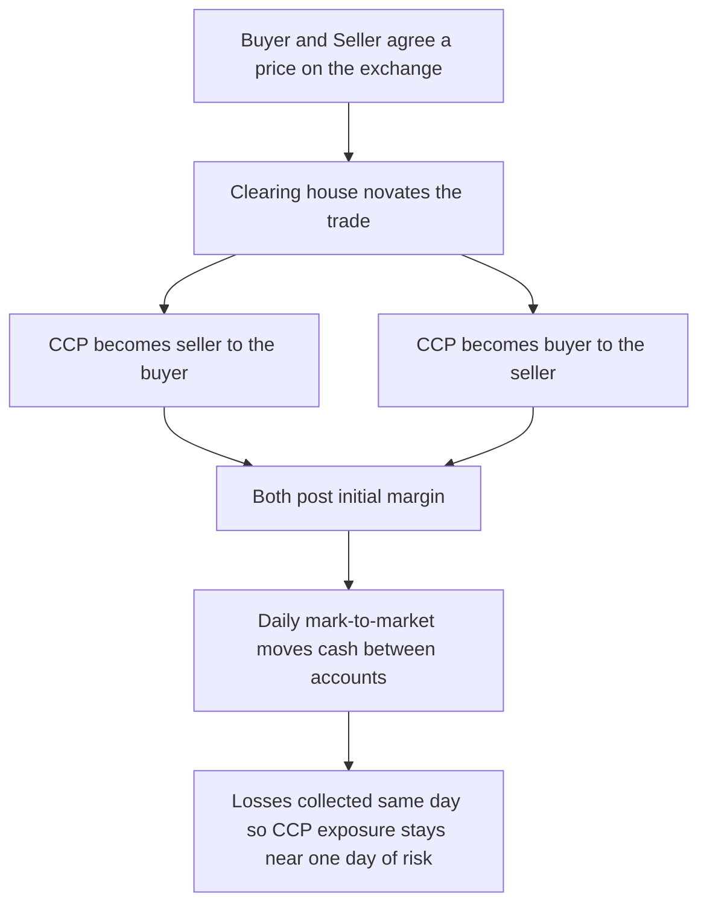
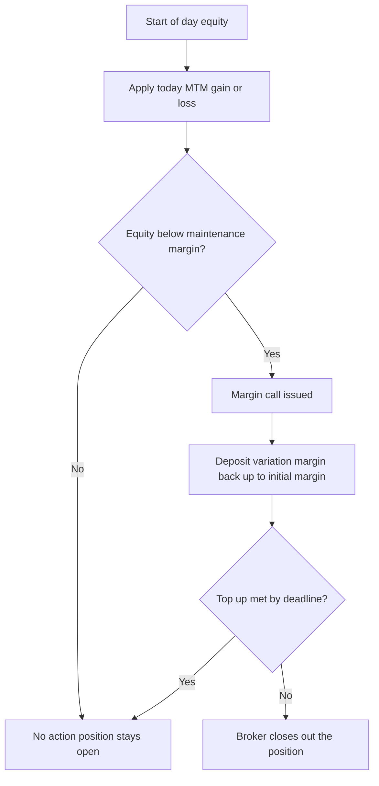
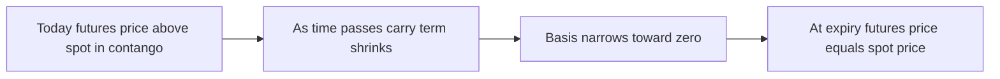

# Chapter 03 — Futures Contracts

## 1. The Problem / The Need

In the previous chapter we met the forward contract: a private, bilateral agreement to buy or sell an asset at a fixed price on a future date. Forwards are beautifully flexible — you can customise the quantity, the delivery date, the underlying, and the settlement location to fit exactly what you need. But that flexibility hides four expensive problems that get worse the moment you try to trade at scale.

**Problem 1 — Counterparty (default) risk.** A forward is only as good as the person on the other side. If I lock in a price to sell wheat to you at 220 per quintal for June delivery, and by June the market price has collapsed to 150, you have a strong incentive to walk away — buying in the open market is 70 cheaper. My "hedge" evaporates precisely when I need it. Every forward carries the latent risk that the loser refuses to pay.

**Problem 2 — Illiquidity.** Because a forward is bespoke, it is hard to exit. Suppose halfway through I change my mind and want out. I cannot simply sell "my forward" to a stranger — the terms were negotiated for my counterparty and me. My only escape is to negotiate a reversing forward, often with the same counterparty, who now knows I am desperate and prices accordingly.

**Problem 3 — Price opacity and search cost.** To strike a forward I must find a willing counterparty, negotiate terms, and assess their creditworthiness. There is no public price. Two farmers hedging the same crop on the same day might get wildly different prices depending on who they happen to know.

**Problem 4 — Credit concentration.** Every open forward is a private IOU. In a network of thousands of bilateral IOUs, the failure of one large player can cascade — the classic domino risk that turned localized shocks into system-wide crises (AIG in 2008 was, at heart, a book of un-margined bilateral derivatives).

The futures contract is the market's engineered answer to all four problems at once. It asks: *what if we took the economic idea of a forward, stripped out the customisation, standardised everything, listed it on an exchange, and inserted a bulletproof intermediary who guarantees every trade?* The result is an instrument that trades like a stock — anonymous, liquid, transparent, and virtually default-free — while delivering the same price-locking economics as a forward.

---

## 2. The Core Idea

> **A futures contract is an exchange-traded, standardised forward contract whose counterparty risk is removed by a central clearing house through daily mark-to-market settlement and margining.**

Unpack that one sentence and you have the whole chapter:

- **Exchange-traded** — it is bought and sold on a regulated public exchange (CME, NSE, ICE), not negotiated privately. Prices are visible to all.
- **Standardised** — the exchange fixes the contract size, quality, delivery date and location. The *only* thing left to negotiate is the price. This is what makes one contract fungible with every other of the same series, which is what creates liquidity.
- **Central clearing house** — a well-capitalised intermediary steps between every buyer and seller and becomes the counterparty to both. You never actually face the person you traded with; you face the clearing house.
- **Daily mark-to-market (MTM)** — instead of letting gains and losses accumulate silently until maturity (as a forward does), a future is re-valued every single day and the day's profit or loss is settled in cash overnight. A future is, in effect, a forward that is torn up and rewritten at the closing price every evening.
- **Margining** — both parties post a good-faith performance deposit (initial margin) and must top it up (maintenance margin) so that the clearing house is never exposed to more than roughly one day of adverse price movement.

The genius is that these features reinforce each other. Standardisation creates fungibility → fungibility creates liquidity → liquidity lets the clearing house net offsetting positions → netting plus daily margining keeps its exposure tiny → tiny exposure makes the guarantee credible → the credible guarantee lets strangers trade anonymously → which deepens liquidity further. It is a self-reinforcing machine.

---

## 3. Why / How It Works

The economic payoff of a future is identical to a forward: if you are **long** at futures price $F_0$ and the asset is worth $S_T$ at expiry, your total gain is $S_T - F_0$. Nothing about the *economics* changes. What changes is the **plumbing** that makes the economics safe to trade at scale. Let us see why each piece is necessary.

**Why standardise?** Liquidity is a network effect. A market where every contract is slightly different has no depth — there is no queue of buyers for *your specific* terms. By forcing everyone into identical buckets (e.g. every gold future is exactly 1 kilogram, February delivery, 995 purity), the exchange concentrates all supply and demand for that bucket into a single order book. Now there is always someone to trade against, and exiting is as easy as entering: you simply take the opposite position in the same series and your net exposure is zero.

**Why a clearing house?** Consider the counterparty problem. In a forward, if your counterparty defaults you lose your entire gain. The clearing house (also called the central counterparty, or CCP) solves this by **novation**: the instant a trade is agreed, the original contract is legally split into two — buyer-vs-CCP and CCP-vs-seller. The CCP is now the buyer to every seller and the seller to every buyer. Its net market position is always zero (every long it holds is matched by a short), so it has no directional risk. Its only risk is that a *member defaults*, and it defends against that with margins and a default fund.

**Why daily mark-to-market?** This is the masterstroke. In a forward, a loss builds up invisibly over months, so the total amount at risk if you default grows to a large number. The CCP refuses to let that happen. Every evening it computes each account's gain or loss versus the day's settlement price and *moves cash* accordingly — winners are credited, losers are debited, that same night. Because losses are collected daily, the maximum a defaulter can owe is roughly *one day's* adverse move — a small, manageable number that the posted margin already covers. MTM converts a large, slow-building credit exposure into a series of tiny, freshly-settled ones.

**Why margin?** Margin is the buffer that lets the CCP survive the gap between "a member stopped paying" and "we closed out their position." Initial margin is sized (using historical volatility, e.g. via a SPAN model) to cover a worst-case one-to-two-day move at high confidence. Maintenance margin is the trigger: let the balance erode past it and you get a margin call to restore the account. If you fail, the CCP liquidates your position using your margin as the cushion.

*Figure 1 — Novation and daily settlement: how the clearing house interposes itself and keeps its own exposure tiny.*

---

## 4. Full Content — Mechanics, Formulas and Payoffs

### 4.1 Contract specifications

A futures contract is defined by a **specification sheet** published by the exchange. Every element except price is fixed. Typical fields:

| Spec element | What it fixes | Example (gold future) |
|---|---|---|
| Underlying asset | Exactly what is deliverable | Gold, 995 fineness |
| Contract size (lot) | Quantity per contract | 1 kilogram |
| Price quotation | Units the price is stated in | per 10 grams |
| Tick size | Minimum price increment | 1.00 currency unit |
| Tick value | Cash value of one tick | tick size × lot size |
| Delivery / expiry month | Standardised maturity dates | monthly cycle, last Thursday |
| Settlement type | Physical delivery or cash | Physical or cash-settled |
| Delivery location | Where/how delivery occurs | Approved exchange vault |
| Position limits | Max contracts per participant | Set by exchange/regulator |
| Trading hours | When the order book is open | Exchange session |

Two derived numbers matter constantly:

- **Notional (contract) value** = futures price × lot size. This is the economic exposure one contract represents.
- **Tick value** = tick size × lot size. This is how much money you make or lose per minimum price move — the granularity of your P&L.

### 4.2 The margin system

Margin is *not* a down-payment or a cost — it is a refundable performance bond. You get it back (adjusted for P&L) when you close out.

- **Initial margin (IM):** the deposit required to open a position. Sized to cover an extreme one-to-two-day move.
- **Maintenance margin (MM):** a floor, usually 70–80% of IM. If your account equity falls below MM, you receive a **margin call**.
- **Margin call / variation margin:** when called, you must deposit enough to bring the balance **back up to the initial margin** (not merely back to maintenance). This top-up is the variation margin.
- **Marking to market:** each evening the account is debited/credited by (today's settlement − yesterday's settlement) × lot size × number of contracts × position sign.

The **leverage** implication is large. If IM is, say, 5% of notional, you control 100 of exposure with 5 of capital — 20× leverage. This magnifies both returns and losses, which is exactly why the daily margin discipline exists.

*Figure 2 — The daily margin cycle: mark to market, test against maintenance, call if breached.*

### 4.3 Pricing — the cost-of-carry model

A future is priced by **cost of carry**, identical to a forward under deterministic rates. The fair futures price is the spot price compounded at the financing cost, adjusted for any income or storage the asset generates while held:

$$F_0 = S_0 \times (1 + r - q)^{T}$$

with continuous compounding often written $F_0 = S_0 \, e^{(r - q)T}$, where:

- $S_0$ = current spot price
- $r$ = risk-free financing rate
- $q$ = income yield of holding the asset (dividend yield for equities, convenience yield net of storage for commodities)
- $T$ = time to expiry in years

The intuition is arbitrage. If I can borrow at $r$, buy the asset today, carry it (earning $q$) and deliver it at $T$, then the no-arbitrage price to sell it forward must exactly equal my carrying cost $S_0(1+r-q)^T$. If the future traded higher, I'd buy spot, sell the future, and pocket a riskless profit (**cash-and-carry arbitrage**); if lower, I'd do the reverse (**reverse cash-and-carry**). Arbitrageurs enforce the equality.

For commodities where storage costs money, write $F_0 = S_0(1+r+u-y)^T$ where $u$ is storage cost and $y$ is the convenience yield of physically holding the good.

### 4.4 Basis and convergence

The **basis** is the difference between the spot and the futures price:

$$\text{Basis} = S_0 - F_0$$

(Some textbooks define it as futures minus spot — always check the sign convention. We use spot − futures here.)

- When $F_0 > S_0$ (basis negative), the market is in **contango** — normal for assets with positive net carry.
- When $F_0 < S_0$ (basis positive), the market is in **backwardation** — common when there is a convenience yield or a supply squeeze.

The crucial property is **convergence**: as expiry approaches, $T \to 0$, so the carry term $(1+r-q)^T \to 1$ and $F_T \to S_T$. At the moment of expiry the futures price must equal the spot price, because a future *is* the asset at that instant — otherwise instant arbitrage. Therefore the basis **converges to zero at expiry**.

*Figure 3 — Convergence: the gap between futures and spot closes to zero as expiry arrives.*

Convergence is what makes hedging with futures work: a hedger knows that whatever basis exists today will vanish by delivery, so a position held to expiry locks in today's futures price with certainty. The residual uncertainty from closing *before* expiry — because the basis on that earlier date is not perfectly predictable — is called **basis risk**, and it is the main imperfection in real-world futures hedging.

### 4.5 Payoff structure

Ignoring the timing of cash flows, the payoff at expiry is linear and symmetric — identical to a forward:

- **Long future:** payoff $= S_T - F_0$
- **Short future:** payoff $= F_0 - S_T$

| Spot at expiry $S_T$ | Long payoff $S_T - F_0$ | Short payoff $F_0 - S_T$ |
|---|---|---|
| Far below $F_0$ | Large loss | Large gain |
| $= F_0$ | Zero | Zero |
| Far above $F_0$ | Large gain | Large loss |

Unlike an option, there is **no premium** and **no cap** on either side — the long profits unboundedly as prices rise and loses steadily as they fall, and vice versa for the short. It is a pure, zero-sum, two-way bet. The difference from a forward is *when* that payoff arrives: a forward delivers it all in a lump at $T$; a future delivers it in daily increments via MTM, so the *sum* of all daily settlements equals $S_T - F_0$ (as we will verify numerically).

### 4.6 Forwards versus futures — the full comparison

| Feature | Forward | Future |
|---|---|---|
| Where traded | Over-the-counter (private) | Organised exchange |
| Terms | Fully customised | Standardised by exchange |
| Counterparty | The other party directly | The clearing house (CCP) |
| Default risk | Significant, bilateral | Virtually none (novated + margined) |
| Margin | Usually none (or bilateral CSA) | Initial + maintenance, mandatory |
| Settlement of P&L | Once, at maturity | Daily mark-to-market |
| Liquidity / exit | Hard; negotiate a reversal | Easy; trade an offsetting contract |
| Price transparency | Opaque | Public, continuous |
| Regulation | Light | Heavy (exchange + regulator) |
| Delivery | Usually physical at maturity | Often closed out before delivery |
| Cash-flow interim | None until maturity | Cash moves every day |

A subtle but important theoretical point: because a future settles daily, its cash flows have a slightly different *timing* than a forward's single terminal cash flow. When interest rates are correlated with the asset price, this makes futures and forward prices diverge marginally (the **convexity / daily-settlement effect**). When rates are constant or uncorrelated with the underlying, futures and forward prices are theoretically equal. For most practical purposes over short horizons the two prices are treated as identical.

---

## 5. Worked Examples

### Example 1 — The margin account, day by day (with self-verification)

A trader goes **long 1 gold future**. Lot size = 100 grams (price quoted per gram). Entry futures price $F_0 = 6{,}000$ per gram.

- Notional value = 6,000 × 100 = **600,000**
- Initial margin (say 5% of notional) = **30,000**
- Maintenance margin (80% of IM) = **24,000**

Each day the account is marked to market: daily cash flow = (today's settlement − prior settlement) × 100 grams (positive because long).

| Day | Settle price | Price change | Daily MTM (×100) | Account before top-up | Margin call? | Deposit | Balance after |
|---|---|---|---|---|---|---|---|
| 0 (open) | 6,000 | — | — | 30,000 | — | — | 30,000 |
| 1 | 5,950 | −50 | −5,000 | 25,000 | No (≥24,000) | 0 | 25,000 |
| 2 | 5,880 | −70 | −7,000 | 18,000 | Yes (<24,000) | 12,000 | 30,000 |
| 3 | 5,940 | +60 | +6,000 | 36,000 | No | 0 | 36,000 |
| 4 | 6,030 | +90 | +9,000 | 45,000 | No | 0 | 45,000 |

Let me walk Day 2 carefully. Start balance 25,000. Price falls 70 → MTM = −70 × 100 = −7,000 → balance 18,000, which is below the 24,000 maintenance floor. Margin call: top **back up to initial margin** 30,000, so deposit = 30,000 − 18,000 = **12,000**. New balance 30,000.

**Self-verification — reconcile total P&L two independent ways.**

*Method A — sum of daily MTM:* −5,000 − 7,000 + 6,000 + 9,000 = **+3,000**.

*Method B — price move × lot:* Final settle 6,030 − entry 6,000 = +30 per gram × 100 = **+3,000**. ✓

*Method C — cash accounting via the account:* Total deposited = 30,000 (initial) + 12,000 (call) = 42,000. Final balance = 45,000. Net gain = 45,000 − 42,000 = **+3,000**. ✓

All three agree. The daily settlements, however messy, sum exactly to the simple $(S_T - F_0) \times \text{lot}$ figure a forward would have paid in one shot. That is the whole point of MTM: it re-distributes the *timing* of the cash flows without changing the *total*.

### Example 2 — Fair futures price by cost of carry, and spotting arbitrage

An equity index stands at $S_0 = 20{,}000$. The financing rate is $r = 8\%$ per annum, the index dividend yield is $q = 2\%$, and the future expires in $T = 3$ months = 0.25 years.

**Fair price:**
$$F_0 = 20{,}000 \times (1 + 0.08 - 0.02)^{0.25} = 20{,}000 \times (1.06)^{0.25}$$

Now $(1.06)^{0.25}$: take $\ln 1.06 = 0.058269$, times 0.25 = 0.014567, exponentiate → 1.014674. So:
$$F_0 = 20{,}000 \times 1.014674 = \mathbf{20{,}293.5}$$

So the fair 3-month future is about **20,294**, i.e. a ~294-point premium to spot (contango, as expected with positive net carry of 6%).

**Basis** = $S_0 - F_0$ = 20,000 − 20,294 = **−294** (negative basis = contango). ✓ consistent with $F > S$.

**Arbitrage check.** Suppose the future is actually quoting **20,450** in the market — richer than fair. Cash-and-carry:

1. Borrow 20,000 at 8% for 3 months; buy the index spot.
2. Sell the future at 20,450.
3. Over the quarter, collect dividends: 2% × 0.25 × 20,000 ≈ 100 (using simple approximation).
4. At expiry deliver the index into the short future, receiving 20,450.
5. Repay the loan: 20,000 × (1.08)^{0.25} ≈ 20,000 × 1.019427 = 20,388.5.

Net riskless profit ≈ 20,450 (from future) + 100 (dividends) − 20,388.5 (loan repay) − 0 ≈ **+161.5 per unit**, with no market risk. Arbitrageurs pile in, selling the future until it falls back toward 20,294 and the profit vanishes. This is exactly the force that pins $F_0$ to the cost-of-carry value.

### Example 3 — Convergence and basis at expiry

Take the same index future. Suppose the trader holds it and we watch the basis decay. The theoretical futures price at time $t$ before expiry is $F_t = S_t (1.06)^{\,\tau}$ where $\tau$ is time remaining. Assume spot stays flat at 20,000 to isolate the carry effect:

| Time to expiry $\tau$ | Carry factor $(1.06)^\tau$ | Futures price $F_t$ | Basis $S - F$ |
|---|---|---|---|
| 0.25 yr (3 mo) | 1.014674 | 20,293.5 | −293.5 |
| 0.167 yr (2 mo) | 1.009759 | 20,195.2 | −195.2 |
| 0.083 yr (1 mo) | 1.004868 | 20,097.4 | −97.4 |
| 0.019 yr (1 wk) | 1.001121 | 20,022.4 | −22.4 |
| 0 (expiry) | 1.000000 | 20,000.0 | **0.0** |

The basis shrinks monotonically and hits **exactly zero at expiry**, where $F_T = S_T = 20{,}000$. This is convergence in numbers. A hedger who shorted the future at 20,293.5 and holds to expiry against a spot position has locked in that 293.5-point carry regardless of where spot finishes — precisely why futures are trusted hedging instruments.

**Reconciling the hedge.** Say a fund owns the index (worth 20,000) and shorts the future at 20,293.5 to lock a sale. If at expiry spot = 18,000: the physical portfolio is worth 18,000 (down 2,000), but the short future gains $20{,}293.5 - 18{,}000 = +2{,}293.5$. Combined: 18,000 + 2,293.5 = **20,293.5** — exactly the futures price locked in, independent of the crash. If instead spot rallies to 23,000: portfolio 23,000, short future loses $20{,}293.5 - 23{,}000 = -2{,}706.5$, combined = **20,293.5** again. The lock holds both ways. ✓

---

## 6. Connections

- **To forwards (Ch. 02):** a future is a forward with the credit risk engineered out and the P&L settled daily. Same payoff, different plumbing. Understanding the forward payoff $S_T - F_0$ is the prerequisite; the future just adds the exchange/CCP/margin machinery.
- **To options (later chapters):** options have *asymmetric*, kinked payoffs (a floor for the buyer) and cost a premium. Futures have *linear, symmetric* payoffs and cost nothing up front (only margin). Many option-pricing models are built *on* futures/forward prices — e.g. the Black-76 model prices options directly on a futures price.
- **To the cost-of-carry and no-arbitrage framework:** the futures price formula is the same arbitrage logic used across all of derivatives pricing. Cash-and-carry is the archetypal arbitrage.
- **To hedging theory:** the hedge ratio, basis risk, and cross-hedging all live on top of the convergence property established here.
- **To leverage and risk management:** margin creates embedded leverage, linking futures to portfolio risk, VaR, and the mechanics of margin spirals in market crises.
- **To macro plumbing:** CCPs, novation and daily settlement are the direct regulatory response (Dodd-Frank, EMIR) to the un-margined bilateral OTC blowups of 2008.

---

## 7. Key Terms

- **Futures contract** — standardised, exchange-traded agreement to buy/sell an asset at a set price on a set future date.
- **Clearing house / CCP (central counterparty)** — the intermediary that becomes buyer to every seller and seller to every buyer, guaranteeing performance.
- **Novation** — the legal replacement of the original bilateral contract with two contracts each facing the CCP.
- **Initial margin (IM)** — good-faith performance deposit required to open a position.
- **Maintenance margin (MM)** — the minimum balance floor; breaching it triggers a margin call.
- **Variation margin** — the cash top-up (up to IM) demanded by a margin call; more generally, the daily settlement cash.
- **Mark-to-market (MTM)** — daily revaluation and cash settlement of open positions at the settlement price.
- **Notional / contract value** — futures price × lot size; the economic exposure per contract.
- **Tick size / tick value** — the minimum price increment and its cash value.
- **Cost of carry** — net cost of holding the asset (financing plus storage minus income/convenience yield), which drives the futures price.
- **Basis** — spot minus futures (sign convention varies); measures the carry embedded in the future.
- **Contango / backwardation** — futures above spot / futures below spot.
- **Convergence** — the futures price approaching the spot price as expiry nears, with basis → 0.
- **Basis risk** — uncertainty in the basis when a hedge is lifted before expiry.
- **Cash-and-carry arbitrage** — buy spot, sell an overpriced future, carry to delivery for a riskless profit.
- **Convexity effect** — small futures-vs-forward price gap arising from daily settlement when rates and prices are correlated.

---

## 8. Common Confusions

**"Margin is the cost of the trade."** No. Margin is a refundable performance bond, not a fee or a premium. You get it back, adjusted for P&L, on close-out. The only true costs are commissions and financing on the capital tied up.

**"A margin call means I top up to the maintenance level."** No — you top up back to the **initial** margin, not merely back above maintenance. Maintenance is only the *trigger*; the *target* of the top-up is the full initial margin. (This is a favourite interview trap.)

**"Futures and forwards have different payoffs."** Their terminal *economic* payoff is the same, $S_T - F_0$. What differs is the *timing* of cash flows (daily vs lump-sum) and the credit/margin machinery — not the total P&L, as Example 1 verified.

**"Basis and spread are the same thing."** Basis is spot minus futures (or futures minus spot). A *spread* is the price difference between two different futures (e.g. two expiries, or two related commodities). Different concepts.

**"Contango means the market expects prices to rise."** Not necessarily. Contango ($F > S$) usually just reflects positive net carry (financing plus storage exceeding yield). It is a statement about carrying costs, not a forecast. Futures prices are not unbiased predictions of future spot.

**"The clearing house takes on market risk."** No — its net market position is always zero (every long matched by a short). It bears only *credit* risk on its members, which it neutralises with margin, netting, and a default fund. It is deliberately market-neutral.

**"Convergence is a market convenience."** It is an arbitrage necessity. At the instant of expiry a future *is* deliverable spot; any gap would be a riskless profit, so it cannot persist.

**"Leverage in futures is free money."** Leverage magnifies losses as much as gains, and daily MTM means losses must be funded *immediately* in cash. A leveraged position can be force-liquidated at the worst possible moment (a margin spiral) even if your long-run view is right.

---

## 9. Recap

A futures contract solves the four structural weaknesses of forwards — counterparty risk, illiquidity, price opacity, and credit concentration — by standardising the contract, listing it on an exchange, and interposing a central clearing house. The clearing house uses **novation** to become the counterparty to both sides, **daily mark-to-market** to settle gains and losses in cash every night, and **margining** (initial + maintenance) to keep its exposure to any defaulter down to roughly a single day of price movement.

The *economics* are identical to a forward: a linear, symmetric, zero-premium payoff of $S_T - F_0$ for the long. The *plumbing* differs — cash flows arrive daily rather than in one lump, but they sum to exactly the same total (Example 1). Futures are priced by **cost of carry**, $F_0 = S_0(1+r-q)^T$, enforced by cash-and-carry arbitrage (Example 2). The **basis** (spot minus futures) embeds this carry and **converges to zero at expiry** (Example 3), which is what makes futures reliable hedging tools. The residual imperfection when hedges are lifted early is **basis risk**. Against a forward, a future trades liquidity, transparency and near-zero default risk for the obligations of standardisation and daily cash settlement.

---

## 10. Quick-Reference / Interview Points

**One-liner:** *A future is a standardised, exchange-traded forward whose counterparty risk is removed by a central clearing house via novation, daily mark-to-market, and margin.*

**Formulas to have cold:**
- Fair price: $F_0 = S_0 (1 + r - q)^{T}$ (or $S_0 e^{(r-q)T}$).
- Commodity carry: $F_0 = S_0 (1 + r + u - y)^{T}$.
- Long payoff: $S_T - F_0$; short payoff: $F_0 - S_T$.
- Daily MTM cash = (today settle − prior settle) × lot × contracts × sign.
- Basis = $S_0 - F_0$ → 0 at expiry (convergence).
- Notional = $F_0$ × lot; leverage ≈ notional / initial margin.

**Interview-ready talking points:**
1. *How does a clearing house remove default risk?* Novation makes it the counterparty to both sides (net zero market position); daily MTM caps exposure at ~one day of moves; margin + a default fund absorb that residual.
2. *Margin call mechanics:* triggered when equity falls below **maintenance**, but you must restore to **initial**. Know the difference cold.
3. *Futures vs forwards:* same payoff, different plumbing — exchange vs OTC, standardised vs bespoke, CCP vs bilateral, daily vs terminal settlement, liquid vs illiquid.
4. *Why do futures and forward prices differ slightly?* The daily-settlement/convexity effect when interest rates correlate with the underlying; zero if rates are constant.
5. *Explain convergence:* at expiry the future is deliverable spot, so $F_T = S_T$; the basis must vanish or arbitrage exists.
6. *Contango vs backwardation:* $F>S$ (positive net carry) vs $F<S$ (convenience yield / supply squeeze) — a carry statement, not a forecast.
7. *What is basis risk?* The uncertainty in the basis if you close a hedge before expiry — the main reason real hedges are imperfect.
8. *Leverage warning:* small margin → large exposure → losses funded in cash daily → risk of forced liquidation (margin spiral). Respect it.

**Sanity checks you can always fall back on:** sum of daily MTM must equal $(S_T - F_0)\times$ lot; a held-to-expiry hedge always nets to the locked futures price regardless of where spot lands; if $F$ deviates from cost-of-carry, name the cash-and-carry trade that closes the gap.
