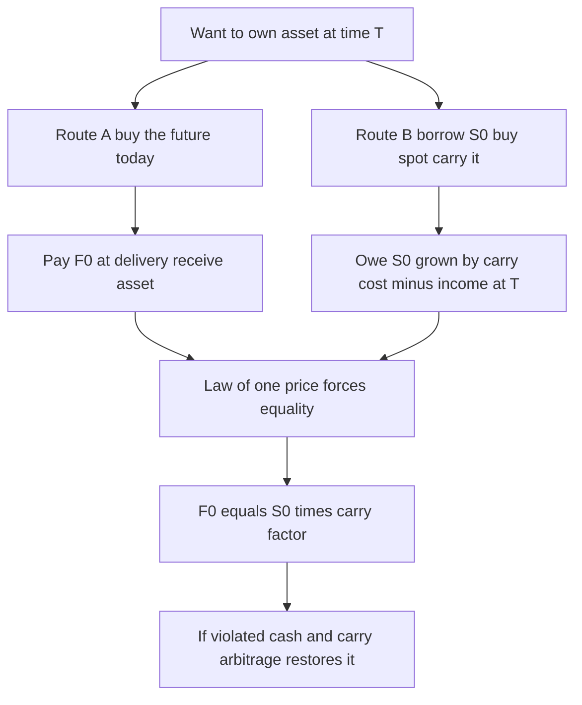
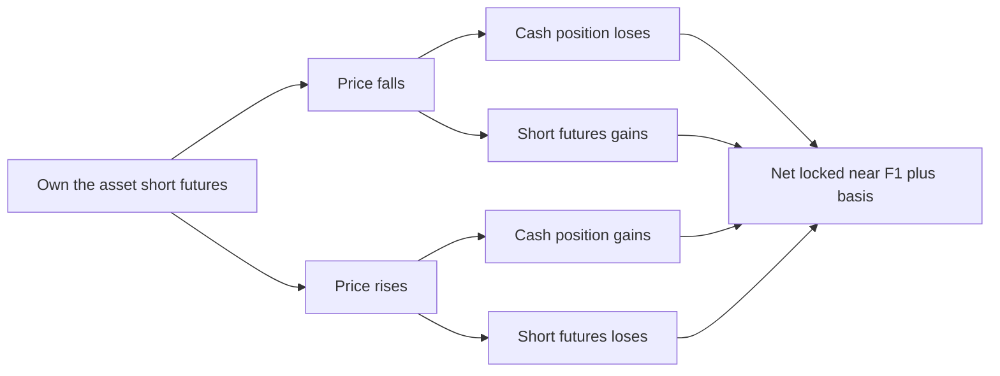
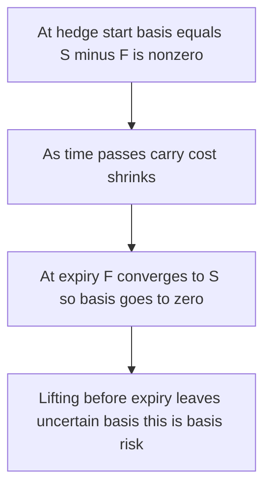
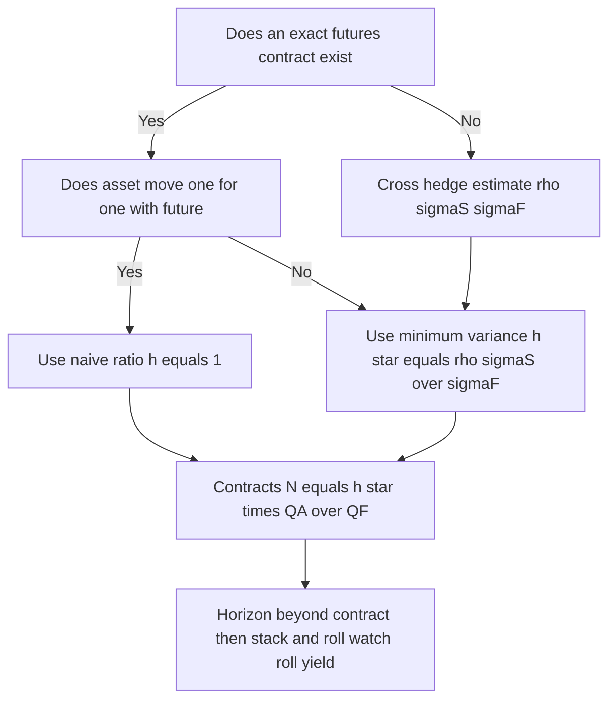

# Chapter 04 — Futures Pricing and Hedging

## 1. The Problem / The Need

You know from Chapter 01–03 what a futures contract *is*: a standardized, exchange-traded promise to buy or sell an asset at a fixed price on a fixed future date, settled through a clearinghouse with daily margining. But knowing the mechanics leaves two enormous questions unanswered — and these are precisely the questions an interviewer will press you on:

1. **What is the "right" futures price today?** If gold spot is $2,000/oz, should the six-month gold future trade at $2,000, at $2,050, at $1,980? Is there a *formula*, or is it just supply and demand? If there is a formula, what is the economic force that makes the market obey it?

2. **How do I actually use a future to remove risk?** A wheat farmer, an airline buying jet fuel, a bond portfolio manager facing rising rates, a fund holding foreign stock — each of them has a *cash position* exposed to price moves. How many contracts do they buy or sell? Does the hedge ever leave residual risk? What happens when the thing they own is not *exactly* the thing the future is written on?

These two questions are two sides of one coin. **Pricing** tells you the fair value that arbitrage enforces; **hedging** tells you how to convert that pricing relationship into risk reduction for a real business. If you understand *why* the cost-of-carry formula holds, you automatically understand *why* a hedge works and *where* it leaks. That leakage has a name — **basis risk** — and it is the single most important practical concept in this chapter.

The stakes are real. A firm that hedges naively (wrong number of contracts, wrong contract, wrong roll timing) can convert a modest price exposure into a margin-call crisis. Metallgesellschaft lost roughly $1.3 billion in 1993 doing exactly that: a "perfect" hedge on paper that bled cash through rolling and margining. So this is not academic. Getting pricing and hedging right is the difference between risk management and gambling with extra steps.

## 2. The Core Idea

**Pricing — cost of carry.** A futures price is *not* a forecast of the future spot price. It is the spot price today, *carried forward* to the delivery date, adjusted for everything you gain or lose by holding the asset instead of the contract. If holding the physical asset costs you money (financing, storage, insurance) you must be *compensated* by a higher futures price; if holding it *pays* you something (dividends, coupons, a convenience of having the physical good on hand) that reduces the futures price. In one line:

> **Futures price = Spot price + cost of carrying the asset to delivery − benefits of holding the asset.**

The enforcement mechanism is **arbitrage**: if the future strays from this fair value, a trader can simultaneously trade the spot and the future to lock in a riskless profit, and that trading pushes the price back. This is "cash-and-carry" (future too expensive) or "reverse cash-and-carry" (future too cheap).

**Hedging — offsetting exposure.** A hedge takes a *second* position whose gains and losses move opposite to your existing exposure, so the two roughly cancel. If you *own* an asset (long the physical, a "long the basis" or long cash position), you *sell* futures — a **short hedge**. If you are committed to *buy* later and fear prices rising, you *buy* futures — a **long hedge**. The residual — the part the hedge does *not* cancel — is driven by the **basis**, the gap between spot and futures. A hedge does not eliminate price risk; it *swaps* price risk for the much smaller basis risk.

Those are the two pillars. Everything below is the machinery: the exact carry formula for each asset type, the algebra of the basis, how to size a hedge (the hedge ratio and its minimum-variance refinement), what to do when you can't find a matching contract (cross-hedging), and how to extend a short-dated hedge into the future (rolling).

## 3. Why / How It Works

### Why cost-of-carry must hold: the arbitrage argument

Consider a non-dividend, non-storage asset (say a stock index proxy with no payouts) with spot price $S_0$ and a risk-free rate $r$. Suppose a one-year future trades at $F_0$. There are two ways to *own the asset in one year*:

- **Route A — buy the future.** Pay nothing today (futures have zero cost to enter), pay $F_0$ at delivery, receive the asset.
- **Route B — cash-and-carry.** Borrow $S_0$ today at rate $r$, buy the asset now, hold it. In one year you own the asset and owe $S_0(1+r)$ to the lender.

Both routes end with you owning the asset in one year. By the **law of one price**, the guaranteed cash outflow at delivery must be identical, otherwise one route is strictly cheaper and free money exists. Therefore:

$$F_0 = S_0(1+r)$$

(using annual compounding; with continuous compounding $F_0 = S_0 e^{rT}$).

**If $F_0$ is too high** (say $F_0 > S_0(1+r)$): sell the expensive future, borrow and buy the cheap spot, carry it, deliver into the short future at $F_0$, repay $S_0(1+r)$, pocket the difference — riskless. Arbitrageurs pile in, pushing $F_0$ down. **If $F_0$ is too low**: do the reverse — short the spot (borrow the asset, sell it, invest proceeds at $r$), buy the cheap future, take delivery, return the borrowed asset. Either way the market is dragged back to the fair value. The formula is not a theory of forecasting; it is a *no-arbitrage boundary*.

### Why the benefits and costs enter

- **Income (dividends, coupons):** if you carry the physical asset you *collect* the dividend $I$ (in present-value terms) or yield $q$; the future holder does not. So the future must be *cheaper* by exactly that benefit, else holding spot would strictly dominate.
- **Storage cost:** if carrying costs $U$ (present value) or $u$ (rate), holding spot is *more expensive*, so the future must be *dearer* by that amount to compensate.
- **Convenience yield ($y$):** for consumption commodities (oil, copper), *having the physical on hand* has value — you can keep a refinery running, meet an unexpected order. This implicit benefit behaves like a dividend and *lowers* the futures price. It is the plug that reconciles observed prices when the market is in backwardation.

### Why hedging works, and why it leaks

A hedge relies on **spot and futures moving together**. They must converge — at expiry the futures price *equals* the spot price (a future to deliver today *is* the spot), so the basis goes to zero. As long as the two are tightly correlated, a loss on your cash position is offset by a gain on your futures position (or vice versa). The hedge is *imperfect* only to the extent that the basis *changes* between the day you put the hedge on and the day you lift it. That is basis risk — and it is small precisely *because* cost-of-carry pins spot and futures together. **Pricing theory is the reason hedging works.**

## 4. Full Content — Mechanics, Formulas, Payoffs

### 4.1 The general cost-of-carry formula

Let $T$ = time to delivery (years), $r$ = risk-free rate, and choose your compounding convention. The master relationship, continuous compounding:

$$\boxed{F_0 = S_0\, e^{(r + u - q - y)\,T}}$$

where $u$ = storage cost rate, $q$ = income/dividend yield, $y$ = convenience yield (all as continuous rates). Special cases:

| Underlying | Formula (continuous) | Formula (discrete) | Notes |
|---|---|---|---|
| Investment asset, no income | $F_0 = S_0 e^{rT}$ | $F_0 = S_0(1+r)^T$ | Pure carry |
| Known cash income $I$ (PV) | $F_0 = (S_0 - I)e^{rT}$ | $F_0 = (S_0 - I)(1+r)^T$ | Subtract PV of dividends/coupons |
| Known yield $q$ | $F_0 = S_0 e^{(r-q)T}$ | $F_0 = S_0\frac{(1+r)^T}{(1+q)^T}$ | Stock index |
| Storage cost $U$ (PV) | $F_0 = (S_0 + U)e^{rT}$ | $F_0 = (S_0+U)(1+r)^T$ | Add PV of storage |
| Storage yield $u$ | $F_0 = S_0 e^{(r+u)T}$ | — | Commodity, no convenience |
| Consumption commodity | $F_0 \le S_0 e^{(r+u)T}$ | — | Inequality; $y$ closes gap |
| Currency (rate $r_f$) | $F_0 = S_0 e^{(r - r_f)T}$ | $F_0 = S_0\frac{(1+r)^T}{(1+r_f)^T}$ | Covered interest parity |

**Reading the sign logic:** anything that *costs* you to hold (financing $r$, storage $u$) pushes $F_0$ *above* $S_0$; anything that *pays* you to hold (income $q$, foreign interest $r_f$, convenience $y$) pushes $F_0$ *below* $S_0$. Memorize the direction, not just the symbols.

### 4.2 Contango and backwardation

- **Contango:** $F_0 > S_0$ (upward futures curve). Normal for financial assets where carry cost > yield.
- **Backwardation:** $F_0 < S_0$ (downward curve). Common in commodities with high convenience yield or supply squeezes.

These describe the *shape of the futures curve relative to spot*, and they drive whether rolling a hedge earns or costs you money (Section 4.8).

### 4.3 The basis — definition and behavior

$$\text{Basis} = S_t - F_t \quad(\text{spot minus futures})$$

(Some commodity desks define it $F_t - S_t$; be explicit in an interview which convention you use. We use spot − futures throughout.)

Key facts:

- At initiation the basis reflects net carry. For a financial asset in contango, $S_t < F_t$, so the basis is **negative**.
- **Convergence:** as $t \to T$, carry shrinks to zero, so $F_t \to S_t$ and the **basis $\to 0$**. This is guaranteed and is the backbone of hedging.
- **Strengthening basis** = basis rises (becomes less negative / more positive), i.e. spot gains on futures. **Weakening basis** = basis falls.

A short hedger (owns the asset, short futures) *benefits from a strengthening basis*; a long hedger *benefits from a weakening basis*. We prove this numerically in Section 5.

### 4.4 Basis risk

If a hedge were held exactly to delivery and the asset matched the contract perfectly, the basis would converge to a known value (zero) and the hedge would be perfect. In reality:

- The hedge is **lifted before expiry**, so the basis at lift-off is *uncertain*.
- The hedged asset may **differ** from the contract's deliverable (cross-hedge), so the basis never fully closes.
- Contract sizes force **rounding** to whole contracts.

**Basis risk** is the risk that the basis at the moment you close the hedge differs from what you expected. The effective price a short hedger achieves is:

$$\text{Effective price} = F_1 + (S_2 - F_2) = F_1 + b_2$$

where $F_1$ is the futures price when the hedge is set, and $b_2 = S_2 - F_2$ is the *unknown* basis when the hedge is lifted. You have locked in $F_1$ (known) but you are still exposed to $b_2$ (unknown). The hedge has **transformed price risk into basis risk** — usually a 5–10× reduction in volatility, but not zero.

### 4.5 Short hedge and long hedge — payoff logic

**Short hedge** (you *own* or will *sell* the asset; fear falling prices): sell futures now.

| Scenario | Cash position (own asset) | Short futures | Net |
|---|---|---|---|
| Price falls | Lose on asset value | Gain (bought back cheaper) | ~Offset |
| Price rises | Gain on asset value | Lose on futures | ~Offset |

**Long hedge** (you must *buy* the asset later; fear rising prices): buy futures now.

| Scenario | Future purchase cost | Long futures | Net |
|---|---|---|---|
| Price rises | Pay more for asset | Gain on futures | ~Offset |
| Price falls | Pay less for asset | Lose on futures | ~Offset |

The hedge locks in an *effective price near $F_1$* regardless of direction — the hedger deliberately gives up the upside to remove the downside. This is the defining trade-off: **hedging is not about making money; it is about removing variance.**

### 4.6 The hedge ratio

The **hedge ratio** $h$ is the ratio of the size of the futures position to the size of the exposure being hedged:

$$h = \frac{\text{value of futures position}}{\text{value of exposure}}$$

A **naïve hedge** sets $h = 1$: hedge one unit of exposure with one unit of futures. This is only optimal when the hedged asset *is* the deliverable and moves one-for-one with the future.

### 4.7 Minimum-variance hedge ratio and cross-hedging

When the hedged asset and the futures are *not* identical (cross-hedge) or don't move one-for-one, $h=1$ is wrong. We choose $h$ to **minimize the variance of the hedged position**.

Let $\Delta S$ = change in spot price of the hedged asset, $\Delta F$ = change in futures price. The variance of the hedged portfolio (per unit) is minimized at:

$$\boxed{h^* = \rho\,\frac{\sigma_S}{\sigma_F} = \frac{\text{Cov}(\Delta S,\Delta F)}{\text{Var}(\Delta F)}}$$

where $\sigma_S,\sigma_F$ are the standard deviations of $\Delta S$ and $\Delta F$, and $\rho$ is their correlation. This is exactly the **slope coefficient of a regression of $\Delta S$ on $\Delta F$** — a fact worth stating in an interview because it makes $h^*$ trivially estimable from data.

The **optimal number of contracts**:

$$N^* = h^* \times \frac{Q_A}{Q_F}$$

where $Q_A$ = size of the position being hedged (units), $Q_F$ = size of one futures contract (units). In value terms, $N^* = h^* \dfrac{V_A}{V_F}$ where $V_A$ is the dollar value of the position and $V_F$ the dollar value of one contract.

The **hedge effectiveness** — the fraction of variance eliminated — equals $\rho^2$ (the R² of that regression). If $\rho = 1$ the hedge removes 100% of variance and reduces to $h^* = \sigma_S/\sigma_F$; if $\rho$ is low, most risk remains and the hedge is weak.

**Cross-hedging** is simply hedging with a future on a *related but different* asset because no exact contract exists — jet fuel hedged with heating-oil or crude futures, a corporate bond portfolio hedged with Treasury futures, a small-cap portfolio hedged with an S&P 500 contract. The minimum-variance ratio *is* the tool for cross-hedging: $\rho < 1$ quantifies exactly how imperfect the proxy is.

**Equity index special case.** To hedge a stock portfolio of value $V_P$ with beta $\beta$, using an index future of value $V_F$:

$$N^* = \beta\,\frac{V_P}{V_F}$$

Here $\beta$ *is* the minimum-variance hedge ratio (regression slope of portfolio returns on index returns). To shift portfolio beta from $\beta$ to a target $\beta^*$, trade $N = (\beta^* - \beta)\dfrac{V_P}{V_F}$ contracts (sell if reducing beta).

### 4.8 Rolling a hedge forward

If your exposure runs to a horizon *longer* than any liquid contract, you **stack and roll**: hold a near-dated contract, and just before it expires, close it and open the next-dated one. Each roll crystallizes the near-contract basis and re-establishes a new deferred basis — introducing **roll risk** (a series of basis risks stacked end to end).

The economics of rolling depend on the curve:

- **Backwardation** (curve slopes down): a long roll *buys back* the expiring contract and *sells* — wait, for a *short* hedge you buy back the near and sell the far. In backwardation the far contract is *cheaper*, so a short hedger rolling forward tends to **gain** (positive roll yield); a long hedger **loses**.
- **Contango** (curve slopes up): a **long** hedger repeatedly buys the near, sells it, buys a *more expensive* far contract — **negative roll yield**, a persistent bleed. This is exactly what destroyed Metallgesellschaft's long crude hedge and what erodes commodity ETFs.

**Roll risk is cumulative:** ten rolls means ten separate basis moves, and the margin cash flows of a stacked hedge can be brutally front-loaded even when the terminal hedge is "correct." Sizing, liquidity, and financing must all be planned for.

## 5. Worked Examples

### Example 1 — Cost-of-carry pricing with dividends (self-verifying via arbitrage)

**Setup.** A stock index is at $S_0 = 4{,}000$. The continuously compounded risk-free rate is $r = 5\%$. The index pays a continuous dividend yield $q = 2\%$. What is the fair 9-month ($T = 0.75$) futures price? Then show what an arbitrageur does if the future trades at 4,200.

**Fair price.**
$$F_0 = S_0 e^{(r-q)T} = 4000\,e^{(0.05-0.02)(0.75)} = 4000\,e^{0.0225}$$
$$e^{0.0225} = 1.022755 \Rightarrow F_0 = 4000 \times 1.022755 = 4{,}091.02$$

So fair value ≈ **4,091**.

**Arbitrage check at F = 4,200 (future overpriced → cash-and-carry).** Per one index unit:

1. Borrow $S_0 = 4000$ at 5%, buy the index. Sell the future at 4,200.
2. Over 0.75yr the index pays dividends; reinvested they grow the position by factor $e^{qT}=e^{0.015}=1.015113$. Equivalently the dividend income has future value $4000(e^{0.05\cdot0.75})(e^{-0.05\cdot0.75})$… let's just track cash at $T$.
3. At $T$: deliver the index into the short future, receive **4,200**. Loan repayment = $4000\,e^{0.05\cdot0.75} = 4000 \times 1.038212 = 4{,}152.85$. Dividends collected (future-valued) = position provides $q$; because you held one unit continuously reinvesting dividends into more index would grow units — to keep it clean, buy only $e^{-qT}=0.985$ units initially so you end with exactly 1 unit to deliver.

Cleaner arbitrage (standard construction): **buy $e^{-qT} = 0.98511$ units** of the index, cost $4000 \times 0.98511 = 3{,}940.45$, borrow that amount. Reinvest dividends → hold exactly **1 unit** at $T$. Deliver into short future for 4,200; repay loan $3940.45\,e^{0.0375} = 3940.45\times1.038212 = 4{,}091.03$.

**Riskless profit** $= 4200 - 4091.03 = \mathbf{108.97}$ per unit. This is exactly $F_{\text{market}} - F_{\text{fair}} = 4200 - 4091.03 = 108.97$. ✓ **The arbitrage profit equals the mispricing**, confirming the fair value of 4,091 is the no-arbitrage anchor. If instead the future were *below* 4,091, the reverse trade (short index, buy future) would earn the difference.

### Example 2 — Short hedge with basis risk (full reconciliation)

**Setup.** In May, an oil producer will sell 100,000 barrels of crude in **August**. Spot in May is $S_1 = \$80.00$/bbl. The August crude future trades at $F_1 = \$78.50$/bbl (backwardation). Each contract = 1,000 bbl, so the producer needs $100{,}000/1{,}000 = 100$ contracts. Fearing a price fall, the producer **sells 100 August futures** at 78.50 (short hedge).

**Case A — prices fall.** In August spot $S_2 = \$72.00$, future (near expiry) $F_2 = \$71.70$.

- Sell physical oil: $100{,}000 \times 72.00 = \$7{,}200{,}000$.
- Futures gain: sold at 78.50, buy back at 71.70 → gain $6.80$/bbl $\times 100{,}000 = \$680{,}000$.
- **Total = 7,200,000 + 680,000 = \$7,880,000**, i.e. **\$78.80/bbl effective**.

**Case B — prices rise.** August spot $S_2 = \$88.00$, future $F_2 = \$87.60$.

- Sell physical: $100{,}000 \times 88.00 = \$8{,}800{,}000$.
- Futures loss: sold 78.50, buy back 87.60 → lose $9.10$/bbl $\times 100{,}000 = \$910{,}000$.
- **Total = 8,800,000 − 910,000 = \$7,890,000**, i.e. **\$78.90/bbl effective**.

**Reconcile with the basis formula.** Effective price $= F_1 + b_2$ where $b_2 = S_2 - F_2$.

- Case A: $b_2 = 72.00 - 71.70 = +0.30$. Effective $= 78.50 + 0.30 = \mathbf{78.80}$. ✓
- Case B: $b_2 = 88.00 - 87.60 = +0.40$. Effective $= 78.50 + 0.40 = \mathbf{78.90}$. ✓

The producer locked in ≈ **\$78.50 + basis**, essentially independent of whether oil went to \$72 or \$88 — a swing of \$16/bbl in the market collapsed to a **\$0.10 difference** in realized price. That residual \$0.10 *is* the basis risk: it came entirely from the basis being +0.30 vs +0.40. Compare to the *unhedged* outcomes (\$72.00 vs \$88.00): the hedge cut price uncertainty by ~99%.

### Example 3 — Minimum-variance cross-hedge (jet fuel with heating oil)

**Setup.** An airline must buy **2,000,000 gallons** of jet fuel in three months. No liquid jet-fuel future exists, so it cross-hedges with **heating-oil futures** (contract = 42,000 gallons). Historical monthly data:

- $\sigma_S$ (std dev of jet-fuel price change) $= 0.032$
- $\sigma_F$ (std dev of heating-oil futures change) $= 0.040$
- $\rho$ (correlation) $= 0.80$

**Optimal hedge ratio.**
$$h^* = \rho\frac{\sigma_S}{\sigma_F} = 0.80 \times \frac{0.032}{0.040} = 0.80 \times 0.80 = \mathbf{0.64}$$

**Number of contracts** (long hedge — airline *buys*, so buy futures):
$$N^* = h^*\frac{Q_A}{Q_F} = 0.64 \times \frac{2{,}000{,}000}{42{,}000} = 0.64 \times 47.62 = 30.48 \approx \mathbf{30\ contracts}$$

**Hedge effectiveness.** Variance reduction $= \rho^2 = 0.80^2 = 0.64$, so the cross-hedge removes about **64% of the variance** — the remaining 36% is irreducible cross-hedge basis risk from jet fuel and heating oil not being identical. A naïve $h=1$ (≈48 contracts) would *over-hedge*: because $h^*=0.64<1$, hedging one-for-one would inject unwanted heating-oil volatility rather than cancel jet-fuel risk. The regression-based ratio is what makes the cross-hedge defensible.

**Sanity check on direction of $h^*$:** jet fuel is *less* volatile than the heating-oil future ($0.032 < 0.040$) and only 80% correlated, so we should hold *fewer* futures than a one-for-one match — $0.64 < 1$ confirms the intuition. ✓

## 6. Connections

- **To forward pricing (Ch. 03):** the cost-of-carry formula is *identical* for forwards and futures in a deterministic-rate world; futures differ only by daily marking-to-market, which introduces a small convexity effect when interest rates are correlated with the underlying. The pricing skeleton is shared.
- **To options / put-call parity (later chapters):** put-call parity, $C - P = S_0 - Ke^{-rT}$, embeds the *same* carry logic — the forward price $S_0 e^{rT}$ is the arbitrage anchor there too. Recognizing carry as the common thread ties the whole derivatives syllabus together.
- **To the CAPM / beta (portfolio theory):** the equity-index hedge ratio $N=\beta V_P/V_F$ is literally the CAPM beta repurposed as a hedge ratio. Adjusting beta with index futures is portfolio management, not just hedging.
- **To duration hedging (fixed income):** for bond futures the hedge ratio uses the *ratio of dollar durations* (BPV of the portfolio ÷ BPV of the cheapest-to-deliver / conversion factor) — the same minimum-variance idea expressed in interest-rate sensitivity.
- **To real corporate cases:** Metallgesellschaft (rolling a stack hedge in contango) and Southwest Airlines (successful multi-year fuel cross-hedges) are the canonical interview stories illustrating roll risk and cross-hedge basis risk respectively.

## 7. Key Terms

- **Cost of carry:** net cost of holding the physical asset to delivery = financing + storage − income − convenience yield.
- **Convenience yield ($y$):** implicit benefit of holding a physical consumption commodity; lowers the futures price and can create backwardation.
- **Contango / backwardation:** futures above / below spot ($F_0 > S_0$ / $F_0 < S_0$).
- **Basis:** spot − futures ($S_t - F_t$); converges to zero at expiry.
- **Basis risk:** uncertainty in the basis at the time the hedge is lifted; the residual risk a hedge cannot remove.
- **Short hedge / long hedge:** sell futures to protect a long/selling exposure; buy futures to protect a buying exposure.
- **Hedge ratio ($h$):** size of futures position relative to exposure; $h=1$ is the naïve hedge.
- **Minimum-variance hedge ratio ($h^*$):** $\rho\,\sigma_S/\sigma_F$ = regression slope of spot changes on futures changes; minimizes hedged-position variance.
- **Hedge effectiveness:** $\rho^2$, the fraction of variance eliminated.
- **Cross-hedge:** hedging with a future on a related but non-identical asset.
- **Rolling / stack-and-roll:** closing an expiring contract and opening a later one to extend a hedge; carries cumulative roll (basis) risk and a roll yield set by the curve.
- **Cash-and-carry arbitrage:** borrow, buy spot, sell rich future, deliver — enforces the upper no-arbitrage bound.

## 8. Common Confusions

1. **"The futures price is the market's forecast of the future spot."** No. $F_0 = S_0 e^{(r-q)T}$ is set by *today's* spot and carry, by arbitrage. Under the risk-neutral measure the future does equal the *expected* future spot, but in the real world a risk premium separates them. Never call $F_0$ a forecast in an interview.

2. **Sign of the basis.** People flip $S-F$ and $F-S$. Fix one convention (we use $S-F$) and state it. A short hedger *gains* when the basis *strengthens* — verify this against Example 2 rather than memorizing.

3. **"A hedge removes all risk."** It removes *price* risk and replaces it with *basis* risk. A perfect hedge exists only if the asset matches the contract *and* you hold to delivery. Otherwise residual basis risk always remains.

4. **Naïve $h=1$ vs minimum-variance $h^*$.** $h=1$ is right only when the hedged asset *is* the deliverable and moves one-for-one. For a cross-hedge or a less-volatile asset, $h^*$ can be well below (or above) 1; using 1 blindly over/under-hedges.

5. **Convenience yield confused with storage cost.** Storage *raises* $F_0$ (cost of holding); convenience yield *lowers* it (benefit of holding). They pull in opposite directions and both live in the exponent.

6. **Forgetting margin cash flows in a roll.** A "correct" long-run hedge can still bankrupt you via daily variation margin during rolls, especially in contango. The terminal payoff being right does not make the interim cash flows survivable — the Metallgesellschaft lesson.

7. **Beta hedge direction.** To *reduce* portfolio beta you *sell* index futures. Selling raises cash-like exposure; buying adds market exposure. Sign errors here are common.

## 9. Recap

- A futures price is the spot price **carried to delivery**: $F_0 = S_0 e^{(r+u-q-y)T}$. Costs of holding (financing, storage) push it up; benefits (income, convenience) push it down. **Arbitrage** — cash-and-carry and its reverse — enforces this, and the arbitrage profit exactly equals any mispricing (Example 1).
- The **basis** ($S-F$) converges to zero at expiry. Hedging works because spot and futures move together; it leaks only through **basis risk** — the uncertain basis when the hedge is lifted. A short hedger locks in $F_1 + b_2$ (Example 2 reconciled a \$16 market swing down to \$0.10).
- Sizing a hedge uses the **minimum-variance hedge ratio** $h^* = \rho\,\sigma_S/\sigma_F$, the regression slope of spot on futures changes, giving $N^* = h^* Q_A/Q_F$. Effectiveness $= \rho^2$. For equities, $N = \beta V_P/V_F$.
- **Cross-hedging** uses a related contract when no exact one exists; $\rho<1$ measures its imperfection (Example 3: jet fuel via heating oil, $h^*=0.64$, 64% variance removed).
- **Rolling** extends short-dated hedges but stacks basis risks and earns/loses a **roll yield** set by contango (bleed for long hedgers) or backwardation.

## 10. Quick-Reference / Interview Points

**Formulas to have cold:**
- $F_0 = S_0 e^{(r-q)T}$ (income asset); $(S_0-I)e^{rT}$ (cash income); $S_0 e^{(r-r_f)T}$ (FX, covered interest parity).
- Basis $= S_t - F_t \to 0$ at expiry. Effective hedged price $= F_1 + b_2$.
- $h^* = \rho\,\sigma_S/\sigma_F = \text{Cov}(\Delta S,\Delta F)/\text{Var}(\Delta F)$; effectiveness $= \rho^2$.
- $N^* = h^* Q_A/Q_F$; equity: $N = \beta V_P/V_F$; beta shift: $N = (\beta^*-\beta)V_P/V_F$.

**One-liners that signal depth:**
- "The futures price isn't a forecast — it's the arbitrage-enforced carry cost of the spot."
- "Hedging doesn't kill price risk; it trades it for basis risk, which is roughly an order of magnitude smaller."
- "The minimum-variance hedge ratio is just the regression slope of spot changes on futures changes — R² tells you the effectiveness."
- "Contango punishes long rollers, backwardation rewards them — that's the roll yield, and it's what sank Metallgesellschaft."
- "Convenience yield is the plug that explains commodity backwardation."

**Payoff logic (short hedge, own the asset):** price down → cash loss + futures gain ≈ flat; price up → cash gain + futures loss ≈ flat. Locks in ≈ $F_1$, giving up upside to remove downside.

---

*Figure 1 — Cost-of-carry: two routes to owning the asset at T must cost the same, or arbitrage.*

*Figure 2 — Short hedge payoff logic: cash and futures legs offset in both directions.*

*Figure 3 — Convergence of the basis to zero at expiry.*

*Figure 4 — Choosing and sizing a hedge: decision flow.*

