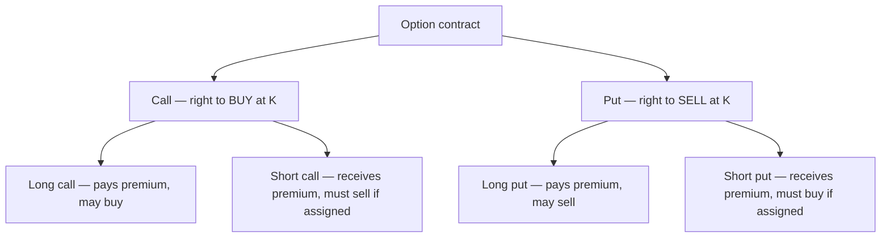
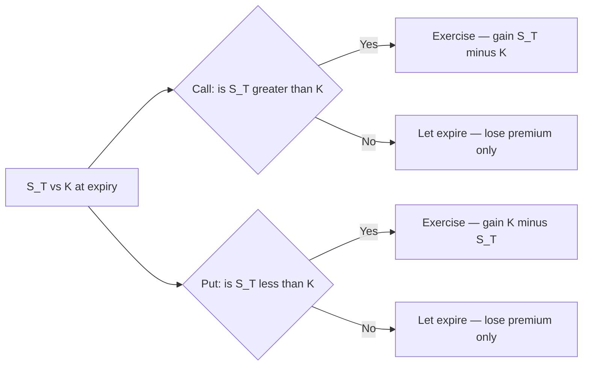

# Chapter 05 — Options: Basics and Payoffs

## 1. The Problem / Need

A forward or futures contract, which you met in the previous chapters, locks you into a transaction. If you are long a forward on a stock at 100 and the stock crashes to 60, you are *obligated* to buy at 100 and eat the 40 loss. The forward is symmetric: it gives you the upside above 100 and forces the downside below it in equal measure. That symmetry is exactly what a hedger sometimes does *not* want.

Consider three real needs that forwards cannot serve:

- **An importer** must pay USD 1 million in three months. He fears the rupee weakening (USD getting expensive). He would happily lock in a ceiling on the USD price — but if the rupee *strengthens* and dollars get cheaper, he wants to walk away and buy at the cheaper spot rate. A forward would deny him that.
- **A fund manager** holds a large equity portfolio into a nervous earnings season. She wants insurance against a crash but does not want to sell the portfolio (and forgo the rally if markets rise). She wants a *floor* under her value, nothing more.
- **A retail trader** has a strong directional view that a stock will jump on a product launch, but he can only risk a small, known amount. He wants large upside if he is right, and a strictly capped loss if he is wrong.

What all three want is **the right to transact without the obligation** — asymmetry. Upside participation with downside protection, in exchange for a fee paid up front. That instrument is an **option**. It is the first derivative in this course whose payoff is *non-linear* (kinked), and that kink is the entire reason options exist.

## 2. The Core Idea

An **option** is a contract that gives its buyer the *right, but not the obligation*, to buy or sell an underlying asset at a pre-agreed price (the **strike**, K) on or before a specified date (**expiry**, T). For this right the buyer pays the seller a non-refundable fee up front called the **premium** (c for a call, p for a put).

There are exactly two basic option types:

- A **call** gives the right to **buy** the underlying at K.
- A **put** gives the right to **sell** the underlying at K.

And for each, two sides:

- The **long** (buyer / holder) owns the right and pays the premium.
- The **short** (seller / writer) grants the right, receives the premium, and takes on the *obligation* to perform if the long exercises.

The buyer will only exercise when it is in his favour, so the writer's fate is entirely in the buyer's hands. This is the crux: **the right belongs to the buyer; the obligation belongs to the writer.** The premium is the price of transferring that asymmetry.

*The four building blocks — every option strategy is assembled from these.*

## 3. Why / How It Works

Why is one party willing to pay for a right the other must honour? Because risk has value. The writer accepts a *potentially unlimited or large* loss in exchange for a *certain, immediate* cash inflow. The buyer pays a *certain, small* amount to acquire a *potentially large* gain and a capped loss. The premium is the market-clearing price that makes both sides indifferent at fair value — it is the cost of insurance.

The mechanics rest on a single behavioural rule: **the holder exercises only when exercise produces a positive cash flow versus the market.**

- A call holder exercises only if the market price S is **above** K — why pay K to buy something worth less? He buys at K, worth S, pocketing S − K.
- A put holder exercises only if S is **below** K — why sell at K something worth more? He sells at K something worth only S, pocketing K − S.

Because the holder throws away the option whenever exercise would hurt him, the option payoff can never go negative *at expiry*. The most he loses is the premium already paid. This "floor at zero" is what bends the payoff line and produces the characteristic hockey-stick shape. Everything else in option pricing — intrinsic value, time value, moneyness — flows from this one kink.

## 4. Full Content — Mechanics, Formulas, Payoffs

### 4.1 Payoff at expiry (intrinsic value at T)

Let S_T be the underlying price at expiry and K the strike. The **payoff** is the value of the option at expiry, before deducting premium:

- **Long call payoff** = max(S_T − K, 0)
- **Long put payoff**  = max(K − S_T, 0)

The short positions are the mirror image (zero-sum, ignoring premium):

- **Short call payoff** = − max(S_T − K, 0) = min(K − S_T, 0)
- **Short put payoff**  = − max(K − S_T, 0) = min(S_T − K, 0)

### 4.2 Profit (payoff net of premium)

Payoff ignores what you paid. **Profit** subtracts the premium (for the long) or adds it (for the short). Let c and p be call and put premiums:

- **Long call profit** = max(S_T − K, 0) − c
- **Short call profit** = c − max(S_T − K, 0)
- **Long put profit**  = max(K − S_T, 0) − p
- **Short put profit**  = p − max(K − S_T, 0)

### 4.3 Breakeven prices

Breakeven is the S_T at which profit = 0:

- **Long/short call breakeven:** S_T = K + c
- **Long/short put breakeven:**  S_T = K − p

### 4.4 The four profiles at a glance

| Position | Right/Obligation | Max profit | Max loss | Breakeven | View |
|---|---|---|---|---|---|
| Long call | Right to buy | Unlimited (S_T→∞) | Premium c | K + c | Strongly bullish |
| Short call | Must sell if assigned | Premium c | Unlimited | K + c | Bearish / neutral |
| Long put | Right to sell | K − p (S_T→0) | Premium p | K − p | Strongly bearish |
| Short put | Must buy if assigned | Premium p | K − p (S_T→0) | K − p | Bullish / neutral |

Note the asymmetry the buyer paid for: the long call and long put both have **limited loss** (the premium) and **large-to-unlimited gain**. The writers have the reverse: **limited gain** (the premium) and **large-to-unlimited loss**. Writers are, in effect, selling insurance.

*The exercise decision tree — the holder acts only when the payoff is positive.*

### 4.5 Intrinsic value vs time value

At any time *before* expiry an option's premium decomposes into two parts:

**Premium = Intrinsic value + Time value**

- **Intrinsic value (IV)** is the payoff if exercised *right now*: max(S − K, 0) for a call, max(K − S, 0) for a put. It can never be negative.
- **Time value (TV)** is everything else: TV = Premium − IV. It reflects the *chance* the option moves further into the money before expiry. Time value is always ≥ 0 for a fair-priced option and **decays to zero at expiry** (theta decay), where premium collapses to pure intrinsic value.

Time value is largest when the option is at-the-money (maximum uncertainty about which side of the strike it lands) and shrinks as the option goes deep ITM or deep OTM. It also rises with volatility and with time remaining.

### 4.6 Moneyness — ITM, ATM, OTM

Moneyness describes where the current spot S sits relative to the strike K — i.e., whether intrinsic value is positive.

| Moneyness | Call condition | Put condition | Intrinsic value |
|---|---|---|---|
| **In-the-money (ITM)** | S > K | S < K | Positive |
| **At-the-money (ATM)** | S ≈ K | S ≈ K | ≈ Zero |
| **Out-of-the-money (OTM)** | S < K | S > K | Zero |

A handy mnemonic: a **call** is ITM when the market has risen above the strike (good for a buyer); a **put** is ITM when the market has fallen below the strike. ATM and OTM options have **zero intrinsic value**, so their entire premium is time value — which is why they are cheaper and decay fastest.

### 4.7 European vs American exercise

- **European options** can be exercised **only at expiry (on date T)**. Most index options (e.g., Nifty, S&P 500 index options) are European.
- **American options** can be exercised **any time up to and including expiry**. Most single-stock options (including US equity options and Indian single-stock options) are American.

The extra flexibility of American options means they are worth **at least as much** as otherwise-identical European options: American premium ≥ European premium. The difference (the early-exercise premium) is usually small. A key result: for a **non-dividend-paying** stock, it is **never optimal to exercise an American call early** — you would throw away remaining time value and lose the interest on K by paying the strike sooner. So such an American call is worth exactly the same as the European call. American *puts*, however, and calls on dividend-paying stocks, *can* be worth exercising early. (Bermudan options, exercisable on a discrete set of dates, sit between the two.)

### 4.8 The premium and its drivers

The premium is set in the market, but its fair value depends on six factors. Holding others constant:

| Factor increases → | Call premium | Put premium |
|---|---|---|
| Spot price S ↑ | ↑ | ↓ |
| Strike K ↑ | ↓ | ↑ |
| Volatility σ ↑ | ↑ | ↑ |
| Time to expiry T ↑ | ↑ (usually) | ↑ (usually) |
| Risk-free rate r ↑ | ↑ | ↓ |
| Dividends ↑ | ↓ | ↑ |

Volatility is the one that raises *both* — more dispersion means fatter tails, and since option payoffs are one-sided (loss floored at premium), more uncertainty is always worth more to the holder. This is why traders often speak of buying/selling options as trading volatility.

### 4.9 A crucial no-arbitrage bound: put–call parity

Even before we price options with a full model, arbitrage pins a relationship between a European call and put of the same strike and expiry:

**c + K·e^(−rT) = p + S₀**

The left side (buy a call, invest the present value of K in cash) and the right side (buy a put, hold the stock) both pay exactly max(S_T, K) at expiry, so they must cost the same today. Rearranged:

**c − p = S₀ − K·e^(−rT)**

This lets you back out any one leg from the other three and underpins synthetic positions (e.g., a synthetic long stock = long call + short put at the same strike). We prove and use this in the pricing chapter, but it belongs in your mental model now.

## 5. Worked Examples

### Example 1 — Long call, full reconciliation

You buy one 3-month European call on stock XYZ, strike **K = 100**, premium **c = 5**. (Contract size = 1 share for simplicity.) Let us tabulate payoff and profit across expiry prices.

Payoff = max(S_T − 100, 0); Profit = Payoff − 5. Breakeven = K + c = **105**.

| S_T | Intrinsic max(S_T−100,0) | Payoff | Profit (Payoff − 5) |
|---|---|---|---|
| 80  | 0  | 0  | −5 |
| 95  | 0  | 0  | −5 |
| 100 | 0  | 0  | −5 |
| 105 | 5  | 5  | 0 |
| 110 | 10 | 10 | +5 |
| 120 | 20 | 20 | +15 |
| 140 | 40 | 40 | +35 |

**Reconcile:** Below K = 100 the call expires worthless; loss is capped at the premium −5, exactly as the theory says (max loss = c). Profit turns positive only above the breakeven 105 = K + c ✓. At S_T = 120, profit = (120 − 100) − 5 = 15 ✓. Upside is unbounded: each additional rupee above 100 adds a rupee of profit. The hockey-stick kink sits at K = 100.

### Example 2 — Long put, and the writer's mirror

You buy one 3-month European put, strike **K = 50**, premium **p = 4**. Payoff = max(50 − S_T, 0); Profit = Payoff − 4. Breakeven = K − p = **46**. Max profit occurs at S_T = 0: (50 − 0) − 4 = **46**.

| S_T | max(50−S_T,0) | Long put profit | Short put profit (mirror) |
|---|---|---|---|
| 30 | 20 | +16 | −16 |
| 40 | 10 | +6  | −6 |
| 46 | 4  | 0   | 0 |
| 50 | 0  | −4  | +4 |
| 60 | 0  | −4  | +4 |
| 70 | 0  | −4  | +4 |

**Reconcile:** The put pays off as the stock falls. At S_T = 30 the holder buys in the market at 30 and exercises to sell at 50, gaining 20, less the 4 premium = +16 ✓. Above K = 50 the put is worthless and the loss is capped at the 4 premium ✓. Breakeven 46 = 50 − 4 ✓. The **short put** column is the exact negative of the long put in every row — options are zero-sum between the two counterparties ✓. The writer's best case is keeping the whole premium (+4); his worst case is the stock going to zero (−46), the mirror of the holder's max profit.

### Example 3 — Moneyness and the intrinsic/time-value split

Stock trades at **S = 100**. Look at three calls and one put, all same expiry, with their observed market premiums:

| Option | K | Premium | Intrinsic value | Time value | Moneyness |
|---|---|---|---|---|---|
| Call | 90  | 13 | max(100−90,0)=10 | 13 − 10 = 3 | ITM |
| Call | 100 | 6  | max(100−100,0)=0 | 6 − 0 = 6  | ATM |
| Call | 110 | 2  | max(100−110,0)=0 | 2 − 0 = 2  | OTM |
| Put  | 110 | 11 | max(110−100,0)=10 | 11 − 10 = 1 | ITM |

**Reconcile:** Every intrinsic value is ≥ 0 and every time value is ≥ 0, as required for arbitrage-free prices ✓. The **ATM** call (K = 100) carries the **most time value (6)** — maximum uncertainty about which side of the strike it lands — while the deep-ITM and OTM options carry less ✓. The OTM call's entire premium (2) is time value because intrinsic value is zero ✓. As expiry approaches, all the time-value columns shrink toward zero and each premium converges to its intrinsic-value column (theta decay) ✓.

*Quick parity sanity check.* Take the K = 100 call (c = 6) and suppose the K = 100 put trades at p = 5.85 with r ≈ 0 over the short horizon. Parity says c − p should equal S₀ − K·e^(−rT) ≈ 100 − 100 = 0, i.e., c ≈ p. Here 6 − 5.85 = 0.15 ≈ 0 (the small gap is the interest/dividend carry), consistent with parity ✓.

### Example 4 — The importer's hedge (why asymmetry matters)

Recall the importer owing USD 1m in 3 months, spot USDINR = 83.00. He buys a **call on USD** (right to buy dollars) at strike **K = 83.50**, premium **0.40 INR per USD** (₹400,000 total).

- If USDINR rises to **86.00**: he exercises, buys dollars at 83.50 instead of 86.00, saving 2.50/USD. Net effective cost = 83.50 + 0.40 = **83.90**, a firm ceiling.
- If USDINR falls to **81.00**: he lets the option lapse (loses the 0.40 premium) and buys cheap in the spot market. Net cost = 81.00 + 0.40 = **81.40**.

**Reconcile:** A forward would have locked him at ~83.50 in *both* scenarios. The option caps his cost near 83.90 on the bad side yet lets him enjoy the cheap 81.40 on the good side — the upside participation he could not get from a forward, bought for the 0.40 premium ✓. That premium is precisely the price of the asymmetry.

## 6. Connections

- **To forwards/futures (Ch. 3–4):** A forward is like being simultaneously long a call and short a put at the same strike (from put–call parity, long call + short put = synthetic long forward). Options *decompose* the symmetric forward into its up-leg and down-leg, and let you buy just one.
- **To insurance:** A long put is a textbook insurance policy on an asset you own — premium paid, deductible = the gap between spot and strike, payout when the asset falls. Writing options = selling insurance.
- **To option pricing (next chapters):** Everything here — intrinsic/time value, moneyness, the six drivers, parity — is the qualitative skeleton that the binomial model and Black–Scholes put numbers on.
- **To the Greeks:** Delta is the slope of these payoff curves; theta is the decay of the time-value column in Example 3; vega is the volatility row in the drivers table.
- **To strategies (spreads, straddles, collars):** Every multi-leg strategy is just addition of the four payoff lines in Section 4.

## 7. Key Terms

- **Option:** Right (not obligation) to buy/sell an underlying at strike K by expiry T.
- **Call / Put:** Right to buy / right to sell.
- **Long / Short (Holder / Writer):** Buyer who owns the right / seller who bears the obligation.
- **Strike (Exercise price), K:** The fixed price at which the option can be exercised.
- **Premium (c, p):** Non-refundable price paid by the buyer to the writer for the option.
- **Payoff:** Option's value at expiry, max(S_T−K,0) or max(K−S_T,0), before premium.
- **Profit:** Payoff net of premium.
- **Intrinsic value:** Payoff if exercised now, max(S−K,0) / max(K−S,0); never negative.
- **Time value:** Premium − intrinsic value; the value of remaining optionality; decays to zero at expiry.
- **Moneyness (ITM / ATM / OTM):** Whether intrinsic value is positive / ~zero / zero.
- **European / American / Bermudan:** Exercisable at expiry only / anytime / on set dates.
- **Breakeven:** S_T where profit = 0 (K+c for calls, K−p for puts).
- **Assignment:** The process by which an exercised option obligates a randomly-selected writer to perform.
- **Put–call parity:** c + K·e^(−rT) = p + S₀.

## 8. Common Confusions

- **"Payoff = profit."** No. Payoff ignores the premium already paid; profit subtracts it. A call can have a positive payoff (say +3 when S_T is just above K) yet a negative *profit* if the premium was 5. Only past breakeven do the two agree in sign.
- **"Exercising an OTM option to cut losses."** You never exercise an OTM option — exercising it *creates* a loss. You let it lapse; the loss is already the premium.
- **"The writer's loss is capped like the buyer's."** Reversed. The *buyer's* loss is capped (premium); the *writer's* loss is large (short put) or unlimited (short call). The writer's *gain* is what's capped, at the premium.
- **"Higher time value means a better option."** Time value is a *cost* to the buyer. Deep-ITM options have little time value and behave almost like the stock; that is often desirable, not worse.
- **"American options are always worth exercising early."** No — an American call on a non-dividend stock should essentially never be exercised early (you'd forfeit time value and delay paying K). Early exercise mainly matters for puts and dividend-paying-stock calls.
- **"ITM = profitable trade."** ITM describes intrinsic value relative to *spot*, not whether *you* made money. An ITM call can still sit below your breakeven (K + premium) and be a losing trade.
- **"Volatility helps calls and hurts puts."** Volatility raises *both* premiums — the payoff asymmetry means more dispersion is always worth more to a holder, call or put.
- **"Premium is refundable if I don't exercise."** It is a sunk cost paid at inception; letting the option lapse forfeits it entirely.

## 9. Recap

An option sells **asymmetry**: the buyer pays a premium for the *right* to transact at strike K, while the writer takes the premium and the *obligation*. Calls are the right to buy, puts the right to sell; long/short flips who holds the right. At expiry the holder exercises only when it pays, so long payoffs are floored at zero — max(S_T−K,0) for calls, max(K−S_T,0) for puts — producing the hockey-stick kink. Profit subtracts the premium; breakevens are K+c and K−p. Before expiry the premium splits into **intrinsic value** (exercise-now payoff, ≥0) and **time value** (optionality, decaying to zero at expiry, largest ATM). **Moneyness** labels the sign of intrinsic value (ITM/ATM/OTM). **European** options exercise only at expiry, **American** anytime (worth ≥ European; early exercise rarely optimal for non-dividend calls). Six factors drive the premium — with volatility uniquely lifting both calls and puts — and **put–call parity** (c + K·e^(−rT) = p + S₀) ties calls, puts, stock, and cash into one arbitrage-free relationship.

## 10. Quick-Reference / Interview Points

- **Four payoffs (memorise):** long call max(S−K,0); long put max(K−S,0); shorts are the negatives.
- **Max loss / max gain:** Long call — lose premium, gain unlimited. Long put — lose premium, gain K−p. Short call — gain premium, lose unlimited. Short put — gain premium, lose K−p.
- **Breakevens:** call K + premium; put K − premium.
- **Premium = intrinsic + time value.** Time value ≥ 0, peaks ATM, decays to 0 at expiry (theta).
- **Moneyness:** call ITM when S > K; put ITM when S < K; ATM/OTM have zero intrinsic value.
- **American ≥ European.** Never early-exercise an American call on a non-dividend stock — you forfeit time value and the interest on K. Early exercise matters for puts / dividend calls.
- **Six drivers:** S, K, σ, T, r, dividends. **Volatility raises both** call and put premiums.
- **Put–call parity:** c + PV(K) = p + S₀ ⇒ long call + short put = synthetic forward.
- **One-line intuition:** a long option is limited-risk, convex, and long volatility; a short option is limited-reward, concave, and short volatility (you are selling insurance).
- **Reconciliation habit:** always check that below/above the strike the payoff floors at zero and the profit floors at ±premium — if it doesn't, you've mislabelled the leg.
