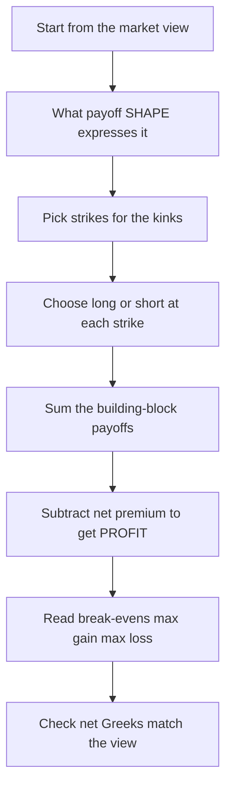
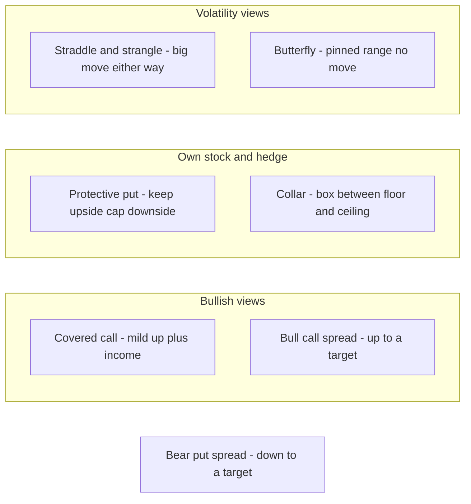
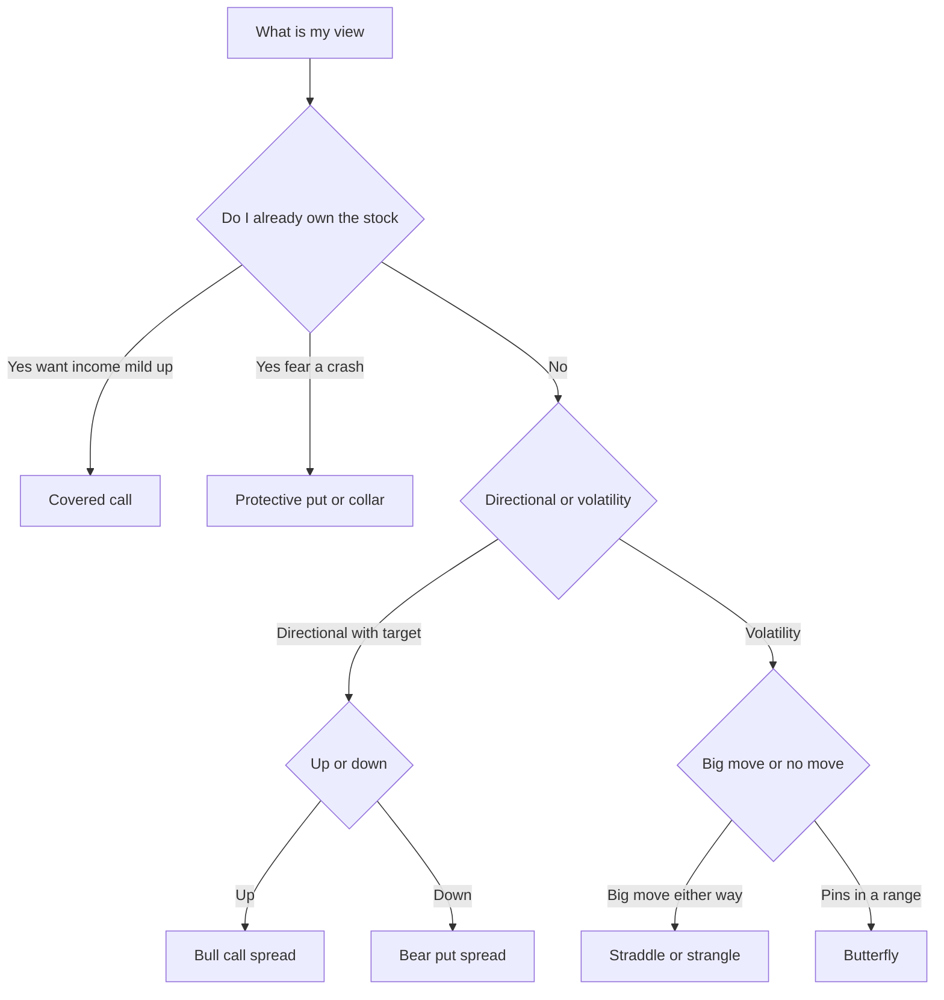

# Chapter 06 — Option Strategies

## 1. The Problem / The Need

A single option is a blunt instrument. A lone call is a leveraged bullish bet with a fixed loss (the premium) and unlimited upside; a lone put is its bearish mirror. But real market views are rarely that clean. Consider the situations a trader or portfolio manager actually faces:

- "I own the stock, I think it drifts sideways for three months, and I want to earn income from that boredom."
- "I own the stock, I've made a fat profit, and I'm terrified of a crash before I sell — but I don't want to sell yet."
- "I'm moderately bullish. The stock will rise, but not to the moon, and I refuse to pay a fat premium for upside I don't believe in."
- "There's an earnings announcement Thursday. I have no idea which way it breaks, but I'm certain it breaks *hard*."
- "I think the stock does *nothing*. Implied volatility is expensive and I want to be paid for that."

Notice that most of these views have **shape**: a floor here, a ceiling there, a bet on movement regardless of direction, a bet on stillness. A single option cannot express shape. Its payoff is a fixed hockey stick. To sculpt a payoff that matches a nuanced view — capping cost, defining risk, monetising volatility or the lack of it — you must **combine** options: multiple strikes, multiple expiries, longs and shorts, sometimes the underlying itself.

This is what option strategies are: **deliberate combinations of options (and sometimes the underlying) engineered so that the aggregate payoff diagram matches a specific market view.** The skill is reading the diagram backwards — starting from "what payoff shape do I want?" and assembling the building blocks that produce it. This chapter builds that fluency.

## 2. The Core Idea

Every option position is a **building block** with a known kinked payoff. Because payoffs at a common expiry simply **add** — the value of a portfolio is the sum of the values of its parts — you can construct almost any piecewise-linear payoff shape by laying long and short calls and puts across different strikes.

Four primitives, each a straight-line-with-a-kink:

| Position | Payoff at expiry (before premium) | View |
|---|---|---|
| Long call (strike K) | max(S − K, 0) | up |
| Short call (strike K) | −max(S − K, 0) | not up |
| Long put (strike K) | max(K − S, 0) | down |
| Short put (strike K) | −max(K − S, 0) | not down |

Add the underlying (payoff = S − S₀, a 45° line) and you have five Lego bricks. Every strategy in this chapter is a specific stacking of these bricks. The **kinks** occur at the strikes; between strikes the payoff is a straight line whose slope is the net number of long-minus-short calls (for the up-side) that are in-the-money.

Two lenses run through everything:

1. **Payoff vs. Profit.** *Payoff* ignores what you paid; *profit* = payoff − net premium paid (or + net premium received). The break-even points live on the profit diagram, not the payoff diagram. Interviewers test whether you keep these straight.
2. **The Greeks tell you the view.** Net delta = directional lean. Net vega = your bet on volatility. Net theta = whether time decay pays you or bleeds you. A good strategy's Greeks should match the sentence you'd use to describe your view.

## 3. Why / How It Works

Why can you just *add* payoffs? Because an option's value at expiry is a deterministic function of the terminal spot S, and portfolio value is linear in holdings. If you hold n₁ units of instrument 1 and n₂ of instrument 2, terminal value is n₁·f₁(S) + n₂·f₂(S). Plot each f against S, scale, and stack. The result is always **piecewise linear** with kinks exactly at the strikes involved.

That linearity is the whole engine. It means:

- **Slope = net long-call-equivalents in the money.** Each long call adds +1 to the slope above its strike; each short call subtracts 1; long put adds −1 below its strike; short put adds +1 below. Reading slopes segment by segment is how you sketch any combination in seconds.
- **You control the corners.** Kink locations = strikes you choose. Kink directions = long (convex, smile-up kink) vs short (concave, frown-down kink).
- **Premiums shift the whole profit line vertically.** Net debit strategies push the profit line *down* by the cost; net credit strategies push it *up* by the amount received. The payoff *shape* is unchanged; only the vertical offset (and hence break-evens) moves.

*Figure 1 — The design loop: a view becomes a shape, a shape becomes strikes and signs, and premiums convert payoff into profit.*

The rest of the chapter walks the standard catalogue, grouped by the view they express: **income/protection on a held stock** (covered call, protective put, collar), **directional-with-a-cap** (bull and bear spreads), **volatility bets** (straddle, strangle), and **pinned-range bets** (butterfly).

## 4. Full Content — Mechanics, Formulas, Payoffs

Throughout, let S₀ = spot at initiation, Sₜ = spot at expiry, K = strike, c = call premium, p = put premium. Profit is per share; multiply by contract multiplier (100 for US equity options) for dollar P&L. We ignore interest on premium and dividends unless stated.

### 4.1 Covered Call (buy-write)

**Construction:** Long stock + short 1 call (strike K > S₀ typically, i.e. out-of-the-money). You own the shares and sell someone the right to buy them from you at K, pocketing premium c.

**View:** Neutral to mildly bullish. You expect the stock to stagnate or rise modestly, *not* to rocket. You are willing to cap your upside at K in exchange for income now.

**Payoff & profit.** Terminal stock value = Sₜ. Short call payoff = −max(Sₜ − K, 0). You received c up front and paid S₀ for the stock.

Profit = (Sₜ − S₀) − max(Sₜ − K, 0) + c

- If Sₜ ≤ K: call expires worthless → Profit = Sₜ − S₀ + c. Rises 1-for-1 with the stock.
- If Sₜ > K: call exercised, stock called away at K → Profit = (K − S₀) + c. **Flat, capped.**

Maximum profit = **(K − S₀) + c** (achieved for all Sₜ ≥ K). Break-even: **Sₜ = S₀ − c** (the premium cushions the first c of downside). Max loss = S₀ − c (stock to zero, but you kept c).

The economic content: a covered call is **short volatility and short a slice of upside for income**. Its profit diagram is identical in shape to a **short put** at strike K (this is put-call parity in action — a covered call synthesises a short put). Net delta is positive but less than 1; net vega is negative (you sold an option); net theta is positive (decay works for you).

### 4.2 Protective Put (married put)

**Construction:** Long stock + long 1 put (strike K ≤ S₀). Insurance: the put guarantees you can sell at K no matter how far the stock falls.

**View:** Bullish but nervous. You want upside participation while capping downside — you're buying a floor.

**Payoff & profit.** Long put payoff = max(K − Sₜ, 0); you paid p.

Profit = (Sₜ − S₀) + max(K − Sₜ, 0) − p

- If Sₜ ≥ K: put worthless → Profit = Sₜ − S₀ − p. Full upside, minus the insurance cost.
- If Sₜ < K: put in the money → Profit = (K − S₀) − p. **Flat floor.**

Maximum loss = **(S₀ − K) + p** (the drop to the strike plus the premium). Upside is unlimited. Break-even: **Sₜ = S₀ + p** (the stock must rise enough to recoup the premium). The shape is identical to a **long call** at K — again put-call parity: stock + put = call + cash. Net delta positive (<1 near the floor), net vega positive (you own an option), net theta negative (insurance decays).

### 4.3 Collar

**Construction:** Long stock + long put (strike K_p < S₀) + short call (strike K_c > S₀). Combine the protective put with a covered call: the sold call *finances* the bought put.

**View:** You hold a stock (often a large embedded gain), want crash protection, but don't want to pay for it. You accept an upside cap in exchange for a cheap or free floor.

**Payoff & profit.** Net premium = p − c (a debit if the put costs more than the call; a **zero-cost collar** when p = c).

Profit = (Sₜ − S₀) + max(K_p − Sₜ, 0) − max(Sₜ − K_c, 0) − (p − c)

- Sₜ ≤ K_p: floored → Profit = (K_p − S₀) − (p − c)
- K_p < Sₜ < K_c: naked stock zone → Profit = (Sₜ − S₀) − (p − c)
- Sₜ ≥ K_c: capped → Profit = (K_c − S₀) − (p − c)

A collar boxes the outcome between a floor and a ceiling. It's the workhorse of concentrated-position risk management (think an executive with restricted stock).

### 4.4 Bull Call Spread (vertical debit spread)

**Construction:** Long call at lower strike K₁ + short call at higher strike K₂ (K₂ > K₁), same expiry. Net **debit** = c₁ − c₂ > 0 (the lower-strike call is more expensive).

**View:** Moderately bullish, with a target. You believe the stock rises toward K₂ but not far beyond. Selling the K₂ call cheapens your bullish bet — you give up gains above K₂ to reduce cost.

**Payoff & profit.**

Profit = max(Sₜ − K₁, 0) − max(Sₜ − K₂, 0) − (c₁ − c₂)

- Sₜ ≤ K₁: both worthless → Profit = −(c₁ − c₂) = max loss
- K₁ < Sₜ < K₂: only long leg in money → Profit = (Sₜ − K₁) − (c₁ − c₂), rising
- Sₜ ≥ K₂: both in money, spread worth (K₂ − K₁) → Profit = (K₂ − K₁) − (c₁ − c₂) = max gain

Max loss = net debit (c₁ − c₂). Max gain = (K₂ − K₁) − (c₁ − c₂). Break-even = **K₁ + (c₁ − c₂)**. Both risk and reward are capped — a defined-risk directional bet. Net vega is small (you're long one option, short another of similar vega). This is the single most common retail bullish structure.

### 4.5 Bear Put Spread (vertical debit spread)

**Construction:** Long put at higher strike K₂ + short put at lower strike K₁ (K₁ < K₂), same expiry. Net debit = p₂ − p₁.

**View:** Moderately bearish with a downside target near K₁.

**Payoff & profit.**

Profit = max(K₂ − Sₜ, 0) − max(K₁ − Sₜ, 0) − (p₂ − p₁)

- Sₜ ≥ K₂: both worthless → Profit = −(p₂ − p₁) = max loss
- K₁ < Sₜ < K₂: rising as stock falls → Profit = (K₂ − Sₜ) − (p₂ − p₁)
- Sₜ ≤ K₁: max value → Profit = (K₂ − K₁) − (p₂ − p₁) = max gain

Max loss = net debit. Max gain = (K₂ − K₁) − (p₂ − p₁). Break-even = **K₂ − (p₂ − p₁)**. The mirror image of the bull call spread.

*(There are also credit versions — a bull put spread, a bear call spread — that produce the same payoff shape by trading puts/calls respectively and collecting a net credit. Same economics, different cash-flow timing and margin treatment.)*

### 4.6 Long Straddle

**Construction:** Long 1 call + long 1 put, **same strike K (usually at-the-money) and same expiry.** Net debit = c + p.

**View:** You expect a **big move, direction unknown.** Pre-earnings, pre-FDA-decision, pre-election. You are **long volatility** — you profit if realised movement exceeds what the premiums implied.

**Payoff & profit.**

Profit = max(Sₜ − K, 0) + max(K − Sₜ, 0) − (c + p) = |Sₜ − K| − (c + p)

A V-shape. Loss is worst (= c + p) exactly at Sₜ = K. Two break-evens:

Sₜ = **K − (c + p)** (downside) and **K + (c + p)** (upside)

Max loss = total premium c + p (limited). Max gain = unlimited up, large down. Net delta ≈ 0 at inception (a delta-neutral bet); net vega strongly positive; net theta strongly negative — **time decay is the enemy.** The stock must move *more than the premium* to pay, and it must do so before decay erodes the position.

### 4.7 Long Strangle

**Construction:** Long 1 out-of-the-money call (strike K_c) + long 1 out-of-the-money put (strike K_p), with K_p < K_c, same expiry. Net debit = c + p, **cheaper than a straddle** because both legs are OTM.

**View:** Same as the straddle — big move, direction unknown — but you want to pay less and are willing to require a *bigger* move to profit.

**Payoff & profit.**

- Sₜ ≤ K_p: Profit = (K_p − Sₜ) − (c + p)
- K_p < Sₜ < K_c: both worthless → Profit = −(c + p) = max loss (a **flat trough**, not a single point)
- Sₜ ≥ K_c: Profit = (Sₜ − K_c) − (c + p)

Break-evens: **K_p − (c + p)** and **K_c + (c + p)**. Cheaper premium, wider break-evens than the straddle — you sacrifice sensitivity for a lower entry cost. The trough between the strikes is where the total loss sits.

### 4.8 Long Butterfly (call butterfly)

**Construction:** Long 1 call at K₁ + short 2 calls at K₂ + long 1 call at K₃, with equally spaced strikes K₂ − K₁ = K₃ − K₂ = d, same expiry. Net **debit** = c₁ − 2c₂ + c₃ (small and positive).

**View:** You expect the stock to **pin near K₂** at expiry. A low-cost bet on *stillness* with strictly defined, small risk. Effectively a "long a narrow range" trade — the opposite of a straddle.

**Payoff & profit.** The three legs create a tent peaked at K₂.

- Sₜ ≤ K₁ or Sₜ ≥ K₃: all legs net to zero payoff → Profit = −net debit = max loss
- Sₜ = K₂: long K₁ call worth d, the two short K₂ calls worthless, long K₃ worthless → Profit = **d − net debit = max gain**

Break-evens: **K₁ + debit** and **K₃ − debit**. Max loss = net debit (tiny). Max gain = d − net debit. It's a cheap, capped bet that the market goes nowhere. Net vega negative (short volatility via the two short middle calls); a butterfly can be built from calls, from puts, or as an iron butterfly (call + put spreads) — all share the tent shape.

*Figure 2 — The strategy map organised by the market view each one expresses.*

## 5. Worked Examples

### Example 1 — Covered Call, reconciled three ways

You own 100 shares of stock XYZ bought at **S₀ = 100**. You sell one 3-month call at **K = 110** for premium **c = 3**.

**Profit table (per share):**

| Sₜ | Stock P&L (Sₜ−100) | Short call payoff −max(Sₜ−110,0) | + premium | Total profit |
|---|---|---|---|---|
| 80 | −20 | 0 | +3 | **−17** |
| 97 | −3 | 0 | +3 | **0** |
| 100 | 0 | 0 | +3 | **+3** |
| 110 | +10 | 0 | +3 | **+13** |
| 125 | +25 | −15 | +3 | **+13** |

**Reconcile with the formulas.** Max profit = (K − S₀) + c = (110 − 100) + 3 = **13** ✓ (matches the flat +13 for Sₜ ≥ 110). Break-even = S₀ − c = 100 − 3 = **97** ✓ (profit crosses zero at Sₜ = 97). Below the cap the profit tracks the stock plus the 3 cushion: at Sₜ = 100, profit = +3 ✓.

**Interpretation:** You converted an uncertain "stock drifts up" view into a guaranteed +3 income if it stagnates, +13 if it reaches 110, and a 3-point cushion on the downside — at the cost of every dollar of gain above 110. Note the shape is exactly that of a short 110 put plus the interest-free cash — a covered call *is* a short put in disguise.

### Example 2 — Bull Call Spread, full reconciliation

You're moderately bullish on ABC at **S₀ = 50**. You buy the **50 call for c₁ = 4** and sell the **55 call for c₂ = 2**. Net debit = 4 − 2 = **2**. Strikes: K₁ = 50, K₂ = 55, width = 5.

**Profit table:**

| Sₜ | Long 50 call | Short 55 call | Gross | − debit | Profit |
|---|---|---|---|---|---|
| 45 | 0 | 0 | 0 | −2 | **−2** |
| 50 | 0 | 0 | 0 | −2 | **−2** |
| 52 | 2 | 0 | 2 | −2 | **0** |
| 54 | 4 | 0 | 4 | −2 | **+2** |
| 55 | 5 | 0 | 5 | −2 | **+3** |
| 60 | 10 | −5 | 5 | −2 | **+3** |

**Reconcile.** Max loss = net debit = **−2** ✓ (flat below K₁ = 50). Max gain = (K₂ − K₁) − debit = 5 − 2 = **+3** ✓ (flat above K₂ = 55). Break-even = K₁ + debit = 50 + 2 = **52** ✓ (profit = 0 at Sₜ = 52). 

**Risk/reward:** you risk 2 to make 3 — a 1.5:1 reward-to-risk on a defined-risk bullish bet. If instead you'd bought the naked 50 call for 4, your break-even would be 54 (worse) and your loss potential would be the full 4 (worse), but your upside above 55 would be unlimited (better). The spread trades away tail upside for a cheaper, lower break-even, capped-risk position — exactly the right trade when your view is "up, but only to about 55."

### Example 3 — Long Straddle vs. Strangle on an earnings event

Stock QRS trades at **S₀ = 200** before earnings. Implied vol is high.

**Straddle:** buy the 200 call for **c = 8** and the 200 put for **p = 7**. Total debit = **15**.

**Strangle:** buy the 210 call for **c = 4** and the 190 put for **p = 3.5**. Total debit = **7.5**.

**Profit comparison table:**

| Sₜ | Straddle profit \|Sₜ−200\|−15 | Strangle profit |
|---|---|---|
| 160 | 40 − 15 = **+25** | (190−160) − 7.5 = **+22.5** |
| 180 | 20 − 15 = **+5** | (190−180) − 7.5 = **+2.5** |
| 185 | 15 − 15 = **0** | (190−185)−7.5 = **−2.5** |
| 190 | 10 − 15 = **−5** | 0 − 7.5 = **−7.5** |
| 200 | 0 − 15 = **−15** | −7.5 |
| 210 | 10 − 15 = **−5** | 0 − 7.5 = **−7.5** |
| 215 | 15 − 15 = **0** | (215−210)−7.5 = **−2.5** |
| 240 | 40 − 15 = **+25** | (240−210)−7.5 = **+22.5** |

**Reconcile the straddle.** Max loss = c + p = **15** at Sₜ = 200 ✓. Break-evens = 200 ± 15 = **185 and 215** ✓ (profit = 0 there). 

**Reconcile the strangle.** Max loss = c + p = **7.5**, flat across the whole 190–210 trough ✓. Break-evens = 190 − 7.5 = **182.5** and 210 + 7.5 = **217.5** ✓.

**The trade-off, quantified.** The straddle costs twice as much (15 vs 7.5) but starts paying at a ±15-point move (break-evens 185/215). The strangle is cheap but needs a ±17.5-to-22.5-point move to break even (182.5/217.5). If the earnings move is, say, 12 points (to 188), *both lose* — but the straddle loses 5 and the strangle loses 3.5 (the strangle's smaller premium limits the damage on a disappointing move). If the move is huge — to 240 — the straddle nets 25 vs the strangle's 22.5. **General rule:** straddles win on medium-to-large moves and cost more; strangles are cheaper insurance against needing an even larger move. Both are pure long-volatility, delta-neutral, theta-negative bets — if the stock sits at 200 through expiry, the straddle loses its full 15 and the strangle its full 7.5.

### Example 4 — Long Call Butterfly, reconciled

You think DEF pins near **60** at expiry. You build a call butterfly: **long 55 call (c₁ = 7), short two 60 calls (c₂ = 3.5 each), long 65 call (c₃ = 1.5).** Strikes spaced d = 5. Net debit = 7 − 2(3.5) + 1.5 = 7 − 7 + 1.5 = **1.5**.

**Profit table:**

| Sₜ | L55 | 2×S60 | L65 | Gross | −1.5 | Profit |
|---|---|---|---|---|---|---|
| 50 | 0 | 0 | 0 | 0 | −1.5 | **−1.5** |
| 55 | 0 | 0 | 0 | 0 | −1.5 | **−1.5** |
| 56.5 | 1.5 | 0 | 0 | 1.5 | −1.5 | **0** |
| 60 | 5 | 0 | 0 | 5 | −1.5 | **+3.5** |
| 63.5 | 8.5 | −7 | 0 | 1.5 | −1.5 | **0** |
| 65 | 10 | −10 | 0 | 0 | −1.5 | **−1.5** |
| 70 | 15 | −20 | 5 | 0 | −1.5 | **−1.5** |

**Reconcile.** Max loss = net debit = **1.5**, flat outside 55–65 ✓. Max gain = d − debit = 5 − 1.5 = **3.5** at Sₜ = 60 ✓ (the peak of the tent). Break-evens = K₁ + debit = 56.5 and K₃ − debit = 63.5 ✓. 

**Interpretation:** for a tiny outlay of 1.5, you make up to 3.5 if the stock pins at 60, with your loss capped at 1.5 no matter how wrong you are. That's a 2.3:1 payoff on a "nothing happens" thesis. Notice how the two short middle calls create the downward peak — the butterfly is *short volatility*, the structural opposite of the straddle in Example 3.

## 6. Connections

- **Put-call parity (Chapter on options pricing)** is the hidden thread. Covered call ≡ short put; protective put ≡ long call; a collar is a stock sandwiched between synthetic positions. Recognising these synthetics lets you pick the cheapest way to express a view and spot arbitrage when the "same" payoff trades at two prices.
- **The Greeks** are how these strategies are *managed*, not just constructed. Delta (direction), gamma (convexity of delta), vega (vol exposure), theta (decay) — every strategy has a signature. Straddle: long gamma, long vega, short theta. Covered call: short gamma, short vega, long theta. The strategy catalogue is really a catalogue of Greek profiles.
- **Volatility trading.** Straddles, strangles, and butterflies are ways to trade the *level* of volatility. Buying a straddle is buying realised-vs-implied vol; selling a butterfly's wings expresses a view on the vol *surface*. This connects to the VIX and variance swaps.
- **Portfolio insurance & risk management.** Protective puts and collars are the retail/corporate face of hedging. At the institutional scale, dynamic replication of these payoffs (delta hedging) is portfolio insurance — infamously implicated in the 1987 crash.
- **Structured products.** A "buffered note" or "capped participation note" sold by a bank is, when unwrapped, a collar or a spread embedded in a bond. Understanding these strategies lets you reverse-engineer retail structured products.

## 7. Key Terms

- **Payoff vs. profit:** payoff ignores premium; profit = payoff − net premium. Break-evens are read off the *profit* diagram.
- **Debit vs. credit spread:** debit = you pay net premium (max loss = debit); credit = you receive net premium (max gain = credit).
- **Vertical spread:** same expiry, different strikes (bull/bear call/put spreads).
- **Covered call / buy-write:** long stock + short call; income, capped upside; synthetic short put.
- **Protective put / married put:** long stock + long put; insurance floor; synthetic long call.
- **Collar:** long stock + long put + short call; boxed outcome; often zero-cost.
- **Straddle:** long call + long put, same strike; long volatility, delta-neutral.
- **Strangle:** long OTM call + long OTM put; cheaper, wider break-evens.
- **Butterfly:** long 1–short 2–long 1 across equally spaced strikes; pinned-range bet; short volatility.
- **Break-even:** terminal spot where profit = 0.
- **Long/short volatility:** positive/negative net vega — profiting from vol rising/falling.
- **Wings and body:** in a butterfly, the outer long strikes (wings) and the short middle (body).

## 8. Common Confusions

1. **Payoff diagram vs. profit diagram.** Students draw the covered call's payoff (which caps at K but never shows the premium) and then read the break-even off it — wrong. Always shift the line down by net premium paid (or up by premium received) before finding break-evens.

2. **"Covered call has no risk."** It caps *upside*, not downside. If the stock goes to zero you lose S₀ − c. The premium is a thin cushion, not a floor. The genuinely floored strategy is the protective put.

3. **Straddle profits whenever the stock moves.** No — it profits only when the move *exceeds the total premium*. A 5-point move on a 15-point straddle is still a loss. The stock must beat the *implied* move baked into the premiums.

4. **Confusing straddle and strangle break-evens.** The straddle has a single loss *point* (at K); the strangle has a flat loss *trough* (between the two strikes). Strangle break-evens are wider apart because both legs start OTM.

5. **Butterfly = bearish/bullish.** A symmetric butterfly is *directionally neutral* — it's a bet on *low volatility / pinning*, not on direction. Its Greeks are near delta-neutral but short vega. Confusing it with a spread is a classic error.

6. **Debit spread max loss.** For a bull call spread, some think max loss is the width (K₂−K₁). No — max loss is the *net debit paid*. Max *gain* is width minus debit.

7. **Selling options = free money.** Short options (the short leg of a covered call, or a naked straddle sale) carry large or unlimited risk and margin requirements. The premium received is compensation for real risk, priced by the market's vol expectation.

8. **Ignoring early exercise / assignment.** American options in these strategies (especially short calls near dividends, or deep-ITM short legs) can be assigned early, breaking the neat expiry-payoff picture. The diagrams assume you hold to expiry.

## 9. Recap

- Options are Lego bricks; payoffs add linearly, so any piecewise-linear payoff shape can be built by placing longs and shorts across strikes. Kinks sit at strikes; slopes count net in-the-money long calls.
- **Income / protection on held stock:** covered call (income, capped upside, ≡ short put), protective put (floor, keep upside, ≡ long call), collar (boxed between floor and ceiling, often zero-cost).
- **Directional-with-a-cap:** bull call spread and bear put spread — defined risk, defined reward, cheaper than the naked option, in exchange for capped upside.
- **Volatility bets:** long straddle (big move either way, expensive, tighter break-evens) and long strangle (cheaper, wider break-evens); both long vega, short theta, delta-neutral.
- **Pinned-range bet:** long butterfly — cheap, capped, peaks at the middle strike; short vega; the structural opposite of a straddle.
- Always convert payoff to **profit** (subtract net premium) before reading break-evens, max gain, and max loss. Every worked example above reconciles the table with the closed-form max/min/break-even.

## 10. Quick-Reference / Interview Points

**One-line cheat sheet (per share):**

| Strategy | Construction | Max loss | Max gain | Break-even(s) | View |
|---|---|---|---|---|---|
| Covered call | +stock −call(K) | S₀−c | (K−S₀)+c | S₀−c | mild up / income |
| Protective put | +stock +put(K) | (S₀−K)+p | unlimited | S₀+p | up, hedged |
| Collar | +stock +put(Kp) −call(Kc) | (S₀−Kp)+(p−c) | (Kc−S₀)−(p−c) | S₀+(p−c) | hold, protect |
| Bull call spread | +call(K₁) −call(K₂) | debit | (K₂−K₁)−debit | K₁+debit | moderate up |
| Bear put spread | +put(K₂) −put(K₁) | debit | (K₂−K₁)−debit | K₂−debit | moderate down |
| Long straddle | +call(K) +put(K) | c+p | unlimited | K±(c+p) | big move |
| Long strangle | +call(Kc) +put(Kp) | c+p | unlimited | Kc+(c+p), Kp−(c+p) | big move, cheap |
| Long butterfly | +C(K₁) −2C(K₂) +C(K₃) | debit | (K₂−K₁)−debit | K₁+debit, K₃−debit | pin at K₂ |

**Greek signatures to recite:**

- Long straddle/strangle: **+vega, −theta, +gamma, ~0 delta** ("I paid for movement; time hurts me").
- Covered call: **−vega, +theta, −gamma, +delta(<1)** ("I sold volatility for income").
- Butterfly (long): **−vega, +theta near centre**, defined risk ("cheap bet on stillness").
- Bull call spread: **+delta, near-flat vega** (long and short legs roughly offset vega).

*Figure 3 — Interview-ready decision tree: reason from view to structure.*

**High-yield talking points:**

1. *Every strategy is a view with a shape.* Lead with the view, then the payoff, then the construction — never the reverse.
2. *Put-call parity synthetics:* covered call = short put; protective put = long call. Being able to say this instantly signals fluency.
3. *Straddle vs strangle trade-off:* strangle is cheaper (lower premium) but needs a bigger move (wider break-evens) — quantify it.
4. *Spreads trade tail exposure for cost and a better break-even:* you cap the upside to lower the entry cost and the break-even price.
5. *The butterfly is the anti-straddle:* short vol, cheap, capped, peaks at the middle strike.
6. *Break-evens live on the profit diagram*, so always net out the premium first — a favourite trap in interviews.
7. *Short-option legs carry real, sometimes unlimited, risk and margin* — premium is compensation for the market's implied volatility, not free money.
