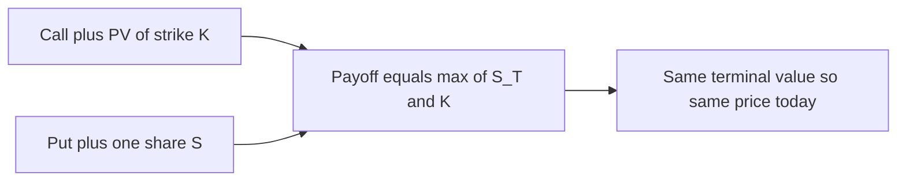
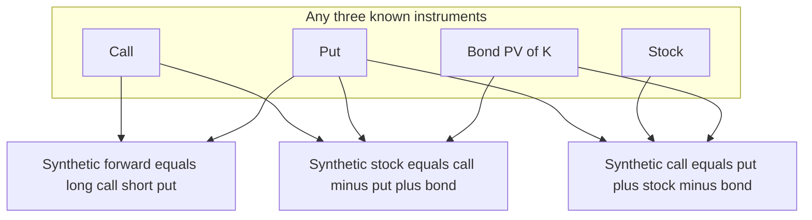
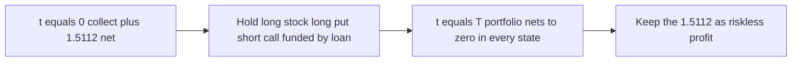

# Chapter 07 — Put-Call Parity

## 1. The Problem / The Need

Suppose you are a trader looking at a screen full of option prices. A three-month call on a stock trades at ₹8. A three-month put on the *same* stock, with the *same* strike, trades at ₹5. The stock is at ₹100, the strike is ₹100, and the risk-free rate is 6%. Are these prices sensible? Is one of them cheap? Should you buy the call, the put, both, or neither?

You *could* try to answer by pricing each option from scratch with Black-Scholes, plugging in a volatility, and comparing. But that requires you to guess volatility — and volatility is exactly the thing nobody can observe directly. So any conclusion you draw is only as good as your volatility guess. That is a shaky foundation for a trade.

Here is the deeper problem. A call and a put on the same underlying are not two unrelated instruments. They are two views of the *same* future payoff, sliced differently. A call pays off when the stock finishes above the strike; a put pays off when it finishes below. Between them, plus the stock and a bond, they span the entire space of outcomes. If they are priced as if they were independent, the market is contradicting itself, and a contradiction in prices is free money for whoever spots it first.

What we need is a relationship that ties the call price, the put price, the stock price, and the interest rate together **without ever mentioning volatility**. A relationship that must hold no matter what you believe about the future — not because of any pricing model, but because violating it hands out risk-free profit. That relationship is **put-call parity**. It is the single most important arbitrage identity in all of derivatives, and it is the first thing an interviewer will probe to see whether you actually understand options or merely memorized formulas.

## 2. The Core Idea

Put-call parity says that a specific *portfolio of a call and a bond* has exactly the same future payoff as a *different portfolio of a put and the stock*. Two portfolios with identical payoffs in every possible future state must cost the same today — otherwise you buy the cheap one, sell the expensive one, and pocket the difference with zero risk. Equating their costs gives the parity equation.

For **European options** on a stock that pays **no dividends** before expiry, with strike `K`, time to expiry `T`, and continuously compounded risk-free rate `r`:

$$ C + K e^{-rT} = P + S_0 $$

In words: **a call plus the present value of the strike (held as cash in a bond) equals a put plus the underlying stock.** The left side is "protective bond + call"; the right side is "protective put + stock." Both sides are worth exactly `max(S_T, K)` at expiry.

That is the whole idea. Everything else in this chapter is (a) proving it, (b) rearranging it to build synthetic instruments, and (c) using it to catch mispricing.

*Figure 1 — Put-call parity as two portfolios with one identical payoff.*

## 3. Why / How It Works

### The payoff argument

Consider two portfolios formed today.

**Portfolio A (fiduciary call):** Buy one European call struck at `K`. Also invest `K·e^{-rT}` in a risk-free zero-coupon bond that matures to exactly `K` at time `T`.

**Portfolio B (protective put):** Buy one European put struck at `K`. Also buy one share of the stock at price `S_0`.

Now walk forward to expiry and split the world into two cases.

| State at expiry | Call value | Bond value | **Portfolio A** | Put value | Stock value | **Portfolio B** |
|---|---|---|---|---|---|---|
| `S_T > K` (in-the-money call) | `S_T − K` | `K` | `S_T` | `0` | `S_T` | `S_T` |
| `S_T ≤ K` (in-the-money put) | `0` | `K` | `K` | `K − S_T` | `S_T` | `K` |

In **both** rows, Portfolio A and Portfolio B end with identical value: `S_T` when the stock is high, `K` when the stock is low. Compactly, both are worth `max(S_T, K)`. The bond in A "tops up" a worthless call to `K`; the put in B "tops up" a below-strike stock to `K`. Two mechanisms, one payoff.

### From equal payoffs to equal prices

This is where the *no-arbitrage principle* does the work. If two portfolios are guaranteed to have the same value at time `T` in every state of the world, and there is no cash flow in between (no dividends, European so no early exercise), then they must have the same value *today*. If they did not, an arbitrageur would short the expensive portfolio, buy the cheap one, lock in the price difference immediately, and walk away — the terminal values cancel perfectly, so there is no risk to carry. Markets do not leave such money lying around for long, so we take the equality as binding:

$$ \underbrace{C + K e^{-rT}}_{\text{Portfolio A cost}} = \underbrace{P + S_0}_{\text{Portfolio B cost}} $$

Notice what is **absent**: no volatility, no expected return on the stock, no probability of up vs down moves, no risk preferences. Parity is a *model-free* statement. Black-Scholes must obey it, the binomial model must obey it, and any correct model you ever build must obey it — because it follows from arbitrage alone, not from any assumption about how prices move.

### The discounting detail

We wrote `K·e^{-rT}` using continuous compounding, which is the derivatives-desk convention. If your rate is quoted as a simple annual rate `r_s`, the present value of the strike is `K / (1 + r_s·T)`; with annual compounding it is `K / (1+r_s)^T`. The logic is unchanged — the strike is a *fixed future cash amount*, so it must be discounted at the risk-free rate to compare with today's prices. Always match the compounding convention the problem gives you.

## 4. Full Content — Mechanics, Variants, and Formulas

### 4.1 The base identity and its rearrangements

Start from `C + K e^{-rT} = P + S_0`. Every synthetic instrument in Section 4.3 is just this equation solved for a different variable. Memorize the base form and *derive* the rest; do not memorize four separate formulas.

$$
\begin{aligned}
C - P &= S_0 - K e^{-rT} && \text{(call minus put = forward-ish)}\\
C &= P + S_0 - K e^{-rT} && \text{(synthetic call)}\\
P &= C - S_0 + K e^{-rT} && \text{(synthetic put)}\\
S_0 &= C - P + K e^{-rT} && \text{(synthetic stock)}\\
K e^{-rT} &= P - C + S_0 && \text{(synthetic bond)}
\end{aligned}
$$

### 4.2 The C − P = S₀ − Ke^{-rT} relation and forwards

The relation `C − P = S_0 − K e^{-rT}` is worth staring at. The right-hand side is the present value of `(S_0·e^{rT} − K)`, and `S_0·e^{rT}` is precisely the **forward price** `F_0` of the stock for delivery at `T` (from cost-of-carry). So:

$$ C - P = (F_0 - K)\,e^{-rT} $$

Three immediate consequences:

- **At-the-money-forward** (`K = F_0`): the call and put have the *same price*, `C = P`. This is why traders quote straddles around the forward.
- If `K < F_0`, the call is worth more than the put (`C > P`); if `K > F_0`, the put dominates.
- A long call + short put (same strike) synthesizes a **long forward** at strike `K`. This is the bridge between options and forwards, covered in 4.3.

### 4.3 Constructing synthetic positions

A **synthetic** instrument replicates the payoff of one instrument using a combination of the others. Because parity ties four instruments together, knowing any three lets you manufacture the fourth. Signs matter: **long** means buy (pay), **short** means sell (receive).

| You want (synthetic) | Build it from | Reading of the sign |
|---|---|---|
| **Synthetic long call** | long put + long stock + borrow `Ke^{-rT}` | `C = P + S_0 − Ke^{-rT}` |
| **Synthetic long put** | long call + short stock + lend `Ke^{-rT}` | `P = C − S_0 + Ke^{-rT}` |
| **Synthetic long stock** | long call + short put + lend `Ke^{-rT}` | `S_0 = C − P + Ke^{-rT}` |
| **Synthetic short stock** | short call + long put + borrow `Ke^{-rT}` | reverse of above |
| **Synthetic long forward** | long call + short put (same K) | `C − P = (F_0−K)e^{-rT}` |
| **Synthetic bond (lend)** | long put + long stock + short call | `Ke^{-rT} = P + S_0 − C` |

The single most tested synthetic in interviews is the **synthetic forward**: *long call + short put at the same strike and expiry = long forward struck at K*. Its payoff is `S_T − K` in every state (linear, no kink), which is exactly a forward contract. If you can derive that on a whiteboard in thirty seconds, you have demonstrated real fluency.

*Figure 2 — The four instruments and the synthetic each triple manufactures.*

### 4.4 Extending parity to dividends and other underlyings

The base identity assumed no dividends. Real underlyings pay income. The fix is always the same: **replace `S_0` with the value of the underlying net of the income you forgo by not holding it to expiry.**

**Discrete dividends** with present value `D` (sum of each dividend discounted to today):

$$ C + K e^{-rT} = P + S_0 - D \quad\Longleftrightarrow\quad C + D + K e^{-rT} = P + S_0 $$

Intuition: the stock holder in Portfolio B collects `D` that the call holder in Portfolio A does not, so you strip `D` out of the stock leg (or, equivalently, add it to the call side).

**Continuous dividend yield `q`** (indices, FX where `q` is the foreign rate):

$$ C + K e^{-rT} = P + S_0 e^{-qT} $$

**Currency options** (Garman-Kohlhagen world), with domestic rate `r_d`, foreign rate `r_f`, spot `S_0` in domestic per foreign:

$$ C + K e^{-r_d T} = P + S_0 e^{-r_f T} $$

**Futures options** (Black's model), with futures price `F`:

$$ C + K e^{-rT} = P + F e^{-rT} \quad\Longleftrightarrow\quad C - P = (F - K)e^{-rT} $$

In every case the skeleton is unchanged: *call + PV(strike) = put + PV(underlying's delivery value)*.

### 4.5 American options — parity becomes an inequality

Put-call parity as an *equality* is a **European** result. American options can be exercised early, which breaks the clean payoff-matching argument. For American options on a **non-dividend** stock you instead get a no-arbitrage *band*:

$$ S_0 - K \;\le\; C - P \;\le\; S_0 - K e^{-rT} $$

The intuition for the two bounds: the American put's early-exercise right makes `P` weakly larger than its European twin, loosening the relationship on one side; the fact that an American call on a non-dividend stock is never exercised early (a separate result) pins the other side. Do not write American parity as an equality — that is a classic interview trap.

### 4.6 What parity implies for bounds and Greeks

- **Put-call parity for Greeks.** Differentiate the identity. Since `Ke^{-rT}` and the discounting are deterministic, `Δ_C − Δ_P = 1` (for non-dividend stock; `e^{-qT}` with a yield), `Γ_C = Γ_P`, `Vega_C = Vega_P`, and `Θ` and `ρ` differ only by the deterministic terms. So a call and put on the same strike share gamma and vega — you cannot be long gamma via a call and flat gamma via the put; they carry the *same* convexity.
- **Lower bound on a call.** From `C = P + S_0 − Ke^{-rT}` and `P ≥ 0`, we get `C ≥ S_0 − Ke^{-rT}` (and `C ≥ 0`), so `C ≥ max(0, S_0 − Ke^{-rT})`. Parity thus *contains* the standard option bounds.

## 5. Worked Examples

### Example 1 — Checking prices and running the arbitrage

Return to the opening screen, now with exact numbers. European options, non-dividend stock.

- Spot `S_0 = 100`
- Strike `K = 100`
- Time `T = 0.25` years (three months)
- Continuously compounded rate `r = 6%` → `r·T = 0.015`
- Quoted call `C = 8`, quoted put `P = 5`

**Step 1 — Present value of the strike.**
`Ke^{-rT} = 100 · e^{-0.015} = 100 · 0.985112 = 98.5112`.

**Step 2 — Compute both sides of parity.**

| Side | Expression | Value |
|---|---|---|
| Left (call + bond) | `C + Ke^{-rT} = 8 + 98.5112` | **106.5112** |
| Right (put + stock) | `P + S_0 = 5 + 100` | **105.0000** |

The two sides are **not equal** — they differ by `106.5112 − 105.0000 = 1.5112`. Parity is violated, so a risk-free profit exists.

**Step 3 — Trade the cheap side, against the rich side.** The left portfolio (call + bond) is *expensive*; the right portfolio (put + stock) is *cheap*. So **sell the expensive, buy the cheap**: sell the call, and buy the protective put (buy put + buy stock), funding with borrowing.

Concretely, at `t = 0`:

| Action | Cash flow now |
|---|---|
| Sell (write) the call | `+8.0000` |
| Buy the put | `−5.0000` |
| Buy one share | `−100.0000` |
| Borrow `Ke^{-rT}` at rate `r` | `+98.5112` |
| **Net cash today** | **`+1.5112`** |

You collect **₹1.5112 today** with nothing invested.

**Step 4 — Verify zero risk at expiry.** At `T` you owe the loan `98.5112·e^{0.015} = 100` (i.e. `K`). Check both states:

| At expiry | Short call | Long put | Share sold | Repay loan | Net |
|---|---|---|---|---|---|
| `S_T = 120` | `−(120−100)=−20` | `0` | `+120` | `−100` | `0` |
| `S_T = 90` | `0` | `+(100−90)=+10` | `+90` | `−100` | `0` |

Every state nets to **zero** at expiry. The ₹1.5112 pocketed at `t=0` is pure arbitrage. This is a **conversion** (long stock + long put + short call). Had the mispricing gone the other way, the mirror trade — short stock + short put + long call + lend — is a **reversal**.

**What are "fair" prices?** Parity does not tell you the *level* of `C` and `P`, only their *difference*. Fair prices must satisfy `C − P = S_0 − Ke^{-rT} = 100 − 98.5112 = 1.4888`. The quoted spread was `C − P = 8 − 5 = 3`, which is `1.5112` too wide — exactly the arbitrage we extracted. Any pair with `C − P = 1.4888` (e.g. `C = 6.4888, P = 5`) is parity-consistent.

### Example 2 — Pricing a put from a call via parity (with dividends)

You can *observe* a call price but need the matching put — a routine desk task. Use parity as a pricing tool.

- Spot `S_0 = 250`
- Strike `K = 260`
- `T = 0.5` years
- `r = 8%` continuous → `rT = 0.04`
- The stock pays a dividend of `₹4` in two months (`t = 1/6` year)
- Observed call `C = 12`

**Step 1 — PV of dividends.** `D = 4·e^{-0.08·(1/6)} = 4·e^{-0.013333} = 4·0.986755 = 3.9470`.

**Step 2 — PV of strike.** `Ke^{-rT} = 260·e^{-0.04} = 260·0.960789 = 249.8051`.

**Step 3 — Dividend-adjusted parity, solved for `P`.** With dividends, `C + Ke^{-rT} = P + S_0 − D`, so:

$$ P = C + Ke^{-rT} - S_0 + D = 12 + 249.8051 - 250 + 3.9470 = 15.7521 $$

The fair put is **₹15.75**. Sanity check the direction: the strike (260) sits above the spot (250) and well above the dividend-reduced forward, so the put is in-the-money-ish and should be *worth more than the call* — indeed `15.75 > 12`. Good.

**Step 4 — Reconcile via `C − P = (F_0 − K)e^{-rT}`.** The dividend-adjusted forward is `F_0 = (S_0 − D)·e^{rT} = (250 − 3.9470)·e^{0.04} = 246.0530·1.040811 = 256.0951`. Then `(F_0 − K)e^{-rT} = (256.0951 − 260)·0.960789 = (−3.9049)·0.960789 = −3.7521`. And directly `C − P = 12 − 15.7521 = −3.7521`. **The two match**, confirming the put price is internally consistent.

### Example 3 — Building a synthetic forward and reconciling with the binomial model

This example ties parity back to earlier chapters and shows it agrees with an explicit model.

**Setup (one-step binomial).** `S_0 = 100`; in three months the stock goes to `u·S_0 = 110` or `d·S_0 = 95`. `r = 6%` continuous, `T = 0.25`, so `e^{rT} = e^{0.015} = 1.015113`. Strike `K = 100`, European.

**Step 1 — Risk-neutral probability.**
$$ p = \frac{e^{rT} - d}{u - d} = \frac{1.015113 - 0.95}{1.10 - 0.95} = \frac{0.065113}{0.15} = 0.434087 $$

**Step 2 — Price the call.** Payoffs: up `= max(110−100,0)=10`, down `= max(95−100,0)=0`.
$$ C = e^{-rT}\,[\,p·10 + (1-p)·0\,] = 0.985112 · (0.434087·10) = 0.985112 · 4.34087 = 4.2763 $$

**Step 3 — Price the put.** Payoffs: up `= max(100−110,0)=0`, down `= max(100−95,0)=5`.
$$ P = e^{-rT}\,[\,p·0 + (1-p)·5\,] = 0.985112 · (0.565913·5) = 0.985112 · 2.829565 = 2.7876 $$

**Step 4 — Check parity holds inside the model.**

| Side | Value |
|---|---|
| `C + Ke^{-rT} = 4.2763 + 98.5112` | **102.7875** |
| `P + S_0 = 2.7876 + 100` | **102.7876** |

They agree to rounding — the binomial model *automatically* satisfies parity, exactly as Section 3 promised. Any correct model must.

**Step 5 — The synthetic forward.** Long call + short put costs `C − P = 4.2763 − 2.7876 = 1.4887` today. Parity predicts `C − P = S_0 − Ke^{-rT} = 100 − 98.5112 = 1.4888`. **Match.** Verify the payoff is a genuine forward struck at `K=100`:

| State | Long call | Short put | Combined | Forward `S_T − K` |
|---|---|---|---|---|
| Up `S_T = 110` | `+10` | `0` | `+10` | `110 − 100 = +10` |
| Down `S_T = 95` | `0` | `−5` | `−5` | `95 − 100 = −5` |

The call-minus-put payoff equals `S_T − K` in both states — a linear, kink-free forward payoff. You have manufactured a long forward from two options, and its cost (`1.4887`) is the PV of the forward's intrinsic advantage, confirming the synthetic-forward identity end to end.

*Figure 3 — Cash-flow timeline of the Example 1 conversion arbitrage.*

## 6. Connections

- **Forwards and cost-of-carry (Ch. on forwards/futures).** Parity's `C − P = (F_0 − K)e^{-rT}` is literally the forward price wearing an options costume. The synthetic forward is the cleanest link between the linear world (forwards) and the convex world (options).
- **Binomial pricing (prior chapter).** As Example 3 showed, risk-neutral binomial prices satisfy parity automatically. Parity is a fast *consistency check* on any tree you build.
- **Black-Scholes (next chapters).** Plugging the BS call and put formulas into parity, the `N(d)` terms telescope and the identity `C − P = S_0 − Ke^{-rT}` falls out exactly — a standard sanity check that you have the BS put formula right.
- **Greeks.** `Δ_C − Δ_P = 1`, `Γ_C = Γ_P`, `Vega_C = Vega_P`. Parity constrains the Greeks, which is why market-makers hedge calls and puts on one book.
- **Implied volatility.** Because parity is model-free, a call and put at the same strike/expiry must imply the *same* volatility. If your data show different call-IV and put-IV at one strike, either quotes are stale or parity (via borrow costs/dividends) is telling you something — traders exploit exactly this.
- **Box spreads and conversions/reversals.** Conversion (Example 1) and reversal are the trading desk's parity plays; combining two of them at different strikes gives a **box spread**, a pure interest-rate instrument built entirely from options.

## 7. Key Terms

- **Put-call parity:** the no-arbitrage identity `C + Ke^{-rT} = P + S_0` linking European call, put, strike bond, and spot.
- **Fiduciary call:** long call + bond maturing to `K` (Portfolio A). Payoff `max(S_T, K)`.
- **Protective put:** long stock + long put (Portfolio B). Payoff `max(S_T, K)`.
- **Synthetic position:** replication of one instrument's payoff using the other three (synthetic call, put, stock, forward, bond).
- **Synthetic forward:** long call + short put at the same strike = long forward at that strike; payoff `S_T − K`.
- **Conversion:** arbitrage of long stock + long put + short call when the call/bond side is rich.
- **Reversal (reverse conversion):** the mirror — short stock + short put + long call — when the put/stock side is rich.
- **Box spread:** a conversion at one strike plus a reversal at another; a synthetic zero-coupon bond made of options.
- **No-arbitrage principle:** two portfolios with identical future payoffs must have identical prices today.
- **Cost of carry / forward price:** `F_0 = S_0 e^{rT}` (or `(S_0−D)e^{rT}` with dividends); the hinge between parity and forwards.

## 8. Common Confusions

- **"Parity gives me the call and put prices."** No. It gives only their *difference* `C − P`. Levels come from a model (BS/binomial); parity ties the pair together. Example 1's arbitrage existed even though we never priced either option outright.
- **Using parity as an equality for American options.** Early exercise breaks it. American non-dividend stock gives a *band* `S_0 − K ≤ C − P ≤ S_0 − Ke^{-rT}`, not an equation.
- **Forgetting to discount the strike.** `C + K = P + S_0` is wrong. The strike is a *future* payment; it must be `Ke^{-rT}`. Skipping the discount factor manufactures a fake arbitrage every time rates are positive.
- **Mishandling dividends.** The stock leg must be reduced by `D` (discrete) or use `S_0 e^{-qT}` (yield). Applying no-dividend parity to a dividend-paying stock is the most common exam error and a frequent real-world "phantom arbitrage."
- **Mixing compounding conventions.** If the rate is simple/annual, discount with `1/(1+rT)` or `1/(1+r)^T` — do not silently switch to `e^{-rT}`. Inconsistent conventions produce spurious mispricing signals.
- **Sign errors in synthetics.** "Synthetic call = put + stock − bond" needs the *long* put, *long* stock, and *borrowing* (short bond). Flipping any sign builds a different payoff entirely. Always re-derive from the base identity, then check payoffs in two states.
- **Believing parity needs a volatility or a direction view.** It needs neither. It is model-free; that independence from volatility is the entire point and the source of its power as a check.

## 9. Recap

Put-call parity is the arbitrage backbone of option pricing. It rests on one observation: a **fiduciary call** (call + PV-of-strike bond) and a **protective put** (put + stock) both pay `max(S_T, K)` at expiry, so they must cost the same today, giving `C + Ke^{-rT} = P + S_0`. The relationship is **model-free** — no volatility, no probabilities, no risk preferences — and any correct pricing model (binomial, Black-Scholes) satisfies it automatically, as our worked examples verified to the decimal.

Rearranging the identity manufactures **synthetic instruments**: a synthetic call, put, stock, bond, and — most importantly — a **synthetic forward** from long call + short put. The relation `C − P = (F_0 − K)e^{-rT}` welds options to forwards and explains why at-the-money-forward calls and puts trade at the same price. When observed prices violate parity, the gap *is* the arbitrage profit: run a **conversion** or **reversal** to harvest it risk-free, as in Example 1's ₹1.5112. Extensions handle dividends (`S_0 − D` or `S_0 e^{-qT}`), currencies (`S_0 e^{-r_f T}`), and futures, while American options weaken the equality into a band. Master this one identity and a large fraction of derivatives reasoning — bounds, Greek relationships, IV consistency, box spreads — follows as corollaries.

## 10. Quick-Reference / Interview Points

**The one equation:** `C + Ke^{-rT} = P + S_0` (European, no dividends). Everything derives from it.

**Rearrangements to have on instant recall:**
- `C − P = S_0 − Ke^{-rT} = (F_0 − K)e^{-rT}`
- Synthetic call `= P + S_0 − Ke^{-rT}`
- Synthetic put `= C − S_0 + Ke^{-rT}`
- Synthetic stock `= C − P + Ke^{-rT}`
- Synthetic **forward** `= long call − short put` (i.e. `C − P`)

**Extensions:**
- Discrete dividends: `C + Ke^{-rT} = P + S_0 − D`
- Dividend yield `q`: `C + Ke^{-rT} = P + S_0 e^{-qT}`
- FX: `C + Ke^{-r_d T} = P + S_0 e^{-r_f T}`
- Futures (Black): `C − P = (F − K)e^{-rT}`
- American (no div): `S_0 − K ≤ C − P ≤ S_0 − Ke^{-rT}` (band, not equality)

**Greeks from parity:** `Δ_C − Δ_P = 1`; `Γ_C = Γ_P`; `Vega_C = Vega_P`.

**Rapid-fire interview answers:**
- *"Why does parity hold without any model?"* Two portfolios with identical terminal payoffs (`max(S_T,K)`) must cost the same today, else free arbitrage. Pure no-arbitrage.
- *"How do you trade a violation?"* Sell the rich portfolio, buy the cheap one; conversion (long stock+put, short call) if call side rich, reversal if put side rich. Profit locked at `t=0`, nets to zero at `T`.
- *"When `K = F_0`, what's the call-put relationship?"* `C = P` — at-the-money-forward.
- *"Does it hold for American options?"* Only as an inequality band; early exercise breaks the equality.
- *"Fastest sanity check on my put price?"* Confirm `C − P = S_0 − Ke^{-rT}` (dividend-adjusted). If it fails, one of the prices is wrong.
- *"What does parity NOT tell you?"* The *level* of `C` or `P` — only their difference. Levels need volatility and a model.
