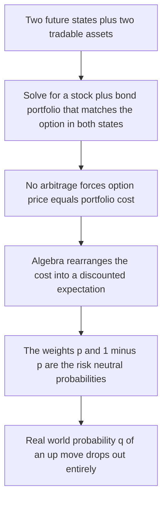
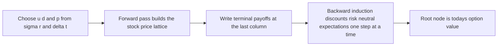
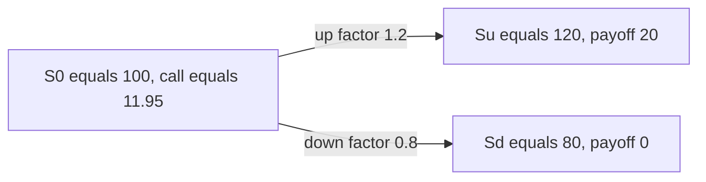
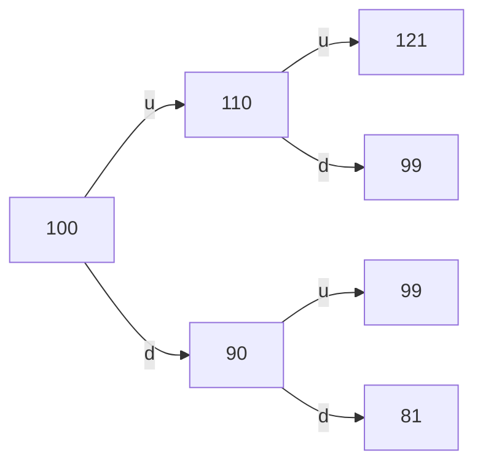
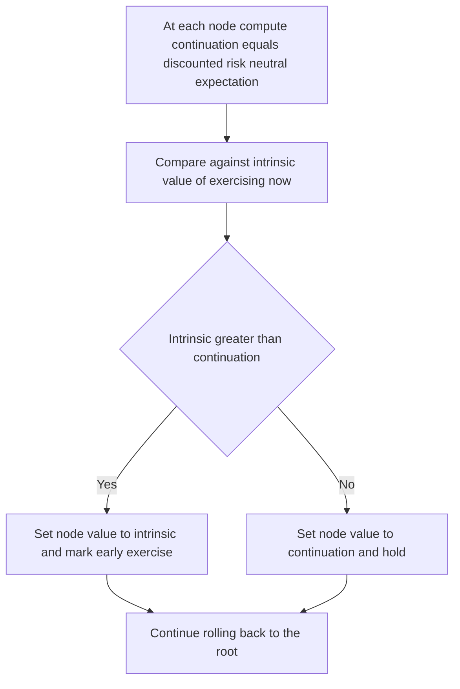

# Chapter 08 — Binomial Option Pricing

## 1. The Problem / The Need

We can now write down the payoff of a call or a put at expiry — a bent, kinked function of the stock price. But an option is worth something *before* expiry, while the payoff is still uncertain. How much? That is the pricing problem, and it is genuinely hard for one deep reason: the payoff is **non-linear**. A forward pays `S_T − K`, which is linear in `S_T`, so we can price it by a simple no-arbitrage carry argument. An option pays `max(S_T − K, 0)`, which is linear on one side and flat on the other. That kink means the value depends not just on the *expected* future price but on the entire *distribution* of possible prices — and, worse, on our ability to trade in between.

Two naive approaches both fail:

- **"Discount the expected payoff at the risk-free rate."** Wrong, because the option payoff is riskier than a bond and its risk is not diversifiable — you would need a risk-adjusted discount rate, and nobody can tell you what it is for an option.
- **"Discount the expected payoff at the stock's expected return."** Also wrong, because an option's risk (and hence its required return) is not the stock's risk; a call is a *leveraged* claim whose effective risk changes continuously as the stock moves.

The binomial model cuts this knot with a beautiful trick: it prices the option **without ever needing to know the stock's expected return or any risk premium**. It does this by building a portfolio of stock and cash that exactly replicates the option, and invoking no-arbitrage. That single idea — replication — is the entire foundation of modern derivatives pricing, and the binomial tree is the cleanest place to see it work.

## 2. The Core Idea

Chop time into small steps. Over each step, assume the stock can do only one of two things: go **up** by a factor `u` or **down** by a factor `d`. That is the "binomial" assumption. It sounds absurdly crude — real stocks can take any value — but by stacking many small steps we approximate a rich, continuous distribution, and the model converges to Black–Scholes in the limit.

Within any single step, because there are only **two** future states and we have **two** tradable instruments (the stock and a risk-free bond), we can always find a portfolio of those two that pays *exactly* what the option pays in both states. That portfolio is the option's synthetic twin. By no-arbitrage, the option must cost what the twin costs today. No expected returns, no utility, no risk premia — just algebra.

When we solve that algebra, a startling thing pops out: the option price can be written as a **discounted expected payoff**, but under a special, invented probability `p` called the **risk-neutral probability** — not the real-world probability of an up-move. This is *risk-neutral valuation*, and it is the workhorse of the whole field.

## 3. Why / How It Works

### Replication in one step

Consider one step. Today the stock is `S₀`. Next step it is either `S_u = uS₀` (up) or `S_d = dS₀` (down). An option on it is worth `f_u` or `f_d` in those two states — whatever its payoff function says. The risk-free growth factor over the step is `R = e^{rΔt}` (continuous compounding) or `(1 + r)` (discrete).

Build a portfolio: hold `Δ` shares of stock and `B` dollars of cash (the bond). Its value next step is:

- Up state: `Δ·uS₀ + B·R`
- Down state: `Δ·dS₀ + B·R`

We want this to equal the option in both states:

```
Δ·uS₀ + B·R = f_u
Δ·dS₀ + B·R = f_d
```

Subtract the two equations. The `B·R` cancels:

```
Δ·(u − d)S₀ = f_u − f_d
```

so the **hedge ratio** (option delta) is:

$$\Delta = \frac{f_u - f_d}{(u-d)S_0} = \frac{f_u - f_d}{S_u - S_d}$$

This is the sensitivity of the option value to the stock — the slope of the option across the two nodes. Back-substitute to get `B`, then the option's fair value today is the cost of the replicating portfolio:

$$f_0 = \Delta S_0 + B$$

Because the portfolio matches the option in *every* future state, no-arbitrage forces the option to trade at the portfolio's cost. If it didn't, you could buy the cheap one, sell the dear one, and pocket a riskless profit.

### The risk-neutral rearrangement

Now do some algebra on `f₀ = ΔS₀ + B`. Substitute `Δ` and `B` and collect terms (using `R = e^{rΔt}`). The result cleans up into:

$$\boxed{f_0 = e^{-r\Delta t}\left[p\,f_u + (1-p)\,f_d\right]}, \qquad p = \frac{e^{r\Delta t} - d}{u - d}$$

Read that carefully. `p` looks like a probability (it lies in `(0,1)` as long as `d < e^{rΔt} < u`, which no-arbitrage guarantees), and the option value is just the **expected payoff under `p`, discounted at the risk-free rate**. But `p` is *not* the true probability of an up-move. It is the probability that would make the stock itself earn exactly the risk-free rate:

$$p\,uS_0 + (1-p)\,dS_0 = e^{r\Delta t} S_0$$

That is why `p` is called the **risk-neutral** (or *risk-adjusted*, or *martingale*) probability: in this synthetic world every asset grows at `r`, so investors act as if risk-neutral. The magic is that the *real* probability of an up-move — call it `q` — **never appears** in the price. It got hedged away. Two investors who violently disagree about `q` will still agree on the option price, as long as they agree on `u`, `d`, and `r`.


*Figure 1 — Why risk-neutral valuation works: replication first, then the expectation is a consequence, not an assumption.*

### The up/down factors

Where do `u` and `d` come from? For a real model you calibrate them to the stock's **volatility** `σ`. The standard **Cox–Ross–Rubinstein (CRR)** choice is:

$$u = e^{\sigma\sqrt{\Delta t}}, \qquad d = e^{-\sigma\sqrt{\Delta t}} = \frac{1}{u}$$

The `d = 1/u` choice makes the tree **recombine**: an up-then-down move lands on exactly the same node as a down-then-up. That collapses the number of nodes from `2ⁿ` to `n+1` at step `n` — the difference between a tractable model and an exponential explosion. The risk-neutral probability is then, as above, `p = (e^{rΔt} − d)/(u − d)`.

> **Key sanity condition:** we need `d < e^{rΔt} < u` for the model to be arbitrage-free. If the risk-free growth were above `u`, the bond would dominate the stock in every state (free lunch shorting stock); if below `d`, the reverse. Under CRR with small `Δt` this always holds.

## 4. Full Content — Mechanics and Formulas

### The complete recipe

**Step 1 — Build the price tree (forward pass).** Starting from `S₀`, propagate `u` and `d`. On a recombining tree, the node after `j` up-moves and `(n−j)` down-moves out of `n` steps has price:

$$S_{n,j} = S_0\, u^{j} d^{\,n-j}, \qquad j = 0,1,\dots,n$$

**Step 2 — Terminal payoffs.** At the final step `N`, write the option payoff at every terminal node:

- Call: `f_{N,j} = max(S_{N,j} − K, 0)`
- Put: `f_{N,j} = max(K − S_{N,j}, 0)`

**Step 3 — Backward induction.** Roll value back one step at a time. At every interior node:

$$f = e^{-r\Delta t}\left[p\,f_{\text{up child}} + (1-p)\,f_{\text{down child}}\right]$$

Repeat until you reach the root. The root value is the option price today.

**Step 4 — For American options, add an exercise test at every node** (see §"American vs European" below).


*Figure 2 — The four-stage binomial algorithm.*

### Two equivalent lenses

Every binomial price can be computed **two** interchangeable ways, and knowing both is a common interview probe:

| Lens | What you compute | Formula (one step) |
|---|---|---|
| **Replication** | Delta and bond position that clone the option | `f₀ = ΔS₀ + B`, with `Δ = (f_u−f_d)/(S_u−S_d)` |
| **Risk-neutral** | Discounted expected payoff under `p` | `f₀ = e^{−rΔt}[p·f_u + (1−p)·f_d]` |

They give the *identical* number — one is the algebraic rearrangement of the other. Replication tells you *how to hedge*; risk-neutral valuation tells you *how to price fast*.

### Closed form for a European option

Because backward induction on a recombining tree is just repeated binomial averaging, an `N`-step European option has a closed form — the **binomial pricing formula**:

$$f_0 = e^{-rN\Delta t}\sum_{j=0}^{N}\binom{N}{j}p^{j}(1-p)^{N-j}\,\text{payoff}(S_0 u^{j}d^{N-j})$$

This is literally "discount the expectation over a binomial distribution of terminal prices." For American options no such shortcut exists — you *must* step back node by node because of the early-exercise test.

### Discrete vs continuous compounding

Two conventions coexist and interviewers switch between them to check you are paying attention. With **continuous** compounding the growth factor per step is `R = e^{rΔt}` and `p = (e^{rΔt} − d)/(u − d)`. With **discrete** (periodic) compounding the growth factor is `R = 1 + r` and `p = (1 + r − d)/(u − d)`, discounting by `1/(1+r)` per step. The *logic* is identical; only the compounding of the risk-free number changes. Always confirm which convention the problem uses before plugging in — a call priced at `11.95` continuously might read `11.90` discretely purely from the compounding choice.

### Handling dividends

If the stock pays a continuous dividend yield `δ`, the risk-neutral drift is the risk-free rate *net of* the yield, because the holder of the stock (not the option) collects the dividend. The probability becomes:

$$p = \frac{e^{(r-\delta)\Delta t} - d}{u - d}$$

Discounting of the payoff is still at the full `r`. Dividends are also what make early exercise of an **American call** potentially worthwhile — a large enough dividend can make capturing the stock (by exercising just before the ex-date) beat holding the option. Without dividends, `δ = 0` and everything reduces to the base case.

### Reading Greeks off the tree

A two-step tree gives you the first Greeks almost for free, by finite differences — a favourite follow-up question.

- **Delta** at the root is the same hedge ratio, computed one step out: `Δ = (f_u − f_d)/(S_u − S_d)`.
- **Gamma** is the change in delta per change in stock, read from the *second* step. Compute an "upper" delta between the `uu` and `ud` nodes and a "lower" delta between the `ud` and `dd` nodes, then divide their difference by the spread of the two intermediate stock prices:

$$\Gamma \approx \frac{\Delta_{upper} - \Delta_{lower}}{\tfrac{1}{2}(S_{uu} - S_{dd})}$$

- **Theta** (time decay) is read by comparing the root value with the shared middle node `f_ud` two steps later, since that node has the same stock price `S₀u d` as (approximately) the start after two steps of time have passed:

$$\Theta \approx \frac{f_{ud} - f_0}{2\Delta t}$$

For the Example 2 call: `Δ_upper = (21−0)/(121−99) = 0.9545`, `Δ_lower = (0−0)/(99−81) = 0`, so `Γ ≈ (0.9545 − 0)/[½(121−81)] = 0.9545/20 = 0.0477`. Root delta was `(12.371 − 0)/(110 − 90) = 0.6186`. These match the signs and rough magnitudes Black–Scholes would give, confirming the tree hedges as well as it prices.

## 5. Worked Examples

### Example 1 — One-step European call (with a replication cross-check)

**Setup.** `S₀ = 100`, `u = 1.2`, `d = 0.8`, one period `Δt = 1` year, risk-free `r = 5%` (continuous), European call with `K = 100`.

**Tree and payoffs.**

| State | Stock | Call payoff `max(S−100,0)` |
|---|---|---|
| Up | `120` | `20` |
| Down | `80` | `0` |

**Risk-neutral probability.**

$$p = \frac{e^{0.05} - 0.8}{1.2 - 0.8} = \frac{1.05127 - 0.8}{0.4} = \frac{0.25127}{0.4} = 0.62817$$

**Price via risk-neutral valuation.**

$$C = e^{-0.05}\big[0.62817 \times 20 + 0.37183 \times 0\big] = 0.95123 \times 12.5634 = \mathbf{11.95}$$

**Cross-check via replication.** The delta is:

$$\Delta = \frac{20 - 0}{120 - 80} = \frac{20}{40} = 0.5$$

To match the up state: `0.5×120 + B·e^{0.05} = 20`, i.e. `60 + 1.05127B = 20`, so `B = −40/1.05127 = −38.05` (a *loan* of 38.05 — you borrow cash to help buy half a share). Check the down state: `0.5×80 + (−38.05)(1.05127) = 40 − 40 = 0` ✓. Cost today:

$$C = \Delta S_0 + B = 0.5 \times 100 - 38.05 = \mathbf{11.95} \; ✓$$

Both lenses agree to the penny. Notice we never used the real probability of an up-move — it was never needed.


*Figure 3 — One-step tree for the European call. Delta of 0.5 and a 38.05 loan replicate the payoff exactly.*

### Example 2 — Two-step European call and put (put-call parity check)

**Setup.** `S₀ = 100`, `u = 1.1`, `d = 0.9`, two steps of `Δt = 1` year each, `r = 2%` per period (continuous), `K = 100`.

**Risk-neutral probability.**

$$p = \frac{e^{0.02} - 0.9}{1.1 - 0.9} = \frac{1.020201 - 0.9}{0.2} = \frac{0.120201}{0.2} = 0.601007$$

**Price lattice** (recombining, so the middle node is shared):

| Node | Path | Stock |
|---|---|---|
| Root | — | `100` |
| Up | u | `110` |
| Down | d | `90` |
| Up-Up | uu | `121` |
| Up-Down = Down-Up | ud | `99` |
| Down-Down | dd | `81` |

**European call, `K = 100`.** Terminal payoffs: `c_uu = 21`, `c_ud = 0`, `c_dd = 0`.

Roll back one step:

- Up node: `c_u = e^{-0.02}[0.601007×21 + 0.398993×0] = 0.980199 × 12.6211 = 12.371`
- Down node: `c_d = e^{-0.02}[0.601007×0 + 0.398993×0] = 0`

Root:

$$C = e^{-0.02}[0.601007 \times 12.371 + 0.398993 \times 0] = 0.980199 \times 7.4351 = \mathbf{7.288}$$

**Cross-check with the closed form.** Only the `uu` path finishes in the money, so:

$$C = e^{-0.04}\,p^2 \times 21 = 0.960789 \times 0.361210 \times 21 = 0.960789 \times 7.5854 = \mathbf{7.288} \; ✓$$

**European put, same tree, `K = 100`.** Terminal payoffs: `p_uu = 0`, `p_ud = 1`, `p_dd = 19`.

Roll back:

- Up node: `p_u = e^{-0.02}[0.601007×0 + 0.398993×1] = 0.980199 × 0.398993 = 0.3911`
- Down node: `p_d = e^{-0.02}[0.601007×1 + 0.398993×19] = 0.980199 × (0.601007 + 7.58087) = 0.980199 × 8.18188 = 8.0198`

Root:

$$P = e^{-0.02}[0.601007 \times 0.3911 + 0.398993 \times 8.0198] = 0.980199 \times 3.4348 = \mathbf{3.367}$$

**Cross-check with put-call parity.** With `T = 2` periods, `rT = 0.04`:

$$C - P = S_0 - Ke^{-rT} = 100 - 100(0.960789) = 3.9211$$

So `P = C − 3.9211 = 7.288 − 3.921 = 3.367` ✓. The tree and parity agree exactly.


*Figure 4 — Two-step recombining lattice. The ud and du paths land on the same 99 node, keeping the tree linear in size.*

### Example 3 — American put on the same tree (early exercise premium)

An American option can be exercised at **any** node, not just at expiry. At every node we compare **continuation value** (the discounted risk-neutral expectation, exactly as above) against **immediate intrinsic value** (`K − S` for a put), and take the larger:

$$f^{Am} = \max\big(\text{intrinsic}, \; e^{-r\Delta t}[p f_{up} + (1-p) f_{down}]\big)$$

Using the put lattice from Example 2 (`K = 100`):

| Node | Stock | Intrinsic `max(100−S,0)` | Continuation | American value | Exercise? |
|---|---|---|---|---|---|
| Up | `110` | `0` | `0.3911` | `0.3911` | Hold |
| **Down** | `90` | `10` | `8.0198` | **`10`** | **Exercise** |

At the down node, intrinsic value `10` beats the continuation value `8.02` — you are better off exercising immediately and collecting `100 − 90 = 10` than waiting. Now roll back to the root using the *American* node values:

$$P^{Am} = e^{-0.02}[0.601007 \times 0.3911 + 0.398993 \times 10] = 0.980199 \times (0.23499 + 3.98993) = 0.980199 \times 4.22492 = \mathbf{4.141}$$

At the root, intrinsic value is `max(100 − 100, 0) = 0 < 4.141`, so we hold. **American put = 4.141** versus **European put = 3.367**. The difference, `0.774`, is the **early-exercise premium** — the value of the *right* to exercise early, which materialises precisely at the down node.


*Figure 5 — The extra test that turns European backward induction into American backward induction.*

### Convergence — from a few steps to Black–Scholes

A one- or two-step tree is a teaching device, not a production price. As you refine `Δt` (more steps over the same maturity `T`, so `N = T/Δt` grows), the binomial price oscillates around and closes in on the Black–Scholes value. The convergence is *sawtooth* — it alternates above and below — because of how the discrete strike position sits relative to node prices, but the amplitude shrinks roughly as `1/N`. A representative pattern for an at-the-money European call (`S₀ = K = 100`, `σ = 20%`, `r = 5%`, `T = 1`) looks like:

| Steps `N` | Binomial call | Gap to Black–Scholes |
|---|---|---|
| 1 | `~11.6` | large |
| 2 | `~10.1` | overshoots down |
| 5 | `~10.6` | closer |
| 20 | `~10.42` | small oscillation |
| 100 | `~10.45` | within a cent |
| Black–Scholes | `10.45` | limit |

The lesson: use enough steps (a few hundred is standard) for a smooth price, and remember that the binomial model *is* Black–Scholes in disguise for European options — but strictly more general, because it also prices the American and path-dependent contracts that Black–Scholes cannot touch.

## 6. Connections

- **To no-arbitrage and forwards (Ch. on forward pricing).** The binomial model is the *same* no-arbitrage logic as forward pricing, extended to a non-linear payoff. Forwards need only a static portfolio; options need a *dynamic* one that rebalances each step, but the principle — replicate then invoke no-arbitrage — is identical.
- **To Black–Scholes.** Let the number of steps `N → ∞` with `u = e^{σ√Δt}`, `d = 1/u`. The binomial terminal distribution converges to lognormal and the price converges to the Black–Scholes formula. Binomial is the *discrete* ancestor; BS is its continuous limit. Binomial's advantage: it handles early exercise, which BS cannot.
- **To the Greeks.** The tree's `Δ = (f_u − f_d)/(S_u − S_d)` *is* the option delta. Gamma and theta can be read off a two-step tree by finite differences. So the tree simultaneously prices *and* hedges.
- **To risk-neutral / martingale pricing.** The result `f₀ = e^{−rΔt}E^Q[f]` under measure `Q` is the discrete face of the Fundamental Theorem of Asset Pricing: no-arbitrage ⇔ existence of a risk-neutral measure; completeness ⇔ its uniqueness. The binomial market is complete (two assets, two states), so `p` is unique.
- **To exotic and path-dependent options.** Trees extend naturally to barriers, Bermudans, and convertibles, where early-exercise or path features break closed forms.

## 7. Key Terms

- **Up / down factors (`u`, `d`)** — multiplicative moves per step; CRR sets `u = e^{σ√Δt}`, `d = 1/u`.
- **Recombining tree** — a lattice where up-down equals down-up, so nodes grow linearly (`n+1`) not exponentially (`2ⁿ`).
- **Risk-neutral probability (`p`)** — the synthetic probability `(e^{rΔt} − d)/(u − d)` under which every asset drifts at `r`; *not* the real probability.
- **Replicating portfolio** — the stock-plus-bond position that clones the option payoff in every state.
- **Delta / hedge ratio (`Δ`)** — shares of stock in the replicating portfolio; `(f_u − f_d)/(S_u − S_d)`.
- **Backward induction** — rolling value from expiry to today, one column at a time.
- **Continuation value** — the hold value at a node, i.e. the discounted risk-neutral expectation of its children.
- **Intrinsic value** — the payoff from exercising immediately.
- **Early-exercise premium** — American value minus European value.
- **Risk-neutral valuation** — pricing as a risk-free-discounted expectation under `p`.

## 8. Common Confusions

- **"`p` is the real probability of an up-move."** No. `p` is an artificial weight that forces the stock to drift at `r`. The real probability `q` never enters the price — that is the whole point of hedging.
- **"We discount at a risk-adjusted rate."** No. Under `Q` you discount at the *risk-free* rate. The risk adjustment is baked into `p`, not into the discount rate.
- **"A bigger up-move means a bigger `p`."** Not necessarily. `p` depends on `u`, `d`, and `r` together; raising `u` alone actually *lowers* `p` (the denominator grows). Don't conflate the *size* of a move with its risk-neutral *probability*.
- **"American calls should always be exercised early like American puts."** No. On a **non-dividend-paying** stock it is *never* optimal to exercise an American call early — so its price equals the European call. Puts (and calls on dividend payers) are the ones with a genuine early-exercise premium. Example 3's asymmetry is not an accident.
- **"More steps just means more arithmetic, same answer."** The *number* changes with `N` until it converges. One or two steps is a teaching device; real pricing uses hundreds of steps for accuracy.
- **"Delta is fixed."** Delta changes at every node and every step — that is exactly why replication is *dynamic* and must be rebalanced. A static hedge would leak.
- **"The tree needs the stock's expected return `μ`."** It does not — `μ` appears nowhere in `u`, `d`, `p`, or the price. Only `σ` and `r` matter.

## 9. Recap

The pricing problem is hard because option payoffs are non-linear, so value depends on the whole distribution and on dynamic trading. The binomial model tames it by assuming two outcomes per step. Within a step, two assets span two states, so we can **replicate** the option with stock and cash; no-arbitrage then pins the price to the replicating cost. Rearranging that cost yields **risk-neutral valuation**: discount the expected payoff at the risk-free rate using the invented probability `p = (e^{rΔt} − d)/(u − d)`, under which the stock drifts at `r`. The real probability of an up-move drops out. We build the price lattice forward, write terminal payoffs, then **backward-induct** to today. For **American** options we add an early-exercise test at every node — take the max of intrinsic and continuation value. Worked examples confirmed everything ties out: replication and risk-neutral valuation gave the same 11.95 call; the two-step tree and put-call parity agreed on a 3.367 European put; and the American put came to 4.141, revealing a 0.774 early-exercise premium.

## 10. Quick-Reference / Interview Points

**Core formulas**

| Quantity | Formula |
|---|---|
| Risk-neutral prob | `p = (e^{rΔt} − d)/(u − d)` |
| CRR factors | `u = e^{σ√Δt}`, `d = 1/u` |
| One-step value | `f = e^{−rΔt}[p·f_u + (1−p)·f_d]` |
| Delta | `Δ = (f_u − f_d)/(S_u − S_d)` |
| Replication | `f₀ = Δ·S₀ + B` |
| No-arbitrage bound | `d < e^{rΔt} < u` |
| American node | `max(intrinsic, continuation)` |

**Things interviewers love to hear**

- *Why does the real probability drop out?* Because the option is perfectly replicated; the hedge removes all exposure to which state occurs, so beliefs about that state are irrelevant.
- *What is `p`, really?* The probability that makes the discounted stock a martingale — every asset drifts at `r` in the risk-neutral world.
- *Replication vs risk-neutral?* Same answer, two views: replication tells you how to hedge (delta and bond), risk-neutral gives a fast expectation. One is the algebraic rearrangement of the other.
- *Why do trees beat Black–Scholes sometimes?* They handle early exercise (American, Bermudan) and path-dependent features that have no closed form.
- *Convergence?* As `N → ∞` with CRR factors, binomial → Black–Scholes; the terminal binomial distribution → lognormal.
- *American calls?* Never exercise early without dividends, so `C^{Am} = C^{Eur}`. The early-exercise premium lives in puts and dividend-paying calls.
- *What breaks the model?* Multiple risk factors per step (need more than two states / assets to stay complete), or if `e^{rΔt}` escapes `(d, u)` — that signals arbitrage in the inputs.
- *Delta is dynamic.* It changes node to node; the replication is a self-financing dynamic strategy, not a buy-and-hold.
