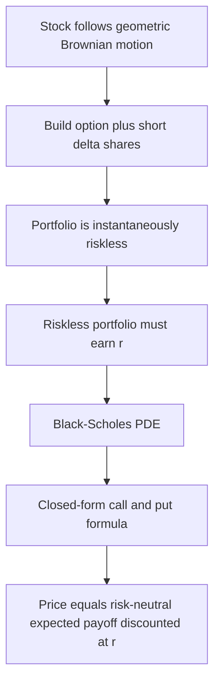
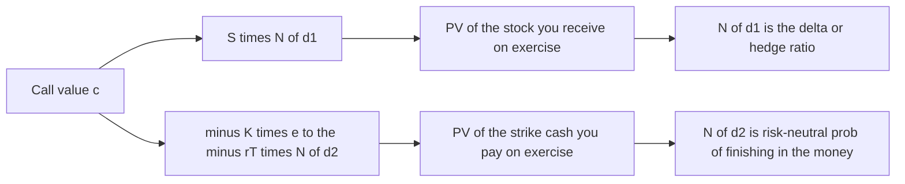

# Chapter 09 — The Black-Scholes-Merton Model

## 1. The Problem / Need

By now you can price a forward (no-arbitrage carry) and you can price an option on a *tree* (the binomial model of the previous chapter). The binomial model is beautiful for teaching because it makes the risk-neutral logic visible step by step. But it has a practical weakness: reality is not a tree with two branches per period. A real stock can settle at *any* price tomorrow, not just an "up" node or a "down" node. To approximate a continuous world with a binomial tree you must chop time into hundreds of tiny steps and grind through thousands of nodes. That is fine for a computer, useless for a trader shouting a quote across a desk.

What the market needed in 1973 was a **closed-form formula** — plug in five numbers, out comes the fair premium — that (a) held under continuous trading, (b) required *no forecast of the stock's expected return*, and (c) could be inverted to read the market's fear straight off a screen. Before Black, Scholes and Merton, option pricing was folklore: traders guessed premiums from the expected payoff discounted at some hand-waved "risky" rate, and nobody could agree on the rate. The deep problem was that the *right* discount rate seemed to depend on the investor's risk appetite, which is unobservable.

The Black-Scholes-Merton (BSM) breakthrough dissolved that problem. It showed that an option can be *replicated* by a continuously-rebalanced portfolio of the stock and cash, and that a replicable payoff must cost exactly what the replicating portfolio costs — regardless of anyone's risk preferences or the stock's expected return. The formula that falls out is one of the most consequential equations in finance, and understanding *why* it works is worth far more in an interview than memorising it.

## 2. The Core Idea

The core idea is **replication kills preferences.** If I can build a self-financing portfolio of the underlying stock and a risk-free bond that reproduces the option's payoff in *every* future state, then the option and the portfolio are the same asset wearing different clothes. Two assets with identical payoffs must have identical prices — otherwise you short the dear one, buy the cheap one, and harvest a riskless profit. So the option's price equals the cost of the replicating portfolio, and that cost never once mentions how *likely* the stock is to rise or how much return investors demand for risk.

BSM makes this rigorous in continuous time. It assumes the stock price follows **geometric Brownian motion** — a random walk in the logarithm of price with constant drift and constant volatility. It then constructs a portfolio of one option hedged by a fraction of a share (the **delta**) such that the portfolio is *instantaneously riskless* over the next infinitesimal instant. Because it is riskless, it must earn the risk-free rate. Forcing that condition produces a partial differential equation (the Black-Scholes PDE), whose solution for a European call or put is the famous formula.

The punchline, expressed in **risk-neutral** language: price any European option as the **expected payoff computed in a world where every asset drifts at the risk-free rate, discounted at the risk-free rate.**


*The logical chain from the stock's dynamics to the pricing formula — replication is the hinge.*

## 3. Why / How It Works

Let me build the intuition in layers, because the "why" is the whole point.

**Layer 1 — Delta hedging removes the direction bet.** Hold one call. Its value rises and falls with the stock, but not one-for-one; a small move `dS` changes the call by roughly `Δ · dS`, where `Δ` (delta) is the sensitivity of the option to the stock. If I simultaneously *short* `Δ` shares, then for a small move the gain on the option and the loss on the short shares cancel. My combined position no longer cares which way the stock ticks over the next instant. I have neutralised the first-order risk.

**Layer 2 — A riskless position must earn the riskless rate.** If the hedged portfolio has no risk over the next instant, arbitrage forbids it from earning more or less than the risk-free bond. Any excess return would be a free lunch that traders would arbitrage away. Setting the portfolio's drift equal to `r` times its value is the single equation that pins down the option price.

**Layer 3 — Preferences vanish.** Notice what *never appeared* in that argument: the stock's expected return `μ`. The drift of the stock cancels out during the hedge, because the delta-hedged portfolio is immune to direction. This is why two investors who wildly disagree about whether the stock will boom or bust must still agree on the option's price. The expected return is irrelevant; only the *volatility* — the size of the wiggles, not their direction — survives.

**Layer 4 — Risk-neutral valuation.** Since preferences drop out, we are free to *pretend* we live in a convenient fictional world: the **risk-neutral world**, where all assets drift at `r`. In that world the fair price of the call is simply the expected terminal payoff `E*[max(S_T − K, 0)]` discounted at `r`. The two terms of the Black-Scholes formula are exactly the two pieces of that expectation, as we will see. The risk-neutral world is a computational trick, not a claim about reality — but because the answer it produces is preference-free, it is the *right* answer for everyone.

The delta is not static. As the stock moves and time passes, delta changes, so the replication requires **continuous rebalancing**. That continuous rebalancing is only costless and exact under the model's assumptions — which is precisely where the real-world limitations (Section 4.6 and Section 8) creep in.

## 4. Full Content — Mechanics and Formulas

### 4.1 The five inputs

Every European option price under BSM is a function of exactly five inputs. Learn them cold; interviewers ask.

| Symbol | Input | What it is | Effect on **call** | Effect on **put** |
|---|---|---|---|---|
| `S` | Spot | Current price of the underlying | Up → call up | Up → put down |
| `K` | Strike | Agreed exercise price | Up → call down | Up → put up |
| `T` | Time to expiry | Years until expiration | Up → call up | Ambiguous* |
| `r` | Risk-free rate | Continuously-compounded annual rate | Up → call up | Up → put down |
| `σ` | Volatility | Annualised standard deviation of returns | Up → call up | Up → put up |

*More time usually raises a European put too, but for deep in-the-money European puts the discounting of the strike can dominate and longer maturity slightly lowers the value — the one genuinely ambiguous cell.

Four of the five are directly observable on a screen. The odd one out is **volatility** — the only input you cannot look up, the input the whole options market is really trading. Hold that thought for Section 4.5.

### 4.2 The formula

For a European **call** and **put** on a non-dividend-paying stock:

```
c = S · N(d1) − K · e^(−rT) · N(d2)
p = K · e^(−rT) · N(−d2) − S · N(−d1)
```

where

```
d1 = [ ln(S/K) + (r + σ²/2)·T ] / (σ·√T)
d2 = d1 − σ·√T
```

and `N(·)` is the **cumulative distribution function of the standard normal** — `N(x)` is the probability that a standard normal draw is less than `x`, i.e. the area under the bell curve to the left of `x`.

If the stock pays a continuous dividend yield `q`, replace `S` with `S·e^(−qT)` throughout (or equivalently discount the spot). For an index or an FX rate the same substitution absorbs the dividend yield or the foreign interest rate.

### 4.3 Reading N(d1) and N(d2) — what the two terms *mean*

This is the part candidates fumble. The two terms are not arbitrary.

- **`N(d2)` is the risk-neutral probability that the option finishes in the money**, i.e. the probability that `S_T > K` in the risk-neutral world. So `K · e^(−rT) · N(d2)` is the present value of *paying the strike*, weighted by the chance you actually pay it (you only pay `K` if you exercise, which you only do if you end in the money).

- **`N(d1)` is the delta of the call** — the hedge ratio, the number of shares to hold per option to be delta-neutral. The term `S · N(d1)` is the present value of *receiving the stock*, conditional on exercise. More precisely `S·N(d1)` equals the risk-neutral expected value of `S_T` given `S_T > K`, times the probability of that event, discounted — it is the expected stock inflow you collect on exercise.

So the whole formula reads in plain English: **call value = expected value of the stock you receive if you exercise − expected present value of the cash you pay if you exercise.** The gap between `d1` and `d2` — exactly `σ√T` — is why `N(d1) > N(d2)`: the stock term carries an extra half-variance of drift because you receive the *asset* (which has upside dispersion) whereas the strike term is a fixed cash amount.


*Decomposing the two terms of the Black-Scholes call — asset leg minus cash leg.*

### 4.4 The assumptions

BSM is only as good as its scaffolding. Memorise these; every real-world limitation in Section 8 is one of them breaking.

1. **Geometric Brownian motion** — the stock's log-returns are normally distributed with **constant volatility** and constant drift; prices move continuously with no jumps.
2. **Constant, known risk-free rate** `r`, the same for borrowing and lending, across all maturities.
3. **No dividends** over the option's life (relaxable via the `q` adjustment).
4. **Frictionless markets** — no transaction costs, no taxes, infinitely divisible assets, unlimited short selling.
5. **Continuous trading** — you can rebalance the hedge instantaneously and costlessly.
6. **No arbitrage** — the enforcement mechanism that makes replication bind.
7. **European exercise** — exercise only at expiry (so the closed form applies; American options need trees or numerical methods).

### 4.5 Implied volatility — inverting the formula

Four inputs (`S, K, T, r`) are observable. Volatility is not. But the *option's market price* **is** observable. So flip the problem: take the traded premium, hold the other four inputs fixed, and solve for the `σ` that makes the BSM formula reproduce that price. That number is the **implied volatility (IV)**.

There is no algebraic inverse — `σ` is buried inside `N(d1)` and `N(d2)` — so you solve numerically (Newton-Raphson converges fast because vega, the derivative of price with respect to `σ`, is always positive; price is monotonic in `σ`). Because price rises strictly with volatility, exactly one IV reproduces any arbitrage-free market price.

Implied volatility is the market's **forward-looking consensus forecast of volatility**, priced in real money. It is *the* quoting language of the options world — traders quote and think in vol, not in dollars of premium, because vol strips out the mechanical dependence on `S`, `K`, `T`, `r` and isolates the one thing they actually disagree about. When you hear "the VIX is at 30," that is the implied volatility of S&P 500 options, annualised, in percent.

Crucially, if the BSM assumptions held perfectly, *every* strike and maturity on one underlying would imply the *same* volatility. They do not. Plot IV against strike and you get the **volatility smile / skew** — a curve, not a flat line. Equity index options show a pronounced skew: low strikes (crash puts) trade at higher implied vol than high strikes, because the market prices in fat left tails that the lognormal model omits. The smile is the market's visible confession that BSM is wrong in a known, structured way — and traders trade *around* that confession.

### 4.6 The Greeks — sensitivities of the price

The Greeks are the partial derivatives of the option price with respect to each input. They are how a desk manages risk; they are also the single most-asked options topic in quant interviews.

| Greek | Measures sensitivity to | Call formula | Sign (call) |
|---|---|---|---|
| **Delta** `Δ` | Spot `S` | `N(d1)` | + between 0 and 1 |
| **Gamma** `Γ` | Delta itself (2nd deriv in `S`) | `φ(d1) / (S·σ·√T)` | + always |
| **Vega** `ν` | Volatility `σ` | `S·φ(d1)·√T` | + always |
| **Theta** `Θ` | Time passing | see §5.3 | − usually |
| **Rho** `ρ` | Rate `r` | `K·T·e^(−rT)·N(d2)` | + for call |

Here `φ(·)` is the standard-normal **probability density** (the bell curve height), not the cumulative `N(·)`. Note delta = `N(d1)`, which is *why* `N(d1)` is the hedge ratio: it literally is the price's slope against the stock. Gamma and vega are largest for at-the-money options near expiry, where the option is most "sensitive to everything." We compute all five numerically in Section 5.3.

## 5. Worked Examples

### 5.1 Example 1 — Pricing an at-the-money one-year call

**Inputs:** `S = 100`, `K = 100`, `r = 5%` (0.05, continuously compounded), `σ = 20%` (0.20), `T = 1` year, no dividends.

**Step 1 — compute d1 and d2.**

```
d1 = [ ln(100/100) + (0.05 + 0.20²/2)·1 ] / (0.20·√1)
   = [ 0 + (0.05 + 0.02) ] / 0.20
   = 0.07 / 0.20
   = 0.35

d2 = 0.35 − 0.20·√1 = 0.35 − 0.20 = 0.15
```

**Step 2 — look up the normal CDFs.**

```
N(0.35) = 0.6368
N(0.15) = 0.5596
```

**Step 3 — discount factor.**

```
e^(−rT) = e^(−0.05) = 0.9512
```

**Step 4 — assemble the call.**

```
c = S·N(d1) − K·e^(−rT)·N(d2)
  = 100·0.6368 − 100·0.9512·0.5596
  = 63.68 − 53.23
  = 10.45
```

The fair value of the one-year at-the-money call is **≈ 10.45**. Sanity check: an at-the-money option worth ~10% of spot for 20% vol over one year is exactly the right order of magnitude (a fast rule of thumb, `c ≈ 0.4·S·σ·√T = 0.4·100·0.20·1 = 8` for the ATM-forward call, in the same ballpark once the rate lifts the forward above spot).

### 5.2 Example 2 — The matching put, two ways (self-check)

**Method A — direct BSM put formula.**

```
N(−d1) = N(−0.35) = 1 − 0.6368 = 0.3632
N(−d2) = N(−0.15) = 1 − 0.5596 = 0.4404

p = K·e^(−rT)·N(−d2) − S·N(−d1)
  = 100·0.9512·0.4404 − 100·0.3632
  = 41.89 − 36.32
  = 5.57
```

**Method B — put-call parity (independent check).** Parity says `c + K·e^(−rT) = p + S`, so:

```
p = c + K·e^(−rT) − S
  = 10.45 + 95.12 − 100
  = 5.57
```

Both methods give **5.57**. They agree, which confirms the arithmetic *and* demonstrates that BSM is internally consistent with put-call parity — as any arbitrage-free model must be. This reconciliation is the kind of self-check an interviewer loves to see you perform unprompted.

### 5.3 Example 3 — The full Greek profile of the Example-1 call

Using the same inputs and `φ(d1) = φ(0.35) = (1/√(2π))·e^(−0.35²/2) = 0.3989·0.9406 = 0.3752`:

| Greek | Computation | Value | Interpretation |
|---|---|---|---|
| Delta | `N(d1) = N(0.35)` | **0.637** | +1 in stock → +0.637 in call; hold 0.637 shares to hedge one call |
| Gamma | `0.3752 / (100·0.20·1)` | **0.0188** | delta rises ~0.019 per +1 in stock |
| Vega | `100·0.3752·1` → per 1% vol `÷100` | **0.375** | +1 vol point (20→21%) → +0.375 in premium |
| Theta | `−[S·φ(d1)·σ/(2√T)] − r·K·e^(−rT)·N(d2)` | **−6.41 / yr** | ≈ **−0.0176/day** value decays as expiry nears |
| Rho | `K·T·e^(−rT)·N(d2)` → per 1% `÷100` | **0.532** | +1% in rates → +0.532 in call |

**Theta detail (worth showing your work):**

```
Term 1 = 100·0.3752·0.20 / (2·1) = 7.504 / 2 = 3.752
Term 2 = 0.05·100·0.9512·0.5596 = 0.05·53.23 = 2.662
Theta  = −(3.752 + 2.662) = −6.41 per year
       ≈ −6.41 / 365 = −0.0176 per calendar day
```

**Cross-check via a small delta re-price.** Bump the stock from 100 to 101 and re-run BSM: `d1` becomes `[ln(101/100)+0.07]/0.20 = [0.00995+0.07]/0.20 = 0.3998`, `d2 = 0.1998`, `N(0.3998)=0.6554`, `N(0.1998)=0.5792`, giving `c = 101·0.6554 − 95.12·0.5792 = 66.20 − 55.09 = 11.11`. The actual change is `11.11 − 10.45 = 0.66`. Predicted by delta + half-gamma: `Δ·1 + ½·Γ·1² = 0.637 + 0.009 = 0.646`. The two agree to within rounding — confirming delta and gamma are consistent with the pricing function. That `0.66` vs `0.646` gap is second-order curvature, exactly what gamma is there to capture.

## 6. Connections

- **To the binomial model (Ch. 08):** BSM is the *continuous-time limit* of the binomial tree. Let the number of steps go to infinity with up/down factors set to `u = e^(σ√Δt)`, `d = 1/u`, and the binomial price converges to Black-Scholes. Same risk-neutral logic, different granularity. If you can explain the tree, you already understand BSM's engine.
- **To put-call parity (Ch. 07):** BSM respects parity exactly, as Example 2 showed. Parity is model-free; BSM is a model; they never conflict.
- **To forwards/futures (Ch. 02-04):** the term `S·e^((r−q)T)` inside the drift is just the forward price. BSM can be rewritten entirely in terms of the forward (Black's 1976 model), which is how options on futures, caps, floors and swaptions are actually priced.
- **To portfolio insurance and delta hedging:** the replicating portfolio *is* a dynamic hedging strategy. The 1987 crash exposed what happens when everyone runs the same delta hedge and continuous trading breaks down.
- **To the VIX and volatility trading:** implied volatility, the model's one unobservable input, became an asset class of its own — variance swaps, VIX futures, vol-targeting funds all descend from BSM's isolation of `σ`.

## 7. Key Terms

- **Black-Scholes-Merton (BSM):** closed-form model pricing European options via no-arbitrage replication under geometric Brownian motion.
- **Geometric Brownian motion (GBM):** the assumed stock process — lognormal prices, normal log-returns, constant volatility.
- **Replication / delta hedging:** building an option's payoff from stock + cash, rebalanced continuously; the basis of the whole derivation.
- **Risk-neutral valuation:** pricing as discounted expected payoff in a fictional world where all assets drift at `r`; valid because preferences cancel.
- **N(d1), N(d2):** the two normal-CDF terms; `N(d1)` = delta = PV weight on the stock leg; `N(d2)` = risk-neutral probability of finishing in the money.
- **Implied volatility (IV):** the `σ` that makes BSM reproduce a traded option price; the market's forward vol forecast.
- **Volatility smile / skew:** the empirical pattern of IV varying across strikes, contradicting BSM's constant-vol assumption.
- **The Greeks:** delta, gamma, vega, theta, rho — partial derivatives of price w.r.t. each input; the risk-management dashboard.
- **Vega:** sensitivity to volatility; always positive for long options; the reason IV can be solved uniquely.

## 8. Common Confusions

- **"N(d2) is the *real* probability of exercise."** No — it is the *risk-neutral* probability. The real-world probability uses the stock's true drift `μ`, not `r`, and is generally different. BSM prices with the risk-neutral measure precisely because the real one is unknowable and unnecessary.
- **"Higher expected stock return makes the call worth more."** No — the expected return `μ` does not appear in the formula at all. Delta hedging cancels it. This is the single most counter-intuitive fact in the model and a favourite interview trap.
- **"Volatility means the stock is going up."** Volatility is *dispersion*, direction-agnostic. A stock as likely to crash as to soar has high vol, and both calls and puts get more expensive — because both benefit from bigger swings.
- **"Implied vol is a prediction that will come true."** IV is a *price*, not a forecast that must materialise. It usually sits above realised vol (the variance risk premium — sellers charge insurance). Systematically selling that gap is a real, if dangerous, strategy.
- **"BSM works for American options."** The closed form is European-only. American calls on non-dividend stocks happen to equal European (never optimal to exercise early), but American *puts* and dividend-paying calls need trees or finite-difference methods.
- **"The volatility smile is a pricing error."** It is not a mistake to be arbitraged away; it is the market *correcting* BSM for fat tails and skew. The flat-vol assumption is the bug; the smile is traders patching it.
- **"A constant `σ` is realistic."** It is the model's biggest lie. Volatility clusters, spikes in crashes, and mean-reverts. Whole model families (Heston stochastic vol, SABR, local vol, jump-diffusion) exist solely to fix this.

## 9. Recap

Black-Scholes-Merton prices a European option by **replicating** it with a continuously delta-hedged portfolio of stock and cash. Because that hedge is instantaneously riskless, it must earn the risk-free rate, and forcing that condition removes the stock's expected return from the problem entirely — so the price depends on **preferences nowhere** and on **five inputs**: spot, strike, time, rate, and volatility. Four are observable; volatility is not, which makes **implied volatility** — the vol that reproduces the market price — the true currency of options trading. The formula `c = S·N(d1) − K·e^(−rT)·N(d2)` splits into an asset leg and a cash leg, with `N(d1)` doubling as the hedge ratio (delta) and `N(d2)` as the risk-neutral probability of exercise. We priced an ATM one-year call at 10.45, cross-checked the 5.57 put by parity, and computed a full Greek profile that self-verified against a re-priced bump. The model's power is its simplicity and its preference-free universality; its limitations — **fat tails, jumps, and non-constant volatility** — are all the same assumption (GBM with constant `σ`) breaking, and the market's answer to that breakage is the visible **volatility smile.**

## 10. Quick-Reference / Interview Points

- **The formula:** `c = S·N(d1) − K·e^(−rT)·N(d2)`; `p = K·e^(−rT)·N(−d2) − S·N(−d1)`; `d1 = [ln(S/K)+(r+σ²/2)T]/(σ√T)`; `d2 = d1 − σ√T`.
- **Five inputs:** S, K, T, r, σ. Only σ is unobservable — that is the whole game.
- **What N(d1) and N(d2) mean:** `N(d1)` = call delta = hedge ratio; `N(d2)` = risk-neutral probability of finishing in the money. Gap between them is `σ√T`.
- **The key insight (say this):** the expected return μ drops out because delta hedging neutralises direction — so risk preferences never enter the price. This is why risk-neutral valuation is legitimate.
- **Implied vol:** invert BSM on the traded price; unique because price is monotonic in σ (vega > 0). It is the market's forward vol forecast and the standard quoting unit.
- **The Greeks in one breath:** delta = N(d1); gamma peaks ATM near expiry; vega always positive, peaks ATM; theta usually negative (time decay); rho small and positive for calls.
- **Assumptions to recite:** GBM with constant vol, constant rate, no dividends, frictionless continuous trading, no arbitrage, European exercise.
- **Limitations to recite:** real returns have **fat tails and jumps** (not lognormal), **volatility is stochastic and clusters** (not constant), continuous costless hedging is impossible, and the **volatility smile/skew** is the market's standing rebuttal of the flat-vol assumption.
- **Relationship to the tree:** BSM is the continuous limit of the binomial model; same risk-neutral engine.
- **One-line pitch:** "Black-Scholes prices an option as the cost of the stock-plus-cash portfolio that replicates it, which makes the price independent of anyone's view on the stock — its only real input the market argues over is volatility."
