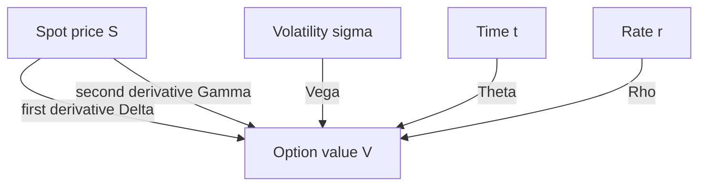
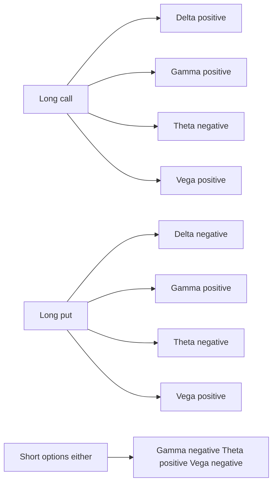
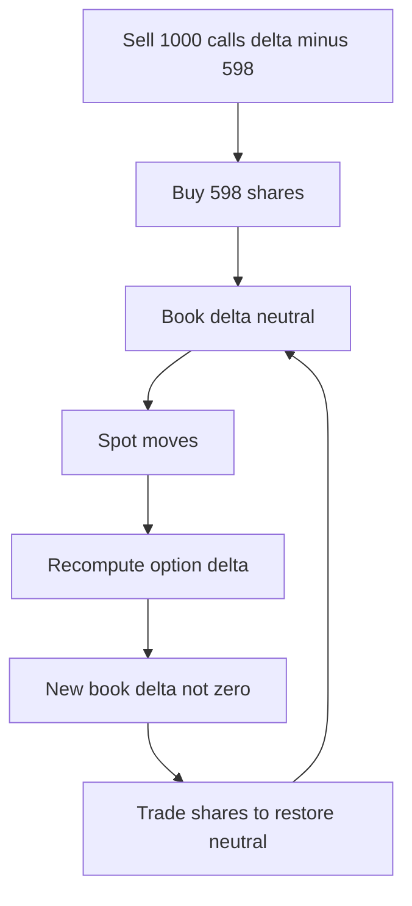

# Chapter 10 — The Greeks

## 1. The Problem / Need

You have just sold a European call for a premium of ₹6.89. You are now short that option. Overnight, three things can move against you: the stock price can drift, its volatility can spike, and time simply passes. Each of these changes the value of the option you are short — and therefore your profit or loss. A dealer running a book of thousands of options faces this at industrial scale: the entire book is repriced every second as markets move.

Two questions become existential:

1. **If the underlying moves by ₹1, how much money do I make or lose right now?** Not at expiry — right now, on today's marks.
2. **Which risks am I actually exposed to, and how do I neutralise the ones I do not want?**

The payoff diagrams from earlier chapters tell you the value *at expiry*. They are useless for managing a live position, because between now and expiry the option's value swings around in ways that depend on spot, volatility, time, and rates simultaneously. What you need is a set of **local sensitivities** — the partial derivatives of the option's value with respect to each risk factor. These are the **Greeks**. They are the dials on the cockpit of an options book: each one tells you how fast value changes as one input moves, holding the others fixed.

Without the Greeks, option risk is a black box. With them, a book of ten thousand contracts collapses into a handful of aggregate numbers — total delta, total gamma, total vega — that a trader can read at a glance and hedge deliberately.

## 2. The Core Idea

The value of an option is a function `V(S, σ, t, r)` of the spot price `S`, volatility `σ`, time `t`, and interest rate `r`. Each Greek is a **partial derivative** of `V` with respect to one of these inputs (or, for gamma, a second derivative). It answers "how much does value change per unit change in this one factor, everything else held constant?"

| Greek | Symbol | Derivative | Sensitivity to |
|-------|--------|-----------|----------------|
| Delta | Δ | ∂V/∂S | Underlying price |
| Gamma | Γ | ∂²V/∂S² | *Change* in delta (curvature) |
| Theta | Θ | ∂V/∂t | Passage of time |
| Vega | ν | ∂V/∂σ | Volatility |
| Rho | ρ | ∂V/∂r | Interest rate |

The single most important mental model: **an option's P&L over a small interval is a Taylor expansion in these Greeks.**

For a move `ΔS` in spot, a move `Δσ` in vol, and elapsed time `Δt`:

```
ΔV ≈ Δ·ΔS  +  ½·Γ·(ΔS)²  +  ν·Δσ  +  Θ·Δt  +  ρ·Δr
```

Delta is the linear (first-order) term, gamma the quadratic (second-order) correction, and theta/vega/rho are the sensitivities to the non-price factors. Master this one equation and everything else in the chapter is an application of it.



*Figure 1 — Each Greek is the response of option value to one input; gamma is the second-order response to spot.*

## 3. Why / How It Works

Why derivatives (in the calculus sense)? Because over a *small* move, any smooth function is well-approximated by its tangent. If `V(S)` is the option price as a function of spot, then near the current spot `S₀`:

```
V(S₀ + ΔS) ≈ V(S₀) + V'(S₀)·ΔS + ½·V''(S₀)·(ΔS)²
```

Here `V'(S₀)` is delta and `V''(S₀)` is gamma. This is nothing more than the Taylor series — the mathematical statement that a curve looks like a straight line up close, with curvature correcting the straight-line estimate as the move grows.

**Why delta is a hedge ratio, not just a slope.** If delta is the number of dollars the option gains per ₹1 rise in spot, then holding `Δ` shares of the underlying *against* one short option exactly cancels the first-order move: the option loses `Δ·ΔS` and the shares gain `Δ·ΔS`. This is the seed of the entire Black-Scholes derivation — a continuously rebalanced portfolio of option-minus-delta-shares is instantaneously riskless, so it must earn the risk-free rate. The Greeks are not just reporting tools; delta *is* the replication recipe.

**Why gamma matters.** Delta itself changes as spot moves (that is what gamma measures). So a delta hedge set today is only good for an instant. The larger gamma is, the faster your delta goes stale, and the more often you must rebalance. Gamma is the curvature that a static delta hedge cannot capture — and it is precisely the term that makes option P&L nonlinear.

**Why the non-price Greeks exist.** Black-Scholes prices an option off five inputs; three of them (σ, t, r) are not the spot. Vega, theta and rho quantify exposure to those. Vega matters because volatility is itself a traded, fluctuating quantity — you can be right on direction and still lose if vol collapses. Theta matters because an option is a wasting asset: all else equal, it is worth less tomorrow than today. Rho matters least for short-dated equity options but dominates for long-dated and rate-sensitive products.

## 4. Full Content — Mechanics and Formulas

Throughout, we use the Black-Scholes European option with continuous inputs. Define:

```
d₁ = [ ln(S/K) + (r + σ²/2)·T ] / (σ·√T)
d₂ = d₁ − σ·√T
```

where `N(·)` is the standard normal CDF and `φ(·) = e^(−x²/2)/√(2π)` is its density. Our running numbers use **S = 100, K = 100, r = 5%, σ = 20%, T = 0.5 yr**, giving `d₁ = 0.2475`, `d₂ = 0.1061`, `N(d₁) = 0.5977`, `N(d₂) = 0.5422`, `φ(d₁) = 0.3869`.

### 4.1 Delta (Δ = ∂V/∂S)

```
Δ_call = N(d₁)                    Δ_put = N(d₁) − 1
```

- Call delta runs from 0 (deep OTM) to +1 (deep ITM); put delta from −1 to 0.
- **ATM delta ≈ 0.5** for a call (slightly above, as here: 0.598 with positive carry).
- Interpretations: (a) the hedge ratio — shares per option to be neutral; (b) the option's *equivalent* stock position; (c) a rough **risk-neutral probability of finishing ITM** (`N(d₂)` is the exact one; `N(d₁)` is close for short maturities).
- Sign convention: long calls are +Δ (bullish), long puts are −Δ (bearish). Short flips the sign.

### 4.2 Gamma (Γ = ∂²V/∂S² = ∂Δ/∂S)

```
Γ = φ(d₁) / (S·σ·√T)        (identical for calls and puts)
```

- Always **positive for long options**, negative when short. Long options = long gamma = long curvature.
- **Peaks at-the-money** and as **expiry approaches** (the ATM density spikes). A far-OTM or far-ITM option has near-zero gamma — its delta is pinned near 0 or 1 and barely moves.
- Units: "delta per ₹1 of spot." Our Γ = 0.02736 means a ₹1 rise in spot lifts call delta from 0.598 to about 0.625.

### 4.3 Theta (Θ = ∂V/∂t)

```
Θ_call = −[S·φ(d₁)·σ / (2√T)]  −  r·K·e^(−rT)·N(d₂)
Θ_put  = −[S·φ(d₁)·σ / (2√T)]  +  r·K·e^(−rT)·N(−d₂)
```

- Usually **negative for long options** (time decay erodes value). Reported *per year*; divide by 365 (calendar) or 252 (trading days) for a daily figure.
- **Long gamma ⇒ negative theta**, and vice versa. You pay theta to own convexity; you earn theta by being short it. This trade-off is the beating heart of options trading (Section 5.3).
- Theta is most punishing for **ATM options near expiry**, where the first term blows up as `√T → 0`.
- Deep-ITM European puts can have *positive* theta (the discounting term dominates) — a subtlety worth knowing.

### 4.4 Vega (ν = ∂V/∂σ)

```
ν = S·φ(d₁)·√T              (identical for calls and puts)
```

- Always **positive for long options** — more vol means fatter tails and more optionality value.
- Reported per **1 volatility point** (a move of 0.01 in σ): divide the raw ∂V/∂σ by 100. Our ν = 0.2736 per vol point.
- **Peaks ATM** and **grows with maturity** (the `√T` factor). Long-dated options carry the most vega; that is where volatility views are expressed.
- "Vega" is not a Greek letter — a quirk of the trade. Some desks use kappa.

### 4.5 Rho (ρ = ∂V/∂r)

```
ρ_call = K·T·e^(−rT)·N(d₂)          ρ_put = −K·T·e^(−rT)·N(−d₂)
```

- **Calls: positive rho** (higher rates raise the forward, helping calls); **puts: negative rho**.
- Reported per 1% (0.01) rate move: our ρ_call = 0.2644, ρ_put = −0.2232.
- Small and usually ignored for short-dated equity options; **material for long-dated options, FX, and rates products** where the discount and forward effects compound over years.

### 4.6 The full Greek profile of our position

| Greek | Call | Put | Units / reading |
|-------|------|-----|-----------------|
| Price | 6.89 | 4.42 | premium |
| Delta | +0.598 | −0.402 | per ₹1 spot |
| Gamma | 0.0274 | 0.0274 | delta per ₹1 spot |
| Vega | 0.274 | 0.274 | per 1 vol point |
| Theta | −8.12/yr = −0.0222/day | −3.24/yr = −0.0089/day | per unit time |
| Rho | +0.264 | −0.223 | per 1% rate |

Note the **put-call parity checks**: `Δ_call − Δ_put = 0.598 − (−0.402) = 1.000` (exactly, since `∂/∂S[C−P] = ∂/∂S[S − Ke^{−rT}] = 1`). Gamma and vega are *identical* for call and put at the same strike, because `C − P = S − Ke^{−rT}` has zero second-derivative in `S` and zero derivative in `σ`. These relationships let you sanity-check any Greek sheet instantly.

### 4.7 Higher-order and cross Greeks (brief)

The five primary Greeks are enough for most purposes, but a serious book tracks second-order sensitivities that capture how the Greeks *themselves* move:

- **Vanna** (∂Δ/∂σ = ∂ν/∂S): how delta changes when vol moves — critical when the smile shifts, because your hedge ratio depends on which implied vol you feed the model.
- **Volga / Vomma** (∂ν/∂σ): the convexity of vega; how vega changes as vol moves. Long volga positions gain from *moves in vol itself*, the way long gamma gains from moves in spot.
- **Charm** (∂Δ/∂t): how delta decays with time — the reason a delta hedge drifts even on a *static* spot over a weekend.

These matter most for exotic and large vanilla books; for interview purposes, knowing that vanna and volga govern skew/smile risk and charm governs hedge drift over time is enough.

### 4.8 Managing an options book with aggregate Greeks

The operational payoff of the Greeks is **additivity**. Every option in a book contributes its own Δ, Γ, ν, Θ, ρ (scaled by position size and contract multiplier), and the desk simply *sums* them into a single risk vector. A book of 8,000 lines becomes five numbers a trader reads before lunch. The management routine is a hierarchy of hedges:

1. **Delta** is hedged first and most often — cheaply, with the underlying (or futures), often intraday. Target: near-zero net delta.
2. **Gamma and vega** are hedged with other *options*, because the underlying cannot touch them. A desk long too much gamma/vega sells options; short too much, it buys. These trades are less frequent and more strategic — you are taking a view on realised and implied vol.
3. **Theta** is not hedged directly; it is the *consequence* of the gamma choice. Accept the theta bleed that comes with the gamma you want.
4. **Rho** is monitored and hedged with rate instruments (swaps, bond futures) mainly on long-dated books.

The discipline is to decide *deliberately* which Greeks to keep (your view) and which to zero out (unwanted noise). A pure realised-vol trader keeps gamma, hedges delta and vega. A pure implied-vol (surface) trader keeps vega, hedges delta and gamma. The Greeks are the language in which those choices are expressed and monitored.

### 4.9 Sign map — who is long or short what



*Figure 2 — Long option buyers are long gamma and vega but bleed theta; sellers are the mirror image.*

## 5. Worked Examples

### 5.1 Delta-gamma P&L: the value of curvature

Hold **one long call** (Δ = 0.598, Γ = 0.02736, price 6.89). The stock jumps from 100 to **103** (ΔS = +3). Estimate the new option value three ways and reconcile against the exact Black-Scholes reprice.

**Delta-only (first order):**
```
ΔV ≈ Δ·ΔS = 0.598 × 3 = 1.793   →   6.89 + 1.79 = 8.68
```

**Delta-gamma (second order):**
```
ΔV ≈ Δ·ΔS + ½·Γ·(ΔS)²
    = 0.598×3 + ½×0.02736×9
    = 1.793 + 0.123 = 1.916   →   6.89 + 1.92 = 8.81
```

**Exact Black-Scholes at S = 103:** recompute `d₁ = 0.4565`, `d₂ = 0.3151`, `N(d₁) = 0.6759`, `N(d₂) = 0.6236`, giving **C = 8.80**.

| Method | Estimated C at 103 | Error vs exact 8.80 |
|--------|-------------------|---------------------|
| Delta-only | 8.68 | −0.12 |
| Delta + gamma | 8.81 | +0.01 |
| Exact BS | 8.80 | — |

The gamma term recovers almost the entire error the linear estimate left on the table. This is *why* traders track gamma: for a long option the curvature works **in your favour** — you gain more on the up-move and lose less on the down-move than delta alone predicts. Note also the delta itself has climbed from 0.598 to **0.676** — that Δ0.078 change is exactly `Γ·ΔS = 0.02736 × 3 ≈ 0.082` (small rounding), confirming gamma is the rate of change of delta.

### 5.2 Setting up and running a delta hedge

A dealer **sells 1,000 of these calls** and wants to be immune to small spot moves.

**Step 1 — initial hedge.** Position delta = short 1,000 × 0.598 = **−598**. To neutralise, **buy 598 shares** (delta +598). Net delta ≈ 0. The book now has no first-order exposure to spot: a small wiggle up or down leaves total value unchanged to first order.

**Step 2 — spot moves to 103.** New call delta = 0.676. Position delta = short 1,000 × 0.676 + 598 shares held = −676 + 598 = **−78**. The hedge has drifted; the book is now net short 78 deltas. To restore neutrality, **buy 78 more shares.**

**Step 3 — the pattern.** As spot rose, the dealer had to *buy* shares (at a higher price). Had spot fallen, delta would have shrunk and the dealer would *sell* shares (at a lower price). A short-gamma hedger is structurally forced to **buy high and sell low** on every rebalance — this bleed is the cost of being short options, and it is exactly offset in expectation by the premium and theta collected. A long-gamma hedger does the opposite: buys low, sells high ("gamma scalping").



*Figure 3 — Dynamic delta hedging is a loop: rebalance, drift, rebalance. Gamma sets how far it drifts between trades.*

This is **dynamic hedging**: the delta hedge is not a one-time trade but a continuously (in practice, discretely) rebalanced position. In the Black-Scholes idealisation, rebalancing continuously with zero transaction costs *perfectly* replicates the option, which is the arbitrage argument that pins down its price.

### 5.3 The gamma-theta trade-off: when does the hedge break even?

The dealer above is short 1,000 calls, delta-hedged. Ignoring vega and rho, the **P&L of a delta-neutral book over one day** is:

```
P&L ≈ ½·Γ_book·(ΔS)²  +  Θ_book·Δt
```

The dealer is **short gamma** (Γ_book = −1,000 × 0.02736 = −27.36) and **long theta** (Θ_book = +1,000 × 0.0222 = +22.24 per day). So:

```
Daily P&L ≈ −½ × 27.36 × (ΔS)²  +  22.24
```

- If the stock **sits still** (ΔS = 0), the dealer earns the full **+22.24 of theta**. Selling options and collecting decay works when nothing moves.
- If the stock **moves a lot**, the negative-gamma term dominates and the dealer loses. The **break-even daily move** solves `½ × 27.36 × (ΔS)² = 22.24`:

```
(ΔS)² = 22.24 / 13.68 = 1.626   →   ΔS = ±1.27
```

Here is the elegant part. A daily move of ₹1.27 on a ₹100 stock is a **1.27% daily return**. Annualised: `1.27% × √252 = 20.2%`. That is **exactly the 20% implied volatility** we priced the option at. This is not a coincidence — it is the deepest result in options trading:

> **A delta-hedged option position breaks even when realised volatility equals implied volatility.** Sell options (short gamma, long theta) and you win if the market is *calmer* than implied; buy options (long gamma, short theta) and you win if it is *wilder*. The Greeks convert a vague "I think vol is too high" into a precise, hedgeable trade.

| Scenario | Actual daily move | Gamma P&L | Theta P&L | Net |
|----------|------------------|-----------|-----------|-----|
| Quiet | ±0.5 (0.5%) | −3.42 | +22.24 | **+18.82** |
| Break-even | ±1.27 (1.27%) | −22.24 | +22.24 | **0.00** |
| Wild | ±3.0 (3.0%) | −123.1 | +22.24 | **−100.9** |

The short-option seller lives and dies by whether the world stays inside that ±1.27 band.

### 5.4 Vega interpretation: getting the direction right and still losing

Suppose the dealer holds the short 1,000 calls, perfectly delta-hedged, and spot does not move at all overnight — but **implied volatility jumps from 20% to 23%** (Δσ = +3 vol points) on a news scare.

```
Vega P&L = −1,000 × 0.274 × 3 = −822
```

The dealer loses **₹822** despite being right that the stock would not move. Short options are **short vega**: a vol spike marks up the options they owe. This is why a market-maker who wants to isolate a *direction* view (or a *realised-vol* view) must hedge vega too — typically by trading other options, since only options carry vega. You cannot hedge vega with the underlying (stock has zero vega).

### 5.5 Aggregating a two-leg book

A desk holds two positions on the same underlying (S = 100): **long 500 of our calls** and **short 800 of our puts**. Compute the net book Greeks by simple addition (per-option Greeks from §4.6; short flips sign).

| Greek | Long 500 calls | Short 800 puts | **Net book** |
|-------|---------------|----------------|--------------|
| Delta | 500 × (+0.598) = +299 | −800 × (−0.402) = +322 | **+621** |
| Gamma | 500 × 0.0274 = +13.7 | −800 × 0.0274 = −21.9 | **−8.2** |
| Vega | 500 × 0.274 = +137 | −800 × 0.274 = −219 | **−82** |
| Theta/day | 500 × (−0.0222) = −11.1 | −800 × (−0.0089) = +7.1 | **−4.0** |

Reading the book: it is **net long 621 deltas** (bullish) — to neutralise, **sell 621 shares**. It is **short gamma and short vega** (the 800 short puts dominate the 500 long calls), so the desk *makes* money if the market stays calm and *loses* if spot swings or implied vol spikes. Yet net theta is only mildly negative (−4/day), because the long-call decay is largely offset by the short-put decay collected. This single table is exactly what a risk manager sees for a real book — just with thousands of legs instead of two. The entire complexity of the position reduces to "short gamma, short vega, long spot, hedge the delta."

## 6. Connections

- **Black-Scholes (Ch. 9):** every Greek here is a closed-form partial derivative of the BS formula. The Greeks are the formula "differentiated"; the BS PDE itself is literally a relationship *between* the Greeks: `Θ + rSΔ + ½σ²S²Γ = rV`. Rearranged, it says a delta-hedged position's theta plus its gamma P&L must equal the risk-free carry — the same gamma-theta trade-off of Section 5.3, stated as a differential equation.
- **Put-call parity (Ch. 7):** forces `Δ_call − Δ_put = 1` and equal gamma/vega across a call and put at one strike. Any Greek sheet violating this has a bug.
- **Binomial trees (Ch. 8):** delta in the one-step tree is `(V_up − V_down)/(S_up − S_down)` — the discrete analogue of `∂V/∂S`, and the same replication ratio.
- **Volatility & the smile (Ch. 11):** vega is the sensitivity that the volatility surface trades. The existence of a skew means different strikes have different implied vols, and vega tells you the P&L impact of surface moves.
- **Portfolio / book risk management:** Greeks are **additive**. A 10,000-line book collapses to net Δ, Γ, ν, Θ, ρ. Desks run scenario grids ("what is my P&L if spot −5% and vol +4?") built directly on these sensitivities.

## 7. Key Terms

- **Delta (Δ):** ∂V/∂S. Hedge ratio; equivalent stock position; ≈ probability of finishing ITM.
- **Gamma (Γ):** ∂²V/∂S². Rate of change of delta; curvature; convexity of the position.
- **Theta (Θ):** ∂V/∂t. Time decay; the "rent" paid (long) or earned (short) for holding optionality.
- **Vega (ν):** ∂V/∂σ. Sensitivity to implied volatility; only options carry it.
- **Rho (ρ):** ∂V/∂r. Interest-rate sensitivity; matters for long-dated and rate products.
- **Delta-neutral:** a position with net delta ≈ 0, immune to small spot moves to first order.
- **Dynamic / delta hedging:** continuously rebalancing the underlying to keep delta neutral as it drifts.
- **Long / short gamma:** owning (long) or owing (short) convexity; long gamma buys low-sells high on rebalances, short gamma does the reverse.
- **Gamma scalping:** monetising long gamma by rebalancing the delta hedge as spot oscillates.
- **Realised vs implied volatility:** the actual observed movement vs the vol baked into the option price; the delta-hedged P&L is driven by their difference.

## 8. Common Confusions

- **"Delta is the probability of ITM."** Close but not exact: `N(d₂)` is the risk-neutral ITM probability; call delta is `N(d₁)`, slightly higher. Fine as intuition, wrong for precision.
- **"Gamma differs for calls and puts."** No — at the same strike and expiry, gamma and vega are *identical* for a call and its paired put (parity). Only delta, theta, and rho differ.
- **"Being delta-neutral means I have no risk."** You have no *first-order spot* risk. You still carry gamma, vega, theta, and rho. A delta-neutral book can lose heavily on a big move (gamma) or a vol spike (vega).
- **"Theta is always negative."** Usually for long options, but deep-ITM European puts can have positive theta (discounting dominates), and any *short* option position is theta-positive.
- **"More vega is always safer."** Vega is exposure, not safety. Long vega loses when vol falls. Whether it helps depends on your view.
- **"I can hedge vega with the stock."** No — stock has zero vega. Vega (and gamma) can only be hedged with other options.
- **"Gamma and vega are the same thing — both about volatility."** Different: gamma is P&L from *realised* moves in spot; vega is P&L from changes in *implied* vol. You can be long one and short the other.
- **Units carelessness.** Vega is per *vol point* (0.01), theta is per *day* only after dividing the annual figure, rho is per 1% rate. Mixing raw and scaled figures is the classic Greek-sheet error.

## 9. Recap

The Greeks are the partial derivatives of an option's value with respect to its inputs, and together they linearise the risk of any options position via one Taylor expansion:

```
ΔV ≈ Δ·ΔS + ½·Γ·(ΔS)² + ν·Δσ + Θ·Δt + ρ·Δr
```

- **Delta** — first-order spot sensitivity; the hedge ratio. ATM ≈ 0.5.
- **Gamma** — curvature; how fast delta changes; peaks ATM and near expiry; drives rebalancing frequency.
- **Theta** — time decay; the mirror image of gamma. Long gamma ⇒ short theta.
- **Vega** — implied-vol sensitivity; peaks ATM, grows with maturity; only options carry it.
- **Rho** — rate sensitivity; small for short-dated equity, large for long-dated and rate products.

Delta hedging neutralises first-order risk but must be *dynamically* rebalanced because gamma makes delta drift. The P&L of a delta-hedged book is the gamma-theta trade-off, and it **breaks even precisely when realised volatility equals implied volatility** — turning "I think vol is mispriced" into a concrete, hedged position. Running an options book is the art of choosing which Greeks to hold and which to hedge away.

## 10. Quick Reference / Interview Points

**Formula card (Black-Scholes, our S=100, K=100, r=5%, σ=20%, T=0.5):**

| Greek | Formula | Call | Put |
|-------|---------|------|-----|
| Δ | N(d₁) / N(d₁)−1 | +0.598 | −0.402 |
| Γ | φ(d₁)/(S·σ·√T) | 0.0274 | 0.0274 |
| ν | S·φ(d₁)·√T (÷100) | 0.274 | 0.274 |
| Θ | see §4.3 (÷365) | −0.0222/day | −0.0089/day |
| ρ | ±K·T·e^(−rT)·N(±d₂) (÷100) | +0.264 | −0.223 |

**Rapid-fire interview answers:**

- *What is delta?* The change in option price per ₹1 change in the underlying; also the hedge ratio and roughly the probability of expiring ITM.
- *Which Greeks are equal for a call and put at the same strike?* Gamma and vega (from put-call parity). Delta differs by exactly 1.
- *Long an option — what's your Greek profile?* Long delta (sign depends on call/put), long gamma, long vega, **short theta**. You pay time decay to own convexity and vol.
- *Where do gamma and vega peak?* Both at-the-money. Gamma also spikes near expiry; vega grows with time to maturity.
- *Why must you re-hedge a delta hedge?* Because gamma makes delta drift as spot moves — a static hedge is correct only for an instant.
- *Short-gamma hedging cost?* You are forced to buy high and sell low on each rebalance; theta compensates you for it.
- *When does a delta-hedged position break even?* When realised volatility equals the implied vol you traded. Sell options if you think the market will be calmer, buy if wilder.
- *Can you hedge vega with stock?* No — stock has zero vega. Vega and gamma require other options.
- *Which Greek dominates for a 10-year option?* Rho and vega grow with maturity; short-dated intuition (rho negligible) fails here.
- *The BS PDE in Greek terms?* `Θ + rSΔ + ½σ²S²Γ = rV` — the gamma-theta trade-off written as a differential equation.
