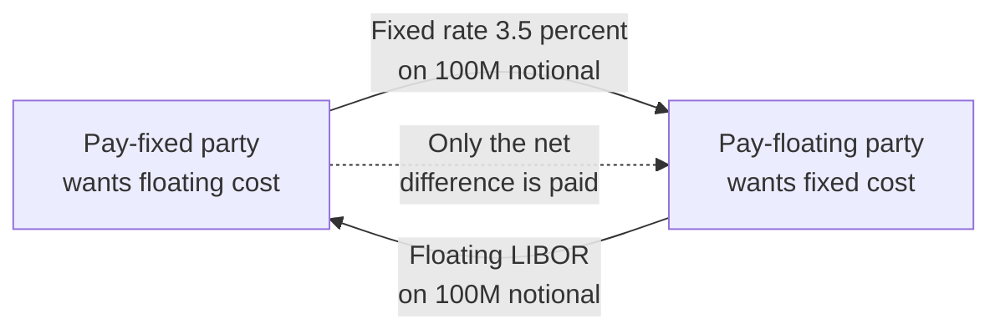
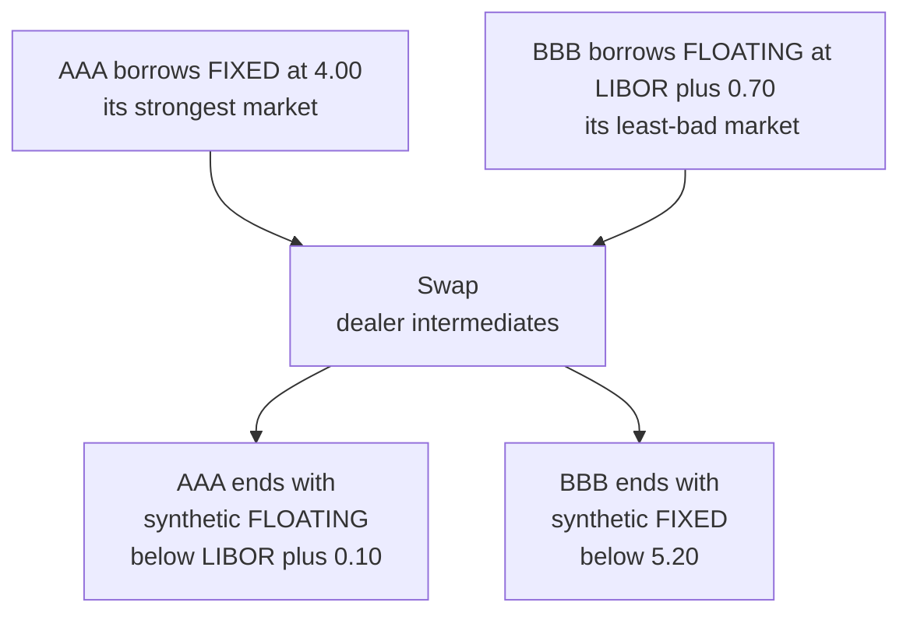
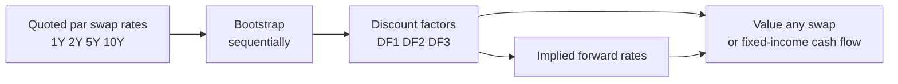
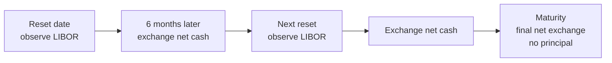

# Chapter 11 — Interest Rate Swaps

## 1. The Problem / The Need

Every business that borrows faces a single, unavoidable choice at the moment it signs a loan: **fixed rate or floating rate?** That choice looks administrative but it silently loads the balance sheet with risk.

Consider two firms:

- **AquaCorp** borrowed $100 million at a **floating rate** (say 6-month LIBOR + 0.80%). Its interest bill lurches up and down every six months. If central banks hike, its cash outflow balloons. AquaCorp hates this uncertainty — it wants **predictable** interest expense to protect its margins.
- **BuildCo** issued a **fixed-rate** bond at 5%. It is locked in. But BuildCo's revenues are floating-rate-like (they rise when the economy — and rates — heat up). BuildCo would actually *prefer* to pay floating so its costs move with its revenues.

Neither firm can easily undo its original financing. AquaCorp cannot cheaply call its floating loan and reissue fixed; BuildCo cannot costlessly repurchase its bond. Refinancing means new fees, new documentation, and possibly re-opening credit negotiations. Worse, each firm may only have *access* to one market — a lower-rated firm often finds the floating market far more forgiving than the fixed-rate bond market.

There is a second, deeper problem. Firms have **comparative advantages** in different markets. A highly-rated company gets a great fixed rate but only a so-so spread over floating; a weaker company is punished heavily on fixed borrowing but only mildly on floating. Each is borrowing in the "wrong" market relative to what it wants. Money is being left on the table.

What both firms need is an instrument that lets them **transform the character of an existing exposure** — swap a floating obligation for a fixed one, or vice versa — **without disturbing the underlying loan**, cheaply, and reversibly. That instrument is the **interest rate swap**.

## 2. The Core Idea

An **interest rate swap** is a bilateral contract in which two counterparties agree to exchange streams of interest payments on a stated **notional principal**, over a stated life, at stated intervals. In the workhorse **plain-vanilla** swap:

- One party pays a **fixed** interest rate and receives a **floating** rate. This party is the **payer** (pay-fixed).
- The other pays **floating** and receives **fixed**. This party is the **receiver** (receive-fixed).

The notional principal is **never exchanged** — it is only a scaling factor used to compute the interest amounts. Because both legs are denominated in the same currency and calculated on the same notional, the principals would just cancel, so they are omitted. Only the *net* interest difference actually changes hands each period.

*Figure 11.1 — The two legs of a plain-vanilla swap. Notional is notional only; sole cash flow is the net.*

The magic: AquaCorp, which pays floating on its real loan, can enter a swap to **receive floating** (offsetting its loan) and **pay fixed** to the swap counterparty. Its floating exposures cancel, leaving a clean synthetic fixed cost. BuildCo does the mirror trade. Neither touches its original debt.

## 3. Why / How It Works

### 3.1 Transforming a liability

AquaCorp's position after swapping:

| Cash flow | Direction | Rate |
|---|---|---|
| On its real loan | pays | LIBOR + 0.80% |
| On the swap | receives | LIBOR |
| On the swap | pays | 3.50% fixed |
| **Net** | **pays** | **3.50% + 0.80% = 4.30% fixed** |

The two LIBOR legs cancel exactly (same index, same reset dates, same notional). AquaCorp has converted a floating loan into a **synthetic fixed loan at 4.30%** — with no refinancing. This is the single most common use of swaps in corporate treasury.

### 3.2 Why cheaper — the comparative-advantage argument

Suppose the market offers:

| Firm | Fixed borrowing | Floating borrowing |
|---|---|---|
| AAA (strong) | 4.00% | LIBOR + 0.10% |
| BBB (weak) | 5.20% | LIBOR + 0.70% |
| **Difference** | **1.20%** | **0.60%** |

BBB pays 1.20% more in fixed but only 0.60% more in floating. AAA has an **absolute** advantage in both, but its **comparative** advantage is largest in fixed (it saves a full 1.20% there). BBB's comparative advantage — its *least* disadvantage — is in floating.

The total gain available equals the difference of the differences: **1.20% − 0.60% = 0.60%** per year. If AAA borrows fixed (its edge) and BBB borrows floating (its edge), then they swap, that 0.60% can be shared between them (and a dealer). Each firm ends up with the rate *type* it wanted, but cheaper than borrowing it directly.

*Figure 11.2 — Comparative advantage lets each firm reach its preferred rate type more cheaply.*

> A caveat interviewers love: the 0.60% "free lunch" is partly illusory. The floating quotes reset periodically and embed credit-review options the lender can exercise; the fixed quote is locked for the term. So some of the gain compensates for BBB's rollover/credit risk. The transformation motive (Section 3.1) is the more robust rationale.

**Splitting the gain — a concrete allocation.** Say AAA borrows fixed at 4.00% and BBB borrows floating at LIBOR + 0.70%, then they enter a swap where BBB pays AAA **4.35% fixed** and AAA pays BBB **LIBOR**. Trace each firm's all-in cost:

| | AAA (wants floating) | BBB (wants fixed) |
|---|---|---|
| Pays on real debt | 4.00% fixed | LIBOR + 0.70% |
| Receives on swap | 4.35% fixed | LIBOR |
| Pays on swap | LIBOR | 4.35% fixed |
| **All-in cost** | **LIBOR − 0.35%** | **5.05% fixed** |
| Cost if borrowed directly | LIBOR + 0.10% | 5.20% fixed |
| **Saving** | **0.45%** | **0.15%** |

AAA achieves synthetic floating at **LIBOR − 0.35%**, beating its direct LIBOR + 0.10% by 0.45%. BBB achieves synthetic fixed at **5.05%**, beating its direct 5.20% by 0.15%. The savings sum to **0.60%** — exactly the differential-of-differentials computed above. In practice a dealer sits in the middle and skims a few basis points, so the two firms share slightly less than 0.60%.

### 3.3 Why the swap has zero value at inception

At the start, the **fixed rate is set precisely so that the present value of the fixed leg equals the present value of the floating leg.** That break-even fixed rate is the **swap rate**. Because both legs have equal PV, the net value of a fresh swap is **zero** — no money changes hands up front. As market rates move afterward, one leg becomes more valuable than the other and the swap acquires a positive value to one side and an equal-and-opposite negative value to the other. That is why swaps are marked to market.

## 4. Full Content — Mechanics and Formulas

### 4.1 Anatomy of a plain-vanilla swap

- **Notional principal (N):** the reference amount; not exchanged.
- **Fixed leg:** pays a constant rate `s` (the swap rate) each period. Period payment = `N × s × τ`, where `τ` is the day-count fraction of the period (e.g. 0.5 for semiannual).
- **Floating leg:** pays a reference rate (historically LIBOR; now SOFR, ESTR, SONIA, MIBOR etc.) observed at the **start** of each period and paid at the **end** ("set in advance, paid in arrears"). Payment = `N × R_float × τ`.
- **Tenor:** total life (2, 5, 10, 30 years).
- **Reset / payment frequency:** how often the floating rate is observed and cash exchanged.
- **Effective date, maturity date, settlement:** standard calendar mechanics.

### 4.2 The two valuation lenses

A swap can be decomposed in **two mathematically equivalent** ways. Both give the same answer; use whichever the data favours.

**Lens A — swap as a pair of bonds.**
A pay-fixed swap is economically:

$$V_{\text{pay-fixed}} = B_{\text{float}} - B_{\text{fixed}}$$

You are **long a floating-rate bond** (you receive floating) and **short a fixed-rate bond** (you pay fixed). The notionals cancel at maturity, so ignoring the principal exchange leaves exactly the swap's net interest flows.

- **Fixed bond value:** discount each fixed coupon and the notional at maturity:
$$B_{\text{fixed}} = \sum_{i=1}^{n} (N \cdot s \cdot \tau_i)\, DF_i \;+\; N \cdot DF_n$$

- **Floating bond value:** a key result — **immediately after a reset, a floating-rate bond trades at par.** Its value is the notional. Between resets it equals the next (known) floating coupon plus notional, discounted back:
$$B_{\text{float}} = (N + N\cdot R_{\text{next}}\cdot \tau)\, DF_{\text{next reset}}$$
At a reset date this collapses to `B_float = N`.

**Lens B — swap as a strip of forward rate agreements (FRAs).**
Each exchange is a single FRA. For the pay-fixed party, each period's **net** cash flow is:
$$\text{CF}_i = N \cdot (f_i - s) \cdot \tau_i$$
where `f_i` is the **forward rate** for period `i` implied by today's curve. Discount and sum:
$$V_{\text{pay-fixed}} = \sum_{i=1}^{n} N (f_i - s)\, \tau_i \, DF_i$$

The forward rate is extracted from discount factors:
$$f_i = \left(\frac{DF_{i-1}}{DF_i} - 1\right)\Big/ \tau_i$$

Lens A and Lens B are the same identity rearranged — we verify this numerically in Section 5.

### 4.3 The swap rate

Set `V = 0` at inception and solve for `s`. Using discount factors and equal accrual periods, the **par swap rate** is:

$$s = \frac{1 - DF_n}{\displaystyle\sum_{i=1}^{n} \tau_i\, DF_i}$$

Intuition: the numerator `1 − DF_n` is exactly the present value of the floating leg per unit notional (a par floater is worth 1 today and returns `DF_n` of principal value, so its coupon stream is worth the difference). The denominator is the **annuity factor** — the PV of receiving 1 unit of accrual each period. So the swap rate is *floating-leg PV divided by the annuity*, i.e. the fixed coupon that makes fixed-leg PV equal floating-leg PV.

### 4.4 The swap curve

Quoted swap rates for tenors 1Y, 2Y, 5Y, 10Y, 30Y form the **swap curve** (or "swap term structure"). It is built by **bootstrapping**: the 1Y swap rate pins `DF_1`; the 2Y rate, given `DF_1`, pins `DF_2`; and so on. Post-2008 and post-LIBOR, the market uses **OIS (overnight-indexed swap) discounting** — cash flows are discounted on a risk-free overnight curve (SOFR/ESTR), separate from the forward-projection curve. The swap curve is now the **benchmark risk-free-plus term structure** that prices most fixed-income instruments; the gap between swap rates and government yields is the **swap spread**, a barometer of bank credit and funding conditions.

*Figure 11.3 — The swap curve is bootstrapped from quotes into discount factors, then reused to value everything.*

### 4.5 Conventions, the dealer, and credit

Real swaps carry practical detail that changes the arithmetic at the margin:

- **Day-count conventions.** The fixed leg often uses **30/360** while the floating leg uses **Actual/360**. This asymmetry means `τ_fixed` and `τ_float` for the "same" period can differ slightly, so the legs are not perfectly symmetric even before rates move. Interviewers probe whether you know the two legs can be on different day counts.
- **The dealer and the bid-ask.** End users rarely face each other; a **swap dealer** (a bank) warehouses one side and hedges. The dealer quotes a **two-way price**, e.g. "pay 3.48% / receive 3.52%" — it will *receive* fixed at 3.52% from you and *pay* fixed at 3.48% to the next client, pocketing the ~4bp spread. The mid, 3.50%, is the "swap rate" we quote in curves.
- **Counterparty credit and collateral.** Because a swap can swing to large positive value, each side bears **counterparty risk**. Modern swaps are either **centrally cleared** (a clearing house novates and margins both sides daily) or bilaterally **collateralised** under a CSA with daily variation margin. Collateralisation is precisely why **OIS discounting** is correct: a fully-collateralised swap's cash flows are effectively risk-free and funded at the overnight rate.
- **Amortising / accreting / basis variants.** The notional need not be constant — **amortising** swaps shrink it (matching a repaying loan), **accreting** swaps grow it. A **basis swap** exchanges two floating indices (e.g. SOFR vs 3M term rate) and quotes a spread on one leg.

### 4.6 Risk of a swap — DV01

A swap's interest-rate sensitivity is summarised by **DV01** (dollar value of a basis point) — the change in swap value for a 1bp shift in the curve. For the pay-fixed party, value **rises** when rates rise (the floating leg you receive grows, the fixed you pay is now below market). DV01 is roughly the annuity factor times notional times 0.0001, and it is what a dealer hedges.

## 5. Worked Examples

### Example 1 — Deriving the swap rate from the curve

Price a **2-year, annual-pay** swap on **N = $100M**. Today's zero curve is flat at **3.00%** (annual compounding), giving discount factors:

| Year | Zero rate | Discount factor `DF` |
|---|---|---|
| 1 | 3.00% | `1/1.03 = 0.970874` |
| 2 | 3.00% | `1/1.03² = 0.942596` |

Annuity factor `A = DF_1 + DF_2 = 0.970874 + 0.942596 = 1.913470`.

$$s = \frac{1 - DF_2}{A} = \frac{1 - 0.942596}{1.913470} = \frac{0.057404}{1.913470} = 0.030000 = 3.000\%$$

On a flat 3% curve the par swap rate is 3.000% — reassuring. **Self-check:** fixed-leg PV per unit = `s × A = 0.03 × 1.913470 = 0.057404`; floating-leg PV = `1 − DF_2 = 0.057404`. They match, so `V = 0` at inception. ✓

### Example 2 — Valuing a seasoned swap two ways (they must reconcile)

Now value an **existing** pay-fixed swap with **3 annual payments remaining**, **fixed rate 4.00%**, **N = $100M**, at a moment when the curve is flat at **3.00%**. We are standing exactly on a reset date. Discount factors:

| Year | `DF` |
|---|---|
| 1 | `1/1.03 = 0.970874` |
| 2 | `1/1.03² = 0.942596` |
| 3 | `1/1.03³ = 0.915142` |

**Lens A — as bonds.** `V_pay-fixed = B_float − B_fixed`.

Floating bond at a reset date = par = **$100.000M**.

Fixed bond (4% coupon = $4M/yr, plus $100M principal at year 3):

| Year | Cash flow ($M) | `DF` | PV ($M) |
|---|---|---|---|
| 1 | 4 | 0.970874 | 3.883496 |
| 2 | 4 | 0.942596 | 3.770384 |
| 3 | 104 | 0.915142 | 95.174768 |
| **Total** | | | **102.828648** |

$$V_{\text{pay-fixed}} = 100.000000 - 102.828648 = -\$2.828648\text{M}$$

A pay-fixed swap at 4% is a **loss** of ≈ $2.83M when the market is only 3% — you are locked into paying above-market. Correct sign.

**Lens B — as forward rate agreements.** With a flat 3% curve, every implied forward rate is 3.000%:
$$f_i = \frac{DF_{i-1}}{DF_i} - 1 = \frac{1}{1.03}\cdot\frac{1}{(1/1.03)} \Rightarrow 3.00\%$$
(e.g. `f_2 = 0.970874/0.942596 − 1 = 0.03000`).

Net cash flow each period for the pay-fixed side = `N × (f − s) × τ = 100 × (0.03 − 0.04) × 1 = −$1M`.

| Year | Net CF ($M) | `DF` | PV ($M) |
|---|---|---|---|
| 1 | −1 | 0.970874 | −0.970874 |
| 2 | −1 | 0.942596 | −0.942596 |
| 3 | −1 | 0.915142 | −0.915142 |
| **Total** | | | **−2.828612** |

$$V_{\text{pay-fixed}} = -\$2.8286\text{M}$$

**Reconciliation:** Lens A gives −2.828648M; Lens B gives −2.828612M. They agree to the rounding of the discount factors (the tiny 0.000036 gap is pure rounding in the 6-dp `DF`s). The two decompositions are the same object. ✓

Note also the receiver's value is the exact mirror: **+$2.83M**. A swap is zero-sum.

### Example 3 — Full cash-flow schedule with floating fixings

A **2-year, semiannual** swap, **N = $100M**, **fixed 3.00% p.a.** (so 1.50% per 6-month period), floating = 6-month LIBOR **set in advance, paid in arrears**, `τ = 0.5`. Suppose the LIBOR fixings that actually materialise are:

| Period (6m) | LIBOR fixing (annual) | Floating pay `= N·R·0.5` | Fixed pay `= N·0.015` | Net to pay-fixed |
|---|---|---|---|---|
| 1 | 2.80% | $1.40M | $1.50M | **−$0.10M** |
| 2 | 3.20% | $1.60M | $1.50M | **+$0.10M** |
| 3 | 3.40% | $1.70M | $1.50M | **+$0.20M** |
| 4 | 3.60% | $1.80M | $1.50M | **+$0.30M** |

The pay-fixed party pays a **constant $1.50M** every period regardless of what rates do; the floating receipts track LIBOR. Early on (LIBOR below 3%) the payer bleeds slightly; as rates climb above 3% the payer collects. Only the **net** column changes hands — e.g. in period 4 the pay-fixed party receives $0.30M. The undiscounted sum of nets here is `−0.10 + 0.10 + 0.20 + 0.30 = +$0.50M`, reflecting that realised LIBOR averaged above the 3% fixed rate over the life.

*Figure 11.4 — Floating is set at each reset and settled one period later; principal never moves.*

### Example 4 — Swap rate and forwards on an upward-sloping curve

The flat curve in Examples 1–2 hides the interesting mechanics. Take a realistic **rising** zero curve (annual compounding) for a **3-year annual** swap:

| Year | Zero rate | Discount factor `DF` |
|---|---|---|
| 1 | 3.00% | `1/1.03 = 0.970874` |
| 2 | 3.50% | `1/1.035² = 0.933511` |
| 3 | 4.00% | `1/1.04³ = 0.888996` |

**Step 1 — annuity.** `A = 0.970874 + 0.933511 + 0.888996 = 2.793381`.

**Step 2 — par swap rate.**
$$s = \frac{1 - DF_3}{A} = \frac{1 - 0.888996}{2.793381} = \frac{0.111004}{2.793381} = 3.974\%$$

Note the 3-year par swap rate (3.974%) sits **below** the 3-year zero (4.00%) — because the fixed coupon is paid across all three years, including the cheaper early years, the par rate is a PV-weighted blend, not the terminal zero.

**Step 3 — implied forward rates** (the floating leg's projected fixings):
$$f_1 = \tfrac{1}{DF_1}-1 = 3.000\%, \quad f_2 = \tfrac{DF_1}{DF_2}-1 = \tfrac{0.970874}{0.933511}-1 = 4.002\%, \quad f_3 = \tfrac{DF_2}{DF_3}-1 = \tfrac{0.933511}{0.888996}-1 = 5.007\%$$

The forwards **climb steeply** (3.0% → 4.0% → 5.0%) — a rising zero curve implies even higher marginal forwards, and it is these the floating leg will pay.

**Step 4 — cross-check the two legs.** Floating-leg PV per unit notional via forwards:

| Year | `f_i` | `DF_i` | `f_i · DF_i` |
|---|---|---|---|
| 1 | 3.000% | 0.970874 | 0.029126 |
| 2 | 4.002% | 0.933511 | 0.037363 |
| 3 | 5.007% | 0.888996 | 0.044515 |
| **Total** | | | **0.111004** |

This equals `1 − DF_3 = 0.111004` — confirming the shortcut "floating-leg PV = 1 − DF_n" without ever summing forwards. And fixed-leg PV = `s × A = 0.039738 × 2.793381 = 0.111003`. The legs match, so **V = 0** at the par rate. ✓

**Reading it as a trade:** a client who instead pays a **flat 3.974% every year** (the fixed leg) versus receiving the rising 3.0% / 4.0% / 5.0% forwards is **overpaying early** (pays 3.974% but receives only 3.0% in year 1) and **underpaying late** (pays 3.974% but receives 5.0% in year 3). The swap smooths a rising forward path into a level coupon — which is exactly the certainty a fixed-rate payer is buying.

## 6. Connections

- **Forward rate agreements (Ch. on forwards):** a swap is literally a **portfolio of FRAs**, one per reset. Everything you know about FRA valuation composes into swap valuation.
- **Bonds and duration:** a pay-fixed swap = long floater + short fixed bond. Its **DV01/duration** is essentially that of the fixed leg (floaters have near-zero duration). Swaps are the cheapest way to add or remove duration on a portfolio without trading cash bonds.
- **Bond futures & the cash market:** dealers hedge swap books with government-bond futures; the residual is the **swap spread**.
- **Options → swaptions:** an option to enter a swap is a **swaption**; caps and floors are strips of options on the floating leg. Swaps are the underlying for a whole options complex.
- **Currency swaps:** extend the idea to two currencies (and there principal *is* exchanged). **Basis swaps** exchange two floating indices.
- **OIS discounting & the risk-free curve:** post-crisis, the swap/OIS curve *is* the market's practical risk-free term structure used to discount virtually all derivatives (Ch. on discounting).
- **LIBOR transition:** the benchmark shift from LIBOR to **SOFR/ESTR/SONIA** (compounded-in-arrears risk-free rates) reshaped the floating leg mechanics but not the core valuation logic.

## 7. Key Terms

- **Notional principal:** reference amount for interest calc; not exchanged in a single-currency swap.
- **Plain-vanilla swap:** fixed-for-floating, single currency, constant notional, regular resets.
- **Payer / receiver:** payer pays fixed (receives floating); receiver pays floating (receives fixed).
- **Swap rate (par rate):** the fixed rate making the swap's initial value zero.
- **Swap curve:** term structure of par swap rates across tenors; bootstrapped into discount factors.
- **Swap spread:** swap rate minus same-maturity government yield.
- **Discount factor (`DF`):** present value today of $1 received at a future date.
- **Forward rate:** future period rate implied by today's curve; drives the floating-leg projection.
- **Annuity factor:** `Σ τ_i DF_i`; PV of receiving one accrual unit each period.
- **Reset date / set-in-advance-paid-in-arrears:** floating rate fixed at period start, cash paid at period end.
- **OIS discounting:** discounting cash flows on the overnight risk-free curve.
- **DV01 / PV01:** value change per 1bp curve move — the swap's rate risk.
- **Bootstrapping:** sequential extraction of discount factors from quoted par rates.

## 8. Common Confusions

- **"The notional gets exchanged."** No — in a single-currency swap it never does. Only net interest moves. (Currency swaps are the exception.)
- **"A swap always has value."** At inception its value is **zero** by construction; it only *acquires* value as rates drift from the swap rate.
- **"Pay-fixed loses when rates fall — so it's a bad trade."** Pay-fixed *gains* when rates **rise** and loses when they **fall**. Whether that's "good" depends on what real exposure it hedges. As a hedge of a floating loan it is doing exactly its job either way.
- **"The floating leg is unknowable, so you can't value it."** You can — a floating bond is worth **par at each reset**, and future floating coupons are captured by the curve's **forward rates**. No forecast of future LIBOR is needed; the curve already embeds it.
- **"Bonds method and FRA method are different models."** They are algebraically identical; any disagreement is rounding, as Example 2 shows.
- **"Swap rate = expected future floating rate."** Not quite — the swap rate is a **PV-weighted average of forward rates**, and forwards differ from expected spot rates by risk/convexity terms.
- **"The comparative-advantage saving is free money."** Part of it compensates for the floating borrower's rollover and credit-review risk; it is not a pure arbitrage.
- **"Fixed leg and floating leg use different discount curves."** Under modern OIS discounting, **both legs are discounted on the same OIS curve**; the floating leg is only *projected* on the index (forward) curve. Two curves for two jobs — projection vs discounting — not one curve per leg.

## 9. Recap

An interest rate swap exchanges a **fixed** interest stream for a **floating** one on a non-exchanged **notional**. Its dominant use is **transforming an existing exposure** — turning a floating loan into synthetic fixed (or vice versa) without refinancing — and, secondarily, **harvesting comparative advantage** so each borrower reaches its preferred rate type more cheaply. The fixed **swap rate** is set so the two legs have equal present value, making the swap worth **zero at inception**; it is computed as `(1 − DF_n) / annuity`. Afterwards the swap is valued **either** as **long-floater-minus-short-fixed-bond** (Lens A) **or** as a **strip of FRAs on forward rates** (Lens B) — two views of one identity that reconcile to the penny. Quoted swap rates across tenors form the **swap curve**, bootstrapped into discount factors that price the entire fixed-income complex, with **OIS discounting** as the modern standard. A swap's risk is summarised by **DV01**, and its payoff is strictly **zero-sum** between payer and receiver.

## 10. Quick-Reference / Interview Points

**Formulas to have cold:**
- Par swap rate: `s = (1 − DF_n) / Σ τ_i DF_i`.
- Swap value (bonds): `V_pay-fixed = B_float − B_fixed`; floater = par at reset.
- Swap value (FRAs): `V_pay-fixed = Σ N (f_i − s) τ_i DF_i`.
- Forward rate: `f_i = (DF_{i−1}/DF_i − 1)/τ_i`.

**One-liners interviewers reward:**
- "A swap is a portfolio of FRAs, equivalently a long-floater/short-fixed-bond package."
- "Value is zero at inception because the swap rate equates the two legs' PVs."
- "A floating-rate bond is worth par at every reset — that's why you never forecast LIBOR."
- "Pay-fixed makes money when rates rise; it has positive duration like a short bond position."
- "You don't discount the two legs on different curves — you *project* floating on the index curve and *discount* both on OIS."
- "The 0.60% comparative-advantage gain isn't pure arbitrage; it partly pays for the floating borrower's credit-rollover risk."

**Sanity checks under pressure:**
- Flat curve ⇒ par swap rate equals the flat rate; all forwards equal it.
- Fixed rate above market ⇒ pay-fixed value is negative (Example 2: −$2.83M).
- Receiver's value = − payer's value, always.

**Numbers from this chapter to quote:** par swap rate on a flat 3% curve = 3.000%; a 3-yr $100M pay-fixed swap at 4% on a 3% curve is worth **≈ −$2.83M**, confirmed identically by both the bond and FRA methods.
