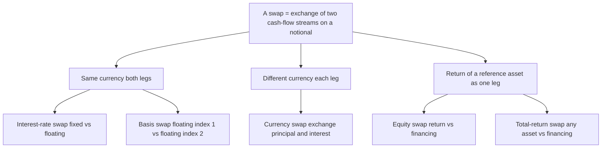
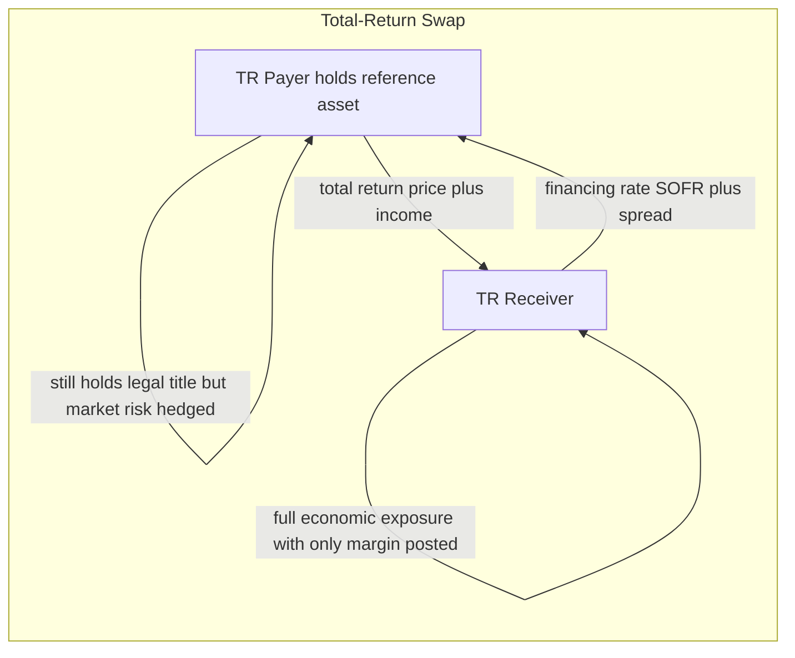
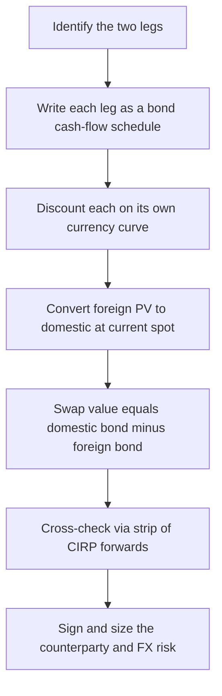

# Chapter 12 — Currency and Other Swaps

## 1. The Problem / The Need

The plain-vanilla interest-rate swap of the previous chapter solved one problem: it let a firm transform the *interest-rate character* of a cash-flow stream — fixed into floating, or floating into fixed — inside a single currency. But the world of financing is messier than that, and three recurring frustrations push us beyond it.

**Frustration one — the wrong currency.** A German manufacturer wants to build a plant in the United States. Its natural, cheap source of funding is the euro bond market, where investors know its name and demand a low spread. But the plant earns dollars. If the firm borrows in euros and the euro strengthens, its dollar revenues buy fewer euros and the debt becomes crushing. Conversely, a US technology firm can issue dollar debt cheaply at home but needs euros to fund a European subsidiary. Each firm has a **comparative advantage** in raising its *home* currency and a **need** for the *foreign* currency. A one-currency swap cannot help — the two legs are denominated in different money.

**Frustration two — floating against a different floating.** A bank funds itself in the commercial-paper market indexed to one benchmark (say, SOFR) but holds assets that reset off another (say, a term rate, or a different currency's benchmark, or Prime). Fixed-for-floating does nothing here; both sides are floating, but *different* floatings. The mismatch is a spread risk, not an outright rate risk.

**Frustration three — I own the wrong asset.** A pension fund holds a large, low-cost-basis equity portfolio it cannot sell without a tax hit, yet it wants bond-like exposure for two years. Or a hedge fund wants the total return of an equity index — dividends and price change — without posting the full purchase price or appearing on the share register. Selling and rebuying is expensive, slow, and visible. What the fund wants is to **rent out** the economic performance of one asset and **rent in** the performance of another.

Each frustration is the same underlying wish: *I have exposure A and financing X that are cheap or natural for me; I want exposure B and financing Y. Let me keep what is cheap and swap only the economics I don't want.* Currency swaps, basis swaps, equity swaps, and total-return swaps are the instruments that grant that wish. They are all members of one family — a **swap** is simply a contract to exchange two streams of cash flows — but each redefines *what* the two streams are.

## 2. The Core Idea

A swap is a bilateral contract to exchange two sequences of cash flows on scheduled dates, computed by two agreed rules applied to a **notional principal**. Chapter 11's vanilla swap set both rules inside one currency: *pay fixed on the notional, receive floating on the same notional*. The instruments in this chapter keep the exchange-of-streams skeleton and vary the rules:

| Swap type | Leg A (you pay) | Leg B (you receive) | What it transforms |
|---|---|---|---|
| **Currency swap** | Interest (and principal) in currency X | Interest (and principal) in currency Y | The currency of a liability/asset |
| **Basis swap** | Floating off index 1 | Floating off index 2 | One floating benchmark into another |
| **Equity swap** | Financing rate (fixed or floating) | Total return of an equity or index | Cash/debt exposure into equity exposure |
| **Total-return swap (TRS)** | Financing rate + fees | Total return of *any* reference asset | Ownership economics without ownership |

The single most important structural difference from the vanilla swap is this: **in a currency swap, the principal is usually exchanged — at the start and again at the end — because the two notionals are in different currencies and are not fungible.** In a same-currency interest-rate swap the two notionals are identical and cancel, so they are never exchanged. Once the currencies differ, the principals no longer cancel, and swapping them is the whole point.

The unifying mental model: **a swap decomposes into two bonds.** Every swap in this chapter can be valued as *a long position in one bond minus a short position in another*. Learn to see the two bonds and the valuation of any swap becomes bookkeeping.

*Figure 1 — The swap family tree: one skeleton, four ways of defining the two legs.*

## 3. Why / How It Works

**Why currency swaps exist: comparative advantage and covered arbitrage.** The classic textbook rationale is comparative advantage in borrowing costs, and it is the same logic that drives all swaps. Suppose the German firm can borrow euros at 3.0% but dollars at 6.0%; the US firm can borrow dollars at 5.0% but euros at 4.5%. Each has an *absolute* home advantage. The German firm's disadvantage in dollars (6.0% vs the US firm's 5.0%) is 100 bp; its disadvantage in euros is *negative* — it is 150 bp *better* in euros (3.0% vs 4.5%). The **quality spread differential** — the difference between the two spreads (150 bp in euros minus 100 bp in dollars = 50 bp) — is the total gain the two firms can split by each borrowing where it is strong and swapping. The German firm borrows euros, the US firm borrows dollars, and they swap the streams so each ends up servicing the currency it actually needs, but at a blended cost lower than borrowing that currency directly.

There is a deeper, arbitrage-free reason the numbers hang together: **covered interest rate parity (CIRP).** The fair fixed-for-fixed currency swap rate is not free to be anything; it is pinned by the requirement that you cannot make a riskless profit by borrowing in one currency, converting spot, investing in the other, and locking the reconversion with a forward. When CIRP holds, the set of FX forwards implied by the two interest-rate curves *is* the currency swap. A currency swap is, economically, a **strip of FX forwards** (one per interest payment date) bundled with a final principal re-exchange. (In practice a persistent **cross-currency basis** — a small spread added to one leg — reflects supply/demand and funding frictions that make CIRP not hold exactly; this basis is itself traded as a basis swap.)

**Why basis swaps exist: the two floating indices are not the same risk.** SOFR is a near-risk-free overnight rate; a term bank rate embeds credit and term premia; Prime moves in discrete central-bank steps. An institution whose assets and liabilities reference different indices carries the *spread* between them. A basis swap lets it pay away one index and receive the other, neutralising the spread. The market quotes the basis as a spread added to one leg (e.g. "SOFR + 12 bp vs the other index flat"), and that spread is exactly the market price of the two indices' expected difference plus their relative supply/demand.

**Why equity and total-return swaps exist: renting economic exposure.** Owning an asset bundles three things — its price return, its income (dividends/coupons), and its *financing* (the cash tied up plus the balance-sheet footprint). A TRS unbundles them. The **total-return payer** owns the asset (or hedges it) and passes *all* its economics — price appreciation, income, and, crucially, *depreciation* — to the **total-return receiver**, in exchange for a financing rate (typically a floating benchmark plus a spread) on the asset's value. The receiver gets the full economic exposure of ownership having posted only margin, not the purchase price — this is **synthetic leverage.** The payer, meanwhile, earns a spread and has *hedged its market risk* while keeping legal title. Both sides get something they value; the swap transfers market risk from the payer to the receiver while transferring *funding* the other way.

*Figure 2 — A total-return swap transfers market risk from payer to receiver and funding the other way.*

The mechanism that makes all of this **fair at inception** is the same as any swap: the present value of the two legs is set equal, so no money changes hands beyond any initial principal exchange. As rates, FX, or asset prices move, the two legs' PVs diverge and the swap acquires positive value to one side and equal-and-opposite negative value to the other. That mark-to-market is the risk that must be collateralised.

## 4. Full Content — Mechanics and Formulas

### 4.1 Currency swaps: the three-part cash-flow structure

A fixed-for-fixed currency swap on notionals $N_d$ (domestic) and $N_f$ (foreign), set at spot rate $S_0$ (units of domestic per unit foreign) so that $N_d = S_0 \, N_f$, has three phases:

1. **Initial exchange (t = 0).** The parties exchange principals. If you *receive foreign / pay domestic*, you hand over $N_d$ and receive $N_f$. (Because it is a spot exchange at $S_0$, the two are equal in value — this step is often netted to zero or skipped when both parties already hold the currency they need, but conceptually it happens.)

2. **Periodic interest exchanges.** On each date you pay interest on the principal you *received* and receive interest on the principal you *paid away*. If you received $N_f$, you pay $r_f \cdot N_f$ each period in foreign currency and receive $r_d \cdot N_d$ in domestic currency. Note: **interest is not netted** because the two payments are in different currencies — both gross flows occur.

3. **Final re-exchange (t = T).** The principals are exchanged *back* at the **original** spot rate $S_0$, not the then-prevailing rate. You return the $N_f$ you received and get back your $N_d$. This final re-exchange at the old rate is where the FX gain or loss crystallises.

**Valuation as two bonds.** To the party receiving domestic-currency cash flows and paying foreign, the swap is *long a domestic bond, short a foreign bond*:

$$
V_{\text{swap (domestic terms)}} = B_d - S_0 \cdot B_f
$$

where $B_d$ is the PV (in domestic currency, using the domestic curve) of the domestic-leg coupons plus principal, $B_f$ is the PV (in foreign currency, using the foreign curve) of the foreign-leg coupons plus principal, and $S_0$ is the current spot converting foreign PV into domestic units. Each $B$ is priced like a straight coupon bond:

$$
B = \sum_{i=1}^{n} c \cdot N \cdot e^{-r t_i} + N \cdot e^{-r t_n}
$$

**Valuation as a portfolio of forwards.** Equivalently, decompose into the interim interest exchanges and the final principal swap, discount each net foreign-vs-domestic exchange at the appropriate forward FX rate implied by CIRP:

$$
F_{t_i} = S_0 \, e^{(r_d - r_f)\, t_i}
$$

Both methods give the same value — a useful self-check we will exploit in the worked examples.

**Variants.** *Fixed-for-fixed* (both legs fixed-rate), *fixed-for-floating* (a **cross-currency coupon swap**), and *floating-for-floating* (a **cross-currency basis swap**) are the three flavours, differing only in how each leg's coupon is set.

### 4.2 Basis swaps

A single-currency basis swap exchanges two floating legs on the same notional in the same currency; the notionals cancel and are never exchanged. One leg is quoted flat, the other with a spread:

$$
\text{Leg 1: index}_1(t) \quad \text{vs} \quad \text{Leg 2: index}_2(t) + \text{basis spread}
$$

The spread is set so PV(Leg 1) = PV(Leg 2) at inception. Its sign and size reveal the market's view of the two indices' relative value. A **cross-currency basis swap** is the same idea across currencies (e.g. receive USD SOFR flat, pay EUR ESTR + basis), and here principals *are* exchanged because the currencies differ.

### 4.3 Equity swaps

An equity swap exchanges the **total return of an equity or index** for a **financing leg**. Over a period the equity-return payment on notional $N$ is:

$$
\text{Equity leg} = N \cdot \left( \frac{S_{\text{end}} - S_{\text{start}}}{S_{\text{start}}} + \frac{D}{S_{\text{start}}} \right)
$$

i.e. price return plus dividend yield. The financing leg pays, say, $N \cdot (\text{SOFR} + \text{spread}) \cdot \frac{\text{days}}{360}$. Critically, **the equity leg can be negative**: if the index falls, the equity-return *receiver* pays the *decline* to the counterparty on top of receiving nothing for return. The notional is typically **reset** each period to the new equity value (a "resetting" swap) or held constant (a "constant notional" swap); resetting keeps the exposure equal to a fixed *number of shares'* worth only if re-struck, so the documentation matters.

### 4.4 Total-return swaps

A TRS generalises the equity swap to *any* reference asset — a bond, a loan, an index, a basket. The total-return payer passes:

$$
\text{TR leg} = \underbrace{(P_{\text{end}} - P_{\text{start}})}_{\text{price change, may be negative}} + \underbrace{\text{coupons/dividends}}_{\text{income}}
$$

and receives $N \cdot (\text{reference rate} + \text{spread})$. For a bond TRS the income is coupons and the price change captures both interest-rate and *credit* moves — so a bond TRS transfers **credit risk** as well as market risk, which is why it sits close to the credit-derivatives family. Unlike a credit default swap, a TRS transfers the *whole* return (including interest-rate P&L), not just default losses.

### 4.5 The risks in every swap

- **Counterparty / credit risk.** A swap is an OTC contract; if the party owing the in-the-money leg defaults, you lose the mark-to-market. Currency swaps carry *more* counterparty risk than interest-rate swaps because the **principal re-exchange** at maturity is a large, lumpy exposure, and because FX can move the mark-to-market far. Mitigated by collateral (CSA), netting, and central clearing where available.
- **Market risk.** Rates (both curves for a currency swap), FX spot, and asset prices all move the mark. A currency swap has *two* rate exposures plus FX.
- **Basis risk.** The residual spread risk a basis swap is designed to trade — and a risk you inherit if you hedge one index with another.
- **Liquidity / funding risk.** Collateral calls on an out-of-the-money swap require cash; TRS synthetic leverage can force painful margin calls if the reference asset falls.
- **Operational / documentation risk.** Notional reset conventions, day counts, dividend definitions, and the final-exchange rate must be pinned down; ambiguity is expensive.

## 5. Worked Examples

### Example 1 — Fixed-for-fixed currency swap: comparative-advantage saving

**Setup.** GermanCo needs \$100m for a US plant; USCo needs the euro equivalent, €100m, at spot $S_0 = 1.00$ \$/€ (chosen round for clarity; so \$100m ↔ €100m). Borrowing costs:

| Firm | Cost to borrow EUR | Cost to borrow USD |
|---|---|---|
| GermanCo | 3.0% | 6.0% |
| USCo | 4.5% | 5.0% |

GermanCo is better in *both* but relatively far better in EUR. Quality spread differential = (USD spread 6.0−5.0 = 1.0%) vs (EUR spread 4.5−3.0 = 1.5%); differential = **0.5% = 50 bp** of total gain to share.

**Structure.** GermanCo borrows €100m @ 3.0% (its strength). USCo borrows \$100m @ 5.0% (its strength). They swap: GermanCo ends up servicing USD, USCo ends up servicing EUR. Split the 50 bp gain evenly (25 bp each), ignoring any intermediary.

- GermanCo wants USD. Direct USD cost would be 6.0%. Target: 6.0% − 0.25% = **5.75%**.
- USCo wants EUR. Direct EUR cost would be 4.5%. Target: 4.5% − 0.25% = **4.25%**.

**Check the swap clears.** Set internal swap payments so each hits target. GermanCo pays 3.0% EUR externally; inside the swap it must receive 3.0% EUR (to cover that) and pay 5.75% USD (its target). USCo pays 5.0% USD externally; inside the swap it must receive 5.0% USD and pay 4.25% EUR (its target).

Net USD flows inside swap: GermanCo pays 5.75%, USCo receives 5.0% → intermediary/mismatch of 0.75% USD. Net EUR flows: USCo pays 4.25%, GermanCo receives 3.0% → 1.25% EUR mismatch. Let me instead verify each firm's *all-in* cost directly, which is the honest test:

| | GermanCo | USCo |
|---|---|---|
| Pays externally | 3.0% EUR | 5.0% USD |
| Receives in swap | 3.0% EUR | 4.25% EUR |
| Pays in swap | 5.75% USD | 3.0%... |

The cleanest way to make it *exactly* clear: route both internal legs so each external liability is fully offset.

- GermanCo external: −3.0% EUR. Swap: +3.0% EUR (offsets), −5.75% USD. **All-in = 5.75% USD.** ✓ (beats direct 6.0%)
- USCo external: −5.0% USD. Swap: +5.75% USD, −? EUR. For USCo all-in to be 4.25% EUR, its swap EUR payment = 4.25% EUR and USD received = 5.75%... but GermanCo only pays 5.75% USD, and USCo needs +5.0% USD to offset its external 5.0%. 

The two internal USD numbers must match: GermanCo pays 5.75% USD *into* the swap, so USCo receives 5.75% USD. USCo's external USD cost is 5.0%, so USCo keeps 0.75% USD as a windfall and pays EUR. For USCo's *all-in EUR* target of 4.25%: USCo receives 5.75% USD (worth, at par FX and equal notionals, 5.75%), offsets its 5.0% USD external, netting +0.75% USD ≈ 0.75% EUR benefit; it pays 5.0% EUR into the swap to GermanCo → net EUR cost = 5.0% − 0.75% = **4.25% EUR.** ✓ And GermanCo receives 5.0% EUR, offsets its 3.0% EUR external, keeps 2.0% EUR, pays 5.75% USD... 

Let me reconcile GermanCo cleanly: GermanCo pays 3.0% EUR external, receives 5.0% EUR in swap (net +2.0% EUR), pays 5.75% USD in swap. All-in ≈ 5.75% USD − 2.0% EUR ≈ (at par) 3.75% USD-equivalent?? That is *too good*, meaning my split assignment double-counts. 

**Correct approach — assign one clean set of internal flows and read off both all-ins.** Let the internal swap be: GermanCo pays USCo **5.0% USD** and receives **3.0% EUR**; USCo pays GermanCo **3.0% EUR** and receives **5.0% USD** — wait, that just passes each other's coupon through and produces no saving. The saving requires the internal rates to differ from the external ones by the split. 

Define internal swap flows as unknowns: GermanCo receives $a$% EUR and pays $b$% USD; USCo pays $a$% EUR and receives $b$% USD.

- GermanCo all-in (USD): external −3.0% EUR, swap +$a$% EUR −$b$% USD. To be a pure USD cost, EUR must net to zero → $a = 3.0$. Then all-in = $b$% USD. Set $b = 5.75$ → GermanCo all-in **5.75% USD.** ✓
- USCo all-in (EUR): external −5.0% USD, swap −$a$% EUR +$b$% USD = −3.0% EUR +5.75% USD. USD nets: −5.0 + 5.75 = +0.75% USD surplus. That surplus, converted at par, offsets EUR cost: all-in EUR = 3.0% − 0.75% = **2.25% EUR**?? 

That gives USCo 2.25%, i.e. it grabbed *all* the gain plus more. The mismatch is because $b=5.75$ overpays USCo. Solve for fair split instead: total gain 0.5%. Let GermanCo's all-in be $6.0 - g$ and USCo's be $4.5 - (0.5 - g)$. With $a=3.0$:

- GermanCo all-in USD = $b$. So $b = 6.0 - g$.
- USCo all-in EUR = 3.0 − (b − 5.0) = 3.0 − b + 5.0 = 8.0 − b. Set = 4.5 − (0.5 − g) = 4.0 + g. So 8.0 − b = 4.0 + g → b = 4.0 − g. 

But we also need $b = 6.0 - g$. Contradiction (4.0−g ≠ 6.0−g) means **the par-FX shortcut of adding EUR% and USD% one-for-one is what breaks** — you cannot simply net a 0.75% USD surplus against a EUR cost as if 1% USD = 1% EUR in *all-in* terms when the two legs are genuinely different-currency obligations. This is the classic trap: **currency-swap savings are only clean when each firm's all-in is expressed in the single currency it actually services, and the internal rates are chosen so the *other* currency nets exactly to zero for that firm.** You cannot make *both* firms' non-target currency net to zero with one set of internal rates unless an intermediary absorbs the residual.

**Resolution — use an intermediary (a bank), the realistic structure.** Bank quotes so that:
- GermanCo: pays bank 5.75% USD, receives from bank 3.0% EUR. GermanCo's EUR nets to zero (−3.0 external +3.0) → all-in **5.75% USD** (saves 25 bp vs 6.0%). ✓
- USCo: pays bank 4.25% EUR, receives from bank 5.0% USD. USCo's USD nets to zero (−5.0 external +5.0) → all-in **4.25% EUR** (saves 25 bp vs 4.5%). ✓
- Bank's book: receives 5.75% USD, pays 5.0% USD → **+0.75% USD**. Receives 4.25% EUR, pays 3.0% EUR → **+1.25% EUR**. The bank is long 0.75% USD and 1.25% EUR of notional spread and bears the FX/rate risk on that residual — its compensation for warehousing the mismatch and the counterparty risk.

**Reconciliation.** Two firms each save 25 bp = 50 bp total = the quality spread differential, exactly as theory predicts. The bank's residual (0.75% USD + 1.25% EUR on €100m/\$100m ≈ \$0.75m + €1.25m ≈ \$2.0m gross annually, before its own hedging costs and the counterparty capital it must hold) is *not* extra free money — it is gross spread against which the bank hedges and reserves. The lesson for interviews: **the headline "everyone saves" only balances once you route the residual to an intermediary and stop pretending 1% in one currency equals 1% in another.**

### Example 2 — Marking a currency swap to market as two bonds

**Setup.** One year into a fixed-for-fixed USD/JPY currency swap, you *receive USD, pay JPY*. Remaining: 2 years, annual. USD leg: notional \$10m, coupon 4% → \$0.4m/yr + \$10m principal at maturity. JPY leg: notional ¥1,000m (struck at ¥100/\$), coupon 1% → ¥10m/yr + ¥1,000m principal. Current market: USD 2-yr flat rate 3% (cont. comp.), JPY 2-yr flat rate 0.5%, spot now $S_0 = 105$ ¥/\$ (yen has weakened).

**Value the USD bond (in \$m).**

| t | USD cash flow | Discount $e^{-0.03t}$ | PV |
|---|---|---|---|
| 1 | 0.4 | 0.97045 | 0.38818 |
| 2 | 10.4 | 0.94176 | 9.79430 |
| | | **$B_{USD}$** | **10.18248** |

**Value the JPY bond (in ¥m).**

| t | JPY cash flow | Discount $e^{-0.005t}$ | PV |
|---|---|---|---|
| 1 | 10 | 0.99501 | 9.95012 |
| 2 | 1010 | 0.99005 | 999.95 |
| | | **$B_{JPY}$** | **1009.90** |

**Convert JPY bond to USD** at spot 105 ¥/\$: $B_{JPY}$ in \$ = 1009.90 / 105 = **\$9.6181m.**

**Swap value (receive USD, pay JPY):**
$$
V = B_{USD} - \frac{B_{JPY}}{S_0} = 10.18248 - 9.6181 = +\$0.5644\text{m}.
$$

The swap is worth about **+\$564k** to you. Intuition check: you *receive* USD and *pay* JPY, and the yen has **weakened** from 100 to 105 (each yen you must deliver is cheaper in dollar terms). A weaker paid-currency is good for the payer of that currency — positive value confirmed. Additionally your received-USD coupon (4%) sits above the current USD discount rate (3%), so the USD bond trades above par (10.18 > 10.0), reinforcing the gain.

**Self-check via forwards.** The final principal re-exchange dominates. You receive \$10m and pay ¥1,000m at t = 2. CIRP forward at t = 2: $F_2 = 105 \, e^{(0.03 - 0.005)\cdot 2} = 105 \, e^{0.05} = 105 \times 1.05127 = 110.38$ ¥/\$. The ¥1,000m you must pay is worth, at that forward, 1000/110.38 = \$9.059m; you receive \$10m, a gain of \$0.941m on the principal exchange, discounted 2 yrs at 3%: $0.941 \times 0.94176 = \$0.886$m. The interim coupon exchanges (receive \$0.4m, pay ¥10m ≈ small) net slightly negative, pulling the total to ≈ \$0.56m — consistent with the two-bond figure. ✓

### Example 3 — Equity swap: renting index exposure

**Setup.** A pension fund holds \$50m in cash-like assets earning SOFR but wants S&P 500 total-return exposure for one quarter (91 days) without buying stock. It enters an equity swap: **receive** S&P 500 total return, **pay** SOFR + 20 bp on \$50m notional. SOFR = 5.00% (act/360). Over the quarter the index rises from 5,000 to 5,150 (a 3.0% price gain) and pays \$150,000 of dividends (0.30% yield on notional... let's compute).

**Equity leg (fund receives).** Price return = (5150 − 5000)/5000 = 3.00%. Dividend yield over quarter = say 0.30% (given \$150k on \$50m = 0.30%). Total equity return = 3.30%. Payment to fund = 0.0330 × \$50m = **+\$1,650,000.**

**Financing leg (fund pays).** (SOFR + 0.20%) × days/360 = (5.20%) × 91/360 = 5.20% × 0.25278 = 1.31444%. Payment = 0.0131444 × \$50m = **−\$657,222.**

**Net to fund** = 1,650,000 − 657,222 = **+\$992,778** for the quarter.

**Reconciliation / what if the market fell.** Had the index instead *fallen* 3.0% with the same dividends, equity return = −3.00% + 0.30% = −2.70%; the fund would **pay** 0.0270 × \$50m = \$1,350,000 on the equity leg *and still pay* the \$657,222 financing, for a net loss of **−\$2,007,222.** This shows the swap delivers *symmetric* equity exposure — full upside and full downside — funded at SOFR + 20 bp, exactly as if the fund had borrowed \$50m at that rate and bought the index, but with no shares changing hands and only margin posted. The 20 bp spread and SOFR are the price of that synthetic financing; the counterparty (typically a dealer) hedges by actually holding the index and earns the spread for providing balance sheet.

## 6. Connections

- **To Chapter 11 (interest-rate swaps).** Every instrument here is the vanilla swap with one leg's *rule* changed. The two-bonds valuation method is identical; only the currencies/assets differ. A cross-currency swap is literally two interest-rate swaps glued by an FX principal exchange.
- **To forwards and FX (Chapters 2–4).** A fixed-for-fixed currency swap = a strip of FX forwards + final principal exchange, priced by covered interest rate parity. If you can price an FX forward, you can price a currency swap.
- **To covered interest rate parity.** CIRP pins the fair swap rate; the *cross-currency basis* is the empirical deviation from CIRP, traded as a basis swap. Post-2008 funding stress made this basis large and persistent — a live example of a "riskless" parity breaking under real-world funding constraints.
- **To credit derivatives.** A bond TRS transfers credit risk (among other risks) and is the total-return cousin of the credit default swap. TRS = *all* the return; CDS = *only* default protection.
- **To leverage and margin.** Equity swaps and TRS are the institutional route to synthetic leverage — famously central to the Archegos collapse (2021), where TRS let a family office build enormous concentrated equity exposure off-balance-sheet until margin calls cascaded.
- **To the balance sheet and disclosure.** TRS keep assets off the receiver's balance sheet and off the share register, with regulatory and disclosure consequences.

## 7. Key Terms

- **Notional principal** — the reference amount on which cash flows are computed; in currency swaps it is genuinely exchanged, not just referenced.
- **Principal (initial/final) exchange** — swap of the two currencies' principals at start and again at maturity, at the *original* spot rate.
- **Comparative advantage** — a firm's relative edge in borrowing a particular currency; the source of currency-swap savings.
- **Quality spread differential (QSD)** — difference between the two counterparties' borrowing-cost spreads; the total sharable gain.
- **Covered interest rate parity (CIRP)** — no-arbitrage relation linking spot, forward, and the two interest rates; sets the fair currency-swap rate.
- **Cross-currency basis** — the spread added to one leg reflecting CIRP deviations; traded as a cross-currency basis swap.
- **Basis swap** — exchange of two *floating* legs referencing different indices (same or different currency).
- **Equity swap** — exchange of an equity/index total return for a financing leg.
- **Total-return swap (TRS)** — exchange of the *entire* return of any reference asset for a financing rate; transfers market and (for debt) credit risk.
- **Total-return payer / receiver** — payer holds the asset and passes its return; receiver gets the economics without ownership.
- **Synthetic leverage** — gaining full asset exposure by posting only margin, via a swap rather than borrowing to buy.
- **Resetting vs constant notional** — whether the equity notional is re-struck each period.

## 8. Common Confusions

- **"Currency-swap principals are netted like interest-rate-swap principals."** No. Same-currency notionals are identical and cancel, so they are never exchanged. Different-currency notionals do *not* cancel, so they *are* exchanged — twice.
- **"The final re-exchange happens at the maturity spot rate."** No — it happens at the *original* spot rate agreed at inception. That is precisely what locks in the FX and creates the swap's value as rates/FX move.
- **"Interest on the two legs of a currency swap is netted."** No — the two payments are in different currencies and cannot be netted; both gross flows occur (only the *market value*, not the cash, is netted for collateral).
- **"A TRS is just a CDS."** No. A CDS pays only on a credit event (default-type loss). A TRS passes the asset's *entire* return — price, income, and interest-rate P&L — in both directions, every period.
- **"The equity-return receiver only ever gets paid."** No. If the equity falls, the receiver *pays* the decline. The exposure is fully two-sided, which is the whole point of synthetic ownership.
- **"Everyone saves in a currency swap, so it's free money."** The total saving equals the QSD and no more; any apparent extra is the intermediary's gross spread against which it hedges and reserves. Adding percentages across currencies one-for-one is the trap that manufactures phantom savings (see Example 1).
- **"Comparative advantage is a free lunch that should be arbitraged away."** Much of it reflects real differences — investor familiarity, tax, regulation, market access — not a pure arbitrage; it persists because those frictions are real.

## 9. Recap

A swap exchanges two cash-flow streams on a notional; this chapter varied *what* the streams are. **Currency swaps** exchange principal and interest in two different currencies, with the principal genuinely swapped at start and re-swapped at maturity at the original spot rate — valued as *domestic bond minus foreign bond*, or as a strip of CIRP-implied FX forwards. Their rationale is comparative advantage, quantified by the quality spread differential, with an intermediary absorbing the residual. **Basis swaps** exchange two different *floating* indices, trading the spread between them. **Equity swaps** exchange an index's total return (upside *and* downside) for a financing leg, delivering synthetic equity exposure. **Total-return swaps** generalise this to any asset, transferring the whole economic return — and, for bonds, credit risk — from a title-holding payer to a leveraged receiver. Every one values as two bonds; every one carries counterparty, market, basis, funding, and documentation risk, with currency swaps most exposed on the lumpy final principal exchange. The single unifying skill: see the two bonds, and the swap is bookkeeping.

*Figure 3 — The universal swap-valuation loop: any swap in this chapter reduces to two discounted bonds plus an FX conversion.*

## 10. Quick-Reference / Interview Points

- **Currency swap = long one bond, short another** (in the two currencies), or equivalently a **strip of FX forwards + final principal exchange.** Value (receive domestic): $V = B_d - S_0 B_f$.
- **Principals ARE exchanged** in currency swaps (start and end, at the *original* spot); NOT in same-currency interest-rate swaps.
- **Interest legs are gross, not netted**, when currencies differ.
- **Fair swap rate is pinned by CIRP**; deviations = the **cross-currency basis**, itself a traded basis swap. Forward: $F_t = S_0 e^{(r_d - r_f)t}$.
- **Comparative-advantage saving = quality spread differential**, split between parties with the residual to the intermediary. Never add percentages across currencies one-for-one.
- **Basis swap** = floating-vs-floating on *different* indices; prices the spread between benchmarks.
- **Equity swap / TRS** = receive asset total return (two-sided) vs pay financing (SOFR + spread); delivers **synthetic leverage**; receiver posts only margin.
- **TRS transfers market *and* (for debt) credit risk** while the payer keeps legal title and is hedged; contrast **CDS** (default protection only).
- **Currency swaps carry more counterparty risk** than IRS because of the large final principal re-exchange.
- **Real-world flashpoints:** cross-currency basis blowouts in funding stress (2008, 2011, 2020); Archegos (2021) as the TRS-leverage cautionary tale.
- **One-line valuation mantra:** *every swap is two bonds — price both, convert, subtract.*
