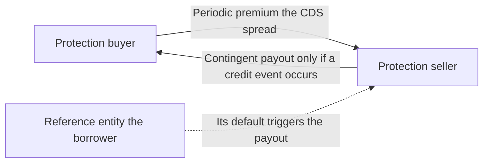
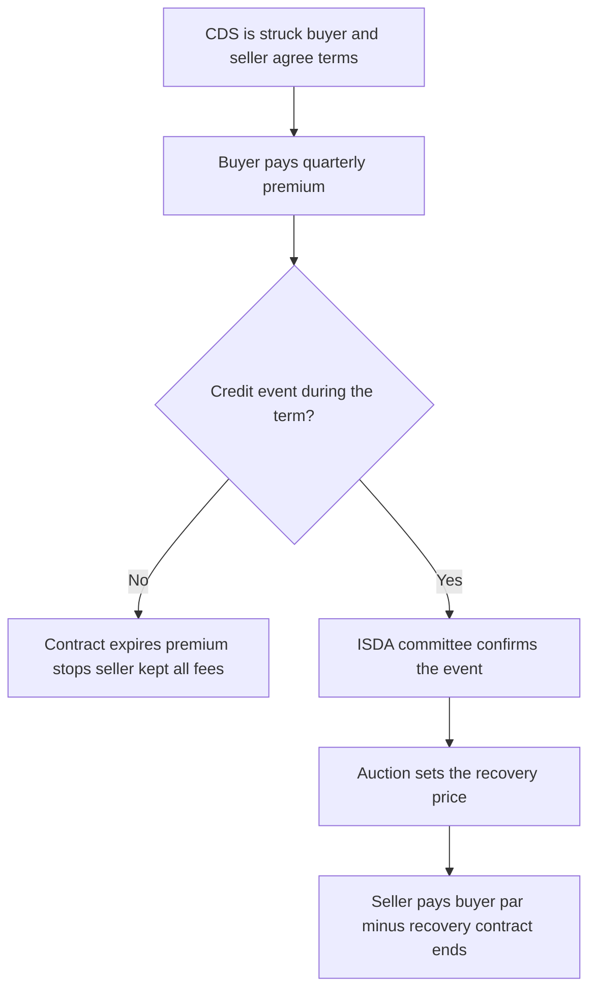
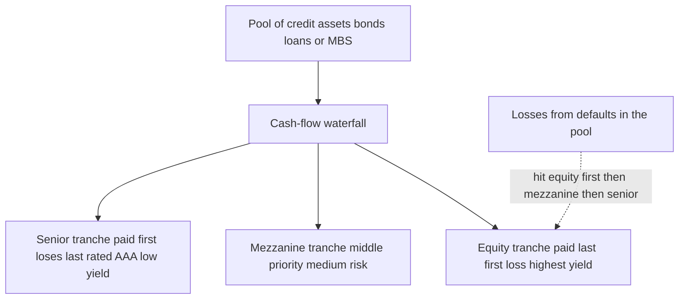
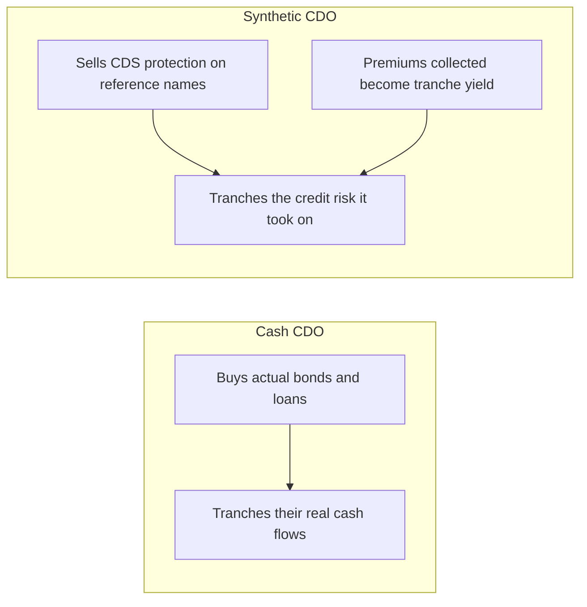
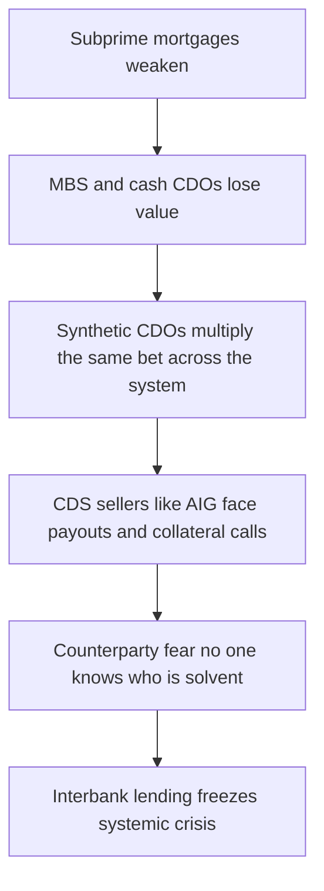

# Chapter 13 — Credit Derivatives

## 1. The Problem / The Need

Every derivative we have met so far isolates and trades a *price* risk: a stock's price, an interest rate, an exchange rate, a commodity's price. But there is another enormous risk sitting on the balance sheets of banks, insurers, pension funds and bond investors that none of those instruments touches directly — **the risk that a borrower fails to pay you back.** This is *credit risk*, and until the mid-1990s it was almost impossible to transfer without physically selling the underlying loan or bond.

Consider a concrete predicament. A bank has lent ₹500 crore to a single large corporate — say a steel manufacturer. The loan is profitable and the relationship is valuable; the bank does *not* want to sell the loan, call it in, or annoy a client it hopes to keep for decades. Yet the bank's risk managers are uncomfortable: the exposure to that one name is now larger than prudence allows, and the industry is turning cyclical. Before credit derivatives, the bank had only clumsy tools:

- **Sell the loan** — but that ruptures the client relationship and may be legally restricted.
- **Stop lending** — but that forfeits future business.
- **Buy more capital / hold reserves** — expensive, and does not remove the concentration.

What the bank actually *wants* is to keep the loan on its books, keep the client happy, keep earning the interest — but shed the *default risk* to somebody else who is willing to bear it for a fee. Symmetrically, there are investors — hedge funds, insurers, other banks with no exposure to that steel company — who would happily *take on* that default risk in exchange for a stream of payments, because to them it is a diversifying, yield-enhancing position.

That is the gap credit derivatives fill. They **unbundle credit risk from the underlying loan or bond and let it be bought and sold on its own**, without transferring ownership of the asset itself. The same logic that let farmers hedge crop prices without selling the farm now lets a lender hedge default risk without selling the loan.

The need is not merely convenience. It is systemic:

- **Banks** need to manage concentration limits and free up regulatory capital.
- **Bond investors** need to hedge issuer-specific default risk cheaply.
- **Insurers and asset managers** want to *earn* credit risk premia in a form more flexible than buying bonds.
- **Speculators and macro traders** want a clean way to bet that a company's or a country's creditworthiness will deteriorate — a bet that is awkward to express with bonds or equities alone.

The instrument that answers all of these at once — the workhorse of the entire asset class — is the **Credit Default Swap (CDS)**.

## 2. The Core Idea

A **credit derivative** is a contract whose payoff depends on the *creditworthiness* of one or more reference entities — that is, on whether they default, get downgraded, or see their credit spreads move — rather than on a market price.

The **credit default swap** is the canonical example and the one to understand in your bones. Strip it to its essence:

> A CDS is a **bilateral contract in which one party pays a regular premium to another, and in return receives a large payment if a specified borrower suffers a "credit event" (essentially, default).**

It is, functionally, **an insurance policy on a bond or loan.** One side is buying protection; the other side is selling it.

- The **protection buyer** pays a periodic fee (the *CDS spread* or *premium*), quarter after quarter, for the life of the contract. This is the "insurance premium." The buyer is *short credit risk* — it profits if the borrower's credit deteriorates or defaults.
- The **protection seller** receives that fee and, in exchange, promises to compensate the buyer for the loss if the reference entity defaults. The seller is *long credit risk* — economically it is just like owning the bond: it collects income and eats the loss if things go wrong.

The thing being referenced — the *reference entity* (a company or government) and a *reference obligation* (a specific bond or class of debt) — need **not be owned by either party.** This is the profound feature. You can buy insurance on a house you do not own. A CDS lets you take a view on Tata Steel's or Greece's credit without ever holding a single one of their bonds. That flexibility is what turned CDS from a hedging tool into a full-blown trading market — and, as we will see, into an amplifier of the 2008 crisis.

*Figure 13.1 — The basic cash-flow structure of a single-name CDS.*

Everything else in this chapter — the mechanics of settlement, what the spread signals, CDS indices, CDOs, synthetic CDOs, and the crisis — is an elaboration of this one picture.

## 3. Why / How It Works

### 3.1 Why unbundling credit risk creates value

The economic engine is the same as for all derivatives: **risk flows to whoever is best placed to bear it, and both sides are better off.** A bank with a concentrated loan to a steelmaker values shedding that risk more than the fee it pays. An insurer with no steel exposure values the diversifying premium more than the risk it assumes. Trade happens because their reservation prices differ. Credit risk becomes a *tradable, priceable commodity* rather than something locked inside an illiquid loan.

### 3.2 Why a CDS is priced the way it is — the intuition

The premium a protection buyer must pay has to compensate the seller for **expected loss**. In a single period, roughly:

$$\text{Fair spread} \approx \text{Probability of default} \times \text{Loss given default}$$

If a name has a 2% annual default probability and, in default, recoveries return 40 cents on the dollar (so the loss given default is 60%), the fair annual premium is approximately `2% × 60% = 1.2%`, i.e. **120 basis points**. That is why a CDS spread is quoted the way a bond's credit spread is: both are the market's price of the same default risk. Arbitrage links them — if the CDS spread and the bond's spread over the risk-free rate diverge too far, a trader can buy the bond and buy protection (or vice versa) to lock in a near-riskless profit. This linkage (the "CDS-bond basis") is what makes the CDS spread a clean, real-time thermometer of credit quality.

### 3.3 How the contract actually runs its life

1. **Inception.** Buyer and seller agree on the reference entity, the notional amount, the maturity (5 years is the market benchmark), the spread, and the legal definition of what counts as a credit event. Standard contracts follow **ISDA** documentation.
2. **Premium leg.** The buyer pays the spread, usually **quarterly**, calculated on the notional. Post-2009 standardisation, contracts trade with fixed coupons (100 bp for investment grade, 500 bp for high yield) plus an upfront payment to reconcile with the true market spread.
3. **Protection leg.** Nothing happens *unless* a credit event occurs. If it does, the contract terminates and the seller pays the buyer the loss.
4. **Settlement.** Either **physical** (buyer delivers defaulted bonds to the seller and receives par) or **cash** (seller pays `par − recovery value`, where the recovery is set by an auction). Modern practice is cash settlement via a centralised **ISDA auction** that fixes the recovery price for everyone.

### 3.4 What is a "credit event"?

The trigger is not vague. ISDA enumerates specific credit events, the common ones being:

- **Bankruptcy** of the reference entity.
- **Failure to pay** a scheduled amount (after a grace period).
- **Restructuring** — a forced change of terms (maturity extension, coupon cut, subordination) that is adverse to creditors.

A committee (the ISDA **Determinations Committee**) formally rules whether an event has occurred, so that the whole market settles consistently. This machinery — standard definitions, a determinations committee, and auctions — is what lets thousands of bilateral contracts on the same name settle in an orderly way.

*Figure 13.2 — The life cycle and two possible endings of a CDS.*

## 4. Full Content

### 4.1 The two legs, made precise

A CDS has two cash-flow streams, called *legs*:

| | **Premium leg (fee leg)** | **Protection leg (contingent leg)** |
|---|---|---|
| Paid by | Protection buyer | Protection seller |
| When | Every quarter until maturity or a credit event | Once, only if a credit event occurs |
| Amount | Spread × notional × day-count fraction | Notional × (1 − recovery rate) |
| Economic role | Steady "insurance premium" | Lump-sum "claim payout" |

The **fair spread** is the number that makes the present value of the premium leg equal to the present value of the expected protection leg at inception, so the swap starts with zero value to both sides. As default probabilities rise, the premium leg's fair price rises — the spread *widens* — and the existing protection becomes more valuable to whoever already owns it (mark-to-market gain for the buyer).

### 4.2 Who is long and who is short credit

This trips up beginners, so anchor it firmly:

- **Protection buyer = SHORT the credit.** Pays fees, profits if the name deteriorates. Position behaves like *shorting the bond*. Buying protection with no underlying exposure is the "naked" way to bet *against* a company.
- **Protection seller = LONG the credit.** Collects fees, loses if the name defaults. Position behaves like *owning the bond funded at the risk-free rate*. Selling protection is a synthetic *long* — a way to earn credit-risk income without laying out cash for a bond.

This equivalence — *selling CDS protection ≈ owning the bond* — is the master key to the whole asset class, including CDOs.

### 4.3 The CDS spread as a signal

Because the spread is quoted continuously and updates in real time (unlike agency ratings, which lag), the market treats the CDS spread as **the** live measure of perceived default risk:

- A **rising (widening) spread** = the market thinks default is more likely, or recovery would be lower — creditworthiness is *deteriorating*.
- A **falling (tightening) spread** = improving credit quality.
- The spread can be translated into an **implied probability of default** using the relation in §3.2, so analysts speak of "the market is pricing a 15% chance of default over five years."

During 2008, the CDS spreads on Lehman Brothers, AIG, Bear Stearns and Icelandic banks blew out to distressed levels *before* the rating agencies acted — which is precisely why traders and regulators watch CDS spreads as an early-warning system for financial stress. Sovereign CDS (on Greece, Italy, etc.) play the same role for countries.

### 4.4 Single-name vs index CDS

- **Single-name CDS** references one entity (one company or one government).
- **CDS indices** (e.g. **CDX** in North America, **iTraxx** in Europe/Asia) reference a *basket* of 100–125 names. Buying protection on an index is a one-trade way to hedge or bet on broad credit conditions. Indices are the most liquid part of the credit-derivatives market and the barometer traders quote every morning.

### 4.5 From swaps to structured credit: CDOs

A **Collateralised Debt Obligation (CDO)** takes a pool of credit-risky assets — corporate bonds, mortgage-backed securities, loans — and repackages the *cash flows* into a stack of new securities called **tranches**, each with a different priority of payment. This process is **securitisation combined with tranching**.

The waterfall works like a set of buckets stacked vertically. Interest and principal from the underlying pool pour in at the top:

- The **senior tranche** is paid first. It is the last to absorb losses, so it carries the least risk and the lowest yield. Because it only fails after everything below is wiped out, it was typically rated **AAA**.
- **Mezzanine tranches** sit in the middle — paid after senior, absorbing losses before senior. Rated somewhere between AAA and junk (A, BBB, BB).
- The **equity tranche** (or "first-loss" / "residual") is paid last and absorbs the *first* losses in the pool. Highest risk, highest expected return, usually unrated.

*Figure 13.3 — How a CDO redistributes pool losses through a tranche waterfall.*

The financial alchemy the CDO claimed to perform: **out of a pool of merely OK (BBB) assets, tranching manufactures a large slice of "AAA" senior paper**, because the senior tranche is protected by all the subordination beneath it. As long as defaults in the pool were assumed to be *uncorrelated*, the senior tranche looked extraordinarily safe. That correlation assumption is exactly where the model broke in 2008.

### 4.6 Synthetic CDOs — CDOs built out of CDS

Here the two ideas fuse. A **synthetic CDO** does *not* buy actual bonds. Instead, it **sells CDS protection on a portfolio of reference names** and tranches the resulting risk. Recall §4.2: selling protection ≈ owning the bond. So a synthetic CDO gains credit exposure to hundreds of names *without ever purchasing them* — it simply writes CDS contracts and collects the premiums, which are paid out to tranche investors as yield. Losses arrive not from bonds defaulting in a vault but from **credit events triggering payouts on the CDS the vehicle has sold.**

Why did this matter? Because a *cash* CDO is limited by the supply of real bonds. A *synthetic* CDO is limited only by how many CDS contracts counterparties are willing to write. This meant the notional amount of credit risk referencing, say, subprime mortgage bonds could grow to be a **multiple** of the actual mortgages outstanding. The same reference bond could be named in dozens of synthetic structures. Credit derivatives thus *manufactured* additional exposure to subprime risk far beyond the physical loans — turning a large housing problem into a gigantic financial-system problem.

*Figure 13.4 — Cash CDO versus synthetic CDO the source of exposure differs.*

### 4.7 Uses of credit derivatives

1. **Hedging.** A bank or bond investor buys protection to offset default risk on a name it holds — insurance in the purest sense.
2. **Regulatory capital and concentration management.** Buying protection can reduce the capital a bank must hold and cut single-name concentration without selling the loan.
3. **Yield enhancement / synthetic investing.** Selling protection earns credit premia with no upfront cash outlay — attractive to insurers and asset managers reaching for yield.
4. **Speculation / directional views.** Buy protection to bet a company or country will deteriorate; sell protection to bet it will not. "Naked" CDS positions (no underlying holding) make this a pure directional trade.
5. **Arbitrage.** Exploit the CDS-bond basis, or relative-value mispricings between an index and its constituents, or across CDO tranches (correlation trading).
6. **Information.** Even non-participants read CDS spreads as the market's real-time credit opinion.

### 4.8 The role credit derivatives played in 2008

Credit derivatives did not *cause* the housing bubble, but they **transmitted and amplified** the damage, converting a bad-mortgage problem into a solvency crisis for the global financial system. The mechanism:

- **Synthetic CDOs multiplied exposure.** Because synthetic structures reference bonds rather than owning them, the amount of money betting on subprime performance grew far larger than the underlying mortgages. When those mortgages soured, losses hit many balance sheets at once.
- **The AAA illusion.** Tranching relied on the assumption that mortgage defaults were weakly correlated. In a nationwide housing downturn, defaults became *highly correlated* — they all went bad together. The subordination that was supposed to protect senior tranches was overwhelmed, and "AAA" paper suffered losses no one had modelled.
- **AIG — the concentrated protection seller.** AIG's financial-products unit had *sold* tens of billions of dollars of CDS protection on mortgage-linked CDOs, collecting premiums and treating default as remote. As the underlying deteriorated, AIG owed (a) payouts and (b) escalating **collateral calls** as spreads widened and its mark-to-market losses ballooned. It did not have the cash. AIG's near-collapse triggered an **$182 billion government rescue**, justified by fear that its default would cascade through every bank that had bought protection from it.
- **Counterparty risk and opacity.** CDS were traded **over-the-counter**, bilaterally, with no central clearing and no public register of who owed what to whom. When Lehman failed, no one knew their true net exposure to it or to each other. This *uncertainty* — not just the losses themselves — froze interbank lending. A CDS is only as good as the seller's ability to pay; in a systemic event, that assumption fails exactly when you need it.
- **Wrong-way risk.** Protection bought from a seller who is *itself* exposed to the same shock (a monoline insurer, AIG) is worth least precisely when default strikes — the hedge evaporates in the storm.

*Figure 13.5 — The 2008 amplification chain from mortgages to systemic crisis.*

The regulatory response (Dod-Frank in the US, EMIR in Europe) pushed standardised CDS onto **central counterparties (CCPs)**, mandated clearing and margining, and forced trade reporting to repositories — directly targeting the opacity and counterparty risk that made 2008 so violent.

## 5. Worked / Applied Examples

### Example 1 — Cash flows and P&L of a single-name CDS

A hedge fund **buys** 5-year protection on Reliance-Steel Ltd, notional **₹100 crore**, at a spread of **200 basis points** (2.00%), paid quarterly. Assume, on default, the recovery rate is **40%**.

**Premium leg (what the buyer pays each quarter):**

$$\text{Quarterly premium} = ₹100\text{ cr} \times 2.00\% \times \tfrac{1}{4} = ₹0.50\text{ cr} = ₹50\text{ lakh per quarter}$$

Over a full year the buyer pays `4 × ₹50 lakh = ₹2 crore` (= 2% of ₹100 cr), as expected.

**Scenario A — No default over 5 years.** The buyer pays 20 quarterly instalments of ₹50 lakh = **₹10 crore total**, and receives nothing. The *seller* keeps the full ₹10 crore. Protection expired unused — the buyer paid for peace of mind, like an unclaimed insurance premium.

**Scenario B — Default after exactly 2 years (8 premiums paid).**

- Premiums paid by buyer: `8 × ₹50 lakh = ₹4 crore`.
- Protection payout received: `Notional × (1 − recovery) = ₹100 cr × (1 − 0.40) = ₹60 crore`.
- **Net gain to buyer:** `₹60 cr − ₹4 cr = ₹56 crore`.
- **Net loss to seller:** the mirror image, `−₹56 crore` (paid out ₹60 cr, kept ₹4 cr).

**Self-check:** a CDS is zero-sum between the two parties. Buyer +₹56 cr, seller −₹56 cr → sums to zero. ✓ And the payout of ₹60 cr equals the loss on ₹100 cr of bonds recovering only 40 cents, so it exactly compensates a holder of the actual bonds. ✓

### Example 2 — Reading the spread as an implied default probability

Suppose the market quotes 5-year CDS on Sovereign X at **500 bp** (5.00%) per year, and analysts assume a **40%** recovery (so loss given default = 60%). Using the single-period approximation from §3.2:

$$\text{Annual PD} \approx \frac{\text{Spread}}{1 - \text{Recovery}} = \frac{5.00\%}{0.60} \approx 8.3\%$$

So the market is pricing roughly an **8.3% chance of default per year**. Over five years, the *cumulative* survival probability is approximately `(1 − 0.083)^5 ≈ 0.648`, implying about a **35% cumulative chance of default over five years** — a deeply distressed name. Compare a healthy investment-grade name quoted at **60 bp**: implied annual PD ≈ `0.60% / 0.60 = 1.0%`. 

**Self-check:** higher spread → higher implied PD, as it must. A 500 bp name is far riskier than a 60 bp name, and the arithmetic (8.3% vs 1.0% annual PD) reflects exactly that ordering. ✓ This is why a *widening* spread is a real-time deterioration signal.

### Example 3 — How a CDO tranche absorbs losses

A CDO holds a **₹1,000 crore** pool. It is tranched as:

| Tranche | Size | Attachment–Detachment | Rating |
|---|---|---|---|
| Senior | ₹800 cr | 20%–100% of pool | AAA |
| Mezzanine | ₹150 cr | 5%–20% | BBB |
| Equity | ₹50 cr | 0%–5% | Unrated |

"Attachment" is the loss level at which a tranche *starts* to be hit; "detachment" is where it is fully wiped out.

**Scenario A — pool loses ₹40 crore (4%).** Losses fall entirely within the 0–5% band, so the **equity tranche absorbs the whole ₹40 cr** (it had ₹50 cr of capacity). Mezzanine and senior are untouched.

**Scenario B — pool loses ₹120 crore (12%).**
- Equity absorbs its full ₹50 cr (the first 5%). Remaining loss: ₹70 cr.
- Mezzanine covers losses from 5% to 20%, i.e. ₹50 cr–₹200 cr. It absorbs the next ₹70 cr. Mezzanine capacity is ₹150 cr, so it survives, ₹70 cr impaired.
- **Senior is untouched** — losses never reached the 20% attachment point.

**Scenario C — pool loses ₹300 crore (30%), a correlated meltdown.**
- Equity wiped out: −₹50 cr (first 5%).
- Mezzanine wiped out entirely: −₹150 cr (5%–20%).
- Remaining loss: `₹300 cr − ₹200 cr = ₹100 cr` breaches the 20% attachment → **the "AAA" senior tranche loses ₹100 cr.**

**Self-check:** losses always sum to the pool loss. Scenario C: `50 + 150 + 100 = ₹300 cr`. ✓ Scenario C is 2008 in miniature: a tail event large enough to punch through subordination and inflict losses on paper that models had rated essentially riskless — because the models assumed defaults would not all arrive together, and they did.

## 6. Connections

- **To insurance (Ch. on risk transfer).** A CDS is structurally an insurance contract — premium in, contingent payout out — but traded, standardised, and *not* requiring an insurable interest. That last difference (you can insure a bond you do not own) is what makes it a derivative and a speculative instrument, not just a hedge.
- **To bonds and the yield curve.** The CDS spread and a bond's credit spread over the risk-free rate price the *same* default risk; arbitrage (the CDS-bond basis) ties them together. A CDS is essentially the credit-risk component of a corporate bond, stripped out and traded on its own.
- **To swaps generally.** Like an interest-rate swap, a CDS exchanges two streams — here a fixed premium stream against a contingent default-payout stream. It is a swap of *fee for protection*.
- **To options.** The protection buyer's payoff (nothing usually, a big lump if a rare event fires) resembles a deep-out-of-the-money put on the reference entity's assets — limited premium paid, large payoff in the tail. Structural credit models (Merton) make this analogy exact: a firm's equity is a call on its assets and its debt is short a put.
- **To securitisation and structured products.** CDOs are the same tranching technology used in mortgage-backed and asset-backed securities; synthetic CDOs bolt CDS onto that technology.
- **To systemic risk and regulation.** The chapter's 2008 story connects directly to central clearing, margin rules, Basel capital treatment, and the whole post-crisis reform agenda.

## 7. Key Terms

- **Credit derivative** — a contract whose payoff depends on a borrower's creditworthiness rather than a market price.
- **Credit default swap (CDS)** — a contract in which a protection buyer pays a periodic premium and receives a payout if the reference entity suffers a credit event.
- **Protection buyer** — pays the premium; is *short* the credit; profits if the name deteriorates.
- **Protection seller** — receives the premium; is *long* the credit; pays out on default.
- **Reference entity / reference obligation** — the borrower whose credit is referenced, and the specific debt used to define the contract.
- **CDS spread (premium)** — the annual fee, in basis points of notional, paid for protection; the market's live price of default risk.
- **Basis point (bp)** — one hundredth of a percent (0.01%); spreads are quoted in bp.
- **Credit event** — the contractually defined trigger: bankruptcy, failure to pay, or restructuring.
- **ISDA / Determinations Committee** — the standard-setting body and the panel that officially rules whether a credit event occurred.
- **Recovery rate** — cents on the dollar recovered on defaulted debt; `1 − recovery` is loss given default.
- **Settlement (physical vs cash)** — deliver defaulted bonds for par, or receive `par − recovery` in cash (recovery set by auction).
- **Notional** — the face amount on which premium and payout are calculated.
- **Naked CDS** — buying protection with no underlying exposure — a pure directional bet.
- **CDS index (CDX, iTraxx)** — a traded basket of many single-name CDS.
- **CDO (Collateralised Debt Obligation)** — a security backed by a pool of debt, sliced into tranches by loss priority.
- **Tranche** — a slice of a CDO with a defined attachment/detachment loss band and its own rating.
- **Senior / mezzanine / equity tranche** — loss-priority layers, from safest to first-loss.
- **Attachment / detachment point** — the pool-loss percentages at which a tranche begins and finishes absorbing losses.
- **Synthetic CDO** — a CDO that gains exposure by *selling CDS protection* rather than buying bonds.
- **Counterparty risk** — the risk the protection seller cannot pay when a credit event fires.
- **Wrong-way risk** — exposure to a counterparty that is most likely to default exactly when you need it to pay.
- **CDS-bond basis** — the gap between a name's CDS spread and its cash-bond credit spread.

## 8. Common Confusions

- **"Buying protection means I own the bond."** No — you need not own anything. That is the whole point. A naked CDS buyer holds no bond and is simply betting the credit worsens.
- **"The protection seller is the risky one, so it's short credit."** Backwards. The *seller* is **long** credit (like owning the bond — earns income, eats default losses); the *buyer* is **short** credit. A rising spread hurts the seller (mark-to-market loss) and helps the buyer.
- **"A wider spread means the seller is doing well."** No. A widening spread means default looks more likely — bad for the seller (who owes protection), good for the buyer.
- **"A CDS pays the notional on default."** It pays `notional × (1 − recovery)`, i.e. the *loss*, not the full face value. On a 40% recovery, a ₹100 cr contract pays ₹60 cr, not ₹100 cr.
- **"CDS and CDO are the same thing."** A CDS is a single insurance-like contract on one (or an index of) name(s). A CDO is a *structured security* that pools many credits and tranches them. A *synthetic* CDO is where they meet — a CDO built from CDS.
- **"AAA means safe, full stop."** The 2008 lesson: a AAA *senior CDO tranche* was AAA only under the assumption that defaults were weakly correlated. Correlation, not average default rate, is the hidden risk in tranched products.
- **"Credit derivatives caused the 2008 crisis."** More precisely, they *amplified and transmitted* it. The rot was in the mortgages; synthetic CDOs multiplied the bet, tranching hid the correlation risk, and opaque OTC CDS spread counterparty fear across the system.
- **"Restructuring isn't really a default, so it shouldn't trigger a CDS."** Under ISDA, a coercive restructuring *is* a defined credit event — this was central to disputes over Greek sovereign CDS in 2012.
- **"Selling protection is free money because default is rare."** This is precisely AIG's mistake. You also face *collateral calls* as spreads widen — you can be bankrupted by mark-to-market and margin long before any actual default.

## 9. Recap

Credit derivatives exist to solve a problem no earlier instrument could: **transferring the risk that a borrower defaults, separately from the loan or bond itself.** The **credit default swap** is the core building block — an insurance-like bilateral contract where a *protection buyer* pays a periodic *spread* and receives a large payout, `notional × (1 − recovery)`, if the reference entity suffers a *credit event* (bankruptcy, failure to pay, or restructuring). The buyer is **short** the credit; the seller is **long** it, economically equivalent to owning the bond.

The **CDS spread** is the market's real-time price of default risk and can be inverted into an implied probability of default; a *widening* spread signals *deteriorating* credit, and it moves faster than rating agencies. **CDS indices** (CDX, iTraxx) extend the same logic to baskets.

**CDOs** pool credit assets and tranche their cash flows into senior, mezzanine and equity slices ranked by loss priority — manufacturing "AAA" senior paper out of merely-OK pools, valid only if defaults stay uncorrelated. **Synthetic CDOs** fuse the two ideas: they gain exposure by *selling CDS protection* instead of buying bonds, which let the market create credit exposure many times larger than the underlying loans.

In **2008**, these tools amplified a subprime problem into a systemic crisis: synthetic CDOs multiplied the bet, tranching models underestimated correlation so "AAA" tranches failed, concentrated protection sellers like **AIG** faced ruinous payouts and collateral calls, and opaque OTC contracts spread counterparty fear that froze the system. The reforms that followed — central clearing, margining, trade reporting — target exactly those weaknesses.

## 10. Quick-Reference / Interview Points

- **One-liner:** A CDS is insurance on a bond — buyer pays a periodic spread, seller pays out if the borrower has a credit event. Neither side need own the bond.
- **Directionality (say it fast):** Protection **buyer = short credit** (pays fee, wins on deterioration). Protection **seller = long credit** (collects fee, loses on default; economically like owning the bond).
- **Payout formula:** `Notional × (1 − Recovery rate)`. Not the full notional.
- **Fair-spread intuition:** `Spread ≈ PD × (1 − Recovery)`, so `implied PD ≈ Spread / (1 − Recovery)`.
- **What the spread signals:** live market price of default risk; **widening = worse credit**, and it leads rating agencies.
- **Credit events (ISDA):** bankruptcy, failure to pay, restructuring — ruled on by the Determinations Committee; recovery set by auction; usually cash-settled now.
- **Benchmark tenor:** 5 years. **Indices:** CDX (North America), iTraxx (Europe/Asia).
- **CDO in one breath:** pool debt, tranche by loss priority (equity → mezzanine → senior); subordination lets senior be rated AAA *if defaults are uncorrelated*.
- **Synthetic CDO:** exposure via *selling CDS*, not buying bonds — lets exposure exceed the physical collateral outstanding.
- **The hidden risk in tranches:** *default correlation*, not the average default rate. Correlation going to 1 is what killed AAA tranches in 2008.
- **2008 in four words:** amplification, correlation, AIG, opacity.
- **AIG specifically:** sold huge CDS protection on mortgage CDOs; killed by *collateral calls* and mark-to-market as spreads widened, not by realised defaults alone; needed a ~$182 bn bailout.
- **Post-crisis fixes:** central counterparty clearing, mandatory margining, standardised coupons (100/500 bp + upfront), trade reporting (Dodd-Frank, EMIR).
- **Killer nuance to drop in interview:** "A naked CDS is a way to short credit; selling protection is a synthetic long — and wrong-way risk means the protection you bought is worth least exactly when you most need it to pay."
