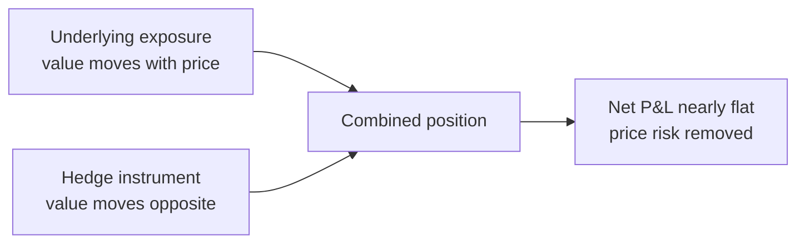
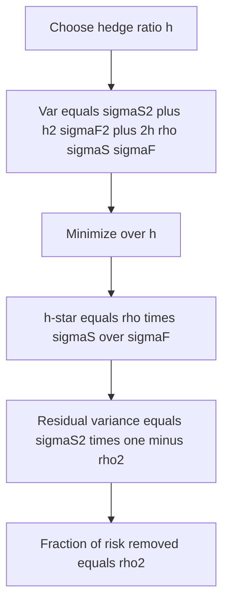
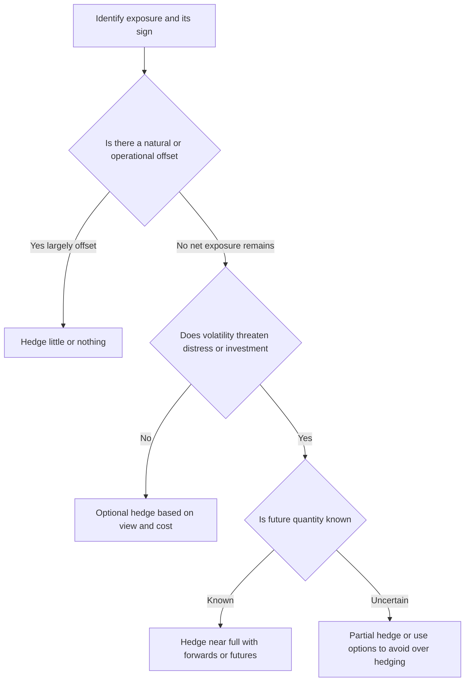
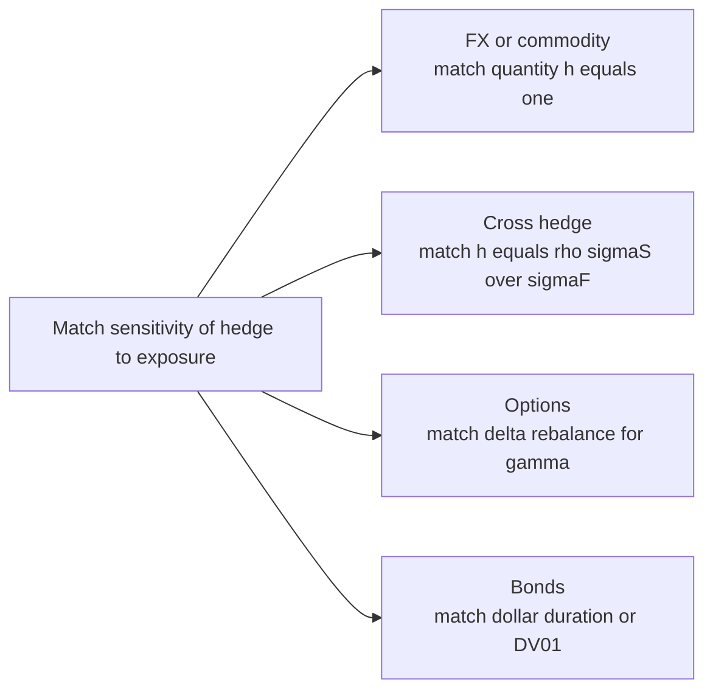

# Chapter 14 — Hedging with Derivatives

## 1. The Problem / The Need

Almost every business earns its living doing one thing and is exposed, as a side effect, to prices it never wanted to bet on.

An airline sells seats. Its skill is scheduling aircraft, filling them, and running an on-time operation. Yet 25-35% of its operating cost is jet fuel, whose price is set in a global market the airline cannot influence. A 30% jump in crude can wipe out an entire year of profit that had nothing to do with how well the airline flew its planes.

An Indian software exporter sells services to US clients, invoices in dollars, and pays its engineers in rupees. Its skill is writing code. Yet a 5% appreciation of the rupee against the dollar can erase its entire operating margin, because revenue is in USD and costs are in INR.

A wheat farmer knows how to grow wheat. Between planting in November and harvesting in April, the price of wheat can fall 25%, turning a good crop into a loss.

In each case the firm carries **two** bundled risks:
1. **Business risk** it is paid to take (can it run planes, write code, grow wheat efficiently?).
2. **Price risk** it is *not* paid to take (fuel, FX, commodity prices) and often cannot forecast better than the market.

The problem hedging solves is this: **how do I strip out the price risk I don't want, so my P&L reflects the business I actually run?** Derivatives — futures, forwards, swaps, and options — are the surgical tools for that separation. They let a firm take an offsetting position whose gains cancel the losses on the underlying exposure, converting an uncertain future price into something close to a known one.

The subtlety, and the whole content of this chapter, is that this cancellation is almost never perfect. Real hedges are built on approximations: the hedging instrument rarely matches the exposure exactly, the amount to trade is a statistical estimate, and sensitivities change as markets move. Learning to hedge well is learning to manage those imperfections — the hedge ratio, basis risk, cross-hedging, over- and under-hedging — not to eliminate them.

---

## 2. The Core Idea

A hedge is an intentionally taken position whose value moves **opposite** to an existing exposure, so that the combined portfolio's value is far less sensitive to the risky price than the exposure alone.

Formally, if your exposure has value \(S\) (spot) and you hold \(h\) units of a hedging instrument with value \(F\), the hedged portfolio is:

\[
\Pi = S + h\,F
\]

The change in the portfolio for a small market move is:

\[
\Delta\Pi = \Delta S + h\,\Delta F
\]

The entire craft of hedging is **choosing \(h\)** (the hedge ratio) so that \(\Delta\Pi\) is as insensitive as possible to the risk factor. If you can make \(h\,\Delta F \approx -\Delta S\) across the likely range of moves, the exposure is neutralized.

Three ideas flow from this single equation and organize the chapter:

- If the instrument is the *same* asset as the exposure, \(h = -1\) (per unit) works almost perfectly. This is a **direct hedge**.
- If the instrument is a *related but different* asset (jet fuel hedged with crude oil), you need a statistically estimated \(h\) — the **minimum-variance hedge ratio** — and you accept residual **basis risk**. This is a **cross-hedge**.
- If the instrument's sensitivity itself changes with the market (options, bonds), \(h\) is not a constant. You match **sensitivities** — **delta** for options, **duration** (or DV01) for bonds — and you must **rebalance** as those sensitivities drift.

*Figure 14.1 — A hedge overlays an offsetting position so the combined P&L is flat across price moves.*

---

## 3. Why / How It Works

### 3.1 Why offsetting positions cancel

Consider the exporter expecting USD 1,000,000 in three months. In rupee terms the value of that receivable is \(1{,}000{,}000 \times S\), where \(S\) is the INR/USD rate. If \(S\) falls (rupee strengthens), the receivable is worth fewer rupees — a loss.

Now sell USD 1,000,000 forward at a locked rate \(F_0\). At maturity the forward pays \(1{,}000{,}000 \times (F_0 - S)\). When \(S\) falls, this payoff *rises* by exactly the amount the receivable falls. Add them:

\[
\underbrace{1{,}000{,}000 \times S}_{\text{receivable in INR}} + \underbrace{1{,}000{,}000 \times (F_0 - S)}_{\text{forward payoff}} = 1{,}000{,}000 \times F_0
\]

The spot rate \(S\) has algebraically cancelled. The exporter locks in \(F_0\) rupees per dollar regardless of where the rupee goes. This is why hedging works: you engineer a payoff that is the negative of your exposure's sensitivity, and the risk factor disappears from the sum.

### 3.2 Why the variance falls — the statistical view

When the hedge is imperfect (\(\Delta F\) is only correlated with, not identical to, \(\Delta S\)), we cannot make the risk vanish, but we can *minimize its variance*. The variance of the hedged change is:

\[
\text{Var}(\Delta\Pi) = \sigma_S^2 + h^2\sigma_F^2 + 2h\,\rho\,\sigma_S\sigma_F
\]

where \(\sigma_S, \sigma_F\) are the standard deviations of the spot and futures changes and \(\rho\) their correlation. This is a quadratic in \(h\) — a parabola opening upward — so it has a unique minimum. Differentiate and set to zero:

\[
\frac{d}{dh}\text{Var}(\Delta\Pi) = 2h\sigma_F^2 + 2\rho\sigma_S\sigma_F = 0
\quad\Rightarrow\quad
h^* = -\rho\,\frac{\sigma_S}{\sigma_F}
\]

The magnitude, ignoring the offsetting sign, is the famous **minimum-variance hedge ratio**:

\[
\boxed{\,h^* = \rho\,\dfrac{\sigma_S}{\sigma_F}\,}
\]

This is exactly the **slope coefficient** \(\beta\) from regressing spot price changes on futures price changes, \(\Delta S = \alpha + \beta\,\Delta F + \varepsilon\). That is the practical way to estimate it.

### 3.3 Why hedge effectiveness equals \(\rho^2\)

Substituting \(h^*\) back into the variance formula, the minimized variance is \(\sigma_S^2(1-\rho^2)\). So the **fraction of risk removed** is \(\rho^2\) — the R-squared of that same regression. If crude oil returns explain 90% of jet-fuel return variance (\(\rho = 0.95\)), a well-sized cross-hedge removes about \(\rho^2 = 0.90\) of the variance and leaves 10% as irreducible **basis risk**. This single result tells you, before you trade, how good the hedge can *possibly* be.

*Figure 14.2 — Hedge variance is a parabola in the hedge ratio; the minimum sits at h-star.*

---

## 4. Full Content

### 4.1 Direct hedges and the naive hedge ratio

When the hedging instrument is the identical asset — hedging a physical crude position with crude futures — the price changes move one-for-one and \(h^* \approx 1\). The **naive hedge** simply matches quantities: to hedge 100,000 barrels you short 100,000 barrels of futures (100 contracts of 1,000 barrels each). Two refinements even here:

- **Contract standardization.** Futures come in fixed lot sizes. You can only trade whole contracts, so you round, accepting a small residual.
- **Tailing the hedge.** Because futures are marked to market daily and the gains/losses are received/paid immediately (rather than at maturity), there is a small interest-rate effect. The "tailed" hedge scales the position by a discount factor \(e^{-r\tau}\) (or divides by \((1+r\tau)\)) so present-valued cash flows match. In practice this shaves the position by 1-3% and is important for large books, ignorable for a first approximation.

### 4.2 The minimum-variance hedge ratio in full

For cross-hedges and any case where spot and futures don't move identically, use \(h^* = \rho\,\sigma_S/\sigma_F\). The number of futures contracts is then:

\[
N^* = h^* \times \frac{Q_A}{Q_F}
\]

where \(Q_A\) is the size of the position being hedged (units of the underlying) and \(Q_F\) is the size of one futures contract. Some texts write \(N^* = h^* \times \dfrac{V_A}{V_F}\) using rupee/dollar *values* instead of quantities; both are correct as long as you are consistent — use quantities when the price per unit is the same on both legs, values when they differ.

**Estimation.** Run an OLS regression of periodic spot changes (or percentage returns) on the corresponding futures changes. The slope is \(h^*\); the \(R^2\) is your effectiveness \(\rho^2\). Match the data frequency to the hedge horizon: if you rebalance weekly, use weekly changes.

### 4.3 Delta hedging (options and non-linear exposures)

Options have a *curved* payoff, so their sensitivity to the underlying is not constant. The first derivative of option value with respect to the underlying is **delta** (\(\Delta = \partial V/\partial S\)). To hedge an option (or make an option book insensitive to small moves in the underlying), you hold \(-\Delta\) units of the underlying per option. A dealer short one call with delta 0.6 buys 0.6 shares; a \(\pm\$1\) move in the stock changes the option and the shares by offsetting amounts.

The complication is **gamma** (\(\Gamma = \partial\Delta/\partial S\)): delta itself changes as the underlying moves. So a delta hedge is only *locally* correct and must be **rebalanced** — continuously in theory, at intervals in practice. High gamma (near-the-money, near-expiry options) means delta drifts fast and rebalancing is frequent and costly. This is why option hedging is dynamic while a currency forward hedge is static ("set and forget"). Delta hedging is developed fully in the Greeks chapter; here the point is that it is the same equation \(\Delta\Pi = \Delta S + h\Delta F\) with \(h = -\Delta\) and \(h\) no longer a constant.

### 4.4 Duration hedging (interest-rate exposures)

Bonds and bond portfolios have no single "price" that moves with a market factor; they move with **interest rates**, and the sensitivity is governed by **duration**. The relevant risk equation is:

\[
\Delta P \approx -D \times P \times \Delta y
\]

where \(D\) is modified duration, \(P\) the value, and \(\Delta y\) the yield change. To immunize a bond portfolio against a parallel yield shift using interest-rate (e.g., T-bond) futures, choose the number of contracts so the portfolio's dollar duration is offset:

\[
N^* = -\frac{D_P \times P}{D_F \times F}
\]

where \(D_P, P\) are the portfolio's duration and value and \(D_F, F\) are the futures' (underlying deliverable) duration and futures price. Practitioners often work with **DV01** (dollar value of a basis point) or **PVBP** instead of duration; the logic is identical — set the hedge's DV01 equal and opposite to the portfolio's DV01. Duration hedging protects only against *parallel* shifts and only for *small* moves (duration is a first-order, linear approximation; **convexity** is its gamma-analogue). It must be rebalanced as durations drift with rates and time.

### 4.5 Cross-hedging and basis risk

A **cross-hedge** uses a futures/forward on a *different but correlated* asset because no liquid contract exists on the exact exposure. Examples:

- An airline hedges **jet fuel** with **crude oil** or **heating oil** futures.
- An issuer hedges a corporate bond with **Treasury** futures.
- A miller hedges a specific wheat grade with the **exchange-standard** wheat contract.

The residual risk it leaves is **basis risk**. The **basis** is defined as:

\[
b = S - F \quad(\text{spot price minus futures price})
\]

A perfect hedge would require the basis to be constant. In reality the basis fluctuates — because of differences in the asset (jet fuel vs crude), location (Rotterdam vs Gulf Coast), and time (the hedge closes before the futures expiry, when \(S\) and \(F\) have not yet converged). The hedged outcome is:

\[
\text{Effective price} = F_0 + (S_T - F_T) = F_0 + b_T
\]

You lock in the *initial* futures price \(F_0\) but remain exposed to the *terminal basis* \(b_T\), which is uncertain. Basis risk is what remains after the price-level risk has been hedged away — smaller than the raw exposure, but not zero. It is the price of using an imperfect but liquid instrument.

There are **two distinct sources** of basis risk, worth separating:
1. **Cross-asset basis** — the hedge asset differs from the exposure asset (jet fuel ≠ crude). Governed by \(\rho < 1\).
2. **Calendar/convergence basis** — even for the same asset, if the hedge is lifted before delivery, \(S\) and \(F\) may not have converged. Choosing a futures maturity *just beyond* the hedge horizon minimizes this.

### 4.6 When to hedge and how much

Hedging is not free and not always desirable. Frameworks that decide *whether* and *how much*:

**Reasons to hedge (why shareholders can't just do it themselves):**
- **Reduce financial distress / bankruptcy costs.** Smoothing cash flows keeps the firm away from covenant breaches and fire-sale costs. This is the strongest theoretical justification.
- **Preserve debt capacity and investment.** Firms with volatile cash flows underinvest; hedging lets them fund the pipeline in bad years (the "costly external finance" argument — Froot, Scharfstein, Stein).
- **Reduce expected taxes** under a convex tax schedule (smoother income → lower average tax).
- **Comparative information advantage.** The airline knows its fuel *volume* exposure better than any outside investor could.

**Reasons *not* to hedge / to hedge less:**
- **Modigliani-Miller baseline:** in perfect markets, hedging is value-neutral — investors can diversify price risk themselves. Every real justification is a *deviation* from MM (frictions, taxes, distress).
- **The exposure is a core competency or naturally offset.** A firm whose *revenue also rises* with the risk factor (an integrated oil producer-refiner) has a **natural hedge** and should hedge less.
- **Cost and complexity** — margin, spreads, monitoring, and the governance risk of a hedging desk turning into a speculation desk.

**How much — the hedge ratio decision:**
- A **full hedge** (\(h = h^*\)) minimizes variance but also removes upside.
- A **partial hedge** (hedge a fraction, e.g., 50-70% of expected volume) is common when the *quantity itself* is uncertain (see over/under-hedging) or when management holds a view.
- **Options vs forwards:** forwards lock the price both ways; options (a "cap" or "floor") remove downside while keeping upside, at the cost of a premium. Choosing between them *is* a "how much / what shape" decision.

*Figure 14.3 — Deciding whether and how much to hedge.*

### 4.7 Over-hedging and under-hedging

Because the hedged quantity is often forecast, not known, the hedge can end up the wrong size:

- **Under-hedging** (\(h < h^*\), or fewer contracts than exposure): part of the price risk remains. You keep some downside — and some upside.
- **Over-hedging** (\(h > h^*\), more contracts than exposure): the hedge overshoots and becomes a *net speculative position in the opposite direction*. If prices then move favorably for the original business, the oversized hedge *loses more* than the exposure gained. Over-hedging turns a risk-reducer into a risk-*adder*.

The classic driver of accidental over/under-hedging is **quantity/volumetric risk**: the airline hedges expected fuel burn, but a recession cuts flying by 20% — now it holds fuel hedges against fuel it never buys, i.e., a pure speculative long. This is precisely how well-intentioned hedges have produced large losses (e.g., airlines during the 2008 demand collapse, and the *Metallgesellschaft* case where a stack-and-roll hedge became grossly oversized relative to the deliverable schedule and generated ruinous margin calls). The defenses: hedge a *conservative fraction* of uncertain volume, and prefer **options** (whose maximum loss is the premium) when quantity is unsure, so you cannot be forced into a losing speculative leg.

### 4.8 Static vs dynamic; the mechanics of running a hedge

- **Static hedges** (currency forward, a matched-maturity futures strip) are placed once and held.
- **Dynamic hedges** (delta, duration) require rebalancing because sensitivities drift; they incur transaction costs proportional to how often you adjust.
- **Rolling / stack-and-roll:** when the hedge horizon exceeds available liquid maturities, you hold near-dated contracts and roll them forward. This introduces **rollover basis risk** and can concentrate margin calls — the Metallgesellschaft failure mode.

---

## 5. Worked / Applied Examples

### Example 1 — Direct FX forward hedge (exporter), with reconciliation

**Setup.** An Indian IT exporter will receive **USD 1,000,000** in 3 months. Spot INR/USD = 83.00. The 3-month forward rate is \(F_0 = 83.60\) (rupee at a forward discount, consistent with INR rates above USD rates). The firm sells USD 1,000,000 forward.

**Scenario A — rupee strengthens to \(S_T = 81.00\):**

| Leg | Cash flow (INR) |
|---|---|
| Receivable converted at spot | \(1{,}000{,}000 \times 81.00 = 81{,}000{,}000\) |
| Forward payoff \(=1{,}000{,}000\times(F_0 - S_T)\) | \(1{,}000{,}000\times(83.60-81.00)=+2{,}600{,}000\) |
| **Total** | **83,600,000** |

**Scenario B — rupee weakens to \(S_T = 85.00\):**

| Leg | Cash flow (INR) |
|---|---|
| Receivable at spot | \(1{,}000{,}000 \times 85.00 = 85{,}000{,}000\) |
| Forward payoff \(=1{,}000{,}000\times(83.60-85.00)\) | \(-1{,}400{,}000\) |
| **Total** | **83,600,000** |

**Reconciliation.** Both scenarios net to **INR 83,600,000 = \(1{,}000{,}000 \times F_0\)**, exactly the locked forward rate. The spot rate has cancelled. Note the symmetry: in Scenario B the firm "lost" INR 1.4m on the forward but was fully compensated by the stronger conversion — the hedge removed *both* downside and upside, which is the defining trade-off of a forward hedge.

### Example 2 — Cross-hedge with basis risk (airline hedges jet fuel with crude)

**Setup.** An airline will buy **2,100,000 gallons** of jet fuel in 2 months. No liquid jet-fuel futures exist locally, so it cross-hedges with **crude oil (WTI) futures**, 1,000 barrels per contract = **42,000 gallons** per contract.

Estimated statistics from historical data:
- \(\sigma_S\) (jet fuel price change) = 0.036 per gallon-equivalent
- \(\sigma_F\) (crude futures change) = 0.040
- \(\rho\) (correlation) = 0.90

**Step 1 — minimum-variance hedge ratio:**

\[
h^* = \rho\,\frac{\sigma_S}{\sigma_F} = 0.90 \times \frac{0.036}{0.040} = 0.90 \times 0.90 = 0.81
\]

**Step 2 — number of contracts:**

\[
N^* = h^* \times \frac{Q_A}{Q_F} = 0.81 \times \frac{2{,}100{,}000}{42{,}000} = 0.81 \times 50 = 40.5 \approx 41 \text{ contracts (long)}
\]

The airline buys 41 crude futures to hedge a future *purchase* (long the exposure → long the hedge).

**Step 3 — hedge effectiveness:** \(\rho^2 = 0.81\). The cross-hedge removes about **81% of the variance**; roughly **19% remains as basis risk** — the jet-crude spread and location/timing differences.

**Step 4 — outcome with a price move and basis shift.** Suppose over 2 months crude rises so the futures gain **\$5.00/barrel = \$0.1190/gallon** on 42,000 gal/contract:

- Futures gain \(= 41 \times 42{,}000 \times 0.1190 \approx \$204{,}600\).

Jet fuel, being 0.81-beta to crude *plus* an adverse basis move, rises by, say, **\$0.105/gallon**:

- Extra fuel cost \(= 2{,}100{,}000 \times 0.105 = \$220{,}500\).

**Reconciliation.** Net cost change \(= 220{,}500 - 204{,}600 = \$15{,}900\) unhedged residual — versus **\$220,500** of exposure had the airline done nothing. The hedge absorbed \(204{,}600/220{,}500 \approx 93\%\) of *this particular* move; the \$15,900 gap is realized basis risk (fuel rose more per unit than the 0.81 ratio predicted). Over many such moves the *average* variance reduction converges to the \(\rho^2 = 81\%\) figure. This is the concrete meaning of "the hedge is good but imperfect."

### Example 3 — Duration hedge of a bond portfolio

**Setup.** A treasurer holds a bond portfolio worth **\$50,000,000** with modified duration **\(D_P = 6.5\)**. She fears rising rates and hedges with **T-bond futures** priced at **\(F = \$120{,}000\)** per contract (i.e., 120.00 points on a \$100,000 face), where the cheapest-to-deliver bond gives the futures a duration **\(D_F = 8.0\)**.

**Number of contracts to fully immunize:**

\[
N^* = -\frac{D_P \times P}{D_F \times F} = -\frac{6.5 \times 50{,}000{,}000}{8.0 \times 120{,}000} = -\frac{325{,}000{,}000}{960{,}000} \approx -338.5
\]

She **sells 339 contracts** (short, because she is long bonds and fears rate rises).

**Check with a rate move.** Suppose yields rise **+50 bp (Δy = +0.005)**:

- Portfolio loss \(\approx -D_P \times P \times \Delta y = -6.5 \times 50{,}000{,}000 \times 0.005 = -\$1{,}625{,}000\).
- Each futures gains (short profits when prices fall) \(\approx D_F \times F \times \Delta y = 8.0 \times 120{,}000 \times 0.005 = \$4{,}800\).
- Futures gain \(= 339 \times 4{,}800 = \$1{,}627{,}200\).

**Reconciliation.** Net \(= 1{,}627{,}200 - 1{,}625{,}000 = +\$2{,}200\), essentially flat (the small surplus is rounding 338.5 → 339). The portfolio's interest-rate exposure has been neutralized for this parallel shift. Residual risks remain: non-parallel (twist) moves, convexity for large \(\Delta y\), and drift in durations — all requiring rebalancing.

*Figure 14.4 — The same offsetting logic reused across three hedge types.*

---

## 6. Connections

- **Forwards and futures pricing (Ch. on cost-of-carry):** the locked price \(F_0\) in a hedge *is* the cost-of-carry forward price. Convergence of \(F\) to \(S\) at maturity is what makes matched-maturity hedges near-perfect and is the source of calendar basis risk when maturities don't match.
- **The Greeks:** delta hedging here is the entry point; gamma, vega, and theta explain *why* option hedges must be rebalanced and what other risks a delta hedge leaves open.
- **Duration and immunization (fixed income):** duration hedging is portfolio immunization implemented with futures; convexity is its second-order correction.
- **Portfolio theory / regression:** the minimum-variance hedge ratio is a one-variable OLS slope; hedge effectiveness is \(R^2\). Beta-hedging an equity portfolio with index futures (\(N = \beta \times V_P/V_F\)) is the *same* formula with \(\beta\) as the hedge ratio.
- **Swaps:** interest-rate and currency swaps are multi-period hedges — a strip of forwards — used to hedge ongoing exposures (a floating-rate borrower swaps to fixed).
- **Corporate finance / risk management theory:** the "when to hedge" section connects to Modigliani-Miller, financial-distress costs, and the Froot-Scharfstein-Stein underinvestment argument.
- **Value at Risk:** residual (basis) risk after hedging is exactly what a VaR model on the *hedged* book should capture.

---

## 7. Key Terms

- **Hedge:** a position taken to offset the risk of an existing exposure.
- **Hedge ratio (\(h\)):** units of hedging instrument per unit of exposure.
- **Naive / one-to-one hedge:** \(h = 1\); match quantities directly. Appropriate for direct hedges.
- **Minimum-variance hedge ratio (\(h^*\)):** \(h^* = \rho\,\sigma_S/\sigma_F\); the OLS slope of spot changes on futures changes; the \(h\) that minimizes hedged-portfolio variance.
- **Hedge effectiveness:** \(\rho^2\) — fraction of variance removed by the optimal hedge.
- **Basis:** \(b = S - F\), spot minus futures.
- **Basis risk:** uncertainty in the terminal basis; the residual risk of an imperfect hedge.
- **Cross-hedge:** hedging an exposure with a futures/forward on a different but correlated asset.
- **Delta (\(\Delta\)):** sensitivity of an option's value to the underlying; the hedge ratio for options.
- **Gamma (\(\Gamma\)):** rate of change of delta; why delta hedges need rebalancing.
- **Duration (modified):** sensitivity of a bond's price to yield; the hedge ratio input for interest-rate hedging.
- **DV01 / PVBP:** dollar value of a 1-bp yield change; duration expressed in cash terms.
- **Tailing the hedge:** scaling a futures hedge by a discount factor to correct for daily marking-to-market.
- **Over-hedging / under-hedging:** hedging more / less than the true exposure.
- **Natural hedge:** an operational offset that reduces net exposure without derivatives.
- **Static vs dynamic hedge:** placed-once vs continuously-rebalanced.
- **Stack-and-roll:** hedging long-dated exposure with near-dated contracts rolled forward.

---

## 8. Common Confusions

**"A hedge eliminates risk."** No — a *direct* hedge on the same asset comes close, but every real hedge leaves basis risk, quantity risk, or model risk. Hedging *reduces and transforms* risk; it does not erase it.

**"Hedging is speculation."** They are opposites in intent. A hedge is placed *against* an existing exposure to reduce net risk; a speculative position *is* the exposure. The danger is that an over-hedge or a hedge on volume you no longer have *becomes* a speculative position without anyone deciding to speculate.

**"A bigger hedge is safer."** Only up to \(h^*\). Beyond full coverage you over-hedge and *add* risk in the opposite direction. Maximum safety is at the minimum-variance ratio, not the maximum position.

**"The minimum-variance hedge ratio should be near 1."** Only if \(\sigma_S \approx \sigma_F\) and \(\rho \approx 1\). For cross-hedges it is routinely well below 1 (0.81 in Example 2). Blindly using \(h=1\) on a cross-hedge over-hedges.

**"Basis risk is a defect I can eliminate by choosing the right contract."** You can *minimize* it (pick the closest asset, the nearest maturity beyond the horizon, the right location) but not remove it — if you could, it would be a direct hedge, not a cross-hedge.

**"Delta hedging is set-and-forget like an FX forward."** No. Delta changes with the underlying (gamma), with time (charm), and with volatility. A delta hedge is only instantaneously correct and must be rebalanced. FX forwards are static.

**"Locking in a price is always good."** A forward hedge removes downside *and* upside. If the firm has a genuine informational edge or wants to keep upside, options (asymmetric) may be preferable despite the premium. Hedging is about *reducing unwanted variance*, not about guaranteeing you beat the market.

**"Duration hedging protects against any rate move."** Only small, *parallel* shifts. Curve twists and large moves (convexity) leak through.

**"Hedging always adds value."** Under Modigliani-Miller it is value-neutral. It creates value only through real frictions — distress costs, taxes, underinvestment, information. If none apply, hedging may just burn transaction costs.

---

## 9. Recap

- Every operating business bundles a **risk it is paid to take** with a **price risk it is not**. Hedging separates them using an offsetting derivatives position.
- The master equation is \(\Delta\Pi = \Delta S + h\,\Delta F\); hedging is the art of choosing \(h\) so the risk factor cancels.
- **Direct hedge:** same asset, \(h \approx 1\), near-perfect. Refinements: contract rounding and tailing.
- **Minimum-variance hedge:** \(h^* = \rho\,\sigma_S/\sigma_F\) (the OLS slope); effectiveness is \(\rho^2\). This governs all imperfect and cross-hedges.
- **Delta hedging:** \(h = -\Delta\), non-constant, must be rebalanced because of gamma.
- **Duration hedging:** match dollar duration / DV01; \(N^* = -D_P P / (D_F F)\); protects small parallel yield moves only.
- **Cross-hedging** trades a perfect-but-unavailable hedge for a liquid-but-imperfect one, leaving **basis risk** from asset, location, and timing differences.
- **When/how much:** justified by distress costs, underinvestment, taxes, and information — not by MM. Hedge a *conservative fraction* of uncertain quantities; use **options** to avoid being forced into a speculative leg.
- **Over-hedging adds risk** in the opposite direction; **under-hedging** leaves exposure. Quantity/volumetric risk is the usual culprit (airlines in downturns, Metallgesellschaft).
- Worked examples reconcile exactly: the FX forward locks \(F_0\) in every scenario; the crude cross-hedge absorbs ~81-93% of the move with a measurable basis residual; the duration hedge nets to ≈ zero on a 50-bp shift.

---

## 10. Quick-Reference / Interview Points

**Core formulas**

| Concept | Formula |
|---|---|
| Hedged portfolio change | \(\Delta\Pi = \Delta S + h\,\Delta F\) |
| Min-variance hedge ratio | \(h^* = \rho\,\dfrac{\sigma_S}{\sigma_F}\) (= OLS slope) |
| Hedge effectiveness | \(\rho^2\) (regression \(R^2\)) |
| Number of contracts | \(N^* = h^* \dfrac{Q_A}{Q_F}\) |
| Basis | \(b = S - F\); effective price \(= F_0 + b_T\) |
| Delta hedge | \(h = -\Delta\), rebalance for gamma |
| Beta hedge (equity) | \(N = \beta\,\dfrac{V_P}{V_F}\) |
| Duration hedge | \(N^* = -\dfrac{D_P\,P}{D_F\,F}\) |
| Bond price change | \(\Delta P \approx -D\,P\,\Delta y\) |
| Tailed hedge | multiply naive \(N\) by \(e^{-r\tau}\) |

**Interview soundbites**

- "Hedging reduces variance; it doesn't eliminate risk — it swaps price risk for basis risk."
- "The minimum-variance hedge ratio is just the regression beta of spot changes on futures changes, and hedge effectiveness is that regression's \(R^2\)."
- "For a cross-hedge, \(h^*\) is usually below 1 — using a 1:1 hedge over-hedges you."
- "Over-hedging isn't extra safety; past full coverage the hedge becomes a speculative short/long."
- "Delta hedges are dynamic because of gamma; currency forwards are static."
- "Duration hedging only covers small parallel shifts; convexity and curve twists leak through."
- "Airlines hedge fuel with crude because there's no liquid jet-fuel contract — that's a classic cross-hedge, and jet-crude spread moves are the basis risk."
- "Quantity risk is why airlines got hurt hedging in 2008 — they hedged fuel for flights the recession cancelled, turning a hedge into a speculative long."
- "Under Modigliani-Miller hedging is value-neutral; it only creates value through distress costs, taxes, underinvestment, and information advantages."
- "Use options, not forwards, when the hedged quantity is uncertain — the most you lose is the premium, so you can't be forced into a losing speculative leg."

**Decision checklist for a hedging problem**

1. Identify the exposure: which price, which direction (long/short the risk factor), what quantity, what horizon.
2. Is there a natural/operational offset? Net the exposure first.
3. Direct or cross-hedge? Choose the most correlated liquid instrument; pick maturity just beyond the horizon.
4. Compute \(h^*\) (regression) and \(N^*\); round to whole contracts; consider tailing.
5. Static or dynamic? Set a rebalancing rule if delta/duration.
6. Decide coverage fraction given quantity uncertainty; consider options if quantity is unsure or upside is valued.
7. Estimate residual (basis) risk = \((1-\rho^2)\) of variance; confirm it's acceptable.
8. Monitor: guard against drift into over-hedging as quantities/sensitivities change.
