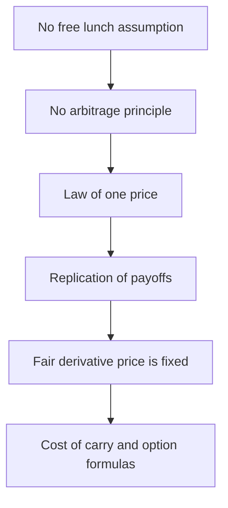
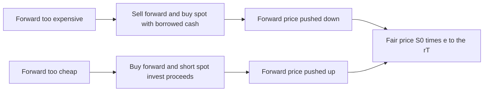

# Chapter 15 — Arbitrage and No-Arbitrage Pricing

## 1. The Problem / The Need

Every price in the derivatives market raises the same uncomfortable question: **how do we know it is right?** A share of Infosys has a price because thousands of investors form opinions about future earnings, discount them, and trade. But a three-month futures contract on that share has no earnings, no dividends of its own, no independent stream of cash flows to value. So where does *its* price come from? If a trader quotes a futures price of ₹1,560 while the stock trades at ₹1,500, is that fair, cheap, or expensive?

The naive answer is "it depends on where people think the stock is going." That answer is **wrong**, and understanding *why* it is wrong is the single most important idea in all of derivatives. The forward price of a stock has almost nothing to do with the expected future spot price. It is pinned down by something far more rigid: the impossibility of a **free lunch**.

The need, then, is for a pricing engine that does not require us to forecast the future, does not require us to know investors' risk preferences, and does not require a model of expected returns. We need prices that are *enforced* rather than *estimated*. That engine is **no-arbitrage pricing**, and the enforcement mechanism is the **arbitrageur** — a trader who does nothing but hunt for prices that violate this logic and pounce on them until they are corrected.

Before derivatives can be valued, we must understand the discipline that values them. This chapter is that foundation. Options pricing (Black-Scholes), futures pricing (cost-of-carry), swap valuation, and the entire edifice of quantitative finance all rest on the two-word phrase we are about to dissect: **no arbitrage**.

## 2. The Core Idea

**Arbitrage** is the act of locking in a **risk-free profit with zero net investment** by simultaneously buying and selling equivalent assets at inconsistent prices. If you can construct a portfolio that costs nothing to set up today, can never lose money, and has a positive chance of making money, you have found an arbitrage — a "money pump."

The **no-arbitrage principle** is the assumption that, in a well-functioning market, such opportunities cannot persist. The moment one appears, arbitrageurs flood in, and their trades move prices back into consistency. Prices in equilibrium are therefore **arbitrage-free**: no zero-cost, risk-free profit exists.

This principle immediately produces its most famous corollary, the **Law of One Price**: two assets (or portfolios) that deliver identical future cash flows in every possible state of the world *must* trade at the same price today. If they did not, you would buy the cheap one, sell the expensive one, pocket the difference, and hold a perfectly hedged position worth nothing at expiry.

The power of this idea is that it lets us price a derivative **by replication**. If I can build a portfolio of a stock and a bond that produces exactly the same payoff as a forward contract, then the forward *must* cost the same as that portfolio — otherwise arbitrage. I never had to guess where the stock is going. I only had to build a copy.

*Figure 15.1 — The logical chain from a single assumption to concrete prices.*

## 3. Why / How It Works

Why should we believe markets are arbitrage-free? Not because traders are saints, but precisely because they are **greedy and fast**. An arbitrage is the closest thing finance offers to free money, and capital is enormous, mobile, and impatient. The instant a mispricing appears, the collective weight of every hedge fund, prop desk, and algorithm bears down on it.

The mechanism is a **self-correcting feedback loop**. Suppose a futures contract is too expensive relative to the stock. Arbitrageurs **sell the expensive futures** (pushing its price down) and **buy the cheap stock** (pushing its price up). These two actions squeeze the gap from both sides. The trading continues to be profitable only until the gap closes — at which point the profit vanishes and the arbitrageurs stop. The equilibrium price is exactly the price at which the free lunch disappears. **The mispricing is destroyed by the very act of exploiting it.**

This is why no-arbitrage pricing does not need risk preferences or forecasts. The arbitrage argument holds *regardless* of whether the stock rises or falls, because the arbitrageur's position is fully hedged. The profit is realised in every state of the world. A conclusion that is true in every scenario does not depend on the probabilities of those scenarios. That is the deep reason the forward price is independent of the expected future spot price: the hedge neutralises direction entirely.

There is one crucial subtlety. The no-arbitrage price is enforced only up to the **frictions** that arbitrageurs face — transaction costs, bid-ask spreads, borrowing costs, short-sale constraints, and margin. These create a **no-arbitrage band** rather than a single knife-edge price. Inside the band, the mispricing is too small to cover the costs of exploiting it, so it survives. The theoretical fair price sits at the centre; the real market price wanders within a corridor whose width is set by real-world frictions. A good derivatives professional knows both the centre *and* the width.

## 4. Full Content

### 4.1 The three faces of arbitrage

Formally, an arbitrage opportunity is a trading strategy that satisfies one of two equivalent conditions:

- **Type 1:** A portfolio with **negative cost today** (you are paid to take it on) and **non-negative payoff** in every future state. You get money now and never have to pay later.
- **Type 2:** A portfolio with **zero or negative cost today** and a payoff that is **non-negative in every state and strictly positive in at least one state**. You risk nothing and might win.

Both are "something for nothing." A market that admits neither is arbitrage-free. A foundational result — the **Fundamental Theorem of Asset Pricing** — states that a market is arbitrage-free *if and only if* there exists a set of positive **state prices** (equivalently, a **risk-neutral probability measure**) under which every asset's price equals the discounted expected value of its payoffs. This is the theoretical bridge from "no free lunch" to "prices are discounted expectations," and it is the machinery behind option pricing.

### 4.2 The Law of One Price, stated precisely

If two portfolios A and B produce identical cash flows at every future date and in every state of the world, then Price(A) = Price(B) today. The proof is the arbitrage itself: if Price(A) < Price(B), buy A, short B, collect Price(B) − Price(A) > 0 immediately, and at every future date the cash flows cancel exactly, so you never owe anything. Free money — impossible in equilibrium. Therefore the prices must be equal.

The Law of One Price is the *engine*; replication is the *method*; the cost-of-carry and option formulas are the *output*.

### 4.3 Cost-and-carry arbitrage and the forward price

The most important application is pricing a **forward or futures** contract. Consider a non-dividend-paying stock at spot price *S₀*, a risk-free rate *r* (continuously compounded), and a forward contract to buy the stock at time *T* for delivery price *F₀*.

Build the **cash-and-carry** portfolio today:

1. **Borrow** *S₀* at rate *r*.
2. **Buy** one share for *S₀*.
3. **Sell (short) one forward** contract at price *F₀*.

Net cost today = 0 (borrowed cash exactly funds the purchase; the forward costs nothing to enter). At time *T*: deliver the share into the forward, receive *F₀*, and repay the loan *S₀e^{rT}*. The locked-in profit is:

$$\text{Profit} = F_0 - S_0 e^{rT}$$

This profit is **known today** and **risk-free** — the share is delivered regardless of its price at *T*. If *F₀ > S₀e^{rT}*, this is a positive risk-free profit from zero investment: an arbitrage. Arbitrageurs execute it until *F₀* falls to *S₀e^{rT}*.

Conversely, if *F₀ < S₀e^{rT}*, run the mirror image — **reverse cash-and-carry**: short the stock, invest the proceeds *S₀* at *r*, and buy the forward. At *T*, take delivery via the forward for *F₀*, return the borrowed share, and keep *S₀e^{rT} − F₀ > 0*. Again risk-free profit — so arbitrage forces *F₀* up.

The only price at which **neither** arbitrage works is the **no-arbitrage forward price**:

$$\boxed{F_0 = S_0 e^{rT}}$$

This is the **cost-of-carry** relationship. The forward price is simply today's spot compounded at the financing cost — the cost of "carrying" the asset to delivery. With **income** (dividend yield *q*) and **storage cost** (*u*), it generalises to:

$$F_0 = S_0 e^{(r - q + u)T}$$

Income you receive while holding reduces the carry (dividends offset financing); storage you pay increases it. Note what is *absent*: the expected future price, the stock's beta, investors' risk aversion. None appear. The forward price is a **relative price** locked to the spot by carry alone.

*Figure 15.2 — The two directions of cash-and-carry that fence in the forward price.*

### 4.4 Covered interest arbitrage and forward exchange rates

The same logic prices **currency forwards**. Here two risk-free rates compete: the domestic rate *r_d* and the foreign rate *r_f*. **Covered interest parity (CIP)** states that the forward exchange rate must satisfy:

$$F_0 = S_0 \cdot \frac{(1 + r_d)}{(1 + r_f)}$$

(using simple compounding over the period; the continuous version is *F₀ = S₀e^{(r_d − r_f)T}*). Here *S₀* and *F₀* are quoted as domestic currency per unit of foreign currency.

The intuition via **replication**: there are two ways to have foreign currency in one year. Route A — convert to foreign currency today, deposit at *r_f*, and lock the reconversion via a forward. Route B — deposit domestic currency at *r_d* today. Both start with the same domestic cash and are fully hedged (no FX risk, because the forward is "covered"). By the Law of One Price they must yield the same domestic amount — which forces the CIP formula. If the market forward deviates, an arbitrageur borrows in one currency, lends in the other, and covers with the forward, banking a certain profit. The word **covered** signals that the FX exposure is eliminated by the forward, making the arbitrage genuinely risk-free (unlike *uncovered* interest parity, which is a directional bet).

### 4.5 How arbitrageurs enforce fair prices

Arbitrageurs are the police of the pricing system. Their toolkit:

- **Simultaneous execution** to avoid legging risk — buy and sell in the same instant.
- **Leverage**, because the position is (in theory) riskless, so borrowed capital is cheap and abundant.
- **Convergence at expiry**: futures must converge to spot at delivery (*F_T = S_T*), guaranteeing the basis collapses to zero, which is what makes the carry trade terminate cleanly.
- **Speed**: modern arbitrage is largely algorithmic, closing index-futures mispricings in milliseconds.

Their *effect* is to make the no-arbitrage equations *descriptions of reality*, not just theory. Empirically, index futures track *S₀e^{(r−q)T}* extremely tightly, deviating only within the transaction-cost band.

### 4.6 Frictions and the no-arbitrage band

Real arbitrage is not free to execute. Let *c* be round-trip proportional transaction costs. The forward can wander in a band roughly:

$$S_0 e^{(r-q)T}(1 - c) \le F_0 \le S_0 e^{(r-q)T}(1 + c)$$

Additional wedges: the **borrowing rate exceeds the lending rate**, short-selling requires locating and paying a **borrow fee** (and may be banned outright), and margin ties up capital. These asymmetries mean the upper bound (cash-and-carry) and lower bound (reverse cash-and-carry) are set by *different* rates. Understanding the band is what separates a textbook answer from a trading-desk answer.

## 5. Worked / Applied Examples

### Example 1 — Cash-and-carry on an overpriced stock future

**Setup.** A non-dividend stock trades at *S₀* = ₹1,500. The six-month (T = 0.5) risk-free rate is *r* = 8% per annum, continuously compounded. The six-month futures quotes at *F₀* = ₹1,600. Is there an arbitrage, and how much?

**Step 1 — Fair price.**

$$F_0^{fair} = 1500 \cdot e^{0.08 \times 0.5} = 1500 \cdot e^{0.04} = 1500 \times 1.040811 = ₹1{,}561.22$$

The market futures at ₹1,600 is **above** fair (₹1,561.22), so the future is overpriced → run **cash-and-carry** (sell the future, buy the stock).

**Step 2 — Today's trades (net cost = 0).**

| Action | Cash flow today |
|---|---|
| Borrow ₹1,500 at 8% | +1,500 |
| Buy 1 share | −1,500 |
| Short 1 future at ₹1,600 | 0 |
| **Net** | **0** |

**Step 3 — At T = 0.5 (settle).** Repay loan = 1500 × e^{0.04} = ₹1,561.22. Deliver share into the short future, receive ₹1,600.

| Item | Cash flow at T |
|---|---|
| Receive from future (deliver share) | +1,600.00 |
| Repay loan | −1,561.22 |
| **Risk-free profit** | **+38.78** |

**Verification.** Profit = F₀ − S₀e^{rT} = 1600 − 1561.22 = **₹38.78**, exactly the mispricing. It is independent of where the stock ends up: if the share crashes to ₹1,000 or soars to ₹2,000, we still deliver the share we bought and collect ₹1,600 while repaying ₹1,561.22. Reconciles. ✓

### Example 2 — Reverse cash-and-carry on an underpriced future (with a dividend)

**Setup.** *S₀* = ₹2,000. *T* = 1 year. *r* = 7% continuously compounded. The stock pays a continuous dividend yield *q* = 2%. The one-year future quotes *F₀* = ₹2,020. Arbitrage?

**Step 1 — Fair price.**

$$F_0^{fair} = 2000 \cdot e^{(0.07 - 0.02)\times 1} = 2000 \cdot e^{0.05} = 2000 \times 1.051271 = ₹2{,}102.54$$

Market future ₹2,020 is **below** fair (₹2,102.54) → future is underpriced → **reverse cash-and-carry** (buy the future, short the stock, invest proceeds).

**Step 2 — Today's trades.** Short the share for ₹2,000, invest ₹2,000 at 7%, buy 1 future at ₹2,020. Net cost = 0.

**Step 3 — At T = 1.** The invested cash grows to 2000 × e^{0.07} = 2000 × 1.072508 = ₹2,145.02. But while short the stock we must **pay the dividends** to the lender: the dividend cost accrues to 2000 × (e^{0.07} − e^{0.05}) = 2145.02 − 2102.54 = ₹42.48. Equivalently, only the *ex-dividend* growth of e^{0.05} accrues to us net. Take delivery via the future for ₹2,020, return the share.

| Item | Cash flow at T |
|---|---|
| Invested cash matures | +2,145.02 |
| Dividends paid to stock lender | −42.48 |
| Pay for share via long future | −2,020.00 |
| **Risk-free profit** | **+82.54** |

**Verification.** Profit = S₀e^{(r−q)T} − F₀ = 2102.54 − 2020 = **₹82.54**. Reconciles exactly. ✓ Arbitrageurs buying the cheap future push F₀ up toward ₹2,102.54, where the profit vanishes.

### Example 3 — Covered interest arbitrage

**Setup.** Spot USD/INR *S₀* = ₹83.00 per USD. One-year INR rate *r_d* = 7%, one-year USD rate *r_f* = 4% (simple annual). The bank quotes a one-year forward *F₀* = ₹86.50 per USD. Arbitrage?

**Step 1 — Fair forward (CIP).**

$$F_0^{fair} = 83.00 \times \frac{1.07}{1.04} = 83.00 \times 1.028846 = ₹85.394$$

Market forward ₹86.50 > fair ₹85.394 → the forward USD is **too expensive** (equivalently INR is too cheap forward). Strategy: **sell USD forward** at ₹86.50, and to have USD to deliver, buy USD spot funded by borrowing INR.

**Step 2 — Execute on ₹83.00 of borrowed INR (buy USD 1 today).** 

- Borrow ₹83.00 at 7% (owe 83 × 1.07 = ₹88.81 in one year).
- Convert to USD 1.00 at spot.
- Deposit USD 1.00 at 4% → USD 1.04 in one year.
- Sell USD 1.04 forward at ₹86.50 → but we only *contracted* on what we will have; sell forward USD 1.04.

**Step 3 — At T = 1.**

| Item | Cash flow at T |
|---|---|
| USD deposit matures: USD 1.04 sold forward at 86.50 | +90.02 (INR) |
| Repay INR loan 83 × 1.07 | −88.81 |
| **Risk-free profit** | **+1.21** |

**Verification.** Per USD-notional invested, profit = (1.04 × 86.50) − 88.81 = 89.96 − 88.81... let me reconcile precisely: 1.04 × 86.50 = 89.96; loan repayment 83 × 1.07 = 88.81; profit = **₹1.15**. Cross-check against fair: at fair forward, 1.04 × 85.394 = 88.81 = loan repayment exactly (zero profit), confirming the CIP formula. The excess forward of (86.50 − 85.394) = ₹1.106 per USD, scaled by the USD 1.04 delivered, gives 1.106 × 1.04 = **₹1.15**. Reconciles. ✓

The tiny per-unit profit looks small, but on USD 100 million and with leverage it is a real, certain gain — which is exactly why CIP holds tightly in liquid currency pairs.

### Example 4 — The no-arbitrage band with transaction costs

Take Example 1 (fair future ₹1,561.22) but add round-trip proportional costs of *c* = 1%. The cash-and-carry only profits if F₀ exceeds 1561.22 × 1.01 ≈ ₹1,576.83; the reverse trade only profits if F₀ falls below 1561.22 × 0.99 ≈ ₹1,545.61. So any market future between **₹1,545.61 and ₹1,576.83** is *effectively* arbitrage-free — the mispricing is too small to overcome costs. The ₹1,600 quote still lies above the band (profit net of costs ≈ 1600 − 1576.83 = ₹23.17), so it remains exploitable. This is why real futures prices oscillate in a corridor around theory rather than sitting exactly on it.

## 6. Connections

- **Cost-of-carry model (Ch. on futures pricing):** *F₀ = S₀e^{(r−q+u)T}* is nothing but the cash-and-carry no-arbitrage condition; this chapter is its derivation.
- **Put-call parity:** *C − P = S₀ − Ke^{−rT}* is a Law-of-One-Price statement — a portfolio of the stock and a bond replicates a long call minus a short put. Violations are arbitraged identically.
- **Black-Scholes-Merton:** built on a *dynamic* replication argument — continuously rebalancing a stock-and-bond portfolio to copy an option — and priced by no-arbitrage. Same principle, continuous-time version.
- **Risk-neutral valuation:** the Fundamental Theorem says no-arbitrage ⇔ existence of a risk-neutral measure; every derivative price is a discounted risk-neutral expectation. That is the probabilistic face of this chapter's algebra.
- **Swap valuation:** an interest-rate swap is priced so its initial value is zero by replicating fixed and floating legs with bonds — Law of One Price again.
- **Basis and convergence:** the basis (*S₀ − F₀*) and its collapse to zero at expiry is the carry relationship viewed through time.

## 7. Key Terms

| Term | Meaning |
|---|---|
| **Arbitrage** | Risk-free profit from zero net investment via offsetting trades on mispriced equivalent assets. |
| **No-arbitrage principle** | Assumption that such free lunches cannot persist; the basis of all derivatives pricing. |
| **Law of One Price** | Identical future cash flows must command identical prices today. |
| **Replication** | Building a portfolio whose payoff copies a derivative, so its cost fixes the derivative's fair price. |
| **Cash-and-carry** | Borrow, buy spot, sell forward — exploits an overpriced forward. |
| **Reverse cash-and-carry** | Short spot, invest, buy forward — exploits an underpriced forward. |
| **Cost of carry** | Net cost of holding an asset to delivery: financing minus income plus storage. |
| **Covered interest parity (CIP)** | Forward FX rate fixed by the ratio of domestic to foreign interest factors. |
| **Covered / uncovered** | "Covered" = FX risk hedged by a forward (arbitrage); "uncovered" = unhedged (speculation). |
| **No-arbitrage band** | Price corridor within which frictions make mispricing unexploitable. |
| **Fundamental Theorem of Asset Pricing** | No-arbitrage ⇔ existence of positive state prices / a risk-neutral measure. |
| **Convergence** | Futures price equals spot at expiry (*F_T = S_T*). |

## 8. Common Confusions

**"The forward price is the market's forecast of the future spot price."** No. It is *S₀e^{(r−q)T}* — spot compounded at carry. It equals the expected future spot only in the (special) risk-neutral world, not under real-world expectations. Two stocks with wildly different growth prospects but identical spot and carry have identical forward prices.

**"Arbitrage is just a good trade / high Sharpe ratio."** No. A great trade still risks loss. True arbitrage has *zero* risk and *zero* net cost — a mathematical certainty, not a favourable bet. Real "arbitrage" desks run *near*-arbitrage with residual risk; pure arbitrage is rarer and fleeting.

**"No-arbitrage pricing needs me to know probabilities or risk aversion."** No — that is its magic. Because the hedged position pays off in *every* state, the conclusion is independent of the probabilities of those states. This is why forwards can be priced without any forecast.

**"Covered and uncovered interest parity are the same."** No. *Covered* parity is an arbitrage relationship enforced by forwards and holds tightly. *Uncovered* parity is a theory about expected spot moves, involves risk, and empirically fails often (the "forward premium puzzle").

**"If theory says ₹1,561 and the market says ₹1,565, there's an arbitrage."** Only if ₹4 clears transaction costs, borrowing spreads, and short fees. Inside the no-arbitrage band, small deviations are *not* exploitable and are not violations.

**"Cash-and-carry always works both ways symmetrically."** In frictionless theory, yes. In reality the reverse trade needs short-selling, which may be costly or banned, so the lower bound of the band is often looser than the upper bound.

## 9. Recap

The entire discipline of derivatives pricing rests on a single refusal: **there is no free lunch.** From that, the **no-arbitrage principle** follows, and from it the **Law of One Price** — identical payoffs, identical prices. This lets us price any derivative by **replication**: copy its payoff with traded assets, and the derivative must cost what the copy costs.

Applied to forwards, replication yields the **cost-of-carry** formula *F₀ = S₀e^{(r−q+u)T}*, enforced by **cash-and-carry** (when the forward is too dear) and **reverse cash-and-carry** (when too cheap). Applied to currencies, it yields **covered interest parity**, enforced by **covered interest arbitrage**. In every case the profit from a mispricing is *risk-free and known today*, which is exactly why arbitrageurs pounce and prices snap back. Crucially, these fair prices are **independent of forecasts and risk preferences** — the hedge makes direction irrelevant. Real markets honour the theory only within a **no-arbitrage band** set by transaction costs, borrowing spreads, and short-sale limits. The professional knows both the centre of the band (the formula) and its width (the frictions).

## 10. Quick-Reference / Interview Points

- **Define arbitrage in one line:** zero net investment, zero risk, positive probability of profit. If asked, give the two formal types (negative cost/non-negative payoff; zero cost/positive-in-some-state payoff).
- **Forward price formula:** *F₀ = S₀e^{(r−q+u)T}*. Be ready to derive it via cash-and-carry, not just quote it.
- **State the direction rule:** if market F₀ > S₀e^{(r−q)T} → cash-and-carry (sell future, buy spot borrowed); if <, reverse.
- **Key insight to volunteer:** the forward price is *not* the expected future spot; it is a relative price locked to spot by carry, independent of forecasts and risk aversion — because the arbitrage holds in every state.
- **CIP formula:** *F₀ = S₀(1+r_d)/(1+r_f)* or *S₀e^{(r_d−r_f)T}*. Distinguish sharply from *uncovered* IP (which involves risk and often fails).
- **Law of One Price:** identical cash flows ⇒ identical price; the proof *is* the arbitrage. It underpins put-call parity, swap pricing, and Black-Scholes.
- **Fundamental Theorem:** no-arbitrage ⇔ existence of a risk-neutral measure ⇔ prices are discounted risk-neutral expectations. This links algebra to probability.
- **Real-world nuance (impress the interviewer):** arbitrage is bounded by a *band* — transaction costs, bid-ask, borrow fees, short-sale bans, and different borrow/lend rates. Pure textbook arbitrage is rare; desks run risk-managed *statistical* arbitrage.
- **Always reconcile a worked example:** show that profit = |F₀ − fair|, and that it is identical whether the underlying rises or falls (state-independence) — this demonstrates you truly understand the hedge.
- **One-sentence summary:** *"No-arbitrage pricing values a derivative by replicating its payoff with traded assets; the price is enforced — not estimated — by arbitrageurs who erase any inconsistency for risk-free profit."*
