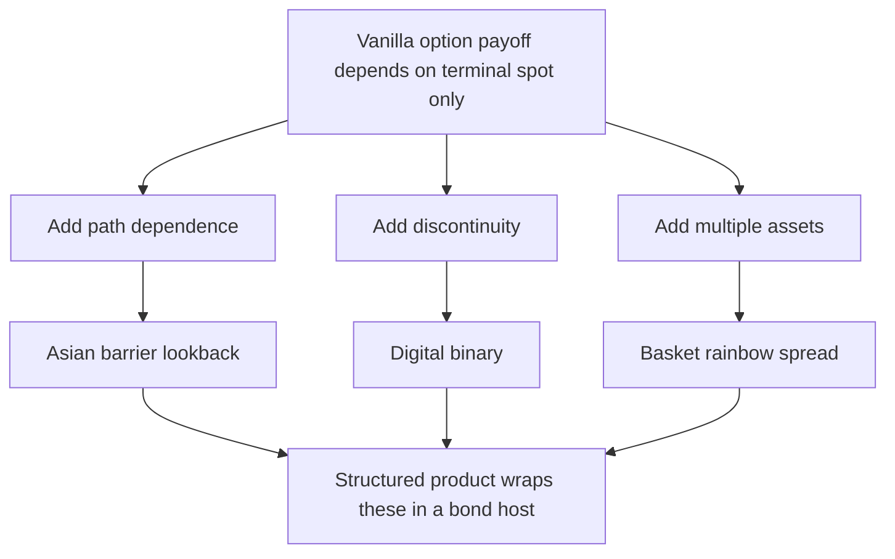
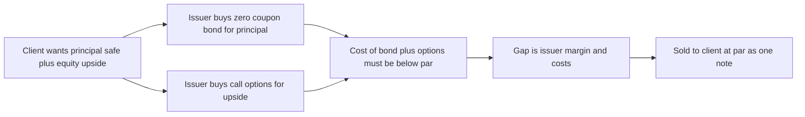
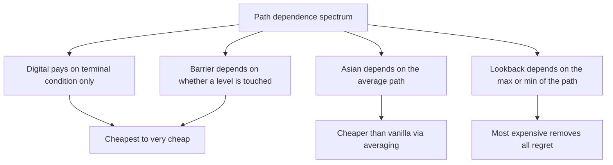
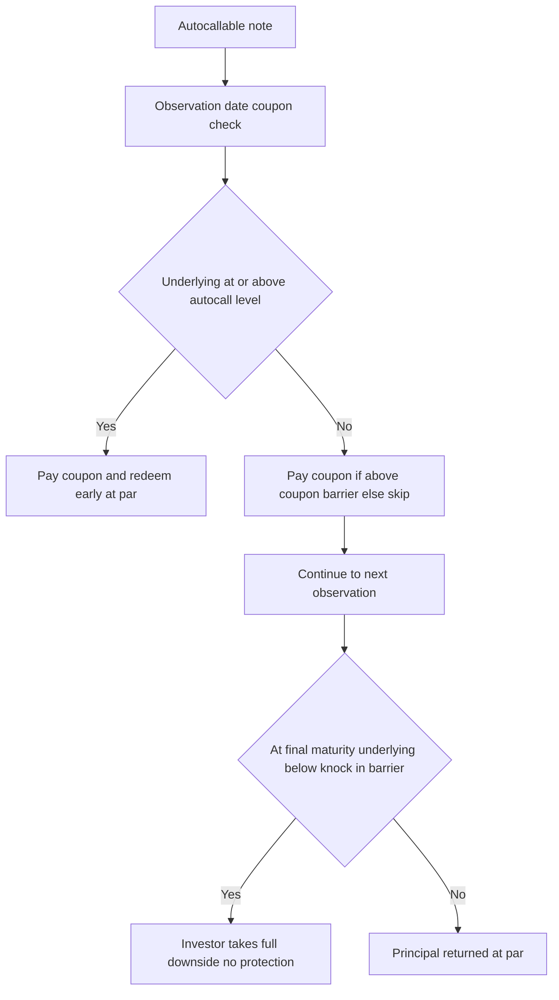

# Chapter 16 — Exotic Options and Structured Products

## 1. The Problem / Need

A vanilla call or put is a beautifully general instrument, but generality is expensive and imprecise. Two frictions push the market beyond plain vanilla.

**Frictions on the buyer side.** Suppose a corporate treasurer wants to protect against the *average* USD/INR rate over the next quarter, because the company converts export receipts steadily every day — not on one settlement date. A standard European option pays off only on the terminal spot, which may be an outlier day that has nothing to do with the treasurer's realised conversion. Paying a full vanilla premium to hedge a risk you don't actually run is waste. The treasurer needs a payoff *indexed to the average*, and would happily accept a cheaper option that does exactly that.

Or take a hedge-fund manager who is confident a stock will not breach a level. She wants downside protection but resents paying for scenarios she considers impossible. If she could *give up* protection in those "impossible" states, she should be able to buy the same insurance for less. That is a **barrier option** — protection that switches off (or on) if a level is touched.

**Frictions on the seller / issuer side.** A retail bank knows its clients are frightened of losing principal but greedy for equity upside. Neither a bond nor a stock alone satisfies them. The bank can *manufacture* a payoff — "your money back, plus a share of the Nifty's rise" — by combining a zero-coupon bond with an option. This manufactured payoff is a **structured product**. It exists because the bank can assemble derivatives more cheaply and precisely than the client ever could, and can package the result as a single, simple-looking note.

So the need is twofold: (i) **tailored payoffs** that match a specific risk exposure or view more tightly than a vanilla, usually at lower cost; and (ii) **repackaged risk** that lets an institution sell a familiar-looking wrapper (a "note", a "deposit") whose engine is a portfolio of options. Exotic options are the building blocks; structured products are the assembled machines. The catch — and this chapter's spine — is that every gain in cheapness or customisation is *paid for* by a subtler, often hidden, risk profile.

## 2. Core Idea

An **exotic option** is any option whose payoff depends on more than the terminal price of a single underlying at a single date. The dependence can be on:

- **the path** the underlying took (Asian, barrier, lookback) — *path-dependent*;
- **a discontinuous rule** (digital / binary — pays a fixed lump if a condition holds);
- **multiple underlyings** (basket, rainbow, spread);
- **the option holder's own past decisions** (Bermudan, chooser, compound).

A **structured product** is a pre-packaged security — legally a bond or a note — whose return is engineered by embedding one or more (often exotic) options inside a fixed-income host. The investor buys one ISIN; inside it sits a **static replication**: *host bond + long/short options*.

The single most important mental model for this whole chapter:

> **Decompose. Every structured product = a bond you can price + a bundle of options you can price. The "product" is just the sum, wrapped in marketing.**

If you can strip a note into its bond and option legs and price each, you understand the note — including how much margin the issuer baked in, and which market moves hurt you.

*Figure 1 — Exotics extend the vanilla payoff along three axes and then get wrapped into structured products.*

## 3. Why / How It Works

Three mechanisms explain why exotics are cheaper or more useful, and why structured products can be manufactured at all.

**(a) Removing states you don't value makes an option cheaper.** An option's premium is the discounted risk-neutral expectation of its payoff. If you *carve out* payoff in some states — e.g. "this call pays nothing if spot ever touches 120" (an up-and-out call) — you have strictly reduced the payoff in every path, so the premium must fall. Nothing is free: you gave up the payoff in exactly those knocked-out paths. The **knock-out call + knock-in call with identical terms = a vanilla call** (in-out parity), because between them they cover all paths. This parity is the cleanest proof that exotics are re-slicings of vanilla value, not new money.

**(b) Averaging kills volatility.** The variance of an average of correlated observations is lower than the variance of a single observation. An Asian option's payoff is driven by the *average* price, whose distribution is tighter than the terminal price's. Lower effective volatility → lower option value. That is precisely why the treasurer's average-rate hedge is cheaper than a strip of vanillas — and why it hedges her averaged exposure better.

**(c) Put-call and static replication let issuers build anything.** By combining bonds (which give principal) with long calls (upside) and short options (to fund the calls), an issuer can shape almost any terminal payoff profile. The art is that the *cost* of the option package must be less than the discount on the zero-coupon bond, so the whole thing can be sold at par. We'll see the arithmetic in §5.

*Figure 2 — The manufacturing logic of a capital-protected note.*

## 4. Full Content

### 4.1 Barrier options

A **barrier option** is a vanilla option that is either activated (**knock-in**) or extinguished (**knock-out**) when the underlying touches a pre-set **barrier** level during the life of the option. Four base types multiply across call/put:

| Type | Barrier vs spot | Behaviour |
|---|---|---|
| Up-and-out | Barrier above | Dies if spot rises to barrier |
| Down-and-out | Barrier below | Dies if spot falls to barrier |
| Up-and-in | Barrier above | Activates only if spot rises to barrier |
| Down-and-in | Barrier below | Activates only if spot falls to barrier |

**In-out parity:** knock-in + knock-out (same strike, barrier, maturity) = vanilla. So a down-and-in put + down-and-out put = a vanilla put.

Barriers are cheaper than vanillas because a portion of payoff states is removed. Their defining hazard is **discontinuity near the barrier**: an up-and-out call that is deep in the money is worth a lot one tick below the barrier and *zero* the instant the barrier is touched. This makes the **delta explode and even flip sign** near the barrier and near expiry — a nightmare to hedge, and the reason barrier options carry wide bid-ask spreads. **Rebates** (a small cash consolation paid on knock-out) are often attached to soften the cliff.

### 4.2 Asian (average) options

An **Asian option** settles on the **average** of the underlying over a set of observation dates, rather than the terminal price. Two flavours:

- **Average-price (average-rate):** payoff = max(Average − K, 0) for a call. The average replaces spot.
- **Average-strike:** payoff = max(S_T − Average, 0). The average replaces the strike.

Averaging can be **arithmetic** (the market standard) or **geometric** (has a closed-form Black-Scholes-style solution because the geometric average of lognormals is lognormal). Arithmetic Asians have **no simple closed form** and are usually priced by Monte Carlo or by analytic approximations (e.g. Turnbull-Wakeman, Levy).

Why they exist: (i) they match exposures that accrue over time (commodity purchases, FX conversion, dollar-cost-averaged flows); (ii) averaging **suppresses terminal-date manipulation** ("marking the close"); and (iii) they are **cheaper** because the average has lower variance than the terminal price. Asians are the workhorse of commodity and FX hedging desks.

### 4.3 Digital / binary options

A **digital** (or **binary**, or **cash-or-nothing**) option pays a **fixed amount** if a condition is met at expiry, and nothing otherwise. A cash-or-nothing call pays Q if S_T > K, else 0. An **asset-or-nothing** call pays S_T if S_T > K, else 0. (Note: vanilla call = asset-or-nothing call − K × cash-or-nothing call.)

The payoff is a **step function**, so the risk is concentrated exactly at the strike right before expiry: the delta is a spike (approaching a Dirac impulse) around K. Traders can't hedge a step cleanly, so they **super-replicate** with a tight **call spread** — long a call at K−ε, short a call at K+ε, scaled — which pays the notional over that narrow band. The width ε is the hedger's cushion; the tighter the digital, the more it costs to hedge and the wider the quoted spread.

Digitals are the atoms of many structured products: an autocallable's coupon is, in effect, a strip of digitals ("pay X% if index above level").

### 4.4 Lookback options

A **lookback option** lets the holder settle against the **most favourable** price over the option's life — it "looks back" and picks the best.

- **Floating-strike lookback call:** payoff = S_T − min(S) over the period. You effectively **buy at the lowest price seen**.
- **Fixed-strike lookback call:** payoff = max(S) − K. You effectively **sell at the highest price seen**.

Lookbacks eliminate regret — you always transact at the optimum — so they are the **most expensive** exotics, often 2-3× the vanilla premium. They rarely appear in retail products because their cost is prohibitive; they show up in bespoke institutional trades and as teaching examples of extreme path dependence.

*Figure 3 — Ranking exotics by how much of the path they use and what that does to price.*

### 4.5 Other exotics worth naming

- **Bermudan option:** exercisable on a set of discrete dates (between European and American). Common in interest-rate swaptions.
- **Chooser option:** holder decides later whether it's a call or a put.
- **Compound option:** an option on an option (e.g. a call on a call).
- **Basket / rainbow:** payoff on a portfolio or on the best/worst of several assets; correlation is a first-order risk driver.
- **Cliquet (ratchet):** a series of forward-starting options that lock in gains periodically; the engine inside many "ratchet" notes.

### 4.6 Structured products

A **structured product** is a debt security whose payoff is engineered via embedded derivatives. The universal anatomy:

**Structured note = zero-coupon bond (the host) + option package (the engine).**

The zero-coupon bond, bought at a discount to par, grows back to par at maturity — this is what provides **capital protection**. The discount saved (par − bond cost) is the **option budget**. The issuer spends that budget on options to shape the upside, keeping a margin.

**Common families:**

1. **Capital-Protected Note (CPN) / Principal-Protected Note (PPN):** Return of principal at maturity plus a **participation** in an index's upside. Engine = zero-coupon bond + long call(s). The **participation rate** = (option budget) / (cost of one unit of the call). Low rates or high vol shrink participation.

2. **Autocallable:** Pays a periodic coupon and **automatically redeems early** ("autocalls") if the underlying is at/above a level on an observation date. Downside protection is usually **conditional** via a **barrier** — you get principal back *unless* the underlying is below a knock-in level at maturity, in which case you take the full downside. Engine = short a **down-and-in put** (the source of the enhanced coupon) + a strip of **digitals** (the coupons) + autocall trigger. The investor is effectively **selling insurance** and pocketing the premium as coupon.

3. **Reverse convertible / Equity-linked note:** High fixed coupon, but principal converts into shares if the stock falls below a level. Engine = bond + **short put**. Classic yield enhancement = selling a put.

4. **Range accrual / ratchet / market-linked CD:** coupons accrue based on an index staying in a range (strip of digitals) or lock in gains periodically (cliquet).

*Figure 4 — Cash-flow decision tree of a typical autocallable.*

### 4.7 Embedded derivatives

An **embedded derivative** is a derivative-like feature *inside* a host contract that is not itself a standalone derivative — a convertible bond's conversion option, a callable bond's call feature, an inflation-linked coupon, a loan with an interest-rate cap. Accounting standards (IFRS 9 / Ind AS 109) ask whether the embedded feature is **"closely related"** to the host. If it is *not* closely related (e.g. an equity conversion option inside a debt host), older rules required **bifurcation** — measuring the derivative separately at fair value. IFRS 9 changed the treatment for *financial-asset* hosts (the whole instrument is classified together based on cash-flow characteristics), but bifurcation still applies to **financial-liability** and **non-financial** hosts. The practical point for an analyst: **structured products are dense with embedded derivatives, and their fair value and risk live in those embedded options, not in the bond wrapper.** A convertible bond, for instance, is a straight bond + a long equity call held by the investor.

## 5. Worked / Applied Examples

### Example 1 — Barrier vs vanilla, and in-out parity

A stock trades at S₀ = 100. A 1-year vanilla call struck at K = 100 costs **₹8.00**. An **up-and-out call**, same strike, with barrier H = 130, costs **₹5.20**. The matching **up-and-in call** (K = 100, H = 130) costs **₹2.80**.

**Check in-out parity:** up-and-out + up-and-in should equal the vanilla.

| Component | Premium (₹) |
|---|---|
| Up-and-out call (K 100, H 130) | 5.20 |
| Up-and-in call (K 100, H 130) | 2.80 |
| **Sum** | **8.00** |
| Vanilla call (K 100) | 8.00 |

They reconcile: 5.20 + 2.80 = 8.00. ✔

**Interpretation.** The barrier splits the vanilla's ₹8.00 into two mutually exclusive worlds. The up-and-out captures value only in paths that *never* reach 130; the up-and-in captures value only in paths that *do*. The knock-out is cheaper (₹5.20 < ₹8.00) precisely because it forfeits the deep-in-the-money paths where the stock ran to and past 130. A bull who is convinced the stock rises *moderately* but not explosively buys the up-and-out and saves ₹2.80 (35% of premium). If she's wrong and the stock spikes through 130, she gets *nothing* — the hidden risk of the discount.

### Example 2 — Asian call priced by Monte Carlo, and why it beats a vanilla

Underlying S₀ = 100, risk-free r = 5%, volatility σ = 30%, maturity T = 1 year, strike K = 100. Averaging is monthly (12 observations). Under risk-neutral geometric Brownian motion we simulate paths and average.

Representative results (large simulation):

| Option | Payoff basis | Effective volatility | Premium (₹) |
|---|---|---|---|
| Vanilla European call | Terminal S_T | 30% | 14.23 |
| Arithmetic Asian call | Avg of 12 monthly prices | ~17% | 8.10 |
| Geometric Asian call (closed form) | Geometric avg | ~17% | 7.95 |

**Why the Asian is cheaper — the reconciling logic.** The average of 12 monthly prices has a *much lower variance* than the single terminal price. The variance of an average of n roughly-equally-weighted, positively correlated observations scales down toward σ²·(≈ (2n+1)/6n) of the terminal variance for a Brownian path. With monthly sampling that pulls the effective volatility from 30% to roughly 17%. Lower vol → lower call value. The Asian at ₹8.10 costs **57% of the vanilla's ₹14.23** — a large saving for a treasurer whose real exposure *is* the monthly average conversion rate. The geometric version (₹7.95) sits just below the arithmetic (Jensen's inequality: geometric mean ≤ arithmetic mean, so a geometric-average call pays slightly less), and it has a closed form, which is why it's used as a **control variate** to speed up the arithmetic Monte Carlo.

### Example 3 — Capital-protected note, fully decomposed

A bank issues a 5-year **Nifty-linked capital-protected note** at par of ₹1,000, promising: *100% of principal back at maturity, plus 60% participation in any Nifty gain over 5 years.* The 5-year risk-free rate is 6% (continuously compounded). An at-the-money 5-year call on the Nifty (notional matched to ₹1,000) costs **₹150** per note.

**Step 1 — Cost of the capital-protection leg (the zero-coupon bond).**
Present value of ₹1,000 in 5 years = 1000 × e^(−0.06×5) = 1000 × e^(−0.30) = 1000 × 0.7408 = **₹740.80**.

**Step 2 — Option budget.**
Money left after buying the bond = 1000 − 740.80 = **₹259.20**.

**Step 3 — What participation can that budget buy?**
Each unit of ATM call costs ₹150 (per ₹1,000 notional). Affordable participation = 259.20 / 150 = **1.728**, i.e. up to ~173% participation *if the bank kept zero margin*. The bank offers only **60%**.

**Step 4 — Cost of the promised 60% participation and the issuer margin.**
Cost of 60% call = 0.60 × 150 = **₹90.00**.

| Item | ₹ per note |
|---|---|
| Issue price (par) | 1,000.00 |
| Zero-coupon bond (capital protection) | 740.80 |
| 60% participation call | 90.00 |
| **Total cost to issuer** | **830.80** |
| **Issuer gross margin / fees** | **169.20** |

The note sold for ₹1,000 cost the bank only ₹830.80 to hedge — a **₹169.20 (16.9%) gross spread**. That gap covers structuring costs, sales commission, credit-desk funding *and* profit. This is the **hidden cost**: the headline "100% protected + 60% upside" hides that ~17% of the investor's money never went to work for them, and that the bank could have offered far higher participation.

**Payoff at maturity, reconciled.** Upside paid = 0.60 × Nifty return × ₹1,000, floored at zero.

| Nifty return over 5 yrs | Upside paid (0.60 × return × 1000) | Note payoff | Total return |
|---|---|---|---|
| −30% | floored at 0 | ₹1,000 | 0% |
| 0% | ₹0 | ₹1,000 | 0% |
| +20% | ₹120 | ₹1,120 | +12% |
| +50% | ₹300 | ₹1,300 | +30% |
| +100% | ₹600 | ₹1,600 | +60% |

**The investor's real trade-off, quantified.** Over 5 years, a plain 6% deposit would have grown ₹1,000 to 1000 × e^(0.30) = **₹1,350** — a +35% return with (near) zero risk. The note only *beats the risk-free deposit* if the Nifty rises enough that 0.60 × return > 35%, i.e. **Nifty return > ~58%** over five years. Below that, the "protected" investor earns *less than a bank deposit* while bearing (a) the issuer's **credit risk** — protection is only as good as the issuer's solvency, as Lehman minibond holders discovered — and (b) **illiquidity** and **opportunity cost** on the ₹169.20 margin. That is the punchline of the whole chapter, made numerical.

## 6. Connections

- **Chapter 12-13 (Black-Scholes, Greeks):** Exotics are priced with the same risk-neutral machinery, but their Greeks misbehave — barrier delta flips near the barrier, digital gamma spikes at the strike. Understanding vanilla Greeks is the prerequisite for seeing *why* exotics are hard to hedge.
- **Put-call parity & static replication (Chapter 11):** In-out parity and the digital = call-spread hedge are direct extensions of parity thinking.
- **Volatility & the smile (Chapter 14):** Exotics are exquisitely sensitive to the *shape* of the volatility surface, not just at-the-money vol. Barrier and digital prices depend on the **skew**; a flat-vol model mis-prices them badly.
- **Credit risk (Chapter 17+ / fixed income):** Every structured product carries **issuer credit risk** — a "capital-protected" note is an *unsecured claim* on the issuer. This links exotics back to counterparty and credit analysis.
- **Monte Carlo & numerical methods:** Path-dependent exotics (arithmetic Asians, autocallables) generally require simulation or trees, connecting to computational finance.
- **Behavioural finance / mis-selling:** Structured products are a case study in how complexity + framing ("your capital is safe!") exploits retail biases — regulators (SEBI, MiFID II, FINRA) have specifically targeted their suitability and disclosure.

## 7. Key Terms

- **Exotic option:** option whose payoff depends on more than terminal spot of one asset.
- **Path-dependent:** payoff depends on the trajectory, not just the endpoint (Asian, barrier, lookback).
- **Barrier / knock-in / knock-out:** level that activates or extinguishes the option.
- **In-out parity:** knock-in + knock-out (same terms) = vanilla.
- **Rebate:** consolation cash paid when a knock-out triggers.
- **Asian (average) option:** settles on the average price; average-price vs average-strike; arithmetic vs geometric.
- **Digital / binary:** fixed payoff if a condition holds; cash-or-nothing vs asset-or-nothing.
- **Lookback:** settles against the max/min over the life; floating- vs fixed-strike.
- **Structured product / structured note:** debt wrapper = zero-coupon bond + embedded option package.
- **Capital-protected note (CPN/PPN):** principal returned + participation in an index.
- **Participation rate:** fraction of the index's gain passed to the investor.
- **Autocallable:** auto-redeems early on a trigger; pays conditional coupons; conditional downside via a knock-in put.
- **Reverse convertible:** high coupon, principal converts to shares on a downside breach (embedded short put).
- **Embedded derivative:** derivative feature inside a host contract; may require **bifurcation** if "not closely related".
- **Static replication:** decomposing an exotic/product into a fixed portfolio of vanilla instruments.

## 8. Common Confusions

**"Capital-protected means risk-free."** No. Protection is a *promise by the issuer*. If the issuer defaults, protection evaporates — it is an unsecured bond. Lehman "minibonds" wiped out retail savers in 2008. Protection also usually excludes inflation and the opportunity cost quantified in Example 3.

**"Barrier options are just cheaper vanillas."** They are cheaper *because* they pay nothing in a whole set of states. The discount is the price of a real hole in your protection. Never buy the cheapness without pricing the hole.

**"Asian options are exotic and therefore riskier."** Asians are usually **less** risky and **cheaper** than vanillas — averaging *reduces* volatility. "Exotic" means *non-standard payoff*, not *more dangerous*. It's the barriers, digitals, and short-option structures that carry the sharp risks.

**"Digital options are simple because the payoff is just yes/no."** The payoff is simple; the **hedging is brutal** because of the step discontinuity at the strike. Simplicity of payoff ≠ simplicity of risk.

**"Higher participation is always better."** Participation is only one lever. A 150% participation note with a low cap, a bad barrier, and a weak issuer can be worse than a 60% clean one. Decompose before comparing.

**"Autocallables are income products like bonds."** Their coupon is *sold volatility* — you are short a down-and-in put. In a calm market you clip coupons; in a crash you eat the full equity loss. The coupon is insurance premium, not interest.

**"Embedded derivative = the whole structured product."** The embedded derivative is the *option feature inside* the host. The product = host + embedded derivative(s). Bifurcation (when required) separates them for accounting precisely so their fair values are visible.

## 9. Recap

- **Exotics** extend vanilla payoffs along three axes: **path dependence** (Asian, barrier, lookback), **discontinuity** (digital), and **multiple assets** (basket/rainbow).
- **Barriers** are cheaper because they carve out states; **in-out parity** (knock-in + knock-out = vanilla) proves they're re-slicings of vanilla value; their delta explodes near the barrier.
- **Asians** settle on the average, which has lower variance → cheaper, and they match time-accruing exposures and resist manipulation.
- **Digitals** pay a fixed lump on a condition; the step payoff makes them hedged via tight **call spreads**.
- **Lookbacks** settle at the best price seen — no regret, so the most expensive.
- **Structured products** = **zero-coupon bond (protection) + option package (engine)**. Decomposition reveals the payoff, the issuer margin, and the hidden risks.
- **CPNs** give principal + participation; **autocallables** pay coupons and auto-redeem while you sit short a knock-in put; **reverse convertibles** are bond + short put.
- **Embedded derivatives** live inside host contracts and may require **bifurcation**; the product's real risk lives in these options.
- **Hidden risks:** issuer **credit risk**, **illiquidity**, **opportunity cost** (the margin, quantified at ~17% in Example 3), volatility-surface sensitivity, and payoff **discontinuities**.

## 10. Quick-Reference / Interview Points

**One-liners to have ready:**

- *"What's an exotic?"* — Any option whose payoff depends on more than terminal spot of one underlying: path, discontinuity, or multiple assets.
- *"Why is a knock-out cheaper than a vanilla?"* — It forfeits payoff in the knocked-out paths; in-out parity: knock-in + knock-out = vanilla.
- *"Why is an Asian cheaper?"* — The average has lower variance than the terminal price, so effective volatility is lower.
- *"Why are digitals hard to hedge?"* — Step payoff → the delta spikes to near-infinity at the strike near expiry; you super-replicate with a tight call spread.
- *"Which exotic is most expensive and why?"* — Lookback; it removes all regret by settling at the best price seen.
- *"Decompose a capital-protected note."* — Zero-coupon bond (grows to par = protection) + long call (participation). The bond discount is the option budget.
- *"Decompose an autocallable."* — Short a down-and-in put + a strip of digital coupons + an autocall trigger. The investor is short volatility.
- *"Decompose a reverse convertible."* — Bond + short put; high coupon is the put premium.
- *"Biggest hidden risk in a structured note?"* — Issuer credit risk (unsecured claim) plus embedded margin and illiquidity.

**Numbers worth memorising (from the examples):**
- Barrier parity: 5.20 (out) + 2.80 (in) = 8.00 (vanilla).
- Asian ≈ 57% of the vanilla premium under 30% vol, monthly averaging.
- CPN: ZCB at 6% for 5 yr = e^(−0.30) ≈ **0.7408** of par → ~26% option budget; issuer margin in Example 3 ≈ **16.9%**; break-even vs deposit needs Nifty > ~58% over 5 years.

**Interview trap to avoid:** never say a capital-protected note is "risk-free." Always name **credit risk** and **opportunity cost**. Decompose before you opine — that single habit signals you actually understand structured products rather than reciting brochures.

**Regulatory colour (bonus):** MiFID II, SEBI, and FINRA all impose *suitability* and *cost-disclosure* rules on structured products precisely because their complexity enables mis-selling; the EU's PRIIPs KID mandates a standardised cost and scenario disclosure. Knowing this signals commercial awareness in an interview.
