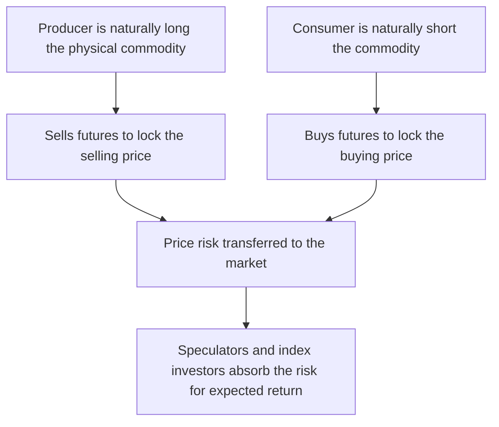
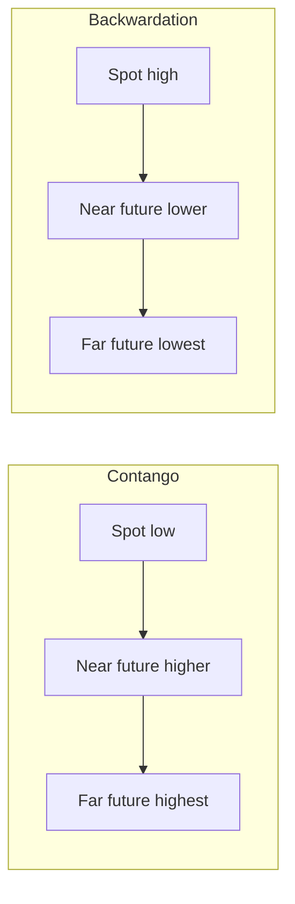
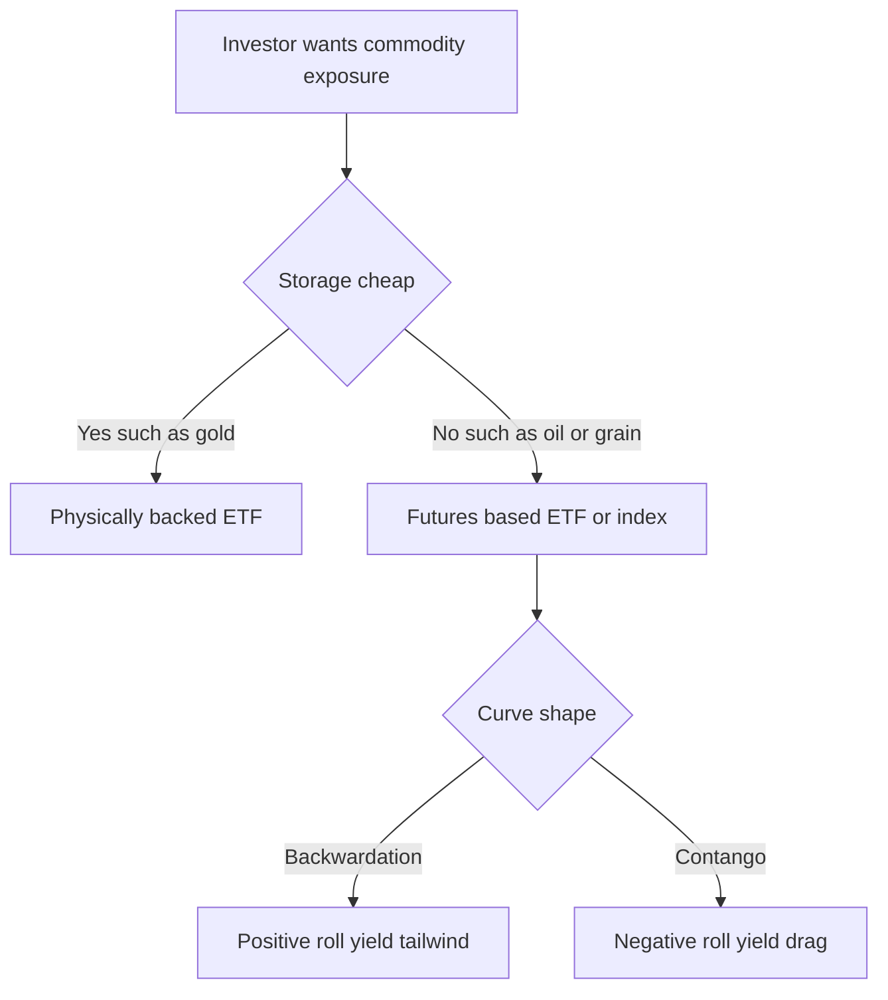
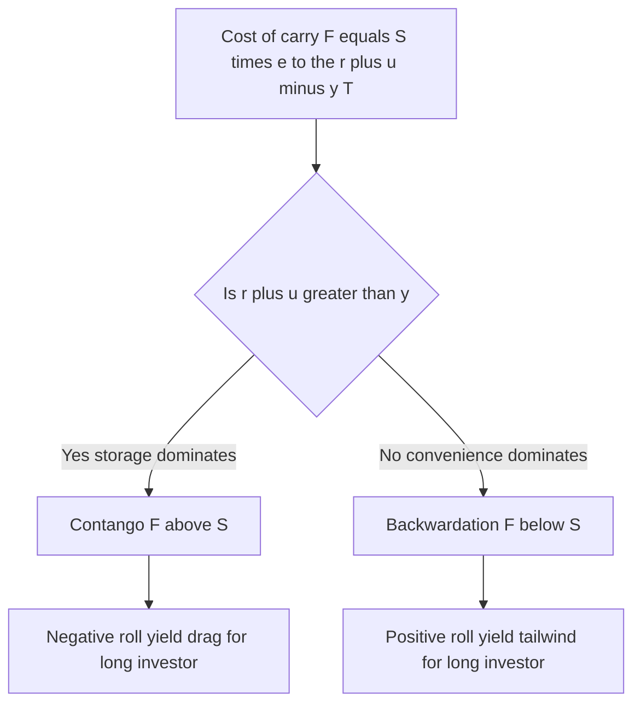

# Chapter 17 — Commodity Derivatives

## 1. The Problem / The Need

A farmer in April plants wheat that will be harvested in September. Between now and then, the price of wheat can move 30% in either direction because of weather in Australia, war near the Black Sea, an export ban in India, or a currency swing in the dollar. The farmer has already committed the seed, the diesel, the fertiliser and the land. If the harvest-time price collapses, the farmer is ruined — not because the crop failed, but because the *price* failed. The farmer is **long the physical commodity** by the very nature of the business, and that exposure was never chosen; it came bundled with farming.

On the other side of the same market sits a flour mill, a cereal maker, or an airline (for jet fuel), a copper-wire manufacturer (for copper), a jeweller (for gold). These businesses are **structurally short** the commodity: they must *buy* it to operate. A cereal company that has already printed "$3.99" on a box of cornflakes and signed a supermarket contract is exposed to the price of corn going *up*. Their margin evaporates if input costs spike.

Neither of these players wants to be a speculator on commodity prices. The farmer wants to farm; the miller wants to mill. They want to **lock in a price today** for a transaction that will happen months from now, so they can plan, borrow, and invest with certainty. That is the primal need commodity derivatives serve: **transferring unavoidable price risk from those who bear it involuntarily (producers and consumers) to those willing to take it for a return (speculators, index investors, arbitrageurs).**

Commodities also differ from financial assets in ways that make their derivatives uniquely rich. You cannot costlessly store a barrel of oil or a herd of cattle. Storage costs money, spoilage happens, and physically *holding* the commodity confers a benefit — a **convenience** — that holding a futures contract does not. These frictions bend the entire term structure of commodity prices and create phenomena (contango, backwardation, roll yield) that simply do not exist for a stock index. Understanding them is what separates someone who "knows what a future is" from someone who can trade the curve.

---

## 2. The Core Idea

A **commodity derivative** is a contract whose value is tied to the price of a physical commodity — energy (crude oil, natural gas), metals (gold, copper, aluminium), or agriculture (wheat, corn, soybeans, coffee, cattle). The two workhorses are:

- **Commodity futures** — a standardised, exchange-traded agreement to buy or sell a fixed quantity and grade of a commodity, at a price agreed today, for delivery on a specified future date.
- **Commodity options** — the right (not the obligation) to buy (call) or sell (put) a commodity, or more commonly a commodity *future*, at a strike price.

The central mechanic is that a **producer sells futures** to lock in a selling price, and a **consumer buys futures** to lock in a buying price. Whatever happens to the spot price, the gain or loss on the futures position offsets the change in the value of the physical exposure. The net result is a **known** price.

The second big idea, unique to commodities, is that the relationship between the futures price `F` and the spot price `S` is governed by a **cost-of-carry** model modified by two commodity-specific forces:

$$F_0 = S_0 \times e^{(r + u - y)T}$$

where `r` is the risk-free rate, `u` is the **storage cost** (as a rate), and `y` is the **convenience yield** — the benefit of physically holding the good. When `y` is large (shortage), futures trade *below* spot (**backwardation**); when `y` is small and storage dominates (glut), futures trade *above* spot (**contango**). The shape of this curve determines the **roll yield** an investor earns or pays when rolling futures forward, which is often the single biggest driver of long-run commodity-investment returns.

---

## 3. Why / How It Works

### Why hedging with futures works

The hedge works because of a **negative correlation you deliberately construct**. The farmer is naturally long wheat (owns a crop). By *selling* wheat futures, the farmer takes a short position that gains exactly when wheat prices fall — which is precisely when the physical crop loses value. The two legs move in opposite directions, cancelling the price risk and leaving a locked-in price. The farmer has not eliminated the crop; they have eliminated the *uncertainty about its price*.

The reason a futures price can be pinned to spot at all is **arbitrage**. Suppose futures traded far above the cost-of-carry fair value. An arbitrageur would *buy* the physical commodity, pay to store it, *sell* the future, and deliver into it at expiry — pocketing a riskless profit. This "cash-and-carry" arbitrage pushes futures back down toward fair value. The bound is one-sided, though: the reverse trade (short the physical, buy the future) requires *borrowing* the commodity, which for a consumable good in short supply may be impossible. That asymmetry is exactly where **convenience yield** lives.

### Why convenience yield exists

If you run a refinery, having crude oil *in your tank right now* has value beyond its price: it means you never have to halt production because of a supply hiccup. That optionality — the insurance value of physical inventory — is the convenience yield. It behaves like a **dividend** the physical holder receives that the futures holder does not. When inventories are dangerously low, this insurance value spikes, spot prices get bid up relative to futures, and the curve tips into backwardation.

### How the term structure links to roll yield

A futures contract expires. An investor who wants continuous commodity exposure must **roll**: close the expiring contract and open a later-dated one. In **contango**, the later contract is *more expensive* than the one you are selling — you repeatedly sell low and buy high, bleeding a **negative roll yield**. In **backwardation**, the later contract is *cheaper* — you sell high and buy low, earning a **positive roll yield**. Over years, this roll can dominate the price change of the commodity itself. This is why a commodity ETF can go *down* over a decade even when the underlying spot commodity went *up*.

*Figure 1 — The core risk-transfer flow. Producers and consumers offload involuntary price risk to speculators and investors.*

---

## 4. Full Content

### 4.1 Commodity futures: contract anatomy

An exchange-traded commodity future standardises everything except the price:

| Element | Example — CME WTI Crude Oil (CL) |
|---|---|
| Underlying | Light sweet crude oil |
| Contract size | 1,000 barrels |
| Quotation | USD per barrel |
| Tick size | \$0.01 per barrel = \$10 per contract |
| Delivery months | Every calendar month, listed years out |
| Settlement | Physical delivery at Cushing, Oklahoma |
| Last trade | ~3 business days before the 25th of the prior month |

Standardisation is what creates liquidity: because every CL contract is identical, buyers and sellers who have never met can trade through the central limit order book, and the **clearing house** becomes the counterparty to both sides, guaranteeing performance and eliminating bilateral credit risk. Traders post **initial margin** and settle gains/losses daily via **variation margin** (mark-to-market).

Settlement is either **physical** (agricultural and energy contracts often deliver the actual good, at approved warehouses/points and grades) or **cash** (many index and some metals contracts settle to a reference price). Because most hedgers and virtually all speculators do not want the physical barrels, over 95% of contracts are closed out or rolled before delivery.

### 4.2 Commodity options

Commodity options are typically written on the *futures* contract, not directly on spot (a "future-style" or "options-on-futures" structure). Key uses:

- A producer who wants downside protection **but keeps the upside** buys a **put** on the future — a price floor with a premium cost, like insurance.
- A consumer who wants a price **ceiling** buys a **call** — capping the maximum purchase price.
- **Collars** (buy a put, sell a call, or vice versa) reduce or zero out the premium by giving up part of the favourable move. A costless collar is extremely common in oil producer hedging.

Options preserve optionality that futures destroy. A futures hedge locks a price *both* ways — the farmer who sold futures at \$6.00 cannot benefit if wheat rallies to \$8.00. A put-buying farmer floors the price at, say, \$5.80 (strike minus premium) yet still enjoys the rally. The cost is the premium.

### 4.3 Storage, cost of carry, and convenience yield

The full cost-of-carry relationship for a commodity:

$$F_0 = S_0 \, e^{(r + u - y)\,T}$$

- `r` — financing cost of buying the commodity now.
- `u` — storage cost as a continuous rate (warehousing, insurance, spoilage).
- `y` — convenience yield (benefit of physical possession).

If we instead express storage as a lump present-value cost `U`, and ignore convenience yield: `F₀ = (S₀ + U) e^{rT}`. The intuition is identical: the future must compensate the holder for money tied up (`r`) plus storage (`u`), less the convenience benefit (`y`).

**Non-storable or seasonally storable commodities** (electricity, some perishables) break the arbitrage entirely — you cannot cash-and-carry electricity — so their forward curves are driven purely by expected supply/demand and can be wildly non-smooth.

### 4.4 The term structure — contango and backwardation

Plot futures price against maturity and you get the **forward curve**:

- **Contango**: upward-sloping. Distant futures cost more than near ones. Typical of well-supplied markets where `u > y` (storage dominates). Example: a glut of oil with tank farms overflowing.
- **Backwardation**: downward-sloping. Distant futures cost *less* than near ones. Typical of tight markets where `y > r + u` (convenience dominates). Example: an oil supply shock where refiners pay a premium for barrels *today*.

*Figure 2 — Contango slopes up away from spot; backwardation slopes down. The sign of storage minus convenience yield sets the tilt.*

A related but distinct concept is **normal backwardation** (Keynes): the idea that futures prices sit *below the expected future spot price* because hedgers (net short producers) pay a risk premium to speculators (net long) for taking the risk. This is about `F` versus *expected* `S`, whereas contango/backwardation as used above describe `F` versus *current* `S`. Interviewers love this distinction.

### 4.5 Roll yield

**Roll yield** is the return from the convergence of the futures price to spot as time passes, captured when rolling a position. A useful decomposition of a fully-collateralised commodity index return:

**Total return ≈ Spot return + Roll yield + Collateral (risk-free) return**

- In **backwardation**, roll yield is **positive** — you roll from a high-priced expiring contract into a cheaper deferred contract.
- In **contango**, roll yield is **negative** — you roll into a more expensive contract each time, a persistent drag.

### 4.6 Commodity indices and investing

Investors gain commodity exposure without warehouses via **index products**. Major benchmarks:

| Index | Weighting basis | Character |
|---|---|---|
| S&P GSCI | World production weighted | Heavily energy-tilted |
| Bloomberg Commodity Index (BCOM) | Liquidity + production, capped | More diversified, caps any sector |

Access vehicles:

- **Futures-based ETFs** (e.g. a broad commodity ETF) — hold and roll futures; suffer/enjoy roll yield.
- **Physically-backed ETFs** — mainly precious metals (gold, silver), which store cheaply and have negligible spoilage.
- **Swaps and total-return notes** — deliver index return synthetically.

Why investors buy commodities: **diversification** (low or negative correlation with stocks/bonds historically), **inflation hedging** (commodity prices are an input to inflation), and **tactical** views. The catch is that a naive long-only futures index in a contango-dominated market can deliver disappointing returns despite rising spot prices — the roll drag. Sophisticated indices use **optimised roll** or **dynamic curve** strategies to mitigate this.

*Figure 3 — Choosing a commodity access vehicle and the roll-yield consequence of the futures route.*

### 4.7 Basis risk in commodity hedging

A hedge is rarely perfect. **Basis** = spot price of the *thing you hold* − futures price of the *contract you trade*. Basis risk arises from:

- **Grade/quality mismatch** — you grow durum wheat but hedge with soft red winter wheat futures.
- **Location mismatch** — your oil is in West Texas but priced against Brent.
- **Timing mismatch** — your sale date does not line up with contract expiry.

Basis risk is why hedgers choose the contract most correlated with their exposure and the expiry just after their cash-flow date, and why "cross-hedging" (jet fuel hedged with heating oil or crude) carries residual risk.

---

## 5. Worked / Applied Examples

### Example 1 — Producer short hedge (the core case)

**Setup.** In April, a wheat farmer expects to harvest **50,000 bushels** in September. The September wheat future trades at **\$6.00/bushel**. One CBOT wheat contract = **5,000 bushels**, so the farmer sells **10 contracts** to hedge the full crop. The farmer is naturally long, so hedges by going **short futures**.

**Scenario A — price falls to \$5.20 at harvest.**

| Leg | Calculation | Result |
|---|---|---|
| Sell physical wheat in cash market | 50,000 × \$5.20 | \$260,000 |
| Gain on short futures | (6.00 − 5.20) × 50,000 | +\$40,000 |
| **Effective proceeds** | 260,000 + 40,000 | **\$300,000** |
| Effective price per bushel | 300,000 ÷ 50,000 | **\$6.00** |

**Scenario B — price rises to \$6.90 at harvest.**

| Leg | Calculation | Result |
|---|---|---|
| Sell physical wheat in cash market | 50,000 × \$6.90 | \$345,000 |
| Loss on short futures | (6.00 − 6.90) × 50,000 | −\$45,000 |
| **Effective proceeds** | 345,000 − 45,000 | **\$300,000** |
| Effective price per bushel | 300,000 ÷ 50,000 | **\$6.00** |

**Verification.** In *both* scenarios the farmer nets **\$6.00/bushel = \$300,000**, exactly the locked-in futures price. The hedge removed all price uncertainty (assuming zero basis and futures converging to spot). Note the trade-off: in Scenario B the farmer "lost" \$45,000 of upside — but that was never the goal. The goal was certainty, and the goal was achieved. This is the defining feature of a futures hedge: it is symmetric and it eliminates *both* tails.

### Example 2 — Consumer long hedge with an option (keeping upside)

**Setup.** An airline needs **1,000,000 gallons** of jet fuel in three months and fears prices rising. Spot-equivalent future is **\$2.50/gallon**. Rather than lock with a future, the treasurer **buys calls** struck at **\$2.60**, paying a premium of **\$0.08/gallon** = \$80,000 total. This caps the effective cost while preserving benefit if fuel falls.

**Scenario A — fuel rises to \$3.00.**

| Item | Calculation | Result |
|---|---|---|
| Buy fuel in market | 1,000,000 × \$3.00 | \$3,000,000 |
| Call payoff | (3.00 − 2.60) × 1,000,000 | +\$400,000 |
| Premium paid | | −\$80,000 |
| **Net cost** | 3,000,000 − 400,000 + 80,000 | **\$2,680,000** |
| Effective price | | **\$2.68/gal** |

The ceiling is **strike + premium = 2.60 + 0.08 = \$2.68**. Verified: at any price above \$2.60 the airline pays no more than \$2.68/gal.

**Scenario B — fuel falls to \$2.20.**

| Item | Calculation | Result |
|---|---|---|
| Buy fuel in market | 1,000,000 × \$2.20 | \$2,200,000 |
| Call expires worthless | | \$0 |
| Premium paid | | −\$80,000 |
| **Net cost** | 2,200,000 + 80,000 | **\$2,280,000** |
| Effective price | | **\$2.28/gal** |

**Verification.** With the option, the airline **caps** cost at \$2.68 yet still benefits when fuel falls (paying \$2.28, only \$0.08 above spot). A pure futures hedge at \$2.50 would have locked \$2.50 *both* ways — better than the option in the falling case is *worse* (2.50 vs 2.28) and in the rising case better (2.50 vs 2.68). The \$0.08 premium is precisely the price of keeping the downside benefit. This is the option-versus-future trade-off made concrete.

### Example 3 — Cost of carry, contango, and roll yield

**Setup.** Gold spot `S₀ = \$2,000/oz`. Risk-free `r = 5%`, storage `u = 1%`, convenience yield `y ≈ 0` (gold is an investment metal, no real shortage premium). One-year future:

$$F_0 = 2000 \times e^{(0.05 + 0.01 - 0)\times 1} = 2000 \times e^{0.06} = 2000 \times 1.0618 = \$2{,}123.7$$

The curve is in **contango** (`F > S`) because carry costs exceed convenience yield — exactly what we expect for gold.

**Roll-yield illustration.** Suppose an investor holds the 1-year future. Six months later, if spot is *unchanged* at \$2,000, the now-6-month future is worth `2000 × e^{0.06 × 0.5} = 2000 × 1.03045 = \$2,060.9`. The investor bought at \$2,123.7 and the contract has fallen to \$2,060.9 as it converges toward spot — a **negative roll** of about **\$62.8** even though spot never moved. This is the contango drag that erodes long-only commodity index returns.

**Backwardation contrast.** Now imagine crude in a supply shock: `S₀ = \$90`, `r = 5%`, `u = 2%`, but `y = 15%` (refiners desperate for barrels). Then:

$$F_0 = 90 \times e^{(0.05 + 0.02 - 0.15)\times 1} = 90 \times e^{-0.08} = 90 \times 0.9231 = \$83.1$$

The 1-year future (\$83.1) sits **below** spot (\$90) — **backwardation**. An index investor rolling long here *buys the cheaper deferred contract* and, as it rises toward spot over time, earns a **positive roll yield**. Verified sign: `r + u − y = 0.05 + 0.02 − 0.15 = −0.08 < 0`, so `F < S`, confirming backwardation.

---

## 6. Connections

- **Chapter on forwards & futures pricing (cost of carry).** Commodity futures are the same cost-of-carry family as index and currency futures, but with two extra terms — storage `u` and convenience yield `y`. Financial assets have `y = 0` and effectively `u = 0`, and often a dividend yield `q` that plays the *role* of a negative carry.
- **Options chapters.** Commodity options are options-on-futures; Black-76 (the futures-adjusted Black-Scholes) is the standard pricing model, and put-call parity, collars and volatility skew all carry over.
- **Hedging & basis risk.** The optimal hedge ratio (minimum-variance hedge, `h* = ρ × σ_S / σ_F`) is most visibly needed in commodities because of cross-hedging and grade/location basis.
- **Portfolio theory / asset allocation.** Commodity indices connect to diversification, inflation hedging, and the equity risk premium debate — commodities' return being dominated by roll yield and collateral, not just spot, is a portfolio-construction subtlety.
- **Macro & inflation.** Commodity curves are read as real-time signals of supply tightness; backwardation in oil is a classic tight-market/inflationary tell.

---

## 7. Key Terms

| Term | Meaning |
|---|---|
| **Commodity future** | Exchange-traded, standardised contract to buy/sell a commodity at a set price and future date. |
| **Short hedge** | Selling futures to protect a long physical position (producer's hedge). |
| **Long hedge** | Buying futures to protect against rising input costs (consumer's hedge). |
| **Cost of carry** | Net cost of holding a physical commodity: financing + storage − convenience yield. |
| **Storage cost (u)** | Cost of warehousing, insuring and preserving the physical commodity. |
| **Convenience yield (y)** | Benefit of physically holding the commodity — insurance value of inventory. |
| **Contango** | Upward-sloping forward curve; futures above spot; storage dominates convenience. |
| **Backwardation** | Downward-sloping forward curve; futures below spot; convenience dominates. |
| **Normal backwardation** | Futures below the *expected* future spot due to a risk premium paid to speculators. |
| **Roll yield** | Return from rolling futures forward as they converge to spot; positive in backwardation, negative in contango. |
| **Basis** | Spot price of the held asset minus the futures price of the hedging contract. |
| **Basis risk** | Risk that basis changes, from grade, location, or timing mismatch. |
| **Cash-and-carry arbitrage** | Buy spot, store, sell future, deliver — enforces the upper bound on `F`. |
| **Commodity index** | Benchmark (GSCI, BCOM) tracking a basket of commodity futures. |

---

## 8. Common Confusions

**"Hedging is about making money."** No. A hedge is about removing uncertainty. Half the time the hedger will look, in hindsight, to have "lost" money on the derivative leg (Example 1B). That is a feature, not a failure — the physical leg gained exactly as much. Judging a hedge by the P&L of the futures alone is a category error.

**"Contango means prices will rise."** Contango describes `F` versus *current* spot, not a forecast. An upward-sloping curve is a statement about carry costs, not a prediction that spot will climb. In fact, an investor rolling in contango often *loses* money as spot stays flat (Example 3's gold roll).

**"Convenience yield is a real cash payment."** It is an *implied* benefit backed out of prices, not a dividend you receive in cash. It captures the optionality value of having physical inventory — usefully modelled *like* a dividend, but you never see a cheque.

**"Contango and normal backwardation are opposites."** They live on different axes. Contango/backwardation compare `F` to *current* `S`. Normal backwardation compares `F` to *expected future* `S`. A market can be in contango yet still exhibit normal backwardation, and vice versa.

**"A commodity ETF tracks the commodity's spot price."** Only physically-backed metal ETFs come close. Futures-based ETFs track spot **plus roll yield plus collateral return**, and in persistent contango the roll drag can make the ETF fall while spot rises — a notorious trap in oil and natural-gas ETFs.

**"You can arbitrage any mispricing both ways."** The cash-and-carry (buy spot, sell future) enforces the *upper* bound. The reverse needs *borrowing/shorting the physical*, which for a consumable in shortage is impossible — so the lower bound is soft, which is exactly why backwardation and large convenience yields can persist.

---

## 9. Recap

- Producers are involuntarily **long** the physical commodity and hedge by **selling futures** (short hedge); consumers are involuntarily **short** and hedge by **buying futures** (long hedge) or **buying calls** to cap costs while keeping upside.
- A futures hedge locks a price **symmetrically** — it removes both tails and therefore both regret and windfall. Options cost a premium but preserve the favourable side.
- Commodity futures obey a **cost-of-carry** model with two commodity-specific terms: `F₀ = S₀ e^{(r + u − y)T}`, where storage `u` pushes the curve up and convenience yield `y` pulls it down.
- When `r + u > y` the curve is in **contango** (futures above spot); when `y > r + u` it is in **backwardation** (futures below spot).
- **Roll yield** — the return from rolling futures toward spot — is **positive in backwardation** and **negative in contango**, and over the long run it can dominate an index investor's return more than the spot move itself.
- **Basis risk** (grade, location, timing) means real hedges are imperfect; hedgers minimise it by contract choice and expiry alignment.
- Commodity **indices** (GSCI, BCOM) and ETFs give investors exposure for diversification and inflation hedging, but futures-based products carry the roll-yield feature and do *not* simply track spot.

*Figure 4 — The full chain from carry parameters to curve shape to roll yield, the single most interview-tested idea in commodities.*

---

## 10. Quick-Reference / Interview Points

- **One-line hedge rule:** producer sells futures (short hedge), consumer buys futures (long hedge). Both convert an uncertain future price into a known one.
- **Cost-of-carry formula:** `F₀ = S₀ e^{(r + u − y)T}` — memorise it. Financial assets: `y = 0`, `u ≈ 0`, sometimes dividend `q` replaces a carry term.
- **Curve shapes:** Contango = up-sloping = futures > spot = storage beats convenience = **negative** roll for longs. Backwardation = down-sloping = futures < spot = convenience beats carry = **positive** roll for longs.
- **Decompose index return:** Spot return + Roll yield + Collateral (T-bill) return. Explains why an oil ETF can drop while oil rises.
- **Convenience yield** = insurance value of physical inventory; spikes when stocks are low → drives backwardation. It is implied, not a cash dividend.
- **Normal backwardation ≠ backwardation.** Normal backwardation: `F` < *expected* future spot (Keynes, risk premium to speculators). Backwardation: `F` < *current* spot. Different axes.
- **Arbitrage asymmetry:** cash-and-carry enforces the upper bound; the lower bound is soft because you cannot easily short a scarce physical good — hence persistent backwardation.
- **Options vs futures for hedging:** future locks price both ways (no premium, no upside); option caps/floors the price (premium cost, keeps favourable move). Ceiling of a bought call = strike + premium.
- **Basis risk sources:** grade, location, timing. Minimum-variance hedge ratio `h* = ρ σ_S / σ_F`.
- **Gold vs oil intuition:** Gold — low convenience, cheap storage → usually contango. Oil in a shock — high convenience → backwardation. Know both worked signs cold.
- **Physically-backed vs futures-based ETFs:** metals can be physical (track spot); oil/grain must be futures (roll-yield exposure). Never claim a futures ETF "tracks spot."
