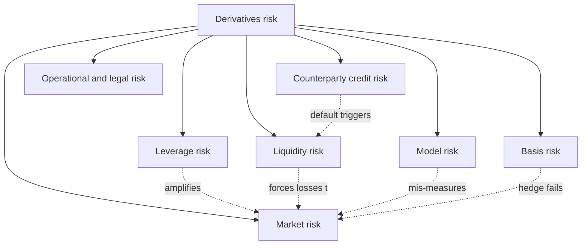
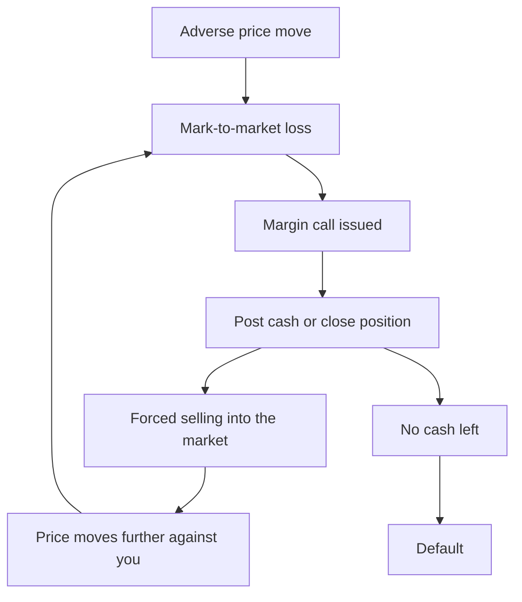
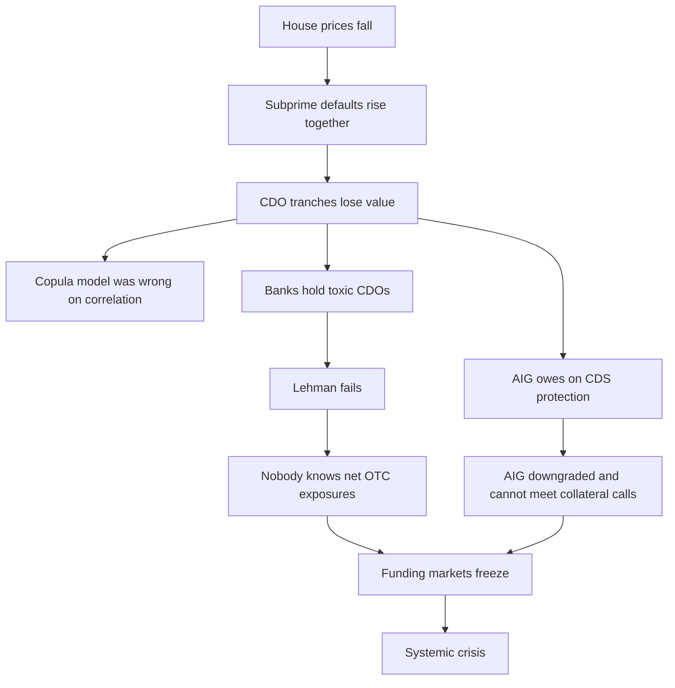
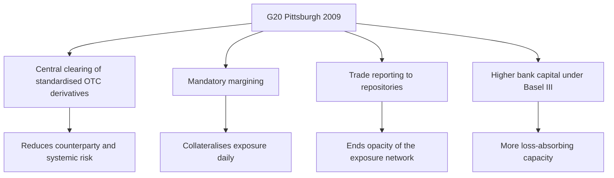
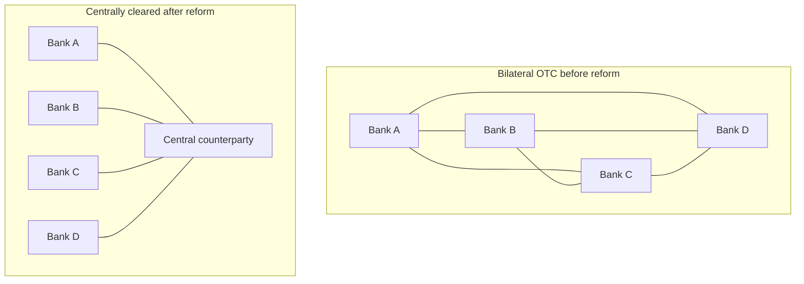

# Chapter 18 — Risks of Derivatives and Lessons

## 1. The Problem / The Need

Warren Buffett famously called derivatives "financial weapons of mass destruction." That line is quoted so often that people forget the context: in the very same letters, Berkshire Hathaway was *using* derivatives — equity index puts, credit default swaps — to make billions. So which is it? Are derivatives dangerous or useful?

The honest answer is: **both, and for the same reason.** Everything that makes a derivative useful is also what makes it dangerous. A derivative lets you take a large economic exposure while posting a small amount of cash. That is *leverage*, and leverage is a magnifying glass — it enlarges the gains you were hoping for and, in exactly the same proportion, the losses you were not.

The earlier chapters of this guide taught you what derivatives *are* and how to *price* and *use* them: forwards, futures, options, swaps, hedging, arbitrage, the Greeks, value-at-risk. Every one of those chapters implicitly assumed the machinery works — that the counterparty pays, that you can close a position when you want, that your model is right, that the hedge tracks the thing it is hedging. This chapter is about what happens when those assumptions break.

The need is sharp for anyone entering finance:

- **You will be asked about blow-ups in interviews.** LTCM, Barings, and 2008 are the "tell me about a famous failure" questions of derivatives desks. Knowing the mechanism (not just the headline) separates a candidate who understands risk from one who memorized a story.
- **Risk is the constraint, not an afterthought.** On a real desk, the P&L you are allowed to chase is bounded by risk limits — VaR limits, margin, stress scenarios. If you do not understand *why* those limits exist, you will experience them as bureaucracy rather than as the accumulated scar tissue of past disasters.
- **The post-2008 architecture — central clearing, mandatory margining, capital rules — is now the water the entire market swims in.** You cannot function on a rates or credit desk without understanding SA-CCR, initial margin, variation margin, and clearing houses.

So this chapter is the "here is how it kills you, and here is how the industry learned to stop dying" chapter. We catalogue the *types* of risk, dissect the *famous failures* mechanism-by-mechanism, walk through the *reforms* that reshaped the market after 2008, and finish with a practical framework for managing derivatives risk responsibly.

## 2. The Core Idea

There are two core ideas, and holding both at once is the whole point.

**Core idea 1 — Derivatives do not create or destroy risk; they *transfer* and *transform* it.** A hedge does not make risk vanish; it moves the risk to whoever took the other side. A speculator does not conjure risk from nothing; they take on risk somebody else wanted to shed. This is a zero-sum transfer at the level of the contract. What derivatives *add* is the ability to slice risk finely and to concentrate a lot of it in a small footprint. That concentration is where danger lives.

**Core idea 2 — The danger is almost never a single risk; it is the *interaction* of several risks arriving together.** Every famous blow-up is a chain: leverage turns a modest adverse move into a large loss; that loss triggers margin calls, which force selling; forced selling in an illiquid market moves prices further against you; falling prices raise margins again; and a counterparty on the other side, watching this, refuses to roll your financing. Leverage × liquidity × counterparty × correlation, looping. No single link would have killed you. The loop does.

We can name the principal risk types, and we will spend Section 4 on each:

*Figure 1 — The risk taxonomy. The dotted arrows are the point: the risks are not independent, they feed each other. A blow-up is a walk around these arrows.*

The reason this taxonomy matters is that a risk manager's job is not to eliminate any single box — that is impossible and would eliminate the business — but to make sure the *arrows* cannot form a self-reinforcing loop large enough to be fatal.

## 3. Why / How It Works (The Mechanics of Danger)

Let us make the abstract concrete with the one mechanism that underlies almost every derivatives disaster: **notional-to-margin leverage.**

When you buy a stock for cash, your maximum loss is what you paid, and your exposure equals your investment. When you enter a futures contract, you control a large *notional* while posting a small *margin*. The ratio of the two is your leverage.

Suppose one E-mini S&P 500 futures contract has a multiplier of 50 and the index is at 5,000. The notional you control is:

$$\text{Notional} = 50 \times 5{,}000 = \$250{,}000$$

Initial margin might be around \$12,500. So your leverage is:

$$\text{Leverage} = \frac{250{,}000}{12{,}500} = 20\times$$

Now a 1% move in the index changes the notional by \$2,500. Relative to your \$12,500 margin, that is a **20% swing in your capital for a 1% move in the market.** A 5% adverse move — an ordinary bad week — wipes out your entire margin. This is not a bug; it is the defining feature. The same 20× that lets a hedger protect a \$250,000 portfolio with \$12,500 of cash lets a speculator lose everything on a small ripple.

The second mechanism is the **margin spiral**, and it is what turns a bad day into insolvency:

*Figure 2 — The margin spiral. Mark-to-market losses generate margin calls; meeting them by liquidating pushes prices further, generating more losses. The loop is the killer, not any single step.*

The crucial insight: **mark-to-market plus leverage means you can be right in the long run and dead in the short run.** LTCM's trades were, in many cases, ultimately profitable — for whoever held them *after* LTCM was forced out. Being solvent requires surviving the *path*, not just the destination. Keynes's line — "the market can stay irrational longer than you can stay solvent" — is a statement about margin.

The third mechanism is **correlation breakdown / tail dependence.** In calm times, diversification works: your positions offset. Models estimate correlations from calm-period data and conclude the portfolio is safe. But in a crisis, correlations rush toward 1 — everything falls together, every risky asset is sold at once, the diversification you paid for evaporates precisely when you need it. A portfolio that a Gaussian, normal-times model rated as safe reveals a fat left tail. This is why VaR (Chapter 17) understates crisis risk and why stress testing exists.

## 4. Full Content — The Taxonomy of Derivatives Risk

### 4.1 Market Risk (and its amplification, Leverage Risk)

**Market risk** is the risk that the underlying moves against you — price, rate, FX, vol. It is the "intended" risk of any position and is measured with the Greeks (delta, gamma, vega), scenario analysis, and VaR/Expected Shortfall.

**Leverage risk** is not a separate source of loss; it is a *multiplier* on market risk. Two features of derivatives create it:

1. **Notional leverage** — controlling large notional with small margin (the futures example above).
2. **Embedded optionality / gamma** — an option seller has small delta today but large, accelerating exposure if the market moves. A short-gamma position loses at an *increasing* rate — the more the market moves, the faster you lose, because your delta gets worse exactly as you would need it to get better.

The danger signature of leverage: **losses are convex.** A 2× larger move does not cost 2× more; with gamma it can cost far more.

### 4.2 Counterparty Credit Risk

An OTC derivative (a forward, a swap, an OTC option) is a *bilateral promise*. Its value to you is only as good as the counterparty's willingness and ability to pay. **Counterparty credit risk** is the risk they default when the contract is *in your favour*.

Key sub-concepts:

- **Current exposure** — what you would lose if they defaulted *right now* = the positive mark-to-market value they owe you (you lose nothing if the contract is in *their* favour, because you would still owe *them*).
- **Potential future exposure (PFE)** — how much the exposure *could grow* before maturity, given how far the market might move.
- **Wrong-way risk** — the poisonous case where your exposure to a counterparty *rises exactly as their creditworthiness falls*. Classic example: buying protection on a country's default from a bank in that same country; if the country defaults, the bank is failing too, so the protection you counted on evaporates. AIG in 2008 is the archetype.
- **CVA (Credit Valuation Adjustment)** — the market price of counterparty risk, subtracted from the "risk-free" value of a derivative. Post-2008, CVA became a first-class trading and accounting quantity; CVA *volatility* itself was a major source of bank losses in the crisis.

Exchange-traded derivatives largely *replace* bilateral counterparty risk with the **clearing house** as the universal counterparty — the central plank of the post-2008 reforms (Section 6).

### 4.3 Liquidity Risk

Two distinct flavours, often conflated:

- **Market (asset) liquidity risk** — you cannot exit a position without moving the price against yourself, or at all. Bid-ask spreads blow out; depth vanishes. Exotic and long-dated OTC positions are especially exposed.
- **Funding liquidity risk** — you cannot raise the cash to meet margin calls or roll financing, even though you are economically solvent. This is the LTCM and 2008 killer: you own assets worth (eventually) more than your debts, but you cannot turn them into cash *today* to meet a call, so you default.

The two feed each other: needing cash (funding) forces you to sell (market), and thin markets mean selling raises less cash and moves prices, deepening the funding hole. This coupling is the "liquidity spiral."

### 4.4 Model Risk

A derivative's value often comes from a *model*, not an observable price. Model risk is the risk that the model is wrong — wrong assumptions, wrong calibration, wrong regime.

Sources:
- **Assumption error** — Black-Scholes assumes constant volatility and continuous, log-normal prices; real markets have jumps, fat tails, and a volatility *smile*. Pricing a barrier or digital option off the wrong smile can be badly wrong.
- **Calibration / input error** — right model, bad inputs (stale vol, wrong correlation).
- **Regime error** — the model was fitted to calm data and is silent about crises. Gaussian copula models of CDO correlation (2008) assumed a correlation structure that collapsed when *all* subprime borrowers defaulted together.
- **Complexity risk** — the more exotic the payoff, the more the price depends on unobservable parameters, and the more room for the marks to be manipulated or simply mistaken.

Model risk is insidious because it is *silent*: the position looks fine on the screen (the screen uses the model) right up until it doesn't.

### 4.5 Basis Risk

**Basis risk** is the risk that a hedge does not move exactly opposite to the thing it hedges. The "basis" is the difference between the spot price of your exposure and the price of the hedging instrument.

$$\text{Basis} = S_{\text{exposure}} - F_{\text{hedge}}$$

A hedge is perfect only if the basis is constant. It rarely is. Basis risk arises from:
- **Asset mismatch** — hedging jet fuel exposure with crude oil futures (correlated, not identical).
- **Maturity mismatch** — hedging a 5-month exposure with a 3-month future, then rolling.
- **Location / quality mismatch** — hedging Brent-priced oil with WTI futures.

A hedger has not eliminated risk; they have *swapped* the large, obvious market risk for the smaller, subtler basis risk — usually a good trade, but not a free one. Metallgesellschaft (1993) is the textbook basis/rollover disaster: a long-dated supply obligation hedged with short-dated futures that had to be rolled, and the roll (contango) plus mark-to-market margin calls on the futures leg created enormous cash drains even though the overall economic position was sound.

### 4.6 Operational and Legal Risk

- **Operational risk** — failures of people, process, and systems: a rogue trader hiding positions (Barings, Société Générale), a fat-finger trade, a booking error, unreconciled accounts, or absent segregation of duties. Derivatives magnify operational risk because a small keystroke controls a large notional.
- **Legal / documentation risk** — the contract does not mean what you thought (netting unenforceable in a jurisdiction, an ISDA definition ambiguous, a CDS "credit event" disputed). When a counterparty fails, the difference between *gross* and *net* exposure — whether your offsetting trades legally net down to one number — can be the difference between a haircut and a catastrophe.

## 5. Worked / Applied Examples

### Example 1 — Leverage and the margin call: how a "small" move ends you

You are a speculator. You post \$100,000 and go long 8 E-mini S&P 500 futures at index level 5,000 (multiplier 50). Initial margin is \$12,500/contract; maintenance margin is \$11,000/contract.

**Setup:**

| Item | Value |
|---|---|
| Contracts | 8 |
| Index level | 5,000 |
| Multiplier | 50 |
| Notional controlled | 8 × 50 × 5,000 = **\$2,000,000** |
| Initial margin posted | 8 × 12,500 = **\$100,000** |
| Your capital | \$100,000 |
| Effective leverage | 2,000,000 / 100,000 = **20×** |

Now the index falls 4% over three days, to 4,800. Per contract, the loss is:

$$\text{Loss} = 50 \times (5{,}000 - 4{,}800) = 50 \times 200 = \$10{,}000 \text{ per contract}$$

$$\text{Total loss} = 8 \times 10{,}000 = \$80{,}000$$

**Self-check via leverage:** a 4% move × 20× leverage = 80% of capital. 80% of \$100,000 = \$80,000. ✓ Consistent.

Your equity is now \$100,000 − \$80,000 = **\$20,000.** But maintenance margin required is 8 × 11,000 = \$88,000. You are \$68,000 short. The clearing broker issues a margin call for \$68,000 (to restore to *initial* margin of \$100,000, actually \$80,000 to top back up). If you cannot post it, your position is liquidated **at the worst possible moment** — into the falling market — crystallising the loss.

**The lesson:** a 4% market move — utterly ordinary, happens several times a year — took 80% of your capital and forced you out. The market then rebounds to 5,100 the next week. Had you survived, you would have *profited*. Leverage did not change whether you were right; it changed whether you got to stay in the game long enough to find out. This is the entire LTCM story in miniature.

### Example 2 — Counterparty risk and netting: gross vs net exposure

You are a bank with two offsetting interest-rate swaps against Counterparty Z:

| Trade | Your MTM position |
|---|---|
| Swap A | +\$40,000,000 (Z owes you) |
| Swap B | −\$32,000,000 (you owe Z) |

Z defaults. How much do you lose?

**Without an enforceable netting agreement:** you must still pay the \$32,000,000 you owe on Swap B in full (Z's bankruptcy administrator will demand it — this is "cherry-picking"), while you join the queue of unsecured creditors for the \$40,000,000 Z owes you, recovering perhaps 40 cents on the dollar:

$$\text{Loss} \approx 32{,}000{,}000 - (0.40 \times 40{,}000{,}000) = 32{,}000{,}000 - 16{,}000{,}000 = \$16{,}000{,}000 \text{ net cash out, plus a } \$24{,}000{,}000 \text{ claim shortfall}$$

Your true exposure was the **gross** \$40,000,000.

**With an enforceable ISDA Master Agreement close-out netting clause:** the two swaps collapse to a single net claim:

$$\text{Net exposure} = 40{,}000{,}000 - 32{,}000{,}000 = \$8{,}000{,}000$$

You have one \$8,000,000 claim, on which you recover 40%: loss ≈ **\$4,800,000**. And if you held **collateral (variation margin)** covering that \$8,000,000 net exposure, your loss approaches **zero.**

**The lesson:** the same two economic trades imply a \$16m+ hit or a near-zero hit depending entirely on *legal documentation* (netting) and *collateral* (margining). This is why the post-2008 reforms made netting and margining central. Counterparty risk is managed on the *net, collateralised* number — but only if the paperwork holds in court.

### Example 3 — Basis risk: the hedge that bleeds cash

An airline expects to buy 1,000,000 gallons of jet fuel in three months. There is no liquid jet-fuel futures market, so it hedges by buying crude oil futures (heating oil / crude as a proxy). Historically, jet fuel and crude move together — but not perfectly.

Assume 1 crude contract = 42,000 gallons of crude, and the airline buys 24 contracts (≈ 1,008,000 gallons) as a proxy.

**Scenario — energy prices rise, but the crack spread narrows:**

| Item | At hedge inception | Three months later | Change |
|---|---|---|---|
| Jet fuel (per gallon) | \$2.50 | \$2.90 | **+\$0.40** |
| Crude futures (per gallon-equivalent) | \$1.90 | \$2.15 | **+\$0.25** |

The airline's physical cost rose by \$0.40/gal × 1,000,000 = **\$400,000 more** than budgeted.

Its futures hedge gained \$0.25/gal × 1,008,000 ≈ **\$252,000.**

**Net unhedged residual (basis loss):**

$$400{,}000 - 252{,}000 = \$148{,}000 \text{ still unhedged}$$

The hedge covered 63% of the price rise, not 100%. The uncovered \$148,000 is **basis risk** — jet fuel and crude did not move one-for-one because the refining margin (crack spread) changed.

**Self-check:** the basis moved from (2.50 − 1.90) = \$0.60 to (2.90 − 2.15) = \$0.75, a widening of \$0.15/gal. On 1,000,000 gal that is \$150,000 of adverse basis, matching the ~\$148,000 residual (small rounding from the 1,008,000 vs 1,000,000 contract granularity). ✓

**The lesson:** the airline was *not* reckless — proxy hedging is standard and it reduced risk substantially. But "hedged" is not "risk-free." The residual basis risk is real and must be sized, disclosed, and monitored. A hedger who believes the hedge is perfect is carrying an unmeasured exposure.

## 6. The Famous Blow-Ups and the Post-2008 Reforms

### 6.1 Barings Bank (1995) — operational risk and the rogue trader

Nick Leeson, a trader in Barings' Singapore office, was supposed to be running low-risk arbitrage between Nikkei 225 futures on the SIMEX (Singapore) and Osaka exchanges. Instead he took large **unhedged directional** long positions on the Nikkei, and — crucially — he **controlled both the trading desk and the back office** that was supposed to check him. He hid losses in an error account, number **88888**.

When the Kobe earthquake (January 1995) sent the Nikkei tumbling, his long futures and short straddle (short volatility) options positions haemorrhaged. He doubled down. Losses reached **£827 million**, more than the entire capital of the 233-year-old bank, which collapsed and was sold for £1.

**Mechanism:** operational risk (no segregation of duties) + leverage (futures) + short gamma (short options into a jump). **Lesson:** *separate the front office from the back office.* A trader must never be able to confirm and settle their own trades. This single control failure is now audited relentlessly.

### 6.2 LTCM (1998) — leverage, liquidity, and correlation breakdown

Long-Term Capital Management was staffed by legends, including Nobel laureates Robert Merton and Myron Scholes. Its strategy was **relative-value arbitrage** in fixed income: identify tiny mispricings between similar bonds (e.g., on-the-run vs off-the-run Treasuries, swap spreads, sovereign convergence trades) and bet they would converge. The edges were minuscule, so LTCM applied **enormous leverage** — roughly 25:1 on the balance sheet, and far more once you counted the derivatives notional (hundreds of billions on ~\$4.7bn of equity).

The trades were *diversified* by design — dozens of unrelated convergence bets. On the models (calibrated to calm 1990s data), the portfolio's risk looked modest.

Then the **Russian default (August 1998)** triggered a global flight to quality. Every risky, illiquid, "cheap" position fell at once; every safe, liquid, "expensive" position rose. LTCM's diversification vanished — **correlations went to 1.** Losses on the leveraged book were catastrophic; margin calls flooded in; to raise cash LTCM had to sell into markets where *everyone* was selling the same trades (because the Street had copied them), moving prices further against it — the liquidity spiral. LTCM lost ~\$4.6bn in months. The Fed orchestrated a \$3.6bn bailout by 14 banks, fearing its default would cascade through every major dealer that was its counterparty (systemic risk).

**Mechanism:** extreme leverage + funding and market liquidity risk + correlation breakdown + model risk (calm-period correlations) + systemic interconnection. **Lesson:** *leverage plus illiquidity is lethal even when you are "right"; diversification fails in crises; and a big enough position IS the market — you cannot exit without moving it.*

### 6.3 The 2008 Global Financial Crisis — the whole taxonomy at once

2008 is not one blow-up; it is the entire risk taxonomy detonating simultaneously across the system. The derivatives-specific threads:

- **Securitisation and CDOs.** Mortgages were pooled into mortgage-backed securities, then re-pooled into collateralised debt obligations (CDOs), sliced into tranches rated by their loss priority. Pricing the tranches depended on the **Gaussian copula** correlation model — a *model risk* time bomb. It assumed a tame correlation among borrower defaults. When house prices fell nationally, *everyone* defaulted together (correlation → 1), and even "safe" AAA senior tranches took losses. Model risk, crystallised.
- **Credit Default Swaps (CDS) and AIG.** AIG's Financial Products unit sold vast amounts of CDS protection on those CDOs — effectively insuring them — while posting little collateral, because the models (and AAA ratings) said default was near-impossible. This was massive **wrong-way risk**: as the CDOs deteriorated, AIG owed more *and* was itself failing. Downgrades triggered collateral calls AIG could not meet — a **funding liquidity** death spiral — forcing an \$85bn (ultimately ~\$182bn) government rescue to prevent every counterparty from taking the loss at once.
- **Counterparty risk and Lehman.** Lehman Brothers was a central node in the OTC derivatives web. When it failed, the *bilateral* nature of OTC contracts meant nobody knew who was exposed to whom, or for how much net. Trust evaporated; funding markets froze. This opacity — the inability to see the network of exposures — turned individual defaults into systemic panic.

**Mechanism:** model risk (copula) + wrong-way counterparty risk (AIG) + leverage (thin bank capital) + funding liquidity (collateral spirals) + opacity/interconnection (bilateral OTC web) + basis risk (hedges that didn't track). **Lesson:** the market was too *opaque, too interconnected, and too under-collateralised.* Fixing those three became the entire reform agenda.

*Figure 3 — The 2008 chain. Model risk, wrong-way counterparty risk, and OTC opacity chain into a systemic freeze. No single box is the cause; the path is.*

### 6.4 The post-2008 reforms

The G20 met in Pittsburgh in 2009 and set a reform agenda that was implemented as **Dodd-Frank** (US) and **EMIR** (EU), with **Basel III** raising bank capital. The four pillars, each aimed directly at a 2008 failure mode:

*Figure 4 — The four pillars of post-2008 derivatives reform, each mapped to the risk it targets.*

**1. Central clearing (CCPs).** Standardised OTC derivatives (most interest-rate swaps, index CDS) must now be cleared through a **central counterparty (CCP)**. The CCP steps into the middle of every trade via *novation*: instead of Bank A facing Bank B (and each carrying the other's credit risk), both face the CCP. The CCP nets everyone's exposures multilaterally, collects margin from all, and mutualises default losses through a **default waterfall** (defaulter's margin → defaulter's default-fund contribution → CCP's own capital "skin in the game" → surviving members' default-fund contributions). This replaces a tangled bilateral web with a hub-and-spoke, and it *ends the opacity* that froze markets after Lehman.

*Figure 5 — Novation to a CCP converts an opaque bilateral mesh into a transparent hub-and-spoke, allowing multilateral netting and centralised default management.*

**2. Mandatory margining.** Every cleared trade — and, since ~2016–2022 phase-in, non-cleared OTC trades too (the "uncleared margin rules") — must exchange:
- **Variation margin (VM)** — daily (or intraday) cash settlement of mark-to-market changes, so no large uncollateralised exposure can accumulate. This is what AIG *wasn't* doing.
- **Initial margin (IM)** — collateral sized to cover potential future exposure over the close-out period (e.g., a 99% move over 5–10 days), so that if a counterparty defaults, the margin covers the loss during unwinding. IM is *segregated* so it cannot be lost in the counterparty's bankruptcy.

**3. Trade reporting / transparency.** All derivatives trades must be reported to **trade repositories**, and standardised contracts trade on **swap execution facilities (SEFs)** / organised platforms. Regulators can now *see* the exposure network — the thing nobody could see in 2008.

**4. Higher, risk-sensitive capital (Basel III + CVA capital).** Banks must hold more and better-quality capital against derivatives exposures, including an explicit **CVA capital charge** for counterparty-risk volatility, and use the standardised **SA-CCR** approach to measure counterparty exposure. Leverage is further capped by a non-risk-based **leverage ratio**, so a bank cannot game risk-weights down to near-zero the way pre-crisis models did.

The trade-offs (worth mentioning in an interview to show nuance): central clearing **concentrates** risk in the CCPs, making them systemically critical "too big to fail" nodes themselves — so CCP risk management and resolution is now its own field. And mandatory margining consumes enormous **collateral (high-quality liquid assets)**, which is costly and can itself create procyclical liquidity demand (margin calls spike in exactly the stressed markets where cash is scarcest — visible in March 2020).

## 7. Managing Derivatives Risk Responsibly

The lessons converge on a practical framework. Good risk management is not one tool; it is layers, on the assumption that any single layer can fail.

| Layer | What it does | Which disaster it answers |
|---|---|---|
| **Governance & culture** | Board-set risk appetite; risk function independent of, and able to veto, the desk | LTCM (no external check), everyone |
| **Segregation of duties** | Front office cannot settle/confirm its own trades | Barings, SocGen |
| **Position & VaR limits** | Hard caps on exposure, VaR, Greeks, concentration | Barings, LTCM |
| **Stress testing & scenario analysis** | Test the tails VaR ignores — correlations → 1, liquidity → 0 | LTCM, 2008 |
| **Collateral / margining (VM + IM)** | Collateralise exposure daily so no large uncollateralised claim builds | AIG, 2008 |
| **Netting (ISDA master agreements)** | Reduce gross to net legal exposure | Lehman |
| **Central clearing / diversified counterparties** | Mutualise and transparency-ise counterparty risk | 2008 |
| **Liquidity buffers** | Hold cash/HQLA to survive margin spirals without forced selling | LTCM, MG, 2008 |
| **Model validation & reserves** | Independent review; reserves against model uncertainty; don't trust the screen | 2008 (copula), model risk |
| **Basis & hedge-effectiveness monitoring** | Measure residual basis; never assume a hedge is perfect | Metallgesellschaft |

The governing principles behind the table:

1. **Size positions to survive the path, not just the destination.** Being right eventually is worthless if you are liquidated first. Assume you must hold through a stress with margin calls, and size so you can.
2. **Never trust a single number.** VaR is a summary, not a promise; it is silent about the tail. Always pair it with stress tests and Expected Shortfall.
3. **Assume correlations go to 1 in a crisis.** Diversification is a fair-weather benefit; do not spend the capital it appears to save.
4. **Liquidity is a position.** Hold buffers. The ability to *not* sell when everyone else must is itself an asset.
5. **Collateralise and net everything you can, and read the documents.** The legal enforceability of netting and the segregation of IM are what turn a catastrophe into a haircut.
6. **Complexity is a risk in itself.** If you cannot explain the payoff and independently value it, you cannot risk-manage it. "If you don't understand it, don't trade it" is a control, not a platitude.
7. **The screen uses your model.** A mismarked or model-dependent position looks fine until it doesn't; independent price verification is not bureaucracy.

## 8. Connections

- **Chapter 17 (VaR / risk measurement):** This chapter is the "why the numbers lie in the tail" companion. VaR quantifies market risk in normal conditions; here we see its failure modes (correlation breakdown, fat tails) and the stress testing that patches them.
- **Chapters on forwards, futures, and margin:** The margin mechanics (initial vs variation, mark-to-market) that were introduced as plumbing are here revealed as the *transmission mechanism* of the margin spiral and the *core defence* (daily collateralisation) of the reforms.
- **Chapters on swaps and OTC markets:** Counterparty risk, ISDA master agreements, CSAs (Credit Support Annexes), and CVA all live in the OTC world; central clearing is the reform that rewired it.
- **Options and the Greeks:** Short-gamma / short-vega positions are the "convex loss" engine behind Barings' options book and any vol-selling blow-up.
- **Credit derivatives (CDS):** Wrong-way risk and AIG connect directly to how CDS transfer — and concentrate — credit risk.
- **Regulation and capital (Basel):** SA-CCR, CVA capital, and the leverage ratio are the quantitative rules that now constrain every derivatives book.

## 9. Key Terms

- **Leverage** — controlling a large notional exposure with a small amount of posted capital; the multiplier on gains and losses.
- **Notional** — the reference amount on which a derivative's payments are computed; typically far larger than the cash/margin posted.
- **Mark-to-market** — revaluing a position at current market prices; the trigger for margin calls.
- **Margin call** — a demand to post additional collateral after adverse marks.
- **Variation margin (VM)** — daily cash settlement of mark-to-market changes.
- **Initial margin (IM)** — collateral held against potential future exposure over the close-out horizon; segregated from the counterparty's estate.
- **Counterparty credit risk** — risk that a counterparty defaults when the contract is in your favour.
- **Current exposure / PFE** — present loss-given-default (positive MTM) / potential future growth of that exposure.
- **Wrong-way risk** — exposure to a counterparty rises as its creditworthiness falls (e.g., AIG).
- **CVA (Credit Valuation Adjustment)** — the market price of counterparty credit risk, deducted from a derivative's risk-free value.
- **Netting / close-out netting** — legal collapsing of offsetting trades with a defaulted counterparty into a single net claim (via ISDA master agreement).
- **Market vs funding liquidity risk** — inability to *exit a position* without moving price / inability to *raise cash* to meet obligations.
- **Liquidity (margin) spiral** — self-reinforcing loop: losses → margin calls → forced selling → worse prices → more losses.
- **Model risk** — risk that a valuation/risk model is wrong (assumptions, calibration, or regime).
- **Basis risk** — risk that a hedge instrument does not move one-for-one with the hedged exposure.
- **Correlation breakdown** — diversifying correlations rushing toward 1 in a crisis.
- **CCP (central counterparty)** — a clearing house that novates itself between both sides of a trade, netting and mutualising counterparty risk.
- **Novation** — legal replacement of a bilateral contract with two contracts facing the CCP.
- **Default waterfall** — the ordered layers of resources (margin, default fund, CCP capital) a CCP uses to absorb a member default.
- **Systemic risk** — risk that one participant's failure cascades through the interconnected system.
- **SA-CCR / CVA capital / leverage ratio** — Basel III measures constraining counterparty exposure and leverage.

## 10. Common Confusions

**"Derivatives are inherently riskier than the underlying."** No. A derivative can *reduce* risk (a hedge) or *increase* it (leveraged speculation). The instrument is neutral; the *use and size* determine the risk. A fully-collateralised, notional-matched forward hedge is *less* risky than holding the underlying unhedged.

**"Hedging removes risk."** Hedging *transforms* risk — usually swapping a large, obvious market risk for a smaller basis risk and some counterparty/liquidity risk. "Hedged" ≠ "risk-free." (Example 3.)

**"If my trade is right, I'm safe."** Being economically right does not save you if the *path* to being right includes margin calls you cannot meet. Solvency is about surviving mark-to-market and funding along the way. (LTCM; Example 1.)

**"Leverage risk is a separate risk."** Leverage is not an independent source of loss; it is a *multiplier* on market risk. It changes the size and speed of losses, not their direction.

**"Central clearing eliminated counterparty risk."** It *mutualised and concentrated* it. Bilateral counterparty risk shrank, but CCPs are now systemically critical single points of failure with their own (well-studied) risk. Non-cleared trades still carry bilateral risk (now margined).

**"VaR tells me my worst case."** VaR tells you a *threshold* (e.g., the loss you won't exceed 99% of days); it says nothing about *how bad* the other 1% gets, and it is calibrated on normal-period data that understates crises. Use stress tests and Expected Shortfall for the tail.

**"Barings and 2008 are the same kind of failure."** They are opposite ends. Barings was *micro* — one rogue trader, an operational-controls failure at one firm. 2008 was *macro/systemic* — model risk, counterparty opacity, and interconnection across the whole system. Different lessons, different fixes.

**"Initial margin and variation margin are the same thing."** VM settles *today's* realised MTM change (backward-looking, prevents accumulation). IM covers *potential future* loss over the close-out period if the counterparty defaults (forward-looking, a buffer). A book can be fully VM'd and still need IM.

## 11. Recap

- Derivatives transfer and transform risk; they do not create or destroy it. Everything that makes them useful — leverage, precision, small footprint — is what makes them dangerous when mis-sized.
- The principal risks are **market** (amplified by **leverage**), **counterparty credit** (with **wrong-way risk** as the venom), **liquidity** (market and funding, coupled into spirals), **model**, **basis**, and **operational/legal**. They are not independent — disasters are *loops* around these risks.
- The margin spiral — losses → margin calls → forced selling → worse prices → more losses — is the common engine that turns a bad day into insolvency. You can be right in the long run and dead in the short run.
- **Barings (1995):** operational risk, a rogue trader with no segregation of duties, short gamma into a jump. Lesson: separate front and back office.
- **LTCM (1998):** extreme leverage + illiquidity + correlation breakdown; right trades, forced out. Lesson: survive the path; diversification fails in crises; a big position is the market.
- **2008:** model risk (copula), wrong-way counterparty risk (AIG), leverage, funding spirals, and OTC opacity, chaining into systemic collapse. Lesson: the market was too opaque, interconnected, and under-collateralised.
- **Post-2008 reforms:** central clearing (CCPs, novation, netting), mandatory margining (VM + IM), trade reporting/transparency, and higher risk-sensitive capital (Basel III, CVA charge, leverage ratio) — each aimed at a specific 2008 failure mode.
- **Responsible management is layered:** governance and independent risk, segregation of duties, limits, stress testing, collateral and netting, liquidity buffers, model validation, and basis monitoring — assuming any single layer can fail.

## 12. Quick-Reference — Interview Points

- **"Why are derivatives dangerous?"** Leverage + mark-to-market + interconnection. Small margin controls large notional, so small moves cause large losses; those losses trigger margin calls that force selling into illiquid markets, and OTC counterparty webs transmit one failure across the system.
- **"Name the main derivative risks."** Market (amplified by leverage), counterparty credit (incl. wrong-way risk), liquidity (market + funding), model, basis, operational/legal. Emphasise they *interact*.
- **"What is the margin spiral?"** Adverse move → MTM loss → margin call → forced liquidation → further adverse move → repeat. Turns solvency-in-the-long-run into insolvency-in-the-short-run.
- **"What killed LTCM?"** ~25:1 leverage on relative-value convergence trades; Russian default → flight to quality → correlations to 1 → diversification vanished → margin calls → couldn't liquidate crowded, illiquid positions without moving them. Right trades, wrong survival.
- **"What killed Barings?"** Rogue trader (Leeson), unhedged Nikkei futures + short options, hidden in error account 88888, no segregation of duties. Kobe earthquake was the trigger.
- **"What was AIG's mistake?"** Sold huge CDS protection on CDOs with little collateral — massive wrong-way risk; downgrades triggered collateral calls it couldn't meet.
- **"Why did the copula matter in 2008?"** It mispriced default *correlation*; assumed borrowers default somewhat independently, but a national housing decline made them default together, so even AAA senior tranches lost. Classic model risk.
- **"Name the four post-2008 reforms."** Central clearing (CCPs), mandatory margining (VM + IM), trade reporting/transparency, higher capital (Basel III + CVA charge + leverage ratio).
- **"VM vs IM?"** VM = daily cash settlement of MTM (prevents accumulation, backward-looking). IM = buffer for potential future loss over close-out if counterparty defaults (forward-looking, segregated).
- **"Current exposure vs PFE?"** Current = positive MTM you'd lose on default today. PFE = how much that could grow before maturity.
- **"Gross vs net exposure — why does netting matter?"** Enforceable close-out netting collapses offsetting trades to one net claim; without it, a defaulter's administrator cherry-picks (you pay what you owe, queue for what you're owed). Can be the difference between a haircut and a catastrophe.
- **"Basis risk in one line?"** The hedge doesn't move one-for-one with the exposure; you swapped market risk for a smaller, subtler basis risk — real, not zero.
- **"Does central clearing remove counterparty risk?"** No — it mutualises and concentrates it into CCPs, which become systemically critical. Bilateral risk shrinks; CCP risk appears.
- **"One-sentence philosophy of derivatives risk?"** Derivatives don't create risk, they concentrate it — so size to survive the path, collateralise and net everything, assume correlations go to 1, and never trust a single number.
