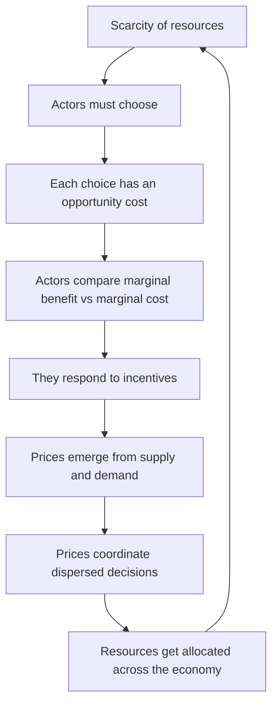
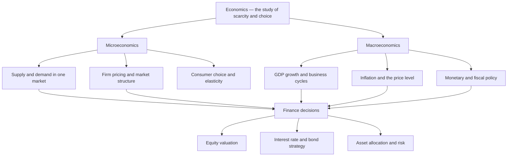

# Chapter 01 — Introduction: Economics for Finance

## 1. The Problem / The Need

Every finance professional, on any given day, is really answering one question in a hundred disguises: *given limited resources, where should they go?* A portfolio manager with ₹500 crore of investor money cannot buy every stock she likes — she must choose. A CFO with a fixed capital budget cannot fund every project the divisions propose — she must rank and reject. A central banker cannot simultaneously deliver low inflation, low unemployment, and a strong currency — she must trade one off against another. A trader cannot be long and short the same bond at the same time with the same capital.

The common thread is **scarcity**: human wants are effectively unlimited, but the resources to satisfy them — money, time, labour, raw materials, capital — are finite. If resources were infinite, there would be no economics, no finance, and no jobs for either. There would be no prices (why charge for something inexhaustible?), no interest rates (why pay to borrow what is unlimited?), and no risk premia (why demand compensation for uncertainty if you could hold everything?).

Economics exists to explain how societies, firms, and individuals cope with scarcity — how they *choose*, how those choices get *coordinated* through markets and prices, and what the *consequences* are for wealth, growth, and stability. Finance is, in a very real sense, applied economics with a price tag attached. Asset prices are just the market's running estimate of scarce future cash flows discounted at a scarcity-driven rate of interest. If you do not understand the economics underneath, you are trading symbols you cannot value.

Consider a concrete failure mode. In 2021, a bond investor who ignored macroeconomics saw only that yields were low and "bonds always rally in a crisis." An investor who *understood* the economics saw supply-chain scarcity, aggressive fiscal transfers, and a money supply surge — the ingredients of inflation. When inflation arrived in 2022 and central banks raised rates hard, the first investor lost 15-20% on "safe" government bonds — one of the worst years in the history of the asset class. The economics was the early-warning system. **This is why economics is not optional background for a finance career; it is the operating system.**

## 2. The Core Idea

The core idea of economics can be compressed into a single sentence: **because resources are scarce, every choice has a cost, and rational actors respond to incentives at the margin.** Unpack that and you have almost the whole discipline.

- *Scarcity* forces choice.
- Every choice made is another choice foregone — its **opportunity cost**.
- Actors weigh costs and benefits **at the margin** (the next unit), not in totals.
- They respond predictably to **incentives** — changes in relative costs and benefits.
- **Prices** are the signals that carry incentive information and coordinate millions of independent decisions without any central planner.

The elegance is that no one needs to "run" the economy for it to function. The Mumbai vegetable vendor, the Reliance treasury desk, and the RBI are all responding to prices and incentives, and the price system stitches their decisions into a rough coherence. Friedrich Hayek called this the price system's role in *"the use of knowledge in society"* — prices compress dispersed information (a frost in Brazil, a strike in Chile) into one number a coffee buyer in London can act on.

For a finance professional, the reframing is powerful: **a market price is not a fact, it is an argument.** It is the aggregated opinion of all participants about scarce future value, weighted by the money they are willing to put behind it. Your job is to decide whether that argument is right.

## 3. How It Works — The Model of Economic Reasoning

Economics builds its explanations on a small set of assumptions and a repeatable method. Understanding the *machine* helps you use it critically rather than dogmatically.

**The behavioural engine: constrained optimization.** Economics models actors as *purposeful*: they have objectives (utility for consumers, profit for firms, returns for investors) and face *constraints* (budgets, technology, time, capital). They choose the best feasible option. This is the famous *homo economicus* — a deliberate simplification, not a claim that humans are cold calculators. Behavioural economics later relaxes it, but the optimizing baseline is the reference point everything else is measured against.

**The coordinating mechanism: markets and prices.** Buyers and sellers meet; the interaction of **supply** and **demand** produces a price and a quantity. Price does two jobs at once: it *rations* the scarce good (only those willing to pay get it) and it *signals* producers where to send resources (high price = society wants more here).

**The reasoning method: marginal analysis and equilibrium.** Economists ask "what changes if we do one more unit?" and look for the **equilibrium** — the state where no actor has an incentive to change behaviour. Equilibrium is not a claim that the world is always at rest; it is a disciplined way to predict where forces are pushing.

*Figure 1 — The economic reasoning loop: scarcity forces choice, choice creates cost, incentives and prices coordinate allocation, and the allocation of resources continually reshapes scarcity.*

**The two altitudes: micro and macro.** The same engine is run at two zoom levels — the individual market (micro) and the whole economy (macro) — which we develop next.

## 4. Full Content — The Building Blocks in Depth

### 4.1 Scarcity, Choice, and Allocation

**Scarcity** is the fundamental condition: at zero price, the quantity people *want* exceeds the quantity *available*. Note the subtlety — scarcity is not the same as rarity. Air is rare in its clean form in Delhi in winter but was long treated as "free"; clean drinking water is abundant on Earth yet scarce where you need it. Something is *economically scarce* whenever using it for one purpose means it cannot be used for another.

Scarcity forces three questions on every economy — the classic **central problems**:

1. **What** to produce (guns or butter, roads or hospitals)?
2. **How** to produce it (labour-intensive or capital-intensive)?
3. **For whom** to produce (how is the output distributed)?

Different systems answer differently: a **market economy** answers via prices and profit; a **command economy** via central planning; a **mixed economy** (like India) via a blend of markets, regulation, and state provision.

**The Production Possibility Frontier (PPF).** The canonical picture of scarcity is a curve plotting the maximum combinations of two goods an economy can produce with its resources fully and efficiently employed — say, *consumer goods* on the x-axis and *capital goods* on the y-axis. Points *on* the curve are efficient; points *inside* are wasteful (unemployment, idle capital); points *outside* are unattainable today. The PPF is typically **bowed outward (concave)** because resources are not equally good at everything — shifting more resources into one good yields diminishing returns, so the opportunity cost rises as you specialize. Economic **growth** shifts the whole PPF outward (more resources or better technology). For a finance professional, the PPF is a mental model for the growth-vs-consumption trade-off that drives long-run interest rates and equity returns: an economy that sacrifices consumption today to build capital goods grows its future frontier faster.

### 4.2 Opportunity Cost — The Most Important Idea in the Book

**Opportunity cost** is the value of the *next-best alternative foregone* when a choice is made. It is not the money you spent; it is the best thing you *didn't* do with that money, time, or capital.

- If you hold ₹10 lakh in a zero-interest current account, the "cost" is not zero — it is the ~7% you could have earned in a fixed deposit or the equity return you skipped. That foregone return is the opportunity cost.
- A firm that uses a fully-owned building "rent-free" is not using it for free; the opportunity cost is the rent it could collect by leasing it out. This is why economists distinguish **accounting profit** (revenue minus explicit money costs) from **economic profit** (revenue minus explicit *and* implicit/opportunity costs). A business can be accounting-profitable yet economically loss-making — destroying value relative to its next-best use of capital.

This single concept is the philosophical root of nearly all of finance:

- **The discount rate / cost of capital** is literally an opportunity cost — the return investors could earn elsewhere at equal risk. WACC is opportunity cost wearing a suit.
- **Hurdle rates** for capital budgeting reject projects that earn less than the opportunity cost of the funds.
- **The risk-free rate** is the opportunity cost of holding cash instead of a T-bill.

> **First-principles takeaway:** There is no such thing as a free resource in finance. Every rupee deployed is a rupee not deployed elsewhere. "What else could this money be doing?" is the opportunity-cost question, and it is the most valuable question in the field.

### 4.3 Marginal Analysis — Thinking at the Edge

Rational actors do not decide in all-or-nothing terms; they decide **one unit at a time**. The rule is disarmingly simple:

> **Do more of an activity as long as its marginal benefit (MB) exceeds its marginal cost (MC). Stop where MB = MC.**

"Marginal" means *the next additional unit*. The optimum is the point where the last unit's benefit just covers its cost — beyond that, you are losing on each additional unit.

This resolves classic puzzles like the **diamond-water paradox**: water is far more useful in total than diamonds, yet diamonds cost more. Why? Because price reflects *marginal* value, not total value. Water is abundant, so the marginal litre is nearly worthless; diamonds are scarce, so the marginal stone is precious. Value is at the margin.

Finance runs on marginal thinking:

- A trader sizes a position by asking whether the *next* lot's expected marginal return justifies its marginal risk (marginal contribution to portfolio variance).
- **Modern Portfolio Theory** is pure marginal analysis: add an asset only if its marginal contribution to return per unit of marginal risk improves the portfolio.
- A bank lends until the marginal loan's risk-adjusted return equals its marginal cost of funds.
- **Sunk costs are irrelevant** — a corollary. Money already spent and unrecoverable should not affect the marginal decision. A fund holding a losing stock should ask "would I buy it today?" not "look how much I've already put in." The failure to think marginally — throwing good money after bad — is the *sunk cost fallacy*, and it destroys portfolios and careers.

### 4.4 Incentives — People Respond to Costs and Benefits

An **incentive** is anything that changes the costs or benefits of an action, thereby altering behaviour. The economist's mantra: *"People respond to incentives; the rest is commentary."* Change the relative price of something and you change how much of it people do.

- Cut the capital gains tax and you incentivize longer holding periods and more risk-taking.
- Raise interest rates and you incentivize saving over spending, and safe assets over risky ones.
- Offer executives stock options and you incentivize behaviours that raise the share price — for better (aligning them with owners) or worse (short-termism, manipulation).

Incentives also have a dark side that finance must watch for:

- **Moral hazard:** when someone is insulated from the consequences of risk, they take more of it. Banks deemed "too big to fail" take excessive risk expecting a bailout — a central lesson of 2008.
- **Adverse selection:** when hidden information means the wrong people are attracted to a deal — e.g., only the sickest buy insurance, only the riskiest borrowers accept a high rate.
- **Principal-agent problems:** the fund manager (agent) may not act in the investor's (principal's) best interest; management fees and performance fees are incentive structures designed to fix this — and can misfire.

The whole architecture of financial regulation, compensation design, and contract structuring is applied incentive economics.

### 4.5 Positive vs Normative Economics

A discipline-defining distinction:

- **Positive economics** describes *what is* — objective, testable, factual statements. *"Raising interest rates reduces inflation with a lag of 12-18 months."* It can be right or wrong, and data can adjudicate.
- **Normative economics** prescribes *what ought to be* — value judgments involving ethics and priorities. *"The central bank should prioritize fighting inflation over reducing unemployment."* No dataset can prove it; it depends on what you value.

Why finance professionals must keep these separate: **investment decisions require positive analysis; policy opinions are normative.** When a strategist says "the Fed *should* cut rates," that is a normative wish. Your money depends on the positive question: "*will* they cut, and what happens to my assets if they do?" Confusing what you *want* to happen with what *will* happen is one of the most expensive errors in markets — it is the emotional root of holding losers and fighting the trend. Discipline yourself to ask the positive question first.

### 4.6 Micro vs Macro — The Two Altitudes of Economics

**Microeconomics** studies individual decision-makers and specific markets: how a single household allocates its budget, how a firm sets prices, how the market for a particular stock or commodity clears. Its tools are supply and demand, elasticity, market structures (competition to monopoly), and marginal analysis.

**Macroeconomics** studies the economy *as a whole*: aggregate output (GDP), the overall price level (inflation), unemployment, interest rates, exchange rates, and the business cycle. Its tools are aggregate demand and supply, monetary and fiscal policy, and models of growth.

They are not separate subjects but two zoom levels on the same system. Macro outcomes emerge from micro behaviour (the **micro-foundations** of macro), and micro decisions happen inside a macro environment (a firm's pricing depends on economy-wide inflation).

| Dimension | Microeconomics | Macroeconomics |
|---|---|---|
| **Focus** | Individual agents, single markets | Whole-economy aggregates |
| **Key questions** | What price? How much to produce? How does this market clear? | What drives growth, inflation, unemployment? |
| **Core tools** | Supply-demand, elasticity, marginal analysis, market structure | AD-AS, monetary/fiscal policy, growth models |
| **Typical variables** | Price of a good, firm output, consumer utility | GDP, CPI, interest rate, exchange rate |
| **Finance application** | Equity valuation, credit analysis, pricing a bond | Asset allocation, rate strategy, currency, cycle timing |
| **Analogy** | Studying one tree | Studying the forest and its climate |

*Figure 2 — Micro and macro are two altitudes of the same discipline, and both feed directly into the core finance decisions of valuing equities, positioning in rates, and allocating capital.*

### 4.7 Why Finance Professionals Must Understand Economics

Pull the threads together. Asset prices are driven by three economic forces, and every one of them is an economics question:

1. **Expected cash flows** — depend on the *micro* health of the firm and its industry, and the *macro* strength of the economy (a recession crushes earnings across the board).
2. **The discount rate** — built on the *macro* risk-free rate (set by central bank policy and inflation expectations) plus risk premia (driven by cycle-dependent risk appetite).
3. **Risk and uncertainty** — the *macro* volatility of growth, inflation, and policy, plus *micro* competitive and credit risk.

Because policy, cycles, and markets *drive asset prices*, an analyst who cannot read the economic environment is valuing a company as if it exists in a vacuum. Some concrete linkages every finance professional relies on:

- **Interest rates → bond prices** (inverse) and → equity valuations (higher rates lower the present value of distant cash flows, hitting growth stocks hardest).
- **Inflation → real returns, sector rotation** (financials and commodities tend to benefit, long-duration assets suffer) and → currency values.
- **GDP / the business cycle → earnings, credit defaults, and the choice between cyclical and defensive positioning.**
- **Exchange rates → export/import competitiveness, foreign-currency debt burdens, and returns on overseas assets.**
- **Fiscal and monetary policy → liquidity, the shape of the yield curve, and the price of virtually every asset.**

This is why bank research departments employ armies of economists, why the two most-watched events in global markets are central-bank meetings and inflation prints, and why "don't fight the Fed" (or the RBI) is a survival rule.

### 4.8 The Economic Way of Thinking Applied to Markets

Beyond specific facts, economics gives you a *mental toolkit* — a way of seeing:

- **Everything has a cost** (opportunity cost). There are no free lunches; a "high yield with no risk" is a contradiction the market will eventually enforce.
- **Think at the margin, ignore sunk costs.** Decisions are about the next unit, not the past.
- **Incentives shape behaviour.** Ask "who benefits, and what are they incentivized to do?" before trusting any counterparty, forecast, or corporate action.
- **People and markets are (roughly) rational and self-interested,** so expect arbitrage to close obvious mispricings — free money is quickly competed away (the intuition behind market efficiency).
- **Look for equilibrium and unintended consequences.** Every intervention (a price cap, a subsidy, a tax) produces second-order effects; the economic thinker traces them (a rent cap creates housing shortages).
- **Separate the positive from the normative.** Trade on what *will* happen, not what you wish would.
- **Trade-offs, not solutions.** There is rarely a costless win; there is a menu of trade-offs. Recognizing that is maturity in both economics and investing.

## 5. Worked and Real Examples

### Example 1 — Opportunity Cost in a Capital Budgeting Decision (Micro / Corporate Finance)

A manufacturing firm has ₹100 crore of surplus cash. Management proposes a new plant with an expected accounting return of 9%. It looks profitable — until you apply opportunity-cost thinking. The firm's investors could earn 11% on comparable-risk investments elsewhere; that 11% is the firm's **cost of capital**, an opportunity cost. The plant's *economic* return is 9% − 11% = **−2%**. Even though it makes accounting profit, it *destroys* value, because the capital's next-best use earns more. The correct decision is to reject the plant and return cash to shareholders (buyback/dividend), who can capture the 11%. **The lesson:** finance evaluates every decision against opportunity cost, not against zero. This is the entire logic of NPV and the hurdle rate.

### Example 2 — Incentives and Moral Hazard in the 2008 Crisis (Macro / Systemic)

Before 2008, mortgage originators earned fees for *writing* loans but sold the credit risk onward via securitization. Their incentive was volume, not loan quality — so they wrote loans to borrowers who could not repay. Rating agencies were paid by the issuers whose bonds they rated — an incentive to be generous. Banks believed they were "too big to fail" — moral hazard encouraging excess leverage. Every actor was responding rationally to *misaligned incentives*, and the aggregate result was a systemic collapse. **The finance lesson:** before trusting any financial product or counterparty, map the incentives. Post-crisis reforms (risk-retention "skin in the game" rules, changed rating-agency oversight) were pure incentive re-engineering. An analyst who had asked "what is everyone here incentivized to do?" would have smelled the rot.

### Example 3 — Positive vs Normative and the Rate-Cut Trade (Markets)

In late 2023, many investors *wanted* the Fed to cut rates and *believed* it should ("the economy is slowing, cuts would help"). That is normative. Markets priced in six or seven cuts for 2024. The *positive* question — "given sticky inflation, what *will* the Fed actually do?" — pointed to far fewer cuts. Investors who traded their normative hopes (long rate-sensitive bonds expecting aggressive cuts) were repriced painfully as only a couple of cuts materialized. **The lesson:** the market pays you for correctly answering the positive question, and punishes you for trading your normative preferences. Separating the two is a professional discipline, not a philosophy-class nicety.

### Example 4 — Marginal Analysis in Position Sizing (Micro / Portfolio)

A hedge fund likes a stock and has already built a 4% position. Should it add more? The naive view looks at total conviction. The economic view is marginal: does the *next* 1% add more expected return than the marginal risk it contributes — including its correlation with existing holdings and its effect on portfolio concentration? Past sunk conviction is irrelevant; only the marginal trade-off matters. This marginal MB-vs-MC logic, applied across all assets until the marginal risk-adjusted return is equalized, *is* portfolio optimization.

## 6. Connections

- **To later micro chapters:** Sections 4.1-4.4 seed demand-supply, elasticity, consumer and producer theory, and market structures. Marginal analysis reappears as marginal utility, marginal cost, and marginal revenue.
- **To later macro chapters:** Section 4.6 opens onto national income (GDP), money and banking, inflation, the business cycle, and monetary/fiscal policy — the direct drivers of interest rates and asset prices.
- **To Financial Management / Valuation:** Opportunity cost → cost of capital, WACC, hurdle rates, NPV. Marginal analysis → portfolio theory and capital rationing.
- **To Financial Markets:** The price system and equilibrium → market efficiency, arbitrage, and price discovery. Incentives → agency theory, corporate governance, and compensation design.
- **To Risk Management:** Moral hazard, adverse selection, and asymmetric information underpin credit risk, insurance, and regulation.
- **To Behavioural Finance:** The rational *homo economicus* baseline is the benchmark against which sunk-cost fallacy, loss aversion, and herding are defined as deviations.

## 7. Key Terms

| Term | Meaning |
|---|---|
| **Scarcity** | Limited resources against unlimited wants — the root condition of economics |
| **Choice** | The unavoidable act of selecting among alternatives under scarcity |
| **Opportunity cost** | Value of the next-best alternative foregone |
| **Marginal analysis** | Comparing the benefit and cost of one additional unit |
| **Incentive** | Anything that alters the cost/benefit of an action and thus behaviour |
| **Microeconomics** | Study of individual agents and single markets |
| **Macroeconomics** | Study of the whole economy — GDP, inflation, unemployment, policy |
| **Positive economics** | Objective statements of what *is* (testable) |
| **Normative economics** | Value-based statements of what *ought to be* |
| **Production Possibility Frontier (PPF)** | Curve of maximum output combinations given resources |
| **Economic vs accounting profit** | Profit after opportunity (implicit) costs vs after only explicit money costs |
| **Sunk cost** | Unrecoverable past expenditure, irrelevant to marginal decisions |
| **Moral hazard** | Excess risk-taking when insulated from the consequences |
| **Adverse selection** | Wrong actors self-select into a deal due to hidden information |
| **Principal-agent problem** | Conflict of interest between an owner and a decision-maker acting on their behalf |
| **Equilibrium** | State where no actor has an incentive to change behaviour |
| **Cost of capital** | The opportunity cost of funds — the return available elsewhere at equal risk |

## 8. Common Confusions

- **"Opportunity cost = money spent."** No — it is the *foregone alternative*, which may involve no cash outlay (foregone rent, foregone return). Cost in economics is always about *what you gave up*, not what you paid.
- **"Free means costless."** A free tote bag, free cash in a current account, a rent-free building — all carry opportunity costs. "Free" in finance is a red flag to investigate, not a fact to accept.
- **"Total value determines price."** Price reflects *marginal* value (diamond-water paradox). Abundant, highly useful things can be cheap; scarce, less-useful things can be dear.
- **"Sunk costs should be recovered."** They should be *ignored*. Only future marginal costs and benefits matter. Chasing sunk costs is a documented path to ruin.
- **"Micro and macro are separate subjects."** They are two zoom levels on one system; macro emerges from micro behaviour and micro happens inside a macro environment.
- **"Positive vs normative = correct vs incorrect."** No — positive is *factual/testable* (and can be wrong); normative is *value-laden* (and cannot be settled by data). The error is confusing what you *want* with what *will* happen.
- **"Economics assumes people are selfish robots."** *Homo economicus* is a modelling simplification, a reference baseline — not a literal claim; behavioural economics maps the deviations.
- **"Rational markets means prices are always right."** Rationality and arbitrage push *toward* correct prices; they do not guarantee prices are right at every instant — which is exactly where opportunity for the skilled analyst lives.

## 9. First-Principles Recap

Strip everything down and rebuild:

1. **Resources are scarce.** Wants exceed means. This is inescapable.
2. **Scarcity forces choice.** You cannot have everything, so you must select.
3. **Every choice has a cost** — the next-best thing foregone (opportunity cost).
4. **Rational actors choose at the margin,** doing more of anything until marginal benefit equals marginal cost, and ignoring sunk costs.
5. **Actors respond to incentives** — changes in relative costs and benefits.
6. **Prices, born of supply and demand, coordinate** these countless independent choices and push markets toward equilibrium.
7. **Zoom in (micro)** to see single markets and firms; **zoom out (macro)** to see growth, inflation, and policy — the same logic at two altitudes.
8. **In finance, asset prices are the present value of scarce future cash flows, discounted at an opportunity-cost rate, adjusted for risk.** Therefore *economics is the engine of valuation*: understand scarcity, choice, incentives, and the macro cycle, and you understand what moves prices.

Everything else in finance — DCF, WACC, portfolio theory, the yield curve, currency dynamics — is these eight steps in specialized clothing.

## 10. Quick-Reference — Why a Finance Pro Cares (Interview Points)

- **Economics is the operating system of finance.** Asset prices = f(cash flows, discount rate, risk) — and all three are economic variables driven by micro fundamentals and macro policy/cycles.
- **Opportunity cost = cost of capital.** Every valuation, hurdle rate, and NPV is opportunity-cost reasoning. If asked "what's your discount rate and why," the answer is "the return available elsewhere at equal risk."
- **Think at the margin; ignore sunk costs.** Position sizing, capital budgeting, and cutting losers are all marginal decisions. The sunk-cost fallacy is a top career-killer — name it in interviews.
- **Incentives explain behaviour and risk.** Moral hazard, adverse selection, and agency problems drive crises, governance, and compensation design. "Who benefits and what are they incentivized to do?" is a due-diligence reflex.
- **Separate positive from normative.** Trade on what *will* happen, not what you wish. Confusing the two is the emotional root of losing money.
- **Micro values the security; macro sets the environment.** You cannot value an equity without the earnings cycle, or a bond without the rate/inflation regime.
- **"Don't fight the central bank."** Monetary and fiscal policy move liquidity and the discount rate, and therefore every asset. Central-bank meetings and inflation prints are the two highest-impact events in markets.
- **The rate-price relationships to know cold:** rates up → bond prices down; rates up → long-duration/growth equities down; inflation up → real returns down, currency and sector rotation effects; GDP up → earnings up, defaults down.
- **One-line philosophy:** *Finance is applied economics — the discipline of allocating scarce capital across time and uncertainty to its highest-value use.* Master the economics and the finance follows.
