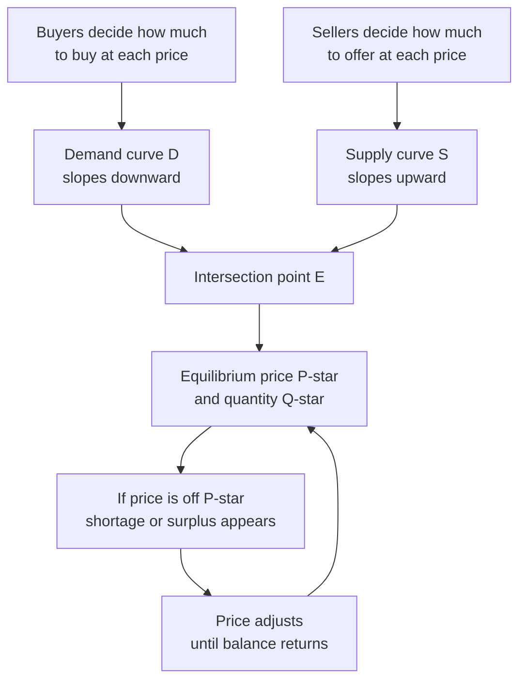
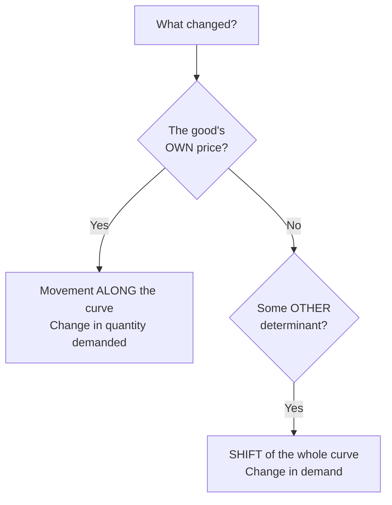
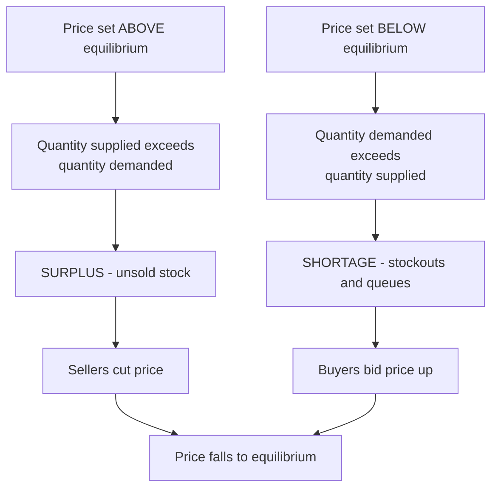
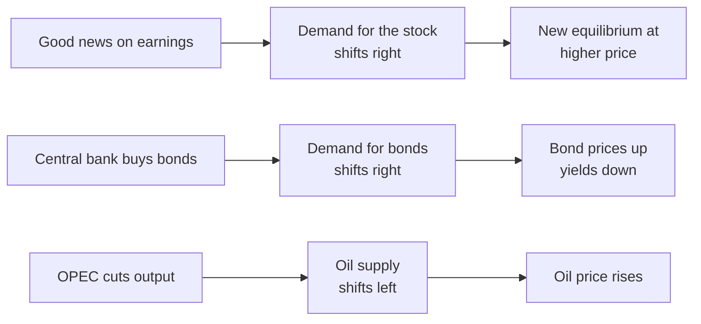

# Chapter 02 — Demand, Supply and Market Equilibrium

## 1. The Problem / The Need

Every economy — from a village vegetable market to the New York Stock Exchange — must answer three brutal questions: **what** gets produced, **how much** of it, and **at what price**. There is no central planner in a market economy handing out these answers. So who decides that a litre of milk costs ₹60, that a share of Reliance trades at ₹1,300, or that the 10-year government bond yields 7%?

The answer is a coordinating mechanism that emerges from millions of independent decisions: **the interaction of demand and supply**. Buyers want to pay as little as possible; sellers want to charge as much as possible. Out of this tug-of-war a single number — **the market price** — emerges that reconciles both sides. Understanding *how* that number is formed, *why* it moves, and *what* it signals is the single most important skill in economics, and it is the foundation of every valuation, every trade, and every macro forecast a finance professional will ever make.

For a finance aspirant the stakes are concrete. A bond price is nothing but the equilibrium of demand for and supply of that bond. An exchange rate is the equilibrium of demand for and supply of a currency. A stock's price at 3:30 PM is the equilibrium of buy and sell orders. If you cannot reason cleanly about *why* a curve shifts and *what* happens to price and quantity, you cannot reason about markets at all. This chapter builds that reasoning from first principles.

## 2. The Core Idea

The core idea is deceptively simple and enormously powerful:

> **Price is the variable that adjusts to make the quantity people want to buy equal the quantity people want to sell.**

Demand describes buyer behaviour: *how much* buyers wish to purchase at each possible price. Supply describes seller behaviour: *how much* sellers wish to offer at each possible price. Neither side alone determines the price. Price is an **emergent property** of their interaction — the one price at which the plans of buyers and the plans of sellers are mutually consistent. Economists call this **equilibrium**.

Two further ideas make this a *mechanism* rather than a static picture:

1. **The price does work.** When there is too much or too little, the price itself changes to fix the imbalance. A shortage pushes price up; a surplus pushes it down. This self-correcting property is the "invisible hand."
2. **Prices carry information.** A rising price tells producers "make more" and tells consumers "use less." Prices are a compression of dispersed knowledge — no one needs to know *why* copper is scarce; the higher price alone reallocates it to its most valued uses.

For markets, the punchline is that **an asset price is a live equilibrium**, re-solved continuously as new information shifts demand and supply. That is why prices move on news: news changes the curves, and the equilibrium re-forms at a new price.

## 3. How It Works — The Model

The demand-and-supply model has four moving parts:

1. **The demand curve (D)** — a downward-sloping line in price–quantity space showing quantity demanded at each price.
2. **The supply curve (S)** — an upward-sloping line showing quantity supplied at each price.
3. **The equilibrium point (E)** — where D and S intersect, giving equilibrium price P* and equilibrium quantity Q*.
4. **The adjustment process** — the forces that drive price toward P* whenever it is away from it.

Convention: economists put **price on the vertical (Y) axis** and **quantity on the horizontal (X) axis**, even though we usually think of quantity as depending on price. This is a historical quirk (from Alfred Marshall) you simply memorise.

*Figure 1 — The logical skeleton of the model: two behavioural curves meet, define an equilibrium, and a feedback loop pushes any off-equilibrium price back toward it.*

The genius of the model is the feedback loop at the bottom. Equilibrium is not just a point where lines cross; it is a **stable resting state** the market is actively pulled toward. That is what makes it a theory of price *formation* and not merely a description.

## 4. Full Content

### 4.1 Demand

**Quantity demanded** is the amount of a good buyers are *willing and able* to purchase at a given price in a given period. Note the two conditions: willingness (they want it) and ability (they can pay). A billionaire who wants a yacht but a pauper who merely wishes for one contribute very differently to demand.

**The Law of Demand:** *Other things equal (ceteris paribus), as the price of a good rises, the quantity demanded falls, and as price falls, quantity demanded rises.* Demand curves slope downward.

**Why does the law hold? Three underlying reasons:**

- **Substitution effect** — when a good gets more expensive relative to alternatives, buyers switch toward the now-cheaper substitutes. If tea's price rises, some drinkers move to coffee.
- **Income effect** — a higher price makes buyers effectively poorer (their money buys less), so they consume less of most goods.
- **Diminishing marginal utility** — each additional unit consumed delivers less extra satisfaction, so buyers will only take more units if the price is lower. This is the deepest reason and is developed fully in the consumer-theory chapter.

**The demand schedule and curve.** A schedule is a table of price–quantity pairs; the curve is its graph. Example schedule for a hypothetical stock ETF:

| Price (₹) | Quantity demanded (units) |
|-----------|---------------------------|
| 100       | 20                        |
| 90        | 40                        |
| 80        | 60                        |
| 70        | 80                        |
| 60        | 100                       |

Plotting these gives a downward-sloping demand curve.

**Determinants of demand (the "other things" held equal).** When any of these change, the *entire curve shifts*:

1. **Income** — for *normal goods*, higher income raises demand; for *inferior goods* (e.g., instant noodles, public-transport bus rides), higher income *lowers* demand as people upgrade.
2. **Prices of related goods** — *substitutes* (tea/coffee): a rise in one raises demand for the other. *Complements* (cars/petrol, printers/ink): a rise in one lowers demand for the other.
3. **Tastes and preferences** — fashion, health trends, advertising.
4. **Expectations** — if buyers expect prices to rise tomorrow, demand rises today (crucial in asset markets — see §4.7).
5. **Number of buyers** — market demand is the horizontal sum of individual demands; more buyers shift it right.

**Exceptions to the law of demand** (curves that slope *upward* over some range):
- **Giffen goods** — extreme inferior staples where the income effect overwhelms the substitution effect (a contested, largely historical case, e.g., staple grain for the very poor).
- **Veblen / conspicuous goods** — luxury items (designer bags, prestige watches) bought *because* they are expensive; higher price signals status.
- **Speculative assets** — a rising price can attract *more* buyers who expect further rises (momentum). This is the finance-relevant exception and the seed of bubbles.

### 4.2 Supply

**Quantity supplied** is the amount sellers are willing and able to offer at a given price in a given period.

**The Law of Supply:** *Ceteris paribus, as the price of a good rises, the quantity supplied rises, and as price falls, quantity supplied falls.* Supply curves slope upward.

**Why?** Higher prices (a) make production more profitable, drawing in more output and more firms, and (b) cover the *rising marginal cost* of producing extra units (producing more usually costs more per unit as capacity is strained). Producers will only incur higher marginal costs if the price justifies it.

**Determinants of supply (shift the whole curve):**

1. **Input (factor) prices** — cheaper labour, raw materials, or capital lower costs and raise supply.
2. **Technology** — productivity improvements shift supply right (more output per input).
3. **Prices of related goods in production** — if wheat becomes more profitable, farmers shift land away from corn, cutting corn supply.
4. **Expectations** — if sellers expect higher future prices, they may withhold supply now (store the grain, hold the shares).
5. **Number of sellers** — more firms shift market supply right.
6. **Government policy** — taxes raise effective costs (shift supply left / up); subsidies do the reverse; regulation can restrict supply.

### 4.3 Movement Along vs Shift Of a Curve — the single most tested distinction

This is the concept students get wrong most often, and it matters enormously for reasoning about markets.

- A **change in the good's OWN price** causes a **movement ALONG** the curve — a *change in quantity demanded/supplied*. You slide from one point on the same curve to another.
- A change in **any OTHER determinant** (income, related prices, tastes, technology, expectations, number of participants) causes a **SHIFT OF** the entire curve — a *change in demand/supply*.

| Trigger | Effect on demand | Terminology |
|---------|------------------|-------------|
| Good's own price changes | Move along the curve | Change in *quantity demanded* |
| Income, tastes, related-good prices, expectations change | Whole curve shifts left/right | Change in *demand* |

The same logic applies to supply. Rightward shift of demand = "increase in demand"; leftward = "decrease in demand." For supply, a rightward/downward shift = "increase in supply."

*Figure 2 — The decision rule for distinguishing a movement along a curve from a shift of the curve. Own-price moves you along, everything else shifts the curve.*

### 4.4 Market Equilibrium

**Equilibrium** is the price–quantity pair (P*, Q*) where quantity demanded exactly equals quantity supplied. At P*, every buyer willing to pay P* finds a seller, and every seller willing to sell at P* finds a buyer. There is no residual pressure to change. The market **clears**.

Using the schedules, suppose demand and supply meet at ₹80, quantity 60. Then P* = ₹80 and Q* = 60 is the equilibrium.

Algebraically, if demand is Qd = a − bP and supply is Qs = c + dP, set Qd = Qs and solve for P*:

> a − bP = c + dP → P* = (a − c) / (b + d).

This little formula is worth internalising: the equilibrium price depends on the *intercepts* (a, c — the autonomous levels of demand and supply) and the *slopes* (b, d — sensitivities to price). Change any of these and P* moves — that is exactly what a "shift" does mathematically.

### 4.5 Surpluses and Shortages — the price mechanism in action

What if the price is *not* at P*?

- **If price is ABOVE P* → SURPLUS (excess supply).** Sellers offer more than buyers want. Unsold inventory piles up. To clear it, sellers cut prices. Price falls toward P*.
- **If price is BELOW P* → SHORTAGE (excess demand).** Buyers want more than sellers offer. Queues form, goods sell out. Buyers bid the price up; sellers raise it. Price rises toward P*.

This is the **price mechanism** (the "invisible hand," Adam Smith). No one commands it; the self-interest of buyers and sellers, transmitted through price, does the balancing.

*Figure 3 — The self-correcting price mechanism. Any price away from equilibrium generates a surplus or shortage whose pressure pushes price back to P-star.*

**Price controls interrupt the mechanism.** If the government imposes:
- a **price ceiling** (a legal *maximum*, e.g., rent control) *below* equilibrium → a persistent **shortage** (demand exceeds supply and price can't rise to clear it); black markets and queues follow.
- a **price floor** (a legal *minimum*, e.g., minimum wage, agricultural support price) *above* equilibrium → a persistent **surplus** (supply exceeds demand); e.g., unemployment or grain gluts.

These are heavily tested and directly relevant to policy analysis in finance (interest-rate caps, currency pegs are cousins of price controls).

### 4.6 How Shifts Change Equilibrium — the "four cases"

When a curve shifts, the equilibrium moves predictably. Memorise these four base cases:

| Shift | Effect on P* | Effect on Q* |
|-------|-------------|-------------|
| Demand increases (D right) | Rises | Rises |
| Demand decreases (D left) | Falls | Falls |
| Supply increases (S right) | Falls | Rises |
| Supply decreases (S left) | Rises | Falls |

When **both** curves shift, one of price or quantity is *ambiguous* and depends on the relative sizes of the shifts. E.g., if both demand and supply increase, Q* definitely rises but P* could go either way. Being able to reason this out — rather than memorise — is a mark of real understanding.

### 4.7 Mapping to Asset Prices and Financial Markets

This is where the chapter earns its place in a *finance* guide. Financial markets are the purest demand-supply systems that exist, because the "good" is homogeneous and information moves instantly.

**Asset price = equilibrium of order flow.** At any instant a stock's price is where buy orders (demand) meet sell orders (supply) in the limit-order book. News that improves earnings expectations shifts the *demand* curve for the stock right → price rises. The price move is literally a re-solved equilibrium.

**The peculiarity of asset demand.** For ordinary goods, higher price → lower quantity demanded (downward-sloping demand). For assets, expectations dominate: a rising price can *raise* expected future prices, pulling in momentum buyers — demand can slope *upward* over a range. This is the speculative exception (§4.1) and explains bubbles (self-reinforcing demand shifts) and crashes (self-reinforcing supply/sell shifts). Fundamentals eventually reassert a "true" equilibrium (intrinsic value), but the path can overshoot violently.

**Bonds and interest rates.** A bond's price and its yield move inversely. Higher demand for bonds → higher bond prices → lower yields. When a central bank does quantitative easing (buys bonds), it shifts bond *demand* right → prices up, yields down. When governments issue more debt, bond *supply* shifts right → prices down, yields up. Every interest-rate story is a bond demand-supply story.

**Currencies (FX).** An exchange rate is the equilibrium price of one currency in terms of another. If foreign investors want to buy Indian assets, they demand rupees → rupee appreciates. Higher domestic interest rates attract capital → demand for the currency rises → it strengthens. Central-bank intervention is literally shifting the supply of, or demand for, the home currency.

**Commodities.** Oil at $80 is a global demand-supply equilibrium. An OPEC production cut shifts *supply* left → price rises. A recession shifts *demand* left → price falls. Commodity traders live inside this diagram.

*Figure 4 — The same demand-supply logic re-solving across three markets: equities, bonds, and commodities. News shifts a curve and the equilibrium price moves.*

**Market efficiency ties in.** In an efficient market, prices adjust to new information almost instantly — the equilibrium re-forms so fast that you cannot systematically trade ahead of it. This is the demand-supply model running at the speed of light, and it is the conceptual bridge to the Efficient Market Hypothesis you will meet later.

## 5. Worked / Real Examples

**Example 1 — A supply shock in onions (movement of the curve).**
A poor monsoon destroys part of India's onion crop. Input availability collapses, so the **supply curve shifts left**. At the old price ₹40/kg there is now a **shortage** (demand exceeds supply). Prices are bid up; the new equilibrium settles at, say, ₹90/kg with a lower quantity traded. Note the sequence: an *external determinant* (weather) shifted supply → shortage at old price → price rose (a *movement along the demand curve*, since only the good's own price changed for buyers). This single episode contains both a shift (supply) and a movement-along (demand) — exactly the distinction from §4.3.

**Example 2 — An interest-rate cut and the stock market (finance).**
The RBI unexpectedly cuts the repo rate. Two things happen. (1) Bonds: lower rates mean investors accept lower yields, so **demand for existing higher-coupon bonds rises**, pushing bond prices up. (2) Equities: cheaper borrowing raises expected corporate profits and makes bonds a less attractive alternative, so **demand for stocks shifts right** → equity prices rise. A finance professional reads the rate cut as a simultaneous rightward demand shift across bond and equity markets. The Nifty rallying on a rate cut *is* a demand-curve shift you can draw.

**Example 3 — Rent control (price ceiling creating a persistent shortage).**
A city caps rents at ₹15,000/month when the market-clearing rent is ₹25,000. Because the ceiling is *below* equilibrium, quantity demanded (people wanting cheap flats) far exceeds quantity supplied (landlords willing to rent at that price; some convert to other uses). The result is a **chronic housing shortage**, long waiting lists, under-maintenance, and black-market "key money." The price mechanism has been switched off, so the shortage does not self-correct. This is the classic demonstration that prices *do work* — and that blocking them has costs.

**Example 4 — Both curves shift (ambiguous outcome).**
During a tech boom, demand for semiconductor chips surges (demand shifts right) while new fabs come online expanding capacity (supply shifts right). Quantity of chips traded *definitely* rises. But the *price* is ambiguous: if demand outran capacity (as in 2021), prices *rose* and shortages appeared; when capacity later caught up, prices *fell*. Reasoning through the ambiguity — rather than reciting a rule — is the interview-grade skill.

## 6. Connections

- **Consumer theory (next chapters):** the downward demand curve is derived from utility maximisation and diminishing marginal utility. Supply comes from producer theory and marginal cost.
- **Elasticity (Chapter 03/04):** *how much* quantity responds to a price change (the *slope/steepness* of the curves) determines how large the equilibrium moves are and who bears a tax. Demand-supply tells you the *direction*; elasticity tells you the *magnitude*.
- **Market structures:** the clean model assumes perfect competition (many price-taking buyers and sellers). Monopoly, oligopoly, and monopolistic competition modify how price is set.
- **Macroeconomics:** aggregate demand and aggregate supply (AD–AS) scale this logic up to the whole economy, determining the price level (inflation) and GDP.
- **Finance / markets:** asset pricing, bond-yield determination, FX rates, the Efficient Market Hypothesis, and supply-demand order-book microstructure are all direct applications.
- **Public policy:** taxes, subsidies, price ceilings/floors, and welfare (consumer + producer surplus, deadweight loss) all build on this diagram.

## 7. Key Terms

- **Quantity demanded / supplied** — amount buyers/sellers want at a *specific* price.
- **Demand / Supply** — the *whole relationship* (curve) across all prices.
- **Law of demand / supply** — inverse (demand) and direct (supply) relation between own price and quantity.
- **Ceteris paribus** — "other things held equal"; the assumption that isolates one variable.
- **Determinants** — the non-price factors that *shift* a curve.
- **Movement along vs shift of** — own-price change (along) vs other-factor change (shift).
- **Equilibrium (P*, Q*)** — price/quantity where Qd = Qs; the market clears.
- **Surplus / Shortage** — excess supply (price too high) / excess demand (price too low).
- **Price mechanism / invisible hand** — self-correcting adjustment of price to clear markets.
- **Price ceiling / floor** — legal maximum (→ shortage) / minimum (→ surplus) price.
- **Normal / inferior good** — demand rises / falls with income.
- **Substitutes / complements** — goods used instead of / together with each other.
- **Giffen / Veblen goods** — exceptions where demand can slope upward.
- **Market clearing** — state in which there is no excess demand or supply.

## 8. Common Confusions

1. **"Demand" vs "quantity demanded."** Saying "demand rose because the price fell" is *wrong*. A price fall raises *quantity demanded* (movement along). "Demand rose" means the whole curve shifted due to some *other* factor. Precision here separates novices from professionals.

2. **Shift vs movement.** The single biggest error (§4.3). Own price → move along; anything else → shift. Ask "what changed?" first.

3. **Which axis?** Price is on the vertical axis even though quantity "depends on" price. Just memorise it.

4. **Confusing a surplus with a shift.** A surplus is a *disequilibrium at a wrong price on fixed curves*, not a shift. The curves don't move; the price is simply off P* and will adjust.

5. **Thinking equilibrium means "fair" or "good."** Equilibrium is where plans are consistent, not where outcomes are just. A market can clear at a price that leaves poor people unable to afford food.

6. **Assuming demand curves always slope down for assets.** In speculative markets, expectation-driven demand can slope *up* (momentum, bubbles). Don't blindly apply the goods-market intuition to a rallying stock.

7. **Believing price controls fix shortages.** A ceiling below equilibrium *causes* a lasting shortage; it does not cure one. The mechanism is switched off, not the scarcity.

## 9. First-Principles Recap

Strip everything away and you are left with this chain:

1. Scarcity forces choices; choices must be coordinated without a central planner.
2. Buyers, by self-interest and diminishing marginal utility, buy more when things are cheaper → **demand slopes down**.
3. Sellers, facing rising marginal cost and profit motive, offer more when prices are higher → **supply slopes up**.
4. There is exactly one price where the two plans agree — **equilibrium** — and the market clears there.
5. Away from that price, a **surplus or shortage** appears, and the *price itself* moves to erase it. Prices are self-correcting and information-carrying.
6. Change a *non-price* factor and a whole curve **shifts**, moving the equilibrium to a new (P*, Q*).
7. **Financial markets are this model running live:** stock, bond, currency, and commodity prices are continuously re-solved equilibria of demand and supply, moving on news because news shifts the curves.

If you can draw the two curves, label the axes, distinguish a shift from a movement, and trace how a shock reaches a new equilibrium, you can reason about almost any market question — real-economy or financial.

## 10. Quick-Reference — Why a Finance Pro Cares

- **Every price is an equilibrium.** Stock, bond, FX, commodity — all are demand-meets-supply. Learn to *draw the shift* behind any market move.
- **Bond price ↔ yield are inverse.** More bond demand → higher price → lower yield. QE = demand-shift right; heavy issuance = supply-shift right. This is the entire logic of rates.
- **News moves markets by shifting curves.** Earnings beats shift equity demand right; supply shocks (OPEC) shift commodity supply left. Trace the curve, predict the price direction.
- **Direction vs magnitude.** Demand-supply gives *direction* of the price move; *elasticity* gives *size*. Interview answers should pair both.
- **Speculative demand can slope up.** Momentum, bubbles, and crashes are self-reinforcing curve shifts. Don't mechanically apply goods-market intuition to assets.
- **Price controls / pegs create persistent imbalances.** Rate caps, currency pegs, and rent controls are price ceilings/floors — expect shortages (ceilings) or surpluses (floors) and eventual breaks.
- **Both-curves-shift → one variable is ambiguous.** Being able to reason the ambiguity (e.g., chip shortage of 2021) is a senior-level signal.
- **The one-line thesis:** *Markets are demand and supply solving for a price in real time; your edge is knowing which curve a shock hits, which way it moves, and by how much.*
