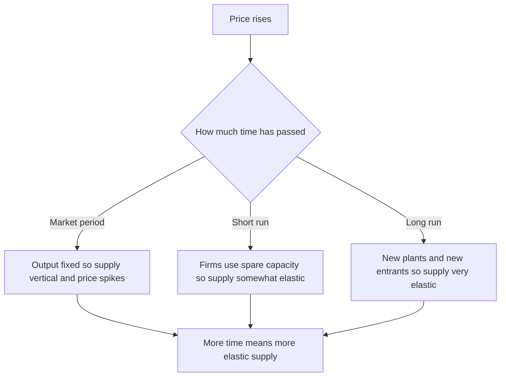
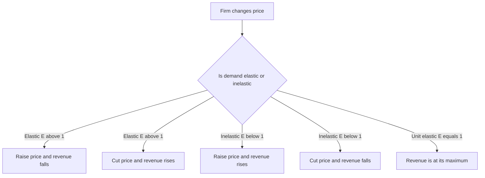

# Chapter 03 — Elasticity

## 1. The Problem / Need

Chapter 2 gave us the **law of demand** ("when price rises, quantity demanded falls") and the **law of supply** ("when price rises, quantity supplied rises"). These laws tell us the *direction* of a response. But direction is not enough for anyone who has to make a real decision.

Suppose you run an airline and you are thinking about raising fares by 10%. The law of demand tells you passengers will fall. That is useless on its own. You need to know: **by how much?** If a 10% fare hike loses you only 2% of passengers, you make more money. If it loses you 25% of passengers, you go bankrupt. Same direction, opposite business outcome.

The same question sits under almost every important decision in economics and finance:

- A **finance minister** proposing a tax on cigarettes or petrol needs to know whether people will keep buying (so the tax raises revenue and doesn't kill the industry) or stop buying (so the tax fails to raise money but does change behaviour).
- A **central bank** cutting interest rates needs to know how *responsive* investment and consumption are to the rate change — a flat response means monetary policy is weak.
- A **portfolio manager** needs to know how sensitive a bond's price is to a change in yields, or how sensitive a company's sales are to a recession.
- A **SaaS company** setting subscription prices needs to know whether a price increase will be swamped by churn or absorbed quietly.

The missing tool is a **measure of responsiveness** — a number that says, "when this variable moves 1%, that variable moves X%." That number is **elasticity**. Elasticity is arguably the single most useful concept a finance professional takes from microeconomics, because finance is fundamentally about *sensitivities*: how much does the thing I care about move when something else moves?

## 2. The Core Idea

**Elasticity is the percentage change in one variable divided by the percentage change in another.** It is a unit-free measure of responsiveness.

$$\text{Elasticity} = \frac{\%\ \text{change in the effect}}{\%\ \text{change in the cause}}$$

Three features make elasticity powerful, and each has a direct finance parallel:

1. **It uses percentages, not absolute units.** This is deliberate. If we measured "demand falls by 500 units when price rises by ₹10," the number would depend on whether we measure oil in barrels or litres, and price in rupees or dollars. Percentages strip out the units, so elasticity is comparable across products, countries, and time. Finance does exactly the same thing when it prefers **returns (%)** over absolute price changes, and **duration (% price change per 1% yield change)** over rupee sensitivities.

2. **It is a ratio, so it has a natural benchmark of 1.** When the response percentage is *bigger* than the cause percentage (ratio > 1), we call the relationship **elastic** — very responsive. When it is *smaller* (ratio < 1), it is **inelastic** — sluggish. Exactly at 1 it is **unit elastic**. This 1.0 threshold is where many of the most important results flip (as we'll see with revenue).

3. **It is a local measurement.** Elasticity is generally different at different points on the same curve. A demand curve can be elastic at high prices and inelastic at low prices. This mirrors the finance idea that sensitivities are *local*: an option's delta, a bond's duration, a stock's beta — all are measured at a point and change as conditions change.

The "cause" variable changes depending on which elasticity we want. Price gives us **price elasticity**. Income gives us **income elasticity**. The price of a *different* good gives us **cross elasticity**. Same machinery, different input.

## 3. How It Works (The Model)

The general recipe is always the same three steps:

*Figure 1 — The universal elasticity recipe: percentage response over percentage stimulus, judged against 1.*

### Two ways to compute the percentage change

There is a subtlety in *how* you compute a percentage change, and it matters for exam accuracy.

**Point (base) method.** Percentage change is measured relative to the *starting* value:
$$\% \Delta Q = \frac{Q_2 - Q_1}{Q_1} \times 100$$

Problem: you get a different elasticity moving from A to B than from B to A, because the base changes. Going from 100 to 120 is a +20% change; going back from 120 to 100 is a −16.7% change.

**Midpoint (arc) method.** To fix the asymmetry, use the *average* of the two values as the base:
$$E = \frac{(Q_2 - Q_1)/[(Q_1+Q_2)/2]}{(P_2 - P_1)/[(P_1+P_2)/2]}$$

The midpoint method gives the same answer in both directions, which is why textbooks and exams favour it for computing elasticity *between* two points. For an elasticity *at* a single point, we use calculus:

$$E = \frac{dQ}{dP} \cdot \frac{P}{Q}$$

This "point elasticity" formula — the slope of the curve times the ratio of price to quantity — is the one to remember, because it cleanly separates the two things that determine elasticity: the **slope** (how the curve is drawn) and the **position** (where P/Q you happen to be sitting).

### The sign convention

For **price elasticity of demand**, the law of demand guarantees the ratio is negative (price up, quantity down). By convention economists usually drop the minus sign and talk about the **absolute value**, so "elasticity of 1.5" means |E| = 1.5. Just be aware the underlying number is −1.5. For income and cross elasticity, the **sign is informative** and we keep it, because it tells us whether the good is normal or inferior, a substitute or a complement.

## 4. Full Content

### 4.1 Price Elasticity of Demand (PED)

$$E_d = \frac{\%\ \Delta\ \text{quantity demanded}}{\%\ \Delta\ \text{price}}$$

PED measures how much quantity demanded responds to the good's own price. Because of the law of demand it is negative; we classify by absolute value:

| |E_d| | Name | Meaning | Demand curve shape |
|-------|------|---------|--------------------|
| 0 | Perfectly inelastic | Quantity does not move at all | Vertical line |
| Between 0 and 1 | Inelastic | Quantity moves proportionally less than price | Steep |
| Exactly 1 | Unit elastic | Quantity moves in exact proportion to price | Rectangular hyperbola |
| Greater than 1 | Elastic | Quantity moves proportionally more than price | Flat |
| Infinity | Perfectly elastic | Any tiny price rise wipes out all demand | Horizontal line |

**The two extremes are the mental anchors.** A *perfectly inelastic* good (vertical curve) is one buyers will take at any price — the textbook example is a life-saving drug like insulin, or, in markets, the demand for a specific government bond by a pension fund that is legally required to hold it. A *perfectly elastic* good (horizontal curve) is one where buyers will take everything at the going price but nothing above it — the classic example is a single wheat farmer's crop in a competitive market, or, in finance, a single trader selling shares of a large-cap stock: the market price is fixed from their point of view.

**Elasticity varies along a straight-line demand curve.** This is a point students constantly get wrong. A straight-line demand curve has a *constant slope*, but elasticity is slope times P/Q, and P/Q changes as you slide along it. At the top (high price, low quantity) demand is **elastic**; at the midpoint it is **unit elastic**; at the bottom (low price, high quantity) it is **inelastic**. Only a rectangular hyperbola (Q = k/P) has elasticity equal to 1 everywhere.

### 4.2 Determinants of PED

Why is one good elastic and another inelastic? Five drivers:

1. **Availability of close substitutes** — the single biggest factor. If a good has many substitutes, buyers flee when price rises, so demand is elastic. Salt has few substitutes (inelastic); a particular brand of cola has many (elastic). This is why *narrowly defined* goods ("Coca-Cola") are more elastic than *broadly defined* ones ("soft drinks"), which are more elastic than *necessities in general* ("food").
2. **Necessity vs luxury** — necessities (food, medicine, electricity) are inelastic; luxuries (foreign holidays, jewellery, sports cars) are elastic. In finance terms, discretionary/cyclical sectors have elastic demand and behave badly in downturns; consumer staples are inelastic and defensive.
3. **Proportion of income spent** — goods that eat a large share of the budget (cars, housing) get more scrutiny and are more elastic; trivial-cost goods (matchsticks, salt) are inelastic because nobody re-optimises over a few rupees.
4. **Time horizon** — elasticity rises with time. After a petrol price spike, drivers can't do much this week (inelastic), but over years they buy fuel-efficient cars, move closer to work, and switch to EVs (elastic). This "short-run inelastic, long-run elastic" pattern is central to how oil markets, and oil-company valuations, behave.
5. **Durability and postponability** — purchases you can delay (a new washing machine, a car) have elastic demand because buyers can wait for a better price; things you can't postpone are inelastic.

### 4.3 Price Elasticity of Supply (PES)

$$E_s = \frac{\%\ \Delta\ \text{quantity supplied}}{\%\ \Delta\ \text{price}}$$

PES measures how responsive producers are to price. It is normally positive (higher price, more supply). Classification mirrors PED: inelastic (< 1), unit elastic (= 1), elastic (> 1), with perfectly inelastic (vertical) and perfectly elastic (horizontal) extremes.

**Determinants of PES:**

- **Spare capacity and inventories.** Firms sitting on idle factories and stockpiles can ramp up fast (elastic). Firms at full capacity cannot (inelastic).
- **Ease of factor mobility.** If labour and capital can be shifted into producing the good quickly, supply is elastic.
- **Time horizon — the dominant factor.** Economists split supply response into three periods:
  - **Market period (very short run):** supply is essentially *fixed* — a vertical curve. Fresh fish landed this morning must be sold today regardless of price. Perfectly inelastic.
  - **Short run:** firms can vary output using variable inputs (more shifts, more raw material) but not build new plants. Supply is somewhat elastic.
  - **Long run:** firms can build new capacity and new firms can enter. Supply is most elastic.
- **Nature of the good.** Goods that take years to produce (rubber trees, aged whisky, real estate, mining output) have very inelastic supply in the short run — which is exactly why commodity and property prices are so volatile: a demand surge hits a wall of fixed supply and price does all the adjusting.

*Figure 2 — Supply elasticity grows with the time available to adjust, the key reason commodities are volatile short-run.*

### 4.4 Income Elasticity of Demand (YED)

$$E_y = \frac{\%\ \Delta\ \text{quantity demanded}}{\%\ \Delta\ \text{income}}$$

Here the cause is *consumer income*, not price, and the **sign matters**:

| Sign / size of E_y | Type of good | Behaviour as income rises | Examples |
|--------------------|--------------|---------------------------|----------|
| E_y < 0 | Inferior good | Demand *falls* | Bus travel, instant noodles, second-hand clothes |
| 0 < E_y < 1 | Normal necessity | Demand rises, but slower than income | Food, utilities, basic clothing |
| E_y > 1 | Normal luxury (income-elastic) | Demand rises faster than income | Cars, foreign travel, fine dining, branded goods |

YED is the concept behind **cyclical vs defensive investing**. Sectors selling high-YED luxury goods (travel, autos, discretionary retail) boom when the economy grows and collapse in recessions — their earnings are *income-elastic*, hence "cyclicals." Sectors selling low-YED necessities (food, utilities, healthcare) are stable across the cycle — "defensives" or "consumer staples." A macro forecast of rising incomes is implicitly a bet on high-YED sectors. **Engel's Law** — that the share of income spent on food falls as income rises — is just the statement that food has a YED below 1, and it explains why developing economies see food's weight in the consumption basket shrink as they grow.

### 4.5 Cross Elasticity of Demand (XED)

$$E_{xy} = \frac{\%\ \Delta\ \text{quantity demanded of good X}}{\%\ \Delta\ \text{price of good Y}}$$

Here the cause is the price of a *different* good. Again, the **sign is the whole point**:

| Sign of E_xy | Relationship | Logic | Examples |
|--------------|--------------|-------|----------|
| Positive | Substitutes | Y gets dearer so buyers switch to X, X demand rises | Tea and coffee, Pepsi and Coke, butter and margarine |
| Negative | Complements | Y gets dearer so buyers use less Y and therefore less X | Cars and petrol, printers and ink, phones and apps |
| Zero (near) | Unrelated | Price of Y has no bearing on X | Salt and laptops |

The *magnitude* tells you *how strong* the relationship is. A large positive XED means near-perfect substitutes (fierce competitors); a large negative XED means tightly bound complements. **Competition regulators** use XED to define markets: if two products have high cross-elasticity they are in the same market and a merger between them reduces competition. **Equity analysts** use the same idea — a spike in a complement's price (say jet fuel for airlines, or lithium for EV makers) is a margin threat, while a rival's price cut in a high-XED category is a revenue threat.

### 4.6 The Relationship Between Elasticity and Total Revenue

This is the most exam-tested and business-relevant result in the whole chapter, so treat it as the centrepiece.

**Total revenue** (TR) = Price × Quantity. When a firm changes price, two forces pull TR in opposite directions: a higher price raises revenue *per unit*, but the resulting fall in quantity lowers *units sold*. Which force wins is decided entirely by elasticity.

- **If demand is elastic (|E| > 1):** quantity is very responsive. A price *cut* raises quantity so much that TR *rises*. A price *rise* loses so many customers that TR *falls*. So with elastic demand, **price and revenue move in opposite directions.**
- **If demand is inelastic (|E| < 1):** quantity barely responds. A price *rise* keeps most customers and TR *rises*. A price *cut* gains few customers and TR *falls*. So with inelastic demand, **price and revenue move in the same direction.**
- **If demand is unit elastic (|E| = 1):** the two forces exactly cancel and **TR is unchanged / at its maximum.**

*Figure 3 — The revenue test: elasticity decides whether a price hike helps or hurts total revenue.*

This gives a clean **pricing rule**: a revenue-maximising firm keeps raising price as long as demand is inelastic (revenue still rising) and stops at the point where demand becomes unit elastic. Notice this also means a rational monopolist *never* operates on the inelastic part of its demand curve — it could always raise price, sell less, and make more money. (Profit maximisation, which also subtracts costs, stops a little earlier than revenue maximisation, but the intuition is the same.)

A handy corollary along a straight-line demand curve: TR starts at zero (Q = 0), rises as you cut price through the elastic region, peaks at the midpoint (unit elastic), and falls again through the inelastic region back to zero (P = 0). TR is a hill, and its summit sits exactly where |E| = 1.

## 5. Worked / Real Examples

### Example 1 — The airline fare decision (PED and revenue)

An airline currently sells 10,000 seats a month at ₹8,000. It raises the fare to ₹8,800 (a +10% change) and sales fall to 9,300 seats.

% change in quantity (midpoint) = (9,300 − 10,000) / 9,650 = −7.25%.
% change in price (midpoint) = (8,800 − 8,000) / 8,400 = +9.52%.
$$E_d = \frac{-7.25\%}{+9.52\%} \approx -0.76$$

|E_d| = 0.76 < 1, so demand is **inelastic**. Revenue check: old TR = ₹8.00 crore, new TR = 9,300 × 8,800 = ₹8.18 crore. Revenue *rose*, exactly as the inelastic-good rule predicts. The lesson: for business/last-minute travellers (few substitutes, can't postpone, someone else pays) demand is inelastic, so airlines fence them off and charge more. For price-sensitive leisure travellers (elastic — many substitutes, flexible dates) the same airline discounts aggressively to fill seats. **Airline yield management is applied elasticity**: segment the cabin by elasticity and charge each segment differently.

### Example 2 — The petrol tax (PED, incidence, and public finance)

A government wants to raise revenue with a fuel duty. Petrol demand is famously inelastic in the short run (|E| ≈ 0.2–0.3): people still need to commute. Because demand is inelastic:

- **Revenue is reliable.** A tax that raises pump prices 10% cuts consumption only ~2–3%, so the tax base barely shrinks and receipts are steady — which is precisely why governments love taxing fuel, tobacco, and alcohol ("sin taxes" on inelastic goods).
- **Tax incidence falls on consumers.** When demand is more inelastic than supply, buyers bear most of the tax because they can't easily walk away. This "incidence" result — the side of the market that is *less* elastic pays more of the tax — generalises to every tax, including who really bears corporate and capital-gains taxes.
- **The long-run twist.** Over years, elasticity rises (EVs, efficient cars), so the same tax erodes its own base and changes behaviour more. Any analyst modelling long-dated fuel-tax revenue or an oil major's terminal value has to build in rising long-run elasticity.

### Example 3 — Cyclical vs defensive stocks (YED in a portfolio)

A portfolio manager expects a recession (falling incomes). She uses income elasticity to reposition:

- **Sell high-YED cyclicals:** luxury autos, airlines, five-star hotels, discretionary retail. With E_y > 1, a 5% fall in national income might cut their volumes 8–10%, hammering earnings.
- **Buy low-YED defensives:** food producers, utilities, pharma, discount retailers. With E_y < 1 (some, like discount grocers, even E_y < 0 as an *inferior* good that gains in downturns), their volumes hold up or rise.

This is not hand-waving — it is the elasticity concept driving real sector-rotation strategy. The "beta" of a stock (its sensitivity to the market) and the income elasticity of the underlying product are cousins: both measure how violently the thing swings when the macro tide moves.

### Example 4 — Cross elasticity and a competitor's price war (XED)

Two streaming services, X and Y, are close substitutes (high positive XED, say +1.8). Rival Y cuts its subscription price 10%. Predicted effect on X's subscribers: −18% (0.10 × 1.8). For X's equity analyst, a competitor's price cut in a high-XED market is a direct, quantifiable revenue threat — the model tells you *how much* churn to expect, not just that churn will happen. Conversely, when X sells a *complement* (say a bundled device), a fall in the complement's price would *raise* X's core demand.

## 6. Connections

- **Backwards to demand and supply (Ch. 2):** elasticity is the quantitative refinement of the demand and supply *laws*. The laws give direction; elasticity gives magnitude and lives as the "steepness" of the curves.
- **Forwards to market structure and pricing:** elasticity determines a firm's **pricing power**. A monopolist facing inelastic demand has huge power; a perfectly competitive firm faces perfectly elastic demand and is a price-taker. Marginal revenue, price discrimination, and monopoly all build directly on PED.
- **To public finance / taxation:** tax incidence, deadweight loss, and optimal ("Ramsey") taxation all hinge on relative elasticities — tax the inelastic things to raise revenue with least distortion.
- **To macroeconomics:** the effectiveness of monetary policy depends on the *interest elasticity* of investment and money demand; the effect of a currency move on trade depends on the price elasticities of exports and imports (the **Marshall–Lerner condition**: a devaluation improves the trade balance only if the sum of import and export elasticities exceeds 1).
- **To finance and risk directly:** elasticity is the economic ancestor of every sensitivity finance uses — **bond duration** (price elasticity to yield), **option Greeks** (delta, vega), **stock beta**, and the **price elasticity of a firm's revenue to the business cycle**. Learn to think in elasticities and the whole risk apparatus of finance feels familiar.

## 7. Key Terms

- **Elasticity** — percentage change in an effect divided by the percentage change in its cause; a unit-free measure of responsiveness.
- **Price elasticity of demand (PED)** — responsiveness of quantity demanded to the good's own price; negative, classified by absolute value.
- **Price elasticity of supply (PES)** — responsiveness of quantity supplied to price; normally positive.
- **Income elasticity of demand (YED)** — responsiveness of demand to income; sign distinguishes inferior (< 0) from normal goods, size distinguishes necessities (< 1) from luxuries (> 1).
- **Cross elasticity of demand (XED)** — responsiveness of one good's demand to another good's price; positive for substitutes, negative for complements.
- **Elastic / inelastic / unit elastic** — |E| greater than, less than, or equal to 1.
- **Perfectly elastic / perfectly inelastic** — the horizontal (E = ∞) and vertical (E = 0) extremes.
- **Midpoint (arc) method** — computing percentage change against the average of the two values so elasticity is direction-independent.
- **Total revenue (TR)** — price × quantity; its response to a price change is governed by elasticity.
- **Tax incidence** — the division of a tax burden between buyers and sellers, determined by relative elasticities.
- **Engel's Law** — the empirical regularity that food's budget share falls as income rises (food YED < 1).
- **Marshall–Lerner condition** — a currency devaluation improves the trade balance only if export plus import elasticities exceed 1.

## 8. Common Confusions

- **"Elasticity is the same as slope."** No. Slope is ΔQ/ΔP in *units*; elasticity is (%ΔQ)/(%ΔP). A straight-line demand curve has constant slope but *varying* elasticity (elastic at top, inelastic at bottom). Elasticity = slope × (P/Q), and P/Q moves along the curve.
- **"A steep curve is always inelastic."** Only loosely, and only comparing curves through the same point. Because elasticity depends on P/Q, a single straight line is elastic in one region and inelastic in another despite one fixed slope.
- **"Elastic demand means demand is large."** Elasticity is about *responsiveness*, not *quantity*. A good can have huge sales yet be highly inelastic (salt, petrol).
- **"The negative sign on PED is a problem."** It's just the law of demand. Economists report |E| by convention; don't confuse a negative sign with a "small" elasticity.
- **"Income and cross elasticity signs don't matter."** They matter more than the magnitude. The sign is what tells you inferior vs normal, substitute vs complement. Dropping it loses the whole message.
- **"Raising price always raises revenue."** Only if demand is inelastic. On the elastic part of the curve, a price rise *lowers* revenue. This is the number-one pricing mistake.
- **"Supply elasticity is a fixed property of a good."** It depends heavily on the time horizon — the very same good is near-perfectly-inelastic in the market period and elastic in the long run.

## 9. First-Principles Recap

Strip everything back and elasticity is one idea applied four ways. People and firms *respond* to changes — in a good's price, in their income, in related goods' prices — and we want a clean, unit-free number for *how strongly* they respond. Take the percentage change in what you care about, divide by the percentage change in what moved it, and compare to 1.

From that single ratio, everything else falls out by logic, not memorisation:

- Bigger than 1 means "very responsive," so a price change is dominated by the *quantity* reaction — hence price and revenue move in opposite directions.
- Smaller than 1 means "sluggish," so a price change is dominated by the *price* effect — hence price and revenue move together, and inelastic goods are the ones to tax.
- The *sign* of the ratio, when the cause is income or a rival's price, classifies the good: inferior or normal, substitute or complement.
- Responsiveness grows with *time* and with the *availability of alternatives*, because both give people room to adjust.

If you can reconstruct the revenue rule from "which effect dominates," you understand elasticity from first principles rather than from a formula sheet.

## 10. Quick-Reference / Interview Points

**The formulas.** PED, PES, YED, XED all share the form %Δeffect / %Δcause. Point elasticity = (dQ/dP)(P/Q). Use the midpoint method between two points.

**The thresholds.** |E| > 1 elastic, < 1 inelastic, = 1 unit elastic. Extremes: 0 (vertical) and ∞ (horizontal).

**The revenue rule (say this crisply in an interview):** *"If demand is inelastic, price and total revenue move together; if elastic, they move in opposite directions; revenue is maximised at unit elasticity."*

**Signs carry meaning:** YED < 0 inferior, 0–1 necessity, > 1 luxury (cyclical). XED > 0 substitutes, < 0 complements.

**Why a finance professional cares:**

- **Pricing power and margins.** A company's PED *is* its pricing power. Inelastic demand (strong brand, few substitutes, switching costs) = a moat = durable margins. This is a core Buffett-style quality screen: "Can it raise prices without losing customers?"
- **Sector rotation and the cycle.** YED separates cyclicals (high-YED: autos, travel, luxury) from defensives (low-YED: staples, utilities, pharma). Positioning a portfolio for the macro cycle *is* a bet on income elasticities.
- **Competitive and merger analysis.** XED defines the competitive set — who really competes with whom, whose price cut steals your customers, and whether a merger reduces competition.
- **Public finance and policy risk.** Governments tax inelastic goods (fuel, tobacco, alcohol) because the base holds; incidence falls on the less-elastic side. Analysts modelling regulated or heavily taxed industries live and die by these elasticities.
- **Commodities and volatility.** Inelastic short-run supply (oil, metals, property) is why these prices whipsaw — demand shocks smash into fixed supply and price does all the work. Understanding supply elasticity explains commodity volatility and, through it, energy and materials equity risk.
- **The bridge to risk.** Every sensitivity in finance — bond duration, option delta and vega, equity beta, revenue sensitivity to GDP — is an elasticity in disguise. Master the concept here and the quantitative risk toolkit becomes intuitive rather than intimidating.
