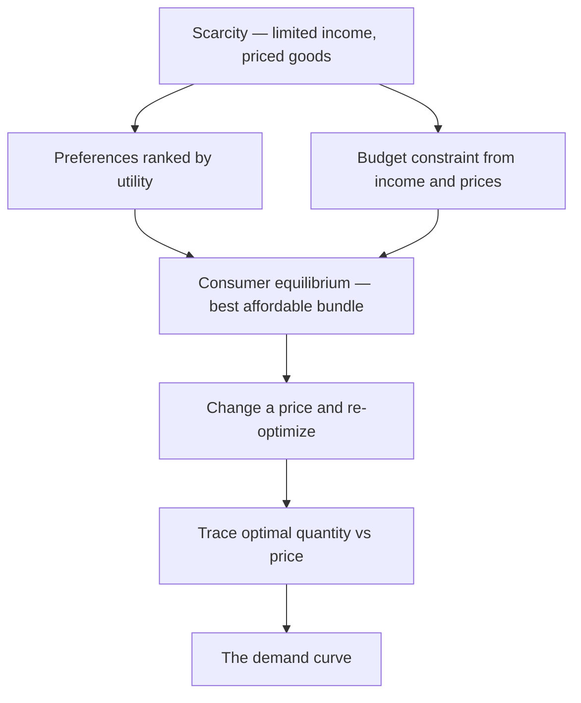
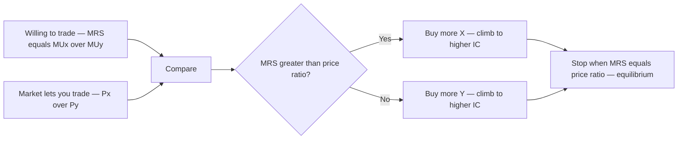
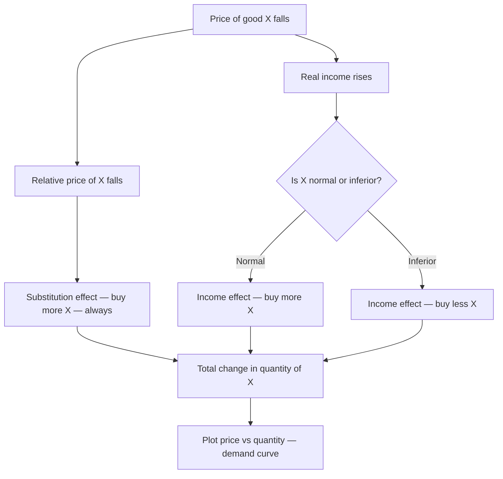
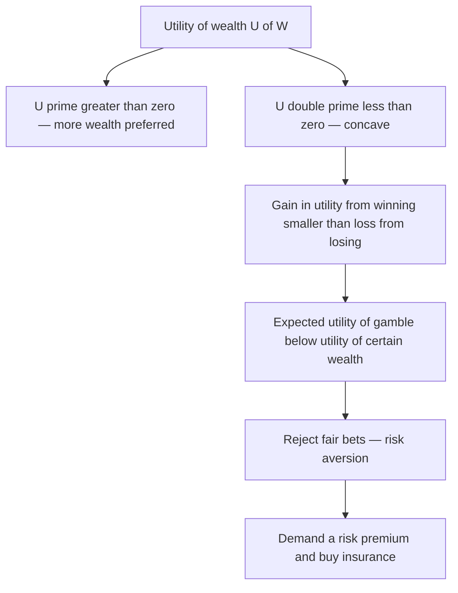

# Chapter 04 — Consumer Theory and Utility

## 1. The Problem / The Need

Every economic decision starts with a person facing scarcity: limited income, unlimited wants, and prices attached to everything. A household deciding between rice and clothing, an investor deciding between a fixed deposit and equity, a firm's customer deciding whether to upgrade to the premium plan — all are making the *same* underlying choice. **How does a rational agent allocate limited resources across competing wants to make themselves as well off as possible?**

We need a theory that:

- Explains *why* people buy what they buy — not just describes it.
- Predicts *how* purchases change when income or prices change (which is exactly what a demand curve is).
- Gives a rigorous, first-principles derivation of the downward-sloping demand curve that Chapter 03 simply assumed.
- Extends beyond groceries to the choices a finance professional actually cares about: how much to save versus consume, how much risk to take, why a rupee of gain feels smaller than a rupee of loss.

Consumer theory is the microfoundation of demand. And its central tool — **utility** — turns out to be the same tool used to price risk in modern finance. The theory that explains why you buy less coffee when its price rises is structurally the same theory that explains why you buy insurance, diversify a portfolio, and demand a higher return for holding a volatile asset. That is why it is worth understanding deeply, not memorizing.

## 2. The Core Idea

The core idea is simple and powerful: **people choose so as to maximize satisfaction, subject to a budget constraint.**

Break that into two parts:

1. **Preferences / utility** — a way of ranking bundles of goods by how much satisfaction ("utility") they deliver. This is what the consumer *wants*.
2. **The budget constraint** — the set of bundles the consumer can actually *afford*, given income and prices. This is what reality *permits*.

The optimal choice — **consumer equilibrium** — sits at the point where wants and affordability meet: the best bundle the consumer can reach. Every prediction of consumer theory (including the demand curve) falls out of asking how that meeting point moves when prices or income change.

A crucial refinement runs through the whole chapter: satisfaction rises with consumption but at a *decreasing rate*. The first slice of pizza thrills; the fifth barely registers. This **diminishing marginal utility** is the single most important behavioral regularity in the theory — and, transplanted into finance as **diminishing marginal utility of wealth**, it *is* risk aversion.

## 3. How It Works — The Model

Consumer theory has two historical formulations. Both reach the same equilibrium condition; understanding both builds intuition.

**(A) The cardinal utility approach (Marshall, Jevons).** Assumes utility is measurable in numbers ("utils"). The consumer keeps spending on each good until the *marginal utility per rupee* is equal across all goods. Intuitive, and the origin of the "law of equi-marginal utility." Its weakness: nobody can actually measure utils.

**(B) The ordinal utility approach (Hicks, Allen).** Assumes consumers can only *rank* bundles ("I prefer A to B"), not quantify the gap. Uses **indifference curves** and the **budget line**. This is the modern standard because it needs weaker, more realistic assumptions and yields the same results.

The logical machine, in both, runs like this:

*Figure 1 — The logic of consumer theory: preferences plus constraint give equilibrium; shifting the constraint traces demand.*

## 4. Full Content

### 4.1 Utility, total utility, marginal utility

**Utility** is the satisfaction or want-satisfying power a consumer derives from consuming a good or service. It is subjective (differs across people), situational (differs across time and circumstance — water in a desert versus water at home), and ethically neutral in economics (the utility of a cigarette is counted even if the good is harmful).

- **Total Utility (TU):** the aggregate satisfaction from consuming a given quantity of a good.
- **Marginal Utility (MU):** the *change* in total utility from consuming one additional unit. Formally, MU_n = TU_n − TU_(n−1), or in calculus terms MU = dTU/dQ.

The relationship between the two is mechanical but important:

| Quantity | Total Utility (utils) | Marginal Utility (utils) | Stage |
|---|---|---|---|
| 0 | 0 | — | — |
| 1 | 20 | 20 | MU positive, TU rising |
| 2 | 35 | 15 | MU positive, falling |
| 3 | 45 | 10 | MU positive, falling |
| 4 | 50 | 5 | MU positive, falling |
| 5 | 50 | 0 | TU maximum — saturation |
| 6 | 45 | −5 | MU negative, TU falling |

Read the pattern: **TU rises as long as MU is positive; TU is maximum when MU = 0; TU falls when MU turns negative.** The point of saturation (unit 5) is where an extra unit adds nothing — the sixth unit actively reduces satisfaction (over-consumption, disutility).

### 4.2 The Law of Diminishing Marginal Utility (DMU)

**Statement:** As a consumer consumes more units of a good, *other things equal*, the marginal utility derived from each successive unit declines.

This is not an assumption plucked from the air — it reflects real psychology and physiology. Wants are satiable. The first glass of water quenches thirst (huge MU); the fourth is a struggle (near-zero or negative MU). Every additional unit is applied to a less urgent use.

**Assumptions behind the law** (its "other things equal" clauses):

- The units are homogeneous (identical in size and quality).
- Consumption is continuous, without long gaps (a gap lets urgency rebuild).
- Tastes, income, and prices of related goods remain constant.
- The units are of a "reasonable" size (not absurdly small).
- The consumer is rational.

**Why it matters:** DMU is the *reason demand curves slope downward* in the cardinal framework. Because each extra unit is worth less to you, you will only buy it if the price is also lower. Price measures marginal utility (in money terms); as you buy more, your marginal utility falls, so your willingness to pay falls. Flip that around and you have a downward-sloping demand curve.

### 4.3 Consumer equilibrium under cardinal utility — the equi-marginal principle

A consumer spending a fixed income across many goods reaches equilibrium when they cannot reshuffle spending to gain more total utility. That happens when the **marginal utility per rupee is equal across all goods:**

$$\frac{MU_x}{P_x} = \frac{MU_y}{P_y} = \dots = MU_m \; (\text{marginal utility of money})$$

**Intuition (the arbitrage argument):** Suppose MU_x/P_x = 8 utils per rupee on coffee but only MU_y/P_y = 5 on tea. Move a rupee from tea to coffee: you lose 5 utils, gain 8, net +3. Keep reallocating. As you buy more coffee, DMU pushes MU_x down; as you buy less tea, MU_y rises. You stop only when the ratios equalize. At that point no reshuffle helps — equilibrium.

For a single good, the consumer buys up to the quantity where MU (in money) equals price: **MU_x = P_x.** Buy less and you are leaving utility on the table (MU > price); buy more and you overpay (price > MU).

### 4.4 Indifference curves — the ordinal approach

An **indifference curve (IC)** joins all combinations of two goods that give the consumer *the same total satisfaction* — the consumer is "indifferent" between any two points on it. A whole family of curves is an **indifference map**, with higher curves representing higher utility.

**Properties of indifference curves:**

1. **Downward sloping (negative slope).** To keep utility constant, more of one good must be offset by less of the other.
2. **Convex to the origin.** This convexity *is* the diminishing marginal rate of substitution (below).
3. **Higher IC = higher utility.** A curve farther from the origin means more of both goods, hence more satisfaction ("more is better," the non-satiation assumption).
4. **Two ICs never intersect.** If they crossed, the intersection point would yield two different utility levels — a contradiction of transitivity.
5. **Do not touch the axes.** The consumer wants some of both goods.

**Marginal Rate of Substitution (MRS):** the rate at which a consumer will give up good Y to get one more unit of good X while staying equally satisfied. MRS_xy = ΔY/ΔX = MU_x/MU_y (the slope of the IC). The **MRS diminishes** as we move down the curve: the more X you already have, the less Y you will sacrifice for another X — the ordinal-theory echo of diminishing marginal utility. This diminishing MRS is exactly why ICs are convex.

The ordinal approach rests on four axioms of rational preference: **completeness** (any two bundles can be ranked), **transitivity** (if A ≥ B and B ≥ C then A ≥ C — internal consistency), **non-satiation** (more is preferred to less), and **continuity**. These same axioms reappear, almost word for word, as the axioms of expected utility in finance (Section 4.9).

### 4.5 The budget line (budget constraint)

The **budget line** shows all combinations of two goods a consumer can buy by spending their *entire* income at given prices:

$$P_x \cdot Q_x + P_y \cdot Q_y = M$$

where M is money income. Its properties:

- **Slope = −P_x/P_y**, the ratio of prices — the rate at which the *market* lets you swap Y for X (as opposed to the MRS, the rate at which you are *willing* to swap).
- **Intercepts:** M/P_x on the X-axis (all income on X), M/P_y on the Y-axis.
- **Shifts and rotations:**
  - A change in **income** shifts the line parallel — outward if income rises, inward if it falls (slope unchanged because relative prices are unchanged).
  - A change in the **price of one good** rotates (pivots) the line around the unchanged intercept of the other good. A fall in P_x pivots the X-intercept outward.

The area under the budget line is the **feasible set** — everything affordable. The consumer will always choose a point *on* the line (spending all income, given non-satiation), never inside it.

### 4.6 Consumer equilibrium under ordinal utility

The consumer maximizes utility by climbing to the highest indifference curve the budget line allows. Geometrically, equilibrium is where the **budget line is tangent to the highest attainable indifference curve.**

At tangency two things are true:

1. **Slope of IC = slope of budget line**, i.e. **MRS_xy = P_x/P_y**, equivalently **MU_x/MU_y = P_x/P_y**. Rearranged, this is *exactly* the equi-marginal condition MU_x/P_x = MU_y/P_y. The two theories agree.
2. **The IC is convex at the tangency** (second-order condition) — ensuring it is a maximum, not a fluke.

Interpretation: at the optimum, the rate at which you are *willing* to trade the goods (MRS, your internal valuation) equals the rate at which the *market* forces you to trade them (price ratio). If they differed, you could trade at market rates and reach a higher IC.

*Figure 2 — At equilibrium your internal valuation MRS equals the market price ratio; any gap is an unexploited trade.*

### 4.7 Deriving the demand curve

This is the payoff. The demand curve was *assumed* in Chapter 03; here it is *derived* from utility maximization.

**Method (ordinal, the price-consumption curve):** Start at equilibrium. Now lower the price of good X. The budget line pivots outward on the X-axis (the consumer can now afford more X). A new tangency forms on a higher indifference curve, with a new, larger optimal quantity of X. Repeat for several prices. Joining the successive equilibrium points gives the **price-consumption curve (PCC)**. Now plot each price against its corresponding optimal quantity of X on a separate graph — that plot *is* the demand curve, and it slopes downward.

**Why it slopes down — the decomposition (Hicks / Slutsky).** A price cut helps the consumer through two distinct channels, and separating them is one of the most important analytical results in microeconomics:

- **Substitution effect:** X is now cheaper *relative* to Y, so the consumer substitutes toward X even holding satisfaction constant. This effect is *always* negative (price down → quantity up); it is the pure "relative bargain" response.
- **Income effect:** a lower price of X means the consumer's *real* income (purchasing power) has risen — the same money buys more. This extra real income is spent partly on X. For a **normal good** this reinforces the substitution effect (more X). For an **inferior good** it opposes it (less X as you get "richer").

Total effect = substitution effect + income effect. For normal goods both push the same way, guaranteeing a downward-sloping demand curve.

*Figure 3 — Decomposing a price change into substitution and income effects to derive demand.*

**Giffen goods — the exception that proves the rule.** For a strongly inferior good on which a poor household spends a large share of income (the classic example: a staple like coarse grain), the income effect can be so large and negative that it *overwhelms* the substitution effect. Result: price falls, quantity demanded *falls* — an upward-sloping demand curve. Giffen goods are the theoretical limit case showing the demand curve's slope is a *derived* property, not an axiom.

### 4.8 Consumer surplus

Consumer theory yields one more finance-relevant construct. **Consumer surplus** is the difference between what a consumer *would have been willing to pay* (their marginal utility, traced by the demand curve) and what they *actually pay* (the market price). Geometrically it is the area below the demand curve and above the price line. It measures the net welfare gain from being able to buy at a single market price when earlier units were worth much more to you. It matters in finance for valuing pricing power, subscription tiers, and any analysis of how much value a firm can extract from customers.

### 4.9 From utility of goods to utility of wealth — the finance bridge

Here consumer theory stops being about groceries and becomes the foundation of financial economics. Replace "quantity of a good" with "wealth" (W) and define a **utility-of-wealth function U(W)**. The two workhorse assumptions carry straight over:

- **More is better:** U'(W) > 0 — marginal utility of wealth is positive (people always prefer more wealth).
- **Diminishing marginal utility of wealth:** U''(W) < 0 — each additional rupee of wealth adds *less* satisfaction than the last. A ₹1 lakh windfall transforms a poor person's life and barely registers for a billionaire.

That second property — a **concave utility function** — is not a minor detail. **Concavity of U(W) is the mathematical definition of risk aversion.** Here is why.

Consider a fair gamble: a 50/50 chance to win or lose ₹1,000. Because utility is concave, the *utility gained* from winning ₹1,000 is smaller than the *utility lost* from losing ₹1,000 (the curve is flatter on the upside). So the expected utility of the gamble is less than the utility of the certain starting wealth. A risk-averse person therefore *rejects* a fair bet — and will pay a premium (insurance) to avoid risk.

*Figure 4 — Concave utility of wealth generates risk aversion and the demand for a risk premium.*

**Key finance constructs that fall out of this:**

- **Expected utility (von Neumann–Morgenstern):** a rational agent under uncertainty maximizes *expected utility* E[U(W)] = Σ p_i · U(W_i), not expected wealth. This is the direct descendant of the ordinal preference axioms (completeness, transitivity, continuity, plus independence).
- **Certainty equivalent (CE):** the *guaranteed* amount of wealth that gives the same utility as a risky prospect. For a risk-averse investor, CE < expected value of the gamble.
- **Risk premium = Expected value − Certainty equivalent.** This is the compensation an investor demands for bearing risk — the conceptual origin of the equity risk premium and of every risk-adjusted discount rate.
- **Coefficient of risk aversion.** The curvature of U(W) is measured by the **Arrow–Pratt** measures: absolute risk aversion A(W) = −U''(W)/U'(W) and relative risk aversion R(W) = −W·U''(W)/U'(W). These quantify *how* risk-averse an investor is and feed directly into optimal portfolio weights.
- **Diminishing MU of wealth also motivates diversification and the concavity that makes the certainty of a diversified portfolio preferable to a concentrated bet with the same expected return.**

The line from "the fifth slice of pizza is worth less than the first" to "an investor demands an equity risk premium" is *one continuous idea*: diminishing marginal utility.

### 4.10 Behavioural caveats — where the standard model bends

The rational-utility model is the essential baseline, but a finance professional must know its documented failures (Kahneman and Tversky, prospect theory):

- **Loss aversion:** losses hurt roughly 2–2.5× as much as equivalent gains please — the utility function is kinked at the reference point, not smoothly concave. This explains the disposition effect (investors holding losers too long).
- **Reference dependence:** people evaluate outcomes as gains/losses relative to a reference point, not as absolute wealth levels — contradicting the classical U(W).
- **Probability weighting:** people overweight small probabilities (why they buy both lottery tickets *and* insurance).

These do not overturn utility theory; they refine the *shape* of the utility and weighting functions. The scaffolding — maximize a utility function subject to constraints — survives.

## 5. Worked / Real Examples

**Example 1 — Equi-marginal allocation (cardinal).** A student has ₹100 to split between coffee (₹20 each) and samosas (₹10 each). Suppose at some allocation MU_coffee = 40 utils and MU_samosa = 30 utils. Check the per-rupee utilities: coffee = 40/20 = 2 utils/₹; samosa = 30/10 = 3 utils/₹. Samosas deliver more satisfaction per rupee, so shift spending toward samosas. As you eat more samosas, MU_samosa falls (DMU) and MU_coffee rises, until the per-rupee utilities equalize — that allocation is the equilibrium. This is precisely how a portfolio manager reasons about marginal return per unit of risk across assets.

**Example 2 — Price cut and the two effects.** A commuter buys 8 cups of tea a week at ₹15. The price drops to ₹10. She now buys 12. Decomposition: because tea is cheaper relative to coffee she substitutes toward tea (substitution effect, say +2 cups); because her real income rose she can afford more of everything and buys more tea too (income effect, +2 cups). The 4-cup increase, plotted against the ₹15→₹10 price change, is one segment of her demand curve — demand *derived*, not assumed.

**Example 3 — Risk aversion and the certainty equivalent (finance).** An investor with concave utility faces a project: 50% chance of ₹0, 50% chance of ₹1,00,000. Expected value = ₹50,000. But because losing the upside hurts less than gaining it helps (concavity), her *certainty equivalent* might be only ₹42,000 — she would swap the gamble for a guaranteed ₹42,000. The **risk premium = ₹50,000 − ₹42,000 = ₹8,000**. This is exactly why risky projects are discounted at higher rates than safe ones: the market's aggregate risk premium raises the required return, lowering present value. NPV, CAPM's equity risk premium, and insurance pricing all trace to this single calculation.

**Example 4 — Insurance as utility maximization.** A homeowner faces a 1% chance of a ₹10,00,000 fire loss. Expected loss = ₹10,000. An insurer charges ₹13,000. A risk-*neutral* person (linear utility) would refuse — they overpay ₹3,000 on average. But the risk-*averse* homeowner accepts: the ₹3,000 "overpayment" (the insurer's risk premium and margin) buys the removal of a catastrophic downside whose utility loss, under concave U(W), is enormous. The entire insurance industry exists because U(W) is concave.

## 6. Connections

- **To Chapter 03 (Demand and Supply):** consumer theory *derives* the downward-sloping demand curve that Chapter 03 assumed, and pins down what shifts it (income → normal/inferior goods; related-good prices → substitutes/complements via the substitution effect).
- **To elasticity:** the income effect underlies income elasticity of demand; the substitution effect underlies the responsiveness captured by price elasticity and cross-elasticity.
- **To portfolio theory and CAPM:** the utility-of-wealth function and Arrow–Pratt risk aversion determine the optimal mix of risky and risk-free assets and justify the market risk premium.
- **To capital budgeting:** the risk premium derived from concave utility is the conceptual basis for risk-adjusted discount rates and the equity cost of capital.
- **To behavioural finance:** prospect theory reshapes the utility function to explain market anomalies (disposition effect, equity premium puzzle, momentum).
- **To welfare economics:** consumer surplus, built from the demand curve, measures the gains from trade and the deadweight loss of taxes and monopoly.

## 7. Key Terms

- **Utility:** want-satisfying power of a good; subjective and situational.
- **Total / Marginal Utility:** aggregate satisfaction / satisfaction from one more unit (MU = ΔTU).
- **Diminishing Marginal Utility (DMU):** MU falls as consumption of a good rises.
- **Equi-marginal principle:** equilibrium when MU per rupee is equal across all goods (MU_x/P_x = MU_y/P_y).
- **Indifference curve (IC):** locus of equally-satisfying bundles; downward-sloping, convex, non-intersecting.
- **Marginal Rate of Substitution (MRS):** rate of trading Y for X at constant utility = MU_x/MU_y; diminishes along the IC.
- **Budget line / constraint:** affordable bundles; slope = −P_x/P_y; shifts with income, rotates with price.
- **Consumer equilibrium:** tangency of budget line with highest attainable IC (MRS = price ratio).
- **Price-consumption curve (PCC):** locus of equilibria as one price varies; source of the demand curve.
- **Substitution effect / Income effect:** the two channels of a price change; their sum is the total effect.
- **Normal / Inferior / Giffen good:** classification by how the income effect responds to real-income changes.
- **Consumer surplus:** willingness to pay minus price paid.
- **Utility of wealth U(W):** concave function (U' > 0, U'' < 0) whose curvature *is* risk aversion.
- **Expected utility, Certainty equivalent, Risk premium:** the finance triad built on U(W).
- **Arrow–Pratt coefficients:** measures of absolute and relative risk aversion from the curvature of U(W).

## 8. Common Confusions

- **Total utility vs marginal utility.** TU can rise while MU falls — that is the *normal* situation over most of the range. TU is *maximum* when MU = 0, not when MU is maximum. Rising TU never contradicts DMU.
- **Diminishing MU does not mean negative MU.** MU can fall and still be positive (each unit adds satisfaction, just less). MU turns negative only past the saturation point.
- **MRS vs price ratio.** MRS is your *personal willingness* to trade; the price ratio is the *market's* trade rate. They are equal only *at equilibrium*; a gap is what drives you toward equilibrium.
- **Income effect ≠ a change in money income.** The income effect of a *price* change is a change in *real* income (purchasing power) at unchanged money income.
- **Inferior good ≠ Giffen good.** All Giffen goods are inferior, but almost no inferior goods are Giffen. Giffen requires the income effect to *dominate* the substitution effect — an extreme, rare case.
- **Cardinal vs ordinal utility.** You do *not* need measurable utils to derive demand. The ordinal (indifference-curve) approach reaches the same equilibrium with only a ranking.
- **Risk aversion is not psychology alone.** In finance it is the *precise* mathematical consequence of concave U(W), quantifiable by Arrow–Pratt — not a vague personality trait.
- **Expected value vs expected utility.** A risk-averse investor maximizes expected *utility*, not expected *wealth*; that gap is exactly the risk premium.

## 9. First-Principles Recap

Strip everything away and rebuild:

1. Scarcity forces choice. A rational agent chooses the *best affordable* bundle.
2. "Best" is defined by preferences, summarized as utility. Utility rises with consumption but at a *decreasing rate* — diminishing marginal utility. This one behavioral fact does most of the work.
3. "Affordable" is defined by the budget constraint — income and prices.
4. Equilibrium is where wants meet affordability: MU per rupee equal across goods, equivalently MRS = price ratio, equivalently the budget line tangent to the highest indifference curve. All three statements are the same truth.
5. Change a price and re-optimize; trace the new quantities. That locus *is* the demand curve. It slopes down because of the substitution effect (always) plus, for normal goods, the income effect.
6. Now swap "goods" for "wealth." The same diminishing marginal utility, applied to wealth, makes the utility function concave — and concavity *is* risk aversion. A risk-averse agent demands a risk premium, buys insurance, and diversifies.

The whole edifice — from a bowl of rice to the equity risk premium — rests on one idea: **rational maximization of a utility function that exhibits diminishing marginal returns.**

## 10. Quick-Reference / Why a Finance Pro Cares

- **The equilibrium conditions to know cold:** MU_x/P_x = MU_y/P_y (cardinal) and MRS_xy = P_x/P_y = MU_x/MU_y (ordinal). Both say: at the optimum, marginal value per rupee is equalized.
- **Demand is derived, not assumed.** Price change → substitution effect (always negative) + income effect (sign depends on normal/inferior) → the demand curve. Be able to draw and explain the price-consumption-curve derivation and the Giffen exception in an interview.
- **The one-line finance bridge:** *diminishing marginal utility of wealth (concave U(W)) = risk aversion.* From this single fact flow expected-utility maximization, the certainty equivalent, the risk premium, the Arrow–Pratt coefficients, and the entire justification for the equity risk premium and risk-adjusted discount rates.
- **Risk premium = Expected value − Certainty equivalent.** This is why risky cash flows are discounted more heavily; it is the microfoundation of CAPM's market risk premium and of insurance pricing.
- **Portfolio implication:** an investor's degree of risk aversion (curvature of U(W)) determines the optimal split between the risk-free asset and the risky market portfolio — the tangency in the capital-market-line problem is the direct analogue of the consumer's budget-line-IC tangency.
- **Know the behavioural refinements:** loss aversion, reference dependence, and probability weighting (prospect theory) explain the disposition effect, the equity premium puzzle, and why the same person buys lottery tickets *and* insurance — high-value interview material that shows you understand both the model and its limits.
- **Interview soundbite:** "The demand curve slopes down for the same reason investors demand a risk premium — diminishing marginal utility. One governs the marginal value of a good; the other governs the marginal value of wealth. It is the same concave function applied to different arguments."

