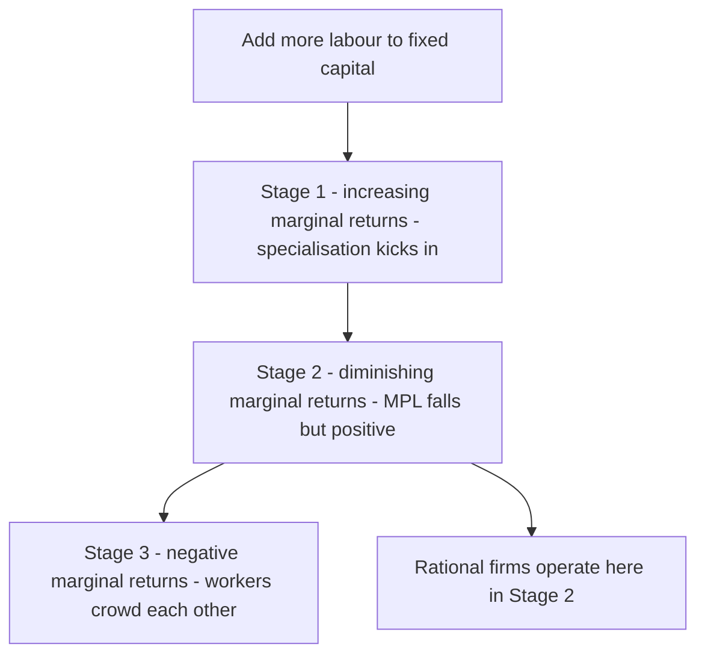
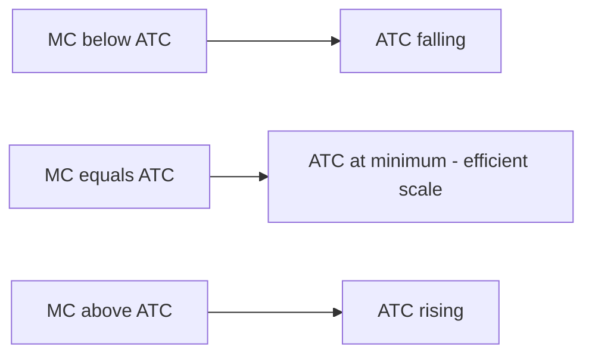
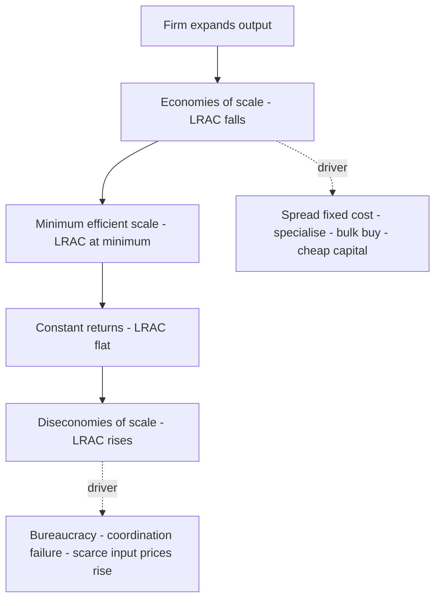

# Chapter 05 — Production and Costs

## 1. The Problem / The Need

Every firm — a steel mill, a software company, a bank, a food-delivery startup — faces the same brutal arithmetic: it turns *inputs* (labour, machines, raw materials, energy, code) into *outputs* (goods, services) and hopes to sell them for more than they cost. The gap between what those inputs cost and what the output fetches is profit. Everything a business does — hiring, capital budgeting, pricing, expansion, outsourcing, automation — is ultimately a bet about how output responds to inputs and how costs behave as scale changes.

The problem this chapter solves is: **how do we describe, predict, and manage the relationship between inputs, output, and cost?** Without a theory of production and costs, a manager cannot answer questions like:

- If I hire one more worker, how much extra output do I get — and is it worth the wage?
- At what output level is my per-unit cost lowest?
- Should I build one giant plant or three small ones?
- Why does my unit cost fall as I grow, and why might it start rising again?
- How much can revenue fall before I start losing money?

For a finance professional the stakes are higher still. **Cost structure is one of the deepest drivers of equity value, risk, and margins.** Whether a company has mostly fixed or mostly variable costs determines its operating leverage — how violently profits swing with revenue. That, in turn, drives the beta, the credit rating, the appropriate valuation multiple, and how the stock behaves in a recession. When you read a 10-K, model a DCF, or size a leveraged buyout, you are reasoning — explicitly or not — with the theory in this chapter.

## 2. The Core Idea

There are three linked ideas.

**First: the production function.** Output is a mathematical function of inputs. Given the technology available, there is a maximum output obtainable from any given bundle of inputs. This function is the technological backbone of everything else.

**Second: diminishing returns and the shape of cost.** In the *short run*, at least one input (usually capital — the plant, the machines) is fixed. As you pile more of a variable input (labour) onto a fixed input, output rises but eventually rises *more slowly* — the law of diminishing marginal returns. This single fact is why short-run cost curves are U-shaped.

**Third: scale.** In the *long run*, all inputs are variable — you can build new plants, buy new machines. Now the question is not "diminishing returns to one input" but "returns to scale" — what happens when you scale *everything* up together. This gives us economies and diseconomies of scale, and the long-run average cost curve.

The through-line: **technology (production function) → the physical relationship between inputs and output → the money cost of producing each level of output (cost curves) → profitability and firm value.** Costs are just the production function viewed through the lens of input prices.

*Figure 1 — The causal chain from technology to valuation. Costs are the production function priced out.*

## 3. How It Works — The Model

### The production function

Formally, output *Q* is a function of inputs. With two inputs — labour *L* and capital *K*:

**Q = f(L, K)**

This says: given the state of technology, the most output you can squeeze from *L* units of labour and *K* units of capital is *f(L, K)*. A common workhorse form is the **Cobb-Douglas** function:

**Q = A · L^α · K^β**

where *A* captures total factor productivity (technology, know-how), and α and β are the output elasticities of labour and capital. If α + β = 1, we have constant returns to scale; if > 1, increasing; if < 1, decreasing (more on this shortly).

### Short run versus long run

The distinction is **not calendar time** — it is about which inputs can vary.

- **Short run:** at least one factor is *fixed*. You cannot instantly build a new factory, so capital *K* is fixed at some level. You vary labour *L* to change output. The short run is the world of *diminishing marginal returns*.
- **Long run:** *all* factors are variable. Enough time has passed that you can change plant size, buy machines, sign leases. The long run is the world of *returns to scale*.

The dividing line differs by industry: for a food truck the long run might be weeks; for a nuclear utility, a decade.

### Total, marginal, and average product

Hold capital fixed and add labour. Three measures describe what happens:

- **Total Product (TP):** total output produced.
- **Marginal Product of Labour (MPL):** the extra output from one more worker. MPL = ΔTP / ΔL.
- **Average Product (AP):** output per worker. AP = TP / L.

The **law of diminishing marginal returns** states: as you add successive units of a variable input to a fixed input, the marginal product eventually declines. The first workers in an empty factory are hugely productive (they can specialise, use idle machines). Pile in the twentieth worker and they get in each other's way — the machines are saturated. MPL falls, and can even go negative if the factory becomes so crowded that adding a worker *reduces* output.

*Figure 2 — The three stages of production as one input is added to a fixed factor. Firms optimise in Stage 2.*

A crucial geometric fact: **MPL cuts AP at AP's maximum.** When the marginal worker is more productive than the average, they pull the average up; when the marginal worker is below average, they drag it down. (Same logic as a cricket batting average: a below-average innings lowers your average.)

## 4. Full Content — Definitions, Curves, Cases

### 4.1 The relationship that generates cost curves

Costs are the production function multiplied by input prices. If each worker costs a wage *w* and MPL is the extra output per worker, then the extra *cost* per unit of output — marginal cost — is:

**MC = w / MPL**

This one equation is the hinge of the whole chapter. When MPL is *rising* (early workers), MC is *falling*. When MPL is *falling* (diminishing returns), MC is *rising*. **Diminishing marginal returns is the reason marginal cost eventually rises** — and therefore the reason short-run cost curves are U-shaped. Read that again: the U-shape of cost is not an assumption, it is the mirror image of the productivity curve.

### 4.2 The family of short-run costs

In the short run, total cost splits into two parts:

| Cost concept | Symbol | Definition | Behaviour as Q rises |
|---|---|---|---|
| Total Fixed Cost | TFC | Cost that does not vary with output (rent, insurance, depreciation on the plant, salaried management) | Constant — a horizontal line |
| Total Variable Cost | TVC | Cost that varies with output (raw materials, hourly wages, energy, shipping) | Rises with output, first slowly then steeply |
| Total Cost | TC | TFC + TVC | Rises, parallel to TVC shifted up by TFC |
| Average Fixed Cost | AFC | TFC / Q | Always falling — "spreading the overhead" |
| Average Variable Cost | AVC | TVC / Q | U-shaped |
| Average Total Cost | ATC or AC | TC / Q = AFC + AVC | U-shaped |
| Marginal Cost | MC | ΔTC / ΔQ = ΔTVC / ΔQ | U-shaped — falls then rises |

Key definitional points:

- **Fixed costs are fixed only in the short run.** In the long run there are no fixed costs — you can walk away from the lease, sell the plant.
- **Marginal cost depends only on variable cost.** Adding one more unit does not change fixed cost, so MC = ΔTVC/ΔQ. Fixed costs are irrelevant to the marginal decision — a foundational idea that recurs as "fixed costs are sunk; ignore them at the margin."
- **AFC falls continuously** and never turns up. The vertical gap between ATC and AVC *is* AFC, and that gap narrows as output grows — this is "spreading fixed costs," the engine of many scale stories.

### 4.3 The shape of the curves (described)

Picture output *Q* on the horizontal axis and cost per unit on the vertical axis.

- **AFC** starts high and slides down toward zero like a hyperbola — always declining, flattening out.
- **AVC** is U-shaped: falls as early efficiencies kick in, bottoms out, then rises as diminishing returns bite.
- **ATC** is also U-shaped but sits *above* AVC, and its minimum is at a *higher output* than AVC's minimum (because AFC keeps falling, it keeps pulling ATC down even after AVC has started rising).
- **MC** is U-shaped and — this is the signature result — **MC passes through the minimum points of both AVC and ATC.** When marginal cost is below average cost, it pulls the average down; when above, it pushes the average up. So MC must cut each average curve exactly at its lowest point.

*Figure 3 — Why marginal cost cuts average cost at its minimum. The marginal pulls the average toward itself.*

The output at the bottom of the ATC curve is the **minimum efficient scale (MES)** in the short run — the least-cost output for that plant.

### 4.4 The long run: returns to scale

Now let *all* inputs vary. Scale every input by the same factor and ask what happens to output:

- **Increasing returns to scale (IRS):** double all inputs, output *more* than doubles. Source of economies of scale.
- **Constant returns to scale (CRS):** double inputs, output exactly doubles. Replicating an efficient plant.
- **Decreasing returns to scale (DRS):** double inputs, output *less* than doubles. Source of diseconomies of scale.

A single firm often exhibits all three as it grows: IRS at small scale, CRS over a range, DRS when it gets too big. Note the sharp conceptual difference from diminishing returns: **diminishing marginal returns** is a short-run idea about adding *one* input to *fixed* others; **returns to scale** is a long-run idea about scaling *all* inputs together.

### 4.5 Economies and diseconomies of scale

These are about **cost**, whereas returns to scale are about **physical output** — but they are two sides of the same coin. *Economies of scale* mean long-run average cost (LRAC) *falls* as output rises; *diseconomies* mean it rises.

**Sources of economies of scale:**

- **Technical / spreading fixed costs** — a big blast furnace or a chip fab spreads enormous fixed cost over more units. Amazon's warehouses, a bank's core IT system.
- **Specialisation and division of labour** — larger operations let workers and managers specialise.
- **Bulk purchasing** — buying inputs in volume at a discount (Walmart's supplier power).
- **Financial** — big firms borrow more cheaply and access capital markets.
- **Marketing and network** — advertising and R&D spread over more units; network effects in platforms.

**Sources of diseconomies of scale:**

- **Managerial / coordination** — bureaucracy, slow decisions, communication breakdowns as hierarchies deepen.
- **Motivational** — workers feel like cogs; principal-agent problems widen.
- **Input constraints** — bidding up the price of scarce inputs (skilled talent, prime real estate).

*Figure 4 — The long-run average cost journey and what drives each phase.*

### 4.6 The long-run average cost curve as an envelope

Here is the elegant connection between short run and long run. Each possible plant size has its own short-run ATC curve. In the long run the firm can pick *any* plant size, so it will always choose the plant whose short-run curve is lowest for the output it wants. The **LRAC curve is the lower envelope** — the boundary hugging the bottom — of all those short-run ATC curves. It is typically flatter and shallower than any single short-run curve, and often described as "L-shaped" in modern industries (steep economies of scale, then a long flat stretch, with diseconomies setting in only very late, if at all).

### 4.7 The isoquant-isocost view (cost minimisation)

For the long-run choice *between* inputs, economists use isoquants and isocost lines — the production analogue of indifference curves and budget lines from consumer theory.

- An **isoquant** shows all combinations of *L* and *K* that produce a given output. Its slope is the **marginal rate of technical substitution (MRTS)** — how much capital you can give up for one more unit of labour while holding output constant. MRTS = MPL / MPK.
- An **isocost line** shows all input combinations of equal total cost, given input prices *w* and *r*. Its slope is w/r.
- **Least-cost production** occurs where an isoquant is tangent to the lowest attainable isocost line, i.e. where **MPL/MPK = w/r**, equivalently **MPL/w = MPK/r** — the bang-per-buck of the last rupee is equal across all inputs.

This tangency condition is *why* firms substitute automation for labour when wages rise (w up tilts the isocost line, pushing the optimum toward more K): it is the economic logic behind automation, offshoring, and capital-labour substitution.

## 5. Worked and Real Examples

### Example 1 — Diminishing returns and the U-shaped cost (a numerical walk-through)

A small bakery has one fixed oven (TFC = ₹1,000/day). Each baker costs a wage of ₹500/day. Output (loaves) with successive bakers:

| Bakers (L) | Total Product | MPL | TVC (₹) | MC per loaf (₹) | ATC (₹) |
|---|---|---|---|---|---|
| 1 | 20 | 20 | 500 | 25.0 | 75.0 |
| 2 | 50 | 30 | 1,000 | 16.7 | 40.0 |
| 3 | 90 | 40 | 1,500 | 12.5 | 27.8 |
| 4 | 120 | 30 | 2,000 | 16.7 | 25.0 |
| 5 | 140 | 20 | 2,500 | 25.0 | 25.0 |
| 6 | 150 | 10 | 3,000 | 50.0 | 26.7 |

Watch the mechanics. MPL rises through the third baker (specialisation — one mixes, one shapes, one bakes), then falls — the single oven becomes the bottleneck. Because **MC = w/MPL**, marginal cost is a mirror image: it *falls* while MPL rises (₹25 → ₹12.50) and *rises* once diminishing returns set in (₹12.50 → ₹50). ATC bottoms out around 120–140 loaves — the plant's efficient scale. Notice MC (₹25) equals ATC (₹25) right at ATC's minimum, exactly as the theory predicts. This is the entire chapter in one table.

**Finance takeaway:** if this bakery is capacity-constrained by its single oven, pushing volume past the sweet spot destroys margins. An analyst valuing the business must ask whether growth requires a costly new oven (a step-change in fixed cost) — capacity is a valuation issue, not just an operations one.

### Example 2 — Operating leverage: two airlines, same revenue, very different risk

Consider two firms with identical revenue of ₹100 and identical current profit of ₹10, but different cost structures:

| | Firm A (high fixed) | Firm B (low fixed) |
|---|---|---|
| Revenue | 100 | 100 |
| Fixed costs | 70 | 20 |
| Variable costs | 20 | 70 |
| Operating profit | 10 | 10 |

Now revenue rises 10% to ₹110. Variable costs scale with revenue; fixed costs do not.

- **Firm A:** VC rises to 22, FC stays 70 → profit = 110 − 92 = **₹18** (up 80%).
- **Firm B:** VC rises to 77, FC stays 20 → profit = 110 − 97 = **₹13** (up 30%).

A 10% revenue rise produced an 80% profit jump for the high-fixed-cost firm versus 30% for the low-fixed-cost firm. This is **operating leverage** — the amplification of revenue changes into profit changes, and it comes directly from the fixed/variable cost split. But leverage cuts both ways: if revenue *falls* 10%, Firm A's profit collapses to ₹2 while Firm B's only drops to ₹7.

**This is why cost structure is a first-order concern in finance.** Airlines, hotels, semiconductor fabs, telecoms, and software firms carry huge fixed costs → high operating leverage → profits and share prices that swing wildly with the cycle → high beta → higher cost of equity → and, in a downturn, real bankruptcy risk. A restaurant that pays staff hourly and rents its space has low operating leverage — safer, but it never enjoys the explosive upside. When you build a DCF or set a discount rate, you are pricing this cost-structure risk.

### Example 3 — Economies of scale and the moat (real markets)

Why is it nearly impossible to launch a new mass-market semiconductor foundry? A leading-edge chip fab costs ~US$20 billion in fixed cost before a single chip ships. At low volume, average cost is astronomical; at the enormous scale of a TSMC, that fixed cost is spread across billions of chips, driving LRAC far below what any small entrant can achieve. The economies of scale *are* the competitive moat — they explain the industry's extreme concentration and why incumbents earn durable returns.

The same logic explains Amazon (fulfilment network and IT spread over vast volume), cloud computing (AWS's data centres), and index-fund managers (Vanguard's cost per rupee managed falls as AUM grows, which is why passive management consolidated into a few giants). **For an equity analyst, "does this business have economies of scale?" is really the question "does it have a cost moat that protects margins from competition?"** — and that moat is what justifies a premium valuation multiple.

## 6. Connections

- **To consumer theory (Ch. on demand):** isoquants and isocost lines are the mirror image of indifference curves and budget lines. The cost-minimisation tangency (MRTS = w/r) parallels the utility-maximisation tangency (MRS = Px/Py).
- **To market structure:** cost curves feed directly into the theory of the firm. A perfectly competitive firm produces where P = MC; a monopolist where MR = MC. The shape of LRAC determines how many firms an industry can support — steep, long-lasting economies of scale produce natural monopolies (utilities).
- **To supply:** the marginal cost curve above AVC *is* the firm's short-run supply curve. Everything about market supply traces back to marginal cost.
- **To corporate finance:** operating leverage (this chapter) combines with financial leverage (debt) to produce *total* leverage — the full amplification of sales into earnings per share. Firms with high operating leverage should generally carry *less* debt, to avoid stacking risk on risk.
- **To valuation:** margins, margin stability, and scale economies drive free cash flow, the discount rate (via beta), and the multiple. Cost structure sits underneath every line of a financial model.
- **To macro (productivity):** the "A" in the production function — total factor productivity — is the ultimate source of long-run growth in wages and living standards, the bridge from this micro chapter to growth theory.

## 7. Key Terms

- **Production function** — the maximum output obtainable from given inputs, given technology; Q = f(L, K).
- **Short run / long run** — periods defined by whether at least one input is fixed (short) or all vary (long).
- **Marginal product (MPL)** — extra output from one more unit of an input.
- **Law of diminishing marginal returns** — MPL eventually falls as more of a variable input is added to fixed inputs.
- **Returns to scale** — how output responds when *all* inputs are scaled together (increasing / constant / decreasing).
- **Fixed cost (TFC) / variable cost (TVC)** — costs that don't / do vary with output.
- **Marginal cost (MC)** — extra cost of one more unit; MC = ΔTC/ΔQ = w/MPL.
- **Average total cost (ATC), average variable cost (AVC), average fixed cost (AFC)** — total, variable, and fixed cost per unit.
- **Economies / diseconomies of scale** — falling / rising long-run average cost as output grows.
- **Minimum efficient scale (MES)** — the smallest output at which LRAC reaches its minimum.
- **LRAC (long-run average cost)** — the lower envelope of all short-run ATC curves.
- **Isoquant / isocost / MRTS** — tools for choosing the least-cost input mix; MRTS = MPL/MPK.
- **Operating leverage** — the degree to which fixed costs amplify revenue changes into profit changes.
- **Sunk cost** — a past expenditure that cannot be recovered and is irrelevant to forward-looking decisions.

## 8. Common Confusions

- **"Diminishing returns" ≠ "decreasing returns to scale."** The first is short-run (one input variable, others fixed); the second is long-run (all inputs scaled together). A firm can have diminishing marginal returns to labour while enjoying increasing returns to *scale*.
- **Fixed cost is not "unavoidable forever."** It's fixed only in the short run. In the long run every cost is variable — you can exit.
- **Marginal cost ignores fixed cost.** Since fixed cost doesn't change with output, it never appears in MC. A common error is loading overhead into a marginal decision. Relatedly: **sunk costs should not affect any forward decision** — "we've already spent ₹5 crore" is irrelevant to whether to continue.
- **Average cost falling does NOT require economies of scale.** In the short run, ATC falls partly just because AFC (fixed cost per unit) is being spread — that's arithmetic, not scale economies. True economies of scale are a *long-run* phenomenon where LRAC falls even with all inputs variable.
- **MC crossing ATC at its minimum is not a coincidence** — it's forced by the maths of averages and marginals. Whenever the marginal is below the average, the average must be falling.
- **High fixed cost is not "bad."** It creates operating leverage — dangerous in downturns, spectacular in booms. Whether it's good depends on the volatility of demand and the firm's ability to survive the trough.
- **Economies of scale ≠ economies of scope.** Scale is about producing *more of the same thing* cheaper; scope is about producing *different things together* cheaper (e.g., a bank cross-selling loans and insurance over shared infrastructure).

## 9. First-Principles Recap

Strip everything away and rebuild:

1. A firm converts inputs into output; the **production function** describes the best it can do with a given technology.
2. In the **short run** some input (the plant) is fixed. Piling a variable input onto a fixed one runs into the **law of diminishing marginal returns** — extra output per worker eventually falls.
3. Because **MC = wage / MPL**, falling marginal product means *rising* marginal cost. That is the sole reason short-run cost curves are **U-shaped**. Costs are just the production function priced out.
4. Averages follow marginals: **MC cuts AVC and ATC at their minimums**. AFC always falls, so ATC's minimum lies to the right of AVC's.
5. In the **long run** all inputs vary. Scaling everything up gives **returns to scale**; in cost terms, **economies then diseconomies of scale**, tracing an L- or U-shaped **LRAC** that envelopes all the short-run curves.
6. The **split between fixed and variable cost** determines **operating leverage** — how hard profits swing with revenue — which drives risk, beta, credit quality, and ultimately **valuation**.

From "how much output from one more worker?" all the way to "what discount rate does this stock deserve?" — one unbroken chain.

## 10. Quick-Reference — Why a Finance Pro Cares

**The one-line summary:** *Cost structure is destiny. The fixed/variable split drives margins, operating leverage, risk, and value — read it out of the financials before you value anything.*

**Interview-ready points:**

- **MC = w/MPL** and the U-shaped cost curve is the mirror of diminishing returns. If asked "why are cost curves U-shaped?", answer with productivity, not assumption.
- **MC intersects ATC and AVC at their minima** — pure marginal-vs-average maths. Efficient scale is where MC = ATC.
- **Operating leverage** = fixed cost intensity. High fixed cost → profits amplify revenue swings → high beta → higher cost of equity → cyclical, fragile in downturns. Airlines, semis, hotels, telecom, SaaS. Contrast with low-fixed-cost, low-leverage businesses (consulting, distribution).
- **Contribution margin = price − variable cost per unit.** Break-even quantity = Fixed Cost / Contribution Margin. Every unit above break-even drops its full contribution margin to the bottom line — this is where operating leverage comes from, and it's a classic interview calculation.
- **Economies of scale = cost moat.** When LRAC keeps falling with volume, incumbents have a structural cost advantage entrants can't match — justifies durable margins and a premium multiple. Ask it of every business: TSMC, Amazon, Vanguard, utilities.
- **In an LBO or credit analysis**, high operating leverage + high financial leverage is a dangerous stack — the two amplifiers multiply. Firms with volatile revenue and high fixed costs should carry less debt.
- **Natural monopoly:** when economies of scale are so vast that one firm supplies the whole market at lowest cost (water, grid, rail). This is the economic rationale for utility regulation — relevant to regulated-asset valuation.
- **Sunk costs are irrelevant to forward decisions** — a discipline that separates good capital allocators from bad ones. In an interview, spotting a sunk-cost fallacy signals real rigour.
- **Margin trajectory tells a scale story.** Rising operating margins as revenue grows = the company is climbing down its LRAC curve (operating leverage playing out). Falling margins at scale may signal diseconomies — bureaucracy, saturation. This is a core lens for reading a growth company's income statement.
