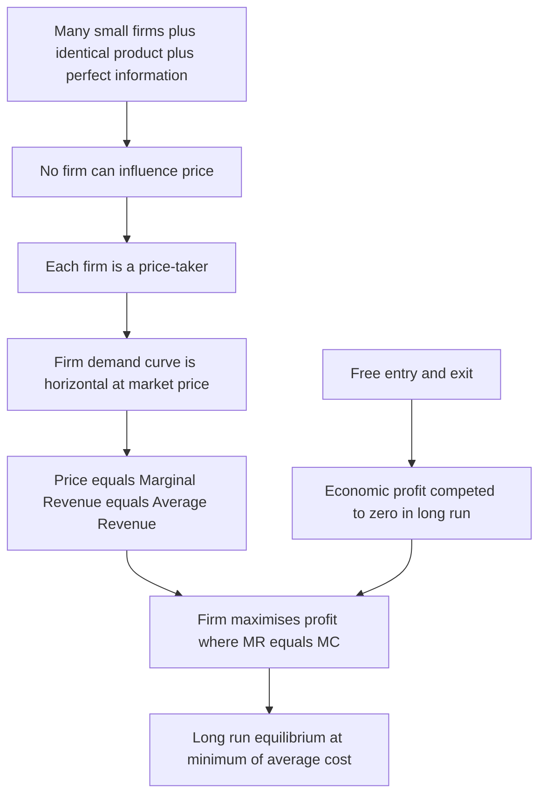
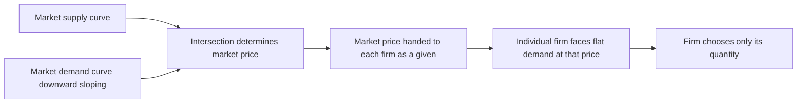
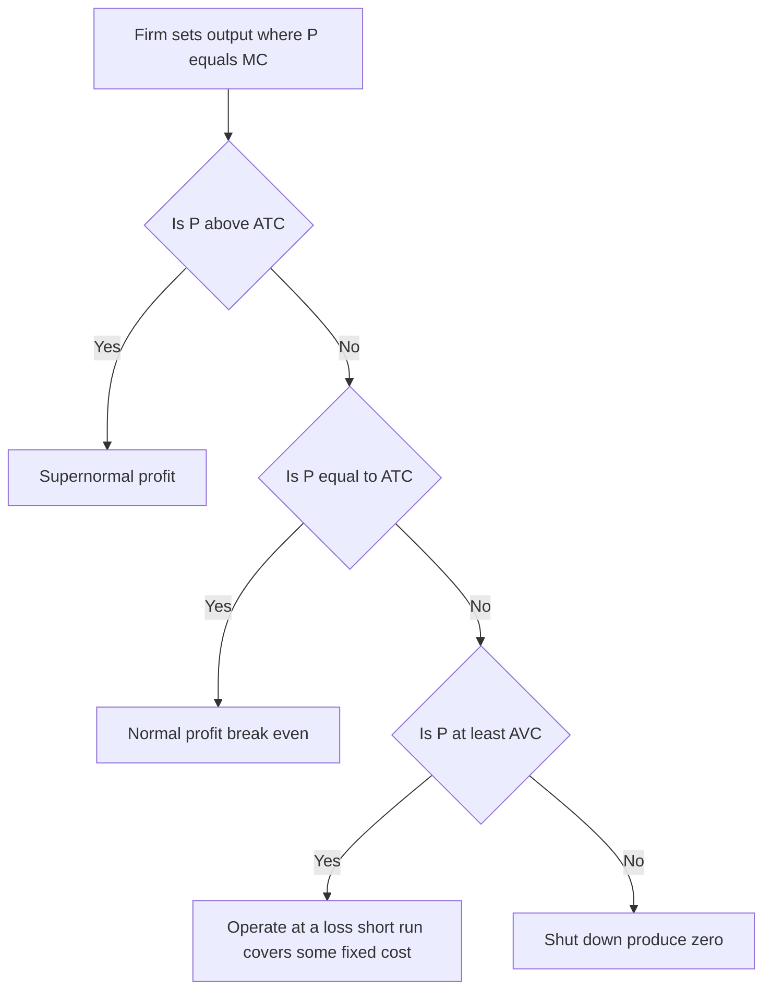
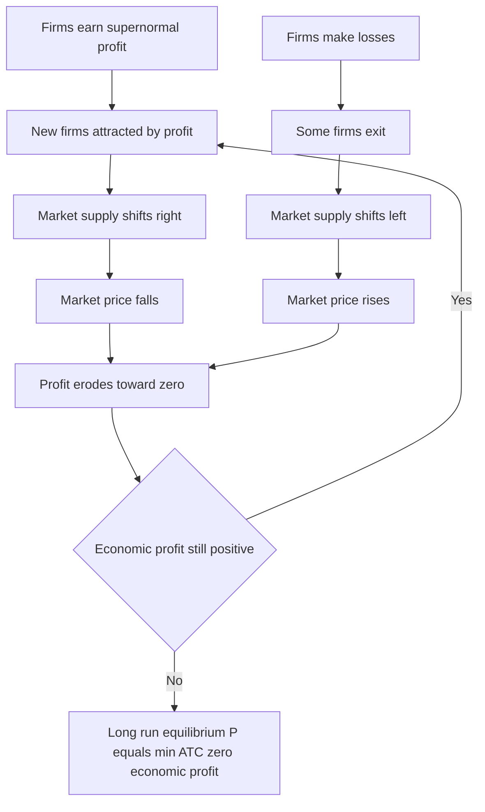

# Chapter 06 — Market Structures: Perfect Competition

## 1. The Problem / Need — Why Study Market Structure at All?

Up to now we have talked about "the firm" and "the market" as if they were single, uniform things. But a corner grocery store, a wheat farmer, a smartphone maker, and the local water utility do not behave the same way. They face very different pressures when they set prices, decide how much to produce, and think about entering or leaving a business.

**The core question of market structure is: how much power does an individual firm have over its own price?**

That single question drives almost everything a finance professional cares about:

- **Pricing power** is the beating heart of profitability. Warren Buffett famously said the most important factor in evaluating a business is its pricing power — "if you've got the power to raise prices without losing business to a competitor, you've got a very good business." Pricing power is literally a statement about market structure.
- **Margins and their durability** depend on how easily rivals can enter and compete the profit away. A DCF (discounted cash flow) valuation implicitly assumes a firm can sustain some margin for years — that assumption is a market-structure assumption.
- **Competitive strategy, regulation, antitrust, and moats** are all reasoning about where a firm sits on the spectrum of market power.

So before we can analyse any real industry — its returns, its risk, its long-run economics — we need a framework that ranks markets by the degree of competition. **Perfect competition is the extreme, idealised endpoint of that spectrum: the case of zero pricing power.** It is deliberately unrealistic. Its value is as a *benchmark* — a theoretical "control group" against which we measure how much market power any real firm actually has, and what that power costs society.

## 2. The Core Idea

Imagine a market so intensely competitive that no single seller matters. There are thousands of sellers, all producing an identical product, and buyers can costlessly see and compare every price. If any one seller tried to charge even a fraction of a cent above the going rate, every buyer would instantly switch to a rival. So each seller must simply *accept* the market price as given — the seller is a **price-taker**.

That is perfect competition in one sentence: **a market where the individual firm has no power to influence price and can only choose how much to produce.**

The striking results that follow from this single assumption are:

1. The firm faces a **perfectly horizontal (flat) demand curve** at the market price — it can sell as much as it wants at that price and nothing at any higher price.
2. Profit is maximised where **marginal revenue equals marginal cost**, and because price equals marginal revenue for a price-taker, this becomes the famous **P = MC** rule.
3. In the **long run**, free entry and exit drive economic profit to **zero** — firms earn only a normal return.
4. The outcome is **efficient** in two distinct senses (productive and allocative), which is exactly why economists treat it as the gold-standard benchmark.

## 3. How It Works — The Model and Its Assumptions

Perfect competition rests on four idealised assumptions. Each one is doing specific analytical work.

| Assumption | What it means | Why it matters |
|---|---|---|
| **Large number of small buyers and sellers** | Each participant is tiny relative to the whole market | No single firm's output decision moves the market price — everyone is a price-taker |
| **Homogeneous (identical) product** | Every firm's output is a perfect substitute for every other's | Buyers have zero reason to prefer one seller; price is the only variable |
| **Free entry and exit** | No barriers, patents, licences, or sunk costs blocking new firms | This is the mechanism that erodes profit in the long run |
| **Perfect information** | Buyers and sellers know all prices and product qualities | Nobody can charge above the market price and get away with it |

Sometimes two more are added: **perfect mobility of resources** (labour and capital move freely to where returns are highest) and **no transaction costs or transport costs**.

From these assumptions everything else is *derived* — you do not assume the flat demand curve or zero profit; they fall out logically.

*Figure 6.1 — How the four assumptions cascade into the price-taker result and long-run zero-profit equilibrium.*

### The two-level structure: market vs. firm

A crucial subtlety that trips up beginners: perfect competition has **two demand curves living side by side**.

- The **market (industry) demand curve** is downward-sloping and normal — the whole market obeys the law of demand. As total quantity rises, price must fall to clear it.
- The **individual firm's demand curve** is horizontal (perfectly elastic) at the market-clearing price. The firm is so small that its own output changes are invisible to the market.

The market price is set by the intersection of *total* supply and *total* demand. Then each tiny firm takes that price as a fixed, flat line and decides its own quantity. This is the "market sets the price, the firm chooses the quantity" split.

*Figure 6.2 — The market determines price; the individual price-taking firm inherits it and chooses only output.*

## 4. Full Content — Definitions, Curves, and Cases

### 4.1 Revenue concepts for a price-taker

Let the market price be **P** (a constant, from the firm's viewpoint) and output be **Q**.

- **Total Revenue (TR)** = P × Q. Because P is fixed, TR is a straight line through the origin with slope P.
- **Average Revenue (AR)** = TR / Q = P. Average revenue always equals price for any firm.
- **Marginal Revenue (MR)** = the extra revenue from selling one more unit = ΔTR / ΔQ. For a price-taker, each extra unit sells at the same price P, so **MR = P**.

Therefore, uniquely in perfect competition:

**P = AR = MR = the firm's horizontal demand curve.**

This equality is the linchpin. In every other market structure MR lies *below* price (because to sell more you must cut the price on all units), which is why only perfect competition gives the clean P = MC efficiency result.

### 4.2 Profit maximisation — the MR = MC rule

A firm maximises profit (TR − TC) by producing the output where **marginal revenue equals marginal cost**.

The logic is pure incremental reasoning — the same marginal thinking a finance analyst uses on any "should we do one more unit of this?" decision:

- If **MR > MC**, the next unit adds more to revenue than to cost → produce it (profit rises).
- If **MR < MC**, the next unit adds more to cost than to revenue → don't produce it (profit falls).
- Profit is maximised where **MR = MC**, provided MC is *rising* through that point (the second-order condition — you want to be on the upward-sloping part of the MC curve).

Substituting MR = P for the price-taker gives the celebrated condition:

> **Profit-maximising rule in perfect competition: P = MC**

### 4.3 Measuring profit or loss on the diagram

At the profit-maximising quantity Q\*, compare price to **average total cost (ATC)**:

- If **P > ATC** → the firm earns **supernormal (economic) profit**. Profit per unit = P − ATC; total profit = (P − ATC) × Q\*.
- If **P = ATC** → **normal profit** only (zero economic profit — the break-even case).
- If **P < ATC** → the firm makes a **loss**, and now we must ask whether it should keep operating.

### 4.4 The shutdown decision and the supply curve

When a firm is losing money, it faces a short-run choice: keep producing at a loss, or shut down. The deciding line is **average variable cost (AVC)**, because fixed costs are sunk in the short run — you pay them whether you produce or not.

- If **P ≥ AVC** → keep producing. Revenue covers all variable costs and contributes something toward fixed costs. Shutting down would mean losing *all* the fixed cost; producing loses less.
- If **P < AVC** → **shut down**. Each unit produced loses money even before touching fixed costs. Better to produce zero and lose only the fixed cost.
- The point where **P = minimum AVC** is the **shutdown point**.

This yields one of the most important results in microeconomics:

> **A perfectly competitive firm's short-run supply curve is its marginal cost curve above the minimum of average variable cost.**

Below minimum AVC the firm supplies zero; above it, the firm supplies the quantity where P = MC. This is why supply curves slope upward — they trace out rising marginal cost.

The finance parallel is exact and worth internalising: the shutdown rule is a **contribution-margin** decision. Keep operating as long as price covers *variable* cost, because fixed/sunk costs are irrelevant to the forward-looking decision. This is identical to how a business decides whether to keep a loss-making product line running, or whether to keep a factory open through a downturn.

*Figure 6.3 — The short-run decision tree: first find P equals MC, then check profit, loss, or shutdown against ATC and AVC.*

### 4.5 Short-run equilibrium

In the short run, the number of firms is fixed and profits can be positive, zero, or negative. The firm is in equilibrium wherever **P = MC** on the rising portion of MC (above shutdown). At that point the firm has no incentive to change output — but the *industry* may not be at rest, because those profits or losses will attract entry or force exit.

### 4.6 Long-run equilibrium — the zero-profit result

The long run is defined by **free entry and exit** and the ability to vary all inputs (including plant size). This is the mechanism that makes perfect competition special.

- **If firms are earning supernormal profit** → the profit signal attracts new entrants → market supply shifts right → market price *falls* → profits shrink. Entry continues until economic profit reaches zero.
- **If firms are making losses** → some firms exit → market supply shifts left → market price *rises* → losses shrink. Exit continues until the remaining firms break even.

The process stops only when **economic profit = 0** for the marginal firm. At that long-run equilibrium, the following all hold simultaneously:

> **P = MR = MC = ATC = minimum of the ATC curve**

Every firm produces at the lowest point of its average total cost curve, charges a price equal to that minimum cost, and earns exactly a **normal profit** — a return just sufficient to keep resources in the industry, no more.

*Figure 6.4 — The entry/exit engine that grinds economic profit to zero in the long run.*

**Do not confuse zero economic profit with zero accounting profit.** Economic profit already subtracts the *opportunity cost* of the owner's capital and effort — the return they could earn elsewhere. "Normal profit" is that opportunity cost. So a firm at long-run equilibrium is still perfectly viable and its owners are content; they are simply earning exactly the market rate of return on capital, with no excess. In finance terms: **the firm earns its cost of capital and no economic value added (EVA); its return on invested capital exactly equals its WACC.**

### 4.7 A note on the long-run supply curve

Depending on whether input prices rise, stay flat, or fall as the industry expands, the long-run industry supply curve can be upward-sloping (increasing-cost industry), horizontal (constant-cost industry), or downward-sloping (decreasing-cost industry). In the textbook constant-cost case, long-run supply is a flat line at minimum ATC — the industry supplies any quantity at that one price.

## 5. Worked and Real Examples

### Example 1 — A wheat farmer as a textbook price-taker (with numbers)

Suppose the world wheat price is settled by global supply and demand at **₹20 per kg**. An individual farmer growing a few hundred quintals is utterly negligible in that global ocean — a genuine price-taker. Their cost structure at various output levels (in kg) gives a marginal cost that rises with output.

Say the farmer's MC equals ₹20 at an output of **5,000 kg**, and their ATC at that output is **₹17**.

- **Profit-maximising output:** where P = MC → 5,000 kg.
- **Total revenue:** ₹20 × 5,000 = ₹1,00,000.
- **Profit per kg:** P − ATC = ₹20 − ₹17 = ₹3.
- **Supernormal profit:** ₹3 × 5,000 = **₹15,000**.

Now the long run kicks in. That ₹3/kg margin is visible to everyone (perfect information) and there are no barriers to planting wheat (free entry). Neighbouring farmers plant more wheat; new farmers enter. Total wheat supply rises, and the world price drifts down toward **₹17** — the minimum ATC. At ₹17, P = ATC, economic profit is zero, and entry stops. The farmer now earns only a normal return: enough to justify farming rather than doing something else, but no windfall.

This is why commodity producers — wheat, corn, crude of a given grade, memory chips, bulk chemicals — are the closest real-world approximations to perfect competition, and why they are chronically **low-margin, cyclical, price-taking** businesses. A finance analyst valuing a commodity producer knows the terminal margin should trend toward the cost of capital; any excess is temporary.

### Example 2 — The shutdown decision in a downturn

A shale-oil producer has a wellhead operating (variable) cost of **$35/barrel** and, including the sunk cost of the already-drilled well, a full average total cost of **$55/barrel**.

- If oil trades at **$45**: P ($45) < ATC ($55), so the firm loses money on paper. But P ($45) > AVC ($35), so each barrel contributes $10 toward the sunk drilling cost. **Keep pumping** — shutting down would forfeit the entire fixed cost. This is exactly what happened during the 2015–16 and 2020 oil crashes: producers kept flowing already-drilled wells because the marginal barrel still beat variable cost, even as they slashed *new* drilling.
- If oil trades at **$30**: P ($30) < AVC ($35). Now each barrel loses money before touching fixed costs. **Shut in the well** — produce zero and lose only the sunk cost. This is why extreme price crashes trigger production shut-ins and, briefly in April 2020, even negative oil prices when storage costs made holding output ruinous.

The lesson for finance: distinguish **variable cost (drives the shutdown decision) from full cost (drives the long-run entry/exit decision)**. A company can rationally keep operating at an accounting loss for years if it covers variable cost — and a competitor's "cost curve" position tells you who survives a price war.

### Example 3 — Why perfect competition explains index-fund / ETF fee wars

The market for plain-vanilla index funds (say, an S&P 500 tracker) is remarkably close to perfect competition. The product is nearly **homogeneous** (every S&P 500 fund holds the same 500 stocks and delivers virtually identical returns), information is **transparent** (fees are published to the basis point), and **entry is easy** for large asset managers. The predicted result — competition driving price to marginal cost and economic profit toward zero — is exactly what we observe: expense ratios have collapsed from ~1% decades ago to **0.03% or even 0.00%** today (Fidelity launched zero-fee index funds in 2018). Providers earn essentially normal profit on the product itself and must find profit elsewhere (scale, ancillary services, securities lending). This is textbook perfect competition playing out in modern finance — and it explains why active managers with genuine differentiation (real or perceived) can still charge 1–2%, while commoditised beta races to zero.

## 6. Connections

- **To valuation and DCF:** the long-run zero-economic-profit result is the theoretical reason why "excess returns fade" in credible DCF and residual-income models. A firm cannot earn above its cost of capital forever unless it has a barrier to entry (a moat). Analysts explicitly model a "fade period" toward competitive equilibrium.
- **To the other market structures (next chapter):** perfect competition is one end of a spectrum running through monopolistic competition, oligopoly, to monopoly at the other extreme. Each step gives the firm more pricing power, more downward-sloping demand, MR below price, and the possibility of *persistent* profit. Everything in imperfect competition is measured as a *deviation* from the perfectly competitive benchmark.
- **To welfare economics and the "invisible hand":** perfect competition is the formal statement of Adam Smith's invisible hand — self-interested price-takers, guided only by prices, produce the efficient outcome. It underpins the First Fundamental Theorem of Welfare Economics.
- **To antitrust and regulation:** deadweight loss, consumer surplus, and market power are all defined relative to the competitive benchmark. When regulators break up monopolies or block mergers, the implicit goal is to move an industry *toward* the competitive ideal.
- **To finance's search for moats:** if perfect competition is the state of zero excess profit, then investing for excess returns is fundamentally a hunt for the *opposite* — durable barriers to entry (brands, patents, network effects, scale, switching costs). Understanding perfect competition tells you precisely what a moat must defend against: entry that competes profit away.
- **To marginal analysis everywhere:** MR = MC is the same optimisation logic as marginal cost of capital = marginal return on investment, or the point where an option's marginal hedge cost equals marginal benefit. Marginalism is the connective tissue of both microeconomics and corporate finance.

## 7. Key Terms

- **Market structure** — the characteristics of a market (number of firms, product type, entry barriers, information) that determine firm behaviour and pricing power.
- **Price-taker** — a firm that must accept the market price as given and cannot influence it by changing its own output.
- **Homogeneous product** — a good that is identical across sellers, making them perfect substitutes.
- **Perfectly elastic demand** — a horizontal demand curve; any price rise sends quantity demanded to zero.
- **Marginal revenue (MR)** — additional revenue from selling one more unit; equals price under perfect competition.
- **Marginal cost (MC)** — additional cost of producing one more unit.
- **Profit maximisation (MR = MC)** — the output rule for any firm; becomes P = MC for a price-taker.
- **Supernormal (economic) profit** — profit above normal, i.e., revenue exceeding all costs including opportunity cost of capital.
- **Normal profit** — the minimum return needed to keep resources in the industry; equals the opportunity cost of capital; corresponds to zero economic profit.
- **Shutdown point** — the output where price equals minimum average variable cost; below it the firm produces zero in the short run.
- **Break-even point** — the output where price equals minimum average total cost; economic profit is zero.
- **Productive efficiency** — producing at the minimum point of the ATC curve; no way to make the same output more cheaply.
- **Allocative efficiency** — producing where P = MC, so the value of the last unit to consumers equals its cost to society.
- **Free entry and exit** — absence of barriers that would prevent firms from joining or leaving the industry.

## 8. Common Confusions

- **"The demand curve is horizontal, but the law of demand is downward-sloping — contradiction?"** No. The *market* demand curve slopes down normally. The *individual firm's* demand curve is horizontal because the firm is a negligible speck; its output changes don't move the market price. Two different curves at two different levels.
- **"Zero economic profit means the firm is going bankrupt."** No — this is the single biggest misunderstanding. Zero *economic* profit means the firm earns exactly its opportunity cost of capital (a normal profit). Its owners are earning the market rate of return; the business is perfectly healthy. Accounting profit is positive.
- **"A loss-making firm should always shut down."** No. In the short run it should keep operating as long as price covers *average variable cost*, because fixed costs are sunk. Shut down only when P < min AVC.
- **"MR = MC gives the maximum output."** No — it gives the *profit-maximising* output, not the maximum possible output. Producing more than the MR = MC point actually reduces profit because MC then exceeds MR.
- **"Perfect competition exists in the real world."** Almost never in its pure form. It is an idealised benchmark. Agricultural commodities, foreign exchange, and index funds *approximate* it, but the four assumptions are essentially never fully met. Its usefulness is as a reference point, not a description.
- **"Price equals marginal cost, so the firm makes no money on each unit."** P = MC is about the *last* (marginal) unit. On all the *earlier* units, price exceeds their marginal cost, which is where the firm's contribution comes from. Whether the firm profits overall depends on P versus ATC, not P versus MC.
- **"Normal profit and zero profit are different things."** They are the same thing in economics. Normal profit is embedded as a cost (opportunity cost of capital), so earning exactly normal profit shows up as zero *economic* profit.

## 9. First-Principles Recap

Start from one assumption and rebuild the whole edifice:

1. **Assume a firm is too small to affect price** (because there are many firms selling an identical product with perfect information). → It is a **price-taker**.
2. A price-taker can sell any quantity at the market price → its **demand curve is horizontal**, and **P = AR = MR**.
3. Any firm maximises profit where **the last unit's revenue equals its cost**: MR = MC. Substituting → **P = MC**.
4. Whether that yields profit or loss depends on **P versus ATC**; whether to operate at all depends on **P versus AVC** (fixed costs are sunk).
5. **Free entry and exit** then act as a thermostat: profit invites entry that lowers price; losses force exit that raises price. → In the long run, **economic profit is competed to zero** and every firm sits at **minimum ATC**.
6. At that equilibrium the outcome is **productively efficient** (lowest-cost production) and **allocatively efficient** (P = MC, so society's last unit is worth exactly what it cost). This is why perfect competition is the **benchmark for efficiency**.

Everything else in the study of markets — monopoly, oligopoly, moats, regulation, excess returns — is understood as a *departure* from this pristine baseline.

## 10. Quick-Reference / Why a Finance Pro Cares

**The one-line summary:** Perfect competition is the zero-pricing-power benchmark where P = MR = MC, and long-run economic profit is zero — the theoretical opposite of a business with a moat.

**Core equations and results to have instantly ready:**

| Concept | Result |
|---|---|
| Firm's demand | Horizontal (perfectly elastic) at market price |
| Revenue relationships | P = AR = MR |
| Profit-max rule | MR = MC, i.e., **P = MC** |
| Short-run supply | MC curve above minimum AVC |
| Shutdown rule | Produce if P ≥ min AVC; else shut down |
| Break-even | P = min ATC |
| Long-run equilibrium | P = MR = MC = min ATC; **zero economic profit** |
| Efficiency | Productive (min ATC) + allocative (P = MC) |

**Why a finance professional cares:**

- **It defines the absence of a moat.** Perfect competition is precisely the state investors like Buffett *avoid*. Recognising which of your portfolio companies are drifting toward commoditisation (price-taking, zero economic profit) is a core analytical skill. The whole discipline of finding "durable competitive advantage" is a hunt for firms that escape this benchmark.
- **It sets the terminal condition in valuation.** DCF and residual-income models fade excess returns toward zero precisely because competition erodes economic profit. If your model assumes a firm earns above its WACC forever, you are implicitly assuming it is *not* in a competitive market — and you'd better justify why (patent, brand, network effect, regulation).
- **The shutdown rule is a live decision tool.** "Cover variable cost, ignore sunk cost" governs whether to keep a factory, product line, or oil well running through a downturn. It is contribution-margin analysis in disguise and appears constantly in restructuring, distressed investing, and operational finance.
- **It explains fee compression and margin decay.** From index-fund fee wars to airline pricing to DRAM chips, the prediction that homogeneity + easy entry drives price to marginal cost and profit to zero is one of the most reliably observed patterns in real markets. Spotting it early protects you from overpaying for a business whose margins are structurally doomed.
- **It is the language of policy and regulation.** Deadweight loss, consumer surplus, and market power — the vocabulary of antitrust, utility regulation, and merger analysis — are all defined relative to the competitive benchmark. Anyone in banking, policy, or infrastructure finance needs it.

**Interview soundbite:** "Perfect competition is the benchmark of zero pricing power: identical products, free entry, perfect information force every firm to be a price-taker producing where P = MC, and free entry competes long-run economic profit to zero at minimum average cost. It's efficient — productively and allocatively — which is exactly why it's the yardstick. In practice, investing is the search for businesses that *escape* it: durable moats that let a firm sustain returns above its cost of capital instead of watching competition grind them to zero."
