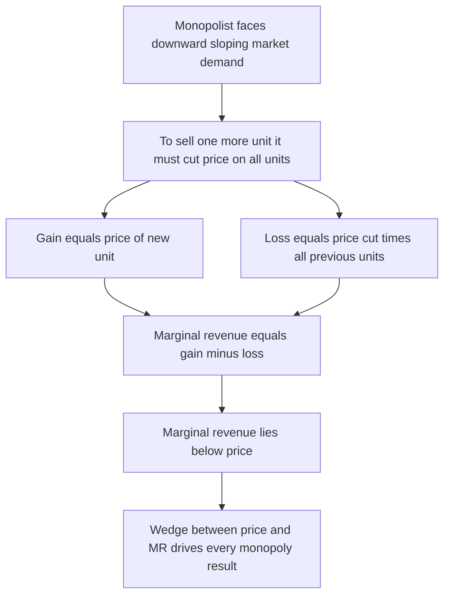
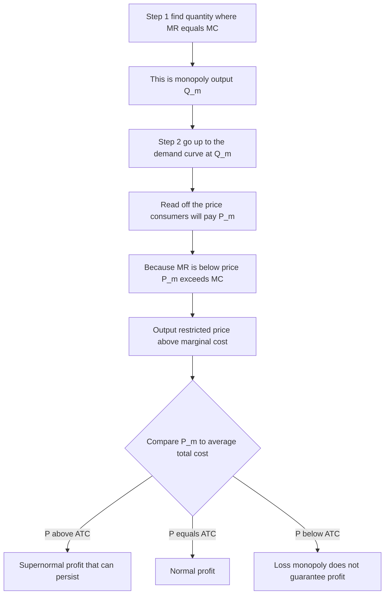
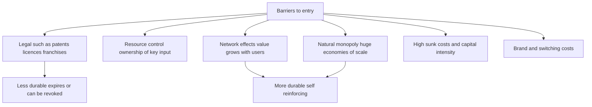
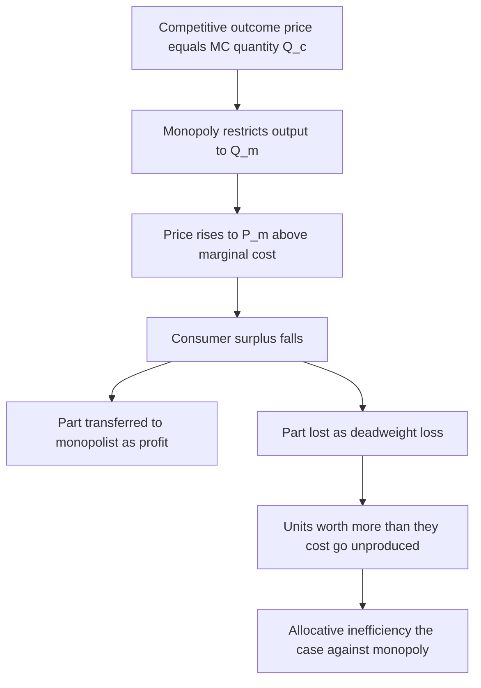
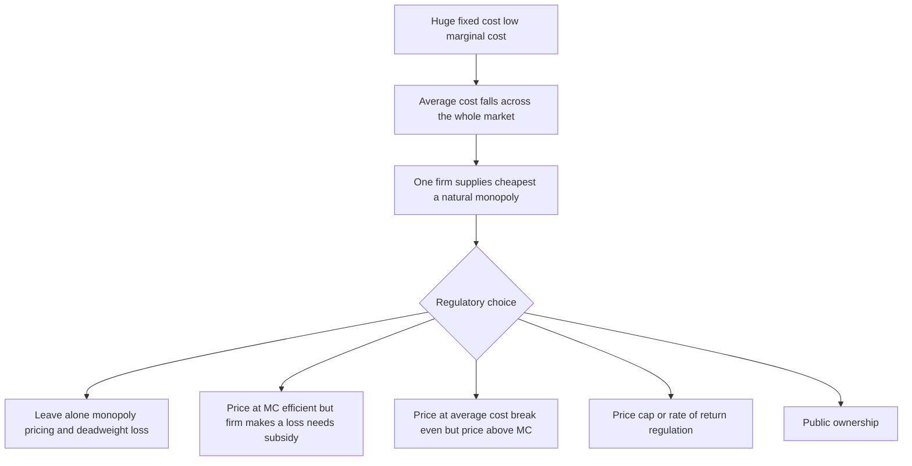

# Chapter 07 — Monopoly and Market Power

## 1. The Problem / Need — Why Study the Firm with Power?

The previous chapter built the perfectly competitive benchmark: a world of price-takers where economic profit is competed to zero. It was deliberately unrealistic — a "control group." Now we walk to the *opposite* end of the spectrum and ask the question every investor secretly cares about most: **what happens when a firm has power over its own price?**

This is not an academic curiosity. It is the single most valuable question in equity investing.

- **Moats are market power.** When Warren Buffett hunts for a "durable competitive advantage," he is literally hunting for a slice of monopoly power — the ability to raise price without losing all your customers. A pure price-taker has a flat demand curve and zero pricing power; a monopolist has a steep one and enormous pricing power. Every business sits somewhere on that line, and where it sits determines its margins, its returns, and its valuation multiple.
- **Excess returns require barriers.** In perfect competition, economic profit is zero *because entry is free*. The only way a firm sustains returns above its cost of capital is to **block entry**. Understanding monopoly is understanding how, and how durably, a firm keeps rivals out.
- **Regulation, antitrust, and policy** are all reactions to market power. Whether it is the CCI reviewing a merger, the EU fining Google, or a state regulator setting the tariff a power utility may charge, the entire apparatus of competition policy exists to manage the costs of monopoly.

So the study of monopoly answers two linked questions at once. For the **investor**: where do durable profits come from, and can I identify them before the market does? For the **citizen and regulator**: what does that private profit cost society, and when should the state intervene? Monopoly is where the private incentive to build a moat collides with the social cost of one.

## 2. The Core Idea

A **monopoly** is a market with a **single seller** of a product that has **no close substitutes**, protected by **barriers to entry** that keep rivals out. Because there is only one seller, the monopolist *is* the industry. The market demand curve and the firm's demand curve are the same downward-sloping line.

That one fact changes everything. A competitive firm faced a flat demand curve and simply accepted the market price. The monopolist faces the whole **downward-sloping** demand curve and therefore gets to *choose* a point on it — a price-quantity combination. The monopolist is a **price-maker**, not a price-taker.

But there is a catch that defines the entire chapter: **the monopolist cannot choose price and quantity independently.** The demand curve binds them together. To sell more, it must lower the price — and here is the crucial twist, it must lower the price *on every unit*, not just the extra one (assuming a single uniform price). This is why, for a monopolist, **marginal revenue lies below price**. That single wedge between price and marginal revenue is the engine that produces every important monopoly result:

1. The monopolist restricts output and charges a price **above marginal cost**.
2. It earns **supernormal profit that can persist** in the long run, because barriers block the entry that would otherwise compete it away.
3. Society bears a **deadweight loss** — mutually beneficial trades that simply do not happen.
4. Given the chance, the monopolist will **price-discriminate** to capture even more of the surplus.

Everything below is the elaboration of that one wedge: MR below P.

## 3. How It Works — The Model

### 3.1 Why marginal revenue falls below price

This is the mathematical heart of monopoly, so it is worth building slowly with numbers.

Suppose a monopolist faces this demand schedule:

| Price (₹) | Quantity | Total Revenue (P×Q) | Marginal Revenue (ΔTR/ΔQ) |
|---|---|---|---|
| 10 | 1 | 10 | — |
| 9 | 2 | 18 | 8 |
| 8 | 3 | 24 | 6 |
| 7 | 4 | 28 | 4 |
| 6 | 5 | 30 | 2 |
| 5 | 6 | 30 | 0 |
| 4 | 7 | 28 | −2 |

Look at the move from 2 units to 3. To sell the 3rd unit, the firm drops the price from ₹9 to ₹8. It gains ₹8 from the new unit — but it also *loses* ₹1 on each of the 2 units it could previously have sold at ₹9. So marginal revenue = ₹8 − ₹2 = **₹6**, which is *below* the ₹8 price. That is the wedge, and it exists on every unit past the first.

**Marginal revenue = price − (revenue lost on all previous units from the price cut).** Because that second term is always positive on a downward-sloping demand curve, **MR < P always** for a single-price monopolist.

A few structural facts fall straight out of the table:

- With a linear demand curve, the **MR curve is also linear, starts at the same intercept, and falls twice as steeply** — it bisects the horizontal distance to the demand curve.
- MR can become **negative** (here, past 5 units). Negative MR means raising quantity actually *lowers* total revenue — you are in the inelastic region of demand.
- **Total revenue is maximised where MR = 0** (here at 5–6 units, TR = ₹30).

*Figure 7.1 — Why marginal revenue sits below price for a monopolist: the price cut needed to sell one more unit applies to every unit sold.*

### 3.2 The link to elasticity

There is an elegant relationship connecting marginal revenue and the price elasticity of demand:

> **MR = P × (1 − 1/|Ed|)**

Read what it tells you:

- If demand is **elastic** (|Ed| > 1), MR is **positive** — cutting price raises total revenue.
- If demand is **unit-elastic** (|Ed| = 1), MR = **0** — total revenue is at its peak.
- If demand is **inelastic** (|Ed| < 1), MR is **negative** — cutting price *lowers* total revenue.

This produces a golden rule: **a rational monopolist never operates in the inelastic portion of its demand curve.** If demand were inelastic, the firm could raise price, sell fewer units, and increase revenue *while cutting costs* — an unambiguous win. So the profit-maximising point is always in the **elastic** region where MR is positive. This is a favourite interview point.

### 3.3 Profit maximisation — the same rule, a different outcome

The optimisation rule itself is universal and unchanged from competition: **produce where MR = MC.** What differs is the consequence, because for the monopolist MR ≠ P.

The monopolist's decision is a two-step:

1. **Find the quantity** where MR = MC. Call it Q_m.
2. **Find the price** by going *up* to the demand curve at Q_m and reading off the price consumers will pay. Call it P_m.

Because MR < P, the point where MR = MC gives a price **P_m > MC**. The monopolist deliberately produces *less* than the competitive quantity and charges *more* than the competitive price. It "holds back" output to keep the price high — restricting supply is the source of its profit.

*Figure 7.2 — The monopolist's two-step: set output where MR equals MC, then price off the demand curve above it.*

### 3.4 Monopoly does not guarantee profit

A common myth: "a monopolist always makes a profit." Not true. Profit still depends on **P_m versus ATC**. If demand is weak or costs are high — think of the only cinema in a dying small town, or a patented drug for a disease almost nobody has — the monopolist may earn only normal profit or even a loss. What monopoly guarantees is *the best possible outcome for that firm given its demand and costs*, and the *absence of entry that would erode any profit that does exist. Barriers protect profit; they do not create it out of thin air.

## 4. Full Content — Sources, Costs, and Cases

### 4.1 Sources of monopoly — barriers to entry

A monopoly can only survive if something keeps competitors out. These barriers are the true subject matter for an investor, because **the durability of a moat is the durability of the barrier.** They fall into a few families:

| Barrier type | Mechanism | Real examples |
|---|---|---|
| **Legal / government-granted** | The state confers exclusive rights | Patents (pharma, 20-year exclusivity), copyrights, trademarks, licences, exclusive government franchises, Indian Railways' historical statutory monopoly |
| **Control of a key resource** | One firm owns an essential input | De Beers' historical grip on diamond supply, a mine owning the only deposit of a rare mineral |
| **Natural monopoly** | Economies of scale so large one firm supplies the whole market cheapest | Electricity distribution, water, gas pipelines, railways — high fixed cost, low marginal cost |
| **Network effects** | The product gets more valuable as more people use it | Social networks, marketplaces, payment rails, operating systems; a late entrant offers a worse product simply for being smaller |
| **High sunk / capital costs** | Entry requires enormous irrecoverable investment | Semiconductor fabs, telecom infrastructure, aircraft manufacturing |
| **Brand and switching costs** | Loyalty and the cost of switching lock customers in | Enterprise software (ERP migrations), a dominant consumer brand |

Notice a hierarchy of durability. **Legal barriers expire** — a patent cliff is a scheduled demolition of a moat, which is why pharma stock analysts obsess over patent-expiry calendars. **Resource control can be undermined** by new discoveries or synthetics (lab-grown diamonds are eroding the natural-diamond moat). **Network effects and scale-based natural monopolies tend to be the most durable**, which is exactly why the most valuable modern monopolies — search, social, marketplaces, payments — are built on them.

*Figure 7.3 — The families of entry barrier, ranked loosely from expirable legal grants to self-reinforcing network and scale moats.*

### 4.2 The monopolist as price-maker

Being a price-maker does **not** mean the monopolist can charge any price it likes and sell any quantity it likes. That is the beginner's fantasy of monopoly. The demand curve is still a hard constraint: the firm can pick the price *or* the quantity, but the demand curve then dictates the other. Set a high price and you sell little; push volume and the price collapses. The monopolist's "power" is simply the freedom to *choose the point on the demand curve that maximises its profit* — a freedom the price-taker never had.

### 4.3 The social cost — deadweight loss

Here is where monopoly stops being a private-profit story and becomes a public-policy story.

Recall the competitive ideal: output expands until **P = MC**, meaning the value of the last unit to consumers exactly equals its cost to society. That is **allocative efficiency**.

The monopolist stops short. It produces where **P > MC**. At the monopoly quantity Q_m, the last unit is worth P_m to consumers but costs only MC to make — with P_m well above MC, there is a gap. Every unit between Q_m and the competitive quantity Q_c is one that consumers value *more than it costs to produce*, yet it is **not produced**. These are mutually beneficial trades that simply never happen because the monopolist would have to cut price to make them.

The value of all those lost trades is the **deadweight loss (DWL)** — a triangle of surplus that is destroyed, benefiting *nobody*. It is not transferred to the monopolist; it evaporates.

The full welfare picture of monopoly versus competition:

- **Consumer surplus shrinks** — consumers pay a higher price and get less quantity.
- **A chunk of the old consumer surplus is transferred to the monopolist** as profit (the rectangle between the monopoly price and the competitive price). This is a *distributional* effect — a transfer from buyers to the owner, not a loss to society as a whole.
- **The deadweight-loss triangle is pure destruction** — surplus that existed under competition and now belongs to no one. This is the true *efficiency* cost of monopoly and the economic justification for antitrust.

*Figure 7.4 — Monopoly redistributes some surplus to the producer and destroys the rest as deadweight loss.*

Two further inefficiencies are often added to the pure allocative one:

- **X-inefficiency:** shielded from competition, a monopolist faces weak pressure to keep costs down, so its costs may drift *above* the minimum. Slack, bloat, poor service — the "quiet life."
- **Rent-seeking:** firms spend real resources (lobbying, litigation, defensive patents) to *acquire and protect* monopoly status. That spending is socially wasteful — it produces nothing, merely defends a position.

There is a well-known counterargument, **Schumpeter's**: the *prospect* of temporary monopoly profit is the prize that motivates innovation and heavy R&D. Patents are a deliberate, time-limited monopoly granted precisely to reward invention. So some monopoly power may be the price society pays for dynamic progress — a live tension in tech antitrust today.

### 4.4 Price discrimination — capturing the surplus

A single-price monopolist leaves money on the table: some buyers would have paid more, and some who valued the good below P_m but above MC go unserved. **Price discrimination** is charging different prices to different buyers for the same good, to capture that surplus.

For price discrimination to work, three conditions must hold:

1. The firm must have **market power** (a downward-sloping demand curve).
2. It must be able to **segment buyers** by willingness to pay (identify who values it more).
3. It must **prevent resale (arbitrage)** — otherwise low-price buyers resell to high-price buyers and the scheme collapses.

Economists classify three degrees:

| Degree | What it means | Examples |
|---|---|---|
| **First-degree (perfect)** | Charge each buyer exactly their maximum willingness to pay | The theoretical ideal; approximated by personalised pricing, haggling, bespoke B2B deals |
| **Second-degree** | Price varies with quantity or version bought, buyer self-selects | Bulk discounts, tiered SaaS plans, airline fare classes, "versioning" (standard vs premium) |
| **Third-degree** | Different prices to identifiable groups | Student and senior discounts, peak vs off-peak pricing, regional / geographic pricing |

A striking result: **perfect (first-degree) price discrimination actually eliminates deadweight loss** — because the monopolist, able to price each unit at its value, finds it profitable to keep selling right up to Q = where P = MC. Output reaches the efficient level. But *all* the surplus is captured by the producer; consumers keep none. So it is *efficient* but maximally *unequal* — a clean illustration that efficiency and fairness are different axes.

Real firms rarely achieve perfect discrimination; they approximate it. Airlines are the canonical case: the same seat sells for wildly different fares depending on when you book, whether you stay a Saturday night, and which fare bucket you land in — a sophisticated blend of second- and third-degree discrimination fencing off business travellers (inelastic) from leisure travellers (elastic).

### 4.5 Natural monopoly and regulation

A **natural monopoly** is a special and important case. It arises when **economies of scale are so vast that a single firm can supply the entire market at a lower average cost than two or more firms could.** The technology has huge fixed costs and low marginal costs, so average cost keeps falling across the whole relevant range of demand.

Think of electricity distribution. Laying one grid of wires to every home costs an enormous fixed sum; the marginal cost of delivering one more kilowatt-hour is tiny. Building a *second*, competing set of wires down the same street would just duplicate the fixed cost and raise average cost for everyone. Water pipes, gas pipelines, sewerage, railway track, the local "last mile" of telecom — all share this shape. Competition here is not just unlikely; it is *wasteful*.

This creates the central **regulatory dilemma**:

- Leaving a natural monopoly **unregulated** yields the standard monopoly harm — restricted output, high prices, deadweight loss.
- But forcing the efficient **P = MC** price is impossible without bankrupting the firm: because average cost is still falling, **marginal cost lies below average cost**, so pricing at MC means price is below average cost and the firm makes a permanent loss.

Regulators therefore choose among imperfect fixes:

| Approach | How it works | Trade-off |
|---|---|---|
| **Average-cost (fair-return) pricing** | Set price = ATC so the firm breaks even and earns a normal return | Eliminates most monopoly profit but not fully allocatively efficient P still above MC |
| **Marginal-cost pricing plus subsidy** | Price at MC for efficiency the state covers the resulting loss | Efficient but needs taxpayer funding and invites cost padding |
| **Rate-of-return regulation** | Allow the firm to earn a fixed permitted return on its capital base | Simple but weak incentive to cut costs and can encourage over-investment |
| **Price-cap regulation (RPI-X)** | Cap price rises at inflation minus an efficiency factor X | Strong incentive to cut costs firm keeps savings needs periodic resets |
| **Public ownership** | The state simply owns and runs the utility | Removes the profit motive but adds political and efficiency risks |

This is exactly the world of infrastructure and utility finance. When you value a regulated power-distribution or water company, you are essentially valuing a **regulated rate of return on a regulated asset base (RAB)** — the regulator, not the market, sets the price, so the analysis is about regulatory regime, allowed return, and the reset cycle, not about pricing power in the ordinary sense.

*Figure 7.5 — The natural-monopoly dilemma: because average cost is still falling, marginal-cost pricing bankrupts the firm, so regulators settle for second-best rules.*

### 4.6 Measuring market power

Monopoly in the pure sense (one firm, no substitutes) is rare. What is common is **market power** — the ability to price above marginal cost — held in *degrees*. Finance and competition authorities use several gauges:

- **The Lerner Index:** L = (P − MC) / P. It runs from 0 (perfect competition, P = MC) to near 1 (pure monopoly). It measures the price-cost markup directly and, via the elasticity formula, equals 1/|Ed| at the profit-maximising point — so **market power is inversely related to the elasticity of demand the firm faces.** More inelastic demand (fewer substitutes, stronger brand) means more power.
- **Concentration ratios (CRn):** the combined market share of the largest n firms (e.g., CR4 = top four firms' share).
- **The Herfindahl-Hirschman Index (HHI):** the sum of the squared market shares of all firms. It ranges toward 10,000 (a single firm at 100% share) and is the standard tool antitrust regulators — including the CCI and the US DOJ/FTC — use to screen mergers. A merger that pushes HHI up sharply in an already-concentrated market draws scrutiny.

## 5. Real Examples

### Example 1 — Pharmaceutical patents: a monopoly with an expiry date

A patented blockbuster drug is close to a textbook legal monopoly. The patent grants ~20 years of exclusivity; there are no close substitutes for a novel molecule; and the marginal cost of manufacturing a pill is often trivial relative to its price. The maker behaves exactly as the model predicts — it prices far above marginal cost (P ⨠ MC), earning huge margins that fund the enormous, risky R&D that produced the drug (Schumpeter's bargain in action).

Then comes the **patent cliff.** When exclusivity lapses, generic manufacturers flood in — the barrier vanishes, entry becomes free, and the market lurches toward perfect competition. Prices collapse, often by 80–90%, and the originator's revenue for that drug falls off a cliff. This is why pharma equity analysts model *individual patent-expiry dates* as scheduled moat-demolitions and why the industry is a treadmill of needing the next blockbuster before the last one's patent dies. It is the clearest real-world demonstration that **monopoly profit is exactly as durable as the barrier protecting it.**

### Example 2 — Google Search and network / data moats

Google holds roughly 90% of the global search market. Its barrier is not a patent — it is a **self-reinforcing data and scale advantage** (more searches → better results → more users → more searches) layered with default-placement deals and brand. This is a modern near-monopoly built on network-type effects, and it earns economic profits that have persisted for two decades — precisely because the barrier is durable in a way a patent is not.

It is also the live case study in the *social cost* debate. The EU has levied multi-billion-euro fines (over the Android and Shopping cases), and a US federal court ruled in 2024 that Google illegally maintained a search monopoly. Regulators are effectively arguing the deadweight-loss-and-foreclosure case from this chapter: that dominance is being *maintained* by conduct that blocks entry, harming competition. Whether to break it up, and whether its scale is a natural efficiency or an abuse, is the antitrust question of the decade — Schumpeter versus the deadweight-loss triangle, playing out in court.

### Example 3 — A regulated power utility: valuing a natural monopoly

Consider an electricity-distribution company — say a discom serving a metro area, or a National Grid-type transmission firm. Building the wires is a colossal fixed cost; delivering the marginal unit is cheap; a second parallel grid would be absurd. It is a textbook natural monopoly, so the state does *not* let it price freely. A regulator sets the tariff, typically to allow a **fixed permitted return on the regulated asset base.**

For a finance professional this completely reshapes the analysis. You are not forecasting pricing power or market share; you are modelling the **regulatory contract** — the allowed rate of return, the size and growth of the asset base, the length of the regulatory period, and reset risk. The cash flows are bond-like and stable, which is exactly why regulated utilities are prized by pension funds and infrastructure investors as low-beta, income-generating assets. The "monopoly" here is real but *tamed*: the deadweight loss is regulated away in exchange for a guaranteed, capped return. This is the practical meeting point of monopoly theory and infrastructure finance.

### Example 4 — Airlines and price discrimination

The airline seat is the everyday masterclass in price discrimination. The same physical service — one seat, one flight — sells at dramatically different prices: advance-purchase versus last-minute, refundable versus not, Saturday-night-stay restrictions, and a dozen fare buckets managed by revenue-management algorithms. The airline is fencing off the **inelastic business traveller** (who books late and pays anything) from the **elastic leisure traveller** (who plans ahead and hunts for deals), and it prevents resale because tickets are named and non-transferable. This lets a carrier capture far more of the total surplus than a single fare could — turning the abstract theory of first-, second-, and third-degree discrimination into a working profit machine, and explaining why the person next to you may have paid four times your fare.

## 6. Connections

- **To perfect competition (previous chapter):** monopoly is the mirror image. Competition = many sellers, flat firm demand, P = MR = MC, zero long-run profit, efficient. Monopoly = one seller, downward firm demand, MR < P, P > MC, persistent profit, inefficient. The two are the endpoints; **monopolistic competition and oligopoly (next chapter) fill the middle**, and market power is measured as the *distance* between a real firm and the competitive benchmark.
- **To valuation and moats:** the whole discipline of finding "durable competitive advantage" is the search for firms with *sustainable market power* — a slice of monopoly. A DCF that assumes returns above WACC persisting for years is implicitly assuming a *barrier to entry*. The type and durability of that barrier (from Section 4.1) is precisely what justifies (or condemns) a "fade period" assumption.
- **To elasticity (Chapter 3):** market power *is* low elasticity of the firm's demand. The Lerner Index equals 1/|Ed|. A brand, a patent, or a switching cost is valuable exactly because it makes the firm's demand curve steeper — more inelastic — which is what lets it price above marginal cost.
- **To antitrust and regulation:** deadweight loss, HHI, and the Lerner Index are the working tools of the CCI, the EU Commission, and the US agencies. Merger review, abuse-of-dominance cases, and utility rate-setting are all applied monopoly theory.
- **To game theory and oligopoly:** the monopolist optimises alone against a demand curve. The moment there are a *few* rivals, each firm's best move depends on the others' — and we need game theory. Monopoly is the limiting case where that strategic interaction disappears.
- **To behavioural pricing and revenue management:** price discrimination underlies dynamic pricing, SaaS tiering, and yield management — a huge field in modern commerce and a direct application of "capture the surplus."

## 7. Key Terms

- **Monopoly** — a market with a single seller of a product with no close substitutes, protected by barriers to entry.
- **Market power** — the ability to price above marginal cost; held in degrees, not just by pure monopolists.
- **Price-maker** — a firm that can choose a point on its downward-sloping demand curve, rather than accept a market price.
- **Barrier to entry** — anything (legal, structural, strategic) that prevents new firms from entering and competing away profit.
- **Marginal revenue (MR)** — the extra revenue from selling one more unit; for a monopolist it lies *below* price.
- **Deadweight loss (DWL)** — surplus destroyed because mutually beneficial trades (units where value exceeds cost) go unproduced under monopoly.
- **Consumer surplus** — the value buyers get above the price they pay; monopoly shrinks it and transfers part to the producer.
- **Price discrimination** — charging different prices to different buyers for the same good to capture more surplus.
- **First / second / third-degree discrimination** — by individual willingness to pay / by quantity or version / by identifiable group.
- **Natural monopoly** — an industry where economies of scale are so large that one firm supplies the whole market at lowest cost.
- **Regulated asset base (RAB)** — the capital base on which a regulator allows a utility to earn a permitted return.
- **Lerner Index** — (P − MC)/P; a direct measure of market power, equal to 1/|Ed| at the optimum.
- **Herfindahl-Hirschman Index (HHI)** — sum of squared market shares; the standard concentration measure in antitrust.
- **X-inefficiency** — the cost bloat that arises when a firm is shielded from competitive pressure.
- **Rent-seeking** — spending real resources to acquire or defend monopoly status rather than to create value.

## 8. Common Confusions

- **"A monopolist can charge any price it wants."** No. It faces the whole demand curve. It can choose price *or* quantity, but not both — pick a high price and you sell little. Its power is choosing the profit-maximising point on the demand curve, not escaping the curve.
- **"A monopoly always makes a profit."** No. Profit still depends on price versus average total cost. A monopolist with weak demand or high costs can earn only normal profit or even a loss. Monopoly guarantees the *best available* outcome and blocks entry — it does not manufacture demand.
- **"Deadweight loss is the monopolist's profit."** No — these are different things. The transfer from consumers to the monopolist (higher price on units still sold) is *not* a loss to society, just a redistribution. The deadweight loss is the *separate* triangle of trades that never happen — surplus that vanishes and benefits *nobody*.
- **"Monopolists produce where MR = MC, and that gives the price."** No — MR = MC gives the *quantity*. You then read the *price* off the demand curve above that quantity, which is higher than MR. Confusing the two is the classic exam error.
- **"A monopolist maximises revenue / charges the highest possible price."** No. It maximises *profit* (MR = MC), which is typically well short of the revenue-maximising point (MR = 0) and far short of the highest feasible price. It never operates in the inelastic region of demand.
- **"Price discrimination is illegal or always bad."** No. Most forms (student discounts, bulk pricing, airline fares) are legal and routine; perfect discrimination is even allocatively *efficient* (zero deadweight loss), though it transfers all surplus to the seller. What antitrust polices is discrimination used to *harm competition*, not price differences as such.
- **"Natural monopolies should just be forced to price at marginal cost."** No — because average cost is still falling, MC lies below AC, so MC pricing means a permanent loss. That is the whole regulatory dilemma; regulators use average-cost or price-cap rules instead.
- **"Big market share means monopoly power."** Not necessarily. Power comes from the *absence of substitutes and barriers to entry*, not share alone. A firm with 80% share in a *contestable* market (easy entry) has little real power; a small firm with a patent lock can have a lot.

## 9. First-Principles Recap

Rebuild the whole chapter from one fact:

1. **A monopoly is a single seller behind barriers to entry**, so the firm's demand curve *is* the market's — **downward-sloping.**
2. A downward-sloping demand curve means selling one more unit requires cutting the price on *all* units → **marginal revenue lies below price.** This single wedge is the source of everything.
3. Applying the universal rule **MR = MC** gives the monopoly *quantity*; reading up to the demand curve gives the *price*. Because MR < P, the result is **output restricted and price above marginal cost.**
4. Whether that yields profit depends on **P versus ATC** — monopoly does not guarantee profit — but **barriers block the entry** that would erode any profit that exists, so profit can **persist**.
5. Because **P > MC**, some units worth more than they cost go unproduced → **deadweight loss**, the efficiency case against monopoly (plus X-inefficiency and rent-seeking; offset partly by Schumpeterian innovation incentives).
6. Given the tools, the monopolist **price-discriminates** to capture surplus; perfect discrimination even restores efficient output but hands all surplus to the seller.
7. When scale economies make one firm cheapest — a **natural monopoly** — competition is wasteful, but MC pricing bankrupts the firm, so the state **regulates** (average-cost, price-cap, rate-of-return) or owns it.

Everything a finance professional does with monopoly — hunting moats, valuing utilities, reading antitrust risk — is an application of steps 1 through 7.

## 10. Quick-Reference / Why a Finance Pro Cares

**The one-line summary:** A monopoly is a single seller behind barriers to entry; because its demand curve slopes down, marginal revenue lies below price, so it restricts output and prices above marginal cost — earning persistent profit at the cost of a deadweight loss to society.

**Core results to have instantly ready:**

| Concept | Result |
|---|---|
| Firm's demand curve | The whole market demand curve, downward-sloping |
| Revenue relationship | **MR < P** always (single price) |
| MR and elasticity | MR = P × (1 − 1/\|Ed\|); firm never operates where demand is inelastic |
| Profit-max rule | MR = MC for quantity; price read *up* off demand → **P > MC** |
| Does monopoly guarantee profit | No — depends on P vs ATC; barriers just protect any profit |
| Efficiency | Allocatively inefficient; deadweight loss from restricted output |
| Market-power measures | Lerner Index (P−MC)/P = 1/\|Ed\|; HHI for concentration |
| Natural monopoly | One firm cheapest; MC < AC so MC pricing → loss; hence regulation |
| Price discrimination | Needs power + segmentation + no resale; perfect PD → efficient but all surplus to seller |

**Why a finance professional cares:**

- **It defines what a moat is worth.** Market power is a slice of monopoly. Every durable-competitive-advantage thesis — brand, patent, network effect, switching cost, scale — is an argument about a *barrier to entry* that lets a firm keep P above MC. The type of barrier tells you how *durable* the excess returns are (a patent has a cliff; a network effect may not).
- **It underpins valuation multiples.** Firms with real pricing power command premium P/E and EV/EBITDA multiples precisely because their above-WACC returns can persist. A DCF's "fade period" is a bet on how fast competition erodes market power. Misjudging barrier durability is a top cause of valuation error (see any patent-cliff blow-up).
- **It is the framework for regulatory and utility finance.** Valuing power, water, gas, telecom-infrastructure, or toll-road assets *is* natural-monopoly economics: you model the regulated asset base, allowed return, and reset cycle, not ordinary pricing power. These bond-like cash flows are core to infrastructure and pension-fund portfolios.
- **It quantifies antitrust and policy risk.** HHI, the Lerner Index, and deadweight loss are the working vocabulary of the CCI, EU, and US agencies. A dominant firm's biggest tail risk is often not a competitor but a regulator — Google, and every Big-Tech name, is priced partly on antitrust exposure. Knowing the framework lets you assess that risk.
- **Price discrimination is a live profit lever.** Revenue management, SaaS tiering, dynamic pricing, and versioning are direct applications of "capture the surplus," and understanding them helps you judge a company's real margin potential.

**Interview soundbite:** "A monopoly is a single seller behind entry barriers, so it faces the whole downward-sloping demand curve — which means marginal revenue is below price. It maximises profit at MR = MC but then prices *up* on the demand curve, so it restricts output and charges above marginal cost. That earns profit that *persists* because barriers block entry, but it destroys surplus as deadweight loss — which is the case for antitrust. In investing, market power is exactly what a moat is: the durability of the barrier is the durability of the excess return, and when scale makes one firm cheapest — a natural monopoly like a power grid — you regulate the return instead of trusting the market."
