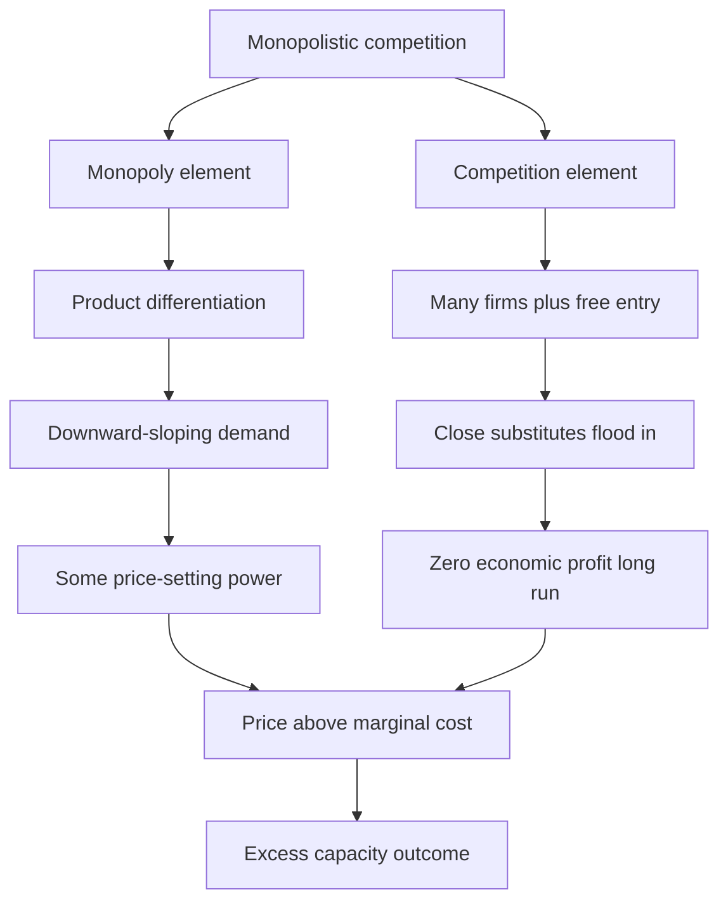
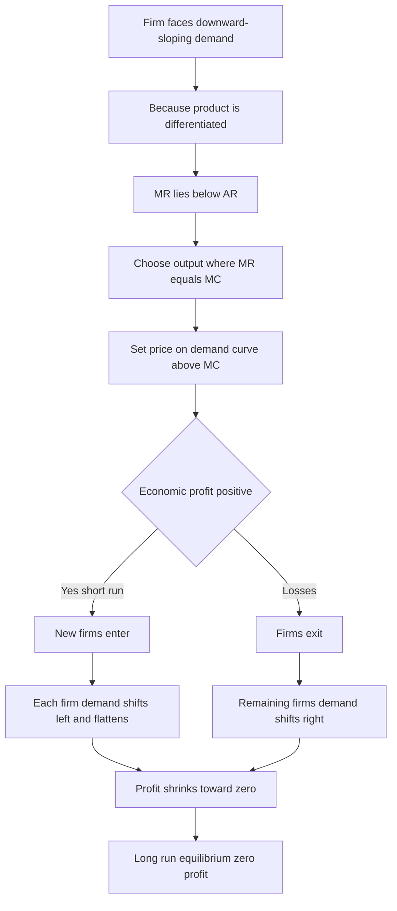
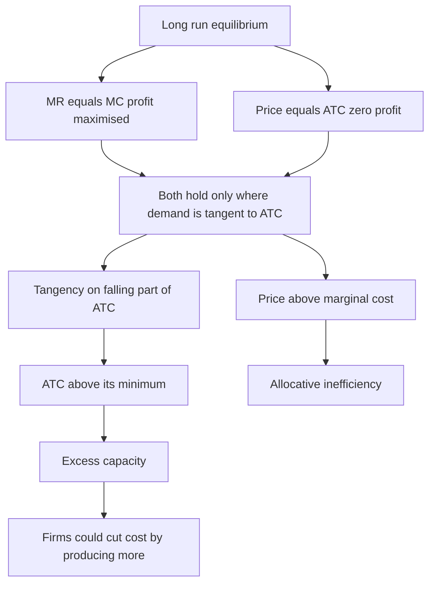
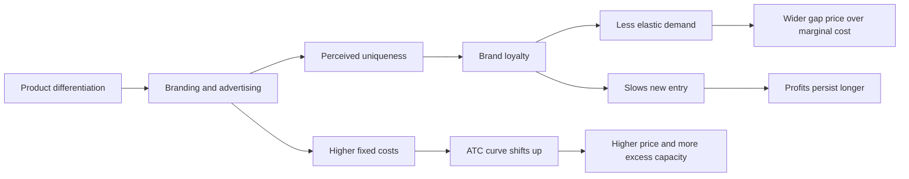

# Chapter 08 — Monopolistic Competition

## 1. The Problem / The Need

Walk into any supermarket and look at the toothpaste aisle. There is Colgate, Close-Up, Pepsodent, Sensodyne, Dabur Red, Patanjali Dant Kanti, and a dozen store brands. They all clean teeth. Yet each sells at a different price, each has loyal buyers, and each spends crores on advertising to convince you that *its* version is meaningfully different from the others. No single brand controls the market, but no brand is a helpless price-taker either.

This everyday reality does not fit either of the two textbook extremes we have studied so far.

**Perfect competition** assumes a *homogeneous* product — one firm's wheat is identical to another's — so no firm can charge even a paisa above the market price. But real consumer markets are drenched in branding, packaging, and perceived quality differences. A Starbucks latte and a roadside cutting chai are both "coffee/beverage," yet they are clearly not the same product to buyers.

**Monopoly** assumes a *single seller* with no close substitutes. But the toothpaste market has hundreds of sellers, and Colgate faces intense rivalry from Close-Up every single day.

Reality lives in the vast middle ground. Most of the consumer economy you actually shop in — restaurants, salons, apparel, packaged foods, retail stores, apps, hotels, coaching classes — is neither perfectly competitive nor monopolistic. Economists needed a model for the messy, realistic middle: **many sellers, but each selling something slightly different.**

That model, developed independently by **Edward Chamberlin** (USA, 1933) and **Joan Robinson** (UK, 1933), is **monopolistic competition**. The name itself is the whole idea in two words: *competition* (many rivals, easy entry) fused with a dash of *monopoly* (each firm is the sole seller of *its own* branded variant).

For a finance professional, this is arguably the most useful market structure of all, because it describes where most real companies — and most equity you will ever analyse — actually operate. Understanding it tells you where profits come from, why they erode, and what a "brand moat" is really worth.

---

## 2. The Core Idea

Monopolistic competition rests on a single powerful insight: **product differentiation gives each firm a tiny monopoly, but free entry competes that monopoly's profits away.**

Break it into two forces pulling in opposite directions:

- **The monopoly element (market power):** Because each firm's product is *differentiated* — by brand, quality, location, service, or mere image — it is not a perfect substitute for rivals'. So each firm faces a **downward-sloping demand curve**. It can raise price a little without losing *all* its customers (loyal buyers stay), and it must cut price to sell a lot more. This is exactly what a monopolist faces, just weaker. The firm is a **price-searcher**, not a price-taker.

- **The competition element (no barriers):** There are **many firms** and **free entry and exit**. If incumbents earn juicy profits, new entrants pour in with their own close substitutes, nibbling away each existing firm's demand until profits vanish. In the long run, economic profit is competed down to **zero** — just like perfect competition.

The result is a hybrid outcome you must be able to state in one sentence:

> **In the long run, a monopolistically competitive firm earns zero economic profit (like perfect competition) but produces at a price above marginal cost and below minimum average cost (like a monopoly), leaving it with excess capacity.**

That single sentence is the heart of the chapter. Everything else is the machinery that produces it.

*Figure 1 — the two opposing forces that define the structure.*

---

## 3. How It Works — The Model

### 3.1 The four defining assumptions

A market is monopolistically competitive when all four hold:

1. **Large number of sellers and buyers.** Enough firms that each acts independently — one firm's pricing decision has a negligible effect on any single rival, so firms ignore retaliation (this is what separates it from **oligopoly**, where firms watch each other closely).
2. **Product differentiation.** Each firm sells a product that is a *close but imperfect substitute* for rivals'. This is the crucial break from perfect competition.
3. **Free entry and exit.** No significant barriers — no patents, licences, or huge capital hurdles. Firms can start up or shut down freely in the long run.
4. **Non-price competition.** Firms compete heavily through advertising, branding, packaging, and product design — not just price.

### 3.2 The demand curve a single firm faces

Because the product is differentiated, the firm's demand curve slopes downward — but it is **highly (though not perfectly) elastic**. It is *flatter* than a monopolist's demand curve because many close substitutes exist: if Pepsodent raises its price, most (not all) buyers switch to Colgate or Close-Up. The availability of substitutes makes demand sensitive; the loyalty from differentiation is what stops it from being perfectly flat.

Since demand slopes down, **marginal revenue (MR) lies below the demand (average revenue, AR) curve** — exactly as in monopoly. To sell one more unit the firm must cut price on all units, so MR < price.

### 3.3 The profit-maximising rule

The rule is identical to every other structure: **produce where MR = MC**, then read the price off the *demand* curve at that quantity.

- Set output Q* where MR = MC.
- Charge the maximum price buyers will pay for Q*, found on the AR/demand curve — so **P > MR**, and generally **P > MC**.

### 3.4 The two-stage story: short run then long run

The model's engine is the movement from short run to long run, driven by entry and exit. We work through this in the next section, because it is the examinable core and the source of every distinctive conclusion (excess capacity, zero long-run profit, allocative inefficiency).

*Figure 2 — the decision logic each firm runs.*

---

## 4. Full Content — Working Through the Equilibrium

### 4.1 Short-run equilibrium

In the short run, a monopolistically competitive firm behaves *exactly like a monopoly*. It faces its own downward-sloping demand curve, finds MR = MC, and sets price on the demand curve. Depending on where demand sits relative to cost, three outcomes are possible:

| Situation | Condition | Outcome |
|---|---|---|
| Supernormal profit | Price > Average Total Cost (ATC) at Q* | Firm earns positive economic profit |
| Normal profit | Price = ATC at Q* | Firm just breaks even |
| Loss | Price < ATC at Q* | Firm minimises loss but keeps running if P > AVC |

The most-discussed case is **short-run supernormal profit**: the firm has hit on a differentiated product buyers love, demand is strong, and P > ATC. That profit is the signal that sets the long-run dynamic in motion.

Note the same shut-down logic as competitive firms: in the short run the firm keeps producing as long as price covers **average variable cost (AVC)**. If price falls below AVC, it shuts down to limit losses to fixed costs.

### 4.2 The adjustment mechanism — why profits don't last

Here is the distinctive machinery. Suppose existing firms earn supernormal profit. Because **entry is free**, new firms enter with their own close substitutes. Two things happen to each incumbent's demand curve:

1. **It shifts leftward (demand falls).** The market's customers are now shared among more firms, so each incumbent sells less at any given price.
2. **It becomes flatter (more elastic).** With more substitutes available, buyers are more willing to switch, so each firm's demand grows more price-sensitive.

Entry continues as long as any supernormal profit remains. It stops only when profit reaches **zero** — when each firm's demand curve has shifted in just far enough to be **tangent to the average total cost curve**.

Symmetrically, if firms are making losses, some **exit**. The survivors' demand curves shift *rightward* until the remaining firms again break even at zero economic profit.

### 4.3 Long-run equilibrium — the tangency condition

Long-run equilibrium is defined by **two conditions holding simultaneously**:

1. **MR = MC** (profit maximisation — the firm is choosing its best output).
2. **P = ATC** (zero economic profit — no incentive to enter or exit).

For *both* to hold at the same output, the demand (AR) curve must be **just tangent to the ATC curve** at the profit-maximising quantity. This is the famous **tangency equilibrium**.

Now comes the subtle, examinable point. The demand curve slopes **downward**. A downward-sloping line can only be *tangent* to a U-shaped ATC curve on the ATC curve's **falling (left-hand) portion** — never at its lowest point (the minimum of ATC is where a *horizontal* line would be tangent, which is the perfectly competitive outcome).

Therefore, at the long-run equilibrium:

- **P = ATC** → zero economic profit. Good for consumers in the profit sense.
- But **ATC is above its minimum** → the firm is *not* producing at the lowest-cost scale.
- And **P > MC** (because the demand curve is above MR, and MR = MC, so P > MC) → allocative inefficiency; price exceeds the marginal cost of the last unit.

*Figure 3 — the long-run tangency and its consequences.*

### 4.4 Excess capacity — the signature result

Because the firm produces on the falling part of its ATC curve, it operates at a scale **smaller than the one that would minimise average cost**. The gap between the firm's actual output and the output at minimum ATC is called **excess capacity**.

Put plainly: every monopolistically competitive firm could produce more, at lower average cost per unit, if only it had the customers. But it doesn't — its demand is limited because the market is fragmented across many differentiated rivals. So the industry is populated by firms all running slightly below their efficient scale.

You see excess capacity physically all around you: the half-empty restaurant that could serve twice as many covers, the salon with idle chairs, the petrol pump with spare bays, the boutique hotel running at 60% occupancy. Each *could* spread its fixed costs over more output but lacks the demand to do so. This is not mismanagement — it is the structural equilibrium of the market form.

The economic interpretation is a **trade-off**: society "pays" for product variety with some productive inefficiency. Consumers get dozens of differentiated choices (Colgate *and* Close-Up *and* Sensodyne), but each is produced at a slightly higher average cost than if a handful of firms mass-produced a standardised product at minimum-cost scale. Whether that trade — variety in exchange for excess capacity — is worthwhile is a genuine welfare debate, not a settled verdict.

### 4.5 Efficiency assessment

| Efficiency type | Test | Perfect competition | Monopolistic competition |
|---|---|---|---|
| Allocative efficiency | P = MC? | Yes | No — P > MC |
| Productive efficiency | Produce at min ATC? | Yes | No — excess capacity |
| Long-run profit | Zero economic profit? | Yes | Yes |

So monopolistic competition matches perfect competition on **long-run profitability** (both zero) but fails on **both** efficiency tests. The compensating benefit — absent from the perfectly competitive world — is **product variety and innovation**.

---

## 5. Product Differentiation, Branding and Advertising

Differentiation is the beating heart of this market structure, so it deserves its own treatment. It is *why* the demand curve slopes down in the first place.

### 5.1 Forms of product differentiation

Firms make their product distinct — real or perceived — along many dimensions:

- **Physical/quality differences:** ingredients, features, durability, design. (Sensodyne's genuine formulation for sensitive teeth; an iPhone's build quality.)
- **Brand and image:** the intangible identity created by logos, reputation, and marketing. Nike's swoosh sells the same cotton tee for a multiple of a generic one.
- **Location and convenience:** a Kirana store next to your building differentiates on *proximity*, not product. The same Maggi packet is "different" because it is 30 seconds away.
- **Service and experience:** ambience, after-sales support, speed, staff courtesy. Two identical-menu cafés compete on vibe and service.
- **Packaging and presentation:** premium packaging signals quality and justifies a price gap.

The key economic point: differentiation can be **real** (objective differences) or purely **perceived** (created in the buyer's mind by advertising). Either way, if buyers *believe* the products differ, the firm gains a downward-sloping demand curve and pricing power.

### 5.2 Branding — the manufactured moat

A brand is a promise of consistent quality that reduces the buyer's search cost and risk. Successful branding does two economically valuable things:

1. **Reduces demand elasticity** — loyal buyers become less price-sensitive, so the firm can hold price above rivals' without losing them. This *steepens* (makes less elastic) the demand curve, widening the P > MC gap.
2. **Creates a partial entry barrier** — a new entrant must overcome established brand loyalty, which slows the profit-eroding entry that would otherwise happen. Strong brands can therefore sustain **above-zero profit for longer** than the pure model predicts. This is precisely why brand equity is a durable competitive advantage — a "moat," in Warren Buffett's language.

This last point matters enormously for finance: the pure theory says long-run profit is zero, but *in practice* firms with powerful brands (HUL, Nestlé, Colgate India) earn persistent economic profits for decades because branding blunts the entry mechanism. The theory gives you the baseline; brand strength tells you how far reality departs from it.

### 5.3 Advertising — informative vs persuasive

Advertising is the main tool of non-price competition. Economists split it in two:

- **Informative advertising** tells buyers a product exists, its price, its features, where to buy it. This genuinely *improves* market efficiency — it lowers search costs and can make demand *more* elastic by informing buyers of substitutes.
- **Persuasive advertising** aims to create brand loyalty and perceived differentiation without conveying hard information ("Because you're worth it"). It *reduces* elasticity and entrenches market power.

**Is advertising good or bad?** The debate is genuinely two-sided:

| Case *for* advertising | Case *against* advertising |
|---|---|
| Informs consumers, lowers search costs | Persuasive ads are a social waste of resources |
| Funds media and content | Raises costs and hence prices |
| Enables scale economies via higher sales | Builds entry barriers, entrenching incumbents |
| Signals quality and confidence | Manipulates preferences; a zero-sum arms race |

Advertising is a **fixed cost** that shifts a firm's ATC curve **upward**. In the tangency equilibrium, this raises the equilibrium price and can *worsen* excess capacity — yet firms cannot unilaterally stop, because a rival that keeps advertising would steal their customers. This is a classic **prisoner's dilemma**: collectively firms might be better off spending less, but individually each must keep spending.

*Figure 4 — how differentiation and advertising feed the firm's market power.*

---

## 6. Real Examples — Finance Relevance

### 6.1 FMCG / packaged consumer goods — the classic case

The Indian FMCG sector is the textbook illustration. Take **toothpaste**: Colgate-Palmolive (India), Hindustan Unilever (Close-Up, Pepsodent), Dabur, Patanjali, and GSK/Haleon (Sensodyne) all sell close substitutes, differentiated by formulation ("cavity protection," "for sensitive teeth," "herbal," "whitening") and heavy advertising. No firm is a price-taker; each has loyal buyers; entry is possible (Patanjali's rapid entry in the 2010s proved it).

**Finance relevance:** When you value an FMCG stock, the entire investment thesis rests on the *strength and durability of the brand moat* — i.e., how far the company can defy the "zero long-run profit" prediction. HUL and Nestlé India command premium P/E multiples and high, sticky **gross margins** precisely because their brands keep the entry mechanism from fully eroding profit. An analyst watches advertising spend (A&P as % of sales), pricing power during input-cost inflation, and market-share defence against new entrants like Patanjali. The theory tells you *why* margins should erode; the brand tells you *why they haven't*.

### 6.2 Organised retail, restaurants and cafés

The **restaurant** business is monopolistic competition in its purest form: countless sellers, each differentiated by cuisine, location, ambience, and service; trivially easy entry; and chronic excess capacity (tables sit empty most hours). New restaurants open whenever incumbents look profitable; over-entry then drives many to break-even or closure — the model's entry-and-exit dynamic playing out in real time. India's high restaurant churn rate is exactly what the theory predicts.

**Finance relevance:** This is why restaurant and café businesses are notoriously hard to build durable value in — the low barriers guarantee profit erosion. The winners (a **Starbucks** or a **Barbeque Nation**) succeed by *converting* monopolistic competition into something closer to a branded, scale-advantaged model, building a moat through brand, standardisation, and supply-chain economies. For an investor, the question is always: does this chain have a real, scalable moat, or is it just another differentiated firm heading for tangency equilibrium and zero economic profit?

### 6.3 Apparel, e-commerce and the app economy

**Apparel** (thousands of clothing brands), **e-commerce sellers** (myriad private labels on Amazon/Flipkall), and **mobile apps** (dozens of differentiated to-do apps, food-delivery apps, streaming services) are all modern monopolistic competition. Product differentiation is intense — style, brand, UX, ecosystem — and, in digital markets, entry is cheaper than ever, accelerating the profit-erosion dynamic.

**Finance relevance:** In digital markets the classic tangency logic is sped up — a successful app is copied within months, competing profits away fast. This is why venture and equity analysts obsess over **network effects, switching costs, and brand** — the specific forces that *slow* entry and let a firm escape the zero-profit trap. Where those forces are weak, valuations should reflect fleeting, not durable, profits. The whole discipline of moat analysis is, at root, a study of how far a real firm can deviate from the monopolistically competitive baseline.

---

## 7. Connections

- **To perfect competition (Ch. on that structure):** Shares free entry/exit and zero long-run profit. Differs by having a *differentiated* product and hence a downward-sloping demand curve, P > MC, and excess capacity.
- **To monopoly:** Shares the downward-sloping demand curve, MR < P, and the MR = MC rule producing P > MC. Differs by having *many* firms and *free entry*, which forces long-run profit to zero — a monopoly can sustain profit behind barriers.
- **To oligopoly (next in the sequence):** Both feature differentiated products and non-price competition. The dividing line is the **number of firms and interdependence**: in monopolistic competition firms are too many to react to each other; in oligopoly a few large firms watch and respond to rivals' moves (game theory territory).
- **To cost curves and the theory of the firm:** The entire tangency result depends on the U-shaped ATC curve and the MR = MC rule from producer theory.
- **To finance — competitive strategy and moats:** Directly underpins Michael Porter's "differentiation strategy" and Buffett-style **economic moat** analysis. Brand strength = the degree to which a firm resists the entry mechanism.
- **To equity valuation:** The "zero economic profit in the long run" prediction is the *default* an analyst must argue against. Persistent high **ROIC** and margins are only defensible if some barrier (brand, network effect, switching cost) blunts entry.
- **To behavioural economics:** Persuasive advertising and brand loyalty connect to how preferences are shaped, not merely revealed.

---

## 8. Key Terms

- **Monopolistic competition:** A market with many firms selling differentiated (close-substitute) products, free entry/exit, and non-price competition.
- **Product differentiation:** Making a product distinct — really or in perception — from rivals', giving the firm a downward-sloping demand curve.
- **Price-searcher:** A firm that sets its own price along its demand curve (contrast: price-taker).
- **Marginal revenue (MR):** The extra revenue from selling one more unit; below price when demand slopes down.
- **Tangency equilibrium:** Long-run position where the demand (AR) curve is tangent to the ATC curve, giving P = ATC (zero profit) at the MR = MC output.
- **Excess capacity:** The gap between a firm's actual output and the higher output that would minimise average cost; the signature inefficiency of this structure.
- **Supernormal (economic) profit:** Profit above normal — revenue exceeding all costs including opportunity cost of capital; competed to zero in the long run here.
- **Allocative inefficiency:** Producing where P > MC, so the value of the last unit to buyers exceeds its production cost; output is below the socially optimal level.
- **Non-price competition:** Rivalry through advertising, branding, quality, and service rather than price.
- **Informative vs persuasive advertising:** Ads that convey facts (raise efficiency) vs ads that build perceived differentiation and loyalty (raise market power).
- **Economic moat:** A finance term for a durable competitive advantage (often brand) that lets a firm defy the zero-profit prediction.

---

## 9. Common Confusions

**"Downward-sloping demand means it's a monopoly."**
No. Both structures have downward-sloping demand and use MR = MC. The difference is entry: a monopoly is protected by barriers and keeps profit; a monopolistically competitive firm faces free entry that erodes profit to zero. *Structure is defined by entry conditions and number of firms, not by the demand curve's slope alone.*

**"Zero long-run profit means the firm makes no money / is failing."**
Zero *economic* profit means the firm earns exactly a **normal** return — enough to cover the opportunity cost of capital and keep owners in the business. It is earning its cost of capital, no more. Accountants would still report a positive profit. The firm is healthy but not *super*-normally profitable.

**"Excess capacity is a sign of bad management."**
It is a *structural* equilibrium, not a mistake. Every firm in the market operates below minimum-ATC scale because demand is fragmented across many differentiated rivals. It is the price society pays for variety, not a management failure.

**"Monopolistic competition is the same as oligopoly."**
Both have differentiation and non-price competition, but the number of firms differs. Monopolistic competition has *many* firms who ignore each other (no strategic interdependence); oligopoly has a *few* who react to each other (game theory, collusion, price wars).

**"P = ATC means the firm is productively efficient."**
P = ATC only says *profit is zero*. Productive efficiency requires producing at *minimum* ATC. Here the tangency happens on the *falling* part of ATC — above the minimum — so P = ATC coexists with productive *inefficiency* (excess capacity).

**"Advertising always benefits consumers."**
Informative advertising can; purely persuasive advertising raises costs and prices, builds entry barriers, and may just be a zero-sum arms race between rivals. The welfare verdict is genuinely mixed.

**"The firm's demand curve is perfectly elastic like in perfect competition."**
No — it is *highly* elastic (many substitutes) but still downward-sloping (differentiation creates loyalty). That downward slope is the entire source of its pricing power and the P > MC result.

---

## 10. Recap

- **Monopolistic competition = many firms + differentiated products + free entry + non-price competition.** It describes most of the real consumer economy: retail, FMCG, restaurants, apparel, apps.
- Differentiation gives each firm a **downward-sloping demand curve** and thus some pricing power (P > MC), so it behaves like a *mini-monopoly* — MR = MC, then price off the demand curve.
- In the **short run**, a firm can earn supernormal profit, normal profit, or a loss, just like a monopoly.
- **Free entry** erodes any supernormal profit: new firms' close substitutes shift each incumbent's demand curve left and make it flatter, until profit hits **zero**.
- **Long-run equilibrium** = **tangency** of demand to ATC → P = ATC (zero economic profit) at the MR = MC output. Because demand slopes down, tangency is on the *falling* part of ATC.
- Consequences: **P > MC** (allocative inefficiency) and production below minimum-cost scale (**excess capacity**). Firms match perfect competition on profit but fail both efficiency tests — the compensating gain is **product variety**.
- **Branding and advertising** are the tools of differentiation. They reduce demand elasticity, slow entry, and let real firms sustain profit *longer* than the pure theory predicts — the basis of the finance concept of an **economic moat**.

---

## 11. Quick-Reference / Interview Points

**One-line definition:** A market with many firms selling differentiated products with free entry, where each firm has a little pricing power but earns zero economic profit in the long run.

**The must-know result:** *Long-run tangency equilibrium — demand tangent to ATC gives P = ATC (zero profit), but on the falling part of ATC, so P > MC and the firm carries excess capacity.*

**Two equilibrium conditions (long run):** (1) MR = MC and (2) P = ATC, holding simultaneously via tangency.

**Comparison table — the three structures:**

| Feature | Perfect competition | Monopolistic competition | Monopoly |
|---|---|---|---|
| Number of firms | Very many | Many | One |
| Product | Homogeneous | Differentiated | Unique, no close substitute |
| Firm's demand curve | Horizontal (perfectly elastic) | Downward-sloping, highly elastic | Downward-sloping, less elastic |
| Price vs MC | P = MC | P > MC | P > MC (largest gap) |
| Entry barriers | None | None | High |
| Long-run economic profit | Zero | Zero | Positive (can persist) |
| Productive efficiency (min ATC) | Yes | No (excess capacity) | No |
| Allocative efficiency (P = MC) | Yes | No | No |
| Non-price competition | None | Heavy (branding, ads) | Some |

**Interview-ready talking points:**

- "Most real companies operate under monopolistic competition — which is why brand and differentiation, not price, are the battleground."
- "The theory predicts zero long-run economic profit; a good investment is precisely a firm that *defies* this via a moat — brand, network effects, or switching costs that blunt entry."
- "Excess capacity is not inefficiency by accident — it's the structural cost of offering consumers variety."
- "Advertising is a fixed cost and often a prisoner's dilemma: rivals collectively overspend because no one can unilaterally stop."
- "The dividing line from oligopoly is strategic interdependence — many firms who ignore each other (monopolistic competition) vs a few who watch each other (oligopoly)."
- "For an equity analyst, high sustained ROIC and gross margins in a low-barrier consumer market is a red flag to investigate — it means a genuine moat exists, or the profits are about to erode."

**Finance one-liner to close with:** *Monopolistic competition is the economist's baseline for a competitive consumer market; moat analysis in finance is the study of how, and for how long, a real firm can escape that baseline's zero-profit gravity.*
