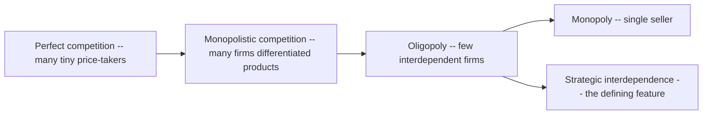
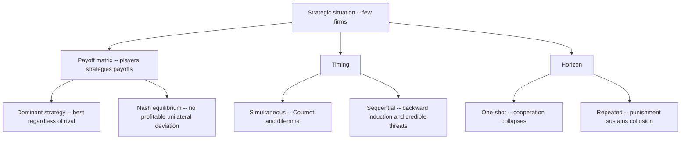
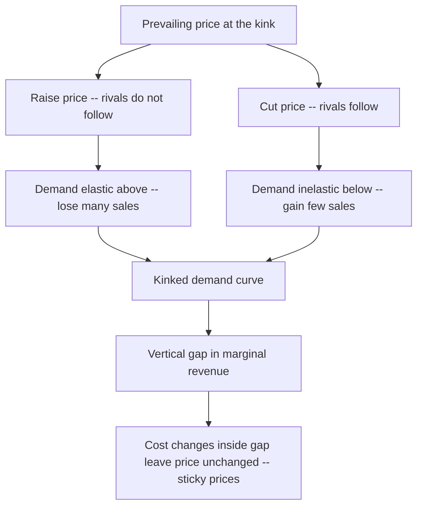
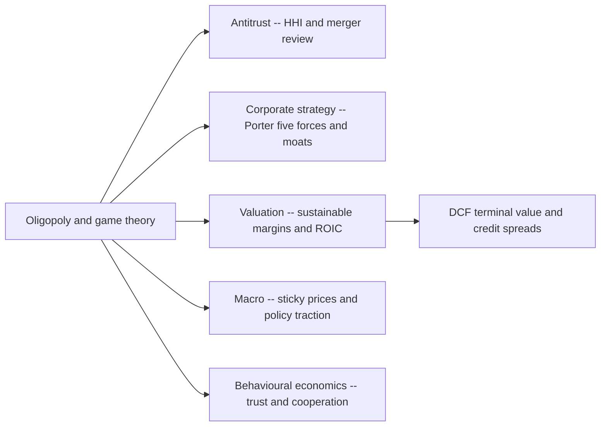

# Chapter 09 — Oligopoly and Game Theory

## 1. The Problem / The Need

Perfect competition and monopoly are the two clean poles of market theory. In perfect competition each firm is a helpless price-taker among thousands of rivals; in monopoly a single firm faces no rivals at all. Both are analytically tidy precisely because *no firm has to think about how another firm will react*. The atomistic competitor is too small to matter, and the monopolist has nobody to react to.

But look at the industries that actually dominate a modern economy and generate the bulk of stock-market capitalisation, and neither model fits. How many firms sell you a smartphone operating system? Effectively two. Aircraft for commercial airlines? Two — Boeing and Airbus. Search engines, cola, credit-card networks, iron ore, cloud computing, telecom in most countries, cement in a region, aluminium smelting? In every case the answer is "a handful." These are **oligopolies** — markets dominated by a small number of large, mutually aware firms.

The defining feature — and the thing that breaks the tidy models — is **strategic interdependence**. When Pepsi decides on a price, it must guess what Coca-Cola will do in response, and it knows Coca-Cola is simultaneously guessing about Pepsi. When one airline drops fares on a route, its rival's planes fly on the same route the next morning. Each firm's best action depends on what it expects the others to do. This circular reasoning — "I think that you think that I think…" — cannot be solved with a simple demand curve. It needs a theory of *strategic behaviour*: **game theory**.

For a finance professional this is not academic. Oligopoly determines the durability of corporate profits — the single most important input into any valuation. Warren Buffett's "economic moat," Michael Porter's "five forces," and every analyst's judgment about whether a company can sustain fat margins all rest on oligopoly dynamics. Merger arbitrage, antitrust risk, commodity price forecasting, and the credit quality of capital-intensive cyclical firms all turn on whether an oligopoly behaves cooperatively or descends into a price war. Understanding this chapter is understanding *why some industries are wonderful and others are value traps*.

## 2. The Core Idea

Three ideas anchor the whole chapter.

**First: interdependence is the essence of oligopoly.** With a few large firms, one firm's output or price choice is large enough to move the market, so rivals notice and react. Every decision is a move in a game.

**Second: the central tension is cooperate versus compete.** Collectively, the firms would earn the most by acting as one giant monopolist — restricting output, keeping prices high, splitting the monopoly profit. This is **collusion**. But each individual firm has a private incentive to cheat on the deal — to quietly cut price or expand output and grab market share while everyone else holds back. The tragedy of oligopoly is that the individually rational move (cheat) undermines the collectively rational outcome (high prices). That is the **prisoner's dilemma** structure, and it recurs everywhere in the chapter.

**Third: game theory gives us the tools to predict where firms land.** The key concept is the **Nash equilibrium** — a set of strategies where no player can do better by unilaterally changing, given what everyone else is doing. It is the analytical resting point of a strategic situation. Around it sit related ideas: dominant strategies, repeated games, credible threats, and price leadership.

*Figure 9.1 — Where oligopoly sits on the market-structure spectrum.*

## 3. How It Works — The Model

Oligopoly has no single canonical model the way monopoly has one profit-maximisation diagram. Instead it has a *family* of models, each capturing a different facet of strategic behaviour. The unifying framework is game theory. Let us build up the machinery.

**A game** has three ingredients: **players** (the firms), **strategies** (the actions available — prices, quantities, whether to advertise, whether to collude), and **payoffs** (the profit each firm earns for every combination of strategies). We represent a two-player, two-strategy game in a **payoff matrix**: rows are one firm's choices, columns the other's, and each cell holds a pair of payoffs.

**A dominant strategy** is an action that is best for a player *no matter what the rival does*. If a strategy is dominant, a rational firm plays it without needing to predict the opponent.

**A Nash equilibrium** (after mathematician John Nash) is a strategy combination in which each player's choice is a best response to the others' choices, so nobody has a unilateral incentive to deviate. Every game with finite strategies has at least one Nash equilibrium (possibly in mixed/randomised strategies). When both players have a dominant strategy, the combination of dominant strategies is automatically the Nash equilibrium.

**Simultaneous vs sequential games.** In simultaneous games players choose without seeing the other's move (Cournot quantity competition, the prisoner's dilemma). In sequential games one player moves first and the other observes and responds (Stackelberg leadership, entry-deterrence). Sequential games are solved by **backward induction** — reason from the last move back to the first — and introduce the idea of **credible threats** and first-mover advantage.

**One-shot vs repeated games.** A single encounter differs sharply from a relationship played out over many periods. In repeated games, firms can punish cheaters in future rounds, which makes cooperation (collusion) sustainable even though it collapses in a one-shot game. This is the single most important insight for understanding why some cartels endure.

The models below — Cournot, prisoner's dilemma, kinked demand, price leadership — are all applications of this toolkit to specific competitive questions.

*Figure 9.2 — The game-theory toolkit and the questions each piece answers.*

## 4. Full Content

### 4.1 The prisoner's dilemma — the master metaphor

Two suspects, arrested for a joint crime, are interrogated separately. Each is offered a deal: confess (betray your partner) or stay silent (cooperate with your partner). If both stay silent, the police have only a weak case and each gets 1 year. If both confess, each gets 8 years. If one confesses while the other stays silent, the confessor walks free and the silent one gets 10 years.

Look at the logic. Whatever the other does, confessing is better for me: if he stays silent, confessing gets me 0 instead of 1; if he confesses, confessing gets me 8 instead of 10. Confess is a **dominant strategy** for both. So both confess and get 8 years — even though both staying silent (1 year each) would have been far better. The Nash equilibrium (both confess) is *jointly worse* than the cooperative outcome. Individual rationality produces collective disaster.

Now relabel it as a duopoly. Replace "confess/stay silent" with "cut price/hold price high," or "expand output/restrict output." The structure is identical.

| | **Coke holds price high** | **Coke cuts price** |
|---|---|---|
| **Pepsi holds price high** | Pepsi 100 , Coke 100 | Pepsi 30 , Coke 140 |
| **Pepsi cuts price** | Pepsi 140 , Coke 30 | Pepsi 60 , Coke 60 |

If both hold high, each earns 100 (they share monopoly profit). But each is tempted to cut: whatever the rival does, cutting price earns more (140 vs 100 if the rival holds; 60 vs 30 if the rival cuts). Cutting is dominant. Both cut, both earn 60 — worse than the 100 each they could have had. **This is why collusion is unstable and why price wars happen.** The very same incentive that would make consumers happy (firms competing prices down) is what firms desperately try to escape by colluding.

### 4.2 Collusion and cartels

**Collusion** is agreement among oligopolists to act jointly — to fix prices, restrict output, divide markets, or rig bids — so as to capture monopoly profit. When formalised and organised, it is a **cartel**. The archetype is **OPEC**, the Organization of the Petroleum Exporting Countries, which coordinates crude-oil production quotas among member states to influence world oil prices.

A cartel tries to behave as a single monopolist: find the total output that maximises joint profit (where industry marginal revenue equals marginal cost), then allocate production quotas among members. The problem is enforcement. Because each member faces the prisoner's dilemma, every member has an incentive to **cheat** — produce above quota, because at the high cartel price the extra barrels are hugely profitable *for that member*, while the price-depressing consequence is spread across everyone. OPEC's history is a chronicle of exactly this: agreed cuts, quiet overproduction by members needing revenue, and periodic collapses (the 1986 price crash, the 2014-16 slide, the March 2020 Saudi-Russia price war).

Cartels are **illegal** in most jurisdictions — India's Competition Act 2002, the US Sherman Act, EU competition law all prohibit price-fixing — which is why OPEC (a treaty among sovereign states) is unusual in being open. Private cartels operate secretly and are prosecuted heavily: the vitamins cartel, the auto-parts cartels, the LIBOR-rigging scandal, and the cement cartel that the Competition Commission of India fined tens of billions of rupees.

**Conditions that make collusion easier to sustain:**

| Factor | Collusion easier when… | Why |
|---|---|---|
| Number of firms | Few | Easier to coordinate and detect cheating |
| Product homogeneity | Homogeneous | Only price to agree on, not quality/features |
| Demand stability | Stable | Deviations are easier to spot against a steady baseline |
| Transparency of prices | High | Cheating is quickly detected and punished |
| Barriers to entry | High | New entrants won't undercut the cozy price |
| Interaction frequency | Frequent/repeated | Punishment for cheating is swift and credible |
| Cost structures | Similar | Firms agree on the profit-maximising price |

**Tacit collusion** needs no meeting or contract at all. Firms simply recognise their interdependence and independently avoid aggressive pricing — a "conscious parallelism." This is legal in most systems (you cannot outlaw firms being smart), which is precisely why concentrated industries can be persistently profitable without any provable conspiracy.

### 4.3 Why repetition rescues cooperation

The one-shot prisoner's dilemma predicts cooperation always collapses. Yet real oligopolies often sustain high prices for years. The resolution is that firms interact **repeatedly**. In a repeated game a firm can adopt a **trigger strategy**: "I'll cooperate (hold price high) as long as you do, but the first time you cheat, I retaliate — I cut price hard, forever (or for a long punishment phase)." 

Now the calculus changes. Cheating gives a one-time gain (140 instead of 100) but triggers a future of low profits (60 forever instead of 100 forever). If firms value future profits enough (a low discount rate, i.e. patient firms), the long-run loss outweighs the short-run gain, and cooperation becomes a Nash equilibrium of the repeated game. This is the essence of the **folk theorem**: with sufficiently patient players and an indefinite horizon, cooperative outcomes can be sustained as equilibria. **Tit-for-tat** — cooperate first, then mirror the rival's last move — is the famous robust strategy from Robert Axelrod's tournaments.

The practical corollary for analysts: oligopolies are more disciplined (more profitable) when firms expect to face each other far into the future, can observe each other's prices, and have no firm that is desperate or short-horizoned. A distressed competitor with nothing to lose is the enemy of industry discipline — which is why airlines feared a bankrupt rival that would slash fares to fill seats.

### 4.4 The kinked demand curve — explaining sticky prices

A long-standing puzzle: oligopoly prices are often remarkably **rigid** — they don't change even when costs move. The **kinked demand curve model** (Paul Sweezy, 1939) offers an intuitive explanation based on asymmetric rival reactions.

Suppose a firm is at the prevailing price. It reasons about the two directions:

- **If I raise my price**, rivals will *not* follow — they'll happily keep their prices low and steal my customers. So my sales fall sharply. Demand is **elastic** above the current price.
- **If I lower my price**, rivals *will* follow (they won't let me poach their customers), so I gain few extra sales. Demand is **inelastic** below the current price.

The result is a demand curve with a **kink** at the current price — elastic above, inelastic below. Because demand is kinked, the marginal-revenue curve has a **vertical gap** (discontinuity) directly beneath the kink. Marginal cost can rise or fall *within that gap* and the profit-maximising price and quantity don't change — MR still equals MC at the same output. Hence **price stickiness**: firms leave prices unchanged even as costs fluctuate.

*Figure 9.3 — The kinked demand curve and the marginal-revenue gap.*

The model is descriptively appealing but has two well-known weaknesses. First, it explains why a price *stays* where it is but not how that price got there in the first place — it takes the prevailing price as given. Second, empirical studies (notably George Stigler) found the assumed asymmetry of reactions is not robust; rivals often *do* match price increases too. Treat it as a useful story about price rigidity, not a complete theory. In practice, prices in oligopolies are also sticky because of coordination fears (nobody wants to start a price war) and menu/reputation costs.

### 4.5 Price wars and price leadership

When collusion breaks down, the prisoner's dilemma plays out for real: a **price war**. One firm cuts, rivals retaliate, and prices spiral down toward marginal cost, destroying industry profit. Price wars are typically triggered by a demand slump (excess capacity chasing too few customers), a new aggressive entrant, a desperate distressed firm, or a firm misjudging that it can grab share before rivals react. Examples abound: the US airline fare wars, the Indian telecom war ignited by Reliance Jio's 2016 launch of free/near-free data (which forced consolidation and bankrupted or merged most rivals), and periodic petrol-retail and e-commerce discount wars.

To *avoid* the mutual destruction of overt price competition while staying within the law, oligopolies often gravitate to **price leadership** — a form of tacit coordination. One firm (the leader) sets or changes price, and the others follow. Two variants:

- **Dominant-firm price leadership:** the largest firm sets the price; smaller "fringe" firms take that price as given and supply what they wish, with the dominant firm supplying the residual demand.
- **Barometric price leadership:** the leader is not necessarily the biggest but the one best at reading market conditions (costs, demand); its price changes act as a signal others trust and follow.

Price leadership lets firms move prices together without a smoke-filled-room agreement — it is a coordination device that substitutes for illegal collusion. Banks changing deposit/lending rates after one major bank moves, or airlines matching a fare change floated by one carrier through the shared reservation systems, are everyday examples.

### 4.6 Quantity competition — the Cournot and Stackelberg models

Alongside price competition, economists model oligopolists competing on **quantity**. In the **Cournot model** (1838), firms simultaneously choose output; each chooses its best output given its expectation of the rival's output (its **reaction function**), and equilibrium is where the reaction functions intersect — a Nash equilibrium in quantities. The result sits between monopoly and perfect competition: as the number of firms rises, total output rises toward the competitive level and price falls toward marginal cost. Cournot is the workhorse model for commodity oligopolies (oil, ore, memory chips) where firms really do decide *how much to produce*.

The **Bertrand model** instead has firms compete on price with identical products; the surprising result is that with just two firms, price competition drives price all the way to marginal cost (the "Bertrand paradox") — a reminder that whether an oligopoly is profitable depends heavily on whether firms compete on price or quantity and whether products are differentiated.

The **Stackelberg model** makes quantity choice *sequential*: a leader commits to output first, the follower responds. By moving first and committing to a large output, the leader gains a **first-mover advantage** and captures more profit — an insight behind capacity pre-emption, where a firm builds a big plant precisely to warn rivals not to expand.

## 5. Real Examples (Finance Relevance)

**1. OPEC and the oil price — the cartel that moves markets.** OPEC (and now OPEC+, including Russia) is the world's most consequential cartel. Its production decisions swing crude prices, which ripple into energy-company equity valuations, inflation prints, central-bank policy, the currencies of oil exporters (rouble, riyal) and importers (rupee), and the credit spreads of shale producers. The prisoner's-dilemma instability is on constant display: the March 2020 Saudi-Russia price war (both flooding the market when they failed to agree cuts) sent oil briefly *negative* in the futures market — a live demonstration of collusion collapsing into a payoff-matrix "both cheat" cell. For a commodities or macro analyst, forecasting oil is largely a game-theory exercise about cartel cohesion.

**2. Indian telecom — a price war that reshaped an industry.** Before 2016 India had a dozen mobile operators in an uneasy oligopoly. Reliance Jio entered with a war chest and offered free voice and near-free data, unleashing a brutal price war. Rivals were forced to match, ARPU (average revenue per user) collapsed, and the industry consolidated to essentially three players (Jio, Airtel, Vodafone Idea) — with Vodafone Idea left financially crippled. For an equity or credit analyst this is a case study in how a new entrant with deep pockets can detonate industry discipline and destroy incumbent profitability and bond values. It also shows the *endgame*: after the shakeout, the surviving three-firm oligopoly began raising tariffs in coordinated moves — tacit collusion re-emerging.

**3. Boeing–Airbus — a stable global duopoly.** Commercial widebody and narrowbody aircraft are effectively a two-firm world. High entry barriers (capital, technology, certification, order backlogs), differentiated products, and repeated interaction make this a comparatively disciplined duopoly with durable margins — the kind of structure a long-term investor prizes as a "moat." It is also a study in credible threats and government-subsidy games (the decades-long WTO disputes over Airbus launch aid and Boeing tax breaks) — strategic behaviour extending to the level of nation-states.

**4. Coke vs Pepsi and the advertising game.** The cola duopoly rarely fights on price (that would be the losing "both cut" cell) and instead competes ferociously on advertising and branding — itself a prisoner's dilemma, since both would be better off spending less but neither dares unilaterally disarm. This differentiated, price-disciplined structure is why both companies have historically sustained high returns on capital, making them classic "wonderful business" holdings.

**Investing takeaway:** Porter's Five Forces and Buffett's "moat" are, at bottom, applied oligopoly theory. An analyst asking "can this company sustain its margins?" is really asking "is this a disciplined oligopoly with high entry barriers and repeated cooperative interaction, or a fragile one prone to price wars?" The answer drives the sustainable-margin and terminal-growth assumptions at the heart of any discounted-cash-flow valuation.

## 6. Connections

- **To monopoly and competition (earlier chapters):** oligopoly sits between them; a perfectly colluding cartel behaves like the monopoly chapter, while a Bertrand price war collapses to the competitive marginal-cost outcome. Oligopoly is the bridge.
- **To industrial organisation and antitrust:** measures like the concentration ratio and the **Herfindahl-Hirschman Index (HHI)** quantify how oligopolistic a market is and are used by competition regulators (CCI, DOJ, EU) to block anticompetitive mergers.
- **To corporate strategy (Porter):** the Five Forces framework — rivalry, entry threat, buyer/supplier power, substitutes — is essentially a manager's-eye version of oligopoly analysis.
- **To finance and valuation:** industry structure determines sustainable ROIC and margins, the core drivers of equity value and credit quality; merger arbitrage and antitrust risk are direct applications.
- **To macroeconomics:** oligopolistic price rigidity (the kinked demand curve, menu costs) contributes to the sticky prices that give monetary policy real short-run traction.
- **To behavioural and experimental economics:** the prisoner's dilemma and repeated-game cooperation are cornerstones of research on trust, reciprocity, and social norms far beyond firms.

*Figure 9.4 — How oligopoly theory connects outward to finance and policy.*

## 7. Key Terms

- **Oligopoly:** a market dominated by a few large, interdependent firms.
- **Strategic interdependence:** each firm's optimal action depends on rivals' expected actions.
- **Game theory:** the formal study of strategic decision-making among interacting agents.
- **Payoff matrix:** a table showing each player's profit for every combination of strategies.
- **Dominant strategy:** an action that is best regardless of what rivals do.
- **Nash equilibrium:** a strategy profile where no player can gain by unilaterally deviating.
- **Prisoner's dilemma:** a game where individually rational choices yield a jointly worse outcome.
- **Collusion / cartel:** agreement among firms to fix prices, restrict output, or divide markets to earn monopoly profit.
- **Tacit collusion:** coordinated high pricing without any explicit agreement (conscious parallelism).
- **Repeated game:** a game played over many periods, enabling punishment strategies that sustain cooperation.
- **Trigger / tit-for-tat strategy:** cooperate until the rival cheats, then retaliate.
- **Kinked demand curve:** a demand curve elastic above and inelastic below the prevailing price, explaining sticky prices.
- **Price war:** a downward spiral of mutual price cutting toward marginal cost.
- **Price leadership:** one firm sets price and others follow (dominant-firm or barometric).
- **Cournot / Bertrand / Stackelberg models:** quantity-simultaneous, price-simultaneous, and quantity-sequential models of oligopoly.
- **First-mover advantage:** the benefit of committing to a strategy before rivals can respond.
- **Herfindahl-Hirschman Index (HHI):** a concentration measure used in antitrust to gauge market power.

## 8. Common Confusions

- **"Nash equilibrium means the best outcome."** No. It means a stable one — no unilateral improvement. The prisoner's dilemma's Nash equilibrium (both defect) is jointly *bad*. Stability is not optimality.
- **"Dominant strategy equals Nash equilibrium."** A dominant strategy is best regardless of rivals; a Nash equilibrium only requires each strategy be a best *response to the others*. If both players have a dominant strategy, that combination is a Nash equilibrium — but many Nash equilibria involve no dominant strategy at all.
- **"Collusion is always illegal."** Explicit price-fixing cartels are illegal in most countries, but OPEC (a sovereign treaty) operates openly, and *tacit* collusion — independently choosing not to compete aggressively — is generally legal and pervasive.
- **"Oligopoly means exactly a few firms and nothing else."** Numbers matter less than *interdependence and barriers to entry*. A three-firm market with easy entry may behave competitively; a twenty-firm market with a dominant leader may behave oligopolistically.
- **"The kinked demand curve explains the price level."** It only explains price *rigidity* around an existing price; it doesn't tell you what that price is or how it was set.
- **"Price wars are good — competition!"** Good for consumers short-term, but they can destroy the industry's ability to invest and can end in *fewer* firms (consolidation), leaving consumers worse off long-term. Telecom is the cautionary tale.
- **"More firms always means lower prices."** True as a tendency (Cournot), but a fragile many-firm market can still collude tacitly, while a two-firm Bertrand market can price at marginal cost. Structure and conduct matter, not just the count.
- **"Bertrand and Cournot give the same answer."** They differ starkly: identical-product Bertrand collapses to marginal-cost pricing with two firms, while Cournot yields positive profits. Whether firms compete on price or quantity is decisive.

## 9. Recap

Oligopoly is the market structure that actually characterises most of the corporate economy: a few large firms whose defining trait is **strategic interdependence**. Because each firm must anticipate rivals' reactions, oligopoly cannot be analysed with a single demand curve — it needs **game theory**. The central drama is **cooperate versus compete**: collectively firms would earn most by colluding to mimic a monopoly, but each has a private incentive to cheat, exactly the **prisoner's dilemma**, whose **Nash equilibrium** (both defect) is jointly worse than cooperation. This explains why **cartels** like OPEC are chronically unstable and why **price wars** erupt.

The escape hatch is **repetition**: when firms interact indefinitely, trigger and tit-for-tat strategies make punishment credible, and cooperation (high prices) becomes sustainable — the analytical basis for durable industry profits. Firms also coordinate through legal-ish devices like **price leadership** and **tacit collusion**, and the **kinked demand curve** explains why oligopoly prices are often sticky. Quantity models (**Cournot, Stackelberg**) and price models (**Bertrand**) round out the toolkit and show that whether an oligopoly is lucrative depends on price-vs-quantity competition, product differentiation, and entry barriers. For finance, this is the theory behind **moats, sustainable margins, antitrust risk, and commodity forecasting** — the raw material of valuation.

## 10. Quick-Reference / Interview Points

- **Define oligopoly in one line:** few interdependent firms whose optimal choices depend on rivals' reactions; analysed with game theory.
- **Prisoner's dilemma punchline:** individually rational defection produces a collectively worse outcome; the Nash equilibrium (both cut price) is worse than cooperation (both hold high). This is *why cartels are unstable*.
- **Nash equilibrium ≠ optimal:** it is a no-unilateral-deviation resting point, which may be inefficient.
- **Dominant strategy:** best regardless of the rival; if both have one, that's the Nash equilibrium.
- **Why do real cartels survive despite the dilemma?** Repeated interaction enables punishment (trigger / tit-for-tat) — the folk theorem: patient firms with an indefinite horizon can sustain cooperation.
- **Conditions favouring collusion:** few firms, homogeneous product, high transparency, high entry barriers, stable demand, frequent interaction, similar costs.
- **Kinked demand curve:** elastic above the price (rivals don't follow increases), inelastic below (rivals match cuts); the MR gap explains **price stickiness**; weakness — doesn't set the initial price and the asymmetry isn't robust (Stigler).
- **Price leadership:** dominant-firm (biggest sets price) vs barometric (best-informed sets price) — legal substitutes for overt collusion.
- **Cournot vs Bertrand vs Stackelberg:** quantity-simultaneous (positive profits), price-simultaneous (marginal-cost pricing, the Bertrand paradox), quantity-sequential (first-mover advantage).
- **OPEC is the textbook cartel;** March 2020 Saudi-Russia price war (oil went negative) is the textbook collapse.
- **Indian telecom (Jio 2016)** — a new deep-pocketed entrant detonating industry discipline, then consolidation and re-coordination.
- **Finance link:** Porter's Five Forces and Buffett's "moat" are applied oligopoly theory; industry structure drives sustainable ROIC/margins → DCF terminal value and credit quality; antitrust (HHI, CCI/DOJ/EU) and merger arbitrage are direct applications.
- **One-liner to remember:** *"Oligopoly is a prisoner's dilemma played by patient firms — the prize goes to whoever can sustain cooperation without getting caught."*
