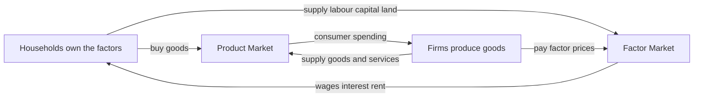
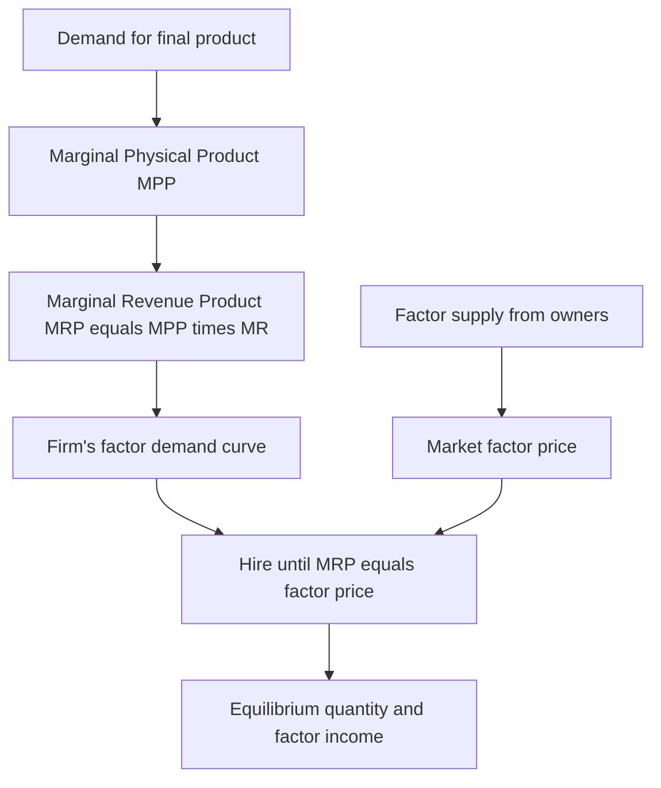
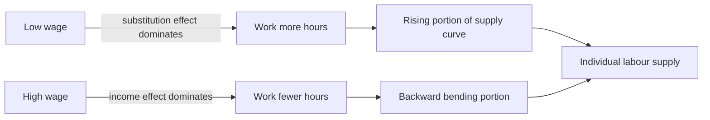
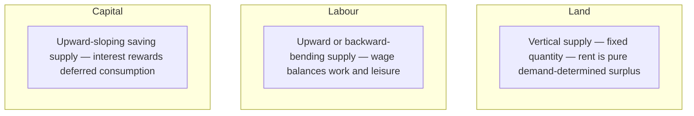

# Chapter 10 — Factor Markets and Income Distribution

## 1. The Problem / The Need

Most of introductory economics is about **product markets** — the market for bread, cars, haircuts, software. But step back and ask a deeper question: where does the money to buy those products come from? Households earn it. And they earn it by *selling something* — their labour, the use of their savings, the land they own, the buildings they let out. The goods you consume are produced by combining **factors of production**, and every one of those factors is owned by somebody who must be paid.

This flips the whole picture around. In the product market, firms are sellers and households are buyers. In the **factor market**, the roles reverse: households (and other owners) are the sellers of factor services, and firms are the buyers. A firm hiring a data scientist, borrowing capital from a bank, or leasing office space is *demanding* factor services, and the prices it pays — the **wage, the interest rate, the rent** — are factor prices.

Two big questions fall out of this, and they are among the most important in all of economics:

1. **How are factor prices determined?** Why does a surgeon earn more than a cashier? Why does prime commercial land in Mumbai command a rent that farmland in Bihar never will? What sets the interest rate a firm pays to use capital?
2. **How is the total income of an economy distributed?** National income doesn't fall from the sky in equal shares. It gets split into wages, profits, interest, and rent among the people who own the factors. This split — the **functional distribution of income** — decides who is rich and who is poor, and it is the economic root of some of the fiercest political debates on the planet.

For a finance professional this is not abstract. **The interest rate is the price of capital**, and it is literally the discount rate at the heart of every valuation you will ever do. **Wages** are the single largest cost line for most companies and a key macro driver of inflation. **Rents** and land values sit under the entire real-estate and REIT asset class. And the **labour-versus-capital income split** drives corporate profit margins, equity returns, and the political risk premium markets increasingly price in. Factor markets are where economics and finance fuse.

## 2. The Core Idea

The single most powerful idea in this chapter is **derived demand**: the demand for a factor of production is *derived from* the demand for the goods it helps produce. Nobody wants a welder's labour for its own sake — they want the cars, ships, and buildings that welding creates. When demand for those products rises, demand for welders rises with it; when it collapses, so does the demand for welders.

Building on derived demand is the **marginal productivity theory of distribution**. In a nutshell: a profit-maximising firm will keep hiring a factor up to the point where **the extra revenue that factor brings in equals the extra cost of employing it.** The extra revenue a factor generates is called its **marginal revenue product (MRP)**. The extra cost is the factor's price (the wage, the rental rate on capital, etc.). So the firm's hiring rule is beautifully simple:

> Hire more of a factor while its MRP exceeds its price; stop when **MRP = factor price**.

The consequence is profound: in competitive markets, **each factor tends to be paid the value of what it contributes at the margin.** A worker whose extra output is worth ₹800 an hour will, in equilibrium, be paid around ₹800 an hour. This is the theoretical backbone of "you're paid what you're worth" — with heavy caveats we'll unpack later.

The factor's *price* is set where the market **demand for the factor** (the sum of all firms' MRP-based demand) meets the market **supply of the factor** (how much labour, capital, or land owners are willing to offer at each price). Same supply-and-demand machinery you know from product markets — but the demand curve is now an MRP curve, and the supply curves have their own peculiar shapes.

*Figure 1 shows how the roles of firms and households flip between the two kinds of markets.*

*The circular flow: households sell factors and buy goods; firms buy factors and sell goods. Factor prices flow back to households as income.*

## 3. How It Works — The Model

### Building the demand for a factor

Start with one firm deciding how many workers to hire. Two building-block concepts:

- **Marginal Physical Product (MPP)** — the extra *physical* output from adding one more unit of the factor (e.g. one more worker produces 20 extra units of output). Because of the **law of diminishing marginal returns**, MPP falls as you add more of a variable factor to fixed factors — the tenth worker in a small kitchen adds less than the third.
- **Marginal Revenue Product (MRP)** — the extra *revenue* from that extra output: MRP = MPP × Marginal Revenue. In a perfectly competitive product market where price is fixed, MRP = MPP × Price, and this special case is called the **Value of Marginal Product (VMP)**.

The MRP curve slopes downward (because MPP falls, and under imperfect competition, price falls too as output rises). **This downward-sloping MRP curve is the firm's demand curve for the factor.**

The profit-maximising firm hires up to **MRP = factor price**. If the wage is ₹500/hour and the next worker's MRP is ₹700, hiring them adds ₹200 to profit — do it. Keep going until the marginal worker's MRP has fallen to ₹500. Beyond that, workers cost more than they bring in.

*Figure 2 shows the equilibrium for a single factor.*

*From product demand to factor price: MRP is the bridge that turns consumer demand into a wage, rent, or interest payment.*

### From one firm to the market

Sum every firm's MRP-based demand horizontally and you get the **market demand for the factor**. Cross it with the **market supply** of that factor, and the intersection sets the **equilibrium factor price and quantity**. Anyone whose reservation price is below the market price gets employed; the market price is the same for all identical units of the factor.

### What shifts factor demand?

Because demand is derived, anything that raises the value of the factor's output raises factor demand:

1. **Demand for the final product** — booming demand for EVs raises demand for battery engineers.
2. **Productivity of the factor** — better tools, training, or technology raise MPP.
3. **Prices of other factors** — factors can be **substitutes** (robots vs assembly workers) or **complements** (software engineers and cloud compute). Cheaper robots can cut demand for one kind of labour while raising it for the technicians who maintain them.

## 4. Full Content — The Three Factor Markets

### 4.1 The Labour Market and Wage Determination

**Demand for labour** is MRP-driven, as above. **Supply of labour** is more subtle and produces the famous **backward-bending supply curve of labour.**

At low wages, a higher wage draws people to work more — the **substitution effect** (leisure now costs more in foregone wages, so you "buy" less leisure and work more). But past some point, people are rich enough that higher wages make them choose *more* leisure — the **income effect** dominates, and the individual labour supply curve bends backward. At the *market* level, supply is usually still upward-sloping because higher wages pull new entrants into the workforce.

**Wage equilibrium** sits where labour demand meets labour supply. But real wages diverge widely, explained by:

- **Human capital** — education, skills, and experience raise MPP and hence wages. This is why the wage premium for skilled labour has widened in the tech era.
- **Compensating wage differentials** — dangerous, unpleasant, or remote jobs pay more to attract workers (offshore oil rigs, night shifts).
- **Market structure**: in a **monopsony** (a single dominant buyer of labour — a mining town's only employer, or historically some public-sector roles), the employer faces the whole upward-sloping supply curve and restricts hiring to hold wages *below* the competitive level and below MRP. This is the standard economic case for a **minimum wage** actually *raising* both wages and employment in monopsonistic markets.
- **Unions and bargaining power**: collective bargaining can push wages above the competitive level, at the cost of lower employment (a movement up the demand curve).

*Figure 3 shows the backward-bending individual labour supply curve.*

*Above a threshold wage, workers value leisure enough that further raises reduce hours supplied.*

### 4.2 The Capital Market and Interest Determination

"Capital" here means the man-made means of production — machines, factories, tools, software — and the **financial capital (loanable funds)** used to buy them. The price of capital services is the **interest rate** (or the **rental rate of capital**).

Two lenses on the interest rate — and finance uses both:

**(a) The real (productivity-and-thrift) view.** The **demand for capital** comes from its MRP — the extra output a machine yields, converted to revenue, expressed as a rate of return. Firms invest in projects whose **rate of return exceeds the interest rate** (equivalently, positive NPV at the market discount rate). The **supply of capital** comes from **saving**, which requires people to defer consumption. Because present consumption is preferred to future consumption (**time preference**), savers must be compensated — that compensation is interest. Equilibrium interest rate = where the marginal productivity of capital meets the marginal willingness to save.

**(b) The loanable funds market.** The interest rate is the price that equates the **supply of loanable funds** (household saving, retained earnings, foreign inflows) with the **demand for loanable funds** (business investment, government borrowing, consumer credit). Government deficits shift demand right and can **crowd out** private investment by raising rates.

Interest rates split into a **real rate** and an **inflation premium** (Fisher effect: nominal ≈ real + expected inflation), plus premia for **risk, liquidity, and maturity**. This is exactly the anatomy of a bond yield.

**Why this is the centre of gravity for finance:** the equilibrium interest rate *is* the economy's **cost of capital** benchmark — the risk-free rate that anchors discount rates, the hurdle rate that decides which real investments get made, and the opportunity cost against which every asset is valued. Marginal productivity theory says capital is paid its marginal product; in finance we call that the **required rate of return**.

### 4.3 The Land Market and Rent Determination

Land's defining feature: its total supply is (roughly) **fixed and perfectly inelastic**. You cannot manufacture more Manhattan. This gives land a special theory of pricing.

**Economic rent** is the payment to a factor **in excess of what is needed to keep it in its current use** — the surplus over its opportunity cost (its "transfer earnings"). Because land's supply is vertical, its price is **demand-determined entirely**: rent is high because the products made on valuable land are valuable, *not* the other way round. Ricardo's famous insight: **"Corn is not high because rent is paid; rent is paid because corn is high."** Rent is **price-determined, not price-determining** — it's a consequence of derived demand, not a cost that pushes up output prices.

*Figure 4 contrasts the three factor supply curves.*

*Each factor has a distinct supply shape, which is why rent, wages, and interest are determined by different mechanisms.*

The idea generalises beyond land. Any factor in fixed or scarce supply earns economic rent: a star cricketer, a patent, a beachfront hotel, a spectrum licence. In finance, **"economic rent"** is shorthand for the excess returns a firm earns from a durable competitive moat — the thing that keeps ROIC above the cost of capital. **Quasi-rent** is the shorter-run version: returns to a factor that is fixed in the short run but variable in the long run (e.g. an existing factory during a demand boom).

### 4.4 Marginal Productivity Theory and the "Adding-Up" Problem

Put the three together and marginal productivity theory claims each factor is paid its marginal product. A natural worry: if you pay *every* factor its marginal product, does the total exactly exhaust national output — no more, no less? Under **constant returns to scale** and competitive markets, **Euler's theorem** guarantees it does: the sum of (each factor × its marginal product) equals total output. This is the **product-exhaustion (adding-up) theorem** — the theoretical proof that competitive factor payments distribute exactly 100% of output, no surplus and no shortfall.

## 5. Real Examples (Finance Relevance)

**Example 1 — The interest rate as the market's discount rate.** When a central bank raises the policy rate, it raises the whole economy's cost of capital. Loanable-funds demand and supply re-equilibrate at a higher interest rate, fewer investment projects clear the higher hurdle rate, and — critically for markets — *every* future cash flow gets discounted more heavily. This is precisely why long-duration growth stocks and long-dated bonds fell hardest when the Fed and RBI hiked aggressively in 2022–23: their value is concentrated far in the future, where a higher discount rate bites most. Factor-market theory (interest = price of capital) and the DCF valuation on your spreadsheet are the same equation.

**Example 2 — Software engineers and derived demand.** The salary explosion for AI and machine-learning engineers is textbook MRP. Demand for AI *products* soared; because factor demand is derived, demand for the engineers who build them soared too; their MRP jumped; wages followed. When a tech-sector downturn cuts product demand (2022–23 layoffs), the derived demand for those same engineers contracts and wage growth stalls — nothing about the workers changed, only the value of their marginal output.

**Example 3 — Prime real estate and economic rent.** A REIT owning Grade-A office towers in Bandra-Kurla Complex earns rents driven almost entirely by the value of activity clustered there — land supply is fixed, so rent is pure demand-determined surplus. When you underwrite that REIT, you're valuing a stream of economic rent against a discount rate; cap rates move inversely with the interest rate (the price of capital), which is why real-estate valuations swing with bond yields. Two factor markets — land and capital — meet in a single security's price.

**Example 4 — Labour's falling income share and profit margins.** Since roughly 1980, labour's share of national income has fallen across many advanced economies while capital's share rose (globalisation, automation, weaker union bargaining power, superstar firms with market power). For equity investors this was a tailwind: a rising capital share means fatter corporate profit margins and stronger equity returns. It also feeds the political backlash and redistribution debates that markets increasingly price as policy/tax risk.

## 6. Connections

- **To valuation and corporate finance (the big one):** the equilibrium interest rate is the cost of capital / discount rate; MRP of capital is the required rate of return; positive-NPV investing is just "invest while MRP exceeds the factor price of capital."
- **To macroeconomics:** the labour-vs-capital income split shapes aggregate demand (wages are spent, profits are often saved/invested), and wage growth relative to productivity drives cost-push inflation and the Phillips-curve trade-offs central banks watch.
- **To the theory of the firm (Ch. on production and costs):** MRP is built directly on the production function and diminishing returns; factor demand is the mirror image of the cost curves.
- **To competitive strategy:** durable "economic rent" is exactly what a competitive moat protects — the excess of ROIC over WACC.
- **To public economics and inequality:** the functional distribution (wages/profit/rent) underlies the personal distribution of income (Gini, Lorenz curve) and the entire tax-and-transfer debate.
- **To credit and fixed income:** loanable-funds supply and demand, crowding out, and the Fisher decomposition of nominal rates are the macro foundations of bond yields.

## 7. Key Terms

| Term | Meaning |
|---|---|
| **Factor market** | Market where firms buy, and owners sell, the services of labour, capital, and land. |
| **Derived demand** | Factor demand that arises from demand for the goods the factor produces. |
| **Marginal Physical Product (MPP)** | Extra physical output from one more unit of a factor. |
| **Marginal Revenue Product (MRP)** | Extra revenue from one more unit of a factor = MPP × MR. The factor demand curve. |
| **Value of Marginal Product (VMP)** | MRP under perfect competition = MPP × Price. |
| **Marginal productivity theory** | Each factor is paid the value of its marginal product in equilibrium. |
| **Monopsony** | A single dominant buyer of a factor, able to hold its price below MRP. |
| **Economic rent** | Payment to a factor above its transfer earnings (opportunity cost). |
| **Quasi-rent** | Return to a factor fixed in the short run but variable in the long run. |
| **Transfer earnings** | The minimum payment needed to keep a factor in its current use. |
| **Loanable funds** | The pool of savings/credit whose price is the interest rate. |
| **Time preference** | Preference for present over future consumption; the reason saving earns interest. |
| **Functional distribution** | How national income splits into wages, interest, rent, and profit. |
| **Product-exhaustion theorem** | Under constant returns and competition, marginal-product payments exactly use up total output (Euler). |
| **Backward-bending supply** | Labour supply that falls as wages rise once the income effect dominates. |

## 8. Common Confusions

- **"High rent causes high prices."** Backwards. Rent is *price-determined*, not price-determining. Land is expensive because what's produced on it is valuable (derived demand), not the reverse. Confusing the direction of causation here is a classic error.
- **MRP vs MPP.** MPP is physical units; MRP is rupees. A worker can have high physical output but low MRP if the product's price is low — factor demand tracks MRP, not physical productivity alone.
- **"Marginal productivity theory says people deserve what they earn."** It's a *positive* theory of what competitive markets pay, not a *normative* claim about fairness. It assumes competitive markets, full information, and no market power — assumptions that fail under monopsony, discrimination, or unions. Being paid your marginal product is not the same as that outcome being just.
- **Economic profit vs economic rent.** Rent is a surplus payment to a *factor* over its opportunity cost; economic profit is the residual left to the *entrepreneur/firm* after all factors (including a normal return on capital) are paid. Related but distinct.
- **Interest as "the price of money."** Loosely true, but sharper to call it the **price of loanable funds / the price of capital / the reward for deferring consumption.** "Price of money" confuses it with the price level and inflation.
- **Functional vs personal distribution.** Functional = split by factor type (wages/profit/rent). Personal = split by household (rich vs poor). A person can earn from several factors, so the two are related but not identical.

## 9. Recap

- In **factor markets**, firms are buyers and households (factor owners) are sellers; the prices are **wages, interest, and rent**, which return to households as **income**.
- Factor demand is **derived** from product demand and equals the factor's **Marginal Revenue Product**. Firms hire until **MRP = factor price**.
- **Marginal productivity theory**: in competitive markets each factor is paid the value of its marginal contribution; under constant returns, these payments exactly exhaust output (Euler / product-exhaustion).
- **Labour**: wage set by MRP demand and a supply curve that can bend backward; modified by human capital, compensating differentials, monopsony, and unions.
- **Capital**: interest is the price of capital / loanable funds, set by the productivity of capital and the willingness to save (time preference) — and it *is* the economy's cost-of-capital benchmark.
- **Land**: fixed supply makes rent a pure demand-determined **economic rent** — price-determined, not price-determining. The concept generalises to any scarce factor (moats, patents, stars).
- **Income distribution**: national income splits functionally into wages/interest/rent/profit; the shifting **labour-vs-capital share** drives profit margins, equity returns, inequality, and policy risk.

## 10. Quick-Reference / Interview Points

- **One-liner:** "Factor prices are set where derived demand (MRP) meets factor supply; in equilibrium each factor earns its marginal revenue product."
- **The hiring rule:** hire a factor while MRP > its price; stop at **MRP = price**. Same logic as invest-while-return-exceeds-hurdle-rate.
- **Interest = cost of capital.** The equilibrium interest rate is the risk-free anchor for every discount rate — factor-market theory and DCF are the same equation. Rate up ⇒ hurdle rate up ⇒ fewer projects clear ⇒ long-duration assets fall hardest.
- **Derived demand explains wage cycles:** engineer salaries rise and fall with demand for the *products* they build, not their intrinsic skill.
- **Economic rent = excess over opportunity cost.** In finance, it's the moat that keeps ROIC above WACC. Rent is *price-determined*, so "rent causes high prices" is the causation trap to avoid.
- **Land supply is perfectly inelastic** ⇒ rent is pure demand-driven surplus ⇒ real-estate cap rates move with bond yields.
- **Monopsony** justifies a minimum wage that can raise both wages and employment — a favourite curveball question.
- **Labour's falling income share** since ~1980 (automation, globalisation, market power) = rising capital share = fatter margins = an equity tailwind and a rising inequality/policy-risk story.
- **Fisher:** nominal rate ≈ real rate + expected inflation, plus risk/liquidity/maturity premia — the anatomy of a bond yield.
- **Product-exhaustion (Euler):** competitive marginal-product payments exactly distribute 100% of output — the theoretical closure of the whole model.
