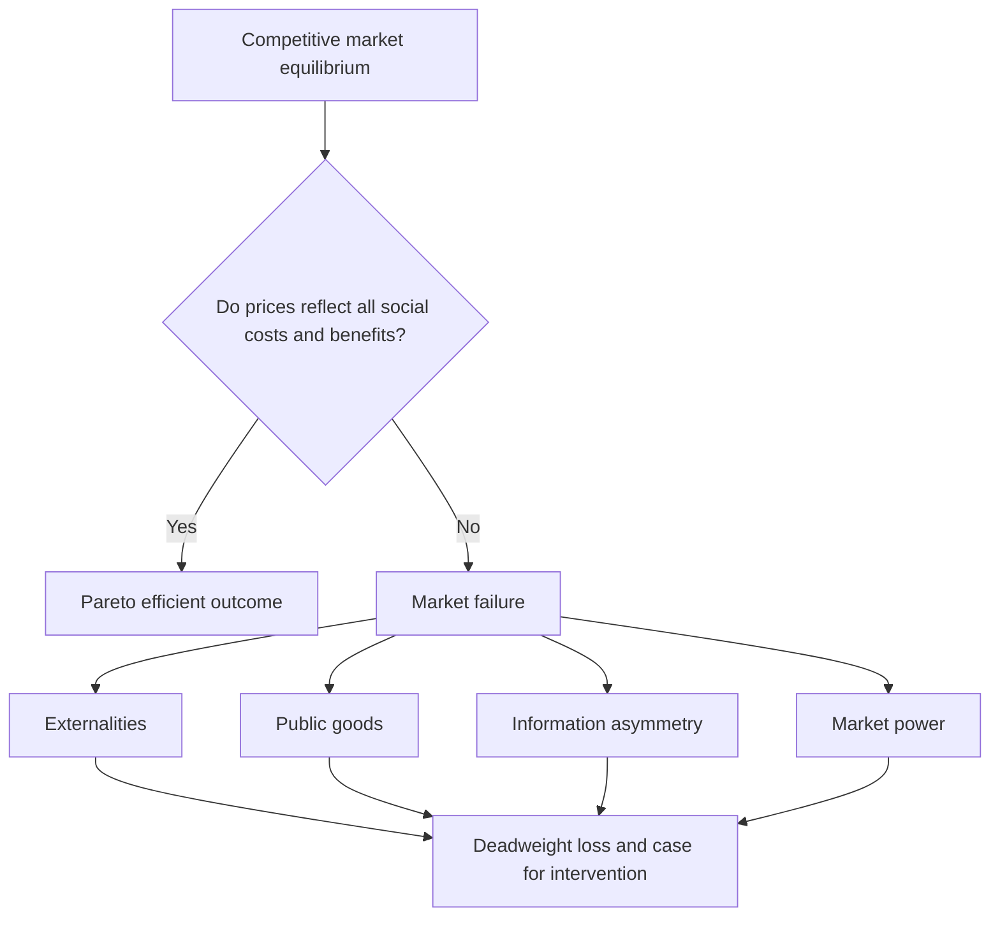
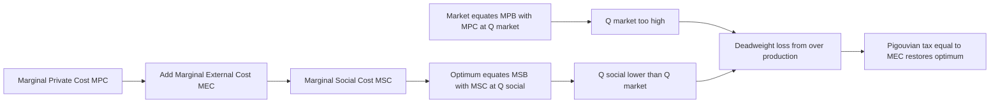
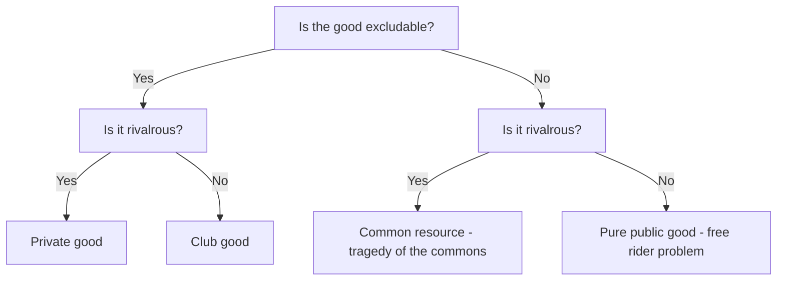
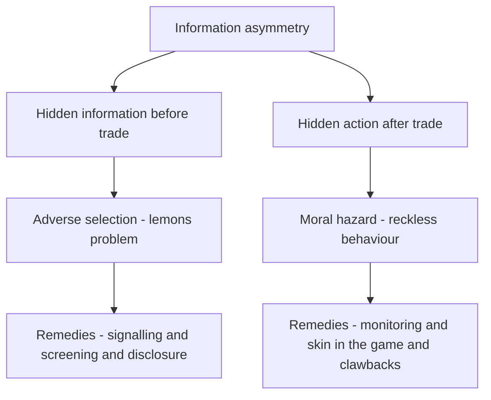

# Chapter 11 — Market Failure and Externalities

## 1. The Problem / The Need

The central promise of a competitive market, established back in the chapters on demand, supply and welfare, is powerful: when self-interested buyers and sellers trade freely, the price system quietly coordinates millions of decisions and pushes resources toward their most valued uses. Adam Smith's "invisible hand" and its formal cousin, the First Fundamental Theorem of Welfare Economics, say that a competitive equilibrium is *Pareto efficient* — you cannot make one person better off without making someone else worse off. This is the intellectual foundation for trusting markets over central planning.

But that theorem rests on a stack of assumptions that quietly do enormous work: prices reflect all costs and benefits, property rights are complete and enforceable, everyone has the same information, no single player has pricing power, and goods can be owned and withheld. In the real world these assumptions routinely break. When they do, the market equilibrium is no longer efficient — society could be made better off by producing more of some things and less of others, but the price signal is pointing the wrong way. Economists call this **market failure**.

Market failure matters intensely for anyone working in finance. Almost every piece of financial regulation — deposit insurance, disclosure rules, capital requirements, credit-rating oversight, insider-trading law — exists precisely because financial markets are riddled with the exact failures this chapter describes: externalities, public-goods problems and, above all, information asymmetry. The 2008 global financial crisis is, at its core, a story of externalities (one bank's collapse threatening the whole system) and asymmetric information (nobody knew what was inside a mortgage-backed security). ESG investing is a bet that pollution externalities will eventually be priced. Understanding market failure is therefore not abstract welfare theory — it is the operating logic behind how markets are designed, policed and, increasingly, invested in.

*This chapter asks a single organising question: when and why does the invisible hand fail, and what can be done about it?*

## 2. The Core Idea

Market failure occurs when a free, competitive market produces an allocation of resources that is **not Pareto efficient** — the quantity traded diverges from the quantity that maximises total social welfare. The gap between the private outcome and the socially optimal outcome creates a **deadweight loss**: real, avoidable destruction of value.

There are four classic sources of market failure, and it helps to see them as four different ways the "prices reflect everything" assumption can crack:

1. **Externalities** — a cost or benefit falls on a third party who is not part of the transaction, so the price omits it.
2. **Public goods** — the good cannot be withheld from non-payers and one person's use doesn't diminish another's, so private firms under-supply it.
3. **Information asymmetry** — one side of the trade knows more than the other, so trades that should happen don't, or bad trades crowd out good ones.
4. **Market power** — monopoly or oligopoly lets a seller restrict output and raise price above marginal cost (covered in the market-structures chapter; noted here for completeness).

The unifying theme is a **divergence between private and social calculus**. Each actor optimises against the costs and benefits *they personally* face. Efficiency requires optimising against the costs and benefits *society as a whole* faces. When those two diverge, individually rational decisions add up to a collectively irrational outcome.

*The efficiency of markets is conditional; when the pricing assumption breaks, one of four failures produces avoidable welfare loss.*

## 3. How It Works — The Model

The workhorse tool is the **marginal analysis of private versus social cost and benefit**. Recall that a competitive market settles where the marginal private benefit (the demand curve) equals the marginal private cost (the supply curve). Efficiency, however, requires that **marginal social benefit (MSB) equals marginal social cost (MSC)**.

Define:

- **Marginal Private Cost (MPC)** — cost borne by the producer of one more unit.
- **Marginal External Cost (MEC)** — cost imposed on third parties by one more unit.
- **Marginal Social Cost (MSC) = MPC + MEC.**
- Symmetrically on the benefit side: **MSB = MPB + MEB** (marginal external benefit).

The market ignores the external terms because no one pays or is paid for them. So the market equates MPB with MPC, while the social optimum equates MSB with MSC.

**Negative production externality (e.g. a factory that pollutes).** Here MSC lies *above* MPC (there is an extra external cost). The market produces where MPB = MPC, at quantity Q_market. The social optimum is where MSB = MSC, at a *lower* quantity Q_social. The market **over-produces**. The deadweight loss is the triangle between the MSC and MSB curves over the range from Q_social to Q_market — units are being produced whose true social cost exceeds their social benefit.

**Positive consumption externality (e.g. vaccination or education).** Here MSB lies *above* MPB (there is an extra external benefit the buyer ignores). The market produces where MPB = MPC, at a quantity *below* the social optimum. The market **under-produces**, again with a deadweight-loss triangle.

The policy logic follows mechanically: to fix a negative externality, raise the private cost until MPC + tax = MSC (a **Pigouvian tax**). To fix a positive externality, lower the private cost or raise private benefit with a **subsidy** until private incentives line up with social value. The size of the corrective instrument should equal the marginal external cost or benefit *at the efficient quantity*.

*A negative externality drives a wedge between private and social cost so the market over-produces; a corrective tax equal to the external cost closes the gap.*

## 4. Full Content

### 4.1 Externalities in depth

An **externality** is a cost or benefit from an economic activity that spills over onto a third party who neither chose it nor was compensated for it. The defining feature is the absence of a market transaction to price the spillover.

They come in four combinations:

| Type | Source | Effect on market quantity | Everyday example | Finance example |
|---|---|---|---|---|
| Negative production | Firm's output harms others | Over-produced | Factory air pollution | Systemic risk from a leveraged bank |
| Positive production | Firm's output benefits others | Under-produced | Beekeeper pollinating nearby orchards | R&D spillovers funded by one firm |
| Negative consumption | Consumer's use harms others | Over-produced | Passive smoking, traffic congestion | Herd selling in a fire-sale |
| Positive consumption | Consumer's use benefits others | Under-produced | Vaccination, education | Financial literacy raising market efficiency |

**The Coase Theorem.** Ronald Coase argued in 1960 that externalities are ultimately a problem of *missing or unclear property rights*, not something that inevitably requires government. If property rights are clearly assigned and **transaction costs are zero**, private parties will bargain to the efficient outcome regardless of who holds the right. If a factory has the right to pollute, the affected residents can pay it to stop up to the point where the payment equals the harm; if residents have the right to clean air, the factory pays them for permission to pollute. Either way the efficient quantity of pollution emerges. The deep insight is that the *initial allocation* of rights affects who ends up richer, but not whether the outcome is efficient.

The practical catch is the phrase "zero transaction costs." When millions of people are harmed a little each (climate change), when identifying the polluter is hard, or when strategic holdouts block a deal, bargaining collapses and government intervention becomes the realistic instrument. Coase's real contribution was to reframe externalities as a property-rights design problem — which is exactly the logic behind **cap-and-trade** emissions markets, where the government creates a tradable property right to pollute and then lets Coasean bargaining allocate it efficiently.

### 4.2 Public goods and free-riding

A **public good** has two properties:

- **Non-rivalry** — one person's consumption does not reduce the amount available to others (my enjoyment of a streetlight doesn't dim yours).
- **Non-excludability** — you cannot practically prevent non-payers from consuming it (you can't switch off national defence for one household).

Classic examples: national defence, street lighting, clean air, a lighthouse, basic scientific research, and — crucially for finance — **financial stability** and **market confidence**.

Because non-payers cannot be excluded, every rational individual has an incentive to **free-ride**: enjoy the good while letting others pay. If everyone free-rides, the good is under-provided or not provided at all, even though everyone values it. This is why public goods are typically funded through taxation (compulsion overrides the free-rider incentive) or provided by government directly.

Goods can be classified on the two dimensions of rivalry and excludability:

| | Excludable | Non-excludable |
|---|---|---|
| **Rivalrous** | Private good (a sandwich) | Common resource (ocean fish stock) |
| **Non-rivalrous** | Club good (a toll road, cable TV) | Pure public good (national defence) |

The bottom-left cell — rivalrous but non-excludable — produces the **Tragedy of the Commons**: a shared, finite resource is over-exploited because each user gets the full private benefit of using more while the cost of depletion is spread across everyone. Overfishing, groundwater depletion and, again, climate change are commons tragedies. The solutions mirror the externality toolkit: assign property rights (fishing quotas), regulate access, or price the resource.

*Rivalry and excludability jointly classify goods; the two non-excludable cells generate the free-rider and commons failures.*

### 4.3 Information asymmetry

Information asymmetry arises when one party to a transaction has more or better information than the other. It splits into two failures depending on *when* the hidden information matters.

**Adverse selection — hidden information *before* the trade.** The classic exposition is George Akerlof's 1970 "Market for Lemons." Suppose used cars are either good ("peaches") or bad ("lemons"), and only the seller knows which. Buyers, unable to tell them apart, will only pay a price reflecting the *average* quality. That average price is too low to tempt owners of good cars to sell, so they withdraw. The market's average quality then drops, the price falls further, and still more good cars exit — a downward spiral that can shrink or destroy the market entirely. The general lesson: when quality is hidden, **bad quality drives out good**, and mutually beneficial trades in high-quality goods fail to happen.

Adverse selection is everywhere in finance:
- **Insurance** — the people most eager to buy health insurance are those who know they are sick. If the insurer prices for the average, the healthy drop out, claims rise, premiums rise, more healthy people leave — an "insurance death spiral."
- **Lending** — at a high interest rate, the borrowers most willing to accept are the riskiest (they may not intend to repay). Raising rates can *worsen* the borrower pool, which is why banks ration credit rather than simply raising the price.
- **Securities issuance** — a firm that knows its shares are overvalued is more eager to issue equity; investors, aware of this, discount new issues.

**Moral hazard — hidden action *after* the trade.** Once a contract is signed, one party may change behaviour because they no longer bear the full consequences. A person with fire insurance may become careless about fire safety. A fund manager paid on the upside but not penalised on the downside takes excessive risk. A bank that expects a government bailout ("too big to fail") lends recklessly because losses are socialised while gains are private. The 2008 crisis featured moral hazard at every layer: mortgage originators who sold loans on immediately bore no default risk, so they stopped screening borrowers ("originate to distribute").

The tools for combating information asymmetry are worth knowing by name:

- **Signalling** — the informed party credibly reveals quality through a costly action. A firm signals quality via warranties; a graduate signals ability via a degree (Michael Spence's model); a company signals confidence by paying dividends or having insiders hold equity.
- **Screening** — the uninformed party designs a menu that induces self-revelation. Insurers offer a high-deductible/low-premium plan versus low-deductible/high-premium plan; low-risk people pick the former, revealing their type.
- **Disclosure and reputation** — mandatory audited accounts, credit ratings, and brand reputation all shrink the information gap.
- **Incentive alignment** — deductibles and co-pays (skin in the game), deferred bonuses and clawbacks, and equity stakes for managers curb moral hazard.

*Asymmetric information fails markets either before the trade through adverse selection or after it through moral hazard each with its own remedies.*

### 4.4 Government intervention

Once a failure is diagnosed, the state has a toolkit. The art is matching the instrument to the failure and doing more good than harm.

- **Pigouvian taxes and subsidies** — tax the negative externality (carbon tax, tobacco tax, congestion charge) and subsidise the positive one (vaccination programmes, education grants, R&D tax credits). The elegance is that a tax equal to the marginal external cost makes the private actor internalise the externality while still letting the market find the quantity.
- **Cap-and-trade (tradable permits)** — the government sets a total quantity of pollution allowed and issues tradable permits. Firms that can cut cheaply sell permits to firms for whom cutting is expensive, so abatement happens at least cost. The EU Emissions Trading System and various carbon markets work this way. This is Coase's property-rights insight operationalised.
- **Regulation and standards** — outright limits (emission caps, building codes, minimum capital ratios for banks, food-safety rules). Blunter than price instruments but sometimes necessary when the harm is catastrophic or hard to price.
- **Direct public provision** — for public goods the state simply provides and funds them through taxation (defence, courts, basic research, financial-stability infrastructure).
- **Mandated disclosure and mandatory participation** — to fight information asymmetry, require audited financial statements, prospectuses, nutrition labels; to fight adverse-selection death spirals, mandate participation (compulsory insurance pools).
- **Assigning property rights** — fishing quotas, spectrum auctions, tradable water rights — turning a commons into something ownable and tradable.

**Government failure.** Intervention is not costless or guaranteed to help. Regulators may lack information the market lacks too, be captured by the industries they regulate (**regulatory capture**), create distortions and unintended consequences, or simply be slow and politicised. A carbon tax set at the wrong level, subsidies that get capitalised into prices, or bailouts that entrench moral hazard can leave society worse off. The honest framing is comparative: market failure establishes only a *potential* case for intervention; whether real-world government does better than the imperfect market is an empirical question in each instance.

## 5. Real Examples (Finance Relevance)

**1. Systemic risk as a negative externality — the 2008 crisis.** When a large, interconnected bank takes on excessive leverage, the private cost it faces is its own possible failure. But its failure can freeze interbank lending, trigger fire sales that crash asset prices for everyone, and require taxpayer bailouts — costs borne by the whole economy. This is a textbook negative externality: the bank does not price the systemic damage it might cause, so it takes *too much* risk (over-produces risk). The regulatory response is pure externality correction: **Basel III capital and liquidity requirements**, a **systemic risk surcharge** on globally systemically important banks (a de facto Pigouvian tax on being big and connected), and stress testing. Financial stability itself is treated as a **public good** that the central bank and regulators must supply because no private actor will.

**2. The lemons problem in structured credit.** In the run-up to 2008, mortgage-backed securities and CDOs were sold to investors who could not see the quality of the underlying loans; the originators and packagers knew far more. This is Akerlof's lemons market at industrial scale, compounded by moral hazard in the "originate-to-distribute" model where lenders bore no default risk. When quality doubts finally surfaced, buyers could no longer distinguish good tranches from bad, so they refused to buy *any* — the market for the whole asset class froze, exactly the adverse-selection collapse the model predicts. The remedies that followed — **risk-retention rules** ("skin in the game," forcing originators to keep a slice), tighter **credit-rating oversight**, and enhanced disclosure — map directly onto the signalling and monitoring toolkit.

**3. ESG investing and the pricing of externalities.** A company that pollutes or emits carbon imposes costs on society that its share price historically ignored. ESG (Environmental, Social, Governance) investing is, in economic terms, a bet that these negative externalities will progressively be **internalised** — through carbon taxes, emissions-trading schemes, litigation, or shifting consumer and regulatory pressure — so that "dirty" assets carry a hidden liability and face **transition risk**. Carbon markets (EU ETS) are the explicit mechanism turning the externality into a priced cost on the balance sheet. ESG also runs into information asymmetry: **greenwashing** is an adverse-selection problem where firms overstate their sustainability and investors cannot easily verify claims — which is why standardised disclosure (TCFD, ISSB standards) matters, as a screening/signalling device.

**4. Deposit insurance and moral hazard.** Government deposit insurance (India's DICGC, the US FDIC) solves an adverse-selection/bank-run public-goods problem: without it, depositors who cannot assess a bank's health rationally run at the first rumour, and runs are contagious. Insurance stops the panic. But it creates moral hazard — insured depositors stop monitoring banks, and banks may take more risk knowing depositors won't flee. The regulatory answer is to pair insurance with **capital requirements, supervision and risk-based premiums** — intervention layered to fix the failure the first intervention created.

## 6. Connections

- **To welfare economics (earlier chapters):** market failure is defined *against* the benchmark of the First Welfare Theorem. You cannot understand failure without the ideal it departs from.
- **To market structures:** monopoly is itself a market failure (output restricted below the competitive level); this chapter completes the failure taxonomy.
- **To public finance and taxation:** Pigouvian taxes, the theory of public goods, and optimal-tax design all grow directly out of this material.
- **To behavioural economics:** bounded rationality and biases can be seen as a further source of failure, and they explain why information disclosure alone often doesn't fix asymmetry (people don't read the disclosures).
- **To financial regulation and macroprudential policy:** essentially the applied economics of systemic externalities and information asymmetry in financial markets.
- **To game theory:** free-riding, the tragedy of the commons and moral hazard are all strategic-interaction problems (prisoner's-dilemma-shaped), and mechanism/market design is the engineering discipline that builds institutions to overcome them.

## 7. Key Terms

- **Market failure** — a market outcome that is not Pareto efficient because prices fail to reflect all social costs and benefits.
- **Externality** — a cost or benefit imposed on a third party outside the transaction.
- **Marginal Social Cost / Benefit (MSC / MSB)** — private cost or benefit plus the external cost or benefit.
- **Pigouvian tax / subsidy** — a corrective tax (or subsidy) equal to the marginal external cost (or benefit) that internalises an externality.
- **Coase theorem** — with clear property rights and zero transaction costs, private bargaining reaches the efficient outcome regardless of who holds the rights.
- **Public good** — a good that is non-rival and non-excludable, hence under-provided by markets.
- **Free-rider problem** — the incentive to consume a non-excludable good without paying, causing under-provision.
- **Tragedy of the commons** — over-exploitation of a rivalrous but non-excludable shared resource.
- **Information asymmetry** — unequal information between the two sides of a transaction.
- **Adverse selection** — hidden information *before* trade causes bad quality to drive out good (the lemons problem).
- **Moral hazard** — hidden action *after* trade causes riskier behaviour once consequences are shifted onto others.
- **Signalling / screening** — the informed (signalling) or uninformed (screening) party takes actions to reveal hidden quality.
- **Deadweight loss** — the value destroyed by producing away from the efficient quantity.
- **Regulatory capture / government failure** — intervention that fails to improve on, or worsens, the market outcome.
- **Systemic risk** — the externality by which one financial institution's failure threatens the whole system.

## 8. Common Confusions

- **Externality vs pecuniary effect.** A true (technological) externality is an *uncompensated physical* spillover — pollution, congestion. Merely affecting others *through prices* (a new buyer bidding up house prices) is a *pecuniary* externality and is NOT a market failure; it's just the price mechanism working. Only real, non-priced spillovers count.
- **Adverse selection vs moral hazard.** Timing is the key: adverse selection is a *pre-contract* hidden-information problem (you don't know who you're dealing with); moral hazard is a *post-contract* hidden-action problem (behaviour changes after the deal). "Selection" happens as people sort into the contract; "hazard" happens as they act within it.
- **Public good vs government-provided good.** "Public good" is a technical term about non-rivalry and non-excludability, not about who provides it. Roads can be club goods; healthcare is largely a private good the government chooses to provide. Conversely a lighthouse is a public good even if privately built.
- **Non-excludable vs non-rival.** They're independent properties. A crowded but free public beach is non-excludable but *rival* (a common resource); pay-per-view cable is *excludable* but non-rival (a club good). A pure public good needs both.
- **Market failure does not automatically justify intervention.** It establishes a *potential* welfare gain. Because of government failure, the correct question is comparative — does feasible intervention beat the imperfect market? — not whether the market falls short of a perfect ideal.
- **Coase does not mean "leave it to the market."** Coase's result *requires* well-defined property rights and low transaction costs; his point was that the failure is often a *rights* problem, and where bargaining is costly (most environmental cases) intervention is still needed.
- **A Pigouvian tax is not just revenue.** Its purpose is to change quantity to the efficient level by internalising the externality; the revenue is a by-product, and the "right" tax is set to the marginal external cost, not to maximise receipts.

## 9. Recap

Competitive markets are efficient only when prices capture all social costs and benefits. When they don't, we get **market failure** and avoidable deadweight loss. The four classic sources are **externalities**, **public goods**, **information asymmetry**, and **market power**. Externalities drive a wedge between private and social cost or benefit, so negative externalities are over-produced and positive ones under-produced; the fix is to internalise them via Pigouvian taxes/subsidies, tradable permits, or — where rights are clear and bargaining cheap — Coasean private negotiation. Public goods, being non-rival and non-excludable, invite free-riding and are under-supplied by markets, justifying tax-funded public provision; their rivalrous cousin, the commons, gets over-used. Information asymmetry fails markets before the trade (adverse selection, the lemons spiral) and after it (moral hazard), and is fought with signalling, screening, disclosure and incentive alignment. Government can correct these failures but is itself fallible, so intervention must be judged comparatively. For finance, this framework *is* the rationale for regulation: systemic risk is an externality, financial stability a public good, and asymmetric information the reason for disclosure rules, credit ratings and skin-in-the-game requirements — while ESG is a wager that externalities will finally be priced.

## 10. Quick-Reference / Interview Points

- **Define market failure in one line:** a competitive outcome that isn't Pareto efficient because prices don't reflect all social costs/benefits.
- **Name the four sources fast:** externalities, public goods, information asymmetry, market power.
- **Externality sign rule:** negative externality → MSC > MPC → over-production; positive externality → MSB > MPB → under-production.
- **Corrective instrument:** Pigouvian tax = marginal external cost (at the efficient quantity); subsidy = marginal external benefit.
- **Coase in one sentence:** clear property rights + zero transaction costs → efficient bargaining regardless of who holds the right; breaks down when transaction costs are high.
- **Two properties of a public good:** non-rival and non-excludable → free-rider problem → under-provision.
- **2x2 goods matrix:** private / club / common resource / pure public — by excludability and rivalry.
- **Adverse selection vs moral hazard:** before vs after the contract; hidden information vs hidden action; lemons vs recklessness.
- **Remedies for asymmetry:** signalling (informed acts), screening (uninformed offers a menu), disclosure, reputation, incentive alignment (skin in the game, clawbacks).
- **Finance application to have ready:** 2008 as systemic-risk externality + MBS lemons market + originate-to-distribute moral hazard; Basel III as the corrective; deposit insurance as a public-good fix that itself creates moral hazard.
- **ESG framing:** a bet that negative externalities (carbon) get internalised via taxes/carbon markets/regulation, creating transition risk for "dirty" assets; greenwashing is an adverse-selection problem.
- **Sophisticated closer:** market failure is a *necessary but not sufficient* condition for intervention — because of government failure and regulatory capture, the real test is whether feasible policy beats the imperfect market.
