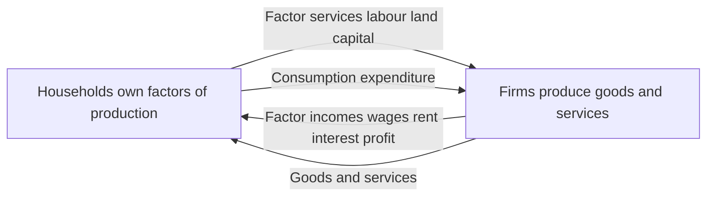
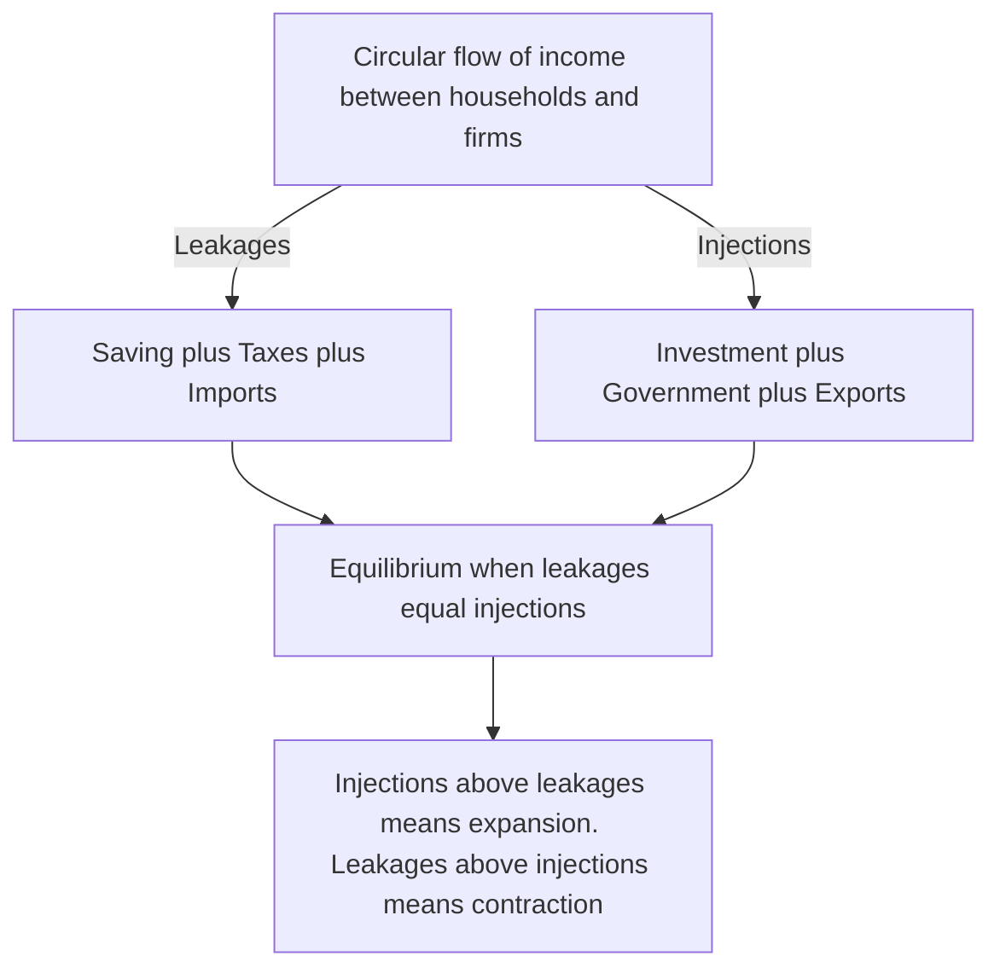
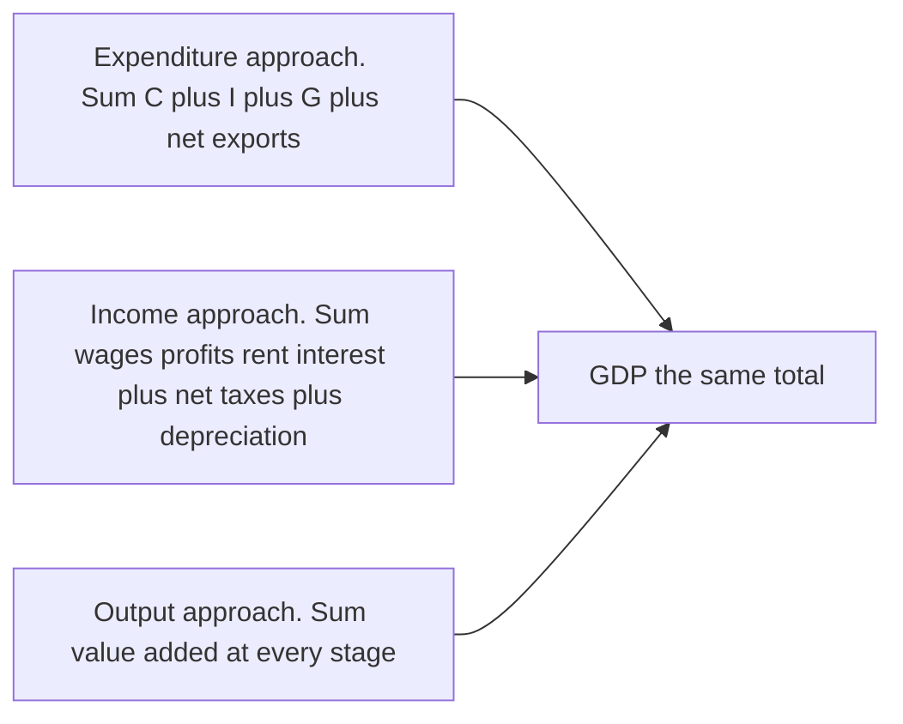
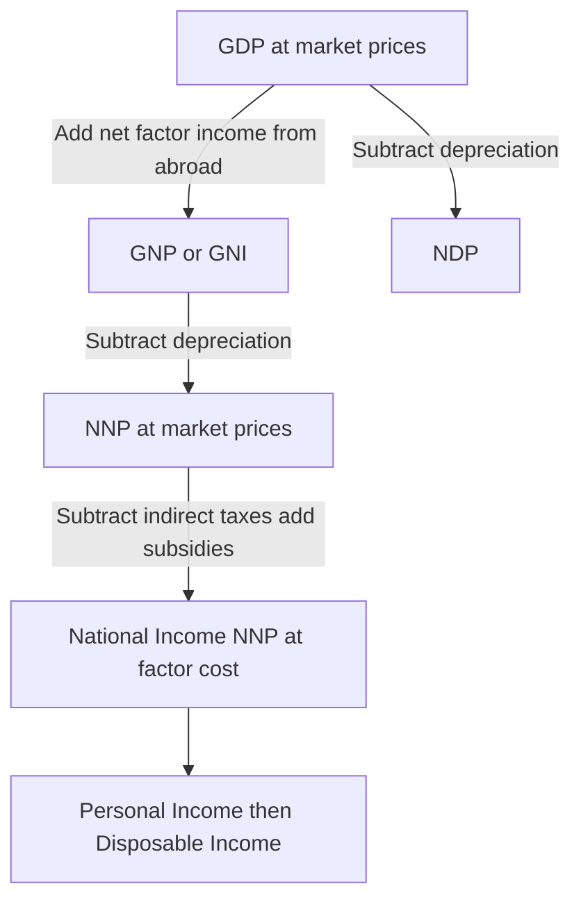

# Chapter 12 — GDP and National Income

## 1. The Problem / Need — How Do You Measure an Entire Economy?

Everything in the previous chapters looked at *pieces* of the economy: a single firm's costs, one market's supply and demand, a household's utility. But when a fund manager asks "Is the US economy accelerating or slowing?", or a central banker asks "Do we have room to cut interest rates?", or a bond trader asks "Will inflation force yields higher?" — they need a number that summarises the whole thing at once.

**The core problem is aggregation: how do you add up the value of everything a country produces — from haircuts to semiconductors to legal advice — into a single, comparable figure?**

You cannot literally add three million haircuts to two million tonnes of steel to a billion lines of software code. The units are incommensurable. The brilliant trick that solves this — invented largely by Simon Kuznets in the 1930s so that a depression-era United States could actually *see* how much output it was losing — is to add everything up **in money terms**, valuing each good and service at its market price. The result is **Gross Domestic Product (GDP)**, and its close relatives make up what economists call the **national income accounts**.

Why should a finance professional care deeply about this, rather than treating it as dry government statistics?

- **GDP is the single most market-moving economic release on earth.** When US GDP or the monthly jobs and inflation figures that feed into it surprise the market, bond yields, currencies, and equity indices can move within milliseconds. Understanding what the number *is* tells you why it matters.
- **Almost every macro ratio you will ever quote is a fraction of GDP.** Government debt is "120% of GDP." A country's trade deficit is "3% of GDP." Total corporate profits, tax revenue, the size of the stock market — all are routinely scaled by GDP so they can be compared across countries and across time.
- **The business cycle — the alternation of expansion and recession that drives credit risk, default rates, and earnings — is defined in terms of GDP.** The famous "two consecutive quarters of falling real GDP" shorthand for a recession comes straight from these accounts.
- **Valuation ultimately rests on growth.** A DCF model discounts future cash flows; those cash flows grow roughly in line with the economy over the long run. The trend growth rate of real GDP is, in a deep sense, the anchor for long-run equity returns.

So national income accounting is the bridge from microeconomics (individual choices) to macroeconomics (the behaviour of the whole system) — and it is the vocabulary in which all macro-finance is spoken.

## 2. The Core Idea

**GDP is the total market value of all final goods and services produced within a country's borders in a given period.**

Unpack that one-sentence definition, because every word is load-bearing:

- **Market value** — we add things up using prices, which lets us combine haircuts and steel into one number.
- **Final** goods and services — we count only goods sold to their end user, *not* the intermediate inputs consumed along the way. Counting both would double-count.
- **Produced** — GDP measures *production*, not sales of second-hand items or pure financial transactions. Reselling a used car or buying a share of stock does not add to GDP because nothing new was produced.
- **Within a country's borders** — "Domestic" means geography. Output produced inside India counts in Indian GDP whether the factory is Indian-owned or Japanese-owned.
- **In a given period** — GDP is a **flow**, measured *per quarter* or *per year*, not a stock sitting at a point in time. (Wealth is a stock; income is a flow. GDP is income.)

The deepest and most elegant idea in the whole subject is this: **the same total can be measured three completely different ways, and all three must give the identical answer.** You can add up everything that is *spent* (the expenditure approach), everything that is *earned* (the income approach), or everything that is *produced* (the output/value-added approach). Because every rupee of spending on a final good becomes someone's income, and corresponds to a rupee of value produced, the three roads all lead to the same GDP. This is the accounting identity at the heart of macroeconomics.

## 3. How It Works — The Circular Flow of Income

Before the three measurement approaches make intuitive sense, you need the picture they are all measuring: the **circular flow of income**.

Imagine the simplest economy: just households and firms. Households own the factors of production — labour, land, capital, entrepreneurship — and sell them to firms. Firms use those factors to produce goods and services, which they sell back to households. Money flows in a continuous loop:

- Firms pay households **factor incomes** (wages, rent, interest, profit) for the use of their resources.
- Households spend that income buying goods and services — **consumption expenditure** — which flows back to firms as revenue.

The genius of the picture is that **the same loop can be metered at different points.** Meter the money leaving firms as it pays households, and you have measured *income*. Meter it as households spend it back, and you have measured *expenditure*. Meter the value of the goods flowing the other way, and you have measured *output*. It is one circulating stream — so the three measures are necessarily equal.

*Figure 12.1 — The simple two-sector circular flow. Income, output, and expenditure are three meters on one circulating stream, so they must be equal.*

Real economies are not this simple. Three sets of **leakages** (money that exits the loop) and matching **injections** (money that enters it) complicate the picture:

| Leakage (money leaves the flow) | Matching injection (money re-enters) |
|---|---|
| **Saving** — income not spent but put aside | **Investment** — firms borrowing savings to buy capital |
| **Taxes** — income taken by government | **Government spending** — the state buying goods and services |
| **Imports** — spending that flows abroad | **Exports** — foreign spending on our output |

For the economy to be in equilibrium, total leakages must equal total injections: **S + T + M = I + G + X**. When injections exceed leakages the economy expands; when leakages dominate it contracts. This single balance is the skeleton of the entire business cycle, and — as we will see — of Keynesian demand management.

*Figure 12.2 — Leakages and injections. Their balance determines whether national income rises or falls.*

## 4. Full Content — The Three Approaches, and the Family of Aggregates

### 4.1 The Expenditure Approach — GDP = C + I + G + (X − M)

This is the approach you will use most often in finance, because its four components map directly onto the sectors of the economy that analysts track.

**GDP = C + I + G + (X − M)**

- **C — Consumption.** Household spending on goods and services: food, rent, cars, healthcare, entertainment. In most developed economies this is the single largest slice, roughly 55–70% of GDP (about 68% in the US, closer to 60% in India). Because it is so large and relatively stable, consumer spending data drives a huge amount of market attention.

- **I — Investment (Gross Capital Formation).** This is *not* financial investment — buying shares is not "I". In the national accounts, investment means **business spending on new physical capital**: factories, machinery, equipment, plus new housing construction, plus the change in inventories. Investment is the smallest of the four components but by far the *most volatile*, which makes it the primary driver of the business cycle. When firms lose confidence, they cut capex first, and recessions follow.

- **G — Government spending.** Spending by the state on goods and services — public salaries, defence, roads, schools. Crucially, **G excludes transfer payments** like pensions and unemployment benefits, because those are not payments *for production* — the government gets no good or service in return. The recipient's later spending shows up in C instead. Counting transfers in G would double-count.

- **(X − M) — Net exports.** Exports (X) are output produced domestically and sold abroad, so they add to GDP. Imports (M) are subtracted because C, I, and G all include spending on foreign-made goods, and GDP must measure only *domestic* production. A country with a trade surplus (X > M) has net exports adding to GDP; a deficit country (like the US) has them subtracting.

### 4.2 The Income Approach — Adding Up What Everyone Earned

If GDP is the value of production, and every rupee of that value ends up as somebody's income, then we can measure GDP by summing all the incomes generated in production:

- **Compensation of employees** — wages, salaries, and benefits (the largest share, typically ~50–60%).
- **Gross operating surplus / profits** — the income of corporations and the self-employed.
- **Rent** — income from land and property.
- **Interest** — the return to lenders of capital.

Add these to get income at *factor cost*. Two adjustments bridge to market-price GDP:

- **+ Indirect taxes − subsidies.** Market prices include taxes like GST/VAT that are not income to any factor, and are inflated below true cost where subsidies apply. Adding net indirect taxes converts factor cost to market prices.
- **+ Depreciation (consumption of fixed capital).** This is what makes it *Gross*. Some of the year's production merely replaces worn-out machines rather than adding new capacity. That replacement value is counted in gross output but is not new net income — adding it back reconciles the income total to *gross* domestic product.

### 4.3 The Output / Value-Added Approach — Avoiding Double-Counting

The third route sums the **value added** by every firm — the value of its output minus the cost of the intermediate goods it bought from other firms. This directly solves the double-counting problem.

Consider a loaf of bread's journey. If we naively added every transaction we would count the wheat, then the flour (which *contains* the wheat), then the bread (which contains the flour) — counting the wheat three times over.

| Stage | Sale value | Cost of inputs | Value added |
|---|---|---|---|
| Farmer grows wheat | ₹20 | ₹0 | ₹20 |
| Miller makes flour | ₹35 | ₹20 | ₹15 |
| Baker makes bread | ₹60 | ₹35 | ₹25 |
| Retailer sells loaf | ₹80 | ₹60 | ₹20 |
| **Total value added** | | | **₹80** |

The sum of value added (₹80) exactly equals the final sale price of the loaf (₹80) — which is why counting *only final goods* (expenditure approach) and *summing value added* (output approach) give the same answer. Both correctly exclude the ₹115 of intermediate transactions.

*Figure 12.3 — Three roads, one destination. All three approaches must yield identical GDP because they meter the same circular flow.*

### 4.4 Nominal vs. Real GDP — Stripping Out Inflation

Here is a trap that catches beginners and moves markets. Suppose a country produces the *exact same* basket of goods this year as last year, but every price has risen 10%. Measured in current prices, GDP is 10% higher — yet not one extra good was produced. That apparent "growth" is pure inflation, an illusion.

- **Nominal GDP** values output at the prices *of the current year*. It mixes together changes in quantity and changes in price.
- **Real GDP** values output at the prices of a fixed **base year**, holding prices constant so that only *quantity* changes register. Real GDP is the honest measure of whether the economy actually produced more stuff.

When news reports "the economy grew 2.5%," they mean **real** GDP. This distinction is not academic — it is the difference between genuine prosperity and mere price inflation, and confusing the two has misled many an investor.

### 4.5 The GDP Deflator — A Whole-Economy Price Index

Dividing the two gives one of the most useful numbers in macroeconomics:

**GDP Deflator = (Nominal GDP / Real GDP) × 100**

The deflator is a **price index for the entire economy** — the broadest available measure of inflation. Rearranged, it says: Nominal growth = Real growth + Inflation. If nominal GDP rose 7% and the deflator shows 4% inflation, then real growth was about 3%.

How does the deflator differ from the more famous **CPI (Consumer Price Index)**?

| Feature | GDP Deflator | Consumer Price Index (CPI) |
|---|---|---|
| **Coverage** | *All* domestically produced goods and services | A *fixed basket* of consumer goods only |
| **Investment and government goods** | Included | Excluded |
| **Imports** | Excluded (measures domestic output) | Included (people buy imports) |
| **Basket weights** | Change every period (current output mix) | Fixed for years at a time |
| **Main use in finance** | Deflating GDP; broadest inflation gauge | Cost-of-living, wage/pension indexation, headline inflation |

Because CPI holds its basket fixed and includes imports, it can diverge meaningfully from the deflator — a fact bond and rates traders watch closely, since central banks target consumer inflation but the deflator reveals economy-wide price pressure.

### 4.6 The Family of Aggregates — GNP, NNP, NDP, and National Income

GDP has several cousins. The two dimensions that generate the whole family are (a) **Domestic vs. National** (geography vs. ownership) and (b) **Gross vs. Net** (before vs. after depreciation).

**Domestic vs. National — the NFIA adjustment.** GDP counts production *inside the borders*. **GNP (Gross National Product)**, now often called **GNI (Gross National Income)**, counts production by a country's *nationals* wherever located. You convert between them with **Net Factor Income from Abroad (NFIA)** — income earned by our residents abroad minus income earned by foreigners here:

**GNP = GDP + NFIA**

For a country like the Philippines or India, whose citizens send home large remittances and foreign earnings, GNP exceeds GDP. For a host of foreign capital like Ireland — where huge foreign-owned multinationals book profits that flow *out* to overseas owners — GDP wildly exceeds GNP. (Ireland's GDP is so distorted by multinational accounting that its own statisticians publish a modified measure, "GNI*", instead.) This is a live issue for anyone analysing a small open economy: GDP can flatter a country whose gains actually accrue to foreigners.

**Gross vs. Net — the depreciation adjustment.** Subtract depreciation (the capital used up in producing this year's output) and "Gross" becomes "Net":

- **NDP = GDP − Depreciation**
- **NNP = GNP − Depreciation**

Net measures are conceptually superior — they show output *after* setting aside what is needed just to maintain the capital stock — but depreciation is hard to measure, so GDP remains the headline figure.

**National Income (NNP at factor cost).** Finally, take NNP and strip out net indirect taxes to reach income actually received by the factors of production:

**National Income = NNP at market prices − Indirect taxes + Subsidies**

From there, further adjustments (subtracting corporate retained earnings and taxes, adding transfers) yield **Personal Income** and then **Disposable Income** — the money households can actually spend or save, which loops us right back to consumption in the circular flow.

*Figure 12.4 — The family of national income aggregates, built from GDP by adjusting for ownership, depreciation, and taxes.*

### 4.7 What GDP Leaves Out

GDP is powerful but blinkered. It deliberately or unavoidably omits:

- **Non-market production** — household work, childcare, and volunteering (no market transaction, so uncounted). The paradox: marry your housekeeper and GDP *falls*.
- **The informal / black economy** — undeclared cash work, which is enormous in developing economies.
- **Externalities and depletion** — pollution and resource exhaustion are not subtracted; a factory that fouls a river adds to GDP while the environmental damage goes unrecorded.
- **Distribution** — GDP is an average; it says nothing about who gets the income. Rising GDP per capita can coexist with a squeezed median household.
- **Leisure and wellbeing** — a country that works itself to exhaustion for a higher GDP is not obviously better off.

These are not pedantic caveats. They explain why "GDP growth" and "are people better off" can diverge, and why alternative measures (HDI, Genuine Progress Indicator, wellbeing indices) exist. For an investor, the lesson is subtler: headline GDP can mislead about the *quality* and *sustainability* of growth.

## 5. Real Examples — GDP in Live Markets

**Example 1 — The GDP release as a market event.** In the United States, the Bureau of Economic Analysis publishes quarterly GDP in three successive estimates (advance, second, third) as more data arrives. Ahead of each release, economists post consensus forecasts. What moves markets is the **surprise** — the gap between actual and expected. A hot GDP print (growth above expectations) typically pushes bond yields *up* (stronger growth means the central bank can stay tight, and inflation risk rises) and can lift the currency, while its equity effect is ambiguous (good earnings news, but higher discount rate). A weak print does the reverse. Because algorithmic traders parse the release in milliseconds, the initial move is almost instantaneous — a vivid demonstration that GDP is not academic but tradeable information.

**Example 2 — Real vs. nominal and the "growth recession" illusion.** In high-inflation episodes, a country can report booming *nominal* GDP while *real* output stagnates or shrinks. Turkey and Argentina in recent years posted eye-watering nominal GDP growth that, once deflated by 50%+ inflation, revealed weak or negative real growth. An investor who looked only at nominal figures — or at a stock index rising in local-currency terms — would badly misread the economy. This is exactly why global investors deflate everything and often re-express emerging-market data in US dollars.

**Example 3 — GDP vs. GNP and the Ireland distortion.** In 2015, Ireland's *real GDP* jumped by a barely believable 26% in a single year ("Leprechaun economics," as economist Paul Krugman dubbed it) — driven not by any real boom but by multinational corporations relocating intellectual-property assets onto Irish balance sheets for tax reasons. Ireland's GNI (which nets out the profits flowing to foreign owners) grew far less. Anyone using Irish GDP to judge the living standards of Irish residents, or to size the country's debt burden, would be severely misled — which is why analysts of small open economies watch GNI, not GDP.

**Example 4 — GDP as the denominator of risk.** When Greece's debt crisis unfolded, the terrifying number was the **debt-to-GDP ratio** climbing past 180%. The crisis logic runs directly through the accounts: austerity cut G and, via multipliers, crushed C and I, shrinking *real GDP* — which, because GDP is the denominator, made the debt ratio *worse* even as debt was cut. Understanding GDP as both an output measure and the scaling factor for solvency is essential to reading any sovereign-risk story.

## 6. Connections

- **To the business cycle and recessions (macro chapters).** GDP is the raw material of the business cycle. A recession is conventionally two consecutive quarters of falling real GDP; expansions and contractions are movements in the same series.
- **To Keynesian demand management.** The expenditure identity GDP = C + I + G + (X − M), combined with the leakages-injections balance, is the launching pad for the multiplier, fiscal policy, and the entire aggregate-demand framework of later chapters.
- **To monetary policy and interest rates.** Central banks react to the gap between actual and *potential* GDP (the output gap) and to the GDP deflator. Rate decisions — which price every bond and discount every equity — flow from GDP data.
- **To inflation (CPI chapter).** The GDP deflator is one of the economy's three main price gauges (alongside CPI and WPI/PPI), tying national income accounting directly to inflation analysis.
- **To valuation.** Long-run equity returns are anchored to trend real GDP growth; a DCF's terminal growth rate cannot durably exceed the growth rate of the economy it lives in.
- **To the balance of payments.** The (X − M) term is the current-account link between national income and international economics, connecting this chapter to exchange rates and trade.

## 7. Key Terms

- **GDP (Gross Domestic Product)** — market value of all final goods and services produced *within a country's borders* in a period.
- **Final vs. intermediate goods** — end-user goods (counted) vs. inputs consumed in making them (excluded to avoid double-counting).
- **Value added** — a firm's output value minus its purchased intermediate inputs; summing it across all firms gives GDP.
- **Circular flow of income** — the continuous loop of factor incomes and expenditure between households and firms.
- **Leakages and injections** — money leaving the flow (S, T, M) and re-entering it (I, G, X); their balance sets equilibrium income.
- **Nominal GDP** — output valued at current-year prices (mixes price and quantity).
- **Real GDP** — output valued at constant base-year prices (quantity only); the true measure of growth.
- **GDP deflator** — (Nominal / Real) × 100; the broadest economy-wide price index.
- **NFIA (Net Factor Income from Abroad)** — residents' income earned abroad minus foreigners' income earned domestically; converts GDP to GNP.
- **GNP / GNI** — output by a country's *nationals* wherever located = GDP + NFIA.
- **Depreciation (consumption of fixed capital)** — capital worn out in production; separates Gross from Net measures.
- **NNP / NDP** — Net National / Domestic Product = Gross measure minus depreciation.
- **National Income** — NNP at factor cost (market prices minus net indirect taxes).
- **Transfer payments** — government payments with no good/service in return (pensions, benefits); excluded from G.
- **Output gap** — the difference between actual and potential GDP; a key policy variable.

## 8. Common Confusions

- **"Buying shares is investment, so it's in GDP."** No. In the national accounts, *investment (I)* means new **physical** capital — factories, machines, housing, inventories. Buying existing financial assets is just a transfer of ownership; nothing is produced, so it is excluded.
- **"A trade deficit subtracts from GDP, so imports are bad for growth."** Imports are subtracted only because they were *already added* inside C, I, and G. The subtraction is a correction to isolate domestic production, not a claim that imports destroy output.
- **"Government pensions and benefits are part of G."** No — transfer payments are excluded from G because nothing is produced in exchange. The recipient's later spending appears in C.
- **"Nominal GDP growth means the country got richer."** Only if it outpaced inflation. Strip out the GDP deflator to get real growth — the honest measure.
- **"GDP and GNP are basically the same."** They differ by NFIA. For economies with large remittances (India) or large foreign-owned profits (Ireland), the gap is huge and changes the story entirely.
- **"Selling a used car adds to GDP."** No. The car was counted when first produced; reselling it is just a change of ownership. (The dealer's *service margin*, however, does count — that's newly produced service.)
- **"Depreciation is a cash cost you subtract to get GDP."** Depreciation is what separates *Net* from *Gross*. GDP is the *gross* figure — it *includes* the replacement investment; you subtract depreciation to reach NDP.
- **"CPI and the GDP deflator should match."** They routinely diverge: CPI uses a fixed consumer basket including imports; the deflator covers all current domestic output. Watching the gap is itself informative.

## 9. Recap

- GDP solves the aggregation problem by valuing all **final** output at **market prices** — a *flow* measured per period.
- It can be measured three equivalent ways — **expenditure** (C + I + G + X − M), **income** (wages + profit + rent + interest, plus taxes and depreciation), and **output** (sum of value added) — all equal because they meter the one **circular flow of income**.
- Equilibrium income is set where **leakages (S + T + M) equal injections (I + G + X)**; imbalance drives expansion or contraction.
- **Nominal** GDP mixes price and quantity; **real** GDP holds prices at a base year to isolate genuine growth; the **GDP deflator** (Nominal ÷ Real) is the economy-wide price index.
- The aggregate family flows from GDP: add **NFIA** for **GNP/GNI**, subtract **depreciation** for net measures, subtract net indirect taxes for **National Income**.
- GDP omits non-market work, the informal economy, externalities, and distribution — so it measures *output*, not *welfare*.
- In finance, GDP is the most market-moving release, the denominator of nearly every macro ratio, the definition of the business cycle, and the long-run anchor of valuation.

## 10. Quick-Reference / Interview Points

- **Definition in one line:** GDP is the market value of all final goods and services produced within a country's borders in a period. (Watch the four keywords: *market value, final, produced, within borders*.)
- **The identity to know cold:** GDP = C + I + G + (X − M). Know each term's rough share and that *I is the most volatile*, driving the cycle.
- **Three approaches, one answer:** expenditure = income = output (value added). Be ready to explain *why* they're equal (the circular flow) and *how the output approach avoids double-counting* (value added = final value).
- **Nominal vs. real:** real strips out inflation using base-year prices. "The economy grew 2.5%" always means *real*. GDP deflator = Nominal/Real × 100.
- **Deflator vs. CPI:** deflator = all domestic output, changing weights, excludes imports; CPI = fixed consumer basket, includes imports. Central banks target CPI but watch both.
- **GDP vs. GNP:** GNP = GDP + NFIA. Ireland (GDP ≫ GNP, foreign profits leave) and India/Philippines (GNP > GDP, remittances arrive) are the classic examples.
- **The Gross/Net ladder:** GDP → (−depreciation) → NDP; GDP → (+NFIA) → GNP → (−depreciation) → NNP → (−net indirect taxes) → National Income.
- **Recession:** conventionally two consecutive quarters of falling *real* GDP (the US NBER uses a broader judgment).
- **Why it moves markets:** GDP *surprises* move bond yields, currencies, and equities in milliseconds; strong growth → higher yields (tighter policy, inflation risk); weak growth → the reverse.
- **What it misses:** household/non-market work, the informal economy, pollution and depletion, and income distribution — hence GDP ≠ welfare.
- **Killer soundbite:** "GDP is one circular flow you can meter three ways — spent, earned, or produced — and the number you deflate to see whether a country actually grew or just repriced."
