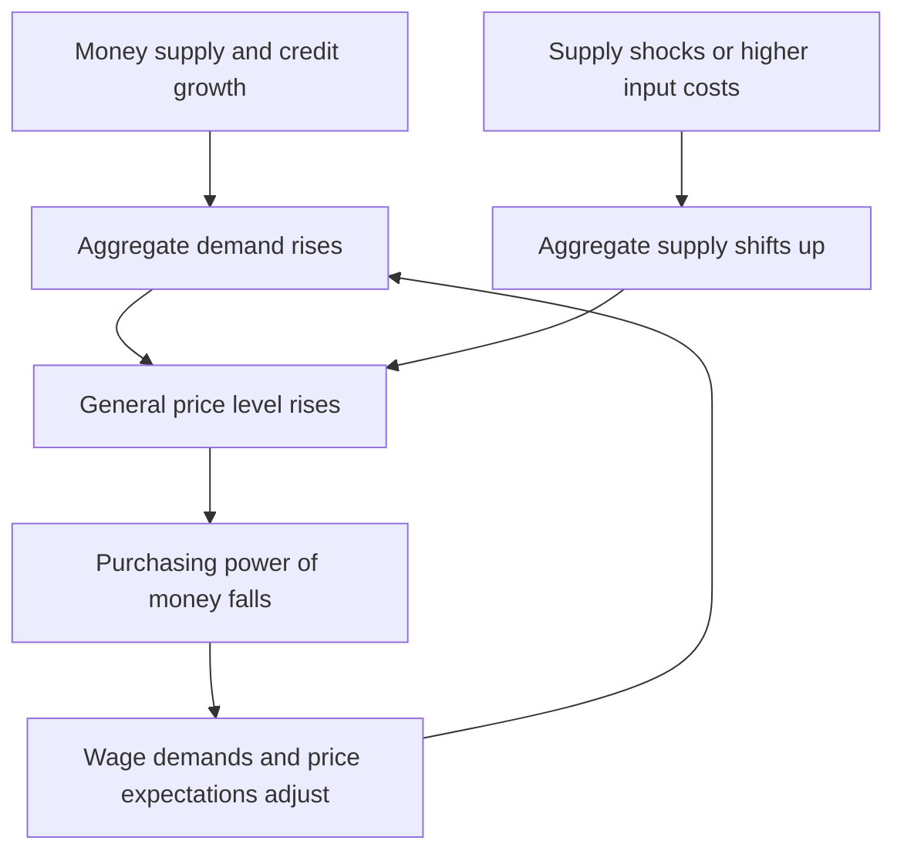
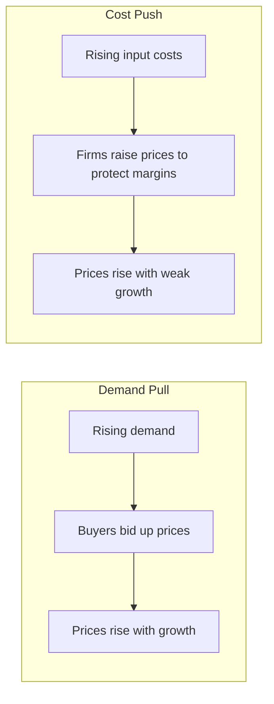
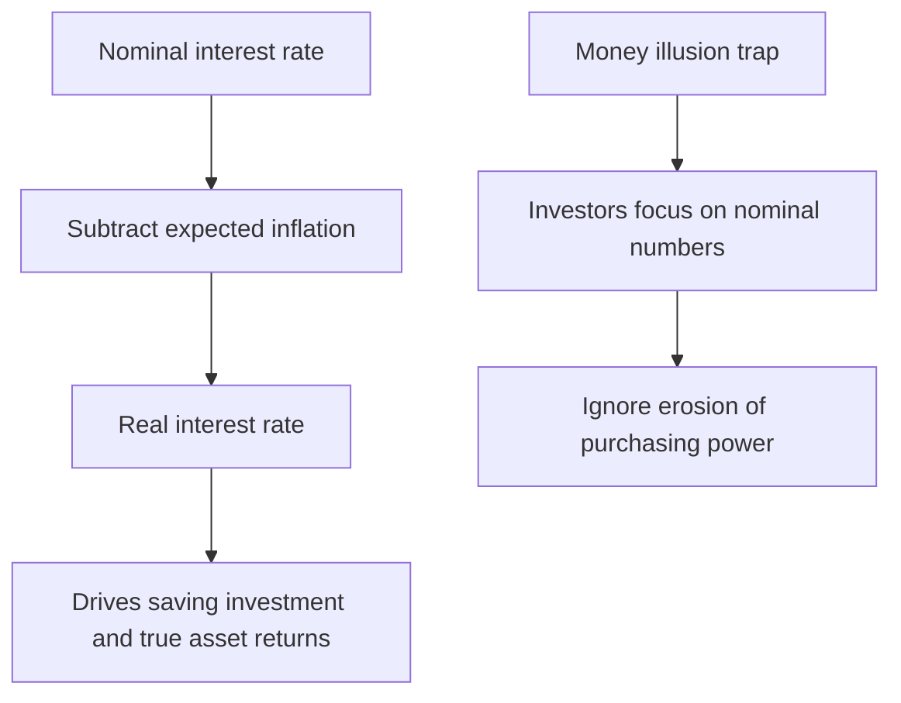
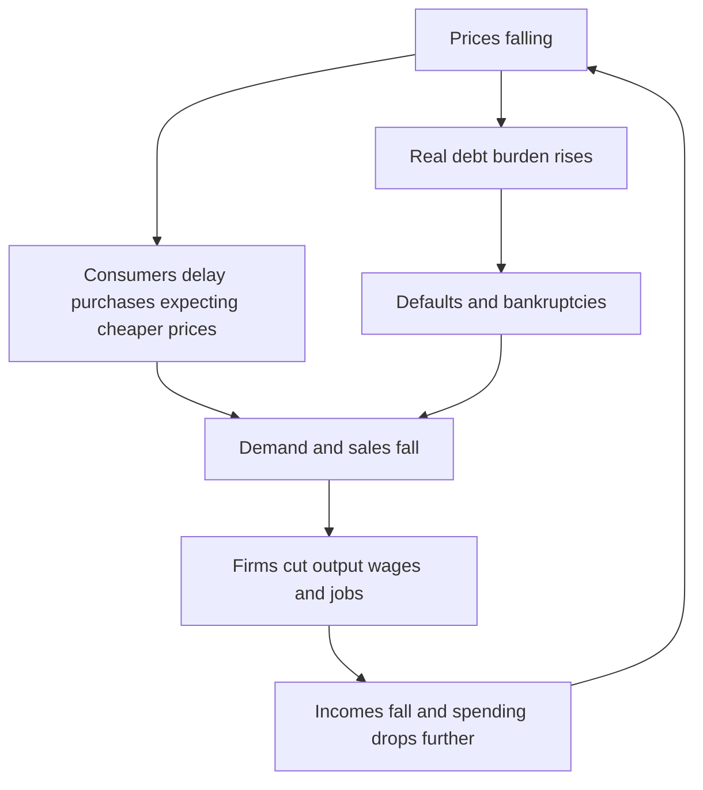
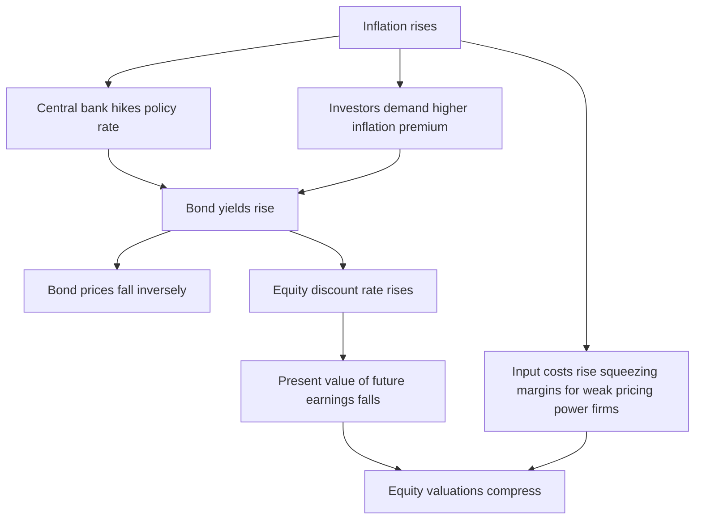

# Chapter 13 — Inflation

## 1. The Problem / Need

Imagine you kept ₹1,00,000 in cash under your mattress in 2015. By 2025, that same pile of notes still reads "one lakh," but it now buys roughly what ₹65,000 bought a decade earlier. You lost a third of your purchasing power without ever being robbed, without any number in your possession changing. That silent erosion is **inflation**, and understanding it is not an academic nicety for anyone who works in finance — it is the single most important variable that shapes interest rates, bond prices, equity valuations, currency movements and central-bank policy.

Money has one job: to be a stable yardstick of value. When the yardstick itself keeps shrinking, every economic calculation becomes harder. A lender does not know what interest to charge because they do not know how much the repaid rupees will be worth. A saver does not know whether their nest egg will fund retirement. A business does not know whether a price rise reflects genuine demand for its product or merely the general debasement of money. A government tempted to print money to pay its bills discovers that inflation is the most regressive tax of all, falling hardest on the poor who hold cash and cannot hedge.

For a finance professional, inflation is the hinge on which markets turn. Every asset — a ten-year government bond, an equity share, a rental property, a foreign currency deposit — is ultimately a claim on future purchasing power. If the yardstick shrinks faster than expected, those claims are worth less, and prices reprice violently. The bond-market bloodbath of 2022, when US and Indian government bonds fell sharply, was fundamentally a story about inflation surprising to the upside and central banks racing to catch up. The person who understood inflation dynamics saw it coming; the person who did not was blindsided.

So the need is twofold. First, to define precisely **what** inflation is, distinguish it from related phenomena (a one-off price jump, a change in relative prices, deflation, hyperinflation), and know **how it is measured** — because "the inflation rate" is not one number but a family of indices, each telling a different story. Second, to trace the **transmission mechanism**: how a change in the price level ripples through nominal and real interest rates, into bond yields, into the discount rate that values every stock, and out into currencies. Master this chapter and you hold the master key to macro-driven markets.

## 2. The Core Idea

**Inflation is a sustained increase in the general price level of goods and services in an economy over a period of time — equivalently, a sustained decline in the purchasing power of money.**

Three words in that sentence carry the whole weight, and getting them right dissolves most confusion:

- **Sustained** — Inflation is a *rate of change over time*, not a one-off jump. If the government raises fuel taxes once and prices step up 2% and then stay flat, that is a one-time price-level shift, not inflation. True inflation is ongoing, period after period.
- **General** — It refers to the *overall* price level, not the price of one item. If onions triple because of a bad monsoon while everything else is stable, that is a change in *relative prices*, not inflation. Inflation is when prices are rising broadly, across the basket.
- **Purchasing power** — The flip side of rising prices is falling money value. These are the same coin. Saying "prices rose 6%" and "the rupee lost about 5.7% of its purchasing power" describe one phenomenon from two ends.

The deepest single sentence in monetary economics is Milton Friedman's: *"Inflation is always and everywhere a monetary phenomenon."* His point: sustained, general price rises ultimately require the money supply to grow faster than the economy's output of goods. If you double the money chasing the same quantity of goods, prices roughly double. This does not mean *every* short-run wiggle in prices is caused by money — supply shocks, demand surges and expectations all matter over months and quarters — but that *persistent* inflation cannot happen without accommodative money. This is the intellectual foundation on which every inflation-targeting central bank, including the Reserve Bank of India, is built.

The core mental model is a tug-of-war between the **quantity of money and credit** on one side and the **quantity of goods and services** on the other. Anything that pushes more spending power against a fixed supply of goods (demand-pull) or shrinks the supply of goods against fixed spending (cost-push) raises the price level. The central bank's job is to keep this tug-of-war roughly balanced so the yardstick stays stable — in India, targeting 4% CPI inflation with a tolerance band of 2% to 6%.

## 3. How It Works

### The mechanics of a rising price level

Start with the classic **Quantity Theory of Money**, captured in the equation of exchange:

**M × V = P × Y**

where M is the money supply, V is the velocity of money (how many times each rupee is spent per year), P is the price level, and Y is real output (real GDP). Rearranging, P = (M × V) / Y. If velocity V is reasonably stable and output Y grows at its natural rate, then the price level P is driven by the money supply M. Money growing 12% a year while real output grows 6% implies roughly 6% inflation. This is the long-run skeleton of inflation theory.

But in the short and medium run, inflation emerges from the interaction of aggregate demand and aggregate supply. Let us trace the two engines.

*Figure 13.1 — The two engines of inflation feed a self-reinforcing loop through expectations.*

### The expectations spiral

The feedback arrow in Figure 13.1 is the crucial insight modern central banking rests on. Once people *expect* prices to keep rising, they act in ways that make it happen. Workers demand higher wages to protect real income; firms grant them, then raise prices to cover the wage bill; those higher prices confirm the expectation, and the cycle repeats — a **wage-price spiral**. Expectations can become **de-anchored**, meaning the public no longer trusts that inflation will return to target, at which point inflation develops a momentum of its own that is painful to break. This is why central banks obsess over "anchoring inflation expectations" and why credibility is a central bank's most precious asset.

### The role of the output gap

Inflation pressure builds when the economy runs *above* its sustainable capacity — the **output gap** turns positive, unemployment falls below its natural rate, factories run flat out, and any extra demand spills into prices rather than production. The **Phillips Curve** formalises the historically observed short-run trade-off: lower unemployment tends to coincide with higher inflation. The modern version adds expectations and supply shocks, but the intuition survives — a hot economy runs hotter prices, a slack economy cools them. Central banks effectively try to steer the economy to run neither too hot nor too cold.

## 4. Full Content

### 4.1 Demand-Pull Inflation — "too much money chasing too few goods"

Demand-pull inflation occurs when **aggregate demand grows faster than the economy's productive capacity**. Buyers collectively want more than the economy can produce, and their competing bids pull prices up. The classic sources:

- **Monetary expansion** — the central bank cuts rates or expands money and credit, cheap loans fuel spending and investment.
- **Fiscal stimulus** — large government spending or tax cuts inject demand (e.g., pandemic-era stimulus cheques).
- **Consumer and investment booms** — rising confidence, wealth effects from booming asset markets, or a credit-fuelled housing surge.
- **Export demand and currency depreciation** — a weaker rupee makes exports cheaper abroad, boosting external demand.

The tell-tale sign of demand-pull inflation is that it typically comes with a *growing* economy, falling unemployment and rising corporate profits — the economy is overheating. It is, in a sense, the "good problem" version of inflation because it accompanies strong growth, but left unchecked it forces painful monetary tightening.

### 4.2 Cost-Push Inflation — "the supply side gets more expensive"

Cost-push inflation occurs when the **costs of production rise**, forcing firms to raise prices even if demand is unchanged. Aggregate supply shrinks or becomes costlier. Sources:

- **Input and commodity shocks** — the oil shocks of 1973 and 1979, or the 2022 energy and food spike after Russia invaded Ukraine. India, importing over 80% of its crude oil, is acutely exposed.
- **Wage-push** — powerful unions or tight labour markets driving wages above productivity growth.
- **Supply-chain disruptions** — the post-COVID semiconductor and shipping bottlenecks of 2021.
- **Rupee depreciation** — a weaker currency raises the rupee cost of all imports (oil, electronics, edible oil), feeding **imported inflation**.
- **Taxes and administered prices** — higher GST, excise duties or minimum support prices for crops.

Cost-push inflation is more dangerous for policymakers because it comes with **stagnant or falling output** — the horrid combination of high inflation plus high unemployment known as **stagflation**, which crippled Western economies in the 1970s. The central bank faces a cruel dilemma: raise rates to fight inflation and you deepen the recession; cut rates to support growth and you inflame inflation.

| Feature | Demand-Pull | Cost-Push |
|---|---|---|
| Trigger | Excess aggregate demand | Rising production costs / supply shock |
| Direction of output | Output and employment rising | Output and employment falling |
| Typical accompaniment | Economic boom, overheating | Stagflation, recession risk |
| Curve shifts | Aggregate demand shifts right | Aggregate supply shifts left |
| Classic example | Post-2020 US stimulus demand | 1970s oil shocks, 2022 energy crisis |
| Policy response | Tighten money to cool demand | Painful trade-off, supply-side reform |
| Central-bank comfort | Easier to address | Much harder, no clean fix |

*Figure 13.2 — Two distinct causal chains that both end in higher prices but with opposite output effects.*

### 4.3 Measuring Inflation — the family of indices

There is no single "inflation number." Analysts use several indices, each with a different basket, coverage and purpose.

**Consumer Price Index (CPI)** — Measures the average change in prices paid by *households* for a fixed basket of consumer goods and services (food, housing, fuel, clothing, transport, health, education, recreation). It is the **headline inflation measure** and the one the RBI targets. India's CPI (Combined, base 2012) is compiled by the National Statistical Office. Its most striking feature is a very heavy food weight — around 46% of the basket — which makes Indian headline CPI extremely sensitive to monsoons and vegetable prices. Inflation is computed as the year-on-year percentage change in the index.

**Wholesale Price Index (WPI)** — Measures price changes at the *wholesale / producer* level — the prices of goods traded in bulk between businesses, before they reach the retail consumer. India's WPI (base 2011-12), compiled by the Office of the Economic Adviser, covers primary articles, fuel and power, and manufactured products. Crucially, **WPI excludes services** and gives large weight to manufacturing and commodities, so it is far more volatile and swings with global commodity prices. WPI and CPI can diverge sharply — in some periods WPI has been negative while CPI stayed high. WPI is akin to a Producer Price Index and signals pipeline cost pressure.

**Core Inflation** — Headline CPI *minus* the volatile food and fuel components. The logic: food and energy prices gyrate on weather and geopolitics, adding noise that obscures the underlying trend. Core inflation strips out that noise to reveal the *persistent, demand-driven* signal that monetary policy can actually influence. A central bank watches core inflation to judge whether price pressures are becoming entrenched (broad-based) or are merely a passing food/fuel spike. When headline is high but core is contained, the RBI may "look through" the spike; when core itself rises, alarm bells ring.

**GDP Deflator** — The broadest measure of all. It is the ratio of **nominal GDP to real GDP**, multiplied by 100, and captures the price change of *every* good and service produced domestically — consumption, investment, government and net exports. Unlike CPI's fixed basket, the deflator's weights change as the composition of GDP changes, and it excludes imports (which are not domestic production). It is the most comprehensive gauge of economy-wide inflation but is published only quarterly with a lag, so it is a confirming rather than a real-time indicator.

| Index | What it measures | Basket / coverage | Key trait | Main use |
|---|---|---|---|---|
| CPI | Retail prices paid by households | Consumer goods + services, heavy food weight | Headline, timely, monthly | RBI's inflation target |
| WPI | Wholesale / producer prices | Goods only, no services | Volatile, commodity-sensitive | Pipeline cost pressure |
| Core CPI | CPI excluding food and fuel | Sticky, demand-driven items | Reveals underlying trend | Judging persistence |
| GDP Deflator | All domestically produced output | Entire GDP, variable weights | Broadest, quarterly, lagged | Economy-wide confirmation |

**A note on index construction subtleties:** A fixed-basket index like CPI suffers **substitution bias** (when beef gets dear, people buy chicken, but the fixed basket keeps assuming beef), **quality bias** (a phone costs more but does vastly more), and **new-product bias**. These tend to make CPI *overstate* true cost-of-living inflation by perhaps half to one percentage point — a fact with enormous fiscal consequences wherever pensions and wages are index-linked.

### 4.4 Nominal vs Real — the most important distinction in finance

A **nominal** value is measured in current money terms, unadjusted for inflation. A **real** value is adjusted for inflation, expressed in constant purchasing power. This distinction is the beating heart of financial analysis.

The **Fisher equation** links them for interest rates:

**(1 + nominal rate) = (1 + real rate) × (1 + expected inflation)**

which for small numbers approximates to:

**Real interest rate ≈ Nominal interest rate − Expected inflation**

If your fixed deposit pays 7% and inflation runs at 6%, your *real* return is barely 1%. If inflation jumps to 8%, your real return is *negative* 1% — you are getting poorer in purchasing power despite a positive nominal number. This is the trap that catches unsophisticated savers: they see the fat nominal number and ignore the thief silently working behind it.

The same logic applies everywhere:
- **Nominal GDP** growth of 11% with 6% inflation means **real GDP** grew only ~5% — the rest is just price inflation, not more stuff.
- **Nominal wages** rising 8% when inflation is 6% means real wages rose only ~2%.
- A **nominal bond yield** of 7.2% on a ten-year Indian G-Sec, with expected inflation of 4.5%, offers a real yield of roughly 2.7%.

*Figure 13.3 — Only the real rate matters economically but money illusion keeps investors staring at nominal figures.*

**Money illusion** — the tendency to think in nominal rather than real terms — is a documented behavioural bias. People feel richer when their salary rises 5% during 5% inflation (real change zero) but feel cheated by a 2% pay cut during zero inflation (real change also negative but smaller loss). Markets are not immune: the "Modigliani-Cohn hypothesis" argues equity investors in the 1970s wrongly discounted *real* earnings at *nominal* rates, mispricing the whole stock market.

### 4.5 The Effects of Inflation — winners, losers and distortions

Moderate, stable, predictable inflation (the 2–4% most central banks aim for) is largely benign and even useful — it greases wage adjustments and keeps the economy a safe distance from deflation. The damage comes from inflation that is **high, volatile or unexpected**.

**Redistribution — the core injustice.** Unexpected inflation transfers wealth from **creditors to debtors**. A borrower who took a fixed-rate ₹50 lakh home loan cheers inflation — they repay in cheaper rupees while their nominal wage and their home's nominal value climb. The bank that lent at a fixed rate loses. This is why governments, being the largest debtors in most economies, have a structural temptation to inflate away their debt. It also crushes **fixed-income earners** — pensioners, bondholders, salaried workers with sticky pay — while benefiting **holders of real assets** like property, gold and equities.

**Erosion of savings and cash.** Cash and low-yield deposits bleed value. This pushes savers to chase higher-yielding, riskier assets — a phenomenon central banks exploit deliberately (the "portfolio rebalancing channel") but which can inflate asset bubbles.

**Distorted investment and shoe-leather / menu costs.** High inflation clouds the price signals firms rely on. **Menu costs** are the literal costs of constantly reprinting prices; **shoe-leather costs** are the effort of minimising cash holdings (running to the bank). Under high inflation, effort shifts from productive activity to *inflation hedging* — buying gold and real estate rather than building factories.

**Fiscal drag / bracket creep.** In progressive tax systems, inflation pushes nominal incomes into higher tax brackets even when real income is unchanged, quietly raising the effective tax burden.

**International competitiveness.** If India's inflation persistently exceeds its trading partners', Indian goods become relatively expensive, worsening the trade balance and putting downward pressure on the rupee (unless offset by nominal depreciation — see purchasing power parity).

**The one benefit:** mild inflation lets **real wages fall without nominal wage cuts** (which workers resist fiercely). Because nominal wages are "sticky downward," a little inflation is the lubricant that lets labour markets clear. This is a key argument for a positive inflation target rather than zero.

### 4.6 Hyperinflation — when money dies

**Hyperinflation** is inflation gone catastrophically vertical — the conventional threshold (Philip Cagan's) is **50% per month**, which compounds to over 12,000% per year. It is almost always caused by governments printing money to finance deficits they cannot fund by taxes or borrowing — a **fiscal** collapse dressed as a monetary event. Once the public loses all faith in the currency, velocity explodes (everyone spends money the instant they receive it), which accelerates inflation further in a doom loop, and the currency ceases to function as a store of value or unit of account.

Historic episodes are chilling: **Weimar Germany (1923)**, where prices doubled every few days and workers were paid twice daily to spend before wages became worthless; **Zimbabwe (2008)**, which printed a 100-trillion-dollar note before abandoning its currency; **Hungary (1946)**, the worst on record, with prices doubling roughly every 15 hours; and **Venezuela (2016–2019)**, where inflation ran into the millions of percent. The cure is always the same: stop printing money, establish a credible new monetary anchor (often dollarisation or a currency board), and restore fiscal balance. Hyperinflation destroys the middle class, wipes out savings and bondholders, and frequently topples governments — its political consequences (Weimar's collapse into Nazism) can dwarf the economic ones.

### 4.7 Deflation — the opposite and arguably worse disease

**Deflation** is a *sustained fall* in the general price level — negative inflation, rising purchasing power of money. It sounds pleasant (cheaper stuff!) but is often more dangerous than moderate inflation, because it can trigger a self-reinforcing downward spiral:

*Figure 13.4 — The deflationary spiral where falling prices and rising real debt feed each other downward.*

Two mechanisms make deflation vicious. First, **deferred consumption**: if prices will be lower next month, rational buyers wait, collapsing current demand. Second — and worse — **debt deflation** (Irving Fisher's insight): debts are fixed in nominal terms, so as prices and incomes fall, the *real* burden of debt *rises*, forcing defaults, fire-sales and bank failures that shrink credit further. Deflation also renders conventional monetary policy impotent: the central bank cannot cut nominal rates below roughly zero (the **zero lower bound**), so real rates stay punishingly high exactly when the economy needs stimulus. This is the **liquidity trap**.

The defining case is **Japan's "Lost Decades"** — mild but persistent deflation from the mid-1990s trapped the economy in stagnation for over 20 years despite near-zero rates, spawning "unconventional" tools like quantitative easing. The **Great Depression** (1929–33), when US prices fell ~25% and real debt burdens exploded, is the other canonical example. Precisely because deflation is so hard to escape, central banks target a *positive* 2% rather than 0% — they want a safety buffer against ever falling into the deflationary trap.

### 4.8 How inflation drives interest rates, bond prices and equity valuations

This is where the chapter earns its keep for a finance professional. Inflation is the master variable that reprices the entire capital market.

**Inflation → interest rates.** Central banks respond to rising inflation by raising the **policy rate** (in India, the RBI's repo rate) to cool demand and re-anchor expectations. This is the primary lever. Beyond policy, lenders in the free market demand compensation for expected inflation via the Fisher effect — nominal rates embed an **inflation premium**. So both the short end (policy-driven) and the long end (expectations-driven) of the yield curve rise with inflation. Higher-for-longer inflation also raises the **term premium** — the extra yield investors demand to bear the *uncertainty* of future inflation over a long horizon.

**Inflation → bond prices.** Here lies one of finance's most reliable relationships: **bond prices move inversely to yields.** When inflation rises, yields rise, and existing bonds — locked into their old, now-inferior fixed coupons — must fall in price so their yield-to-maturity matches the new market rate. The longer a bond's **duration**, the more violently its price falls for a given yield rise. This is exactly what devastated bond portfolios in 2022: as US CPI hit ~9% and the Fed hiked from near-zero to over 4%, long-dated Treasuries fell 20–30%, and Indian G-Secs sold off as the RBI raised the repo rate from 4% to 6.5%. Inflation is the bondholder's mortal enemy — it erodes both the *real value of fixed coupons* and, via rising yields, the *market price* of the bond. This is why sophisticated investors buy **inflation-linked bonds** (US TIPS, India's now-discontinued Inflation Indexed Bonds) whose principal adjusts with the price index, and why the **breakeven inflation rate** — the yield gap between nominal and inflation-linked bonds — is watched as a market-implied inflation forecast.

**Inflation → equity valuations.** The relationship is more nuanced and cuts both ways.

- *The discount-rate channel (negative).* A stock is worth the present value of its future cash flows, discounted at a rate that includes the risk-free bond yield. When inflation pushes yields up, the discount rate rises, and the present value of distant cash flows falls — especially punishing for **growth stocks** whose value lies far in the future (high-duration equities). This is why richly-valued tech stocks cratered in 2022 as rates rose.
- *The earnings channel (mixed).* Firms with **pricing power** can pass rising costs on to customers, protecting or even growing nominal earnings — these are inflation winners (consumer staples, energy, commodities). Firms without pricing power see margins crushed as input costs rise faster than they can raise prices.
- *The valuation-multiple channel (negative).* Historically, price-to-earnings multiples *contract* when inflation is high and volatile, because uncertainty raises the equity risk premium and money illusion may cause mispricing. Equities have historically performed best in a "Goldilocks" zone of low, stable inflation (2–3%) and worst under both high inflation and deflation.

The net effect: equities are an *imperfect* inflation hedge over the long run (real assets and earnings eventually reprice up) but a *poor* one in the short run when inflation *spikes and rates rise sharply*.

*Figure 13.5 — Inflation transmits through the policy rate and yields to reprice both bonds and equities.*

**Currencies.** Higher inflation, all else equal, erodes a currency's value (relative **purchasing power parity**). But in the short run, if the central bank hikes rates aggressively to fight inflation, higher rates can *attract* capital and *strengthen* the currency (interest-rate parity / carry). The 2022 US dollar surge is the textbook case: US inflation was high, yet the dollar soared because the Fed hiked faster than everyone else. So the currency effect of inflation depends critically on the *policy response* relative to other countries.

## 5. Real Examples

**Example 1 — India's 2013 "Taper Tantrum" and the birth of inflation targeting.** In 2012–13, Indian CPI inflation was running in double digits, stoked by high food prices, fiscal deficits and a wide current-account deficit. When the US Fed hinted at "tapering" its bond purchases in mid-2013, foreign capital fled emerging markets, and the rupee collapsed from ~55 to ~68 per dollar in months — imported inflation surged as oil and gold got costlier in rupee terms, a vicious cost-push loop. The crisis discredited India's loose framework and led directly to the **Urjit Patel Committee (2014)** recommending a formal inflation-targeting regime. In 2016, the RBI Act was amended to give the RBI a legal mandate: **4% CPI inflation with a ±2% band**, decided by a six-member **Monetary Policy Committee (MPC)**. This is the single most consequential institutional change in modern Indian macro — every bond trader now watches the monthly CPI print and MPC minutes to anticipate repo-rate moves.

**Example 2 — The 2021–23 global inflation shock and the great repricing.** Post-COVID, a perfect storm hit: massive fiscal stimulus and money creation (demand-pull), supply-chain snarls and chip shortages (cost-push), then the 2022 Russia–Ukraine war spiking energy and food (cost-push). US CPI peaked at ~9.1% in June 2022, the highest in 40 years; India's CPI breached the 6% upper band and touched ~7.8%. Central banks that had called inflation "transitory" were forced into the fastest tightening cycle in decades — the Fed hiked from ~0% to 5.25%+, the RBI from 4% to 6.5%. The market consequences were textbook Figure 13.5: **global bonds had their worst year in history** (US aggregate bonds fell ~13%, long Treasuries ~30%), high-duration **tech/growth stocks crashed** (Nasdaq fell ~33%), while **energy and value stocks and commodities outperformed**, and the **US dollar surged** to two-decade highs. A finance professional who understood inflation-to-markets transmission was positioned defensively; one who didn't got run over.

**Example 3 — The WPI-CPI divergence and what it signals.** In 2020, during COVID lockdowns, India's WPI briefly went *negative* (deflation at the wholesale level as commodity prices and demand collapsed) even as CPI stayed elevated near 6–7% because of supply-disrupted food and high services costs. Then in 2021–22, WPI rocketed into double digits (peaking ~16%) on surging global commodity prices, *before* fully passing through to CPI. This divergence is a live example of the indices telling different stories: WPI, dominated by goods and commodities, is a **leading indicator of pipeline cost pressure** that eventually feeds retail CPI. Analysts watch the WPI-CPI gap to forecast where headline inflation — and hence RBI policy and bond yields — is heading. When WPI runs far above CPI, it warns that firms' margins are squeezed and consumer prices may catch up.

## 6. Connections

Inflation is the grand junction of macroeconomics and finance — almost every other chapter connects through it.

- **Monetary policy & central banking** — Inflation is the *target*; the repo rate, open-market operations and QE are the *instruments*. The entire edifice of central banking exists to manage inflation and expectations.
- **Interest rates & the bond market** — The Fisher effect, yield curve, duration, term premium and inflation-linked bonds all flow directly from inflation dynamics.
- **National income accounting** — The GDP deflator links nominal and real GDP; understanding inflation is prerequisite to reading any macro data series correctly.
- **Money & the quantity theory** — M × V = P × Y is the long-run backbone; money-supply growth is the ultimate source of sustained inflation.
- **Foreign exchange & balance of payments** — Purchasing power parity, imported inflation, currency depreciation and the inflation-differential-driven exchange rate all connect here.
- **Fiscal policy & public debt** — Deficit monetisation is the road to hyperinflation; inflation erodes real debt burdens, making it a stealth fiscal tool.
- **Equity valuation & DCF** — The discount rate in every valuation model embeds the inflation-driven risk-free rate; inflation is a first-order input to what any asset is worth.
- **Behavioural finance** — Money illusion and de-anchored expectations show that inflation is as much a psychological as a mechanical phenomenon.

## 7. Key Terms

- **Inflation** — Sustained rise in the general price level; equivalently, a fall in money's purchasing power.
- **Deflation** — Sustained fall in the general price level; rising money value, often accompanied by a dangerous demand-and-debt spiral.
- **Disinflation** — A *slowing* of the inflation rate (e.g., from 6% to 3%); prices still rise, just more slowly. Not to be confused with deflation.
- **Hyperinflation** — Extreme inflation, conventionally above 50% per month, caused by money-financed fiscal collapse.
- **Stagflation** — The toxic combination of high inflation and stagnant growth / high unemployment, typically from a supply shock.
- **Demand-pull inflation** — Prices rise because aggregate demand outstrips supply (economy overheats).
- **Cost-push inflation** — Prices rise because production costs increase (supply shrinks or gets costlier).
- **CPI (Consumer Price Index)** — Retail-price index tracking a household basket; India's headline, RBI-targeted measure.
- **WPI (Wholesale Price Index)** — Producer/wholesale-level goods-price index; volatile, commodity-sensitive, no services.
- **Core inflation** — Headline minus volatile food and fuel; reveals the persistent underlying trend.
- **GDP deflator** — Ratio of nominal to real GDP; the broadest economy-wide price measure.
- **Nominal vs real** — Unadjusted money terms vs inflation-adjusted constant-purchasing-power terms.
- **Fisher equation** — Nominal rate ≈ real rate + expected inflation.
- **Money illusion** — The behavioural error of thinking in nominal rather than real terms.
- **Inflation expectations** — The public's anticipated future inflation; "anchored" if it stays near target, "de-anchored" if it drifts.
- **Wage-price spiral** — Self-reinforcing loop of rising wages and prices feeding each other.
- **Output gap** — Difference between actual and potential GDP; a positive gap fuels inflation.
- **Phillips Curve** — The short-run inverse relationship between unemployment and inflation.
- **Purchasing power parity (PPP)** — The theory that exchange rates adjust to equalise price levels across countries.
- **Breakeven inflation rate** — Market-implied inflation from the nominal-vs-inflation-linked-bond yield gap.
- **Duration** — A bond's price sensitivity to yield changes; longer duration means bigger inflation-driven price swings.

## 8. Common Confusions

- **Inflation vs a one-time price rise.** A single jump (say, from a GST hike) that then stays put is *not* inflation. Inflation is *sustained*, ongoing rises. The confusion matters because central banks "look through" one-off shocks but fight persistent inflation.
- **Inflation vs relative price changes.** Onions tripling while everything else is flat is a *relative* price change, not inflation. Inflation is a *general*, broad-based rise. Journalists conflate the two constantly.
- **Deflation vs disinflation.** Disinflation = inflation slowing (6%→3%, prices still rising). Deflation = prices actually *falling* (negative inflation). Markets rejoiced at "disinflation" in 2023 — that did not mean prices fell.
- **Falling inflation means falling prices — WRONG.** If inflation drops from 7% to 3%, prices are still *rising*, just more slowly. Prices only fall under outright deflation. This trips up laypeople every time.
- **Nominal returns are real returns — the money-illusion trap.** A 7% FD in 8% inflation *loses* purchasing power. Always subtract inflation to see the truth.
- **"Inflation is always bad" — WRONG.** Mild, stable inflation (~2–4%) is healthy — it lubricates wage adjustment and buffers against deflation. Zero or negative inflation is the danger. That's why targets are *positive*, not zero.
- **CPI and WPI should agree — they needn't.** They cover different baskets (WPI has no services, heavy commodities; CPI has heavy food and services), so they routinely diverge, sometimes with opposite signs.
- **"Printing money always causes immediate inflation" — not necessarily.** In a liquidity trap or with collapsing velocity (post-2008 QE, COVID early phase), money creation need not spark inflation if it isn't spent. The 2021–22 inflation came when money met reopening demand and supply constraints — velocity and the output gap matter, not just M.
- **Inflation is good for all stocks — WRONG.** It helps firms with pricing power and real assets, but the rising discount rate crushes long-duration growth stocks. Inflation reshuffles winners and losers within equities.
- **Higher inflation always weakens the currency — not short-term.** If the central bank out-hikes its peers, the currency can *strengthen* despite high inflation (the 2022 dollar). Policy response dominates in the short run.

## 9. Recap

Inflation is a **sustained, general rise in the price level** — the silent erosion of money's purchasing power — and it is the master variable of macro-finance. It arises from two engines: **demand-pull** (too much demand chasing too few goods, accompanying a boom) and **cost-push** (rising production costs, often accompanying stagnation, the stagflation risk). Underneath both, sustained inflation is ultimately a **monetary phenomenon**, and its momentum is carried by **expectations** that can become dangerously de-anchored.

We measure inflation through a family of indices, not one number: **CPI** (retail, headline, RBI-targeted, food-heavy in India), **WPI** (wholesale goods, volatile, commodity-driven), **core** (ex-food-and-fuel, revealing the persistent trend), and the **GDP deflator** (broadest, economy-wide). The single most important analytical move is separating **nominal from real** via the **Fisher equation** — because only real, inflation-adjusted values carry economic meaning, and **money illusion** constantly tempts us to forget it.

Inflation's effects redistribute wealth from creditors to debtors and from cash-holders to real-asset owners, distort investment, and — in stable moderate doses — actually lubricate the economy. But at the extremes it turns lethal: **hyperinflation** destroys money itself through money-financed fiscal collapse, while **deflation** traps economies in a debt-and-demand spiral that monetary policy struggles to escape, which is precisely why central banks aim for a small positive buffer rather than zero.

For markets, inflation is the engine of repricing: it drives central banks to raise **policy rates** and lenders to demand **inflation premia**, pushing up **bond yields** and — inversely — knocking down **bond prices** (harder for longer-duration bonds); it lifts the **discount rate** that values every equity, compressing valuation multiples and hammering long-duration growth stocks, while rewarding firms with pricing power and real assets; and it moves **currencies** ambiguously, depending on how aggressively the central bank responds relative to its peers. The 2022 great repricing was this entire chapter playing out in real time.

## 10. Quick-Reference / Interview Points

- **Definition in one line:** Inflation is a *sustained, general* rise in the price level (= a fall in money's purchasing power) — stress "sustained" and "general" to distinguish from one-off jumps and relative-price changes.
- **Friedman's dictum:** "Inflation is always and everywhere a monetary phenomenon" — sustained inflation needs money growth exceeding output growth. Quantity theory: M × V = P × Y.
- **Two types:** Demand-pull (excess demand, boom, easier to fix) vs cost-push (supply shock, stagflation risk, cruel policy trade-off). Know one example of each: 2020–21 US stimulus vs 1970s/2022 oil shocks.
- **Four measures:** CPI (retail headline, RBI target, ~46% food weight in India), WPI (wholesale goods, no services, volatile), core (ex-food-and-fuel, the persistent signal), GDP deflator (broadest, nominal/real GDP ×100).
- **India's framework:** RBI targets **4% CPI, ±2% band (2–6%)**, set by the 6-member **MPC** since 2016, born from the 2013 taper-tantrum crisis and the Urjit Patel Committee.
- **Fisher equation:** Nominal ≈ real + expected inflation. A 7% FD at 8% inflation = *negative* real return. Always think real, beware money illusion.
- **Bond takeaway:** Inflation ↑ → yields ↑ → bond prices ↓ (inversely), worse for longer **duration**. Inflation is the bondholder's enemy on two fronts: erodes real coupons AND cuts market price.
- **Equity takeaway:** Inflation ↑ → discount rate ↑ → present value of future earnings ↓, crushing **long-duration growth stocks**; helps firms with **pricing power** and **real assets**. Equities are a *long-run* but *poor short-run* inflation hedge. Sweet spot is 2–3% stable inflation.
- **Currency takeaway:** Long-run, high inflation weakens a currency (PPP); short-run, aggressive rate hikes can strengthen it (2022 USD). Policy response dominates.
- **Extremes:** Hyperinflation = >50%/month, money-financed fiscal collapse (Weimar, Zimbabwe, Venezuela). Deflation = falling prices, debt-deflation spiral, liquidity trap (Japan's Lost Decades, Great Depression). Both are worse than moderate inflation — hence positive targets.
- **Key traps to never fall for in interviews:** falling inflation ≠ falling prices (that's disinflation, not deflation); nominal ≠ real; inflation isn't uniformly bad or uniformly good for stocks; CPI and WPI can diverge; printing money ≠ automatic inflation (velocity and output gap matter).
- **The 2022 case study** ties it all together: transitory-turned-persistent inflation → fastest hiking cycle in decades → worst bond year in history → growth-stock crash → energy/value/commodity outperformance → USD surge. If you can narrate this chain, you understand the chapter.
