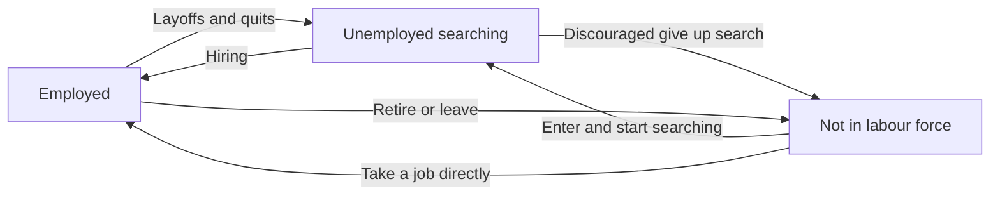
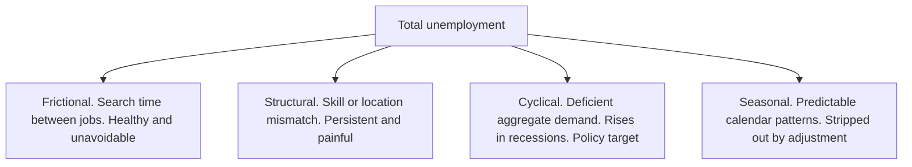
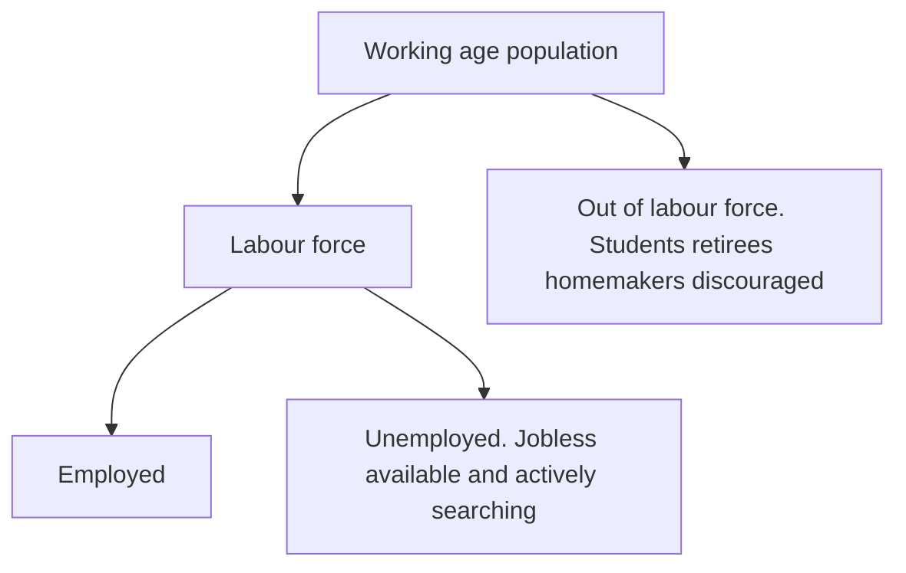
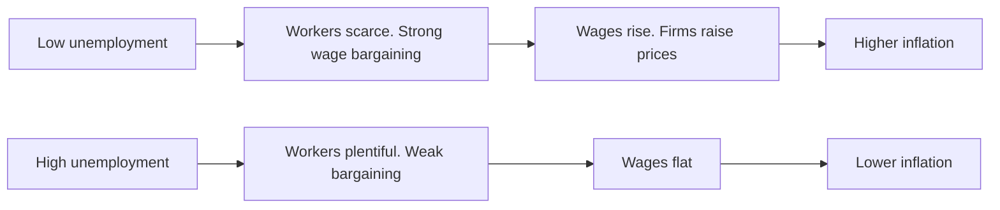
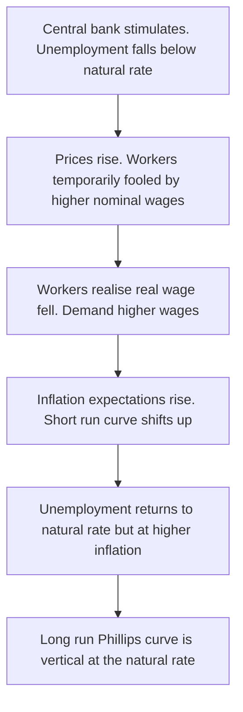

# Chapter 14 — Unemployment

## 1. The Problem / Need — Why an Idle Worker Is a Macro Problem, Not Just a Personal One

Chapter 12 taught you to measure the economy's *output*; Chapter 13 taught you to measure its *prices*. But an economy is not machines and money — it is people. And the single most politically explosive, socially corrosive, and market-moving fact about any economy is how many of its willing workers cannot find a job. When a factory produces less than it could, that is waste. When a person who wants to work cannot, that is waste *plus* hardship — lost income, eroded skills, and, historically, the raw material of political upheaval.

**The core problem is this: at any moment, some people who want to work and are actively looking cannot find employment. Why does this happen even in a healthy, growing economy — and what, if anything, can policy do about it?**

This is subtler than it first appears. A naive view says "unemployment happens in recessions and vanishes in booms." But every economy on earth, even at the peak of the strongest boom, has *some* unemployment. The United States at its tightest had unemployment around 3.5%, not zero. India, China, Germany, Brazil — all carry a permanent floor of joblessness that never disappears. So the real question splits in two: *why is there always some unemployment* (a structural question about how labour markets work), and *why does unemployment rise and fall with the business cycle* (a question about aggregate demand)?

Why should a finance professional care intensely about this?

- **The labour market is where the two great macro variables — growth and inflation — meet.** The unemployment rate is the hinge that connects GDP (Chapter 12) to inflation (Chapter 13). Okun's Law links it to output; the Phillips Curve links it to prices. Master unemployment and you hold the joint that the whole macro skeleton turns on.
- **The monthly jobs report is, alongside inflation, the most market-moving data release on earth.** The US "non-farm payrolls" number, published on the first Friday of each month, can move bond yields, currencies, and equity indices in milliseconds. Every rate trader on the planet stops to watch it. Understanding what the number *is* — and its cousins, the unemployment rate and wage growth — tells you why.
- **Central banks now have employment in their mandate.** The US Federal Reserve has an explicit *dual mandate*: maximum employment *and* stable prices. Every interest-rate decision — which prices every bond and discounts every equity — is a judgement about the trade-off between the two. You cannot forecast rates without forecasting the labour market.
- **Unemployment is the pulse of the credit cycle.** Rising joblessness means falling incomes, which means mortgage defaults, credit-card delinquencies, and corporate revenue shortfalls. It sits upstream of loan-loss provisions, high-yield spreads, and default rates. When you underwrite risk, you are implicitly forecasting employment.

So unemployment is not a social-policy footnote. It is a core market variable, the meeting point of growth and inflation, and the lever central banks pull. This chapter builds the full apparatus: the *types* of unemployment, how it is *measured*, the *natural rate* that anchors it, and the two great macro relationships — *Okun's Law* and the *Phillips Curve* — that connect it to output and inflation.

## 2. The Core Idea

**Unemployment exists because the labour market is not a frictionless auction. Workers and jobs must find each other, skills must match needs, and wages do not instantly adjust to clear the market — so at any moment some willing workers are without work.**

Three ideas sit at the centre of everything that follows.

First, **unemployment is a specific, measured status, not a synonym for "not working."** To be counted unemployed you must be (a) *without a job*, (b) *available* to work, and (c) *actively searching*. A retiree, a full-time student, a stay-at-home parent not looking for work — none are unemployed. They are *out of the labour force* entirely. This three-part test is the pivot on which every statistic turns, and misunderstanding it is the source of endless confusion about "the real unemployment rate."

Second, **not all unemployment is the same, and only some of it is a problem to be fixed.** A person changing jobs, unemployed for three weeks between quitting and starting, is a sign of a *healthy, fluid* labour market. A steelworker whose entire industry has vanished is a sign of *structural* change. A million workers laid off in a recession is a sign of *deficient demand*. These have different causes and different cures — and lumping them together leads to bad policy and bad forecasts.

Third, and most profound: **there is a level of unemployment the economy naturally gravitates toward — the "natural rate" — and it is not zero.** Below this rate, the economy overheats and inflation accelerates; above it, the economy has slack and inflation eases. "Full employment" does not mean *everyone* has a job; it means unemployment has fallen to this natural, non-inflationary floor. This single idea — that there is a lowest *sustainable* unemployment rate, and pushing below it costs you inflation — is the intellectual core of modern central banking.

## 3. How It Works — The Labour Market as a Flow

The deepest way to understand unemployment is to see it not as a stock of idle people but as a *flow* — a constantly churning river of people moving between three states: **Employed (E)**, **Unemployed (U)**, and **Not in the Labour Force (N)**.

At any instant, millions of people are streaming between these boxes. Someone quits a job to search (E → U). A searcher gets hired (U → E). A discouraged searcher gives up (U → N). A student graduates and starts looking (N → U). A retiree re-enters (N → E or N → U). The *unemployment rate you observe* is just a snapshot of the water level in the "U" box — but that level is set by the *rates of flow* in and out of it.

*Figure 14.1 — The labour market is a flow, not a stock. The observed unemployment rate is the level in the U box, set by the rates of flow between the three states.*

This flow view yields two powerful insights immediately.

**Insight one: unemployment can be high because of high inflow or low outflow — and they mean very different things.** In the United States, unemployment is typically *high-flow*: many people enter unemployment but leave quickly, so the average spell is short (weeks to a couple of months). In much of Europe, unemployment has historically been *low-flow*: fewer people become unemployed, but those who do stay unemployed for a long time (a year or more of *long-term unemployment*). Same unemployment rate, completely different human and economic reality. Long-term unemployment is far more damaging — skills atrophy, employers grow wary, and the unemployed effectively drop out of the effective labour supply.

**Insight two: the boundary between U and N — searching versus not — is where the statistics get slippery.** When a recession drags on, some unemployed workers stop looking (U → N). They are "discouraged." Paradoxically, this can make the *measured* unemployment rate *fall* even though the labour market got worse, because leaving the labour force removes you from the U box entirely. This is why analysts never look at the unemployment rate alone — they watch the *participation rate* and the *employment-to-population ratio* alongside it.

The **wage** is the price that, in a textbook world, would clear this market — rise until the number of jobs offered equals the number of workers seeking them. The central puzzle of unemployment is *why it does not*. Wages are **sticky downward**: firms are extremely reluctant to cut nominal wages (it destroys morale and productivity, and workers fiercely resist it), so when demand for labour falls, firms cut *jobs* rather than *pay*. The market clears through quantity (layoffs) rather than price (wage cuts) — and that is the mechanical origin of involuntary unemployment.

## 4. Full Content

### 4.1 The Four Types of Unemployment

Not all joblessness is alike. Economists sort it into four types by *cause*, because each has a different cure and a different relationship to the business cycle.

**Frictional unemployment — the unemployment of search.** This is short-term joblessness that arises simply because it *takes time* for workers and jobs to find each other. A graduate hunting for her first role, a programmer who quit to find something better, a family that relocated cities — all are frictionally unemployed. Crucially, **frictional unemployment is healthy and unavoidable, even desirable.** It reflects a dynamic economy where people move to better matches. A world with *zero* frictional unemployment would be one where nobody ever searched for a better job — a stagnant, badly matched economy. Frictional unemployment exists even in a boom. Its cause is *imperfect information and search time*; policies that help (job-matching platforms, better information) reduce it only at the margin, and you would not want to eliminate it.

**Structural unemployment — the unemployment of mismatch.** This is longer-term joblessness caused by a *fundamental mismatch* between the skills, locations, or industries workers have and the ones employers need. When coal mining collapses, or manufacturing automates, or an entire industry moves offshore, the displaced workers do not have the skills the growing sectors demand — and retraining a 50-year-old miner into a software engineer is slow and often incomplete. Structural unemployment is far more painful and persistent than frictional; it can last years and blight whole regions (the US "Rust Belt," northern England's former mining towns, India's stressed textile clusters). Its causes are *technological change, globalisation, and geographic immobility*. Its cures — retraining, education, relocation support — are slow and expensive. Automation and AI are, right now, the great structural-unemployment question of our era.

**Cyclical unemployment — the unemployment of deficient demand.** This is the joblessness that rises and falls with the *business cycle*. In a recession, aggregate demand collapses, firms cannot sell their output, so they lay off workers — creating cyclical unemployment. This is the type that *policy actively fights*: it is the target of monetary stimulus (rate cuts) and fiscal stimulus (spending) designed to revive aggregate demand. In a boom, cyclical unemployment falls toward zero and can even go "negative" in the sense that the economy overheats. Cyclical unemployment is the *gap* between actual unemployment and the natural rate — when it is positive, the economy has slack; the whole apparatus of demand management exists to close it. This is the type most relevant to short-term market forecasting.

**Seasonal unemployment — the unemployment of the calendar.** This is joblessness that recurs predictably with the seasons: agricultural labour idle between harvest and planting, ski-resort staff in summer, retail workers laid off after the Christmas rush, tourism workers in the off-season. In India, with its huge agrarian workforce, seasonal *underemployment* between crop cycles is a massive phenomenon. Because it is predictable and regular, official statistics are usually **seasonally adjusted** to strip it out — otherwise every economy would look like it plunged into recession each January. Seasonal unemployment matters for data interpretation more than for policy.

*Figure 14.2 — The four types of unemployment by cause. Frictional and structural persist in all conditions and together define the natural rate; cyclical is the part policy fights.*

A vital connection: **frictional plus structural unemployment together make up the "natural rate."** They are the unemployment that persists even when the economy is running at full capacity, because search and mismatch never disappear. Cyclical unemployment is the part *on top* of the natural rate — and it is the only part that stimulus can and should eliminate. Hold this: **natural rate = frictional + structural; cyclical = actual − natural.**

### 4.2 Measuring Unemployment — The Labour Force and the Rate

You cannot manage what you cannot measure, and unemployment measurement is riddled with subtle traps. Start with the population and divide it up.

The working-age population (typically those 15 or 16 and older, excluding the institutionalised) splits into two:

- **In the labour force** — everyone who is either *employed* or *unemployed* (working or actively searching).
- **Out of the labour force** — everyone else: students, retirees, homemakers not seeking work, the discouraged, the long-term sick.

The labour force itself splits into the **employed** and the **unemployed** (jobless, available, and actively searching). From these building blocks come the two headline ratios:

**Unemployment Rate = (Unemployed / Labour Force) × 100**

**Labour Force Participation Rate (LFPR) = (Labour Force / Working-Age Population) × 100**

*Figure 14.3 — The anatomy of the labour force. The unemployment rate is unemployed divided by the labour force, not divided by the total population.*

The single most important subtlety: **the unemployment rate divides by the labour force, not the total population.** So *who counts as "in the labour force" changes the rate*. This creates the notorious **discouraged-worker effect**: when jobs are scarce, some searchers give up and leave the labour force. They move from "unemployed" to "out of the labour force." The numerator *and* denominator both shrink — and the unemployment rate can actually *fall* even as the labour market deteriorates. This is why a falling unemployment rate is *good news only if participation is stable or rising*. A rate falling because people gave up is a sick economy wearing a healthy mask.

Because of this, sophisticated analysts watch a suite of measures, not one number:

| Measure | What it captures | Why it matters |
|---|---|---|
| **Unemployment rate (U-3 in the US)** | Officially jobless and searching, as a share of labour force | The headline; but sensitive to participation shifts |
| **Labour force participation rate** | Share of working-age population in the labour force | Reveals whether people are leaving the market; a falling unemployment rate with falling LFPR is a warning |
| **Employment-to-population ratio** | Share of working-age population actually employed | Immune to the discouraged-worker distortion; a cleaner gauge of job availability |
| **Broad unemployment (U-6 in the US)** | Adds discouraged workers plus involuntary part-timers (underemployment) | Captures the "hidden" slack the headline misses |
| **Long-term unemployment share** | Share jobless for 27+ weeks | Signals structural damage and skill erosion |

**Underemployment** deserves special mention, especially for India. A person working three hours a day who wants full-time work, or a qualified engineer driving a taxi, is *employed* by the official count but grossly underutilised. In developing economies with vast informal sectors, open unemployment can look deceptively *low* — because most people cannot afford to be openly unemployed; there is no unemployment benefit, so they must do *some* work, however marginal. India's official unemployment rate is often below that of rich countries precisely for this reason, which makes it a misleading standalone number. There, *underemployment*, *informality*, and the *participation rate* (notably the low and controversial female LFPR) tell the real story.

**How is the data actually gathered?** Two methods. In the US, the monthly employment report combines a *household survey* (the Current Population Survey, which yields the unemployment rate) with an *establishment/payroll survey* (which asks firms how many workers they added — the famous *non-farm payrolls* number). The two can disagree in any given month because they measure different things and have different noise. In India, the **Periodic Labour Force Survey (PLFS)**, conducted by the National Statistical Office, is the official source, having replaced the older quinquennial NSSO surveys and providing more frequent data.

### 4.3 The Natural Rate of Unemployment and "Full Employment"

Here is the idea that reorganises everything. Even when cyclical unemployment is zero — when aggregate demand is exactly right, no recession, no slack — unemployment is *not* zero. Frictional and structural unemployment remain. The level of unemployment that persists in this state is the **natural rate of unemployment**, and reaching it is what economists mean by **"full employment."**

Full employment does **not** mean everyone who could work is working. It means the economy has eliminated *cyclical* unemployment, leaving only the frictional (search) and structural (mismatch) unemployment that a dynamic economy always carries. Trying to push unemployment *below* the natural rate — by over-stimulating demand — does not create sustainable jobs; it overheats the economy and accelerates inflation. This is the crucial link to Chapter 13.

A closely related and more precise concept is the **NAIRU — the Non-Accelerating Inflation Rate of Unemployment.** This is the unemployment rate at which inflation is stable — neither accelerating nor decelerating. Below the NAIRU, labour is so scarce that wages and then prices accelerate; above it, slack causes inflation to ease. The NAIRU is the operational target central banks (implicitly) aim at. In the US it is usually estimated around 4–4.5%, but — and this is the humbling part — **nobody can observe the natural rate directly.** It must be *estimated*, it *shifts over time*, and central banks have repeatedly been wrong about it. In the late 2010s, US unemployment fell well below what everyone thought was the NAIRU, yet inflation stayed quiet — forcing a wholesale rethink of how low unemployment could go.

What determines the natural rate, and why does it differ across countries and eras?

- **Labour market institutions.** Generous, long-lasting unemployment benefits reduce the urgency to take a job, lengthening search and raising the natural rate. Strong employment-protection laws that make firing hard also make firms cautious about hiring. Continental Europe's historically higher natural rate is often attributed to these factors versus the more "flexible" (and harsher) US model.
- **Minimum wages and union power.** By holding wages above market-clearing levels for some workers, these can raise structural unemployment (though the empirical size of the effect is fiercely debated).
- **Demographics and skills.** A workforce with skills mismatched to industry needs, or with high youth shares (youth unemployment always runs higher), pushes the natural rate up. Better education and training push it down.
- **The pace of structural change.** Rapid technological disruption (automation, AI, globalisation) throws more workers into structural unemployment, raising the natural rate — at least during the transition.
- **Hysteresis.** A dangerous idea: a long, deep recession can *raise the natural rate itself*. Workers unemployed for years lose skills and attachment to the labour force, becoming effectively unemployable — so a temporary *cyclical* shock leaves a *permanent structural* scar. Europe after the 1980s and again after the 2010–12 sovereign crisis is the classic case. Hysteresis is why central banks fear letting recessions run deep: the damage may not fully reverse.

### 4.4 Okun's Law — Linking Unemployment to Output

Unemployment and GDP are two views of the same thing: when the economy produces below its potential, it employs fewer workers. **Okun's Law** quantifies this link, connecting Chapter 12 (output) to this chapter (unemployment).

The empirical relationship, first noted by Arthur Okun in the 1960s, states roughly: **for every 1 percentage point that the unemployment rate rises above the natural rate, real GDP falls about 2% below its potential.** (The coefficient — the "Okun coefficient" — is around 2 for the US but varies by country and era; it is a rule of thumb, not a law of physics.)

In its "gap" form:

**(Actual GDP − Potential GDP) / Potential GDP ≈ −c × (Unemployment rate − Natural rate)**

where *c* is the Okun coefficient (~2). The output gap and the unemployment gap move together, in opposite directions.

Why is the coefficient about 2 and not 1? If unemployment rises 1 point, you might naively expect output to fall only by that 1% of the workforce's contribution. But the fall is larger because of three compounding effects: (1) firms facing weak demand cut *hours* before they cut heads, so output falls more than headcount; (2) they hoard some labour (keeping workers idle rather than firing skilled staff they'll need later), reducing measured *productivity*; and (3) some workers leave the labour force entirely (discouraged), so the true loss exceeds the measured rise in unemployment. These stack up to roughly double the naive estimate.

Okun's Law is enormously useful in practice: it lets forecasters translate a GDP forecast into an unemployment forecast and vice versa. If you expect growth to slow such that the output gap opens by 2%, Okun says expect unemployment to rise about 1 point. Central banks and market economists use it constantly as a bridge between their growth and labour forecasts.

### 4.5 The Phillips Curve — The Inflation-Unemployment Trade-off

Now the most famous, most contested relationship in all of macroeconomics — the one that ties this entire chapter to Chapter 13 and sits at the very heart of monetary policy.

In 1958, economist A.W. Phillips plotted nearly a century of British data and found a striking inverse relationship: **when unemployment was low, wage inflation was high, and when unemployment was high, inflation was low.** Generalised from wages to prices, the **Phillips Curve** posits a *trade-off*: an economy could "buy" lower unemployment at the cost of higher inflation, or lower inflation at the cost of higher unemployment.

The intuition is exactly the labour-market logic from earlier. When unemployment is very low, workers are scarce, they have bargaining power, and they demand higher wages; firms, facing strong demand, raise prices to cover the wage bill — inflation rises. When unemployment is high, workers are plentiful and desperate, wage demands are weak, and inflation stays low. The curve seemed to offer policymakers a *menu*: pick your preferred point on the trade-off.

*Figure 14.4 — The short-run Phillips Curve mechanism. Scarcity of labour at low unemployment drives up wages and prices; slack at high unemployment holds them down.*

**Then it broke.** In the 1970s the developed world suffered *stagflation* — high unemployment *and* high inflation *together*, a combination the simple Phillips Curve said was impossible. The trade-off had apparently vanished. The explanation, developed by Milton Friedman and Edmund Phelps (before the fact) and confirmed brutally by events, transformed macroeconomics: **the Phillips Curve trade-off holds only in the short run, and only because of unexpected inflation. In the long run there is no trade-off.**

Here is the logic. Workers and firms care about *real* wages, not nominal ones. If the central bank stimulates demand to push unemployment below the natural rate, prices rise. At first workers are fooled — their nominal wages rose, and they *think* they are better off, so they supply more labour and unemployment falls. But once they realise inflation has eaten their raise, they demand higher nominal wages to restore their real wage. Firms raise prices again. Unemployment drifts back up to the natural rate — but now *at a higher inflation rate*. The only way to keep unemployment below the natural rate is to keep inflation *accelerating* forever, always staying one step ahead of expectations. This gives the **expectations-augmented Phillips Curve**:

**Inflation = Expected inflation − b × (Unemployment − Natural rate) + supply shocks**

The key addition is *expected inflation*. Once expectations adjust, the short-run curve shifts up. In the *long run*, when actual and expected inflation coincide, unemployment sits at the natural rate *regardless of the inflation rate* — the **long-run Phillips Curve is vertical** at the natural rate (the NAIRU).

*Figure 14.5 — The expectations-augmented story. Exploiting the trade-off only works while inflation is unexpected; once expectations catch up, unemployment returns to the natural rate at permanently higher inflation.*

This has three momentous implications, and they are the intellectual foundation of every modern central bank:

1. **There is no permanent trade-off.** You cannot buy permanently lower unemployment with permanently higher inflation. Attempting to leaves you with the same unemployment and worse inflation.
2. **Expectations are everything.** Because the curve depends on *expected* inflation, a central bank's *credibility* — its ability to anchor what people expect — is its most valuable asset. If people believe the bank will keep inflation at 2%, the whole system is more stable and disinflation is cheaper.
3. **Supply shocks can shift the curve.** An oil-price spike (a supply shock) raises inflation *and* unemployment at once — stagflation — which no demand-side trade-off can explain. This is the term that broke the 1970s.

**Is the Phillips Curve dead?** In the 2010s the curve appeared to "flatten": US unemployment fell to 50-year lows without igniting inflation, leading many to declare the relationship defunct. Then in 2021–22, as pandemic reopening collided with a red-hot labour market, inflation surged to 40-year highs — and the Phillips Curve looked very much alive again. The modern consensus is nuanced: the *short-run* relationship exists but is *flat and non-linear* — it steepens sharply when the labour market gets very tight, and inflation expectations (now better anchored by credible central banks) dominate the picture. The curve is not a stable menu; it is a shifting, expectations-driven relationship that central bankers watch obsessively.

### 4.6 Labour Market Implications for Finance and Markets

Everything above converges on a single practical question for the finance professional: *what does the labour market do to my portfolio?* The channel runs through the central bank.

Because the Fed and its peers have employment in their mandate and read inflation through the labour market, **jobs data is, in effect, an interest-rate forecast.** A strong labour market means the central bank can stay tight or hike; a weak one means it can ease. And since interest rates price every bond and discount every equity, the labour report is a first-order market event. Trace the chain: strong payrolls → tight labour market → wage pressure → inflation risk → central bank stays hawkish → bond yields rise, rate-sensitive equities fall, currency strengthens. A weak report reverses every link.

This produces the counterintuitive but famous **"good news is bad news" dynamic.** In an environment where markets fear inflation and further rate hikes, a *strong* jobs report — good for the real economy — is *bad* for asset prices, because it means higher-for-longer rates. Conversely a weak report can rally stocks and bonds because it brings rate cuts closer. The sign of the market's reaction to jobs data flips depending on whether the dominant fear is recession or inflation. Reading which regime you are in is a core macro-trading skill.

## 5. Real Examples — Unemployment in Live Markets

**Example 1 — Non-farm payrolls, the market's monthly heartbeat.** On the first Friday of each month at 8:30 a.m. Eastern, the US Bureau of Labor Statistics releases the employment report. In the seconds after, Treasury yields, the dollar, and equity futures can lurch violently on the *surprise* versus consensus. In early 2023, a series of blowout payroll numbers (hundreds of thousands of jobs added, unemployment at a half-century low near 3.4%) repeatedly forced markets to price in *more* Fed rate hikes — and each hot print sent bond yields up and rate-sensitive stocks down. This is "good news is bad news" in its purest form: a booming labour market was, for a leveraged bondholder, a loss. The lesson: the labour market is not a lagging social statistic; it is a real-time, tradeable driver of the entire rates complex.

**Example 2 — Stagflation and the death of the naive Phillips Curve.** The 1973 and 1979 oil shocks slammed a supply shock into the developed world. Inflation soared into double digits *while* unemployment also rose sharply — the US "misery index" (unemployment plus inflation) hit record highs. The simple Phillips trade-off was shattered: policymakers could not lower one without the other worsening. It took Paul Volcker's Fed, deliberately engineering a brutal recession (US unemployment hit ~10.8% in 1982) to crush inflation expectations, to restore price stability. This episode is the historical proof of the expectations-augmented curve — and a permanent warning that central banks target *expectations*, not just current inflation.

**Example 3 — India's employment paradox.** India's official unemployment rate is often *lower* than that of rich countries — around 3–8% depending on the measure and year — which seems to suggest a healthy labour market. But this is deeply misleading. With no meaningful unemployment insurance and a vast informal sector, most Indians cannot afford open unemployment; they must do *some* work, so the real problem shows up as *underemployment*, *informality* (the majority of workers lack formal contracts or benefits), and a strikingly *low female labour-force participation rate* (long below 30%, among the lowest of major economies). For an investor sizing India's growth potential, the headline unemployment rate is nearly useless; the participation rate, the formalisation trend, and the quality of jobs created are the numbers that matter — a live illustration of why you never read the unemployment rate alone.

**Example 4 — The post-pandemic labour market and the return of inflation.** After 2021, the US labour market ran historically hot: unemployment near 3.5%, a record number of unfilled job openings, and workers quitting for higher pay (the "Great Resignation"). With workers this scarce, wages accelerated, and — exactly as the Phillips Curve predicts at a very tight labour market — inflation surged to 9%, its highest in 40 years. The Fed responded with the fastest rate-hiking cycle in decades. This episode revived the Phillips Curve from its supposed grave: when the labour market is *tight enough*, the wage-price link reasserts itself with force. Bond markets that had grown complacent about a "flat" Phillips Curve suffered one of their worst years in history in 2022 as yields spiked.

## 6. Connections

- **To GDP and the business cycle (Chapter 12).** Cyclical unemployment *is* the labour-market face of the business cycle, and *Okun's Law* is the formal bridge: the output gap and the unemployment gap are two measures of the same slack.
- **To inflation (Chapter 13).** The *Phillips Curve* is the direct link — the labour market is the primary channel through which a tight economy generates inflation, via wages. This chapter and the last are two halves of one story.
- **To monetary policy and interest rates (later chapters).** The central bank's dual mandate makes the labour market the joint input to every rate decision. The natural rate/NAIRU is the (unobservable) target; the jobs report is the key data.
- **To bonds and rates trading.** Jobs and wage data drive the entire yield curve through their effect on expected policy. The labour report is, for a rates trader, the most important recurring event after inflation.
- **To credit and equities.** Rising unemployment is upstream of loan defaults, credit-card delinquencies, and falling corporate revenues — it drives credit spreads, loan-loss provisions, and earnings forecasts.
- **To fiscal policy and the multiplier (later chapters).** Cyclical unemployment is the target of fiscal stimulus; the case for government spending in a downturn rests on the existence of demand-deficient joblessness.

## 7. Key Terms

- **Labour force** — the employed plus the unemployed (those working or actively searching); excludes students, retirees, and the discouraged.
- **Unemployment rate** — unemployed as a percentage of the *labour force* (not the total population).
- **Labour force participation rate (LFPR)** — the labour force as a percentage of the working-age population.
- **Employment-to-population ratio** — the employed as a share of the working-age population; immune to the discouraged-worker distortion.
- **Frictional unemployment** — short-term joblessness from search time between jobs; healthy and unavoidable.
- **Structural unemployment** — persistent joblessness from a skills, location, or industry mismatch; caused by technology, globalisation, and immobility.
- **Cyclical unemployment** — joblessness from deficient aggregate demand in a recession; the target of stimulus; equals actual minus natural.
- **Seasonal unemployment** — predictable joblessness tied to the calendar; stripped out by seasonal adjustment.
- **Natural rate of unemployment** — the unemployment that persists at full employment (frictional + structural); not zero.
- **Full employment** — the state where cyclical unemployment is zero and unemployment sits at the natural rate.
- **NAIRU** — Non-Accelerating Inflation Rate of Unemployment; the unemployment rate consistent with stable inflation.
- **Discouraged worker** — someone who stops searching and leaves the labour force; their exit can *lower* the measured unemployment rate.
- **Underemployment** — being employed below one's capacity (part-time wanting full-time, or over-qualified); large in developing economies.
- **Hysteresis** — the danger that a long recession permanently raises the natural rate by eroding skills and attachment.
- **Okun's Law** — the empirical rule that a 1-point rise in unemployment above natural corresponds to roughly a 2% fall in GDP below potential.
- **Phillips Curve** — the inverse relationship between unemployment and inflation; a short-run trade-off, vertical in the long run.
- **Expectations-augmented Phillips Curve** — inflation = expected inflation − b(unemployment − natural) + supply shocks.
- **Stagflation** — simultaneous high unemployment and high inflation, caused by supply shocks; unexplained by the naive Phillips Curve.
- **Non-farm payrolls** — the US monthly count of jobs added (excluding farms); the market's headline labour indicator.

## 8. Common Confusions

- **"The unemployment rate is jobless people divided by the population."** No — it divides by the *labour force* (employed + searching), not the total or working-age population. Students, retirees, and the discouraged are excluded from both numerator and denominator.
- **"A falling unemployment rate is always good news."** Not if it falls because people gave up searching and left the labour force. Check the *participation rate* and *employment-to-population ratio* — a rate falling on collapsing participation is a warning sign, not a recovery.
- **"Full employment means zero unemployment."** No. Full employment is the *natural rate* — only frictional and structural unemployment remain. Zero unemployment is impossible and undesirable (it would mean no one ever searched for a better job).
- **"Frictional unemployment is a problem to be fixed."** It is healthy and unavoidable — the sign of a fluid economy where people move to better matches. You want *some* of it.
- **"The Phillips Curve lets a government permanently lower unemployment by accepting higher inflation."** Only in the *short run*, and only while inflation is *unexpected*. Once expectations adjust, unemployment returns to the natural rate at permanently higher inflation. The long-run curve is vertical.
- **"Stagflation disproves the Phillips Curve."** It disproves the *naive* version. The *expectations-augmented* curve, with a supply-shock term, explains stagflation perfectly — an oil shock raises inflation and unemployment together.
- **"India's low unemployment rate means a healthy job market."** Misleading. With no unemployment insurance and a huge informal sector, open unemployment is a luxury few can afford; the real issues are *underemployment*, *informality*, and *low participation* (especially female).
- **"Okun's coefficient should be 1 — one point of unemployment, one percent of output."** It is about 2, because falling demand also cuts hours, reduces measured productivity through labour hoarding, and pushes workers out of the labour force — effects that compound.
- **"Strong jobs data is always good for markets."** In an inflation-fearing regime it can be *bad* ("good news is bad news"), because it means higher-for-longer interest rates. The sign flips with the macro regime.

## 9. Recap

- Unemployment persists because the labour market is not a frictionless auction: workers and jobs must search each other out, skills must match, and wages are *sticky downward*, so firms cut jobs rather than pay.
- The labour market is a *flow* between three states — employed, unemployed, and out of the labour force. The observed rate is the level in the "unemployed" box, set by the rates of flow.
- There are **four types**: *frictional* (search — healthy), *structural* (mismatch — persistent), *cyclical* (deficient demand — the policy target), and *seasonal* (calendar — adjusted out). Frictional + structural = the **natural rate**; cyclical = actual − natural.
- The **unemployment rate** = unemployed / *labour force*. Because it divides by the labour force, the **discouraged-worker effect** can make it fall as the market weakens — so always watch *participation* and the *employment-to-population ratio*, plus *underemployment*, especially in developing economies.
- **Full employment** is the *natural rate* (the **NAIRU**), not zero. The natural rate is unobservable, shifts over time, and depends on institutions, demographics, and the pace of structural change — with **hysteresis** the danger that deep recessions raise it permanently.
- **Okun's Law** links output to unemployment: ~2% of GDP below potential for each point of unemployment above natural — the bridge from the growth forecast to the jobs forecast.
- The **Phillips Curve** links unemployment to inflation: a short-run trade-off driven by labour scarcity and wages, but *vertical in the long run* once expectations adjust. Expectations and supply shocks (stagflation) are what the naive curve missed.
- For finance, the labour market is an interest-rate forecast: jobs and wage data drive central-bank policy, hence bond yields, equities, and currencies — producing the "good news is bad news" dynamic when inflation is the dominant fear.

## 10. Quick-Reference / Interview Points

- **The three-part test for being unemployed:** without a job, *available*, and *actively searching*. Fail any one and you're "out of the labour force," not unemployed.
- **The rate's formula and its trap:** unemployment rate = unemployed / *labour force*. It can *fall* because discouraged workers quit searching — so pair it with the *participation rate* and *employment-to-population ratio*.
- **Four types, one line each:** frictional (search, healthy), structural (mismatch, persistent), cyclical (recession, policy target), seasonal (calendar, adjusted out). **Natural rate = frictional + structural.**
- **Full employment ≠ zero unemployment.** It's the *natural rate* / *NAIRU* — the lowest unemployment consistent with *stable* inflation. Push below it and inflation accelerates.
- **Okun's Law:** ~1 point of extra unemployment ≈ ~2% of GDP lost below potential. Know it's a *rule of thumb*, and *why* the coefficient exceeds 1 (hours, labour hoarding, dropouts).
- **Phillips Curve — the whole arc:** short-run inverse trade-off (low unemployment → high inflation via wages); *breaks down* in the long run because of *inflation expectations*; long-run curve is *vertical* at the natural rate. Stagflation (a supply shock) is what killed the naive version.
- **Expectations-augmented curve:** inflation = *expected* inflation − b(unemployment − natural) + supply shocks. The word "expected" is the whole point — central-bank *credibility* is everything.
- **Why it moves markets:** the labour report is an interest-rate forecast. Strong jobs → hawkish central bank → higher yields; hence "good news is bad news" when inflation is the fear. Non-farm payrolls is the monthly headline.
- **India nuance:** a low official unemployment rate is misleading — watch *underemployment*, *informality*, and the *low female participation rate* (PLFS is the source).
- **Hysteresis soundbite:** "A recession is supposed to be cyclical, but if it runs long enough, skills rot and it becomes structural — a temporary shock leaves a permanent scar. That's why central banks fear letting downturns fester."
- **Killer soundbite:** "Unemployment is the hinge between growth and inflation — Okun's Law bolts it to GDP, the Phillips Curve bolts it to prices, and the central bank turns on that joint, which is why every rates trader stops for the jobs report."
