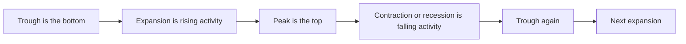
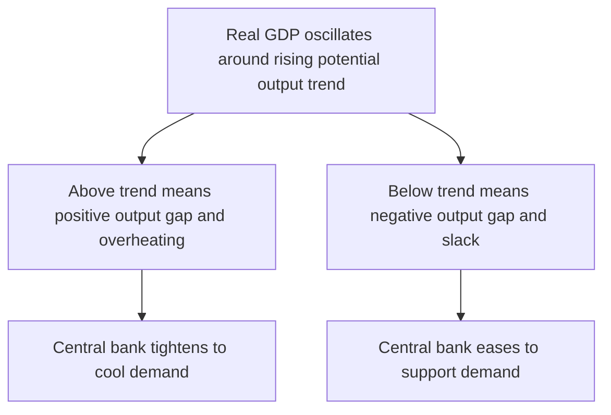
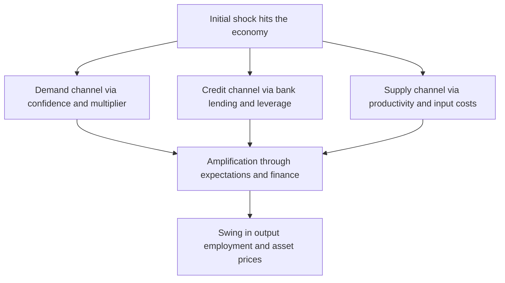
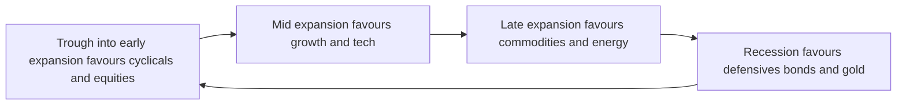

# Chapter 15 — Business Cycles

## 1. The Problem / Need — Why Doesn't the Economy Just Grow in a Straight Line?

If you plot real GDP for almost any country over fifty years, you see two things at once. First, an unmistakable **upward trend** — economies get richer over time as technology, capital and the labour force grow. Second, and just as unmistakable, a **wobble around that trend**: periods where output races ahead of its long-run path, followed by periods where it stalls or falls outright. That wobble is the **business cycle**, and it is the single most important pattern a finance professional has to read.

The trend and the cycle answer two different questions. The trend answers *"how rich will we be in twenty years?"* — that is the domain of **growth economics** (savings, technology, demographics). The cycle answers *"what happens over the next one to three years?"* — and that is the horizon on which almost every trading, lending, and allocation decision is actually made. A pension fund rebalancing equities versus bonds, a bank setting loan-loss provisions, a corporate treasurer deciding whether to lock in fixed-rate debt, an RBI or Fed committee voting on rates — all of them are, in effect, taking a view on where we sit in the cycle.

**The core problem is this: the economy does not grow smoothly, and the recurring swings between boom and bust drive corporate earnings, credit defaults, interest rates, and therefore the price of nearly every financial asset.** Getting the cycle badly wrong is how good investors blow up. Buying cyclical stocks at the peak, lending aggressively just before a downturn, or piling into long-duration bonds when growth is about to re-accelerate are all cycle-timing errors.

Why should this matter to *you* concretely?

- **Earnings are cyclical.** Aggregate corporate profits swing far more violently than GDP. A 2% fall in output can wipe out 20-30% of profits because costs are sticky (operating leverage). Equity markets, which price earnings, therefore amplify the cycle.
- **Defaults are cyclical.** Corporate and household default rates are near-zero in expansions and spike in recessions. Every credit spread, every bank's provisioning, every high-yield bond price embeds a view on where defaults are heading.
- **Policy is counter-cyclical.** Central banks cut rates in downturns and hike in booms. Since bond prices move inversely to rates, the entire fixed-income market is a bet on the policy response to the cycle.
- **Asset leadership rotates with the cycle.** As we will see, the *same* portfolio that wins in early expansion loses in late-cycle, and vice versa. Knowing the phase tells you which sectors, styles, and asset classes to overweight.

This chapter builds the vocabulary of the cycle — its phases, its causes, the indicators professionals watch to locate it in real time, and the playbook for rotating capital across it.

## 2. The Core Idea

**A business cycle is the recurring but irregular fluctuation of aggregate economic activity around its long-run trend, moving through phases of expansion, peak, contraction, and trough.**

Three words in that definition are load-bearing, and each corrects a common misconception:

- **Recurring** — cycles happen again and again; they are a permanent feature of market economies, not a one-off accident.
- **Irregular** — they are *not* periodic like a sine wave. Expansions have lasted anywhere from one year to over ten; you cannot set your watch by them. This is why the word "cycle" is slightly misleading — there is no fixed frequency.
- **Around a trend** — the cycle is a *deviation* from the growing trend line, not the trend itself. In a recession, output usually falls relative to trend, and often in absolute terms, but the trend keeps rising underneath.

The gap between where output actually is and where it *could* be if all resources were fully and efficiently employed is called the **output gap**. A *positive* output gap (actual above potential) means the economy is running hot — factories at full tilt, low unemployment, wage and price pressure building. A *negative* output gap (actual below potential) means slack — idle capacity, unemployment above its natural rate, weak inflation. The output gap is the single cleanest way to think about "where we are" in the cycle, and it is exactly what central banks target: they try to close the gap without letting it flip to overheating.

*Figure 15.1 — The four phases repeat, but with irregular length and depth. One full cycle runs trough to trough.*

The deepest idea to carry forward: **the cycle is driven by fluctuations in aggregate demand and shifts in expectations, propagated and amplified by credit.** Booms build on optimism and cheap credit; busts follow when that optimism and credit reverse. Everything else in this chapter is an elaboration of that sentence.

## 3. How It Works — The Four Phases

A textbook cycle moves through four phases. Think of a wave rolling across the trend line.

**Expansion (recovery and boom).** Output, employment, incomes, sales and profits all rise. This is the longest phase in modern economies — post-war US expansions have averaged nearly five years, and the 2009-2020 expansion ran almost eleven. Early expansion feels like relief: unemployment falls from a high base, spare capacity gets used up, confidence returns, and credit starts flowing again. Late expansion feels different — capacity gets tight, labour markets overheat, wage and input-cost pressures build, and the central bank begins to worry about inflation and raises rates.

**Peak.** The upper turning point, where activity stops accelerating and momentum stalls. At the peak, the output gap is at its most positive, unemployment is at its cyclical low, inflation is typically at its cyclical high, and interest rates have usually been pushed up to restrictive levels. Peaks are notoriously hard to identify in real time — the economy feels wonderful right up to the moment it turns, which is precisely why late-cycle euphoria is dangerous for investors.

**Contraction (recession, and in the extreme, depression).** Output falls, unemployment rises, sales and profits shrink, and — crucially — credit tightens as banks pull back and defaults climb. A widely used shorthand defines a **recession as two consecutive quarters of falling real GDP**, but the official US arbiter, the **NBER**, uses a richer definition: "a significant decline in economic activity spread across the economy, lasting more than a few months, normally visible in real GDP, real income, employment, industrial production, and wholesale-retail sales." A **depression** is simply a very deep, prolonged contraction — the 1930s Great Depression saw US output fall roughly 30% over four years.

**Trough.** The lower turning point, where the contraction bottoms out. Here the output gap is at its most negative, unemployment at its cyclical high, inflation low (sometimes deflation), and interest rates have usually been slashed to stimulate recovery. From the trough, the whole sequence begins again. By convention, one complete cycle is measured **trough to trough** (or peak to peak).

*Figure 15.2 — The output gap frames the whole cycle and drives the policy response that finance markets trade.*

A few structural features to keep in mind:

- **Asymmetry.** Expansions are long and gradual; contractions are short and sharp. Economies climb the stairs and fall down the elevator shaft. This asymmetry is why "risk-off" moves in markets are so much more violent than "risk-on" grinds higher.
- **Co-movement.** In a genuine cycle, activity moves *together* across sectors — manufacturing, services, employment, and income turn in roughly the same direction at roughly the same time. A slump confined to one industry is not a business cycle.
- **Different cycle lengths.** Economists distinguish the short **inventory cycle** (Kitchin, 3-5 years), the **business-investment cycle** (Juglar, 7-11 years), and very long technology waves (Kondratiev, 45-60 years). The "business cycle" a finance pro trades is mostly the Kitchin/Juglar range.

## 4. Full Content — Causes and Theories

Why do cycles happen at all? There is no single agreed answer — this is one of macroeconomics' great debates — but the major schools each capture a real mechanism, and a working professional should hold several in mind at once.

### 4.1 Keynesian: demand-driven cycles

John Maynard Keynes located the cycle in **volatile aggregate demand**, especially investment. Firms invest based on expectations of future profit — what Keynes called **"animal spirits."** When confidence is high, investment surges, incomes rise, and through the **multiplier** (one person's spending is another's income), the boom feeds itself. When confidence cracks, investment collapses, the multiplier runs in reverse, and demand spirals down. Because wages and prices are **sticky** in the short run, the economy does not self-correct quickly — output, not just prices, does the adjusting, so recessions produce real unemployment. The **accelerator** effect sharpens this: investment depends on the *change* in output, so even a slowdown in growth (not an outright fall) can cause investment to drop. The policy implication is active **counter-cyclical fiscal and monetary policy** to stabilise demand.

### 4.2 Monetarist: money and credit

Milton Friedman argued that most serious cycles are caused by **swings in the money supply and credit**, often driven by central bank mistakes. Too-loose money fuels an unsustainable boom; too-tight money (or a banking collapse, as in 1929-33) turns a slowdown into a slump. The modern descendant of this view emphasises the **credit cycle**: banks lend freely in good times, asset prices and leverage rise together, and when the cycle turns, deleveraging amplifies the downturn. The 2008 Global Financial Crisis is the textbook credit-cycle bust.

### 4.3 Austrian: malinvestment from cheap credit

The Austrian school (Mises, Hayek) sees the boom itself as the disease. Artificially low interest rates distort the price of capital, causing firms to over-invest in the wrong things — **malinvestment**, typically long-dated capital projects and speculative assets. The bust is the necessary, painful correction that liquidates those bad investments. On this view, trying to prevent recessions with easy money only builds bigger imbalances for later. The dot-com and housing bubbles are often read through this lens.

### 4.4 Real Business Cycle (RBC): supply shocks

The RBC school (Kydland, Prescott) controversially argues cycles are the economy's **optimal response to real supply-side shocks** — chiefly changes in productivity/technology, but also oil-price shocks, wars, and natural disasters. A negative productivity shock genuinely makes the economy poorer and less busy; the downturn is efficient, not a failure of demand. Few practitioners take the pure form literally, but the insight that **supply shocks matter** is vital — the 1970s oil crises and the 2021-22 pandemic supply-chain and energy shocks were real, cost-push events that monetary policy could not easily fix.

### 4.5 Psychological and financial-instability views

Two further strands are indispensable for markets. **Behavioural/psychological theories** (echoing Keynes' animal spirits and Minsky's insight) stress waves of optimism and pessimism, herding, and self-fulfilling expectations. **Hyman Minsky's Financial Instability Hypothesis** is the sharpest: *stability itself breeds instability.* In good times, borrowers and lenders grow complacent, debt migrates from safe "hedge" finance to speculative and finally to "Ponzi" finance (borrowing just to pay interest). Eventually a small shock triggers the **"Minsky moment"** — a scramble to sell assets to cover debt, collapsing prices and credit. 2008 was a canonical Minsky moment.

| School | Prime cause of cycles | Policy stance | Market lens |
|---|---|---|---|
| Keynesian | Volatile demand, animal spirits, multiplier | Active fiscal + monetary stabilisation | Watch demand, confidence, output gap |
| Monetarist | Money supply and central bank errors | Stable money-supply rule | Watch money, credit growth |
| Austrian | Cheap credit causing malinvestment | Let busts clear; avoid easy money | Watch leverage, asset bubbles |
| Real Business Cycle | Real productivity and supply shocks | Little policy can or should do | Watch productivity, commodity shocks |
| Minsky / financial | Endogenous build-up of debt and fragility | Regulate leverage; lender of last resort | Watch debt, credit spreads, leverage |

The mature view is **eclectic**: different cycles have different dominant causes. 2008 was credit/financial; the 2020 recession was an exogenous pandemic shock; the 1970s were supply/oil shocks; the early-1980s US recession was deliberately engineered by tight money to break inflation. A good analyst diagnoses *which kind* of downturn is unfolding, because the asset-market playbook differs for each.

*Figure 15.3 — Shocks propagate through demand, credit, and supply channels, all amplified by expectations and leverage.*

### 4.6 How cycles are transmitted and amplified

Two amplifiers turn small shocks into full cycles and deserve their own note, because they show up everywhere in markets:

- **The multiplier-accelerator interaction.** The multiplier spreads an initial demand change through successive rounds of spending; the accelerator makes investment respond to the *rate of change* of output. Together they can generate self-sustaining oscillations even from a one-off shock.
- **The financial accelerator.** Balance sheets move with asset prices. In a boom, rising collateral values let firms and households borrow more, funding more spending and pushing asset prices higher still — a feedback loop. In a bust, falling collateral forces deleveraging, which depresses spending and asset prices further. This is why finance does not just *reflect* the cycle; it *drives* it.

## 5. Real Examples (Finance and Market Relevance)

**1) The 2008 Global Financial Crisis — a credit/Minsky bust.** A decade-long housing and credit boom (cheap money after 2001, exploding mortgage leverage, securitisation hiding risk) met its Minsky moment when US house prices turned down in 2006-07. Subprime defaults cascaded through leveraged bank balance sheets; the collapse of Lehman Brothers in September 2008 froze credit globally. The market consequences map straight onto cycle logic: equities fell ~57% peak-to-trough (S&P 500), credit spreads blew out to record wides, safe-haven government bonds rallied hard as yields collapsed, and the Fed slashed rates to zero and launched **quantitative easing**. For a finance pro, the lesson is that a *credit-driven* recession is deep and long because deleveraging is slow — recovery took years, and defaults stayed elevated.

**2) The 2020 COVID recession — an exogenous supply-and-demand shock.** The pandemic caused the sharpest, shortest recession on record: US GDP fell ~9% in a single quarter as economies were deliberately shut, yet the NBER-dated recession lasted only two months. Because the cause was external (not a burst credit bubble) and the policy response was enormous and instant — near-zero rates plus trillions in fiscal support — the recovery was V-shaped. Markets tell the story: the S&P 500 fell ~34% in five weeks, then recovered to new highs within months as liquidity flooded in. The takeaway: the *nature* of the shock, and the *speed and size of the policy response*, determine the shape of the recovery far more than the depth of the initial fall.

**3) India's growth cycles and the 1991 balance-of-payments crisis.** India's cycle has historically been shaped less by domestic overheating and more by **external shocks and the credit cycle**. The 1991 crisis — foreign reserves down to two weeks of imports, forcing India to pledge gold and undertake IMF-backed reforms — was a classic balance-of-payments-driven contraction that triggered the liberalisation that reshaped the economy. More recently, the 2018-19 NBFC/shadow-banking stress (the IL&FS default) was a domestic **credit-cycle** shock that slowed growth well before COVID. For an India-focused analyst, the cycle signals to watch are the RBI's rate stance, credit growth to industry, the current-account deficit, and the rupee — external vulnerability is India's characteristic transmission channel.

**4) The 2022-23 inflation-and-hiking cycle — a supply-shock and late-cycle overheat.** Post-COVID stimulus plus supply-chain snarls and the Ukraine-war energy shock pushed US inflation to ~9% by mid-2022. The Fed responded with the fastest hiking cycle in decades. The market impact was textbook late-cycle: bonds and equities *fell together* (a rare, painful year for the classic 60/40 portfolio) because the driver was rising discount rates, not falling growth. It is a live reminder that the *cause* of the cycle turn — here, inflation and policy tightening rather than a demand collapse — dictates which asset correlations hold.

## 6. Connections

The business cycle is the hub that ties this book's macro chapters together and connects directly to every asset class.

- **To GDP and national income (Ch. 12).** The cycle is literally defined in terms of real GDP fluctuating around potential output. The output gap is the bridge.
- **To aggregate demand and supply.** Demand-driven cycles shift the AD curve; supply-shock cycles shift the SRAS curve. The distinction determines whether inflation *rises or falls* in the downturn — a crucial signal (demand recessions bring disinflation; supply-shock recessions can bring "stagflation," falling output *with* rising prices, as in the 1970s).
- **To money, inflation, and monetary policy.** The central bank's rate decisions are the dominant counter-cyclical lever, and interest rates are the price that reprices every bond, equity, and currency.
- **To fiscal policy.** Automatic stabilisers (taxes fall and welfare rises in downturns) and discretionary stimulus cushion the cycle; the fiscal deficit is itself cyclical.
- **To bonds.** Yields fall and the curve steepens as the cycle turns down (rate cuts expected); an **inverted yield curve** is the market's single most reliable recession forecast. Credit spreads widen in contractions and tighten in expansions.
- **To equities.** Earnings and valuations both track the cycle; the stock market itself is a *leading* indicator, typically bottoming before the economy does.
- **To currencies and commodities.** Growth-sensitive ("risk") currencies and industrial commodities (copper — "Dr. Copper" — and oil) rise in global expansions and fall in contractions.

## 7. Key Terms

- **Business cycle** — recurring, irregular fluctuation of aggregate activity around trend.
- **Expansion / Peak / Contraction (recession) / Trough** — the four phases; recession = broad, sustained decline in activity.
- **Depression** — a deep, prolonged contraction.
- **Output gap** — difference between actual and potential GDP; positive = overheating, negative = slack.
- **Potential output** — the sustainable level of GDP at full employment of resources.
- **NBER** — the US body that officially dates recessions using multiple indicators, not just the two-quarter rule.
- **Leading / Coincident / Lagging indicators** — data that turn before, with, and after the cycle.
- **Multiplier / Accelerator** — mechanisms that amplify demand shocks (spending rounds; investment responding to output change).
- **Financial accelerator** — feedback loop between asset prices, collateral, and credit.
- **Animal spirits** — Keynes' term for confidence-driven swings in investment.
- **Minsky moment** — the tipping point when over-leveraged positions must be sold, collapsing credit.
- **Sector rotation** — shifting portfolio weights across sectors as the cycle progresses.
- **Yield-curve inversion** — short rates above long rates; a classic recession signal.
- **Soft landing / Hard landing** — cooling the economy without recession vs. tipping into one.

## 8. Common Confusions

- **"Recession = two negative quarters."** That is a rough shorthand. The NBER uses depth, diffusion and duration across many series. In 2022, US GDP fell for two quarters yet no recession was declared, because employment and income kept rising.
- **A slowdown is not a recession.** Growth decelerating from 4% to 1% is still *growth*. A recession needs an actual, broad *decline* in activity. Markets can sell off hard on a mere growth *scare* that never becomes a recession.
- **The cycle is not periodic.** "Cycle" implies regularity, but real cycles vary wildly in length and depth. Do not expect a downturn just because an expansion is "old" — expansions die from shocks or policy errors, not old age.
- **Confusing the cycle with the trend.** Weak GDP growth can reflect a *structural* fall in potential output (ageing population, low productivity) rather than a cyclical downturn. The policy response differs completely: cyclical weakness calls for stimulus, structural weakness for supply-side reform.
- **Recessions do not always mean falling inflation.** In a *demand* recession, yes. But in a *supply-shock* recession (1970s, arguably 2022 risk), you get **stagflation** — output falling while prices rise. This breaks the usual bond-equity playbook.
- **The stock market is not the economy.** Equities lead the cycle and are far more volatile; the market can rally while the economy is still contracting (because it prices the *recovery*), and can fall in a healthy economy. "The stock market has predicted nine of the last five recessions" (Samuelson) captures its false-alarm rate.

## 9. Recap

The economy grows over time but not smoothly — it oscillates around its trend in a **business cycle** with four phases: **expansion, peak, contraction, trough**, framed by the **output gap** between actual and potential GDP. Cycles are **recurring but irregular** and **asymmetric** (slow booms, fast busts). Their causes are debated — **Keynesian** demand swings, **monetarist** money/credit, **Austrian** malinvestment, **RBC** supply shocks, and **Minsky's** financial fragility — and mature practice is **eclectic**, diagnosing which mechanism dominates each episode. Cycles are amplified by the **multiplier-accelerator** and the **financial accelerator** (credit and collateral feedback). To locate the cycle in real time, professionals watch **leading, coincident, and lagging indicators**, above all the **yield curve**. Because earnings, defaults, and policy rates all move with the cycle, it drives the relative performance of asset classes and equity sectors — hence **sector rotation**. The nature of the shock (demand vs. supply vs. credit) and the speed of the policy response determine the depth and shape of both the recession and the recovery.

## 10. Quick-Reference — Indicators, Rotation, and Interview Points

### 10.1 Leading, coincident, and lagging indicators

The practical skill is locating the cycle *before* the official data confirms it. Indicators are classified by *when* they turn relative to the economy.

| Type | Turns... | Examples | Why it matters |
|---|---|---|---|
| **Leading** | Before the economy | Yield-curve slope (10y minus 3m/2y), stock prices, building permits/housing starts, new orders (PMI), consumer confidence, initial jobless claims, credit spreads, money supply | These are what forecasters and markets trade on; they anticipate turns |
| **Coincident** | With the economy | Real GDP, industrial production, non-farm payrolls/employment, personal income, retail sales | These *define* the current state; NBER dates recessions on these |
| **Lagging** | After the economy | Unemployment rate, core inflation, unit labour costs, bank prime lending rate, inventory-to-sales ratio | Confirm a turn after the fact; useful to avoid false signals |

Memory hook: **leading = orders, permits, confidence, curves, claims; coincident = production, income, jobs, sales; lagging = unemployment, inflation, rates.** Note the trap: the **unemployment rate is a lagging indicator** — it keeps rising after a recovery has begun — whereas **initial jobless claims are leading.**

### 10.2 Recession signals a finance pro watches

- **Inverted yield curve** — the most reliable single signal; the 10y-minus-3m and 10y-minus-2y spreads going negative has preceded every US recession since the 1960s (with a lead of roughly 6-18 months). It works because it embeds the market's expectation of future rate cuts.
- **Sahm Rule** — recession is signalled when the 3-month average unemployment rate rises 0.5pp above its 12-month low. A simple, robust real-time trigger.
- **Widening credit spreads** — high-yield and investment-grade spreads blowing out signal rising default risk and tightening financial conditions.
- **Falling leading-indicator index and PMIs below 50** — new orders contracting flags coming production cuts.
- **Rolling over of housing** — permits and starts falling early, as housing is highly rate-sensitive.
- **Rising jobless claims** — the earliest labour-market crack.
- **Inventory build-up** (rising inventory-to-sales) — unsold goods presage production cuts.

### 10.3 Sector rotation and asset-class leadership across the cycle

Because operating leverage, rate sensitivity, and demand elasticity differ across sectors, leadership rotates predictably as the cycle turns. This is the single most practical payoff of cycle analysis.

| Phase | Best asset classes | Leading equity sectors | Style tilt |
|---|---|---|---|
| **Early expansion (recovery)** | Equities, high-yield credit | Financials, consumer discretionary, industrials, real estate, tech | Small-cap, value, high-beta cyclicals |
| **Mid expansion** | Equities | Technology, industrials, communications | Growth, quality; broad participation |
| **Late expansion (peak nearing)** | Commodities, inflation hedges | Energy, materials, staples starting to lead | Quality, momentum fading |
| **Recession (contraction)** | Government bonds, cash, gold | Consumer staples, utilities, healthcare (defensives) | Low-beta, defensive, large-cap quality |

The mechanism to remember: **early cycle favours rate-sensitive cyclicals** (financials and discretionary benefit from cheap money and rising demand); **late cycle favours real assets** (commodities/energy benefit from tight capacity and inflation); **recession favours defensives and duration** (staples, utilities, healthcare have inelastic demand; government bonds rally as rates fall). This is the intuition behind Merrill Lynch's "Investment Clock," which rotates through equities → commodities → cash → bonds as growth and inflation cycle.

*Figure 15.4 — Leadership rotates around the clock; the winning trade in one phase is often the losing trade in the next.*

### 10.4 Interview-ready one-liners

- **Define the cycle:** recurring, irregular fluctuation of activity around trend, in four phases — expansion, peak, contraction, trough — best measured by the output gap.
- **Recession, properly:** a broad, sustained decline in activity (NBER), not merely two negative GDP quarters.
- **Best recession signal:** an inverted yield curve, roughly 6-18 months ahead; back it up with rising jobless claims (Sahm Rule) and widening credit spreads.
- **Why equities are cyclical:** operating leverage makes profits swing far more than GDP, and equities price those profits — plus the market itself is a *leading* indicator.
- **Bonds and the cycle:** yields fall and the curve steepens into a downturn as cuts are priced; government bonds are the classic recession hedge — *unless* the recession is a supply/inflation shock, when bonds and equities can fall together.
- **Diagnose the shock:** demand, credit, or supply? Demand recessions bring disinflation and respond to stimulus; supply-shock recessions bring stagflation and are hard for central banks; credit recessions are deep and slow because deleveraging takes years.
- **Rotation in one sentence:** cyclicals and small-cap value early, commodities and energy late, defensives and duration in recession.
- **Key humility point:** cycles are irregular — expansions die from shocks or policy errors, not old age — and every indicator, even the yield curve, can give false signals, so weight the evidence, don't bet the book on one number.
